# 8 数据标注的质量控制

本章涵盖

+   计算标注者与真实数据之间的准确性

+   计算数据集的整体一致性和可靠性

+   为每个训练数据标签生成置信度分数

+   将主题专家纳入标注工作流程

+   将任务分解成更简单的子任务以改进标注

您的机器学习模型已经准备就绪，您也安排了人员来标注您的数据，所以您几乎可以部署了！但您知道，您的模型将只与它所训练的数据一样准确，所以如果您无法获得高质量的数据标注，您将不会有一个准确的模型。您需要将相同的任务分配给多个人，并取多数人的意见，对吧？

不幸的是，您的标注任务可能要困难得多。我见过标注被低估的情况比机器学习循环中任何其他部分都要多。即使您有一个简单的标注任务——比如决定一张图片是否包含行人、动物、骑自行车的人或标志——当所有这些标注者都看到了不同的任务组合时，您如何决定标注者之间多数一致性的正确阈值？您如何知道当整体一致性如此低时，您需要改变您的指南或定义任务的方式？即使在简单的标注任务中计算一致性的统计方法也比大多数神经模型背后的统计方法更高级，因此理解它们需要时间和实践。

本章和接下来的两章使用*预期*和*实际*标注准确性的概念。例如，如果有人对每个标注随机猜测，我们预计他们会得到一定比例的正确答案，因此我们将实际准确率调整以考虑随机机会的基础线。*预期*和*实际*行为的概念适用于许多类型的任务和标注场景。

## 8.1 将标注与真实答案进行比较

测量标注质量的最简单方法也是最强大的方法之一：将每个标注者的响应与一组已知答案（称为*真实答案*）进行比较。一个标注者可能会标注 1,000 个项目，其中 100 个有已知答案。如果标注者正确地回答了其中 80 个已知答案，那么您可以估计他们在 1,000 个项目中的准确率是 80%。

然而，你可以以许多方式错误地实现真实数据的创建，而且不幸的是，几乎所有错误都会使你的数据集看起来比实际更准确。如果你在创建评估数据和训练数据的同时没有良好的质量控制，你将在训练数据和评估数据中遇到相同类型的错误。结果模型可能在某些上下文中预测错误的标签，但真实数据评估将具有相同类型的错误，因此你可能直到部署你的应用程序并失败之前都不会意识到你有错误。

错误的最常见原因是采样了错误的项目作为真实数据。三种一般的采样策略识别出应该成为真实数据的项目：

+   *数据的一个随机样本*——你应该评估你的单个标注者在随机数据上的准确性。如果随机选择不可行，或者如果你知道随机样本不能代表你的应用程序所服务的群体，你应该尝试获取尽可能接近代表性的样本。

+   *与正在标注的数据批次具有相同特征和标签分布的数据样本*——如果你正在使用活动学习，这个样本应该是你当前活动学习迭代的随机样本，这允许你计算每个数据样本的（人工）准确性，以及由此推断出整个数据集的准确性。

+   *在标注过程中找到的数据样本，这些样本对于标注指南非常有用*——这些指南通常举例说明了重要的边缘情况，这些情况对于教导标注者尽可能准确非常有用。

在我们的人类在环架构图中，如果我们放大查看标注组件，我们会发现工作流程比图 8.1 中展示的高级图要复杂一些。

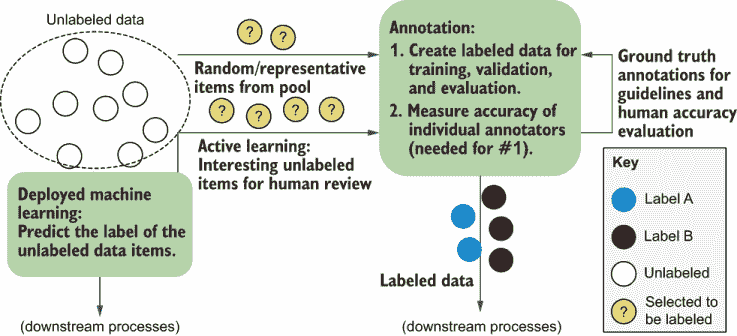

图 8.1 标注的信息流。除了根据我们当前的活动学习策略采样的数据外，我们还采样了一组随机或代表性的数据以及一些标注者已经看到的数据。采样随机/代表性数据使我们能够以使确定标注者在数据集间的可靠性以及他们是否是晋升为专家的候选人为易的方式计算标注者的准确性。在当前的活动学习批次中进行采样，使我们能够计算特定数据集的准确性。在标注过程中进行采样，找到对标注指南和专家裁决最有用的项目。

为了确保你的真实标签尽可能准确，你需要借鉴本章以及可能的后两章中的许多方法。你必须确信你的真实标签错误很少；否则，你会创建误导性的指南，并且不会有可靠的准确度指标，从而导致训练数据质量差。你不能走捷径。如果你的真实标签只是那些达成高度一致的项目，你很可能会过度采样最容易标注的项目，这会使你的准确度看起来比实际更好。

当你有一个可以用来评估每个标注员的真实标签数据集时，你可以调整你的标注项目以使其质量更高、效率更高。使用标注员间的一致性进行质量控制，在有少量但可靠的真实标签数据集的支持下，也会变得更加有效。正如第九章所示，当你知道他们的错误模式时，即使是最不准确的标注员也能提供可靠的信号。

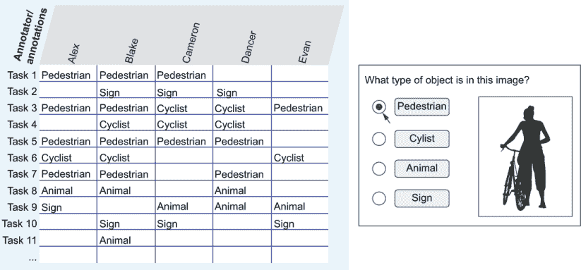

图 8.2 在本章的剩余部分以及第九章和第十章中，我们将使用这个示例数据。五位标注员——名为 Alex、Blake、Cameron、Dancer 和 Evan——根据图像中的对象标注了一张图片。我们将假设这张图片与之前章节中使用的图片类型相同，有四个标签：“动物”、“骑自行车的人”、“行人”和“标志”。在这个例子中，Alex 看到了七张图片（任务 1、3、5、6、7、8 和 9）；将前三张标注为“行人”；将剩下的每张标注为“骑自行车的人”、“行人”、“动物”或“标志”。右边的图片显示了标注界面的可能外观。

在本章和第九章中，我们将使用图 8.2 中显示的示例数据。尽管你的数据集可能比图 8.2 中的 11 行包含更多的项目，但这 11 行足以让你学习可能实施的质量控制类型。在本章中，我们将使用图 8.2 中数据的正确答案的不同变体，但保持注释与图中的相同。对于本节，让我们假设我们为这些示例中的每一个都提供了真实标签。

你应该如何称呼标注员？

对于创建训练和评估数据的人，有许多术语，包括评分员、*编码员、裁决员、代理、评估员、编辑、裁判、标签员、先知、工人*和*Turker*（来自 Mechanical Turk 平台，有时用于其他软件）。在工业界，标注员可能以他们的职位名称，如*分析师*，他们使用的技能，如*语言学家*，或他们的就业状态，如*承包商*或*零工经济工作者*来称呼自己。在其他情况下，标注员被称为*主题专家*，有时缩写为*专家*或缩写词*SME*（发音为“smee”）。

如果您正在寻找额外的阅读材料，请确保尝试不同的名称作为搜索词。您可能会找到关于*注解员间一致性*、*评分者间一致性*和*编码者间一致性*等类似论文。

本书使用“注解员”这个术语，因为它最不可能与其他角色混淆。如果您与注解数据的人合作，请使用您组织中该人员的正确头衔。本书还避免使用“训练”注解员（以消除与训练模型混淆）的说法，并使用诸如“指南”和“说明”之类的术语代替“培训材料”。再次提醒，请使用您组织中该过程的首选描述来教授注解员特定任务的说明。

### 8.1.1 注解员与真实数据的一致性

标签任务中与真实数据一致性的基本数学很简单：注解员正确评分的已知答案的百分比。图 8.3 给出了我们示例数据中每个注解员的假设准确度。

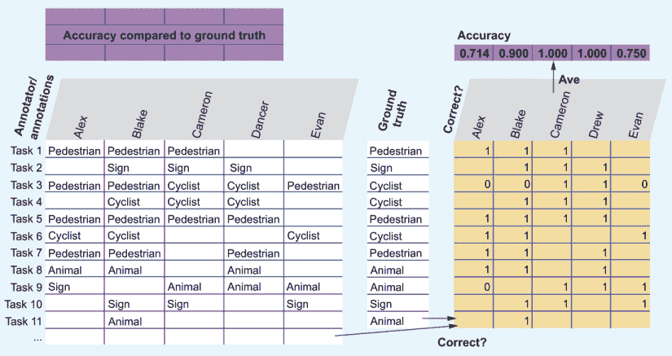

图 8.3 注解员准确度与真实数据对比的示例。假设真实数据列包含每个任务的已知答案（图像标签）。我们计算每个注解员的准确度为他们正确回答的比例。

通常，您希望根据随机猜测的基线调整如图 8.3 所示的结果。我们可以为我们随机机会标签计算三个基线。假设 75%的图像是“行人”，10%是“标志”，10%是“骑自行车的人”，5%是“动物”。这三个基线是

+   *随机*—注解员猜测四个标签中的一个。在我们的示例数据中，这个基线是 25%，因为我们有四个标签。

+   *最频繁的标签（众数标签）*—注解员知道“行人”是最频繁的标签，因此他们总是猜测这个标签。这个基线是 75%。

+   *数据频率*—注解员根据每个标签的频率进行猜测。他们 75%的时间猜测“行人”，10%的时间猜测“标志”，等等。这个基线可以计算为每个概率平方的和。

图 8.4 显示了计算过程。

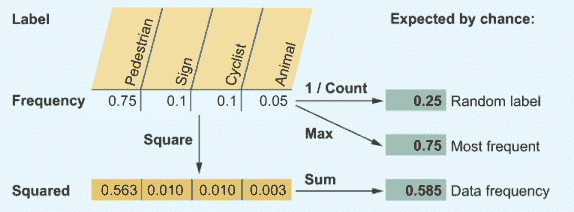

图 8.4 通过随机机会预期不同准确度的三种计算，显示根据我们使用的基线，预期准确度范围广泛。

调整后的准确度将注解员的分数进行标准化，使得随机猜测的基线变为 0。假设某人的总体准确度为 90%。他们的实际准确度，经过机会调整，如图 8.5 所示。

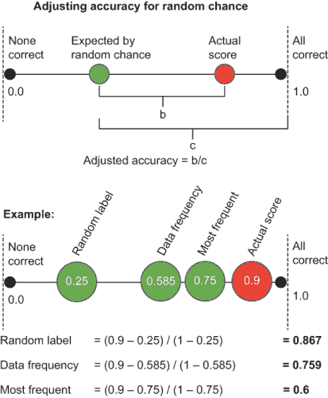

图 8.5 展示了在测试注释者与真实数据对比时，从随机猜测或机会调整的准确性中建立不同基线预期的方式。*顶部*：我们如何归一化结果。如果有人随机选择标签，他们有时会选中正确的标签，所以我们用随机准确性和 1 之间的距离来衡量准确性。*底部*：不同的调整准确性在我们的示例数据中的外观。请注意，总是猜测“行人”的 60%准确率的归一化分数与 90%的原始准确率分数或根据标签数量归一化时的 86.7%不同。这个例子突出了为什么正确的预期准确性基线如此重要。在某些情况下，这三个基线中的每一个都是更好的选择，因此了解所有三个都是很重要的。

如图 8.5 所示，我们有不同的方法来归一化注释计数。在统计学界最常用的方法是*数据频率*，这是一种以数据为中心的方式来思考预期行为。它总是在随机选择和最频繁之间，因此它具有作为安全中间选项的优良特性。

因为预期的基线变为零，任何小于零的结果都意味着该人猜测的结果比随机机会更差。通常，这个结果意味着注释者没有正确理解指示，或者以简单的方式欺骗系统，例如总是猜测一个最不频繁的响应。在任何这些情况下，将基线归一化到零为我们提供了一个简单的方法来设置任何任务的警报。无论任务是什么，调整随机机会后的负分都应该在你的注释过程中引发警报！

如果你熟悉关于注释质量控制的文献，你知道根据预期行为归一化的度量通常被称为*机会校正*或*机会调整*。在这本书的许多情况下，预期行为不是随机机会，例如当我们询问注释者他们期望其他注释者选择什么时（第九章）。对于这些情况，更一般的术语*预期*被使用，但对于客观标签任务，*预期*和*机会*意味着同一件事。

### 8.1.2 应该使用哪个基线来衡量预期的准确性？

对于预期的准确性三个基线——随机、数据频率和最频繁——计算所有三个度量将有助于你对数据的直观认识。用于归一化准确性的正确度量将具体取决于你的任务和标注数据的人的经验。

当一个人刚开始从事一项任务时，他们不会对哪个标签更频繁有直观的认识，因此他们更有可能接近随机标签。但过了一段时间后，他们会意识到其中一个标签比其他标签更频繁，并且在不确定时可能会感到安全地猜测那个标签。因此，第十一章完全致力于注释的用户界面。

我的实际建议是在标注员熟悉一项任务后再应用最严格的基线：最频繁的标签。您可以将任务的最初几分钟、几小时或几天视为标注员熟悉任务的预热期。当标注员对数据有强烈的直觉时，他们会考虑标签的相对频率。然而，如第 8.2.3 节所示，数据频率对于计算整个数据集层面的协议更为相关。因此，了解所有基线并在正确的时间应用它们是很重要的。

对数据标注进行高质量控制可能需要大量资源，并且应该纳入您的预算考虑。请参阅以下侧边栏，了解质量控制如何导致为项目聘请了不同的一组标注员。

考虑标注项目的总成本

*马修·霍尼巴尔的专家轶事*

与标注您数据的个人直接沟通是有帮助的，就像与您组织中的任何其他人一样。不可避免的是，您的一些指示在实际操作中可能不起作用，您需要与标注员紧密合作来完善它们。您也可能在生产开始后继续完善指示和添加标注。如果您不花时间考虑完善指示和丢弃错误标记的项目，很容易得到一个表面上看起来很便宜但实际上很昂贵的外包解决方案。

2009 年，我参与了悉尼大学和一家主要澳大利亚新闻出版商之间的联合项目，该项目需要命名实体识别、命名实体链接和事件链接。尽管当时学术界越来越多地使用众包工作者，但我们还是直接建立了一个小型标注员团队。从长远来看，这最终证明要便宜得多，尤其是在对于众包工作者难以应对的更复杂的“实体链接”和“事件链接”任务中，我们的标注员通过与我们的直接工作和沟通得到了帮助。

*马修·霍尼巴是 spaCy NLP 库的创建者和 Explosion 的联合创始人。自 2005 年以来，他一直在从事 NLP 研究*。

## 8.2 标注者间一致性

当数据科学家谈论他们的机器学习模型比人更准确时，他们通常意味着模型比普通人更准确。例如，语音识别技术现在在非技术性转录的常见口音中比普通英语说话者更准确。如果人类无法以这种准确度创建评估数据，我们如何评估这些语音识别技术的质量？

“群众的智慧”产生的数据比任何单个人类更准确。一个多世纪以来，人们一直在研究如何将多人的判断汇总成一个更准确的结果。在最早的例子中，有著名的研究表明，当多人猜测一头牛的重量时，所有猜测的平均值接近正确。这个结果并不意味着每个人的准确性都低于平均值：个人猜测牛的重量可能比平均值更准确，但平均猜测比大多数人更接近真实重量。

因此，当数据科学家吹嘘他们的模型比人类更准确时，他们通常意味着他们的模型比标注者之间的一致性更准确，这被称为*标注者间一致性*。模型准确性和标注者一致性是两个不同的数字，不应直接比较，因此请尽量避免犯这个常见错误。

然而，有可能创建比所有参与标注的个体更准确的训练数据，本章在介绍基础知识后，将在第 8.3 节回到这个话题。

### 8.2.1 标注者间一致性简介

标注者间一致性通常在-1 到 1 的范围内计算，其中 1 是完全一致，-1 是完全不一致，0 是随机标签。我们通过询问我们的协议比预期好多少来计算一致性，类似于我们之前提到的单个标注者准确度评分，但在此情况下是针对一致性。图 8.6 展示了示例。

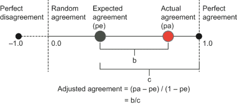

图 8.6 展示了如何计算一致性指标。一致性通常在-1 到 1 的范围内，其中 1 是完全一致，-1 是完全不一致，0 是随机分布。这种一致性结果被称为*实际一致性、调整后一致性*或*随机机会调整后的一致性*。

图 8.6 展示了如何计算考虑随机机会一致性的方法。这种调整类似于根据真实答案调整准确度，但在此情况下，它是比较标注者。

本书涵盖了不同类型的标注者间一致性，包括整个数据集层面的总体一致性、标注者之间的个体一致性、标签间的一致性以及基于每个任务的特定一致性。这些概念相对简单，我们将从图 8.7 中的简单朴素一致性算法开始介绍。这个算法非常简单，以至于你不应该使用它，但它理解本章及下一章中方程的有用起点。

图 8.7 以一种天真方式找到每个标注者的协议、每个任务的协议以及整个标注集的整体协议。我们以随机选择四个标签中的一个来计算预期一致性。我们在中间的大表中计算每个任务的协议。我们从协议表中推导出每个人的和每个任务的协议。我们通过结合预期和平均任务级协议来推导出整体协议。尽管你不应该用这种方法处理你的实际数据，因为它太简单了，但这个图对于突出概念是有用的。

图 8.7 展示了三种类型一致性的基本思想。尽管所有这些计算都是合理的，但它们在某种程度上有所不足。以下是图 8.7 的一些不足之处，突出了计算一致性中的复杂性：

+   总体预期一致性基于标签数量，但有些标签比其他标签更常见。如果第五个标签从未被选择，那么由于这个原因降低总体预期一致性似乎是不合适的。

+   个人一致性似乎不公平地惩罚了人们在同一任务上犯的错误。例如，Evan 总是同意多数投票的标签，但他的一致性得分是第二低的。

+   任务一致性得分似乎过于乐观，因为它们没有考虑到个别标注者的准确性。

+   实际一致性平均了任务一致性，但如果我们决定通过平均个人一致性来计算，它将会低得多。正确汇总个人一致性以产生更准确的总体观察实际一致性的方法是什么？

+   任务 11 只有一个响应，所以将其计算为 100%一致似乎是不正确的；对于这个响应来说，没有什么可以达成一致的地方。

+   我们没有跟踪标签的一致性。例如，“行人”是否比“标志”更容易混淆？

+   我们没有考虑总的标注数量。特别是在标注数量相对较少的情况下，可能会有数据规模的艺术品效应（尽管这对于典型的包含数千个项目的训练数据集来说不太相关）。

你可以在这个电子表格中尝试这个实现，电子表格的链接是[`mng.bz/ E2qj`](http://mng.bz/E2qj)。这个电子表格还包含本章中的一些其他方程式。

8.2.2 至 8.2.7 节专门讨论了处理这些问题的最佳方法。尽管数学计算比本书中之前看到的任何内容都要复杂，但请记住，它解决的是一个简单的问题：

*我们如何公平地计算标注者间的一致性来评估我们数据集、单个任务、单个标签或个别标注者的准确性*？

### 8.2.2 计算标注者间一致性的好处

你可以用标注者间一致性作为你人类在环机器学习策略的一部分，以多种方式使用：

+   *您数据集的可靠性*—标注者是否经常达成一致，以至于您可以依赖已经创建的标签？如果不是，您可能需要重新设计您的指示或整个任务。

+   *最不可靠的标注者*—是否有任何标注者与其他人太频繁地发生分歧？他们可能误解了任务，或者可能不具备继续参与的条件。无论如何，您可能想要忽略他们过去的标注，并可能获得新的判断。或者，一个不可靠的标注者实际上可能有一些有效但代表性不足的标注，尤其是在主观任务中（参见本列表后面的“测量自然变异”）。

+   *最可靠的标注者*—高度一致的标注者可能是您任务中最准确的人，因此识别这些人以获得潜在的奖励和晋升是有帮助的。

+   *标注者之间的协作*—是否有任何标注者几乎完美地达成一致？他们可能因为坐得很近而无意中共享笔记，在这种情况下，您需要从任何假设独立性的协议计算中移除这些响应。另一方面，这个结果可能是证据表明一个机器人正在复制一个人的工作，使得这个人错误地得到了两次报酬。无论根本原因是什么，了解两组答案实际上只是一组重复的答案是有帮助的。

+   *标注者随时间的一致性*—如果您在不同的时间给同一个人相同的任务，他们是否给出相同的结果？这个指标，被称为*标注者内部一致性*，可以证明标注者没有注意，您的任务有顺序效应，以及/或者任务本质上是主观的。此外，标注者可能随着看到更多数据而真正改变主意，这被称为*概念演变*。

+   *为指示创建示例*—您可以假设在大量标注者之间高度一致的项目是正确的，并让这些项目成为新标注者指南中的示例。因为您使用这种策略有两个风险——一些错误仍然会通过并传播，并且只有更容易的任务会通过更高的协议——因此您不应将其作为创建地面真实数据的唯一策略。

+   *评估机器学习问题的内在难度*—一般来说，如果任务对人类来说很难，那么对您的模型来说也会很难。这个信息对于适应新领域特别有帮助。如果您的数据历史上具有 90%的一致性，但来自新来源的数据只有 70%的一致性，这个结果告诉您，您的模型在来自那个新来源的数据上可能不太准确。

+   *测量数据集的准确性*—如果你知道每个注释者的个人可靠性以及有多少人注释了每个项目，你可以计算出任何给定标签被错误注释的概率。从这个结果中，你可以计算出数据的整体准确性。考虑个人注释者的准确性，与简单的注释者间一致性相比，为你提供了一个更好的模型准确性的上限。模型对训练数据中的噪声可能更敏感或不太敏感，所以这个限制并不是一个严格的限制。这个限制*是*一个严格的限制，即你如何精确地测量模型准确性的上限，因为你不能将模型的准确性计算得高于数据集的准确性。

+   *测量自然变异*—对于某些数据集，缺乏一致性是一件好事，因为它可以表明多个注释解释是有效的。如果你有一个主观的任务，你可能想确保你有多样化的注释者选择，这样就不会无意中导致数据存在偏见。

+   *将困难任务提升到专家级别*—这个例子在第七章中已经讨论过，我们再次在第 8.5 节中回到它。低资格的工人之间的低一致性可能意味着该任务应该自动路由给专家进行审查。

8.2 节剩余部分包含了计算数据集中一致性的最佳当前方法。

不要仅使用一致性作为准确性的唯一衡量标准

你不应该仅依靠注释者间一致性来找到数据的正确标签；始终将注释者间一致性与真实数据结合使用。许多数据科学家反对这种做法，因为这意味着失去了训练数据。例如，如果 5%的标记数据被留出用于质量控制，那么他们用于模型训练的数据就少了 5%。虽然没有人喜欢训练数据减少，但在现实世界中，你可能会有相反的效果：如果你仅依靠注释者间一致性来获取标签，你将使用超过 5%更多的人工判断，因为你可以使用真实数据来更好地校准你的一致性。

仅查看一致性也可能隐藏错误注释达成一致的情况。没有真实数据，你将无法对这些错误进行校准。

另一方面，一致性允许你将准确度分析扩展到仅使用真实数据无法实现的范围之外，因此当你将一致性与真实数据结合使用时，你会获得最大的好处。例如，你可以使用真实数据计算每个注释者的准确性，然后使用这个准确性作为你在聚合多个注释进行任务时的置信度。本章和第九章展示了根据你解决的问题，结合一致性和真实数据的许多示例，但它们是独立引入的，以解释孤立的概念。

### 8.2.3 使用 Krippendorff 的 alpha 进行数据集级别的一致性

*Krippendorff 的* *alpha* 是一种旨在回答简单问题的方法：我的数据集中整体一致性如何？为了考虑到并非每个项目都会被每个注释者标注的事实，Krippendorff 的 alpha 在用于诸如测量调查和人口普查数据中的一致性水平等任务时，对现有的社会科学中流行的协议算法进行了重大改进。

Krippendorff 的 alpha 简单解释是它是一个 [–1,1] 范围，可以如下阅读：

+   *>0.8*—这个范围是可靠的。如果您将 Krippendorff 的 alpha 应用于您的数据，并且得到的结果为 0.8 或更高，您具有高度的一致性，并且可以用来训练您模型的可靠数据集。

+   *0.67–0.8*—这个范围可靠性低。可能有些标签非常一致，而有些则不是。

+   *0–0.67*—小于 0.67 时，您的数据集被认为可靠性低。您的任务设计或注释者可能存在问题。

+   *0*—随机分布。

+   *–1*—完全不一致。

Krippendorff 的 alpha 还有一个很好的特性，它可以用于分类、有序、层次和连续数据。在实践中，大多数时候您可以使用 Krippendorff 的 alpha 而不必了解算法的工作原理，并根据 0.8 和 0.67 阈值来解释输出。但是，为了理解底层发生的事情以及何时可能不合适，了解数学直觉是个好主意。如果您第一次没有完全理解所有步骤，请不要担心。当我重新推导这本书中的所有方程时，推导 Krippendorff 的 alpha 比任何主动学习或机器学习算法都花的时间更长。

Krippendorff 的 alpha 旨在计算与本章前面图 8.7 中的简单示例相同的指标：我们的实际一致性相对于预期一致性如何？我们将从一个适用于互斥标签的 Krippendorff 的 alpha 的部分实现开始，然后转向更通用的版本。

Krippendorff 的 alpha 的预期一致性是数据频率：对每个标签进行标注任务时每个标签频率的平方和。Krippendorff 的 alpha 的实际一致性来自每个注释与同一任务的其他注释的平均一致程度。Krippendorff 的 alpha 对平均值，即 epsilon，进行轻微调整，以考虑到有限注释数量导致的精度损失。

Krippendorff 的 alpha 是图 8.6 中预期一致性和实际一致性的调整协议。我们可以通过图 8.8 中的简化表示看到我们的示例数据中的 Krippendorff 的 alpha。

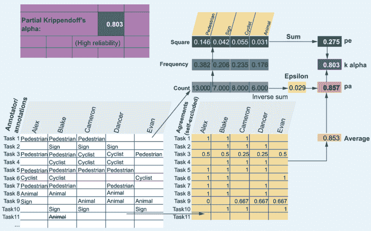

图 8.8 展示了简化的 Krippendorff 的 alpha，为我们的示例数据提供了注释者可靠性的总体得分。预期的协议是每个标签频率的平方和。实际的协议是每个注释与其他注释对该任务的协议的平均量，并对计算中的精度进行了小的调整（epsilon）。

图 8.8 中的协议比图 8.7 中的“天真协议”低得多（0.803 与 0.921 相比），这表明我们在计算协议时需要小心，并且我们假设的小变化可能会导致质量控制指标的大幅差异。

图 8.8 是 Krippendorff 的 alpha 的部分实现。完整方程考虑了您可能对某些类型的差异进行更严重加权的可能性。Krippendorff 的 alpha 的完整实现如图 8.9 所示。

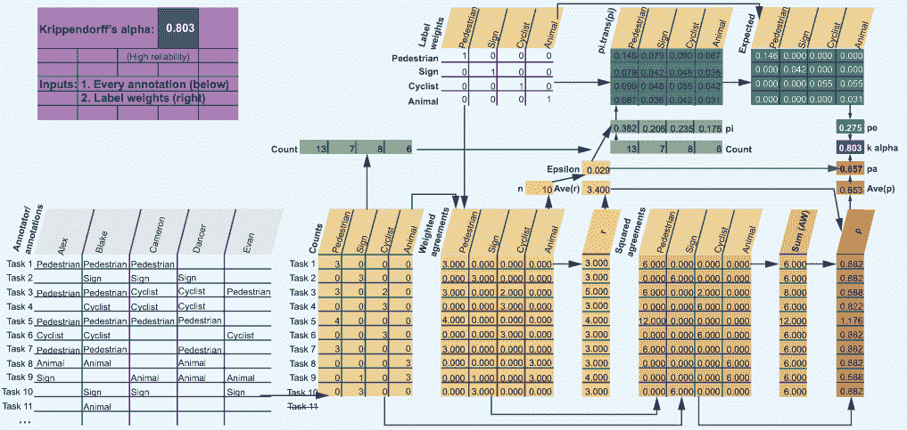

图 8.9 展示了 Krippendorff 的 alpha，计算数据集中协议的整体水平，以确定它是否足够可靠用于训练数据。输入是白色区域：注释（左下角）和标签权重（右上角）。因为我们有互斥的标签，所以这个例子中每个标签只与自身加权。如果我们有层次结构、顺序或其他类型的数据，我们将输入不同的值作为标签权重。计算的上行包含随机机会的预期协议，计算的下行计算数据中的实际协议。这两行用于计算数据集的预期协议（pe）和实际协议（pa），从而计算出调整后的总体协议 alpha。

虽然图 8.9 显示了某些复杂的过程，但与图 8.8 的主要区别在于 Krippendorff 的 alpha 如何纳入标签权重。标签权重组件允许 Krippendorff 的 alpha 适应不同类型的问题，例如连续、顺序或其他任务，在这些任务中，多个标签可以应用于一个项目。

更多细节，请参阅第 8.2.1 节中介绍的电子表格中的实现。您可以看到，预期的协议和实际的协议需要一些矩阵运算来将权重纳入完整的 Krippendorff 的 alpha 实现中，与部分实现相比。此外，epsilon 调整考虑了权重，并且不仅仅是总计数量的倒数。简单实现和完整实现背后的基本思想是相同的：我们正在根据实际协议和预期协议计算一个调整后的协议。如果您记住这个概念，并理解到 Krippendorff 的 alpha 完整实现中的所有额外步骤都源于对不同类型注释的灵活性需求，那么您对如何应用它就有了正确的理解。

我什么时候需要计算 Krippendorff 的 alpha 的置信区间？

本书省略了 Krippendorff 的 alpha 在计算置信区间方面的扩展，因为置信区间预计的是 Krippendorff 的 alpha 设计的小型调查类型。大多数时候，你不需要对训练数据进行置信区间，因为置信区间的最大因素将是总的判断数量。因为你的训练数据可能包含数千甚至数百万个示例，置信区间将会非常小。

只有当你打算在一个小型数据集或数据集的小子集上使用 Krippendorff 的 alpha 时，你才需要担心置信区间。请注意，如果你因为前沿技术、轻度监督、少样本或数据增强技术而使用少量数据，你需要更好的统计知识来帮助确保你较小数据集的重要性。你可能认为数据越少，所需的支持基础设施就越容易构建，但事实正好相反。

即使在这些边缘情况下，我也不建议仅依赖置信区间。如果你只有少量训练示例，你应该包括其他类型的质量控制，包括专家的审查任务和包含已知的真实示例。否则，你的置信区间将会非常宽泛，这将使得基于数据的模型难以被信任。

Krippendorff 的 alpha 的替代方案

你可能在文献中遇到 Krippendorff 的 alpha 的替代方案，如 Cohen 的 kappa 和 Fleiss 的 kappa。Krippendorff 的 alpha 通常被视为那些早期指标的改进。差异在于细节，例如是否应该对所有的错误进行同等惩罚，正确计算预期先验的方法，处理缺失值的方式，以及如何汇总整体一致性（按注释汇总，如 Krippendorff 的 alpha，或按任务/标注者汇总，如 Cohen 的 kappa）。第 8.6 节中的附加阅读有一些例子。

你也可能遇到以不一致性而非一致性来表示的 Krippendorff 的 alpha，这在 Krippendorff 自己的出版物中也有体现。这些技术在数学上是等价的，并产生相同的 alpha 值。在其他指标中，一致性比不一致性更广泛地被使用，并且可以说是更直观的，这就是为什么这里使用一致性的原因。假设不一致性是一致性的补数：D = (1 – P)。当你查看文献和图书馆时，请记住这个假设，其中可能包含使用不一致性计算出的 Krippendorff 的 alpha 版本。

### 8.2.4 计算 Krippendorff 的 alpha 超出标签

这里有一些例子说明 Krippendorff 的 alpha 可以用于比互斥标签任务更复杂的任务。图 8.10 展示了我们如何改变 Krippendorff 的 alpha 方程中的标签权重来捕捉序数和旋转数据。

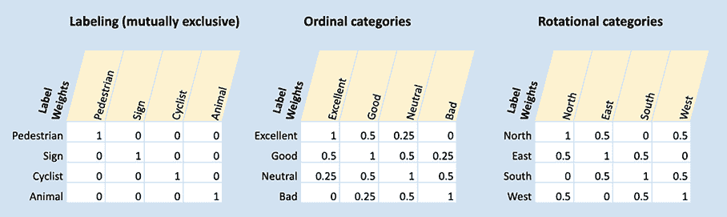

图 8.10 三种类型分类任务的示例以及如何使用 Krippendorff 的 alpha 的标签权重来完成这些任务。第一个例子重复了图 8.9 中的标签权重，展示了本章一直用作例子的互斥标签任务。第二个例子显示了一个从“差”到“优秀”的序量尺度，我们希望对相邻标注如“好”和“优秀”给予部分信用。第三个例子显示了旋转类别——在这种情况下，是罗盘指针。在这种情况下，我们对偏离 90 度的任何事物给予部分分数，如“北”和“西”，但对偏离 180 度的任何事物给予零分，如“北”和“南”。

本章的其余部分将坚持使用互斥标签。我们将在第九章中介绍其他类型的机器学习问题。

当 Krippendorff 的 alpha 用于训练数据时，它有一些不足之处，因为它最初是为了使用案例如学校随机将考试卷分发给多个评分者（标注者）而推导出来的。它没有捕捉到一些标注者将根据他们所看到的不同情况而有不同的预期一致性的事实。在创建训练数据时，我们有很好的理由非随机地分配标注，例如给额外的人提供困难示例以进行裁决。第 8.2.5 节至第 8.2.7 节在计算标注者、标签和任务级别的一致性方面与 Krippendorff 的 alpha 有显著的不同。

### 8.2.5 单个标注者一致性

在单个标注者级别上的一致性可以从多个方面有用。一方面，它可以告诉你每个标注者的可靠性如何。你可以在宏观层面上计算一致性，计算标注者在其所做每个响应中的可靠性，或者你可能想看看他们是否对某些标签或数据片段有更高或更低的一致性。这个结果可能会告诉你标注者更准确或更不准确，或者可能突出一系列有效的标注。

对于标注者之间的一致性，最简单的度量方法是计算每个标注者在给定任务中与大多数人达成一致的情况有多频繁。图 8.11 展示了示例。

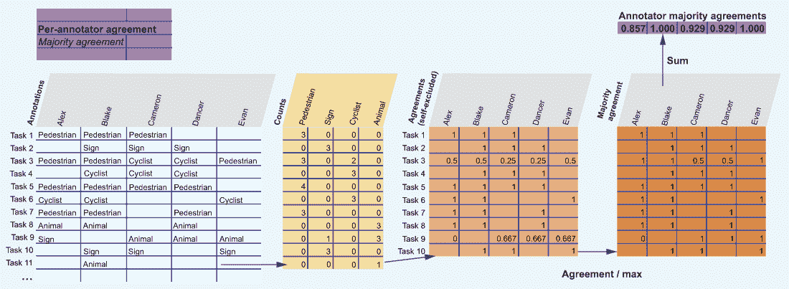

图 8.11 每个任务中每个标注者与最常见标注的一致性（多数一致性）。这个例子表明，两个标注者，Blake 和 Evan，总是与多数人达成一致。这是计算标注者之间一致性的最简单方法；当每个任务有大量标注者时，这种方法可能有效，但由于预算限制，很少用于创建训练数据。这种方法可以提供对数据的洞察，但不应该是确定数据质量的唯一手段。

如图 8.11 所示，多数同意度考虑的是一个人同意每个任务中最常标注的标签的次数。这个结果也可以计算为一个人同意多数的次数的分数，但按每个标注的同意度进行归一化时，它会更准确一些。在图 8.11 和本章中的其他示例数据中，Cameron 和 Dancer 同意任务 3 是“自行车手”，尽管大多数人认为任务 3 是“行人”。相比之下，Alex 是唯一一个认为任务 9 是“标志”的人。因此，在我们的多数同意度表（图 8.11）中，Cameron 和 Dancer 在任务 3 上得到 0.5 分，而 Alex 在任务 9 上得到 0 分。

多数同意度可以快速检查你的标注者是否看到了更容易或更难示例。在本章前面的图 8.6 中的简单同意度示例中，Evan 的同意度次低（0.836），但在图 8.11 中，他们的同意度与最高（1.0）相同。换句话说，Evan 与其他人的平均同意度较低，但总是与多数人意见一致。这个结果告诉你，Evan 看到了其他人整体同意度较低的任务。因此，一个好的同意度指标应该考虑到 Evan 看到了更难的任务这一事实。

预期同意度是图 8.11 中缺失的最大部分。图 8.12 展示了计算预期同意度的一种方法，它表明如果他们总是选择“行人”，Evan 的预期同意度最低。

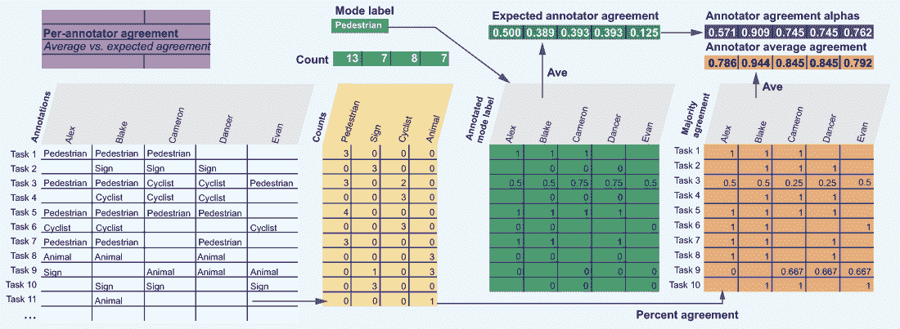

图 8.12 每个标注者的同意度是根据实际同意度（右下角）计算的，预期同意度是根据每个标注者计算的（中间顶部）。注意，Evan 的预期同意度仅为 0.15。换句话说，如果 Evan 每次都猜测最常见的标签“行人”，他们将与大约 15%的其他标注在他们的任务上达成一致。相比之下，Alex 每次都可以猜测“行人”并得到大约 51%的同意度。这种方法考虑到了 Evan 看到了同意度较低的任务，这些任务可能更难。

在 8.12 图中，首先要注意的是我们正在使用最频繁的标签（众数标签）来计算我们的基线。回想一下，Krippendorff 的 alpha 在数据中使用相同数量的标签，就像它们是随机分配的一样。在我们的例子中，有人可能会随机分配 13 个“行人”标签，7 个“标志”标签等等。虽然这个例子是（统计上的）期望分布的定义，但一个人类标注者在标注时不太可能对每个标签的概率有意识。更可能的情况是，标注者会对最频繁的标签（众数标签）有一个直觉。这种结果在数据标注中很常见。通常，一个标签明显比其他所有标签更频繁，感觉像是一个安全的默认选项。有方法可以减轻由于人们感到有压力在不确定时标注默认选项而导致的不良标签问题，我们将在第九章中介绍。在这里，我们将这个最常见的标签视为我们的期望基线。

8.12 图与标准 Krippendorff 的 alpha 计算的第二点不同在于，8.12 图计算的是每个任务的协议，而 Krippendorff 的 alpha 计算的是每个标注的协议。如果你每个任务都有相同数量的标注，那么这些数字将是相同的。在我们的示例数据中，任务 3 有五个标注，因此在 Krippendorff 的 alpha 中它实际上比其他任务有更大的权重。然而，在计算个别协议时，Krippendorff 的 alpha 给任务 3 与其他任务相同的权重。

由于许多原因，你不想为数据标注的不同任务赋予不同的权重。例如，你可能故意将相同的任务分配给更多的标注者以解决分歧，或者你可能根据标签或外部信息将较容易的任务分配给较少的人。在这两种情况下，Krippendorff 的 alpha 都会偏向于更困难的任务，从而给出一个人为的低分。如果你确实在任务之间有标注者的随机分布，并且某些任务最终有更多的标注是随机的，那么标准的 Krippendorff 的 alpha 方法是可以的。

不要通过迭代去除与最低一致性的标注者来 p-hack Krippendorff 的 alpha

通常，你希望忽略你最不准确的标注者的标注。通过去除表现最差的标注者并将他们的任务分配给其他标注者，你可以提高训练数据的整体协议和准确性。

然而，如果你迭代地去除表现最差的，直到你的数据集达到神奇的 k-alpha=0.8 数字，这表明高度一致，那么你将犯一个错误。将显著性阈值的本身作为去除人员的阈值，这就是 Regina Nuzzo 在 2014 年《自然》杂志上所说的 p-hacking([`mng.bz/8NZP`](http://mng.bz/8NZP))。

而不是依赖 Krippendorff 的 alpha，你应该根据以下标准之一，按照优先顺序去除人员：

+   *使用与 Krippendorff 的 alpha 系数不同的标准来决定谁是好或坏的绩效者*。理想情况下，你应该使用标注者与已知真实答案的一致性。然后你可以使用这个标准来移除最差的绩效者。你可以在已知答案上设置一个准确性的阈值水平，或者决定移除一定比例的标注者（例如最差的 5%）。你应该在没有考虑 Krippendorff 的 alpha 系数的情况下做出关于阈值或百分比的决策。

+   *移除那些在表现方面统计上异常低下的低绩效者*。如果你对自己的数学技能有信心，可以使用这个技术。例如，如果你能计算出所有的一致性评分都落在正态分布中，你可以移除任何一致性评分低于平均一致性三个标准差的标注者。如果你不自信能够识别分布类型和适当的异常值指标，坚持第一个选项，并在必要时创建有已知答案的额外问题。

+   *事先决定你预期的低绩效标注者的百分比，并只移除那些标注者*。如果你通常发现 5%的表现不佳，移除表现最差的 5%，但如果你还没有达到目标协议，不要继续这样做。这种方法可能包含一点偏见，因为你仍在使用 Krippendorff 的 alpha 系数来计算最低的 5%。然而，这种偏见可能很小，在任何情况下，如果你可以使用前两种方法，你不应该使用这种方法。

如果你用 p-hack Krippendorff 的 alpha 系数，可能会得到糟糕的指示或不可能完成的任务，但你永远不会学到那个结果。你可能会最终只留下那些碰巧坐在一起并共享笔记的标注者。

如果你已经确定一个标注者不够可靠，不足以信任，你应该从你的协议计算中移除该标注者的判断。图 8.13 展示了我们的示例数据，假设我们移除了第一个人。

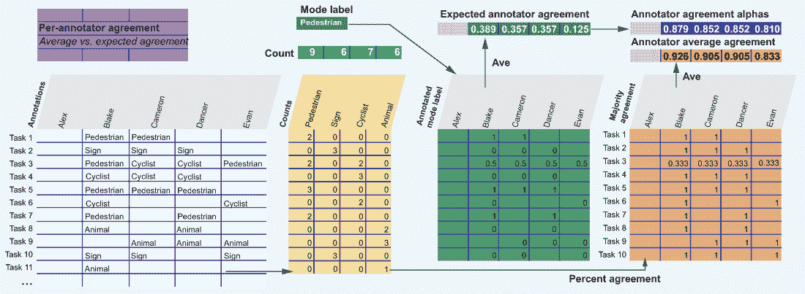

图 8.13 在移除第一个标注者后重新计算我们的标注者的一致性。注意，与图 8.12 相比，四个评分中的三个有所上升，但 Blake 的一致性略有下降，Evan 从第二高的一致性降至最低。

如图 8.13 所示，与图 8.12 相比，当你移除最不准确的人时，你通常期望整体一致性上升，但某些个别一致性分数可能仍然会下降（如 Blake 的情况），排名也可能发生很大变化，如 Evan 的情况。当我们计算图 8.11 中的多数一致性时，Evan 具有最高的共识，但在图 8.13 中移除 Alex 后计算机会调整的共识时，他具有最低的共识。这个图是为什么你需要小心使用一致性作为计算准确性的唯一方式的一个很好的例子：你的选择可以为个人产生不同的结果。

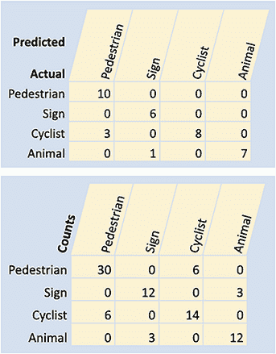

图 8.14 注释混淆矩阵：与我们示例数据中的真实数据（顶部）相比，以及与每个成对的一致或不一致（底部）相比

### 8.2.6 每标签和每人口统计一致性

理想情况下，你有一些数据集的真实标签，这样你就可以使用这些标签在混淆矩阵中绘制错误。这个混淆矩阵与用于机器学习模型的混淆矩阵相同，只是它用人类错误模式代替了模型错误。

你也可以使用混淆矩阵来表示一致性，绘制哪些注释与其他注释一起发生。图 8.14 显示了我们的示例数据中的矩阵。

这种混淆矩阵的第二种类型不会告诉你错误是什么——只会告诉你一致或不一致发生在哪里。使用任何一种矩阵，你都可以看到在你的注释中最大的成对混淆发生在哪里，这些信息应该有助于你改进对注释者的指令，以及指出哪些标签可能对你的模型预测最困难。

### 8.2.7 使用一致性扩展现实世界多样性中的准确性

当你想跟踪大量细粒度的人口统计时，使用一致性作为准确性的扩展特别有用。如果你想跟踪人口统计的交集，你可能会有太多的人口统计类别组合，以至于你无法收集足够多的真实数据。

考虑这样一个例子，我们怀疑夜间拍摄的照片比白天拍摄的照片更难注释。现在假设你还想跟踪 1,000 个地点的注释准确性。对于这 24,000 个时间/地点组合中的每一个，你不太可能都有大量的真实标签，因为创建如此多的真实数据会非常昂贵。

因此，查看每个 24,000 个时间/地点组合的一致性，是你了解每个人口统计交叉点难度的最佳窗口。一致性不一定总是与准确性完美相关，但这种方法可以揭示一些高度一致的区域，你可以对这些区域进行审查，并可能针对这些区域收集更多的真实数据。

## 8.3 聚合多个注释以创建训练数据

对于许多标注项目来说，任务级别的置信度是最重要的质量控制指标，因为它允许我们聚合（可能存在冲突的）每位标注者的标注，并创建将成为训练和评估数据的标签。

因此，了解如何组合多个标注以创建将成为实际标签的单个标签非常重要。在任务中聚合多个标注建立在本章中看到的其他类型的质量控制指标之上：我们希望在计算给定任务的总体一致性时考虑每位标注者的置信度，并且理想情况下，我们希望知道这个特定的任务是否本质上更容易或更难。

### 8.3.1 当所有人都同意时聚合标注

可以最容易地用出错概率而不是正确概率来考虑一致性。假设我们有三位标注者，他们每个人的准确率都是 90%。任何一位标注者犯错的概率是 10%。第二位标注者在同一任务上犯错的概率也是 10%，所以结合起来，两个人在同一项上犯错的概率是 1%（0.1 × 0.1 = 0.01）。对于三位标注者来说，这个概率变成了 0.1%（0.1 × 0.1 × 0.1）。换句话说，出错的可能性是千分之一，正确的可能性是 0.999。如果三位标注者的准确率都是 90%，并且他们都同意，我们可以有 99.9%的信心认为标签是正确的。让第*i*位标注者的准确率为*a*[i]，那么标签正确的整体置信度是

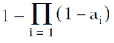

不幸的是，这种方法存在局限性，因为它假设错误是独立的。如果第一个标注者犯了一个错误，第二个标注者是否仍然只有 10%的出错概率，或者错误倾向于聚集或发散？

很容易想象出错误模式非随机性的场景。最明显的是，有些任务比其他任务更难。如果 10%的所有任务会导致人们选择错误的标签，那么可能就是所有三位标注者都犯错的那个任务。如果你有一个具有大量标签的任务，这个问题就不太常见，因为人们不太可能选择相同的错误标签。你通常希望将任务减少到尽可能少的标注，以提高效率，因此在准确性和成本之间有一个权衡。

地面真实数据允许你计算以下内容：对于每个错误的标注，有多少百分比的任务标注也是错误的？让我们通过一个例子来分析。假设在我们示例数据中，每个项目的实际标签是本章 8.3 节中较早展示的图 8.3 所示的标签。以下表格显示了两个任务，3 和 9，其中错误用粗体表示：

| 任务 3 | **行人** | **行人** | 骑行者 | 骑行者 | **行人** |
| --- | --- | --- | --- | --- | --- |
| 任务 9 | **标志** |  | 动物 | 动物 | 动物 |

在任务 3 中，三个错误的“行人”标注都与另外两个“行人”标注一致，为我们提供了六个关于错误标签的总共识。注意这个数字来自 Krippendorff 的 alpha 中的列 sum(AW)。在任务 9 中，“符号”错误是唯一的，因此没有达成共识的错误。对于正确答案，我们在任务 3 中有两个共识（两个“骑自行车的人”标注相互一致）和三个“动物”标注中的每一个都相互一致。因此，当标注员正确时，他们之间达成共识的情况总共有八种，当标注员错误时，他们之间达成共识的情况有六种。为了计算错误标注达成共识的频率，我们计算

错误的相关性 = 6 / (8 + 6) = 0.429

因此，尽管我们的整体错误率是 10%，但标注错误同时发生的可能性是 42.9%——比四倍还高！在第一个错误发生后，我们应该假设错误以这种速率同时发生。当三位标注员达成一致时，我们对标签的整体信心将是

1 – (0.1 × 0.429 × 0.429) = 0.982

因此，我们不是有 99.9%的信心，而是在三位标注员达成一致时，我们有 98.2%的信心，从每 1,000 个项目中的一个错误降低到大约每 55 个项目中的一个错误。

相反的情况也可能发生，其中错误模式会发散。假设三位标注员各自仍然有 90%的准确率，但他们犯的错误不同。一位标注员在识别“符号”时犯的错误最多，而另一位标注员可能在识别“动物”时犯的错误最多。他们可能在不同的图像上犯错误，因此错误同时发生的概率是 2%：

1 – (0.1 × 0.02 × 0.02) = 0.99996

在这种情况下，如果你的标注员具有互补的技能，你可以有 99.996%的信心认为标注员之间的共识意味着你的标注是正确的，因此错误每 25,000 个项目中发生一次。

### 8.3.2 多样化的标注员和低共识的数学案例

标注员之间错误模式存在很大差异，正如第 8.3.1 节中的例子所示。我们可以通过这个例子来扩展数学证明，即拥有多样化的标注员将导致更准确的数据。

在每个标注的基础上，如果整体错误率相同，那么准确率最高的数据将具有最低的一致性，因为错误分散并创造了更多不一致的机会。因此，这个条件具有最低的 Krippendorff 的 alpha 分数，显示了为什么我们不能仅仅依赖 Krippendorff 的 alpha 分数，因为它可能不公平地惩罚多样性。你可以在我们的示例数据中看到这个结果，Krippendorff 的 alpha 分数为 0.803。然而，如果我们分散不一致，使得每个任务中不超过一个不一致，那么我们得到的 Krippendorff 的 alpha 分数为 0.685。所以尽管我们的数据每个标签的频率相同，而且大多数数据更加可靠，但我们的数据集看起来不那么可靠。

容易想象出一些意见一致聚集的场景：有些例子比其他例子更难，或者标注者有主观但相似的判断。也容易想象出意见不一致的场景：标注者多样化，为数据带来不同但合法的视角。

然而，很难想象出标注者在完全独立地犯错误的真实世界场景（除了可能因为疲劳之外）。然而，几乎所有的协议指标都做出了独立性的假设，这就是为什么它们应该谨慎使用。正如本节和第 8.3.1 节所示，我们的真实数据允许我们对给定数据集进行校准。第九章的高级方法更详细地介绍了数据驱动的协议指标。

### 8.3.3 当标注者意见不一致时的标注聚合

当标注者意见不一致时，你实际上是在将所有潜在标签的概率分布进行收敛。让我们扩展任务 3 的例子，并假设平均每个人准确率为 90%（图 8.15）。

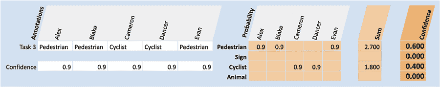

图 8.15 使用每个标注者的准确率作为每个任务的协议概率

在图 8.15 中，我们有三位标注者将这个任务中的图像标注为“行人”，两位标注为“骑行者”。当不是所有标注者意见一致时，计算信心的最简单方法是将信心视为加权投票。假设我们正在计算任务 3 的信心，并且对每个标注者的信心为 90%：

行人 = 3 * 0.9 = 2.7

骑行者 = 2 * 0.9 = 1.8

行人信心 = 2.7 / (2.7 + 1.8) = 0.6

骑行者信心 = 1.8 / (2.7 + 1.8) = 0.4

另一种思考这种计算的方式是，因为我们在这个例子中对每个人都同样有信心，五分之三的标注者意见一致，所以我们有 3/5 = 60%的信心。

这种方法的一个问题是它没有为其他标签留下任何置信度。回想一下，当我们达成完全一致时，仍然存在错误的可能性，因此正确的标签可能是没有人标注的标签。我们可以通过将置信度视为概率分布，并假设所有其他标签都分得相同的权重，来纳入非标注标签可能正确的可能性，如图 8.16 所示。

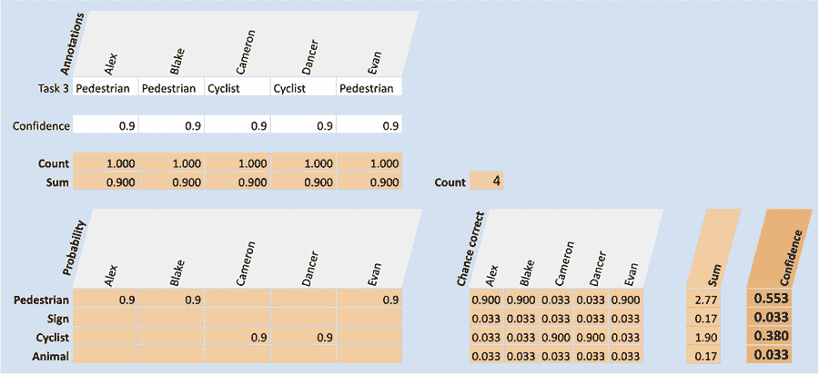

图 8.16 将所有注释员的置信度扩展到给予所有标签一定的权重。我们每个注释员的置信度为 0.9，因此我们将剩余的 0.1 分配给其他标签。

此示例给出了对置信度的保守估计，大量权重分配给了未见过的答案。注意，这种方法并不是在完全一致的情况下我们所使用的。有几种方法可以得到更精确的注释概率分布，其中大多数涉及回归或机器学习模型，因为它们不能像这里使用的简单启发式方法那样计算。第九章涵盖了这些高级方法。这个例子足以支撑本章剩余部分的内容。

### 8.3.4 注释员报告的置信度

注释员通常对自己的错误以及哪些任务本质上比其他任务更难有很好的直觉。作为标注过程的一部分，您可以询问注释员在某个特定任务上的置信度低于 100%时的情况。使用我们的数据的一个例子可能看起来像图 8.17。

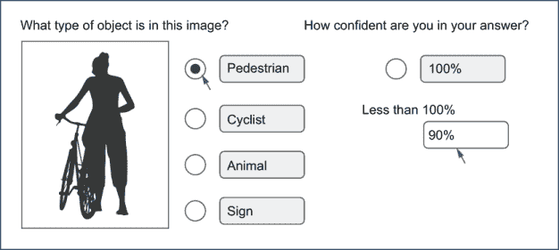

图 8.17 明确请求注释员的置信度是计算他们响应的准确性和/或一致性作为置信度的替代方案（或补充）。

您也可以请求整个概率分布，如图 8.18 所示。

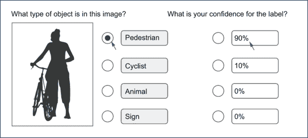

图 8.18 以请求注释员对每个标签的置信度作为替代方案，而不是将剩余的置信度按程序分配给其他标签

使用图 8.18 所示的方法，您可以把输入的金额视为该注释员对该标签的概率，或者当注释员的置信度低于 100%时，您可以选择忽略所有注释。这种类型的界面可以扩展为询问注释员其他注释员可能如何回答该问题，这有助于提高准确性和多样性，尤其是在主观任务中。这些扩展在第九章中有所介绍。

输入此类信息可以大大增加简单标注任务（如我们的示例）的标注时间，因此您必须权衡捕捉此类信息的成本与它所增加的价值。

### 8.3.5 决定信任哪些标签：注释不确定性

当你有一个给定任务的标签的概率分布时，你需要设置一个阈值，以确定何时不相信标签，并决定如果不相信标签时该做什么。当你不相信标签时，你有三个选项：

+   将任务分配给额外的标注员，并重新计算置信度，以查看置信度是否足够高。

+   将任务分配给专家标注员以裁决正确的标签（更多关于这个主题的内容在第 8.4 节中）。

+   将此项目从数据集中排除，以防止潜在的错误在模型中产生错误。

通常，你想要避免第三种情况，因为你正在浪费投入到该任务中的努力。你也在风险将偏差引入你的数据，因为更难的任务不太可能是随机的。然而，预算或人员限制可能阻止你将相同的任务分配给许多人。

在你能够决定是否相信你的标签之前，你需要弄清楚如何计算你对标签的整体置信度。假设我们的概率分布是从本章中我们一直在使用的例子中得到的：

行人 = 0.553

符号 = 0.033

骑行者 = 0.380

动物 = 0.033

我们有不同方法来计算我们的整体置信度不确定性：只看“行人”的 0.553 置信度，考虑下一个最自信的标签（“骑行者”），或者考虑所有潜在的标签。

如果你从第三章回忆起来，这个场景与主动学习中的不确定性采样相同。你有不同的方式来衡量你的标注一致性的不确定性，每种方法都对你关心的事情做出了不同的假设。使用 PyTorch，这个例子可以表示为一个张量：

prob = torch.tensor([0.533, 0.033, 0.380, 0.033])

重新复制第三章中的方程，我们可以计算不同的不确定性分数，如图 8.19 所示。

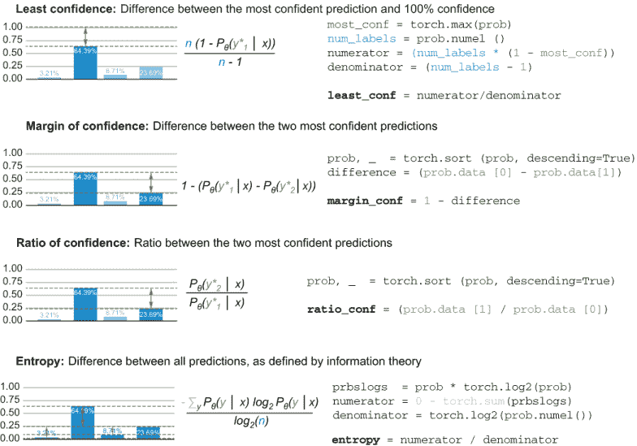

图 8.19 计算概率分布的不确定性分数的不同方法。这些方法与在主动学习中从模型的预测中计算不确定性（或置信度）的方法相同，此处用于计算标注者之间的一致性的不确定性。

对于我们的例子，我们得到这些不确定性分数（记住 1.0 是最不确定的）：

+   最小置信度 = 0.6227

+   置信度范围 = 0.8470

+   置信度比 = 0.7129

+   熵 = 0.6696

为了得到我们的整体置信度，而不是不确定性，我们从 1 中减去这些指标之一。

在你有了不确定性分数之后，你可以在你的真实数据上绘制不同分数的整体标注准确性。然后你可以使用这个图来计算给你数据带来所需准确性的准确度阈值（图 8.20）。

图 8.20 计算你可以信任的标注的阈值。在这个例子中，如果信任低于~0.65 的一致性不确定性的项目，那么在基准数据上计算出的期望标注准确率约为~0.96 将得以实现。

你可以为每个不确定性指标绘制如图 8.20 所示的曲线，作为决定哪个最适合你的数据的一种方法：哪种不确定性采样方法在正确的阈值下选择了最多的项目？

对于二元数据，不同不确定性分数的排序是相同的，所以如果你已经将任务分解为二元问题，你可以选择这些指标中的任何一个，而不用担心决定哪个最适合你的数据。

作为在图 8.20 中计算阈值的一种替代方法，你可以找到在数据不同阈值上训练时，你的机器学习模型准确性的最佳阈值。尝试不同的阈值以确定哪些项目可以忽略，然后观察每个阈值下模型的下游准确性。你的模型对训练数据中错误的敏感性可能会随着训练项目总数的增加而改变，因此你可能希望定期回顾过去的训练数据，并在每次添加新的训练数据时重新评估阈值。

## 8.4 专家审查质量控制

质量控制中最常见的方法之一是聘请领域专家对最重要的数据点进行标记。通常，专家比其他工作者更稀缺且/或更昂贵，因此你通常只给专家分配一些任务，通常有以下原因之一：

+   为了将部分项目标注为指南和质量控制的基准示例

+   为了裁决非专家标注者之间低一致性的示例

+   为了将部分项目标注为机器学习评估项目，其中人工标签的准确性更为重要

+   为了标注已知因外部原因而重要的项目。例如，如果你正在标注来自客户的数据，你可能希望专家标注者专注于为你创造最多收入的客户的示例

图 8.21 复制了第七章关于使用专家进行审查的图。它说明了前面列表中的前两个例子：为指南和质量控制创建基准示例，以及裁决具有低一致性的示例（混淆项）。

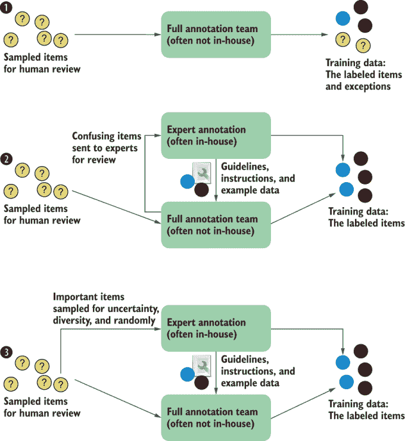

图 8.21 重复了第七章中关于专家内部标注的三个工作流程。底部两个工作流程展示了专家可能被纳入的不同方式：裁决标注者难以处理的项目和为标注者制定指南。这两个工作流程可能存在于同一个任务中，并且对于更复杂的工作流程可能有更多步骤。

在专家审查后汇总标注时，你可以将这位专家视为一个额外的标注员，或者你可以忽略之前的标注，并从专家（们）的置信度来计算置信度。如果你知道你的专家比大多数员工更可靠，请选择后者。

### 8.4.1 招聘和培训合格人员

正如我们在第七章中讨论的，内部拥有领域专家是很常见的，但你通常可以将这种专业知识外包出去。例如，一位已经从事自动驾驶车辆标注工作多年的标注员，其技能非常高超。有关为你的任务选择合适的劳动力，包括专家在内的更多信息，请参阅第七章。

### 8.4.2 培训人员成为专家

你可以采取数据驱动的方法来识别非专家标注员池中的专家。跟踪个别标注员的准确率，而不仅仅是整体数据集的准确率，将帮助你发现专家并将他们提升到该角色。

作为使一些标注员成为专家裁决者的垫脚石，你可能允许这些标注员审查但不裁决他人的工作。这种方法将使这些人获得关于人们常犯的常见错误的直觉。

你应该跟踪专家的人口统计数据，就像你跟踪标注员的人口统计数据一样，以确保多样性（除非跟踪违反了他们的隐私）。标注员的年龄、居住国家、教育水平、性别、语言流利度以及许多其他因素可能对任务很重要。如果你不跟踪标注员的人口统计数据，并使用一致性作为确定最佳标注员的一个指标，你可能会将标注员池中的偏见带入专家标注员池。因此，理想情况下，你应该从代表性数据中识别专家，而不是随机样本。

### 8.4.3 机器学习辅助的专家

对于中小企业来说，使用机器学习来增强日常任务是一种常见的用例。如果你还记得第一章的内容，人机交互的机器学习可以有两个不同的目标：通过人工输入使机器学习应用更加准确，以及通过机器学习的辅助来提高人工任务的效果。

搜索引擎是一个很好的例子。你可能是一位在某个科学领域具有专业知识的专家，正在寻找一篇特定的研究论文。在输入正确的搜索词后，搜索引擎会帮助你找到这篇论文，并通过你点击的内容来提高其准确性。

另一个常见的用例是电子发现。与搜索类似，但通常具有更复杂的界面，电子发现用于审计等场景，专家分析师试图在大量文本中找到某些信息。假设审计是为了检测欺诈的法律案件。欺诈检测的专家分析师可能会使用一个工具来找到该法律案件的相关文档和通信，该工具可能会根据分析师找到的内容进行调整，显示迄今为止已标记为相关的所有类似文档和通信。2020 年，电子发现是一个价值 1000 亿美元的行业。尽管您可能在机器学习领域没有听说过它，但它是最大的单一机器学习用例之一。

在这些情况下，您可以部署相同的质量控制措施：寻找专家之间的共识，采用高级专家的裁决，对照已知答案进行评估，等等。然而，专家很可能会使用支持他们日常任务的界面，而不是注释过程本身。界面可能没有针对收集训练数据进行优化，而且他们的工作流程可能会引入您无法控制的顺序效应。因此，第十一章中质量控制的用户界面在这些情况下将非常重要。

## 8.5 多步骤工作流程和审查任务

提高标签质量的最有效方法之一是将复杂任务分解成更小的子任务。将任务分解成更简单的子任务可以获得以下好处：

+   人们通常在更简单的任务上工作得更快、更准确。

+   对更简单的任务进行质量控制更容易。

+   您可以为不同的子任务聘请不同的劳动力。

主要缺点是管理更复杂工作流程的开销。您最终会有一大堆基于特定条件路由数据的自定义代码，而这些代码可能无法用于其他工作。我从未见过一个通过即插即用或下拉选项解决这些问题的标注平台：几乎总是需要编码或类似编码环境来完全实现复杂的条件组合。

图 8.22 展示了我们如何将对象标注任务分解成多个步骤，最后一个步骤是对前一个步骤的审查任务。

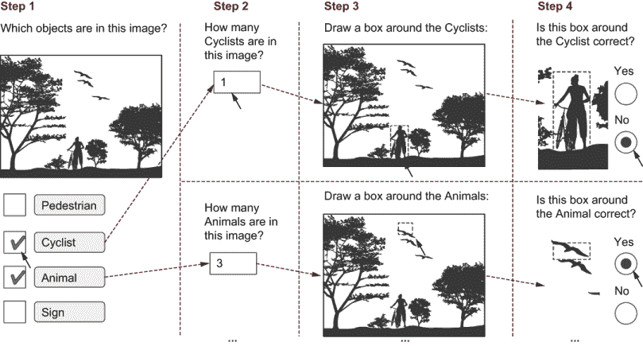

图 8.22 多步骤工作流程的示例。如果我们把步骤 2-4 分配给四种对象类型，我们总共有 13 个任务。步骤 1 中的个别响应和步骤 4 中的评估是二元任务。因此，尽管我们的目标是创建一个需要第九章高级质量控制指标的边界框，但我们可以使用本章的更简单的基于标签的质量控制指标。与一次捕获所有边界框的单个任务相比，我们可以期望更高的吞吐量和准确性，因为标注者一次专注于一个任务；如果我们按任务付费，预算会更简单，因为每个任务所需的时间变化会更小；如果只有一些标注者被信任执行最复杂的任务，任务分配给工作队伍也会更简单。

我见过的最复杂的流程大约有 40 个任务。这个流程是为自动驾驶汽车的计算机视觉任务设计的，除了语义分割外，对每种被跟踪的对象都有几个步骤。

简单的任务有一些用户体验权衡。通常，人们欣赏效率，但任务感觉更重复，这可能导致疲劳。此外，有些人，尤其是内部行业专家，可能会因为过去执行过的复杂任务被分解成简单任务而感到冒犯；他们可能将这种情况解释为暗示他们不够复杂，无法在一个界面中解决所有步骤。我们将在第十一章回到用户体验的主题。在这些情况下，你可以明确指出，工作流程的选择是由于获取良好的机器学习训练数据的限制，而不是因为标注者的专业知识。

## 8.6 进一步阅读

标注的质量控制是一个快速变化的领域，我们面临的问题中有许多尚未解决。一篇很好的高级概述是 Lora Aroyo 和 Chris Welty 所著的《真理是谎言：众包真理与人类标注的七个神话》（[`mng.bz/NYq7`](http://mng.bz/NYq7)）。

对于与一致性相关问题的近期概述，我推荐 Alessandro Checco、Kevin Roitero、Eddy Maddalena、Stefano Mizzaro 和 Gianluca Demartini 所著的《让我们同意不同意：修复众包的一致性度量》（[`mng.bz/DRqa`](http://mng.bz/DRqa)）。

自从 1970 年代开发以来，Klaus Krippendorff 已经在多篇文章和书籍中发表了 Krippendorff 的 alpha 系数。我推荐《计算 Krippendorff 的 Alpha 可靠性》，这是最近在 2011 年更新的，但请注意，它是以不一致性而不是一致性来计算的，正如这本书中所述（[`mng.bz/l1lB`](http://mng.bz/l1lB)）。

一篇关于退回到专家的工作流程的好论文，其中包含关于标注者如何有效地向专家解释他们的决策过程的建议，是 Joseph Chee Chang、Saleema Amershi 和 Ece Semiha Kamar 合著的“Revolt: Collaborative Crowdsourcing for Labeling Machine Learning Datasets”（[`mng.bz/BRqr`](http://mng.bz/BRqr)）。

想要了解标注者偏差的近期良好研究，请参阅 Mor Geva、Yoav Goldberg 和 Jonathan Berant 合著的“Are We Modeling the Task or the Annotator? An Investigation of Annotator Bias in Natural Language Understanding Datasets”（[`mng.bz/d4Kv`](http://mng.bz/d4Kv)）。

想要了解标注者多样性如何提高准确性但降低一致性的论文，请参阅 Leon Derczynski、Kalina Bontcheva 和 Ian Roberts 合著的“Broad Twitter Corpus: A Diverse Named Entity Recognition Resource”（[`mng.bz/ry4e`](http://mng.bz/ry4e)）。

虽然不是免费的，但由 Nancy Ide 和 James Pustejovsky 编辑的《Handbook of Linguistic Annotation》是一本涵盖了许多 NLP 任务且用例多样化的综合书籍。如果你不想购买这本书，可以考虑给你感兴趣的章节的作者发邮件；他们可能会分享他们的贡献。

## 摘要

+   真实示例是具有已知答案的任务。通过为数据集创建真实示例，你可以评估标注者的准确性，为这些标注者制定指南，并更好地校准其他质量控制技术。

+   你有多种方法在数据集中计算一致性，包括总体一致性、标注者间一致性、标签间一致性和任务级别的一致性。理解每种类型的一致性将帮助你计算训练和评估数据的准确性，并更好地管理你的标注者。

+   对于任何评估指标，你应该计算一个随机机会下预期发生的结果作为基线。这种方法允许你将你的准确性/一致性指标标准化为考虑随机机会调整的分数，这使得分数在不同任务之间更容易比较。

+   当使用真实数据和标注者间一致性时，你会得到最佳结果，因为真实数据的一致性允许你更好地校准你的一致性指标，并且一致性指标可以应用于比仅使用真实数据更实际的更多标注。

+   你可以将多个标注聚合起来，为每个任务创建一个单独的标签。这种方法允许你创建机器学习模型的训练数据，并计算每个标签正确的可能性。

+   专家审查的质量控制是解决标注者之间分歧的一种常见方法。由于专家通常很少见且/或昂贵，他们可以主要关注困难边缘案例和将成为其他标注者指南一部分的案例。

+   多步骤工作流程允许您将注释任务分解成一系列相互衔接的简单任务。这种方法可以更快、更准确地创建注释，并允许实施更易于操作的质量控制策略。
