# 9 高级数据标注和增强

本章涵盖

+   评估主观任务的标注质量

+   使用机器学习优化标注质量控制

+   将模型预测视为标注

+   将嵌入/上下文表示与标注相结合

+   使用基于搜索和基于规则的系统进行数据标注

+   使用轻度监督机器学习来引导模型

+   通过合成数据、数据创建和数据增强来扩展数据集

+   将标注信息纳入机器学习模型

对于许多任务，简单的质量控制指标是不够的。想象一下，你需要为“骑自行车的人”和“行人”这样的标签标注图像。有些图像，如某人推着自行车，本质上具有主观性，标注者不应因持有有效但少数派的观点而受到惩罚。一些标注者可能对不同的数据项更熟悉或不太熟悉，这取决于他们对图像中位置的熟悉程度以及他们自己是否是骑自行车的人。机器学习可以帮助估计哪个标注者在特定数据点上可能更准确或不太准确。机器学习还可以通过展示候选标注来自动化一些标注过程，以便更快地进行人工审查。如果某些上下文中骑自行车的人很少或没有，你可能需要合成新的数据项来填补空白。鉴于在整个数据集中完美的标注很少见，你可能在基于该数据构建模型之前删除一些项目，或者将不确定性纳入下游模型。你也可能想在不需要构建下游模型的情况下对数据集进行探索性数据分析。本章涵盖了处理所有这些高级问题的方法。

## 9.1 主观任务的标注质量

对于给定的任务，并不总是只有一个单一的正确标注。你可能有一个本质上具有主观性的任务；因此，你期望得到不同的响应。我们可以使用第八章的示例数据，如图 9.1 所示，这里展示了可能具有多种正确标注的项目。

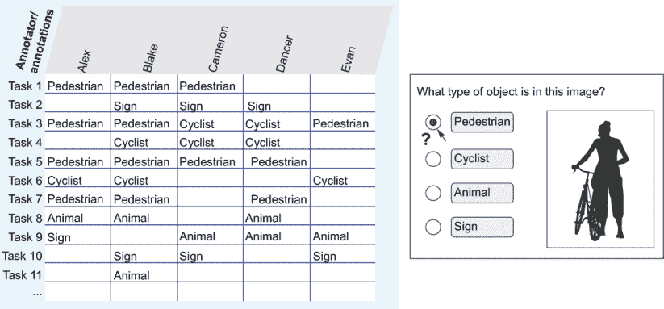

图 9.1 来自第八章的图像副本，展示了由于“行人”和“骑自行车的人”之间的歧义，任务 3 可能存在多种有效解释。

为什么一个标注者比另一个标注者更喜欢“行人”或“骑自行车的人”，可能有多个原因，包括

+   *实际上下文*—此人目前正在路上，或者此图像是视频中此人上下自行车的片段。

+   *隐含上下文*—此人看起来像是在上下自行车。

+   *社会影响下的变化*—在世界不同地区，地方法律可能对骑自行车的人和非骑自行车的人有不同的对待。不同的法律规定了自行车是否可以在人行道、道路上或专用自行车道上行驶，以及人们是否可以在这些地方推自行车而不是骑自行车。每个注释员所熟悉的法律或常见做法可能会影响他们的解释。

+   *个人经验*—我们可能预计自己是骑自行车者的人给出的答案与不是骑自行车者的人给出的答案不同。

+   *个人差异*—不考虑社会影响和个人经验，两个人可能对行人与骑自行车者之间的区别有不同的看法。

+   *语言变化*—骑自行车者可以严格解释为“任何骑自行车的人”，而不是“目前正在骑自行车的人”，特别是如果注释员不把英语作为第一语言（这在众包和外包注释员中很常见），并且将“骑自行车者”翻译成他们的第一语言（们）的定义与英语中的定义不同。

+   *顺序效应*—一个人可能会根据之前注释中看到的一种类型或另一种类型更多，而将此图像解释为骑自行车者或行人。

+   *希望符合正常性*—一个人可能自己认为这张照片是骑自行车者的，但也认为大多数人会称之为行人。他们可能会选择他们不相信的答案，以免之后受到惩罚。

+   *感知到的权力不平衡*—认为你收集这些数据是为了帮助骑自行车者安全的人可能会选择“骑自行车者”，因为他们认为你更喜欢这个答案。这种注释员和任务创建者之间的这种适应和权力不平衡对于具有明显负面答案的任务（如情感分析）可能很重要。

+   *真正的歧义*—照片可能是低分辨率或模糊不清的。

可能会有关于如何解释我们的示例图像的详细指南，这意味着有一个客观正确的答案。然而，并非所有数据集都会是这样，而且通常很难提前预见到所有边缘情况。因此，我们通常希望以最佳方式捕捉主观判断，以确保我们收集到所有可能的响应的全面多样性。

在本章的示例中，我们将假设存在一组正确答案。对于开放式任务，这个假设要困难得多，在这些情况下，专家审查尤为重要。参见以下专家轶事，了解在开放式任务中没有考虑主观性可能导致的问题。

在我们的示例数据集中，从我们的示例图像中我们知道“动物”和“标志”不是正确答案，因此我们希望有一种主观质量控制方法，能够将“行人”和“骑自行车者”识别为有效答案，而不是“动物”和“标志”。

标注偏差不是玩笑

*丽莎·布拉登-哈德尔的专家轶事*

数据科学家通常低估了收集高质量、高度主观数据所需的努力。在没有坚实的事实数据的情况下尝试标注数据时，人类对相关任务的同意并不容易，并且只有当目标、指南和质量控制措施得到充分沟通时，才能成功吸引人类标注员，这在跨语言和文化工作尤其重要。

我曾经接到一个来自美国个人助理公司扩展到韩国的请求，要求提供韩式敲门笑话。对话不是为了向产品经理解释为什么这不会奏效，以及为他们应用程序找到文化上合适的内 容；它揭示了许多假设的知识。即使在韩国语使用者中，创建和评估笑话的标注员也需要与目标客户来自相同的群体。这个案例是为什么减轻偏差的策略将触及您数据管道的每一个部分的一个例子，从指南到针对最合适的标注工作力的补偿策略。标注偏差不是玩笑！

*丽莎·布拉登-哈德是圣克拉拉大学全球社会效益研究所的导师。她是巴特勒山集团（Butler Hill Group）的创始人兼首席执行官，该集团是最大的、最成功的标注公司之一；在此之前，她曾担任 IBM 的程序员，并在普渡大学和纽约大学完成了计算机科学学位*。

### 9.1.1 请求标注员期望

当存在多个正确答案时，理解可能答案的最简单方法就是直接询问标注员，而最好的任务框架方式就是询问标注员他们认为其他标注员可能会如何回答。图 9.2 展示了示例。

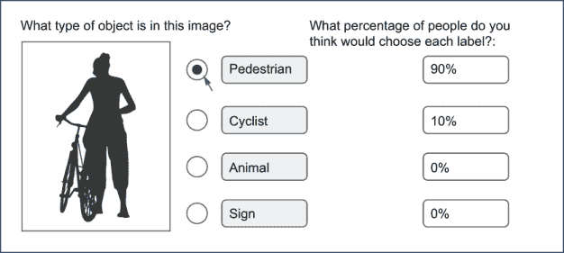

图 9.2 询问人们他们期望其他标注员会选择哪些答案。在这里，标注员表示他们认为图像是行人，90%的标注员会同意他们，但 10%的人会认为它是骑自行车的人。这种方法鼓励人们给出诚实的回答，并提供数据以帮助您决定何时多个回答是有效的。反过来，我们可以捕捉到比任何单个标注员提供的答案更多的正确答案的多样性。

界面与第八章中的示例类似，我们在其中要求标注员为每个标签给出自己的信心度，但在这里，我们是在询问他们关于其他标注员的问题。这种相对简单的变化有几个可取的特性：

+   任务设计明确允许人们给出他们认为不是多数答案的答案，这鼓励了多样化的回答，并减少了从众的压力。

+   您可以克服注释者多样性的一些限制。可能不可能让每个您关心的群体中的注释者查看每个单独的项目。使用这种方法，您只需要有对全面多样性反应有正确直觉的注释者，即使他们不共享每个解释。

+   由于您询问了其他注释者的看法，因此感知到的权力动态问题减少了，这使得报告负面反应更容易。当您认为权力动态或个人偏见正在影响反应时，这种策略可能是一个好策略。询问大多数人会如何反应，而不是询问注释者认为会如何。

+   您可以创建数据来区分有效答案和非有效答案。如果我们将每个人的实际答案评分设为 100%对于观察到的，并且知道他们将预期数字分配到多个标签中，他们将为他们预期的实际响应给出低于 100%的评分。因此，如果一个标签的实际评分超过了预期评分，我们可以相信这个标签，即使它在实际和预期的整体百分比中占比较低。

最后是贝叶斯推理的一个不太为人所知的原则：人们往往低估自己反应的概率。因此，在 9.4.1 节中，我们将探讨一个称为贝叶斯真理血清的流行方法。

### 9.1.2 评估主观任务的可行标签

为了开始分析可行的标签，我们可以计算在给定参与该任务的注释者数量的情况下，我们可能会看到每个标签在实际注释中的可能性。这些信息将帮助我们决定哪些标签是有效的。如果一个有效标签预计只会在任务的 10%注释中出现，但我们只有一两个注释者，我们就不期望看到该标签的实际注释。

我们通过计算预期概率的乘积来计算我们应该看到每个标签的概率。就像我们计算一致性时一样，我们使用预期注释百分比的补集。预期百分比的补集是计算没有人注释给定标签的概率，至少有一个人选择该注释的概率是补集。图 9.3 显示了我们的示例数据的计算。

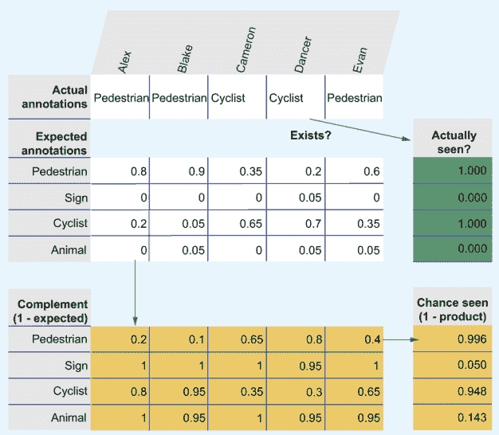

图 9.3 测试一个主观标签是否可行。在这里，五位注释者报告了他们对该标签的注释以及他们认为有多少人会选择每个标签。布莱克认为该标签是“行人”，90%的人会选择“行人”，5%的人会选择“骑自行车者”和“动物”。通过计算补集的乘积，我们可以得到在这么多注释下遇到这个标签的概率，我们可以将其与我们是否看到这个标签进行比较。

图 9.3 显示，对于这个任务，标注员选择了两个最可能的标签：“行人”和“骑自行车者”（与我们的示例数据相同），并且人们认为“标志”和“动物”将被 0%或 5%的人选择。您可以在图 9.3 中找到电子表格的副本，以及本章中所有其他示例的电子表格，链接为[`mng.bz/Vd4W`](http://mng.bz/Vd4W)。

首先，让我们想象一下，没有人选择“行人”作为实际标注，但人们在他们的预期得分中仍然给予“行人”一些权重。以下是图 9.3 中的计算结果：

预期：[0.8, 0.9, 0.35, 0.2, 0.6]

不期望：[0.2, 0.1, 0.65, 0.8, 0.4]

不期望的乘积 = 0.004

被看到的概率 = 1 – 0.004 = 0.996

根据这些预期得分，我们有 99.6%的把握认为我们应该至少看到一个实际的“行人”。因此，我们可以相当确信这个结果是标注员感知上的错误。当根据预期标注，一个标签有很高的概率被看到，但实际上没有被看到时，我们可以更有信心将其排除为可行的标签。

现在，让我们看看图 9.3 中一个不太预期的标签：“动物”。尽管三位标注员相信有些人会将图像标注为“动物”，但有 14.3%的可能性，五位标注员中的一人会选择“动物”。到目前为止还没有人选择“动物”的事实并不一定排除它。如果我们信任这些数字，我们不会期望看到有人选择“动物”，直到大约有 20 位标注员看到这个项目。我们可以采取几种方法来发现“动物”是否是一个可行的标签，每种方法都越来越复杂：

+   添加更多标注员，直到“动物”被看到，或者看到的概率如此之高，以至于我们可以排除“动物”作为一个可行的标签。

+   当这位专家标注员有经验排除个人偏见时，信任这位专家标注员来决定“动物”是否是一个可行的标签。

+   找到在真实数据中将项目正确标注为“动物”的标注员，当这种标注很少但正确时，将这项任务分配给他们（一种找到最佳非专家的程序化方法）。

虽然第一个选项最容易实现，但它只在你对标注员的多样性有信心时才有效。可能会有一些人会正确选择“动物”，但他们不在你的标注员中，所以这种情况从未出现。另一方面，选择“动物”可能是客观上不正确的，但这个例子很难，预计有 5%的人会答错。在这种情况下，你可能不想选择“动物”。

因此，当关于一个标签是否适用于主观任务存在歧义时，你将希望找到另一个标注员（可能是专家），可以信任他们理解可能的多样化响应。

### 9.1.3 信任标注员理解多样化的响应

我们可以通过查看单个注释者预期的注释与所有注释者计算的实际注释之间的差异来计算我们对单个注释者预期注释的信任度。基本概念很简单。如果一个注释者预期两个标签之间的注释是 50:50 的分割，并且正确地指出确实存在 50:50 的分割，那么该注释者应该在这个任务上得到 100%的分数。

如果注释者的数量是奇数，那么 50:50 的分割是不可能的，因此我们需要考虑有限注释者数量下的可能精度。图 9.4 展示了稍微复杂一点的例子。

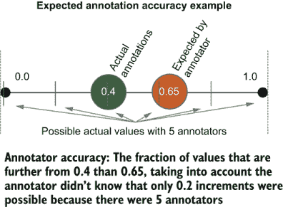

图 9.4 一个注释者通过比较给定标签的实际注释分数与注释者预期的注释数量来估计所有注释者响应范围的准确性。对于我们的示例数据，这对应于 Cameron 预计 65%的人会选择“Cyclist”这个任务，而实际上选择它的人占 40%。

在图 9.4 中，注释者高估了注释者的数量为 0.25。在 0.15 到 0.65 之间的每个值都更接近实际数量 0.4，而 0.65 – 0.15 = 0.5。所以 50%的可能预期值都更接近 0.4。然而，如果有足够的注释者，那么真实实际值将高于 0.4，因此我们通过最小精度 0.2 进行调整，得到 0.5 * (1 – 0.2) + 0.2 = 0.6。注释者的准确度分数是 60%。

图 9.5 给出了我们示例数据中每个注释者每个估计的计算方法。为了得到一个注释者的整体准确度，你需要平均他们在数据集中每个主观任务上的准确度。

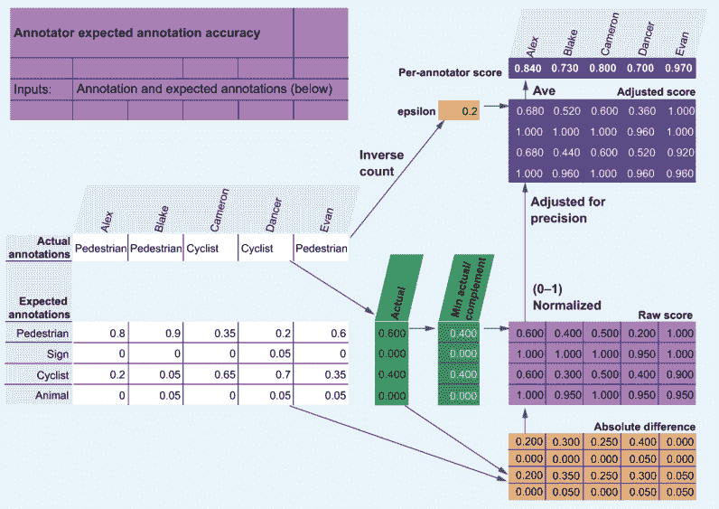

图 9.5 展示了每个注释者每个估计的计算方法，然后平均这些分数以得到这个任务每个注释者的分数。Cameron 在估计预期分布与实际分布的接近程度方面准确度为 80%。Evan 是最准确的，得分为 97%，而 Blake 是最不准确的，得分为 73%。

在图 9.5 中，epsilon 与第八章中 Krippendorff 的 alpha 所使用的 epsilon 相同。当时它并不重要，因为 Krippendorff 的 alpha 是在数据集中所有注释的总数上计算 epsilon 的。在这里，我们是在单个任务内的注释上计算 epsilon。通过比较原始分数和调整后的分数，你可以看到 epsilon 有很大的影响，调整结果达 20%。

如果特别重要的是要知道你的注释者如何准确地估计实际分布，你可以使用几种变体和扩展。对于某些任务，0 分是不可能的，因为每个注释者的预期注释分布总和必须为 1；因此，他们不能总是为每个标签提供最差的估计。（在图 9.5 中，如果注释者预期只有“动物”或“标志”会被选择，最坏的可能分数是 0.44。）你可以为此基线进行归一化，就像在第八章中为真实准确性和一致性那样。

交叉熵是计算预期分布和实际分布之间差异的另一种方法。尽管交叉熵是机器学习中比较概率分布的常见方法，但我从未见过它被用来比较训练数据的实际和预期注释。这项技术将是一个有趣的研究领域。

### 9.1.4 贝叶斯真理血清法用于主观判断

9.1.3 节中的方法专注于每个注释者预测不同主观判断频率的准确性，但分数没有考虑每个注释者的实际注释——只有他们的预期分数。贝叶斯真理血清法（BTS）是一种结合两种方法的方法。BTS 由麻省理工学院的 Dražen Prelec 创建（参见 9.9.1 节中的*Science*论文）并且是第一个将实际和预期注释结合成一个单一分数的度量标准。

BTS 从信息论的角度计算分数。这个分数不能直接让你解释注释者或标签的准确性。因此，BTS 寻找比相同注释者集体预测更常见的响应，这些响应不一定是最频繁的响应。图 9.6 展示了示例。

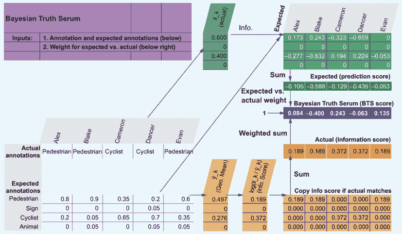

图 9.6 中，BTS 将个人的实际注释与预期注释的预测结合成一个单一分数。Info 是信息论分数（预期 × log(实际 / 预期))。每个注释者的分数显示 Cameron 的分数最高。对于预期和实际注释，分数都是基于信息理论的。分数不仅关于每个注释者的准确性；还关于每个注释者提供的信息量。

在图 9.6 中，Cameron 从 BTS 的角度来看得分最高，主要是因为选择“Cyclist”作为实际标注提供了高信息量。也就是说，“Cyclist”的实际标注频率高于与“Pedestrian”相比的期望频率。Blake 得分最低，主要是因为预测只有 0.6 的标注将是“Pedestrian”，而实际上有 0.9 的标注是——“Pedestrian”——这是所有预测中最大的误差。因此，本节中的数据集是一个很好的例子，说明较少出现的标签提供了比频繁出现的标签更多的信息。然而，在某些情况下，最高频率的实际标签可以提供最多的信息。

图 9.6 也是一个很好的例子，说明了信息与准确性的不同。回想一下，在图 9.5 中，Evan 得分最高，因为 Evan 的期望标注频率与实际标注频率最接近。对于 BTS，Cameron 最终得分最高，尽管 Cameron 的准确性不如 Evan，但 Cameron 对“Cyclist”（一个可能被忽视的较少出现的标签）的预测更有价值。

如果你持续发现通过 BTS 获得最高信息分数的标注者并不是在预测期望标注频率方面最准确的标注者，这一发现可以成为你标注者多样性不足的证据。检查一下 BTS 分数最高的标注者是否通常选择较少出现的标签；如果是这样，那么你有证据表明你的标注者池更频繁地选择最频繁出现的标签，这比随机或代表性人群更常见。

在对 BTS 的一个有趣扩展中，发明者观察到，当实际标注的百分比超过某个标签的平均期望百分比时，这一发现是证据，表明这个意外受欢迎的标签是正确的，即使它不是多数。但这个结果依赖于有足够的标注者，至少有一位标注者选择了该标签，当你每个任务只有少数标注者时，对于罕见但有效的标签，这种情况不太可能发生。

注意，我们在图 9.6 中没有调整 BTS 分数，因为只有五位标注者，所以只有 0.2 的倍数是可能的（图 9.5 中的 epsilon）。本节中的例子是 BTS 的原始计算，出于教育目的，它在这里以文献中的形式呈现。添加这个调整是可以的，但请注意，BTS 有一个很好的对称性，你可能会失去这种对称性；如果期望和实际分数的权重设置为 1，就像我们的例子中那样（权重相等），BTS 分数总是加起来为 0。如果你调整了精确度，情况就不会是这样，因此你将无法利用这种对称性进行这种修改。有关 BTS 扩展的更多信息，请参阅第 9.9 节。

### 9.1.5 将简单任务嵌入更复杂的任务中

如果之前的主观数据技术都不奏效，一个简单的解决方案是为你的任务创建一个额外的非主观问题，并假设如果标注者正确回答该问题，他们的主观标签也是有效的。图 9.7 展示了这样一个例子。

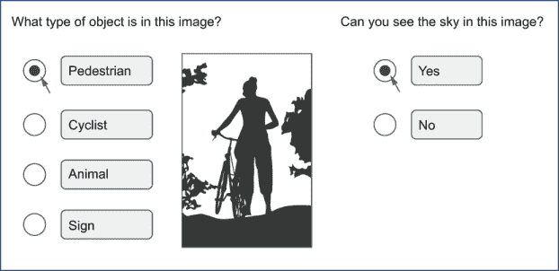

图 9.7 一个带有附加客观问题的主观任务。这个例子通过假设如果一个人正确回答了客观问题，他们的主观判断也是正确的，而不是错误，从而使得质量控制更容易。

在图 9.7 中，我们询问了一个关于信息中是否可以看到天空的附加问题。与物体类型不同，这个问题应该是明确和客观的：天空要么可见，要么不可见。因此，我们可以通过嵌入已知答案来测试人们是否正确回答了产品问题，或者通过使用本章讨论的技术寻找标注者之间的共识，来轻松地测试人们是否正确回答了这个问题。然后我们假设人们在主观任务上的准确性是相同的。

在使用这种方法时，我们依赖于这样一个假设，即简单客观任务的准确性将与主观任务的准确性高度相关，这将在很大程度上取决于你的数据。作为一个一般原则，问题与相关内容越接近，这种相关性应该越强。在我们的例子中，我们询问的是物体的上下文，因此准确性应该高度相关。

当实际任务耗时较长时，这种方法最为有效。如果你要求某人键入一段长文章的摘要，这通常需要很多分钟，那么询问关于文章的附加客观问题几乎不会增加额外的标注成本。

## 9.2 标注质量控制的机器学习

由于大多数数据标注的质量控制策略都是基于统计的决策过程，因此机器学习可以用于质量控制过程本身。实际上，本章和第八章中的大多数启发式方法都可以建模为在保留数据上训练的机器学习问题。这里介绍了四种由机器学习驱动的质量控制类型，所有这些类型都使用标注者在真实数据上的表现和/或共识作为训练数据：

+   将模型预测视为一个优化任务。使用标注者在真实数据上的表现，找到一个概率分布，该分布优化了损失函数。

+   创建一个模型来预测标注者的一次标注是正确还是错误。

+   创建一个模型来预测标注者的一次标注是否可能与其他标注者达成一致。

+   预测标注者是否实际上是机器人。

一些方法可以独立使用或组合使用。以下各节将依次介绍这些方法。

### 9.2.1 将标注置信度计算作为一个优化任务

在第八章中，你学习了你可以取所有标签的平均置信度。如果一个标注者的标注置信度低于 100%，剩余的置信度会分散到标注者未选择的标签上。我们可以通过查看所有标注者在真实数据上的标注模式来构建这种方法，然后将我们的置信度视为一个优化问题。图 9.8 展示了示例。

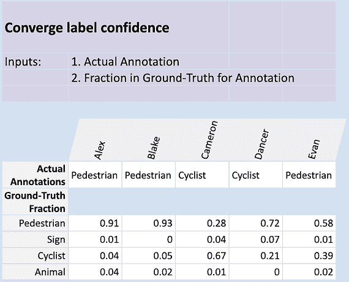

图 9.8 将在真实数据上的性能用作计算模型置信度的优化任务。在真实数据上，当 Alex 将项目标注为“行人”时，实际上 91%的时间是“行人”，“标志”1%的时间，“骑自行车的人”4%的时间，以及“动物”4%的时间。当我们看到 Alex 将一些新项目标注为“行人”时，我们可以假设相同的概率分布。当 Dancer 将一个项目标注为“骑自行车的人”时，我们知道实际上有 72%的时间是“行人”，显示出对这些类别的混淆。

图 9.8 显示了真实数据上标注的实际分布。如果你只有少量真实数据，你可能需要考虑使用简单的平滑方法（如添加常数）来平滑这个数字（拉普拉斯平滑）。

与第八章中的方法相比，这种方法的一个优点是你可能不需要丢弃低准确度标注者的所有标注。在图 9.8 中，Dancer 大多数时候都是错误的，因为他们在将项目标注为“骑自行车的人”时只有 21%的时间是正确的。然而，在“行人”是正确答案的 72%这一事实中，也存在有用的信息。所以，我们不是因为 Dancer 的低准确度而将其从我们的标注中移除，我们可以保留他们的标注，并通过模拟他们的准确度让他们为我们的整体置信度做出贡献。

为了计算整体置信度，你可以取这些数字的平均值，这将给出“行人”68.4%的置信度，“标志”2.6%的置信度，“骑自行车的人”27.2%的置信度，以及“动物”1.8%的置信度。然而，平均值只是计算整体置信度的一种方法。你也可以将这个任务视为一个优化任务，找到最小化距离函数（如平均绝对误差、平均平方误差或交叉熵）的概率分布。如果你来自机器学习背景，你会认出这些方法为损失函数，你可以将这个问题视为一个机器学习问题：你通过找到一个最佳匹配数据的概率分布来优化最小损失。

如果你在我们示例数据上尝试不同的损失函数，你会发现它们与平均值的差异不大。将这个问题变成机器学习问题最大的好处是你可以将除了标注本身之外的信息纳入你的置信度预测中。

### 9.2.2 当标注者意见不一致时收敛到标签置信度

在将汇总作为机器学习问题处理的基础上，我们可以使用真实数据作为训练数据。也就是说，我们不是优化从真实数据中提取的概率分布，而是构建一个使用真实数据作为标签的模型。图 9.9 展示了第八章中的真实数据示例如何扩展以显示每个真实项目的特征表示。

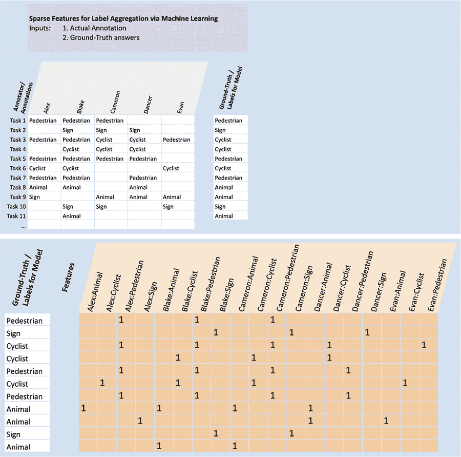

图 9.9 稀疏特征表示，以真实数据作为训练数据。我们可以对真实数据集上的每个标注进行计数，并将实际的标注作为特征，将真实数据标签作为机器学习模型的标签。然后我们有一个可以预测正确标签并给出与该预测相关的置信度的模型。

如果我们用图 9.9 中的数据构建模型，我们的模型将学会根据标注者在真实数据上的整体准确度来信任标注者。我们没有明确告诉模型标注的值与标签相同；模型自己发现了相关性。

这种方法的最大的缺点是，标注了更多真实数据的人会被赋予更高的权重，因为他们的特征（标注）出现在更多的训练数据中。你可以在标注过程中尽早标注大部分真实数据（无论如何都是一个好主意，以确定准确性和微调其他过程）以及在构建模型时，每个训练周期中为每个标注者采样相同数量的标注来避免这种结果。你还可以通过汇总标签数量但忽略谁进行了标注来克服这一缺点，如图 9.10 所示。

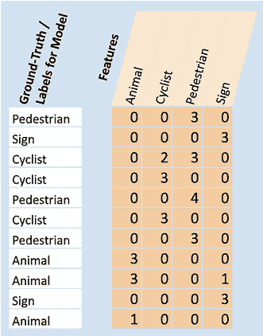

图 9.10 密集（汇总）特征表示，以真实数据作为训练数据。特征是每个标签的计数，从而忽略了标注者的身份。我们可以对真实数据集上的每个标注进行计数，将每个标注作为特征，并使用真实数据标签作为机器学习模型的标签。当你没有很多标注者的真实标签时，这个例子比图 9.9 中显示的例子更稳健。

如果你的模型期望特征值在[0–1]范围内，你可能需要将图 9.10 中的条目进行归一化。对于图 9.9 中的稀疏表示和图 9.10 中的聚合信息，你可以尝试使用你对每个预测的信心而不是将每个注释计为 1。这个信心分数可以是注释者自我报告的信心，如第八章所示，或者是一个预期的分布，如第 9.1 节中的主观判断。你可能还会有一个基于注释者过去工作的信心指标。无论你实验的是哪个数字，确保它不是从你即将训练的同一天真数据中得出的，这会导致你的质量预测模型过拟合。

就像稀疏示例一样，一个单独的神经元或线性模型应该足以给出图 9.10 的可靠结果，而不会对密集表示的数据过拟合。在任何情况下，你应该在尝试任何更复杂的事情之前，从一个更简单的模型开始。

在这个阶段，你可能想知道为什么你不能将稀疏和聚合信息都作为特征包含在模型中。你可以做到这一点！你可以创建一个模型，使用这些特征以及任何可能相关的其他特征来计算我们能够有多自信地聚合多个注释。但即使你决定采取“把所有东西都扔进模型”的混合方法来进行聚合，在开始尝试更复杂的模型和超参数调整之前，你也应该使用图 9.9 和 9.10 中的特征表示作为基准。

为了评估这个模型的准确性，你需要将你的真实数据分成训练数据和评估数据，这样你就可以在保留数据上评估信心。如果你使用比线性模型或单个神经元更复杂的东西，即你正在进行超参数调整，你还需要进一步分割以创建一个用于调整的验证集。稀疏和聚合表示都可以与使用模型的预测作为注释者一样使用。对于聚合表示，你可能需要考虑你是否希望将模型预测与人类注释分开进行聚合。

### 9.2.3 预测单个注释是否正确

使用机器学习进行注释质量控制最灵活的方式是将它作为一个二元分类器来预测单个注释是否正确。简单分类二元任务的优点是你可以使用相对较少的数据来训练模型。如果你正在使用真实数据进行训练，你不太可能有很多数据来训练，因此这种方法允许你最大限度地利用你拥有的有限数据。

如果每个项目只有少数标注者，这种方法特别有用。你可能只有预算让一个标注者查看大部分项目，尤其是如果标注者是可靠的领域专家（SME）时。在这种情况下，你想要识别 SME 可能出错的小部分案例，但你没有帮助识别这些案例的协议信息，因为你大部分时间只有一个标注。

最简单的实现方式是从标注者的身份和他们的注释作为特征开始，如图 9.9 所示。因此，这个模型将告诉你哪些标注者在真实数据中的特定标签上最强或最弱。

你可以考虑可能提供额外背景信息以确定标注者是否可能犯错误的其他特征。除了标注者身份和注释之外，你可能尝试在模型中使用的特征可能包括

+   同意该注释的标注者数量或百分比（如果存在）

+   关于被标注项的元数据（时间、地点和其他类别）以及标注者（相关人口统计信息、资质、在此任务上的经验等）

+   预测模型或其他模型的嵌入

元数据特征可以帮助你的模型识别可能存在偏见或注释质量中的有意义趋势的区域。如果元数据特征捕捉到了照片拍摄的时间，你的模型可能会学会夜间拍摄的照片通常更难准确标注。对于标注者也是如此。*如果*你的标注者本身是骑自行车的人，他们可能会对包含骑自行车者的图像有偏见，模型可以学会这种偏见。

这种方法也适用于主观数据。如果你有多个正确答案的主观数据，这些正确答案中的每一个都可能适用于二元模型。这项技术相当灵活；它也适用于许多类型的机器学习问题，如第十章所述。

向标注者展示正确的真实答案

当标注者答错时，你可以选择向他们展示正确答案。这次审查应该提高该标注者的表现，但也会使评估该标注者的准确性更难。在设计上存在权衡：你是否每次都告诉标注者他们犯的错误，从而使该标注者更准确，或者你保留一些或全部真实答案匿名，以便你可以更好地控制该标注者的表现？你可能需要找到一个平衡点。

对于基于真实数据的模型，在使用标注者已经学会正确答案的项目时要小心。例如，一个标注者可能对有一个人推自行车的真实数据项目犯了错误。然而，如果该标注者被告知了那个错误并给出了正确答案，那么该标注者不太可能后来犯同样的错误。因此，你的质量控制模型可能会错误地预测该标注者在他们现在高度准确的项目类型上的错误。

### 9.2.4 预测单个标注是否达成一致

作为预测标注者是否正确的一种替代方法，你可以预测标注者是否与其他标注者达成一致。这种方法可以增加训练项的数量，因为你可以训练一个模型来预测所有由多个人标注的项目的一致性，而不仅仅是那些在真实数据中的项目。这个模型可能更强大。

预测一致性对于揭示预期会有分歧但未发生的情况是有用的。也许是因为随机机会，少数标注者彼此达成了一致。如果你可以自信地预测分歧本应该发生，即使是由没有参与该任务的标注者，那么这一发现可以成为需要对该项目进行额外标注的证据。

你可以尝试两种方法：构建一个模型来预测标注者何时正确，以及构建一个独立的模型来预测标注者何时会与其他标注者达成一致。然后，当预测到标注是错误或预测到与其他标注者不一致时，你可以审查任务或引发额外的标注。

### 9.2.5 预测标注者是否为机器人

如果你与匿名标注者合作，并发现其中一名标注者实际上是一个在欺骗你工作的机器人，你可以创建一个二元分类任务来识别其他机器人。如果我们发现我们的标注数据中的 Dancer 是一个机器人，我们可能会怀疑同一个机器人正在冒充其他人类标注者。

如果你确信某些标注者子集是人类，他们的标注可以成为你模型的训练数据。这种方法实际上允许你训练一个模型来询问标注者，“我们是人类，还是我们是 Dancer？”

有时，机器人可以作为标注团队的一个很好的补充。机器学习模型可以标注数据或自主创建数据，或与人类结合创建数据。本章的其余部分致力于介绍自动化或半自动化数据标注的方法。

## 9.3 模型预测作为标注

半自动化标注的最简单方法是将模型的预测当作标注者。这个过程通常被称为*半监督学习*，尽管这个术语已经被应用于几乎任何监督和无监督学习的组合。

你可以信任模型的预测，或者将模型的预测作为众多标注员中的一个。这两种方法对你如何处理模型置信度和可能实施的审查模型输出的工作流程有不同的影响，因此它们被分别探讨。你还可以使用你的模型预测来寻找噪声数据中的潜在错误，这将在第 9.3.3 节中介绍。

我们会取代人工标注员吗？

自 1990 年代以来，每隔几年就有人声称解决了自动化标注问题。然而，三十年后，我们仍然需要为超过 99%的监督式机器学习问题标注数据。

关于自动标注的许多学术论文存在两个常见问题，无论是使用模型置信度、基于规则的系统还是其他方法。首先，它们几乎总是将自动标注方法与随机抽样进行比较。正如你在第二章中看到的，即使是一个简单的主动学习系统也能迅速提高你模型的准确性，因此与这些论文中的主动学习相比，评估其益处可能很困难。其次，这些论文通常假设评估数据已经存在，这在学术数据集中是正确的。然而，在现实世界中，你仍然需要设置标注流程来创建你的评估数据，管理标注员，制定标注指南，并在标注上实施质量控制。如果你为你的评估数据做所有这些，为什么不在标注组件上投入额外的努力来创建训练数据呢？

事实很少是全有或全无的解决方案。尽管我们无法从大多数监督式机器学习系统中移除人工标注员，但我们有一些令人兴奋的方法来改进我们的模型和标注策略，例如使用模型预测作为标签、嵌入和上下文表示、基于规则的系统、半监督机器学习、轻度监督机器学习以及合成数据。所有这些技术都有有趣的人机交互影响，并在本章中介绍。

### 9.3.1 信任自信模型预测的标注

使用模型作为标注员最简单的方法是信任模型预测作为标签，信任超过一定置信度阈值的预测作为标签。图 9.11 展示了示例。

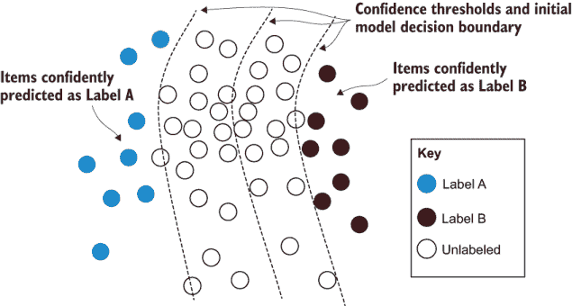

图 9.11 将最自信的预测作为标签。模型预测项目为标签 A 或标签 B，最自信预测的项目被视为正确标签。这个例子允许我们快速构建模型，但有一个缺点：模型是从远离决策边界的项目构建的，这为可能存在的边界留下了大量错误。

图 9.11 展示了预测模型如何自动标记项目。我们可以从那个起点启动我们的模型。如果你有一个现有的模型但没有访问到该模型训练的数据，这种方法是合适的。这种情况在机器翻译中很常见。Google 发布了第一个主要的机器翻译系统，从那时起，每个主要的机器翻译系统都使用了来自 Google 引擎的翻译数据。尽管这种方法比直接标注数据不太准确，但它可以以较低的成本快速启动。

这种半监督学习，有时被称为*自举半监督学习*，在将现有模型适应新类型数据时很少单独工作。如果你可以自信地正确分类某物，你的模型从它已经自信的项目中获得的额外信息很少，而且你面临放大偏差的风险。如果某物真正新颖，模型可能不会自信地分类它，或者（更糟）可能会错误分类它。然而，当与主动学习技术结合使用以确保有足够代表性的数据时，这种方法是有效的。图 9.12 展示了将模型预测作为标注的典型工作流程。

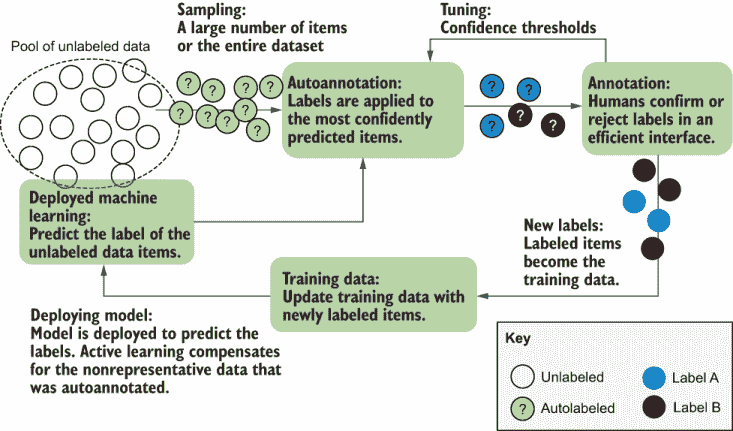

图 9.12 展示了使用自信预测作为标注的工作流程。模型用于预测大量未标记项目的标签（可能是所有项目）。人工标注员审查一些标签，接受的标签成为训练数据的标注。人工标注员还使用这个过程来调整可以将标签自信地转换为标注的阈值。

这里有一些使用自信模型预测来创建标注的技巧：

+   置信度边际和置信度比率可能是最好的置信度度量，因为你想相对于其他标签有最高的置信度。所以这些指标是好的起点，但你也可以测试其他不确定性采样指标，看看什么最适合你的数据。

+   在每个标签的基础上设置置信度阈值，或者为每个标签采样前*N*个预测，而不是尝试为所有标签设置一个置信度阈值。否则，你最有信心预测的项目可能只来自少数几个容易预测的标签。

+   在每个迭代中训练两个模型：一个在所有标注上训练，另一个只在人工已看到的标注上训练。当第一个模型的置信度很高而第二个模型的置信度很低时，不要信任预测。

+   跟踪人工标注和自动标注的项目，并确保一定数量的训练周期只使用人工标注的项目，以防止你的模型偏离太远。（这种策略通常被称为*伪标签*）。

+   在你的主动学习下一次迭代中使用不确定性采样来关注你的新决策边界。

+   使用代表性抽样来找到与先前模型训练数据不同的数据（有关在结合人类和机器标签时使用代表性抽样的更多信息，请参阅第 7.5.4 节）。

使用模型预测来生成人类审查的候选对象，而不是完全信任它们，如果标注任务耗时较长，可能会有效。如果我们有一个有数百个标签的分类任务，标注者接受或拒绝预测标签作为二元分类任务会比手动从数百个标签中选择要快得多。这种情况在其他类型的机器学习中更为常见，如序列标注和语义分割，而不是标注。第十章将更详细地介绍如何使用模型预测来解决这些用例。

类似于图 9.12 中的审查工作流程可能会导致偏差，因为人类过于信任模型，从而持续甚至放大错误。我们将在第十一章讨论用户体验和标注界面时，介绍减轻这些错误的方法。

### 9.3.2 将模型预测视为单个标注者

将机器学习融入标注过程的第二种方法是包括来自下游模型的预测，就像它们是一个标注者的标注一样。假设我们例子中的标注者 Evan 不是人类；它是我们下游的机器学习模型。查看图 9.13，我们可以看到 Evan 的准确性相当高，除了任务 3，Evan 错误地将“Cyclist”预测为“Pedestrian”。因此，如果我们把 Evan 的预测当作一个人类标注者，我们可以应用完全相同的方法来达成正确的共识。

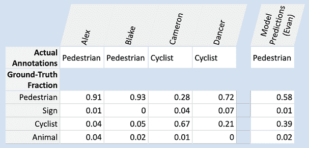

图 9.13 将模型的预测作为标注纳入其中。从我们的示例数据中，我们可以假设 Evan 实际上是一个预测模型，而不是人类标注者。对于任何考虑每个标注者准确性的方法，在这个工作流程部分将模型预测作为人类标注纳入通常是完全可以接受的。

你可以将模型的预测结果纳入其中，就像纳入任何其他标注者的标注一样。通过应用第 9.2.1 节中的技术，我们在计算最终概率分布时考虑了标注者的准确性，我们正在使用模型在真实数据上的准确性。

你可能需要考虑不同的工作流程，这取决于一个项目是如何被采样以进行标注的。如果你认为 Evan 是通过过去的交互训练并基于该知识行动的，那么 Evan 将受到过去交互和训练数据的影响，并将模仿那些人类行为，除非 Evan 变得对人类具有对抗性。

因此，如果一个样本与过去的训练数据相似，并且被 Evan 自信地分类，你可能会要求另一位标注员确认该标注，而不是使用你通常使用的最少标注员数量。这种方法介于我们信任自信预测和将模型视为标注员之间的策略。

### 9.3.3 通过交叉验证查找错误标注的数据

如果你有一个现有的标注数据集，并且不确定所有标签是否正确，你可以使用该模型来找到需要人工审核的候选标签。当你的模型预测的标签与已标注的标签不同时，你有很好的证据表明该标签可能错误，并且应该由人工标注员审核该标签。

然而，如果你正在查看现有的数据集，你的模型不应该在评估数据上训练，因为你的模型将过度拟合这些数据，并可能错过许多案例。如果你进行交叉验证，例如将你的数据分成 10 个部分，其中 90%作为训练数据，10%作为评估数据，你可以在不同的数据上训练和预测。

尽管关于在噪声数据上训练模型的大量文献，但其中大部分假设人类无法审核或纠正错误标注的数据。同时，文献假设可以花费大量时间调整模型以自动识别和解释噪声数据（参见第七章的毕业生经济学）。在几乎所有实际应用场景中，你应该能够标注更多的数据。如果你知道你的数据是噪声的，你应该至少为你的评估数据设置一个标注流程，以便你知道你的实际准确率。

有一些合法的理由，你可能会遇到无法避免的噪声数据。数据可能本身具有歧义，你可能会获得大量免费但噪声标签，或者你可能有一个为了提高吞吐量而牺牲一点准确性的标注界面。我们将在稍后讨论如何处理噪声数据的方法，但前提是在几乎所有用例中，拥有准确的学习数据都是更好的。

## 9.4 嵌入和上下文表示

目前许多机器学习研究集中在迁移学习：将一个模型从一个任务调整到另一个任务。这项技术为标注策略开辟了一些有趣的途径。如果你的标注任务特别耗时，例如语义分割，你可能能够以某种方式标注数量级更多的数据，然后使用这些数据在一个适应语义分割任务的模型中。

由于迁移学习是目前的一个热门研究领域，因此有很多术语在变化。如果一个模型是专门构建来适应新任务的，它通常被称为**预训练**模型，该模型中的信息被称为**嵌入**或**上下文表示**。图 9.14 展示了使用上下文嵌入的一般架构。

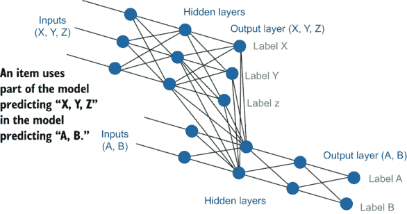

图 9.14 转移学习的示例。我们有一个预测项目是“A”还是“B”的任务，我们认为我们现有的预测“X”、“Y”或“Z”的模型由于两个任务之间的相似性，将包含有用的信息。因此，我们可以使用“X”、“Y”或“Z”模型的神经元作为我们预测“A”或“B”的模型中的特征（表示）。这个例子与书中早些时候的例子类似，那些例子使用隐藏层作为聚类的特征，并使用迁移学习来适应现有模型以适应新任务。在某些情况下，我们可能会忽略“输入 A”和“B”，只使用预训练模型作为我们新模型的表示。

你可能想尝试图 9.1 中架构的变体。你可以选择只使用表示中的某些层，尤其是当你担心维度过多时。或者，你可能只想使用预测标签，而不是任何模型内部表示，如果你只能访问模型预测，这将是你唯一的选择。这种做法在文献中可能被称为“使用另一个模型的预测作为特征”，而不是表示。

你还可以决定是否要调整现有模型或将其用作新模型中的特征。我们在第五章中实现了后者，用于自适应迁移学习，正如该章节所指出的，一个模型输入另一个模型（如图 9.14 所示）相当于调整一个具有冻结权重的模型。如果你正在训练所有模型而不使用现有模型，另一个选择是使用多任务模型；你有一个具有共享层但具有不同输出层或转换头的模型，用于不同任务。如果你从一个预训练模型开始，在适应实际任务之前先使用相邻任务来适应它，这个过程被称为**中间任务训练**。

你还可能决定在你的最终模型中使用多个模型表示，第十二章中的一些实际例子实现了这一点。

迁移学习、预训练模型、表示或嵌入？

机器学习社区尚未就不同迁移学习方法的名称以及它们在无监督到监督模型谱系中的位置达成共识。嵌入（Embeddings）在历史上是无监督学习的产物，但所有变种的监督版本很快便出现了。最近，自然语言处理（NLP）研究人员开始使用带有巧妙方法获取“免费”标签的监督模型，例如预测句子中的缺失单词以及预测两个句子在源文档中是否连续。因为这些模型是在上下文中预测单词或句子，所以它们通常被称为*上下文表示*或*上下文嵌入*，而模型则被称为*上下文模型*。因为这些模型是专门针对迁移学习进行训练的，所以它们也被称为*预训练模型*。

最近的一些监督方法有时被称为无监督方法，要么是因为嵌入在历史上一直是无监督的，要么是因为研究人员在预测从现有句子中移除的单词时不需要付费创建训练数据。在文献中，你可能会遇到任何组合的*迁移学习、预训练模型、上下文表示*和*嵌入*，以及描述为*监督、无监督、半监督*或*自监督*的学习方法。这些方法导致的标注工作量减少通常被称为*单次、少量*或*零次*学习，这取决于需要多少次额外的标注迭代以及模型适应新用例需要多长时间。

这些术语无疑会在本书出版后发展和增加，所以请仔细阅读任何论文中研究人员所讨论的内容。

这里有一些你可以在你的标注过程中使用嵌入和上下文表示的方法：

+   使用现有的嵌入或为你的部署模型调整预训练模型。

+   使用你数据中的固有标签来训练一组定制的嵌入。

+   在与你的实际任务相邻的任务上更高效地获取人工标注，然后从这些标注中构建上下文模型。

我们将在第 9.4.1 节至第 9.4.3 节中依次介绍这些示例。

### 9.4.1 从现有模型进行迁移学习

在使用神经网络模型的传统迁移学习方法中，是将一个为某个任务设计的模型适应到另一个任务的过程。在计算机视觉中，最著名的任务是将 ImageNet 模型适应到其他任务。你可能已经尝试过这种类型的迁移学习，这是第五章中主动迁移学习所使用的类型，所以我们在这里不再详细讨论。

你可能没有见过的一种变体是使用像 ImageNet 这样的数据集来进行比图像级标注更复杂的机器学习任务，例如语义分割。假设我们在图像上进行语义分割，以识别“动物”、“骑自行车的人”、“行人”和“标志”等在我们的示例用例中。还假设我们有 200 万张图片，标注每张图片需要大约一个小时（某些任务的典型时间），并且有相当于六年全职标注的预算。

完成语义分割需要 40 小时 * 50 周 * 6 人 = 12,000 张图片。也就是说，训练数据将包含大约 12,000 张图片（或略少，因为其中一些将作为评估数据保留）。尽管 12,000 是训练可接受的物品数量，但它并不大，不到可用数据的 1%。即使有良好的主动学习，某些稀有标签的示例也可能只有 1,000 个。

然而，你知道 ImageNet 有数百万个关于人、自行车和动物类型的示例。因此，你使用现有的 ImageNet 数据库，知道该模型中的神经元将包含每个对象类型的表示。因此，你知道仅用 12,000 个示例训练的语义分割模型可以利用在数百万个示例上训练的 ImageNet 中的表示。这种表示可能有助于你的模型，并且这个原则可以应用于其他类型的表示。我们将在第 9.4.2 节中基于这个观察结果。

### 9.4.2 来自相邻易于标注任务的表示

使用像 ImageNet 这样的现有模型的缺点是它是在不同的标签上训练的，并且很可能是用不同类型的图像训练的。你可以将一部分你的标注预算用于根据你在语义分割任务中使用的相同标签对你的数据进行图像级标注。尽管语义分割耗时，但你可以为诸如“这张图片中是否有动物？”等问题创建一个简单的标注任务，每个图像只需 20 秒，因此比完整分割更快。

如果你将六人年的预算中的一年移至图像级标注，你将得到每分钟 3 个 * 60 分钟 * 40 小时 * 50 周 = 360,000 个不同对象类型的图像级标签。然后你可以在这些标签上训练一个模型，知道该模型将包含每个对象类型的表示，并且它覆盖的多样性比语义分割标注（现在从 5 人那里有 10,000 个）要多得多。

如果你为图像上有 360,000 个相关标签，但仅减少了 2,000 个语义分割，你可以在你的模型中提供更丰富的信息。如果你的模型架构允许高效的嵌入，这种策略是一个值得考虑的策略。

这种策略还有额外的优势：它更容易在标注任务上实施质量控制，并且您将能够利用更广泛的劳动力，这些人可能无法进行语义分割，但可以进行标注。

难以预测的是，从移除 2,000 个语义分割训练数据项以添加 360,000 个图像级标签来为您的预训练模型带来的净收益。您可能想先从小规模开始实验。回想一下第八章中使用的图像级标注任务的工作流程示例，首先询问“这张图片中是否有自行车？”如果您有类似的流程，您已经正在生成可用于模型创建嵌入的数据。在您需要分配任何资源之前，这是一个开始实验的好地方。

### 9.4.3 自监督：使用数据中的固有标签

数据可能具有固有的标签，您可以用这些标签免费创建其他上下文模型。与数据相关的任何元数据都是构建模型的潜在标签来源，并且该模型可以用作您实际任务的表示。

在我们的示例数据中，假设我们在某些光照条件下存在准确性问题，但手动根据光照条件标注每张图片的成本太高，而且某些光照条件很少见。您的大多数图片都有时间戳，因此您可以使用这些时间戳自信地将一百万张图片过滤到不同时间段的桶中（可能是按小时或白天和晚上的桶）。然后您可以训练一个模型来根据一天中的时间对图像进行分类，知道该模型将包含光照的表示。无需让人类分析数据，您就有了一个近似预测光照条件的模型，可以用作其他任务的表示。这些如何结合嵌入的三个示例在图 9.15 中展示。

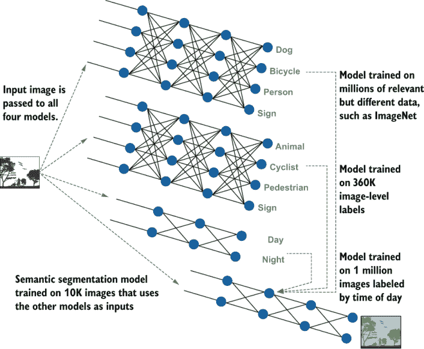

图 9.15 说明了如何使用迁移学习来提高模型的准确性以及它可能如何影响标注策略。在这里，三个其他模型正在向一个语义分割模型输入。顶部示例是适应在 ImageNet 上训练的模型，这是最常见的迁移学习类型。第二个模型是在我们关心的对象的 300,000 个图像级标签上训练的。第三个模型使用图像的时间戳来训练一个预测一天中时间的模型。因为顶部三个模型训练的数据量比语义分割模型多得多，只有 10,000 个训练项，它们应该有更丰富的图像表示，这有助于语义分割任务。

自由标签很有吸引力，你的数据可能有一些选项。即使是噪声标签也可能有所帮助。每个社交媒体公司都使用从标签构建的模型来处理计算机视觉和自然语言处理（NLP）任务。尽管不同的人使用标签的方式不同，但在预测这些标签时，有足够的信号可以帮助下游的计算机视觉和 NLP 任务。你的最终模型将上下文模型作为输入嵌入，并相应地加权，因此错误不一定传播。以下是一些你可能在数据中找到的例子：

+   用户生成的标签，例如标签和用户定义的主题

+   有意义的时期，例如白天/夜晚和周内/周末

+   关于数据或创建数据的人的地理信息

+   （特别是对于计算机视觉）创建数据的设备类型

+   （特别是对于网络文本）链接文本的域名或 URL

+   （特别是对于自然语言处理）上下文中的单词或标记，如许多预训练模型中所用

+   （特别是对于自然语言处理）两个句子或段落是否紧接着出现

+   （特别是对于计算机视觉）在上下文中视频帧的像素值

简而言之，如果任何元数据或链接数据可以成为标签，或者如果你可以有意义地删除数据的一部分并在上下文中预测它，那么这些数据可能是有用的内在标签的候选者，你可以使用它们来构建表示。这些将自由相邻标签纳入模型的方法自从搜索引擎在 21 世纪初首次使用它们以来就非常流行，并且随着神经模型的出现而最近再次受到关注。

注意，尽管标签是自由的，但维度是一个问题，尤其是在标注过程的早期，当你没有很多标注用于你的实际任务时。这个问题的一部分超出了本书的范围；维度是机器学习中的一个广泛问题，许多论文都探讨了在有限数据上构建模型时如何解决这个问题。但可以通过设计你的上下文模型来减轻一些问题。如果你模型中的接近最终层是你将用作表示的部分，你可能希望将该层设置为比你的训练数据项数量小一个数量级。你那个上下文模型的准确性可能会下降，但信息现在被浓缩到更少的维度（更少的神经元）中，这可能会提高你下游模型的准确性。查看有关模型蒸馏的文献，以了解如何在不损失太多准确性的情况下减少你模型的维度。你还可以使用经典统计方法，如 PCA（第四章）。

## 9.5 基于搜索和基于规则的系统

基于规则的系统在统计机器学习之前就已经存在，尤其是在自然语言处理（NLP）领域，并且仍然是研究的一个活跃领域。基于规则系统最大的优势之一是它们给标注者带来的所有权和代理感，尤其是那些是行业专家的标注者，使他们感觉自己处于驾驶座。我之所以在机器学习系统之上构建基于规则的系统，正是因为使用该系统的分析师想要一种直接将他们的专业知识输入系统的方式。在注释界面中提供这种级别的用户体验并不容易，我们将在第十一章回到这个问题的计算机-人交互方面。

小心基于规则的系统中的范围扩张

我看到许多人因为渐进式的范围扩张而陷入基于规则的系统，难以逃脱。一家流行的智能设备公司使用机器学习将语音转换为文本，但随后使用基于规则的系统将文本分类为不同的命令或问题（意图）。当公司在有限的几个问题上测试系统时，基于规则的途径是有意义的，但随着产品的推广，需要新的功能和对更多语言的支持，这种方法变得越来越困难。公司最终雇佣了数百人并行编写新的规则，以确定某些关键词组合如何映射到不同的命令。公司在花费超过一年时间并行构建机器学习能力的同时，几乎无法维持系统的运行，并且难以扩展所有规则及其相互作用的管理。公司得出结论，规则提供的快速启动最终并不值得；即使是一个简单的机器学习模型，只要有良好的训练数据，也会是一个更好的起点。

### 9.5.1 使用规则进行数据筛选

手工构建的基于规则的系统在数据筛选中被广泛使用。对于分层抽样，这种方法可以非常有意义。为了继续本章的例子，如果你在户外对图像进行分类，并且关心光照条件，你可以创建一个基于规则的系统，从一天中的不同时间采样相同数量的图像，以使数据更加平衡。

另一方面，如果规则是基于未经检验的直觉来筛选数据，你可能会得到有偏差的数据，并且当应用于现实世界数据时，系统可能表现不佳。这种情况在语言任务中尤其可能；任何基于关键词的规则都可能对罕见拼写有偏见，对语言素养较低的人可能犯更多错误，或者规则制定者可能不知道同义词。

即使你可以使用基于规则的系统进行标记任务并且不需要注释（除了你的评估数据），你仍然可能更倾向于使用基于规则的系统来自动注释数据，然后在那些注释上构建机器学习模型，而不是在生产中使用基于规则的系统。将上下文模型添加到基于规则的系统中是困难的，因此创建你基于规则的系统的机器学习版本将使其更容易与预训练模型集成。

### 9.5.2 训练数据搜索

搜索引擎界面在基于规则的系统和机器学习系统之间提供了一个很好的中间地带。一个领域专家可以搜索他们认为属于某个类别（标签）的项目，并快速接受或拒绝由该搜索返回的项目。如果领域专家知道某些项目对模型来说可能会很棘手，或者对于他们的应用来说本质上很重要，他们有快速深入相关数据的方法。这个例子类似于我们的工作流程，其中专家审查早期的注释，但在这个情况下，专家是推动整个过程的。

训练数据搜索可以被视为一种注释者驱动的多样性采样，其中负责找到所有相关数据以进行采样的个人也在创建注释。如果那个人将数据路由到其他人进行注释，这个过程几乎像是专家审查工作流程的反向。这个过程从领域专家开始，他们手动找到最重要的数据点；然后非专家注释者完成更耗时的注释任务。

允许利益相关者进行搜索功能，而不仅仅是领域导出，有它的优势。注释者可以通过允许搜索这些数据来获得他们正在注释的数据类型的好印象。机器学习科学家可以快速测试他们对哪些特征将在他们的模型中重要的假设。这种形式的数据探索性分析在轻度监督系统中也非常有价值。

### 9.5.3 遮蔽特征过滤

如果你通过规则或搜索快速构建一个训练数据模型，你应该考虑在训练模型时屏蔽你用来生成训练数据的特征。如果你快速构建一个情感分析分类器，并且通过搜索或过滤出表示“快乐”和表示“愤怒”的文本来创建初始训练数据，那么考虑在你的特征空间中屏蔽“快乐”和“愤怒”这些术语。否则，你的模型可能会轻易地过拟合“快乐”和“愤怒”这些术语，而无法学习到应该对文本情感有贡献的周围词语。

你可以考虑不同的掩码策略。例如，你可能在 50%的训练轮次中掩码这些单词，这样你的模型就需要花费 50%的时间学习那些不是搜索或规则策略一部分的单词。这种方法可以被视为针对从你的数据收集方法中传播的偏差的针对性变体。如果你将进行后续的主动学习迭代，你可以在早期迭代中移除这些单词，在早期过程中最小化它们的偏差，同时知道后续迭代的模型将包括它们，以最大化部署到你的应用程序的模型的准确性。

## 9.6 对无监督模型进行轻量级监督

探索性数据分析最广泛使用的方法之一是允许注释者，通常是行业专家，与无监督模型进行交互。第十二章中的一个例子是实现探索性数据分析。图 9.16 展示了针对多样性采样（第四章）的聚类方法的简单扩展。

图 9.16 中有许多变体，你可能想要尝试。除了聚类，你还可以使用相关的主题建模技术，特别是对于文本数据。除了基于距离的聚类，你还可以使用余弦距离（第四章）、基于邻近度的聚类，如 K-最近邻（KNN）或基于图的聚类。

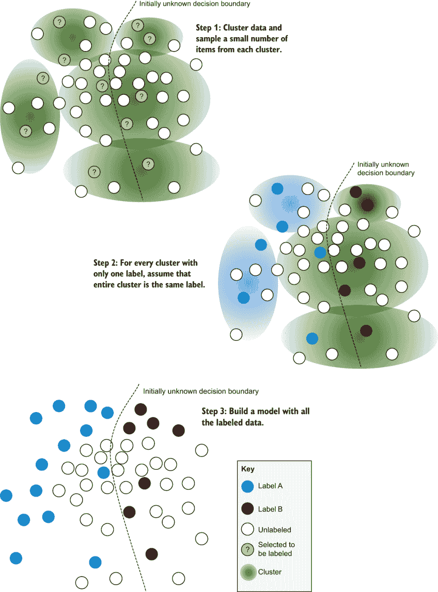

图 9.16 轻量级监督的一个示例。数据被聚类，并且从每个聚类中采样少量项目。对于所有标签都相同的聚类，整个聚类都被赋予那个标签。可以在所有项目上构建监督模型，忽略在存在分歧的聚类中没有获得标签的项目。

### 9.6.1 将无监督模型调整为监督模型

图 9.16 中的聚类算法通过假设所有只有一个标签的聚类对所有的项目都有那个标签，扩展了第四章中的聚类示例。将此类模型转换为完全监督模型的其他方法包括：

+   对包含多个标签的项目的聚类进行递归聚类。

+   在最初使用图 9.16 中的方法之后，切换到不确定性采样。

+   随时间减少或移除自动标记的项目。

### 9.6.2 人类引导的探索性数据分析

有时，数据科学家的目标是纯粹的探索，不一定是为了构建一个监督分类模型。在这种情况下，注释者可能没有预定义的标签集。科学家可能使用聚类或其他无监督技术来寻找数据中的趋势，并根据这些趋势决定可能适用的标签。

搜索和基于规则的系统可以与无监督方法和基于时间趋势的方法一起使用。监督系统可用于标记数据和对分析进行分段。例如，一个人可能希望在将社交媒体消息分为正面和负面情绪之后对它们进行聚类，以查看每个情绪极端内的趋势。

## 9.7 合成数据、数据创建和数据增强

当原始数据不可用且从头开始创建数据比标注数据更便宜时，合成数据很有用。对于语音识别等用例，通常使用创建的数据。如果你为医院创建一个语音识别系统，你可能让人们阅读一份与医疗相关的单词或句子列表。在通常可用的语音数据语料库中找到每个相关医疗单词在每个你关心的口音或语言中的音频录音是不切实际的，因此数据创建被使用。

### 9.7.1 合成数据

小型手动创建的评估数据很常见。你可能为每个构建的模型创建一个包含已知病态边缘情况的评估数据集。或者你可能构建一个包含一些易于分类示例的小型评估数据集，并将在这个数据集上实现 100%的准确率作为发布新模型的先决条件——这是机器学习对软件开发人员单元测试的等效。纯合成训练数据，通常通过编程而不是手动创建，在以下一种或多种情况下最有用：

+   存在约束性问题，例如，数据最初以结构化格式开始，但最终以可预测的噪声类型结束的数据重构。

+   获取足够数据存在障碍（例如成本或稀有性）。

+   使用真实数据时存在隐私或安全问题。

+   当模型失败时，有可接受的回退方案供人类使用。

我只知道一个纯合成数据在机器学习中被广泛使用的案例：扫描信用卡号码。如果你已经将信用卡号码添加到手机上的应用程序中，你可能已经注意到可以选择拍照信用卡而不是输入数字。识别你的信用卡号码的模型几乎肯定是在没有任何人工标注的纯合成数据上构建的。它符合上述所有四种情况。你的信用卡号码最初是结构化数据，但它被打印在实体卡上，然后拍摄了该打印数字的照片，这是一个重构 16 个数字的约束性问题。没有扫描信用卡的大规模公开数据仓库。如果数据科学家和标注者能看到实际卡片的所有扫描图像进行标注，将引发隐私和安全问题。最后，如果扫描不成功，最终用户通常可以手动输入他们的卡号。

大多数使用合成数据的应用仍然包括一些数据标注，因此以下策略通常用于补充人工标注。如果你能够通过编程创建模型所需的所有数据，那么你可能一开始就不需要机器学习。

### 9.7.2 数据创建

解决数据缺乏的一个有效方法是要求标注者创建数据。这种方法是创建语音数据（第十章）的常见方法。对于文本数据，这种方法可以有效地解决数据中的空白。尽管不如自发文本真实，但这种方法可能比没有数据更好。

疾病爆发数据

当我开始写这本书时，我包括了一个基于观察的数据创建示例，即北美关于疾病爆发的新闻标题很少。遗憾的是，在 COVID-19 期间，这种情况不再成立。

在数据集创建任务中，我要求标注者想象他们正在经历疾病爆发，并使用基于规则的系统为每位标注者生成不同的提示。规则通过他们是否直接经历、目睹或间接听说爆发；感染或暴露的人数等因素来变化。这种方法旨在尽可能多地获得多样性，以克服人工文本在自发文本中的局限性。

我将这个数据集从书中排除，并考虑在疫情结束后发布。届时可能会很有趣地看到某人的生活经历如何影响他们当时创建示例数据的现实程度。

一些有趣的自动化数据创建技术结合了数据创建和合成数据，包括用于图像的生成对抗网络（GANs）和用于文本的语言模型。如果你想看自行车的图片，你可以训练 GANs 在现有的自行车图片上创建新的但逼真的自行车图片。同样，你可以训练语言模型来创建包含特定短语或关于特定主题的新句子。这些模型通常是用于上下文嵌入的预训练模型。在两种情况下，数据很少达到 100%的准确性，因此人工审查可以帮助筛选哪些生成数据是真实的。

当数据由人类或自动化过程创建时，这有助于解决训练数据的敏感性。你可能有一个基于从网络抓取的数据构建的语言模型，该模型有效地捕捉了一些敏感数据，例如人们的地址，这可能会使模型容易受到逆向工程的影响，从而暴露这些地址。然而，如果你可以使用语言模型重写所有序列并测试新序列是否出现在原始数据中，那么你可以在这些新数据上构建第二个模型。该模型应该更难被逆向工程以发现敏感信息。数据敏感性超出了本书的范围，但在这里将其标记为一个重要领域，其中人机交互的机器学习可以帮助。

### 9.7.3 数据增强

如果你从事计算机视觉工作，你应该熟悉数据增强技术，如翻转、裁剪、旋转、变暗等，这些技术通过修改一些训练数据项以创建更多项目或在这些项目内增加多样性。在自然语言处理（NLP）中，也存在类似的技巧，即用同义词数据库中的同义词或通过具有相似嵌入的词语替换原词。

在机器翻译和其他用例中，反向翻译是一种流行的数据增强方法，即将句子翻译成另一种语言，然后再翻译回原语言，以创建可能新颖但同义的句子。如果你将“这太棒了”翻译成法语再翻译回英语，句子可能变成“这非常好。”你可以将“这非常好”视为另一个有效的翻译。这种方法也适用于其他用例。如果你正在实施情感分析，并且将“这太棒了”作为标记为积极情感的语料库数据点，你可以使用反向翻译来创建“这非常好”作为另一个标记为积极情感的语料库数据项。

使用预训练模型的掩码语言建模是一种类似的技术。回想一下，常用的预训练模型可以预测上下文中的缺失词语。这项技术可以用来创建类似的句子。你可以取句子“亚历克斯开车去商店”并要求系统预测句子“亚历克斯 MASK 去商店。”中的 MASK。这个例子可能产生句子如“亚历克斯去了商店”、“亚历克斯步行去商店”以及具有相似意义的句子，这样就可以快速有效地创建一个更大的数据集。

## 9.8 将注释信息整合到机器学习模型中

你无法总是避免错误标记的数据。但即使你知道并非所有标签都是正确的，你仍然可以使用几种策略来获取尽可能准确的下游模型。

### 9.8.1 根据对标签的信心过滤或加权项目

最简单的方法是删除所有低标注置信度的训练数据项。你可以使用保留的验证数据调整要删除的正确数量。这种方法几乎总是可以提高模型的准确性，但往往被忽视，因为人们想要使用尽可能多的标注。如果你正在删除某些项目，请确保你至少检查你正在删除的内容，这样你就不会在数据中产生偏差。某些内容可能因为来自代表性不足的人口群体而置信度低。在这种情况下，使用多样性采样来帮助重新平衡数据。

而不是删除低置信度项目，你可以在模型中降低它们的权重。一些模型允许你作为其输入的一部分以不同的方式对项目进行加权。如果你的模型不是这种情况，你可以根据你对标签的置信度，在训练周期中编程选择项目。你应该能够使用验证数据调整这个过程，以便获得最佳的预测精度，同时仍然有一个包含标注者身份的模型。

### 9.8.2 在输入中包含标注者身份

将标注者的身份作为模型中的一个特征可以增加模型的预测能力，尤其是在预测不确定性方面。你可以包含额外的二进制字段，指示哪个标注者对标签做出了贡献。这种方法类似于在标注者意见不一致时将标注者身份包含在模型中，以收敛到正确的标签，但在这里，我们是在包含标注者身份的下游模型中部署新数据。

显然，你的未标记数据没有与之关联的标注者。你可以从模型中获得预测，而无需为实际预测设置任何标注者字段。然后，你可以通过设置不同的标注者字段来获得额外的预测。如果预测根据不同的字段而改变，那么你的模型正在告诉你不同的标注者可能会对数据点进行不同的标注。这个信息对于识别标注者之间可能达成一致的项目非常有用。

如果你引入一个字段来捕捉标注者身份，整体模型的准确性可能会下降。在这种情况下，你可以将一些训练项目的所有标注者字段设置为 0，无论是在数据本身中还是在某些训练周期中的掩码。你应该能够使用验证数据调整这个过程，以便获得最佳的预测精度，同时仍然有一个包含标注者身份的模型。

### 9.8.3 将不确定性纳入损失函数

在下游模型中使用标签不确定性的最直接方法是将它直接纳入损失函数。对于许多机器学习任务，你将把你的标签编码为全或无的一热编码：

| 动物 | 骑自行车的人 | 行人 | 标志 |
| --- | --- | --- | --- |
| 0 | 1 | 0 | 0 |

假设，然而，这是你从标注中得到的实际标签置信度：

| 动物 | 骑自行车的人 | 行人 | 标志 |
| --- | --- | --- | --- |
| 0 | 0.7 | 0.3 | 0 |

与将“骑行者”声明为正确标签并将其编码为 1 不同，您的模型可能允许您的目标函数将 0.7 作为损失函数试图最小化的值。也就是说，您要求模型收敛到 0.7 而不是 1.0，在这个例子中。如果您有置信区间，您有更多的选择。假设我们的置信度为 0.7，加减 0.1：

| 动物 | 骑行者 | 行人 | 标志 |
| --- | --- | --- | --- |
| 0 | 0.7 (±0.1) | 0.3 (±0.1) | 0 |

在这种情况下，如果模型收敛到“骑行者”0.6 到 0.8 之间的任何值，我们可能都会感到同样高兴。因此，我们可以修改我们的训练以考虑这个结果。根据您的架构，您可能不需要更改损失函数本身的输出；您可能能够在模型预测“骑行者”在 0.6 到 0.8 之间时跳过任何训练周期的这一项。

如果您对标签置信度有更精细的理解，您可以修改损失函数本身的输出。如果您对标签的置信度为 0.7，但在这 0.7 数字的两侧有高斯程度的确定性，您可能能够将不确定性的程度纳入您的损失函数，对一些损失进行宽恕，而不是全部宽恕，因为预测更接近 0.7。

您可以通过编程方式尝试本节中的方法，因此尝试将注释者和注释不确定性纳入您的模型的不同方式应该相对容易，以查看它们对您的任务如何工作。

## 9.9 高级注释的进一步阅读

本章主要使用了相对简单的图像和文档级别的标签示例，并对语义分割和机器翻译进行了一些扩展。第十章讨论了这些方法如何应用于许多类型的机器学习问题。相同的原理适用，但某些技术在某些问题上的效果更好或更差。

本节的一些进一步阅读假设的任务比标签更复杂，因此根据论文的不同，您可能需要在返回文献之前先阅读第十章。

### 9.9.1 主观数据的进一步阅读

在 2017 年，Dražen Prelec、H. Sebastian Seung 和 John McCoy 发表了“解决单问题群体智慧问题的方案”（[`mng.bz/xmgg`](http://mng.bz/xmgg)），特别关注那些实际响应率比预测响应率更受欢迎的答案，即使它不是整体上最受欢迎的答案。（这篇论文不是公开的。）Dražen Prelec 为主观数据编写的 BTS 原始手稿可在[`economics.mit.edu/files/1966`](https://economics.mit.edu/files/1966)找到。后来发表在《Science》上的简短版本可在[`mng.bz/A0qg`](http://mng.bz/A0qg)找到。

对于解决本章中提出的一些担忧的 BTS 有趣扩展，请参阅 Goran Radanovic 和 Boi Faltings 的“用于非二元信号的鲁棒贝叶斯真理血清”，[`www.aaai.org/ocs/index.php/AAAI/AAAI13/paper/view/6451`](https://www.aaai.org/ocs/index.php/AAAI/AAAI13/paper/view/6451)。

### 9.9.2 关于机器学习用于注释质量控制的进一步阅读

关于结合机器和人类置信度的计算置信度方法，请参阅 Gagan Bansa、Besmira Nushi、Ece Kamar、Walter Lasecki、Daniel Weld 和 Eric Horvitz 的“超越准确性：心理模型在人类-人工智能团队绩效中的作用”，[`mng.bz/ZPM5`](http://mng.bz/ZPM5)。

对于 NLP 任务中注释者偏差的问题，请参阅 Mor Geva、Yoav Goldberg 和 Jonathan Berant 的“我们在建模任务还是注释者？对自然语言理解数据集中注释者偏差的调查”，他们建议评估数据（测试集）应由创建训练数据的不同注释者创建，[`mng.bz/RX6D`](http://mng.bz/RX6D)。

Ashish Khetan、Zachary C. Lipton 和 Anima Anandkumar 的“从有噪声的单标签数据中学习”，详细介绍了通过使用注释者性能和模型预测来估计注释置信度的方法，[`mng.bz/2ed9`](http://mng.bz/2ed9)。

关于使用模型预测作为标签的最早和最有影响力的论文之一是 Xiaojin Zhu 和 Zoubin Ghahramani 的“从标记和无标记数据中学习，使用标签传播”，[`mng.bz/1rdy`](http://mng.bz/1rdy)。两位作者继续发表与主动学习和半监督学习相关的论文，这些论文也值得一看。

### 9.9.3 嵌入/上下文表示的进一步阅读

与本书中介绍的任何其他机器学习研究相比，迁移学习的文献似乎对过去的探索最少。嵌入技术始于 20 世纪 90 年代和 21 世纪初的信息检索中的潜在语义索引（LSI）方法，以支持搜索引擎。2000 年代见证了 LSI 的许多监督变体，通常采用巧妙的方法来获取免费标签，例如查看文档之间的链接。监督嵌入在 2010 年代初在计算机视觉中变得非常流行，特别是从像 ImageNet 这样的大型计算机视觉数据集中进行迁移学习，以及在 2010 年代末的自然语言处理（NLP）中。然而，NLP 和计算机视觉科学家很少相互引用或早期信息检索工作。如果你对这个主题感兴趣，我建议你研究这三个领域。

你可以从 1990 年的开创性论文“通过潜在语义分析进行索引”开始，由 Scott Deerwester、Susan Dumais、George Furnas、Thomas Landauer 和 Richard Harshman 撰写，[`mng.bz/PPqg`](http://mng.bz/PPqg)。

关于如何通过在相邻任务上具有更多标签的上下文模型来帮助的最新研究，请参阅 Yada Pruksachatkun、Jason Phang、Haokun Liu、Phu Mon Htut、Xiaoyi Zhang、Richard Yuanzhe Pang、Clara Vania、Katharina Kann 和 Samuel R. Bowman 的“使用预训练语言模型的中间任务迁移学习：何时以及为什么它有效？”（[`mng.bz/JDqP`](http://mng.bz/JDqP)）。作为这篇论文在多语言环境中的扩展，请参阅同一作者团队，以 Jason Phang 为首席研究员的这篇论文：“英语中间任务训练改善零样本跨语言迁移”（[`mng.bz/w9aW`](http://mng.bz/w9aW)）。

### 9.9.4 基于规则系统的进一步阅读

关于基于规则系统的当前研究，请参阅亚历山大·拉特纳（Alexander Ratner）、斯蒂芬·H·巴赫（Stephen H. Bach）、亨利·埃伦伯格（Henry Ehrenberg）、贾森·弗赖斯（Jason Fries）、森武（Sen Wu）和克里斯托弗·雷（Christopher Ré）的“Snorkel：使用弱监督快速创建训练数据”（[`mng.bz/q9vE`](http://mng.bz/q9vE)），以及他们网站上列出的应用和资源：[`www.snorkel.org/resources`](https://www.snorkel.org/resources)。

对于深入探讨这些技术的非自由资源，请参阅拉塞尔·朱尼（Russell Jurney）即将出版的（在出版时）书籍《弱监督学习：用更少的数据做更多的事情》（O’Reilly）。

### 9.9.5 将标注的不确定性纳入下游模型的进一步阅读

关于在下游模型中建模标注不确定性的最近研究，“从噪声单标签数据中学习”（第 9.9.2 节）是一个良好的起点，它解决了在标注者之间信息很少且错误很多的情况下出现的困难任务。

## 摘要

+   主观任务包含具有多个正确标注的项目。你可以从标注者那里引出人们可能给出的有效响应集合，然后使用 BTS 等方法发现所有有效响应，并避免惩罚正确但较罕见的标注。

+   机器学习可以用来计算单个标注的置信度，并解决标注者之间的分歧。对于许多标注任务，简单的启发式方法不足以准确计算标注质量或聚合不同人的标注，因此机器学习为我们提供了更强大的方法来从人类标注中创建最准确的标签。

+   模型的预测可以作为标注的来源。通过使用模型中最自信的预测，或者将模型视为众多标注者之一，你可以减少所需的人类标注总数。这种技术在你想将旧模型的预测用于新模型架构，并且标注与接受或拒绝模型预测相比是耗时任务时，尤其有帮助。

+   嵌入和上下文表示允许您将现有模型的知识适应到目标模型中，作为特征嵌入或调整预训练模型。这种方法可以指导您的标注策略。例如，如果您能找到一个比目标任务快 10 倍或 100 倍的相关任务，那么如果您将一些资源投入到这个简单的任务中，并使用它作为实际任务中的嵌入，您可能会得到一个更精确的模型。

+   基于搜索和基于规则的系统允许您快速过滤和可能标注数据。这些系统在快速标注模型，特别是使用噪声数据标注模型以及寻找重要的低频数据标注时特别有用。

+   在无监督模型上进行轻量级监督是标注者，尤其是 SMEs（行业专家），从少量标签中启动模型或当目标是提高人类对数据的理解而不是监督模型时进行探索性数据分析的常见方法。

+   合成数据、数据创建和数据增强是相关策略，它们创建新的数据项，特别适用于可用的未标记数据不包含所需数据多样性时，通常因为数据稀缺或敏感。

+   将标注不确定性融入下游模型的方法有几种：过滤掉或降低标签准确度不确定的项的权重，包括标注者在训练数据中的身份，以及在训练过程中将不确定性纳入损失函数。这些方法有助于防止标注错误成为模型中的不希望出现的偏差。
