# 10 不同机器学习任务的标注质量

本章涵盖

+   将标注质量控制方法从标注扩展到连续任务

+   管理计算机视觉任务中的标注质量

+   管理自然语言处理任务的标注质量

+   理解其他任务中的标注质量

大多数机器学习任务比标注整个图像或文档要复杂。想象一下，你需要以创造性的方式为电影生成字幕。创建口语和手语语言的转录本是语言生成任务。如果你想用粗体文本强调愤怒的语言，那么这个任务就是一个额外的序列标注任务。如果你想像漫画中的文字泡泡一样显示转录本，你可以使用目标检测来确保文字泡泡来自正确的人，你也可以使用语义分割来确保文字泡泡放置在场景中的背景元素上。你可能还想要预测某个人对电影的评价作为推荐系统的一部分，或者将内容输入到一个可以找到类似*励志演讲*等抽象短语的搜索引擎。

对于这个简单的应用，为视频添加字幕，你需要许多类型的标注来训练你的模型。第八章和第九章介绍了标注的入门和高级技术，在大多数情况下以图像或文档级别的标注作为示例任务。本章涵盖了管理其他类型机器学习任务的标注质量的方法。

你很可能会单独使用这些方法，并可以直接跳到感兴趣的章节。然而，如果你有一个更复杂的任务，比如电影示例，或者你对适应不同类型的标注技术感兴趣，了解所有机器学习问题的方法是有价值的。真实数据、标注者间一致性、机器学习驱动的方法和合成数据都很有用，它们在机器学习任务中的有效性和实际实施设计各不相同。因此，本章的每个部分都突出了标注质量控制策略的优缺点。我们将从最简单的任务开始，即简单的标注之外的标注连续数据，并扩展到更复杂的机器学习场景。

## 10.1 连续任务的标注质量

如果你正在标注连续数据，那么许多质量控制策略与图像/文档级别的标注相同，但在什么是真实数据、一致性、主观性和（尤其是）聚合多个判断方面存在重要差异。我们将在以下各节中依次介绍每个主题。

### 10.1.1 连续任务的真实数据

对于持续任务，真实值通常实现为一个可接受的响应范围。如果您有一个基于 0-100 刻度的情感分析任务，并且有一个正面项目，您可能接受 80-100 范围内的任何注释为正确，而低于 80 的为不正确。这种方法允许您将质量控制视为标记，因此可以应用第九章中所有的方法。

可接受的范围将取决于您的具体任务。如果您要求人们读取图像中的数字——例如时间、温度或电池充电量——您可能只允许精确匹配。

如果您已经确定了一个可接受的答案范围，您可以像为标记任务那样计算单个标注者的准确性：计算他们每次落在每个真实响应的可接受范围内的频率。

### 10.1.2 持续任务协议

如果您的数据是序数的——例如三个点的“差”、“中性”、“好”刻度——您还应该查看第八章中关于序数值的 Krippendorff 的 alpha 示例。您只需要更改标签权重输入，以从标记任务适应到持续任务。

与真实值数据一样，您可以将彼此在可接受范围内的两个注释视为一致，并使用第九章中的方法计算标记任务的协议。对于预期协议，您可以计算有多少注释会随机落在给定范围内。如果您接受情感任务的 80-100 范围，您将计算所有注释中 80-100 范围内的注释数量（图 10.1）。

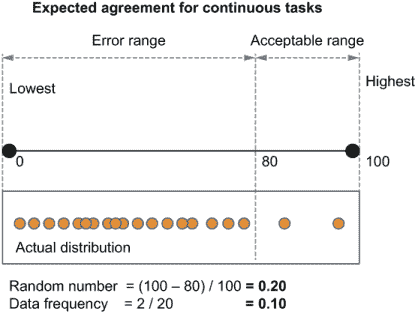

图 10.1 展示了在持续任务中计算预期协议的两种方式：随机数字落在该范围内的概率，以及整个数据集中落在该范围内的注释百分比

如果您的数据集大部分是负面情感，如图 10.1 中 80-100 范围的示例，预期协议可能较小。对于 10-30 范围内的响应，其中有很多响应，预期协议将高得多。

数据的分布特性允许更详细的协议计算。如果您有一个正态分布，您可以使用标准差而不是我们示例中的范围。所以如果您对自己的统计能力有信心，请查看第 10.1.3 节的数据分布特性。

### 10.1.3 持续任务中的主观性

持续数据集可以是确定性的或主观的，或者数据集可能对某些项目是确定性的，而对其他项目则不是。图 10.2 展示了示例。

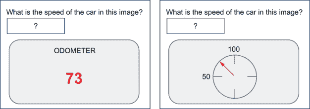

图 10.2 确定性和非确定性连续任务的示例：从里程表图像估计汽车的速度。想象一下，你有两个标注，73 和 78。对于左侧的图像，图像是数字的，所以你知道有一个正确答案。也许图像模糊，使得 3 看起来像 8。所以正确的策略是选择更好的标注（73 或 78）。但对于右侧的模拟里程表，73 和 78 都是合理的估计，75.5 的平均值可能更好。所以正确的策略是汇总标注。

如图 10.2 所示，你甚至可能在同一个数据集中拥有确定性和非确定性数据。因此，这本书不能给你一个适用于所有可能数据集的技术；你需要估计你的数据集中有多少是主观的，并将这个估计纳入你的质量控制策略中。

对于本质上模糊或主观的项目，你可以要求标注者提供一个范围而不是单一值。你可以通过询问标注者认为其他人会标注的范围来减少适应偏差，就像在第九章中讨论的类别标注的主观性（第 9.1 节）一样，但在这个情况下是针对范围。

### 10.1.4 将连续判断汇总以创建训练数据

对于连续变量，可以使用群体智慧进行汇总。经典的例子是猜测一头牛的重量或罐子中弹珠的数量；通常，平均猜测比大多数人的猜测更接近正确值。图 10.3 显示了这样一个分布。

图 10.3 群体智慧的示例。尽管 20 个标注者的平均分数（虚线）不正确，但它比 20 个标注者中的 15 个个人分数更接近正确的（地面真实）分数。因此，平均数比大多数标注者更准确。

如图 10.3 所示，我们期望平均标注比大多数标注者的标注更好，但有两条注意事项：

+   虽然平均值可能比大多数人更好，但这并不一定是最佳选择，也不一定在所有情况下都比选择最佳标注更好。

+   在某些情况下，对于一项任务来说，平均值可能不如大多数人，这更可能在只有少数人标注每个项目时发生。

这个第二点对于训练数据来说尤为重要。大多数研究连续任务的群体智慧的学术论文都假设存在一个群体！让数百人标注每一个数据点将过于昂贵；更常见的情况是只有五人或更少的人参与。因此，当人们谈论与众包相关的群体智慧时，它最不适用于典型的众包标注系统。

作为一般准则，如果你有不到五位标注者，你应该考虑选择最佳标注者；如果你有成百上千位标注者，你应该取平均。对于介于两者之间的任何情况，你将不得不为你的数据和问题选择正确的策略。图 10.4 说明了何时应用群体智慧方法。

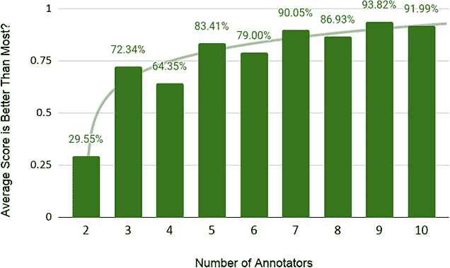

图 10.4 对于群体智慧，你需要群体。这张图显示了标注者的平均分数有多经常比大多数标注者的分数更接近真实分数。如果有三位标注者，大约 70%的时间，这些标注者的平均分数将比至少两位标注者的分数更接近实际分数。在创建训练数据时，每个项目通常不会超过十位标注者，这张图显示，当有十位标注者时，平均标注比大多数标注者的标注好大约 90%的时间。

图 10.4 展示了在假设数据集呈正态分布的情况下，群体智慧分布看起来是什么样子。在这个例子中，对于三位或更多标注者，你仍然最好选择平均分数，而不是随机选择其中一位标注者的分数。这个示例数据假设标注者的正确分数是平均分、中位数和众数。你自己的数据分布可能不太可靠，平均（平均）标注可能来自非正态分布，这些分布往往会高于或低于真实分数。因此，你应该像图 10.4 中那样计算自己的图表，使用你的真实数据，并看看你能否可靠地使用平均分数来处理连续数据。你可能发现选择一位标注者的分数比取平均更可靠，尤其是如果你只有少数几位标注者。

对于图 10.4 中的正态分布以及大多数其他分布，大多数情况下至少有一位标注者比平均标注更接近真实值，这为你的聚合策略设定了竞争性的观察：

+   大多数情况下，平均标注会比随机选择任何单个标注更好。

+   大多数情况下，至少有一位标注者的标注会比平均标注更好。

你可以根据你拥有的标注数量以及你对单个标注者的信心来调整你的策略。如果你的数据看起来像图 10.4，而你只有两位标注者，你应该随机选择这两位中的任意一位，而不是取平均。如果你有三位标注者，并且不确定其中任何一位是否比其他标注者更准确，你应该使用平均分数。如果你有三位标注者，并且有超过 73.34%的把握认为其中一位标注者比其他标注者更准确，你应该选择那位标注者的分数而不是平均分数。

如果你的数据本质上是非确定性的，你可能选择根本不进行聚合；你可能包括你信任的每个注释作为训练项。在训练数据中拥有有效的响应范围也将有助于防止你的模型过拟合。

### 10.1.5 将连续任务聚合以创建训练数据的机器学习

连续任务非常适合机器学习驱动的质量控制。你可以应用第九章中用于标签任务的几乎所有机器学习技术，但你的机器学习模型可以使用回归来预测连续值，而不是预测标签。

要使用稀疏特征预测正确的注释，你应该能够直接编码实际的注释。特征空间将与标签数据大致相同，但除了 1 或 0 的值，你将拥有每个注释者标注的实际数字。如果一个注释者在真实数据中经常标注过高，模型在预测正确注释时会考虑这一事实。根据你的架构，你可能需要将注释缩放到 0-1 的范围，但通常可以在不进行额外处理的情况下包含这些稀疏特征。如果你有大量的注释者，你的数据可能过于稀疏，并且与标签任务一样，你可以聚合一些注释以获得更密集的表示。

如果你的数据在可能的范围内是同质的，通过将注释编码为相对于平均分数，你可能会得到更好的结果。图 10.5 展示了示例。

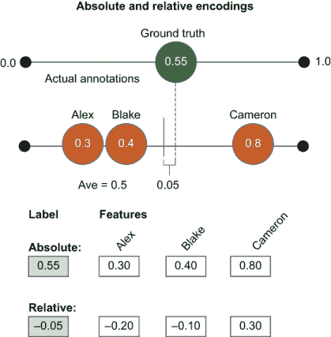

图 10.5 使用机器学习预测注释中正确数字的绝对编码和相对编码的比较。在这里，Alex、Blake 和 Cameron 对一个真实值为 0.55 的地面真实项分别标注了 0.3、0.4 和 0.8。我们可以使用地面真实值作为标签（目标值）来编码注释的绝对值。或者，我们可以取注释者的平均值，即 0.5，并编码这个值应该比平均值高 0.05 的事实。我们同样通过注释与平均值的差异来编码每个注释。相对编码的另一种思考方式是，它编码的是我们平均值的*误差*而不是值。

如果你的数据是同质的——例如，如果你的数据中 0.05 的错误在所有部分中同样可能，那么图 10.5 中的相对编码可能对机器学习辅助质量控制来说是一个更准确的表现。你还可以将这些所有特征组合成一个模型：绝对特征、相对特征、聚合（密集）特征、元数据、模型预测、模型嵌入等。与分类数据示例一样，你需要意识到你最终会有多少维度，因为你可能只有有限的训练数据真实标签。从简单的模型和少量聚合特征开始，建立基线，然后在此基础上构建。

## 10.2 目标检测的标注质量

目标检测通常分为目标标注（识别对象的标签）和目标定位（识别该对象的边界）。在我们的示例中，例如第六章中关于目标检测的主动学习，我们假设使用边界框进行定位，但其他类型也是可能的，例如多边形或标记中心的点。

目标标注遵循与图像标注相同的质量控制方法，第八章和第九章的主要示例。由于实际原因，目标定位标注的质量控制通常通过工作流程完成：评估可能花费几分钟绘制的边界框的质量只需几秒钟。因此，通过将审查步骤添加到边界框标注的工作流程中，你通常只会为标注任务增加不到 10%的时间和成本。这种方法通常比实施自动化质量控制更有效。第八章中的示例工作流程，在图 10.6 中重复，就是这种情况之一。

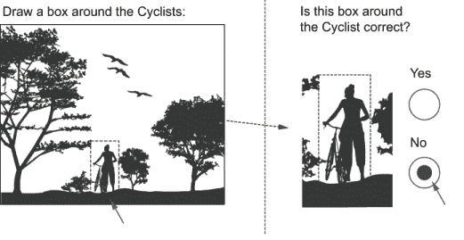

图 10.6 一个审查任务，其中注释者正在评估一个边界框（通常由不同的注释者创建）是否正确或错误。当程序化质量控制困难或需要更多资源时，审查任务构成了许多质量控制策略的核心。

包含如图 10.6 所示的审查任务可以降低整体成本，因为你不需要将边界框绘制任务分配给许多人。然而，具有简单接受/拒绝区分的审查任务不会告诉你错误有多大，因此在某些情况下，仍然可以比较边界框与真实数据边界框。此外，查看注释者之间的协议对于第八章中概述的所有原因，特别是识别可能含糊不清的项目，也是有用的。在流程中审查任务之外，通常对目标检测注释进行一些统计质量控制是个好主意。

接下来，我们将回顾第六章中引入的模型不确定性度量，将其应用于人类质量和不确定性。请注意，本节中的一些内容与第六章中关于对象检测的主动学习部分重复，因为人类质量的不确定性度量与模型不确定性相同。由于你可能是在顺序之外或中断后阅读这些章节，因此这里重复了一些重要的度量。

### 10.2.1 对象检测的地面真实

对象检测的地面真实示例通常由少数几位专家标注者创建。为了对齐激励，当你希望获得尽可能精确的边界框时，通常最好按小时支付报酬，因为获取尽可能精确的边界框可能是一个耗时的过程，而按任务支付报酬并不能使有效的小时补偿与良好的数据需求相一致。

你也可以将创建地面真实数据作为工作流程的一部分。图 10.7 展示了如何将图 10.6 扩展，以便专家标注者可以将非专家标注转换为地面真实示例，仅在必要时编辑实际框。

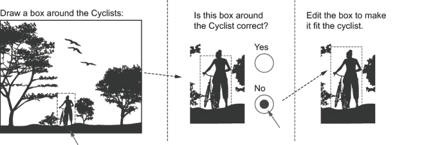

图 10.7 将图 10.6 中的审查任务扩展，以便专家标注者可以编辑非专家标注者创建的边界框。这种方法是创建地面真实数据的一种方式。

在将标注与地面真实示例进行比较时，通常允许一定的误差范围，因为边界在几个像素级别上可能是不明确的。你可以使用专家来校准你数据的误差范围。如果专家标注者相对频繁地不同意 3 个像素以内，那么可能可以原谅任何 3 个像素或更小的错误。当人们估计的对象边界不在视野内（被另一个对象遮挡）或超出画面时，你可能还需要允许更宽的误差范围。

与标注任务一样，你可能希望特别采样地面真实项目以实现多样性。除了标签和现实世界的多样性之外，样本可能还包括对象大小、对象维度以及对象在图像中的位置多样性。

交并比（IoU）是计算标注者与地面真实之间的准确性的最常用度量。图 10.8 展示了 IoU 的一个示例。准确性是通过预测边界框和实际边界框相交的面积除以这两个框覆盖的总面积来计算的。

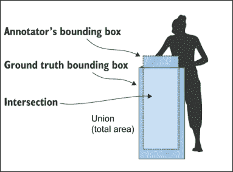

图 10.8 用于测量边界框（位置精度）准确性的 IoU 示例。准确性是通过将标注者的边界框与地面真实边界框相交的面积除以两个框的并集面积来计算的。

对象检测中很少对随机猜测进行 IoU 的校正。如果物体相对于图像大小较小，差异可能无关紧要，因为猜测一个有意义的重叠框的概率很低。然而，你可能有一些情况，其中物体占据了图像的大部分，特别是如果你有要求人们在放大图像上添加或编辑框的工作流程。

如果你想调整随机概率，可以将图像中在框内的百分比作为基线。假设一个标注的 IoU 为 0.8，且物体占据了图像的 10%：

调整后的 IoU = 0.8 – (0.1 / (1 – 0.1)) = 0.6889

这种调整计算与整个图像被认为是对象的情况相同，因为与整个图像相比，10%图像的 IoU 是 10%。

IoU 比精确率、召回率和 F-score 更严格，因为它在相同的数据上往往有更低的值。将 IoU 视为正确或错误预测的面积（或像素）的数量：

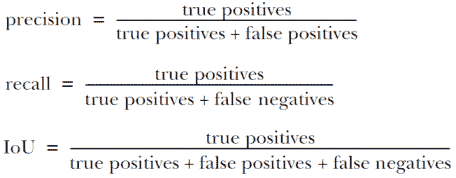

IoU 在计算机视觉中更常用，它不允许在那些使用精确率、召回率或两者组合（如 F-score，精确率和召回率的调和平均值）的任务上直接与准确率进行比较。如果你使用精确率、召回率和 F-score 而不是 IoU，你应该仍然使用整个图像对象作为调整随机概率的基础，但请注意，你将得到不同的数值。假设对于占据图像 10%的同一物体，标注的 F-score 为 0.9：

预期精确率 = 0.1

预期召回率 = 1.0

预期 F-score = (2 * 0.1 * 1.0) / (0.1 + 1.0) = 0.1818

调整后的 F-score = 0.9 – (0.1818)/(1 – 0.1818) = 0.6778

你可以看到，尽管我们最初在 IoU 和 F-score（0.8 和 0.9）的准确率上存在 10%的差异，但在调整随机概率后，它们最终相差 1%左右（0.6889 和 0.6778）。你可以通过实验你的数据集来查看两种准确率方法之间是否存在显著差异。

### 10.2.2 对象检测的一致性

对象检测的标签一致性与图像标注相同；你可以计算每个标签之间的一致性水平，并根据随机猜测这些标签的基线进行调整。与图像标注一样，你需要决定哪种基线计算最适合你的数据：随机标签、数据频率或最频繁的。（参见第 8.1 节中的定义。）

两个标注者之间的定位一致性是通过他们两个框的 IoU 计算的。整个对象的一致性是所有成对 IoU 的平均值。图 10.9 显示了为一张图像标注的多个边界框的示例。

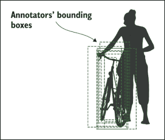

图 10.9 多个标注者标注的多个边界框的示例。整体一致性是通过所有框的平均成对 IoU 计算的。

你可以使用与用于真实值的相同调整来处理随机性，但请注意，这种做法很少见；大多数人通过仅使用未调整的 IoU 来查看目标检测中的协议。

### 10.2.3 目标检测中的维度和精度

由于问题的维度，目标检测可能产生低于其他机器学习任务的分数。如果一个标注者的框在每一边都比真实值大 20%，那么在每个维度上就大了 40%。对于两个维度，140%² = 196%，使得误差几乎翻倍，因此标注者的 20%误差可以变成大约 51%的 IoU 分数。这个数字会随着维度的增加而上升。一个在所有维度上比真实值大 20%的 3D 边界框会产生大约 36%的 IOU。

这个例子突出了标注精度对于目标检测可能如此困难的一个原因：我们用于比较的指标会放大错误。这种误差范围对于某些任务来说可能很重要。假设你正在尝试预测用于物流或超市货架补货的纸箱体积。如果你在 5%的误差范围内原谅标注者，这听起来像是一个合理的误差，但标注者在所有维度上超出了 5%，那么总体体积会增加 33%（110%³ = 133.1%）！如果你的模型是在包含 33%误差的数据上训练的，那么你无法期望它在部署时能预测得更加准确。因此，在设计任务和决定可接受的标注精度水平时，你应该格外小心。如果你正在跟踪标注者在不同类型工作（如图像级标注）中的精度，那么将标注者在目标检测中的精度与其他任务分开跟踪可能更简单，而不是让他们的低目标检测结果拉低他们的总体精度得分。

### 10.2.4 目标检测的主观性

你可以将目标检测的主观性处理方式与处理连续任务的主观性方式相同：你可以询问标注者一个对象是否可能有多个可行的框，并要求他们标注这些框。你可以将每个这样的框视为一个可行的标注，并最终可能为每个对象得到多个框。

你也可以询问标注者他们认为其他人会如何标注，以激发更多样化的回答，并使标注者更舒适地标注一个有效但少数派解释。

### 10.2.5 将目标标注聚合以创建训练数据

将多个标注聚合到一个单一边界框中的问题与连续值的问题类似：无法保证平均边界框是正确的，或者任何单个标注者拥有的边界框是正确的。例如，如果你正在围绕一个背着背包的“行人”放置边界框，包含或排除背包可能是正确的，但半个背包的平均值是不正确的。

您可以使用多种策略来聚合边界框。以下列表大致按从最有效到最无效的策略顺序排列：

+   为专家添加一个任务来审查或裁决每个框。

+   使用平均边界框（但请注意局限性）。

+   使用最准确的标注者的框。

+   创建一个最小框，该框包围了*N*个标注者的框。

+   使用机器学习预测最佳框（第 10.2.6 节）。

对于您特定的数据集，最有效的策略可能不是第一个。您可能需要结合使用多种策略而不是单一策略。对于第四种策略，您还需要决定*N*应该是多少。如果您有四个标注者，您应该通过包围两个或三个标注者注释的最小框来聚合吗？可能没有正确答案。

重叠对象也可能在聚合边界框时提出一个难题。图 10.10 显示了两个标注者具有不同数量框的重叠边界框的示例。

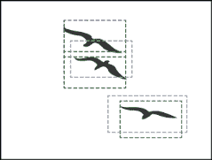

图 10.10 重叠边界框的示例。很难区分来自不同标注者的哪个框适用于同一对象。一个标注者（长虚线）标注了两个对象。另一个标注者（短虚线）标注了三个对象。

您可以使用多种方法来确定图像中某个区域内的对象数量，通常这些方法会组合使用：

+   创建一个单独的任务来询问出现多少个对象。

+   为专家添加一个任务来审查和裁决重叠的框。

+   使用贪婪搜索技术来组合来自不同标注者的框。

您有不同的聚合选项，如第三种策略中所述。一个简单的选项是使用最大 IoU 作为确定下一个要组合的两个框的标准。您可以假设每个标注者每个对象一个框（尽管可能存在错误）和一个 IoU 阈值，低于该阈值您不会进行组合。

贪婪搜索不一定是最优的，所以从理论上讲，您可以将这种策略扩展到对您数据的更彻底搜索。在实践中，如果您无法通过简单的贪婪搜索解决重叠对象，您应该使用单独的审查或裁决任务。

### 10.2.6 对象标注的机器学习

使用机器学习进行边界框标注的最强大方式是预测每个标注框的 IoU。这种方法使我们能够为每个注释获得一个置信度分数，该分数将比取每个标注者的平均 IoU 更准确。

对于标注者在真实数据上创建的每个边界框，该边界框的 IoU 成为您模型预测的目标。除了图像本身之外，您还可以编码与每个注释相关的特征，这可以包括

+   每个标注者的边界框

+   每个标注者的身份

+   标注者在他们的注释中提供的标签

这些功能将帮助模型权衡标注者的相对准确性，考虑到他们在不同类型的图像上可能更准确或更不准确。在编码了训练数据后，你可以使用连续输出函数来训练你的模型以预测 IoU。将此模型应用于预测由标注者创建的任何新边界框的 IoU，以获得该标注者对该边界框的 IoU 估计。

你还可以在单个模型内进行模型集成和/或蒙特卡洛抽样的实验，以获得每个边界框的多个预测。这种方法将为你提供对该标注者对该图像可能 IoU 范围的更清晰了解。请注意，你需要对你的采样策略有信心，因为你在使用这些图像作为模型的一部分。地面真实数据中的任何偏差都可能导致预测每个标注者置信度的技术出现偏差。

通过查看你的标注者的预测 IoU 及其一致性，你可以调整你的整体工作流程。例如，你可能会决定信任所有预测 IoU 超过 95%的标注，让专家审查所有预测 IoU 在 70%到 85%之间的标注，并忽略所有预测 IoU 低于 70%的标注。确切的数字可以根据你的数据进行调整。

你还可以使用机器学习将来自不同标注者的边界框聚合到一个边界框中。尽管这种方法是聚合边界框最准确的方法，但你可能仍然需要一个专家审查的工作流程，因为通常自动化聚合过程以避免错误通过是非常困难的。

与连续数据一样，你可以通过使用绝对或相对编码来编码边界框的位置。图 10.11 显示了相对编码的一个示例。

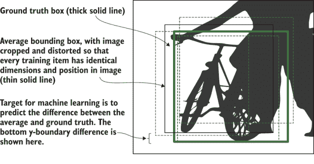

图 10.11.边界框的相对编码。图像被裁剪并拉伸，以确保每个训练项具有相同的尺寸和位置。相对编码解决了图像中对象位置不同的问题，并使模型能够关注更少的功能以进行预测。

图 10.11 中的相对编码与第 10.1.5 节中介绍的绝对和相对编码的连续任务原理相同。如果你的数据是同质的——例如，如果你的图像所有部分的 5 像素误差可能性相同——那么相对编码可能是机器学习辅助质量控制的更准确表示。

你可以使用许多增强技术来提高聚合边界框的机器学习。这些技术包括翻转；旋转；调整大小；模糊；以及调整颜色、亮度和对比度。如果你在计算机视觉领域工作过，你可能会熟悉这些用于改进你的机器学习模型的技术。如果你没有在计算机视觉领域工作过，从以算法为重点的计算机视觉书籍中学习这些技术将是最好的开始。

## 10.3 语义分割的标注质量

在*语义分割*，也称为*像素标注*中，标注员会对图像中的每个像素进行标注。图 10.12 展示了从第六章重复的一个例子，在关于语义分割的主动学习部分（6.2 节）。有关目标检测和语义分割之间区别的更多信息，请参阅第六章。

图 10.12 一个语义分割的例子，其中每个像素都被标注为“人”、“植物”、“地面”、“自行车”、“鸟”或“天空”。这类彩色照片是许多语义分割工具的外观：一个填色练习。我们将在第十一章中介绍这些工具。如果你以黑白形式查看这张图片，对比度的灰色阴影应该能给你一个关于彩色图像的好印象。如果同一类别的不同物体收到一个标签（例如，四棵树分别标注），这个任务就被称为*实例分割*。

对于大多数你需要用于语义分割的质量控制，你只是简单地调整了图像级别标注的方法。但在这个情况下，你是在查看每个像素的准确度，而不是整个标签。你通常将每个像素的标注准确度平均，以获得图像的整体标注准确度。

### 10.3.1 语义分割标注的地面实况

将语义分割标注与地面实况数据进行比较就像在像素级别进行标注：相对于随机机会，被标注正确的人像素百分比。当错误标注的像素在具有正确标签的像素一定距离内时，你可能接受一个小缓冲区（例如几个像素）。你可以将这些错误视为正确，或者在准确度计算中忽略这些像素。

如果你原谅在正确答案附近几个像素内发生的错误，仔细寻找所有标注者在边界附近相同像素上犯的错误，因为这些错误可能是标注工具的结果。与任何其他机器学习任务相比，语义分割更多地使用智能工具，如魔法棒或套索工具来选择区域，以加快处理过程。这些工具通常基于简单的启发式规则，如相邻像素的对比度。如果标注者没有注意到使用这些工具产生的错误，你将教会你的模型工具的简单启发式规则，而不是标签之间的正确边界。工具错误可能发生在任何机器学习任务中，第十一章将更深入地探讨这些问题，但这个问题在这里被标记出来，是因为它在语义分割中发生的频率很高。

你观察了图像标注标签之间的错误模式，你也应该查看像素标签之间的错误模式。如果某些标签比其他标签更重要，你可以给它们更高的权重。例如，如果你对自行车的关注程度高于天空，你可以提高自行车的权重。取宏观平均是使所有标签权重相等的最常见方式。在某些情况下，你甚至可以在计算准确率时忽略一些标签，特别是当你有一个通用的背景标签，除了它与其他标签混淆时，你对其不关心。

### 10.3.2 语义分割的协议

你测量每个像素的协议与图像标注完全相同：测量标注者对该像素标签的协议。你可以用相同的三种方式计算预期的协议：该标签在所有数据中的频率、最常见标签的频率，或者标签总数的倒数。你应该为你的数据集选择最合适的预期频率。如果你有一个通用的背景标签，这个标签的整体频率可能是预期协议的好候选。

### 10.3.3 语义分割标注的主观性

在实践中，解决语义分割歧义最常见的方式是通过复查或裁决。如果一个区域被标注为不确定，或者标注者意见不一致，可以增加一个额外的标注者进行裁决。

在语义分割任务中，通常要求所有像素都获得标签，当标注者对某些区域不确定或存在多个有效解释时，这可能会带来问题。为了激发语义分割的主观性，最简单的方法是添加一个名为“不确定”的额外标签，标注者可以使用它来表示他们不知道该区域的正确标签。“不确定”区域可以是一个独立的区域，或者你可以要求标注者在完成的分割上叠加“不确定”区域，这样即使存在混淆，你也能知道最可能的标签是什么。

有关贝叶斯真理血清（BTS）如何扩展到标注任务之外的示例，请参阅第 10.7 节。我了解到没有将 BTS 扩展到主观语义分割任务的工作，但第 10.7 节中列出的论文将是开始的地方。

### 10.3.4 聚合语义分割以创建训练数据

从多个标注中聚合训练数据与标注任务相同，但在像素级别上。尽管所有相同的策略都是可用的，但是当只有少量不一致存在时，将整个图像交给额外的标注者是很昂贵的。因此，在这些情况下，使用工作流程来裁决图像的某些区域是一个更好的选择：

+   将整个图像上的一致性较低的图像交给额外的标注者。

+   使用专家来裁决图像中局部区域内一致性较低的图像。

图 10.13 展示了裁决过程的示例。

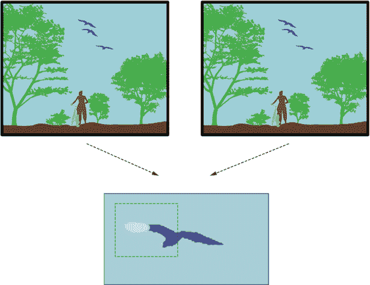

图 10.13 展示了通过工作流程进行语义分割聚合的示例。两位标注者在某个区域上存在分歧，该区域被传递给第三位标注者进行审查和裁决。有两种界面选项：裁决者可以从前两位标注者的两个区域中选择一个，或者他们可以直接在图像上标注，其中存在分歧的区域以未标注的形式呈现。

如图 10.13 所示，你可以将不一致区域定义为任何连续像素集，其中标注者之间的一致性较低。你可以在像素级别上以与标签相同的方式定义一致性：标注者之间的一致性百分比，可能还需要考虑你对他们准确性的信心。在实践中，你每张图像可能不会超过两个或三个标注者，因为语义分割是一项耗时的工作。你可能会简单地将任何不一致视为需要裁决的区域，而不是通过真实数据上的性能设置阈值。

假设你有限的时间内可以裁决不一致，你可以根据大小对数据集中的不一致进行排序，并从大到小进行裁决。你也可以考虑不一致的程度。

如果你更关心某些标签而不是其他标签，可以根据你对每个标签的关心程度对裁决进行分层。如果你对自行车的关心程度是天空的十倍，那么对于每一个可能被标记为“天空”的不一致，你可以裁决十个可能被标记为“自行车”的不一致。不要尝试将 10:1 的比例作为区域大小的权重来应用，因为这太难手动调整这些启发式方法了。

### 10.3.5 使用机器学习聚合语义分割任务以创建训练数据

您可以使用与标注相同的机器学习方法进行语义分割，但需在单个像素级别上操作。一个额外的复杂性是您可能需要解决像素块中不切实际的“拼贴”之间的分歧。如果图 10.13 中鸟的翅膀变成了“天空”和“鸟”像素的棋盘，那么这种结果可能比错误地将整个翅膀称为“天空”还要糟糕，因为您可能会错误地向您的下游模型传授棋盘图案是可能的。

为了简化机器学习的应用，您可以实现一个模型来预测每个像素的二元“正确”/“错误”区分。使用您的保留真实数据，构建一个模型来预测您的注释员标注错误的像素，应用所有您的新标注数据，并生成候选的“错误”区域供专家审查。

这种由机器学习驱动的方 法对于发现来自工具的错误（例如智能选择工具）特别有效。在某些情况下，由于工具的原因，两个或更多注释员可能会犯相同的错误，并且一致性的检查可能不会将这些区域识别为潜在的错误。然而，您的真实数据应该告诉您从工具中可以期望出现哪种类型的错误（也许“天空”被错误地称为“树木”太频繁了）；因此，您的模型将在其他图像的相似部分预测错误。

## 10.4 序列标注的注释质量

在实践中，序列标注通常比标注更常使用人机交互方法。最常见的情况是识别稀有文本序列，例如长文档中的地点名称。因此，序列标注的注释界面通常呈现候选序列以供审查或生成带有自动完成的序列，而不是要求注释员标注原始文本。

在序列标注中，您可以使用不同类型的界面进行此类审查任务，第十一章将介绍它们。对于审查任务，质量控制可以像标注任务一样实施，这是序列标注方法的一个额外优势：在二元或分类标注任务上执行标注质量控制比在序列标注任务上更容易。

然而，您并不总是可以将序列数据作为审查任务进行标注，尤其是在项目开始时，您还没有一个可以用于预测未标记数据中序列候选者的模型。您还面临只展示现有模型候选者的风险，从而持续模型偏差。因此，在原始、未标记数据上运行一些标注仍然是有用的。

序列标注的质量控制方法遵循第六章中关于序列标注主动学习的许多方法。本节将回顾它们，假设您可能没有阅读关于主动学习的部分（或者不是最近阅读的）。让我们回顾一下该部分中的示例：

*“E-Coli outbreak was first seen in a San Francisco supermarket”*

如果你正在实现一个从文本报告中追踪爆发的模型，你可能想从句子中提取信息，例如每个词的句法类别（词性[POS]），“Nouns”（名词）、“Proper Nouns”（专有名词）、“Determiners”（限定词）、“Verbs”（动词）和“Adverbs”（副词），疾病名称，数据中的任何地点，以及重要的关键词，如表 10.1 所示。

表 10.1 序列标签类型：词性标注；关键词检测；以及两种类型的命名实体，疾病和地点。词性标注标签每个标记一个，可以类似于质量控制的标注任务。“B”（开始）应用于跨度的开始，而“I”（内部）应用于跨度内的其他单词。明确标记开始允许我们明确地区分相邻的跨度，例如“San Francisco”和“supermarket”。这种编码技术称为 IOB 标记，其中“O”（外部）是非标签。（“O”因可读性而从表中省略。）对于多跨度任务，如关键词和实体，质量控制比标注任务更复杂。

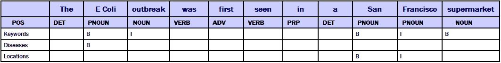

在文献中，你通常会看到跨度使用 IOB 标记，如表 10.1 所示。你可能为不同类型的标签以不同的方式定义多标记跨度。“E-Coli”作为一个实体是一个单词，但对于关键词短语“E-Coli outbreak”，则是两个单词。严格来说，表 10.1 中的注释约定称为 IOB2 标记，而 vanilla IOB 仅在单个跨度中有多个标记时使用“B”。

对于较长的序列，例如将文档拆分为句子或识别说话中轮流的人，你可能只想标注每个序列的开始或结束，而不是整个序列，以提高标注者的效率。

### 10.4.1 序列标注的真相

对于大多数具有多标记跨度的序列标注任务，质量控制是评估整个跨度的正确性。如果一个标注者将“San”识别为实体，但没有将“Francisco”识别为该实体的部分，则该标注者不会获得部分准确率。与计算机视觉中的目标检测不同，对于文本序列没有广泛使用的 IoU 等约定。

如果你有一个连续的任务，比如我们的命名实体示例，除了全跨度准确率外，查看每个标记的准确率也是有洞察力的。我的建议是在评估标注者准确率时，将标签任务与跨度任务分开：

+   按每个标记计算*标签*准确率。如果某人只将“San”标记为地点，则该标签正确，但“Francisco”对于地点来说将是假阴性，对于选择的任何其他标签将是假阳性。

+   在整个跨度上计算*跨度*准确率。如果某人只将“San”标记为地点，则该跨度获得 0%的信用。

这种区分使你能够将标注者对哪些单词属于哪些标签的实用理解与他们对指令中构成多词短语的句法理解区分开来。

你可以将每个标签的准确率与微观或宏观平均相结合，以计算该标注者的整体准确率。如果你有稀疏数据，特别是如果你正在计算微观平均，你可以从计算中省略“O”（非跨度），因为否则“O”标记将主导准确率。你可以根据你如何评估你的下游模型来做出这个决定：如果你在评估模型准确率时忽略“O”标记（除了在其他标签中的假阳性和假阴性之外），你可以忽略“O”标签来评估标注者质量。

如果你想要比较标注者在该任务上的准确性与他们在其他任务上的准确性，你需要包含“O”标签并调整随机性。虽然忽略“O”任务与调整随机性相似，但它不会产生相同的最终准确度分数，因为忽略“O”没有考虑到它的实际频率。

确保指令正确！

我为几乎每家主要科技公司以及包括公共卫生、汽车和金融在内的特定用例构建了命名实体数据集。在所有情况下，我们花费更多的时间来细化定义哪些内容可以包含在一个跨度中，而不是任务的任何其他部分，我们与标注者紧密合作，将他们的专业知识纳入决策过程。例如，当“San Francisco”被写成“San Francisco city”时，"city"是否应该是地点的一部分？如果它是“New York city”，又会怎样？我们经常看到“New York City”或缩写“NYC”，但不是“SFC”，所以这些案例可能不同。此外，在旧金山湾区，旧金山被称为“The City”。当这个名称被称作地点时——只有当它被大写时，那么在社交媒体上，它可能不会经常被大写，又该如何？其他语言又如何，它们很少或根本不使用大写来表示实体？

这些类型的案例是大多数序列任务中错误最常发生的地方，无论是标注还是机器学习模型。与标注者紧密合作以识别困难案例并将它们添加到指令中非常重要。你还可以将这些案例中的一些包含在真实数据集的非代表性部分中。

### 10.4.2 真实连续数据中的序列标注真实数据

与我们的连续序列文本示例不同，一些序列任务实际上是连续的。语音和手语是两个很好的例子。与文本不同，口语在大多数单词之间不留空隙，而手势者在做手势时也不会在单词之间停顿。在这两种情况下，我们的大脑从连续输入中在单词之间添加大多数空隙，所以并不总是有一个明显的点，一个单词结束而下一个单词开始。

这个例子与第 10.2 节中计算机视觉中的边界框示例类似，在那里使用 IoU 来衡量真实标签的准确度。然而，在大多数序列任务中，质量控制的传统做法是允许从真实标签示例中有一个误差范围，而不使用 IoU。

即使在语言数据中这不是惯例，但如果对于你特定的序列任务有意义，就没有理由不使用交并比（IoU）。在这种情况下，你可以使用第 10.2 节中关于真实标签准确性和一致性的方法。你还将获得一个优势：因为序列是 1 维的，误差范围的影响不会像计算机视觉中更常见的 2 维和 3 维标注那样严重。

### 10.4.3 序列标注的一致性

对于每个标记或预分割序列都分配标签的任务，例如词性标注，你可以将每个标记或分割视为一个单独的标注任务，并应用第八章和第九章中的标注方法。

对于具有稀疏标签的文本序列任务，例如关键词提取和命名实体识别示例，可以在每个标记的基础上或在整个跨度上计算一致性。我建议将跨度的预测与标签分开，与真实标签数据的划分方式相同：

+   在每个标记的基础上计算标签一致性。如果一个标注者只将“San”标注为地点，而另一个标注“San Francisco”，则标签的一致性为 50%。

+   在整个跨度上计算跨度一致性。如果一个标注者只将“San”标注为地点，而另一个标注“San Francisco”，则跨度的标签一致性为 0%。

使用审查和裁决任务来解决分歧。如果标注者在两个重叠跨度的边界上意见不一致，可以让另一个标注者解决这个分歧。通常，让大量标注者对整个文档进行标注以解决单个争议的成本过高，因此一个简单的裁决系统通常是最佳选择。

### 10.4.4 序列标注的机器学习和迁移学习

所有最先进的序列分类器都使用预训练的上下文模型。你应该为自己的序列任务尝试这些模型，同时记住，随着训练数据的增加，不同的预训练模型可能比其他模型更有用或不太有用。理解预训练模型如何帮助是很容易的。对于我们关于地点的例子，一个在数十亿句子上预训练的模型将学会“城市”、“乡村”、“镇”和其他地点名称在语义上是相似的，并且它们前面的单词更有可能是地点。但可能需要数百万份文档，你才能在足够相似的环境中看到足够多的“城市”、“乡村”和“镇”的例子，以便预训练模型能够进行这种泛化，而你不太可能对用于你的序列标注任务的数百万份文档进行标注。

如果你拥有预训练模型并且可以访问这些模型的训练数据，你应该将代表性采样作为你的主动学习策略之一，以采样与你的目标领域最相似的项目。如果你在目标领域中有大量未标记的数据，你也可以尝试调整预训练模型以适应你的领域。

如第 10.4 节所述，大多数现实世界的序列标注策略都使用模型预测作为人类审查的候选序列。模型用于预测候选序列，标注者可以将这些注释作为二进制任务接受或拒绝，这允许轻松的质量控制。确保你创建一些好和坏的示例的真相示例，这样你就可以在二元审查任务中评估标注者与真相，而不仅仅是查看一致性。

使用模型预测来生成候选序列存在偏差的风险。当模型错误时，标注者可能会被诱导信任模型预测。这种类型的偏差在第十一章中有详细说明。

使用模型预测的另一个潜在偏差来源是，你可能会错过模型没有以任何信心预测的序列。如果不小心，这种偏差可能会放大你模型中的偏差。一个很好的解决方案是，有一个简单的任务，其中所有文本都被评估是否包含序列。图 10.14 展示了用于位置实体的示例。

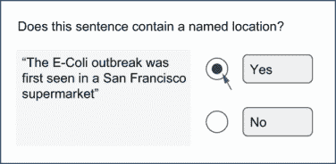

图 10.14 展示了询问序列是否存在于文本中而不要求标注者标注该序列的标注任务示例。这种方法特别适用于快速确保没有遗漏任何文本以供潜在实体使用，并且可以使用可能不太准确识别实体边界的更广泛的劳动力。

使用如图 10.14 所示的工作流程，并使用单独的任务获取实际序列范围，可以减少因序列不是模型候选而错过序列的机会。

使用任务来减少偏差和吸引更广泛的劳动力的一种潜在副产品是，你可以构建一个专门用于预测序列是否出现的模型。这个模型可以用作你的实际序列模型的嵌入，如图 10.15 所示。

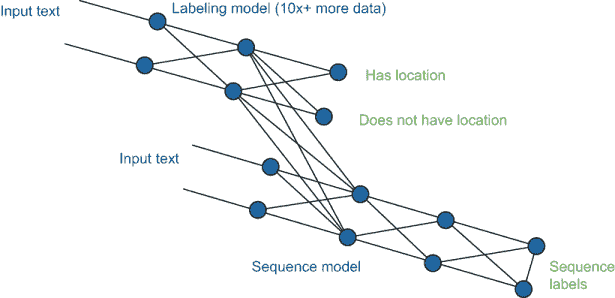

图 10.15 展示了询问序列是否存在于文本中的标注任务示例，这创建了一个可以作为序列标注任务中嵌入的模型。这种方法在标注任务的数据量远大于序列任务的数据量（多十倍或更多）时特别有用，这可能是旨在减少偏差和吸引非专家标注者的工作流程的副产品。

如果你有一个大量标记为包含或不包含序列的数据集，如图 10.15 所示的结构可以提高你下游模型的准确性。请参阅第 9.4 节，了解在相邻任务上注释数据以创建迁移学习表示的策略。

### 10.4.5 用于序列标记的基于规则、基于搜索和合成数据

基于规则的、基于搜索的以及合成数据生成方法在生成稀疏数据中的候选者特别有用。以我们的位置示例识别“旧金山”这样的序列为例，有几种方法可以使用自动化注释来快速开始生成候选者。例如，你可以使用已知地名列表作为基于规则的系统，或者从该地名列表构建合成句子。

我已经使用过所有这些序列注释的方法，通常在随机抽样时将相关注释的比例保持在 100:1，接近初始的 2:1 比例。这些方法使得模型在初始数据很少的情况下能够快速启动。

使用合成数据也提高了覆盖率。例如，当我为组织构建命名实体系统时，我通常会确保至少有一些合成训练数据示例，包含所有对该组织重要的产品、人员、地点和其他实体的名称。

## 10.5 语言生成中的注释质量

对于大多数语言生成任务，质量控制通常由人工专家完成，而不是自动化。例如，当人类将一种语言的句子翻译成另一种语言时，质量控制通常由一位专家翻译员来执行，他们审查工作并评估翻译的质量。

这种情况也适用于模型本身。关于语言生成质量控制的大多数文献都是关于如何信任人类专家的主观判断。关于如何根据 1-5 的评分来判断机器翻译输出的质量，有大量的文献，知道每个 1-5 的判断都可能是一个主观任务。在这些情况下，数据采样对于评估数据也很重要，因为在这种情况下，人们需要花费时间手动评估输出，这是昂贵的。因此，在随机抽样的数据和/或代表模型部署的数据多样性的数据上评估尤为重要。

在创建语言生成任务的质量训练数据时，合适的劳动力是最重要的因素。正如第七章所述，确保你的注释员具有所需的语言流利性和多样性可能需要大量的精心规划。请参阅以下侧边栏，了解你可能需要走多远才能找到合适的人的故事。

关于语言来源的忏悔

*丹妮拉·布拉加的专家轶事*

在我们公司，我们自豪于走得更远，以确保我们获得最佳数据，这有时会导致一些令人捧腹的情况。对于文本和语音数据，最困难的问题通常是找到流利的说话者。找到具有正确资格并能说正确语言的人是机器学习中最为困难和被忽视的问题之一。

最近，我们为一个有特定语言需求的客户进行了一项主要项目收集工作。在几次尝试寻找合适的人选以解决稀有语言的问题后，我们其中一位员工去了一个他知道的可以找到符合要求的人的教堂。尽管他找到了我们客户所需的人，但他不小心在忏悔时间出现了。牧师认为他是为此而来，因此一如既往地，他做了完整的忏悔，包括关于寻找语言的事情。

*丹妮拉·布拉加是 DefinedCrowd 的创始人兼首席执行官，该公司为语言和视觉任务（包括 50 多种语言中的文本和语音）提供训练数据*。

### 10.5.1 语言生成的基准事实

当使用基准事实数据进行自动化分析时，通常存在多个可接受的基准事实答案，最佳匹配被使用。机器翻译数据集通常有多个相同句子的翻译，例如。机器翻译的句子与每个基准事实翻译进行比较，最佳匹配被认为是计算准确性的适当选择。

对于机器翻译，你有许多计算匹配的方法，最简单和最普遍的是双语评估助手（BLEU），它计算机器翻译与基准事实示例之间匹配子序列的百分比。大多数用于序列任务的自动化质量控制指标都使用像 BLEU 这样的简单方法，查看输出与一组基准事实示例之间的重叠百分比。

对于标注质量，你通常需要为评估数据创建多个基准事实示例。根据那种任务类型，这些示例可能是多个有效翻译的句子、多个对较长的文本的摘要，或者聊天机器人对提示的多个回复。

你应该要求标注者提出多个解决方案，除了将任务分配给多个标注者并行处理之外。为了更复杂的质量控制，你可以让专家对基准事实数据示例的质量进行排名，并将该排名纳入你的评估指标中。

### 10.5.2 语言生成的协议和聚合

在语言生成任务本身中很少使用标注者间一致性，尽管它可以用于评判生成文本质量的人。理论上，您可以通过查看标注者之间文本差异（使用 BLEU、余弦距离或其他指标）来追踪标注者何时与其他标注者意见不一致。在实践中，让专家快速审查他们的输出以评估质量要容易得多。

将多个语言生成输出汇总为单个训练数据项通常没有意义。如果模型需要一个文本片段，那么这项任务通常是通过从示例中选择最佳候选者来完成的。尽管这项任务可以程序化完成，但在实践中很少这样做。如果您有多个标注者为同一任务生成文本，让一位专家选择最佳方案只需额外花费很少的时间。

### 10.5.3 语言生成的机器学习和迁移学习

由于手动创建语言生成数据需要花费大量时间，因此您可以从机器学习中获得极大的加速。事实上，您可能经常使用这种技术的例子。如果您的手机或电子邮件客户端提供预测下一个单词或句子补全功能，您就是人机交互序列生成中的人类！根据技术，应用程序可能通过从通用的句子补全算法开始，并逐渐调整模型以适应您的文本来使用迁移学习。

您可以通过多种方式实现这种架构；它不需要像句子补全技术那样具有实时交互功能。如果您的序列生成模型能够产生大量潜在输出，您可以使用专家评审任务来选择最佳方案，这样可以大大加快速度。

### 10.5.4 语言生成的合成数据

合成数据在许多语言生成任务中很受欢迎，尤其是在可用原始数据的多样性存在差距时。对于翻译任务，您可以给标注者提供单词并要求他们创建包含该单词的原始句子和翻译。您可以使用其他标注者来评估示例句子的真实性。对于转录任务，您可以要求某人说出包含特定单词的句子并将其转录下来；对于问答任务，您可以要求某人提供问题和答案。在所有情况下，质量控制都成为评估生成示例质量的标注任务，可以遵循第八章和第九章中的质量控制方法。

图 10.16 展示了语言生成的流程图。标注员被提供了两种类型的数据，他们需要创建并使用这些数据来生成合成示例。对于机器翻译的例子，这两种类型可能是不在训练数据中出现的两个单词，标注员被要求使用这些单词及其翻译来创建多个句子。

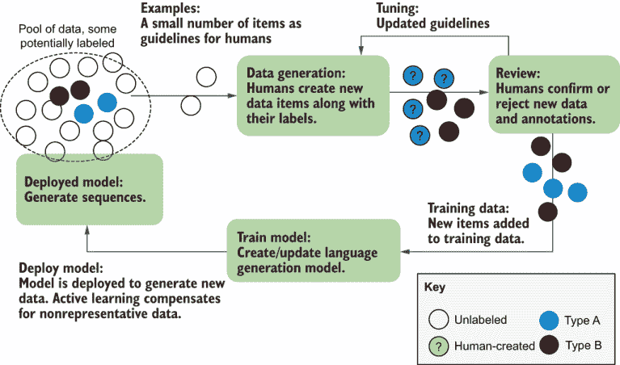

图 10.16 展示了在没有未标记数据存在的情况下生成数据的流程图。这个流程图看起来与其他人工介入的流程图相似，但在数据创建方面没有自动化。人类查看现有示例，并被告知需要创建的示例类型（此处为 A 型和 B 型）。这些示例被添加到训练数据中。

合成数据生成的最难部分是多样性。提示人们使用某些单词或谈论某些事件相对容易。然而，当人们处于压力之下时，他们往往会使用比自然语言中更正式的语言和更短的句子，在自然语言中人们并不那么自我意识。第十一章介绍了一些获取尽可能自然的数据的技术。

## 10.6 其他机器学习任务的标注质量

使用真实数据、标注员间的一致性和机器学习驱动的标注的相同质量控制技术适用于许多其他机器学习任务。本节从高层次概述了更多内容，以突出重要的相似性和差异性。

### 10.6.1 信息检索的标注

*信息检索*是机器学习领域，涵盖了驱动搜索引擎和推荐系统的系统。许多标注员被雇佣来调整搜索引擎的结果。这些系统是一些最古老和最复杂的带有人工介入的机器学习系统。

在搜索引擎的情况下，模型准确性通常通过是否为给定查询返回相关结果来评估。为了使第一个结果比后续结果有更高的权重，信息检索通常使用如折现累积增益（DCG）等方法进行评估，其中 rel[i]是排名位置 p 的结果的分级相关性：

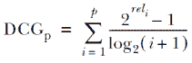

`log()`函数用于降低低级别条目的权重。你可能希望第一个搜索结果是最准确的；你对第二个搜索结果的关心稍微少一些，对第三个搜索结果的关心又少一些，依此类推。对于真实数据，标注员可以通过产生一个最大化 DCG 的候选响应排名来评估。换句话说，最佳排名是将最相关的放在第一位，第二相关的放在第二位，依此类推。一个好的标注员是那些排名最接近真实示例的人。

在信息检索中，DCG 很少因随机机会进行调整，通常是因为“大海捞针”搜索和推荐系统有如此多的潜在响应，随机机会很低。换句话说，数据是稀疏的，随机机会通常接近于零。

稀疏性也可能阻止有效的随机抽样。如果一个注释者在搜索引擎上搜索“篮球”，并需要在随机选择的页面上选择结果，那么所有结果都可能是不相关的。同样，如果一个注释者在购物网站上搜索“篮球”，并返回随机产品，所有结果可能都是不相关的。注释界面将使用现有模型来返回相关结果，而不是随机样本。

要获得注释者的 0-1 评分，可以计算归一化折现累积增益（NDCG）。NDCG 是注释者实际评分除以最高可能评分（注释者所看到的最佳排名，即从展示给注释者的真实数据中得出的完美排名）。这个评分基于注释者所看到的内容（可能是 10 到 15 个候选人）进行归一化，而不是所有可能的候选人，是信息检索中随机机会调整准确度的最流行替代方案。

由于它们对高概率候选人进行过采样，信息系统有可能放大偏差，因为只有高概率的项目被作为候选人返回。这种偏差可以通过添加少量低概率结果来平衡，以增加潜在选择的多样性。在这些情况下应使用 NDCG；否则，注释者的评分将人为地偏低。

如果通过最终用户的选取进行调整，信息检索系统也可能存在偏差，因为大多数查询往往涉及少数高频短语。被雇佣来调整模型的注释者也可以通过给予不成比例更多样化的短语来评估，以平衡训练数据。了解你的训练数据中有多少来自注释者或最终用户，也指导你的主动学习策略。

有时候，你不能通过要求注释者判断相关性来模拟信息检索的使用，因为你不是在优化相关性。在这些情况下，机器学习模型通常优化为面向商业的指标：一个人购买的数量，搜索和购买之间的点击次数或秒数，未来六个月内客户的价值等等。因为它们关于模型的实际使用，这些指标有时被称为*在线指标*，与 F 分数和 IoU 相对，后者是*离线指标*。

信息检索系统通常使用其他类型的机器学习来提供有助于信息检索系统的额外功能/元数据。例如，一部电影可能会被标记为电影类型，而推荐系统会建议你认为你会喜欢的电影类型。以下是一些向信息系统提供输入的任务示例：

+   根据主题对查询短语进行标注，例如将“basketball”搜索分类为“体育设备”类型，以缩小搜索结果

+   执行对象检测以允许搜索，例如允许某人通过上传该产品的照片来搜索产品

+   标注内容类型，例如将音乐分类为“振奋人心”和“阴暗”等类别，以制作适合用户口味的音乐推荐

+   在地图上标注位置类型，例如将商店分类为杂货店或零售店以改进地理搜索

+   从内容中提取序列，例如提取产品的名称、尺寸、颜色、品牌和类似特性，以支持高级搜索系统

在所有情况下，任务本身比信息检索本身要简单：标注、对象检测和序列标注。但这些组件被用于针对用户行为优化的信息检索系统，例如用户多久返回一次该公司的网站。在这些情况下，构建实际信息系统的个人会跟踪这些组件的重要性。

信息检索中的另一种有用技术是查询重构，这是大多数搜索引擎使用的增强技术策略。如果某人搜索“BBall”但没有点击任何结果，而是立即搜索“Basketball”，这一事实告诉你“BBall”和“Basketball”是密切相关的术语，并且“Basketball”的结果应该与“BBall”的结果相似。这种简单但聪明的技术产生了额外的免费训练数据，同时也使你的模型更接近最终用户的偏好交互。

### 10.6.2 多字段任务的注释

如果你的注释任务包含多个字段，你应该考虑将任务分解为子任务，并通过工作流连接这些子任务。无论如何，除了对整个任务进行评估外，还应该对各个字段进行质量评估。考虑以下从类似文本中追踪疫情的事例：

“*大肠杆菌疫情首次在旧金山的超市被发现*”

如果你明确想要捕捉关于这一事件的详细信息，注释可能看起来像这样：

疾病：大肠杆菌；位置：旧金山。

因此，你可以分别评估“疾病”和“位置”的准确性，也可以评估整个事件的准确性。请注意，我们的例子很简单，但并非所有文本都如此明显。考虑以下两个例子：

“*大肠杆菌疫情首次在远离旧金山的超市被发现*”

“*在旧金山和奥克兰分别检测到大肠杆菌和李斯特菌*”

在第一个例子中，我们不希望包括位置。第二个例子有两个我们想要分别捕捉的事件。任务不仅仅是将句子中的每个位置与每种疾病匹配；这是一个更复杂的标注和机器学习问题。你可以将这个任务分解成其子任务，并使用机器学习半自动化，使其成为三个标注任务：

+   标注句子是否讨论疾病爆发为是/否。

+   标注候选位置和候选疾病。

+   将位置和疾病的候选组合标注为同一事件。

通过正确的流程、界面、审查和裁决，复杂的标注事件系统可以变成一系列标注任务，其质量控制比整个事件的质量控制要容易得多。

大多数像这个例子一样更复杂的标注任务可以分解成更简单的任务。确切的接口、质量控制以及机器学习组件取决于你如何分解任务、使用的劳动力以及任务本身的性质。但大多数人可以遵循将复杂任务分解成更简单的机器学习预测审查任务的模式。

### 10.6.3 视频标注

大多数图像质量控制方法也适用于视频中的目标检测和/或语义分割。如果你需要识别视频中的时间点或片段，连续数据和序列标注的方法也适用。

对于目标跟踪，你正在结合定位（边界框）、序列标注（物体可见的帧）和标注（应用于物体的标签）的方法。正如那些例子所示，单独跟踪这些指标比尝试将它们组合成一个单一标注准确度分数要容易。

一些常见的视频标注任务可以纯粹被视为序列标注任务。例如，一个摄像机记录一个人开车，可以在他们似乎没有看路的时候进行标注。序列标注的方法可以应用于这些任务。

视频中的目标检测和/或语义分割的真实数据通常是在单个帧上计算的。如果你的视频长度差异很大，你可能想要从每个视频数据中抽取相同数量的帧，而不是随机抽取所有视频中的帧，这会偏向于较长的视频。

视频任务中的标注者间一致性是根据正在评估的子任务计算的：标注、目标检测、序列识别等。这些方法应适用于视频标注。与真实数据一样，我建议你单独跟踪一致性，而不是尝试将它们组合成一个单一的一致性计算。

视频标注非常适合机器学习自动化。例如，机器学习模型可以跟踪对象的移动，标注员只需要在预测错误时纠正帧。这种做法可以提供实质性的加速，但也可能使模型中的偏差持续存在。

合成数据对于视频标注也有效，但多样性有限。如果你在一个模拟的 3D 环境中自己创建对象，你已经有了关于这些对象移动的完美标注，并且可以比通过人工标注以相同预算创造更多数量级的数据。然而，合成数据可能缺乏多样性，并可能将病态错误引入数据，使模型在现实世界数据上的表现更差。你通常需要小心使用这种方法，并将其与真实世界数据结合使用，使用代表性采样确保你的标注员在真实世界数据上工作，这些数据与你的合成数据最不同。

### 10.6.4 音频数据标注

语音标注专业人士通常拥有高度专业化的标注工具。专业转录员使用脚控，例如，可以快速前后移动录音。语音分割和转录界面在计算机出现之前就已经存在，许多专门技术几乎一个世纪前就已经为磁带录音机开发了。我们将在第十一章中介绍质量控制与音频界面的交集。

根据标注要求，音频可以标注为标记任务、序列任务或生成任务。识别人类语音是否发生是一个标记任务，标注某人在何时讲话是一个序列任务，转录语音是一个生成任务。你可以将这些技术应用于这些任务。

合成数据在语音中很常见，尤其是在要求人类说出某些短语时。可用的公开数据中，关于人们说不同语言的录音并不多。在这些录音存在的地方，语音通常很敏感，因此即使是能够捕获大量语音数据的公司，如手机公司，通常也不应该捕获这些数据，并且应该小心谁可以听到这些数据来进行标注。因此，要求某人朗读文本通常是许多语音识别数据集创建的主要方式。

合成数据也用于确保语音的多样性。例如，某些音素（单个发音声音）在大多数语言中都很罕见。为了确保这些罕见的组合存在于训练数据中，人们通常会给出一些无意义的文本脚本，要求大声朗读；这些单词被仔细选择，以涵盖罕见的音素组合。这种方法可能需要为讲不同口音的人重复进行。

由于敏感性，制造智能设备的公司构建了完整的假客厅、卧室和厨房来收集数据。演员被雇佣与设备互动，在遵循诸如“坐在沙发上背对设备”的指示的同时发出许多命令。如果你已经在这个领域工作，我建议邀请你的朋友和家人参观这些工作室之一，而不要给他们任何背景信息。走进一个中心设有假客厅的大型、昏暗的仓库，里面充满了说些无意义话语的人，这种感觉就像变形外星人正在准备入侵地球，真是奇怪。

## 10.7 不同机器学习任务注释质量进一步阅读

与本书中其他主题相比，不同任务的质量控制文献较为稀少，但一些相关论文几乎讨论了章节中涵盖的所有内容。

### 10.7.1 计算机视觉进一步阅读

一篇关于数据质量评估的优秀论文是“使用 Krippendorff Alpha 评估计算机视觉应用中注释数据质量”，由 Joseph Nassar、Viveca Pavon-Harr、Marc Bosch 和 Ian McCulloh 撰写([`mng.bz/7Vqg`](http://mng.bz/7Vqg).)

展示没有一种接口适合所有计算机视觉任务的深入研究的论文之一是“两个工具胜过一：工具多样性作为提高总体众包性能的手段”，由 Jean Y. Song、Raymond Fok、Alan Lundgard、Fan Yang、Juho Kim 和 Walter S. Lasecki 撰写([`mng.bz/mg5M`](http://mng.bz/mg5M))。这篇论文也是其他近期计算机视觉注释工作的良好参考资料。

对于计算机视觉中用于模型但也可应用于注释的数据增强技术，我强烈推荐 Richard Szeliski 所著的《计算机视觉：算法与应用》，第 2 版([`szeliski.org/Book`](http://szeliski.org/Book))。

对于自动化判断是否为特定图像绘制边界框或进行审查任务是否最优的有趣示例，请参阅“学习智能对话框进行边界框注释”，由 Ksenia Konyushkova、Jasper Uijlings、Christoph H. Lampert 和 Vittorio Ferrari 撰写([`mng.bz/5jqD`](http://mng.bz/5jqD))。

### 10.7.2 自然语言处理注释进一步阅读

专门针对自然语言处理，“计算语言学中的编码者间一致性”，由 Ron Artstein 和 Massimo Poesio 撰写，这是一项良好的基础工作，特别是在讨论序列标签中的协议及其与重叠范围和识别标记或段落的复杂性方面表现突出([`mng.bz/6gq6`](http://mng.bz/6gq6))。

对于语言生成，一篇不错的近期论文是“Agreement is overrated: A plea for correlation to assess human evaluation reliability”，作者是 Jacopo Amidei、Paul Piwek 和 Alistair Willis ([`mng.bz/opov`](http://mng.bz/opov))。请注意，他们讨论的是评估机器输出，因此论文侧重于评估数据，但这种方法可以应用于训练数据。

最近一篇关于使用利用预训练模型的优势的机器学习方法的自动评估文本生成的论文是“BLEURT: Learning Robust Metrics for Text Generation”，作者是 Thibault Sellam、Dipanjan Das 和 Ankur P. Parikh ([`mng.bz/nM64`](http://mng.bz/nM64))。在论文中查看其他关于自动评估文本生成系统质量的新近工作的参考文献。

### 10.7.3 信息检索标注的进一步阅读

参见“Ittai Abraham、Omar Alonso、Vasileios Kandylas、Rajesh Patel、Steven Shelford 和 Aleksandrs Slivkins 的《How Many Workers to Ask?: Adaptive Exploration for Collecting High Quality Labels》”，[`mng.bz/vzQr`](http://mng.bz/vzQr)。

## 摘要

+   所有机器学习任务都可以利用诸如真实数据、标注者间一致性、将任务分解为子任务、专家评审和裁决任务、合成数据以及通过机器学习的（半）自动化等标注策略。每种方法都有其优势和劣势，这取决于任务、数据以及你正在解决的问题。

+   连续任务可以接受一系列可接受的答案，在某些情况下可以使用群体智慧来确定是否接受最佳标注者的标注而不是项目的平均标注值。

+   目标检测任务应分别跟踪定位准确性和标签准确性。请注意，IoU 在维度较高时，对于相同的一般标注者性能水平，将产生较低的分数。

+   语义分割可以利用专家标注者可以裁决不同意见区域而不是重新标注整个图像的评审任务。

+   序列标注任务通常使用人类在环系统生成候选者，尤其是在重要序列相对罕见时。

+   语言生成任务通常有多个可接受的答案。这些答案可以针对每个项目进行多个真实示例的评估，或者由评估输出并对其准确性及一致性进行评估的人类进行评估。

+   其他机器学习任务，如信息检索，通常使用人类在环的标注系统，尤其是在随机样本数据很少出现相关项目时。
