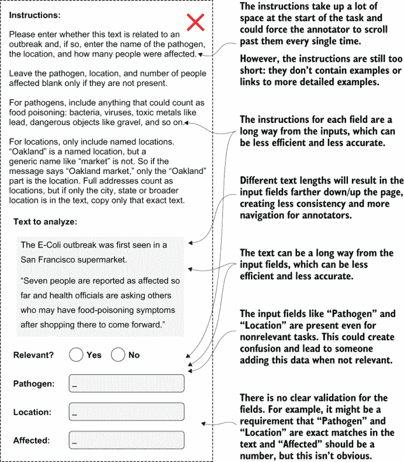
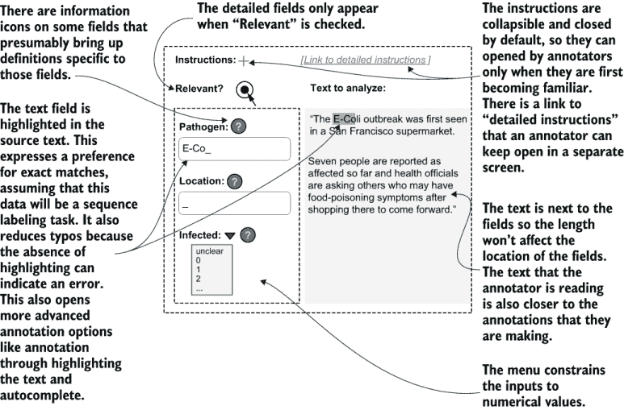
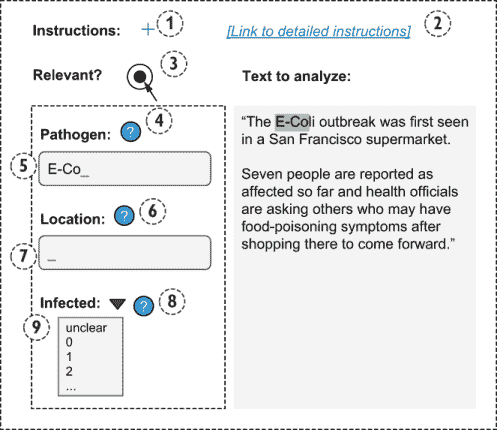
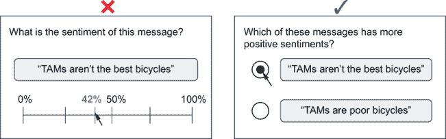
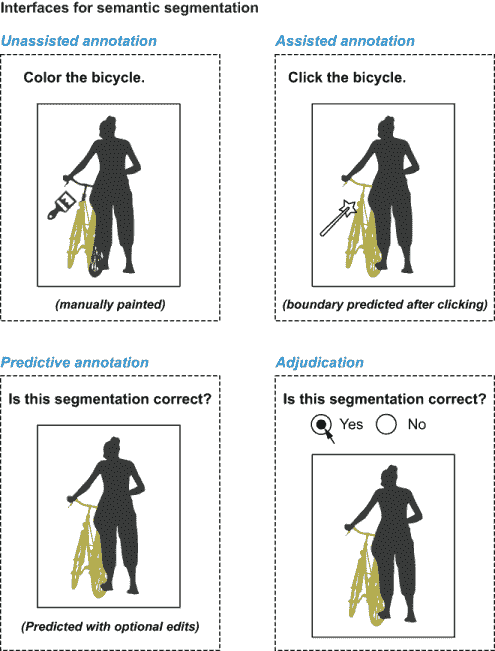
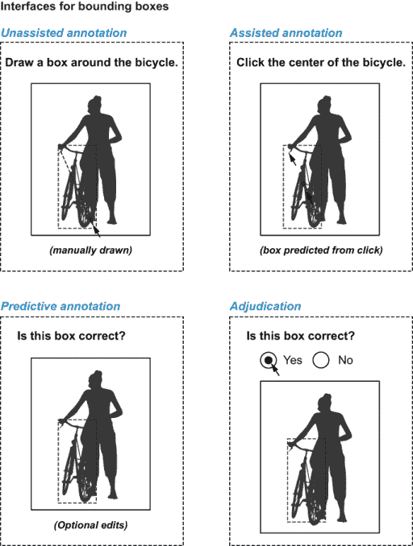
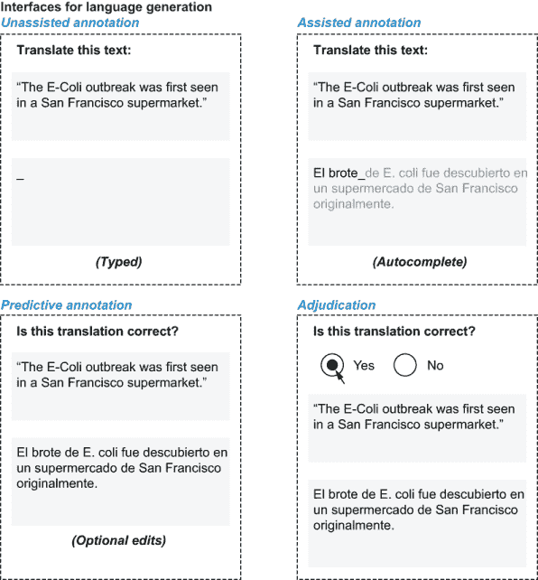
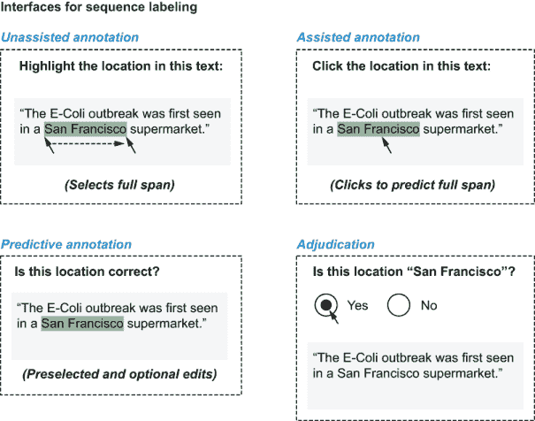
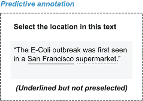
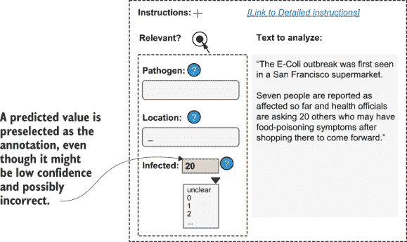

# 11 数据标注界面

本章涵盖

+   理解基本的人机交互原则

+   在标注界面中应用人机交互原则

+   结合人类和机器智能以最大化各自的优势

+   实现不同级别的机器学习集成接口

+   在不破坏现有工作习惯的情况下将机器学习添加到应用中

在过去的 10 章中，我们已经涵盖了关于人机交互机器学习的所有内容，除了人机界面的关键组成部分。本章涵盖了如何构建最大化标注效率和准确性的界面。本章还涵盖了权衡：没有一套统一的界面约定可以适用于每个任务，因此你必须就最适合你任务和标注者的用户体验做出明智的决定。

假设你需要从文本中提取有关疾病爆发的信息。如果你有已经手动完成这项任务的领域专家（SMEs），你可能希望在不打扰他们现有工作习惯的情况下，对该应用进行一些简单的基于机器学习的扩展。如果你与非专家标注者合作，你可能创建一个新界面，其中大多数标注者只需简单地接受或拒绝模型预测，因为这样的界面将最大化效率同时使质量控制变得更容易。如果你拥有这两种劳动力，你可能选择两种界面，为每个劳动力使用合适的界面。

对于任何界面，错误的设计都可能影响整个标注过程的质量和效率。因此，为正确的人建立正确的界面是一个复杂的问题，在你添加机器学习之前就已经如此。本章提供了设计正确界面（s）的基本工具，以适应你的标注任务。

## 11.1 人机交互的基本原则

首先，让我们看看一些构建标注工具的界面约定。这些约定和应用程序开发库已经被专注于用户体验和人机交互的专业人士优化，并且很难改进。在某些情况下，你需要从多个约定中进行选择。本节帮助你理解权衡。

### 11.1.1 介绍可用性、反馈和代理

*可用性* 是一个设计概念，认为物体应该以我们感知的方式运作。例如，在物理世界中，门把手应该看起来像可以旋转的东西，门应该看起来像可以打开的东西。在在线世界中，应用程序中的按钮应该看起来可以点击。在线系统中的其他例子包括页面顶部的菜单系统，当鼠标悬停时显示导航选项，点击+以展开隐藏内容，以及点击?以获取帮助。

*反馈* 是用户体验中可用性的补充。如果有人点击了一个按钮，一些动画、消息或其他事件应该让注释者知道他们的操作已被记录。反馈验证了可用性，告诉用户他们感知到的可用性是真实的，或者他们的感知是错误的（如果没有任何动作或指示表明该动作不合法）。

带有良好可用性和反馈的界面直观上感觉易于使用，因此你通常在违反常规时才会注意到它。当你点击按钮时没有任何动作的按钮感觉是损坏的，如果你看起来像是一个静态的框，你可能会错过按钮的存在。你可能在制作糟糕的网站上遇到过这类按钮——你不想在注释界面上犯的错误。（隐藏的书架门很有趣，因为它们打破了这些常规，但打破这些常规很少会让注释变得有趣。）

在 UI 框架内使用现有元素通常有助于良好的设计，包括可用性。如果你正在使用基于 Web 的界面，你应该在推荐的上下文中使用现有的 HTML 表单元素：单选按钮用于单选，复选框用于多选，等等。

使用现有的 UI 组件也有助于提高可访问性。如果你使用默认的 HTML 按钮元素而不是创建自己的，你将更好地支持那些翻译这些元素或从文本创建语音的人。

*代理* 是用户感知到的力量和所有权感。设计中的良好可用性和反馈给予注释者在个人行动中的代理权。"代理"还指更全面地指注释者体验。以下是一些你需要提出的问题，以确保注释者在工作中感到有代理权：

+   注释者是否觉得界面允许他们注释或表达他们认为重要的所有信息？

+   他们是否感觉到他们的工作正在帮助他们正在工作的项目？

+   如果他们正在使用机器学习辅助其注释的界面，他们是否认为机器学习提高了他们的工作效率？

本章提供了不同类型可用性和反馈的示例，并讨论了每种类型如何与注释者的代理权相关。

人们在使用注释界面时犯的最大错误之一是从游戏中借用常规。如第七章所述，我不建议你对有偿工作进行游戏化。如果你强迫某人在类似游戏的环境中完成有偿工作，如果它不是标注数据的最高效方式，工作会很快变得令人厌烦。请参阅以下侧边栏了解更多关于为什么你不希望对注释任务进行游戏化的原因。

好的界面给你的是质量，而不仅仅是数量

*Ines Montan 的专家轶事*

当我与人们谈论用于注释的可用界面时，反应往往过于简单：“为什么费那个劲？收集注释并不昂贵，即使你的工具速度快一倍，那也并不那么有价值。”这种观点是有问题的。首先，许多项目需要来自律师、医生和工程师等 SME（行业专家）的认可，他们将进行大部分的注释工作。更根本的是，即使你给他们的报酬不多，你仍然关心他们的工作，如果你让他们处于失败的状态，他们就无法为你提供优质的工作。不良的注释流程常常迫使工作者在示例、注释方案和界面之间切换焦点，这需要积极的注意力，很快就会变得疲惫不堪。

在我开始从事人工智能工作之前，我在网页编程方面工作过，因此注释和可视化工具是我开始思考的第一批人工智能软件。我特别受到游戏中无形界面的启发，这些界面让你思考该做什么，而不是如何去做。但这并不是将任务变得像游戏一样有趣的游戏化；这是使界面尽可能无缝和沉浸式，以便注释者有最好的机会完成他们的任务。这种方法会产生更好的数据，并且更加尊重创造这些数据的人。

*Ines Montani 是 Explosion 的联合创始人，spaCy 的核心开发者，Prodigy 的主开发者*。

### 11.1.2 设计注释界面

对于简单的标签任务，良好的可用性和反馈需要根据其推荐用途使用现有组件。你使用的任何框架都应该有单选或多选元素、文本输入、下拉菜单等元素。

你可能会在一些框架中找到一些更复杂的形式元素。例如，React Native JavaScript 框架除了更通用的表单输入外，还有一个自动完成组件。你和你的注释者可能已经在其他网络应用程序中使用了这种自动完成功能，并且熟悉了 React Native 界面的设计惯例，因此通过选择现有的框架而不是创建自己的自动完成功能，你可以获得更好的可用性。

习惯在演变，因此在实现你的界面时，要关注当前的惯例。例如，自动完成功能最近才流行起来。五年前使用大型菜单系统或单选按钮的许多网站现在都使用了自动完成功能。你的注释界面应该基于当前的惯例，无论这些惯例在构建界面时是什么。

对于序列标注任务，你很可能会选择键盘或鼠标标注，或者两者都使用。在键盘标注的情况下，箭头键应允许标注者在前向后退段落。在基于鼠标的标注情况下，标注者应能够悬停在段落上并/或点击段落。在这两种情况下，可利用的功能应确保处于焦点状态的段落以某种方式突出显示，以便标注的范围清晰可见。

对于目标检测和语义分割任务，最广泛使用的 UI 框架是不够的。没有标准的 UI 库允许你为 HTML 实现像素标注，例如。对于这些任务，你将使用来自图像编辑软件的约定。可利用的功能将来自诸如能够通过框、多边形和智能工具捕获相似像素区域的能力等预期。

如果人们在使用平板电脑或手机进行标注，那么可利用的功能包括能够通过捏合来放大图像以及通过滑动屏幕来导航。一些 Web 框架在平板电脑和手机上运行良好，而一些则不行。你可能需要考虑为手机和平板电脑构建原生于 Android 和 iOS 操作系统的界面，但这类标注界面很少见；大多数人如果需要长时间工作，更愿意在电脑上操作。

### 11.1.3 最小化眼动和滚动

尽量将标注任务的各个组成部分都保持在屏幕上，这样标注者就不需要滚动屏幕。同时，尽量将每个标注的所有元素（说明、输入字段、被标注的项目等）放在相同的位置。如果你的项目大小不一，可以使用表格、列和其他布局选项来确保输入字段和项目在不同大小的情况下不会移动或丢失。

你可能在网上阅读内容时经历过滚动疲劳。当人们不得不滚动以找到本可以首次加载时就能显示在屏幕上的内容时（称为*折叠之上*，因为报纸将重要内容优先放在报纸顶部，以便折叠时也能看到），他们就会变得不那么专注，并感到沮丧。同样的情况也适用于标注。如果所有内容都能适应屏幕，那么滚动对标注者来说将是一个更慢且更令人沮丧的体验。

标注的说明和指南可能会在屏幕上容纳所有信息时造成问题。您希望为注释者提供详细的说明，但这些说明会占用屏幕的大部分空间。此外，一旦注释者完成了足够多的任务以记住这些说明，说明就会变得冗余，因此对于注释者来说，不断滚动查看不再需要的说明可能会感到沮丧。最简单的解决方案是使说明可折叠，以便在需要时展开。另一个选项是将一些或全部说明移至相关字段，仅在那些字段获得焦点时显示它们。第三个选项是在单独的页面上放置说明，并允许注释者调整他们的浏览器窗口以显示单独的标注和说明窗口。请注意，如果您选择第三个选项，您需要在设计中考虑较小的标注窗口。

在考虑有效设计时，从不要做的事情的例子开始可能最容易。图 11.1 显示了违反大多数良好 UI 设计规则的示例界面。

图 11.1 标注界面不良的示例。此界面要求注释者不断在屏幕上移动注意力，输入数据的长度可能会改变屏幕上对象的布局，这会降低一致性。这个界面可能会降低标注的效率和准确性。

现在比较图 11.1 和图 11.2，后者具有更友好的注释者布局。尽管图 11.2 中的界面在实现上仅比图 11.1 中的界面稍微困难一些，但一些简单的更改，如将源文本放在输入字段旁边，解决了图 11.1 中的许多问题。

图 11.2 标注界面良好的示例。此界面将源文本放置在输入字段附近。它还提供了多个选项，让注释者可以访问说明，而这些说明不会打断任务的设计或布局。您可以预期这种布局将更高效、更易于使用，并且比图 11.1 中的界面产生更准确的数据。（您的界面也应具有明显的提交按钮和注释者反馈字段；这些按钮在此省略以保持示例简洁。）

除了图 11.2 中提到的其他好处外，两列布局比图 11.1 中的一列布局更可能适合水平显示器。然而，您需要假设您的注释者的机器的屏幕尺寸和分辨率，以及他们使用的浏览器。

根据您所使用的劳动力类型和参与时间的长短，考虑为您的标注员购买机器和/或屏幕。这些购买可能通过提高吞吐量和准确性来收回成本；它们还可能让您的工程师有更多时间来确保与每个可能的浏览器和屏幕配置的兼容性。

本节未涵盖关于页面布局的一些假设。例如，图 11.1 和图 11.2 在某种程度上偏向于从左到右的布局。对于从右到左语言的编写者来说，这些布局可能并不直观。我建议阅读专门关于良好网页设计的书籍（特别是 HTML 表单的良好设计），以深入了解此主题。

### 11.1.4 键盘快捷键和输入设备

键盘快捷键对于几乎所有标注项目都是核心的，但很容易被忽视。键盘快捷键有助于导航和输入。

使用鼠标导航比使用键盘慢得多，因此请注意输入的标签顺序（或标签索引）。在大多数应用程序中，按 Tab 键通常会将焦点从一个元素移动到下一个元素。在表单的情况下，这种移动通常是下一个表单输入。Tab 键是高效标注最重要的键盘快捷键，因此当用户按下 Tab 键时，输入在屏幕上获得焦点的顺序应该是直观的。图 11.3 显示了图 11.2 中示例界面的默认标签顺序。

图 11.3 展示了标签顺序的一个示例，显示了按 Tab 键时焦点从一个元素切换到下一个元素的顺序。此界面有九个可点击元素，这些元素将是基于 Web 界面的默认焦点顺序的一部分，但其中只有四个元素是标注任务的输入字段，因此可以通过定义不同的标签顺序来改进此任务。

您可能需要明确定义标签顺序，以便使此界面正常工作。例如，在图 11.3 中，在“病原体”输入之后预期的标签顺序是“位置”输入，但默认的 HTML 标签顺序可能将“位置”的信息链接作为下一个焦点。您可以通过使用`tabindex=`在 HTML 中本地按升序顺序定义标签顺序，或者通过使用 JavaScript 显式定义某些元素上按键的结果。

对于通过箭头键进行导航的情况也是如此。当用户按下键进行导航时（通常右箭头键与 Tab 键相同），将会有默认的焦点顺序，但您可能需要明确更改此顺序，以便对您的界面来说最为直观。

您可能需要决定是否要抑制某些默认键盘选项。如果您正在使用网页表单，按下 Enter 键会提交该表单。如果您有包含换行符或允许 Enter 键自动完成的文本输入，您可能希望抑制 Enter 键提交任务，除非提交按钮处于焦点状态。同样，如果您的表单主要由自动完成字段组成，并且人们期望使用 Tab 键完成字段，您可能希望仅通过箭头键或按下 Ctrl-Tab 键来允许基于 Tab 的导航。您可能需要进行几次测试迭代以正确设置焦点导航。

如果您无法将所有标注简化为键盘快捷键，您应该考虑为您的标注者提供最适合他们任务的鼠标或触摸板输入。对于其他输入也是如此，例如麦克风、摄像头以及专业转录员使用的脚踏板等专业工具，这些工具可以在保持双手自由打字的同时，在音频和视频记录中前后移动。您应该尝试使用您自己构建的任何东西一段时间——至少 15 分钟用于快速任务，如果平均每项标注时间超过几分钟，则更长。

## 11.2 有效打破规则

当您对实现遵循传统界面的接口感到舒适时，您可以打破设计规则。本节提供了三个不太常规但效果良好的注释界面示例：带有滚动的批量注释、作为输入的脚踏板和音频输入。请注意，您可能需要自己编程交互场景，包括任何可访问性考虑，因此您必须权衡实施成本与收益。

### 11.2.1 批量注释时的滚动

当存在数据不平衡时，滚动可以提高标注任务的注释效果。假设您想在成千上万张图片中找到自行车的图片，其中大部分不是自行车。滚动浏览大量图片比逐个查看它们更有效率，并减少了第 11.3.1 节中引入的一些重复启动问题。数据有时不平衡有很好的理由，包括随机抽样、在本质上不平衡的代表性数据上创建评估数据，以及检查您知道应用于不平衡数据的模型的预测。当您无法避免数据不平衡并且可以将任务简化为二元决策时，滚动成为一种良好的惯例。

### 11.2.2 脚踏板

脚踏板在计算机上并不常用，这无疑是一个错失提高注释效率的机会，考虑到脚踏板在操作车辆和音乐设备中的普遍性。脚踏板最初在音频领域被使用，以便人们能够在磁带录音机中前后移动（如第十章所述），并且至今仍受到转录工作者的青睐。在转录之外，脚踏板在注释中并不常用。对于任何视频或音频任务，都应可能使用脚踏板，以便注释者能够快速地前后扫描。如果您的注释者正在注释音频、视频或任何其他流式数据，并且需要来回导航，考虑为您的注释者购买脚踏板。USB 脚踏板广泛可用且相对便宜。学习曲线很短——大约几个小时，而不是几天或几周。

除了提供前后导航外，脚踏板还可以编程到特定的键。例如，按下脚踏板可以模拟按下 Ctrl 键，或者遍历菜单项。更改功能的方式类似于按下钢琴踏板改变音符的音调，遍历菜单项的方式类似于吉他手使用选择踏板遍历音效。这类脚踏板也广泛可用，并针对用户体验因素如按钮间距和（物理）便利性进行了优化，因此您可以将音乐行业的一些经过验证的传统应用到创建一些新颖有趣的注释界面中。如果您正在注释任何类型的数据，您可能想要考虑使用脚踏板来帮助加快处理速度，并通过将手和手腕的运动改为脚部运动来减少重复性动作的疲劳。

### 11.2.3 音频输入

如果您正在使用手操作键盘和鼠标，而您的脚上有脚踏板，那么您只剩下嘴巴了。音频输入对于创建语音识别数据是常见的（显然），但在其他地方并不广泛使用。

音频可以增强许多注释任务的标签组件。假设您正在为 100 个对象类别绘制边界框。没有菜单系统可以让注释者轻松导航以选择 100 个类别中的 1 个，而自动完成会分散他们的注意力。如果注释者可以说出标签，他们就不需要将注意力从注释过程中移开。除了标签之外，音频还可以通过如“下一项”、“上一项”、“缩放”或“增强”等命令进行导航。

提示：如果您允许基于语音的注释，请考虑使用较长的标签名称，因为语音识别在短词上的准确性较低。可能不值得投入资源仅为了注释创建定制的语音识别模型，这就是为什么许多语音界面的语音系统最终会退回到数字菜单系统。

## 11.3 注释界面中的启动

除了决定合适的界面外，你还需要考虑顺序效应和其他上下文因素可能如何影响标注。第七章、第八章和第九章介绍了识别合适的劳动力队伍和评估质量的方法。为了总结主要收获：你应该确保你的劳动力队伍接受正确的培训；跟踪与任务相关的标注员人口统计信息，而不是侵犯隐私；并采用质量控制方法，如真实数据和标注员间一致性，以确保偏差最小化。

如第一章所述，当标注可以受到上下文的影响时，包括任务设计和任务顺序，就会发生前置。前置通常被视为不好的事情，因为你不希望标注受到任务本身的影响。你希望每个标注尽可能客观，尽管在第 11.3.2 节中我们将讨论一些例外。前置可能独立于每个标注员的个人背景，或者对某些标注员的影响比其他标注员更强，因此仔细思考前置和标注员背景如何结合以增加标注的偏差是很重要的。

### 11.3.1 重复前置

标注中最显著的前置问题就是重复。标注员可能会根据他们之前看到的项来改变对某项的解释。重复前置在主观任务中很常见，例如情感分析；大多数标注员随着时间的推移，基于他们最近看到的项重新校准解释，他们的观点关于相邻类别（如负面和非常负面）之间的边界可能会发生变化。

在大量重复的情况下，注意力和疲劳也成为问题。数据缺乏多样性可能导致盲目点击相同的标注，即使它可能是错误的。在许多有序数据集中，相邻的项来自同一来源和/或时间，因此随机化项的顺序是减少这种影响的一种简单方法。

确保标注员有足够长的实践和训练期也有助于他们熟悉数据，这样在他们开始贡献训练和评估数据之前，就能对数据有更全面的了解。对于像情感分析这样的任务，你可能会要求标注员在开始标注之前先查看数千个示例，以便他们首先校准他们的评分决策。

当你拥有不平衡的数据时，随机化和延长的实践期可能不足以解决问题。在这些情况下，你可以实施一些多样性采样方法，以确保每个项目尽可能不同于前一个。对于标注任务，你可以使用预测标签来进行分层采样。基于聚类的采样也可以有所帮助，例如将数据分为 10 个簇，并按顺序从不同的簇中进行采样。

您也可以在标注后监控重复提示的效果。如果您在标注中遇到高度不一致的情况，您应该查看之前的标注序列，以确定标注者之间的一致性是否可能来自顺序效应。项目的顺序不应该是标注的预测因素。

### 11.3.2 提示伤害的地方

当标注需要主观或连续判断时，提示伤害最大。如果有固有的排名，例如在负面到正面的情感尺度上评分，一个人的解释可能会受到重复提示的影响。在第 11.4.3 节中，我们将讨论如何将此任务作为排名问题而不是评分问题来最小化这种类型的提示。尽管人们可能会随着时间的推移改变情感分数，但他们关于正面到负面情感排名的判断可能更稳定。

提示也可能伤害那些两个类别接近的分类任务。本书中的例子是一个人推自行车的例子，重复可能会提示某人根据他们最近标注的内容将图像标记为“行人”或“骑自行车者”。第一章提供了一个很好的关联提示的例子：当房间里有一个填充的袋鼠玩具或几维鸟时，人们更有可能将口音解释为来自澳大利亚或新西兰，即使任务本身没有提到这些玩具。

### 11.3.3 提示有助于的地方

在某些情况下，提示是一个好事。当标注者随着时间的推移因为对数据的熟悉度增加而变得更快时，这种效应被称为*积极提示*，这几乎总是有益的。

在某些情况下，由上下文（上下文或关联提示）引起的提示也是有利的。如果标注者正在转录与健康相关的音频，并且听到一个可能是*病人*或*耐心*的词，他们应该从直接上下文和任务主题中知道*病人*更有可能。在这种情况下，提示有助于任务。

当提示改变某人的情绪状态时，这种效应被称为*情感提示*。如果标注者对自己的工作感到更积极，他们更有可能工作得更快，更准确，这样每个人都能受益。尽管情感提示对于可能具有情感成分的主观任务（如情感分析）并不总是理想的，但它对于激励是有价值的。你会在工作时放音乐吗？如果是这样，你可以告诉人们你正在进行积极的自我情感提示以提高生产力。与其将提示视为总是负面的东西，不如将其视为一组需要你在标注和界面设计中留心并管理的非客观行为。

## 11.4 结合人类和机器智能

人类和机器有不同的优势和劣势。通过发挥每个的优势，你应该能够最大化两者的性能。一些差异是明显的。例如，人类可以以一种比我们在第 3、4、5、6 章中讨论的任何不确定性或多样性方法都要复杂得多的方式，给出关于他们在任务中困惑的简短纯文本响应。其他差异则更为微妙，需要更深入理解人机交互。正如讨论的那样，机器在预测连续任务中的值时是一致的，但人类由于启动效应而不一致，即使在重复任务时也会改变他们的评分。

标注者很快就会成为他们所处理数据的专家。研究人员对于是否存在长期启动效应存在分歧；有些人声称它不存在。如果长期启动效应确实存在，那么它是非常微小的。启动的长期影响较低对标注是有益的，因为这意味着标注者随着时间的推移在建立他们的专业知识，同时无论他们看到的具体数据项如何，都能保持高水平的主观性，只要他们看到了各种综合性的项目。因为标注者正在深入面对的问题中，提供和获取标注者反馈将提高你的任务。

### 11.4.1 标注者反馈

你应该始终提供一个机制，让标注者能够就他们正在工作的具体任务给你提供反馈。标注者可以对任务的许多方面提供反馈，例如界面的直观性、指示的清晰性和完整性、某些数据项的歧义性、他们对某些项目知识的局限性，以及你可能没有注意到的数据中的其他模式和趋势。

理想情况下，你应该包括让标注者在任务中提供关于任务的反馈的选项，可能通过一个简单的自由文本字段。你也可以通过电子邮件、论坛或实时聊天邀请反馈。在任务中包含反馈通常是确保反馈与被标注的项目保持联系的最简单方法，但在某些情况下，其他反馈机制可能更合适。例如，论坛可以让有相似问题的标注者看到回应。实时聊天允许标注者在难以标注的项目上进行协作，唯一的缺点是当标注者不是独立的时候，质量控制变得更加困难。（关于这一主题的更多信息，请参阅第 8 至 10 章关于质量控制的内容。）

反馈是双向的：你应该向标注者反馈标注的使用情况。当人们知道他们的工作正在产生影响时，他们更享受自己的工作。然而，如果标注后一段时间内没有重新训练下游模型，或者用例或模型的准确性敏感，提供反馈可能会很困难。尽管如此，你仍然应该能够讨论标注提供的一般价值。

在某些情况下，效果可能很明显，尤其是在机器学习辅助的人类任务中。在我们的从文本中提取关于疫情信息示例中，如果提取的数据本身是有用的，而不仅仅用于训练机器学习模型，那么这种有用性可以传达给标注者。

如果标注者对机器学习模型将要执行的任务有更好的了解，他们的标注准确性将会提高。对于在户外拍摄的照片上的语义分割任务，了解目标是计数树上的叶子还是树木只是前景应用中的背景，将有助于标注者。当有更多透明度时，每个人都能受益。

你还可以将反馈纳入标注任务中。如果你正在标注情感，你可以要求标注者突出显示哪些词有助于他们对积极或消极情感的解释。对突出显示的一个有趣扩展是要求标注者编辑这些词来表达相反的情感。这个过程——通过最少的编辑更改标签——被称为*对抗性标注*。经过编辑的项目可以成为额外的训练数据项，这有助于你的模型学习对标签最重要的词语，而不是过分重视恰好与最重要的词语一起发生的标签。

### 11.4.2 通过询问他人会如何标注来最大化客观性

在第九章中，我们介绍了激发标注者认为其他人会如何标注的方法。这种方法在贝叶斯真理血清（BTS）等指标中流行起来，帮助我们识别那些可能不是多数判断但仍然正确的标注。

一个好处是，这种方法减少了感知到的权力动态问题，因为你在询问其他标注者的看法，这使得标注者报告负面反应更容易。当你认为权力动态或个人偏见正在影响反应时，这是一个好的策略：询问大多数人会如何反应，而不是询问那个标注者认为会如何。

对于像情感分析这样的任务，标注者可能不愿意标注他们工作的公司负面情感。当这种犹豫源于感知到的权力不平衡，例如当标注者被补偿以创建训练数据时，这种影响被称为“适应”或“顺从”。询问其他人会如何解释情感，给标注者提供了从他们自己的数据解释中抽身而出的许可，因此可以给出更准确的自我判断反应。

注意，这个例子是对第九章中主观数据策略的限制。在那里，我们期望实际的标注得分高于预测的标注得分，以识别出并非一定是多数的有效标签。如果标注者存在感知到的权力不平衡，一个有效的标签可能具有比实际得分更高的预测得分。因此，所有具有高预测得分的标签都应被视为在这些情境中可能有效，无论它们是否高于实际得分。

### 11.4.3 将连续问题重新构造成排序问题

人们在对连续尺度进行判断时是不可靠的。一个人的 70%可能是另一个人的 90%。人们甚至对自己的判断也不可靠。对于情感分析，人们在第一次遇到某事物时可能将其评为“非常积极”，但在看到更多甚至更积极的例子后，他们可能会因为启动或其他个人情绪变化而将其评级改为“积极”。

尽管人们在绝对分数上可能不一致，但当要求对两个项目进行排序时，他们通常彼此之间以及对自己都是一致的。两位标注者可能对两条消息的情感评分不同，但一致地将一条消息排序为比另一条更积极。图 11.4 展示了这样一个例子。

图 11.4 使用排序作为替代绝对值标注连续值任务的示例。当要求对项目进行排序而不是给出绝对分数时，人们通常在彼此之间以及在不同时间对自己都更为一致。

如图 11.4 所示，一个简单的界面可以将连续任务转换为排序任务，这通常会导致更一致的标注。使用排序而不是绝对值有其优缺点。优点包括：

+   更一致的结果。结果将根据您的数据和任务而变化，但测试起来相当容易；您可以实施这两种技术并比较它们。

+   每个任务的用时更快。勾选框比输入、滑动或选择连续刻度更快。

+   对于需要标注连续值的任务，无论是客观任务还是带有 BTS 的主观任务，进行质量控制比连续任务更容易，对于二分类任务尤其如此。

但也存在缺点：

+   您只能获得排名，而不是实际的分数，因此您需要一些具有绝对分数的项目。您可能已经在您的指南中创建了 90%、50%、75%等项目示例。您可以要求标注员确定每个项目相对于这些示例的排名，并使用这些信息来插值其他项目的分数。

+   您需要解决循环排名问题，例如当项目 A 的排名高于项目 B，项目 B 的排名高于项目 C，而项目 C 的排名又高于项目 A 时。您可以使用审查和裁决任务，要求对所有项目进行强制排名，或者使用简单的方法，如迭代地移除最不可信的排名，直到循环消失。

+   对每个项目进行排名需要更多的任务。您需要对具有*N*个项目的数据集中的每个项目进行*N log(N)*次判断。这个算法本质上是一个排序算法，其中每次判断都是一个比较，您只需要*N*个标注来给每个项目打分。

最后一点，*N log(N)*的判断可能因为隐含的规模而显得是一个决定性的因素，因为当只提供评分时，您需要*N log(N)*个任务而不是*N*个任务。然而，二分类任务更快且更一致。此外，正如您在第十章中学到的，由于平均需要更少的标注员来计算标注者间的一致性，因此在二分类任务上实施质量控制比在连续任务上更容易，因此总成本甚至可能持平。

为了举例说明，假设我们要对 10 万个项目进行标注。对于一个数值评分界面，假设我们希望每个任务平均有四个标注员，并且每个任务平均需要 15 秒：

10 万个任务 × 4 个标注员 × 15 秒 = 1,667 小时

对于成对排名，假设每个任务平均只需要两个标注员，并且每个任务平均需要 5 秒：

100,000 × log(100,000)个任务 × 2 个标注员 × 5 秒 = 1,389 小时

因此，在相同的预算下，如果您使用排名方法，您很可能会得到一个更准确的数据集，尽管总的标注数量会更多。许多学术论文关注的是操作总数，而不是总时间，如果作为计算机科学家您研究过“大 O”算法方法，这一点同样适用。所以，在计算了所有因素的成本，包括每个任务的时间和质量控制难度之前，不要轻易排除不同类型的界面。

你可以使用机器学习来半自动化地处理标注界面，但排名界面也有一个优势，那就是它不太容易受到偏差的影响。如果你有一个机器学习预测，认为分数是 0.40，你可以在标注界面中预先填充 0.40 以加快标注速度。然而，预先填充 0.40 答案可能会让标注者认为在 0.40 或接近 0.40 的分数是正确的（这被称为锚定）。相比之下，如果你使用排名界面，你可以开始将项目与接近 0.40 的项目进行比较，以减少总的标注数量，但你不会使标注者偏向任何成对决策；他们不会知道他们在排名中接近 0.40，而且实际任务并没有指出应该优先考虑哪种排名顺序。因此，界面决策也对如何有效地将机器学习与标注任务相结合有影响——对于任何类型的机器学习问题，而不仅仅是标注和连续任务。下一节将更详细地介绍如何在不同的标注任务中整合机器学习。

## 11.5 智能界面以最大化人类智能

在一定程度上使用或减少机器学习来辅助标注时，你通常是在效率和准确性之间进行权衡，但也有一些例外。机器学习可以发现人可能会忽略的错误，例如，这可以同时提高效率和准确性。

除了效率和准确性之外，界面的选择还会改变标注者感知到的权力（即代理权）的大小，而且某些类型的界面在实现时可能需要比其他类型更多的工程资源。因此，你需要了解不同界面的优缺点，以便为你的任务选择合适的界面。

表 11.1 描述了机器学习在人类任务中的参与程度不断提高，从原始标注（没有机器学习输入）开始，到裁决（人类标注者接受或拒绝模型预测的审查任务）结束。

表 11.1 还显示了四个可以决定适合你任务的正确接口的因素。请注意，这些因素与正向或反向的效率都不一致，因此权衡是非线性的。例如，随着自动化的增加，质量通常会下降，但裁决并不是最差的，因为二元裁决任务的质量控制比任何其他标注任务都要容易得多。辅助标注接口提供了最多的自主权，因为它们只移除了最冗余的任务，但它们需要最多的工程来构建，并且通常需要为标注目的特别调整或重新训练的模型。预测标注接口早于现代机器学习方法，在基于规则的天然语言处理（NLP）系统中被广泛使用，通常称为*预测编码*。一个仍然是大型行业的用例是电子发现，分析师通过查看基于规则的模型生成的候选者来执行诸如审计组织的数字通信以查找潜在欺诈等任务。

表 11.1 一个随着机器学习参与标注的级别增加的量表。效率是标注者工作的速度。质量是标注的准确性（高质量等于错误更少）。自主权是标注者感知到的力量和所有权感。实施努力是实现接口所需的工程量。随着机器学习的自动化程度提高，效率会增加，但其他列并不遵循相同的顺序，每种方法都有权衡。正确的接口取决于你想要优化的因素。

为了更好地了解不同类型的接口，本节剩余部分将探讨机器学习任务的示例。我们将从语义分割开始，这是每个接口最著名的示例。即使你只对某一类问题感兴趣，我也建议阅读本节的所有子节，因为一个机器学习标注任务的见解可能有助于不同的任务。

### 11.5.1 语义分割的智能接口

如果你使用过像 Adobe Photoshop 这样的图像编辑工具，你对大多数语义分割标注工具的用户体验应该很熟悉。图像区域可以直接通过使用画笔或勾勒这些区域（用多边形或自由手绘）来标注。

大多数图像编辑软件也都有智能工具，可以通过类似颜色或边缘检测技术选择整个区域。在机器学习的背景下，一些模型试图预测精确的区域，因此这些模型可以用作适应特定任务的智能工具。

图 11.5 展示了语义分割界面的示例。这些示例使用整个图像，但（如第六章和第十章所述）我们可能只关注图像的一部分，尤其是在判断混淆时。在这两种情况下，都适用完整的标注界面选项。

图 11.5 语义分割界面。无辅助标注的语义分割界面看起来像简单的图像编辑软件：标注员使用画笔、铅笔和其他自由手绘工具为某些区域着色，这些区域被赋予一个标签（在这种情况下，是一个自行车）。大多数图像编辑软件（以及大多数语义分割标注工具）也具有辅助标注功能。

图 11.5 中的四个示例的标注员体验将大不相同。对于无辅助标注，标注员会感到完全掌控。但当显然是同一物体的一部分时，缓慢地标注一个大区域会感到很繁琐。由于标注员可能熟悉图像编辑软件，他们会知道更好的标注工具存在，但他们无法访问这些工具。因此，尽管他们拥有完全的控制权，但标注员不会感到最佳的自主性，因为期望的工具对他们来说不可用。

相比之下，在辅助标注的情况下，标注员除了可以手动标注图像外，还可以访问智能选择工具。因此，标注员的自主性比无辅助标注时更高。由于标注员在智能工具预测这些区域的边界之前就决定了区域，因此偏差也相对较小。

然而，智能工具的实现需要更多的努力，尤其是如果我们想使用现有模型实时预测点击的区域。我们可能需要训练一个专门用于预测标注员点击位置的区域的模型。（有关训练用于界面的模型，请参阅第 11.5.2 节。）

对于预测性标注，这是图 11.6 中的第三种选项，实现起来会更简单。我们可以预测所有区域（可能是在线预先预测）并允许标注员编辑任何错误的区域。然而，这种方法可能会引入偏差，因为标注员可能会信任错误的机器学习预测，从而持续这些错误，使模型在表现不佳的区域变得更差。因此，这种界面的质量比其他所有界面都要差。

修正机器学习模型的输出通常是对标注员来说最不有趣的任务。预测性标注的经验是，机器学习在正确处理简单部分方面获得了大部分赞誉，而标注员则被留下清理错误。纠正一个错误的边界通常比从头创建一个边界更耗时，这可能会增加标注员的挫败感。

一些工具介于语义分割中的辅助和预测标注之间。一个例子是*超像素*，它是像素的分组，可以使标注更快（图 11.6）。

图 11.6 超像素示例。图像被分割成区域，但未标记，这些区域比像素大（因此得名超像素），但足够小，以至于它们不会与需要标注的区域之间的许多重要边界重叠。在大多数标注工具中，标注者可以控制超像素的粒度以优化标注效率。

使用超像素，标注者可以快速选择哪些像素属于给定的对象并应用标签。由于超像素过度分割，这种技术最小化了编辑错误边界耗时的工作流程，这为标注者提供了更多的自主权，并改善了用户体验。

然而，超像素比标注者在显示任何建议边界之前评估图像的机器学习辅助方法更容易在边界处持续错误，因此效率的提高可能会以准确性为代价。

### 11.5.2 目标检测的智能界面

许多适用于语义分割的方法也适用于目标检测。一种流行的机器学习辅助界面可以从单次点击生成边界框。图 11.7 中的第二个界面是辅助标注。

图 11.7 不同类型的边界框标注界面。在无辅助标注界面中，标注者手动绘制框（或多边形）。在许多情况下，对于可以由人编辑或裁决的预测标注界面（底部行），框可以被猜测。对于辅助界面，标注者可以点击物体的中心，界面会预测该点击最可能的边界框。

在图 11.7 的辅助标注示例中，标注者点击了图像的中心，边界框自动从该点击生成。此类选择工具与用于语义分割的智能选择类似，并且与识别对象为多边形相同。

辅助体验可以通过预先计算边界框并在注释者点击其中时才使其出现来模拟。这种方法比预测性边界框赋予了注释者更多的自主权，但不如真正的辅助边界框检测准确，因为它并没有真正考虑到注释者的点击。结果是，当注释者点击后没有显示好的框时，他们不会感觉到自己的点击被考虑在内。你还在浪费一个宝贵的信息来源：注释者对物体中心的直觉。因此，建议构建一个模型，在预测边界框时特别考虑注释者的中心点击。你可以边走边获取训练数据：记录注释者的点击位置，并信任在初始点击之后编辑过的任何对象。

如果你已经有了现有的边界框注释，你也可以在框的中间附近合成生成点击。合成方法的唯一缺点是感知到的中间可能不同于框的实际中间。在我们的自行车示例中，边界框的中间通常是在车架上的一个间隙，而不是自行车的部分。你可以在开始从注释者那里获取实际点击之前，根据你数据中物体的规律性来决定合成点击是否足够开始。

点击物体的中间不会给出可以导致错误的尺寸，当点击可能参考多个候选对象时，所以这种方法的一个变体要求注释者点击物体的两个或多个边缘。更多的边缘对边界多边形最有帮助。如果注释者需要点击三个或四个边缘来创建一个框，那么这个过程并不比无辅助创建框快多少。

在这两种选项之间的是点击并拖动界面，其中注释者点击框的中间，当他们按下鼠标并拖动时，框会成功“吸附”到更大的潜在框。你可以边走边生成此界面的数据，或者用从现有数据中创建的合成示例来初始化界面的模型，这些数据只有边界框本身。为了最小化偏差，可以有一个无辅助的边界工具，带有热键以启用智能吸附。拖动框可能跟随光标到特定的像素，除非按下 Shift 键，在这种情况下，工具会吸附到光标附近最可能的框。

### 11.5.3 语言生成的智能界面

语言生成技术有一个众所周知的辅助界面：自动完成。如果你的手机或电子邮件客户端在你开始输入时建议单词或句子的其余部分，那么你已经使用了这种辅助语言生成技术。这种自动完成功能已经使用了多年，但仍在快速发展（参见附近的侧边栏）。

四十年的预测文本

如果你用汉字写作，你所有的写作可能都使用了预测文本。在中国，人们通常知道多达 1 万个汉字，并经常使用 2000 到 3000 个汉字——太多以至于无法全部放在键盘上。

因此，中文的预测文本技术自 1980 年代个人计算机开始以来就已经存在。当时，中国的科学家们开发了允许使用拉丁字母 QWERTY 键盘的用户输入映射到汉字的字符组合的方法。最早的方法，称为五笔字型输入法，至今仍然是任何语言中最快的打字方法之一。

20 世纪 90 年代，日本手机制造商引入了结合四种脚本和预测文本的输入和显示：平假名、片假名、汉字和拉丁字母。日本的预测方法影响了拉丁字母的 T9 输入系统，其中每个数字（0-9）映射到多个拉丁字母，手机将数字序列转换为所有可能的字符序列中最可能的单词。T9 和相关系统还帮助拉丁字母语言使用键盘上不常见的字符和重音符号。

在 2000 年代初，超过 100 种语言和十几种脚本支持预测文本，并部署在适应个别用户的系统中，通常使用简单的基于字典的查找。下一词预测也广泛用于手机和一些文字处理应用中。

在 2010 年代初，全句预测在客户服务等领域得到了广泛应用，在这些领域，少数几个回复就构成了客服代表需要输入的大部分内容，并且可以存储在知识库中。到了 2010 年代末，全句预测在消费者电子邮件客户端中变得普遍。

到了 2020 年代初，神经语言生成技术的进步将语言生成，这个在机器学习中被长期忽视的领域，变成了每个 NLP 会议最受欢迎的话题之一。语言生成是一种长期的人机交互技术，但仍在快速发展。

预测文本界面现在广泛用于创建用于摘要和翻译等用例的语言生成训练数据。图 11.8 展示了翻译的一个示例。

图 11.8 语言生成界面，以语言之间的翻译为例。除了无辅助输入外，辅助界面可以使用自动完成功能，预测界面可以展示可编辑的预测文本。裁判界面允许注释者接受或拒绝注释。

在语言生成的辅助标注示例中，相较于其他辅助标注的示例，机器学习辅助的标注存在更大的偏差潜力，因为标注者在看到自动补全建议之前可能还没有决定完整的文本段落。这个功能可以被调整，以便只有当自动补全有信心只有一个可能的响应或者一次只能自动补全这么多词时，才显示后续单词的序列。这种权衡的代价是效率的降低，这可以通过在句子竞争时不显示任何预测来测试，看看标注者是否会产生相同的文本。

预测性标注界面根据用例的有效性有所不同。在客户服务响应的情况下，一个包含正确信息的信息可能就足够了，并且会有许多可行的选项，因此可以有效地选择一个足够好的响应。然而，对于翻译来说，如图 11.8 所示，只有一个精确的翻译可能是正确的。在预测句子中进行一两个编辑的努力通常比在一个无辅助界面上输入一个句子要长。在翻译界，对机器翻译输出进行编辑被称为*后编辑*，据我所知，这是唯一拥有自己 ISO 标准的（ISO 18587:2017，如果你感兴趣的话）。如果你查看任何专业翻译者的在线论坛讨论，你会看到用户体验有多糟糕。大多数专业翻译者更喜欢无辅助或辅助标注界面。

为了减少实施工作量，你可以创建一个感觉像辅助界面的界面，其中文本序列是预先计算的，但只有在有人开始输入时才显示。如果无法自动补全，用户体验不会是负面的，因为用户可以继续无辅助地输入，而不会打断他们的工作流程。

图 11.8 中的裁决界面通常用于评估其他标注者的质量。如第十章所述，对于语言生成任务，自动质量控制是困难的，因此审查任务以裁决工作比使用地面实况示例或标注者间一致性更为常见。对于语言生成任务，使用人工审查或裁决来评估模型准确度是很常见的，因此你应该能够将人工标注和模型预测都通过相同的流程来评估人类和机器的输出。

### 11.5.4 序列标注的智能界面

对于序列标注，界面选项与边界框的选项类似。在集成尺度的末端，标注者可以在无辅助界面上高亮序列，并在尺度的另一端对预测序列进行裁决。在两者之间，辅助界面允许标注者选择一个序列的中间部分，模型将预测边界，而预测界面将预测序列并允许标注者接受或编辑它们。图 11.9 展示了示例。

图 11.9 不同类型的序列标注界面。对于无辅助界面，标注者从一边的边界开始高亮文本，到另一边的边界结束。对于辅助界面，标注者点击跨度中间的部分，模型预测边界。对于预测性标注，标注者会看到模型对跨度的预测，并可以接受或编辑它们。对于裁决，标注者正在确认或拒绝提出的跨度。

许多序列标注任务就像是针插在草堆里的问题，序列的数量远远少于无关序列。即使你像图 11.9 中那样过滤了与疫情相关的新闻文章，也只有不到 1%的单词可能是疫情的位置，因此通过结合机器学习可以显著提高效率。

预测性标注的一种方法是对候选序列进行高亮或下划线，但并不预先标注它们。以我们的例子来说，标注者可能会看到某个潜在位置被下划线标注，但他们仍然需要点击或高亮该序列来进行标注。这种界面设计方法可以减少偏差，因为标注者不能再被动地接受机器学习预测作为标签，而是被迫与数据互动。一个额外的优点是，如果标注者认为这些是建议而不是预先选择的标注，他们会对机器学习模型中的错误更加宽容（图 11.10）。

图 11.10 一种预测性标注界面，作为图 11.9 中界面的替代。在这个界面中，位置由模型预测，但用下划线标注而不是预先选择。因此，标注者需要高亮或点击位置来进行标注。与选择跨度相比，这种界面会减慢标注过程，但因为它减少了偏差，标注者不能被动地接受预测。这个界面还允许标注者有更丰富的体验，例如，虚线表示低置信度预测的信息。

通过在如图 11.10 所示的低置信度注释下划线，你可以通过调整下划线显示的频率来减少注释者的偏见。如果下划线文本只有 50%的时间是正确的，注释者就不会对任何预测产生信任或拒绝的先入之见，而是根据其优点来评估预测——这比预测界面有更大的优势，在预测界面中，编辑 50%的注释会耗费时间，并会对用户体验产生负面影响。

如果注释者只查看如图 11.10 所示的界面中的下划线候选者，他们可能会更容易错过未下划线的序列。因此，当你的候选者接近 100%的召回率但精确度足够低，以至于预测在没有考虑的情况下不被信任时，这种策略是最好的。

图 11.10 中界面的变化结合了所有类型的界面。你可以有一个系统，它从一个候选序列跳到下一个作为裁决界面，下划线表示低置信度的候选者，并在裁决表明错误时回退到辅助和无辅助交互。

## 11.6 机器学习辅助人类过程

我们在第一章中介绍了机器学习辅助人类任务和人类辅助机器学习任务之间的区别。本书中的几乎所有内容都同样适用于这两种用例，例如通过主动学习进行采样和质量控制的方法。最大的区别在于人机交互。对于机器学习辅助人类，有一个原则适用：

*被机器学习辅助的人必须意识到他们的任务正在通过机器学习得到改进。*

我们将在本节的剩余部分更详细地探讨这个原则，并介绍一些优化注释同时保持这一原则的解决方案。

### 11.6.1 效率提升的认知

认知到任务正在改进在几个方面都很重要。你可以从机器学习中获得更少的效率，只要这种效率不是认知到的。相反，如果一个人的效率得到了提高，但这种提高没有被感知到，那么这个人不太可能对将机器学习集成到他们现有的日常任务中产生积极的体验。

我亲身体验过这种效果多次。我推出过帮助医疗工作者更有效地管理信息的系统，但医疗工作者并没有意识到这种效率，因此该应用没有被采用。另一方面，当我推出带有辅助界面的对象跟踪系统时，即使它们比对照组慢，注释者也报告了更积极的用户体验，因为界面明显是在试图帮助他们，即使它错了。这些经历是关于结合人类和机器智能的系统测量性能和感知性能之间差异的重要教训。

通常，在添加机器学习之前，改变一个人的日常任务就已经很困难了。如果你为现有任务构建了新的应用程序，你知道变革管理是困难的：大多数人倾向于坚持他们已经使用的东西。你可能自己也有过这样的经历，当你的电子邮件客户端或你最喜欢的社交媒体平台更新其界面时。假设这些公司有很好的证据表明新界面是一个更好的体验，但这并不能帮助你适应突然的变化。假设界面正在改变，这个过程的一部分正在通过机器学习自动化，以至于用户可能会担心他们的工作可能会被机器接管。你可以看到为什么这种变化可能不受欢迎。

因此，辅助界面是向现有工作添加机器学习的良好起点。初始界面保持不变，标注者保持控制权，因为他们启动每个动作，机器学习加速这些动作。将本章前面讨论的辅助界面视为将机器学习预测集成到现有应用程序的起点。

### 11.6.2 通过主动学习提高效率

主动学习可以在不改变界面的情况下提高工作效率。如果你正在采样那些更有可能改进你的机器学习模型的项，你可能不需要以任何方式改变标注者的体验。如果你正在使用多样性采样，你甚至可能改善标注者的体验，因为项看起来不那么重复，这反过来又通过减少重复启动来提高准确性。然而，标注者对这种变化的感知将是微小的。模型可能因为主动学习而在幕后变得更聪明，但标注者不一定能基于采样策略感知到他们的工作速度更快。此外，如果标注者之前有确定工作顺序的能力，而现在主动学习为他们确定顺序，他们可能会感到失去控制权。因此，在引入主动学习时，要注意移除任何功能。

### 11.6.3 完整性可以通过错误比缺失更好来最大化

当字段是可选的时，完整性可能成为一个问题。标注者可能会为了方便而留下一些字段为空，尽管有有效的响应。这种情况可能对不试图为机器学习创建数据的业务流程来说并不重要。但如果相同的业务流程还需要创建训练数据，这可能会成为一个问题，因为如果不在意如何构建你的模型，空字段可能会成为错误的负面案例。

当你依赖最终用户作为标注时，这个问题很常见。如果人们在电子商务网站上销售衣服，该网站可能希望尽可能多地获取细节：衣服类型、颜色、尺寸、风格、品牌等等。你希望激励用户添加这些字段，但你激励他们的选择有限。为了帮助解决这个问题，你可以利用这样一个事实：人们更不愿意提供错误数据，而不是缺失数据，并使用预测界面预先填充字段。图 11.11 展示了这样一个例子，我们假设某人的工作是提取从文本中关于疫情爆发的信息。

图 11.11 一个预测性标注界面鼓励数据的完整性。人们更可能纠正错误，而不是添加缺失值，因此预先填充一个错误的答案可以比默认不标注值带来更完整的标注。

你可能听说过 Cunningham 定律，它指出，获取正确答案的最佳方式是在网上发布错误的答案。Cunningham 定律也适用于标注。如果你想确保标注者对一个可选字段给出正确答案，预先填充错误的答案可能比留空更成功。这个过程是一种平衡行为。如果人们失去对模型预测的信任，或者觉得他们因为纠正太多错误而变得缓慢，你将为了额外的数据而创造一个负面的用户体验。因此，这种方法在最终用户间歇性地添加数据时最有效，而不是作为标注者全职工作。

### 11.6.4 将标注界面与日常工作界面分开

如果无法从人们的日常工作中获取正确的数据量或平衡，你可能需要引入新的工作界面。不要试图在现有的工作流程中改变太多；将新的界面作为现有界面的补充引入，并确保它们可以以适应工作日程的方式使用。

你可能会发现你需要裁决界面来解决标注者之间的分歧，或者高效地标注大量机器学习预测。如果你取代了一个人强大的无辅助交互能力，并限制他们只能审查其他任务，你将减少他们的自主权。而不是取代另一个界面，使其成为附加的。这个人可以使用他们强大的界面，并拥有完成这项工作的完全自主权，但现在他们有一个额外的界面选项，允许他们快速进行标注。

将裁决界面放置在正确的位置，可以增加使用者的能动性，因为您是在作为行业专家请他们解决其他人或机器感到困惑的区域，同时不剥夺他们使用完整标注能力的能力。这个界面如何融入工作流程将取决于您的组织。标注者可能被给予在选择的时刻切换到裁决界面的选项，或者可能有专门的时间或劳动力用于不同的标注界面。只要保持透明度并且维护标注者的能动性，您应该能够以赋权的方式开始将机器学习融入日常任务。

## 11.7 进一步阅读

“人机交互指南”，由 Saleema Amershi、Dan Weld、Mihaela Vorvoreanu、Adam Fourney、Besmira Nushi、Penny Collisson、Jina Suh、Shamsi Iqbal、Paul Bennett、Kori Inkpen、Jaime Teevan、Ruth Kikin-Gil 和 Eric Horvitz 撰写，提出了适用于人机交互的 18 条普遍适用的设计指南，所有这些指南都适用于数据标注和/或机器学习辅助的人类任务([`mng.bz/4ZVv`](http://mng.bz/4ZVv))。这篇论文也是其他近期论文的极好资源。大多数作者都来自微软的适应性系统和交互小组，这是世界上此类研究的最前沿小组。

“在微任务众包环境中通过前置效应提高性能”，由 Robert R. Morris、Mira Dontcheva 和 Elizabeth Gerber 撰写([`mng.bz/QmlQ`](http://mng.bz/QmlQ))，讨论了积极的情感前置效应，如播放音乐，如何提高众包工作者在创造性任务中的表现。

“高效对象标注的极端点击”，由 Dim Papadopoulos、Jasper Uijlings、Frank Keller 和 Vittorio Ferrari 撰写([`mng.bz/w9w5`](http://mng.bz/w9w5))，讨论了创建用于本书第十二章中使用的数据集之一的一个高效界面来创建边界框。同一作者的其他工作实验了其他标注策略。

## 摘要

+   人机交互的基本原则，如可用性和最小化滚动，适用于标注界面。理解这些原则可以帮助你提高标注任务的效率。

+   良好的可用性意味着元素应该按照它们看起来应该工作的那样工作，对于标注来说，这通常意味着使用现有的 HTML 表单元素来处理它们预期的数据类型。

+   对于大多数任务来说，键盘是最快的标注设备，因此标注工具应尽可能使用键盘快捷键并支持基于键的导航。

+   前置效应指的是任务上下文如何改变标注者对条目的解释。在标注中，前置效应最常见的问题发生在条目顺序改变感知时，尤其是对于主观任务，如情感分析。

+   知道何时打破规则。高容量批量标注打破了避免滚动和平衡数据的传统。然而，当你无法显示平衡数据时，滚动可以减少启动偏差并加快标注速度。

+   除了手动无辅助界面外，还有三种类型的界面可以使用机器学习：辅助、预测和裁决。每种类型在注释效率、注释者自主性、注释质量方面都有其优势和劣势，并且每种类型在实施上都需要不同的努力。

+   辅助界面向注释者展示项目，而不显示机器学习预测，仅使用机器学习来加速注释者发起的操作。

+   预测界面展示由机器学习模型预先标注的项目，并允许注释者进行编辑。

+   裁决界面向注释者展示由机器学习模型预先标注的项目，并允许注释者接受或拒绝这些标注。

+   对于机器学习帮助人们在日常角色中完成任务的情况，辅助注释界面通常是最成功的，因为它们给予注释者最大的自主性。

+   当将机器学习集成到现有应用中时，尽可能在当前界面和工作流程中做出最少的变化。
