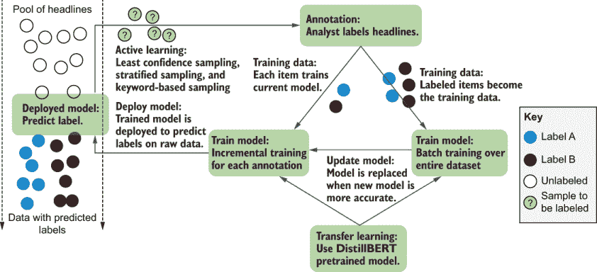
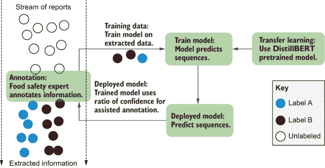
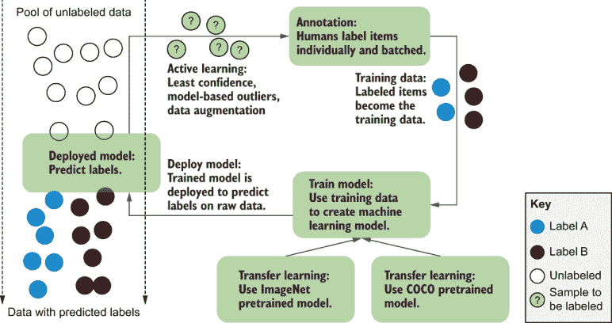

# 12 人机交互机器学习产品

本章涵盖

+   定义适用于人机交互机器学习应用的产品

+   创建一个用于短文本探索性数据分析的系统

+   创建一个支持人工流程的信息提取系统

+   创建一个图像标注系统以最大化模型精度

+   评估扩展简单系统的选项

这最后一章包含了三个关于人机交互机器学习产品的实际案例。利用你在前 11 章中学到的所有知识，你将实现三个示例。你可以将这些示例视为探索性数据分析新闻标题、从文本中提取食品安全信息以及标注包含自行车的图像等作为可以在几天内创建的初步系统。这些示例与第二章中的人机交互机器学习系统类似，但稍微复杂一些，建立在你在后续章节中学到的知识之上。

与第二章中的示例一样，这些示例可以作为你正在原型化的完整工作系统的起点。在所有情况下，你都可以构建许多组件作为下一步的潜在步骤。

## 12.1 定义适用于人机交互机器学习应用的产品

适用于人机交互机器学习应用的良好产品管理始于你为某人解决的问题：你实际支持的日常任务。理解你正在解决的人类任务将有助于你产品设计的各个方面：界面、标注和机器学习架构。本节为你快速介绍一些在本章中我们将使用的好产品管理技术，这将反过来帮助做出技术设计决策。

### 12.1.1 从你正在解决的问题开始

优秀的产品设计始于定义你试图解决的问题。一个常见的错误是开始谈论产品时，从你正在创建的技术角度出发，而不是从你试图解决的问题出发。如果你正在为电子邮件客户端创建自动完成功能，将问题定义为“人们希望在电子邮件中自动完成句子”过于简单。更好的定义方法是“人们希望尽可能高效地沟通。”从关注你正在解决的问题开始，有助于从为标注者创建指南到决定接下来构建或扩展哪些产品功能等各个方面。

在问题定义上也要具体。如果你正在为电子邮件自动完成产品针对营销人员，你可能会说，“营销人员希望尽可能高效地与潜在客户沟通。”如果你正在创建一个消费产品，你可能会说，“人们希望尽可能高效地与朋友和家人沟通。”这种方法将有助于塑造你在设计产品时的假设。

当你定义了你正在解决的问题时，你可以将这个一般问题分解成人们试图执行的具体任务。以电子邮件自动完成产品为例，任务可能包括“我希望每天向潜在客户发送的电子邮件数量翻倍”或“我希望在每天结束时清空我的收件箱，同时不缩短我的电子邮件回复的长度。”这些具体任务可以成为产品成功的一些指标。考虑到这些产品管理指南，以下是我们在本章中作为示例人类在环机器学习系统试图解决的三个问题：

+   数据分析师希望了解其新闻标题数据中信息的分布。

    +   “我想看看有多少新闻标题与特定主题相关。”

    +   “我希望跟踪新闻标题主题随时间的变化。”

    +   “我希望导出与特定主题相关的所有新闻文章以进行进一步分析。”

+   食品安全专业人员希望收集有关在食品中检测到病原体或异物的事件的数据。

    +   “我希望记录欧盟所有已记录的食品安全事件的完整记录。”

    +   “我希望跟踪不同食品安全事件可能来自同一来源的时间。”

    +   “我希望在可能存在尚未检测或报告的食品安全事件时向特定国家发出警告。”

+   交通研究人员希望估计在特定街道上使用自行车的乘客数量。

    +   “我希望收集有关人们骑自行车下街频率的信息。”

    +   “我希望从数千个摄像头中捕捉这些信息，而我没有足够的预算手动完成。”

    +   “我希望我的自行车识别模型尽可能准确。”

### 12.1.2 设计系统以解决问题

对于这三个用例，我们可以从问题定义开始，设计一个解决这些问题的系统。正如第二章所述，我们将为每个示例构建一个完整的人类在环机器学习系统。将这些示例视为未来将更具可扩展性和鲁棒性的系统的概念验证（PoC）。

使用注释者间一致性进行质量控制

在本章中提供关于注释者间一致性的良好实际例子并不容易，因为这里的例子需要是独立系统，一个人可以独立工作，假设大多数人都是单独阅读这本书。因此，本章涵盖了本书前 11 章中除注释者间一致性之外的大部分重要内容。

为了给你一个注释者间一致性的示例，我将在这本书后面附上一篇关于注释者间一致性的免费文章，该文章使用第二章中的示例。该示例包括根据是否与灾难相关对简短文本进行注释，使用我为该章节创建的开源代码。该章节的代码收集了人们所做的注释以及（如果他们选择）他们的身份，使我们能够比较不同人的注释。

尽管我在撰写这本书时无法提供一个关于注释者间一致性的示例，但你的注释将有助于进行一项注释者间一致性研究，这项研究将帮助人们多年。

注意，我们的两个系统在机器学习问题上相似；一个是标记新闻标题，另一个是标记图像。但因为他们支持不同的用例——探索性数据分析和对物体计数——所以产生的系统将不同。

食品安全示例自动化了一个现有的人类流程，因此保持从事这项工作的人的自主性很重要。特别是，他们不应该感到，现在他们的工作除了是日常任务的一部分外，还需要为机器学习算法提供动力，而感到工作进度变慢。在这种情况下，模型准确性最不重要，因为如果辅助文本不起作用，人们可以简单地输入字段值，这正是他们已经在做的事情。表 12.1 总结了这些系统中最重要的因素。

表 12.1 三种示例系统设计中的因素及其相对重要性。我们将根据系统的使用方式优化不同系统中的不同因素，这些信息将影响我们的设计决策。

| 示例 | 代理 | 模型准确性 | 注释准确性 |
| --- | --- | --- | --- |
| 标题 | 中等 | 中等 | 低 |
| 食品安全 | 高 | 低 | 高 |
| 自行车检测 | 低 | 高 | 中等 |

在所有三种情况下，一些组件可以被更复杂的组件所替代——更活跃的学习采样方法、更复杂的机器学习模型、更高效的界面等等。当你与这三个示例互动时，思考每个案例中最有用的下一步。根据系统的目标、数据和任务本身，你可能会对每个用例中要扩展或添加的组件有不同的想法。

### 12.1.3 连接 Python 和 HTML

我们将为这些示例构建网络界面，因此我们需要将 Python 与 HTML/JavaScript 连接起来。我们将使用一个名为 eel 的 Python 库，它允许我们为 Python 应用程序构建本地 HTML 界面。有许多库可用于将 Python 连接到 HTML。如果你熟悉另一个库——flask、kivy、pyqt、tkinter 或任何其他可以轻松与 HTML 应用程序连接的库/框架，那么这个库可能更适合你创建原型。

我们在这里使用 eel，因为它轻量级且对 JavaScript 的了解要求很少。如果你没有编写过 JavaScript 但知道 Python 和 HTML，你应该仍然能够跟随本章中的所有示例。我们将使用 eel 的方式将大部分工作放在 Python 中，原因相同：本章假设你更熟悉 Python。如果你更熟悉 JavaScript，你可以考虑本章中哪些组件可以用 JavaScript 实现。

在本章的每个示例中，我们将有三个包含代码的文件：一个用于 Python (.py)，一个用于 JavaScript (.js)，一个用于 HTML (.html)。这种格式在教学目的上使事情保持简单。你的实际代码分布应该反映你组织的最佳实践。你可以通过 pip 安装 eel：

```
pip install eel
```

你可以使用命令 `@eel.expose` 在函数之前导入 eel 并将任何 Python 函数暴露给 HTML 文件中的 JavaScript：

```
    import eel

    @eel.expose
    def hello(message):
        return “Hello ”+message
```

此代码允许你在 JavaScript 中调用此 `hello` 函数：

```
    <script type='text/JavaScript'>

        async function hello(message){

        let message = await eel.hello(message)();  # Call Python function
        console.log(message)
        }
    </script>
```

如果你调用 JavaScript 函数 `hello("World")`，它将在 JavaScript 控制台中打印 `"Hello World"`，因为 Python 函数在前面添加了 `"Hello"`。在你的 Python 文件中的两行额外代码确保你的 Python 脚本可以使用 JavaScript 与你的 HTML 文件通信：

```
    eel.init('./')  # Tell eel where to look for your HTML files 
    ...
    eel.start('helloworld.html')
```

在前面的代码片段中，我们假设我们的 HTML 文件名为 helloworld.html，并且它与 Python 文件位于同一目录中——因此，本地路径 `init('./')`。`start()` 调用将打开一个浏览器窗口以启动你的应用程序，所以你通常希望这个调用在 Python 脚本的末尾。

注意，尽管我们在 Python 和 JavaScript 中都命名为 `hello()` 的函数，但这并不是一个强制性的命名约定，因为你的 JavaScript 可以通过名称调用 Python 中暴露的任何函数。我们遵循在整个章节中使用相同函数名的约定，以便使代码更易于阅读。同样，在每个示例中，我们将使用相同的名称为我们的 Python、JavaScript 和 HTML 文件，以保持事情简单，只更改扩展名，尽管在 eel 中没有文件命名要求。

在常规 Python 代码中，唯一的额外更改是我们需要使用 eel 进行线程管理，这是库与 HTML 交互的副作用。因此，我们将使用 `eel.spawn(some_function_())` 来调用 `some_function()` 作为一个新的 Python 线程，并使用 `eel.sleep()` 而不是 Python 内置的 `sleep()` 函数。这些函数的表现方式与您可能熟悉的内置线程和睡眠函数相同。我们不会以复杂的方式使用线程，但在所有三个示例中，我们将有一个线程与 HTML 界面交互，而另一个线程重新训练模型。

eel 库支持的功能不仅限于这里提供的演示。它还允许你从 Python 内部调用 JavaScript 函数，例如。我们将保持我们的架构简单，并让所有操作由用户触发。

## 12.2 示例 1：新闻标题的探索性数据分析

探索性数据分析（EDA）是快速开发的机器学习系统中最常见的用例之一。然而，由于它不关注机器学习准确性，因此在机器学习文献中引用的 EDA 研究相对较少。在工业界，数据科学家通常在决定要构建哪些模型和产品之前，想要更详细地了解他们的数据。在这种情况下，EDA 允许数据科学家快速浏览和筛选数据。在本节中，我们将讨论的特定 EDA 示例中，以下是我们的问题陈述和三个正在解决的问题：

+   数据分析师想要了解他们新闻标题数据中信息的分布。

    +   “我想看看有多少新闻标题与特定主题相关。”

    +   “我想跟踪新闻主题随时间的变化。”

    +   “我想导出与某个特定主题相关的所有新闻文章以进行进一步分析。”

### 12.2.1 假设

我们设计这个产品的假设是

+   标题只使用英语。

+   预训练语言模型将有所帮助。

+   分析师将有一些关于良好关键词的启动想法。

你的数据是如何决定你的架构决策的？

数据本身可以影响你对架构每个部分的决策。我们正在使用 DistilBERT 预训练模型，该模型是在维基百科和一系列公共领域书籍的英文数据上训练的。维基百科包括与新闻标题相似的文章标题，还包括一些实际新闻文章的标题。因此，这个预训练模型适合我们的任务。

然而，这个决定可能会因数据略有不同而改变。在我写这本书的时候，我帮助的一个组织 Turn.io 想要对世界卫生组织 COVID-19 信息服务收到的短信进行探索性数据分析。这些短信使用多种语言，直接消息的写作风格与大多数预训练模型构建的网页数据不同。在这种情况下，使用基于更多数据域的多语言模型（如 XLM-R）更为合适，尽管这个模型比 DistilBERT 需要更多的处理时间。

考虑到这一点，不要将本章中的任何内容视为你正在处理的问题的必要第一步。即使是类似的任务，也可能需要不同的架构和不同的预训练模型来构建。

重要考虑事项：

+   *机构*——使用该系统的分析师应该有权通过关键词和年份浏览数据。

+   *透明度*——系统的准确性应该在整个数据集和按年份清晰可见。

+   *密集/丰富布局*—分析师应该能够在屏幕上获取尽可能多的信息，因此布局应该是信息密集的。

+   *即时性*—界面应该立即对分析师理解数据有所帮助，因此评估数据的创建应与训练数据的创建并行进行。

+   *分层*—分析师对每年的准确性感兴趣，因此我们除了跟踪整体准确性外，还想跟踪每年的准确性。

+   *灵活性*—分析师可能希望在不同的时间查看不同的标签。

+   *可扩展性*—分析师可能希望在以后将此任务扩展成更大规模的任务，因此他们希望跟踪有趣的标题示例，以便添加到未来的指南中。

### 12.2.2 设计与实现

这个任务是一个二进制标签任务，因此不确定性采样算法的选择并不重要。我们将使用最小置信度，并使用分层抽样以实现现实世界的多样性，针对特定年份的新闻标题。我们将允许分析师使用关键词来过滤正在标注的数据。

对于标注，我们将允许标注者对每个标题快速做出二进制选择以优化速度。我们不会将关键词抽取的项目包括在评估数据中，因为它们不会创建一个平衡的样本。

我们将使用两个机器学习模型。一个模型会随着每个新标注的增量更新，通过允许分析师立即在模型和结果预测上看到他们标注的结果，从而增加分析师的权限。然而，增量模型已知存在近期偏差，并且会收敛到局部最优。在主动学习场景中，近期偏差可能会被放大，因为最新项目不是随机抽取的，尤其是如果它们是通过关键词抽取的。因此，第二个模型将在定期的时间间隔内从所有训练数据从头开始重新训练。当这个模型在保留数据上更准确时，它将替换第一个模型。

对于两个机器学习模型，我们将从 DistillBERT 预训练模型中调整模型。DistillBERT 比 BERT 小得多，但具有可比的准确性。我们假设，即使准确性有所损失，更快的处理速度和更小的内存占用也将是净正面效果。此架构如图 12.1 所示。



图 12.1 示例系统的新闻标题分类架构

图 12.1 几乎与本书中的所有架构相同，但它有两个模型，我们可以针对实时训练进行优化，除了旨在最大化准确性的训练。您可以在[`github.com/rmunro/headlines`](https://github.com/rmunro/headlines)中看到代码。有关实现细节和如何进行实验的更多信息，请参阅存储库中的 readme 文件。

### 12.2.3 可能的扩展

在与系统玩了一段时间后，思考你可能做出的改变。表 12.2 提供了潜在改进的示例。

表 12.2 中的每个示例都可以用少于 50 行代码实现，因此实现其中之一或两个几乎没有障碍。但实现所有更改并评估哪些是最有效的将是一项大量工作。因此，与系统交互应该能让你了解首先应添加的最有价值的改进。本例中有一个机器学习辅助人类的元素，这是我们将在下一个示例中加倍投入的。

表 12.2 本例及其在本书中涵盖的章节中可能的扩展

| 标注界面 |
| --- |
| 批量标注（第 11.2.1 节） | 同时接受或拒绝多个标注。按年度已分组的消息集可能是一个良好的起点。 |
| 更强大的过滤（第 9.5 节） | 手动过滤用于字符串匹配，这可以变得更加复杂，以允许正则表达式匹配或多个关键词的组合。 |
| 标注质量控制 |
| 将模型用作标注者（第 9.3 节） | 对训练数据进行交叉验证，以找到预测标注与实际标注之间的不一致性，作为潜在的标注错误向分析师展示。 |
| 标注聚合（第 8.1-8.3 节） | 如果多个人使用此系统，关于真实性和标注者间一致性方法以聚合数据的策略进行规划。你可能将策略拆分，实时为每个标注更新模型，但仅对已多次标注且标记有信心的事项进行批量重新训练。 |
| 机器学习架构 |
| 自监督学习（第 9.4 节） | 使用元数据，如年份或 URL 的子域作为标签，并在整个数据集上构建模型以预测这些标签，这些标签反过来可以用作此模型中的表示。 |
| 调整模型以适应未标记数据 | 首先将 DistillBERT 调整到整个标题数据集。这种方法将预训练模型适应此特定文本领域，并可能导致更快地获得更准确的结果。 |
| 活跃学习 |
| 基于集成采样（第 3.4 节） | 维护多个模型，并跟踪所有模型中预测的不确定性，采样具有最高平均不确定性或预测最高变异性的事项。 |
| 多样性采样（第 4.2-4.4 节） | 探索聚类和基于模型的异常值，以确保特征空间中没有部分被过度采样或完全忽略。 |

## 12.3 示例 2：收集关于食品安全事件的数据

许多人日常工作的内容是从非结构化数据中构建结构化数据。这些工作者包括寻找消费者对产品某些方面表达的情感的市场专业人士，无论在线还是评论中；从书面电子病历中提取重要信息的医疗保健专业人士；以及我们例子中的食品安全专业人士。以下是问题陈述和正在解决的三个具体问题：

+   食品安全专业人士希望收集有关在食品中检测到病原体或异物的事件的数据。

    +   “我想维护欧盟所有记录的食品安全事件的完整记录。”

    +   “我想跟踪不同食品安全事件可能来自同一来源的时间。”

    +   “当可能存在尚未被发现或报告的食品安全事件时，我想向特定国家发送警告。”

### 12.3.1 假设

我们设计此产品的假设是：

+   报告仅提供英文版本。

+   预训练语言模型将有所帮助。

+   食品安全专家拥有提取所需信息的领域专业知识。

+   食品安全专家已经在他们的工作中执行这项任务。

重要考虑因素：

+   *代理*—食品安全专家不希望他们的工作流程因机器学习集成而减慢。

+   *透明度*—食品安全专家应该能够理解在假设他们想查看每一份报告的情况下，还有多少报告尚未查看。

+   *一致性和紧凑性*—食品安全专家不应该需要滚动、使用鼠标或失去屏幕上元素的控制。

+   *追踪趋势的能力*—分析师对各国趋势感兴趣，因此我们希望跟踪提取的信息如何显示国家间移动的趋势。

### 12.3.2 设计与实现

对于主动学习，我们假设两个标签之间的混淆与所有标签之间的混淆一样糟糕，因此我们将使用置信度比率来表示不确定性。不确定性分数将用作阈值，以决定是否显示模型提供的自动完成建议。

对于注释，如果没有来自模型的预测，界面将使用从当前报告中所有匹配的文本字符串中获取的自动完成建议。使用匹配的文本字符串将提供与使用预测标签进行自动完成相似的用户体验，即使没有模型预测也是如此。

我们将使用一个从 DistillBERT 预训练模型改编的机器学习模型，该模型定期重新训练。我们可以使用两个模型，就像本章第一个例子中那样，其中一个模型是增量更新的。然而，在这里，增量更新并不那么重要，因为匹配现有字符串的回退行为对于食品安全专业人士来说已经是一个很好的用户体验，因此我们可以尽可能保持架构简单，并在我们有一个工作原型后再考虑这个扩展。该架构如图 12.2 所示。 |

 |

图 12.2 从文本中提取食品安全事件信息的示例系统架构 |

注意，图 12.2 在信息流中包含注释，这对于机器学习辅助任务来说更有意义。否则，循环是相同的，数据驱动一个模型，反过来又帮助注释。您可以在[`github.com/rmunro/food_safety`](https://github.com/rmunro/food_safety)中查看代码。在存储库中的 readme 文件中可以找到有关实现细节和如何进行实验的更多信息。 |

### 12.3.3 可能的扩展 |

在玩了一段时间的实现之后，考虑一下您可能做出哪些改变以使系统更高效。一些可能的扩展总结在表 12.3 中。 |

与我们之前的例子一样，表 12.3 中的所有更改都可以用不到 50 行代码实现。任何更改都可以根据对系统的经验成为正确的下一步。 |

表 12.3 本例及本书中涵盖的章节/节中可能的扩展 |

| 注释界面 |
| --- |
| 预测性注释（第 11.5.4 节） | 当模型对预测有信心时，预先填充字段。这种方法将加快注释速度，但如果专家被诱导接受错误的预测，可能会导致更多错误。 |
| 裁决（第 8.4 节和第 11.5.4 节） | 创建一个单独的界面，允许专家快速裁决对模型具有高价值的事例。这种方法应作为专家可选的附加策略实现，而不是取代他们的日常工作流程。 |
| 注释质量控制 |
| 注释者间一致性（第 8.2 节） | 领域专家往往低估了自己的一致性，因此可能有助于让注释者在不同时间执行相同的任务来衡量一致性。 |
| 预测错误（第 9.2.3 节） | 基于真实数据、注释者间/内一致性以及每个报告所花费的时间量（假设花费更多时间在更复杂的任务上）来构建一个模型，以明确预测专家最有可能犯错误的地方。使用此模型标记可能发生错误的地方，并要求专家更加注意，或让更多人处理这些项目。 |
| 机器学习架构 |
| 合成负例（第 9.7 节） | 这个数据集来自仅关于食品安全事件的模板化文本。这种方法会使模型在文本不是关于食品安全事件时变得脆弱，例如预测任何跟在检测词后面的词都是病原体。通过要求专家对现有上下文（如检测）进行最小编辑以创建负例，模型不太可能错误地学习上下文。 |
| 中间任务训练（第 9.4 节） | 如果我们可以创建一个单独的文档标注模型来预测“相关”和“不相关”，我们就可以将这个模型作为主模型中的表示。如果专家已经有一个第一步，即从相关报告中过滤出不相关报告，那么这个过滤步骤本身就可以成为一个预测模型。这样的模型可能会收敛到检测事件的特征，如病原体和位置，从而提高整体准确性。 |
| 活跃学习 |
| 基于不确定性的重新排序（第 3.2-3.4 节） | 系统目前是按日期排序。但如果首先对最不确定的项目进行排序，这可能会更快地提高机器学习模型，并导致整体速度更快。然而，这种排序将是对当前专家实践的一种额外改变，并且在他们处理更难示例时可能会感觉初始速度较慢。 |
| 其他不确定性度量（第 3.2 节） | 我们使用置信度比作为置信阈值的基础，因为它似乎是最适合这个问题的。我们可以通过实验来检验置信度比是否是这种数据中最好的不确定性采样算法。 |

## 12.4 示例 3：在图像中识别自行车

不论是交通管理、监控生产线还是计数货架上的商品，在计算机视觉中，计算图像中物体的数量是最常见的用例之一。在这种情况下，我们假设用例是交通研究人员，他们希望估计某些街道上使用自行车的数量。以下是问题陈述和正在解决的三个具体问题：

+   交通研究人员希望估计某些街道上使用自行车的数量。

    +   “我想收集有关人们骑自行车下街的频率的信息。”

    +   “我想从数千个摄像头中捕捉这些信息，但我没有预算手动完成。”

    +   “我希望我的自行车识别模型尽可能准确。”

“自行车”并不是 ImageNet（最受欢迎的图像分类数据集）中最常见的 1000 个标签之一，因此这项任务是在常见模型中填补了一个空白（尽管“双人自行车”和“山地自行车”在 ImageNet 中）。自行车是一个有趣的问题，因为它们很容易被人类识别，但不同的角度对于机器学习算法来说会有不同的特征轮廓。我自恋地认为我到处骑自行车，所以我想让这项技术尽可能准确。你也可以将这个任务适应到其他标签上。

### 12.4.1 假设

我们设计这个产品的假设是：

+   图片可以从任何角度拍摄。

+   现有的数据集（如 ImageNet、Open Images 和 MS COCO）可能很有用，但可能没有涵盖所有可能的拍摄角度和设置。

+   模型的精度是最重要的结果。

重要考虑因素：

+   *代理*—在注释过程中，交通研究人员不关心代理；他们只想尽快构建最准确、最健壮的模型。

+   *透明度*—实时监控系统精度是最重要的指标。

+   *多样性*—交通研究人员希望模型在不同光照条件、不同角度和不同距离处对物体都能同样有效（尽可能做到）。

### 12.4.2 设计与实现

我们将使用一个依赖于两个基于 ImageNet 和 COCO 数据集构建的预训练模型的机器学习模型，这两个数据集都是与自行车相关的知名数据集，这将为我们创建一个准确模型提供一个先发优势。

对于主动学习，任务是一个二元分类任务，就像第一个例子一样。不确定性采样算法的选择并不重要，所以我们将使用最小置信度。我们将寻找基于模型的异常值在角落案例中，我们可能对预测有信心，但缺乏支持这种信心的强有力证据。对于注释，我们将允许注释者快速对每张图像进行二元选择以优化速度。这种架构在图 12.3 中显示。



图 12.3 示例系统中标记自行车的架构

在本章的三个例子中，图 12.3 与我们全书所见的架构最相似。唯一的区别是我们使用多个预训练模型，因为我们专注于模型精度。你可以在[`github.com/rmunro/bicycle_detection`](https://github.com/rmunro/bicycle_detection)中看到代码。在存储库的 readme 文件中可以找到有关实现细节和如何进行实验的更多信息。

### 12.4.3 潜在的扩展

在玩了一段时间的系统后，考虑一下你可能做出的改变。表 12.4 有一些建议。

表 12.4 示例和本书中涵盖的章节/部分的潜在扩展

| 标注界面 |
| --- |
| 批量标注（第 11.2.1 节） | 我们可以通过允许批量标注接口而不是滚动来加速标注。一个包含大约 10 张图片的接口，其中标注者只需选择包含自行车的图片，可能比滚动接口更快。 |
| 边界框标注（第 11.5.2 节） | 对于模型无法正确预测自行车的图像，标注者可以标注自行车（们）。该图像可以用作裁剪后的训练数据示例，以帮助指导模型在类似示例上的表现。 |
| 标注质量控制 |
| 引发主观判断（第 9.1 节） | 有一些棘手的边缘情况，例如独轮车、自行车框架和带电动马达的自行车。将这些图像视为主观任务并应用贝叶斯真理血清（BTS）等方法来寻找少数但有效的解释可能是有用的。 |
| 合成数据（第 9.7 节） | 我们能否将自行车复制粘贴到一些图像中？这样做可能会提高上下文多样性。如果我们包括正负示例，我们可以帮助模型专注于自行车，而不是背景。 |
| 机器学习架构 |
| 目标检测 | 如果可以自动裁剪和/或放大预测自行车位置的图像部分，我们可以提高标注过程的速度和准确性。这种技术可以与更常见的如训练期间翻转一些图像的数据增强技术一起使用。 |
| 连续/连续任务 | 任务定义意味着交通管理者对自行车数量感兴趣，而不是是否有一个或多个发生，因此模型在预测确切数量时可能更有用。请注意，标注将更慢，质量控制更难实施。 |
| 活动学习 |
| 基于集成采样的方法（第 3.4 节） | 维护多个模型并跟踪所有模型中预测的不确定性，采样平均不确定性最高或预测变化最大的项目。 |
| 代表性采样（第 4.4 节） | 我们正在使用 ImageNet 和 COCO 的预训练模型，但我们正在将模型应用于 Open Images。因此，我们可以使用代表性采样来找到与其它来源相比最像 Open Images 的图像，因为错误更有可能在那里发生。 |

与我们之前的例子一样，表 12.4 中的所有更改都可以用少于 50 行代码实现。任何更改都可能基于对系统的经验成为正确的下一步。

## 12.5 构建人机交互式机器学习产品的进一步阅读

尽管不是免费的，但 Emmanuel Ameisen 最近出版的书籍《构建机器学习应用（O’Reilly，2020）*Building Machine Learning Powered Applications*》是构建机器学习应用时需要考虑的因素的良好概述，例如定义您的产品目标、设置机器学习问题以及快速构建端到端管道。几乎所有这些信息都适用于人机交互系统。

## 摘要

+   在定义人机交互机器学习应用的产品时，从您试图解决的问题开始并逆向工作是有帮助的。这种方法有助于从技术设计到界面设计以及注释指南的框架。

+   我们创建了一个用于短文本探索性数据分析的系统，使分析师能够根据不同的标签快速过滤新闻标题，以便他们可以看到随时间的变化。

+   我们创建了一个从文本中提取信息的系统，帮助食品安全专家从普通报告中追踪食品中发现的病原体和异物信息。

+   我们创建了一个系统来最大化图像标注任务的准确性，帮助一位数据科学家制作尽可能精确的自行车识别模型。
