# 附录 机器学习复习

本附录涵盖了与人类在循环机器学习最相关的机器学习基础知识，包括解释机器学习模型的输出；理解 softmax 及其局限性；通过召回率、精确率、F 分数、ROC 曲线下面积（AUC）和调整后的准确率来计算准确度；以及从人类的角度衡量机器学习性能。本书假设你具备基本的机器学习知识。即使你有经验，你可能也想回顾这个附录。特别是与 softmax 和准确度相关的部分对于本书尤为重要，有时会被只关注算法的人忽视。

## A.1 从模型中解释预测

几乎所有的监督式机器学习模型都会给你两样东西：

+   一个预测标签（或一组预测）

+   与每个预测标签相关联的数字（或一组数字）

假设我们有一个简单的目标检测模型，它试图区分四种类型的对象：“骑自行车的人”、“行人”、“标志”和“动物”。该模型可能会给出以下预测列表。

列表 A.1 模型 JSON 编码预测示例

```
{
    "Object": {
        "Label": "Cyclist",
        "Scores": {
            "Cyclist": 0.9192784428596497,         ❶
            "Pedestrian": 0.01409964170306921,
            "Sign": 0.049725741147994995,
            "Animal": 0.016896208748221397
        }
    }
}
```

❶ 在这个预测中，对象被预测为“骑自行车的人”，准确度为 91.9%。这些得分加起来为 100%，给出了这个项目的概率分布。

你可以从示例中看到，“骑自行车的人”被预测为得分为 0.919。可能被预测为“行人”、“标志”或“动物”的得分分别是 0.014、0.050 和 0.0168。这四个得分总和为 1.0，这使得得分类似于概率或置信度。例如，你可以将 0.919 解释为有 91.9%的置信度认为该对象是“骑自行车的人”。这些得分合在一起被称为*概率分布*。

### A.1.1 概率分布

在机器学习文献中，术语*概率分布*仅意味着预测标签之间的数字总和为 100%，这并不一定意味着每个数字都反映了模型对预测正确的实际置信度。对于神经网络、逻辑回归和其他类型的相关判别监督学习算法，算法的任务并不是知道其预测的置信度。算法的任务是尝试根据特征在标签之间进行区分——因此，称为*判别监督学习*。神经网络最后一层的原始分数是网络尝试在其做出的预测中进行区分的分数。根据模型的参数，这些最终层的原始分数可以是任何实数。尽管本书的范围不涉及为什么神经网络不能产生好的概率分布，但一般来说，大多数模型往往过于自信，预测最可能的标签时给出的分数高于其实际概率，但当有罕见数据时，模型可能会缺乏自信。因此，这些算法输出的分数通常需要转换为更接近真实置信度的东西。

在你喜欢的库中，概率分布可能被称作不同的名称。请参阅以下侧边栏了解更多关于差异的信息。

分数、置信度和概率：不要相信名称！

机器学习库——无论是开源的还是商业的——通常将分数、置信度和概率互换使用。你甚至可能发现在同一个库中也没有一致性。

我遇到过这种情况。当我负责亚马逊 Comprehend 的产品时，这是 AWS 的自然语言处理（NLP）服务，我们必须决定应该称每个预测相关的数字为什么。经过长时间的讨论，我们决定“置信度”这个词具有误导性，因为系统的输出并不是根据概率的严格统计定义的置信度，所以我们选择了“分数”这个词。AWS 现有的计算机视觉服务 Amazon Rekognition 在预测图像标签时（至今仍然如此）已经使用了“置信度”来表示这个相同的分数。

大多数机器学习库在命名约定方面的考虑不如大型云公司给予的那么多，因此你不应该仅根据它们的名称来信任与预测相关的数字。阅读你的机器学习库或服务的文档，以了解与每个预测相关的数字的含义。

对于生成式监督学习算法，如大多数贝叶斯算法，算法*确实*试图显式地建模每个标签，因此置信度可以直接从你的模型中读取。然而，这些置信度依赖于对数据潜在分布（如正态分布）和每个标签的先验概率的假设。

为了进一步复杂化，你可以通过生成式监督学习方法扩展判别式监督学习算法，以从模型中获得更真实的统计“概率”。今天，从判别模型中获得准确概率的生成方法在大多数广泛使用的机器学习库中是不可用的。你更有可能得到由 softmax 算法生成的概率分布，因此我们将从这里开始。

## A.2 softmax 深入探讨

最常见的模型是神经网络，神经网络预测几乎总是通过 softmax 转换到 0-1 的分数范围。softmax 被定义为

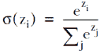

神经网络的输出将类似于图 A.1。

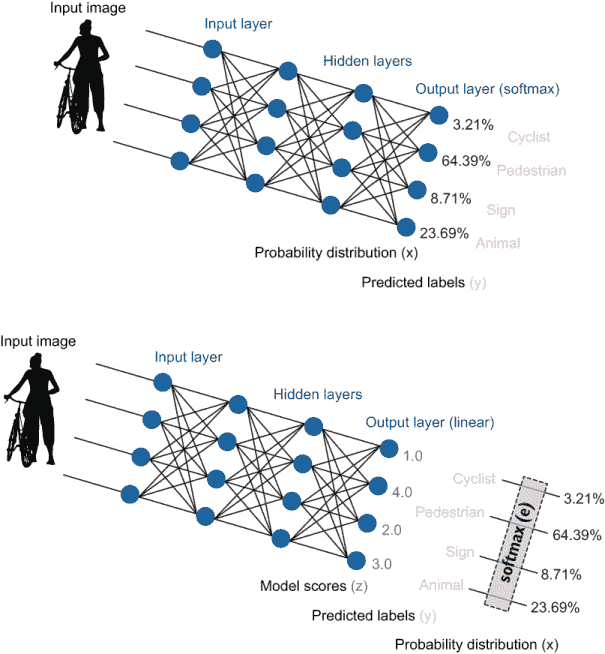

图 A.1：softmax 在两种类型架构中如何创建概率分布。在上面的例子中，softmax 是输出（最终）层的激活函数，直接输出一个概率分布。在下面的例子中，输出层使用了线性激活函数，创建了模型分数（logits），这些分数通过 softmax 转换成概率分布。底部的架构稍微复杂一些，但更适合主动学习，因为它提供了更多信息。

如图 A.1 所示，softmax 通常用作模型最终层的激活函数，以产生一个概率分布，作为与预测标签相关联的分数集合。softmax 也可以从线性激活函数（*logits*）的输出中创建概率分布。

通常在最终层使用 softmax，或者只查看对 logits 应用 softmax 的结果。softmax 是有损的，它丢失了由于强烈竞争信息导致的不确定性和由于信息不足导致的不确定性之间的区别。我们假设我们正在使用图 A.1 中的第二种架构，但效果会适用于 softmax 是激活函数还是应用于模型分数的情况。

如果你正在使用图 A.1 中的第二种架构，在最后一层使用具有负值的激活函数，例如 Leaky ReLU，对于包含人类操作员的架构通常比具有零下限的函数（如 ReLU）更好。对于本书中的一些主动学习策略，这有助于量化一个输出中负信息的数量。如果你知道某些其他激活函数在预测标签方面更准确，你可能会考虑重新训练你的最后一层以进行主动学习。这种策略——为包含人类操作员的任务专门重新训练模型的一部分——在本书中有所涉及。

无论你使用什么架构以及 softmax 的输入范围如何，理解 softmax 方程式都很重要，因为它是有损的（这是众所周知的）并且对任意输入假设，这可能会改变预测置信度的排名顺序（这并不广为人知）。

### A.2.1 将模型输出转换为置信度使用 softmax

这里是一个使用 PyTorch 库实现的 softmax 示例：¹

```
   def softmax(self, scores, base=math.e):
        """Returns softmax array for array of scores

        Converts a set of raw scores from a model (logits) into a 
        probability distribution via softmax.

        The probability distribution will be a set of real numbers
        such that each is in the range 0-1.0 and the sum is 1.0.

        Assumes input is a pytorch tensor: tensor([1.0, 4.0, 2.0, 3.0])

        Keyword arguments:
            prediction -- pytorch tensor of any real numbers.
            base -- the base for the exponential (default e)
        """
        exps = (base**scores.to(dtype=torch.float)) # exponents of input
        sum_exps = torch.su(exps) # sum of all exponentials

        prob_dist = exps / sum_exps # normalize exponentials 
        return prob_dist
```

严格来说，这个函数应该被称为*softargmax*，但在机器学习领域几乎总是简称为*softmax*。你也可能看到它被称为*玻尔兹曼分布*或*吉布斯分布*。

为了了解前一个方程中的 softmax 变换在做什么，让我们分解这些部分。假设你预测了图像中的对象，并且模型给你提供了原始分数 1，4，2 和 3。最大的数字 4 将成为最自信的预测（表 A.1）。

表 A.1 使用分数（z，logits）的示例预测；每个分数乘以自然指数（e）；以及归一化指数，即 softmax 值。归一化向量被称为概率分布，因为数字在 0-1 范围内，且总和为 1。

| 预测标签 | 骑行者 | 行人 | 标志 | 动物 |
| --- | --- | --- | --- | --- |
| 分数 (z[1],..z[4]) | 1.0 | 4.0 | 2.0 | 3.0 |
| e^z | 2.72 | 54.60 | 7.39 | 20.09 |
| softmax | 0.0321 | 0.6439 | 0.0871 | 0.2369 |

最后一行，softmax，是 e^z 除以 e^z 行中所有数字的总和。这些原始分数——1，4，2 和 3——将在本节中用于保持示例的一致性，并且因为它们加起来是 10，这使得直觉更容易理解。你得到的数字的确切范围将取决于你的激活函数。如果你使用 softmax 作为最终的激活函数，确切的数字将是激活函数和前一层输出的权重的组合。确切的整数不太可能，但在许多架构中，1-4 的范围将是常见的。

如表 A.1 所示，“行人”是我们示例中最自信的预测，置信度数字是从原始数字拉伸出来的；原始分数中的 4.0/10.0 变成了 softmax 中的 64%。在 e^z 步骤中，“行人”预测变得很大，其中它是 54.60，e^(4.0) = 54.60，因此最可能的标签成为分母方程中的最大数，从而主导了方程。

可解释性的好处应该是显而易见的：通过将数字转换为指数并归一化，我们能够将正负数的无界范围转换为 0-1 范围内的概率估计，并且总和为 1。此外，指数可能比如果我们归一化原始分数时更接近真实概率。如果你的模型是通过使用最大似然估计（MLE）进行训练的，这是训练神经模型最流行的方式，那么它是在优化对数似然。因此，在对数似然上使用指数将我们带到了实际的似然。

### A.2.2 softmax 的基数/温度选择

作为将基数从 *e* 改变的替代方案，你可以将分子和分母除以一个常数。这种技术被称为改变 softmax 的 *温度*，因此通常用 *T* 表示，在文献中通常没有报告温度数值时，*T* 通常为 1：

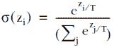

从数学的角度来看，改变 softmax 的基数和改变温度之间没有区别；你得到相同的概率分布集（尽管不是以相同的速率）。我们在这本书中使用 softmax 基数，因为它使得第三章的一些解释更容易理解。如果你使用的是一个不允许你改变基数的 softmax 函数，你可能发现实验温度更容易一些。

为什么使用基数 = *e*（或温度 = 1）？老实说，为什么 *e* 是我们用于归一化数据的数字有点不稳固。在机器学习的许多领域，*e* 具有特殊的性质，*但这个领域不是其中之一*。欧拉数 (*e*) 大约是 2.71828。正如你从高中数学课程中回忆的那样，*e*^x 是其自身的导数，因此它具有许多有趣的性质。在机器学习中，我们特别喜欢 *e*^x 是其自身的导数这一事实（图 A.2）。

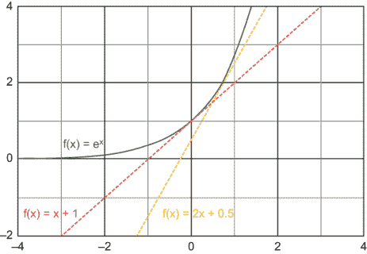

图 A.2 显示 e 作为其自身的积分。在 f(1) = 1 处的斜率为 1，在 f(2) = 2 处的斜率为 2，依此类推。

在 f(x)处的斜率是 f(x)，对于任何给定的 x，*e*^x 曲线在 f ́(1)处的斜率是 1，曲线在 f ́(2)处的斜率是 2，依此类推。你可能记得在高中数学书中将这个斜率写成 f ́(1) = 1 和 f ́(2) = 2；撇号表示导数，称为*导数*。或者你可能看到斜率写成 dy/dx 或ẏ。这三个符号—f ́, dy/dx, 和 ẏ—分别来自不同的数学家（Lagrange，Leibniz，和 Newton），但意味着相同的事情。你可能在高中学过 Lagrange 的符号，在机器学习课程中学过 Leibniz 的符号，如果你来自物理学，你可能学过 Newton 的符号。

当我们说*e*^x 是其自身的导数时，我们指的是 f(x) = f(x)的性质。如果你使用除了*e*以外的任何基数作为指数曲线，你就不会得到这个性质。在机器学习中，我们需要对函数求导以使其收敛。机器学习中的*学习*主要是函数的收敛，因此当我们知道函数的导数是其自身时，我们可以节省大量的计算能力。

然而，当你试图找到最佳置信度度量时，这并不意味着*e*是适合你特定数据集的最佳数字。从相同的输入中，比较图 A.3 中的两个图表，左边的图表使用*e*（2.71828）作为指数基数，右边的图表使用 10 作为指数基数。

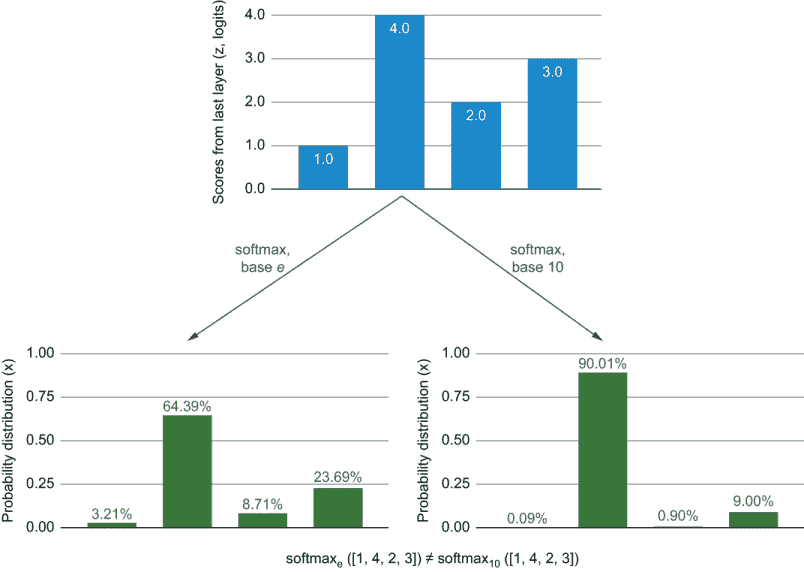

图 A.3 比较 softmax 在相同原始输出数据上使用指数基数 e 和 10 的情况。图表显示，基数越高，最高分的估计概率越高，在更高的基数下，最高分在 softmax 方程中的主导作用越强。

如你所见，指数的选择可能非常重要。如果我们使用 10，我们数据中“行人”的置信度为 90%，而下一个最置信的标签不到 10%。表 A.2 显示了使用 10 作为 softmax 的指数基数在我们示例数据上的分数。

表 A.2 使用 10 而不是 e 作为幂的 softmax 算法从相同的分数（z，logits）重复

| 预测标签 | 骑行者 | 行人 | 标志 | 动物 |
| --- | --- | --- | --- | --- |
| 分数（z[1]，...z[4]） | 1.0 | 4.0 | 2.0 | 3.0 |
| 10^z | 10.00 | 10000.00 | 100.00 | 1000.00 |
| softmax (10) | 0.09% | 90.01% | 0.90% | 9.00% |

这个表格让我们更清楚地了解最大数值的重要性。以 10 为指数基数，我们得到 1 加上 4 个零（10,000），这显然比在最终的 softmax 方程中被推下的其他任何数值都要大得多：

*softmax 的指数基数越高，概率的极化程度就越高*。

基础的选择不会改变单个项目哪个预测最自信，所以在人们只关心预测准确性而忽略标签的情况下，基础的选择在机器学习任务中常常被忽视。然而，基础的选择可以改变置信度的排名顺序。也就是说，项目 A 在基础*e*下可能比项目 B 更自信，但在基础 10 下则可能不那么自信。表 A.3 展示了这样一个例子。

表 A.3：softmax 可能的两组输入，根据使用的基数/温度不同，它们的排名会有所不同

| 预测标签 | 骑行者 | 行人 | 标志 | 动物 |
| --- | --- | --- | --- | --- |
| 输入 A | 3.22 | 2.88 | 3.03 | 3.09 |
| 输入 B | 3.25 | 3.24 | 3.23 | 1.45 |

在这两种情况下，A 和 B 都预测“Cyclist”是最可能的标签。但哪个在正确标签上更自信？如图 A.4 所示，答案取决于基础和温度。

许多人发现图 A.4 中的图形令人惊讶，包括本书的一位审稿人、一位在著名 ICML 会议上的审稿人，以及一位图灵奖获得者，这就是为什么我在本书写作后期添加了这个图。给定一个随机的输入集（在我的实验中），只有大约 1%的输入对会产生图 A.4 中的效果。然而，在为主动学习采样最不自信的预测时，样本可以变化多达 50%。在主动学习中，采样最不自信的项目是最常见的策略，这在第三章中有讨论。因此，这种广泛存在的误解在人类在环机器学习中已被广泛忽视：通过操纵人们以前认为是不变的变量，改变 softmax 的基础或温度有可能创建更准确的系统。

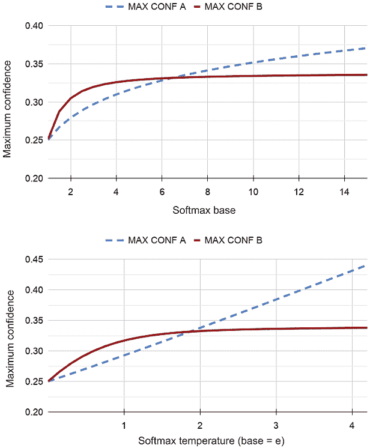

图 A.4：比较表 A.3 中的输入（A = [3.22, 2.88, 3.03, 3.09] 和 B = [3.25, 3.24, 3.23, 1.45]）与不同的 softmax 基数和不同的温度，显示根据基数或温度，任一组输入都可能有最自信的结果。严格来说，底部图形的 x 轴是逆温度，这是一个有效的等比例度量标准，尽管不如常见。我们在这里使用逆温度是为了显示两个图形以更多或更少相同的方式向上和向右移动。

假设在本文中，除非明确说明，softmax 使用基础 = *e* 和温度 = *e*。现在，重要的是要了解 softmax 如何将输入转换成概率分布。

### A.2.3 指数除法的结果

记住，softmax 函数会规范化输入的指数，并回想一下你高中数学中的公式：c^((a-b)) = c^a / c^b。因此，当 softmax 通过除以所有指数来规范化指数时，指数的除法本质上就是减去得分的绝对值。换句话说，只有模型得分之间的相对差异在 softmax 中起作用，而不是它们的实际值。

让我们将(1.0, 4.0, 2.0, 3.0)的分数代入，以创建添加 10、100 和-3 到每个分数的场景，这样我们改变了分数的总和，但保持了分数之间的差异。如图 A.5 所示，概率分布是相同的，尽管在四个预测集中的原始分数差异很大，因为四个原始分数之间的差异是相同的。4 和 3 之间的差异与 104 和 103 之间的差异相同。这种限制是一个重要的理解点。

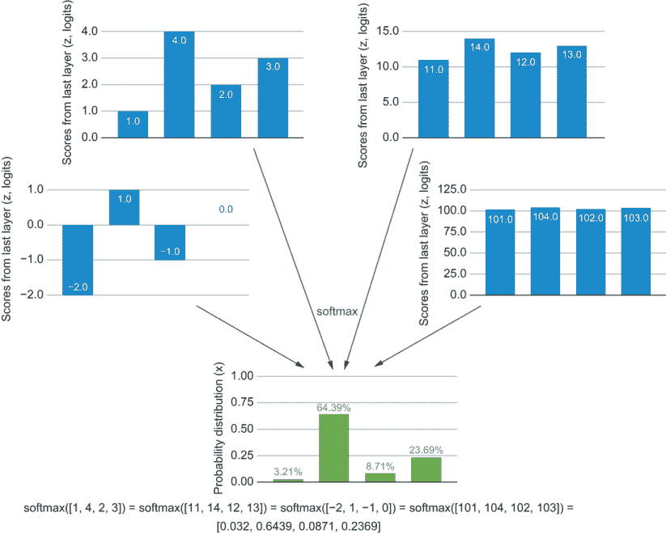

图 A.5：Softmax 等价性：四个模型分数在 softmax 下给出相同的概率分布。尽管来自不同的模型分数，但四个 softmax 概率分布是相同的，这表明只有分数之间的差异才是重要的。例如，(1, 4, 2, 3)的分数在 softmax 下给出的概率分布与(101, 104, 102, 103)相同。

为了从另一个角度理解这个概念，尝试将(1.0, 4.0, 2.0, 3.0)中的每个数乘以一个常数，而不是像图 A.5 中那样加一个常数。图 A.6 显示了乘法的结果。

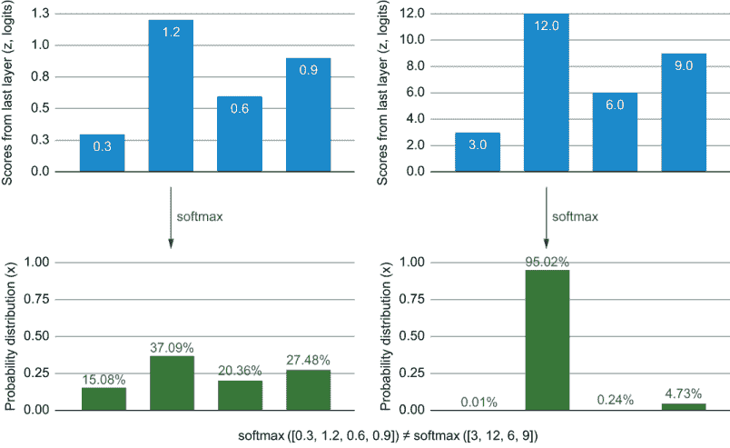

图 A.6：两个分数分布除了比例不同外是相同的。右侧的分数是左侧分数的 10 倍。在 softmax 下，这些分数导致不同的概率分布。此图还显示了改变温度而不是基数的效应。如果我们从左侧的值开始，但将温度降低到 0.1（实际上是将 logits 乘以 10），我们将得到更多权重分配给最自信的预测。

在图 A.6 中，你可以看到，尽管来自最后一层的分数仅在 y 轴的比例上有所不同，但在 softmax 下它们产生了不同的概率分布。对于分数较低的分布，softmax 产生了一个比 logits 更紧密的数字集的概率分布，但分数较高时，它产生了一个更宽的分布。

小心 softmax 中的大输入

当使用 softmax 处理大输入值时，你可能会遇到硬件溢出错误，因为指数步骤会产生大数值。如果你在电脑上计算 1,000 的 e 次方，你可能会看到系统错误或无限值（inf），这种结果可能会影响下游过程。你有两种方法可以避免这种溢出，如果你决定开始尝试使用 softmax，我建议你使用其中一种方法。

第一种方法是从你的输入中减去一个常数，使得你的输入中的最大值为 0。这种方法利用了图 A.5 中的现象：减去一个常数给你相同的概率分布，而不会在指数步骤中产生溢出。第二种方法是使用 softmax 的对数（PyTorch 的默认行为），它保持了数字的范围。

在我们之前的例子中，我们将 softmax 视为输出层得分的归一化。你也可以将 softmax 用作输出层的激活函数。关于选择基础/温度以及它如何以不同方式分散数据的所有观察结果仍然适用。

本节及其相关的图表可能是你将在任何地方读到的关于 softmax 的最长描述，但这个信息对于人机交互机器学习非常重要。Softmax 是从机器学习预测中生成概率分布的最常用算法，但许多人认为选择基础为 e 具有生成置信度的特殊属性（它没有），或者选择基础不会改变不确定性的排名顺序。因此，真正理解 softmax 的作用将有助于你选择正确的不确定性采样策略。

## A.3 测量人机交互的机器学习系统

你有多种方式来衡量人机交互机器学习系统的成功，你使用的指标将取决于你的任务。本节涵盖了其中一些最重要的指标。

### A.3.1 精确度、召回率和 F 分数

对于机器学习算法，通常使用众所周知的指标精确度、召回率和 F 分数。*F 分数*是精确度和召回率的调和平均数，其中真实正例是该标签的正确预测；*假阳性*是该标签的错误预测项；*假阴性*是具有该标签但被预测为其他事物的项。

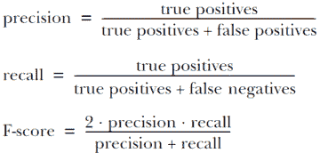

如果你使用纯准确度并且你的标签是罕见的，那么大部分的准确度将由大量真实负例决定。调整这种不平衡的一种方法被称为*机会调整一致性*，我们将在下一节中介绍。

### A.3.2 微观和宏观精确度、召回率和 F 分数

精确度、召回率和 F 分数的计算通常是针对数据中的一个标签。有两种常见的方法可以将每个标签的准确度组合成一个单一的准确度分数。*微观分数*在每项级别上汇总准确度，为每个项目进行计算。*宏观分数*独立地为每个标签计算准确度。

如果你有一个标签比其他标签出现频率高得多，那么这个频率将对微观精确度、微观召回率和微观 F 分数贡献最大。在某些情况下，这个结果可能正是你想要的，因为它给出了一个加权准确度数字，这个数字是根据你的测试数据中的标签来加权的。但是，如果你知道你的测试数据在模型部署时遇到的标签之间不平衡，或者你希望你的模型在预测所有标签时都能保持相同的准确度，无论它们的频率如何，那么宏观准确度分数更为合适。

### A.3.3 考虑随机机会：机会调整准确度

假设你有两个标签，并且它们出现的频率相等。如果你的模型随机预测标签，它仍然会是 50%的准确性。显然，这个结果是不公平的积极结果，使得很难与不同模型进行比较，该模型中可能不是所有标签都平衡。调整随机概率的准确性将随机概率数设为 0，并相应地调整分数：


因此，如果你在两个频率相等的标签的任务上准确率为 60%，则调整随机概率的准确性为（60% - 50%）/（1 - 50%）= 20%。尽管调整随机概率的准确性不常用于评估模型预测的准确性，但它*确实*广泛用于评估人工标注的准确性。当不同标签的频率有较大差异时，调整随机概率的准确性更有用。你有多种计算随机概率的方法；我们在第八章中关注注释时将介绍这些技术。

### A.3.4 考虑置信度：ROC 曲线下的面积（AUC）

除了模型对预测标签的准确性之外，我们还关心置信度是否与准确性相关，因此我们可以计算 ROC 曲线下的面积（AUC）。ROC（接收者操作特征）曲线按置信度对数据集进行排序，并计算真阳性与假阳性的比率。

示例如图 A.7 所示。ROC 曲线是通过按模型置信度确定的顺序绘制真阳性率（TPR）与假阳性率（FPR）来创建的。

ROC 曲线可以帮助我们决定在何处可以信任模型的决策，在何处我们希望退回到人工判断。AUC 是曲线下空间相对于整体空间的计算。你可以从图 A.7 中估计 AUC 大约为 0.80。

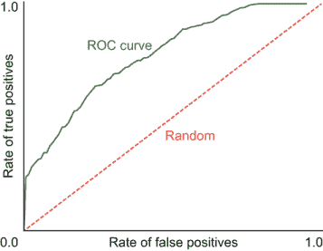

图 A.7 一个 ROC 曲线示例，按模型置信度确定的顺序绘制 TPR 与 FPR。在这个例子中，我们看到 ROC 曲线的前 20%几乎垂直。这条线告诉我们，对于最自信的 20%预测，我们几乎有 100%的准确性。ROC 曲线在 1.0 处几乎水平，对于最后的 30%。这条线告诉我们，当我们到达标签 30%最不自信的预测时，带有该标签的项目很少。

AUC 是 ROC 曲线下面积占整个可能面积的比例。AUC 也是随机选择两个具有不同标签的项目中，正确标签被更高置信度预测的概率。

因此，我们可以通过比较带有标签*e*的每个项目的置信度与没有标签的每个项目的置信度来计算 AUC：

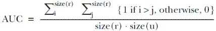

此算法将每个集合中的每个项目与其他每个项目进行比较，因此它具有 O(N²)的复杂度。如果你需要加快计算速度，因为评估项目数量很大，你可以首先对项目进行排序，并以 O(N Log(N))的复杂度递归地找到排序位置。

由于我们可以计算微观和宏观的精确度、召回率和 F 分数，我们还可以计算微观和宏观的 AUC：

+   *微观 AUC*—计算 AUC，但不是针对一个标签中的项目计算，而是针对所有标签中的所有项目计算。

+   *宏观 AUC*—分别计算每个标签的 AUC，并取所有标签的平均 AUC。

### A.3.5 发现的模型错误数量

如果你有一个机器学习模型在可能出错时退回到人工的系统，你可以计算发现的错误数量。你可能决定低于 50%的置信度可能是错误，例如，并将所有这些模型预测放在一个人面前接受或修正：

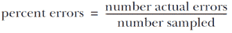

这个公式告诉你需要人工修正的项目标记百分比。一种变化是计算所有错误的百分比，这给出了人类预测加上模型预测的总准确率。另一种变化是计算每小时或每分钟出现的错误数量，如果你有固定的时间用于人工组件，这可能更有意义。

### A.3.6 节省的人工劳动成本

另一种计算人力成本的方法是衡量节省了多少时间和精力。无论你是使用主动学习来更明智地选择哪些项目进行标注（第 3-6 章）还是改进标注的质量控制和界面（第 8-11 章），提高人工组件在人工反馈系统中的效率、准确性和用户体验可能比在模型准确度上做出的小幅改变更为重要。图 A.8 展示了示例。

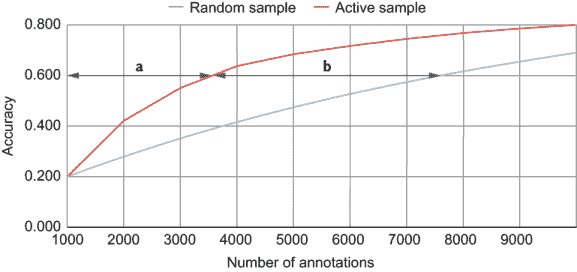

图 A.8 标签数量的减少是必要的。在这个例子中，使用主动学习（第 3-6 章）的策略达到与随机抽样相同的准确度，但所需的标签数量不到一半。B / (a + b) = 标签需要减少 53%。 

如图 A.8 所示，当我们查看 x 轴时，主动学习可以将所需的标签数量减少 53%，但如果查看 y 轴，该点的准确度差异大约为 20%。如果你来自算法背景，你可能更习惯于查看 y 轴，因为你通常在相同的数据上比较两个算法。所以如果你在比较两个不同数据集上的相同算法，x 轴有更重要的数字。

### A.3.7 本书计算准确度的其他方法

本附录涵盖了计算准确度的最标准方法，但一些特定于机器学习的准确度指标在此未涵盖：用于语言生成的双语评估助手（BLEU）；用于目标检测的交集与并集（IoU）；按人口统计的准确度；以及人类标注的调整后一致性。这些指标在书中的适当位置介绍，因此你在此复习中不需要理解它们。

* * *

(1.)本章的早期版本使用了 NumPy 库而不是 PyTorch 库。您可以在[`mng.bz/Xd4p`](http://mng.bz/Xd4p)查看那些示例。
