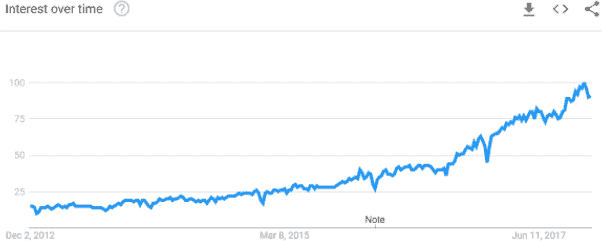

# 序言

# 机器学习的简要历史

机器学习是人工智能的一个子领域，计算机通过数据学习，通常是为了在某些狭义定义的任务上提高性能，而无需显式编程。*机器学习* 这个术语早在 1959 年就被创造出来了（由 AI 领域的传奇人物亚瑟·塞缪尔），但在 21 世纪，机器学习并没有取得多少主要的商业成功。相反，该领域仍然是一种学术界的小众研究领域。

在早期（上世纪六十年代），AI 社区中许多人对其未来持过于乐观的态度。当时的研究人员，如赫伯特·西蒙和马文·明斯基，声称 AI 将在几十年内达到人类水平的智能：¹

> 机器将在二十年内有能力完成人类能够完成的任何工作。
> 
> 赫伯特·西蒙，1965
> 
> 从三到八年内，我们将拥有一台具有平均人类智能的机器。
> 
> 马文·明斯基，1970

研究人员过于乐观，专注于所谓的*强人工智能* 或 *通用人工智能（AGI）* 项目，试图构建能够解决问题、知识表示、学习和规划、自然语言处理、感知和运动控制的 AI 代理。这种乐观主义帮助吸引了来自国防部等主要参与者的重要资金，但这些研究人员所解决的问题过于雄心勃勃，最终注定失败。

AI 研究很少从学术界跨入工业界，随之而来的是一系列所谓的 AI 寒冬。在这些 AI 寒冬中（这是基于冷战时代核冬天的类比），对 AI 的兴趣和资金逐渐减少。偶尔会出现围绕 AI 的炒作周期，但很少有持久性。到了 1990 年代初，对 AI 的兴趣和资金已经达到了低谷。

# AI 回归了，但为什么现在？

过去二十年中，AI 重新以全新的姿态出现——起初作为一种纯学术兴趣领域，现在已成为吸引大学和公司最聪明头脑的完整领域。

三个关键发展推动了这一复兴：机器学习算法的突破、大量数据的可用性以及超快速的计算机。

首先，研究人员不再专注于过于雄心勃勃的强人工智能项目，转而关注强人工智能的狭义子问题，也被称为*弱人工智能* 或 *狭义人工智能*。这种专注于改进狭义任务解决方案的做法导致了算法上的突破，为成功的商业应用铺平了道路。许多这些算法——通常最初在大学或私人研究实验室开发——很快被开源，加速了这些技术在工业界的采纳。

其次，数据捕获成为大多数组织的焦点，数字数据存储成本大幅下降。得益于互联网，大量数据也以前所未有的规模广泛公开和共享。

其次，云端计算的普及使得 AI 研究人员能够根据需求轻松、廉价地扩展其 IT 基础设施，而无需进行大规模的前期硬件投资。

# 应用人工智能的出现

这三股力量将 AI 从学术界推向工业界，每年吸引越来越高的兴趣和资金。AI 不再仅仅是一个理论上的兴趣领域，而是一个成熟的应用领域。Figure P-1 展示了 Google Trends 中机器学习兴趣的增长趋势图，涵盖了过去五年的时间。

###### 图 P-1. 机器学习兴趣随时间变化图

现在，人工智能被视为一种突破性的横向技术，类似于计算机和智能手机的出现，将在未来十年对每一个行业产生重大影响。²

涉及机器学习的成功商业应用包括但不限于光学字符识别、电子邮件垃圾过滤、图像分类、计算机视觉、语音识别、机器翻译、群体分割与聚类、生成合成数据、异常检测、网络犯罪预防、信用卡欺诈检测、网络欺诈检测、时间序列预测、自然语言处理、棋盘游戏和视频游戏、文档分类、推荐系统、搜索、机器人技术、在线广告、情感分析、DNA 序列分析、金融市场分析、信息检索、问答系统和医疗决策。

# 过去 20 年来应用人工智能的主要里程碑

这些里程碑将 AI 从当时主要是学术讨论的话题带到了今天科技的主流位置。

+   1997 年：Deep Blue，一个自上世纪 80 年代中期开始研发的 AI 机器人，在一场备受关注的国际象棋比赛中击败了世界冠军加里·卡斯帕罗夫。

+   2004 年：DARPA 推出了 DARPA Grand Challenge，这是一项年度举办的自动驾驶挑战赛，在沙漠地区举行。2005 年，斯坦福获得了最高奖。2007 年，卡内基梅隆大学在城市环境中实现了这一壮举。2009 年，谷歌推出了自动驾驶汽车。到 2015 年，包括特斯拉、Alphabet 的 Waymo 和 Uber 在内的许多主要技术巨头都推出了资金充裕的主流自动驾驶技术项目。

+   2006 年：多伦多大学的 Geoffrey Hinton 提出了一种快速学习算法，用于训练多层神经网络，开启了深度学习革命。

+   2006: Netflix 启动了 Netflix 奖（Netflix Prize）竞赛，奖金高达一百万美元，挑战团队利用机器学习技术，将其推荐系统的准确性提高至少 10%。一个团队在 2009 年赢得了这一奖项。

+   2007: AI 在跳棋比赛中达到超人类水平，由阿尔伯塔大学的团队解决。

+   2010: ImageNet 启动了年度比赛——ImageNet 大规模视觉识别挑战（ILSVRC），团队使用机器学习算法在一个大型、经过良好筛选的图像数据集中正确检测和分类对象。这引起了学术界和技术巨头的重视。由于深度卷积神经网络的进展，2011 年的分类错误率从 25%降至 2015 年的几个百分点。这导致了计算机视觉和物体识别的商业应用。

+   2010: Microsoft 推出了 Xbox 360 的 Kinect。由 Microsoft Research 的计算机视觉团队开发，Kinect 能够跟踪人体动作并将其转化为游戏操作。

+   2010: Siri，最早的主流数字语音助手之一，被 Apple 收购，并作为 iPhone 4S 的一部分于 2011 年 10 月发布。最终，Siri 在 Apple 的所有产品中都推出。由卷积神经网络和长短期记忆递归神经网络驱动，Siri 执行语音识别和自然语言处理。随后，亚马逊、微软和谷歌进入竞争，分别发布了 Alexa（2014 年）、Cortana（2014 年）和 Google Assistant（2016 年）。

+   2011: IBM Watson，一个由 David Ferrucci 领导的团队开发的问答型 AI 代理程序，击败了前《危险边缘》获胜者 Brad Rutter 和 Ken Jennings。IBM Watson 现在被多个行业使用，包括医疗保健和零售。

+   2012: 由 Andrew Ng 和 Jeff Dean 领导的 Google Brain 团队，通过观看来自 YouTube 视频的未标记图像，训练神经网络识别猫。

+   2013: Google 赢得了 DARPA 机器人挑战赛，涉及半自主机器人在危险环境中执行复杂任务，如驾驶车辆、越过瓦砾、清除被堵入的入口、打开门和爬梯子。

+   2014: Facebook 发布了基于神经网络的 DeepFace 系统，可以以 97%的准确率识别面部。这接近人类水平的性能，比先前系统提高了 27%以上。

+   2015: AI 成为主流，并广泛出现在全球的媒体报道中。

+   2015: Google DeepMind 的 AlphaGo 击败了世界级职业选手樊麾的围棋比赛。2016 年，AlphaGo 又击败了李世石，2017 年又击败了柯洁。2017 年，名为 AlphaGo Zero 的新版本以 100 比 0 击败了以前的 AlphaGo 版本。AlphaGo Zero 采用无监督学习技术，仅通过与自己对弈就掌握了围棋。

+   2016 年：谷歌对其语言翻译系统 Google Translate 进行了重大改进，将其现有的基于短语的翻译系统替换为基于深度学习的神经机器翻译系统，将翻译错误率降低了多达 87%，接近人类水平的准确度。

+   2017 年：由卡内基梅隆大学开发的 Libratus 在无限制德州扑克头对头比赛中获胜。

+   2017 年：OpenAI 训练的机器人在 Dota 2 比赛中击败了职业玩家。

# 从狭义人工智能到通用人工智能

当然，将人工智能成功应用于狭义问题只是一个起点。在人工智能社区中，有一种越来越强烈的信念，即通过结合几个弱人工智能系统，我们可以开发出强人工智能。这种强人工智能或通用人工智能（AGI）代理将能够在许多广义任务上达到人类水平的表现。

在人工智能达到人类水平表现之后不久，一些研究人员预测这种强人工智能将超越人类智能，达到所谓的*超级智能*。达到这种超级智能的时间估计从现在起可能只需 15 年，也可能需要 100 年，但大多数研究人员认为，在未来几代人之内，人工智能将足够发展到达到这一水平。这一次，这是否又是像之前人工智能周期中看到的炒作，还是有所不同？

只有时间能说明一切。

# 目标与方法

到目前为止，大多数成功的商业应用程序（如计算机视觉、语音识别、机器翻译和自然语言处理）都涉及有标签数据的监督学习。然而，大多数世界数据是*未标记*的。

在这本书中，我们将涵盖*无监督学习*领域（这是机器学习的一个分支，用于发现隐藏的模式），并学习未标记数据中的潜在结构。根据许多行业专家的说法，比如 Facebook 的 AI 研究总监兼纽约大学教授**杨立昆**，无监督学习是人工智能的下一个前沿，可能是实现通用人工智能的关键。因此，无监督学习是当今人工智能领域最炙手可热的话题之一。

本书的目标是概述您在日常工作中应用这项技术所需的概念和工具，以便您能够发展出这种直觉。换句话说，这是一本应用性的书籍，将帮助您构建真实世界的系统。我们还将探讨如何高效地标记未标记的数据集，将无监督学习问题转化为半监督学习问题。

本书将采用实践方法，介绍一些理论，但主要侧重于将无监督学习技术应用于解决现实世界的问题。数据集和代码可在[Jupyter notebooks on GitHub](http://bit.ly/2Gd4v7e)上找到。

凭借从本书中获得的概念理解和实践经验，您将能够将无监督学习应用于大型未标记数据集，以揭示隐藏模式，获取更深入的业务见解，检测异常，基于相似性对群组进行聚类，执行自动特征工程和选择，生成合成数据集等等。

# 先决条件

本书假定您具有一些 Python 编程经验，包括熟悉 NumPy 和 Pandas。

有关 Python 的更多信息，请访问[官方 Python 网站](https://www.python.org/)。有关 Jupyter Notebook 的更多信息，请访问[官方 Jupyter 网站](http://jupyter.org/index.html)。要复习大学水平的微积分、线性代数、概率和统计学，请阅读 Ian Goodfellow 和 Yoshua Bengio 的[《深度学习》教材的第 I 部分](http://www.deeplearningbook.org/)。要复习机器学习，请阅读[*统计学习的要素*](https://stanford.io/2Tju4al)。

# 路线图

本书分为四个部分，涵盖以下主题：

第 I 部分，*无监督学习基础*

监督学习和无监督学习之间的差异，流行的监督学习和无监督学习算法的概述，以及端到端的机器学习项目

第 II 部分，*使用 Scikit-Learn 进行无监督学习*

降维、异常检测和聚类和分组分割

###### 提示

有关部分 I 和 II 中讨论的概念的更多信息，请参阅[Scikit-learn 文档](https://scikit-learn.org/stable/modules/classes.html)。

第 III 部分，*使用 TensorFlow 和 Keras 进行无监督学习*

表示学习和自动特征提取、自动编码器和半监督学习

第 IV 部分，*使用 TensorFlow 和 Keras 进行深度无监督学习*

受限玻尔兹曼机、深度信念网络和生成对抗网络

# 本书中使用的约定

本书中使用以下印刷约定：

*斜体*

表示新术语、URL、电子邮件地址、文件名和文件扩展名。

`常量宽度`

用于程序清单，以及在段落中引用程序元素，如变量或函数名称、数据库、数据类型、环境变量、语句和关键字。

**`常量宽度粗体`**

显示用户应该按字面意思输入的命令或其他文本。

*`常量宽度斜体`*

显示应替换为用户提供的值或上下文确定的值的文本。

###### 提示

此元素表示提示或建议。

###### 注意

此元素表示一般注释。

###### 警告

此元素表示警告或注意事项。

# 使用代码示例

可以在[GitHub](http://bit.ly/2Gd4v7e)上下载补充材料（代码示例等）。

本书旨在帮助您完成工作。一般情况下，如果本书提供示例代码，您可以在您的程序和文档中使用它。除非您复制了代码的大部分内容，否则无需征得我们的许可。例如，编写一个使用本书中几个代码片段的程序无需许可。销售或分发包含奥莱利书籍示例的 CD-ROM 需要许可。引用本书回答问题并引用示例代码无需许可。将本书的大量示例代码整合到您产品的文档中需要许可。

我们感谢但不需要署名。署名通常包括标题、作者、出版商和 ISBN。例如：“*使用 Python 进行无监督学习实战* 作者 Ankur A. Patel（奥莱利）。版权所有 2019 Ankur A. Patel，978-1-492-03564-0。”

如果您觉得您使用的代码示例超出了合理使用范围或上述授权，请随时通过 *permissions@oreilly.com* 联系我们。

# 奥莱利在线学习

###### 注意

近 40 年来，[*奥莱利传媒*](http://oreilly.com) 为企业的成功提供技术和商业培训、知识和洞察。

我们独特的专家和创新者网络通过书籍、文章、会议和我们的在线学习平台分享他们的知识和专业知识。奥莱利的在线学习平台为您提供按需访问的现场培训课程、深度学习路径、交互式编码环境以及来自奥莱利和其他 200 多家出版商的大量文本和视频。更多信息，请访问 [*http://oreilly.com*](http://oreilly.com)。

# 如何联系我们

请将有关本书的评论和问题发送至出版商：

+   奥莱利传媒公司

+   1005 Gravenstein Highway North

+   CA 95472 Sebastopol

+   800-998-9938（美国或加拿大）

+   707-829-0515（国际或本地）

+   707-829-0104（传真）

我们为本书设立了一个网页，列出勘误、示例和任何额外信息。您可以访问 [*http://bit.ly/unsupervised-learning*](http://bit.ly/unsupervised-learning)。

要就本书发表评论或提出技术问题，请发送电子邮件至 *bookquestions@oreilly.com*。

有关我们的图书、课程、会议和新闻的更多信息，请访问我们的网站 [*http://www.oreilly.com*](http://www.oreilly.com)。

在 Facebook 上找到我们：[*http://facebook.com/oreilly*](http://facebook.com/oreilly)

在 Twitter 上关注我们：[*http://twitter.com/oreillymedia*](http://twitter.com/oreillymedia)

在 YouTube 上观看我们：[*http://www.youtube.com/oreillymedia*](http://www.youtube.com/oreillymedia)

¹ 这些观点在 1968 年启发了斯坦利·库布里克创作 *2001：太空漫游* 中的 AI 代理人 HAL 9000。

根据麦肯锡全球研究所的报告，到 2055 年，人们获得报酬的所有专业活动中超过一半可以实现自动化。
