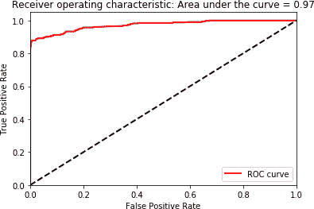

# 第二章：端到端机器学习项目

在我们详细探讨无监督学习算法之前，我们将回顾如何设置和管理机器学习项目，涵盖从获取数据到构建和评估模型以及实现解决方案的所有内容。我们将在本章使用监督学习模型——大多数读者应该对此有所了解——然后在下一章跳入无监督学习模型。

# 环境设置

在继续之前，让我们先设置数据科学环境。这个环境对于监督学习和无监督学习都是相同的。

###### 注意

这些说明针对的是 Windows 操作系统的优化，但也提供了适用于 Mac 和 Linux 的安装包。

## 版本控制：Git

如果你还没有安装 [Git](https://git-scm.com/)，你需要安装它。Git 是一个用于代码版本控制的系统，本书中的所有代码示例都可以在 [GitHub 仓库](http://bit.ly/2Gd4v7e) 的 Jupyter notebooks 中找到。请参阅 Roger Dudler 的 [Git 指南](http://rogerdudler.github.io/git-guide/)，了解如何克隆仓库、添加、提交和推送更改，并使用分支进行版本控制。

## 克隆《实战无监督学习》Git 仓库

打开命令行界面（例如 Windows 上的命令提示符，Mac 上的终端等）。导航至你将存储无监督学习项目的目录。使用以下提示从 GitHub 克隆与本书相关的仓库：

```py
$ git clone https://github.com/aapatel09/handson-unsupervised-learning.git
$ git lfs pull
```

或者，你可以访问 [仓库](http://bit.ly/2Gd4v7e) 的 GitHub 网站，手动下载仓库供你使用。你可以 *watch* 或 *star* 该仓库以便随时了解更新。

一旦仓库被拉取或手动下载，使用命令行界面导航至 *handson-unsupervised-learning* 仓库。

```py
$ cd handson-unsupervised-learning
```

对于接下来的安装步骤，我们将继续使用命令行界面。

## 科学计算库：Python 的 Anaconda 发行版

要安装 Python 和机器学习所需的科学计算库，请下载 Python 的 [Anaconda 发行版](https://www.anaconda.com/download/)（推荐使用版本 3.6，因为本书编写时版本 3.7 较新，不是所有我们将使用的机器学习库都支持该版本）。

创建一个孤立的 Python 环境，以便你可以为每个项目单独导入不同的库：

```py
$ conda create -n unsupervisedLearning python=3.6 anaconda
```

这将创建一个名为 `unsupervisedLearning` 的孤立的 Python 3.6 环境——其中包含 Anaconda 发行版提供的所有科学计算库。

现在，激活它以便使用：

```py
$ activate unsupervisedLearning
```

## 神经网络：TensorFlow 和 Keras

一旦激活 unsupervisedLearning，你需要安装 TensorFlow 和 Keras 来构建神经网络。TensorFlow 是由 Google 开源的项目，不是 Anaconda 发行版的一部分：

```py
$ pip install tensorflow
```

Keras 是一个开源的神经网络库，它为我们提供了一个更高级的 API，用于在 TensorFlow 的底层函数上进行操作。换句话说，我们将在 TensorFlow（后端）之上使用 Keras，以便使用更直观的 API 调用来开发我们的深度学习模型：

```py
$ pip install keras
```

## 梯度增强，第一版：XGBoost

接下来，安装一种称为 XGBoost 的梯度增强的版本。为了简化操作（至少对 Windows 用户而言），您可以导航到 *handson-unsupervised-learning* 存储库中的 *xgboost* 文件夹，并在那里找到包。

要安装该包，请使用 `pip install`：

```py
cd xgboost
pip install xgboost-0.6+20171121-cp36-cp36m-win_amd64.whl
```

或者，根据您的系统下载正确版本的 [XGBoost](http://bit.ly/2G1jBxs) —— 32 位或 64 位版本。

在命令行界面中，导航到具有此新下载文件的文件夹。使用 `pip install`：

```py
$ pip install xgboost-0.6+20171121-cp36-cp36m-win_amd64.whl
```

###### 注意

您的 XGBoost WHL 文件名可能会略有不同，因为新版本的软件已公开发布。

安装成功后，回到 *handson-unsupervised-learning* 文件夹。

## 梯度增强，第二版：LightGBM

安装另一个梯度增强版本，Microsoft 的 LightGBM：

```py
$ pip install lightgbm
```

## 聚类算法

让我们安装一些在本书后面将要使用的聚类算法。其中一个聚类包 *fastcluster* 是一个 C++ 库，具有 Python/SciPy 的接口。¹

可以使用以下命令安装这个 fastcluster 包：

```py
$ pip install fastcluster
```

另一个聚类算法是 *hdbscan*，也可以通过 pip 安装：

```py
$ pip install hdbscan
```

另外，为了时间序列聚类，让我们安装 *tslearn*：

```py
$ pip install tslearn
```

## 交互式计算环境：Jupyter Notebook

Jupyter notebook 是 Anaconda 发行版的一部分，因此我们现在将其激活，以启动我们刚刚设置的环境。在输入以下命令之前，请确保您位于 *handson-unsupervised-learning* 存储库中（为了方便使用）：

```py
$ jupyter notebook
```

您应该看到浏览器打开并启动 *[*http://localhost:8888/*](http://localhost:8888/)* 页面。必须启用 Cookie 才能正常访问。

现在我们准备构建我们的第一个机器学习项目。

# 数据概述

在本章中，我们将使用一个真实的数据集，该数据集包含 2013 年 9 月由欧洲持卡人进行的匿名信用卡交易。² 这些交易被标记为欺诈或真实，我们将使用机器学习构建欺诈检测解决方案，以预测从未见过的实例的正确标签。

此数据集高度不平衡。在 284,807 笔交易中，只有 492 笔是欺诈交易（0.172%）。这种低欺诈比例对于信用卡交易来说相当典型。

共有 28 个特征，全部为数值特征，没有分类变量。³ 这些特征不是原始特征，而是通过主成分分析得出的，我们将在 第 3 章 中探索这种降维方法，其将 28 个原始特征精简为主成分。

除了 28 个主成分外，我们还有三个其他变量——交易时间、交易金额以及交易的真实类别（如果是欺诈则为一，否则为零）。

# 数据准备

在可以使用机器学习训练数据并开发欺诈检测解决方案之前，我们需要为算法准备数据。

## 数据采集

任何机器学习项目的第一步是数据采集。

### 下载数据

下载数据集，并在 *handson-unsupervised-learning* 目录中将 CSV 文件放置在 */datasets/credit_card_data/* 文件夹中。如果您之前已经下载了 GitHub 仓库，则已在该仓库的此文件夹中有此文件。

### 导入必要的库

导入我们构建欺诈检测解决方案所需的 Python 库：

```py
'''Main'''
import numpy as np
import pandas as pd
import os

'''Data Viz'''
import matplotlib.pyplot as plt
import seaborn as sns
color = sns.color_palette()
import matplotlib as mpl

%matplotlib inline

'''Data Prep'''
from sklearn import preprocessing as pp
from scipy.stats import pearsonr
from sklearn.model_selection import train_test_split
from sklearn.model_selection import StratifiedKFold
from sklearn.metrics import log_loss
from sklearn.metrics import precision_recall_curve, average_precision_score
from sklearn.metrics import roc_curve, auc, roc_auc_score
from sklearn.metrics import confusion_matrix, classification_report

'''Algos'''
from sklearn.linear_model import LogisticRegression
from sklearn.ensemble import RandomForestClassifier
import xgboost as xgb
import lightgbm as lgb
```

### 读取数据

```py
current_path = os.getcwd()
file = '\\datasets\\credit_card_data\\credit_card.csv'
data = pd.read_csv(current_path + file)
```

### 预览数据

表格 2-1 显示数据集的前五行。您可以看到，数据已经正确加载：

```py
data.head()
```

表格 2-1\. 数据预览

|  | 时间 | V1 | V2 | V3 | V4 | V5 |
| --- | --- | --- | --- | --- | --- | --- |
| 0 | 0.0 | –1.359807 | –0.072781 | 2.536347 | 1.378155 | –0.338321 |
| 1 | 0.0 | 1.191857 | 0.266151 | 0.166480 | 0.448154 | 0.060018 |
| 2 | 1.0 | –1.358354 | –1.340163 | 1.773209 | 0.379780 | –0.503198 |
| 3 | 1.0 | –0.966272 | –0.185226 | 1.792993 | –0.863291 | –0.010309 |
| 4 | 2.0 | –1.158233 | 0.877737 | 1.548718 | 0.403034 | –0.407193 |
| 5 行 × 31 列 |

## 数据探索

接下来，让我们深入了解数据。我们将为数据生成摘要统计信息，识别任何缺失值或分类特征，并按特征计算不同值的数量。

### 生成摘要统计信息

表格 2-2 逐列描述数据。接下来的代码块列出了所有列名，以便参考。

```py
data.describe()
```

表格 2-2\. 简单的摘要统计

|  | 时间 | V1 | V2 | V3 | V4 |
| --- | --- | --- | --- | --- | --- |
| 总数 | 284807.000000 | 2.848070e+05 | 2.848070e+05 | 2.848070e+05 | 2.848070e+05 |
| 均值 | 94813.859575 | 3.919560e–15 | 5.688174e–16 | –8.769071e–15 | 2.782312e–15 |
| 标准差 | 47488.145955 | 1.958696e+00 | 1.651309e+00 | 1.516255e+00 | 1.415869e+00 |
| 最小值 | 0.000000 | –5.640751e+01 | –7.271573e+01 | –4.832559e+01 | –5.683171e+00 |
| 25% | 54201.500000 | –9.203734e–01 | –5.985499e–01 | –8.903648e–01 | –8.486401e–01 |
| 50% | 84692.000000 | 1.810880e–02 | 6.548556e–02 | 1.798463e–01 | –1.984653e–02 |
| 75% | 139320.500000 | 1.315642e+00 | 8.037239e–01 | 1.027196e+00 | 7.433413e–01 |
| 最大值 | 172792.000000 | 2.454930e+00 | 2.205773e+01 | 9.382558e+00 | 1.687534e+01 |
| 31 列 x 8 行 |

```py
data.columns
```

```py
Index(['Time', 'V1,' 'V2', 'V3', 'V4', 'V5', 'V6', 'V7', 'V8', 'V9', 'V10',
'V11', 'V12', 'V13', 'V14', 'V15', 'V16', 'V17', 'V18', 'V19', 'V20', 'V21',
'V22', 'V23', 'V24', 'V25', 'V26', 'V27', 'V28', 'Amount', 'Class'],
dtype='object')
```

```py
data['Class'].sum()
```

正标签的总数，或欺诈交易，为 492。如预期，共有 284,807 个实例和 31 列——28 个数值特征（V1 至 V28），时间，金额和类别。

时间戳范围从 0 到 172,792，金额范围从 0 到 25,691.16，有 492 笔欺诈交易。这些欺诈交易也称为正案例或正标签（标记为一）；正常交易称为负案例或负标签（标记为零）。

这 28 个数值特征目前尚未标准化，但我们很快将对数据进行标准化。*标准化*会将数据重新缩放，使其均值为零，标准差为一。

###### 小贴士

一些机器学习解决方案对数据的规模非常敏感，因此通过标准化使所有数据在相同的相对比例上具有良好的机器学习实践。

另一种常见的数据缩放方法是*归一化*，它将数据重新缩放到零到一的范围内。与标准化数据不同，所有归一化数据都在正数范围内。

### 通过特征识别非数字值

一些机器学习算法无法处理非数字值或缺失值。因此，最佳实践是识别非数字值（也称为*非数字*或*NaN*）。

在缺失值的情况下，我们可以填充值——例如，用特征的平均值、中位数或众数替换缺失点——或用某个用户定义的值替换。对于分类值，我们可以对数据进行编码，以便所有分类值都用稀疏矩阵表示。然后，这个稀疏矩阵与数值特征结合。机器学习算法基于这个组合特征集进行训练。

以下代码显示，观察中没有 NaN 值，因此我们不需要填充或编码任何值：

```py
nanCounter = np.isnan(data).sum()
```

```py
Time 		0
V1 		0
V2 		0
V3 		0
V4 		0
V5 		0
V6 		0
V7 		0
V8 		0
V9 		0
V10 		0
V11 		0
V12 		0
V13 		0
V14 		0
V15 		0
V16 		0
V17 		0
V18 		0
V19 		0
V20 		0
V21 		0
V22 		0
V23 		0
V24 		0
V25 		0
V26 		0
V27 		0
V28 		0
Amount 	0
Class 		0
dtype: 	int64
```

### 通过特征识别不同的值

为了更好地理解信用卡交易数据集，让我们按特征计算不同值的数量。

以下代码显示，我们有 124,592 个不同的时间戳。但是我们从之前知道总共有 284,807 个观测值。这意味着某些时间戳上有多次交易。

不出所料，只有两类——一类是欺诈，零类是非欺诈：

```py
distinctCounter = data.apply(lambda x: len(x.unique()))
```

```py
Time 		124592
V1 		275663
V2 		275663
V3 		275663
V4 		275663
V5 		275663
V6 		275663
V7 		275663
V8 		275663
V9 		275663
V10 		275663
V11 		275663
V12 		275663
V13 		275663
V14 		275663
V15 		275663
V16 		275663
V17 		275663
V18 		275663
V19 		275663
V20 		275663
V21 		275663
V22 		275663
V23 		275663
V24 		275663
V25 		275663
V26 		275663
V27 		275663
V28 		275663
Amount 	32767
Class 		2
dtype: 	int64
```

## 生成特征矩阵和标签数组

让我们创建并标准化特征矩阵 X，并分离标签数组 y（欺诈为一，非欺诈为零）。稍后在训练期间，我们将把它们输入到机器学习算法中。

### 创建特征矩阵 X 和标签数组 Y

```py
dataX = data.copy().drop([‘Class’],axis=1)
dataY = data[‘Class’].copy()
```

### 标准化特征矩阵 X

让我们重新缩放特征矩阵，使得每个特征（时间除外）的均值为零，标准差为一：

```py
featuresToScale = dataX.drop(['Time'],axis=1).columns
sX = pp.StandardScaler(copy=True)
dataX.loc[:,featuresToScale] = sX.fit_transform(dataX[featuresToScale])
```

正如 Table 2-3 所示，标准化后的特征现在均值为零，标准差为一。

Table 2-3\. Summary of scaled features

|  | Time | V1 | V2 | V3 | V4 |
| --- | --- | --- | --- | --- | --- |
| count | 284807.000000 | 2.848070e+05 | 2.848070e+05 | 2.848070e+05 | 2.848070e+05 |
| mean | 94813.859575 | –8.157366e–16 | 3.154853e–17 | –4.409878e–15 | –6.734811e–16 |
| std | 47488.145955 | 1.000002e+00 | 1.000002e+00 | 1.000002e+00 | 1.000002e+00 |
| min | 0.000000 | –2.879855e+01 | –4.403529e+01 | –3.187173e+01 | –4.013919e+00 |
| 25% | 54201.500000 | –4.698918e–01 | –3.624707e–01 | –5.872142e–01 | –5.993788e–01 |
| 50% | 84692.000000 | 9.245351e–03 | 3.965683e–02 | 1.186124e–02 | –1.401724e–01 |
| 75% | 139320.500000 | 6.716939e–01 | 4.867202e–01 | 6.774569e–01 | 5.250082e–01 |
| max | 172792.000000 | 1.253351e+00 | 1.335775e+01 | 6.187993e+00 | 1.191874e+01 |
| 8 rows x 30 columns |

## Feature Engineering and Feature Selection

在大多数机器学习项目中，我们应该将*特征工程*和*特征选择*视为解决方案的一部分。特征工程涉及创建新特征，例如从原始特征计算比率、计数或总和，以帮助机器学习算法从数据集中提取更强的信号。

特征选择涉及选择用于训练的特征子集，有效地从考虑中移除一些不太相关的特征。这有助于防止机器学习算法过度拟合数据集中的噪声。

对于这个信用卡欺诈数据集，我们没有原始特征。我们只有从 PCA 中得出的主成分，PCA 是一种我们将在第三章中探讨的降维形式。由于我们不知道任何特征代表什么，我们无法进行任何智能特征工程。

由于观测值（284,807）远远超过特征数（30），因此特征选择也是不必要的，这显著降低了过拟合的可能性。而且，正如 Figure 2-1 所示，特征之间的相关性只是轻微的。换句话说，我们没有冗余特征。如果有的话，我们可以通过降维来消除或减少冗余。当然，这并不奇怪。PCA 已经在这个信用卡数据集上执行过了，为我们消除了冗余。

### 检查特征之间的相关性

```py
correlationMatrix = pd.DataFrame(data=[],index=dataX.columns,
columns=dataX.columns)
for i in dataX.columns:
    for j in dataX.columns:
        correlationMatrix.loc[i,j] = np.round(pearsonr(dataX.loc[:,i],
         dataX.loc[:,j])[0],2)
```


###### Figure 2-1\. Correlation matrix

## Data Visualization

最后一步，让我们来可视化数据，以了解数据集的不平衡程度(Figure 2-2)。由于欺诈案例很少，这是一个难题；幸运的是，我们有整个数据集的标签：

```py
count_classes = pd.value_counts(data['Class'],sort=True).sort_index()
ax = sns.barplot(x=count_classes.index, y=tuple(count_classes/len(data)))
ax.set_title('Frequency Percentage by Class')
ax.set_xlabel('Class')
ax.set_ylabel('Frequency Percentage')
```


###### Figure 2-2\. Frequency percentage of labels

# Model Preparation

现在数据准备好了，让我们为模型做准备。我们需要将数据分割为训练集和测试集，选择成本函数，并为*k*折交叉验证做准备。

## 将数据集分割为训练集和测试集

正如您可能从第一章中回忆起的，机器学习算法从数据中学习（即在数据上进行训练），以在以前未见过的案例上表现良好（即准确预测）。在这些以前未见过的案例上的表现被称为泛化误差——这是确定机器学习模型好坏的最重要指标。

我们需要设置我们的机器学习项目，以便从中学习的机器学习算法具有训练集。我们还需要一个测试集（以前未见过的案例），机器学习算法可以对其进行预测。这个测试集上的性能将是成功的最终标准。

让我们继续将我们的信用卡交易数据集分割为训练集和测试集。

```py
X_train, X_test, y_train, y_test = train_test_split(dataX,
                                    dataY, test_size=0.33,
                                    random_state=2018, stratify=dataY)
```

现在我们有一个包含 190,280 个实例的训练集（原始数据集的 67%）和一个包含 93,987 个实例的测试集（剩余的 33%）。为了保持训练集和测试集中欺诈比例（约 0.17%）的一致性，我们设置了分层参数。我们还将随机状态设置为 2018，以便更容易地重现结果。⁴

我们将使用测试集来最终评估我们的泛化误差（也称为样本外误差）。

## 选择成本函数

在我们对训练集进行训练之前，我们需要一个成本函数（也称为错误率或值函数），将其传递给机器学习算法。机器学习算法将尝试通过从训练示例中学习来最小化这个成本函数。

由于这是一个监督分类问题——有两个类别——让我们使用*二元分类对数损失*（如方程式 2-1 所示），它将计算真实标签与基于模型的预测之间的交叉熵。

##### 方程式 2-1\. 对数损失函数

<math class="center" display="block"><mi>log loss</mi><mo>=</mo> <mrow><mo>–</mo> <mfrac><mn>1</mn><mi>N</mi></mfrac></mrow> <munderover><mo mathsize="200%">Σ</mo> <mrow><mi>i</mi><mo>=</mo><mi>1</mi></mrow> <mi>N</mi></munderover> <munderover><mo mathsize="200%">Σ</mo> <mrow><mi>j</mi><mo>=</mo><mn>1</mn></mrow> <mi>M</mi></munderover> <msub><mi>y</mi> <mrow><mi>i</mi><mtext>,</mtext><mi>j</mi></mrow></msub> <mi>log</mi> <mo stretchy="false">(</mo> <msub><mi>p</mi> <mrow><mi>i</mi><mtext>,</mtext><mi>j</mi></mrow></msub> <mo stretchy="false">)</mo></math>

其中*N*是观察数；*M*是类别标签数（在本例中为两个）；log 是自然对数；[*yi,j*] 如果观察*i*属于类别*j*则为 1，否则为 0；[*pi,j*] 是观察*i*属于类别*j*的预测概率。

机器学习模型将为每笔信用卡交易生成欺诈概率。欺诈概率越接近真实标签（即欺诈为 1 或非欺诈为 0），对数损失函数的值越低。这是机器学习算法将尝试最小化的目标。

## 创建 k 折交叉验证集

为了帮助机器学习算法估计其在以前未见过的示例（测试集）上的性能，最佳做法是进一步将训练集分割为训练集和验证集。

例如，如果我们将训练集分为五分之一，我们可以在原始训练集的四分之一上进行训练，并通过对原始训练集的第五个切片进行预测来评估新的训练模型，称为验证集。

可以像这样训练和评估五次——每次留出一个不同的五分之一作为验证集。这被称为*k*折交叉验证，其中*k*在本例中为五。通过这种方法，我们将不是一个估计值，而是五个泛化误差的估计值。

我们将为五次运行中的每一次存储训练得分和交叉验证得分，并且我们将每次存储交叉验证预测。在所有五次运行完成后，我们将对整个数据集进行交叉验证预测。这将是测试集性能的最佳整体估计。

下面是如何为*k*折验证设置，其中*k*为五：

```py
k_fold = StratifiedKFold(n_splits=5, shuffle=True, random_state=2018)
```

# 机器学习模型（第一部分）

现在我们准备构建机器学习模型。对于我们考虑的每个机器算法，我们将设置超参数，训练模型，并评估结果。

## 模型 #1：逻辑回归

让我们从最基本的分类算法开始，逻辑回归。

### 设置超参数

```py
penalty = 'l2'
C = 1.0
class_weight = 'balanced'
random_state = 2018
solver = 'liblinear'

logReg = LogisticRegression(penalty=penalty, C=C,
            class_weight=class_weight, random_state=random_state,
                            solver=solver, n_jobs=n_jobs)
```

我们将把惩罚设置为默认值 L2 而不是 L1。与 L1 相比，L2 对异常值不太敏感，并且将为几乎所有特征分配非零权重，从而产生一个稳定的解决方案。L1 将为最重要的特征分配高权重，并为其余特征分配接近零的权重，实际上在算法训练时执行特征选择。然而，由于权重在特征之间变化很大，所以 L1 解决方案对数据点的变化不如 L2 解决方案稳定。⁵

C 是正则化强度。如您可能还记得的来自第一章，正则化通过惩罚复杂性来帮助解决过拟合问题。换句话说，正则化越强，机器学习算法对复杂性的惩罚就越大。正则化促使机器学习算法更喜欢简单的模型而不是更复杂的模型，其他条件相等。

这个正则化常数 C 必须是一个正浮点数。数值越小，正则化越强。我们将保持默认值 1.0。

我们的信用卡交易数据集非常不平衡——在所有的 284,807 个案例中，只有 492 个是欺诈性的。随着机器学习算法的训练，我们希望算法更多地关注学习来自正标记交易的情况，换句话说，就是欺诈交易，因为在数据集中这样的交易很少。

对于这个逻辑回归模型，我们将设置`class_weight`为平衡。这向逻辑回归算法表示我们有一个类别不平衡的问题；算法在训练时将需要更重视正标签。在这种情况下，权重将与类别频率成反比；算法将给罕见的正标签（即欺诈）分配更高的权重，给更常见的负标签（即非欺诈）分配较低的权重。

随机状态固定为 2018，以帮助其他人——例如你，读者——复现结果。我们将保持默认的 solver liblinear。

### 训练模型

现在超参数已经设定好，我们将在每个五折交叉验证分割上训练逻辑回归模型，用训练集的四分之四来训练，并在留置的第五切片上评估性能。

当我们像这样训练和评估五次后，我们将计算成本函数——我们信用卡交易问题的对数损失——对训练集（即原始训练集的五分之四切片）和验证集（即原始训练集的五分之一切片）。我们还将存储每个五折交叉验证集的预测；到第五次运行结束时，我们将得到整个训练集的预测：

```py
trainingScores = []
cvScores = []
predictionsBasedOnKFolds = pd.DataFrame(data=[],
                                        index=y_train.index,columns=[0,1])

model = logReg

for train_index, cv_index in k_fold.split(np.zeros(len(X_train))
                                          ,y_train.ravel()):
    X_train_fold, X_cv_fold = X_train.iloc[train_index,:], \
        X_train.iloc[cv_index,:]
    y_train_fold, y_cv_fold = y_train.iloc[train_index], \
        y_train.iloc[cv_index]

    model.fit(X_train_fold, y_train_fold)
    loglossTraining = log_loss(y_train_fold,
                               model.predict_proba(X_train_fold)[:,1])
    trainingScores.append(loglossTraining)

    predictionsBasedOnKFolds.loc[X_cv_fold.index,:] = \
        model.predict_proba(X_cv_fold)
    loglossCV = log_loss(y_cv_fold,
                         predictionsBasedOnKFolds.loc[X_cv_fold.index,1])
    cvScores.append(loglossCV)

    print('Training Log Loss: ', loglossTraining)
    print('CV Log Loss: ', loglossCV)

loglossLogisticRegression = log_loss(y_train,
                                     predictionsBasedOnKFolds.loc[:,1])
print('Logistic Regression Log Loss: ', loglossLogisticRegression)
```

### 评估结果

下面的代码显示了五次运行中每次的训练对数损失和交叉验证对数损失。一般来说（但不总是），训练对数损失会低于交叉验证对数损失。因为机器学习算法直接从训练数据中学习，所以它在训练集上的表现（即对数损失）应该比在交叉验证集上好。请记住，交叉验证集包含了在训练过程中明确保留的交易。

```py
Training Log Loss: 		0.10080139188958696
CV Log Loss:		0.10490645274118293
Training Log Loss: 		0.12098957040484648
CV Log Loss:		0.11634801169793386
Training Log Loss: 		0.1074616029843435
CV Log Loss:		0.10845630232487576
Training Log Loss: 		0.10228137039781758
CV Log Loss:		0.10321736161148198
Training Log Loss: 		0.11476012373315266
CV Log Loss:		0.1160124452312548
```

###### 注意

对于我们的信用卡交易数据集，重要的是要记住我们正在构建一个欺诈检测解决方案。当我们提到机器学习模型的*性能*时，我们指的是模型在数据集中预测欺诈的能力有多好。

机器学习模型为每笔交易输出一个预测概率，其中 1 表示欺诈，0 表示非欺诈。预测概率越接近 1，交易越可能是欺诈；越接近 0，交易越可能是正常的。通过将模型的预测概率与真实标签进行比较，我们可以评估模型的好坏。

对于五次运行中的每一次，它们的训练和交叉验证对数损失是相似的。逻辑回归模型没有表现出严重的过拟合；如果有的话，我们将会看到低的训练对数损失和相对较高的交叉验证对数损失。

由于我们存储了每个五折交叉验证集的预测结果，我们可以将这些预测合并成一个单一集合。这个单一集合与原始训练集相同，现在我们可以计算整个训练集的总体对数损失。这是对测试集上逻辑回归模型对数损失的最佳估计：

```py
Logistic Regression Log Loss: 0.10978811472134588
```

# 评估指标

虽然对数损失是评估机器学习模型性能的好方法，但我们可能希望有更直观的方法来理解结果。例如，在训练集中的欺诈交易中，我们捕获了多少个？这就是*召回率*。或者，逻辑回归模型标记为欺诈交易的交易中，有多少是真正的欺诈交易？这就是模型的*精确率*。

让我们查看这些及其他类似的评估指标，以帮助我们更直观地理解结果。

###### 注意

这些评估指标非常重要，因为它们使数据科学家能够直观地向不熟悉对数损失、交叉熵和其他成本函数的业务人员解释结果。将复杂结果尽可能简单地传达给非数据科学家是应用数据科学家必须掌握的基本技能之一。

## 混淆矩阵

在典型的分类问题（没有类别不平衡情况）中，我们可以使用混淆矩阵来评估结果，它是一个总结真正例、真负例、假正例和假负例数量的表格（图 2-3）。


###### 图 2-3\. 混淆矩阵

鉴于我们的信用卡交易数据集类别高度不平衡，使用混淆矩阵将是有意义的。例如，如果我们预测每笔交易都不是欺诈交易，我们将得到 284,315 个真负例，492 个假负例，零个真正例和零个假正例。我们在识别真正欺诈交易方面的准确率为 0%。在这种类别不平衡问题下，混淆矩阵未能有效捕捉到这种次优结果。

对于涉及更平衡类别的问题（即真正例数量大致与真负例数量相似），混淆矩阵可能是一个好的、直接的评估指标。考虑到我们的不平衡数据集，我们需要找到一个更合适的评估指标。

## 精确率-召回率曲线

对于我们的不平衡信用卡交易数据集，评估结果的更好方法是使用精确率和召回率。*精确率*是真正例的数量除以总的正例预测数量。换句话说，模型捕获了多少个欺诈交易？

<math><mi>精确率</mi> <mo>=</mo> <mfrac><mi>真正例</mi> <mrow><mo>+</mo> <mi>假正例</mi></mrow></mfrac></math>

高精度意味着——在所有我们的正面预测中——许多是真正例（换句话说，它具有较低的假阳性率）。

*召回率*是数据集中实际正例的数量中捕捉到的欺诈交易数量。换句话说，模型捕捉了多少欺诈交易？⁷

<math><mi>召回率</mi> <mo>=</mo> <mi>真正例</mi> <mo>∕</mo> <mo>(</mo><mi>真正例</mi> <mo>+</mo> <mi>假正例</mi><mo>)</mo></math>

高召回率意味着模型捕捉到了大部分真正例（换句话说，它具有较低的假阴性率）。

高召回率但低精度的解决方案返回许多结果——捕捉到许多正例，但也有许多误报。高精度但低召回率的解决方案则恰恰相反；返回很少的结果——捕捉到数据集中所有正例的一部分，但其大多数预测是正确的。

如果我们的解决方案精度高但召回率低，那么找到的欺诈交易数量很少，但大多数确实是欺诈交易。

然而，如果解决方案精度低但召回率高，则会标记许多交易为欺诈，从而捕获大部分欺诈行为，但被标记的交易中大多数并非欺诈。

显然，两种解决方案都存在重大问题。在高精度-低召回率的情况下，信用卡公司会因为欺诈而损失很多钱，但不会因不必要地拒绝交易而激怒客户。在低精度-高召回率的情况下，信用卡公司会捕捉到很多欺诈行为，但肯定会因不必要地拒绝大量正常非欺诈交易而惹怒客户。

最佳解决方案需要具有高精度和高召回率，仅拒绝那些真正欺诈的交易（即高精度），并捕捉数据集中大部分的欺诈案例（高召回率）。

精度和召回率通常存在折衷，通常由算法设置的阈值决定，以将正例与负例分开；在我们的例子中，正例是欺诈，负例是非欺诈。如果阈值设置得太高，预测为正例的案例很少，导致高精度但低召回率。随着阈值的降低，预测为正例的案例增加，通常降低精度并增加召回率。

对于我们的信用卡交易数据集来说，可以把阈值看作是机器学习模型在拒绝交易方面的敏感性。如果阈值过高/严格，模型会拒绝很少的交易，但被拒绝的交易很可能是欺诈的。

阈值降低（即变得不那么严格），模型会拒绝更多交易，捕获更多的欺诈案例，但也不必要地拒绝更多正常案例。

精确率-召回率曲线的图形展示了精确率和召回率之间的权衡。为了评估精确率-召回率曲线，我们可以计算平均精度，即在每个阈值下达到的精确率的加权平均值。平均精度越高，解决方案越好。

###### 注意

阈值的选择非常重要，并且通常需要业务决策者的输入。数据科学家可以向这些业务决策者展示精确率-召回率曲线，以确定阈值应该设定在何处。

对于我们的信用卡交易数据集，关键问题是如何平衡客户体验（即避免拒绝正常交易）与欺诈检测（即捕捉到欺诈交易）？没有业务输入，我们无法回答这个问题，但我们可以找到具有最佳精确率-召回率曲线的模型。然后，我们可以将该模型呈现给业务决策者，以设定适当的阈值。

## 接收者操作特征曲线

另一个很好的评估指标是接收者操作特征曲线下的面积（auROC）。接收者操作特征（ROC）曲线将真阳性率绘制在 Y 轴上，将假阳性率绘制在 X 轴上。真阳性率也可以称为灵敏度，假阳性率也可以称为 1-特异度。曲线越接近绘图的左上角，解决方案越好——绝对最优点的值为（0.0, 1.0），表示假阳性率为 0%，真阳性率为 100%。

要评估解决方案，我们可以计算这条曲线下的面积。auROC 越大，解决方案越好。

### 评估逻辑回归模型

现在我们了解了一些使用的评估指标，让我们使用它们更好地理解逻辑回归模型的结果。

首先，让我们绘制精确率-召回率曲线并计算平均精度：

```py
preds = pd.concat([y_train,predictionsBasedOnKFolds.loc[:,1]], axis=1)
preds.columns = ['trueLabel','prediction']
predictionsBasedOnKFoldsLogisticRegression = preds.copy()

precision, recall, thresholds = precision_recall_curve(preds['trueLabel'],
                                                       preds['prediction'])

average_precision = average_precision_score(preds['trueLabel'],
                                            preds['prediction'])

plt.step(recall, precision, color='k', alpha=0.7, where='post')
plt.fill_between(recall, precision, step='post', alpha=0.3, color='k')

plt.xlabel('Recall')
plt.ylabel('Precision')
plt.ylim([0.0, 1.05])
plt.xlim([0.0, 1.0])

plt.title('Precision-Recall curve: Average Precision = {0:0.2f}'.format(
          average_precision))
```

图 2-4 展示了精确率-召回率曲线的图表。综合我们之前讨论的内容，你可以看到我们可以实现大约 80%的召回率（即捕获 80%的欺诈交易），精确率约为 70%（即模型标记为欺诈的交易中，70%确实是欺诈交易，而其余 30%则错误地被标记为欺诈）。


###### 图 2-4\. 逻辑回归的精确率-召回率曲线

我们可以通过计算平均精度将这条精确率-召回率曲线简化为一个数字，对于这个逻辑回归模型来说，这个平均精度为 0.73。目前我们还不能确定这个平均精度是好是坏，因为我们没有其他模型可以与我们的逻辑回归模型进行比较。

现在，让我们测量 auROC：

```py
fpr, tpr, thresholds = roc_curve(preds['trueLabel'],preds['prediction'])

areaUnderROC = auc(fpr, tpr)

plt.figure()
plt.plot(fpr, tpr, color='r', lw=2, label='ROC curve')
plt.plot([0, 1], [0, 1], color='k', lw=2, linestyle='--')
plt.xlim([0.0, 1.0])
plt.ylim([0.0, 1.05])
plt.xlabel('False Positive Rate')
plt.ylabel('True Positive Rate')
plt.title('Receiver operating characteristic:
          Area under the curve = {0:0.2f}'.format(areaUnderROC))
plt.legend(loc="lower right")
plt.show()
```

如图 Figure 2-5 所示，auROC 曲线为 0.97\. 这个指标是评估逻辑回归模型优劣的另一种方式，它可以帮助您确定在保持尽可能低的误报率的情况下能够捕获多少欺诈。和平均精度一样，我们不知道这个 0.97 的 auROC 曲线是好还是坏，但一旦与其他模型进行比较，我们就会知道。


###### 图 2-5\. 逻辑回归的 auROC 曲线

# 机器学习模型（第二部分）

为了比较逻辑回归模型的优劣，让我们使用其他监督学习算法构建几个更多的模型。

## 模型 #2：随机森林

让我们从随机森林开始。

与逻辑回归一样，我们将设置超参数，训练模型，并使用精确-召回曲线和 auROC 评估结果。

### 设置超参数

```py
n_estimators = 10
max_features = 'auto'
max_depth = None
min_samples_split = 2
min_samples_leaf = 1
min_weight_fraction_leaf = 0.0
max_leaf_nodes = None
bootstrap = True
oob_score = False
n_jobs = -1
random_state = 2018
class_weight = 'balanced'

RFC = RandomForestClassifier(n_estimators=n_estimators,
        max_features=max_features, max_depth=max_depth,
        min_samples_split=min_samples_split, min_samples_leaf=min_samples_leaf,
        min_weight_fraction_leaf=min_weight_fraction_leaf,
        max_leaf_nodes=max_leaf_nodes, bootstrap=bootstrap,
        oob_score=oob_score, n_jobs=n_jobs, random_state=random_state,
        class_weight=class_weight)
```

让我们从默认的超参数开始。估计器的数量设置为 10；换句话说，我们将建立 10 棵树，并在这 10 棵树上的结果上取平均值。对于每棵树，模型将考虑总特征数的平方根（在本例中，总共 30 个特征的平方根，即 5 个特征，向下取整）。

将 `max_depth` 设为 none 后，决策树会尽可能深地生长，在给定特征子集的情况下进行尽可能多的分裂。与逻辑回归相似，我们将随机状态设置为 2018 以保证结果的可复现性，并考虑到数据集不平衡将类别权重设置为平衡。

### 训练模型

我们将运行 *k*-折交叉验证五次，在四分之四的训练数据上进行训练，并在第五个切片上进行预测。我们将逐步存储预测结果：

```py
trainingScores = []
cvScores = []
predictionsBasedOnKFolds = pd.DataFrame(data=[],
                                        index=y_train.index,columns=[0,1])

model = RFC

for train_index, cv_index in k_fold.split(np.zeros(len(X_train)),
                                          y_train.ravel()):
    X_train_fold, X_cv_fold = X_train.iloc[train_index,:], \
        X_train.iloc[cv_index,:]
    y_train_fold, y_cv_fold = y_train.iloc[train_index], \
        y_train.iloc[cv_index]

    model.fit(X_train_fold, y_train_fold)
    loglossTraining = log_loss(y_train_fold, \
                                model.predict_proba(X_train_fold)[:,1])
    trainingScores.append(loglossTraining)

    predictionsBasedOnKFolds.loc[X_cv_fold.index,:] = \
        model.predict_proba(X_cv_fold)
    loglossCV = log_loss(y_cv_fold, \
        predictionsBasedOnKFolds.loc[X_cv_fold.index,1])
    cvScores.append(loglossCV)

    print('Training Log Loss: ', loglossTraining)
    print('CV Log Loss: ', loglossCV)

loglossRandomForestsClassifier = log_loss(y_train,
                                          predictionsBasedOnKFolds.loc[:,1])
print('Random Forests Log Loss: ', loglossRandomForestsClassifier)
```

### 评估结果

训练和交叉验证的对数损失结果如下：

```py
Training Log Loss: 		0.0003951763883952557
CV Log Loss:		0.014479198936303003
Training Log Loss: 		0.0004501221178398935
CV Log Loss:		0.005712702421375242
Training Log Loss: 		0.00043128813023860164
CV Log Loss:		0.00908372752510077
Training Log Loss: 		0.0004341676022058672
CV Log Loss:		0.013491161736979267
Training Log Loss: 		0.0004275530435950083
CV Log Loss:		0.009963232439211515
```

注意，训练集的训练对数损失要远远低于交叉验证的对数损失，这表明随机森林分类器在训练过程中在某种程度上对数据进行了过度拟合，尽管使用了大多数默认的超参数。

下面的代码显示了整个训练集上的对数损失（使用交叉验证预测）：

```py
Random Forests Log Loss: 0.010546004611793962
```

尽管它在某种程度上过度拟合了训练数据，但随机森林的验证对数损失约为逻辑回归的十分之一——相对于先前的机器学习解决方案，这是显著的改进。随机森林模型在正确标记信用卡交易中的欺诈方面表现更好。

Figure 2-6 显示了随机森林的精确-召回曲线。从曲线可以看出，该模型可以以大约 80% 的精确度捕获大约 80% 的欺诈情况。这比逻辑回归模型以 70% 精确度捕获的大约 80% 的欺诈情况更为显著。


###### 图 2-6\. 随机森林的精确-召回曲线

随机森林模型的平均精度为 0.79，明显优于逻辑回归模型的 0.73 平均精度。然而，随机森林的 auROC，如图 Figure 2-7，稍微差一些，为 0.93，而逻辑回归为 0.97。


###### 图 2-7\. 随机森林的 auROC 曲线

## 模型 #3：梯度提升机（XGBoost）

现在让我们使用梯度提升进行训练并评估结果。梯度提升有两个流行版本，一个是被称为 XGBoost，另一个是微软快速版本 LightGBM。让我们使用每个版本构建模型，首先是 XGBoost。⁸

### 设置超参数

我们将其设置为一个二元分类问题，并使用对数损失作为成本函数。我们将每棵树的最大深度设置为默认值六，并设置默认学习率为 0.3。对于每棵树，我们将使用所有观测值和所有特征；这些是默认设置。我们将设置随机状态为 2018，以确保结果的可重现性：

```py
params_xGB = {
    'nthread':16, #number of cores
    'learning rate': 0.3, #range 0 to 1, default 0.3
    'gamma': 0, #range 0 to infinity, default 0
        # increase to reduce complexity (increase bias, reduce variance)
    'max_depth': 6, #range 1 to infinity, default 6
    'min_child_weight': 1, #range 0 to infinity, default 1
    'max_delta_step': 0, #range 0 to infinity, default 0
    'subsample': 1.0, #range 0 to 1, default 1
        # subsample ratio of the training examples
    'colsample_bytree': 1.0, #range 0 to 1, default 1
        # subsample ratio of features
    'objective':'binary:logistic',
    'num_class':1,
    'eval_metric':'logloss',
    'seed':2018,
    'silent':1
}
```

### 训练模型

与之前一样，我们将使用*k*-折交叉验证，在不同的四分之四的训练数据上训练，并在第五部分进行预测，总共进行五次运行。

对于五次运行中的每一次，梯度提升模型将训练多达两千轮，评估交叉验证的对数损失是否在进行中减少。如果交叉验证的对数损失在前两百轮停止改善，则训练过程将停止，以避免过拟合。训练过程的结果很详细，所以我们不会在这里打印它们，但可以通过 [GitHub 上的代码](http://bit.ly/2Gd4v7e) 找到：

```py
trainingScores = []
cvScores = []
predictionsBasedOnKFolds = pd.DataFrame(data=[],
                                    index=y_train.index,columns=['prediction'])

for train_index, cv_index in k_fold.split(np.zeros(len(X_train)),
                                          y_train.ravel()):
    X_train_fold, X_cv_fold = X_train.iloc[train_index,:], \
        X_train.iloc[cv_index,:]
    y_train_fold, y_cv_fold = y_train.iloc[train_index], \
        y_train.iloc[cv_index]

    dtrain = xgb.DMatrix(data=X_train_fold, label=y_train_fold)
    dCV = xgb.DMatrix(data=X_cv_fold)

    bst = xgb.cv(params_xGB, dtrain, num_boost_round=2000,
                 nfold=5, early_stopping_rounds=200, verbose_eval=50)

    best_rounds = np.argmin(bst['test-logloss-mean'])
    bst = xgb.train(params_xGB, dtrain, best_rounds)

    loglossTraining = log_loss(y_train_fold, bst.predict(dtrain))
    trainingScores.append(loglossTraining)

    predictionsBasedOnKFolds.loc[X_cv_fold.index,'prediction'] = \
        bst.predict(dCV)
    loglossCV = log_loss(y_cv_fold, \
        predictionsBasedOnKFolds.loc[X_cv_fold.index,'prediction'])
    cvScores.append(loglossCV)

    print('Training Log Loss: ', loglossTraining)
    print('CV Log Loss: ', loglossCV)

loglossXGBoostGradientBoosting = \
    log_loss(y_train, predictionsBasedOnKFolds.loc[:,'prediction'])
print('XGBoost Gradient Boosting Log Loss: ', loglossXGBoostGradientBoosting)
```

### 评估结果

如以下结果所示，整个训练集上的对数损失（使用交叉验证预测）仅为随机森林的五分之一，逻辑回归的五十分之一。这是对前两个模型的显著改进：

```py
XGBoost Gradient Boosting Log Loss: 0.0029566906288156715
```

如图 Figure 2-8 所示，平均精度为 0.82，略低于随机森林（0.79），但明显优于逻辑回归（0.73）。


###### 图 2-8\. XGBoost 梯度提升的精确-召回曲线

如图 Figure 2-9 所示，auROC 曲线为 0.97，与逻辑回归相同（0.97），比随机森林（0.93）更好。到目前为止，基于对数损失、精确-召回曲线和 auROC，梯度提升是三个模型中最好的。


###### 图 2-9\. XGBoost 梯度提升的 auROC 曲线

## 模型 #4：梯度提升机（LightGBM）

现在让我们使用另一个名为 LightGBM 的梯度提升版本进行训练。⁹

### 设置超参数

我们将其设置为二元分类问题，并使用对数损失作为成本函数。 我们将每棵树的最大深度设置为 4，并使用学习率为 0.1。 对于每棵树，我们将使用所有样本和所有特征； 这些是默认设置。 我们将使用一个树的默认叶子节点数（31），并设置一个随机状态以确保结果的可重现性：

```py
params_lightGB = {
    'task': 'train',
    'application':'binary',
    'num_class':1,
    'boosting': 'gbdt',
    'objective': 'binary',
    'metric': 'binary_logloss',
    'metric_freq':50,
    'is_training_metric':False,
    'max_depth':4,
    'num_leaves': 31,
    'learning_rate': 0.01,
    'feature_fraction': 1.0,
    'bagging_fraction': 1.0,
    'bagging_freq': 0,
    'bagging_seed': 2018,
    'verbose': 0,
    'num_threads':16
}
```

### 训练模型

与之前一样，我们将使用*k*-fold 交叉验证，并在这五次循环中进行存储验证集上的预测：

```py
trainingScores = []
cvScores = []
predictionsBasedOnKFolds = pd.DataFrame(data=[],
                                index=y_train.index,columns=['prediction'])

for train_index, cv_index in k_fold.split(np.zeros(len(X_train)),
                                          y_train.ravel()):
    X_train_fold, X_cv_fold = X_train.iloc[train_index,:], \
        X_train.iloc[cv_index,:]
    y_train_fold, y_cv_fold = y_train.iloc[train_index], \
        y_train.iloc[cv_index]

    lgb_train = lgb.Dataset(X_train_fold, y_train_fold)
    lgb_eval = lgb.Dataset(X_cv_fold, y_cv_fold, reference=lgb_train)
    gbm = lgb.train(params_lightGB, lgb_train, num_boost_round=2000,
                   valid_sets=lgb_eval, early_stopping_rounds=200)

    loglossTraining = log_loss(y_train_fold, \
                gbm.predict(X_train_fold, num_iteration=gbm.best_iteration))
    trainingScores.append(loglossTraining)

    predictionsBasedOnKFolds.loc[X_cv_fold.index,'prediction'] = \
        gbm.predict(X_cv_fold, num_iteration=gbm.best_iteration)
    loglossCV = log_loss(y_cv_fold, \
        predictionsBasedOnKFolds.loc[X_cv_fold.index,'prediction'])
    cvScores.append(loglossCV)

    print('Training Log Loss: ', loglossTraining)
    print('CV Log Loss: ', loglossCV)

loglossLightGBMGradientBoosting = \
    log_loss(y_train, predictionsBasedOnKFolds.loc[:,'prediction'])
print('LightGBM gradient boosting Log Loss: ', loglossLightGBMGradientBoosting)
```

对于五次运行中的每一次，梯度提升模型将训练多达两千轮，评估交叉验证对数损失是否在进行中减少。 如果交叉验证对数损失停止改善（在前两百轮中），则训练过程将停止以避免过拟合。 训练过程的结果很冗长，所以我们不会在这里打印出来，但可以通过 [GitHub 上的代码](http://bit.ly/2Gd4v7e) 找到。

### 评估结果

下面的结果显示，整个训练集上的对数损失（使用交叉验证预测）与 XGBoost 相似，是随机森林的五分之一，是逻辑回归的五十分之一。 但与 XGBoost 相比，LightGBM 速度要快得多：

```py
LightGBM Gradient Boosting Log Loss: 0.0029732268054261826
```

如 图 2-10 所示，平均精度为 0.82，与 XGBoost 相同（0.82），优于随机森林（0.79），远优于逻辑回归（0.73）。


###### 图 2-10\. LightGBM 梯度提升的精确度-召回率曲线

如 图 2-11 所示，auROC 曲线为 0.98，比 XGBoost（0.97），逻辑回归（0.97）和随机森林（0.93）都有所改进。


###### 图 2-11\. LightGBM 梯度提升的 auROC 曲线

# 使用测试集评估四个模型

到目前为止，在本章中，我们学习了如何：

+   设置机器学习项目的环境

+   获取、加载、探索、清洗和可视化数据

+   将数据集分割为训练集和测试集，并设置*k*-fold 交叉验证集

+   选择适当的成本函数

+   设置超参数并进行训练和交叉验证

+   评估结果

我们尚未探索如何调整超参数（即超参数微调过程），以改善每个机器学习解决方案的结果并解决欠拟合/过拟合问题，但是 [GitHub 上的代码](http://bit.ly/2Gd4v7e) 将使您能够非常轻松地进行这些实验。

即使没有进行这样的精细调整，结果也很明显。根据我们的训练和*k*折交叉验证，LightGBM 梯度提升是最佳解决方案，紧随其后的是 XGBoost。随机森林和逻辑回归则较差。

让我们使用测试集作为四个模型的最终评估。

对于每个模型，我们将使用训练好的模型预测测试集交易的欺诈概率。然后，通过比较模型预测的欺诈概率与真实欺诈标签，计算每个模型的对数损失：

```py
predictionsTestSetLogisticRegression = \
    pd.DataFrame(data=[],index=y_test.index,columns=['prediction'])
predictionsTestSetLogisticRegression.loc[:,'prediction'] = \
    logReg.predict_proba(X_test)[:,1]
logLossTestSetLogisticRegression = \
    log_loss(y_test, predictionsTestSetLogisticRegression)

predictionsTestSetRandomForests = \
    pd.DataFrame(data=[],index=y_test.index,columns=['prediction'])
predictionsTestSetRandomForests.loc[:,'prediction'] = \
    RFC.predict_proba(X_test)[:,1]
logLossTestSetRandomForests = \
    log_loss(y_test, predictionsTestSetRandomForests)

predictionsTestSetXGBoostGradientBoosting = \
    pd.DataFrame(data=[],index=y_test.index,columns=['prediction'])
dtest = xgb.DMatrix(data=X_test)
predictionsTestSetXGBoostGradientBoosting.loc[:,'prediction'] = \
    bst.predict(dtest)
logLossTestSetXGBoostGradientBoosting = \
    log_loss(y_test, predictionsTestSetXGBoostGradientBoosting)

predictionsTestSetLightGBMGradientBoosting = \
    pd.DataFrame(data=[],index=y_test.index,columns=['prediction'])
predictionsTestSetLightGBMGradientBoosting.loc[:,'prediction'] = \
    gbm.predict(X_test, num_iteration=gbm.best_iteration)
logLossTestSetLightGBMGradientBoosting = \
    log_loss(y_test, predictionsTestSetLightGBMGradientBoosting)
```

在下面的对数损失块中没有什么意外。LightGBM 梯度提升在测试集上有最低的对数损失，其次是其他模型。

```py
Log Loss of Logistic Regression on Test Set: 0.123732961313
Log Loss of Random Forests on Test Set: 0.00918192757674
Log Loss of XGBoost Gradient Boosting on Test Set: 0.00249116807943
Log Loss of LightGBM Gradient Boosting on Test Set: 0.002376320092424
```

图 2-12 到 2-19 是四个模型的精确率-召回率曲线、平均精度和 auROC 曲线，验证了我们以上的发现。

### 逻辑回归


###### 图 2-12\. 逻辑回归的测试集精确率-召回率曲线


###### 图 2-13\. 逻辑回归的测试集 auROC 曲线

### 随机森林


###### 图 2-14\. 随机森林的测试集精确率-召回率曲线


###### 图 2-15\. 逻辑回归的测试集 auROC 曲线

### XGBoost 梯度提升


###### 图 2-16\. XGBoost 梯度提升的测试集精确率-召回率曲线


###### 图 2-17\. XGBoost 梯度提升的测试集 auROC 曲线

### LightGBM 梯度提升


###### 图 2-18\. LightGBM 梯度提升的测试集精确率-召回率曲线


###### 图 2-19\. LightGBM 梯度提升的测试集 auROC 曲线

LightGBM 梯度提升的结果令人印象深刻——我们可以捕捉超过 80%的欺诈交易，并且准确率接近 90%（换句话说，捕捉到 80%的总欺诈交易中，LightGBM 模型仅有 10%的错误）。

考虑到我们的数据集中欺诈案例很少，这是一项很大的成就。

# 集成模型

我们可以评估是否将这些开发的机器学习解决方案集成到生产中，以提高欺诈检测率¹⁰，而不是仅选择一个。

通常，如果我们包含来自不同机器学习家族的同样强大的解决方案（例如来自随机森林和神经网络的解决方案），这些解决方案的集成将比任何一个独立的解决方案产生更好的结果。这是因为每个独立的解决方案都有不同的优势和劣势。通过在集成中包含这些独立解决方案，一些模型的优势弥补了其他模型的劣势，反之亦然。

不过有重要的注意事项。如果独立的解决方案同样强大，集成模型的性能将优于任何一个独立的解决方案。但如果其中一个解决方案远远优于其他解决方案，集成模型的性能将等于最佳独立解决方案的性能；而次优解决方案将对集成模型的性能毫无贡献。

另外，独立的解决方案需要相对不相关。如果它们高度相关，一个解决方案的优点会反映在其余解决方案上，同样的情况也会出现在缺点上。通过集成来实现多样化将不会有太多好处。

## 堆叠

在我们的问题中，两个模型（LightGBM 梯度提升和 XGBoost 梯度提升）比其他两个模型（随机森林和逻辑回归）强大得多。但是最强大的两个模型来自同一个家族，这意味着它们的优势和劣势高度相关。

我们可以使用堆叠（一种集成形式）来确定是否能够相比之前的独立模型获得性能改进。在堆叠中，我们从每个四个独立模型的*k*-折交叉验证预测（称为第一层预测）中获取预测，并将它们附加到原始训练数据集上。然后，我们使用该原始特征加上第一层预测数据集进行*k*-折交叉验证训练。

这将产生一个新的*k*-折交叉验证预测集，称为第二层预测，我们将评估是否在性能上比任何单独的模型有所改进。

### 将第一层预测与原始训练数据集结合

首先，让我们将每个构建的四个机器学习模型的预测与原始训练数据集相结合：

```py
predictionsBasedOnKFoldsFourModels = pd.DataFrame(data=[],index=y_train.index)
predictionsBasedOnKFoldsFourModels = predictionsBasedOnKFoldsFourModels.join(
    predictionsBasedOnKFoldsLogisticRegression['prediction'].astype(float), \
    how='left').join(predictionsBasedOnKFoldsRandomForests['prediction'] \
	.astype(float),how='left',rsuffix="2").join( \
    predictionsBasedOnKFoldsXGBoostGradientBoosting['prediction'] \
	.astype(float), how='left',rsuffix="3").join( \
    predictionsBasedOnKFoldsLightGBMGradientBoosting['prediction'] \
	.astype(float), how='left',rsuffix="4")
predictionsBasedOnKFoldsFourModels.columns = \
    ['predsLR','predsRF','predsXGB','predsLightGBM']

X_trainWithPredictions = \
    X_train.merge(predictionsBasedOnKFoldsFourModels,
                  left_index=True,right_index=True)
```

### 设置超参数

现在我们将使用 LightGBM 梯度提升——之前练习中的最佳机器学习算法——在该原始特征加上第一层预测数据集上进行训练。超参数将保持与之前相同：

```py
params_lightGB = {
    'task': 'train',
    'application':'binary',
    'num_class':1,
    'boosting': 'gbdt',
    'objective': 'binary',
    'metric': 'binary_logloss',
    'metric_freq':50,
    'is_training_metric':False,
    'max_depth':4,
    'num_leaves': 31,
    'learning_rate': 0.01,
    'feature_fraction': 1.0,
    'bagging_fraction': 1.0,
    'bagging_freq': 0,
    'bagging_seed': 2018,
    'verbose': 0,
    'num_threads':16
}
```

### 训练模型

和之前一样，我们将使用*k*-折交叉验证，并为五个不同的交叉验证集生成欺诈概率：

```py
trainingScores = []
cvScores = []
predictionsBasedOnKFoldsEnsemble = \
    pd.DataFrame(data=[],index=y_train.index,columns=['prediction'])

for train_index, cv_index in k_fold.split(np.zeros(len(X_train)), \
                                          y_train.ravel()):
    X_train_fold, X_cv_fold = \
        X_trainWithPredictions.iloc[train_index,:], \
        X_trainWithPredictions.iloc[cv_index,:]
    y_train_fold, y_cv_fold = y_train.iloc[train_index], y_train.iloc[cv_index]

    lgb_train = lgb.Dataset(X_train_fold, y_train_fold)
    lgb_eval = lgb.Dataset(X_cv_fold, y_cv_fold, reference=lgb_train)
    gbm = lgb.train(params_lightGB, lgb_train, num_boost_round=2000,
                   valid_sets=lgb_eval, early_stopping_rounds=200)

    loglossTraining = log_loss(y_train_fold, \
        gbm.predict(X_train_fold, num_iteration=gbm.best_iteration))
    trainingScores.append(loglossTraining)

    predictionsBasedOnKFoldsEnsemble.loc[X_cv_fold.index,'prediction'] = \
        gbm.predict(X_cv_fold, num_iteration=gbm.best_iteration)
    loglossCV = log_loss(y_cv_fold, \
        predictionsBasedOnKFoldsEnsemble.loc[X_cv_fold.index,'prediction'])
    cvScores.append(loglossCV)

    print('Training Log Loss: ', loglossTraining)
    print('CV Log Loss: ', loglossCV)

loglossEnsemble = log_loss(y_train, \
        predictionsBasedOnKFoldsEnsemble.loc[:,'prediction'])
print('Ensemble Log Loss: ', loglossEnsemble)
```

### 评估结果

在以下结果中，我们没有看到任何改进。集成对数损失非常类似于独立梯度提升对数损失。由于最佳的独立解决方案来自相同的家族（梯度提升），我们没有看到结果的改进。它们在检测欺诈方面具有高度相关的优势和劣势。在模型之间进行多样化并没有好处：

```py
Ensemble Log Loss: 0.002885415974220497
```

如图 2-20 和 2-21 所示，精确率-召回率曲线、平均精度和 auROC 也证实了改进的缺乏。


###### 图 2-20\. 集成的精确率-召回率曲线



###### 图 2-21\. 集成的 auROC 曲线

# 最终模型选择

由于集成并没有提高性能，我们更倾向于使用独立的 LightGBM 梯度提升模型的简洁性，并将其用于生产。

在我们为新进入的交易创建流水线之前，让我们可视化一下 LightGBM 模型在测试集中如何将欺诈交易与正常交易分开。

图 2-22 在 x 轴上显示了预测概率。基于这个图表，模型在将实际欺诈交易分配高欺诈概率方面表现相当不错。反之，该模型通常会给不欺诈的交易分配低概率。偶尔，模型会错误地给实际欺诈案例分配低概率，而给非欺诈案例分配高概率。

总体而言，结果相当令人印象深刻。


###### 图 2-22\. 预测概率和真实标签的绘图

# 生产流水线

现在我们已经选择了一个模型进行生产，让我们设计一个简单的流水线，对新进入的数据执行三个简单的步骤：加载数据，缩放特征，并使用我们已经训练并选择用于生产的 LightGBM 模型生成预测：

```py
'''Pipeline for New Data'''
# first, import new data into a dataframe called 'newData'
# second, scale data
# newData.loc[:,featuresToScale] = sX.transform(newData[featuresToScale])
# third, predict using LightGBM
# gbm.predict(newData, num_iteration=gbm.best_iteration)
```

一旦生成了这些预测，分析师可以对预测为欺诈概率最高的交易采取行动（即进一步调查），并逐一处理列表。或者，如果自动化是目标，分析师可以使用一个自动拒绝预测为欺诈概率高于某个阈值的交易的系统。

例如，基于 图 2-13，如果我们自动拒绝预测概率高于 0.90 的交易，我们将拒绝几乎肯定是欺诈的案例，而不会意外地拒绝非欺诈案例。

# 结论

恭喜！您已经使用监督学习构建了一个信用卡欺诈检测系统。

我们一起建立了一个机器学习环境，获取并准备了数据，训练和评估了多个模型，选择了最终用于生产的模型，并设计了一个新的、流入交易的管道。你已经成功创建了一个应用的机器学习解决方案。

现在，我们将采用同样的实践方法，利用无监督学习开发应用的机器学习解决方案。

###### 注意

随着欺诈模式的变化，上述解决方案需要随时间重新训练。此外，我们应该找到其他机器学习算法——来自不同机器学习家族的算法——它们能像梯度提升一样表现良好，并将它们组合起来以改善整体的欺诈检测性能。

最后，解释性对于机器学习在实际应用中非常重要。因为这个信用卡交易数据集的特征是 PCA 的输出（一种我们将在第三章探讨的降维形式），我们无法用简单的英语解释为什么某些交易被标记为潜在的欺诈行为。为了更好地解释结果，我们需要访问原始的 PCA 前特征，但对于这个示例数据集，我们没有这些特征。

¹ 想了解更多关于 fastcluster 的信息，请参阅[文档](https://pypi.org/project/fastcluster/)。

² 这个数据集可以通过[Kaggle](https://www.kaggle.com/dalpozz/creditcardfraud)获取，并且是由 Worldline 和 Universite Libre de Bruxelles 的机器学习小组在研究合作期间收集的。更多信息请参见 Andrea Dal Pozzolo、Olivier Caelen、Reid A. Johnson 和 Gianluca Bontempi 的论文《Calibrating Probability with Undersampling for Unbalanced Classification》，发表于 IEEE 的计算智能与数据挖掘研讨会（CIDM），2015 年。

³ 分类变量取可能的有限数量的可能质量值之一，通常需要进行编码以在机器学习算法中使用。

⁴ 想了解 stratify 参数如何保留正标签比例，请访问[官方网站](http://bit.ly/2NiKWfi)。为了在你的实验中复制相同的分割，请将随机状态设置为 2018。如果设置为其他数字或者不设置，结果将不同。

⁵ 想了解 L1 与 L2 的区别，请参考博文[“L1 和 L2 作为损失函数和正则化的区别。”](http://bit.ly/2Bcx413)

⁶ 真正例是预测和实际标签都为真的实例。真负例是预测和实际标签都为假的实例。假正例是预测为真但实际标签为假的实例（也称为误报或类型 I 错误）。假负例是预测为假但实际标签为真的实例（也称为漏报或类型 II 错误）。

⁷ 召回率也称为敏感性或真正率。与敏感性相关的概念是特异性或真负率。特异性定义为数据集中真负例数除以总实际负例数。特异性 = 真负率 = 真负例 / (真负例 + 假正例)。

⁸ 关于 XGBoost 梯度提升的更多信息，请参阅[GitHub 代码库](https://github.com/dmlc/xgboost)。

⁹ 关于 Microsoft 的 LightGBM 梯度提升的更多信息，请参阅[GitHub 代码库](https://github.com/Microsoft/LightGBM)。

¹⁰ 关于集成学习的更多信息，请参考[“Kaggle 集成指南,”](https://mlwave.com/kaggle-ensembling-guide/) [“Python 中的集成/堆叠介绍,”](http://bit.ly/2RYV4iF) 和 [“实践中的模型堆叠指南”](http://bit.ly/2Rrs1iI)。
