# 第三章：降维

在本章中，我们将关注构建成功应用机器学习解决方案的一个主要挑战：维度灾难。无监督学习有一个很好的对策——*降维*。在本章中，我们将介绍这个概念，并从那里开始，帮助你培养对其工作原理的直觉。

在 第四章中，我们将基于降维构建我们自己的无监督学习解决方案——具体来说，是一个基于无监督学习的信用卡欺诈检测系统（与我们在第二章中构建的基于有监督的系统不同）。这种无监督的欺诈检测被称为异常检测，是应用无监督学习领域一个迅速发展的领域。

但在构建异常检测系统之前，让我们在本章中介绍降维。

# 降维的动机

正如第一章中所提到的，降维有助于克服机器学习中最常见的问题之一——维度灾难，其中算法由于特征空间的巨大规模，无法有效和高效地在数据上训练。

降维算法将高维数据投影到低维空间，同时尽可能保留重要信息，去除冗余信息。一旦数据进入低维空间，机器学习算法能够更有效、更高效地识别有趣的模式，因为噪声已经被大大减少。

有时，降维本身就是目标——例如，构建异常检测系统，我们将在下一章中展示。

其他时候，降维不是一个终点，而是达到另一个终点的手段。例如，降维通常是机器学习管道的一部分，帮助解决涉及图像、视频、语音和文本的大规模、计算密集型问题。

## MNIST 手写数字数据库

在介绍降维算法之前，让我们先探索一下本章将使用的数据集。我们将使用一个简单的计算机视觉数据集：MNIST（美国国家标准与技术研究院）手写数字数据库，这是机器学习中最为人知的数据集之一。我们将使用 Yann LeCun 网站上公开的 MNIST 数据集版本。¹ 为了方便起见，我们将使用[deeplearning.net](http://deeplearning.net)提供的 pickle 版本。²

这个数据集已被分为三个部分——一个包含 50,000 个例子的训练集，一个包含 10,000 个例子的验证集和一个包含 10,000 个例子的测试集。我们为所有例子都有标签。

该数据集由手写数字的 28x28 像素图像组成。每个数据点（即每个图像）可以表示为一组数字的数组，其中每个数字描述每个像素的暗度。换句话说，一个 28x28 的数字数组对应于一个 28x28 像素的图像。

为了简化起见，我们可以将每个数组展平为一个 28x28 或 784 维度的向量。向量的每个分量是介于零和一之间的浮点数——表示图像中每个像素的强度。零表示黑色，一表示白色。标签是介于零和九之间的数字，指示图像表示的数字。

### 数据获取和探索

在我们使用降维算法之前，让我们加载将要使用的库：

```py
# Import libraries
'''Main'''
import numpy as np
import pandas as pd
import os, time
import pickle, gzip

'''Data Viz'''
import matplotlib.pyplot as plt
import seaborn as sns
color = sns.color_palette()
import matplotlib as mpl

%matplotlib inline

'''Data Prep and Model Evaluation'''
from sklearn import preprocessing as pp
from scipy.stats import pearsonr
from numpy.testing import assert_array_almost_equal
from sklearn.model_selection import train_test_split
from sklearn.model_selection import StratifiedKFold
from sklearn.metrics import log_loss
from sklearn.metrics import precision_recall_curve, average_precision_score
from sklearn.metrics import roc_curve, auc, roc_auc_score
from sklearn.metrics import confusion_matrix, classification_report

'''Algos'''
from sklearn.linear_model import LogisticRegression
from sklearn.ensemble import RandomForestClassifier
import xgboost as xgb
import lightgbm as lgb
```

### 加载 MNIST 数据集

现在让我们加载 MNIST 数据集：

```py
# Load the datasets
current_path = os.getcwd()
file = '\\datasets\\mnist_data\\mnist.pkl.gz'

f = gzip.open(current_path+file, 'rb')
train_set, validation_set, test_set = pickle.load(f, encoding='latin1')
f.close()

X_train, y_train = train_set[0], train_set[1]
X_validation, y_validation = validation_set[0], validation_set[1]
X_test, y_test = test_set[0], test_set[1]
```

### 验证数据集的形状

让我们验证数据集的形状，以确保它们已正确加载：

```py
# Verify shape of datasets
print("Shape of X_train: ", X_train.shape)
print("Shape of y_train: ", y_train.shape)
print("Shape of X_validation: ", X_validation.shape)
print("Shape of y_validation: ", y_validation.shape)
print("Shape of X_test: ", X_test.shape)
print("Shape of y_test: ", y_test.shape)
```

以下代码确认了数据集的形状与预期相符：

```py
Shape of X_train:       (50000, 784)
Shape of y_train:       (50000,)
Shape of X_validation:  (10000, 784)
Shape of y_validation:  (10000,)
Shape of X_test:        (10000, 784)
Shape of y_test:        (10000,)
```

### 从数据集创建 Pandas DataFrames

让我们将 numpy 数组转换为 Pandas DataFrames，以便更容易进行探索和处理：

```py
# Create Pandas DataFrames from the datasets
train_index = range(0,len(X_train))
validation_index = range(len(X_train), /
                         len(X_train)+len(X_validation))
test_index = range(len(X_train)+len(X_validation), /
                   len(X_train)+len(X_validation)+len(X_test))

X_train = pd.DataFrame(data=X_train,index=train_index)
y_train = pd.Series(data=y_train,index=train_index)

X_validation = pd.DataFrame(data=X_validation,index=validation_index)
y_validation = pd.Series(data=y_validation,index=validation_index)

X_test = pd.DataFrame(data=X_test,index=test_index)
y_test = pd.Series(data=y_test,index=test_index)
```

### 探索数据

让我们生成数据的摘要视图：

```py
# Describe the training matrix
X_train.describe()
```

表格 3-1 显示了图像数据的摘要视图。许多数值为零——换句话说，图像中的大多数像素是黑色的。这是有道理的，因为数字是白色的，显示在黑色背景的中央。

表格 3-1\. 数据探索

|  | 0 | 1 | 2 | 3 | 4 | 5 | 6 |
| --- | --- | --- | --- | --- | --- | --- | --- |
| 计数 | 50000.0 | 50000.0 | 50000.0 | 50000.0 | 50000.0 | 50000.0 | 50000.0 |
| 平均值 | 0.0 | 0.0 | 0.0 | 0.0 | 0.0 | 0.0 | 0.0 |
| 标准差 | 0.0 | 0.0 | 0.0 | 0.0 | 0.0 | 0.0 | 0.0 |
| 最小值 | 0.0 | 0.0 | 0.0 | 0.0 | 0.0 | 0.0 | 0.0 |
| 25% | 0.0 | 0.0 | 0.0 | 0.0 | 0.0 | 0.0 | 0.0 |
| 50% | 0.0 | 0.0 | 0.0 | 0.0 | 0.0 | 0.0 | 0.0 |
| 75% | 0.0 | 0.0 | 0.0 | 0.0 | 0.0 | 0.0 | 0.0 |
| 最大 | 0.0 | 0.0 | 0.0 | 0.0 | 0.0 | 0.0 | 0.0 |
| 8 行 x 784 列 |

标签数据是一个表示图像中实际内容的一维向量。前几个图像的标签如下：

```py
# Show the labels
y_train.head()
```

```py
  0   5
  1   0
  2   4
  3   1
  4   9
  dtype: int64
```

### 显示图像

让我们定义一个函数来查看图像及其标签：

```py
def view_digit(example):
    label = y_train.loc[0]
    image = X_train.loc[example,:].values.reshape([28,28])
    plt.title('Example: %d Label: %d' % (example, label))
    plt.imshow(image, cmap=plt.get_cmap('gray'))
    plt.show()
```

第一个图像的视图——一旦将 784 维向量重塑为 28 x 28 像素图像——显示数字五（图 3-1）。

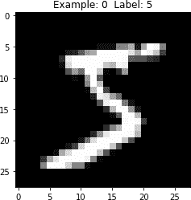

###### 图 3-1\. 第一个数字的视图

# 降维算法

现在我们已经加载并探索了 MNIST 数字数据集，让我们转向降维算法。对于每个算法，我们将首先介绍概念，然后通过将算法应用于 MNIST 数字数据集来深入理解。

## 线性投影 vs 流形学习

降维有两大主要分支。第一种被称为*线性投影*，它涉及将数据从高维空间线性投影到低维空间。这包括*主成分分析，奇异值分解*和*随机投影*等技术。

第二种被称为*流形学习*，也被称为*非线性降维*。这涉及技术，如*isomap*，它学习点之间的*曲线距离*（也称为*测地距离*），而不是*欧氏距离*。其他技术包括*多维缩放（MDS），局部线性嵌入（LLE），t 分布随机近邻嵌入（t-SNE），字典学习，随机树嵌入*和*独立成分分析*。

# 主成分分析

我们将探讨几个 PCA 版本，包括标准 PCA，增量 PCA，稀疏 PCA 和核 PCA。

## PCA，概念

让我们从标准 PCA 开始，这是最常见的线性降维技术之一。在 PCA 中，算法找到数据的低维表示，同时尽可能保留尽可能多的变化（即显著信息）。

PCA 通过处理特征之间的相关性来实现这一点。如果一组特征之间的相关性非常高，PCA 将尝试合并高度相关的特征，并用较少数量的线性不相关特征表示这些数据。该算法持续执行这种相关性减少，找到原始高维数据中方差最大的方向，并将它们投影到较小维度的空间中。这些新导出的成分称为主成分。

有了这些成分，可以重构原始特征，虽然不完全准确但一般足够接近。PCA 算法在寻找最优成分期间积极尝试最小化重构误差。

在我们的 MNIST 示例中，原始特征空间有 784 维，称为*d*维。PCA 将数据投影到较小的*k*维子空间（其中*k < d*），同时尽可能保留关键信息。这*k*个维度称为主成分。

我们留下的有意义的主成分数量远远小于原始数据集中的维数。通过转移到这个低维空间，我们会失去一些方差（即信息），但数据的基本结构更容易识别，使我们能够更有效地执行异常检测和聚类等任务。

此外，通过减少数据的维数，PCA 将减少数据的大小，进一步提高机器学习管道中后续阶段（例如图像分类等任务）的性能。

###### 注意

在运行 PCA 之前执行特征缩放非常重要。PCA 对原始特征的相对范围非常敏感。通常，我们必须缩放数据以确保特征处于相同的相对范围。然而，对于我们的 MNIST 数字数据集，特征已经缩放到 0 到 1 的范围，因此我们可以跳过这一步。

## PCA 实践

现在您对 PCA 工作原理有了更好的掌握，让我们将 PCA 应用于 MNIST 数字数据集，并看看 PCA 如何在将数据从原始的 784 维空间投影到较低维空间时捕获数字的最显著信息。

### 设置超参数

让我们为 PCA 算法设置超参数：

```py
from sklearn.decomposition import PCA

n_components = 784
whiten = False
random_state = 2018

pca = PCA(n_components=n_components, whiten=whiten, \
          random_state=random_state)
```

### 应用 PCA

我们将主成分的数量设置为原始维数（即 784）。然后，PCA 将从原始维度捕获显著信息并开始生成主成分。生成这些组件后，我们将确定需要多少个主成分才能有效地捕获原始特征集中大部分的方差/信息。

让我们拟合并转换我们的训练数据，生成这些主成分：

```py
X_train_PCA = pca.fit_transform(X_train)
X_train_PCA = pd.DataFrame(data=X_train_PCA, index=train_index)
```

### 评估 PCA

因为我们完全没有降低维度（只是转换了数据），所以由 784 个主成分捕获的原始数据的方差/信息应为 100%：

```py
# Percentage of Variance Captured by 784 principal components
print("Variance Explained by all 784 principal components: ", \
      sum(pca.explained_variance_ratio_))
```

```py
Variance Explained by all 784 principal components: 0.9999999999999997
```

然而，需要注意的是 784 个主成分的重要性差异相当大。这里总结了前 X 个主成分的重要性：

```py
# Percentage of Variance Captured by X principal components
importanceOfPrincipalComponents = \
    pd.DataFrame(data=pca.explained_variance_ratio_)
importanceOfPrincipalComponents = importanceOfPrincipalComponents.T

print('Variance Captured by First 10 Principal Components: ',
      importanceOfPrincipalComponents.loc[:,0:9].sum(axis=1).values)
print('Variance Captured by First 20 Principal Components: ',
      importanceOfPrincipalComponents.loc[:,0:19].sum(axis=1).values)
print('Variance Captured by First 50 Principal Components: ',
      importanceOfPrincipalComponents.loc[:,0:49].sum(axis=1).values)
print('Variance Captured by First 100 Principal Components: ',
      importanceOfPrincipalComponents.loc[:,0:99].sum(axis=1).values)
print('Variance Captured by First 200 Principal Components: ',
      importanceOfPrincipalComponents.loc[:,0:199].sum(axis=1).values)
print('Variance Captured by First 300 Principal Components: ',
      importanceOfPrincipalComponents.loc[:,0:299].sum(axis=1).values)
```

```py
Variance Captured by First 10 Principal Components: [0.48876238]
Variance Captured by First 20 Principal Components: [0.64398025]
Variance Captured by First 50 Principal Components: [0.8248609]
Variance Captured by First 100 Principal Components: [0.91465857]
Variance Captured by First 200 Principal Components: [0.96650076]
Variance Captured by First 300 Principal Components: [0.9862489]
```

前 10 个组件总共捕获了大约 50% 的方差，前一百个组件超过了 90%，前三百个组件几乎捕获了 99% 的方差；其余主成分中的信息几乎可以忽略不计。

我们还可以绘制每个主成分的重要性，从第一个主成分到最后一个主成分进行排名。为了便于阅读，只显示了前 10 个组件在 图 3-2 中。

现在 PCA 的力量应该更加明显了。仅使用前两百个主成分（远少于原始的 784 维度），我们就捕获了超过 96% 的方差/信息。

PCA 允许我们大幅减少原始数据的维度，同时保留大部分显著信息。在 PCA 减少的特征集上，其他机器学习算法——在机器学习流水线中的下游——将更容易在空间中分离数据点（执行异常检测和聚类等任务），并且需要更少的计算资源。

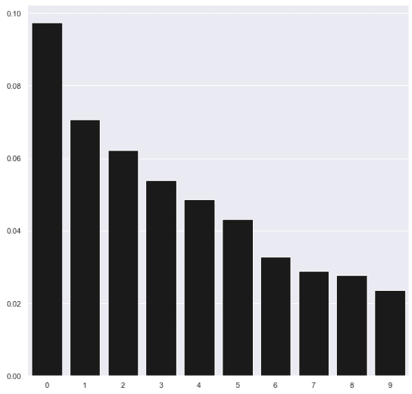

###### 图 3-2\. PCA 组件的重要性

### 可视化空间中点的分离

为了展示 PCA 高效、简洁地捕捉数据中的方差/信息的能力，让我们在二维空间中绘制这些观察结果。具体来说，我们将展示第一和第二主成分的散点图，并用真实标签标记这些观察结果。我们将称这个函数为`scatterPlot`，因为接下来我们还需要为其他维度算法呈现可视化效果。

```py
def scatterPlot(xDF, yDF, algoName):
    tempDF = pd.DataFrame(data=xDF.loc[:,0:1], index=xDF.index)
    tempDF = pd.concat((tempDF,yDF), axis=1, join="inner")
    tempDF.columns = ["First Vector", "Second Vector", "Label"]
    sns.lmplot(x="First Vector", y="Second Vector", hue="Label", \
               data=tempDF, fit_reg=False)
    ax = plt.gca()
    ax.set_title("Separation of Observations using "+algoName)

scatterPlot(X_train_PCA, y_train, "PCA")
```

如图 3-3 所示，仅使用前两个主成分，PCA 能够有效地将空间中的点分离开来，使相似的点通常比其他不相似的点更靠近。换句话说，相同数字的图像彼此之间比与其他数字的图像更接近。

PCA 可以在完全不使用标签的情况下完成这一任务。这展示了无监督学习捕捉数据潜在结构的能力，帮助在没有标签的情况下发现隐藏的模式。

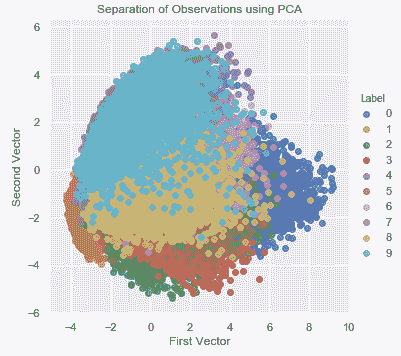

###### 图 3-3\. 使用 PCA 分离观察结果

如果我们使用原始的 784 个特征集中最重要的两个特征（通过训练监督学习模型确定），运行相同的二维散点图，最多也只能得到很差的分离效果（见图 3-4）。

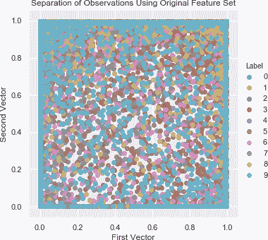

###### 图 3-4\. 不使用 PCA 分离观察结果

比较图 3-3 和图 3-4，可以看出 PCA 在学习数据集潜在结构方面的强大能力，完全不使用任何标签——即使仅使用两个维度，我们也可以开始有意义地通过显示的数字分离图像。

###### 注意

PCA 不仅帮助分离数据以便更容易发现隐藏模式，还有助于减少特征集的大小，从而在训练机器学习模型时节省时间和计算资源。

对于 MNIST 数据集来说，由于数据集非常小——仅有 784 个特征和 50,000 个观察结果，因此减少训练时间的效果可能很有限。但如果数据集拥有数百万个特征和数十亿个观察结果，降维将大大减少后续机器学习管道中机器学习算法的训练时间。

最后，PCA 通常会丢弃原始特征集中的一些信息，但它会明智地捕获最重要的元素并丢弃不太有价值的元素。基于 PCA 减少特征集训练的模型在准确性上可能不如基于完整特征集训练的模型表现得好，但训练和预测时间会快得多。这是在选择是否在机器学习产品中使用降维时必须考虑的重要权衡之一。

## 增量 PCA

对于无法全部存入内存的大型数据集，我们可以逐批次增量地执行 PCA，其中每个批次都能放入内存中。批处理大小可以手动设置或自动确定。这种基于批处理的 PCA 形式称为*增量 PCA*。PCA 和增量 PCA 的生成主成分通常非常相似（图 3-5）。以下是增量 PCA 的代码：

```py
# Incremental PCA
from sklearn.decomposition import IncrementalPCA

n_components = 784
batch_size = None

incrementalPCA = IncrementalPCA(n_components=n_components, \
                                batch_size=batch_size)

X_train_incrementalPCA = incrementalPCA.fit_transform(X_train)
X_train_incrementalPCA = \
    pd.DataFrame(data=X_train_incrementalPCA, index=train_index)

X_validation_incrementalPCA = incrementalPCA.transform(X_validation)
X_validation_incrementalPCA = \
    pd.DataFrame(data=X_validation_incrementalPCA, index=validation_index)

scatterPlot(X_train_incrementalPCA, y_train, "Incremental PCA")
```

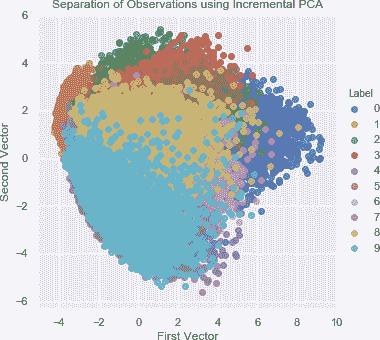

###### 图 3-5\. 使用增量 PCA 分离观测结果

## 稀疏 PCA

普通 PCA 算法在所有输入变量中搜索线性组合，尽可能紧凑地减少原始特征空间。但对于某些机器学习问题，可能更倾向于一定程度的稀疏性。保留一定程度稀疏性的 PCA 版本，由名为*alpha*的超参数控制，称为*稀疏 PCA*。稀疏 PCA 算法仅在部分输入变量中搜索线性组合，将原始特征空间减少到一定程度，但不像普通 PCA 那样紧凑。

因为这种算法的训练速度比普通 PCA 稍慢，所以我们将仅在训练集中的前 10,000 个示例上进行训练（总共有 50,000 个示例）。当算法的训练时间较慢时，我们会继续采用在少于总观测数的情况下进行训练的做法。

对于我们的目的（即开发这些降维算法如何工作的直觉），减少训练过程是可以接受的。为了获得更好的解决方案，建议在完整的训练集上进行训练：

```py
# Sparse PCA
from sklearn.decomposition import SparsePCA

n_components = 100
alpha = 0.0001
random_state = 2018
n_jobs = -1

sparsePCA = SparsePCA(n_components=n_components, \
                alpha=alpha, random_state=random_state, n_jobs=n_jobs)

sparsePCA.fit(X_train.loc[:10000,:])
X_train_sparsePCA = sparsePCA.transform(X_train)
X_train_sparsePCA = pd.DataFrame(data=X_train_sparsePCA, index=train_index)

X_validation_sparsePCA = sparsePCA.transform(X_validation)
X_validation_sparsePCA = \
    pd.DataFrame(data=X_validation_sparsePCA, index=validation_index)

scatterPlot(X_train_sparsePCA, y_train, "Sparse PCA")
```

图 3-6 展示了使用稀疏 PCA 的前两个主成分的二维散点图。

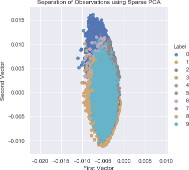

###### 图 3-6\. 使用稀疏 PCA 分离观测结果

注意，这个散点图看起来与普通 PCA 的不同，正如预期的那样。普通和稀疏 PCA 生成主成分的方式不同，点的分离也有所不同。

## 核 PCA

正常 PCA、增量 PCA 和稀疏 PCA 将原始数据线性投影到较低维度空间，但也有一种非线性形式的 PCA 称为*核 PCA*，它在原始数据点对上运行相似度函数以执行非线性降维。

通过学习这个相似度函数（称为*核方法*），核 PCA 映射了大部分数据点所在的隐式特征空间，并在比原始特征集中的维度小得多的空间中创建了这个隐式特征空间。当原始特征集不是线性可分时，这种方法特别有效。

对于核 PCA 算法，我们需要设置所需的组件数、核类型和核系数，称为*gamma*。最流行的核是*径向基函数核*，更常被称为*RBF 核*。这是我们将在这里使用的核心：

```py
# Kernel PCA
from sklearn.decomposition import KernelPCA

n_components = 100
kernel = 'rbf'
gamma = None
random_state = 2018
n_jobs = 1

kernelPCA = KernelPCA(n_components=n_components, kernel=kernel, \
                      gamma=gamma, n_jobs=n_jobs, random_state=random_state)

kernelPCA.fit(X_train.loc[:10000,:])
X_train_kernelPCA = kernelPCA.transform(X_train)
X_train_kernelPCA = pd.DataFrame(data=X_train_kernelPCA,index=train_index)

X_validation_kernelPCA = kernelPCA.transform(X_validation)
X_validation_kernelPCA = \
    pd.DataFrame(data=X_validation_kernelPCA, index=validation_index)

scatterPlot(X_train_kernelPCA, y_train, "Kernel PCA")
```

核 PCA 的二维散点图与我们的 MNIST 数字数据集的线性 PCA 几乎相同（图 3-7）。学习 RBF 核并不改善降维。

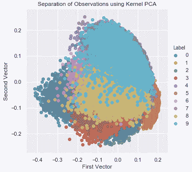

###### 图 3-7\. 使用核 PCA 进行观测分离

# 奇异值分解

学习数据的潜在结构的另一种方法是将特征的原始矩阵的秩降低到一个较小的秩，以便可以使用较小秩矩阵中某些向量的线性组合重新创建原始矩阵。这被称为*奇异值分解（SVD）*。

为了生成较小秩矩阵，SVD 保留原始矩阵中具有最多信息的向量（即最高的奇异值）。较小秩矩阵捕获了原始特征空间的最重要元素。

这与 PCA 非常相似。PCA 使用协方差矩阵的特征值分解来进行降维。奇异值分解（SVD）使用奇异值分解，正如其名称所示。事实上，PCA 在其计算中使用了 SVD，但本书的大部分讨论超出了此范围。

这是 SVD 的工作原理：

```py
# Singular Value Decomposition
from sklearn.decomposition import TruncatedSVD

n_components = 200
algorithm = 'randomized'
n_iter = 5
random_state = 2018

svd = TruncatedSVD(n_components=n_components, algorithm=algorithm, \
                   n_iter=n_iter, random_state=random_state)

X_train_svd = svd.fit_transform(X_train)
X_train_svd = pd.DataFrame(data=X_train_svd, index=train_index)

X_validation_svd = svd.transform(X_validation)
X_validation_svd = pd.DataFrame(data=X_validation_svd, index=validation_index)

scatterPlot(X_train_svd, y_train, "Singular Value Decomposition")
```

图 3-8 显示了我们使用 SVD 的两个最重要向量实现的点的分离。

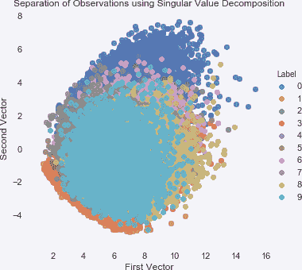

###### 图 3-8\. 使用 SVD 进行观测分离

# 随机投影

另一种线性降维技术是随机投影，它依赖于*Johnson–Lindenstrauss 引理*。根据 Johnson–Lindenstrauss 引理，高维空间中的点可以嵌入到一个远低于其维度的空间中，以便点之间的距离几乎保持不变。换句话说，即使从高维空间移动到低维空间，原始特征集的相关结构也得到保留。

## 高斯随机投影

随机投影有两个版本——标准版本称为*高斯随机投影*，稀疏版本称为*稀疏随机投影*。

对于高斯随机投影，我们可以指定我们希望在降维特征空间中拥有的组件数量，或者我们可以设置超参数*eps*。eps 控制嵌入的质量，根据 Johnson–Lindenstrauss 引理，较小的值会生成更多的维度。在我们的情况下，我们将设置这个超参数：

```py
# Gaussian Random Projection
from sklearn.random_projection import GaussianRandomProjection

n_components = 'auto'
eps = 0.5
random_state = 2018

GRP = GaussianRandomProjection(n_components=n_components, eps=eps, \
                               random_state=random_state)

X_train_GRP = GRP.fit_transform(X_train)
X_train_GRP = pd.DataFrame(data=X_train_GRP, index=train_index)

X_validation_GRP = GRP.transform(X_validation)
X_validation_GRP = pd.DataFrame(data=X_validation_GRP, index=validation_index)

scatterPlot(X_train_GRP, y_train, "Gaussian Random Projection")
```

图 3-9 显示了使用高斯随机投影的二维散点图。

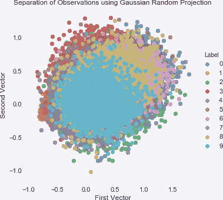

###### 图 3-9\. 使用高斯随机投影分离观测

尽管随机投影与 PCA 一样都是一种线性投影形式，但随机投影是一种完全不同的降维方法家族。因此，随机投影的散点图看起来与普通 PCA、增量 PCA、稀疏 PCA 和核 PCA 的散点图非常不同。

## 稀疏随机投影

正如 PCA 有稀疏版本一样，随机投影也有稀疏版本，称为稀疏随机投影。它在转换后的特征集中保留了一定程度的稀疏性，并且通常比普通的高斯随机投影更高效，能够更快地将原始数据转换为降维空间：

```py
# Sparse Random Projection
from sklearn.random_projection import SparseRandomProjection

n_components = 'auto'
density = 'auto'
eps = 0.5
dense_output = False
random_state = 2018

SRP = SparseRandomProjection(n_components=n_components, \
        density=density, eps=eps, dense_output=dense_output, \
        random_state=random_state)

X_train_SRP = SRP.fit_transform(X_train)
X_train_SRP = pd.DataFrame(data=X_train_SRP, index=train_index)

X_validation_SRP = SRP.transform(X_validation)
X_validation_SRP = pd.DataFrame(data=X_validation_SRP, index=validation_index)

scatterPlot(X_train_SRP, y_train, "Sparse Random Projection")
```

图 3-10 显示了使用稀疏随机投影的二维散点图。

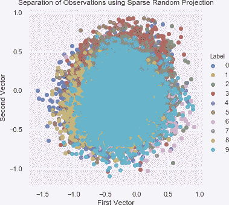

###### 图 3-10\. 使用稀疏随机投影分离观测

# Isomap

与其线性投影高维空间到低维空间的数据，我们可以使用非线性降维方法。这些方法统称为流形学习。

流形学习最基本的形式被称为*等距映射*，简称*Isomap*。与核 PCA 类似，Isomap 通过计算所有点的成对距离来学习原始特征集的新的低维嵌入，其中距离是*曲线*或*测地距离*，而不是*欧氏距离*。换句话说，它基于每个点相对于流形上邻近点的位置学习原始数据的内在几何结构：

```py
# Isomap

from sklearn.manifold import Isomap

n_neighbors = 5
n_components = 10
n_jobs = 4

isomap = Isomap(n_neighbors=n_neighbors, \
                n_components=n_components, n_jobs=n_jobs)

isomap.fit(X_train.loc[0:5000,:])
X_train_isomap = isomap.transform(X_train)
X_train_isomap = pd.DataFrame(data=X_train_isomap, index=train_index)

X_validation_isomap = isomap.transform(X_validation)
X_validation_isomap = pd.DataFrame(data=X_validation_isomap, \
                                   index=validation_index)

scatterPlot(X_train_isomap, y_train, "Isomap")
```

图 3-11 显示了使用 Isomap 的二维散点图。

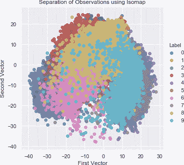

###### 图 3-11\. 使用 isomap 分离观察结果

# 多维缩放

*多维缩放（MDS）*是一种非线性降维形式，它学习原始数据集中点的相似性，并利用这种相似性在较低维度空间中进行建模：

```py
# Multidimensional Scaling
from sklearn.manifold import MDS

n_components = 2
n_init = 12
max_iter = 1200
metric = True
n_jobs = 4
random_state = 2018

mds = MDS(n_components=n_components, n_init=n_init, max_iter=max_iter, \
          metric=metric, n_jobs=n_jobs, random_state=random_state)

X_train_mds = mds.fit_transform(X_train.loc[0:1000,:])
X_train_mds = pd.DataFrame(data=X_train_mds, index=train_index[0:1001])

scatterPlot(X_train_mds, y_train, "Multidimensional Scaling")
```

图 3-12 显示了使用 MDS 的二维散点图。

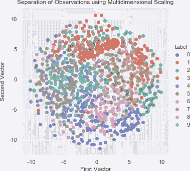

###### 图 3-12\. 使用 MDS 分离观察结果

# 局部线性嵌入

另一种流行的非线性降维方法称为*局部线性嵌入（LLE）*。该方法在将数据从原始特征空间投影到降维空间时保持了局部邻域内的距离。LLE 通过将数据分段成较小的组件（即点的邻域）并将每个组件建模为线性嵌入，发现了原始高维数据中的非线性结构。

对于该算法，我们设置我们期望的组件数量和在给定邻域中考虑的点数：

```py
# Locally Linear Embedding (LLE)
from sklearn.manifold import LocallyLinearEmbedding

n_neighbors = 10
n_components = 2
method = 'modified'
n_jobs = 4
random_state = 2018

lle = LocallyLinearEmbedding(n_neighbors=n_neighbors, \
        n_components=n_components, method=method, \
        random_state=random_state, n_jobs=n_jobs)

lle.fit(X_train.loc[0:5000,:])
X_train_lle = lle.transform(X_train)
X_train_lle = pd.DataFrame(data=X_train_lle, index=train_index)

X_validation_lle = lle.transform(X_validation)
X_validation_lle = pd.DataFrame(data=X_validation_lle, index=validation_index)

scatterPlot(X_train_lle, y_train, "Locally Linear Embedding")
```

图 3-13 显示了使用 LLE 的二维散点图。

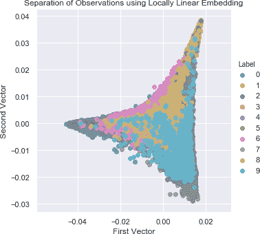

###### 图 3-13\. 使用 LLE 分离观察结果

# t-分布随机邻域嵌入

*t-分布随机邻域嵌入（t-SNE）*是一种非线性降维技术，用于可视化高维数据。t-SNE 通过将每个高维点建模到二维或三维空间中来实现这一目标，使得相似的点模型接近，而不相似的点则模型远离。它通过构建两个概率分布实现此目标，一个是在高维空间中点对的概率分布，另一个是在低维空间中点对的概率分布，使得相似的点具有较高的概率，而不相似的点具有较低的概率。具体来说，t-SNE 最小化了两个概率分布之间的*Kullback–Leibler 散度*。

在 t-SNE 的实际应用中，最好在应用 t-SNE 之前使用另一种降维技术（例如 PCA，正如我们在此处所做的那样）来减少维数。通过先应用另一种降维方法，我们可以减少馈入 t-SNE 的特征中的噪音，并加快算法的计算速度：

```py
# t-SNE
from sklearn.manifold import TSNE

n_components = 2
learning_rate = 300
perplexity = 30
early_exaggeration = 12
init = 'random'
random_state = 2018

tSNE = TSNE(n_components=n_components, learning_rate=learning_rate, \
            perplexity=perplexity, early_exaggeration=early_exaggeration, \
            init=init, random_state=random_state)

X_train_tSNE = tSNE.fit_transform(X_train_PCA.loc[:5000,:9])
X_train_tSNE = pd.DataFrame(data=X_train_tSNE, index=train_index[:5001])

scatterPlot(X_train_tSNE, y_train, "t-SNE")
```

###### 注意

t-SNE 具有非凸成本函数，这意味着算法的不同初始化会生成不同的结果。不存在稳定的解决方案。

图 3-14 显示了 t-SNE 的二维散点图。

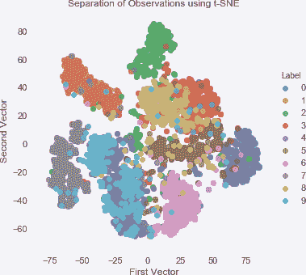

###### 图 3-14\. 使用 t-SNE 进行观察分离

# 其他降维方法

我们已经涵盖了线性和非线性形式的降维。现在我们将转向不依赖任何几何或距离度量的方法。

# 字典学习

其中一种方法是*字典学习*，它学习原始数据的稀疏表示。生成的矩阵称为*字典*，字典中的向量称为*原子*。这些原子是简单的二进制向量，由零和一填充。原始数据中的每个实例可以被重构为这些原子的加权和。

假设原始数据中有*d*个特征和*n*个字典原子，我们可以有一个*欠完备*字典，其中*n < d*，或*过完备*字典，其中*n > d*。欠完备字典实现了降维，用较少的向量表示原始数据，这是我们将专注的内容。³

我们将在我们的数字数据集上应用字典学习的小批量版本。与其他降维方法一样，我们将设置成分的数量。我们还将设置批量大小和执行训练的迭代次数。

由于我们想要使用二维散点图来可视化图像，我们将学习一个非常密集的字典，但实际上，我们会使用一个更稀疏的版本：

```py
# Mini-batch dictionary learning

from sklearn.decomposition import MiniBatchDictionaryLearning

n_components = 50
alpha = 1
batch_size = 200
n_iter = 25
random_state = 2018

miniBatchDictLearning = MiniBatchDictionaryLearning( \
                        n_components=n_components, alpha=alpha, \
                        batch_size=batch_size, n_iter=n_iter, \
                        random_state=random_state)

miniBatchDictLearning.fit(X_train.loc[:,:10000])
X_train_miniBatchDictLearning = miniBatchDictLearning.fit_transform(X_train)
X_train_miniBatchDictLearning = pd.DataFrame( \
    data=X_train_miniBatchDictLearning, index=train_index)

X_validation_miniBatchDictLearning = \
    miniBatchDictLearning.transform(X_validation)
X_validation_miniBatchDictLearning = \
    pd.DataFrame(data=X_validation_miniBatchDictLearning, \
    index=validation_index)

scatterPlot(X_train_miniBatchDictLearning, y_train, \
            "Mini-batch Dictionary Learning")
```

图 3-15 展示了使用字典学习的二维散点图。

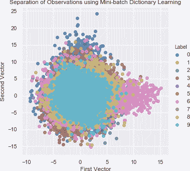

###### 图 3-15\. 使用字典学习进行观察分离

# 独立成分分析

无标签数据的一个常见问题是，有许多独立信号嵌入到我们给定的特征中。使用*独立成分分析（ICA）*，我们可以将这些混合信号分离成它们的各个组成部分。分离完成后，我们可以通过组合生成的各个个体成分的某些组合来重建任何原始特征。ICA 在信号处理任务中广泛应用（例如，在繁忙咖啡馆音频剪辑中识别各个声音）。

以下展示了 ICA 的工作原理：

```py
# Independent Component Analysis
from sklearn.decomposition import FastICA

n_components = 25
algorithm = 'parallel'
whiten = True
max_iter = 100
random_state = 2018

fastICA = FastICA(n_components=n_components, algorithm=algorithm, \
                  whiten=whiten, max_iter=max_iter, random_state=random_state)

X_train_fastICA = fastICA.fit_transform(X_train)
X_train_fastICA = pd.DataFrame(data=X_train_fastICA, index=train_index)

X_validation_fastICA = fastICA.transform(X_validation)
X_validation_fastICA = pd.DataFrame(data=X_validation_fastICA, \
                                    index=validation_index)

scatterPlot(X_train_fastICA, y_train, "Independent Component Analysis")
```

图 3-16 展示了使用 ICA 的二维散点图。

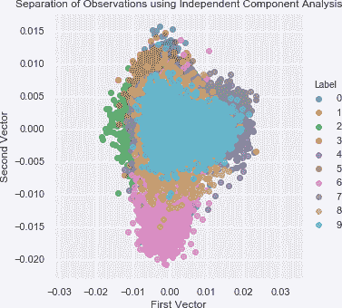

###### 图 3-16\. 使用独立成分分析进行观察分离

# 结论

在本章中，我们介绍并探讨了多种降维算法，从线性方法如 PCA 和随机投影开始。然后，我们转向非线性方法——也称为流形学习，例如 Isomap、多维尺度分析、LLE 和 t-SNE。我们还涵盖了非基于距离的方法，如字典学习和 ICA。

降维捕捉数据集中最显著的信息，并通过学习数据的潜在结构将其压缩到少量维度，而无需使用任何标签。通过将这些算法应用于 MNIST 数字数据集，我们能够仅使用前两个维度基于其所代表的数字有效地分离图像。

这突显了降维的强大能力。

在 第四章，我们将使用这些降维算法构建一个应用型的无监督学习解决方案。具体来说，我们将重新审视在 第二章 中介绍的欺诈检测问题，并尝试在不使用标签的情况下将欺诈交易与正常交易分离开来。

¹ [手写数字 MNIST 数据库](http://yann.lecun.com/exdb/mnist/)，由 Yann Lecun 提供。

² [MNIST 数据集的 Pickled 版本](http://deeplearning.net/tutorial/gettingstarted.html)，由 deeplearning.net 提供。

³ 过完备字典有不同的用途，例如图像压缩。
