# 第四章 异常检测

在 第三章 中，我们介绍了核心的降维算法，并探讨了它们在 MNIST 数字数据库中以显著较少的维度捕获最显著信息的能力。即使在仅两个维度下，这些算法也能有意义地分离数字，而无需使用标签。这就是无监督学习算法的力量 — 它们能够学习数据的潜在结构，并在缺乏标签的情况下帮助发现隐藏的模式。

让我们使用这些降维方法构建一个应用的机器学习解决方案。我们将回顾在 第二章 中介绍的问题，并构建一个无需使用标签的信用卡欺诈检测系统。

在现实世界中，欺诈通常不会被发现，只有被捕获的欺诈行为提供了数据集的标签。此外，欺诈模式随时间变化，因此使用欺诈标签构建的监督系统（如我们在 第二章 中构建的系统）变得过时，捕捉到的是历史上的欺诈模式，而不能适应新出现的欺诈模式。

出于这些原因（标签不足和尽快适应新出现的欺诈模式的需求），无监督学习欺诈检测系统备受青睐。

在本章中，我们将使用前一章探索的一些降维算法来构建这样一个解决方案。

# 信用卡欺诈检测

让我们重新访问来自 第二章 的信用卡交易问题。

## 准备数据

就像我们在 第二章 中所做的那样，让我们加载信用卡交易数据集，生成特征矩阵和标签数组，并将数据拆分为训练集和测试集。我们不会使用标签来执行异常检测，但我们将使用标签来帮助评估我们构建的欺诈检测系统。

提醒一下，总共有 284,807 笔信用卡交易，其中 492 笔是欺诈交易，具有正面（欺诈）标签为一。其余的是正常交易，具有负面（非欺诈）标签为零。

我们有 30 个特征用于异常检测 — 时间、金额和 28 个主成分。然后，我们将数据集分为一个训练集（包含 190,820 笔交易和 330 笔欺诈案例）和一个测试集（剩余 93,987 笔交易和 162 笔欺诈案例）：

```py
# Load datasets
current_path = os.getcwd()
file = '\\datasets\\credit_card_data\\credit_card.csv'
data = pd.read_csv(current_path + file)

dataX = data.copy().drop(['Class'],axis=1)
dataY = data['Class'].copy()

featuresToScale = dataX.columns
sX = pp.StandardScaler(copy=True)
dataX.loc[:,featuresToScale] = sX.fit_transform(dataX[featuresToScale])

X_train, X_test, y_train, y_test = \
    train_test_split(dataX, dataY, test_size=0.33, \
                    random_state=2018, stratify=dataY)
```

## 定义异常分数函数

接下来，我们需要定义一个函数来计算每笔交易的异常程度。交易越异常，它被识别为欺诈的可能性就越大，假设欺诈很少且看起来与大多数正常交易不同。

正如我们在前一章讨论的那样，降维算法在试图最小化重建误差的同时减少数据的维度。换句话说，这些算法试图以尽可能好的方式捕捉原始特征的最显著信息，以便从降维特征集重建原始特征集。然而，这些降维算法不能捕捉所有原始特征的信息，因为它们移动到较低维空间；因此，在将这些算法从降维特征集重建回原始维数时会存在一些误差。

在我们的信用卡交易数据集的背景下，算法将在最难建模的交易中产生最大的重建误差——换句话说，那些发生最少且最异常的交易。由于欺诈很少且可能与正常交易不同，欺诈交易应该表现出最大的重建误差。因此，让我们将异常分数定义为重建误差。每笔交易的重建误差是原始特征矩阵与使用降维算法重建的矩阵之间差异平方和。我们将通过整个数据集的差异平方和的最大-最小范围来缩放差异平方和的总和，以使所有重建误差都在零到一的范围内。

具有最大差异平方和的交易将具有接近一的误差，而具有最小差异平方和的交易将具有接近零的误差。

这应该是熟悉的。就像我们在第二章中构建的监督式欺诈检测解决方案一样，降维算法将有效地为每笔交易分配一个介于零和一之间的异常分数。零表示正常，一表示异常（最有可能是欺诈）。

这里是函数：

```py
def anomalyScores(originalDF, reducedDF):
    loss = np.sum((np.array(originalDF)-np.array(reducedDF))**2, axis=1)
    loss = pd.Series(data=loss,index=originalDF.index)
    loss = (loss-np.min(loss))/(np.max(loss)-np.min(loss))
    return loss
```

## 定义评估指标

尽管我们不会使用欺诈标签来构建无监督的欺诈检测解决方案，但我们将使用这些标签来评估我们开发的无监督解决方案。这些标签将帮助我们了解这些解决方案捕捉已知欺诈模式的效果如何。

就像我们在第二章中所做的那样，我们将使用精确-召回曲线、平均精度和 auROC 作为我们的评估指标。

这里是将绘制这些结果的函数：

```py
def plotResults(trueLabels, anomalyScores, returnPreds = False):
    preds = pd.concat([trueLabels, anomalyScores], axis=1)
    preds.columns = ['trueLabel', 'anomalyScore']
    precision, recall, thresholds = \
        precision_recall_curve(preds['trueLabel'],preds['anomalyScore'])
    average_precision = \
        average_precision_score(preds['trueLabel'],preds['anomalyScore'])

    plt.step(recall, precision, color='k', alpha=0.7, where='post')
    plt.fill_between(recall, precision, step='post', alpha=0.3, color='k')

    plt.xlabel('Recall')
    plt.ylabel('Precision')
    plt.ylim([0.0, 1.05])
    plt.xlim([0.0, 1.0])

    plt.title('Precision-Recall curve: Average Precision = \
 {0:0.2f}'.format(average_precision))

    fpr, tpr, thresholds = roc_curve(preds['trueLabel'], \
                                     preds['anomalyScore'])
    areaUnderROC = auc(fpr, tpr)

    plt.figure()
    plt.plot(fpr, tpr, color='r', lw=2, label='ROC curve')
    plt.plot([0, 1], [0, 1], color='k', lw=2, linestyle='--')
    plt.xlim([0.0, 1.0])
    plt.ylim([0.0, 1.05])
    plt.xlabel('False Positive Rate')
    plt.ylabel('True Positive Rate')
    plt.title('Receiver operating characteristic: \
 Area under the curve = {0:0.2f}'.format(areaUnderROC))
    plt.legend(loc="lower right")
    plt.show()

    if returnPreds==True:
        return preds
```

###### 注意

欺诈标签和评估指标将帮助我们评估无监督欺诈检测系统在捕捉已知欺诈模式（我们过去已经捕捉到并有标签的欺诈）方面的表现如何。

然而，我们将无法评估无监督欺诈检测系统在捕捉未知欺诈模式方面的表现如何。换句话说，数据集中可能存在被错误标记为非欺诈的欺诈行为，因为金融公司从未发现它们。

正如你可能已经看到的那样，无监督学习系统比监督学习系统更难评估。通常，无监督学习系统是通过其捕捉已知欺诈模式的能力来评判的。这是一个不完整的评估；更好的评估指标应该是评估它们在识别未知欺诈模式方面的能力，无论是在过去还是在未来。

由于我们无法返回金融公司，并要求他们评估我们识别出的任何未知欺诈模式，因此我们将仅基于它们如何检测已知欺诈模式来评估这些无监督系统。在评估结果时，牢记这一限制非常重要。

## 定义绘图函数

我们将重用第三章中的散点图函数来展示降维算法在前两个维度上实现的点的分离情况：

```py
def scatterPlot(xDF, yDF, algoName):
    tempDF = pd.DataFrame(data=xDF.loc[:,0:1], index=xDF.index)
    tempDF = pd.concat((tempDF,yDF), axis=1, join="inner")
    tempDF.columns = ["First Vector", "Second Vector", "Label"]
    sns.lmplot(x="First Vector", y="Second Vector", hue="Label", \
               data=tempDF, fit_reg=False)
    ax = plt.gca()
    ax.set_title("Separation of Observations using "+algoName)
```

# 普通 PCA 异常检测

在第三章中，我们演示了 PCA 如何仅通过少数几个主成分就捕获了 MNIST 数字数据集中的大部分信息，远少于原始维度。事实上，仅通过两个维度，就可以根据它们展示的数字将图像明显地分成不同的组。

基于这一概念，我们现在将使用 PCA 来学习信用卡交易数据集的潜在结构。一旦学习了这种结构，我们将使用学习模型来重构信用卡交易，然后计算重构交易与原始交易的差异。那些 PCA 重构效果最差的交易是最异常的（也最可能是欺诈性的）。

###### 注意

请记住，我们拥有的信用卡交易数据集中的特征已经是 PCA 的输出结果 — 这是金融公司提供给我们的。然而，对于已经降维的数据集进行 PCA 异常检测并没有什么特别的。我们只需将给定的原始主成分视为原始特征即可。

今后，我们将称我们得到的原始主成分为原始特征。未来任何对主成分的提及都将指的是 PCA 过程中的主成分，而不是我们最初获得的原始特征。

让我们从更深入地理解 PCA 及其在异常检测中的作用开始。正如我们所定义的，异常检测依赖于重构误差。我们希望罕见交易（最有可能是欺诈的交易）的重构误差尽可能高，而其余交易的重构误差尽可能低。

对于 PCA，重构误差主要取决于我们保留和用于重构原始交易的主要成分数量。我们保留的主要成分越多，PCA 在学习原始交易的潜在结构方面表现越好。

然而，需要平衡。如果我们保留太多主要成分，PCA 可能会过于容易地重构原始交易，以至于所有交易的重构误差都将最小化。如果我们保留的主要成分太少，PCA 可能无法充分重构任何原始交易，甚至是正常的非欺诈性交易。

让我们寻找保留以构建良好的欺诈检测系统的正确主成分数。

## PCA 成分等于原始维度数

首先，让我们考虑一些事情。如果我们使用 PCA 生成与原始特征数相同数量的主要成分，我们能执行异常检测吗？

如果你仔细思考，答案应该是显而易见的。回顾我们在前一章对 MNIST 数字数据集的 PCA 示例。

当主要成分的数量等于原始维度的数量时，PCA 会捕获数据中近乎 100%的方差/信息，因为它生成主要成分。因此，当 PCA 从主要成分重构交易时，所有交易（无论是欺诈还是正常的）的重构误差都将太小。我们将无法区分罕见交易和正常交易，换句话说，异常检测将效果不佳。

为了突出这一点，让我们应用 PCA 生成与原始特征数相同数量的主要成分（对于我们的信用卡交易数据集为 30 个）。这是通过 Scikit-Learn 中的`fit_transform`函数实现的。

为了从我们生成的主要成分中重构原始交易，我们将使用 Scikit-Learn 中的`inverse_transform`函数：

```py
# 30 principal components
from sklearn.decomposition import PCA

n_components = 30
whiten = False
random_state = 2018

pca = PCA(n_components=n_components, whiten=whiten, \
          random_state=random_state)

X_train_PCA = pca.fit_transform(X_train)
X_train_PCA = pd.DataFrame(data=X_train_PCA, index=X_train.index)

X_train_PCA_inverse = pca.inverse_transform(X_train_PCA)
X_train_PCA_inverse = pd.DataFrame(data=X_train_PCA_inverse, \
                                   index=X_train.index)

scatterPlot(X_train_PCA, y_train, "PCA")
```

图 4-1 展示了使用 PCA 的前两个主要成分对交易进行分离的图表。

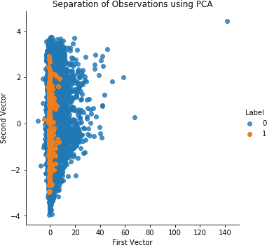

###### 图 4-1\. 使用正常 PCA 和 30 个主要成分分离观察

让我们计算精确率-召回率曲线和 ROC 曲线：

```py
anomalyScoresPCA = anomalyScores(X_train, X_train_PCA_inverse)
preds = plotResults(y_train, anomalyScoresPCA, True)
```

具有平均精度为 0.11，这是一个较差的欺诈检测解决方案（参见图 4-2）。它几乎无法捕捉到欺诈行为。

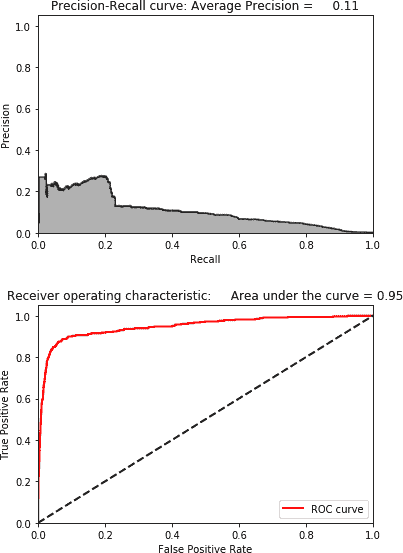

###### 图 4-2\. 使用 30 个主成分的结果

## 搜索最佳主成分数量

现在，让我们通过减少 PCA 生成的主成分数量来执行一些实验，并评估欺诈检测结果。我们需要基于 PCA 的欺诈检测解决方案在罕见情况下有足够的误差，以便能够有效地区分欺诈案例和正常案例。但是误差不能对所有交易的罕见和正常交易都过低或过高，以至于它们几乎无法区分。

经过一些实验（可以使用[GitHub 代码](http://bit.ly/2Gd4v7e)执行），我们发现 27 个主成分是此信用卡交易数据集的最佳数量。

图 4-3 展示了使用 PCA 的前两个主成分分离交易的图表。


###### 图 4-3\. 使用正常 PCA 和 27 个主成分分离观察

图 4-4 展示了精度-召回曲线、平均精度和 auROC 曲线。


###### 图 4-4\. 使用正常 PCA 和 27 个主成分的结果

正如你所看到的，我们能够以 75%的精度捕捉到 80%的欺诈行为。考虑到训练集中有 190,820 笔交易，其中只有 330 笔是欺诈交易，这是非常令人印象深刻的结果。

使用 PCA，我们计算了这 190,820 笔交易中每笔交易的重建误差。如果我们按照重建误差（也称为异常分数）的降序对这些交易进行排序，并从列表中提取前 350 笔交易，我们可以看到其中有 264 笔交易是欺诈的。

这是 75%的精度。此外，我们从我们选择的 350 笔交易中捕捉到的 264 笔交易代表了训练集中 80%的总欺诈行为（330 笔欺诈案例中的 264 笔）。而且，请记住，这是一个真正的无监督欺诈检测解决方案，没有使用标签。

下面是突出显示此问题的代码：

```py
preds.sort_values(by="anomalyScore",ascending=False,inplace=True)
cutoff = 350
predsTop = preds[:cutoff]
print("Precision: ",np.round(predsTop. \
            anomalyScore[predsTop.trueLabel==1].count()/cutoff,2))
print("Recall: ",np.round(predsTop. \
            anomalyScore[predsTop.trueLabel==1].count()/y_train.sum(),2))
```

下面的代码总结了结果：

```py
Precision: 0.75
Recall: 0.8
Fraud Caught out of 330 Cases: 264
```

尽管这已经是一个相当好的解决方案，但让我们尝试使用其他降维方法开发欺诈检测系统。

# 稀疏 PCA 异常检测

让我们尝试使用稀疏 PCA 设计一个欺诈检测解决方案。回想一下，稀疏 PCA 类似于普通 PCA，但提供一个更稀疏的版本；换句话说，稀疏 PCA 提供了主成分的稀疏表示。

我们仍然需要指定所需的主成分数量，但我们还必须设置控制稀疏程度的 alpha 参数。在搜索最佳稀疏 PCA 欺诈检测解决方案时，我们将尝试不同的主成分值和 alpha 参数值。

请注意，对于普通 PCA，Scikit-Learn 使用 `fit_transform` 函数生成主成分，并使用 `inverse_transform` 函数从主成分重构原始维度。利用这两个函数，我们能够计算原始特征集和从 PCA 派生的重构特征集之间的重构误差。

不幸的是，Scikit-Learn 并未为稀疏 PCA 提供 `inverse_transform` 函数。因此，在执行稀疏 PCA 后，我们必须自行重构原始维度。

让我们首先生成具有 27 个主成分和默认 alpha 参数 0.0001 的稀疏 PCA 矩阵：

```py
# Sparse PCA
from sklearn.decomposition import SparsePCA

n_components = 27
alpha = 0.0001
random_state = 2018
n_jobs = -1

sparsePCA = SparsePCA(n_components=n_components, \
                alpha=alpha, random_state=random_state, n_jobs=n_jobs)

sparsePCA.fit(X_train.loc[:,:])
X_train_sparsePCA = sparsePCA.transform(X_train)
X_train_sparsePCA = pd.DataFrame(data=X_train_sparsePCA, index=X_train.index)

scatterPlot(X_train_sparsePCA, y_train, "Sparse PCA")
```

图 4-5 显示了稀疏 PCA 的散点图。

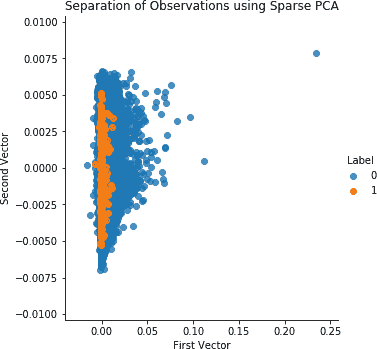

###### 图 4-5\. 使用稀疏 PCA 和 27 个主成分的观察分离

现在，让我们通过稀疏 PCA 矩阵的简单矩阵乘法（包含 190,820 个样本和 27 个维度）和 Scikit-Learn 库提供的稀疏 PCA 成分（一个 27 x 30 矩阵）生成稀疏 PCA 矩阵的原始维度。这样可以创建一个原始尺寸的矩阵（一个 190,820 x 30 矩阵）。我们还需要将每个原始特征的均值添加到这个新矩阵中，然后就完成了。

利用这个新推导出的逆矩阵，我们可以像对待普通 PCA 那样计算重构误差（异常分数）：

```py
X_train_sparsePCA_inverse = np.array(X_train_sparsePCA). \
    dot(sparsePCA.components_) + np.array(X_train.mean(axis=0))
X_train_sparsePCA_inverse = \
    pd.DataFrame(data=X_train_sparsePCA_inverse, index=X_train.index)

anomalyScoresSparsePCA = anomalyScores(X_train, X_train_sparsePCA_inverse)
preds = plotResults(y_train, anomalyScoresSparsePCA, True)
```

现在，让我们生成精确率-召回率曲线和 ROC 曲线。

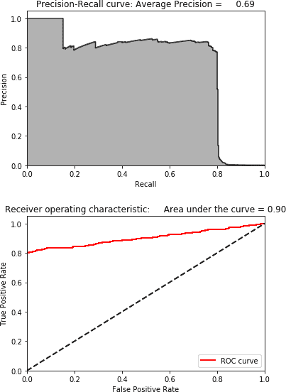

###### 图 4-6\. 使用稀疏 PCA 和 27 个主成分的结果

如图 4-6 所示，结果与普通 PCA 的结果完全相同。这是预期的，因为普通 PCA 和稀疏 PCA 非常相似——后者只是前者的稀疏表示。

使用 [GitHub 代码](http://bit.ly/2Gd4v7e)，您可以通过更改生成的主成分数量和 alpha 参数来进行实验，但根据我们的实验，这是最佳的基于稀疏 PCA 的欺诈检测解决方案。

# Kernel PCA 异常检测

现在让我们设计一个欺诈检测解决方案，使用核 PCA，这是 PCA 的非线性形式，如果欺诈交易与非欺诈交易不是线性可分的，它将非常有用。

我们需要指定要生成的组件数量，内核（我们将使用 RBF 内核，就像我们在上一章中做的那样），以及 gamma（默认情况下设置为 1/n_features，因此在我们的情况下为 1/30）。我们还需要将`fit_inverse_transform`设置为`true`，以应用 Scikit-Learn 提供的内置`inverse_transform`函数。

最后，由于核 PCA 在训练中非常昂贵，我们将仅在交易数据集的前两千个样本上进行训练。这并非理想选择，但为了快速进行实验，这是必要的。

我们将使用这个训练来转换整个训练集并生成主成分。然后，我们将使用`inverse_transform`函数从由核 PCA 导出的主成分重新创建原始维度：

```py
# Kernel PCA
from sklearn.decomposition import KernelPCA

n_components = 27
kernel = 'rbf'
gamma = None
fit_inverse_transform = True
random_state = 2018
n_jobs = 1

kernelPCA = KernelPCA(n_components=n_components, kernel=kernel, \
                gamma=gamma, fit_inverse_transform= \
                fit_inverse_transform, n_jobs=n_jobs, \
                random_state=random_state)

kernelPCA.fit(X_train.iloc[:2000])
X_train_kernelPCA = kernelPCA.transform(X_train)
X_train_kernelPCA = pd.DataFrame(data=X_train_kernelPCA, \
                                 index=X_train.index)

X_train_kernelPCA_inverse = kernelPCA.inverse_transform(X_train_kernelPCA)
X_train_kernelPCA_inverse = pd.DataFrame(data=X_train_kernelPCA_inverse, \
                                         index=X_train.index)

scatterPlot(X_train_kernelPCA, y_train, "Kernel PCA")
```

图 4-7 显示了核 PCA 的散点图。

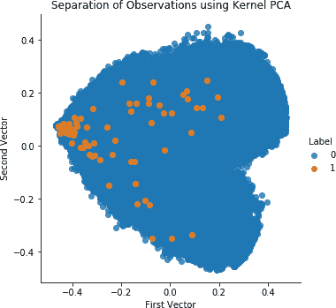

###### 图 4-7\. 使用核 PCA 和 27 个主成分分离观察

现在，让我们计算异常分数并打印结果。

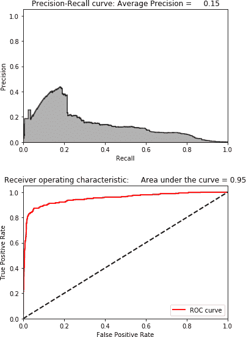

###### 图 4-8\. 使用核 PCA 和 27 个主成分的结果

如图 4-8 所示，其结果远不如普通 PCA 和稀疏 PCA。虽然进行核 PCA 实验是值得的，但考虑到我们有更好的性能解决方案，我们不会将其用于欺诈检测。

###### 注

我们不会使用 SVD 构建异常检测解决方案，因为其解决方案与普通 PCA 非常相似。这是预期的——PCA 和 SVD 密切相关。

反而，让我们转向基于随机投影的异常检测。

# 高斯随机投影异常检测

现在，让我们尝试使用高斯随机投影开发欺诈检测解决方案。请记住，我们可以设置我们想要的组件数量或*eps*参数，后者控制基于 Johnson-Lindenstrauss 引理导出的嵌入质量。

我们将选择显式设置组件的数量。高斯随机投影训练非常快，因此我们可以在整个训练集上进行训练。

与稀疏 PCA 一样，我们需要推导出自己的`inverse_transform`函数，因为 Scikit-Learn 没有提供这样的函数：

```py
# Gaussian Random Projection
from sklearn.random_projection import GaussianRandomProjection

n_components = 27
eps = None
random_state = 2018

GRP = GaussianRandomProjection(n_components=n_components, \
                               eps=eps, random_state=random_state)

X_train_GRP = GRP.fit_transform(X_train)
X_train_GRP = pd.DataFrame(data=X_train_GRP, index=X_train.index)

scatterPlot(X_train_GRP, y_train, "Gaussian Random Projection")
```

图 4-9 显示了高斯随机投影的散点图。图 4-10 显示了高斯随机投影的结果。

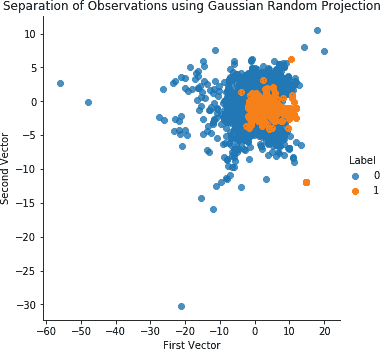

###### 图 4-9\. 使用高斯随机投影和 27 个分量分离观察结果

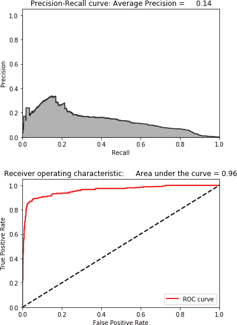

###### 图 4-10\. 使用高斯随机投影和 27 个分量的结果

这些结果很差，因此我们不会使用高斯随机投影进行欺诈检测。

# 稀疏随机投影异常检测

让我们尝试使用稀疏随机投影设计一个欺诈检测解决方案。

我们将指定我们需要的分量数量（而不是设置 *eps* 参数）。而且，就像使用高斯随机投影一样，我们将使用我们自己的 `inverse_transform` 函数从稀疏随机投影派生的分量中创建原始维度：

```py
# Sparse Random Projection

from sklearn.random_projection import SparseRandomProjection

n_components = 27
density = 'auto'
eps = .01
dense_output = True
random_state = 2018

SRP = SparseRandomProjection(n_components=n_components, \
        density=density, eps=eps, dense_output=dense_output, \
                                random_state=random_state)

X_train_SRP = SRP.fit_transform(X_train)
X_train_SRP = pd.DataFrame(data=X_train_SRP, index=X_train.index)

scatterPlot(X_train_SRP, y_train, "Sparse Random Projection")
```

图 4-11 显示了稀疏随机投影的散点图。 图 4-12 展示了稀疏随机投影的结果。

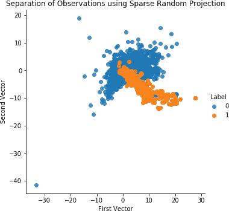

###### 图 4-11\. 使用稀疏随机投影和 27 个分量分离观察结果

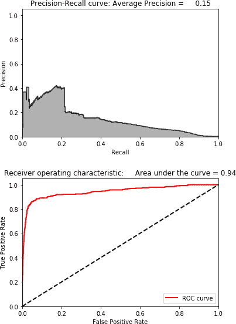

###### 图 4-12\. 使用稀疏随机投影和 27 个分量的结果

和高斯随机投影一样，这些结果很差。让我们继续使用其他降维方法构建异常检测系统。

# 非线性异常检测

到目前为止，我们已经使用了线性降维方法开发了欺诈检测解决方案，如常规 PCA、稀疏 PCA、高斯随机投影和稀疏随机投影。我们还使用了非线性版本的 PCA——核 PCA。

到目前为止，PCA 是迄今为止最好的解决方案。

我们可以转向非线性降维算法，但这些算法的开源版本运行非常缓慢，不适合快速欺诈检测。因此，我们将跳过这一步，直接转向非距离度量的降维方法：字典学习和独立分量分析。

# 字典学习异常检测

让我们使用字典学习来开发一个欺诈检测解决方案。回想一下，在字典学习中，算法学习原始数据的稀疏表示。使用学习字典中的向量，可以将原始数据中的每个实例重构为这些学习向量的加权和。

对于异常检测，我们希望学习一个欠完备字典，使得字典中的向量数量少于原始维度。在这个约束条件下，更容易重构出频繁发生的正常交易，但更难构建出罕见的欺诈交易。

在我们的情况下，我们将生成 28 个向量（或成分）。为了学习字典，我们将提供 10 个批次，每个批次包含 200 个样本。

我们也需要使用我们自己的`inverse_transform`函数：

```py
# Mini-batch dictionary learning
from sklearn.decomposition import MiniBatchDictionaryLearning

n_components = 28
alpha = 1
batch_size = 200
n_iter = 10
random_state = 2018

miniBatchDictLearning = MiniBatchDictionaryLearning( \
    n_components=n_components, alpha=alpha, batch_size=batch_size, \
    n_iter=n_iter, random_state=random_state)

miniBatchDictLearning.fit(X_train)
X_train_miniBatchDictLearning = \
    miniBatchDictLearning.fit_transform(X_train)
X_train_miniBatchDictLearning = \
    pd.DataFrame(data=X_train_miniBatchDictLearning, index=X_train.index)

scatterPlot(X_train_miniBatchDictLearning, y_train, \
            "Mini-batch Dictionary Learning")
```

图 4-13 展示了字典学习的散点图。图 4-14 展示了字典学习的结果。

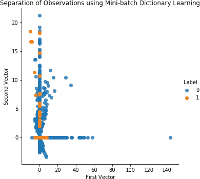

###### 图 4-13\. 使用字典学习和 28 个成分的观测分离

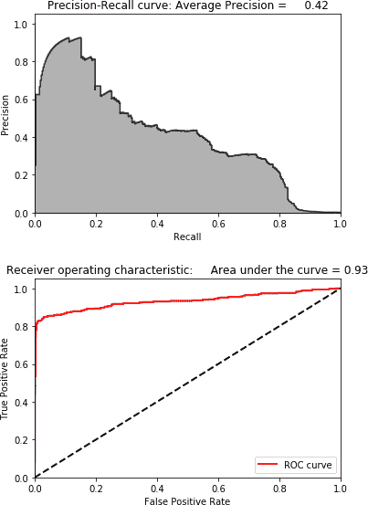

###### 图 4-14\. 使用字典学习和 28 个成分的结果

这些结果远优于核 PCA、高斯随机投影和稀疏随机投影的结果，但与普通 PCA 的结果不相上下。

您可以在 GitHub 上尝试代码，看看是否能改进这个解决方案，但目前来看，PCA 仍然是这个信用卡交易数据集的最佳欺诈检测解决方案。

# ICA 异常检测

让我们使用 ICA 设计我们的最后一个欺诈检测解决方案。

我们需要指定成分的数量，我们将设置为 27。Scikit-Learn 提供了一个`inverse_transform`函数，因此我们不需要使用自己的函数：

```py
# Independent Component Analysis

from sklearn.decomposition import FastICA

n_components = 27
algorithm = 'parallel'
whiten = True
max_iter = 200
random_state = 2018

fastICA = FastICA(n_components=n_components, \
    algorithm=algorithm, whiten=whiten, max_iter=max_iter, \
    random_state=random_state)

X_train_fastICA = fastICA.fit_transform(X_train)
X_train_fastICA = pd.DataFrame(data=X_train_fastICA, index=X_train.index)

X_train_fastICA_inverse = fastICA.inverse_transform(X_train_fastICA)
X_train_fastICA_inverse = pd.DataFrame(data=X_train_fastICA_inverse, \
                                       index=X_train.index)

scatterPlot(X_train_fastICA, y_train, "Independent Component Analysis")
```

图 4-15 展示了 ICA 的散点图。图 4-16 展示了 ICA 的结果。

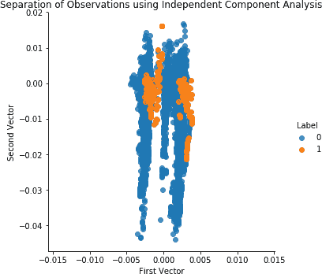

###### 图 4-15\. 使用 ICA 和 27 个成分的观测分离


###### 图 4-16\. 使用 ICA 和 27 个成分的结果

这些结果与普通 PCA 的结果相同。ICA 的欺诈检测解决方案与我们迄今为止开发的最佳解决方案相匹配。

# 测试集上的欺诈检测

现在，为了评估我们的欺诈检测解决方案，让我们将其应用于前所未见的测试集。我们将对我们开发的前三种解决方案进行评估：普通 PCA、ICA 和字典学习。我们不会使用稀疏 PCA，因为它与普通 PCA 解决方案非常相似。

## 普通 PCA 在测试集上的异常检测

让我们从普通 PCA 开始。我们将使用 PCA 算法从训练集学习到的 PCA 嵌入，并用此转换测试集。然后，我们将使用 Scikit-Learn 的`inverse_transform`函数从测试集的主成分矩阵重新创建原始维度。

通过比较原始测试集矩阵和新重建的矩阵，我们可以计算异常分数（正如我们在本章中多次做过的）：

```py
# PCA on Test Set
X_test_PCA = pca.transform(X_test)
X_test_PCA = pd.DataFrame(data=X_test_PCA, index=X_test.index)

X_test_PCA_inverse = pca.inverse_transform(X_test_PCA)
X_test_PCA_inverse = pd.DataFrame(data=X_test_PCA_inverse, \
                                  index=X_test.index)

scatterPlot(X_test_PCA, y_test, "PCA")
```

图 4-17 显示了在测试集上使用 PCA 的散点图。图 4-18 显示了在测试集上使用 PCA 的结果。

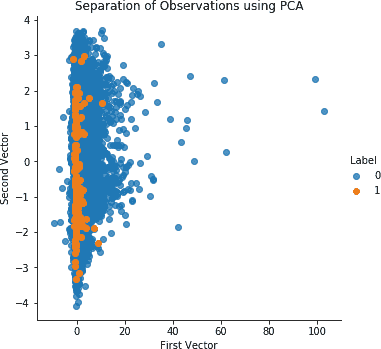

###### 图 4-17\. 在测试集上使用 PCA 和 27 个分量进行观察结果分离

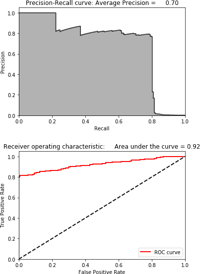

###### 图 4-18\. 在测试集上使用 PCA 和 27 个分量的结果

这些是令人印象深刻的结果。我们能够在测试集中捕捉到 80% 的已知欺诈，精度为 80%——而且全部不使用任何标签。

## 在测试集上的 ICA 异常检测

现在让我们转向 ICA，并在测试集上进行欺诈检测：

```py
# Independent Component Analysis on Test Set
X_test_fastICA = fastICA.transform(X_test)
X_test_fastICA = pd.DataFrame(data=X_test_fastICA, index=X_test.index)

X_test_fastICA_inverse = fastICA.inverse_transform(X_test_fastICA)
X_test_fastICA_inverse = pd.DataFrame(data=X_test_fastICA_inverse, \
                                      index=X_test.index)

scatterPlot(X_test_fastICA, y_test, "Independent Component Analysis")
```

图 4-19 显示了在测试集上使用 ICA 的散点图。图 4-20 显示了在测试集上使用 ICA 的结果。

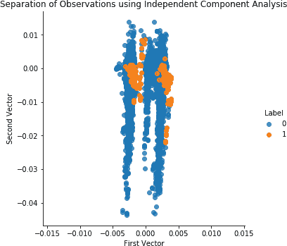

###### 图 4-19\. 在测试集上使用 ICA 和 27 个分量进行观察结果分离

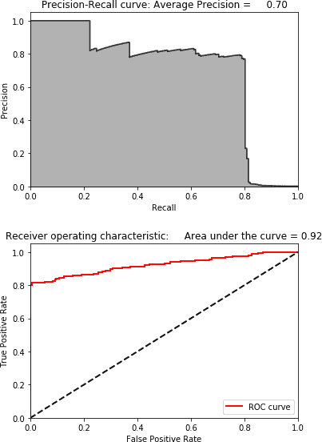

###### 图 4-20\. 在测试集上使用 ICA 和 27 个分量的结果

结果与常规 PCA 完全相同，因此令人印象深刻。

## 在测试集上的字典学习异常检测

现在让我们转向字典学习，虽然它的表现不如常规 PCA 和 ICA，但仍值得最后一看：

```py
X_test_miniBatchDictLearning = miniBatchDictLearning.transform(X_test)
X_test_miniBatchDictLearning = \
    pd.DataFrame(data=X_test_miniBatchDictLearning, index=X_test.index)

scatterPlot(X_test_miniBatchDictLearning, y_test, \
            "Mini-batch Dictionary Learning")
```

图 4-21 显示了在测试集上使用字典学习的散点图。图 4-22 显示了在测试集上使用字典学习的结果。

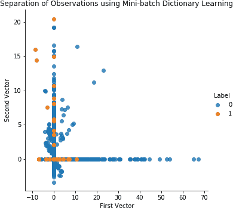

###### 图 4-21\. 在测试集上使用字典学习和 28 个分量进行观察结果分离

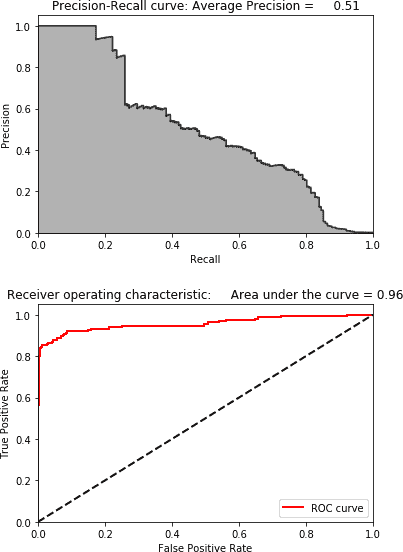

###### 图 4-22\. 在测试集上使用字典学习和 28 个分量的结果

尽管结果并不糟糕——我们可以用 20% 的精度捕捉到 80% 的欺诈——但与常规 PCA 和 ICA 的结果相比差距很大。

# 结论

在本章中，我们使用了上一章的核心降维算法来针对第二章的信用卡交易数据集开发欺诈检测解决方案。

在第二章中，我们使用标签构建了一个欺诈检测解决方案，但是在本章的训练过程中我们没有使用任何标签。换句话说，我们使用无监督学习构建了一个应用型欺诈检测系统。

虽然并非所有降维算法在这个信用卡交易数据集上表现良好，但是有两个表现非常出色——普通 PCA 和 ICA。

普通的 PCA 和 ICA 可以捕捉到 80%以上的已知欺诈，并且精度达到 80%。相比之下，第二章中表现最佳的基于有监督学习的欺诈检测系统几乎可以捕捉到 90%的已知欺诈，并且精度达到 80%。无监督欺诈检测系统在捕捉已知欺诈模式方面只比有监督系统稍微差一点。

请记住，无监督的欺诈检测系统在训练过程中不需要标签，能够很好地适应不断变化的欺诈模式，并且可以发现以前未被发现的欺诈行为。考虑到这些额外的优势，无监督学习的解决方案通常会比有监督学习的解决方案更好地捕捉到未来已知和未知或新出现的欺诈模式，尽管将两者结合使用效果最佳。

现在我们已经涵盖了降维和异常检测，让我们来探讨聚类，这是无监督学习领域的另一个重要概念。
