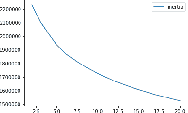
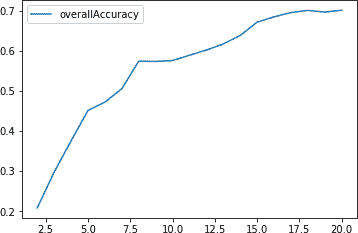
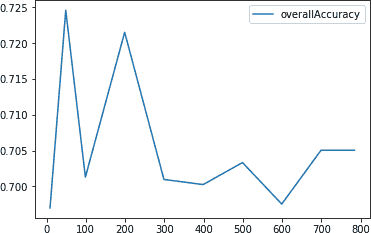
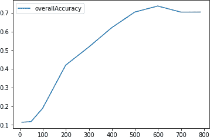

# 第五章 聚类

在第三章中，我们介绍了无监督学习中最重要的降维算法，并突出它们密集捕捉信息的能力。在第四章中，我们使用了降维算法构建了一个异常检测系统。具体来说，我们应用这些算法来检测信用卡欺诈，而不使用任何标签。这些算法学习了信用卡交易中的潜在结构。然后，我们根据重构误差将正常交易与罕见的、潜在的欺诈交易分开。

在本章中，我们将在无监督学习的概念基础上进一步讨论*聚类*，它试图根据相似性将对象组合在一起。聚类在不使用任何标签的情况下实现这一点，比较一个观察数据与其他观察数据的相似性并进行分组。

聚类有许多应用。例如，在信用卡欺诈检测中，聚类可以将欺诈交易分组在一起，与正常交易分开。或者，如果我们的数据集中只有少数几个标签的观察结果，我们可以使用聚类首先对观察结果进行分组（而不使用标签）。然后，我们可以将少数标记观察结果的标签转移到同一组内的其余观察结果上。这是*迁移学习*的一种形式，是机器学习中一个快速发展的领域。

在在线购物、零售、市场营销、社交媒体、电影、音乐、书籍、约会等领域，聚类可以根据用户行为将相似的人群组合在一起。一旦建立了这些群体，业务用户就能更好地洞察他们的用户群体，并为每个独特的群体制定有针对性的业务战略。

就像我们在降维中所做的那样，让我们先在本章中介绍概念，然后在下一章中构建一个应用的无监督学习解决方案。

# MNIST 手写数字数据集

为了简化问题，我们将继续使用我们在第三章中介绍的手写数字 MNIST 图像数据集。

## 数据准备

让我们首先加载必要的库：

```py
# Import libraries
'''Main'''
import numpy as np
import pandas as pd
import os, time
import pickle, gzip

'''Data Viz'''
import matplotlib.pyplot as plt
import seaborn as sns
color = sns.color_palette()
import matplotlib as mpl

%matplotlib inline

'''Data Prep and Model Evaluation'''
from sklearn import preprocessing as pp
from sklearn.model_selection import train_test_split
from sklearn.metrics import precision_recall_curve, average_precision_score
from sklearn.metrics import roc_curve, auc, roc_auc_score
```

接下来，让我们加载数据集并创建 Pandas 数据框：

```py
# Load the datasets
current_path = os.getcwd()
file = '\\datasets\\mnist_data\\mnist.pkl.gz'

f = gzip.open(current_path+file, 'rb')
train_set, validation_set, test_set = pickle.load(f, encoding='latin1')
f.close()

X_train, y_train = train_set[0], train_set[1]
X_validation, y_validation = validation_set[0], validation_set[1]
X_test, y_test = test_set[0], test_set[1]

# Create Pandas DataFrames from the datasets
train_index = range(0,len(X_train))
validation_index = range(len(X_train), \
                         len(X_train)+len(X_validation))
test_index = range(len(X_train)+len(X_validation), \
                   len(X_train)+len(X_validation)+len(X_test))

X_train = pd.DataFrame(data=X_train,index=train_index)
y_train = pd.Series(data=y_train,index=train_index)

X_validation = pd.DataFrame(data=X_validation,index=validation_index)
y_validation = pd.Series(data=y_validation,index=validation_index)

X_test = pd.DataFrame(data=X_test,index=test_index)
y_test = pd.Series(data=y_test,index=test_index)
```

# 聚类算法

在执行聚类之前，我们将使用 PCA 减少数据的维度。正如在第三章中所示，降维算法捕捉了原始数据中的显著信息，同时减少了数据集的大小。

当我们从高维度向低维度移动时，数据集中的噪声会被最小化，因为降维算法（在本例中是 PCA）需要捕捉原始数据的最重要的方面，而不能将注意力放在频繁出现的元素（例如数据集中的噪声）上。

记得降维算法在学习数据中的潜在结构方面非常强大。在 第三章 中，我们展示了仅使用两个维度进行降维后，可以根据 MNIST 图像所显示的数字有意义地分开它们。

现在让我们再次将 PCA 应用于 MNIST 数据集：

```py
# Principal Component Analysis
from sklearn.decomposition import PCA

n_components = 784
whiten = False
random_state = 2018

pca = PCA(n_components=n_components, whiten=whiten, \
          random_state=random_state)

X_train_PCA = pca.fit_transform(X_train)
X_train_PCA = pd.DataFrame(data=X_train_PCA, index=train_index)
```

尽管我们没有降低维度，但我们将在聚类阶段指定我们将使用的主成分数目，从而有效地降低维度。

现在让我们转向聚类。三个主要的聚类算法是 *k-means*、*层次聚类* 和 *DBSCAN*。我们将逐一介绍并探讨每一个。

# k-Means

聚类的目标是在数据集中识别出不同的组，使得组内的观察值彼此相似，但与其他组的观察值不同。在 *k*-means 聚类中，我们指定所需的簇数 *k*，算法将每个观察值精确分配到这 *k* 个簇中的一个。该算法通过最小化 *簇内变化*（也称为 *惯性*）来优化这些组，从而使得所有 *k* 个簇内的变化总和尽可能小。

不同的 *k*-means 运行会导致略有不同的簇分配，因为 *k*-means 随机地将每个观察值分配给 *k* 个簇中的一个来启动聚类过程。*k*-means 通过这种随机初始化来加速聚类过程。在此随机初始化后，*k*-means 将重新将观察值分配给不同的簇，以尽量减小每个观察值与其簇中心点（或 *质心*）之间的欧氏距离。这种随机初始化是随机性的来源，导致从一个 *k*-means 运行到另一个运行略有不同的聚类分配。

典型情况下，*k*-means 算法会进行多次运行，并选择具有最佳分离效果的运行，这里分离效果定义为所有 *k* 个簇内部变化总和最低。

## k-Means 惯性

让我们介绍算法。我们需要设置我们想要的簇数目 (`n_clusters`)，我们希望执行的初始化次数 (`n_init`)，算法将运行以重新分配观察值以最小化惯性的最大迭代次数 (`max_iter`)，以及声明收敛的容差 (`tol`)。

我们将保留默认值，即初始化次数（10）、最大迭代次数（300）和容差（0.0001）。此外，目前我们将从 PCA 中选择前 100 个主成分 (`cutoff`)。为了测试我们指定的簇数目如何影响惯性度量，让我们对簇大小从 2 到 20 运行 *k*-means，并记录每个簇的惯性。

这是代码：

```py
# k-means - Inertia as the number of clusters varies
from sklearn.cluster import KMeans

n_clusters = 10
n_init = 10
max_iter = 300
tol = 0.0001
random_state = 2018
n_jobs = 2

kMeans_inertia = pd.DataFrame(data=[],index=range(2,21), \
                              columns=['inertia'])
for n_clusters in range(2,21):
    kmeans = KMeans(n_clusters=n_clusters, n_init=n_init, \
                max_iter=max_iter, tol=tol, random_state=random_state, \
                n_jobs=n_jobs)

    cutoff = 99
    kmeans.fit(X_train_PCA.loc[:,0:cutoff])
    kMeans_inertia.loc[n_clusters] = kmeans.inertia_
```

如图 5-1 所示，随着群集数量的增加，惯性在减少。这是有道理的。群集越多，每个群集内观察结果的同质性就越大。然而，比起更多的群集，较少的群集更容易处理，因此在运行*k*-means 时找到正确的群集数量是一个重要考虑因素。



###### 图 5-1\. 群集大小为 2 至 20 的*k*-means 惯性

## 评估聚类结果

为了演示*k*-means 的工作原理以及增加群集数量如何导致更加同质的群集，让我们定义一个函数来分析我们每次实验的结果。聚类算法生成的群集分配将存储在名为`clusterDF`的 Pandas DataFrame 中。

让我们统计每个群集中的观察结果数量，并将这些存储在名为`countByCluster`的 Pandas DataFrame 中：

```py
def analyzeCluster(clusterDF, labelsDF):
    countByCluster = \
        pd.DataFrame(data=clusterDF['cluster'].value_counts())
    countByCluster.reset_index(inplace=True,drop=False)
    countByCluster.columns = ['cluster','clusterCount']
```

接下来，让我们将`clusterDF`与称为`labelsDF`的真实标签数组结合起来：

```py
    preds = pd.concat([labelsDF,clusterDF], axis=1)
    preds.columns = ['trueLabel','cluster']
```

让我们还统计训练集中每个真实标签的观察结果数量（这不会改变，但我们需要了解）：

```py
    countByLabel = pd.DataFrame(data=preds.groupby('trueLabel').count())
```

现在，对于每个群集，我们将计算每个不同标签在群集内的观察结果数量。例如，如果给定的群集有三千个观察结果，其中两千可能代表数字二，五百可能代表数字一，三百可能代表数字零，其余的两百可能代表数字九。

一旦我们计算这些，我们将为每个群集存储最频繁出现数字的计数。在上述示例中，我们将为此群集存储两千的计数：

```py
    countMostFreq = \
        pd.DataFrame(data=preds.groupby('cluster').agg( \
                        lambda x:x.value_counts().iloc[0]))
    countMostFreq.reset_index(inplace=True,drop=False)
    countMostFreq.columns = ['cluster','countMostFrequent']
```

最后，我们将根据每次聚类运行中观察结果在每个群集内的紧密程度来评估每次聚类运行的成功程度。例如，在上述示例中，群集中有两千个观察结果具有相同的标签，总共有三千个观察结果在该群集中。

由于我们理想情况下希望将相似的观察结果聚集在同一个群集中并排除不相似的观察结果，因此这个群集并不理想。

让我们定义聚类的总体准确性，即通过总体训练集观察结果中最频繁出现的观察结果的计数之和除以总观察结果数（即 50,000）：

```py
    accuracyDF = countMostFreq.merge(countByCluster, \
                        left_on="cluster",right_on="cluster")
    overallAccuracy = accuracyDF.countMostFrequent.sum()/ \
                        accuracyDF.clusterCount.sum()
```

我们也可以通过群集评估准确性：

```py
    accuracyByLabel = accuracyDF.countMostFrequent/ \
                        accuracyDF.clusterCount
```

为了简洁起见，我们将所有这些代码放在一个单独的函数中，可以在[GitHub](http://bit.ly/2Gd4v7e)上找到。

## *k*-means 准确性

现在，让我们执行之前的实验，但是不计算惯性，而是根据我们为 MNIST 数字数据集定义的准确性度量来计算群集的整体同质性：

```py
# k-means - Accuracy as the number of clusters varies

n_clusters = 5
n_init = 10
max_iter = 300
tol = 0.0001
random_state = 2018
n_jobs = 2

kMeans_inertia = \
    pd.DataFrame(data=[],index=range(2,21),columns=['inertia'])
overallAccuracy_kMeansDF = \
    pd.DataFrame(data=[],index=range(2,21),columns=['overallAccuracy'])

for n_clusters in range(2,21):
    kmeans = KMeans(n_clusters=n_clusters, n_init=n_init, \
                max_iter=max_iter, tol=tol, random_state=random_state, \
                n_jobs=n_jobs)

    cutoff = 99
    kmeans.fit(X_train_PCA.loc[:,0:cutoff])
    kMeans_inertia.loc[n_clusters] = kmeans.inertia_
    X_train_kmeansClustered = kmeans.predict(X_train_PCA.loc[:,0:cutoff])
    X_train_kmeansClustered = \
        pd.DataFrame(data=X_train_kmeansClustered, index=X_train.index, \
                     columns=['cluster'])

    countByCluster_kMeans, countByLabel_kMeans, countMostFreq_kMeans, \
        accuracyDF_kMeans, overallAccuracy_kMeans, accuracyByLabel_kMeans \
        = analyzeCluster(X_train_kmeansClustered, y_train)

    overallAccuracy_kMeansDF.loc[n_clusters] = overallAccuracy_kMeans
```

图 5-2 显示了不同群集大小的整体准确性的图表。



###### Figure 5-2\. 簇大小为 2 到 20 的 k-means 准确性

如 Figure 5-2 所示，随着簇数的增加，准确性也会提高。换句话说，随着簇数的增加，簇变得更加同质化，因为每个簇变得更小且更紧凑。

按簇计算的准确度差异很大，有些簇表现出高度的同质性，而其他簇则较少。例如，某些簇中超过 90% 的图像具有相同的数字；在其他簇中，少于 50% 的图像具有相同的数字：

```py
0    0.636506
1    0.928505
2    0.848714
3    0.521805
4    0.714337
5    0.950980
6    0.893103
7    0.919040
8    0.404707
9    0.500522
10   0.381526
11   0.587680
12   0.463382
13   0.958046
14   0.870888
15   0.942325
16   0.791192
17   0.843972
18   0.455679
19   0.926480
dtype:  float64
```

## k-Means 和主成分数量

让我们进行另一个实验——这次，让我们评估在聚类算法中使用的主成分数量如何影响簇的同质性（定义为 *准确性*）。

在之前的实验中，我们使用了一百个主成分，从正常的 PCA 中推导出来。回想一下，MNIST 数字数据集的原始维度是 784。如果 PCA 能够很好地捕捉数据中的基础结构并尽可能紧凑地表示，那么聚类算法将更容易将相似的图像分组在一起，无论是在少量主成分上还是在更多主成分上进行聚类。换句话说，聚类在使用 10 或 50 个主成分时应该和使用一百或几百个主成分时一样好。

让我们来验证这个假设。我们将使用 10、50、100、200、300、400、500、600、700 和 784 个主成分，并评估每个聚类实验的准确性。然后我们将绘制这些结果，看看主成分数量的变化如何影响聚类的准确性：

```py
# k-means - Accuracy as the number of components varies

n_clusters = 20
n_init = 10
max_iter = 300
tol = 0.0001
random_state = 2018
n_jobs = 2

kMeans_inertia = pd.DataFrame(data=[],index=[9, 49, 99, 199, \
                    299, 399, 499, 599, 699, 784],columns=['inertia'])

overallAccuracy_kMeansDF = pd.DataFrame(data=[],index=[9, 49, \
                    99, 199, 299, 399, 499, 599, 699, 784], \
                    columns=['overallAccuracy'])

for cutoffNumber in [9, 49, 99, 199, 299, 399, 499, 599, 699, 784]:
    kmeans = KMeans(n_clusters=n_clusters, n_init=n_init, \
                max_iter=max_iter, tol=tol, random_state=random_state, \
                n_jobs=n_jobs)

    cutoff = cutoffNumber
    kmeans.fit(X_train_PCA.loc[:,0:cutoff])
    kMeans_inertia.loc[cutoff] = kmeans.inertia_
    X_train_kmeansClustered = kmeans.predict(X_train_PCA.loc[:,0:cutoff])
    X_train_kmeansClustered = pd.DataFrame(data=X_train_kmeansClustered, \
                                index=X_train.index, columns=['cluster'])

    countByCluster_kMeans, countByLabel_kMeans, countMostFreq_kMeans, \
        accuracyDF_kMeans, overallAccuracy_kMeans, accuracyByLabel_kMeans \
        = analyzeCluster(X_train_kmeansClustered, y_train)

    overallAccuracy_kMeansDF.loc[cutoff] = overallAccuracy_kMeans
```

Figure 5-3 显示了不同主成分数量下聚类准确性的图表。



###### Figure 5-3\. 随着主成分数量变化的 k-means 聚类准确性

这个图表支持我们的假设。随着主成分数量从 10 变化到 784，聚类的准确性保持稳定在约 70% 左右。这也是为什么应该在降维后的数据集上执行聚类的一个原因——聚类算法通常在降维后的数据集上表现更好，无论是在时间还是聚类准确性方面。

对于 MNIST 数据集而言，原始的 784 维度对于聚类算法来说是可以管理的，但是想象一下如果原始数据集的维度是成千上万的话。在这种情况下，进行聚类之前降低维度的理由更加强烈。

## 在原始数据集上的 k-Means

为了更清楚地说明这一点，让我们在原始数据集上执行聚类，并测量我们传递到聚类算法中的维度数量如何影响聚类准确性。

对于前一节中的 PCA 降维数据集，我们传递给聚类算法的主成分数量变化并不影响聚类准确性，其保持稳定且一致，约为 70%。这对原始数据集也适用吗？

```py
# k-means - Accuracy as the number of components varies
# On the original MNIST data (not PCA-reduced)

n_clusters = 20
n_init = 10
max_iter = 300
tol = 0.0001
random_state = 2018
n_jobs = 2

kMeans_inertia = pd.DataFrame(data=[],index=[9, 49, 99, 199, \
                    299, 399, 499, 599, 699, 784],columns=['inertia'])

overallAccuracy_kMeansDF = pd.DataFrame(data=[],index=[9, 49, \
                    99, 199, 299, 399, 499, 599, 699, 784], \
                    columns=['overallAccuracy'])

for cutoffNumber in [9, 49, 99, 199, 299, 399, 499, 599, 699, 784]:
    kmeans = KMeans(n_clusters=n_clusters, n_init=n_init, \
                max_iter=max_iter, tol=tol, random_state=random_state, \
                n_jobs=n_jobs)

    cutoff = cutoffNumber
    kmeans.fit(X_train.loc[:,0:cutoff])
    kMeans_inertia.loc[cutoff] = kmeans.inertia_
    X_train_kmeansClustered = kmeans.predict(X_train.loc[:,0:cutoff])
    X_train_kmeansClustered = pd.DataFrame(data=X_train_kmeansClustered, \
                                index=X_train.index, columns=['cluster'])

    countByCluster_kMeans, countByLabel_kMeans, countMostFreq_kMeans, \
        accuracyDF_kMeans, overallAccuracy_kMeans, accuracyByLabel_kMeans \
        = analyzeCluster(X_train_kmeansClustered, y_train)

    overallAccuracy_kMeansDF.loc[cutoff] = overallAccuracy_kMeans
```

图 5-4 显示了在不同原始维度下的聚类准确性。



###### 图 5-4\. 随着原始维度数量变化的 k-means 聚类准确性

正如图表所示，低维度下的聚类准确性非常低，但仅当维度数量提升至六百时，聚类准确性才接近 70%。

在 PCA 案例中，即使在 10 个维度下，聚类准确性也约为 70%，展示了降维在原始数据集中密集捕捉显著信息的能力。

# 层次聚类

现在我们来介绍一种叫做*层次聚类*的第二种聚类方法。这种方法不要求我们预先确定特定数量的簇。相反，我们可以在层次聚类运行完成后选择我们想要的簇的数量。

使用我们数据集中的观察结果，层次聚类算法将构建一个*树形图*，它可以被描绘为一个倒置的树，叶子位于底部，树干位于顶部。

底部的叶子是数据集中的个别实例。随着我们沿着倒置树向上移动，层次聚类会将这些叶子根据它们彼此的相似程度连接在一起。最相似的实例（或实例组）会更早地连接在一起，而不那么相似的实例则会较晚连接。

通过这个迭代过程，所有实例最终都连接在一起，形成树的单一主干。

这种垂直表示非常有帮助。一旦层次聚类算法运行完成，我们可以查看树状图，并确定我们想要切割树的位置——我们切割得越低，我们留下的个别分支（即更多簇）就越多。如果我们想要更少的簇，我们可以在树状图上部更高处切割，接近这个倒置树顶部的单一主干。

这个垂直切割的位置类似于在*k*-means 聚类算法中选择*k*个簇的数量。

## 聚合式层次聚类

我们将探索的层次聚类版本称为*聚合聚类*。虽然 Scikit-Learn 有一个库可以实现这一点，但执行速度非常慢。相反，我们选择使用另一个名为*fastcluster*的层次聚类版本。这个包是一个 C++库，有 Python/SciPy 接口。¹

在本包中我们将使用的主要函数是`fastcluster.linkage_vector`。这需要几个参数，包括训练矩阵*X*，*method*和*metric*。*method*可以设置为`single`、`centroid`、`median`或`ward`，指定用于确定树枝图中新节点到其他节点距离的聚类方案。在大多数情况下，*metric*应设置为`euclidean`，并且如果*method*是`centroid`、`median`或`ward`，则必须为`euclidean`。有关这些参数的更多信息，请参阅 fastcluster 文档。

让我们为我们的数据设置层次聚类算法。与之前一样，我们将在 PCA 降维的 MNIST 图像数据集的前一百个主成分上训练算法。我们将把*method*设置为`ward`（在实验中表现得非常好），*metric*设置为`euclidean`。

Ward 代表*Ward 最小方差法*。您可以在[在线](http://bit.ly/2WwOJK5)了解更多关于这种方法的信息。在层次聚类中，Ward 是一个很好的默认选择，但是，根据特定数据集的实际情况进行实验是最好的。

```py
import fastcluster
from scipy.cluster.hierarchy import dendrogram, cophenet
from scipy.spatial.distance import pdist

cutoff = 100
Z = fastcluster.linkage_vector(X_train_PCA.loc[:,0:cutoff], \
                               method='ward', metric='euclidean')
Z_dataFrame = pd.DataFrame(data=Z, \
    columns=['clusterOne','clusterTwo','distance','newClusterSize'])
```

层次聚类算法将返回一个矩阵*Z*。该算法将我们的 50,000 个 MNIST 数字数据集中的每个观察视为单点聚类，并且在每次训练迭代中，算法将合并距离最小的两个聚类。

初始时，算法仅合并单点聚类，但随着进行，它将单点或多点聚类与单点或多点聚类合并。最终，通过这个迭代过程，所有的聚类被合并在一起，形成了倒置树（树枝图）的主干。

## 树枝图

表 5-1 展示了聚类算法生成的 Z 矩阵，显示了算法的成就。

表 5-1\. 层次聚类的 Z 矩阵的前几行

|  | clusterOne | clusterTwo | distance | newClusterSize |
| --- | --- | --- | --- | --- |
| 0 | 42194.0 | 43025.0 | 0.562682 | 2.0 |
| 1 | 28350.0 | 37674.0 | 0.590866 | 2.0 |
| 2 | 26696.0 | 44705.0 | 0.621506 | 2.0 |
| 3 | 12634.0 | 32823.0 | 0.627762 | 2.0 |
| 4 | 24707.0 | 43151.0 | 0.637668 | 2.0 |
| 5 | 20465.0 | 24483.0 | 0.662557 | 2.0 |
| 6 | 466.0 | 42098.0 | 0.664189 | 2.0 |
| 7 | 46542.0 | 49961.0 | 0.665520 | 2.0 |
| 8 | 2301.0 | 5732.0 | 0.671215 | 2.0 |
| 9 | 37564.0 | 47668.0 | 0.675121 | 2.0 |
| 10 | 3375.0 | 26243.0 | 0.685797 | 2.0 |
| 11 | 15722.0 | 30368.0 | 0.686356 | 2.0 |
| 12 | 21247.0 | 21575.0 | 0.694412 | 2.0 |
| 13 | 14900.0 | 42486.0 | 0.696769 | 2.0 |
| 14 | 30100.0 | 41908.0 | 0.699261 | 2.0 |
| 15 | 12040.0 | 13254.0 | 0.701134 | 2.0 |
| 16 | 10508.0 | 25434.0 | 0.708872 | 2.0 |
| 17 | 30695.0 | 30757.0 | 0.710023 | 2.0 |
| 18 | 31019.0 | 31033.0 | 0.712052 | 2.0 |
| 19 | 36264.0 | 37285.0 | 0.713130 | 2.0 |

在这个表格中，前两列`clusterOne`和`clusterTwo`列出了两个簇——可以是单点簇（即原始观测数据）或多点簇——在彼此之间的距离下被合并。第三列`distance`显示了由我们传入聚类算法的 Ward 方法和`euclidean`度量计算出的距离。

如你所见，距离是单调递增的。换句话说，最短距离的簇首先合并，然后算法迭代地合并下一个最短距离的簇，直到所有点都合并为顶部树形图中的单一簇。

起初，算法将单点簇合并在一起，形成大小为两个的新簇，如第四列`newClusterSize`所示。然而，随着算法的进展，算法将大型多点簇与其他大型多点簇合并，如表格 5-2 所示。在最后一次迭代（49,998），两个大型簇合并在一起，形成单一簇——顶部树干，包含所有 50,000 个原始观测数据。

表格 5-2\. 分层聚类 Z 矩阵的最后几行

|  | clusterOne | clusterTwo | distance | newClusterSize |
| --- | --- | --- | --- | --- |
| 49980 | 99965.0 | 99972.0 | 161.106998 | 5197.0 |
| 49981 | 99932.0 | 99980.0 | 172.070003 | 6505.0 |
| 49982 | 99945.0 | 99960.0 | 182.840860 | 3245.0 |
| 49983 | 99964.0 | 99976.0 | 184.475761 | 3683.0 |
| 49984 | 99974.0 | 99979.0 | 185.027847 | 7744.0 |
| 49985 | 99940.0 | 99975.0 | 185.345207 | 5596.0 |
| 49986 | 99957.0 | 99967.0 | 211.854714 | 5957.0 |
| 49987 | 99938.0 | 99983.0 | 215.494857 | 4846.0 |
| 49988 | 99978.0 | 99984.0 | 216.760365 | 11072.0 |
| 49989 | 99970.0 | 99973.0 | 217.355871 | 4899.0 |
| 49990 | 99969.0 | 99986.0 | 225.468298 | 8270.0 |
| 49991 | 99981.0 | 99982.0 | 238.845135 | 9750.0 |
| 49992 | 99968.0 | 99977.0 | 266.146782 | 5567.0 |
| 49993 | 99985.0 | 99989.0 | 270.929453 | 10495.0 |
| 49994 | 99990.0 | 99991.0 | 346.840948 | 18020.0 |
| 49995 | 99988.0 | 99993.0 | 394.365194 | 21567.0 |
| 49996 | 99987.0 | 99995.0 | 425.142387 | 26413.0 |
| 49997 | 99992.0 | 99994.0 | 440.148301 | 23587.0 |
| 49998 | 99996.0 | 99997.0 | 494.383855 | 50000.0 |

在这个表格中，你可能对`clusterOne`和`clusterTwo`的条目感到有些困惑。例如，在最后一行——49,998 行——cluster 99,996 与 cluster 99,997 合并。但是你知道，在 MNIST 数字数据集中只有 50,000 个观测数据。

`clusterOne`和`clusterTwo`指的是数字 0 至 49,999 的原始观测值。对于超过 49,999 的数字，聚类编号指的是先前聚类的点。例如，50,000 指的是在第 0 行形成的新聚类，50,001 指的是在第 1 行形成的新聚类，依此类推。

在第 49,998 行，`clusterOne`，99,996 指的是在第 49,996 行形成的聚类，而`clusterTwo`，99,997 指的是在第 49,997 行形成的聚类。你可以继续使用这个公式来查看聚类是如何被合并的。

## 评估聚类结果

现在我们已经有了树状图，请确定在哪里切断树状图以获得我们想要的聚类数目。为了更容易地将层次聚类的结果与*k*-means 的结果进行比较，让我们将树状图切割成恰好 20 个聚类。然后，我们将使用聚类准确度指标——在`k-means`部分定义——来评估层次聚类的聚类的同质性。

要从树状图中创建我们想要的聚类，让我们从 SciPy 引入*fcluster*库。我们需要指定树状图的*距离阈值*，以确定我们剩下多少个不同的聚类。距离阈值越大，我们得到的聚类就越少。在我们设定的距离阈值内的数据点将属于同一个聚类。较大的距离阈值类似于在非常高的垂直点剪切倒置树。因为随着树的高度越来越高，越来越多的点被分组在一起，我们得到的聚类就越少。

要获得确切的 20 个聚类，我们需要尝试不同的距离阈值，就像这里做的一样。*fcluster*库将使用我们指定的距离阈值对我们的树状图进行切割。MNIST 手写数字数据集中的每一个观测值将获得一个聚类标签，并且我们将这些标签存储在一个 Pandas DataFrame 中：

```py
from scipy.cluster.hierarchy import fcluster

distance_threshold = 160
clusters = fcluster(Z, distance_threshold, criterion='distance')
X_train_hierClustered = \
    pd.DataFrame(data=clusters,index=X_train_PCA.index,columns=['cluster'])
```

让我们验证确实有恰好 20 个不同的聚类，考虑到我们选择的距离阈值：

```py
print("Number of distinct clusters: ", \
      len(X_train_hierClustered['cluster'].unique()))
```

正如预期的那样，这证实了 20 个聚类：

```py
Number of distinct clusters: 20
```

现在，让我们评估结果：

```py
countByCluster_hierClust, countByLabel_hierClust, \
    countMostFreq_hierClust, accuracyDF_hierClust, \
    overallAccuracy_hierClust, accuracyByLabel_hierClust \
    = analyzeCluster(X_train_hierClustered, y_train)

print("Overall accuracy from hierarchical clustering: ", \
      overallAccuracy_hierClust)
```

我们发现总体准确度约为 77%，甚至比*k*-means 的约 70%准确度更好：

```py
Overall accuracy from hierarchical clustering: 0.76882
```

让我们也评估每个聚类的准确度。

如下所示，准确度变化相当大。对于一些聚类，准确度非常高，接近 100%。对于一些聚类，准确度略低于 50%：

```py
0       0.987962
1       0.983727
2       0.988998
3       0.597356
4       0.678642
5       0.442478
6       0.950033
7       0.829060
8       0.976062
9       0.986141
10      0.990183
11      0.992183
12      0.971033
13      0.554273
14      0.553617
15      0.720183
16      0.538891
17      0.484590
18      0.957732
19      0.977310
dtype:  float64
```

总体而言，层次聚类在 MNIST 手写数字数据集上表现良好。请记住，这是在不使用任何标签的情况下完成的。

在实际示例中，它将如何工作：首先我们会应用降维（如 PCA），然后执行聚类（如层次聚类），最后我们会为每个聚类手动标记几个点。例如，对于 MNIST 数字数据集，如果我们没有任何标签，我们会查看每个聚类中的几幅图像，并基于它们显示的数字对这些图像进行标记。只要聚类足够同质，我们生成的少量手动标签就可以自动应用于聚类中的所有其他图像。

突然之间，我们几乎可以以 77%的准确率对我们 50,000 个数据集中的所有图像进行标记。这令人印象深刻，并突显了无监督学习的力量。

# DBSCAN

现在让我们转向第三个也是最后一个主要的聚类算法，*DBSCAN*，它代表*具有噪声的基于密度的空间聚类*。正如其名称所示，这种聚类算法基于点的密度进行分组。

DBSCAN 将紧密排列的点分组在一起，其中“紧密”定义为在一定距离内存在最少数量的点。如果点在多个聚类的一定距离内，则将其与其最密集的聚类分组在一起。不在任何其他聚类的一定距离内的任何实例被标记为离群点。

在*k*-means 和层次聚类中，所有点都必须被聚类，而且离群点处理不当。在 DBSCAN 中，我们可以明确将点标记为离群点，避免必须将它们聚类。这非常强大。与其他聚类算法相比，DBSCAN 在数据中通常由离群点引起的失真问题上要少得多。此外，像层次聚类一样，但不像*k*-means，我们不需要预先指定聚类的数量。

## DBSCAN 算法

现在让我们首先使用 Scikit-Learn 中的 DBSCAN 库。我们需要指定两点之间被视为相邻的最大距离（称为`eps`）和称为`min_samples`的最小样本数以被称为聚类的组。`eps`的默认值是 0.5，`min_samples`的默认值是 5。如果`eps`设置得太低，可能没有足够的点接近其他点以被视为相邻。因此，所有点将保持未聚类状态。如果`eps`设置得太高，可能会将许多点聚类在一起，只有少数点会保持未聚类状态，实际上被标记为数据集中的离群点。

我们需要为我们的 MNIST 数字数据集寻找最佳的`eps`。`min_samples`指定在`eps`距离内需要多少点才能称为一个簇。一旦有足够数量的紧密排列的点，任何距离这些所谓的*核心点*的`eps`距离内的其他点都属于该簇，即使这些其他点周围没有达到`eps`距离内的*min_samples*数量的点。如果这些其他点周围没有*min_samples*数量的点在`eps`距离内，它们被称为该簇的*边界点*。

一般来说，随着`min_samples`的增加，簇的数量减少。与`eps`类似，我们需要为我们的 MNIST 数字数据集寻找最佳的`min_samples`。正如您所见，这些簇有核心点和边界点，但就所有意图和目的而言，它们都属于同一组。所有未被分组的点——无论是簇的核心点还是边界点——都被标记为离群点。

## 应用 DBSCAN 到我们的数据集

现在让我们转向我们的具体问题。与以前一样，我们将对经过 PCA 降维的 MNIST 数字数据集的前 100 个主成分应用 DBSCAN 算法：

```py
from sklearn.cluster import DBSCAN

eps = 3
min_samples = 5
leaf_size = 30
n_jobs = 4

db = DBSCAN(eps=eps, min_samples=min_samples, leaf_size=leaf_size,
            n_jobs=n_jobs)

cutoff = 99
X_train_PCA_dbscanClustered = db.fit_predict(X_train_PCA.loc[:,0:cutoff])
X_train_PCA_dbscanClustered = \
    pd.DataFrame(data=X_train_PCA_dbscanClustered, index=X_train.index, \
                 columns=['cluster'])

countByCluster_dbscan, countByLabel_dbscan, countMostFreq_dbscan, \
    accuracyDF_dbscan, overallAccuracy_dbscan, accuracyByLabel_dbscan \
    = analyzeCluster(X_train_PCA_dbscanClustered, y_train)

overallAccuracy_dbscan
```

我们将保持`min_samples`的默认值为 5，但我们将调整`eps`为 3，以避免集群中点数过少。

这里是总体精度：

```py
Overall accuracy from DBSCAN: 0.242
```

如您所见，与*k*-means 和层次聚类相比，准确率非常低。我们可以调整参数`eps`和`min_samples`来改善结果，但似乎 DBSCAN 不适合为这个特定数据集的观测进行聚类。

为了探索原因，让我们看看簇（表 5-3）。

表 5-3：DBSCAN 的簇结果

|  | cluster | clusterCount |
| --- | --- | --- |
| 0 | –1 | 39575 |
| 1 | 0 | 8885 |
| 2 | 8 | 720 |
| 3 | 5 | 92 |
| 4 | 18 | 51 |
| 5 | 38 | 38 |
| 6 | 41 | 22 |
| 7 | 39 | 22 |
| 8 | 4 | 16 |
| 9 | 20 | 16 |

大多数点都未被聚类。您可以在图中看到这一点。在训练集中的 50,000 个观测中，39,651 个点属于簇-1，这意味着它们不属于任何簇。它们被标记为离群点——即噪声。

8,885 个点属于 0 号簇。然后是一长串较小规模的簇。看起来 DBSCAN 在找到明显的密集点组时有困难，因此在基于 MNIST 图像展示的数字进行聚类方面表现不佳。

## HDBSCAN

让我们尝试 DBSCAN 的另一个版本，看看结果是否会改善。这个版本被称为*HDBSCAN*，或者*层次 DBSCAN*。它采用我们介绍过的 DBSCAN 算法，并将其转换为层次聚类算法。换句话说，它基于密度进行分组，然后迭代地根据距离链接基于密度的簇，就像我们在前一节介绍的层次聚类算法中做的那样。

该算法的两个主要参数是`min_cluster_size`和`min_samples`，当设置为`None`时，默认为`min_cluster_size`。让我们使用开箱即用的参数选择，评估 HDBSCAN 在我们的 MNIST 数字数据集上是否比 DBSCAN 表现更好：

```py
import hdbscan

min_cluster_size = 30
min_samples = None
alpha = 1.0
cluster_selection_method = 'eom'

hdb = hdbscan.HDBSCAN(min_cluster_size=min_cluster_size, \
        min_samples=min_samples, alpha=alpha, \
        cluster_selection_method=cluster_selection_method)

cutoff = 10
X_train_PCA_hdbscanClustered = \
    hdb.fit_predict(X_train_PCA.loc[:,0:cutoff])

X_train_PCA_hdbscanClustered = \
    pd.DataFrame(data=X_train_PCA_hdbscanClustered, \
    index=X_train.index, columns=['cluster'])

countByCluster_hdbscan, countByLabel_hdbscan, \
    countMostFreq_hdbscan, accuracyDF_hdbscan, \
    overallAccuracy_hdbscan, accuracyByLabel_hdbscan \
    = analyzeCluster(X_train_PCA_hdbscanClustered, y_train)
```

这里是总体准确率：

```py
Overall accuracy from HDBSCAN: 0.24696
```

在 25%时，这比 DBSCAN 略好一点，但远远低于*k*-means 和层次聚类超过 70%的表现。表 5-4 展示了各个聚类的准确率。

表 5-4. HDBSCAN 的聚类结果

|  | 聚类 | 聚类数量 |
| --- | --- | --- |
| 0 | –1 | 42570 |
| 1 | 4 | 5140 |
| 2 | 7 | 942 |
| 3 | 0 | 605 |
| 4 | 6 | 295 |
| 5 | 3 | 252 |
| 6 | 1 | 119 |
| 7 | 5 | 45 |
| 8 | 2 | 32 |

我们看到与 DBSCAN 类似的现象。大多数点未被聚类，然后是一长串小规模的聚类。结果并未有太大改进。

# 结论

在本章中，我们介绍了三种主要类型的聚类算法——*k*-means、层次聚类和 DBSCAN，并将它们应用于 MNIST 数字数据集的降维版本。前两种聚类算法在数据集上表现非常好，能够很好地对图像进行分组，使得跨聚类的标签一致性超过 70%。

对于这个数据集，DBSCAN 的表现并不太理想，但它仍然是一个可行的聚类算法。既然我们已经介绍了这些聚类算法，让我们在第六章中构建一个应用的无监督学习解决方案。

¹ 关于[fastcluster](https://pypi.org/project/fastcluster/)的更多信息，请访问该项目的网页。
