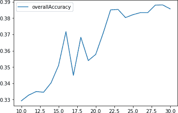

# 第六章\. 群体分割

在 第五章 中，我们介绍了聚类，一种无监督学习方法，用于识别数据中的潜在结构并根据相似性将点分组。这些组（称为簇）应该是同质且明显不同的。换句话说，组内成员应该彼此非常相似，并且与任何其他组的成员非常不同。

从应用的角度来看，基于相似性将成员分组且无需标签指导的能力非常强大。例如，这样的技术可以应用于为在线零售商找到不同的消费者群体，为每个不同的群体定制营销策略（例如预算购物者、时尚达人、球鞋爱好者、技术爱好者、发烧友等）。群体分割可以提高在线广告的定位精度，并改进电影、音乐、新闻、社交网络、约会等推荐系统的推荐效果。

在本章中，我们将使用前一章的聚类算法构建一个应用型无监督学习解决方案 —— 具体来说，我们将执行群体分割。

# Lending Club 数据

对于本章，我们将使用 Lending Club 的贷款数据，这是一家美国的点对点借贷公司。平台上的借款人可以以未担保的个人贷款形式借款 $1,000 到 $40,000，期限为三年或五年。

投资者可以浏览贷款申请，并根据借款人的信用历史、贷款金额、贷款等级和贷款用途选择是否融资。投资者通过贷款支付的利息赚钱，而 Lending Club 则通过贷款起始费用和服务费赚钱。

我们将使用的贷款数据来自 2007–2011 年，并且可以在 [Lending Club 网站](http://bit.ly/2FYN2zX) 上公开获取。数据字典也可以在那里找到。

## 数据准备

像在前几章中一样，让我们准备好环境以处理 Lending Club 数据。

### 加载库

首先，让我们加载必要的库：

```py
# Import libraries
'''Main'''
import numpy as np
import pandas as pd
import os, time, re
import pickle, gzip

'''Data Viz'''
import matplotlib.pyplot as plt
import seaborn as sns
color = sns.color_palette()
import matplotlib as mpl

%matplotlib inline

'''Data Prep and Model Evaluation'''
from sklearn import preprocessing as pp
from sklearn.model_selection import train_test_split
from sklearn.metrics import precision_recall_curve, average_precision_score
from sklearn.metrics import roc_curve, auc, roc_auc_score

'''Algorithms'''
from sklearn.decomposition import PCA
from sklearn.cluster import KMeans
import fastcluster
from scipy.cluster.hierarchy import dendrogram, cophenet, fcluster
from scipy.spatial.distance import pdist
```

### 探索数据

接下来，让我们加载贷款数据并指定要保留哪些列：

原始贷款数据文件有 144 列，但大多数列为空，并且对我们的价值有限。因此，我们将指定一部分主要填充且值得在我们的聚类应用中使用的列。这些字段包括贷款请求金额、资助金额、期限、利率、贷款等级等贷款属性，以及借款人的就业长度、住房所有权状态、年收入、地址以及借款用途等借款人属性。

我们还将稍微探索一下数据：

```py
# Load the data
current_path = os.getcwd()
file = '\\datasets\\lending_club_data\\LoanStats3a.csv'
data = pd.read_csv(current_path + file)

# Select columns to keep
columnsToKeep = ['loan_amnt','funded_amnt','funded_amnt_inv','term', \
                 'int_rate','installment','grade','sub_grade', \
                 'emp_length','home_ownership','annual_inc', \
                 'verification_status','pymnt_plan','purpose', \
                 'addr_state','dti','delinq_2yrs','earliest_cr_line', \
                 'mths_since_last_delinq','mths_since_last_record', \
                 'open_acc','pub_rec','revol_bal','revol_util', \
                 'total_acc','initial_list_status','out_prncp', \
                 'out_prncp_inv','total_pymnt','total_pymnt_inv', \
                 'total_rec_prncp','total_rec_int','total_rec_late_fee', \
                 'recoveries','collection_recovery_fee','last_pymnt_d', \
                 'last_pymnt_amnt']

data = data.loc[:,columnsToKeep]

data.shape

data.head()
```

数据包含 42,542 笔贷款和 37 个特征（42,542, 37）。

表 6-1 预览数据。

表 6-1\. 贷款数据的前几行

|  | loan_amnt | funded_amnt | funded_amnt_inv | term | int_rate | instsallment | grade |
| --- | --- | --- | --- | --- | --- | --- | --- |
| 0 | 5000.0 | 5000.0 | 4975.0 | 36 个月 | 10.65% | 162.87 | B |
| 1 | 2500.0 | 2500.0 | 2500.0 | 60 个月 | 15.27% | 59.83 | C |
| 2 | 2400.0 | 2400.0 | 2400.0 | 35 个月 | 15.96% | 84.33 | C |
| 3 | 10000.0 | 10000.0 | 10000.0 | 36 个月 | 13.49% | 339.31 | C |
| 4 | 3000.0 | 3000.0 | 3000.0 | 60 个月 | 12.69% | 67.79 | B |

## 将字符串格式转换为数值格式

一些特征，如贷款的期限、贷款的利率、借款人的就业时长以及借款人的循环利用率，需要从字符串格式转换为数值格式。让我们进行转换：

```py
# Transform features from string to numeric
for i in ["term","int_rate","emp_length","revol_util"]:
    data.loc[:,i] = \
        data.loc[:,i].apply(lambda x: re.sub("[⁰-9]", "", str(x)))
    data.loc[:,i] = pd.to_numeric(data.loc[:,i])
```

对于我们的聚类应用程序，我们将只考虑数值特征，忽略所有的分类特征，因为非数值特征在当前形式下无法被我们的聚类算法处理。

## 填充缺失值

找到这些数值特征，并计算每个特征中 NaN 的数量。然后我们将用特征的平均值或者有时仅仅是数字零来填充这些 NaN，具体取决于从业务角度来看这些特征代表什么：

```py
# Determine which features are numerical
numericalFeats = [x for x in data.columns if data[x].dtype != 'object']

# Display NaNs by feature
nanCounter = np.isnan(data.loc[:,numericalFeats]).sum()
nanCounter
```

下面的代码显示了每个特征中的 NaN 数量：

```py
loan_amnt               7
funded_amnt             7
funded_amnt_inv         7
term                    7
int_rate                7
installment             7
emp_length              1119
annual_inc              11
dti                     7
delinq_2yrs             36
mths_since_last_delinq  26933
mths_since_last_record  38891
open_acc                36
pub_rec                 36
revol_bal               7
revol_util              97
total_acc               36
out_prncp               7
out_prncp_inv           7
total_pymnt             7
total_pymnt_inv         7
total_rec_prncp         7
total_rec_int           7
total_rec_late_fee      7
recoveries              7
collection_recovery_fee 7
last_pymnt_amnt         7
dtype: int64
```

大多数特征有少量的 NaN，而一些特征，例如自上次拖欠以来的月数和记录变更以来的时间，有很多 NaN。

让我们填充这些 NaN，这样我们在聚类过程中就不必处理任何 NaN：

```py
# Impute NaNs with mean
fillWithMean = ['loan_amnt','funded_amnt','funded_amnt_inv','term', \
                'int_rate','installment','emp_length','annual_inc',\
                'dti','open_acc','revol_bal','revol_util','total_acc',\
                'out_prncp','out_prncp_inv','total_pymnt', \
                'total_pymnt_inv','total_rec_prncp','total_rec_int', \
                'last_pymnt_amnt']

# Impute NaNs with zero
fillWithZero = ['delinq_2yrs','mths_since_last_delinq', \
                'mths_since_last_record','pub_rec','total_rec_late_fee', \
                'recoveries','collection_recovery_fee']

# Perform imputation
im = pp.Imputer(strategy='mean')
data.loc[:,fillWithMean] = im.fit_transform(data[fillWithMean])

data.loc[:,fillWithZero] = data.loc[:,fillWithZero].fillna(value=0,axis=1)
```

让我们重新计算 NaN，以确保没有任何 NaN 保留。

我们现在是安全的。所有的 NaN 都已经填充：

```py
numericalFeats = [x for x in data.columns if data[x].dtype != 'object']

nanCounter = np.isnan(data.loc[:,numericalFeats]).sum()
nanCounter
```

```py
loan_amnt               0
funded_amnt             0
funded_amnt_inv         0
term                    0
int_rate                0
installment             0
emp_length              0
annual_inc              0
dti                     0
delinq_2yrs             0
mths_since_last_delinq  0
mths_since_last_record  0
open_acc                0
pub_rec                 0
revol_bal               0
revol_util              0
total_acc               0
out_prncp               0
out_prncp_inv           0
total_pymnt             0
total_pymnt_inv         0
total_rec_prncp         0
total_rec_int           0
total_rec_late_fee      0
recoveries              0
collection_recovery_fee 0
last_pymnt_amnt         0
dtype: int64
```

## 工程特征

让我们还要工程化几个新特征，以补充现有的特征集。这些新特征大多是贷款金额、循环余额、还款和借款人年收入之间的比率：

```py
# Feature engineering
data['installmentOverLoanAmnt'] = data.installment/data.loan_amnt
data['loanAmntOverIncome'] = data.loan_amnt/data.annual_inc
data['revol_balOverIncome'] = data.revol_bal/data.annual_inc
data['totalPymntOverIncome'] = data.total_pymnt/data.annual_inc
data['totalPymntInvOverIncome'] = data.total_pymnt_inv/data.annual_inc
data['totalRecPrncpOverIncome'] = data.total_rec_prncp/data.annual_inc
data['totalRecIncOverIncome'] = data.total_rec_int/data.annual_inc

newFeats = ['installmentOverLoanAmnt','loanAmntOverIncome', \
            'revol_balOverIncome','totalPymntOverIncome', \
           'totalPymntInvOverIncome','totalRecPrncpOverIncome', \
            'totalRecIncOverIncome']
```

## 选择最终的特征集并执行缩放

接下来，我们将生成训练数据集，并为我们的聚类算法缩放特征：

```py
# Select features for training
numericalPlusNewFeats = numericalFeats+newFeats
X_train = data.loc[:,numericalPlusNewFeats]

# Scale data
sX = pp.StandardScaler()
X_train.loc[:,:] = sX.fit_transform(X_train)
```

## 指定评估标签

聚类是一种无监督学习方法，因此不使用标签。然而，为了评估我们的聚类算法在找到这个 Lending Club 数据集中不同且同质化的借款人群组时的好坏程度，我们将使用贷款等级作为代理标签。

贷款等级目前由字母进行评分，“A” 级贷款最值得信赖和安全，“G” 级贷款最不值得：

```py
labels = data.grade
labels.unique()
```

```py
array(['B', 'C', 'A', 'E', 'F', 'D', 'G', nan], dtype=object)
```

贷款等级中有一些 NaN。我们将用值“Z”来填充这些 NaN，然后使用 Scikit-Learn 中的 `LabelEncoder` 将字母等级转换为数值等级。为了保持一致性，我们将这些标签加载到一个名为“y_train”的 Python 系列中：

```py
# Fill missing labels
labels = labels.fillna(value="Z")

# Convert labels to numerical values
lbl = pp.LabelEncoder()
lbl.fit(list(labels.values))
labels = pd.Series(data=lbl.transform(labels.values), name="grade")

# Store as y_train
y_train = labels

labelsOriginalVSNew = pd.concat([labels, data.grade],axis=1)
labelsOriginalVSNew
```

表 6-2\. 数字与字母贷款等级对比

|  | grade | grade |
| --- | --- | --- |
| 0 | 1 | B |
| 1 | 2 | C |
| 2 | 2 | C |
| 3 | 2 | C |
| 4 | 1 | B |
| 5 | 0 | A |
| 6 | 2 | C |
| 7 | 4 | E |
| 8 | 5 | F |
| 9 | 1 | B |
| 10 | 2 | C |
| 11 | 1 | B |
| 12 | 2 | C |
| 13 | 1 | B |
| 14 | 1 | B |
| 15 | 3 | D |
| 16 | 2 | C |

正如你从表 6-2 中所看到的，所有的“A”等级都被转换为 0，“B”等级为 1，以此类推。

让我们也检查一下是否“A”等级的贷款通常有最低的收费利率，因为它们是最不风险的，其他贷款的利率会逐渐增加：

```py
# Compare loan grades with interest rates
interestAndGrade = pd.DataFrame(data=[data.int_rate,labels])
interestAndGrade = interestAndGrade.T

interestAndGrade.groupby("grade").mean()
```

表 6-3 证实了这一点。较高的字母等级贷款有较高的利率。¹

表 6-3\. 等级与利率

| grade | int_rate |
| --- | --- |
| 0.0 | 734.270844 |
| 1.0 | 1101.420857 |
| 2.0 | 1349.988902 |
| 3.0 | 1557.714927 |
| 4.0 | 1737.676783 |
| 5.0 | 1926.530361 |
| 6.0 | 2045.125000 |
| 7.0 | 1216.501563 |

# 聚类的优度

现在数据准备就绪。我们有一个包含所有 34 个数值特征的 X_train，以及一个包含数值贷款等级的 y_train，我们仅用于验证结果，而不是像在监督式机器学习问题中那样用于训练算法。在构建我们的第一个聚类应用之前，让我们介绍一个函数来分析我们使用聚类算法生成的聚类的优度。具体来说，我们将使用一致性的概念来评估每个聚类的优度。

如果聚类算法在 Lending Club 数据集中很好地分离借款人，那么每个集群都应该有非常相似的借款人，并且与其他组中的借款人不相似。假设相似并被分组在一起的借款人应该有相似的信用档案—换句话说，他们的信用价值应该相似。

如果是这种情况（而在现实世界中，这些假设大部分只是部分成立），给定集群中的借款人通常应被分配相同的数值贷款等级，我们将使用 y_train 中设置的数值贷款等级来验证。在每个集群中具有最频繁出现的数值贷款等级的借款人所占的百分比越高，聚类应用的效果就越好。

举例来说，考虑一个拥有一百名借款人的集群。如果有 30 名借款人的数值贷款等级为 0，25 名借款人的贷款等级为 1，20 名借款人的贷款等级为 2，剩余的借款人贷款等级在 3 到 7 之间，我们会说该集群的准确率为 30%，因为该集群中最频繁出现的贷款等级仅适用于该集群中的 30% 借款人。

如果我们没有一个包含数值贷款等级的*y_train*来验证簇的好坏，我们可以采用替代方法。我们可以从每个簇中抽样一些借款人，手动确定他们的数值贷款等级，并确定我们是否会给这些借款人大致相同的数值贷款等级。如果是，则该簇是一个好簇——它足够同质化，我们会给我们抽样的借款人大致相同的数值贷款等级。如果不是，则该簇不够好——借款人过于异质化，我们应该尝试使用更多数据、不同的聚类算法等来改进解决方案。

尽管如此，我们不需要对借款人进行抽样和手动标记，因为我们已经有了数值贷款等级，但在没有标签的特定问题上，这一点很重要。

这是分析簇的函数：

```py
def analyzeCluster(clusterDF, labelsDF):
    countByCluster = \
        pd.DataFrame(data=clusterDF['cluster'].value_counts())
    countByCluster.reset_index(inplace=True,drop=False)
    countByCluster.columns = ['cluster','clusterCount']

    preds = pd.concat([labelsDF,clusterDF], axis=1)
    preds.columns = ['trueLabel','cluster']

    countByLabel = pd.DataFrame(data=preds.groupby('trueLabel').count())

    countMostFreq = pd.DataFrame(data=preds.groupby('cluster').agg( \
        lambda x:x.value_counts().iloc[0]))
    countMostFreq.reset_index(inplace=True,drop=False)
    countMostFreq.columns = ['cluster','countMostFrequent']

    accuracyDF = countMostFreq.merge(countByCluster, \
        left_on="cluster",right_on="cluster")

    overallAccuracy = accuracyDF.countMostFrequent.sum()/ \
        accuracyDF.clusterCount.sum()

    accuracyByLabel = accuracyDF.countMostFrequent/ \
        accuracyDF.clusterCount

    return countByCluster, countByLabel, countMostFreq, \
        accuracyDF, overallAccuracy, accuracyByLabel
```

# *k*-均值应用

我们使用这个 Lending Club 数据集的第一个聚类应用将使用*k*-均值，这在第五章中有介绍。回顾一下，在*k*-均值聚类中，我们需要指定所需的簇*k*，算法将每个借款人精确地分配到这些*k*簇中的一个。

该算法将通过最小化簇内变化（也称为惯性），使得所有*k*簇中的簇内变化之和尽可能小，来实现这一点。

我们不只是指定一个*k*值，而是进行一个实验，将*k*从 10 到 30 的范围内设置，并绘制我们在前一节定义的准确度测量结果。

基于哪种*k*度量表现最佳，我们可以构建使用这种最佳*k*度量的聚类管道：

```py
from sklearn.cluster import KMeans

n_clusters = 10
n_init = 10
max_iter = 300
tol = 0.0001
random_state = 2018
n_jobs = 2

kmeans = KMeans(n_clusters=n_clusters, n_init=n_init, \
                max_iter=max_iter, tol=tol, \
                random_state=random_state, n_jobs=n_jobs)

kMeans_inertia = pd.DataFrame(data=[],index=range(10,31), \
                              columns=['inertia'])

overallAccuracy_kMeansDF = pd.DataFrame(data=[], \
    index=range(10,31),columns=['overallAccuracy'])

for n_clusters in range(10,31):
    kmeans = KMeans(n_clusters=n_clusters, n_init=n_init, \
                    max_iter=max_iter, tol=tol, \
                    random_state=random_state, n_jobs=n_jobs)

    kmeans.fit(X_train)
    kMeans_inertia.loc[n_clusters] = kmeans.inertia_
    X_train_kmeansClustered = kmeans.predict(X_train)
    X_train_kmeansClustered = pd.DataFrame(data= \
        X_train_kmeansClustered, index=X_train.index, \
        columns=['cluster'])

    countByCluster_kMeans, countByLabel_kMeans, \
    countMostFreq_kMeans, accuracyDF_kMeans, \
    overallAccuracy_kMeans, accuracyByLabel_kMeans = \
    analyzeCluster(X_train_kmeansClustered, y_train)

    overallAccuracy_kMeansDF.loc[n_clusters] = \
        overallAccuracy_kMeans

overallAccuracy_kMeansDF.plot()
```

图 6-1 显示了结果的图表。



###### 图 6-1\. 使用*k*-均值进行不同*k*度量的整体准确率

正如我们所见，准确率在大约 30 个簇时最佳，约为 39%。换句话说，对于任何给定的簇，大约 39%的借款人具有该簇中最常见的标签。其余 61%的借款人具有非最常见的标签。

下面的代码显示了*k* = 30 时的准确率：

```py
0      0.326633
1      0.258993
2      0.292240
3      0.234242
4      0.388794
5      0.325654
6      0.303797
7      0.762116
8      0.222222
9      0.391381
10     0.292910
11     0.317533
12     0.206897
13     0.312709
14     0.345233
15     0.682208
16     0.327250
17     0.366605
18     0.234783
19     0.288757
20     0.500000
21     0.375466
22     0.332203
23     0.252252
24     0.338509
25     0.232000
26     0.464418
27     0.261583
28     0.376327
29     0.269129
dtype: float64
```

准确率在不同簇之间变化很大。有些簇比其他簇更加同质化。例如，簇 7 的准确率为 76%，而簇 12 的准确率仅为 21%。这是构建一个聚类应用程序的起点，用于根据其与其他借款人的相似度将申请 Lending Club 贷款的新借款人自动分配到预先存在的组中。基于这种聚类，可以自动为新借款人分配一个暂定的数值贷款等级，大约 39%的时间是正确的。

这不是最佳解决方案，我们应考虑是否获取更多数据、执行更多特征工程和选择、选择不同的*k*-均值算法参数或更改为其他聚类算法以改善结果。可能我们没有足够的数据能够像我们已经做的那样有效地将借款人分成不同且同质的群体；如果是这种情况，需要更多数据和更多的特征工程和选择。或者，对于我们拥有的有限数据，*k*-均值算法不适合执行此分离。

让我们转向层次聚类，看看我们的结果是否会有所改善。

# 层次聚类应用

请记住，在层次聚类中，我们不需要预先确定特定数量的群集。相反，我们可以在层次聚类运行结束后选择我们想要的群集数量。层次聚类将构建一个树状图，概念上可以视为倒置的树。底部的叶子是在 Lending Club 上申请贷款的个体借款人。

层次聚类根据借款人彼此之间的相似程度，随着我们垂直向上移动倒置树而将它们连接在一起。彼此最相似的借款人更早加入，而不那么相似的借款人则加入得更晚。最终，所有借款人都在倒置树的顶部——主干处一起加入。

从业务角度来看，这种聚类过程显然非常强大。如果我们能够找到彼此相似并将它们分组的借款人，我们可以更有效地为它们分配信用评级。我们还可以针对不同的借款人群体制定具体策略，并从关系的角度更好地管理它们，提供更好的整体客户服务。

一旦层次聚类算法运行完毕，我们可以确定我们想要切割树的位置。我们切得越低，留下的借款人群体就越多。

让我们首先像我们在第五章中所做的那样训练层次聚类算法：

```py
import fastcluster
from scipy.cluster.hierarchy import dendrogram
from scipy.cluster.hierarchy import cophenet
from scipy.spatial.distance import pdist

Z = fastcluster.linkage_vector(X_train, method='ward', \
                               metric='euclidean')

Z_dataFrame = pd.DataFrame(data=Z,columns=['clusterOne', \
                'clusterTwo','distance','newClusterSize'])
```

表 6-4 展示了输出的数据框的样子。前几行是最底层借款人的初始联接。

表 6-4\. 层次聚类的最底层叶子节点

|  | clusterOne | clusterTwo | distance | newClusterSize |
| --- | --- | --- | --- | --- |
| 0 | 39786.0 | 39787.0 | 0.000000e+00 | 2.0 |
| 1 | 39788.0 | 42542.0 | 0.000000e+00 | 3.0 |
| 2 | 42538.0 | 42539.0 | 0.000000e+00 | 2.0 |
| 3 | 42540.0 | 42544.0 | 0.000000e+00 | 3.0 |
| 4 | 42541.0 | 42545.0 | 3.399350e-17 | 4.0 |
| 5 | 42543.0 | 42546.0 | 5.139334e-17 | 7.0 |
| 6 | 33251.0 | 33261.0 | 1.561313e-01 | 2.0 |
| 7 | 42512.0 | 42535.0 | 3.342654e-01 | 2.0 |
| 8 | 42219.0 | 42316.0 | 3.368231e-01 | 2.0 |
| 9 | 6112.0 | 21928.0 | 3.384368e-01 | 2.0 |
| 10 | 33248.0 | 33275.0 | 3.583819e-01 | 2.0 |
| 11 | 33253.0 | 33265.0 | 3.595331e-01 | 2.0 |
| 12 | 33258.0 | 42552.0 | 3.719377e-01 | 3.0 |
| 13 | 20430.0 | 23299.0 | 3.757307e-01 | 2.0 |
| 14 | 5455.0 | 32845.0 | 3.828709e-01 | 2.0 |
| 15 | 28615.0 | 30306.0 | 3.900294e-01 | 2.0 |
| 16 | 9056 .0 | 9769.0 | 3.967378e-01 | 2.0 |
| 17 | 11162.0 | 13857.0 | 3.991124e-01 | 2.0 |
| 18 | 33270.0 | 42548.0 | 3.995620e-01 | 3.0 |
| 19 | 17422.0 | 17986.0 | 4.061704e-01 | 2.0 |

请记住，最后几行表示倒置树的顶部，最终将 42,541 名借款人汇总在一起（见表 6-5）。

表 6-5\. 层次聚类的最顶层叶节点

|  | clusterOne | clusterTwo | distance | newClusterSize |
| --- | --- | --- | --- | --- |
| 42521 | 85038.0 | 85043.0 | 132.715723 | 3969.0 |
| 42522 | 85051.0 | 85052.0 | 141.386569 | 2899.0 |
| 42532 | 85026.0 | 85027.0 | 146.976703 | 2351.0 |
| 42524 | 85048.0 | 85049.0 | 152.660192 | 5691.0 |
| 42525 | 85036.0 | 85059.0 | 153.512281 | 5956.0 |
| 42526 | 85033.0 | 85044.0 | 160.825959 | 2203.0 |
| 42527 | 85055.0 | 85061.0 | 163.701428 | 668.0 |
| 42528 | 85062.0 | 85066.0 | 168.199295 | 6897.0 |
| 42529 | 85054.0 | 85060.0 | 168.924039 | 9414.0 |
| 42530 | 85028.0 | 85064.0 | 185.215769 | 3118.0 |
| 42531 | 85067.0 | 85071.0 | 187.832588 | 15370.0 |
| 42532 | 85056.0 | 85073.0 | 203.212147 | 17995.0 |
| 42533 | 85057.0 | 85063.0 | 205.285993 | 9221.0 |
| 42534 | 85068.0 | 85072.0 | 207.902660 | 5321.0 |
| 42535 | 85069.0 | 85075.0 | 236.754581 | 9889.0 |
| 42536 | 85070.0 | 85077.0 | 298.587755 | 16786.0 |
| 42537 | 85058.0 | 85078.0 | 309.946867 | 16875.0 |
| 42538 | 85074.0 | 85079.0 | 375.698458 | 34870.0 |
| 42539 | 85065.0 | 85080.0 | 400.711547 | 37221.0 |
| 42504 | 85076.0 | 85081.0 | 644.047472 | 42542.0 |

现在，让我们根据`distance_threshold`来截取树状图，以便获得可管理的集群数量。根据试验，设置`distance_threshold`为 100，结果得到 32 个集群，这是我们将在本例中使用的数量。

```py
from scipy.cluster.hierarchy import fcluster
distance_threshold = 100
clusters = fcluster(Z, distance_threshold, criterion='distance')
X_train_hierClustered = pd.DataFrame(data=clusters,
 index=X_train_PCA.index,columns=['cluster'])

print("Number of distinct clusters: ",
 len(X_train_hierClustered['cluster'].unique()))
```

我们选择的距离阈值所给出的不同集群数量为 32：

```py
countByCluster_hierClust, countByLabel_hierClust, countMostFreq_hierClust,
 accuracyDF_hierClust, overallAccuracy_hierClust, accuracyByLabel_hierClust =
 analyzeCluster(X_train_hierClustered, y_train)
print("Overall accuracy from hierarchical clustering: ",
 overallAccuracy_hierClust)
```

下面的代码展示了层次聚类的总体准确率：

```py
Overall accuracy from hierarchical clustering: 0.3651685393258427
```

总体准确率约为 37%，略低于*k*-means 聚类。尽管如此，层次聚类与*k*-means 聚类的工作方式不同，可能会更准确地分组一些借款人，而*k*-means 可能会比层次聚类更准确地分组其他借款人。

换句话说，这两种聚类算法可能互补，值得通过合并两种算法并评估合并结果来探索。与*k*-means 一样，准确率在不同集群之间差异很大。一些集群比其他集群更同质化：

```py
Accuracy by cluster for hierarchical clustering

0      0.304124
1      0.219001
2      0.228311
3      0.379722
4      0.240064
5      0.272011
6      0.314560
7      0.263930
8      0.246138
9      0.318942
10     0.302752
11     0.269772
12     0.335717
13     0.330403
14     0.346320
15     0.440141
16     0.744155
17     0.502227
18     0.294118
19     0.236111
20     0.254727
21     0.241042
22     0.317979
23     0.308771
24     0.284314
25     0.243243
26     0.500000
27     0.289157
28     0.365283
29     0.479693
30     0.393559
31     0.340875
```

# HDBSCAN 应用

现在让我们转向 HDBSCAN，并将此聚类算法应用于在 Lending Club 数据集中对相似借款人进行分组。

回想一下，HDBSCAN 将根据借款人在高维空间中属性的密集程度将其分组在一起。与*k*-means 或分层聚类不同，不是所有的借款人都会被分组。一些与其他借款人群体非常不同的借款人可能保持未分组状态。这些是异常借款人，值得调查，看看它们与其他借款人不同的良好业务原因。可能可以为一些借款人群体自动分配数值贷款等级，但对于那些不同的借款人，可能需要更为细致的信用评分方法。

让我们看看 HDBSCAN 的表现：

```py
import hdbscan

min_cluster_size = 20
min_samples = 20
alpha = 1.0
cluster_selection_method = 'leaf'

hdb = hdbscan.HDBSCAN(min_cluster_size=min_cluster_size, \
    min_samples=min_samples, alpha=alpha, \
    cluster_selection_method=cluster_selection_method)

X_train_hdbscanClustered = hdb.fit_predict(X_train)
X_train_hdbscanClustered = pd.DataFrame(data= \
    X_train_hdbscanClustered, index=X_train.index, \
    columns=['cluster'])

countByCluster_hdbscan, countByLabel_hdbscan, \
    countMostFreq_hdbscan, accuracyDF_hdbscan, \
    overallAccuracy_hdbscan, accuracyByLabel_hdbscan = \
    analyzeCluster(X_train_hdbscanClustered, y_train)
```

下面的代码显示了 HDBSCAN 的整体准确率：

```py
Overall accuracy from HDBSCAN: 0.3246203751586667
```

如此所见，整体准确率约为 32%，比*k*-means 或分层聚类的准确率都差。

表 6-6 显示了各种簇及其簇大小。

表 6-6\. HDBSCAN 的簇结果

|  | 簇 | 簇计数 |
| --- | --- | --- |
| 0 | –1 | 32708 |
| 1 | 7 | 4070 |
| 2 | 2 | 3668 |
| 3 | 1 | 1096 |
| 4 | 4 | 773 |
| 5 | 0 | 120 |
| 6 | 6 | 49 |
| 7 | 3 | 38 |
| 8 | 5 | 20 |

32,708 名借款人属于簇-1，意味着它们未分组。

以下显示了各簇的准确率：

```py
0       0.284487
1       0.341667
2       0.414234
3       0.332061
4       0.552632
5       0.438551
6       0.400000
7       0.408163
8       0.590663
```

在这些簇中，准确率从 28%到 59%不等。

# 结论

在本章中，我们基于从 2007 年到 2011 年在 Lending Club 申请无抵押个人贷款的借款人构建了一个无监督的聚类应用程序。这些应用程序基于*k*-means、分层聚类和分层 DBSCAN。*k*-means 表现最佳，整体准确率约为 39%。

虽然这些应用程序表现还可以，但它们可以大幅改进。你应该尝试使用这些算法来改进解决方案。

这结束了本书中使用 Scikit-Learn 的无监督学习部分。接下来，我们将探索基于神经网络的形式的无监督学习，使用 TensorFlow 和 Keras。我们将从第七章中的表示学习和自编码器开始。

¹ 我们可以忽略评级为“7”的，这对应于贷款等级“Z”。这些是我们不得不填补贷款等级缺失的贷款。

² 我们在第二章中探讨了集成学习。如果需要复习，请参考“集成”。
