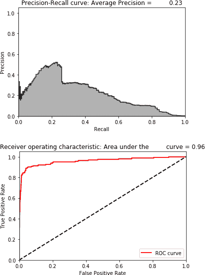

# 第八章 自动编码器实战

在本章中，我们将构建使用各种版本的自动编码器的应用程序，包括欠完备、过完备、稀疏、去噪和变分自动编码器。

首先，让我们回到我们在 第三章 中介绍的信用卡欺诈检测问题。对于这个问题，我们有 284,807 笔信用卡交易，其中只有 492 笔是欺诈性的。使用监督模型，我们实现了平均精度为 0.82，这非常令人印象深刻。我们可以找到超过 80% 的欺诈，并且精度超过 80%。使用无监督模型，我们实现了平均精度为 0.69，考虑到我们没有使用标签，这也是非常好的。我们可以找到超过 75% 的欺诈，并且精度超过 75%。

让我们看看如何使用自动编码器来解决同样的问题，它也是一种无监督算法，但使用了神经网络。

# 数据准备

让我们首先加载必要的库：

```py
'''Main'''
import numpy as np
import pandas as pd
import os, time, re
import pickle, gzip

'''Data Viz'''
import matplotlib.pyplot as plt
import seaborn as sns
color = sns.color_palette()
import matplotlib as mpl

%matplotlib inline

'''Data Prep and Model Evaluation'''
from sklearn import preprocessing as pp
from sklearn.model_selection import train_test_split
from sklearn.model_selection import StratifiedKFold
from sklearn.metrics import log_loss
from sklearn.metrics import precision_recall_curve, average_precision_score
from sklearn.metrics import roc_curve, auc, roc_auc_score

'''Algos'''
import lightgbm as lgb

'''TensorFlow and Keras'''
import tensorflow as tf
import keras
from keras import backend as K
from keras.models import Sequential, Model
from keras.layers import Activation, Dense, Dropout
from keras.layers import BatchNormalization, Input, Lambda
from keras import regularizers
from keras.losses import mse, binary_crossentropy
```

接下来，加载数据集并准备使用。我们将创建一个 `dataX` 矩阵，其中包含所有的 PCA 成分和特征 `Amount`，但排除 `Class` 和 `Time`。我们将把 `Class` 标签存储在 `dataY` 矩阵中。我们还将对 `dataX` 矩阵中的特征进行缩放，使所有特征的平均值为零，标准差为一。

```py
data = pd.read_csv('creditcard.csv')
dataX = data.copy().drop(['Class','Time'],axis=1)
dataY = data['Class'].copy()
featuresToScale = dataX.columns
sX = pp.StandardScaler(copy=True, with_mean=True, with_std=True)
dataX.loc[:,featuresToScale] = sX.fit_transform(dataX[featuresToScale])
```

就像我们在 第三章 中所做的那样，我们将创建一个训练集，其中包含三分之二的数据和标签，并创建一个测试集，其中包含三分之一的数据和标签。

让我们将训练集和测试集分别存储为 *X_train_AE* 和 *X_test_AE*，我们很快将在自动编码器中使用它们。

```py
X_train, X_test, y_train, y_test = \
    train_test_split(dataX, dataY, test_size=0.33, \
                     random_state=2018, stratify=dataY)

X_train_AE = X_train.copy()
X_test_AE = X_test.copy()
```

让我们还要重用本书中早期介绍的函数 `anomalyScores`，来计算原始特征矩阵与新重构特征矩阵之间的重构误差。该函数计算平方误差的总和，并将其归一化到零到一的范围内。

这是一个关键的函数。误差接近于一的交易最异常（即具有最高的重构误差），因此最可能是欺诈性的。误差接近于零的交易具有最低的重构误差，最可能是正常的。

```py
def anomalyScores(originalDF, reducedDF):
    loss = np.sum((np.array(originalDF) - \
                   np.array(reducedDF))**2, axis=1)
    loss = pd.Series(data=loss,index=originalDF.index)
    loss = (loss-np.min(loss))/(np.max(loss)-np.min(loss))
    return loss
```

我们还将重用一个名为 `plotResults` 的函数来绘制精确率-召回率曲线、平均精度和 ROC 曲线。

```py
def plotResults(trueLabels, anomalyScores, returnPreds = False):
    preds = pd.concat([trueLabels, anomalyScores], axis=1)
    preds.columns = ['trueLabel', 'anomalyScore']
    precision, recall, thresholds = \
        precision_recall_curve(preds['trueLabel'], \
                               preds['anomalyScore'])
    average_precision = average_precision_score( \
                        preds['trueLabel'], preds['anomalyScore'])

    plt.step(recall, precision, color='k', alpha=0.7, where='post')
    plt.fill_between(recall, precision, step='post', alpha=0.3, color='k')

    plt.xlabel('Recall')
    plt.ylabel('Precision')
    plt.ylim([0.0, 1.05])
    plt.xlim([0.0, 1.0])

    plt.title('Precision-Recall curve: Average Precision = \
 {0:0.2f}'.format(average_precision))

    fpr, tpr, thresholds = roc_curve(preds['trueLabel'], \
                                     preds['anomalyScore'])
    areaUnderROC = auc(fpr, tpr)

    plt.figure()
    plt.plot(fpr, tpr, color='r', lw=2, label='ROC curve')
    plt.plot([0, 1], [0, 1], color='k', lw=2, linestyle='--')
    plt.xlim([0.0, 1.0])
    plt.ylim([0.0, 1.05])
    plt.xlabel('False Positive Rate')
    plt.ylabel('True Positive Rate')
    plt.title('Receiver operating characteristic: Area under the \
 curve = {0:0.2f}'.format(areaUnderROC))
    plt.legend(loc="lower right")
    plt.show()

    if returnPreds==True:
        return preds
```

# 自动编码器的组成部分

首先，让我们构建一个非常简单的自动编码器，包括输入层、单隐藏层和输出层。我们将原始特征矩阵 *x* 输入到自动编码器中——这由输入层表示。然后，激活函数将应用于输入层，生成隐藏层。这个激活函数称为 *f*，代表自动编码器的 *编码器* 部分。隐藏层称为 *h*（等于 *f(x)*），代表新学习到的表示。

接下来，激活函数应用于隐藏层（即新学到的表示），以重构原始观测数据。这个激活函数称为*g*，代表自动编码器的*解码器*部分。输出层称为*r*（等于*g(h)*），代表新重构的观测数据。为了计算重构误差，我们将比较新构建的观测数据*r*与原始观测数据*x*。

# 激活函数

在我们决定在这个单隐藏层自动编码器中使用的节点数之前，让我们讨论一下激活函数。

神经网络学习在每个层的节点上应用的权重，但节点是否激活（用于下一层）由激活函数决定。换句话说，激活函数应用于每层的加权输入（加上偏置，如果有的话）。我们将加权输入加偏置称为*Y*。

激活函数接收*Y*，如果*Y*超过某个阈值，则激活；否则，不激活。如果激活，则给定节点中的信息传递到下一层；否则，不传递。但是，我们不希望简单的二进制激活。相反，我们希望一系列激活值。为此，我们可以选择线性激活函数或非线性激活函数。线性激活函数是无界的。它可以生成介于负无穷到正无穷之间的激活值。常见的非线性激活函数包括 sigmoid、双曲正切（或简称 tanh）、修正线性单元（或简称 ReLu）和 softmax：

Sigmoid 函数

Sigmoid 函数是有界的，并且可以生成介于零和一之间的激活值。

Tanh 函数

tanh 函数也是有界的，并且可以生成介于负一到正一之间的激活值。其梯度比 sigmoid 函数更陡。

ReLu 函数

ReLu 函数具有一个有趣的性质。如果*Y*是正的，ReLu 将返回*Y*。否则，将返回零。因此，对于正值的*Y*，ReLu 是无界的。

Softmax 函数

softmax 函数用作神经网络中分类问题的最终激活函数，因为它将分类概率归一化为总和为一的值。

在所有这些函数中，线性激活函数是最简单且计算开销最小的。ReLu 是接下来计算开销第二小的，其它则依次类推。

# 我们的第一个自动编码器

让我们从一个具有线性激活函数的两层自动编码器开始。请注意，只有隐藏层的数量加上输出层计入神经网络的*层数*。由于我们有一个隐藏层，因此这被称为两层神经网络。

要使用 TensorFlow 和 Keras 构建这一过程，我们首先需要调用*Sequential model API*。Sequential 模型是层的线性堆叠，在编译模型并在数据上进行训练之前，我们将把我们想要的层类型传递到模型中。¹

```py
# Model one
# Two layer complete autoencoder with linear activation

# Call neural network API
model = Sequential()
```

一旦我们调用了 Sequential 模型，我们接下来需要指定输入形状，即指定与原始特征矩阵*dataX*中维度数量相匹配的维度数，这个数字是 29。

我们还需要指定应用于输入层的激活函数（也称为编码器函数）以及我们希望隐藏层具有的节点数。我们将使用*linear*作为激活函数。

首先，让我们使用一个完整的自编码器，其中隐藏层中的节点数等于输入层中的节点数，即 29。所有这些都可以使用一行代码完成：

```py
model.add(Dense(units=29, activation='linear',input_dim=29))
```

同样地，我们需要指定应用于隐藏层的激活函数（也称为解码器函数），以重构观察结果，并且我们希望输出层具有的维数。由于我们希望最终重构的矩阵与原始矩阵具有相同的维度，维数需要为 29。此外，我们还将在解码器中使用线性激活函数：

```py
model.add(Dense(units=29, activation='linear'))
```

接下来，我们需要编译我们为神经网络设计的层。这需要我们选择一个*损失函数*（也称为*目标函数*）来指导权重的学习，一个*优化器*来设定权重学习的过程，并列出一系列*度量标准*以帮助我们评估神经网络的好坏。

## 损失函数

让我们从损失函数开始。回想一下，我们根据自编码器基于重构后的特征矩阵与我们输入自编码器的原始特征矩阵之间的重构误差来评估模型。

因此，我们希望将*均方误差*作为评估指标。（对于我们自定义的评估函数，我们使用平方误差之和，这类似。）²

## 优化器

神经网络训练多个回合（称为*epochs*）。在每个回合中，神经网络调整其学习的权重，以减少与上一个回合相比的损失。设置学习这些权重的过程由优化器决定。我们希望找到一个过程，帮助神经网络高效地学习各层节点的最佳权重，从而最小化我们选择的损失函数。

要学习最佳权重，神经网络需要智能地调整其对最佳权重的“猜测”。一种方法是迭代地朝着有助于逐步减少损失函数的方向移动权重。但更好的方法是以一定的随机性朝着这个方向移动权重，换句话说，随机地移动权重。

尽管还有更多内容，这个过程被称为*随机梯度下降*（或简称 SGD），是训练神经网络中最常用的优化器。³ SGD 具有一个称为*alpha*的单一学习率，用于所有权重更新，而这个学习率在训练过程中不会改变。然而，在大多数情况下，调整学习率是更好的选择。例如，在早期的 epochs 中，通过较大的程度调整权重更为合理，换句话说，具有较大的学习率或 alpha。

在后续的 epochs 中，当权重更加优化时，微调权重的程度比单向或另一方向上的大步调整更为合理。因此，比 SGD 更好的优化器是*Adam 优化算法*，它源自自适应矩估计。Adam 优化器动态调整学习率，而不像 SGD 那样在训练过程中保持不变，并且这是我们将使用的优化器。⁴

对于这个优化器，我们可以设置α，这决定了权重更新的速度。较大的α值在更新学习率之前会导致更快的初始学习速度。

## 训练模型

最后，我们需要选择评估指标，我们将其设置为`accuracy`以保持简单：⁵

```py
model.compile(optimizer='adam',
              loss='mean_squared_error',
              metrics=['accuracy'])
```

接下来，我们需要选择 epoch 数量和批次大小，然后通过调用*fit*方法开始训练过程。epoch 数量决定了整个传递到神经网络中的数据集训练次数。我们将这个设置为 10 来开始。

批次设置了神经网络在进行下一个梯度更新之前训练的样本数量。如果批次等于观察的总数，神经网络将每个 epoch 仅进行一次梯度更新。否则，它将在每个 epoch 中进行多次更新。我们将这个设置为通用的 32 个样本来开始。

在 fit 方法中，我们将传入初始输入矩阵*x*和目标矩阵*y*。在我们的案例中，*x*和*y*都将是原始特征矩阵*X_train_AE*，因为我们希望比较自编码器的输出——重构特征矩阵与原始特征矩阵来计算重构误差。

记住，这是一个完全无监督的解决方案，所以我们根本不会使用*y*矩阵。我们将在整个训练矩阵上测试重构误差来验证我们的模型：

```py
num_epochs = 10
batch_size = 32

history = model.fit(x=X_train_AE, y=X_train_AE,
                    epochs=num_epochs,
                    batch_size=batch_size,
                    shuffle=True,
                    validation_data=(X_train_AE, X_train_AE),
                    verbose=1)
```

由于这是一个完整的自编码器——隐藏层与输入层具有相同的维数，因此对于训练集和验证集，损失都非常低：

```py
Training history of complete autoencoder

Train on 190820 samples, validate on 190820 samples
Epoch 1/10
190820/190820 [==============================] - 29s 154us/step - loss: 0.1056
- acc: 0.8728 - val_loss: 0.0013 - val_acc: 0.9903
Epoch 2/10
190820/190820 [==============================] - 27s 140us/step - loss: 0.0012
- acc: 0.9914 - val_loss: 1.0425e-06 - val_acc: 0.9995
Epoch 3/10
190820/190820 [==============================] - 23s 122us/step - loss: 6.6244
e-04 - acc: 0.9949 - val_loss: 5.2491e-04 - val_acc: 0.9913
Epoch 4/10
190820/190820 [==============================] - 23s 119us/step - loss: 0.0016
- acc: 0.9929 - val_loss: 2.2246e-06 - val_acc: 0.9995
Epoch 5/10
190820/190820 [==============================] - 23s 119us/step - loss: 5.7424
e-04 - acc: 0.9943 - val_loss: 9.0811e-05 - val_acc: 0.9970
Epoch 6/10
190820/190820 [==============================] - 22s 118us/step - loss: 5.4950
e-04 - acc: 0.9941 - val_loss: 6.0598e-05 - val_acc: 0.9959
Epoch 7/10
190820/190820 [==============================] - 22s 117us/step - loss: 5.2291
e-04 - acc: 0.9946 - val_loss: 0.0023 - val_acc: 0.9675
Epoch 8/10
190820/190820 [==============================] - 22s 117us/step - loss: 6.5130
e-04 - acc: 0.9932 - val_loss: 4.5059e-04 - val_acc: 0.9945
Epoch 9/10
190820/190820 [==============================] - 23s 122us/step - loss: 4.9077
e-04 - acc: 0.9952 - val_loss: 7.2591e-04 - val_acc: 0.9908
Epoch 10/10
190820/190820 [==============================] - 23s 118us/step - loss: 6.1469
e-04 - acc: 0.9945 - val_loss: 4.4131e-06 - val_acc: 0.9991
```

这并不是最优的——自编码器对原始特征矩阵进行了过于精确的重构，记住了输入。

请回想一下，自编码器旨在学习一个新的表示，捕捉原始输入矩阵中最显著的信息，同时丢弃不太相关的信息。简单地记忆输入——也称为学习*恒等函数*——不会带来新的和改进的表示学习。

## 在测试集上评估

让我们使用测试集来评估这个自编码器在识别信用卡交易中的欺诈问题上的成功程度。我们将使用`predict`方法来完成这个任务：

```py
predictions = model.predict(X_test, verbose=1)
anomalyScoresAE = anomalyScores(X_test, predictions)
preds = plotResults(y_test, anomalyScoresAE, True)
```

如图 8-1 所示，平均精度为 0.30，这并不是很好的结果。在第四章的无监督学习中，使用无监督学习的最佳平均精度为 0.69，有监督系统的平均精度为 0.82。然而，每次训练过程将为训练后的自编码器产生略有不同的结果，因此您可能不会在您的运行中看到相同的性能。

为了更好地了解两层完整自编码器在测试集上的表现，让我们分别运行这个训练过程十次，并存储每次运行在测试集上的平均精度。我们将根据这 10 次运行的平均精度来评估这个完整自编码器在捕捉欺诈方面的能力。


###### 第 8-1 图。完整自编码器的评估指标

为了总结我们迄今为止的工作，这里是从头到尾模拟 10 次运行的代码：

```py
# 10 runs - We will capture mean of average precision
test_scores = []
for i in range(0,10):
    # Call neural network API
    model = Sequential()

    # Apply linear activation function to input layer
    # Generate hidden layer with 29 nodes, the same as the input layer
    model.add(Dense(units=29, activation='linear',input_dim=29))

    # Apply linear activation function to hidden layer
    # Generate output layer with 29 nodes
    model.add(Dense(units=29, activation='linear'))

    # Compile the model
    model.compile(optimizer='adam',
                  loss='mean_squared_error',
                  metrics=['accuracy'])

    # Train the model
    num_epochs = 10
    batch_size = 32

    history = model.fit(x=X_train_AE, y=X_train_AE,
                        epochs=num_epochs,
                        batch_size=batch_size,
                        shuffle=True,
                        validation_data=(X_train_AE, X_train_AE),
                        verbose=1)

    # Evaluate on test set
    predictions = model.predict(X_test, verbose=1)
    anomalyScoresAE = anomalyScores(X_test, predictions)
    preds, avgPrecision = plotResults(y_test, anomalyScoresAE, True)
    test_scores.append(avgPrecision)

print("Mean average precision over 10 runs: ", np.mean(test_scores))
test_scores
```

下面的代码总结了这 10 次运行的结果。平均精度为 0.30，但平均精度从 0.02 到 0.72 不等。*变异系数*（定义为 10 次运行中标准差除以平均值）为 0.88。

```py
Mean average precision over 10 runs: 0.30108318944579776
Coefficient of variation over 10 runs: 0.8755095071789248

[0.25468022666666157,
0.092705950994909,
0.716481644928299,
0.01946589342639965,
0.25623865457838263,
0.33597083510378234,
0.018757053070824415,
0.6188569405068724,
0.6720552647581304,
0.025619070873716072]
```

让我们尝试通过构建这个自编码器的变种来改进我们的结果。

# 具有线性激活函数的两层欠完整自编码器

让我们尝试一个欠完整自编码器，而不是完整的自编码器。

与先前的自编码器相比，唯一变化的是隐藏层中节点的数量。不再将其设置为原始维度的数量（29），我们将节点数设置为 20。换句话说，这个自编码器是一个受限制的自编码器。编码器函数被迫用较少的节点捕捉输入层中的信息，解码器则必须将这个新的表示用于重构原始矩阵。

我们应该预期这里的损失比完整自编码器的损失更高。让我们运行代码。我们将执行 10 次独立运行，以测试各种欠完整自编码器在捕捉欺诈方面的表现：

```py
# 10 runs - We will capture mean of average precision
test_scores = []
for i in range(0,10):
    # Call neural network API
    model = Sequential()

    # Apply linear activation function to input layer
    # Generate hidden layer with 20 nodes
    model.add(Dense(units=20, activation='linear',input_dim=29))

    # Apply linear activation function to hidden layer
    # Generate output layer with 29 nodes
    model.add(Dense(units=29, activation='linear'))

    # Compile the model
    model.compile(optimizer='adam',
                  loss='mean_squared_error',
                  metrics=['accuracy'])

    # Train the model
    num_epochs = 10
    batch_size = 32

    history = model.fit(x=X_train_AE, y=X_train_AE,
                        epochs=num_epochs,
                        batch_size=batch_size,
                        shuffle=True,
                        validation_data=(X_train_AE, X_train_AE),
                        verbose=1)

    # Evaluate on test set
    predictions = model.predict(X_test, verbose=1)
    anomalyScoresAE = anomalyScores(X_test, predictions)
    preds, avgPrecision = plotResults(y_test, anomalyScoresAE, True)
    test_scores.append(avgPrecision)

print("Mean average precision over 10 runs: ", np.mean(test_scores))
test_scores
```

如下所示，欠完整自编码器的损失远高于完整自编码器的损失。显然，自编码器学习了一个比原始输入矩阵更加新颖和受限制的表示——自编码器并非简单地记忆输入：

```py
Training history of undercomplete autoencoder with 20 nodes

Train on 190820 samples, validate on 190820 samples
Epoch 1/10
190820/190820 [==============================] - 28s 145us/step - loss: 0.3588
- acc: 0.5672 - val_loss: 0.2789 - val_acc: 0.6078
Epoch 2/10
190820/190820 [==============================] - 29s 153us/step - loss: 0.2817
- acc: 0.6032 - val_loss: 0.2757 - val_acc: 0.6115
Epoch 3/10
190820/190820 [==============================] - 28s 147us/step - loss: 0.2793
- acc: 0.6147 - val_loss: 0.2755 - val_acc: 0.6176
Epoch 4/10
190820/190820 [==============================] - 30s 155us/step - loss: 0.2784
- acc: 0.6164 - val_loss: 0.2750 - val_acc: 0.6167
Epoch 5/10
190820/190820 [==============================] - 29s 152us/step - loss: 0.2786
- acc: 0.6188 - val_loss: 0.2746 - val_acc: 0.6126
Epoch 6/10
190820/190820 [==============================] - 29s 151us/step - loss: 0.2776
- acc: 0.6140 - val_loss: 0.2752 - val_acc: 0.6043
Epoch 7/10
190820/190820 [==============================] - 30s 156us/step - loss: 0.2775
- acc: 0.5947 - val_loss: 0.2745 - val_acc: 0.5946
Epoch 8/10
190820/190820 [==============================] - 29s 149us/step - loss: 0.2770
- acc: 0.5903 - val_loss: 0.2740 - val_acc: 0.5882
Epoch 9/10
190820/190820 [==============================] - 29s 153us/step - loss: 0.2768
- acc: 0.5921 - val_loss: 0.2770 - val_acc: 0.5801
Epoch 10/10
190820/190820 [==============================] - 29s 150us/step - loss: 0.2767
- acc: 0.5803 - val_loss: 0.2744 - val_acc: 0.5743
93987/93987[==============================] - 3s 36us/step
```

这是自编码器应该工作的方式——它应该学习一个新的表示。图 8-2 显示了这种新表示在识别欺诈方面的有效性。


###### 图 8-2\. 使用 20 个节点的欠完全自编码器的评估指标

平均精度为 0.29，与完全自编码器的类似。

下面的代码显示了 10 次运行中平均精度的分布。平均精度的均值为 0.31，但离散度非常小（如 0.03 的离散系数所示）。这比使用完全自编码器设计的系统稳定得多。

```py
Mean average precision over 10 runs: 0.30913783987972737
Coefficient of variation over 10 runs: 0.032251659812254876

[0.2886910204920736,
0.3056142045082387,
0.31658073591381186,
0.30590858583039254,
0.31824197682595556,
0.3136952374067599,
0.30888135217515555,
0.31234000424933206,
0.29695149753706923,
0.3244746838584846]
```

但我们仍然陷入相当平庸的平均精度。为什么欠完全自编码器表现不佳呢？可能是因为这个欠完全自编码器节点不够。或者，我们可能需要使用更多隐藏层进行训练。让我们逐个尝试这两种变化。

## 增加节点数量

下面的代码显示了使用 27 个节点的两层欠完全自编码器的训练损失：

```py
Training history of undercomplete autoencoder with 27 nodes

Train on 190820 samples, validate on 190820 samples

Epoch 1/10
190820/190820 [==============================] - 29s 150us/step - loss: 0.1169
- acc: 0.8224 - val_loss: 0.0368 - val_acc: 0.8798
Epoch 2/10
190820/190820 [==============================] - 29s 154us/step - loss: 0.0388
- acc: 0.8610 - val_loss: 0.0360 - val_acc: 0.8530
Epoch 3/10
190820/190820 [==============================] - 30s 156us/step - loss: 0.0382
- acc: 0.8680 - val_loss: 0.0359 - val_acc: 0.8745
Epoch 4/10
190820/190820 [==============================] - 30s 156us/step - loss: 0.0371
- acc: 0.8811 - val_loss: 0.0353 - val_acc: 0.9021
Epoch 5/10
190820/190820 [==============================] - 30s 155us/step - loss: 0.0373
- acc: 0.9114 - val_loss: 0.0352 - val_acc: 0.9226
Epoch 6/10
190820/190820 [==============================] - 30s 155us/step - loss: 0.0377
- acc: 0.9361 - val_loss: 0.0370 - val_acc: 0.9416
Epoch 7/10
190820/190820 [==============================] - 30s 156us/step - loss: 0.0361
- acc: 0.9448 - val_loss: 0.0358 - val_acc: 0.9378
Epoch 8/10
190820/190820 [==============================] - 30s 156us/step - loss: 0.0354
- acc: 0.9521 - val_loss: 0.0350 - val_acc: 0.9503
Epoch 9/10
190820/190820 [==============================] - 29s 153us/step - loss: 0.0352
- acc: 0.9613 - val_loss: 0.0349 - val_acc: 0.9263
Epoch 10/10
190820/190820 [==============================] - 29s 153us/step - loss: 0.0353
- acc: 0.9566 - val_loss: 0.0343 - val_acc: 0.9477
93987/93987[==============================] - 4s 39us/step
```

图 8-3 展示了平均精度、精确率-召回率曲线和 auROC 曲线。


###### 图 8-3\. 使用 27 个节点的欠完全自编码器的评估指标

平均精度显著提高至 0.70\. 这比完全自编码器的平均精度更好，也比第四章中最佳的无监督学习解决方案更好。

下面的代码总结了 10 次运行中平均精度的分布。平均精度的均值为 0.53，比之前的约 0.30 平均精度好得多。平均精度的离散度也相当好，离散系数为 0.50。

```py
Mean average precision over 10 runs: 0.5273341559141779
Coefficient of variation over 10 runs: 0.5006880691999009

[0.689799495450694,
0.7092146840717755,
0.7336692377321005,
0.6154173765950426,
0.7068800243349335,
0.35250757724667586,
0.6904117414832501,
0.02335388808244066,
0.690798140588336,
0.061289393556529626]
```

我们在先前基于自编码器的异常检测系统上有了明显改进。

## 添加更多隐藏层

让我们看看通过向自编码器添加额外的隐藏层是否可以改善我们的结果。目前我们将继续使用线性激活函数。

###### 注意

实验是发现解决问题的最佳神经网络架构的重要组成部分。您所做的一些更改会带来更好的结果，而另一些则会带来更糟糕的结果。了解如何在搜索过程中修改神经网络和超参数以改进解决方案是非常重要的。

我们将不再使用 27 个节点的单隐藏层，而是使用一个 28 个节点的隐藏层和一个 27 个节点的隐藏层。这只是与先前使用的稍微不同。由于我们有两个隐藏层加上输出层，所以现在是一个三层神经网络。输入层不算在这个数目中。

这个额外的隐藏层只需要添加一行代码，如下所示：

```py
# Model two
# Three layer undercomplete autoencoder with linear activation
# With 28 and 27 nodes in the two hidden layers, respectively

model = Sequential()
model.add(Dense(units=28, activation='linear',input_dim=29))
model.add(Dense(units=27, activation='linear'))
model.add(Dense(units=29, activation='linear'))
```

下面的代码总结了 10 次运行中平均精度的分布。平均精度的平均值为 0.36，比刚刚取得的 0.53 还要差。平均精度的离散度也更差，变异系数为 0.94（越高越差）：

```py
Mean average precision over 10 runs: 0.36075271075596366
Coefficient of variation over 10 runs: 0.9361649046827353

[0.02259626054852924,
0.6984699403560997,
0.011035001202665167,
0.06621450000830197,
0.008916986608776182,
0.705399684020873,
0.6995233144849828,
0.008263068338243631,
0.6904537524978872,
0.6966545994932775]
```

# 非线性自编码器

现在让我们使用非线性激活函数来构建一个欠完备自编码器。我们将使用 ReLu，但您也可以尝试 tanh、sigmoid 和其他非线性激活函数。

我们将包含三个隐藏层，分别有 27、22 和 27 个节点。在概念上，前两个激活函数（应用于输入和第一个隐藏层）执行编码，创建具有 22 个节点的第二个隐藏层。然后，接下来的两个激活函数执行解码，将 22 节点的表示重构为原始维度的数量，即 29：

```py
model = Sequential()
model.add(Dense(units=27, activation='relu',input_dim=29))
model.add(Dense(units=22, activation='relu'))
model.add(Dense(units=27, activation='relu'))
model.add(Dense(units=29, activation='relu'))
```

下面的代码显示了这个自编码器的损失，而图 8-4 显示了平均精度、精确率-召回率曲线和 auROC 曲线：

```py
Training history of undercomplete autoencoder with three hidden layers and ReLu
activation function

Train on 190820 samples, validate on 190820 samples

Epoch 1/10
190820/190820 [==============================] - 32s 169us/step - loss: 0.7010
- acc: 0.5626 - val_loss: 0.6339 - val_acc: 0.6983
Epoch 2/10
190820/190820 [==============================] - 33s 174us/step - loss: 0.6302
- acc: 0.7132 - val_loss: 0.6219 - val_acc: 0.7465
Epoch 3/10
190820/190820 [==============================] - 34s 177us/step - loss: 0.6224
- acc: 0.7367 - val_loss: 0.6198 - val_acc: 0.7528
Epoch 4/10
190820/190820 [==============================] - 34s 179us/step - loss: 0.6227
- acc: 0.7380 - val_loss: 0.6205 - val_acc: 0.7471
Epoch 5/10
190820/190820 [==============================] - 33s 174us/step - loss: 0.6206
- acc: 0.7452 - val_loss: 0.6202 - val_acc: 0.7353
Epoch 6/10
190820/190820 [==============================] - 33s 175us/step - loss: 0.6206
- acc: 0.7458 - val_loss: 0.6192 - val_acc: 0.7485
Epoch 7/10
190820/190820 [==============================] - 33s 174us/step - loss: 0.6199
- acc: 0.7481 - val_loss: 0.6239 - val_acc: 0.7308
Epoch 8/10
190820/190820 [==============================] - 33s 175us/step - loss: 0.6203
- acc: 0.7497 - val_loss: 0.6183 - val_acc: 0.7626
Epoch 9/10
190820/190820 [==============================] - 34s 177us/step - loss: 0.6197
- acc: 0.7491 - val_loss: 0.6188 - val_acc: 0.7531
Epoch 10/10
190820/190820 [==============================] - 34s 177us/step - loss: 0.6201
- acc: 0.7486 - val_loss: 0.6188 - val_acc: 0.7540
93987/93987 [==============================] - 5s 48 us/step
```


###### 图 8-4\. 三层隐藏层和 ReLu 激活函数下的欠完备自编码器评估指标

结果显著更差。

下面的代码总结了 10 次运行中平均精度的分布。平均精度的平均值为 0.22，比之前的 0.53 要差。平均精度的离散度非常小，变异系数为 0.06：

```py
Mean average precision over 10 runs:    0.2232934196381843
Coefficient of variation over 10 runs:   0.060779960264380296

[0.22598829389665595,
0.22616147166925166,
0.22119489753135715,
0.2478548473814437,
0.2251289336369011,
0.2119454446242229,
0.2126914064768752,
0.24581338950742185,
0.20665608837737512,
0.20949942328033827]
```

这些结果比使用线性激活函数的简单自编码器要糟糕得多。也许对于这个数据集来说，一个线性的、欠完备的自编码器是最佳解决方案。

对于其他数据集，情况可能并非总是如此。和往常一样，需要进行实验以找到最优解。改变节点数、隐藏层数和激活函数的组合，看看解决方案变得更好或更差了多少。

这种类型的实验被称为*超参数优化*。您正在调整超参数——节点数、隐藏层数和激活函数的组合，以寻找最优解。

# 具有线性激活的过完备自编码器

现在让我们来强调一下过完备自编码器的问题。过完备自编码器的隐藏层中的节点数比输入层或输出层都要多。由于神经网络模型的*容量*非常高，自编码器只是简单地记忆训练过的观测结果。

换句话说，自编码器学习了*恒等函数*，这正是我们想要避免的。自编码器会对训练数据过拟合，并且在区分欺诈信用卡交易和正常交易方面表现非常差。

记住，我们需要自编码器在训练集中学习信用卡交易的显著特征，这样它才能学习到正常交易的样子，而不是死记硬背不太正常和稀少的欺诈交易的信息。

只有当自编码器能够丢失一些训练集中的信息时，它才能够分离欺诈交易和正常交易：

```py
model = Sequential()
model.add(Dense(units=40, activation='linear',input_dim=29))
model.add(Dense(units=29, activation='linear'))
```

下面的代码显示了这个自编码器的损失，并且图 8-6 显示了平均精度、精确率-召回率曲线和 auROC 曲线：

```py
Training history of overcomplete autoencoder with single hidden layer and
 linear activation function

Train on 190820 samples, validate on 190820 samples
Epoch 1/10
190820/190820 [==============================] - 31s 161us/step - loss: 0.0498
- acc: 0.9438 - val_loss: 9.2301e-06 - val_acc: 0.9982
Epoch 2/10
190820/190820 [==============================] - 33s 171us/step - loss: 0.0014
- acc: 0.9925 - val_loss: 0.0019 - val_acc: 0.9909
Epoch 3/10
190820/190820 [==============================] - 33s 172us/step - loss: 7.6469
e-04 - acc: 0.9947 - val_loss: 4.5314e-05 - val_acc: 0.9970
Epoch 4/10
190820/190820 [==============================] - 35s 182us/step - loss: 0.0010
- acc: 0.9930 - val_loss: 0.0039 - val_acc: 0.9859
Epoch 5/10
190820/190820 [==============================] - 32s 166us/step - loss: 0.0012
- acc: 0.9924 - val_loss: 8.5141e-04 - val_acc: 0.9886
Epoch 6/10
190820/190820 [==============================] - 31s 163us/step - loss: 5.0655
e-04 - acc: 0.9955 - val_loss: 8.2359e-04 - val_acc: 0.9910
Epoch 7/10
190820/190820 [==============================] - 30s 156us/step - loss: 7.6046
e-04 - acc: 0.9930 - val_loss: 0.0045 - val_acc: 0.9933
Epoch 8/10
190820/190820 [==============================] - 30s 157us/step - loss: 9.1609
e-04 - acc: 0.9930 - val_loss: 7.3662e-04 - val_acc: 0.9872
Epoch 9/10
190820/190820 [==============================] - 30s 158us/step - loss: 7.6287
e-04 - acc: 0.9929 - val_loss: 2.5671e-04 - val_acc: 0.9940
Epoch 10/10
190820/190820 [==============================] - 30s 157us/step - loss: 7.0697
e-04 - acc: 0.9928 - val_loss: 4.5272e-06 - val_acc: 0.9994
93987/93987[==============================] - 4s 48us/step
```


###### 图 8-5. 单隐藏层、线性激活函数的过度完备自编码器的评估指标

如预期的那样，损失非常低，而且过度完备的自编码器在检测欺诈信用卡交易方面表现非常糟糕。

下面的代码总结了 10 次运行中平均精度的分布。平均精度的均值为 0.31，比我们之前实现的 0.53 要差。平均精度的离散度不是很紧，变异系数为 0.89：

```py
Mean average precision over 10 runs: 0.3061984081568074
Coefficient of variation over 10 runs: 0.8896921668864564

[0.03394897465567298,
0.14322827274920255,
0.03610123178524601,
0.019735235731640446,
0.012571999125881402,
0.6788921569665146,
0.5411349583727725,
0.388474572258503,
0.7089617645810736,
0.4989349153415674]
```

# 使用线性激活和丢弃的过度完备自编码器

改进过度完备自编码器解决方案的一种方法是使用正则化技术来减少过拟合。其中一种技术被称为*丢弃*。使用丢弃时，我们强制自编码器从神经网络中的层中丢弃一定百分比的单元。

有了这个新的约束条件，过度完备自编码器就不能简单地记住训练集中的信用卡交易了。相反，自编码器必须更多地进行泛化。自编码器被迫学习数据集中更显著的特征，并丢失一些不太显著的信息。

我们将使用 10%的丢弃率，将其应用于隐藏层。换句话说，10%的神经元会被丢弃。丢弃率越高，正则化效果越强。这只需要一行额外的代码。

让我们看看这是否能改善结果：

```py
model = Sequential()
model.add(Dense(units=40, activation='linear', input_dim=29))
model.add(Dropout(0.10))
model.add(Dense(units=29, activation='linear'))
```

下面的代码显示了这个自编码器的损失，并且图 8-6 显示了平均精度、精确率-召回率曲线和 auROC 曲线：

```py
Training history of overcomplete autoencoder with single hidden layer,
dropout, and linear activation function

Train on 190820 samples, validate on 190820 samples
Epoch 1/10
190820/190820 [==============================] - 27s 141us/step - loss: 0.1358
- acc: 0.7430 - val_loss: 0.0082 - val_acc: 0.9742
Epoch 2/10
190820/190820 [==============================] - 28s 146us/step - loss: 0.0782
- acc: 0.7849 - val_loss: 0.0094 - val_acc: 0.9689
Epoch 3/10
190820/190820 [==============================] - 28s 149us/step - loss: 0.0753
- acc: 0.7858 - val_loss: 0.0102 - val_acc: 0.9672
Epoch 4/10
190820/190820 [==============================] - 28s 148us/step - loss: 0.0772
- acc: 0.7864 - val_loss: 0.0093 - val_acc: 0.9677
Epoch 5/10
190820/190820 [==============================] - 28s 147us/step - loss: 0.0813
- acc: 0.7843 - val_loss: 0.0108 - val_acc: 0.9631
Epoch 6/10
190820/190820 [==============================] - 28s 149us/step - loss: 0.0756
- acc: 0.7844 - val_loss: 0.0095 - val_acc: 0.9654
Epoch 7/10
190820/190820 [==============================] - 29s 150us/step - loss: 0.0743
- acc: 0.7850 - val_loss: 0.0077 - val_acc: 0.9768
Epoch 8/10
190820/190820 [==============================] - 29s 150us/step - loss: 0.0767
- acc: 0.7840 - val_loss: 0.0070 - val_acc: 0.9759
Epoch 9/10
190820/190820 [==============================] - 29s 150us/step - loss: 0.0762
- acc: 0.7851 - val_loss: 0.0072 - val_acc: 0.9733
Epoch 10/10
190820/190820 [==============================] - 29s 151us/step - loss: 0.0756
- acc: 0.7849 - val_loss: 0.0067 - val_acc: 0.9749
93987/93987 [==============================] - 3s 32us/step
```



###### 图 8-6\. 具有单隐藏层、丢弃率和线性激活函数的过完备自编码器的评估指标

如预期的那样，损失非常低，而且过拟合的过完备自编码器在检测欺诈信用卡交易方面表现非常差。

以下代码总结了在 10 次运行中平均精度的分布。平均精度的均值为 0.21，比我们之前达到的 0.53 差。变异系数为 0.40：

```py
Mean average precision over 10 runs: 0.21150415381770646
Coefficient of variation over 10 runs: 0.40295807771579256

[0.22549974304927337,
0.22451178120391296,
0.17243952488912334,
0.2533716906936315,
0.13251890273915556,
0.1775116247503748,
0.4343283958332979,
0.10469065867732033,
0.19480068075466764,
0.19537213558630712]
```

# 具有线性激活的稀疏过完备自编码器

另一种正则化技术是*稀疏性*。我们可以强制自编码器考虑矩阵的稀疏性，使得大多数自编码器的神经元大部分时间处于非活跃状态——换句话说，它们不会激活。这使得即使自编码器是过完备的，也更难记忆恒等函数，因为大多数节点无法激活，因此不能像以前那样轻易地过拟合观察结果。

我们将使用与之前相同的单隐藏层过完备自编码器，有 40 个节点，但只有稀疏性惩罚，而没有丢弃。

让我们看看结果是否从之前的 0.21 平均精度有所提高：

```py
model = Sequential()
    model.add(Dense(units=40, activation='linear',  \
        activity_regularizer=regularizers.l1(10e-5), input_dim=29))
model.add(Dense(units=29, activation='linear'))
```

以下代码显示了这个自编码器的损失，而图 8-7 则展示了平均精度、精确-召回曲线和 auROC 曲线：

```py
Training history of sparse overcomplete autoencoder with single hidden layer
and linear activation function

Train on 190820 samples, validate on 190820 samples
Epoch 1/10
190820/190820 [==============================] - 27s 142us/step - loss: 0.0985
- acc: 0.9380 - val_loss: 0.0369 - val_acc: 0.9871
Epoch 2/10
190820/190820 [==============================] - 26s 136us/step - loss: 0.0284
- acc: 0.9829 - val_loss: 0.0261 - val_acc: 0.9698
Epoch 3/10
190820/190820 [==============================] - 26s 136us/step - loss: 0.0229
- acc: 0.9816 - val_loss: 0.0169 - val_acc: 0.9952
Epoch 4/10
190820/190820 [==============================] - 26s 137us/step - loss: 0.0201
- acc: 0.9821 - val_loss: 0.0147 - val_acc: 0.9943
Epoch 5/10
190820/190820 [==============================] - 26s 137us/step - loss: 0.0183
- acc: 0.9810 - val_loss: 0.0142 - val_acc: 0.9842
Epoch 6/10
190820/190820 [==============================] - 26s 137us/step - loss: 0.0206
- acc: 0.9774 - val_loss: 0.0158 - val_acc: 0.9906
Epoch 7/10
190820/190820 [==============================] - 26s 136us/step - loss: 0.0169
- acc: 0.9816 - val_loss: 0.0124 - val_acc: 0.9866
Epoch 8/10
190820/190820 [==============================] - 26s 137us/step - loss: 0.0165
- acc: 0.9795 - val_loss: 0.0208 - val_acc: 0.9537
Epoch 9/10
190820/190820 [==============================] - 26s 136us/step - loss: 0.0164
- acc: 0.9801 - val_loss: 0.0105 - val_acc: 0.9965
Epoch 10/10
190820/190820 [==============================] - 27s 140us/step - loss: 0.0167
- acc: 0.9779 - val_loss: 0.0102 - val_acc: 0.9955
93987/93987 [==============================] - 3s 32us/step
```


###### 图 8-7\. 具有单隐藏层和线性激活函数的稀疏过完备自编码器的评估指标

以下代码总结了在 10 次运行中平均精度的分布。平均精度的均值为 0.21，比我们之前达到的 0.53 差。变异系数为 0.99：

```py
Mean average precision over 10 runs: 0.21373659011504448
Coefficient of variation over 10 runs: 0.9913040763536749

[0.1370972172100049,
0.28328895710699215,
0.6362677613798704,
0.3467265637372019,
0.5197889253491589,
0.01871495737323161,
0.0812609121251577,
0.034749761900336684,
0.04846036143317335,
0.031010483535317393]
```

# 具有线性激活和丢弃的稀疏过完备自编码器

当然，我们可以结合正则化技术来改善解决方案。这里是一个具有线性激活、单隐藏层中有 40 个节点和 5% 丢弃率的稀疏过完备自编码器：

```py
model = Sequential()
    model.add(Dense(units=40, activation='linear',  \
        activity_regularizer=regularizers.l1(10e-5), input_dim=29))
    model.add(Dropout(0.05))
model.add(Dense(units=29, activation='linear'))
```

以下训练数据显示了这个自编码器的损失，而图 8-8 则展示了平均精度、精确-召回曲线和 auROC 曲线：

```py
Training history of sparse overcomplete autoencoder with single hidden layer,
dropout, and linear activation function

Train on 190820 samples, validate on 190820 samples
Epoch 1/10
190820/190820 [==============================] - 31s 162us/step - loss: 0.1477
- acc: 0.8150 - val_loss: 0.0506 - val_acc: 0.9727
Epoch 2/10
190820/190820 [==============================] - 29s 154us/step - loss: 0.0756
- acc: 0.8625 - val_loss: 0.0344 - val_acc: 0.9788
Epoch 3/10
190820/190820 [==============================] - 29s 152us/step - loss: 0.0687
- acc: 0.8612 - val_loss: 0.0291 - val_acc: 0.9790
Epoch 4/10
190820/190820 [==============================] - 29s 154us/step - loss: 0.0644
- acc: 0.8606 - val_loss: 0.0274 - val_acc: 0.9734
Epoch 5/10
190820/190820 [==============================] - 31s 163us/step - loss: 0.0630
- acc: 0.8597 - val_loss: 0.0242 - val_acc: 0.9746
Epoch 6/10
190820/190820 [==============================] - 31s 162us/step - loss: 0.0609
- acc: 0.8600 - val_loss: 0.0220 - val_acc: 0.9800
Epoch 7/10
190820/190820 [==============================] - 30s 156us/step - loss: 0.0624
- acc: 0.8581 - val_loss: 0.0289 - val_acc: 0.9633
Epoch 8/10
190820/190820 [==============================] - 29s 154us/step - loss: 0.0589
- acc: 0.8588 - val_loss: 0.0574 - val_acc: 0.9366
Epoch 9/10
190820/190820 [==============================] - 29s 154us/step - loss: 0.0596
- acc: 0.8571 - val_loss: 0.0206 - val_acc: 0.9752
Epoch 10/10
190820/190820 [==============================] - 31s 165us/step - loss: 0.0593
- acc: 0.8590 - val_loss: 0.0204 - val_acc: 0.9808
93987/93987 [==============================] - 4s 38us/step
```


###### 图 8-8\. 具有单隐藏层、丢弃率和线性激活函数的稀疏过完备自编码器的评估指标

以下代码总结了在 10 次运行中平均精度的分布。平均精度的均值为 0.24，比我们之前达到的 0.53 差。变异系数为 0.62：

```py
Mean average precision over 10 runs: 0.2426994231628755
Coefifcient of variation over 10 runs: 0.6153219870606188

[0.6078198313533932,
0.20862366991302814,
0.25854513247057875,
0.08496595007072019,
0.26313491674585093,
0.17001322998258625,
0.15338215561753896,
0.1439107390306835,
0.4073422280287587,
0.1292563784156162]
```

# 处理嘈杂数据集

实际数据的一个常见问题是数据的嘈杂性，数据通常因为数据捕获、数据迁移、数据转换等问题而畸变。我们需要自编码器足够健壮，以便不被这种噪声所迷惑，并能够从数据中学习到真正重要的潜在结构。

为了模拟这种噪声，让我们向我们的信用卡交易数据集添加一个高斯随机噪声矩阵，然后在这个嘈杂的训练集上训练一个自编码器。然后，我们将看看这个自编码器在嘈杂的测试集上预测欺诈交易的表现：

```py
noise_factor = 0.50
X_train_AE_noisy = X_train_AE.copy() + noise_factor * \
 np.random.normal(loc=0.0, scale=1.0, size=X_train_AE.shape)
X_test_AE_noisy = X_test_AE.copy() + noise_factor * \
 np.random.normal(loc=0.0, scale=1.0, size=X_test_AE.shape)
```

# 去噪自编码器

与原始的非失真数据集相比，对信用卡交易嘈杂数据集的过拟合惩罚要高得多。数据集中有足够的噪声，以至于一个对噪声数据拟合得太好的自编码器很难从正常交易和欺诈交易中检测出欺诈交易。

这应该是有道理的。我们需要一个自编码器，它能够很好地适应数据，以便能够足够好地重构大部分观测值，但又不能够过于好，以至于意外地重构了噪音。换句话说，我们希望自编码器能够学习到潜在的结构，但忽略数据中的噪音。

让我们从到目前为止表现良好的选项中尝试几个。首先，我们将尝试一个单隐藏层、27 节点的欠完全自编码器，采用线性激活。接下来，我们将尝试一个单隐藏层、40 节点的稀疏过完备自编码器，带有 dropout。最后，我们将使用一个带有非线性激活函数的自编码器。

## 两层去噪欠完全自编码器，采用线性激活

在嘈杂的数据集上，具有线性激活和 27 个节点的单隐藏层自编码器的平均精度为 0.69。让我们看看它在嘈杂的数据集上表现如何。这种自编码器——因为它正在处理一个嘈杂的数据集并试图去噪它——被称为*去噪自编码器*。

代码与之前类似，只是现在我们将其应用于嘈杂的训练和测试数据集`X_train_AE_noisy`和`X_test_AE_noisy`：

```py
for i in range(0,10):
    # Call neural network API
    model = Sequential()

    # Generate hidden layer with 27 nodes using linear activation
    model.add(Dense(units=27, activation='linear', input_dim=29))

    # Generate output layer with 29 nodes
    model.add(Dense(units=29, activation='linear'))

    # Compile the model
    model.compile(optimizer='adam',
                  loss='mean_squared_error',
                  metrics=['accuracy'])

    # Train the model
    num_epochs = 10
    batch_size = 32

    history = model.fit(x=X_train_AE_noisy, y=X_train_AE_noisy,
                        epochs=num_epochs,
                        batch_size=batch_size,
                        shuffle=True,
                        validation_data=(X_train_AE, X_train_AE),
                        verbose=1)

    # Evaluate on test set
    predictions = model.predict(X_test_AE_noisy, verbose=1)
    anomalyScoresAE = anomalyScores(X_test, predictions)
    preds, avgPrecision = plotResults(y_test, anomalyScoresAE, True)
    test_scores.append(avgPrecision)
    model.reset_states()

print("Mean average precision over 10 runs: ", np.mean(test_scores))
test_scores
```

以下训练数据显示了这个自编码器的损失，而图 8-9 展示了平均精度、精确率-召回率曲线和 auROC 曲线：

```py
Training history of denoising undercomplete autoencoder with single hidden layer
and linear activation function

Train on 190820 samples, validate on 190820 samples
Epoch 1/10
190820/190820 [==============================] - 25s 133us/step - loss: 0.1733
- acc: 0.7756 - val_loss: 0.0356 - val_acc: 0.9123
Epoch 2/10
190820/190820 [==============================] - 24s 126us/step - loss: 0.0546
- acc: 0.8793 - val_loss: 0.0354 - val_acc: 0.8973
Epoch 3/10
190820/190820 [==============================] - 24s 126us/step - loss: 0.0531
- acc: 0.8764 - val_loss: 0.0350 - val_acc: 0.9399
Epoch 4/10
190820/190820 [==============================] - 24s 126us/step - loss: 0.0525
- acc: 0.8879 - val_loss: 0.0342 - val_acc: 0.9573
Epoch 5/10
190820/190820 [==============================] - 24s 126us/step - loss: 0.0530
- acc: 0.8910 - val_loss: 0.0347 - val_acc: 0.9503
Epoch 6/10
190820/190820 [==============================] - 24s 126us/step - loss: 0.0524
- acc: 0.8889 - val_loss: 0.0350 - val_acc: 0.9138
Epoch 7/10
190820/190820 [==============================] - 24s 126us/step - loss: 0.0531
- acc: 0.8845 - val_loss: 0.0343 - val_acc: 0.9280
Epoch 8/10
190820/190820 [==============================] - 24s 126us/step - loss: 0.0530
- acc: 0.8798 - val_loss: 0.0339 - val_acc: 0.9507
Epoch 9/10
190820/190820 [==============================] - 24s 126us/step - loss: 0.0526
- acc: 0.8877 - val_loss: 0.0337 - val_acc: 0.9611
Epoch 10/10
190820/190820 [==============================] - 24s 127us/step - loss: 0.0528
- acc: 0.8885 - val_loss: 0.0352 - val_acc: 0.9474
93987/93987 [==============================] - 3s 34us/step
```

。去噪欠完全自编码器的评估指标，采用单隐藏层和线性激活函数

###### 图 8-9。去噪欠完全自编码器的评估指标，采用单隐藏层和线性激活函数

平均精度现在为 0.28。您可以看出，线性自编码器在去噪这个嘈杂的数据集上是多么困难：

```py
Mean average precision over 10 runs: 0.2825997155005206
Coeficient of variation over 10 runs: 1.1765416185187383

[0.6929639885685303,
0.008450118408150287,
0.6970753417267612,
0.011820311633718597,
0.008924124892696377,
0.010639537507746342,
0.6884911855668772,
0.006549332886020607,
0.6805304226634528,
0.02055279115125298]
```

它在将数据中真实的潜在结构与我们添加的高斯噪声分离方面存在困难。

## 具有线性激活函数的两层降噪过完备自编码器

现在让我们尝试一个单隐藏层过完备自编码器，有 40 个节点，稀疏性正则化器，以及 0.05%的 Dropout。

在原始数据集上，这个模型的平均精度为 0.56：

```py
model = Sequential()
model.add(Dense(units=40, activation='linear',
 activity_regularizer=regularizers.l1(10e-5),
                input_dim=29))
model.add(Dropout(0.05))
model.add(Dense(units=29, activation='linear'))
```

以下训练数据显示了该自编码器的损失，而图 8-10 展示了平均精度、精确率-召回率曲线和 auROC 曲线：

```py
Training history of denoising overcomplete autoencoder with dropout and linear
activation function

Train on 190820 samples, validate on 190820 samples
Epoch 1/10
190820/190820 [==============================] - 28s 145us/step - loss: 0.1726
- acc: 0.8035 - val_loss: 0.0432 - val_acc: 0.9781
Epoch 2/10
190820/190820 [==============================] - 26s 138us/step - loss: 0.0868
- acc: 0.8490 - val_loss: 0.0307 - val_acc: 0.9775
Epoch 3/10
190820/190820 [==============================] - 26s 138us/step - loss: 0.0809
- acc: 0.8455 - val_loss: 0.0445 - val_acc: 0.9535
Epoch 4/10
190820/190820 [==============================] - 26s 138us/step - loss: 0.0777
- acc: 0.8438 - val_loss: 0.0257 - val_acc: 0.9709
Epoch 5/10
190820/190820 [==============================] - 27s 139us/step - loss: 0.0748
- acc: 0.8434 - val_loss: 0.0219 - val_acc: 0.9787
Epoch 6/10
190820/190820 [==============================] - 26s 138us/step - loss: 0.0746
- acc: 0.8425 - val_loss: 0.0210 - val_acc: 0.9794
Epoch 7/10
190820/190820 [==============================] - 26s 138us/step - loss: 0.0713
- acc: 0.8437 - val_loss: 0.0294 - val_acc: 0.9503
Epoch 8/10
190820/190820 [==============================] - 26s 138us/step - loss: 0.0708
- acc: 0.8426 - val_loss: 0.0276 - val_acc: 0.9606
Epoch 9/10
190820/190820 [==============================] - 26s 139us/step - loss: 0.0704
- acc: 0.8428 - val_loss: 0.0180 - val_acc: 0.9811
Epoch 10/10
190820/190820 [==============================] - 27s 139us/step - loss: 0.0702
- acc: 0.8424 - val_loss: 0.0185 - val_acc: 0.9710
93987/93987 [==============================] - 4s 38us/step
```


###### 图 8-10\. 使用 Dropout 和线性激活函数的降噪过完备自编码器的评估指标

以下代码总结了 10 次运行中平均精度的分布情况。平均精度的均值为 0.10，比我们之前达到的 0.53 差。变异系数为 0.83：

```py
Mean average precision over 10 runs: 0.10112931070692295
Coefficient of variation over 10 runs: 0.8343774832756188

[0.08283546387140524,
0.043070120657586454,
0.018901753737287603,
0.02381040174486509,
0.16038446580196433,
0.03461061251209459,
0.17847771715513427,
0.2483282420447288,
0.012981344347664117,
0.20789298519649893]
```

## 具有 ReLU 激活的两层降噪过完备自编码器

最后，让我们看看同一个自编码器使用 ReLU 作为激活函数而不是线性激活函数时的表现。回想一下，非线性激活函数的自编码器在原始数据集上的表现不如线性激活函数的表现：

```py
model = Sequential()
    model.add(Dense(units=40, activation='relu',  \
        activity_regularizer=regularizers.l1(10e-5), input_dim=29))
    model.add(Dropout(0.05))
model.add(Dense(units=29, activation='relu'))
```

以下训练数据显示了该自编码器的损失，而图 8-11 展示了平均精度、精确率-召回率曲线和 auROC 曲线：

```py
Training history of denoising overcomplete autoencoder with dropout and ReLU
activation function"

Train on 190820 samples, validate on 190820 samples
Epoch 1/10
190820/190820 [==============================] - 29s 153us/step - loss: 0.3049
- acc: 0.6454 - val_loss: 0.0841 - val_acc: 0.8873
Epoch 2/10
190820/190820 [==============================] - 27s 143us/step - loss: 0.1806
- acc: 0.7193 - val_loss: 0.0606 - val_acc: 0.9012
Epoch 3/10
190820/190820 [==============================] - 27s 143us/step - loss: 0.1626
- acc: 0.7255 - val_loss: 0.0500 - val_acc: 0.9045
Epoch 4/10
190820/190820 [==============================] - 27s 143us/step - loss: 0.1567
- acc: 0.7294 - val_loss: 0.0445 - val_acc: 0.9116
Epoch 5/10
190820/190820 [==============================] - 27s 143us/step - loss: 0.1484
- acc: 0.7309 - val_loss: 0.0433 - val_acc: 0.9136
Epoch 6/10
190820/190820 [==============================] - 27s 144us/step - loss: 0.1467
- acc: 0.7311 - val_loss: 0.0375 - val_acc: 0.9101
Epoch 7/10
190820/190820 [==============================] - 27s 143us/step - loss: 0.1427
- acc: 0.7335 - val_loss: 0.0384 - val_acc: 0.9013
Epoch 8/10
190820/190820 [==============================] - 27s 143us/step - loss: 0.1397
- acc: 0.7307 - val_loss: 0.0337 - val_acc: 0.9145
Epoch 9/10
190820/190820 [==============================] - 27s 143us/step - loss: 0.1361
- acc: 0.7322 - val_loss: 0.0343 - val_acc: 0.9066
Epoch 10/10
190820/190820 [==============================] - 27s 144us/step - loss: 0.1349
- acc: 0.7331 - val_loss: 0.0325 - val_acc: 0.9107
93987/93987 [==============================] - 4s 41us/step
```


###### 图 8-11\. 使用 Dropout 和 ReLU 激活函数的降噪过完备自编码器的评估指标

以下代码总结了 10 次运行中平均精度的分布情况。平均精度的均值为 0.20，比我们之前达到的 0.53 差。变异系数为 0.55：

```py
Mean average precision over 10 runs: 0.1969608394689088
Coefficient of variation over 10 runs: 0.5566706365802669

[0.22960316854089222,
0.37609633487223315,
0.11429775486529765,
0.10208135698072755,
0.4002384343852861,
0.13317480663248088,
0.15764518571284625,
0.2406315655171392,
0.05080529996343734,
0.1650344872187474]
```

您可以尝试不同的节点数、层数、稀疏度、Dropout 百分比和激活函数，看看能否改善结果。

# 结论

在本章中，我们回顾了本书早期提到的信用卡欺诈问题，并开发了基于神经网络的无监督欺诈检测解决方案。

为了找到我们自编码器的最优结构，我们尝试了各种自编码器。我们尝试了完备、欠完备和过完备的自编码器，有单层或几层隐藏层。我们还使用了线性和非线性激活函数，并应用了两种主要的正则化方法，稀疏性和 Dropout。

我们发现，在原始信用卡数据集上，一个相当简单的两层欠完备神经网络，使用线性激活效果最佳，但在嘈杂的信用卡数据集中，我们需要一个稀疏的两层过完备自编码器，配备线性激活和 dropout 来处理噪声。

我们的许多实验都基于试错法进行——每次实验中，我们调整了几个超参数，并将结果与先前的迭代进行比较。可能存在更好的基于自编码器的欺诈检测解决方案，我鼓励您进行自己的实验，看看您能找到什么。

至此，本书中我们将监督学习和无监督学习视为独立且不同的方法，但在第九章中，我们将探讨如何同时使用监督和无监督方法，开发一个称为半监督解决方案，其表现优于任何单独的方法。

¹ 欲了解更多关于[Keras Sequential model](http://bit.ly/2FZbUrq)的信息，请访问官方文档。

² 欲了解更多关于损失函数的信息，请参阅[官方 Keras 文档](https://keras.io/losses/)。

³ 请查阅维基百科，了解更多关于[随机梯度下降](http://bit.ly/2G3Ak30)的信息。

⁴ 欲了解更多有关优化器的信息，请参阅[文档](https://keras.io/optimizers/)。

⁵ 欲了解更多评估指标，请参阅[文档](https://keras.io/metrics/)。
