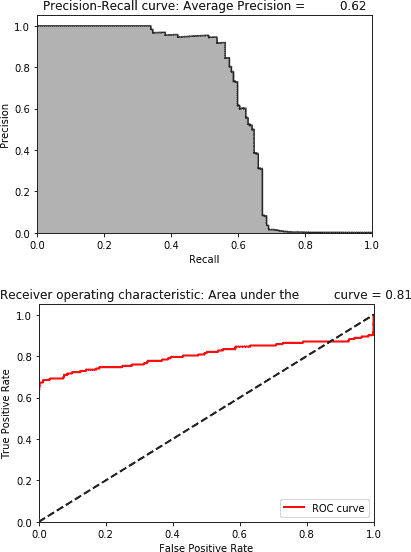
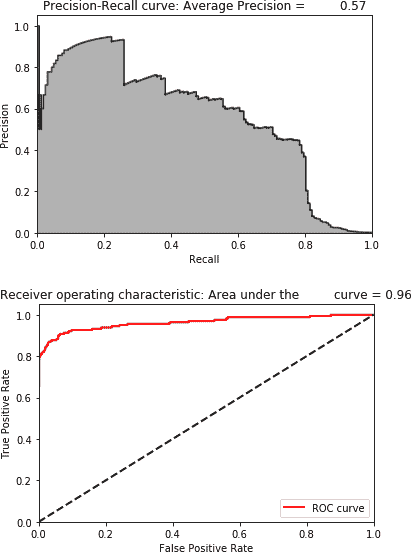
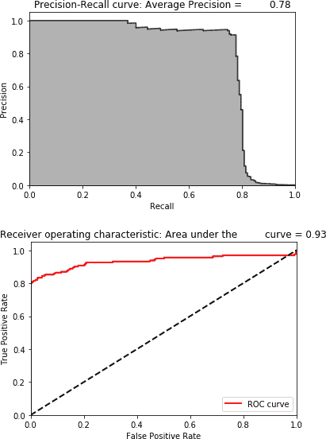

# 第九章. 半监督学习

到目前为止，我们将监督学习和无监督学习视为机器学习的两个独立而不同的分支。当我们的数据集有标签时，适合使用监督学习，当数据集没有标签时，需要使用无监督学习。

在现实世界中，区分并不是那么清晰。数据集通常是部分标记的，我们希望在利用标记集中的信息的同时，有效地标记未标记的观察结果。使用监督学习，我们必须丢弃大多数未标记的数据集。使用无监督学习，我们会有大部分数据可供使用，但不知道如何利用我们拥有的少量标记。

*半监督学习*领域融合了监督学习和无监督学习的优点，利用少量可用标记来揭示数据集的结构并帮助标记其余部分。

在本章中，我们将继续使用信用卡交易数据集来展示半监督学习。

# 数据准备

像之前一样，让我们加载必要的库并准备数据。现在这应该很熟悉了：

```py
'''Main'''
import numpy as np
import pandas as pd
import os, time, re
import pickle, gzip

'''Data Viz'''
import matplotlib.pyplot as plt
import seaborn as sns
color = sns.color_palette()
import matplotlib as mpl

%matplotlib inline

'''Data Prep and Model Evaluation'''
from sklearn import preprocessing as pp
from sklearn.model_selection import train_test_split
from sklearn.model_selection import StratifiedKFold
from sklearn.metrics import log_loss
from sklearn.metrics import precision_recall_curve, average_precision_score
from sklearn.metrics import roc_curve, auc, roc_auc_score

'''Algos'''
import lightgbm as lgb

'''TensorFlow and Keras'''
import tensorflow as tf
import keras
from keras import backend as K
from keras.models import Sequential, Model
from keras.layers import Activation, Dense, Dropout
from keras.layers import BatchNormalization, Input, Lambda
from keras import regularizers
from keras.losses import mse, binary_crossentropy
```

像之前一样，我们将生成一个训练集和一个测试集。但是我们会从训练集中删除 90%的欺诈信用卡交易，以模拟如何处理*部分*有*标记*的数据集。

尽管这看起来可能是一个非常激进的举措，但涉及支付欺诈的真实世界问题同样具有很低的欺诈率（每 10,000 例中可能只有 1 例欺诈）。通过从训练集中删除 90%的标签，我们正在模拟这种现象：

```py
# Load the data
current_path = os.getcwd()
file = '\\datasets\\credit_card_data\\credit_card.csv'
data = pd.read_csv(current_path + file)

dataX = data.copy().drop(['Class','Time'],axis=1)
dataY = data['Class'].copy()

# Scale data
featuresToScale = dataX.columns
sX = pp.StandardScaler(copy=True, with_mean=True, with_std=True)
dataX.loc[:,featuresToScale] = sX.fit_transform(dataX[featuresToScale])

# Split into train and test
X_train, X_test, y_train, y_test = \
    train_test_split(dataX, dataY, test_size=0.33, \
                     random_state=2018, stratify=dataY)

# Drop 95% of the labels from the training set
toDrop = y_train[y_train==1].sample(frac=0.90,random_state=2018)
X_train.drop(labels=toDrop.index,inplace=True)
y_train.drop(labels=toDrop.index,inplace=True)
```

我们还将重用`anomalyScores`和`plotResults`函数：

```py
def anomalyScores(originalDF, reducedDF):
    loss = np.sum((np.array(originalDF) - \
                   np.array(reducedDF))**2, axis=1)
    loss = pd.Series(data=loss,index=originalDF.index)
    loss = (loss-np.min(loss))/(np.max(loss)-np.min(loss))
    return loss
```

```py
def plotResults(trueLabels, anomalyScores, returnPreds = False):
    preds = pd.concat([trueLabels, anomalyScores], axis=1)
    preds.columns = ['trueLabel', 'anomalyScore']
    precision, recall, thresholds = \
        precision_recall_curve(preds['trueLabel'], \
                               preds['anomalyScore'])
    average_precision = average_precision_score( \
                        preds['trueLabel'], preds['anomalyScore'])

    plt.step(recall, precision, color='k', alpha=0.7, where='post')
    plt.fill_between(recall, precision, step='post', alpha=0.3, color='k')

    plt.xlabel('Recall')
    plt.ylabel('Precision')
    plt.ylim([0.0, 1.05])
    plt.xlim([0.0, 1.0])

    plt.title('Precision-Recall curve: Average Precision = \
 {0:0.2f}'.format(average_precision))

    fpr, tpr, thresholds = roc_curve(preds['trueLabel'], \
                                     preds['anomalyScore'])
    areaUnderROC = auc(fpr, tpr)

    plt.figure()
    plt.plot(fpr, tpr, color='r', lw=2, label='ROC curve')
    plt.plot([0, 1], [0, 1], color='k', lw=2, linestyle='--')
    plt.xlim([0.0, 1.0])
    plt.ylim([0.0, 1.05])
    plt.xlabel('False Positive Rate')
    plt.ylabel('True Positive Rate')
    plt.title('Receiver operating characteristic: Area under the \
 curve = {0:0.2f}'.format(areaUnderROC))
    plt.legend(loc="lower right")
    plt.show()

    if returnPreds==True:
        return preds, average_precision
```

最后，这里有一个新函数叫做`precisionAnalysis`，帮助我们在某个召回率水平上评估模型的精度。具体来说，我们将确定模型在测试集中捕捉到 75%的欺诈信用卡交易的精度。精度越高，模型越好。

这是一个合理的基准。换句话说，我们希望能够捕捉到 75%的欺诈行为，并且尽可能高精度。如果我们没有达到足够高的精度，我们将不必要地拒绝良好的信用卡交易，可能会激怒我们的客户群体：

```py
def precisionAnalysis(df, column, threshold):
    df.sort_values(by=column, ascending=False, inplace=True)
    threshold_value = threshold*df.trueLabel.sum()
    i = 0
    j = 0
    while i < threshold_value+1:
        if df.iloc[j]["trueLabel"]==1:
            i += 1
        j += 1
    return df, i/j
```

# 监督模型

为了对我们的半监督模型进行基准测试，让我们先看看单独使用监督模型和无监督模型的效果如何。

我们将从基于轻量梯度提升的监督学习解决方案开始，就像在第二章中表现最佳的那个。我们将使用*k*-折交叉验证来创建五个折叠：

```py
k_fold = StratifiedKFold(n_splits=5,shuffle=True,random_state=2018)
```

接下来，设定梯度提升的参数：

```py
params_lightGB = {
    'task': 'train',
    'application':'binary',
    'num_class':1,
    'boosting': 'gbdt',
    'objective': 'binary',
    'metric': 'binary_logloss',
    'metric_freq':50,
    'is_training_metric':False,
    'max_depth':4,
    'num_leaves': 31,
    'learning_rate': 0.01,
    'feature_fraction': 1.0,
    'bagging_fraction': 1.0,
    'bagging_freq': 0,
    'bagging_seed': 2018,
    'verbose': 0,
    'num_threads':16
}
```

现在，让我们训练算法：

```py
trainingScores = []
cvScores = []
predictionsBasedOnKFolds = pd.DataFrame(data=[], index=y_train.index, \
                                        columns=['prediction'])

for train_index, cv_index in k_fold.split(np.zeros(len(X_train)), \
                                          y_train.ravel()):
    X_train_fold, X_cv_fold = X_train.iloc[train_index,:], \
        X_train.iloc[cv_index,:]
    y_train_fold, y_cv_fold = y_train.iloc[train_index], \
        y_train.iloc[cv_index]

    lgb_train = lgb.Dataset(X_train_fold, y_train_fold)
    lgb_eval = lgb.Dataset(X_cv_fold, y_cv_fold, reference=lgb_train)
    gbm = lgb.train(params_lightGB, lgb_train, num_boost_round=2000,
                   valid_sets=lgb_eval, early_stopping_rounds=200)

    loglossTraining = log_loss(y_train_fold, gbm.predict(X_train_fold, \
                                num_iteration=gbm.best_iteration))
    trainingScores.append(loglossTraining)

    predictionsBasedOnKFolds.loc[X_cv_fold.index,'prediction'] = \
        gbm.predict(X_cv_fold, num_iteration=gbm.best_iteration)
    loglossCV = log_loss(y_cv_fold, \
        predictionsBasedOnKFolds.loc[X_cv_fold.index,'prediction'])
    cvScores.append(loglossCV)

    print('Training Log Loss: ', loglossTraining)
    print('CV Log Loss: ', loglossCV)

loglossLightGBMGradientBoosting = log_loss(y_train, \
        predictionsBasedOnKFolds.loc[:,'prediction'])
print('LightGBM Gradient Boosting Log Loss: ', \
        loglossLightGBMGradientBoosting)
```

现在，我们将使用这个模型来预测信用卡交易测试集上的欺诈行为。

图 9-1 展示了结果。



###### 图 9-1\. 监督模型的结果

基于精度-召回曲线的测试平均精度为 0.62。要捕捉 75%的欺诈案例，我们的精度仅为 0.5%。

# 无监督模型

现在让我们使用无监督学习构建欺诈检测解决方案。具体来说，我们将构建一个稀疏的两层过完备自动编码器，使用线性激活函数。我们将在隐藏层中有 40 个节点，并且 2%的丢失率。

然而，我们将通过*过采样*我们拥有的欺诈案例来调整我们的训练集。过采样是一种用于调整给定数据集中类分布的技术。我们希望向我们的数据集中添加更多的欺诈案例，以便我们训练的自动编码器更容易将正常/非欺诈交易与异常/欺诈交易区分开来。

记住，在从训练集中删除 90%欺诈案例后，我们只剩下 33 个欺诈案例。我们将取这 33 个欺诈案例，复制它们 100 次，然后添加到训练集中。我们还会保留非过采样训练集的副本，以便在机器学习流水线的其余部分使用它们。

记住，我们不会触及测试集——测试集不进行过采样，只有训练集进行过采样：

```py
oversample_multiplier = 100

X_train_original = X_train.copy()
y_train_original = y_train.copy()
X_test_original = X_test.copy()
y_test_original = y_test.copy()

X_train_oversampled = X_train.copy()
y_train_oversampled = y_train.copy()
X_train_oversampled = X_train_oversampled.append( \
        [X_train_oversampled[y_train==1]]*oversample_multiplier, \
        ignore_index=False)
y_train_oversampled = y_train_oversampled.append( \
        [y_train_oversampled[y_train==1]]*oversample_multiplier, \
        ignore_index=False)

X_train = X_train_oversampled.copy()
y_train = y_train_oversampled.copy()
```

现在让我们训练我们的自动编码器：

```py
model = Sequential()
model.add(Dense(units=40, activation='linear', \
                activity_regularizer=regularizers.l1(10e-5), \
                input_dim=29,name='hidden_layer'))
model.add(Dropout(0.02))
model.add(Dense(units=29, activation='linear'))

model.compile(optimizer='adam',
              loss='mean_squared_error',
              metrics=['accuracy'])

num_epochs = 5
batch_size = 32

history = model.fit(x=X_train, y=X_train,
                    epochs=num_epochs,
                    batch_size=batch_size,
                    shuffle=True,
                    validation_split=0.20,
                    verbose=1)

predictions = model.predict(X_test, verbose=1)
anomalyScoresAE = anomalyScores(X_test, predictions)
preds, average_precision = plotResults(y_test, anomalyScoresAE, True)
```

图 9-2 展示了结果。



###### 图 9-2\. 无监督模型的结果

基于精度-召回曲线的测试平均精度为 0.57。要捕捉 75%的欺诈案例，我们的精度仅为 45%。虽然无监督解决方案的平均精度与监督解决方案相似，但在 75%召回率下的 45%精度更佳。

然而，单独的无监督解决方案仍然不是很好。

# 半监督模型

现在，让我们取自动编码器学到的表示（隐藏层），将其与原始训练集结合起来，并将其馈送到梯度提升算法中。这是一种半监督方法，充分利用了监督和无监督学习。

要获取隐藏层，我们从 Keras API 中调用`Model()`类并使用`get_layer`函数：

```py
layer_name = 'hidden_layer'

intermediate_layer_model = Model(inputs=model.input, \
                                 outputs=model.get_layer(layer_name).output)
intermediate_output_train = intermediate_layer_model.predict(X_train_original)
intermediate_output_test = intermediate_layer_model.predict(X_test_original)
```

让我们将这些自动编码器表示存储到 DataFrame 中，然后将它们与原始训练集结合起来：

```py
intermediate_output_trainDF = \
    pd.DataFrame(data=intermediate_output_train,index=X_train_original.index)
intermediate_output_testDF = \
    pd.DataFrame(data=intermediate_output_test,index=X_test_original.index)

X_train = X_train_original.merge(intermediate_output_trainDF, \
                                 left_index=True,right_index=True)
X_test = X_test_original.merge(intermediate_output_testDF, \
                               left_index=True,right_index=True)
y_train = y_train_original.copy()
```

现在我们将在这个新的 69 个特征的训练集上训练梯度提升模型（29 个来自原始数据集，40 个来自自动编码器的表示）：

```py
trainingScores = []
cvScores = []
predictionsBasedOnKFolds = pd.DataFrame(data=[],index=y_train.index, \
                                        columns=['prediction'])

for train_index, cv_index in k_fold.split(np.zeros(len(X_train)), \
                                          y_train.ravel()):
    X_train_fold, X_cv_fold = X_train.iloc[train_index,:], \
        X_train.iloc[cv_index,:]
    y_train_fold, y_cv_fold = y_train.iloc[train_index], \
        y_train.iloc[cv_index]

    lgb_train = lgb.Dataset(X_train_fold, y_train_fold)
    lgb_eval = lgb.Dataset(X_cv_fold, y_cv_fold, reference=lgb_train)
    gbm = lgb.train(params_lightGB, lgb_train, num_boost_round=5000,
                   valid_sets=lgb_eval, early_stopping_rounds=200)

    loglossTraining = log_loss(y_train_fold,
                                gbm.predict(X_train_fold, \
                                num_iteration=gbm.best_iteration))
    trainingScores.append(loglossTraining)

    predictionsBasedOnKFolds.loc[X_cv_fold.index,'prediction'] = \
        gbm.predict(X_cv_fold, num_iteration=gbm.best_iteration)
    loglossCV = log_loss(y_cv_fold, \
            predictionsBasedOnKFolds.loc[X_cv_fold.index,'prediction'])
    cvScores.append(loglossCV)

    print('Training Log Loss: ', loglossTraining)
    print('CV Log Loss: ', loglossCV)

loglossLightGBMGradientBoosting = log_loss(y_train, \
                        predictionsBasedOnKFolds.loc[:,'prediction'])
print('LightGBM Gradient Boosting Log Loss: ', \
                        loglossLightGBMGradientBoosting)
```

图 9-3 展示了结果。



###### 图 9-3\. 半监督模型的结果

基于精度-召回曲线的测试集平均精度为 0.78。这比监督和无监督模型都高出许多。

要捕获 75%的欺诈，我们的精度达到了 92%。这是一个显著的改进。在这种精度水平下，支付处理器应该对拒绝模型标记为潜在欺诈的交易感到放心。不到十分之一会出错，而我们将捕获大约 75%的欺诈行为。

# 监督学习和非监督学习的威力

在这种半监督信用卡欺诈检测解决方案中，监督学习和非监督学习都发挥了重要作用。探索的一种方式是分析最终梯度提升模型发现的最重要的特征是哪些。

让我们从刚刚训练的模型中找出并存储这些特征重要性数值：

```py
featuresImportance = pd.DataFrame(data=list(gbm.feature_importance()), \
                        index=X_train.columns,columns=['featImportance'])
featuresImportance = featuresImportance/featuresImportance.sum()
featuresImportance.sort_values(by='featImportance', \
                               ascending=False,inplace=True)
featuresImportance
```

表 9-1 显示了按降序排列的一些最重要的特征。

表 9-1\. 半监督模型的特征重要性

|  | featImportance |
| --- | --- |
| V28 | 0.047843 |
| Amount | 0.037263 |
| 21 | 0.030244 |
| V21 | 0.029624 |
| V26 | 0.029469 |
| V12 | 0.028334 |
| V27 | 0.028024 |
| 6 | 0.027405 |
| 28 | 0.026941 |
| 36 | 0.024050 |
| 5 | 0.022347 |

正如您在这里所看到的，一些顶级特征是自动编码器学习的隐藏层特征（非“V”特征），而其他特征则是原始数据集的主要成分（“V”特征）以及交易金额。

# 结论

半监督模型击败了独立的监督模型和独立的非监督模型的性能。

我们只是初步探讨了半监督学习的潜力，但这应该有助于从辩论监督和非监督学习之间的选择转变为在寻找最佳应用解决方案中结合监督和非监督学习。
