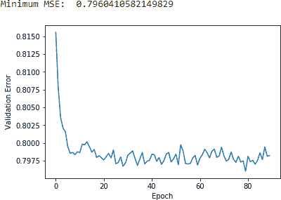
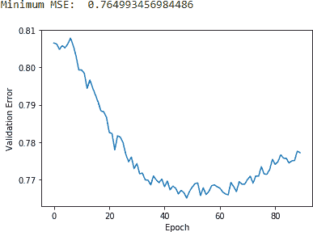
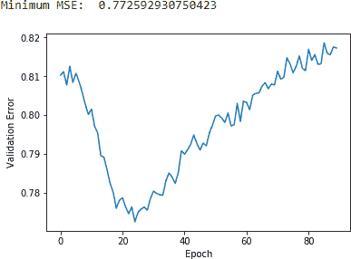
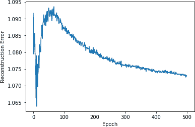

# 第十章。使用受限玻尔兹曼机的推荐系统

在本书的早期，我们使用无监督学习来学习未标记数据中的潜在（隐藏）结构。具体而言，我们进行了降维，将高维数据集减少到具有更少维度的数据集，并构建了异常检测系统。我们还进行了聚类，根据对象彼此之间的相似性或不相似性将它们分组。

现在，我们将进入*生成式无监督模型*，这涉及从原始数据集学习概率分布，并用它对以前未见过的数据进行推断。在后面的章节中，我们将使用这些模型生成看似真实的数据，有时几乎无法与原始数据区分开来。

到目前为止，我们主要研究了*判别模型*，这些模型根据算法从数据中学到的内容来分离观察结果；这些判别模型不会从数据中学习概率分布。判别模型包括监督学习模型，如逻辑回归和决策树（来自第二章），以及聚类方法，如*k*-均值和层次聚类（来自第五章）。

让我们从最简单的生成式无监督模型开始，即*受限玻尔兹曼机*。

# 玻尔兹曼机

*玻尔兹曼机*最早由 Geoffrey Hinton（当时是卡内基梅隆大学的教授，现在是深度学习运动的先驱之一，多伦多大学的教授，以及谷歌的机器学习研究员）和 Terry Sejnowski（当时是约翰霍普金斯大学的教授）于 1985 年发明。

玻尔兹曼机——无限制型——由具有输入层和一个或多个隐藏层的神经网络组成。神经网络中的神经元或单元根据训练中输入的数据和玻尔兹曼机试图最小化的成本函数，做出是否启动的随机决策。通过这种训练，玻尔兹曼机发现数据的有趣特征，有助于模拟数据中复杂的潜在关系和模式。

然而，这些无限制的玻尔兹曼机使用神经网络，其中神经元不仅连接到其他层中的神经元，而且连接到同一层中的神经元。这与许多隐藏层的存在一起，使得无限制的玻尔兹曼机的训练效率非常低。由于这个原因，无限制的玻尔兹曼机在 20 世纪 80 年代和 90 年代几乎没有商业成功。

## 受限玻尔兹曼机

在 2000 年代，Geoffrey Hinton 等人开始通过使用修改后的原始无限制玻尔兹曼机取得商业成功。这些*受限玻尔兹曼机（RBM）*具有一个输入层（也称为*可见层*）和一个单独的隐藏层，神经元之间的连接受限，使得神经元仅连接到其他层的神经元，而不连接同一层的神经元。换句话说，没有可见-可见的连接和隐藏-隐藏的连接。¹

Geoffrey Hinton 还展示了这样简单的受限玻尔兹曼机（RBM）可以堆叠在一起，以便一个 RBM 的隐藏层的输出可以被馈送到另一个 RBM 的输入层。这种 RBM 堆叠可以多次重复，以逐步学习原始数据更细致的隐藏表示。这种多个 RBM 组成的网络可以看作是一个深层、多层次的神经网络模型——因此，深度学习领域从 2006 年开始蓬勃发展。

注意，RBM 使用*随机*方法来学习数据的潜在结构，而例如自编码器则使用*确定性*方法。

# 推荐系统

在本章中，我们将使用 RBM 构建一个*推荐系统*，这是迄今为止最成功的机器学习应用之一，在行业中广泛用于帮助预测用户对电影、音乐、书籍、新闻、搜索、购物、数字广告和在线约会的偏好。

推荐系统有两大主要类别——*协同过滤*推荐系统和*基于内容*的推荐系统。协同过滤涉及根据用户的过去行为以及与用户相似的其他用户的行为来构建推荐系统。这种推荐系统可以预测用户可能感兴趣的项目，即使用户从未明确表达过兴趣。Netflix 上的电影推荐就依赖于协同过滤。

基于内容的过滤涉及学习一个项目的独特属性，以推荐具有类似属性的其他项目。Pandora 上的音乐推荐就依赖于基于内容的过滤。

## 协同过滤

基于内容的过滤并不常用，因为学习项目的独特属性是一个相当困难的任务——目前人工机器很难达到这种理解水平。收集和分析大量关于用户行为和偏好的信息，并基于此进行预测，要容易得多。因此，协同过滤更广泛地被使用，也是我们这里将重点关注的推荐系统类型。

协同过滤不需要了解底层物品本身。相反，协同过滤假设在过去达成一致的用户将来也会达成一致，并且用户的偏好随时间保持稳定。通过建模用户与其他用户的相似性，协同过滤可以进行相当强大的推荐。此外，协同过滤不必依赖于*显式数据*（即用户提供的评分）。相反，它可以使用*隐式数据*，例如用户观看或点击特定项目的时间长短或频率来推断用户的喜好和厌恶。例如，过去 Netflix 要求用户对电影进行评分，但现在使用用户的隐式行为来推断用户的喜好和厌恶。

然而，协同过滤也存在其挑战。首先，它需要大量用户数据来进行良好的推荐。其次，这是一个非常计算密集的任务。第三，数据集通常非常稀疏，因为用户只对可能物品宇宙中的一小部分物品展现了偏好。假设我们有足够的数据，我们可以使用技术来处理数据的稀疏性并高效解决这个问题，我们将在本章中进行讨论。

## Netflix 奖励

2006 年，Netflix 赞助了一场为期三年的比赛，旨在改进其电影推荐系统。该公司向那支能将其现有推荐系统的准确性提高至少 10%的团队提供了 100 万美元的大奖。它还发布了一个包含超过 1 亿部电影评分的数据集。2009 年 9 月，BellKor 的 Pramatic Chaos 团队赢得了这一奖项，他们使用了多种不同算法方法的集成。

这样一场备受关注的比赛，拥有丰富的数据集和有意义的奖金，激励了机器学习社区，并推动了推荐系统研究的实质性进展，为工业界在过去几年里开发出更好的推荐系统铺平了道路。

在本章中，我们将使用一个类似的电影评分数据集来构建我们自己的推荐系统，使用 RBM（Restricted Boltzmann Machines）。

# MovieLens 数据集

不同于 Netflix 的 1 亿条评分数据集，我们将使用一个更小的电影评分数据集，称为*MovieLens 20M 数据集*，由明尼苏达大学双城分校计算机科学与工程系的研究实验室 GroupLens 提供。该数据集包含了从 1995 年 1 月 9 日到 2015 年 3 月 31 日，138,493 位用户对 27,278 部电影进行的 20,000,263 次评分。我们将随机选择至少评分了 20 部电影的用户子集。

这个数据集比 Netflix 的 1 亿条评分数据集更易于处理。由于文件大小超过了 100 兆字节，该文件在 GitHub 上不可访问。您需要直接从[MovieLens 网站](http://bit.ly/2G0ZHCn)下载该文件。

## 数据准备

如前所述，让我们加载必要的库：

```py
'''Main'''
import numpy as np
import pandas as pd
import os, time, re
import pickle, gzip, datetime

'''Data Viz'''
import matplotlib.pyplot as plt
import seaborn as sns
color = sns.color_palette()
import matplotlib as mpl

%matplotlib inline

'''Data Prep and Model Evaluation'''
from sklearn import preprocessing as pp
from sklearn.model_selection import train_test_split
from sklearn.model_selection import StratifiedKFold
from sklearn.metrics import log_loss
from sklearn.metrics import precision_recall_curve, average_precision_score
from sklearn.metrics import roc_curve, auc, roc_auc_score, mean_squared_error

'''Algos'''
import lightgbm as lgb

'''TensorFlow and Keras'''
import tensorflow as tf
import keras
from keras import backend as K
from keras.models import Sequential, Model
from keras.layers import Activation, Dense, Dropout
from keras.layers import BatchNormalization, Input, Lambda
from keras import regularizers
from keras.losses import mse, binary_crossentropy
```

接下来，我们将加载评分数据集并将字段转换为适当的数据类型。我们只有几个字段。用户 ID，电影 ID，用户为电影提供的评分，以及提供评分的时间戳：

```py
# Load the data
current_path = os.getcwd()
file = '\\datasets\\movielens_data\\ratings.csv'
ratingDF = pd.read_csv(current_path + file)

# Convert fields into appropriate data types
ratingDF.userId = ratingDF.userId.astype(str).astype(int)
ratingDF.movieId = ratingDF.movieId.astype(str).astype(int)
ratingDF.rating = ratingDF.rating.astype(str).astype(float)
ratingDF.timestamp = ratingDF.timestamp.apply(lambda x: \
                datetime.utcfromtimestamp(x).strftime('%Y-%m-%d %H:%M:%S'))
```

表 10-1 展示了数据的部分视图。

表 10-1. MovieLens 评分数据

|  | 用户 ID | 电影 ID | 评分 | 时间戳 |
| --- | --- | --- | --- | --- |
| 0 | 1 | 2 | 3.5 | 2005-04-02 23:53:47 |
| 1 | 1 | 29 | 3.5 | 2005-04-02 23:31:16 |
| 2 | 1 | 32 | 3.5 | 2005-04-02 23:33:39 |
| 3 | 1 | 47 | 3.5 | 2005-04-02 23:32:07 |
| 4 | 1 | 50 | 3.5 | 2005-04-02 23:29:40 |
| 5 | 1 | 112 | 3.5 | 2004-09-10 03:09:00 |
| 6 | 1 | 151 | 4.0 | 2004-09-10 03:08:54 |
| 7 | 1 | 223 | 4.0 | 2005-04-02 23:46:13 |
| 8 | 1 | 253 | 4.0 | 2005-04-02 23:35:40 |
| 9 | 1 | 260 | 4.0 | 2005-04-02 23:33:46 |
| 10 | 1 | 293 | 4.0 | 2005-04-02 23:31:43 |
| 11 | 1 | 296 | 4.0 | 2005-04-02 23:32:47 |
| 12 | 1 | 318 | 4.0 | 2005-04-02 23:33:18 |
| 13 | 1 | 337 | 3.5 | 2004-09-10 03:08:29 |

让我们确认唯一用户数、唯一电影数和总评分数，还将计算用户提供的平均评分数量：

```py
n_users = ratingDF.userId.unique().shape[0]
n_movies = ratingDF.movieId.unique().shape[0]
n_ratings = len(ratingDF)
avg_ratings_per_user = n_ratings/n_users

print('Number of unique users: ', n_users)
print('Number of unique movies: ', n_movies)
print('Number of total ratings: ', n_ratings)
print('Average number of ratings per user: ', avg_ratings_per_user)
```

数据正如我们所预期的那样：

```py
Number of unique users: 138493
Number of unique movies: 26744
Number of total ratings: 20000263
Average number of ratings per user: 144.4135299257002
```

为了减少这个数据集的复杂性和大小，让我们集中于排名前一千的电影。这将把评分数从约 20 百万减少到约 12.8 百万。

```py
movieIndex = ratingDF.groupby("movieId").count().sort_values(by= \
                "rating",ascending=False)[0:1000].index
ratingDFX2 = ratingDF[ratingDF.movieId.isin(movieIndex)]
ratingDFX2.count()
```

我们还将随机抽取一千名用户的样本，并仅过滤这些用户的数据集。这将把评分数从约 12.8 百万减少到 90,213 个。这个数量足以展示协同过滤的效果：

```py
userIndex = ratingDFX2.groupby("userId").count().sort_values(by= \
    "rating",ascending=False).sample(n=1000, random_state=2018).index
ratingDFX3 = ratingDFX2[ratingDFX2.userId.isin(userIndex)]
ratingDFX3.count()
```

同样，让我们重新索引`movieID`和`userID`到 1 到 1,000 的范围内，用于我们的简化数据集：

```py
movies = ratingDFX3.movieId.unique()
moviesDF = pd.DataFrame(data=movies,columns=['originalMovieId'])
moviesDF['newMovieId'] = moviesDF.index+1

users = ratingDFX3.userId.unique()
usersDF = pd.DataFrame(data=users,columns=['originalUserId'])
usersDF['newUserId'] = usersDF.index+1

ratingDFX3 = ratingDFX3.merge(moviesDF,left_on='movieId', \
                              right_on='originalMovieId')
ratingDFX3.drop(labels='originalMovieId', axis=1, inplace=True)

ratingDFX3 = ratingDFX3.merge(usersDF,left_on='userId', \
                              right_on='originalUserId')
ratingDFX3.drop(labels='originalUserId', axis=1, inplace=True)
```

让我们计算我们简化数据集中的唯一用户数、唯一电影数、总评分数以及每个用户的平均评分数量：

```py
n_users = ratingDFX3.userId.unique().shape[0]
n_movies = ratingDFX3.movieId.unique().shape[0]
n_ratings = len(ratingDFX3)
avg_ratings_per_user = n_ratings/n_users

print('Number of unique users: ', n_users)
print('Number of unique movies: ', n_movies)
print('Number of total ratings: ', n_ratings)
print('Average number of ratings per user: ', avg_ratings_per_user)
```

结果如预期：

```py
Number of unique users: 1000
Number of unique movies: 1000
Number of total ratings: 90213
Average number of ratings per user: 90.213
```

让我们从这个简化的数据集中生成一个测试集和一个验证集，使得每个留出集占简化数据集的 5%：

```py
X_train, X_test = train_test_split(ratingDFX3,
 test_size=0.10, shuffle=True, random_state=2018)

X_validation, X_test = train_test_split(X_test,
 test_size=0.50, shuffle=True, random_state=2018)
```

下面显示了训练集、验证集和测试集的大小：

```py
Size of train set: 81191
Size of validation set: 4511
Size of test set: 4511
```

## 定义成本函数：均方误差

现在我们已经准备好处理这些数据了。

首先，让我们创建一个*m* x *n*的矩阵，其中*m*是用户数，*n*是电影数。这将是一个稀疏填充的矩阵，因为用户只对电影的一小部分进行评分。例如，一个拥有一千个用户和一千部电影的矩阵在训练集中只有 81,191 个评分。如果每个一千个用户都对每一千部电影进行评分，我们将得到一个百万个评分的矩阵，但是平均而言用户只对少数电影进行评分，因此我们在训练集中只有 81,191 个评分。其余的值（矩阵中近 92%的值）将为零：

```py
# Generate ratings matrix for train
ratings_train = np.zeros((n_users, n_movies))
for row in X_train.itertuples():
    ratings_train[row[6]-1, row[5]-1] = row[3]

# Calculate sparsity of the train ratings matrix
sparsity = float(len(ratings_train.nonzero()[0]))
sparsity /= (ratings_train.shape[0] * ratings_train.shape[1])
sparsity *= 100
print('Sparsity: {:4.2f}%'.format(sparsity))
```

我们将为验证集和测试集生成类似的矩阵，它们会更加稀疏，当然：

```py
# Generate ratings matrix for validation
ratings_validation = np.zeros((n_users, n_movies))
for row in X_validation.itertuples():
    ratings_validation[row[6]-1, row[5]-1] = row[3]

# Generate ratings matrix for test
ratings_test = np.zeros((n_users, n_movies))
for row in X_test.itertuples():
    ratings_test[row[6]-1, row[5]-1] = row[3]
```

在构建推荐系统之前，让我们定义我们将用来评判模型好坏的成本函数。我们将使用*均方误差（MSE）*，这是机器学习中最简单的成本函数之一。MSE 测量了预测值与实际值之间的平均平方误差。要计算 MSE，我们需要两个大小为*[n,1]*的向量，其中*n*是我们正在预测评分的数量 —— 对于验证集是 4,511。一个向量包含实际评分，另一个向量包含预测值。

让我们首先将验证集中带有评分的稀疏矩阵展平。这将是实际评分的向量：

```py
actual_validation = ratings_validation[ratings_validation.nonzero()].flatten()
```

## 进行基准实验

作为基准，让我们预测验证集的平均评分为 3.5，并计算 MSE：

```py
pred_validation = np.zeros((len(X_validation),1))
pred_validation[pred_validation==0] = 3.5
pred_validation

mean_squared_error(pred_validation, actual_validation)
```

这种非常天真预测的 MSE 是 1.05。这是我们的基准：

```py
Mean squared error using naive prediction: 1.055420084238528
```

让我们看看是否可以通过预测用户对给定电影的评分来改善结果，基于该用户对所有其他电影的平均评分：

```py
ratings_validation_prediction = np.zeros((n_users, n_movies))
i = 0
for row in ratings_train:
    ratings_validation_prediction[i][ratings_validation_prediction[i]==0] \
        = np.mean(row[row>0])
    i += 1

pred_validation = ratings_validation_prediction \
    [ratings_validation.nonzero()].flatten()
user_average = mean_squared_error(pred_validation, actual_validation)
print('Mean squared error using user average:', user_average)
```

均方误差（MSE）改善到 0.909：

```py
Mean squared error using user average: 0.9090717929472647
```

现在，让我们基于所有其他用户对该电影的平均评分来预测用户对给定电影的评分：

```py
ratings_validation_prediction = np.zeros((n_users, n_movies)).T
i = 0
for row in ratings_train.T:
    ratings_validation_prediction[i][ratings_validation_prediction[i]==0] \
        = np.mean(row[row>0])
    i += 1

ratings_validation_prediction = ratings_validation_prediction.T
pred_validation = ratings_validation_prediction \
    [ratings_validation.nonzero()].flatten()
movie_average = mean_squared_error(pred_validation, actual_validation)
print('Mean squared error using movie average:', movie_average)
```

这种方法的 MSE 为 0.914，与使用用户平均值发现的 MSE 类似：

```py
Mean squared error using movie average: 0.9136057106858655
```

# 矩阵分解

在使用 RBM 构建推荐系统之前，让我们首先使用*矩阵分解*来构建一个。矩阵分解将用户-物品矩阵分解为两个较低维度矩阵的乘积。用户在较低维度潜在空间中表示，物品也是如此。

假设我们的用户-物品矩阵是 *R*，有 *m* 个用户和 *n* 个物品。矩阵分解将创建两个较低维度的矩阵，*H* 和 *W*。*H* 是一个 "*m* 用户" x "*k* 潜在因子" 的矩阵，*W* 是一个 "*k* 潜在因子" x "*n* 物品" 的矩阵。

评分通过矩阵乘法计算：*R* = *H__W*。

*k* 潜在因子的数量决定了模型的容量。*k* 越高，模型的容量越大。通过增加*k*，我们可以提高对用户评分预测的个性化能力，但如果*k*过高，模型将过度拟合数据。

所有这些对你来说应该是熟悉的。矩阵分解学习了用户和物品在较低维度空间中的表示，并基于新学到的表示进行预测。

## 一个潜在因子

让我们从最简单的矩阵分解形式开始 —— 只使用一个潜在因子。我们将使用 Keras 来执行我们的矩阵分解。

首先，我们需要定义图表。输入是用户嵌入的一维向量和电影嵌入的一维向量。我们将这些输入向量嵌入到一个潜在空间中，然后展平它们。为了生成输出向量 *product*，我们将采用电影向量和用户向量的点积。我们将使用 *Adam 优化器* 来最小化我们的损失函数，该损失函数定义为 `mean_squared_error`：

```py
n_latent_factors = 1

user_input = Input(shape=[1], name='user')
user_embedding = Embedding(input_dim=n_users + 1, output_dim=n_latent_factors,
 name='user_embedding')(user_input)
user_vec = Flatten(name='flatten_users')(user_embedding)

movie_input = Input(shape=[1], name='movie')
movie_embedding = Embedding(input_dim=n_movies + 1, output_dim=n_latent_factors,
 name='movie_embedding')(movie_input)
movie_vec = Flatten(name='flatten_movies')(movie_embedding)

product = dot([movie_vec, user_vec], axes=1)
model = Model(inputs=[user_input, movie_input], outputs=product)
model.compile('adam', 'mean_squared_error')
```

让我们通过训练集中的用户和电影向量来训练模型。我们还将在训练过程中对验证集进行评估。我们将根据实际评分计算 MSE。

我们将训练一百个 epochs，并记录训练和验证结果的历史。让我们也来绘制结果：

```py
history = model.fit(x=[X_train.newUserId, X_train.newMovieId], \
                    y=X_train.rating, epochs=100, \
                    validation_data=([X_validation.newUserId, \
                    X_validation.newMovieId], X_validation.rating), \
                    verbose=1)

pd.Series(history.history['val_loss'][10:]).plot(logy=False)
plt.xlabel("Epoch")
plt.ylabel("Validation Error")
print('Minimum MSE: ', min(history.history['val_loss']))
```

图 10-1 展示了结果。



###### 图 10-1\. 使用矩阵因子化和一个潜在因子的验证 MSE 图

使用矩阵因子化和一个潜在因子的最小 MSE 为 0.796。这比之前的用户平均和电影平均方法更好。

看看我们是否可以通过增加潜在因子的数量（即模型的容量）来进一步改进。

## 三个潜在因子

图 10-2 展示了使用三个潜在因子的结果。



###### 图 10-2\. 使用矩阵因子化和三个潜在因子的验证 MSE 图

最小 MSE 为 0.765，比使用一个潜在因子更好。

## 五个潜在因子

现在让我们构建一个使用五个潜在因子的矩阵因子化模型（参见 图 10-3 的结果）。



###### 图 10-3\. 使用矩阵因子化和五个潜在因子的验证 MSE 图

最小 MSE 未能改进，在前 25 个 epochs 左右明显出现过拟合迹象。验证误差下降然后开始增加。增加矩阵因子化模型的容量将不会帮助太多。

# 使用 RBM 进行协同过滤

让我们再次回到 RBM。回想一下，RBM 有两层——输入/可见层和隐藏层。每一层中的神经元与另一层中的神经元进行通信，但不与同一层中的神经元进行通信。换句话说，神经元之间没有同层通信——这就是 RBM 中“限制”的一部分。

RBM 的另一个重要特征是层之间的通信是双向的，而不仅仅是单向的。例如，对于自编码器，神经元只能通过前向传递与下一层通信。

使用 RBM，可见层中的神经元与隐藏层通信，然后隐藏层将信息传回可见层，来回多次交换。 RBM 执行此通信——在可见层和隐藏层之间来回传递——以开发生成模型，使得从隐藏层输出的重构与原始输入相似。

换句话说，RBM 正在尝试创建一个生成模型，该模型将根据用户评分的电影之间的相似性以及用户与其他评分该电影的用户的相似性，帮助预测用户是否会喜欢用户从未看过的电影。

可见层将有 X 个神经元，其中 X 是数据集中电影的数量。 每个神经元将具有从零到一的归一化评分值，其中零表示用户未看过电影。 归一化评分值越接近一，表示用户越喜欢神经元表示的电影。

可见层中的神经元将与隐藏层中的神经元通信，后者将试图学习表征用户-电影偏好的潜在特征。

注意，RBM 也被称为*对称的二分图、双向图*——对称是因为每个可见节点与每个隐藏节点相连，二分是因为有两层节点，双向是因为通信是双向的。

## RBM 神经网络架构

对于我们的电影推荐系统，我们有一个*m* x *n*矩阵，其中*m*为用户数，*n*为电影数。 要训练 RBM，我们将一批*k*用户及其*n*电影评分传递到神经网络，并训练一定数量的*epochs*。

每个传入神经网络的输入*x*表示单个用户对所有*n*部电影的评分偏好，例如，我们的示例中*n*为一千。 因此，可见层有*n*个节点，每个节点对应一个电影。

我们可以指定隐藏层中节点的数量，通常比可见层中的节点少，以尽可能有效地让隐藏层学习原始输入的最显著方面。

每个输入*v0*都与其相应的权重*W*相乘。 权重是从可见层到隐藏层的连接学习的。 然后我们在隐藏层添加一个称为*hb*的偏置向量。 偏置确保至少有一些神经元会激活。 这个*W*v0+hb*结果通过激活函数传递。

之后，我们将通过一种称为*Gibbs sampling*的过程对生成的输出样本进行采样。 换句话说，隐藏层的激活结果以随机方式生成最终输出。 这种随机性有助于构建性能更好、更强大的生成模型。

接下来，吉布斯采样后的输出—称为*h0*—通过神经网络反向传播回去，进行所谓的*反向传播*。在反向传播中，吉布斯采样后的前向传播中的激活被馈送到隐藏层，并与之前相同的权重*W*相乘。然后我们在可见层添加一个新的称为*vb*的偏置向量。

这个*W_h0+vb*通过激活函数传递，并进行吉布斯采样。这个输出是*v1*，然后作为新的输入传递到可见层和神经网络中，进行另一次前向传播。

RBM 通过一系列前向和反向传播的步骤来学习最优权重，试图构建一个健壮的生成模型。RBM 是我们探索的第一种*生成学习*模型。通过执行吉布斯采样和通过前向和反向传播重新训练权重，RBM 试图学习原始输入的*概率分布*。具体来说，RBM 最小化*Kullback–Leibler 散度*，该散度用于衡量一个概率分布与另一个之间的差异；在这种情况下，RBM 最小化原始输入的概率分布与重建数据的概率分布之间的差异。

通过迭代调整神经网络中的权重，受限玻尔兹曼机（RBM）学习尽可能地逼近原始数据。

通过这个新学习到的概率分布，RBM 能够对以前未见过的数据进行预测。在这种情况下，我们设计的 RBM 将尝试基于用户与其他用户的相似性及其他用户对这些电影的评分来预测用户从未看过的电影的评分。

## 构建 RBM 类的组件

首先，我们将用几个参数初始化这个类；这些参数包括 RBM 的输入大小、输出大小、学习率、训练时的周期数以及训练过程中的批处理大小。

我们还将创建用于权重矩阵、隐藏偏置向量和可见偏置向量的零矩阵： 

```py
# Define RBM class
class RBM(object):

    def __init__(self, input_size, output_size,
                 learning_rate, epochs, batchsize):
        # Define hyperparameters
        self._input_size = input_size
        self._output_size = output_size
        self.learning_rate = learning_rate
        self.epochs = epochs
        self.batchsize = batchsize

        # Initialize weights and biases using zero matrices
        self.w = np.zeros([input_size, output_size], "float")
        self.hb = np.zeros([output_size], "float")
        self.vb = np.zeros([input_size], "float")
```

接下来，让我们定义前向传播、反向传播和在这些传播过程中数据抽样的函数。

这里是前向传播，其中*h*是隐藏层，*v*是可见层：

```py
def prob_h_given_v(self, visible, w, hb):
    return tf.nn.sigmoid(tf.matmul(visible, w) + hb)
```

这里是反向传播的过程：

```py
def prob_v_given_h(self, hidden, w, vb):
    return tf.nn.sigmoid(tf.matmul(hidden, tf.transpose(w)) + vb)
```

这里是抽样函数的定义：

```py
def sample_prob(self, probs):
    return tf.nn.relu(tf.sign(probs - tf.random_uniform(tf.shape(probs))))
```

现在我们需要一个函数来执行训练。由于我们使用 TensorFlow，我们首先需要为 TensorFlow 图创建占位符，在我们将数据馈送到 TensorFlow 会话中时使用。

我们将为权重矩阵、隐藏偏置向量和可见偏置向量创建占位符。我们还需要用零初始化这三者的值。此外，我们需要一个集合来保存当前值和一个集合来保存先前的值：

```py
_w = tf.placeholder("float", [self._input_size, self._output_size])
_hb = tf.placeholder("float", [self._output_size])
_vb = tf.placeholder("float", [self._input_size])

prv_w = np.zeros([self._input_size, self._output_size], "float")
prv_hb = np.zeros([self._output_size], "float")
prv_vb = np.zeros([self._input_size], "float")

cur_w = np.zeros([self._input_size, self._output_size], "float")
cur_hb = np.zeros([self._output_size], "float")
cur_vb = np.zeros([self._input_size], "float")
```

同样，我们需要一个可见层的占位符。隐藏层是从可见层和权重矩阵的矩阵乘法以及隐藏偏置向量的矩阵加法导出的：

```py
v0 = tf.placeholder("float", [None, self._input_size])
h0 = self.sample_prob(self.prob_h_given_v(v0, _w, _hb))
```

在反向传播期间，我们取隐藏层输出，与正向传播期间使用的权重矩阵的转置相乘，并加上可见偏置向量。请注意，权重矩阵在正向和反向传播期间是相同的。然后，我们再次执行正向传播：

```py
v1 = self.sample_prob(self.prob_v_given_h(h0, _w, _vb))
h1 = self.prob_h_given_v(v1, _w, _hb)
```

要更新权重，我们执行对比散度[²]。

我们还将误差定义为 MSE。

```py
positive_grad = tf.matmul(tf.transpose(v0), h0)
negative_grad = tf.matmul(tf.transpose(v1), h1)

update_w = _w + self.learning_rate * \
    (positive_grad - negative_grad) / tf.to_float(tf.shape(v0)[0])
update_vb = _vb +  self.learning_rate * tf.reduce_mean(v0 - v1, 0)
update_hb = _hb +  self.learning_rate * tf.reduce_mean(h0 - h1, 0)

err = tf.reduce_mean(tf.square(v0 - v1))
```

有了这些，我们可以使用刚刚定义的变量初始化 TensorFlow 会话。

一旦我们调用*sess.run*，我们可以输入数据批次开始训练。在训练过程中，将进行前向和反向传播，并根据生成数据与原始输入的比较更新 RBM 权重。我们将打印每个 epoch 的重构误差。

```py
with tf.Session() as sess:
 sess.run(tf.global_variables_initializer())

 for epoch in range(self.epochs):
     for start, end in zip(range(0, len(X),
      self.batchsize),range(self.batchsize,len(X), self.batchsize)):
         batch = X[start:end]
         cur_w = sess.run(update_w, feed_dict={v0: batch,
          _w: prv_w, _hb: prv_hb, _vb: prv_vb})
         cur_hb = sess.run(update_hb, feed_dict={v0: batch,
          _w: prv_w, _hb: prv_hb, _vb: prv_vb})
         cur_vb = sess.run(update_vb, feed_dict={v0: batch,
          _w: prv_w, _hb: prv_hb, _vb: prv_vb})
         prv_w = cur_w
         prv_hb = cur_hb
         prv_vb = cur_vb
     error = sess.run(err, feed_dict={v0: X,
      _w: cur_w, _vb: cur_vb, _hb: cur_hb})
     print ('Epoch: %d' % epoch,'reconstruction error: %f' % error)
 self.w = prv_w
 self.hb = prv_hb
 self.vb = prv_vb
```

## 训练 RBM 推荐系统

要训练 RBM，让我们从`ratings_train`创建一个名为`inputX`的 NumPy 数组，并将这些值转换为 float32。我们还将定义 RBM 以接受一千维的输入，输出一千维的输出，使用学习率为 0.3，训练五百个 epoch，并使用批量大小为两百。这些参数只是初步的参数选择；您应该通过实验找到更优的参数，鼓励进行实验：

```py
# Begin the training cycle

# Convert inputX into float32
inputX = ratings_train
inputX = inputX.astype(np.float32)

# Define the parameters of the RBMs we will train
rbm=RBM(1000,1000,0.3,500,200)
```

让我们开始训练：

```py
rbm.train(inputX)
outputX, reconstructedX, hiddenX = rbm.rbm_output(inputX)
```

图 10-4 显示了重构误差的图。



###### 图 10-4\. RBM 错误图

长时间训练后，误差项通常会减少。

现在让我们将开发的 RBM 模型应用于预测验证集中用户的评分（该验证集与训练集中的用户相同）：

```py
# Predict ratings for validation set
inputValidation = ratings_validation
inputValidation = inputValidation.astype(np.float32)

finalOutput_validation, reconstructedOutput_validation, _ = \
    rbm.rbm_output(inputValidation)
```

接下来，让我们将预测转换为数组，并根据真实验证评分计算 MSE：

```py
predictionsArray = reconstructedOutput_validation
pred_validation = \
    predictionsArray[ratings_validation.nonzero()].flatten()
actual_validation = \
    ratings_validation[ratings_validation.nonzero()].flatten()

rbm_prediction = mean_squared_error(pred_validation, actual_validation)
print('Mean squared error using RBM prediction:', rbm_prediction)
```

以下代码显示了验证集上的 MSE：

```py
Mean squared error using RBM prediction: 9.331135003325205
```

这个 MSE 是一个起点，随着更多的实验，可能会有所改进。

# 结论

在本章中，我们探讨了受限玻尔兹曼机，并用它们构建了一个电影评分的推荐系统。我们构建的 RBM 推荐系统学习了给定用户之前评分和他们最相似用户的评分情况下电影评分的概率分布。然后，我们使用学习的概率分布来预测以前未见的电影的评分。

在第十一章，我们将堆叠 RBM 以构建深度信念网络，并使用它们执行更强大的无监督学习任务。

¹ 这类 RBM 的最常见训练算法被称为基于梯度的对比散度算法。

² 更多关于这个主题的内容，请参阅论文[“对比散度学习”](http://bit.ly/2RukFuX)。
