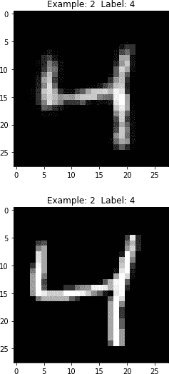

# 第十一章：使用深度信念网络进行特征检测

在第十章中，我们探索了限制玻尔兹曼机并使用它们构建了一个电影评分的推荐系统。在本章中，我们将堆叠 RBM 构建*深度信念网络（DBNs）*。DBNs 是由多伦多大学的杰弗·辛顿于 2006 年首次提出的。

RBM 只有两层，一个可见层和一个隐藏层；换句话说，RBM 只是浅层神经网络。DBN 由多个 RBM 组成——一个 RBM 的隐藏层作为下一个 RBM 的可见层。因为它们涉及许多层，所以 DBN 是深度神经网络。事实上，它们是我们迄今为止介绍的第一种深度无监督神经网络。

浅层无监督神经网络，比如 RBM，不能捕获图像、声音和文本等复杂数据的结构，但 DBN 可以。DBN 已被用于识别和聚类图像、视频捕获、声音和文本，尽管过去十年中其他深度学习方法在性能上已超过了 DBN。

# 深度信念网络详解

与 RBM 一样，DBN 可以学习输入的基本结构并以概率方式重构它。换句话说，DBN——就像 RBM 一样——是生成模型。而且，与 RBM 一样，DBN 中的层之间只有连接，但每一层内部的单元之间没有连接。

在 DBN 中，一次训练一层，从第一个隐藏层开始，它与输入层一起组成第一个 RBM。一旦训练了第一个 RBM，第一个 RBM 的隐藏层将作为下一个 RBM 的可见层，并用于训练 DBN 的第二个隐藏层。

这个过程会一直持续到 DBN 的所有层都被训练完毕。除了 DBN 的第一层和最后一层之外，DBN 中的每一层都既充当了一个隐藏层，也充当了一个 RBM 的可见层。

DBN 是一种表示的层次结构，就像所有神经网络一样，它是一种表示学习形式。请注意，DBN 不使用任何标签。相反，DBN 一次学习输入数据中的一个层的底层结构。

标签可以用来微调 DBN 的最后几层，但只有在初始无监督学习完成后才能这样做。例如，如果我们想要 DBN 成为一个分类器，我们会先进行无监督学习（称为*预训练*过程），然后使用标签微调 DBN（称为*微调*过程）。

# MNIST 图像分类

让我们再次使用 DBN 构建图像分类器。我们将再次使用 MNIST 数据集。

首先，让我们加载必要的库：

```py
'''Main'''
import numpy as np
import pandas as pd
import os, time, re
import pickle, gzip, datetime

'''Data Viz'''
import matplotlib.pyplot as plt
import seaborn as sns
color = sns.color_palette()
import matplotlib as mpl

%matplotlib inline

'''Data Prep and Model Evaluation'''
from sklearn import preprocessing as pp
from sklearn.model_selection import train_test_split
from sklearn.model_selection import StratifiedKFold
from sklearn.metrics import log_loss, accuracy_score
from sklearn.metrics import precision_recall_curve, average_precision_score
from sklearn.metrics import roc_curve, auc, roc_auc_score, mean_squared_error

'''Algos'''
import lightgbm as lgb

'''TensorFlow and Keras'''
import tensorflow as tf
import keras
from keras import backend as K
from keras.models import Sequential, Model
from keras.layers import Activation, Dense, Dropout
from keras.layers import BatchNormalization, Input, Lambda
from keras.layers import Embedding, Flatten, dot
from keras import regularizers
from keras.losses import mse, binary_crossentropy
```

然后我们将加载数据并将其存储在 Pandas DataFrames 中。我们还将将标签编码为 one-hot 向量。这与我们在本书早期介绍 MNIST 数据集时所做的工作类似：

```py
# Load the datasets
current_path = os.getcwd()
file = '\\datasets\\mnist_data\\mnist.pkl.gz'
f = gzip.open(current_path+file, 'rb')
train_set, validation_set, test_set = pickle.load(f, encoding='latin1')
f.close()

X_train, y_train = train_set[0], train_set[1]
X_validation, y_validation = validation_set[0], validation_set[1]
X_test, y_test = test_set[0], test_set[1]

# Create Pandas DataFrames from the datasets
train_index = range(0,len(X_train))
validation_index = range(len(X_train),len(X_train)+len(X_validation))
test_index = range(len(X_train)+len(X_validation), \
                   len(X_train)+len(X_validation)+len(X_test))

X_train = pd.DataFrame(data=X_train,index=train_index)
y_train = pd.Series(data=y_train,index=train_index)

X_validation = pd.DataFrame(data=X_validation,index=validation_index)
y_validation = pd.Series(data=y_validation,index=validation_index)

X_test = pd.DataFrame(data=X_test,index=test_index)
y_test = pd.Series(data=y_test,index=test_index)

def view_digit(X, y, example):
    label = y.loc[example]
    image = X.loc[example,:].values.reshape([28,28])
    plt.title('Example: %d Label: %d' % (example, label))
    plt.imshow(image, cmap=plt.get_cmap('gray'))
    plt.show()

def one_hot(series):
    label_binarizer = pp.LabelBinarizer()
    label_binarizer.fit(range(max(series)+1))
    return label_binarizer.transform(series)

# Create one-hot vectors for the labels
y_train_oneHot = one_hot(y_train)
y_validation_oneHot = one_hot(y_validation)
y_test_oneHot = one_hot(y_test)
```

# 限制玻尔兹曼机

接下来，让我们定义一个 RBM 类，这样我们就可以快速连续训练多个 RBM（它们是 DBN 的构建模块）。

请记住，RBM 具有输入层（也称为可见层）和单个隐藏层，神经元之间的连接受到限制，使得神经元仅连接到其他层中的神经元，而不连接同一层中的神经元。还要记住，层间通信是双向的，不仅是单向的或者像自编码器那样的前向方式。

在 RBM 中，可见层的神经元与隐藏层通信，隐藏层从 RBM 学习的概率模型生成数据，然后隐藏层将这个生成的信息传递回可见层。可见层接收来自隐藏层的生成数据样本，对其进行采样，将其与原始数据进行比较，并根据生成数据样本与原始数据之间的重构误差，向隐藏层发送新信息，以再次重复此过程。

通过这种双向通信方式，RBM 开发了一个生成模型，使得从隐藏层输出的重构数据与原始输入相似。

## 构建 RBM 类的组件

就像我们在第十章中所做的那样，让我们逐步了解`RBM`类的各个组成部分。

首先，我们将使用几个参数来初始化这个类；它们是 RBM 的输入大小、输出大小、学习速率、训练时的时代数以及批处理大小。我们还将创建权重矩阵、隐藏偏置向量和可见偏置向量的零矩阵：

```py
# Define RBM class
class RBM(object):

    def __init__(self, input_size, output_size,
                 learning_rate, epochs, batchsize):
        # Define hyperparameters
        self._input_size = input_size
        self._output_size = output_size
        self.learning_rate = learning_rate
        self.epochs = epochs
        self.batchsize = batchsize

        # Initialize weights and biases using zero matrices
        self.w = np.zeros([input_size, output_size], "float")
        self.hb = np.zeros([output_size], "float")
        self.vb = np.zeros([input_size], "float")
```

接下来，让我们定义正向传递、反向传递以及在每次传递期间对数据进行采样的函数。

这里是正向传递，其中*h*是隐藏层，*v*是可见层：

```py
def prob_h_given_v(self, visible, w, hb):
    return tf.nn.sigmoid(tf.matmul(visible, w) + hb)
```

这里是向后传递：

```py
def prob_v_given_h(self, hidden, w, vb):
    return tf.nn.sigmoid(tf.matmul(hidden, tf.transpose(w)) + vb)
```

这里是采样函数：

```py
def sample_prob(self, probs):
    return tf.nn.relu(tf.sign(probs - tf.random_uniform(tf.shape(probs))))
```

现在我们需要一个执行训练的函数。因为我们使用的是 TensorFlow，所以我们首先需要为 TensorFlow 图创建占位符，当我们将数据提供给 TensorFlow 会话时将使用这些占位符。

我们将为权重矩阵、隐藏偏置向量和可见偏置向量设立占位符。我们还需要使用零初始化这三者的值。并且，我们需要一个集合来保存当前值，另一个集合来保存先前的值：

```py
_w = tf.placeholder("float", [self._input_size, self._output_size])
_hb = tf.placeholder("float", [self._output_size])
_vb = tf.placeholder("float", [self._input_size])

prv_w = np.zeros([self._input_size, self._output_size], "float")
prv_hb = np.zeros([self._output_size], "float")
prv_vb = np.zeros([self._input_size], "float")

cur_w = np.zeros([self._input_size, self._output_size], "float")
cur_hb = np.zeros([self._output_size], "float")
cur_vb = np.zeros([self._input_size], "float")
```

同样地，我们需要一个可见层的占位符。隐藏层是通过可见层和权重矩阵的矩阵乘法以及隐藏偏置向量的矩阵加法派生的：

```py
v0 = tf.placeholder("float", [None, self._input_size])
h0 = self.sample_prob(self.prob_h_given_v(v0, _w, _hb))
```

在向后传递期间，我们获取隐藏层输出，将其与在正向传递期间使用的权重矩阵的转置相乘，并添加可见偏置向量。请注意，权重矩阵在正向和向后传递期间都是相同的。

然后我们再次执行正向传递：

```py
v1 = self.sample_prob(self.prob_v_given_h(h0, _w, _vb))
h1 = self.prob_h_given_v(v1, _w, _hb)
```

要更新权重，我们执行对比散度，我们在 第十章 中介绍过。我们还定义误差为均方误差（MSE）：

```py
positive_grad = tf.matmul(tf.transpose(v0), h0)
negative_grad = tf.matmul(tf.transpose(v1), h1)

update_w = _w + self.learning_rate * \
    (positive_grad - negative_grad) / tf.to_float(tf.shape(v0)[0])
update_vb = _vb +  self.learning_rate * tf.reduce_mean(v0 - v1, 0)
update_hb = _hb +  self.learning_rate * tf.reduce_mean(h0 - h1, 0)

err = tf.reduce_mean(tf.square(v0 - v1))
```

有了这个，我们就可以用刚刚定义的变量初始化 TensorFlow 会话了。

一旦我们调用 `sess.run`，我们就可以提供数据的批次开始训练。在训练过程中，将进行前向和反向传播，并根据生成数据与原始输入的比较更新 RBM 的权重。我们将打印每个周期的重建误差：

```py
with tf.Session() as sess:
    sess.run(tf.global_variables_initializer())

    for epoch in range(self.epochs):
        for start, end in zip(range(0, len(X), self.batchsize), \
                range(self.batchsize,len(X), self.batchsize)):
            batch = X[start:end]
            cur_w = sess.run(update_w, \
                feed_dict={v0: batch, _w: prv_w, \
                           _hb: prv_hb, _vb: prv_vb})
            cur_hb = sess.run(update_hb, \
                feed_dict={v0: batch, _w: prv_w, \
                           _hb: prv_hb, _vb: prv_vb})
            cur_vb = sess.run(update_vb, \
                feed_dict={v0: batch, _w: prv_w, \
                           _hb: prv_hb, _vb: prv_vb})
            prv_w = cur_w
            prv_hb = cur_hb
            prv_vb = cur_vb
        error = sess.run(err, feed_dict={v0: X, _w: cur_w, \
                                        _vb: cur_vb, _hb: cur_hb})
        print ('Epoch: %d' % epoch,'reconstruction error: %f' % error)
    self.w = prv_w
    self.hb = prv_hb
    self.vb = prv_vb
```

## 使用 RBM 模型生成图像

让我们也定义一个函数，从 RBM 学习的生成模型中生成新图像：

```py
def rbm_output(self, X):

    input_X = tf.constant(X)
    _w = tf.constant(self.w)
    _hb = tf.constant(self.hb)
    _vb = tf.constant(self.vb)
    out = tf.nn.sigmoid(tf.matmul(input_X, _w) + _hb)
    hiddenGen = self.sample_prob(self.prob_h_given_v(input_X, _w, _hb))
    visibleGen = self.sample_prob(self.prob_v_given_h(hiddenGen, _w, _vb))
    with tf.Session() as sess:
        sess.run(tf.global_variables_initializer())
        return sess.run(out), sess.run(visibleGen), sess.run(hiddenGen)
```

我们将原始图像矩阵 *X* 输入到函数中。我们为原始图像矩阵、权重矩阵、隐藏偏置向量和可见偏置向量创建 TensorFlow 占位符。然后，我们将输入矩阵推送以产生正向传播的输出（`out`）、隐藏层的样本生成（`hiddenGen`）以及模型生成的重建图像的样本（`visibleGen`）。

## 查看中间特征检测器

最后，让我们定义一个函数来显示隐藏层的特征检测器：

```py
def show_features(self, shape, suptitle, count=-1):
    maxw = np.amax(self.w.T)
    minw = np.amin(self.w.T)
    count = self._output_size if count == -1 or count > \
            self._output_size else count
    ncols = count if count < 14 else 14
    nrows = count//ncols
    nrows = nrows if nrows > 2 else 3
    fig = plt.figure(figsize=(ncols, nrows), dpi=100)
    grid = Grid(fig, rect=111, nrows_ncols=(nrows, ncols), axes_pad=0.01)

    for i, ax in enumerate(grid):
        x = self.w.T[i] if i<self._input_size else np.zeros(shape)
        x = (x.reshape(1, -1) - minw)/maxw
        ax.imshow(x.reshape(*shape), cmap=mpl.cm.Greys)
        ax.set_axis_off()

    fig.text(0.5,1, suptitle, fontsize=20, horizontalalignment='center')
    fig.tight_layout()
    plt.show()
    return
```

现在我们将在 MNIST 数据集上使用这些函数及其他函数。

# 训练深度信念网络的三个 RBM

现在我们将使用 MNIST 数据来依次训练三个 RBM，其中一个 RBM 的隐藏层将作为下一个 RBM 的可见层。这三个 RBM 将组成我们正在构建的用于图像分类的深度信念网络（DBN）。

首先，让我们将训练数据转换为 NumPy 数组并存储起来。接下来，我们将创建一个名为 `rbm_list` 的列表来保存我们训练的 RBM。然后，我们将定义三个 RBM 的超参数，包括输入大小、输出大小、学习率、训练周期数以及训练的批次大小。

所有这些都可以使用我们之前定义的 RBM 类来构建。

对于我们的深度信念网络（DBN），我们将使用以下的受限玻尔兹曼机（RBM）：第一个将接收原始的 784 维输入，并输出一个 700 维的矩阵。接下来的 RBM 将使用第一个 RBM 输出的 700 维矩阵，并输出一个 600 维的矩阵。最后，我们训练的最后一个 RBM 将接收 600 维的矩阵，并输出一个 500 维的矩阵。

我们将使用学习率为 1.0 来训练所有三个 RBM，每个训练 100 个周期，并使用批次大小为两百：

```py
# Since we are training, set input as training data
inputX = np.array(X_train)

# Create list to hold our RBMs
rbm_list = []

# Define the parameters of the RBMs we will train
rbm_list.append(RBM(784,700,1.0,100,200))
rbm_list.append(RBM(700,600,1.0,100,200))
rbm_list.append(RBM(600,500,1.0,100,200))
```

现在让我们训练 RBM。我们将把训练好的 RBM 存储在名为 `outputList` 的列表中。

注意，我们使用我们之前定义的 `rbm_output` 函数来生成输出矩阵，换句话说，是后续我们训练的 RBM 的输入/可见层：

```py
outputList = []
error_list = []
#For each RBM in our list
for i in range(0,len(rbm_list)):
    print('RBM', i+1)
    #Train a new one
    rbm = rbm_list[i]
    err = rbm.train(inputX)
    error_list.append(err)
    #Return the output layer
    outputX, reconstructedX, hiddenX = rbm.rbm_output(inputX)
    outputList.append(outputX)
    inputX = hiddenX
```

随着训练的进行，每个 RBM 的误差都在下降（参见图 11-1，11-2 和 11-3）。请注意，RBM 误差反映了给定 RBM 可见层重构数据与输入数据有多相似。


###### 图 11-1\. 第一个 RBM 的重构误差


###### 图 11-2\. 第二个 RBM 的重构误差


###### 图 11-3\. 第三个 RBM 的重构误差

## 检查特征探测器

现在让我们使用之前定义的`rbm.show_features`函数来查看每个 RBM 学到的特征：

```py
rbm_shapes = [(28,28),(25,24),(25,20)]
for i in range(0,len(rbm_list)):
    rbm = rbm_list[i]
    print(rbm.show_features(rbm_shapes[i],
     "RBM learned features from MNIST", 56))
```

图 11-4 展示了各个 RBM 学到的特征。

如您所见，每个 RBM 从 MNIST 数据中学到的特征越来越抽象。第一个 RBM 的特征模糊地类似于数字，而第二个和第三个 RBM 的特征则越来越微妙且难以辨认。这在图像数据的特征探测器中是非常典型的；神经网络的深层逐渐识别原始图像中越来越抽象的元素。


###### 图 11-4\. RBM 的学习特征

## 查看生成的图像

在我们构建完整的 DBN 之前，让我们查看我们刚刚训练的某个 RBM 生成的一些图像。

为了简化问题，我们将原始的 MNIST 训练矩阵输入我们训练过的第一个 RBM 中，进行前向传播和反向传播，然后生成我们需要的图像。我们将比较 MNIST 数据集的前十张图像与新生成的图像：

```py
inputX = np.array(X_train)
rbmOne = rbm_list[0]

print('RBM 1')
outputX_rbmOne, reconstructedX_rbmOne, hiddenX_rbmOne =
 rbmOne.rbm_output(inputX)
reconstructedX_rbmOne = pd.DataFrame(data=reconstructedX_rbmOne,
 index=X_train.index)
for j in range(0,10):
    example = j
    view_digit(reconstructedX, y_train, example)
    view_digit(X_train, y_train, example)
```

图 11-5 展示了第一个 RBM 生成的第一张图像与第一张原始图像的比较。


###### 图 11-5\. 第一个 RBM 的第一张生成图像

如您所见，生成的图像与原始图像相似——两者都显示数字五。

让我们查看更多这样的图像，将 RBM 生成的图像与原始图像进行比较（参见 11-6 到 11-9 图）。


###### 图 11-6\. 第一个 RBM 的第二张生成图像


###### 图 11-7\. 第一个 RBM 的第三张生成图像


###### 图 11-8\. 第一个 RBM 的第四张生成图像


###### 图 11-9\. 第一个 RBM 的第五张生成图像

这些数字分别是零，四，一和九，并且生成的图像与原始图像看起来相似。

# 完整的 DBN

现在，让我们定义 DBN 类，它将接受我们刚刚训练的三个 RBM，并添加一个第四个 RBM，执行前向和后向传递，以完善基于 DBN 的生成模型。

首先，让我们定义类的超参数。这些包括原始输入大小，我们刚刚训练的第三个受限玻尔兹曼机（RBM）的输入大小，我们希望从深度置信网络（DBN）得到的最终输出大小，学习率，我们希望训练的周期数，用于训练的批量大小，以及我们刚刚训练的三个 RBM。和以前一样，我们需要生成权重矩阵，隐藏偏置和可见偏置的零矩阵：

```py
class DBN(object):
    def __init__(self, original_input_size, input_size, output_size,
                 learning_rate, epochs, batchsize, rbmOne, rbmTwo, rbmThree):
        # Define hyperparameters
        self._original_input_size = original_input_size
        self._input_size = input_size
        self._output_size = output_size
        self.learning_rate = learning_rate
        self.epochs = epochs
        self.batchsize = batchsize
        self.rbmOne = rbmOne
        self.rbmTwo = rbmTwo
        self.rbmThree = rbmThree

        self.w = np.zeros([input_size, output_size], "float")
        self.hb = np.zeros([output_size], "float")
        self.vb = np.zeros([input_size], "float")
```

类似之前，我们将定义函数执行前向传递和后向传递，并从每个中获取样本：

```py
def prob_h_given_v(self, visible, w, hb):
    return tf.nn.sigmoid(tf.matmul(visible, w) + hb)

def prob_v_given_h(self, hidden, w, vb):
    return tf.nn.sigmoid(tf.matmul(hidden, tf.transpose(w)) + vb)

def sample_prob(self, probs):
    return tf.nn.relu(tf.sign(probs - tf.random_uniform(tf.shape(probs))))
```

对于训练，我们需要权重，隐藏偏置和可见偏置的占位符。我们还需要用于以前和当前权重，隐藏偏置和可见偏置的矩阵：

```py
def train(self, X):
    _w = tf.placeholder("float", [self._input_size, self._output_size])
    _hb = tf.placeholder("float", [self._output_size])
    _vb = tf.placeholder("float", [self._input_size])

    prv_w = np.zeros([self._input_size, self._output_size], "float")
    prv_hb = np.zeros([self._output_size], "float")
    prv_vb = np.zeros([self._input_size], "float")

    cur_w = np.zeros([self._input_size, self._output_size], "float")
    cur_hb = np.zeros([self._output_size], "float")
    cur_vb = np.zeros([self._input_size], "float")
```

我们将为可见层设置一个占位符。

接下来，我们将初始输入——可见层——通过之前训练的三个 RBM。这导致了输出*forward*，我们将其传递到我们作为这个 DBN 类一部分训练的第四个 RBM：

```py
v0 = tf.placeholder("float", [None, self._original_input_size])
forwardOne = tf.nn.relu(tf.sign(tf.nn.sigmoid(tf.matmul(v0, \
                self.rbmOne.w) + self.rbmOne.hb) - tf.random_uniform( \
                tf.shape(tf.nn.sigmoid(tf.matmul(v0, self.rbmOne.w) + \
                self.rbmOne.hb)))))
forwardTwo = tf.nn.relu(tf.sign(tf.nn.sigmoid(tf.matmul(forwardOne, \
                self.rbmTwo.w) + self.rbmTwo.hb) - tf.random_uniform( \
                tf.shape(tf.nn.sigmoid(tf.matmul(forwardOne, \
                self.rbmTwo.w) + self.rbmTwo.hb)))))
forward = tf.nn.relu(tf.sign(tf.nn.sigmoid(tf.matmul(forwardTwo, \
                self.rbmThree.w) + self.rbmThree.hb) - \
                tf.random_uniform(tf.shape(tf.nn.sigmoid(tf.matmul( \
                forwardTwo, self.rbmThree.w) + self.rbmThree.hb)))))
h0 = self.sample_prob(self.prob_h_given_v(forward, _w, _hb))
v1 = self.sample_prob(self.prob_v_given_h(h0, _w, _vb))
h1 = self.prob_h_given_v(v1, _w, _hb)
```

我们将像之前一样定义对比散度：

```py
positive_grad = tf.matmul(tf.transpose(forward), h0)
negative_grad = tf.matmul(tf.transpose(v1), h1)

update_w = _w + self.learning_rate * (positive_grad - negative_grad) / \
                tf.to_float(tf.shape(forward)[0])
update_vb = _vb +  self.learning_rate * tf.reduce_mean(forward - v1, 0)
update_hb = _hb +  self.learning_rate * tf.reduce_mean(h0 - h1, 0)
```

一旦我们通过这个 DBN 进行完整的前向传递——包括我们早先训练的三个 RBM 和最新的第四个 RBM——我们需要将第四个 RBM 的隐藏层输出再通过整个 DBN。

这需要通过第四个 RBM 进行反向传递，以及通过前三个 RBM 进行反向传递。我们还将像以前一样使用均方误差（MSE）。以下是反向传递发生的方式：

```py
backwardOne = tf.nn.relu(tf.sign(tf.nn.sigmoid(tf.matmul(v1, \
                    self.rbmThree.w.T) + self.rbmThree.vb) - \
                    tf.random_uniform(tf.shape(tf.nn.sigmoid( \
                    tf.matmul(v1, self.rbmThree.w.T) + \
                    self.rbmThree.vb)))))
backwardTwo = tf.nn.relu(tf.sign(tf.nn.sigmoid(tf.matmul(backwardOne, \
                    self.rbmTwo.w.T) + self.rbmTwo.vb) - \
                    tf.random_uniform(tf.shape(tf.nn.sigmoid( \
                    tf.matmul(backwardOne, self.rbmTwo.w.T) + \
                    self.rbmTwo.vb)))))
backward = tf.nn.relu(tf.sign(tf.nn.sigmoid(tf.matmul(backwardTwo, \
                    self.rbmOne.w.T) + self.rbmOne.vb) - \
                    tf.random_uniform(tf.shape(tf.nn.sigmoid( \
                    tf.matmul(backwardTwo, self.rbmOne.w.T) + \
                    self.rbmOne.vb)))))

err = tf.reduce_mean(tf.square(v0 - backward))
```

这是 DBN 类的实际训练部分，与之前的 RBM 非常相似：

```py
with tf.Session() as sess:
    sess.run(tf.global_variables_initializer())

    for epoch in range(self.epochs):
        for start, end in zip(range(0, len(X), self.batchsize), \
                range(self.batchsize,len(X), self.batchsize)):
            batch = X[start:end]
            cur_w = sess.run(update_w, feed_dict={v0: batch, _w: \
                                prv_w, _hb: prv_hb, _vb: prv_vb})
            cur_hb = sess.run(update_hb, feed_dict={v0: batch, _w: \
                                prv_w, _hb: prv_hb, _vb: prv_vb})
            cur_vb = sess.run(update_vb, feed_dict={v0: batch, _w: \
                                prv_w, _hb: prv_hb, _vb: prv_vb})
            prv_w = cur_w
            prv_hb = cur_hb
            prv_vb = cur_vb
        error = sess.run(err, feed_dict={v0: X, _w: cur_w, _vb: \
                            cur_vb, _hb: cur_hb})
        print ('Epoch: %d' % epoch,'reconstruction error: %f' % error)
    self.w = prv_w
    self.hb = prv_hb
    self.vb = prv_vb
```

让我们定义函数来从 DBN 生成图像并展示特征。这些与之前的 RBM 版本类似，但我们将数据通过 DBN 类中的所有四个 RBM，而不仅仅是一个单独的 RBM：

```py
def dbn_output(self, X):

    input_X = tf.constant(X)
    forwardOne = tf.nn.sigmoid(tf.matmul(input_X, self.rbmOne.w) + \
                               self.rbmOne.hb)
    forwardTwo = tf.nn.sigmoid(tf.matmul(forwardOne, self.rbmTwo.w) + \
                               self.rbmTwo.hb)
    forward = tf.nn.sigmoid(tf.matmul(forwardTwo, self.rbmThree.w) + \
                            self.rbmThree.hb)

    _w = tf.constant(self.w)
    _hb = tf.constant(self.hb)
    _vb = tf.constant(self.vb)

    out = tf.nn.sigmoid(tf.matmul(forward, _w) + _hb)
    hiddenGen = self.sample_prob(self.prob_h_given_v(forward, _w, _hb))
    visibleGen = self.sample_prob(self.prob_v_given_h(hiddenGen, _w, _vb))

    backwardTwo = tf.nn.sigmoid(tf.matmul(visibleGen, self.rbmThree.w.T) + \
                                self.rbmThree.vb)
    backwardOne = tf.nn.sigmoid(tf.matmul(backwardTwo, self.rbmTwo.w.T) + \
                                self.rbmTwo.vb)
    backward = tf.nn.sigmoid(tf.matmul(backwardOne, self.rbmOne.w.T) + \
                             self.rbmOne.vb)

    with tf.Session() as sess:
        sess.run(tf.global_variables_initializer())
        return sess.run(out), sess.run(backward)
```

```py
def show_features(self, shape, suptitle, count=-1):
    maxw = np.amax(self.w.T)
    minw = np.amin(self.w.T)
    count = self._output_size if count == -1 or count > \
            self._output_size else count
    ncols = count if count < 14 else 14
    nrows = count//ncols
    nrows = nrows if nrows > 2 else 3
    fig = plt.figure(figsize=(ncols, nrows), dpi=100)
    grid = Grid(fig, rect=111, nrows_ncols=(nrows, ncols), axes_pad=0.01)

    for i, ax in enumerate(grid):
        x = self.w.T[i] if i<self._input_size else np.zeros(shape)
        x = (x.reshape(1, -1) - minw)/maxw
        ax.imshow(x.reshape(*shape), cmap=mpl.cm.Greys)
        ax.set_axis_off()

    fig.text(0.5,1, suptitle, fontsize=20, horizontalalignment='center')
    fig.tight_layout()
    plt.show()
    return
```

## DBN 训练的工作原理

每个我们已经训练的三个 RBM 都有自己的权重矩阵，隐藏偏置向量和可见偏置向量。在作为 DBN 一部分训练的第四个 RBM 期间，我们不会调整这前三个 RBM 的权重矩阵，隐藏偏置向量和可见偏置向量。相反，我们将使用这前三个 RBM 作为 DBN 的固定组件。我们将仅调用这前三个 RBM 执行正向和反向传播（并使用这三个生成的数据样本）。

在训练 DBN 的第四个 RBM 时，我们只会调整第四个 RBM 的权重和偏置。换句话说，DBN 中的第四个 RBM 以前三个 RBM 的输出作为给定值，并执行前向和反向传播，学习生成模型，以使其生成的图像与原始图像之间的重构误差最小化。

训练 DBN 的另一种方法是允许 DBN 在执行整个网络的前向和反向传播时学习和调整所有四个 RBM 的权重。然而，DBN 的训练会非常昂贵（也许今天的计算机不算，但从 2006 年首次引入 DBN 的标准来看，肯定是如此）。

话虽如此，如果我们希望进行更细致的预训练，我们可以允许单个受限玻尔兹曼机（RBM）的权重在每次网络前向和反向传播的批次中进行调整。我们不会深入讨论这一点，但我鼓励你在自己的时间里进行实验。

## 训练 DBN

现在我们将训练 DBN。我们设置原始图像尺寸为 784，第三个 RBM 的输出尺寸为 500，DBN 的期望尺寸也为 500。我们将使用学习率为 1.0 进行 50 个 epochs 的训练，并使用批量大小为 200。最后，我们将前三个训练好的 RBM 称为 DBN 的一部分：

```py
# Instantiate DBN Class
dbn = DBN(784, 500, 500, 1.0, 50, 200, rbm_list[0], rbm_list[1], rbm_list[2])
```

现在，让我们开始训练：

```py
inputX = np.array(X_train)
error_list = []
error_list = dbn.train(inputX)
```

图 11-10 展示了训练过程中深度信念网络（DBN）的重构误差。


###### 图 11-10\. DBN 的重构误差

图 11-11 展示了 DBN 最后一层——第四个 RBM 的隐藏层——学到的特征。


###### 图 11-11\. DBN 中第四个 RBM 的学习特征

重构误差和学习到的特征看起来都很合理，并且与我们之前分析的单独 RBM 的情况相似。

# 无监督学习如何帮助监督学习

到目前为止，我们所做的所有关于训练 RBM 和 DBN 的工作都涉及无监督学习。我们完全没有使用任何图像的标签。相反，我们通过从 50,000 个示例训练集中的原始 MNIST 图像中学习相关的潜在特征来构建生成模型。这些生成模型生成的图像看起来与原始图像相似（最小化重构误差）。

让我们退一步，以理解这种生成模型的用处。

请记住，世界上大多数数据都是无标签的。因此，尽管监督学习非常强大和有效，我们仍然需要无监督学习来帮助理解所有存在的无标签数据。仅靠监督学习是不够的。

为了展示无监督学习的有效性，想象一下，如果训练集中的 MNIST 图像只有 5000 张标记图像，而不是 50000 张标记图像，有监督学习的图像分类器的效果将大不如拥有 50000 张图像的有监督学习的图像分类器。我们拥有的标记数据越多，机器学习解决方案就越好。

无监督学习在这种情况下如何帮助？无监督学习能提供帮助的一种方式是生成新的带标签示例，以帮助补充最初的标记数据集。然后，有监督学习可以在一个更大的标记数据集上进行，从而获得更好的整体解决方案。

## 生成图像以构建更好的图像分类器

为了模拟无监督学习能够提供的这种好处，让我们将 MNIST 训练数据集缩减到仅有五千个标记示例。我们将把前五千个图像存储在一个名为`inputXReduced`的数据框中。

然后，从这五千张标记图像中，我们将使用刚刚构建的生成模型来生成新的图像，使用 DBN。我们将重复这个过程 20 次。换句话说，我们将生成五千个新图像，共创建一个包含十万个样本的数据集，所有这些数据都将被标记。从技术上讲，我们存储的是最终的隐藏层输出，而不是直接重构的图像，尽管我们也会存储重构的图像，以便尽快评估它们。

我们将这 100,000 个输出存储在名为`generatedImages`的 NumPy 数组中：

```py
# Generate images and store them
inputXReduced = X_train.loc[:4999]
for i in range(0,20):
    print("Run ",i)
    finalOutput_DBN, reconstructedOutput_DBN = dbn.dbn_output(inputXReduced)
    if i==0:
        generatedImages = finalOutput_DBN
    else:
        generatedImages = np.append(generatedImages, finalOutput_DBN, axis=0)
```

我们将循环使用训练标签中的前五千个标签，称为`y_train`，重复 20 次以生成名为`labels`的标签数组：

```py
# Generate a vector of labels for the generated images
for i in range(0,20):
    if i==0:
        labels = y_train.loc[:4999]
    else:
        labels = np.append(labels,y_train.loc[:4999])
```

最后，我们将在验证集上生成输出，这将用于评估我们即将构建的图像分类器：

```py
# Generate images based on the validation set
inputValidation = np.array(X_validation)
finalOutput_DBN_validation, reconstructedOutput_DBN_validation = \
    dbn.dbn_output(inputValidation)
```

在使用我们刚生成的数据之前，让我们查看一些重构的图像：

```py
# View reconstructed images
for i in range(0,10):
    example = i
    reconstructedX = pd.DataFrame(data=reconstructedOutput_DBN, \
                                  index=X_train[0:5000].index)
    view_digit(reconstructedX, y_train, example)
    view_digit(X_train, y_train, example)
```


###### 图 11-12\. DBN 的第一张生成图像

正如您在图 11-12 中所看到的，生成的图像与原始图像非常相似——两者都显示数字五。与我们之前看到的由 RBM 生成的图像不同，这些更类似于原始的 MNIST 图像，包括像素化的部分。

让我们再查看几张这样的图像，以比较 DBN 生成的图像与原始 MNIST 图像（参见图 11-13 到图 11-16）。


###### 图 11-13\. DBN 的第二张生成图像



###### 图 11-14\. DBN 的第三张生成图像


###### 图 11-15\. DBN 的第四张生成图像


###### 图 11-16\. 深度信念网络生成的第五张图像

还要注意，DBN 模型（以及 RBM 模型）是生成型的，因此图像是使用随机过程生成的。图像不是使用确定性过程生成的，因此同一示例的图像在不同的 DBN 运行中会有所不同。

为了模拟这个过程，我们将采用第一张 MNIST 图像，并使用深度信念网络生成一张新图像，重复这个过程 10 次：

```py
# Generate the first example 10 times
inputXReduced = X_train.loc[:0]
for i in range(0,10):
    example = 0
    print("Run ",i)
    finalOutput_DBN_fives, reconstructedOutput_DBN_fives = \
        dbn.dbn_output(inputXReduced)
    reconstructedX_fives = pd.DataFrame(data=reconstructedOutput_DBN_fives, \
                                        index=[0])
    print("Generated")
    view_digit(reconstructedX_fives, y_train.loc[:0], example)
```

正如您从图 11-17 到 11-21 所看到的，所有生成的图像都显示数字五，但它们的图像会因为使用相同的原始 MNIST 图像而有所不同。


###### 图 11-17\. 数字五的第一和第二生成图像


###### 图 11-18\. 数字五的第三和第四生成图像


###### 图 11-19\. 数字五的第五和第六生成图像


###### 图 11-20\. 数字五的第七和第八生成图像


###### 图 11-21\. 数字五的第九和第十生成图像

# 使用 LightGBM 的图像分类器

现在让我们使用本书前面介绍的监督学习算法构建一个图像分类器：梯度提升算法*LightGBM*。

## 仅监督学习

第一个图像分类器仅依赖于前五千个标记的 MNIST 图像。这是从原始的 50,000 个标记的 MNIST 训练集中减少的集合；我们设计这个集合来模拟现实世界中标记示例相对较少的问题。由于本书前面已经深入讨论了梯度提升和 LightGBM 算法，因此我们在这里不会详细介绍。

让我们为算法设置参数：

```py
predictionColumns = ['0','1','2','3','4','5','6','7','8','9']

params_lightGB = {
    'task': 'train',
    'application':'binary',
    'num_class':10,
    'boosting': 'gbdt',
    'objective': 'multiclass',
    'metric': 'multi_logloss',
    'metric_freq':50,
    'is_training_metric':False,
    'max_depth':4,
    'num_leaves': 31,
    'learning_rate': 0.1,
    'feature_fraction': 1.0,
    'bagging_fraction': 1.0,
    'bagging_freq': 0,
    'bagging_seed': 2018,
    'verbose': 0,
    'num_threads':16
}
```

接下来，我们将在 5,000 个标记的 MNIST 训练集（减少后的集合）上进行训练，并在 10,000 个标记的 MNIST 验证集上进行验证：

```py
trainingScore = []
validationScore = []
predictionsLightGBM = pd.DataFrame(data=[], \
                        index=y_validation.index, \
                        columns=predictionColumns)

lgb_train = lgb.Dataset(X_train.loc[:4999], y_train.loc[:4999])
lgb_eval = lgb.Dataset(X_validation, y_validation, reference=lgb_train)
gbm = lgb.train(params_lightGB, lgb_train, num_boost_round=2000,
                   valid_sets=lgb_eval, early_stopping_rounds=200)

loglossTraining = log_loss(y_train.loc[:4999], \
    gbm.predict(X_train.loc[:4999], num_iteration=gbm.best_iteration))
trainingScore.append(loglossTraining)

predictionsLightGBM.loc[X_validation.index,predictionColumns] = \
    gbm.predict(X_validation, num_iteration=gbm.best_iteration)
loglossValidation = log_loss(y_validation,
    predictionsLightGBM.loc[X_validation.index,predictionColumns])
validationScore.append(loglossValidation)

print('Training Log Loss: ', loglossTraining)
print('Validation Log Loss: ', loglossValidation)

loglossLightGBM = log_loss(y_validation, predictionsLightGBM)
print('LightGBM Gradient Boosting Log Loss: ', loglossLightGBM)
```

下面的代码显示了这种仅监督学习解决方案的训练和验证 log loss：

```py
Training Log Loss: 0.0018646953029132292
Validation Log Loss: 0.19124276982588717
```

下面的代码显示了这种仅监督学习图像分类解决方案的总体准确性：

```py
predictionsLightGBM_firm = np.argmax(np.array(predictionsLightGBM), axis=1)
accuracyValidation_lightGBM = accuracy_score(np.array(y_validation), \
                                            predictionsLightGBM_firm)
print("Supervised-Only Accuracy: ", accuracyValidation_lightGBM)
```

```py
Supervised-Only Accuracy: 0.9439
```

## 无监督和监督解决方案

现在，我们不再训练五千个标记的 MNIST 图像，而是训练来自 DBN 生成的 10 万张图像：

```py
# Prepare DBN-based DataFrames for LightGBM use
generatedImagesDF = pd.DataFrame(data=generatedImages,index=range(0,100000))
labelsDF = pd.DataFrame(data=labels,index=range(0,100000))

X_train_lgb = pd.DataFrame(data=generatedImagesDF,
                           index=generatedImagesDF.index)
X_validation_lgb = pd.DataFrame(data=finalOutput_DBN_validation,
                                index=X_validation.index)
```

```py
# Train LightGBM
trainingScore = []
validationScore = []
predictionsDBN = pd.DataFrame(data=[],index=y_validation.index,
                              columns=predictionColumns)

lgb_train = lgb.Dataset(X_train_lgb, labels)
lgb_eval = lgb.Dataset(X_validation_lgb, y_validation, reference=lgb_train)
gbm = lgb.train(params_lightGB, lgb_train, num_boost_round=2000,
                   valid_sets=lgb_eval, early_stopping_rounds=200)

loglossTraining = log_loss(labelsDF, gbm.predict(X_train_lgb, \
                            num_iteration=gbm.best_iteration))
trainingScore.append(loglossTraining)

predictionsDBN.loc[X_validation.index,predictionColumns] = \
    gbm.predict(X_validation_lgb, num_iteration=gbm.best_iteration)
loglossValidation = log_loss(y_validation,
    predictionsDBN.loc[X_validation.index,predictionColumns])
validationScore.append(loglossValidation)

print('Training Log Loss: ', loglossTraining)
print('Validation Log Loss: ', loglossValidation)

loglossDBN = log_loss(y_validation, predictionsDBN)
print('LightGBM Gradient Boosting Log Loss: ', loglossDBN)
```

下面的代码显示了这种无监督增强图像分类解决方案的 log loss：

```py
Training Log Loss: 0.004145635328203315
Validation Log Loss: 0.16377638170016542
```

下面的代码显示了这种无监督增强图像分类解决方案的总体准确性：

```py
DBN-Based Solution Accuracy: 0.9525
```

正如您所看到的，这个解决方案提高了近一个百分点，这是相当可观的。

# 结论

在第十章，我们介绍了第一类生成模型——限制玻尔兹曼机。在本章中，我们基于这一概念介绍了更先进的生成模型，称为深度信念网络，它由多个堆叠的 RBM 组成。

我们展示了深度玻尔兹曼机（DBNs）的工作原理——在纯无监督的情况下，DBN 学习数据的潜在结构，并利用其学习生成新的合成数据。根据新合成数据与原始数据的比较，DBN 改善其生成能力，以至于合成数据越来越像原始数据。我们还展示了 DBNs 生成的合成数据如何补充现有的标记数据集，通过增加整体训练集的大小来提高监督学习模型的性能。

我们开发的半监督解决方案利用了 DBNs（无监督学习）和梯度提升（监督学习），在我们所面对的 MNIST 图像分类问题中，其表现优于纯监督解决方案。

在第十二章，我们介绍了无监督学习（特别是生成建模）中的最新进展之一，即生成对抗网络。
