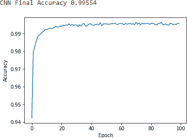
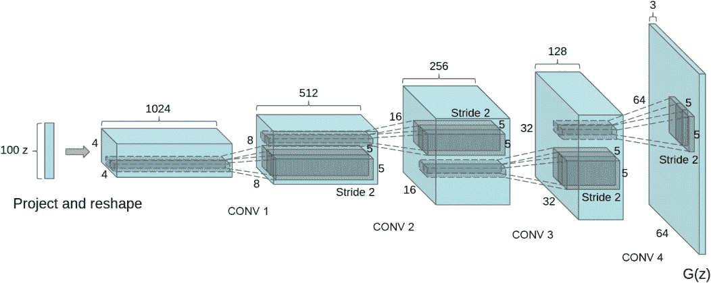
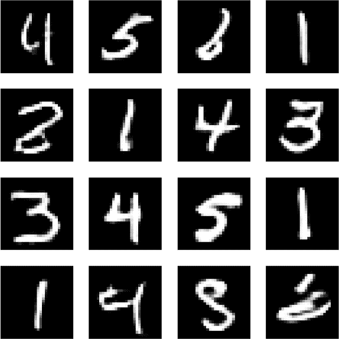

# 第十二章。生成对抗网络

我们已经探索了两种生成模型：RBM 和 DBN。在本章中，我们将探讨*生成对抗网络（GANs）*，这是无监督学习和生成建模中最新和最有前景的领域之一。

# GANs，概念

GANs 是由 Ian Goodfellow 及其蒙特利尔大学的同行研究人员在 2014 年引入的。在 GANs 中，我们有两个神经网络。一个网络称为*生成器*，根据其已创建的模型生成数据，该模型是使用其作为输入接收到的真实数据样本创建的。另一个网络称为*鉴别器*，用于区分生成器创建的数据和来自真实分布的数据。

简单类比，生成器就像是伪造者，而鉴别器则是试图识别伪造品的警察。这两个网络处于零和博弈中。生成器试图欺骗鉴别器，使其认为合成数据来自真实分布，而鉴别器则试图揭露合成数据为假。

GANs 是无监督学习算法，因为即使没有标签，生成器也可以学习真实分布的基本结构。生成器通过使用比其训练的数据量明显较少的一些参数来学习基本结构——这是我们在前几章中多次探讨过的无监督学习的核心概念。这一约束迫使生成器有效地捕捉到真实数据分布的最显著方面。这类似于深度学习中发生的表示学习。生成器的每个隐藏层捕捉到数据的底层表示——从非常简单的开始——而后续层通过在简单前层基础上构建更复杂的表示来增强。

使用所有这些层次，生成器学习数据的基本结构，并尝试创建几乎与真实数据相同的合成数据。如果生成器捕捉到了真实数据的本质，那么合成数据看起来将会是真实的。

## GANs 的威力

在第十一章中，我们探讨了利用无监督学习模型（如深度信念网络）生成的合成数据来提高监督学习模型性能的能力。像 DBNs 一样，GANs 在生成合成数据方面非常擅长。

如果目标是生成大量新的训练样本，以帮助补充现有的训练数据——例如，以提高图像识别任务的准确性——我们可以使用生成器创建大量合成数据，将新合成数据添加到原始训练数据中，然后在现在大得多的数据集上运行监督式机器学习模型。

GANs 在异常检测方面也表现出色。如果目标是识别异常，例如检测欺诈、黑客攻击或其他可疑行为，我们可以使用判别器对真实数据中的每个实例进行评分。判别器排名为“可能合成”的实例将是最异常的实例，也是最有可能代表恶意行为的实例。

# 深度卷积 GANs

在本章中，我们将返回到我们在前几章中使用过的 MNIST 数据集，并应用一种 GANs 版本来生成合成数据以补充现有的 MNIST 数据集。然后我们将应用一个监督学习模型来进行图像分类。这是半监督学习的又一版本。

###### 注意

顺便说一句，现在你应该对半监督学习有了更深的理解。因为世界上大部分数据都没有标签，无监督学习自身有效地帮助标记数据的能力非常强大。作为半监督机器学习系统的一部分，无监督学习增强了迄今为止所有成功商业应用的监督学习的潜力。

即使在半监督系统的应用之外，无监督学习也有独立运用的潜力，因为它能够从没有任何标签的数据中学习，并且是 AI 领域中从狭义 AI 向更广义 AI 应用迈进的最有潜力的领域之一。

我们将使用的 GANs 版本称为*深度卷积生成对抗网络（DCGANs）*，这是由 Alec Radford、Luke Metz 和 Soumith Chintala 于 2015 年底首次引入的¹。

DCGANs 是一种无监督学习的形式*卷积神经网络（CNNs）*，在监督学习系统中用于计算机视觉和图像分类方面被广泛使用并取得了巨大成功。在深入研究 DCGANs 之前，让我们首先探讨 CNNs，特别是它们在监督学习系统中用于图像分类的方式。

# 卷积神经网络

与数值和文本数据相比，图像和视频的计算成本要高得多。例如，一个 4K Ultra HD 图像的尺寸总共为 4096 x 2160 x 3（26,542,080）。直接在这种分辨率的图像上训练神经网络将需要数千万个神经元，并且导致非常长的训练时间。

而不是直接在原始图像上构建神经网络，我们可以利用图像的某些属性，即像素与附近的像素相关联，但通常与远处的像素无关。

*卷积*（从中卷积神经网络得名）是将图像进行滤波处理以减小图像尺寸而不丢失像素之间关系的过程。²

在原始图像上，我们应用几个特定大小的滤波器，称为*核大小*，并以小步长移动这些滤波器，称为*步幅*，以得出新的减少像素输出。卷积后，我们通过逐个小区域获取减少像素输出中的像素的最大值来进一步减小表示的大小。这称为*最大池化*。

我们多次执行这种卷积和最大池化，以降低图像的复杂性。然后，我们展平图像并使用正常的全连接层进行图像分类。

现在让我们构建一个 CNN，并在 MNIST 数据集上进行图像分类。首先，我们将加载必要的库：

```py
'''Main'''
import numpy as np
import pandas as pd
import os, time, re
import pickle, gzip, datetime

'''Data Viz'''
import matplotlib.pyplot as plt
import seaborn as sns
color = sns.color_palette()
import matplotlib as mpl
from mpl_toolkits.axes_grid1 import Grid

%matplotlib inline

'''Data Prep and Model Evaluation'''
from sklearn import preprocessing as pp
from sklearn.model_selection import train_test_split
from sklearn.model_selection import StratifiedKFold
from sklearn.metrics import log_loss, accuracy_score
from sklearn.metrics import precision_recall_curve, average_precision_score
from sklearn.metrics import roc_curve, auc, roc_auc_score, mean_squared_error

'''Algos'''
import lightgbm as lgb

'''TensorFlow and Keras'''
import tensorflow as tf
import keras
from keras import backend as K
from keras.models import Sequential, Model
from keras.layers import Activation, Dense, Dropout, Flatten, Conv2D, MaxPool2D
from keras.layers import LeakyReLU, Reshape, UpSampling2D, Conv2DTranspose
from keras.layers import BatchNormalization, Input, Lambda
from keras.layers import Embedding, Flatten, dot
from keras import regularizers
from keras.losses import mse, binary_crossentropy
from IPython.display import SVG
from keras.utils.vis_utils import model_to_dot
from keras.optimizers import Adam, RMSprop
from tensorflow.examples.tutorials.mnist import input_data
```

接下来，我们将加载 MNIST 数据集，并将图像数据存储在 4D 张量中，因为 Keras 需要图像数据以这种格式。我们还将使用 Keras 中的`to_categorical`函数从标签创建独热向量。

为了以后使用，我们还将从数据中创建 Pandas DataFrames。让我们再次使用本书早期的`view_digit`函数来查看这些图像：

```py
# Load the datasets
current_path = os.getcwd()
file = '\\datasets\\mnist_data\\mnist.pkl.gz'
f = gzip.open(current_path+file, 'rb')
train_set, validation_set, test_set = pickle.load(f, encoding='latin1')
f.close()

X_train, y_train = train_set[0], train_set[1]
X_validation, y_validation = validation_set[0], validation_set[1]
X_test, y_test = test_set[0], test_set[1]

X_train_keras = X_train.reshape(50000,28,28,1)
X_validation_keras = X_validation.reshape(10000,28,28,1)
X_test_keras = X_test.reshape(10000,28,28,1)

y_train_keras = to_categorical(y_train)
y_validation_keras = to_categorical(y_validation)
y_test_keras = to_categorical(y_test)

# Create Pandas DataFrames from the datasets
train_index = range(0,len(X_train))
validation_index = range(len(X_train),len(X_train)+len(X_validation))
test_index = range(len(X_train)+len(X_validation),len(X_train)+ \
                   len(X_validation)+len(X_test))

X_train = pd.DataFrame(data=X_train,index=train_index)
y_train = pd.Series(data=y_train,index=train_index)

X_validation = pd.DataFrame(data=X_validation,index=validation_index)
y_validation = pd.Series(data=y_validation,index=validation_index)

X_test = pd.DataFrame(data=X_test,index=test_index)
y_test = pd.Series(data=y_test,index=test_index)

def view_digit(X, y, example):
    label = y.loc[example]
    image = X.loc[example,:].values.reshape([28,28])
    plt.title('Example: %d Label: %d' % (example, label))
    plt.imshow(image, cmap=plt.get_cmap('gray'))
    plt.show()
```

现在让我们构建 CNN。

我们将在 Keras 中调用`Sequential()`开始模型创建。然后，我们将添加两个卷积层，每个层有 32 个大小为 5 x 5 的过滤器，默认步幅为 1，并使用 ReLU 激活函数。然后，我们使用 2 x 2 的池化窗口和 1 的步幅进行最大池化。我们还执行 dropout，你可能记得这是一种正则化形式，用于减少神经网络的过拟合。具体来说，我们将丢弃输入单元的 25%。

在下一阶段，我们再次添加两个卷积层，这次使用 64 个大小为 3 x 3 的过滤器。然后，我们使用 2 x 2 的池化窗口和 2 的步幅进行最大池化。接着，我们添加一个 dropout 层，dropout 比例为 25%。

最后，我们将图像展平，添加一个具有 256 个隐藏单元的常规神经网络，使用 50%的 dropout 比例进行 dropout，并使用`softmax`函数进行 10 类分类：

```py
model = Sequential()

model.add(Conv2D(filters = 32, kernel_size = (5,5), padding = 'Same',
                 activation ='relu', input_shape = (28,28,1)))
model.add(Conv2D(filters = 32, kernel_size = (5,5), padding = 'Same',
                 activation ='relu'))
model.add(MaxPooling2D(pool_size=(2,2)))
model.add(Dropout(0.25))

model.add(Conv2D(filters = 64, kernel_size = (3,3), padding = 'Same',
                 activation ='relu'))
model.add(Conv2D(filters = 64, kernel_size = (3,3), padding = 'Same',
                 activation ='relu'))
model.add(MaxPooling2D(pool_size=(2,2), strides=(2,2)))
model.add(Dropout(0.25))

model.add(Flatten())
model.add(Dense(256, activation = "relu"))
model.add(Dropout(0.5))
model.add(Dense(10, activation = "softmax"))
```

对于这个 CNN 训练，我们将使用*Adam 优化器*并最小化交叉熵。我们还将将图像分类的准确性作为评估指标存储。

现在让我们对模型进行一百个 epochs 的训练，并在验证集上评估结果：

```py
# Train CNN
model.compile(optimizer='adam',
              loss='categorical_crossentropy',
              metrics=['accuracy'])

model.fit(X_train_keras, y_train_keras,
          validation_data=(X_validation_keras, y_validation_keras), \
          epochs=100)
```

图 12-1 显示了训练一百个 epochs 后的准确性。



###### 图 12-1\. CNN 结果

正如您所看到的，我们刚刚训练的 CNN 最终准确率达到了 99.55%，优于本书中迄今为止训练过的任何 MNIST 图像分类解决方案。

# 重新审视 DCGANs

现在让我们再次转向深度卷积生成对抗网络。我们将建立一个生成模型，生成与原始 MNIST 图像非常相似的合成 MNIST 图像。

要生成接近真实但合成的图像，我们需要训练一个生成器，从原始的 MNIST 图像生成新的图像，以及一个判别器，判断这些图像是否与原始图像相似（基本上执行一种“胡说测试”）。

这里还有另一种思考方式。原始的 MNIST 数据集代表了原始的数据分布。生成器从这个原始分布中学习，并基于所学内容生成新的图像，而判别器则试图确定新生成的图像是否与原始分布几乎无法区分。

对于生成器，我们将使用 Radford、Metz 和 Chintala 在 ICLR 2016 年会议上提出的架构，这是我们之前引用过的（见 图 12-2）。



###### 图 12-2。DCGAN 生成器

生成器接受一个初始的 *噪声向量*，这里显示为 100 x 1 的噪声向量，表示为 *z*，然后将其投影和重塑成 1024 x 4 x 4 张量。这种 *投影和重塑* 行为是卷积的反向过程，被称为 *转置卷积*（或在某些情况下称为 *反卷积*）。在转置卷积中，卷积的原始过程被反转，将一个缩小的张量映射到一个较大的张量³。

在初始的转置卷积之后，生成器应用四个额外的反卷积层映射到最终的 64 x 3 x 3 张量。

这里是各个阶段：

100 x 1 → 1024 x 4 x 4 → 512 x 8 x 8 → 256 x 16 x 16 → 128 x 32 x 32 → 64 x 64 x 3

在设计 MNIST 数据集上的 DCGAN 时，我们将应用类似（但不完全相同）的架构。

## DCGAN 的生成器

对于我们设计的 DCGAN，我们将利用 Rowel Atienza 的工作并在此基础上构建⁴。我们首先会创建一个名为 *DCGAN* 的类，用于构建生成器、判别器、判别器模型和对抗模型。

让我们从生成器开始。我们将为生成器设置几个参数，包括辍学率（默认值为 0.3）、张量的深度（默认值为 256）以及其他维度（默认值为 7 x 7）。我们还将使用批归一化，其默认动量值为 0.8。初始输入维度为一百，最终输出维度为 28 x 28 x 1。

请记住，辍学和批归一化都是正则化器，帮助我们设计的神经网络避免过拟合。

要构建生成器，我们从 Keras 中调用 `Sequential()` 函数。然后，我们通过调用 `Dense()` 函数添加一个全连接神经网络层。它的输入维度为 100，输出维度为 7 x 7 x 256。我们将执行批归一化，使用 ReLU 激活函数，并执行辍学：

```py
def generator(self, depth=256, dim=7, dropout=0.3, momentum=0.8, \
              window=5, input_dim=100, output_depth=1):
    if self.G:
        return self.G
    self.G = Sequential()
    self.G.add(Dense(dim*dim*depth, input_dim=input_dim))
    self.G.add(BatchNormalization(momentum=momentum))
    self.G.add(Activation('relu'))
    self.G.add(Reshape((dim, dim, depth)))
    self.G.add(Dropout(dropout))
```

接下来，我们将进行 *上采样* 和 *转置卷积* 三次。每次，我们将输出空间的深度从 256 逐渐减半至 128、64、32，并增加其他维度。我们将保持 5 x 5 的卷积窗口和默认的步幅为一。在每次转置卷积期间，我们将执行批归一化，并使用 ReLU 激活函数。

这是它的样子：

100 → 7 x 7 x 256 → 14 x 14 x 128 → 28 x 28 x 64 → 28 x 28 x 32 → 28 x 28 x 1

```py
    self.G.add(UpSampling2D())
    self.G.add(Conv2DTranspose(int(depth/2), window, padding='same'))
    self.G.add(BatchNormalization(momentum=momentum))
    self.G.add(Activation('relu'))

    self.G.add(UpSampling2D())
    self.G.add(Conv2DTranspose(int(depth/4), window, padding='same'))
    self.G.add(BatchNormalization(momentum=momentum))
    self.G.add(Activation('relu'))

    self.G.add(Conv2DTranspose(int(depth/8), window, padding='same'))
    self.G.add(BatchNormalization(momentum=momentum))
    self.G.add(Activation('relu'))
```

最后，生成器将输出一个 28 x 28 的图像，与原始 MNIST 图像具有相同的尺寸：

```py
    self.G.add(Conv2DTranspose(output_depth, window, padding='same'))
    self.G.add(Activation('sigmoid'))
    self.G.summary()
    return self.G
```

## DCGAN 的鉴别器

对于鉴别器，我们将将默认的 dropout 百分比设置为 0.3，深度为 64，并将 `LeakyReLU` 函数的 alpha 设置为 0.3。⁵

首先，我们将加载一个 28 x 28 x 1 的图像，并使用 64 个通道、5 x 5 的滤波器和步幅为二进行卷积。我们将使用 `LeakyReLU` 作为激活函数，并执行 dropout。我们将继续这个过程三次，每次将输出空间的深度加倍，同时减少其他维度。对于每个卷积，我们将使用 `LeakyReLU` 激活函数和 dropout。

最后，我们将展平图像，并使用 Sigmoid 函数输出一个概率。这个概率表示鉴别器对输入图像判断为伪造的信心程度（0.0 表示伪造，1.0 表示真实）。

这是它的样子：

28 x 28 x 1 → 14 x 14 x 64 → 7 x 7 x 128 → 4 x 4 x 256 → 4 x 4 x 512 → 1

```py
def discriminator(self, depth=64, dropout=0.3, alpha=0.3):
    if self.D:
        return self.D
    self.D = Sequential()
    input_shape = (self.img_rows, self.img_cols, self.channel)
    self.D.add(Conv2D(depth*1, 5, strides=2, input_shape=input_shape,
        padding='same'))
    self.D.add(LeakyReLU(alpha=alpha))
    self.D.add(Dropout(dropout))

    self.D.add(Conv2D(depth*2, 5, strides=2, padding='same'))
    self.D.add(LeakyReLU(alpha=alpha))
    self.D.add(Dropout(dropout))

    self.D.add(Conv2D(depth*4, 5, strides=2, padding='same'))
    self.D.add(LeakyReLU(alpha=alpha))
    self.D.add(Dropout(dropout))

    self.D.add(Conv2D(depth*8, 5, strides=1, padding='same'))
    self.D.add(LeakyReLU(alpha=alpha))
    self.D.add(Dropout(dropout))

    self.D.add(Flatten())
    self.D.add(Dense(1))
    self.D.add(Activation('sigmoid'))
    self.D.summary()
    return self.D
```

## 鉴别器和对抗模型

接下来，我们定义鉴别器模型（即检测伪造品的警察）和对抗模型（即从警察学习的伪造者）。对于对抗模型和鉴别器模型，我们将使用 RMSprop 优化器，将损失函数定义为二元交叉熵，并使用准确率作为我们的报告指标。

对于对抗模型，我们使用之前定义的生成器和鉴别器网络。对于鉴别器模型，我们仅使用鉴别器网络：

```py
def discriminator_model(self):
    if self.DM:
        return self.DM
    optimizer = RMSprop(lr=0.0002, decay=6e-8)
    self.DM = Sequential()
    self.DM.add(self.discriminator())
    self.DM.compile(loss='binary_crossentropy', \
                    optimizer=optimizer, metrics=['accuracy'])
    return self.DM

def adversarial_model(self):
    if self.AM:
        return self.AM
    optimizer = RMSprop(lr=0.0001, decay=3e-8)
    self.AM = Sequential()
    self.AM.add(self.generator())
    self.AM.add(self.discriminator())
    self.AM.compile(loss='binary_crossentropy', \
                    optimizer=optimizer, metrics=['accuracy'])
    return self.AM
```

## 用于 MNIST 数据集的 DCGAN

现在让我们为 MNIST 数据集定义 DCGAN。首先，我们将为 28 x 28 x 1 的 MNIST 图像初始化 `MNIST_DCGAN` 类，并使用之前定义的生成器、鉴别器模型和对抗模型：

```py
class MNIST_DCGAN(object):
    def __init__(self, x_train):
        self.img_rows = 28
        self.img_cols = 28
        self.channel = 1

        self.x_train = x_train

        self.DCGAN = DCGAN()
        self.discriminator =  self.DCGAN.discriminator_model()
        self.adversarial = self.DCGAN.adversarial_model()
        self.generator = self.DCGAN.generator()
```

`train` 函数将默认进行两千次训练周期，并使用批大小为 256。在这个函数中，我们将批量的图像输入到刚刚定义的 DCGAN 架构中。生成器将生成图像，鉴别器将判断图像是真实的还是假的。在这个对抗模型中，随着生成器和鉴别器的较量，合成图像变得越来越接近原始的 MNIST 图像：

```py
def train(self, train_steps=2000, batch_size=256, save_interval=0):
    noise_input = None
    if save_interval>0:
        noise_input = np.random.uniform(-1.0, 1.0, size=[16, 100])
    for i in range(train_steps):
        images_train = self.x_train[np.random.randint(0,
            self.x_train.shape[0], size=batch_size), :, :, :]
        noise = np.random.uniform(-1.0, 1.0, size=[batch_size, 100])
        images_fake = self.generator.predict(noise)
        x = np.concatenate((images_train, images_fake))
        y = np.ones([2*batch_size, 1])
        y[batch_size:, :] = 0

        d_loss = self.discriminator.train_on_batch(x, y)

        y = np.ones([batch_size, 1])
        noise = np.random.uniform(-1.0, 1.0, size=[batch_size, 100])
        a_loss = self.adversarial.train_on_batch(noise, y)
        log_mesg = "%d: [D loss: %f, acc: %f]" % (i, d_loss[0], d_loss[1])
        log_mesg = "%s [A loss: %f, acc: %f]" % (log_mesg, a_loss[0], \
                                                  a_loss[1])
        print(log_mesg)
        if save_interval>0:
            if (i+1)%save_interval==0:
                self.plot_images(save2file=True, \
                    samples=noise_input.shape[0],\
                    noise=noise_input, step=(i+1))
```

我们也来定义一个函数来绘制由这个 DCGAN 模型生成的图像：

```py
def plot_images(self, save2file=False, fake=True, samples=16, \
                noise=None, step=0):
    filename = 'mnist.png'
    if fake:
        if noise is None:
            noise = np.random.uniform(-1.0, 1.0, size=[samples, 100])
        else:
            filename = "mnist_%d.png" % step
        images = self.generator.predict(noise)
    else:
        i = np.random.randint(0, self.x_train.shape[0], samples)
        images = self.x_train[i, :, :, :]

    plt.figure(figsize=(10,10))
    for i in range(images.shape[0]):
        plt.subplot(4, 4, i+1)
        image = images[i, :, :, :]
        image = np.reshape(image, [self.img_rows, self.img_cols])
        plt.imshow(image, cmap='gray')
        plt.axis('off')
    plt.tight_layout()
    if save2file:
        plt.savefig(filename)
        plt.close('all')
    else:
        plt.show()
```

# MNIST DCGAN 的实际应用

现在我们已经定义了`MNIST_DCGAN`调用，让我们调用它并开始训练过程。我们将使用 256 的批次大小训练 10,000 个 epochs：

```py
# Initialize MNIST_DCGAN and train
mnist_dcgan = MNIST_DCGAN(X_train_keras)
timer = ElapsedTimer()
mnist_dcgan.train(train_steps=10000, batch_size=256, save_interval=500)
```

下面的代码显示了判别器和对抗模型的损失和准确率：

```py
0:  [D loss: 0.692640, acc: 0.527344] [A loss: 1.297974, acc: 0.000000]
1:  [D loss: 0.651119, acc: 0.500000] [A loss: 0.920461, acc: 0.000000]
2:  [D loss: 0.735192, acc: 0.500000] [A loss: 1.289153, acc: 0.000000]
3:  [D loss: 0.556142, acc: 0.947266] [A loss: 1.218020, acc: 0.000000]
4:  [D loss: 0.492492, acc: 0.994141] [A loss: 1.306247, acc: 0.000000]
5:  [D loss: 0.491894, acc: 0.916016] [A loss: 1.722399, acc: 0.000000]
6:  [D loss: 0.607124, acc: 0.527344] [A loss: 1.698651, acc: 0.000000]
7:  [D loss: 0.578594, acc: 0.921875] [A loss: 1.042844, acc: 0.000000]
8:  [D loss: 0.509973, acc: 0.587891] [A loss: 1.957741, acc: 0.000000]
9:  [D loss: 0.538314, acc: 0.896484] [A loss: 1.133667, acc: 0.000000]
10: [D loss: 0.510218, acc: 0.572266] [A loss: 1.855000, acc: 0.000000]
11: [D loss: 0.501239, acc: 0.923828] [A loss: 1.098140, acc: 0.000000]
12: [D loss: 0.509211, acc: 0.519531] [A loss: 1.911793, acc: 0.000000]
13: [D loss: 0.482305, acc: 0.923828] [A loss: 1.187290, acc: 0.000000]
14: [D loss: 0.395886, acc: 0.900391] [A loss: 1.465053, acc: 0.000000]
15: [D loss: 0.346876, acc: 0.992188] [A loss: 1.443823, acc: 0.000000]
```

判别器的初始损失波动很大，但始终保持在 0.50 以上。换句话说，判别器最初非常擅长捕捉生成器生成的低质量赝品。随着生成器变得越来越擅长创建赝品，判别器开始困难；其准确率接近 0.50：

```py
9985: [D loss: 0.696480, acc: 0.521484] [A loss: 0.955954, acc: 0.125000]
9986: [D loss: 0.716583, acc: 0.472656] [A loss: 0.761385, acc: 0.363281]
9987: [D loss: 0.710941, acc: 0.533203] [A loss: 0.981265, acc: 0.074219]
9988: [D loss: 0.703731, acc: 0.515625] [A loss: 0.679451, acc: 0.558594]
9989: [D loss: 0.722460, acc: 0.492188] [A loss: 0.899768, acc: 0.125000]
9990: [D loss: 0.691914, acc: 0.539062] [A loss: 0.726867, acc: 0.464844]
9991: [D loss: 0.716197, acc: 0.500000] [A loss: 0.932500, acc: 0.144531]
9992: [D loss: 0.689704, acc: 0.548828] [A loss: 0.734389, acc: 0.414062]
9993: [D loss: 0.714405, acc: 0.517578] [A loss: 0.850408, acc: 0.218750]
9994: [D loss: 0.690414, acc: 0.550781] [A loss: 0.766320, acc: 0.355469]
9995: [D loss: 0.709792, acc: 0.511719] [A loss: 0.960070, acc: 0.105469]
9996: [D loss: 0.695851, acc: 0.500000] [A loss: 0.774395, acc: 0.324219]
9997: [D loss: 0.712254, acc: 0.521484] [A loss: 0.853828, acc: 0.183594]
9998: [D loss: 0.702689, acc: 0.529297] [A loss: 0.802785, acc: 0.308594]
9999: [D loss: 0.698032, acc: 0.517578] [A loss: 0.810278, acc: 0.304688]
```

## 合成图像生成

现在 MNIST DCGAN 已经训练完毕，让我们使用它生成一些合成图像的样本（图 12-3）。



###### 图 12-3\. MNIST DCGAN 生成的合成图像

这些合成图像——虽然不能完全与真实的 MNIST 数据集区分开来——与真实数字非常相似。随着训练时间的增加，MNIST DCGAN 应该能够生成更接近真实 MNIST 数据集的合成图像，并可用于扩充该数据集的规模。

虽然我们的解决方案相对不错，但有许多方法可以使 MNIST DCGAN 表现更好。论文["Improved Techniques for Training GANs"](https://arxiv.org/pdf/1606.03498.pdf)和其附带的[代码](https://github.com/openai/improved-gan)深入探讨了改进 GAN 性能的更高级方法。

# 结论

在本章中，我们探讨了深度卷积生成对抗网络（DCGAN），这是一种专门用于图像和计算机视觉数据集的生成对抗网络形式。

GAN 是一种具有两个神经网络的生成模型，它们被锁定在一个零和博弈中。其中一个网络是生成器（即伪造者），从真实数据中生成合成数据，而另一个网络是判别器（即警察），负责判断伪造品是真实还是假的。⁶ 生成器从判别器中学习的这种零和博弈导致一个总体上生成相当逼真的合成数据的生成模型，并且通常随着训练时间的增加而变得更好。

GAN（生成对抗网络）相对较新 —— 首次由 Ian Goodfellow 等人于 2014 年提出。⁷ GAN 目前主要用于异常检测和生成合成数据，但在不久的将来可能有许多其他应用。机器学习社区仅仅开始探索其可能性，如果你决定在应用的机器学习系统中使用 GAN，一定要做好大量实验的准备。⁸

在第十三章 中，我们将通过探索时间聚类来结束本书的这一部分内容，这是一种用于处理时间序列数据的无监督学习方法。

¹ 想深入了解 DCGANs，可以参考该主题的[官方论文](https://arxiv.org/abs/1511.06434)。

² 想了解更多关于卷积层的内容，可以阅读《深度学习中不同类型卷积的介绍》[一文](http://bit.ly/2GeMQfu)。

³ 想了解更多关于卷积层的内容，可以查看《深度学习中不同类型卷积的介绍》[一文](http://bit.ly/2GeMQfu)，这篇文章也在本章中有提及。

⁴ 想获取原始代码基础，请访问[Rowel Atienza 的 GitHub 页面](http://bit.ly/2DLp4G1)。

⁵ `LeakyReLU`（[*https://keras.io/layers/advanced-activations/*](https://keras.io/layers/advanced-activations/)）是一种先进的激活函数，类似于普通的 ReLU，但在单元不活跃时允许一个小的梯度。它正在成为图像机器学习问题中首选的激活函数。

⁶ 想获取更多信息，请查阅[OpenAI 博客上的生成模型文章](https://blog.openai.com/generative-models/)。

⁷ 想了解更多相关内容，请参阅这篇重要的[论文](https://arxiv.org/abs/1406.2661)。

⁸ 阅读这篇关于如何[优化 GANs](https://github.com/soumith/ganhacks)和[提升性能](http://bit.ly/2G2FJHq)的文章，可以了解一些技巧和窍门。
