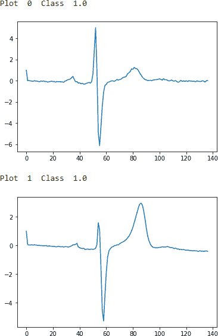
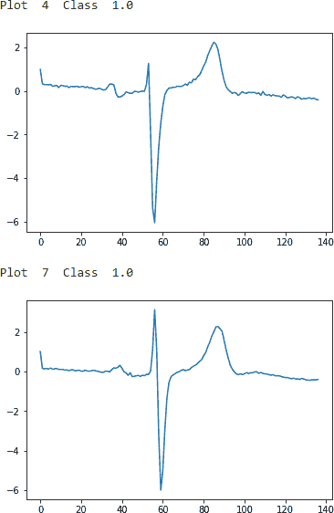
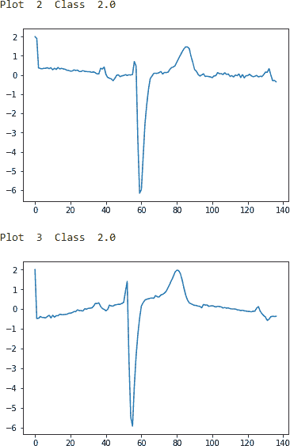
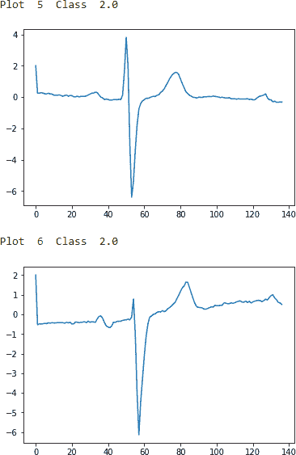
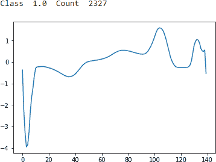
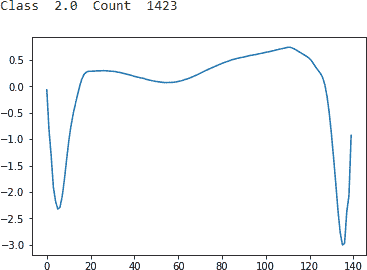
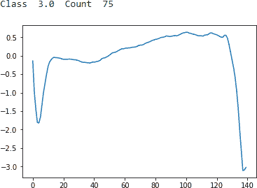
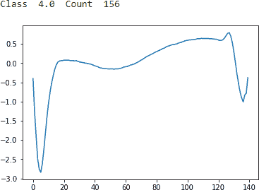
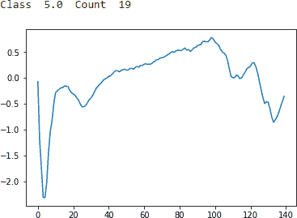

# 第十三章：时间序列聚类

到目前为止，在本书中，我们主要处理*横断面数据*，即我们在单个时间点上观察实体的数据。这包括信用卡数据集，记录了两天内的交易，以及 MNIST 数据集，其中包含数字图像。对于这些数据集，我们应用了无监督学习来学习数据的潜在结构，并将相似的交易和图像分组在一起，而不使用任何标签。

无监督学习对处理*时间序列数据*也非常有价值，其中我们在不同时间间隔内观察单个实体。我们需要开发一种能够跨时间学习数据的潜在结构的解决方案，而不仅仅是针对特定时间点。如果我们开发了这样的解决方案，我们就可以识别出类似的时间序列模式并将它们分组在一起。

这在金融、医学、机器人学、天文学、生物学、气象学等领域具有非常大的影响，因为这些领域的专业人员花费大量时间分析数据，根据当前事件与过去事件的相似性来分类当前事件。通过将当前事件与类似的过去事件分组在一起，这些专业人员能够更自信地决定采取正确的行动。

在本章中，我们将根据模式相似性对时间序列数据进行聚类。时间序列数据的聚类是一种纯无监督方法，不需要对数据进行训练注释，尽管对于验证结果，像所有其他无监督学习实验一样，需要注释数据。

###### 注记

还有一种数据组合，结合了横断面和时间序列数据。这被称为*面板*或*纵向*数据。

# ECG 数据

为了使时间序列聚类问题更具体化，让我们引入一个特定的现实世界问题。想象一下，我们在医疗保健领域工作，需要分析心电图（EKG/ECG）读数。ECG 机器使用放置在皮肤上的电极，在一段时间内记录心脏的电活动。ECG 在大约 10 秒钟内测量活动，并记录的指标有助于检测任何心脏问题。

大多数 ECG 读数记录的是正常的心跳活动，但异常读数是医疗专业人员必须识别的，以在任何不良心脏事件（如心脏骤停）发生之前采取预防性措施。ECG 产生带有峰和谷的折线图，因此将读数分类为正常或异常是一项简单的模式识别任务，非常适合机器学习。

现实世界的 ECG 读数并不是如此清晰显示，这使得将图像分类到这些不同桶中变得困难且容易出错。

例如，波的*振幅*变化（中心线到峰值或谷值的高度）、*周期*（从一个峰值到下一个的距离）、*相位移*（水平移动）和*垂直移*都是任何机器驱动分类系统的挑战。

# 时间序列聚类方法

任何时间序列聚类方法都需要处理这些类型的扭曲。正如您可能记得的那样，聚类依赖于距离度量，以确定数据在空间中与其他数据的接近程度，从而将相似的数据组合成不同且同质的簇。

时间序列数据的聚类工作方式类似，但我们需要一个距离度量，该度量是尺度和位移不变的，以便将类似的时间序列数据组合在一起，而不考虑幅度、周期、相位移和垂直移的微小差异。

## k-Shape

满足这一标准的时间序列聚类的先进方法之一是*k-shape*，它由 John Paparrizos 和 Luis Gravano 于 2015 年首次在 ACM SIGMOD 上介绍¹。

*k*-shape 使用一种距离度量，该度量对缩放和位移不变，以保持比较时间序列序列的形状。具体来说，*k*-shape 使用标准化的交叉相关来计算簇质心，并在每次迭代中更新时间序列分配到这些簇。

除了对缩放和位移不变之外，*k*-shape 还是领域无关且可扩展的，需要最少的参数调整。其迭代改进过程在序列数量上线性扩展。这些特性使其成为当今最强大的时间序列聚类算法之一。

到这一点，应该清楚*k*-shape 的运行方式与*k*-means 类似：两种算法都使用迭代方法根据数据与最近群组的质心之间的距离来分配数据。关键的区别在于*k*-shape 计算距离的方式——它使用基于形状的距离，依赖于交叉相关性。

# 使用*k-shape*对 ECGFiveDays 进行时间序列聚类

让我们使用*k*-shape 构建一个时间序列聚类模型。

在本章中，我们将依赖于 UCR 时间序列收集的数据。由于文件大小超过一百兆字节，在 GitHub 上无法访问。您需要从[UCR 时间序列网站](http://bit.ly/2CXPcfq)下载这些文件。

这是最大的公共类标记时间序列数据集收藏，总计有 85 个。这些数据集来自多个领域，因此我们可以测试我们的解决方案在不同领域的表现。每个时间序列只属于一个类别，因此我们也有标签来验证时间序列聚类的结果。

## 数据准备

让我们开始加载必要的库：

```py
'''Main'''
import numpy as np
import pandas as pd
import os, time, re
import pickle, gzip, datetime
from os import listdir, walk
from os.path import isfile, join

'''Data Viz'''
import matplotlib.pyplot as plt
import seaborn as sns
color = sns.color_palette()
import matplotlib as mpl
from mpl_toolkits.axes_grid1 import Grid

%matplotlib inline

'''Data Prep and Model Evaluation'''
from sklearn import preprocessing as pp
from sklearn.model_selection import train_test_split
from sklearn.model_selection import StratifiedKFold
from sklearn.metrics import log_loss, accuracy_score
from sklearn.metrics import precision_recall_curve, average_precision_score
from sklearn.metrics import roc_curve, auc, roc_auc_score, mean_squared_error
from keras.utils import to_categorical
from sklearn.metrics import adjusted_rand_score
import random

'''Algos'''
from kshape.core import kshape, zscore
import tslearn
from tslearn.utils import to_time_series_dataset
from tslearn.clustering import KShape, TimeSeriesScalerMeanVariance
from tslearn.clustering import TimeSeriesKMeans
import hdbscan

'''TensorFlow and Keras'''
import tensorflow as tf
import keras
from keras import backend as K
from keras.models import Sequential, Model
from keras.layers import Activation, Dense, Dropout, Flatten, Conv2D, MaxPool2D
from keras.layers import LeakyReLU, Reshape, UpSampling2D, Conv2DTranspose
from keras.layers import BatchNormalization, Input, Lambda
from keras.layers import Embedding, Flatten, dot
from keras import regularizers
from keras.losses import mse, binary_crossentropy
from IPython.display import SVG
from keras.utils.vis_utils import model_to_dot
from keras.optimizers import Adam, RMSprop
from tensorflow.examples.tutorials.mnist import input_data
```

我们将使用 *tslearn* 包来访问基于 Python 的 *k*-shape 算法。tslearn 的框架与 Scikit-learn 类似，但专门用于处理时间序列数据。

接下来，让我们从 UCR 时间序列存档下载的 `ECGFiveDays` 数据集中加载训练和测试数据。此矩阵的第一列是类别标签，其余列是时间序列数据的值。我们将数据存储为 `X_train`、`y_train`、`X_test` 和 `y_test`：

```py
# Load the datasets
current_path = os.getcwd()
file = '\\datasets\\ucr_time_series_data\\'
data_train = np.loadtxt(current_path+file+
                        "ECGFiveDays/ECGFiveDays_TRAIN",
                        delimiter=",")
X_train = to_time_series_dataset(data_train[:, 1:])
y_train = data_train[:, 0].astype(np.int)

data_test = np.loadtxt(current_path+file+
                       "ECGFiveDays/ECGFiveDays_TEST",
                       delimiter=",")
X_test = to_time_series_dataset(data_test[:, 1:])
y_test = data_test[:, 0].astype(np.int)
```

下面的代码显示了时间序列的数量、唯一类别的数量以及每个时间序列的长度：

```py
# Basic summary statistics
print("Number of time series:", len(data_train))
print("Number of unique classes:", len(np.unique(data_train[:,0])))
print("Time series length:", len(data_train[0,1:]))
```

```py
Number of time series: 23
Number of unique classes: 2
Time series length: 136
```

有 23 个时间序列和 2 个唯一类别，每个时间序列长度为 136\. Figure 13-1 显示了每个类别的几个示例；现在我们知道这些 ECG 读数是什么样的了：

```py
# Examples of Class 1.0
for i in range(0,10):
    if data_train[i,0]==1.0:
        print("Plot ",i," Class ",data_train[i,0])
        plt.plot(data_train[i])
        plt.show()
```



###### 图 13-1\. ECGFiveDays 类 1.0—第一组示例



###### 图 13-2\. ECGFiveDays 类 1.0—第二组示例

这里是绘制 `Class 2.0` 结果的代码：

```py
# Examples of Class 2.0
for i in range(0,10):
    if data_train[i,0]==2.0:
        print("Plot ",i," Class ",data_train[i,0])
        plt.plot(data_train[i])
        plt.show()
```



###### 图 13-3\. ECGFiveDays 类 2.0—第一组示例



###### 图 13-4\. ECGFiveDays 类 2.0—第二组示例

对于未经训练的肉眼来说，来自类 1.0 和类 2.0 的示例看起来无法区分，但这些观察结果已由领域专家注释。这些图表因噪声和失真而复杂。振幅、周期、相移和垂直移位的差异也使得分类成为一项挑战。

让我们准备 *k*-shape 算法的数据。我们将对数据进行归一化，使其均值为零，标准差为一：

```py
# Prepare the data - Scale
X_train = TimeSeriesScalerMeanVariance(mu=0., std=1.).fit_transform(X_train)
X_test = TimeSeriesScalerMeanVariance(mu=0., std=1.).fit_transform(X_test)
```

## 训练和评估

接下来，我们将调用 *k*-shape 算法，并将集群数量设置为 2，最大迭代次数设置为一百，训练轮数设置为一百：²

```py
# Train using k-Shape
ks = KShape(n_clusters=2, max_iter=100, n_init=100,verbose=0)
ks.fit(X_train)
```

为了衡量时间序列聚类的好坏，我们将使用 *adjusted Rand index*，这是一种校正后的元素随机分组机制相似度测量方法。这与准确度测量相关。³

直观地，兰德指数衡量了预测聚类和真实聚类分配之间的一致性。如果模型的调整兰德指数接近 0.0，则表示纯随机分配聚类；如果模型的调整兰德指数接近 1.0，则表示预测聚类完全与真实聚类匹配。

我们将使用 Scikit-learn 中的调整兰德指数实现，称为 *adjusted_rand_score*。

让我们生成聚类预测，然后计算调整兰德指数：

```py
# Make predictions and calculate adjusted Rand index
preds = ks.predict(X_train)
ars = adjusted_rand_score(data_train[:,0],preds)
print("Adjusted Rand Index:", ars)
```

根据此次运行，调整兰德指数为 0.668\. 如果您多次进行此训练和预测，您会注意到调整兰德指数会有所变化，但始终保持在 0.0 以上：

```py
Adjusted Rand Index: 0.668041237113402
```

让我们在测试集上进行预测，并计算其调整兰德指数：

```py
# Make predictions on test set and calculate adjusted Rand index
preds_test = ks.predict(X_test)
ars = adjusted_rand_score(data_test[:,0],preds_test)
print("Adjusted Rand Index on Test Set:", ars)
```

测试集上的调整兰德指数明显较低，勉强超过 0\. 聚类预测几乎是随机分配——时间序列基于相似性进行分组，但成功率很低：

```py
Adjusted Rand Index on Test Set: 0.0006332050676187496
```

如果我们有一个更大的训练集来训练基于*k*-shape 的时间序列聚类模型，我们预计在测试集上会有更好的表现。

# 使用 ECG5000 进行时间序列聚类

不使用仅有 23 个观测值的`ECGFiveDays`数据集，而是使用一个更大的心电图读数数据集。`ECG5000`数据集（也可以在 UCR 时间序列存档中找到），总共有五千个心电图读数（即时间序列），分布在训练集和测试集中。

## 数据准备

我们将加载数据集并进行自定义的训练集和测试集划分，其中 80%的五千个读数在自定义训练集中，剩余的 20%在自定义测试集中。有了这个更大的训练集，我们应该能够开发出一个时间序列聚类模型，其在训练集和测试集上都有更好的性能：

```py
# Load the datasets
current_path = os.getcwd()
file = '\\datasets\\ucr_time_series_data\\'
data_train = np.loadtxt(current_path+file+
                        "ECG5000/ECG5000_TRAIN",
                        delimiter=",")

data_test = np.loadtxt(current_path+file+
                       "ECG5000/ECG5000_TEST",
                       delimiter=",")

data_joined = np.concatenate((data_train,data_test),axis=0)
data_train, data_test = train_test_split(data_joined,
                                    test_size=0.20, random_state=2019)

X_train = to_time_series_dataset(data_train[:, 1:])
y_train = data_train[:, 0].astype(np.int)
X_test = to_time_series_dataset(data_test[:, 1:])
y_test = data_test[:, 0].astype(np.int)
```

让我们探索一下这个数据集：

```py
# Summary statistics
print("Number of time series:", len(data_train))
print("Number of unique classes:", len(np.unique(data_train[:,0])))
print("Time series length:", len(data_train[0,1:]))
```

下面的代码显示了基本的摘要统计信息。在训练集中有四千个读数，分为五个不同的类别，每个时间序列的长度为 140：

```py
Number of time series: 4000
Number of unique classes: 5
Time series length: 140
```

让我们也考虑一下这些类别的读数数量。

```py
# Calculate number of readings per class
print("Number of time series in class 1.0:",
      len(data_train[data_train[:,0]==1.0]))
print("Number of time series in class 2.0:",
      len(data_train[data_train[:,0]==2.0]))
print("Number of time series in class 3.0:",
      len(data_train[data_train[:,0]==3.0]))
print("Number of time series in class 4.0:",
      len(data_train[data_train[:,0]==4.0]))
print("Number of time series in class 5.0:",
      len(data_train[data_train[:,0]==5.0]))
```

分布显示在图 13-5 中。大多数读数属于第一类，其次是第二类。第三、第四和第五类的读数显著较少。

让我们取每个类别的平均时间序列读数，以更好地了解各类别的外观。

```py
# Display readings from each class
for j in np.unique(data_train[:,0]):
    dataPlot = data_train[data_train[:,0]==j]
    cnt = len(dataPlot)
    dataPlot = dataPlot[:,1:].mean(axis=0)
    print(" Class ",j," Count ",cnt)
    plt.plot(dataPlot)
    plt.show()
```

第一类（图 13-5）有一个明显的低谷，随后是一个尖锐的峰值和稳定期。这是最常见的读数类型。



###### 图 13-5\. ECG5000 第一类 1.0

第二类（图 13-6）有一个明显的低谷，随后恢复，然后是一个更加尖锐和更低的低谷，并带有部分恢复。这是第二常见的读数类型。



###### 图 13-6\. ECG5000 第二类 2.0

第三类（图 13-7）有一个明显的低谷，随后恢复，然后是一个更加尖锐和更低的低谷，并没有恢复。数据集中有一些这样的例子。



###### 图 13-7\. ECG5000 第三类 3.0

第四类（图 13-8）有一个明显的低谷，随后恢复，然后是一个较浅的低谷和稳定。数据集中有一些这样的例子。



###### 图 13-8\. ECG5000 类别 4.0

第 5 类（图 13-9）有一个明显的低谷，然后是不均匀的恢复，一个峰值，然后是不稳定的下降到一个浅低谷。数据集中这样的例子很少。



###### 图 13-9\. ECG5000 类别 5.0

## 训练和评估

如前所述，让我们将数据归一化，使其均值为零，标准差为一。然后，我们将使用*k*-shape 算法，这次将聚类数设为五。其余保持不变：

```py
# Prepare data - Scale
X_train = TimeSeriesScalerMeanVariance(mu=0., std=1.).fit_transform(X_train)
X_test = TimeSeriesScalerMeanVariance(mu=0., std=1.).fit_transform(X_test)

# Train using k-Shape
ks = KShape(n_clusters=5, max_iter=100, n_init=10,verbose=1,random_state=2019)
ks.fit(X_train)
```

让我们评估训练集上的结果：

```py
# Predict on train set and calculate adjusted Rand index
preds = ks.predict(X_train)
ars = adjusted_rand_score(data_train[:,0],preds)
print("Adjusted Rand Index on Training Set:", ars)
```

以下代码显示了训练集上的调整兰德指数。这一指数在 0.75 处显著增强：

```py
Adjusted Rand Index on Training Set: 0.7499312374127193
```

让我们也在测试集上评估结果：

```py
# Predict on test set and calculate adjusted Rand index
preds_test = ks.predict(X_test)
ars = adjusted_rand_score(data_test[:,0],preds_test)
print("Adjusted Rand Index on Test Set:", ars)
```

测试集上的调整兰德指数也高得多，为 0.72：

```py
Adjusted Rand Index on Test Set: 0.7172302400677499
```

将训练集增加到四千个时间序列（从 23 个），我们得到了一个表现更好的时间序列聚类模型。

让我们进一步探索预测聚类，以查看它们的同质性。对于每个预测聚类，我们将评估真实标签的分布。如果聚类定义明确且同质，每个聚类中的大多数读数应具有相同的真实标签：

```py
# Evaluate goodness of the clusters
preds_test = preds_test.reshape(1000,1)
preds_test = np.hstack((preds_test,data_test[:,0].reshape(1000,1)))
preds_test = pd.DataFrame(data=preds_test)
preds_test = preds_test.rename(columns={0: 'prediction', 1: 'actual'})

counter = 0
for i in np.sort(preds_test.prediction.unique()):
    print("Predicted Cluster ", i)
    print(preds_test.actual[preds_test.prediction==i].value_counts())
    print()
    cnt = preds_test.actual[preds_test.prediction==i] \
                        .value_counts().iloc[1:].sum()
    counter = counter + cnt
print("Count of Non-Primary Points: ", counter)
```

以下代码显示了聚类的同质性：

```py
ECG 5000 k-shape predicted cluster analysis

Predicted Cluster 0.0
    2.0   29
    4.0   2
    1.0   2
    3.0   2
    5.0   1
    Name: actual, dtype: int64

Predicted Cluster 1.0
    2.0   270
    4.0   14
    3.0   8
    1.0   2
    5.0   1
    Name: actual, dtype: int64

Predicted Cluster 2.0
    1.0   553
    4.0   16
    2.0   9
    3.0   7
    Name: actual, dtype: int64

Predicted Cluster 3.0
    2.0   35
    1.0   5
    4.0   5
    5.0   3
    3.0   3
    Name: actual, dtype: int64

Predicted Cluster 4.0
    1.0   30
    4.0   1
    3.0   1
    2.0   1
    Name: actual, dtype: int64

Count of Non-Primary Points: 83
```

每个预测聚类中的大多数读数属于同一个真实标签类。这突显了*k*-shape 衍生聚类的定义明确和同质性。

# 使用*k*-means 对 ECG5000 进行时间序列聚类

为了完整起见，让我们将*k*-shape 与*k*-means 的结果进行比较。我们将使用*tslearn*库进行训练，并像之前一样使用调整兰德指数进行评估。

我们将聚类数设为五，单次运行的最大迭代次数为一百，独立运行次数为一百，距离度量为欧氏距离，随机状态为 2019：

```py
# Train using Time Series k-Means
km = TimeSeriesKMeans(n_clusters=5, max_iter=100, n_init=100, \
                      metric="euclidean", verbose=1, random_state=2019)
km.fit(X_train)

# Predict on training set and evaluate using adjusted Rand index
preds = km.predict(X_train)
ars = adjusted_rand_score(data_train[:,0],preds)
print("Adjusted Rand Index on Training Set:", ars)

# Predict on test set and evaluate using adjusted Rand index
preds_test = km.predict(X_test)
ars = adjusted_rand_score(data_test[:,0],preds_test)
print("Adjusted Rand Index on Test Set:", ars)
```

*TimeSeriesKMean*算法甚至比使用欧氏距离度量的*k*-shape 算法更快。但结果并不如*k*-shape 那么好：

```py
Adjusted Rand Index of Time Series k-Means on Training Set: 0.5063464656715959
```

训练集上的调整兰德指数为 0.506：

```py
Adjusted Rand Index of Time Series k-Means on Test Set: 0.4864981997585834
```

测试集上的调整兰德指数为 0.486。

# 使用层次 DBSCAN 对 ECG5000 进行时间序列聚类

最后，让我们应用*层次 DBSCAN*，这是本书前面探讨过的方法，并评估其性能。

我们将使用默认参数运行*HDBSCAN*，并使用调整兰德指数评估其性能：

```py
# Train model and evaluate on training set
min_cluster_size = 5
min_samples = None
alpha = 1.0
cluster_selection_method = 'eom'
prediction_data = True

hdb = hdbscan.HDBSCAN(min_cluster_size=min_cluster_size, \
                      min_samples=min_samples, alpha=alpha, \
                      cluster_selection_method=cluster_selection_method, \
                      prediction_data=prediction_data)

preds = hdb.fit_predict(X_train.reshape(4000,140))
ars = adjusted_rand_score(data_train[:,0],preds)
print("Adjusted Rand Index on Training Set:", ars)
```

训练集上的调整兰德指数令人印象深刻，为 0.769：

```py
Adjusted Rand Index on Training Set using HDBSCAN: 0.7689563655060421
```

训练集上的调整兰德指数令人印象深刻，为 0.769。

让我们在测试集上评估：

```py
# Predict on test set and evaluate
preds_test = hdbscan.prediction.approximate_predict( \
                hdb, X_test.reshape(1000,140))
ars = adjusted_rand_score(data_test[:,0],preds_test[0])
print("Adjusted Rand Index on Test Set:", ars)
```

训练集上的调整兰德指数同样令人印象深刻，为 0.720：

```py
Adjusted Rand Index on Test Set using HDBSCAN: 0.7200816245545564
```

# 比较时间序列聚类算法

HDBSCAN 和 *k*-shape 在 ECG5000 数据集上表现相似，而 *k*-means 的表现较差。然而，仅通过评估这三种聚类算法在单个时间序列数据集上的表现，我们无法得出强有力的结论。

让我们运行一个更大的实验，看看这三种聚类算法在彼此之间的表现如何。

首先，我们将加载 UCR 时间序列分类文件夹中的所有目录和文件，以便在实验期间对它们进行迭代。总共有 85 个数据集：

```py
# Load the datasets
current_path = os.getcwd()
file = '\\datasets\\ucr_time_series_data\\'

mypath = current_path + file
d = []
f = []
for (dirpath, dirnames, filenames) in walk(mypath):
    for i in dirnames:
        newpath = mypath+"\\"+i+"\\"
        onlyfiles = [f for f in listdir(newpath) if isfile(join(newpath, f))]
        f.extend(onlyfiles)
    d.extend(dirnames)
    break
```

接下来，让我们为三种聚类算法中的每一种重复使用代码，并使用我们刚刚准备的数据集列表来运行完整实验。我们将按数据集存储训练和测试的调整后兰德指数，并测量每种聚类算法完成 85 个数据集的整个实验所需的时间。

## k-Shape 的完整运行

第一个实验使用了 *k*-shape。

```py
# k-Shape Experiment
kShapeDF = pd.DataFrame(data=[],index=[v for v in d],
                        columns=["Train ARS","Test ARS"])

# Train and Evaluate k-Shape
class ElapsedTimer(object):
    def __init__(self):
        self.start_time = time.time()
    def elapsed(self,sec):
        if sec < 60:
            return str(sec) + " sec"
        elif sec < (60 * 60):
            return str(sec / 60) + " min"
        else:
            return str(sec / (60 * 60)) + " hr"
    def elapsed_time(self):
        print("Elapsed: %s " % self.elapsed(time.time() - self.start_time))
        return (time.time() - self.start_time)

timer = ElapsedTimer()
cnt = 0
for i in d:
    cnt += 1
    print("Dataset ", cnt)
    newpath = mypath+"\\"+i+"\\"
    onlyfiles = [f for f in listdir(newpath) if isfile(join(newpath, f))]
    j = onlyfiles[0]
    k = onlyfiles[1]
    data_train = np.loadtxt(newpath+j, delimiter=",")
    data_test = np.loadtxt(newpath+k, delimiter=",")

    data_joined = np.concatenate((data_train,data_test),axis=0)
    data_train, data_test = train_test_split(data_joined,
                                        test_size=0.20, random_state=2019)

    X_train = to_time_series_dataset(data_train[:, 1:])
    y_train = data_train[:, 0].astype(np.int)
    X_test = to_time_series_dataset(data_test[:, 1:])
    y_test = data_test[:, 0].astype(np.int)

    X_train = TimeSeriesScalerMeanVariance(mu=0., std=1.) \
                                .fit_transform(X_train)
    X_test = TimeSeriesScalerMeanVariance(mu=0., std=1.) \
                                .fit_transform(X_test)

    classes = len(np.unique(data_train[:,0]))
    ks = KShape(n_clusters=classes, max_iter=10, n_init=3,verbose=0)
    ks.fit(X_train)

    print(i)
    preds = ks.predict(X_train)
    ars = adjusted_rand_score(data_train[:,0],preds)
    print("Adjusted Rand Index on Training Set:", ars)
    kShapeDF.loc[i,"Train ARS"] = ars

    preds_test = ks.predict(X_test)
    ars = adjusted_rand_score(data_test[:,0],preds_test)
    print("Adjusted Rand Index on Test Set:", ars)
    kShapeDF.loc[i,"Test ARS"] = ars

kShapeTime = timer.elapsed_time()
```

*k*-shape 算法大约需要一个小时的运行时间。我们已经存储了调整后的兰德指数，并将用这些指数来比较 *k*-shape 和 *k*-means 以及 HDBSCAN 的表现。

###### 注意

我们对 *k*-shape 的测量时间基于我们设置的实验超参数以及机器的本地硬件规格。不同的超参数和硬件规格可能导致实验时间显著不同。

## k-Means 的完整运行

接下来是 *k*-means：

```py
# k-Means Experiment - FULL RUN
# Create dataframe
kMeansDF = pd.DataFrame(data=[],index=[v for v in d], \
                        columns=["Train ARS","Test ARS"])

# Train and Evaluate k-Means
timer = ElapsedTimer()
cnt = 0
for i in d:
    cnt += 1
    print("Dataset ", cnt)
    newpath = mypath+"\\"+i+"\\"
    onlyfiles = [f for f in listdir(newpath) if isfile(join(newpath, f))]
    j = onlyfiles[0]
    k = onlyfiles[1]
    data_train = np.loadtxt(newpath+j, delimiter=",")
    data_test = np.loadtxt(newpath+k, delimiter=",")

    data_joined = np.concatenate((data_train,data_test),axis=0)
    data_train, data_test = train_test_split(data_joined, \
                                        test_size=0.20, random_state=2019)

    X_train = to_time_series_dataset(data_train[:, 1:])
    y_train = data_train[:, 0].astype(np.int)
    X_test = to_time_series_dataset(data_test[:, 1:])
    y_test = data_test[:, 0].astype(np.int)

    X_train = TimeSeriesScalerMeanVariance(mu=0., std=1.) \
                                    .fit_transform(X_train)
    X_test = TimeSeriesScalerMeanVariance(mu=0., std=1.) \
                                    .fit_transform(X_test)

    classes = len(np.unique(data_train[:,0]))
    km = TimeSeriesKMeans(n_clusters=5, max_iter=10, n_init=10, \
                          metric="euclidean", verbose=0, random_state=2019)
    km.fit(X_train)

    print(i)
    preds = km.predict(X_train)
    ars = adjusted_rand_score(data_train[:,0],preds)
    print("Adjusted Rand Index on Training Set:", ars)
    kMeansDF.loc[i,"Train ARS"] = ars

    preds_test = km.predict(X_test)
    ars = adjusted_rand_score(data_test[:,0],preds_test)
    print("Adjusted Rand Index on Test Set:", ars)
    kMeansDF.loc[i,"Test ARS"] = ars

kMeansTime = timer.elapsed_time()
```

*k*-means 在所有 85 个数据集上运行不到五分钟：

## HDBSCAN 的完整运行

最后，我们有了 HBDSCAN：

```py
# HDBSCAN Experiment - FULL RUN
# Create dataframe
hdbscanDF = pd.DataFrame(data=[],index=[v for v in d], \
                         columns=["Train ARS","Test ARS"])

# Train and Evaluate HDBSCAN
timer = ElapsedTimer()
cnt = 0
for i in d:
    cnt += 1
    print("Dataset ", cnt)
    newpath = mypath+"\\"+i+"\\"
    onlyfiles = [f for f in listdir(newpath) if isfile(join(newpath, f))]
    j = onlyfiles[0]
    k = onlyfiles[1]
    data_train = np.loadtxt(newpath+j, delimiter=",")
    data_test = np.loadtxt(newpath+k, delimiter=",")

    data_joined = np.concatenate((data_train,data_test),axis=0)
    data_train, data_test = train_test_split(data_joined, \
                                    test_size=0.20, random_state=2019)

    X_train = data_train[:, 1:]
    y_train = data_train[:, 0].astype(np.int)
    X_test = data_test[:, 1:]
    y_test = data_test[:, 0].astype(np.int)

    X_train = TimeSeriesScalerMeanVariance(mu=0., std=1.) \
                                    .fit_transform(X_train)
    X_test = TimeSeriesScalerMeanVariance(mu=0., std=1.)  \
                                    .fit_transform(X_test)

    classes = len(np.unique(data_train[:,0]))
    min_cluster_size = 5
    min_samples = None
    alpha = 1.0
    cluster_selection_method = 'eom'
    prediction_data = True

    hdb = hdbscan.HDBSCAN(min_cluster_size=min_cluster_size, \
                          min_samples=min_samples, alpha=alpha, \
                          cluster_selection_method= \
                              cluster_selection_method, \
                          prediction_data=prediction_data)

    print(i)
    preds = hdb.fit_predict(X_train.reshape(X_train.shape[0], \
                                            X_train.shape[1]))
    ars = adjusted_rand_score(data_train[:,0],preds)
    print("Adjusted Rand Index on Training Set:", ars)
    hdbscanDF.loc[i,"Train ARS"] = ars

    preds_test = hdbscan.prediction.approximate_predict(hdb,
                            X_test.reshape(X_test.shape[0], \
                                           X_test.shape[1]))
    ars = adjusted_rand_score(data_test[:,0],preds_test[0])
    print("Adjusted Rand Index on Test Set:", ars)
    hdbscanDF.loc[i,"Test ARS"] = ars

hdbscanTime = timer.elapsed_time()
```

HBDSCAN 在所有 85 个数据集上运行不到 10 分钟。

## 比较所有三种时间序列聚类方法

现在让我们比较这三种聚类算法，看看哪一种表现最佳。一种方法是分别计算每种聚类算法在训练集和测试集上的平均调整兰德指数。

每种算法的得分如下：

```py
k-Shape Results

Train ARS     0.165139
Test ARS      0.151103
```

```py
k-Means Results

Train ARS     0.184789
Test ARS      0.178960
```

```py
HDBSCAN Results

Train ARS     0.178754
Test ARS 0.158238
```

结果相当可比，*k*-means 的兰德指数最高，紧随其后的是 *k*-shape 和 HDBSCAN。

为了验证这些发现，让我们统计每种算法在所有 85 个数据集中分别获得第一、第二或第三名的次数：

```py
# Count top place finishes
timeSeriesClusteringDF = pd.DataFrame(data=[],index=kShapeDF.index, \
                            columns=["kShapeTest", \
                                    "kMeansTest", \
                                    "hdbscanTest"])

timeSeriesClusteringDF.kShapeTest = kShapeDF["Test ARS"]
timeSeriesClusteringDF.kMeansTest = kMeansDF["Test ARS"]
timeSeriesClusteringDF.hdbscanTest = hdbscanDF["Test ARS"]

tscResults = timeSeriesClusteringDF.copy()

for i in range(0,len(tscResults)):
    maxValue = tscResults.iloc[i].max()
    tscResults.iloc[i][tscResults.iloc[i]==maxValue]=1
    minValue = tscResults .iloc[i].min()
    tscResults.iloc[i][tscResults.iloc[i]==minValue]=-1
    medianValue = tscResults.iloc[i].median()
    tscResults.iloc[i][tscResults.iloc[i]==medianValue]=0
```

```py
# Show results
tscResultsDF = pd.DataFrame(data=np.zeros((3,3)), \
                index=["firstPlace","secondPlace","thirdPlace"], \
                columns=["kShape", "kMeans","hdbscan"])
tscResultsDF.loc["firstPlace",:] = tscResults[tscResults==1].count().values
tscResultsDF.loc["secondPlace",:] = tscResults[tscResults==0].count().values
tscResultsDF.loc["thirdPlace",:] = tscResults[tscResults==-1].count().values
tscResultsDF
```

*k*-shape 在大多数数据集上获得了最多的第一名，其次是 HDBSCAN。*k*-means 在大多数数据集上获得了第二名，表现既不是最好的也不是最差的（表 13-1）。

表 13-1\. 比较总结

|  | kShape | kMeans | hbdscan |
| --- | --- | --- | --- |
| firstPlace | 31.0 | 24.0 | 29.0 |
| secondPlace | 19.0 | 41.0 | 26.0 |
| thirdPlace | 35.0 | 20.0 | 30.0 |

根据这些比较，很难得出一个算法能够全面击败其他算法的结论。虽然 *k*-shape 获得了最多的第一名，但它比另外两种算法慢得多。

此外，*k*-means 和 HDBSCAN 都表现出色，在大量数据集上获得了第一名。

# 结论

在本章中，我们首次探索了时间序列数据，并展示了不需要任何标签就能根据相似性对时间序列模式进行分组的无监督学习的强大能力。我们详细讨论了三种聚类算法——*k*-shape、*k*-means 和 HDBSCAN。虽然*k*-shape 今天被认为是最好的选择，但另外两种算法也表现不俗。

最重要的是，我们使用的 85 个时间序列数据集的结果突显了实验的重要性。与大多数机器学习一样，没有单一算法能够胜过所有其他算法。你必须不断扩展你的知识广度并进行实验，以找出哪种方法最适合手头的问题。知道在什么时候应用何种方法是一个优秀数据科学家的标志。

希望通过本书学习到的多种不监督学习方法，能够更好地帮助你解决未来可能遇到的各种问题。

¹ 这篇论文可以在[这里](http://www.cs.columbia.edu/~jopa/kshape.html)公开获取。

² 关于超参数的更多信息，请参考[官方*k*-shape 文档](http://bit.ly/2Gfg0L9)。

³ 请查阅维基百科，了解更多关于[Rand 指数](https://en.wikipedia.org/wiki/Rand_index)的信息。
