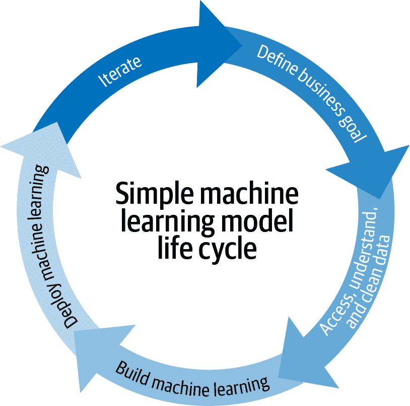
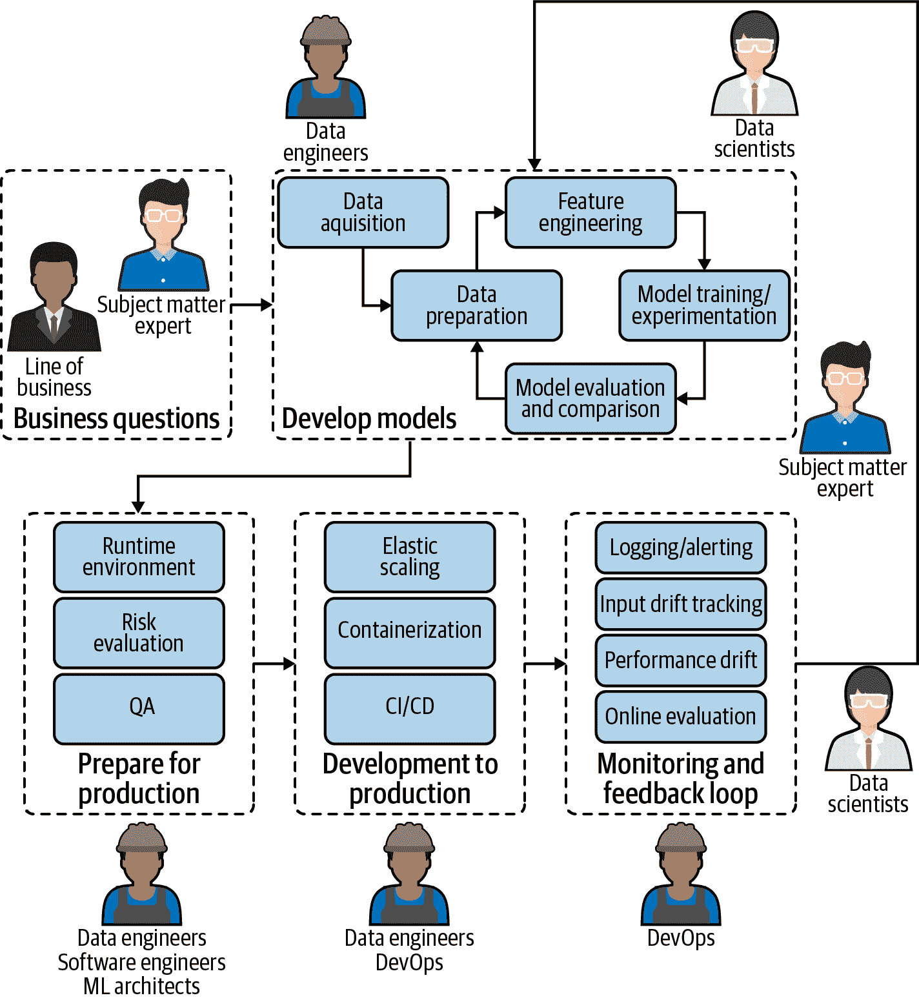
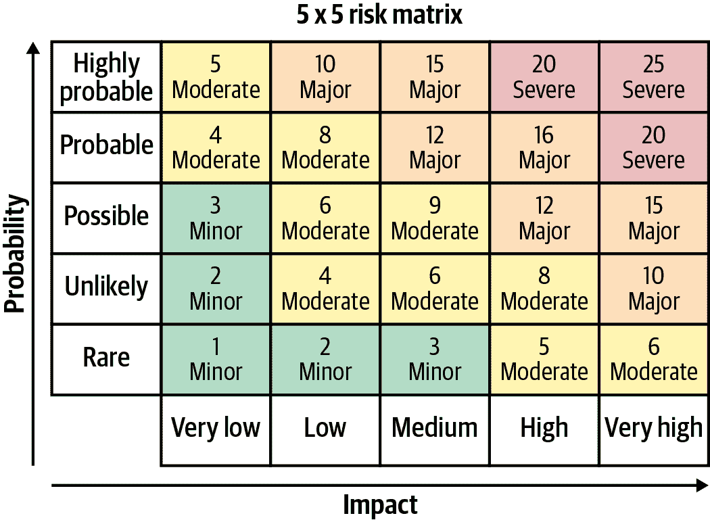

# 第一章：为何现在及挑战

机器学习运维（MLOps）迅速成为企业中成功部署数据科学项目的关键组成部分 (图 1-1)。这是一个帮助组织和业务领导者产生长期价值并降低与数据科学、机器学习和人工智能倡议相关风险的过程。然而，这是一个相对较新的概念；那么为什么它似乎一夜之间飙升到数据科学词汇中呢？本章介绍 MLOps 在高层次上的概述，它的挑战，为何它对企业成功的数据科学战略至关重要，以及为何现在成为前沿。

###### 图 1-1\. MLOps 指数增长的表现（而非“模型运维”术语的平行增长）

# 定义 MLOps 及其挑战

MLOps 的核心是标准化和优化机器学习生命周期管理（图 1-2）。但退一步想，为什么需要优化机器学习生命周期呢？从表面上看，仅仅从业务问题到机器学习模型的步骤在非常高的层面上似乎是直观的。

对于大多数传统组织而言，多个机器学习模型的开发和在生产环境中的部署相对较新。直到最近，模型数量可能在小规模范围内是可管理的，或者公司范围内对了解这些模型及其依赖关系的兴趣很少。随着决策自动化的增加（即决策在没有人类干预的情况下进行的增加），模型变得更加关键，与此同时，在公司层面管理模型风险变得更加重要。

在企业设置中，机器学习生命周期的现实要复杂得多，涉及需求和工具的复杂性 (图 1-3)。

###### 图 1-2\. 机器学习模型生命周期的简单表示，通常低估了与图 1-3 相比 MLOps 的需求。

管理大规模机器学习生命周期面临三个主要挑战的原因有三点：

+   存在许多依赖关系。数据不仅在不断变化，业务需求也在变化。必须持续向业务反馈结果，以确保生产环境中的模型现实与生产数据的预期一致，并且至关重要地解决原始问题或实现原始目标。

+   并非每个人都说同样的语言。尽管机器学习生命周期涉及来自业务、数据科学和 IT 团队的人员，但这些群体没有人使用相同的工具，甚至在许多情况下，也没有分享相同的基本技能以作为沟通的基础。

+   数据科学家不是软件工程师。大多数人专注于模型构建和评估，并不一定擅长编写应用程序。虽然随着一些数据科学家逐渐成为部署或运营方面的专家，这种情况可能会发生变化，但目前许多数据科学家发现自己不得不承担许多角色，这让他们难以彻底完成任何一项工作。当需要管理越来越多的模型时，数据科学家的压力会随着规模的扩大而变得尤为棘手。考虑到数据团队人员的流动性，数据科学家突然间不得不管理他们没有创建的模型，这种复杂性变得非常庞杂。

###### 图 1-3。今天平均组织内的机器学习模型生命周期的现实图景，其中涉及许多拥有完全不同技能集的人，他们通常使用完全不同的工具。

如果定义（或者甚至是名称 MLOps）听起来很熟悉，那是因为它很大程度上借鉴了 DevOps 的概念，它简化了软件变更和更新的实践。事实上，这两者有很多共同点。例如，它们都围绕着：

+   坚固的自动化和团队之间的信任

+   协作和团队间增加的沟通概念

+   端到端的服务生命周期（构建、测试、发布）

+   优先考虑持续交付和高质量

然而，MLOps 与 DevOps 之间有一个关键差异，使得后者不能立即转移到数据科学团队：将软件代码部署到生产环境与将机器学习模型部署到生产环境根本是两回事。尽管软件代码相对静态（“相对”是因为许多现代软件即服务 [SaaS] 公司确实有 DevOps 团队，可以很快迭代并多次每天在生产环境中部署），但数据始终在变化，这意味着机器学习模型在不断学习和适应——或者不适应，这取决于情况——新的输入。这种环境的复杂性，包括机器学习模型由代码和数据组成的事实，使 MLOps 成为一门新颖和独特的学科。

就像 DevOps 和后来的 DataOps 一样，直到最近，团队们大多数时候可以在没有定义和集中化流程的情况下进行。因为在企业级别，他们没有将机器学习模型部署到足够大规模的生产环境中。现在，情况已经发生了变化，团队们越来越寻求方法来规范多阶段、多学科、多阶段过程，以及具有异构环境和 MLOps 最佳实践框架，这绝非易事。本书的第二部分，“MLOps：如何”，将提供这一指导。

# MLOps 以缓解风险

对于任何一个在生产中有模型的团队来说，MLOps 都非常重要，因为根据模型的不同，持续的性能监控和调整至关重要。通过确保安全和可靠的运行，MLOps 是减少使用 ML 模型引发的风险的关键。然而，MLOps 实践确实会有成本，因此应该为每个用例进行适当的成本效益评估。

## 风险评估

当涉及到机器学习模型时，风险变化很大。例如，对于一个每月仅用于决定向客户发送哪些营销优惠的推荐引擎，风险要低得多，而对于一个旅行网站，其定价和收入依赖于机器学习模型，则风险要高得多。因此，在将 MLOps 视为减少风险的一种方式时，分析应该包括以下内容：

+   模型在某一段时间内不可用的风险

+   模型在给定样本上返回错误预测的风险

+   模型准确性或公平性随时间下降的风险

+   维护模型所需技能（即数据科学人才）流失的风险

针对广泛部署并且在组织外使用的模型，通常风险较大。如图 1-4，风险评估通常基于两个指标：不良事件的概率和影响。缓解措施通常基于两者的组合，即模型的严重性。风险评估应在每个项目开始时进行，并定期重新评估，因为模型可能以未预见的方式使用。

###### 图 1-4\. 一张表格，帮助决策者进行定量风险分析

## 风险缓解

MLOps 在风险缓解方面真正发挥了关键作用，特别是当一个集中化团队（其活动有独特的报告方式，这意味着在任何给定企业中可能存在多个这样的团队）拥有超过少数运行模型时。此时，如果没有标准化，很难全面了解这些模型的状态，而这种标准化可以采取适当的缓解措施来处理每一个模型（参见“匹配治理与风险水平”）。

在没有 MLOps 基础设施的情况下将机器学习模型推入生产环境存在许多风险，首要的原因是因为完全评估机器学习模型的性能通常只能在生产环境中完成。为什么？因为预测模型的表现只能和它们训练所用的数据一样好，这意味着训练数据必须很好地反映在生产环境中遇到的数据。如果生产环境发生变化，那么模型的性能可能会迅速下降（详情请参见第五章）。

另一个主要的风险因素是机器学习模型的性能通常对其运行的生产环境非常敏感，包括正在使用的软件和操作系统的版本。它们不太可能以经典软件意义上的错误为特征，因为大多数不是手工编写的，而是机器生成的。问题在于它们通常是构建在一堆开源软件之上（例如，像 scikit-learn、Python 或 Linux 这样的库），因此在生产环境中使用与验证模型时相匹配的这些软件版本非常重要。

推动模型投入生产并不是机器学习生命周期的最终步骤——远非如此。通常这只是开始监控其性能并确保其按预期行事的开端。随着越来越多的数据科学家开始将更多的机器学习模型推入生产环境，MLOps 在减轻潜在风险方面变得至关重要，如果出现问题，这些风险（取决于模型）可能对业务造成灾难性影响。监控同样至关重要，以便组织准确了解每个模型的广泛使用情况。

## 负责任的 AI 运营

机器学习的负责任使用（更常被称为负责任 AI）涵盖两个主要方面：

故意性

确保模型设计和行为与其目的一致。这包括确保用于人工智能项目的数据来自符合法规且无偏见的来源，以及在 AI 项目中采用协作方法，确保对潜在模型偏差进行多重检查和平衡。故意性还包括可解释性，即 AI 系统的结果应该可以由人类解释（理想情况下，不仅仅是创建系统的人类）。

责任制

集中控制、管理和审计企业 AI 工作——[无阴影 IT](https://oreil.ly/2k0G2)！责任制是关于全面了解哪些团队正在使用什么数据、如何使用以及在哪些模型中使用的整体视角。它还包括对数据可靠性的信任以及根据法规收集数据的需要，以及对用于哪些业务流程的模型的集中了解。这与可追溯性密切相关：如果出现问题，很容易找到出问题的管道的位置。

这些原则可能显而易见，但重要的是要考虑到机器学习模型缺乏传统命令式代码的透明度。换句话说，很难理解用于确定预测的特征是什么，这反过来又会使得很难证明模型符合必要的监管或内部治理要求。

实际上，通过引入自动化与机器学习模型相比，将责任的基本重点从层次结构的底部转移到顶部。也就是说，以前由个体贡献者在一定指导原则下（例如，一个给定产品的价格应该是多少，或者是否应该接受一个人的贷款申请）可能做出的决策，现在是由模型做出的。对于该模型的自动化决策负责的人可能是数据团队经理甚至是高管，这更加突显了负责任的 AI 的概念。

鉴于前面讨论的风险以及这些特定的挑战和原则，可以很容易地看出 MLOps 与负责任的 AI 之间的相互作用。团队必须有良好的 MLOps 原则来实践负责任的 AI，而负责任的 AI 则需要 MLOps 策略。考虑到这个话题的重要性，我们将在本书的多个阶段回顾它，探讨如何在 ML 模型的生命周期的每个阶段都要解决这个问题。

# MLOps 的规模化

MLOps 之所以重要不仅因为它有助于减少生产中机器学习模型的风险，而且它也是大规模部署机器学习工作的重要组成部分（从而从相应的规模经济中受益）。从生产中的一个或少数几个模型到对业务有积极影响的数十、数百甚至数千个模型的过渡，都需要 MLOps 的纪律。

良好的 MLOps 实践至少会帮助团队：

+   特别是在设计阶段进行实验时，要跟踪版本控制

+   理解重新训练的模型是否优于之前的版本（并推广性能更好的模型到生产环境）

+   确保（在每天、每月等定义的周期内）模型在生产中的性能没有下降

# 结语

在第三章中将详细讨论关键特性，但这里要指出的是，这些不是可选的实践。它们是不仅有效地在企业级别扩展数据科学和机器学习的基础上，而且以不会给企业带来风险的方式进行的基本任务。试图在没有适当的 MLOps 实践的情况下部署数据科学的团队将面临模型质量和连续性的问题，甚至更糟的是，他们将引入对公司影响不利的真实负面影响的模型（例如，偏见预测）。

MLOps 在更高层次上，也是机器学习透明策略的关键部分。高层管理和 C 级管理人员应该能够像数据科学家一样理解哪些机器学习模型被部署到生产环境中，以及它们对业务的影响。除此之外，他们可能还应该能够深入了解支持这些机器学习模型的整个数据流水线（即从原始数据到最终输出的步骤）。本书描述的 MLOps 能够提供这种透明度和责任感。
