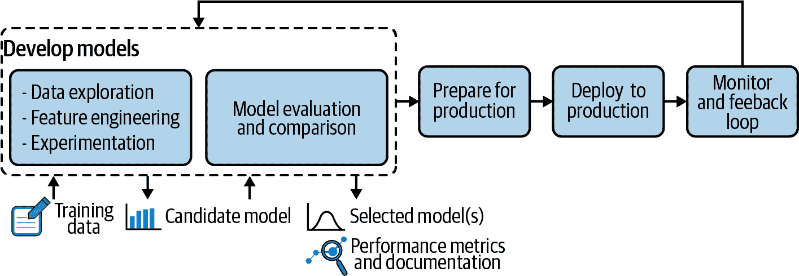
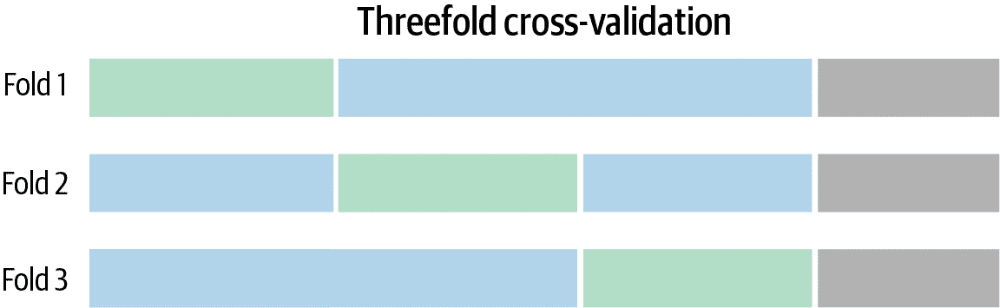

# 第四章：模型开发

阿德里安·拉瓦约特

任何希望认真对待 MLOps 的人都需要对模型开发过程有至少粗略的了解，这在图 4-1 中作为更大的 ML 项目生命周期的一个元素呈现。根据情况，模型开发过程可以从非常简单到极其复杂不等，并且它决定了后续使用、监控和维护模型的约束条件。

###### 图 4-1\. 模型开发在 ML 项目生命周期的更大背景中突出显示

数据收集过程对模型余生的影响非常直接，人们很容易看到模型如何变得陈旧。对于模型的其他部分，影响可能不那么明显。

例如，考虑特征创建，向模型提供日期与指示该日期是否为公共假日的标志可能会在性能上产生很大差异，但在更新模型时也伴随着显著不同的约束条件。或者考虑评估和比较模型所使用的指标如何在需要时实现自动切换到最佳版本。

因此，本章重点介绍了模型开发的基础知识，特别是在 MLOps 的背景下，即如何以使 MLOps 考虑更容易实施的方式构建和开发模型。

# 什么是机器学习模型？

机器学习模型在学术界和实际世界（即商业环境）中都得到了利用，因此区分它们在理论上代表什么与在实践中如何实现是非常重要的。让我们深入探讨这两者，基于我们在第三章中已经看到的内容。

## 在理论上

机器学习模型是现实的投射；也就是说，它是某个真实事物或过程的部分和近似表示。所表示的方面通常取决于可用和有用的内容。一旦训练完成，机器学习模型将简化为一个数学公式，在输入某些数据时产生结果——例如，某事件发生的概率估计或原始数字的估计值。

机器学习模型基于统计理论，机器学习算法是从训练数据中构建模型的工具。它们的目标是找到数据的综合表示，而这些数据代表了收集时的世界。因此，当未来看起来像过去时，机器学习模型可以用于进行预测，因为它们的综合表示仍然有效。

机器学习模型如何预测和泛化的一个常用例子是房屋价格。当然，房屋的销售价格取决于太多因素，这些因素过于复杂，无法精确建模，但足够接近以便有用并非难事。该模型的输入数据可能是房屋固有的事物，如房屋面积、卧室和浴室数量、建造年份、地理位置等，还可能包括其他更具上下文信息的内容，例如销售时的住房市场状况、卖方是否急于出售等。有了足够完整的历史数据，并且市场条件没有发生太大变化的情况下，算法可以计算出一个能够提供合理估计的公式。

另一个常见的例子是健康诊断或预测某人在特定时间内将会发展某种疾病。这种分类模型通常会输出某些事件发生的概率，有时还会附带置信区间。

## 在实践中

一个模型是重建和应用公式所需的参数集。它通常是无状态和确定性的（即，相同的输入始终产生相同的输出，但也有一些例外情况；参见“在线学习”）。

这包括最终公式本身的参数，但也包括从输入数据到将要产生值的最终公式的所有转换，以及可能的派生数据（例如分类或决策）。在实际操作中，给定这种描述，模型是否基于机器学习通常并不重要：它只是应用于输入数据的可计算数学函数，一次处理一行。

例如，在房价案例中，可能无法实际收集到足够的定价数据以获得在所有目标位置上足够准确的模型。因此，也许会用某些被认为对价格影响最大的派生输入替换邮政编码——比如平均收入、人口密度或接近某些便利设施的情况。但由于最终用户将继续输入邮政编码而不是这些派生输入，出于所有目的而言，所有这些转换也是定价模型的一部分。

输出也可以比一个单一数字更丰富。例如，一个检测欺诈的系统通常会提供某种概率（有时还可能是置信区间），而不是一个二元答案。根据欺诈的可接受程度以及后续验证或交易拒绝的成本，系统可能会设置为仅对概率达到一定精细调节阈值的欺诈实例进行分类。有些模型甚至包括建议或决策，例如为了最大化支出而向访客展示哪种产品，或者哪种治疗方法提供最可能的康复。

所有这些转换和相关数据在某种程度上都是模型的一部分；然而，这并不意味着它们总是捆绑在一个单一的、编译在一起的整体包中。这可能很快变得难以管理，此外，这些信息的某些部分还带有各种约束条件（不同的刷新率、外部来源等）。

## 所需的组件

构建机器学习模型需要许多组件，如表 4-1 中所述。

表 4-1\. 机器学习模型的必要组件

| 机器学习组件 | 描述 |
| --- | --- |
| 训练数据 | 训练数据通常是标记为预测案例的，例如所建模的例子（监督学习）。这听起来很明显，但重要的是要有*良好的*训练数据。一个说明性的例子是二战期间受损飞机的数据，这些数据受到幸存者偏见的影响，因此不适合作为训练数据。 ([链接](https://oreil.ly/sssfA)) |
| 性能指标 | 性能指标是正在开发的模型寻求优化的内容。应谨慎选择，以避免意外后果，如[眼镜蛇效应](https://oreil.ly/DYOss)（以一则著名轶事命名，奖励杀死眼镜蛇导致一些人开始饲养它们）。例如，如果数据中有 95% 的数据属于类 A，优化原始准确率可能会导致模型总是预测 A 并且准确率达到 95%。 |
| 机器学习算法 | 有各种工作方式和不同优缺点的模型。需要注意的是，一些算法更适合特定任务，但其选择还取决于需要优先考虑的因素：性能、稳定性、可解释性、计算成本等等。 |
| 超参数 | 超参数是 ML 算法的配置。算法包含基本的公式，它学习的*参数*是构成该特定预测任务的操作和操作数，而*超参数*是算法为了找到这些参数可能采取的方式。例如，在决策树中（数据根据在达到此路径的子集中看起来是最佳预测器的内容分割），一个超参数是树的深度（即分割的次数）。 |
| 评估数据集 | 在使用标记数据时，需要一个与训练集不同的评估数据集来评估模型在未见数据上的表现（即它能够进行泛化的程度）。 |

每个组件的数量和复杂性正是使得优秀的 MLOps 成为一项具有挑战性的任务的一部分。但是复杂性并不止于此，算法选择也是难题的另一部分。

## 不同的 ML 算法，不同的 MLOps 挑战

机器学习算法的共同特点是它们模拟过去数据中的模式以进行推断，而这种经验的质量和相关性是它们有效性的关键因素。它们的区别在于每种算法风格具有特定特征，并在 MLOps 中提出了不同的挑战（详见表 4-2）。

表 4-2\. 算法类型的 MLOps 考虑因素

| 算法类型 | 名称 | MLOps 考虑因素 |
| --- | --- | --- |
| 线性 | 线性回归 | 存在过拟合的倾向。 |
|   | 逻辑回归 | 存在过拟合的倾向。 |
| 基于树的 | 决策树 | 可能不稳定——数据的微小变化可能导致最优决策树结构的大变化。 |
| 随机森林 | 预测结果可能难以理解，这在负责任的人工智能视角下是个挑战。随机森林模型还可能相对缓慢地输出预测结果，这对应用程序构成了挑战。 |
| 梯度提升 | 像随机森林一样，预测结果可能难以理解。此外，特征或训练集的微小变化可能会导致模型发生根本性变化。 |
| 深度学习 | 神经网络 | 就可解释性而言，深度学习模型几乎是不可能理解的。深度学习算法（包括神经网络）训练速度极慢，需要大量资源（和数据）。资源值得投入吗？还是简单模型同样有效？ |

某些机器学习算法可以最好地支持特定用例，但治理考虑因素也可能影响算法选择。特别是在高度规管的环境中，必须解释决策的地方（例如金融服务），不能使用像神经网络这样的不透明算法；相反，它们必须偏向于像决策树这样的简单技术。在许多用例中，问题不在于性能的权衡，而在于成本的权衡。简单技术通常需要更昂贵的手工特征工程才能达到与更复杂技术相同的性能水平。

# 数据探索

当数据科学家或分析师考虑数据源来训练模型时，他们首先需要了解数据的实际情况。即使使用最有效的算法训练的模型，其好坏也取决于训练数据。在这个阶段，许多问题可能会导致数据全部或部分无用，包括不完整性、不准确性、不一致性等。

此类流程的示例包括：

+   记录数据收集方式及已经做出的假设

+   查看数据的总结统计：每列的域是什么？是否有缺失值的行？显而易见的错误？奇怪的异常值？或者根本没有异常值？

+   更详细地查看数据的分布情况

+   数据清洗、填充、重塑、过滤、剪切、采样等

+   检查不同列之间的相关性，对一些子群体进行统计检验，拟合分布曲线。

+   将该数据与文献中的其他数据或模型进行比较：是否存在某些常见信息似乎缺失？这些数据是否分布相当？

当然，在此探索过程中需要领域知识来做出明智的决策。一些异常可能很难在没有特定见解的情况下发现，而且所做的假设可能会对未经训练的人产生不明显的后果。工业传感器数据是一个很好的例子：除非数据科学家也是机械工程师或者设备专家，否则他们可能不知道对于特定机器来说什么是正常的、什么是奇怪的异常值。

# 特征工程和选择

特征是将数据呈现给模型的方式，帮助模型了解它本身无法推断出的事物。以下表格提供了特征工程的一些示例：

| 特征工程类别 | 描述 |
| --- | --- |
| 派生 | 从现有信息推断新信息，例如，这个日期是星期几？ |
| 丰富化 | 添加新的外部信息，例如，今天是否是公共假日？ |
| 编码 | 以不同方式呈现相同的信息，例如，工作日或周末中的星期几。 |
| 组合 | 将特征链接在一起，例如，积压的大小可能需要根据其中不同项目的复杂性进行加权。 |

例如，试图估计当前积压下的业务流程潜在持续时间时，如果输入之一是日期，则通常会推导出该日期对应的星期几或者距离下一个公共假日还有多久。如果企业服务的多个位置遵循不同的业务日历，这些信息也可能很重要。

另一个例子是继续上一节中的房屋定价场景，可以使用平均收入和人口密度，这样模型可以更好地泛化和训练更多样化的数据，而不是尝试按地区（即邮政编码）分割。

## 特征工程技术

有一个整个市场专门提供这种补充数据，远远超出了公共机构和公司分享的开放数据。一些服务提供直接的丰富化，可以节省大量时间和精力。

然而，有许多情况是数据科学家所需的信息并不可得。在这种情况下，有一些技术，比如影响编码，数据科学家通过替换模态值为该模态的目标平均值，使模型能够从类似范围的数据中受益（尽管会有一些信息损失）。

最终，大多数机器学习算法需要以数字表格的形式作为输入，每一行代表一个样本，所有样本来自同一数据集。当输入数据不是表格时，数据科学家可以使用其他技巧来转换它。

最常见的是*独热编码*。例如，一个可以取三个值的特征（例如，Raspberry、Blueberry 和 Strawberry）被转换为三个只能取两个值的特征—是或否（例如，Raspberry 是/否，Blueberry 是/否，Strawberry 是/否）。

另一方面，文本或图像输入需要更复杂的工程技术。深度学习最近通过提供将图像和文本转换为可供机器学习算法使用的数字表的模型彻底改变了这一领域。这些表被称为*嵌入*，它们使数据科学家能够进行迁移学习，因为它们可以在未经过培训的领域中使用。

## 特征选择如何影响 MLOps 策略

在特征的创建和选择方面，经常会出现如何在什么程度上及何时停止的问题。增加更多的特征可能会产生更准确的模型，在将数据分割为更精确组别时实现更多的公平性，或弥补其他有用的缺失信息。然而，这也伴随着一些不利因素，所有这些因素都可能对 MLOps 策略产生重大影响。

+   计算模型可能变得越来越昂贵。

+   更多的特征需要更多的输入和未来的维护。

+   更多的特征意味着某些稳定性的损失。

+   特征数量的增加可能引发隐私问题。

自动化特征选择可以通过使用启发式方法来估计某些特征对模型预测性能的关键性有所帮助。例如，可以查看与目标变量的相关性或快速在数据的代表性子集上训练一个简单模型，然后查看哪些特征是最强的预测因子。

如何选择使用哪些输入，如何对它们进行编码，它们如何相互作用或干扰—这些决策需要对机器学习算法的内部工作有一定的理解。好消息是，其中一些可以部分自动化，例如使用诸如 Auto-sklearn 或 AutoML 应用程序这样的工具，这些工具会将特征与给定目标进行交叉引用，以估计哪些特征、导数或组合可能会产生最佳结果，避免使用那些可能不会产生太大影响的特征。

其他选择仍然需要人工干预，例如决定是否尝试收集可能改进模型的附加信息。花时间构建业务友好的特征通常会提高最终性能，并简化最终用户的采用，因为模型解释可能更简单。这也可以减少建模债务，帮助数据科学家理解主要的预测驱动因素，并确保它们的稳健性。当然，在理解模型所需时间的成本与预期价值之间，以及与模型使用相关的风险之间需要权衡考虑。

底线是，在构建模型时，工程和选择特征的过程，就像许多其他 ML 模型组件一样，是在考虑 MLOps 组件和性能之间的微妙平衡。

# 实验

实验发生在整个模型开发过程中，通常每个重要决策或假设都至少伴随着一些实验或先前的研究来加以证明。实验可以采用多种形式，从构建成熟的预测 ML 模型到进行统计测试或绘制数据。实验的目标包括：

+   评估在表 4-1 中概述的元素给定的模型有多有用或多好。（下一节将更详细地讨论模型评估和比较。）

+   找到最佳的建模参数（算法、超参数、特征预处理等）。

+   调整偏差/方差权衡以适应给定训练成本的“最佳”定义。

+   找到模型改进和改进的计算成本之间的平衡。（由于总是有改进的空间，那么好有多好？）

在进行实验时，数据科学家需要能够快速迭代地尝试表 4-1 中每个模型构建模块的所有可能性。幸运的是，有工具可以半自动化地完成所有这些，您只需要定义应该测试的内容（可能性的空间），这取决于先前的知识（什么是有意义的）和约束条件（例如计算预算）。

一些工具甚至允许更多自动化，例如通过提供分层模型训练。例如，假设企业希望预测产品的顾客需求以优化库存，但各店的行为差异很大。分层建模包括为每个店铺训练一个模型，可以更好地针对每个店铺进行优化，而不是一个试图在所有店铺中进行预测的模型。

尝试所有可能的超参数组合、特征处理等，很快就变得无法追踪。因此，定义实验的时间和/或计算预算以及模型实用性的可接受阈值（更多关于该概念的内容将在下一节讨论）非常有用。

值得注意的是，这个过程的全部或部分可能需要在任何情况变化时重复（包括数据和/或问题约束发生重大变化时；参见“实践中的漂移检测”）。最终，这意味着所有为数据科学家们在模型到达最终决策时所做的实验以及沿途所有的假设和结论都可能需要重新运行和重新审视。

幸运的是，越来越多的数据科学和机器学习平台不仅允许在第一次运行时自动化这些工作流程，而且还可以保留所有处理操作以便重复使用。有些还允许使用版本控制和实验分支派生来测试理论，然后合并、丢弃或保留它们（参见“版本管理与可重复性”）。

# 评估和比较模型

二十世纪英国统计学家乔治·E·P·博克斯曾经说过，所有模型都是错误的，但有些是有用的。换句话说，模型不应该追求完美，而是应该达到“足够好以便有用”的标准，同时要注意神秘谷效应——通常是一个看起来做得很好的模型，但在特定情况下（比如，少数群体）却表现糟糕（甚至灾难性）。

因此，重要的是在上下文中评估模型，并具备一定的能力将其与之前的模型或基于规则的过程进行比较，以了解如果当前模型或决策过程被新模型取代，结果将会如何。

一个技术上可以被认为是令人失望的绝对表现的模型，仍然有可能改善现有情况。例如，对某种产品或服务的需求有稍微更精确的预测可能会导致巨大的成本节约。

相反，得分完美的模型是可疑的，因为大多数问题的数据中存在噪声，这些噪声至少在某种程度上很难预测。完美或接近完美的得分可能表明数据中存在泄漏（即被预测的目标也在输入数据中，或者输入特征与目标非常相关，但在实际中只有在目标已知时才可用），或者模型过度拟合训练数据，无法很好地泛化。

## 选择评估指标

为了评估和比较不同模型的适当指标，针对给定问题选择适当的度量标准可能导致非常不同的模型（可以想象一下表 4-1 中提到的眼镜蛇效应）。一个简单的例子：对于自动分类问题，通常使用准确率，但当类别不平衡时（即一个结果比另一个结果发生的可能性非常小），准确率很少是最佳选择。在一个二元分类问题中，正类（即有趣的预测类，因为其预测会触发某种行动）很少见，例如发生的 5%的情况，一个总是预测负类的模型因此准确率为 95%，但同时也是毫无用处的。

不幸的是，并不存在一种适合所有的指标。你需要选择一个与手头问题匹配的指标，这意味着理解指标的限制和权衡（数学方面）以及它们对模型优化的影响（业务方面）。

为了了解模型的泛化能力如何，该指标应在未用于模型训练的数据部分上进行评估（保留数据集），这种方法称为*交叉测试*。可能有多个步骤，在这些步骤中，一些数据被保留用于评估，其余数据则用于训练或优化，如度量评估或超参数优化。还有不同的策略，不一定只是简单的分割。例如，在*k*-折交叉验证中，数据科学家多次轮换保留用于评估和训练的部分。这增加了训练时间，但能够提供指标稳定性的想法。

在简单分割中，保留数据集可以包含最近的记录，而不是随机选择的记录。实际上，由于模型通常用于未来预测，因此评估它们就像在最新数据上进行预测一样，可以得出更真实的估计。此外，这还可以评估数据在训练和保留数据集之间是否发生漂移（有关更多详细信息，请参阅“实际中的漂移检测”）。

例如，图 4-2 展示了一种方案，其中测试数据集是保留的（灰色），以执行评估。其余数据分为三部分，通过在每个蓝色数据集上使用给定组合训练模型三次，并在各自的绿色数据集上验证其性能，来找到最佳超参数组合。灰色数据集仅在最佳超参数组合下使用一次，而其他数据集则与所有组合一起使用。

###### 图 4-2\. 模型评估的数据集分割示例

通常，数据科学家希望定期使用相同的算法、超参数、特征等对模型进行重新训练，但使用更新的数据。自然而然地，下一步是比较两个模型，看看新版本的表现如何。但同样重要的是确保所有先前的假设仍然成立：问题没有根本性转变，先前做出的建模选择仍然适合数据等。这更具体地属于性能和漂移监控的一部分（在第七章中可以找到更多详细信息）。

## 检查模型行为

在评估模型时，除了原始指标外，了解其行为方式至关重要。根据模型预测、决策或分类的影响，可能需要更深入或更浅显的理解。例如，数据科学家应该采取合理步骤（尊重该影响），以确保模型不会造成实质性伤害：例如，预测*所有*患者都需要由医生检查的模型，在原始预防方面可能得分很高，但在现实资源分配方面则可能不那么理想。

这些合理步骤的示例包括：

+   交叉检查不同的度量（而不仅仅是模型最初优化的那些）

+   检查模型对不同输入的反应方式，例如，绘制某些输入值的平均预测（或分类模型的概率），看看是否存在异常或极端变化情况。

+   分割一个特定维度并检查不同子群体间行为和度量的差异，例如，男性和女性的错误率是否相同？

这些全局分析不应被理解为因果关系，而只是相关性。它们并不一定暗示某些变量与结果之间的特定因果关系；它们仅仅展示了模型如何看待这种关系。换句话说，应谨慎使用模型进行假设分析。如果一个特征值发生了变化，那么如果这个新特征值在训练数据集中从未见过，或者从未与该数据集中其他特征的值组合过，模型的预测可能会是错误的。

当比较模型时，这些不同的方面应该对数据科学家可见，他们需要能够深入了解而不仅仅是单一的度量标准。这意味着完整的环境（交互式工具、数据等）应该对所有模型都可用，理想情况下允许从所有角度和所有组件之间进行比较。例如，对于漂移，比较可能会使用相同的设置但不同的数据，而对于建模性能，则可能使用相同的数据但不同的设置。

## 负责任的人工智能对建模的影响

根据情况（有时也取决于行业或企业部门），除了对模型行为的一般理解之外，数据科学家还可能需要模型的单独预测是可解释的，包括对推动预测朝某个方向的具体特征有所了解。有时，特定记录的预测可能与平均值非常不同。计算单独预测解释的流行方法包括夏普利值（特征值在所有可能联盟中的平均边际贡献）和个体条件期望（ICE）计算，这些方法显示了目标函数与感兴趣特征之间的依赖关系。

例如，特定激素的测量水平通常会促使模型预测某人存在健康问题，但对于怀孕的女性来说，该水平使模型推断她没有这种风险。某些法律框架要求对模型做出的对人类有后果的决定提供某种程度的可解释性，例如推荐拒绝贷款。“元素 2：偏见”详细讨论了这个主题。

注意，可解释性的概念有几个方面。特别是，深度学习网络有时被称为*黑匣子*模型，因为它们的复杂性（尽管在阅读模型系数时，一个模型是完全指定的，通常是一个概念上非常简单的公式，但是一个非常庞大的公式，变得不可能直观理解）。相反，全局和局部解释工具——如部分依赖图或沙普利值计算——提供了一些洞见，但可以说并没有使模型变得直观。要真正传达对模型正在做什么的严格而直观的理解，需要限制模型的复杂性。

公平性要求还可能对模型开发产生尺寸约束。考虑这个理论例子以更好地理解偏见问题的重要性：一个总部位于美国的组织定期雇佣从事相同类型工作的人员。数据科学家可以训练一个模型来预测员工的绩效，根据各种特征，然后人们将根据他们成为高绩效员工的概率被聘用。

尽管这个问题看起来很简单，不幸的是，它充满了陷阱。为了使这个问题完全假设化，并将其与现实世界的复杂性和问题分离开来，让我们假设工作人口中的每个人都属于两个群体之一：韦奎人或托格鲁塔人。

对于这个假设性的例子，让我们假设韦奎人中有更大比例的人上大学。从一开始，韦奎人会因此而受到偏见的影响（因为他们通过多年的经验发展了他们的技能）。

结果是，申请者池中不仅会有更多的韦奎人而不是托格鲁塔人，而且韦奎人的申请者往往更有资格。雇主在未来一个月需要招聘 10 人。它应该怎么做？

+   作为一个平等机会的雇主，它应该确保招聘过程的公平性，因为它控制着这一过程。这意味着在数学术语中，对于每个申请者，一切条件相等的情况下，被录用（或不被录用）不应取决于他们所属的群体（在本例中为韦奎人或托格鲁塔人）。然而，这本身会导致偏见，因为韦奎人更有资格。注意，“一切条件相等”可以有多种解释，但通常的解释是，该组织可能不会被认为对其不控制的过程负责。

+   雇主可能还需要避免不平等影响，即就业实践对一个受保护特征群体的不利影响大于对另一个群体的影响。不平等影响是针对亚群体进行评估的，而不是针对个人；实际上，它评估的是公司是否与韦奎人和托格鲁塔族的比例一样多地雇佣了人。再次强调，目标比例可能是申请者的比例或总体人口的比例，尽管前者更有可能，因为组织无法对其控制之外的过程中的偏见负责。

这两个目标是互斥的。在这种情况下，平等机会会导致招聘 60%（或更多）的韦奎人和 40%（或更少）的托格鲁塔族。因此，这个过程对这两个群体产生了不平等影响，因为招聘率不同。

相反，如果过程经过修正，以使得被雇佣的人中有 40%是托格鲁塔族，以避免不平等影响，这意味着一些被拒绝的韦奎人申请者被预测为比一些被接受的托格鲁塔族申请者更合格（这与平等机会的声明相矛盾）。

需要进行权衡——有时法律称之为 80%法则。在这个例子中，这意味着托格鲁塔族的雇佣率应等于或大于韦奎人雇佣率的 80%。在这个例子中，这意味着可以雇佣高达 65%的韦奎人。

这里的重点在于，定义这些目标不能仅由数据科学家决定。但即使一旦定义了这些目标，实施本身也可能存在问题：

+   没有任何迹象的话，数据科学家自然会尝试构建平等机会的模型，因为这些模型符合世界的实际情况。大多数数据科学家使用的工具也试图实现这一目标，因为这是最符合数学原理的选择。然而，有些实现这一目标的方式可能是非法的。例如，数据科学家可以选择实施两个独立的模型：一个用于韦奎人，一个用于托格鲁塔族。这可能是解决由训练数据集中韦奎人过度代表性引起的偏见的一种合理方式，但这会导致对这两个群体的不平等对待，可能被认为是歧视性的。

+   为了让数据科学家按照工具设计的方式使用它们（即模拟实际世界），他们可以决定对预测结果进行后处理，使其符合组织对世界应该是什么样的愿景。最简单的做法是为韦奎人选择一个比托格鲁塔族更高的阈值。它们之间的差距将调整“平等机会”和“平等影响”之间的权衡，但由于不平等对待的原因，这仍可能被认为是歧视性的。

在这个问题上，数据科学家可能无法独自解决问题（请参阅“负责任人工智能的关键要素”以获取更广泛的视角）。这个简单的例子说明了这个主题的复杂性，考虑到可能存在许多受保护的属性，以及偏见既是业务问题也是技术问题。

因此，解决方案在很大程度上取决于上下文。例如，Weequay 和 Togruta 的这个示例代表了使用户获得权限的过程。如果该过程对用户有负面影响（如导致交易被拒绝的欺诈预测）或者是中立的（如疾病预测），情况就不同了。

# 版本管理和可复现性

讨论模型的评估和比较（如前文所述的公平性，以及许多其他因素）必然会提出版本控制和不同模型版本的可复现性的概念。由于数据科学家正在构建、测试和迭代多个模型版本，他们需要能够清楚地保持所有版本。

版本管理和可复现性解决了两个不同的需求：

+   在实验阶段，数据科学家可能会在不同的决策之间来回摆动，尝试不同的组合，并在产生不理想结果时回退。这意味着能够回到不同的实验“分支”的能力——例如，在实验过程中恢复项目的先前状态，当时的实验过程导致了死胡同。

+   几年后，数据科学家或其他人（审计员、经理等）可能需要重放导致模型部署的计算，这些计算是在首次进行实验几年后进行的。

当一切都基于代码时，版本控制技术已经在某种程度上得到了解决。现代数据处理平台通常为数据转换管道、模型配置等提供类似的能力。当然，合并几个部分没有合并分歧的代码那么简单，但基本需求是能够回到某个特定实验，即使只是为了能够复制其设置以在另一个分支中复制它们。

模型的另一个非常重要的属性是可复现性。经过许多实验和调整后，数据科学家可能会得到一个符合要求的模型。但在此之后，运行模型需要在另一个环境中重现模型，可能还需要从不同的起始点开始。可重复性也使得调试变得更加容易（有时甚至只是可能）。为此，模型的所有方面都需要进行文档化和可重复使用，包括：

假设

当数据科学家在做出关于手头问题、其范围、数据等的决策和假设时，所有这些都应该是明确的并且记录下来，以便随时与任何新信息进行对比。

随机性

许多机器学习算法和过程（例如采样）使用伪随机数。能够精确地重现实验，如用于调试，意味着要控制这种伪随机性，通常是通过控制生成器的“种子”（即使用相同种子初始化的相同生成器将产生相同的伪随机数序列）。

数据

要实现重复性，必须有相同的数据可用。这有时可能会有些棘手，因为版本化数据所需的存储容量可能会因更新速度和数量而受到限制。此外，与代码分支不同，数据分支尚未拥有如此丰富的工具生态系统。

设置

这是一个已知的事实：所有已完成的处理必须在相同的设置下可再现。

结果

开发人员使用合并工具来比较和合并不同的文本文件版本，而数据科学家需要能够比较从混淆矩阵到偏依赖图的深度模型分析，以获得满足要求的模型。

实施

同一模型的微小不同实现实际上可能会产生不同的模型，足以改变某些接近调用的预测。并且模型越复杂，这些差异发生的可能性就越高。另一方面，批量使用模型对数据集进行评分与在 API 中实时评分单个记录具有不同的约束条件，因此有时可能需要为同一模型进行不同的实现。但在调试和比较时，数据科学家需要记住可能的差异。

环境

考虑到本章涵盖的所有步骤，显然一个模型不仅仅是其算法和参数。从数据准备到评分实现，包括特征选择、特征编码、丰富化等，这些步骤运行的环境可能更多或更少地与结果隐含相关。例如，一个在某一步骤中涉及的 Python 包的稍有不同版本可能以难以预测的方式改变结果。最好，数据科学家应确保运行时环境也是可重复的。鉴于机器学习的发展速度，这可能需要冻结计算环境的技术。

幸运的是，与版本和可再现性相关的底层文档任务的一部分可以自动化，并且使用集成平台进行设计和部署可以通过确保结构化信息传输大大降低可再现性成本。

显然，虽然可能不是模型开发中最吸引人的部分，但版本管理和可重现性对于在现实世界的组织环境中构建机器学习工作至关重要，其中包括治理和审计在内。

# 结语

模型开发是 MLOps 中最关键和最具影响力的步骤之一。在这个阶段必须回答许多技术问题，这些问题对模型的整个生命周期中的所有方面都有重大影响。因此，暴露、透明度和协作对长期成功至关重要。

模型开发阶段也是数据科学家等个人经常实践的阶段，在 MLOps 之前的世界中，这通常代表整个机器学习工作，生成的模型将会按原样使用（带有其所有的后果和局限性）。

¹ CycleGAN 是由 Jun-Yan Zhu、Taesung Park、Phillip Isola 和 Alexei A. Efros 的最新研究实现的。
