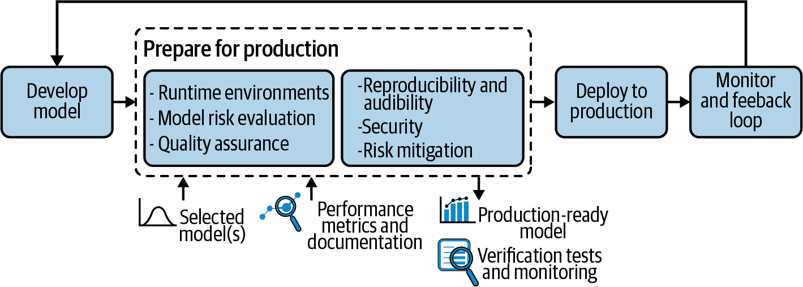

# 第五章：准备生产

Joachim Zentici

确认某些东西在实验室中运行良好从来不是它在真实世界中运行良好的确切标志，机器学习模型也不例外。生产环境通常与开发环境大不相同，而与生产中模型相关的商业风险则更大。重要的是要理解和测试生产过渡的复杂性，并充分减轻潜在风险。

本章探讨了为生产做好准备所需的步骤（在整个生命周期的背景下突出显示在图 5-1 中）。目标是通过扩展来说明必须考虑的用于强大 MLOps 系统的元素。

###### 图 5-1。在 ML 项目生命周期的更大背景下突出显示的准备生产

# 运行时环境

将模型部署到生产环境的第一步是确保技术上可行。正如在第三章中讨论的那样，理想的 MLOps 系统更倾向于快速、自动化的部署，而不是繁琐的流程，运行时环境可能会极大地影响哪种方法更为主流。

生产环境采用多种形式：定制服务、数据科学平台、像 TensorFlow Serving 这样的专用服务、低级基础设施如 Kubernetes 集群、嵌入式系统上的 JVM 等等。更复杂的是，考虑到某些组织中存在多个异构的生产环境并存。

理想情况下，运行在开发环境中的模型可以直接验证并如同原样送到生产环境；这样可以最小化适应工作量，并提高模型在生产中表现与开发中一致的机会。不幸的是，这种理想情况并不总是可能的，有时团队在长期项目完成后却发现无法投入生产。

## 从开发到生产环境的适应

在适应工作方面，从开发到生产平台的两端可能来自同一供应商或者可互操作，开发模型可以在生产中无需任何修改即可运行。在这种情况下，将模型推送到生产所需的技术步骤被简化为几次点击或命令，所有的努力都可以集中在验证上。

另一方面，有些情况下需要从头开始重新实现模型，可能是由另一个团队完成，可能是用另一种编程语言。考虑到所需的资源和时间，今天有很少的情况适合这种方法。然而，在许多组织中，这仍然是现实，并且往往是由于缺乏合适的工具和流程。事实上，将模型交给另一个团队重新实现并适应生产环境意味着该模型可能需要数月（甚至数年）才能投入生产，如果能投入的话。

在这两种极端情况之间，可以对模型或与其环境的交互执行许多转换。在所有情况下，至关重要的是在尽可能接近生产环境的环境中进行验证，而不是在开发环境中进行验证。

### 工具考虑

发送到生产环境所需的格式应该早早考虑，因为它可能对模型本身和生产工作的数量产生重大影响。例如，当使用 scikit-learn（Python）开发模型，而生产环境是期望输入 PMML 或 ONNX 的基于 Java 的环境时，显然需要进行转换。

在这种情况下，团队应在开发模型时设置工具链，最好在第一个版本完成甚至开始之前。如果未能提前创建此流程，将会阻塞验证过程（当然，最终验证不应该在 scikit-learn 模型上执行，因为它不是将投入生产的模型）。

### 性能考虑

另一个常见的转换需求是出于性能考虑。例如，Python 模型通常在对单个记录进行评分时的延迟要高于其转换为 C++ 的等效模型。由此产生的模型可能会快几十倍（尽管显然这取决于许多因素，结果也可能是速度慢几十倍的模型）。

当生产模型必须在低功耗设备上运行时，性能也是一个考虑因素。例如，在深度神经网络的特定情况下，训练模型可能会变得极其庞大，拥有数十亿或数百亿个参数。在小设备上运行它们简直是不可能的，而在标准服务器上运行它们可能会慢且昂贵。

对于这些模型，仅优化运行时是不够的。为了获得更好的性能，必须优化模型定义。一种解决方案是使用压缩技术：

+   通过量化，模型可以使用 32 位浮点数进行训练，并以较低精度进行推断，从而减少模型的内存需求并提高速度，同时基本保持精度。

+   通过修剪，可以简单地从神经网络中移除权重（甚至整个层）。这是一个相当激进的方法，但一些方法可以保持精度。

+   使用蒸馏，可以训练一个更小的“学生”网络来模仿一个更大、更强大的网络。如果操作得当，这可以比直接从数据训练更小的网络得到更好的模型。

如果初始模型在训练时减少信息损失，这些方法就会非常有效，因此这些操作不仅仅是事后将训练好的模型进行转换，而是调整模型训练方式的方向。这些方法虽然很新，也很先进，但在预训练的自然语言处理（NLP）模型中已经广泛应用。

## 在验证和投入生产之前获取数据访问权限

另一个需要在验证和投入生产之前解决的技术问题是数据访问。例如，评估公寓价格的模型可能会使用邮政编码区域的市场平均价格；然而，请求评分的用户或系统可能不会提供这个平均值，而只会提供邮政编码，这意味着需要查找以获取平均值。

在某些情况下，数据可以被冻结并与模型捆绑。但当这不可能时（例如，数据集太大或丰富数据需要始终保持最新状态），生产环境应该访问数据库，因此必须安装适当的网络连接、库或驱动程序以与数据存储通信，并存储在某种形式的生产配置中的认证凭据。

在实践中管理这种设置和配置可能非常复杂，因为它需要适当的工具和协作（特别是在扩展到超过几十个模型时）。在使用外部数据访问时，在与生产紧密匹配的情况下进行模型验证尤为关键，因为技术连接常常是生产故障的常见源头。

## 对运行时环境的最终思考

训练模型通常是最耗费计算资源的过程，需要高级软件技术、海量数据和配置强大的 GPU 高端机器。但在模型的整个生命周期中，大部分计算资源很可能都会在推理时消耗（即使这种计算比训练简单和快得多）。这是因为模型只需训练一次，就可以用于数十亿次推理。

在复杂模型上扩展推理可能非常昂贵，并且具有显著的能源和环境影响。降低模型复杂性或压缩极其复杂的模型可以降低操作机器学习模型的基础设施成本。

重要的是要记住，并非所有应用程序都需要深度学习，事实上，并非所有应用程序都需要机器学习。在生产中控制复杂性的一种有价值的实践是仅开发复杂模型以提供看似可行的基准。然后，投入生产的可以是一个更简单的模型，具有降低操作风险、提高计算性能和降低功耗的优点。如果简单模型接近高复杂性基准，那么它可能是更为理想的解决方案。

# 模型风险评估

在探讨在理想的 MLOps 系统中如何进行验证之前，重要的是考虑验证的目的。如第四章所述，模型试图模拟现实，但它们是不完美的；它们的实施可能存在错误，环境也可能存在问题。模型在生产中可能产生的间接实际影响从未确定，看似微不足道的零件故障可能在复杂系统中造成巨大后果。

## 模型验证的目的

在某种程度上，预见在生产中模型的风险并设计和验证以尽量减少这些风险是可能的（更不用说绝对必要的）。随着组织变得越来越复杂，了解机器学习在企业中的大多数应用中无意故障或恶意攻击潜在威胁的重要性至关重要，这不仅限于金融或与安全相关的应用。

在将模型投入生产之前（事实上，从机器学习项目开始的时候就应该如此），团队应该问一些不舒服的问题：

+   如果模型以最坏的可能方式行事会发生什么？

+   如果用户成功提取了训练数据或模型的内部逻辑会发生什么？

+   金融、商业、法律、安全和声誉风险是什么？

对于高风险应用程序，整个团队（特别是负责验证的工程师）充分了解这些风险至关重要，以便他们可以适当地设计验证流程，并应用适合风险程度的严格性和复杂性。

在许多方面，机器学习风险管理涵盖了许多行业（如银行和保险业）中已经建立的模型风险管理实践。然而，机器学习引入了新类型的风险和责任，随着数据科学的普及化，涉及到许多没有传统模型风险管理经验的新组织或团队。

## ML 模型风险的起源

由于数学原因，机器学习模型可能带来的风险大小难以建模，同时风险的具体化是通过真实世界的后果而来。机器学习指标，特别是成本矩阵，允许团队评估在其“标准”情况下运行模型的平均成本，即在其交叉验证数据上，与运行完美的魔法模型相比。

尽管计算预期成本非常重要，但是事情出了意外的范围远远超出了预期成本。在某些应用中，风险可能是财务上无限的责任，个人的安全问题，或者对组织的生存威胁。机器学习模型的风险主要源自：

+   在设计、训练或评估模型（包括数据准备）中的错误或缺陷

+   运行框架中的错误，模型后处理/转换中的错误，或者模型与其运行时之间的隐藏不兼容性。

+   训练数据质量低

+   生产数据与训练数据之间的高差异

+   预期错误率，但是失败的后果比预期更严重

+   模型的误用或其输出的误解

+   对抗性攻击

+   法律风险，特别是来自版权侵权或对模型输出的责任

+   由于偏见、机器学习的不道德使用等而引起的声誉风险。

风险的具体化概率及其大小可能会被以下因素放大：

+   模型的广泛应用

+   环境快速变化

+   模型之间复杂的交互作用

以下部分详细介绍了这些威胁及其如何减轻，这应该是组织实施的任何 MLOps 系统的最终目标。

# 机器学习的质量保证

软件工程已经为质量保证（QA）开发了一套成熟的工具和方法，但是数据和模型的等效物仍处于初级阶段，这使得将其纳入 MLOps 流程变得具有挑战性。统计方法以及文档编写的最佳实践是众所周知的，但在规模上实施并不常见。

尽管本章在为生产准备的一部分中进行了覆盖，但要明确的是，机器学习的质量保证并不仅限于最终验证阶段；相反，它应伴随模型开发的所有阶段进行。其目的是确保符合流程以及机器学习和计算性能要求，并且其详细程度与风险水平成比例。

如果负责验证的人员不是开发模型的人员，他们足够了解机器学习并理解风险非常重要，以便设计适当的验证或检测开发团队提出的验证中的漏洞。组织的结构和文化赋予他们适当报告问题和促进持续改进或阻止投入生产的权威同样至关重要，如果风险水平合理，必须有权利行使它。

强大的 MLOps 实践规定，在发送到生产之前进行 QA 不仅仅是技术验证。这也是创造文档和根据组织指南验证模型的机会。特别是，这意味着所有输入数据集、预训练模型或其他资产的来源都应该是已知的，因为它们可能受到法规或版权的约束。出于这个原因（特别是出于计算机安全原因），一些组织选择只允许白名单依赖项。虽然这可能会显著影响数据科学家快速创新的能力，尽管依赖项列表可以部分自动报告和检查，但也可以提供额外的安全性。

# 主要测试考虑因素

显然，模型测试将包括将模型应用于精心筛选的数据，并根据要求验证测量。数据的选择或生成方式以及所需的数据量至关重要，但这将取决于模型处理的问题。

有一些情况下，测试数据不应总是与“真实世界”数据匹配。例如，准备一定数量的场景可能是一个好主意，其中一些场景应该与现实情况相匹配，其他数据应特别生成以可能引发问题的方式（例如，极端值、缺失值）。

必须收集统计（准确性、精度、召回率等）以及计算（平均延迟、第 95 百分位延迟等）方面的度量，并且如果对它们的一些假设未经验证，则测试场景应该失败。例如，如果模型的准确性低于 90％、平均推断时间超过 100 毫秒或超过 5％的推断时间超过 200 毫秒，则测试应该失败。这些假设也可以称为*期望*、*检查*或*断言*，就像传统软件工程中一样。

对结果进行统计测试也是可能的，但通常用于子群体。能够比较模型与其先前版本也很重要。它可以实施冠军/挑战者方法（详细描述在“冠军/挑战者”）或检查指标是否突然下降。

除了验证机器学习和计算性能指标之外，模型稳定性是一个重要的测试属性需要考虑。当略微改变一个特征时，预期结果会有轻微变化。尽管这并非总是正确的，但通常是一个期望的模型属性。一个非常不稳定的模型会引入很多复杂性和漏洞，同时即使具有良好的性能，模型也可能感觉不可靠，这会带来令人沮丧的体验。关于模型稳定性没有单一的答案，但一般来说，更简单或更规范化的模型表现出更好的稳定性。

# 可复现性和可审计性

在 MLOps 中，可复现性与学术界并不具有相同的意义。在学术界，可复现性基本上意味着实验的发现描述得足够好，以至于另一位胜任的人士仅凭解释就能复制实验，如果该人没有任何错误，他们将得出相同的结论。

一般而言，在 MLOps 中，可复现性还包括轻松重新运行完全相同的实验的能力。这意味着模型配备了详细的文档、用于训练和测试的数据，并且具有捆绑模型实现以及运行环境完整规范的工件（参见“版本管理和可复现性”）。可复现性对证明模型发现至关重要，同时也有助于调试或在先前实验基础上进行构建。

可审计性与可复现性有关，但它增加了一些要求。要使模型可审计，必须能够从中心和可靠的存储访问整个 ML 管道的完整历史，并轻松获取所有模型版本的元数据，包括：

+   全面的文档

+   一个工件，允许在其精确的初始环境中运行模型

+   测试结果，包括模型解释和公平性报告

+   详细的模型日志和监控元数据

可审计性在某些高度监管的应用程序中可能是一种义务，但对所有组织都有益处，因为它可以促进模型调试、持续改进，并跟踪行动和责任（这是负责任地应用机器学习的治理的重要组成部分，详细讨论见第八章）。用于机器学习和因此 MLOps 过程的完整 QA 工具链应该提供对模型性能符合要求的清晰视图，同时也促进可审计性。

即使在 MLOps 框架允许数据科学家（或其他人员）找到具有所有元数据的模型时，理解模型本身仍然可能具有挑战性（详见“负责任人工智能对建模的影响”进行详细讨论）。

要在实践中产生强大的影响，审计必须允许直观地理解系统的所有部分及其版本历史。这并不改变理解机器学习模型（甚至是相对简单的模型）需要适当的培训的事实，但根据应用的关键性，更广泛的受众可能需要能够理解模型细节。因此，全面的审计性需要付出一定的成本，这应该与模型本身的关键性取得平衡。

# 机器学习安全

作为一款软件，部署在其服务框架中的模型可能存在多个安全问题，从低级别的故障到社会工程学。机器学习引入了一系列潜在威胁，攻击者提供恶意数据，旨在使模型出错。

有许多潜在攻击案例。例如，垃圾邮件过滤器是机器学习的早期应用，基本上是基于对字典中的单词进行打分。垃圾邮件创作者避免检测的一种方法是避免使用这些确切的单词，同时仍然使其消息对人类读者易于理解（例如，使用异国情调的 Unicode 字符，故意引入拼写错误或使用图像）。

## 对抗攻击

一个更现代但相当类似的例子是机器学习模型安全问题中的对抗攻击，特别是针对深度神经网络的对抗攻击，其中对人眼来说可能看起来微小甚至不可能察觉的图像修改可以导致模型显著改变其预测。其核心思想在数学上相对简单：由于深度学习推理本质上是矩阵乘法，精心选择的小扰动系数可以导致输出数字的大幅变化。

[这个例子](https://arxiv.org/abs/1707.08945)是，小贴纸粘在路标上可以迷惑自动驾驶汽车的计算机视觉系统，使得标志对系统来说看不见或者分类错误，但对人类来说仍然是完全可见和理解的。攻击者对系统了解越多，就越有可能找到能够迷惑它的例子。

人类可以使用理性来找到这些例子（特别是对于简单模型）。然而，对于更复杂的深度学习模型，攻击者可能需要执行许多查询，要么使用蛮力测试尽可能多的组合，要么使用模型搜索问题示例。随着模型复杂性和其可用性的增加，对抗措施的难度也在增加。像逻辑回归这样的简单模型基本上是免疫的，而开源预训练深度神经网络即使配备先进的[内置攻击检测器](https://arxiv.org/abs/1705.07263)也基本上是脆弱的。

对抗攻击不一定发生在推断时。如果攻击者能够部分获取训练数据，那么他们就控制了系统。这种攻击通常被称为计算机安全中的“毒化攻击”。

一个著名的例子是微软在 2016 年发布的[Twitter 聊天机器人](https://oreil.ly/aBGVq)。发布几小时后，该机器人开始生成非常冒犯性的推文。这是由于机器人适应其输入；当意识到一些用户提交了大量冒犯性内容时，机器人开始复制。理论上，毒化攻击可以由入侵或甚至更复杂地通过预训练模型引起。但实际上，大多数情况下应关注来自易于操纵的数据源收集的数据。发送给特定账户的推文是一个特别明显的例子。

## 其他漏洞

一些模式并非利用机器学习漏洞本身，但它们确实以导致不良情况的方式使用机器学习模型。一个例子是信用评分：对于一定金额的贷款，灵活性较低的借款人倾向于选择较长的还款期以降低月供，而不太担心还款能力的借款人可能选择较短的还款期以降低总成本。销售人员可能建议那些信用评分不够好的人缩短还款期。这增加了借款人和银行的风险，并不是一个有意义的行动。相关性不等于因果关系！

模型也可以通过多种方式泄露数据。由于机器学习模型基本上可以被视为对其训练数据的总结，它们可以泄漏更多或更少精确的训练数据信息，有时甚至泄漏整个训练集。例如，假设一个模型使用最近邻算法预测某人的收入。如果知道某人注册在服务上的邮政编码、年龄和职业，那么获取该人的确切收入就非常容易。有各种攻击方式可以从模型中提取信息。

除了技术强化和审计之外，治理在安全中起着至关重要的作用。责任必须明确分配，并确保在安全与执行能力之间达到适当的平衡。建立反馈机制也非常重要，员工和用户应该有一个便捷的渠道来报告违规行为（包括潜在的“漏洞赏金计划”来奖励漏洞报告）。此外，建立系统安全网以减少风险也是可能且必要的。

机器学习安全与一般计算机系统安全有许多共同特征，其中一个主要观点是安全不是系统的额外独立特性；换句话说，通常不能保护一个本身设计不安全的系统，组织的流程必须从一开始就考虑到威胁的本质。强大的 MLOps 流程，包括本章描述的所有准备生产的步骤，可以帮助实现这种方法。

# 模型风险缓解

一般来说，如在第一章详细讨论的那样，模型部署越广泛，风险就越大。当风险影响足够大时，控制新版本的部署至关重要，这就是严格控制的 MLOps 流程特别重要的地方。渐进式或金丝雀发布应该是常规做法，首先将新模型版本提供给组织或客户群体的一小部分，并逐步增加比例，同时监控行为并在必要时获取人类反馈。

## 变化的环境

急速变化的环境也会增加风险，正如本章前文所述。输入的变化是一个相关且被充分认识的风险，第七章深入探讨了这些挑战及其详细解决方法。但需要注意的是，变化的速度可以根据应用放大风险。变化可能如此之快，以至于在监控系统发送警报之前就已经产生后果。也就是说，即使有高效的监控系统和重新训练模型的程序，应对所需的时间可能是一个关键威胁，尤其是如果仅仅在新数据上重新训练模型不足以应对，还需开发新模型。在此期间，生产系统的失控可能会给组织造成巨大损失。

为了控制这种风险，通过 MLOps 进行的监控应该足够灵活反应（通常每周警报分布可能不够），并且该程序应考虑到修复所需的时段。例如，除了重新训练或部署策略外，该程序可能定义触发系统降级模式的阈值。降级模式可能只是向最终用户显示警告消息，但也可能会像关闭有问题的系统那样极端，以避免损害，直到能够部署稳定的解决方案为止。

经常发生的较少戏剧性问题也可能造成难以控制的伤害。如果环境经常变化，即使没有及时的修复，模型也可能总是有些偏差，从未在其名义情况下运行，并且操作成本可能难以评估。这只能通过专门的 MLOps 检测到，包括相对长期的监控和重新评估模型操作成本。

在许多情况下，对更多数据重新训练模型将逐渐改善模型，这个问题最终会消失，但这可能需要时间。在此收敛之前，一种解决方案可能是使用较少复杂的模型，该模型可能在频繁变化的环境中具有较低的评估性能，可能更加一致。

## 模型之间的相互作用

模型之间复杂的相互作用可能是最具挑战性的风险来源。随着机器学习模型的普及，这类问题将成为一个越来越重要的关注点，也是 MLOps 系统的一个重要潜在领域。显然，增加模型往往会给组织增加复杂性，但这种复杂性并不一定与模型数量成比例地线性增长；有两个模型比它们的总和更复杂理解，因为它们之间可能存在潜在的相互作用。

此外，总体复杂性很大程度上由局部尺度上的模型相互作用设计和组织尺度上的治理所决定。在链式使用模型（一个模型使用另一个模型的输入）时，可能会产生显著的额外复杂性以及完全意想不到的结果，而在独立并行处理链中使用模型，每个链尽可能简短和可解释，是设计大规模机器学习部署的更可持续方式。

首先，模型之间明显缺乏交互作用会使复杂性接近线性增长（尽管实际上很少见，因为即使模型不连接，现实世界中总是可能存在交互作用）。此外，使用冗余处理链中的模型可以避免错误——即，如果决策基于几个独立的处理链，其方法尽可能不同，可能更加稳健。

最后，一般而言，模型越复杂，其与其他系统的交互可能越复杂，因为它可能有许多边界情况，在某些领域中的稳定性较差，对上游模型的变化反应过度，或者混淆敏感的下游模型等等。在这里，我们再次看到模型复杂性具有成本，而且可能是高度不可预测的成本。

## 模型的错误行为

可以采取多种措施来避免模型的误行为，包括实时检查其输入和输出。在训练模型时，可以通过检查模型训练和验证的区间来确定其适用领域。如果推理时某个特征值超出了范围，系统可以触发适当的措施（例如拒绝样本或发送警告消息）。

控制特征值区间是一种有用且简单的技术，但可能不足以解决问题。例如，当训练评估汽车价格的算法时，数据可能提供了最近的轻型汽车和旧重型汽车的示例，但没有最近的重型汽车。这些情况下，对于复杂模型的性能是不可预测的。当特征数量很大时，由于维数灾难的存在，即特征组合的数量相对于特征数量呈指数增长，这个问题变得不可避免。

在这些情况下，可以使用更复杂的方法，包括异常检测来识别模型在其应用领域之外使用的记录。在评分之后，可以在确认推理之前检查模型的输出。对于分类问题，许多算法除了提供预测外还提供确信度分数，可以设定一个阈值来接受推理输出。请注意，即使这些确信度分数在模型中以此方式命名，它们通常不会转化为概率。

*合一预测* 是一组技术，有助于校准这些得分，以获得正确性概率的准确估计。对于回归问题，可以将预测值与预定区间进行检查。例如，如果模型预测汽车价格为$50 或$500,000，您可能不希望根据此预测做任何业务承诺。实施技术的复杂性应与风险水平相关联：高度复杂且高度关键的模型将需要更严格的保护措施。

# 总结思考

在实际操作中，准备模型投入生产的工作从开发阶段开始；也就是说，在开发模型时应考虑到生产部署的需求、安全影响以及风险缓解方面。MLOps 包括在将模型送入生产之前进行明确的验证步骤，成功准备模型投入生产的关键思想包括：

+   明确识别风险的性质及其大小

+   理解模型复杂性及其在多个层面上的影响，包括增加的延迟、增加的内存和功耗、在生产中解释推理的能力降低以及更难控制的风险

+   提供简单而清晰的质量标准，确保团队接受了适当的培训，并且组织结构允许快速可靠的验证流程

+   自动化所有可以自动化的验证，以确保它被正确且一致地执行，同时保持快速部署的能力
