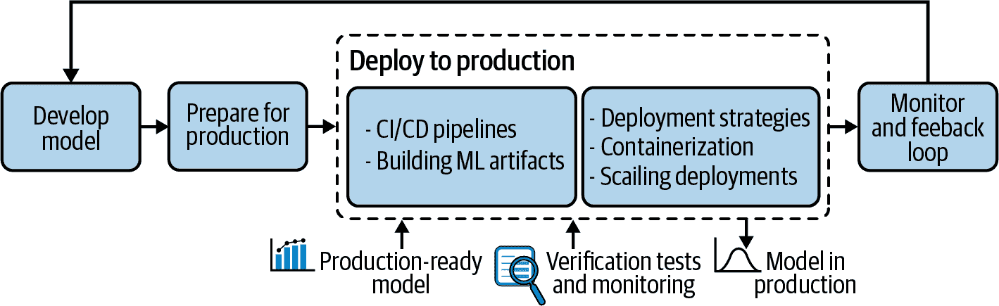

# 第六章：部署到生产环境

Joachim Zentici

业务领导者认为将新系统快速部署到生产环境是最大化业务价值的关键。但前提是部署必须顺利进行且风险低（近年来，为解决这一固有冲突，软件部署流程已变得更加自动化和严格）。本章深入探讨了将机器学习模型部署到生产环境时的概念和考虑因素，这些因素影响并驱动着 MLOps 部署流程的建立（图 6-1 在更大生命周期的背景下展示了此阶段）。

###### 图 6-1。在 ML 项目生命周期的更大背景下突出显示的生产部署

# CI/CD 管道

CI/CD 是连续集成和连续交付（或更简单地说，部署）的常见缩写。这两者构成了敏捷软件开发的现代理念，是一组实践和工具，能够更频繁、更快地发布应用程序，同时更好地控制质量和风险。

虽然这些思想已有几十年历史，并且已被软件工程师在各种程度上广泛使用，但不同的人和组织对某些术语的使用方式差异很大。在深入讨论 CI/CD 如何应用于机器学习工作流程之前，有一点很重要，那就是这些概念应该是服务于快速交付高质量的工具，并且第一步始终是识别组织中存在的具体风险。换句话说，CI/CD 方法论应根据团队的需求和业务的性质进行调整。

CI/CD 的概念不仅适用于传统软件工程，而且同样适用于机器学习系统，并且是 MLOps 战略的关键部分。成功开发模型后，数据科学家应将代码、元数据和文档推送到中央存储库并触发 CI/CD 管道。这种管道的一个示例可能是：

1.  构建模型

    1.  构建模型工件

    1.  将工件发送到长期存储

    1.  运行基本检查（烟雾测试/合理性检查）

    1.  生成公平性和可解释性报告

1.  部署到测试环境

    1.  运行测试以验证 ML 性能、计算性能

    1.  手动验证

1.  部署到生产环境

    1.  将模型部署为金丝雀

    1.  全面部署模型

可能存在多种场景，这些场景取决于应用程序、系统需要保护的风险以及组织选择运作的方式。一般来说，偏好于增量构建 CI/CD 管道的方法：一个团队可以迭代的简单甚至是天真的工作流程通常比从头开始构建复杂基础设施要好得多。

起始项目没有技术巨头的基础设施要求，并且很难事先知道部署将提出哪些挑战。有一些常见的工具和最佳实践，但没有一种大小适合所有的 CI/CD 方法论。这意味着最佳路径是从一个简单（但完全功能的）CI/CD 工作流开始，并在质量或扩展挑战出现时逐步引入额外或更复杂的步骤。

# 构建 ML 构件

持续集成流水线的目标是避免合并来自多个贡献者的工作的不必要的工作量，尽早检测错误或开发冲突。第一步是使用集中式版本控制系统（不幸的是，在仅存储在笔记本电脑上的代码上工作几周仍然相当常见）。

最常见的版本控制系统是 Git，这是一个开源软件，最初开发用于管理 Linux 内核的源代码。全世界的大多数软件工程师已经在使用 Git，并且它越来越多地被科学计算和数据科学所采用。它允许保持清晰的变更历史记录，安全地回滚到代码的先前版本，多个贡献者可以在他们自己的项目分支上工作，然后合并到主分支，等等。

虽然 Git 适用于代码，但它并非设计用于存储数据科学工作流中常见的其他类型的资产，如大型二进制文件（例如，训练模型权重），或者对数据本身进行版本控制。数据版本控制是一个更复杂的话题，有许多解决方案，包括 Git 扩展、文件格式、数据库等。

## ML 构件中包含什么？

一旦代码和数据位于集中存储库中，项目必须构建一个可测试和可部署的包。在 CI/CD 的背景下，这些包通常称为*构件*。每个以下元素都需要打包成一个通过测试流水线的构件，并可供部署到生产环境使用：

+   模型及其预处理的代码

+   超参数和配置。

+   训练和验证数据

+   可运行形式的训练模型。

+   包括具有特定版本、环境变量等的环境。

+   文档

+   用于测试场景的代码和数据

## 测试流水线

如在第五章中所述，测试流水线可以验证构件中包含的模型的各种属性。测试的一个重要操作方面是，在验证与需求的一致性之外，良好的测试应尽可能地简化故障排除时的问题源定位。

为此，命名测试非常重要，并且精心选择一些数据集来验证模型的方法可能会很有价值。例如：

+   可以首先执行一个固定数据集（不自动更新）、具有简单数据和不太严格的性能阈值的测试，并称之为“基准案例”。如果测试报告显示此测试失败，那么模型严重偏离的可能性很大，原因可能是编程错误或模型的误用等。

+   然后，可以使用多个具有特定异常（缺失值、极端值等）的数据集，并适当命名这些测试，以便测试报告立即显示可能使模型失败的数据类型。这些数据集可以代表现实但显著的案例，但生成预计不会在生产中出现的合成数据也可能很有用。这可能会保护模型免受尚未遇到的新情况的影响，但更重要的是，这可能会保护模型免受系统查询故障或对抗性示例（如在“机器学习安全性”中讨论的）。

+   模型验证的一个重要部分是在最新的生产数据上进行测试。应使用一个或多个数据集，从不同时间窗口提取并适当命名。这类测试应在模型已经部署到生产环境时进行并自动分析。第七章提供了更详细的关于如何执行的细节。

尽可能自动化这些测试至关重要，实际上是高效 MLOps 的关键组成部分。缺乏自动化或速度会浪费时间，但更重要的是，它会使开发团队不愿意经常进行测试和部署，这可能会延迟发现导致无法部署到生产的错误或设计选择。

在极端情况下，开发团队可以将一个长达数月的项目交给部署团队，但因为不满足生产基础设施的要求而被简单拒绝。此外，较少频繁的部署意味着较大的增量，这些增量更难以管理；当系统出现多个更改同时部署且表现不如预期时，问题来源的隔离将更加耗时。

软件工程持续集成中最常见的工具是 Jenkins，这是一个非常灵活的构建系统，允许构建无论使用哪种编程语言、测试框架等的 CI/CD 流水线。Jenkins 可用于数据科学中的 CI/CD 流水线编排，尽管还有许多其他选择。

# 部署策略

要理解部署流水线的细节，重要的是要区分那些经常不一致或可互换使用的概念。

集成

合并贡献到中央仓库的过程（通常是将 Git 特性分支合并到主分支）并执行更多或更少复杂的测试。

交付

在持续交付（CD）的部分中，构建完整打包和验证的模型版本，以便部署到生产环境。

部署

在目标基础设施上运行新模型版本的过程。完全自动化部署并非始终切实可行或理想，这是一项商业决策，同样也是技术决策，而持续交付则是开发团队提高生产力和质量以及更可靠地衡量进展的工具。持续交付是持续部署所必需的，但即使在没有持续部署的情况下，它也能提供巨大的价值。

发布

原则上，发布是另一个步骤，因为部署模型版本（即使是到生产基础设施）并不一定意味着生产工作负载会指向新版本。正如我们将看到的那样，多个模型版本可以同时在生产基础设施上运行。

确保 MLOps 过程中每个人对这些概念的理解达成一致，并了解其应用方式，将有助于技术和业务两方面的流程更加顺畅。

## 模型部署的分类

除了不同的部署策略外，还有两种方法可以进行模型部署：

+   批量评分，即使用模型处理整个数据集，例如每日定期作业。

+   实时评分，其中一个或少数记录得分，例如在网站上显示广告并且模型根据用户会话决定显示什么。

在这两种方法之间存在一种连续性，实际上，在某些系统中，对一个记录进行评分在技术上与请求一个批次的一样。在这两种情况下，可以部署多个模型实例以增加吞吐量并可能降低延迟。

部署许多实时评分系统在概念上更简单，因为要得分的记录可以分配到多台机器之间（例如使用负载均衡器）。批量评分也可以并行化，例如使用像 Apache Spark 这样的并行处理运行时，还可以通过分割数据集（通常称为*分区*或*分片*）并独立对分区进行评分。请注意，这两个数据和计算分割的概念可以结合起来，因为它们可以解决不同的问题。

## 将模型发送到生产时的考虑事项

在将新模型版本发送到生产时，首要考虑通常是避免停机时间，特别是对于实时评分。基本思想是，与其关闭系统、升级它，然后重新上线，不如在稳定系统旁边设置一个新系统，在其功能正常后将工作负载指向新部署的版本（如果保持健康，则关闭旧版本）。这种部署策略称为*蓝绿部署*，有时也称为*红黑部署*。有许多变体和框架（如 Kubernetes）可以本地处理这些。

另一个更高级的减轻风险的解决方案是拥有金丝雀发布（也称为*金丝雀部署*）。其想法是将模型的稳定版本保留在生产中，但将一定比例的工作负载重定向到新模型，并监控结果。这种策略通常用于实时评分，但也可以考虑用于批处理。

可以执行一些计算性能和统计测试来决定是否完全切换到新模型，可能分几个工作负载百分比递增。这样，故障可能只会影响到工作负载的一小部分。

金丝雀发布适用于生产系统，因此任何故障都是事故，但这里的想法是限制影响范围。请注意，由金丝雀模型处理的评分查询应该谨慎选择，因为否则可能会忽略一些问题。例如，如果在模型全球完全发布之前，金丝雀模型只服务于某个地区或国家的一小部分用户，这可能是因为（出于机器学习或基础设施原因）该模型在其他地区的表现不如预期。

一个更加稳健的方法是随机选择服务于新模型的用户部分，但通常为了用户体验，实现一个亲和机制是有必要的，这样同一用户始终使用相同版本的模型。

金丝雀测试可用于进行 A/B 测试，这是一个比较应用程序两个版本的业务性能指标的过程。这两个概念是相关的，但并不相同，因为它们不在同一抽象级别上运行。A/B 测试可以通过金丝雀发布来实现，但也可以直接编码为应用程序的单个版本中的逻辑。第七章提供了有关建立 A/B 测试的统计方面更多细节。

总的来说，金丝雀发布是一个强大的工具，但需要一定的先进工具来管理部署、收集指标、指定和运行计算、显示结果以及分发和处理警报。

## 生产环境下的维护

一旦模型发布，就必须进行维护。在高层面上，有三项维护措施：

资源监控

与在服务器上运行的任何应用程序一样，收集 CPU、内存、磁盘或网络使用等 IT 指标可以帮助检测和排除问题。

健康检查

为了检查模型是否在线并分析其延迟，通常会实现一个健康检查机制，该机制简单地查询模型，查询间隔固定（大约一分钟），并记录结果。

ML 指标监控

这是关于分析模型的准确性，并与另一个版本进行比较或检测其是否过时的过程。由于可能需要大量计算资源，这通常是低频操作，但像往常一样，这将取决于应用程序；通常每周执行一次。第七章详细介绍了如何实现此反馈循环。

最后，当检测到故障时，可能需要回滚到之前的版本。有必要准备回滚流程，并尽可能自动化；定期测试可以确保其确实可用。

# 容器化

正如前文所述，管理模型的版本远不止将其代码保存到版本控制系统中。特别是需要提供环境的精确描述（包括所有使用的 Python 库及其版本，需要安装的系统依赖项等）。

但仅仅存储这些元数据是不够的。将其部署到生产环境应该自动且可靠地在目标机器上重建此环境。此外，目标机器通常会同时运行多个模型，而两个模型可能具有不兼容的依赖版本。最后，同一台机器上运行的多个模型可能会竞争资源，一个表现不佳的模型可能会影响多个共存模型的性能。

容器技术越来越多地用于解决这些挑战。这些工具将应用程序与其所有相关的配置文件、库和依赖项捆绑在一起，以便在不同的操作环境中运行。与虚拟机（VM）不同，容器不复制完整的操作系统；多个容器共享一个公共操作系统，因此资源效率更高。

最知名的容器技术是开源平台 Docker。自 2014 年发布以来，它已成为事实上的标准。它允许将应用程序打包发送到服务器（Docker 主机），并在与其他应用程序隔离的环境中运行其所有依赖项。

构建一个可以容纳多个模型的模型服务环境的基础，每个模型可能运行多个副本，可能需要多个 Docker 主机。在部署模型时，框架应该解决一些问题：

+   哪些 Docker 主机应接收该容器？

+   当一个模型部署在多个副本中时，如何平衡工作负载？

+   如果模型变得无响应，例如，如果托管它的机器失败了会发生什么？如何检测到并重新提供容器？

+   如何升级在多台机器上运行的模型，并确保旧版本和新版本的切换以及负载均衡器更新正确的顺序？

Kubernetes 是一个开源平台，在过去几年中获得了很多关注，并且正在成为容器编排的标准。它极大地简化了这些问题以及许多其他问题。它提供了一个强大的声明式 API 来在一组 Docker 主机中运行应用程序，称为 Kubernetes *集群*。声明式的含义是，用户不需要试图用代码表达设置、监视、升级、停止和连接容器的步骤（这可能会很复杂且容易出错），而是在配置文件中指定所需的状态，Kubernetes 将实现并维护它。

例如，用户只需告诉 Kubernetes“确保始终运行四个此容器的实例”，Kubernetes 将分配主机、启动容器、监视它们，并在其中一个失败时启动新实例。最后，主要的云服务提供商都提供托管的 Kubernetes 服务；用户甚至不必安装和维护 Kubernetes 本身。如果应用程序或模型被打包为 Docker 容器，用户可以直接提交它，服务将为运行一个或多个容器实例而配置所需的机器。

Docker 与 Kubernetes 结合可以提供强大的基础设施来托管应用程序，包括 ML 模型。利用这些产品极大地简化了部署策略的实施，比如蓝绿部署或金丝雀发布，尽管它们并不了解部署的应用程序的特性，因此无法本地管理 ML 性能分析。这种类型基础设施的另一个主要优势是轻松扩展模型的部署。

# 扩展部署

随着 ML 的采纳增长，组织面临两种类型的增长挑战：

+   能够在高规模数据环境中将模型用于生产

+   能够训练更多和更多的模型

对于实时评分处理更多数据，像 Kubernetes 这样的框架大大简化了工作。由于大多数时间训练好的模型本质上是公式，它们可以在集群中复制成任意数量的副本。在 Kubernetes 的自动扩展功能下，新增机器的配置和负载均衡都完全由框架处理，建立具有巨大扩展能力的系统现在相对简单。主要的困难可能是处理大量监控数据；第七章提供了关于这一挑战的一些细节。

对于批量评分，情况可能更复杂。当数据量变得过大时，基本上有两种分布计算的策略：

+   使用本地处理分布式计算的框架，特别是 Spark。Spark 是一个开源的分布式计算框架。重要的是要理解 Spark 和 Kubernetes 不扮演相似的角色，并且可以结合使用。Kubernetes 编排容器，但 Kubernetes 不知道容器实际在做什么；对于 Kubernetes 来说，它们只是在特定主机上运行应用程序的容器。特别是，Kubernetes 没有数据处理的概念，因为它可用于运行任何类型的应用程序。Spark 是一个可以将数据和计算分配到其节点的计算框架。使用 Spark 的现代方式是通过 Kubernetes。要运行 Spark 作业，Kubernetes 启动所需数量的 Spark 容器；一旦启动，它们可以通信完成计算，然后销毁容器并释放资源供其他应用程序使用，包括可能具有不同 Spark 版本或依赖项的其他 Spark 作业。

+   另一种分发批处理的方法是对数据进行分区。有许多实现方法，但总体思路是评分通常是逐行操作（逐行评分），数据可以以某种方式分割，以便多台机器每台读取数据的子集并评分部分行。

就计算而言，增加模型数量相对较简单。关键是增加计算能力并确保监控基础设施能够处理工作负载。但在治理和流程方面，这是最具挑战性的情况。

特别是，增加模型数量意味着 CI/CD 流水线必须能够处理大量的部署。随着模型数量的增加，自动化和治理的需求也增长，因为人工验证不能保证系统性或一致性。

在某些应用中，如果通过自动化验证、金丝雀发布和自动化金丝雀分析有效控制了风险，完全可以依赖于全自动化持续部署。由于训练、模型构建、测试数据验证等工作都需要在集群上进行而非单台机器上进行，可能会面临许多基础设施挑战。此外，随着模型数量的增加，每个模型的持续集成/持续部署（CI/CD）流水线可能差异很大，如果不加处理，每个团队都必须为每个模型开发自己的 CI/CD 流水线。

从效率和治理的角度来看，这是不够理想的。虽然某些模型可能需要高度特定的验证流水线，但大多数项目可能可以使用少量通用模式。此外，由于可能不实用实施新的系统验证步骤，比如流水线不一定共享通用结构，因此维护变得更加复杂，甚至在程序化方面也难以安全地更新。分享实践和标准化的流水线可以帮助限制复杂性。还可以使用专门的工具来管理大量流水线；例如，Netflix 发布了 Spinnaker，这是一个开源的持续部署和基础设施管理平台。

# 需求和挑战

在部署模型时，存在几种可能的情况：

+   一个模型部署在一个服务器上

+   一个模型部署在多个服务器上

+   多个模型的多个版本部署在一个服务器上

+   一个模型的多个版本部署在多个服务器上

+   多个模型的多个版本部署在多个服务器上

一个有效的日志记录系统应该能够生成中心化的数据集，这些数据集可以被模型设计师或 ML 工程师利用，通常是在生产环境之外。具体来说，它应该涵盖以下所有情况：

+   系统可以访问并从多个服务器检索评分日志，无论是实时评分用例还是批处理评分用例。

+   当一个模型部署在多个服务器上时，系统可以处理每个模型在服务器上的映射和聚合所有信息。

+   当不同版本的模型部署时，系统可以处理每个模型版本在服务器上的映射和聚合所有信息。

就挑战而言，对于大规模机器学习应用程序来说，如果没有预处理步骤来过滤和聚合数据，生成的原始事件日志数量可能是一个问题。对于实时评分的用例，记录流式数据需要设置一整套新的工具，这需要大量的工程努力来维护。然而，在这两种情况下，因为监控的目标通常是估计聚合指标，所以只保存预测的一个子集可能是可以接受的。

# 总结思考

将模型部署到生产环境是 MLOps 的关键组成部分，正如本章所分析的，拥有正确的流程和工具可以确保快速部署。好消息是，许多成功的要素，特别是 CI/CD 的最佳实践，并不是新的。一旦团队了解如何将其应用于机器学习模型，组织将拥有一个良好的基础，可以随着业务的扩展而扩展 MLOps。
