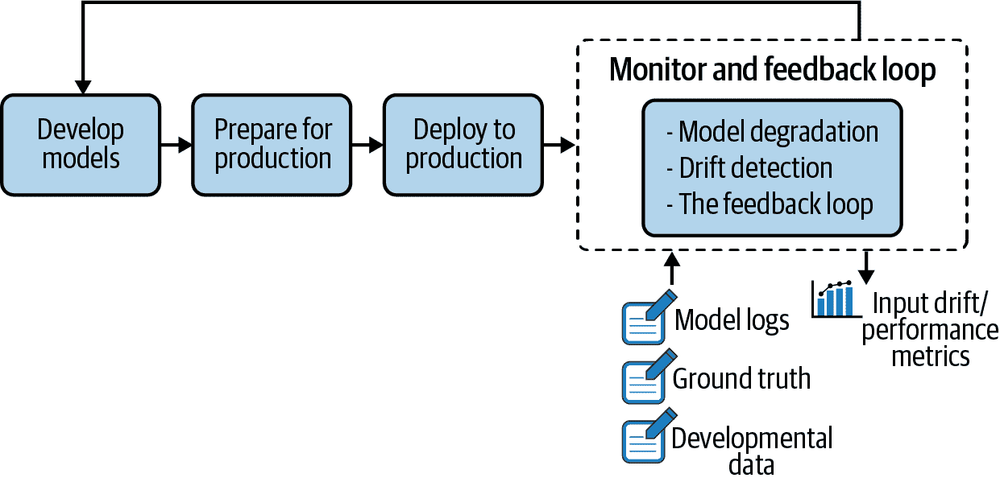
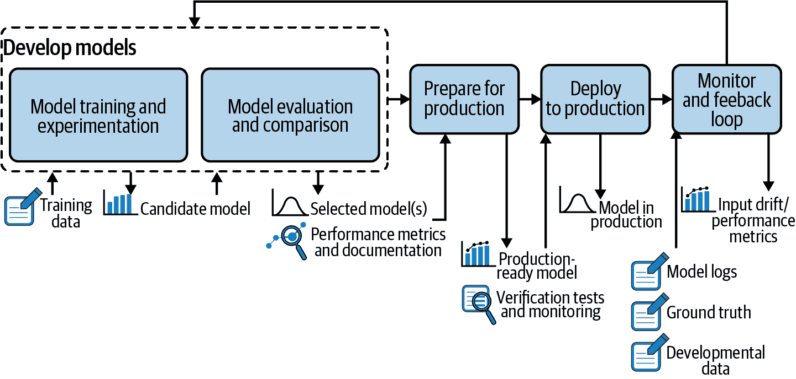

# 第七章：监控与反馈循环

杜凡

当一个机器学习模型部署到生产环境中时，它可能会迅速降低质量，而且没有警告，直到为时已晚（即它对业务可能造成负面影响）。这就是为什么模型监控是机器学习模型生命周期中至关重要的一步，也是 MLOps 的关键部分（如 图 7-1 所示，作为整体生命周期的一部分）。

###### 图 7-1\. 在机器学习项目生命周期的更大背景下突出显示的监控和反馈循环

机器学习模型需要在两个层面进行监控：

+   在资源层面上，包括确保模型在生产环境中正常运行。关键问题包括：系统是否正常？CPU、RAM、网络使用情况和磁盘空间是否符合预期？请求是否以预期速率处理？

+   在性能层面上，这意味着随着时间的推移监控模型的相关性。关键问题包括：模型是否仍然准确地反映了新进数据的模式？它在设计阶段的表现是否良好？

第一个层面是传统的 DevOps 主题，在文献中已广泛讨论过（并已在 第六章 中进行了涵盖）。然而，后者则更为复杂。为什么？因为模型的表现如何反映了用于训练它的数据；特别是训练数据与实时请求数据的代表性有多高。随着世界的不断变化，静态模型无法跟上不断出现和演变的新模式。虽然可以检测到单个预测的大偏差（见 第五章），但对评分行数据集中的较小但仍显著的偏差必须在统计上检测，无论有无基础真相。

模型性能监控旨在追踪这种退化，并在适当时机触发使用更具代表性数据重新训练模型。本章详细探讨了数据团队应如何处理监控及随后的重新训练。

# 模型应该多久重新训练一次？

关于监控和重新训练，团队经常提出的一个关键问题是：模型应该多久重新训练一次？不幸的是，这个问题没有简单的答案，因为它取决于许多因素，包括：

领域

在像网络安全或实时交易这样的领域，模型需要定期更新以跟上这些领域固有的不断变化。物理模型，如语音识别，通常更稳定，因为模式不会突然改变。然而，即使是更稳定的物理模型也需要适应变化：如果一个语音识别模型遇到人咳嗽导致声音音调变化会发生什么？

成本

组织需要考虑重新训练的成本是否值得性能的提升。例如，如果运行整个数据流水线和重新训练模型需要一周时间，那么获得 1%的提升是否值得？

模型性能

在某些情况下，模型性能受到训练样本数量的限制，因此重新训练的决定取决于收集足够的新数据。

无论在哪个领域，获得基本事实的延迟是定义重新训练周期下界的关键。当可能出现预测模型漂移速度快于预测时间和获得基本事实的间隔时，使用预测模型是非常冒险的。在这种情况下，如果漂移过于显著，模型可能会开始给出糟糕的结果，除了撤销模型之外，没有其他措施。实际上，这意味着一年延迟的模型重新训练频率不太可能超过几次。

基于同样的原因，不太可能在比此延迟更短的数据集上训练模型。重新训练也不会在更短的周期内进行。换句话说，如果模型重新训练的频率远高于延迟时间，那么重新训练对模型性能的影响几乎为零。

在重新训练频率时，还需考虑两个组织界限：

一个上界

最好每年进行一次重新训练，以确保负责团队具备这方面的技能（尽管可能发生人员流动，即重新训练模型的人员并非创建模型的人员），并且计算工具链仍然有效。

一个下界

例如，考虑一个具有几乎即时反馈的模型，例如推荐引擎，在预测后用户几秒钟内点击产品。高级部署方案将涉及阴影测试或 A/B 测试，以确保模型的性能符合预期。由于这是统计验证，需要一些时间来收集所需信息。这必然为重新训练周期设定了一个下界。即使是简单的部署过程，也可能允许一些人工验证或手动回滚的可能性，这意味着重新训练不太可能每天发生一次。

因此，重新训练的频率可能在每天至每年一次之间。最简单的解决方案是在与原始训练方式和环境相同的情况下进行重新训练，这是可接受的。一些关键情况可能需要在生产环境中重新训练，即使最初的训练是在设计环境中进行的，但重新训练的方法通常与训练方法相同，以限制总体复杂度。正如常规的规则一样，总是有例外：在线学习。

无论如何，某种程度的模型重新训练肯定是必要的 —— 这不是一个是否的问题，而是一个何时的问题。部署机器学习模型而不考虑重新训练，就像在巴黎向正确的方向发射一架无人机，希望它能够安全地在不需要进一步控制的情况下降落在纽约市一样。

好消息是，如果第一次能够收集足够的数据来训练模型，那么大多数重新训练的解决方案已经可用（可能有交叉训练模型的例外情况，这些模型在不同的上下文中使用，例如，用一个国家的数据训练，但在另一个国家使用）。因此，组织必须通过建立一个允许轻松监控和通知的过程来清楚地了解部署模型的漂移和准确性，这一点至关重要。理想的情况是一个能够自动触发模型性能退化检查的流水线。

需要注意的是，通知的目标不一定是启动自动化的重新训练、验证和部署过程。模型性能可能因各种原因而变化，重新训练并不总是解决方案。重点是通知数据科学家发生了变化；该人员随后可以诊断问题并评估下一步行动。

因此，在 MLOps 和 ML 模型生命周期的一部分，数据科学家及其经理和整个组织（最终必须处理模型性能下降和任何后续更改的业务后果的实体）必须理解模型退化的重要性。实际上，每个部署的模型都应该配备监控度量和相应的警告阈值，以尽快检测到业务绩效的显著下降。以下几节重点介绍了理解这些度量以便为特定模型定义它们的方法。

# 理解模型退化

一旦机器学习模型在生产环境中训练并部署，有两种方法可以监控其性能退化：地面真实评估和输入漂移检测。理解这些方法背后的理论和局限性对于确定最佳策略至关重要。

## 地面真实评估

地面真实重新训练需要等待标签事件。例如，在欺诈检测模型中，地面真实是特定交易是否真的欺诈。对于推荐引擎，则是客户是否点击或最终购买了推荐的产品之一。

收集了新的地面真实数据后，下一步是根据地面真实数据计算模型的性能，并将其与训练阶段的注册度量进行比较。当差异超过阈值时，可以认定模型已过时，应该重新训练。

要监控的度量标准可以分为两种类型：

+   像准确度，[ROC AUC](https://oreil.ly/tY9Bg)，对数损失等统计指标。由于模型设计者可能已经选择了其中一个指标来选择最佳模型，因此它是监控的首选候选。对于更复杂的模型，如果平均性能不够，可能需要查看由子群体计算的指标。

+   业务指标，例如成本效益评估。例如，[信用评分业务已经开发了自己的特定指标](https://oreil.ly/SqOr5)。

第一种指标的主要优势在于它是领域无关的，因此数据科学家可能会对设置阈值感到舒适。为了能够获得最早的有意义警告，甚至可以计算*p*值来评估观察到的下降不是由于随机波动引起的概率。

缺点在于，下降可能在统计上显著，而没有任何显著影响。或者更糟的是，重新训练的成本和重新部署所带来的风险可能高于预期的收益。业务指标更有趣，因为它们通常具有货币价值，使主题专家能够更好地处理重新训练决策的成本效益权衡。

在可用时，地面真相监控是最佳解决方案。但是，这可能会带来问题。存在三个主要挑战：

+   地面真相通常不是立即，甚至不是紧急可得的。对于某些类型的模型，团队需要等待几个月（甚至更长时间）以获取地面真相标签，如果模型快速退化，这可能导致重大经济损失。如前所述，部署一个漂移速度快于滞后的模型是有风险的。然而，根据定义，漂移是无法预测的，因此具有长滞后的模型需要采取缓解措施。

+   地面真相与预测是解耦的。为了计算部署模型在新数据上的性能，必须能够将地面真相与相应的观察结果进行匹配。在许多生产环境中，这是一项具有挑战性的任务，因为这两个信息片段生成和存储在不同系统和不同时间戳。对于低成本或短寿命的模型来说，可能没有自动地面真相收集的价值。请注意，这种做法相当短视，因为迟早，模型将需要重新训练。

+   地面真相仅部分可得。在某些情况下，检索所有观察结果的地面真相成本极高，这意味着需要选择哪些样本进行标记，从而无意中引入系统偏见。

对于最后一个挑战，欺诈检测提出了一个明确的用例。考虑到每笔交易都需要手动检查且过程耗时，仅为疑似案例（即模型高概率判定为欺诈的案例）建立地面真相是否有意义？乍看之下，这种方法似乎是合理的；然而，有批判性思维的人会理解，这会产生一个反馈循环，放大模型的缺陷。模型从未捕获的欺诈模式（即根据模型具有低欺诈概率的模式）将不会在重新训练过程中考虑进去。

解决此挑战的一种方法可能是随机标记，为除了那些被标记为可疑的事务之外的子样本建立一个地面真相。另一种解决方案可能是重新加权偏倚样本，使其特征更接近总体人群。例如，如果系统很少向低收入人群发放信用，那么模型应根据他们在申请人，甚至总体人群中的重要性进行重新加权。

无论采取什么样的缓解措施，标记的样本子集必须涵盖所有可能的未来预测，以确保训练模型在任何样本上都能做出良好的预测；这有时意味着出于检查模型是否继续良好泛化而做出次优决策。

解决了重新训练的问题后，解决方案（重新加权、随机抽样）可以用于监控。输入漂移检测是这种方法的补充，因为它需要确保提供覆盖新的、未开发领域的地面真相以供重新训练模型使用。

## 输入漂移检测

鉴于前一节中提出的地面真相重新训练的挑战和限制，一个更实际的方法可能是输入漂移检测。本节简要探讨了漂移背后的逻辑，并呈现了可能导致模型和数据漂移的不同场景。

假设目标是使用[UCI 葡萄酒质量数据集](https://oreil.ly/VPx17)作为训练数据来预测波尔多葡萄酒的质量，该数据集包含关于葡萄牙葡萄酒维诺维尔德的红色和白色变种以及在 0 到 10 之间变化的质量评分。

每种葡萄酒提供以下特征：类型、固定酸度、挥发性酸度、柠檬酸、残留糖、氯化物、游离二氧化硫、总二氧化硫、密度、pH 值、硫酸盐和酒精度。

为了简化建模问题，假设一个好的葡萄酒是质量评分等于或大于 7 的葡萄酒。因此，目标是构建一个二元模型，从葡萄酒的属性预测这一标签。

为了演示数据漂移，我们明确将原始数据集分为两部分：

+   wine_alcohol_above_11，包含所有酒精度为 11%及以上的葡萄酒

+   wine_alcohol_below_11 包含所有酒精含量低于 11% 的葡萄酒

我们将 wine_alcohol_above_11 数据集拆分为训练和评分用途，而第二个数据集 wine_alcohol_below_11 则被视为需要在模型部署后进行评分的新进数据。

我们人为地创造了一个大问题：很难认为葡萄酒的质量与酒精含量无关。更糟糕的是，两个数据集中的酒精含量可能与其他特征的相关性不同。因此，在一个数据集上学到的知识（“如果残余糖低，pH 值高，则葡萄酒好的概率很高”）在另一个数据集上可能是错误的，因为例如，当酒精含量高时，残余糖就不再重要了。

从数学角度来看，每个数据集的样本不能假设是从相同分布中抽取的（即它们不是“同分布的”）。确保 ML 算法按预期执行需要另一个数学属性：独立性。如果数据集中的样本重复或者可以预测“下一个”样本，则该属性被破坏，例如。

假设尽管存在明显的问题，我们仍在第一个数据集上训练算法，然后将其部署在第二个数据集上。由此产生的分布偏移称为漂移。如果酒精含量是 ML 模型使用的特征之一（或者酒精含量与模型使用的其他特征相关），则称为特征漂移；如果不是，则称为概念漂移。

# 实践中的漂移检测

如前所述，为了能够及时反应，应仅基于传入数据的特征值监控模型行为，而不必等待地面真相的出现。

逻辑是，如果数据分布（例如，均值、标准差、特征之间的相关性）在训练和测试阶段¹与开发阶段之间出现分歧，这是模型性能不同的强烈信号。这并非是完美的缓解措施，因为在漂移数据集上重新训练不是一个选项，但可以作为缓解措施的一部分（例如，返回到更简单的模型，重新加权）。

## 数据漂移的示例原因

数据漂移有两个常见的根本原因：

+   样本选择偏差，即训练样本不代表总体。例如，建立一个评估折扣计划效果的模型，如果最佳折扣仅为最好的客户提供，那么会存在偏差。选择偏差通常源自数据采集管道本身。在葡萄酒的例子中，原始数据集中酒精含量超过 11%的样本肯定不代表所有葡萄酒的总体——这是样本选择的最佳实践。如果一些酒精含量超过 11%的样本被保留，并根据在部署模型时预期的比例进行重新加权，那么可以减轻这种偏差。需要注意的是，这在实际生活中要做到比说起来更难，因为问题特征通常是未知的，甚至可能根本不可得。

+   非稳态环境，即从源群体收集的训练数据不代表目标群体。这通常发生在依赖时间的任务中，例如具有强季节性影响的预测用例，学习一个在某个月份的模型无法推广到另一个月份。回到葡萄酒的例子：可以想象一种情况，原始数据集样本仅包括特定年份的葡萄酒，这可能代表一个特别好（或坏）的年份。基于这些数据训练的模型可能无法推广到其他年份。

## 输入漂移检测技术

在理解可能引起不同漂移类型的可能情况后，下一个逻辑问题是：如何检测漂移？本节介绍了两种常见的方法。选择哪种方法取决于期望的可解释性水平。

需要经过验证且可解释的方法的组织应优先选择单变量统计测试。如果预期涉及同时涉及多个特征的复杂漂移，或者数据科学家希望重用已知的内容，假设组织不怕黑盒效应，则领域分类器方法也可能是一个不错的选择。

### 单变量统计测试

此方法要求对每个特征从源分布和目标分布的数据应用统计检验。当这些检验的结果显著时，将发出警告。

关于假设检验的选择已在文献中广泛研究，但基本方法依赖于这两个测试：

+   对于连续特征，Kolmogorov-Smirnov 检验是一种非参数假设检验，用于检查两个样本是否来自同一分布。它测量了经验分布函数之间的距离。

+   对于分类特征，卡方检验是一个实用的选择，用于检查目标数据中分类特征的观察频率是否与源数据中的预期频率匹配。

*p* 值的主要优势在于它们帮助尽快检测漂移。主要缺点在于它们检测到一个效果，但不量化效果的程度（即在大型数据集上，它们检测到非常小的变化，这些变化可能完全没有影响）。因此，如果开发数据集非常大，就必须用商业重要的度量补充 *p* 值。例如，在足够大的数据集上，平均年龄可能从统计角度显著漂移，但如果漂移仅为几个月，对许多业务用例来说可能是无关紧要的值。

### 领域分类器

在这种方法中，数据科学家训练一个模型，试图区分原始数据集（输入特征和可选的预测目标）和开发数据集。换句话说，他们堆叠两个数据集，并训练一个分类器，旨在预测数据的来源。模型的性能（例如准确性）可以被视为漂移水平的度量标准。

如果这个模型在其任务中取得成功，并且具有较高的漂移分数，这意味着在训练时使用的数据和新数据可以被区分开来，因此可以说新数据已经发生了漂移。为了获得更多的见解，特别是为了识别导致漂移的特征，可以使用训练模型的特征重要性。

### 结果的解释

领域分类器和单变量统计测试都指出了解释漂移的特征或目标的重要性。需要识别归因于目标的漂移，因为它通常直接影响业务的底线。（例如，信用评分：如果整体评分较低，可能获得贷款的数量也较少，因此收入将较低。）归因于特征的漂移有助于减少漂移的影响，因为它可能暗示着需要：

+   根据这个特征进行重新加权（例如，如果 60 岁以上的顾客现在占用户的 60%，但在训练集中只占 30%，则加倍其权重并重新训练模型）

+   移除该特征并训练一个不包含它的新模型

在所有情况下，如果检测到漂移，自动操作几乎不可能存在。只有在重新训练模型成本高昂时才可能发生这种情况：只有在基于地面真实数据的性能下降或检测到显著漂移时，才会重新对新数据进行训练。在这种特殊情况下，确实可以利用新数据来减轻漂移。

# 反馈循环

所有有效的机器学习项目都实施一种形式的数据反馈循环；即，来自生产环境的信息流回模型原型环境以进一步改进。

在图 7-2 中可以看到，监控和反馈循环中收集的数据被发送到模型开发阶段（有关这些数据的详细信息在第六章中介绍）。从那里，系统分析模型是否按预期运行。如果是，则无需采取任何行动。如果模型的性能下降，则数据科学家将会自动或手动触发更新。实际上，正如本章开头所述，这通常意味着使用新标记数据重新训练模型或开发具有附加特征的新模型。

###### 图 7-2\. 端到端机器学习过程的持续交付

无论哪种情况，目标都是能够捕捉新兴模式，并确保业务不会受到负面影响。这种基础设施由三个主要组件组成，除了本章第一部分讨论的概念外，还对稳健的 MLOps 能力至关重要：

+   一个从几个生产服务器收集数据的日志系统

+   一个进行模型版本控制和评估的模型评估存储库

+   在生产环境中进行模型比较的在线系统，无论是使用阴影评分（冠军/挑战者）设置还是 A/B 测试

后续章节将分别讨论每个组件，包括它们的目的、主要特点和挑战。

## 日志记录

监控生产系统，无论是否带有机器学习组件，意味着收集和聚合关于其状态的数据。如今，随着生产基础设施变得越来越复杂，同时在多个服务器上部署多个模型，一个有效的日志系统比以往任何时候都更加重要。

这些环境中的数据需要集中存储以便自动或手动分析和监控。这将促使机器学习系统的持续改进。机器学习系统的事件日志是带有时间戳和以下信息的记录。

模型元数据

模型及其版本的识别。

模型输入

新观测的特征值，这些值允许验证新进数据是否符合模型的预期，并因此允许检测数据漂移（如前一节所述）。

模型输出

模型的预测结果，随后与后续收集的真实数据相结合，能够清楚地展示模型在生产环境中的表现。

系统操作

模型预测很少作为机器学习应用的最终产品；更常见的情况是系统根据此预测采取行动。例如，在欺诈检测用例中，当模型给出高概率时，系统可以选择要么阻止交易，要么向银行发送警告。这类信息很重要，因为它影响用户的反应，从而间接影响反馈数据。

模型解释。

在某些高度受监管的领域，如金融或医疗保健，预测必须附带解释（即哪些特征对预测影响最大）。这种信息通常通过 Shapley 值计算等技术来计算，并应记录以识别模型可能存在的问题（例如偏差、过拟合）。

## 模型评估。

一旦日志系统就位，它定期从生产环境中获取数据进行监控。一切顺利，直到某天触发数据漂移警报：传入数据的分布与训练数据的分布偏离。可能是模型性能正在下降。

审查后，数据科学家决定通过重新训练模型来改进它，使用本章前面描述的技术。在有了多个训练好的候选模型后，下一步是将它们与部署模型进行比较。实际上，这意味着对同一数据集评估所有模型（候选模型和部署模型）。如果其中一个候选模型的表现优于部署模型，则有两种继续的方式：要么在生产环境中更新模型，要么转移到通过冠军/挑战者或 A/B 测试设置进行在线评估。

简而言之，这是模型存储的概念。它是一种结构，允许数据科学家：

+   比较多个新训练的模型版本与现有部署版本。

+   在标记数据上比较完全新的模型与其他模型版本。

+   跟踪模型随时间的表现。

形式上，模型评估存储作为一个结构，集中存储与模型生命周期相关的数据，以便进行比较（尽管需要注意，仅当模型解决相同问题时，比较才有意义）。从定义上来看，所有这些比较都归结为逻辑模型的大伞下。

### 逻辑模型。

构建机器学习应用是一个迭代的过程，从部署到生产，监控性能，检索数据，并寻找改进系统解决目标问题的方法。有许多迭代的方式，其中一些已经在本章讨论过，包括：

+   使用相同数据对同一模型进行再训练。

+   向模型添加新特征。

+   开发新算法。

出于这些原因，机器学习模型本身不是静态的对象；它随着时间不断变化。因此，对于推理机器学习应用程序，具有更高抽象级别是有帮助的，这被称为*逻辑模型*。

逻辑模型是解决业务问题的模型模板及其版本的集合。通过在给定数据集上训练模型模板可以获得模型版本。同一逻辑模型的所有模型模板版本通常可以在相同类型的数据集上进行评估（即在具有相同特征定义和/或架构的数据集上）。但是，如果问题没有改变但用于解决问题的特征发生了变化，则可能不会如此。模型版本可以使用完全不同的技术实现，甚至可以有几种实现同一模型版本的方式（例如 Python、SQL、Java 等）。然而，如果给定相同的输入，它们应该会给出相同的预测。

让我们回到本章前面介绍的葡萄酒例子。在部署后的三个月里，关于低酒精葡萄酒的新数据出现了。我们可以在新数据上重新训练我们的模型，从而使用相同的模型模板获得新的模型版本。在调查结果时，我们发现新的模式正在出现。我们可以决定创建捕捉这些信息的新特征并将其添加到模型中，或者我们可以决定使用其他 ML 算法（如深度学习）而不是 XGBoost。这将导致一个新的模型模板。

因此，我们的模型有两个模型模板和三个版本：

+   第一个版本已经在生产环境中上线，基于原始的模型模板。

+   第二个版本基于原始模板，但是在新数据上进行了训练。

+   第三个版本采用基于深度学习的模板，具有额外的功能，并且是在第二个版本相同的数据上训练的。

这些版本在各种数据集上的评估信息（包括训练时使用的测试数据集以及可能在训练后进行评分的开发数据集）随后存储在模型评估存储中。

### 模型评估存储

作为提醒，模型评估存储是结构，用于集中与模型生命周期相关的数据，以便进行比较。模型评估存储的两个主要任务是：

+   通过时间对逻辑模型的演变进行版本控制。每个记录的逻辑模型版本必须包含关于其训练阶段的所有必要信息，包括：

    +   使用的特征列表

    +   应用于每个特征的预处理技术

    +   使用的算法以及选择的超参数

    +   训练数据集

    +   用于评估训练模型的测试数据集（这对于版本比较阶段是必要的）

    +   评估指标

+   比较逻辑模型不同版本之间的性能。要决定部署哪个逻辑模型版本，必须对它们（候选模型和已部署模型）在相同数据集上进行评估。

选择评估数据集至关重要。如果有足够的新标记数据可以可靠地评估模型的性能，那么这是首选，因为它最接近我们预期在生产环境中接收到的数据。否则，我们可以使用已部署模型的原始测试数据集。假设数据没有漂移，这给我们提供了一个关于候选模型性能与原始模型比较的具体想法。

在确定最佳候选模型之后，工作还没有结束。实际上，模型的离线和在线表现经常存在显著差异。因此，将测试环境转移到生产环境至关重要。这种在线评估能够最真实地反映候选模型在面对真实数据时的表现。

## 在线评估

从业务角度看，生产环境中的模型在线评估至关重要，但从技术角度来看可能具有挑战性。在线评估主要有两种模式：

+   冠军/挑战者（又称影子测试），其中候选模型跟随已部署模型并对相同的实时请求进行评分

+   A/B 测试，其中候选模型评分部分实时请求，而已部署的模型评分其他请求

两种情况都需要基本事实支持，因此评估时间肯定比预测与基本事实之间的时间差要长。此外，如果可能进行影子测试，应优先使用它而不是 A/B 测试，因为它更简单理解和设置，并能更快地检测出差异。

### 冠军/挑战者

冠军/挑战者涉及将一个或多个额外模型（挑战者）部署到生产环境中。这些模型接收并评分与活跃模型（冠军）相同的输入请求。然而，它们不会向系统返回任何响应或预测：这仍然是旧模型的任务。预测结果仅被记录以便进一步分析。这也是为什么这种方法被称为“影子测试”或“暗发布”。

此设置允许两件事情：

+   确认新模型的性能优于或至少不逊于旧模型。由于两个模型在相同数据上进行评分，因此可以直接比较它们在生产环境中的准确性。注意，这也可以通过使用新请求数据集上的新模型与冠军模型的离线比较来完成。

+   测量新模型如何处理现实负载。由于新模型可能具有新功能、新的预处理技术，甚至是新的算法，因此对请求的预测时间与原始模型不同，了解这种变化是非常重要的。当然，这是在线执行的主要优势。

这种部署方案的另一个优势是数据科学家或机器学习工程师向其他利益相关者展示了未来冠军模型的可见性：挑战者模型的结果不再局限于数据科学环境，而是向业务领导展示，这降低了切换到新模型的感知风险。

为了能够比较冠军和挑战者模型，必须为两者记录相同的信息，包括输入数据、输出数据、处理时间等。这意味着更新记录系统以便能够区分这两个数据源。

在清楚哪个模型比另一个更好之前，应部署多长时间？应部署足够长的时间，以便随机性引起的度量波动得以抑制，因为已经进行了足够的预测。可以通过图形方式评估这一点，检查度量估计是否不再波动，或者通过进行适当的统计检验（因为大多数指标是行分数的平均值，最常见的测试是配对样本 T 检验），该检验能够给出一个概率，即一个指标高于另一个指标的观察是否由这些随机波动引起。度量差异越大，确保差异显著所需的预测次数就越少。

根据使用案例和冠军/挑战者系统的实施方式，服务器性能可能是一个问题。如果同时调用两个内存密集型模型，它们可能会使系统变慢。这不仅会对用户体验产生负面影响，还会损坏关于模型运行情况的收集数据。

另一个关注点是与外部系统的通信。如果两个模型使用外部 API 来丰富其特性，这将导致向这些服务的请求数量加倍，从而使成本加倍。如果该 API 有一个缓存系统，那么第二个请求将比第一个请求处理得更快，这可能会在比较两个模型的总预测时间时产生偏差。需要注意的是，挑战者模型可能仅用于随机子集的传入请求，这将减轻负载，但增加了在得出结论之前所需的时间。

最后，在实施挑战者模型时，重要的是确保它不会对系统的行动产生任何影响。这意味着有两种情况：

+   当挑战者模型遇到意外问题并失败时，生产环境不会在响应时间方面出现任何中断或降级。

+   系统采取的行动仅依赖于冠军模型的预测，并且只发生一次。例如，在欺诈检测用例中，想象一下如果错误地将挑战者模型直接插入系统中，每笔交易会被收取两次—这是一个灾难性的情况。

通常情况下，需要花费一些精力在日志记录、监控和服务系统上，以确保生产环境正常运行，并且不受来自挑战者模型的任何问题的影响。

### A/B 测试

A/B 测试（一种随机实验，测试两种变体 A 和 B）是网站优化中广泛使用的技术。对于 ML 模型，仅当无法使用冠军/挑战者时才应使用它。这可能发生在以下情况下：

+   对于两种模型，无法评估真实情况。例如，对于推荐引擎，预测会给出客户可能点击的商品列表，如果它们被呈现给客户。因此，无法确定如果没有呈现商品，客户是否会点击。在这种情况下，需要进行某种形式的 A/B 测试，其中一些客户将看到模型 A 的推荐，另一些客户将看到模型 B 的推荐。同样地，对于欺诈检测模型，因为需要大量工作来获取真实情况，可能无法对两个模型的正面预测进行评估；这将增加工作量太多，因为一些欺诈仅被一个模型检测到。因此，随机应用仅 B 模型到一小部分请求将使工作量保持恒定。

+   优化的目标仅间接与预测性能相关。想象一下基于 ML 模型的广告引擎，它预测用户是否会点击广告。现在想象一下，它是根据购买率来评估的，即用户是否购买了产品或服务。再次地，无法记录用户对两种不同模型的反应，因此在这种情况下，A/B 测试是唯一的方式。

有些书籍专门讨论 A/B 测试，因此本节只介绍其主要思想和简单步骤。与冠军/挑战者框架不同，使用 A/B 测试时，候选模型为某些请求返回预测，原始模型处理其他请求。测试期结束后，统计测试比较两个模型的性能，团队可以根据这些测试的统计显著性做出决策。

在 MLOps 环境中，需要考虑一些因素。这些考虑因素的详细介绍在 表 7-1 中提供。

表 7-1\. MLOps 中进行 A/B 测试的考虑因素

| 阶段 | MLOps 考虑因素 |
| --- | --- |
| A/B 测试之前 | 确定一个明确的目标：需要优化的量化业务指标，如点击率。定义精确的人群：仔细选择测试的细分及分组策略，以确保群组之间没有偏见。（这就是被药物研究推广的实验设计或随机对照试验。）这可能是一个随机分割，也可能更复杂。例如，情况可能要求特定客户的所有请求由同一个模型处理。定义统计协议：使用统计测试比较结果指标，并接受或拒绝零假设。为了使结论更加健壮，团队需要事先定义所需的最小效果大小的样本量，即两个模型性能指标之间的最小差异。团队还必须固定测试持续时间（或者采用处理多个测试的方法）。请注意，与冠军/挑战者相似的样本大小将无法使用成对样本测试来检测有意义的差异，因为必须使用未配对样本测试。（通常情况下，不可能将每个由模型 B 评分的请求与模型 A 评分的请求配对，而冠军/挑战者则很简单。） |
| 在 A/B 测试期间 | 很重要的一点是在测试时间结束之前不要停止实验，即使统计测试开始显示显著的指标差异。这种做法（也称为 p-hacking）由于挑选期望的结果而产生不可靠和有偏见的结果。 |
| A/B 测试后 | 一旦测试时间结束，检查收集的数据确保质量良好。从这里开始，运行统计测试；如果指标差异在倾向于候选模型的统计学意义上显著，则可以用新版本替换原模型。 |

# 总结思考

普通软件被构建来满足规范。一旦应用部署，其完成目标的能力不会降低。相比之下，机器学习模型的目标是根据其在给定数据集上的性能统计性定义的。因此，当数据的统计特性发生变化时，它们的性能通常会变差。

除了普通软件维护需求（错误修正，发布升级等），必须仔细监控性能漂移。我们已经看到，基于实际情况的性能监控是基石，而漂移监控可以提供早期警告信号。在可能的漂移缓解措施中，主要的工作马是在新数据上重新训练，而模型修改则是一个选项。一旦新模型准备部署，可以通过阴影评分或作为第二选择的 A/B 测试验证其改进的性能。这使得证明新模型更好以提高系统性能成为可能。

¹ 在评估训练数据集和测试数据集之间的偏移时，特别是当测试数据集在训练数据集之后时，评估漂移是明智的。详细信息请参见“选择评估指标”。
