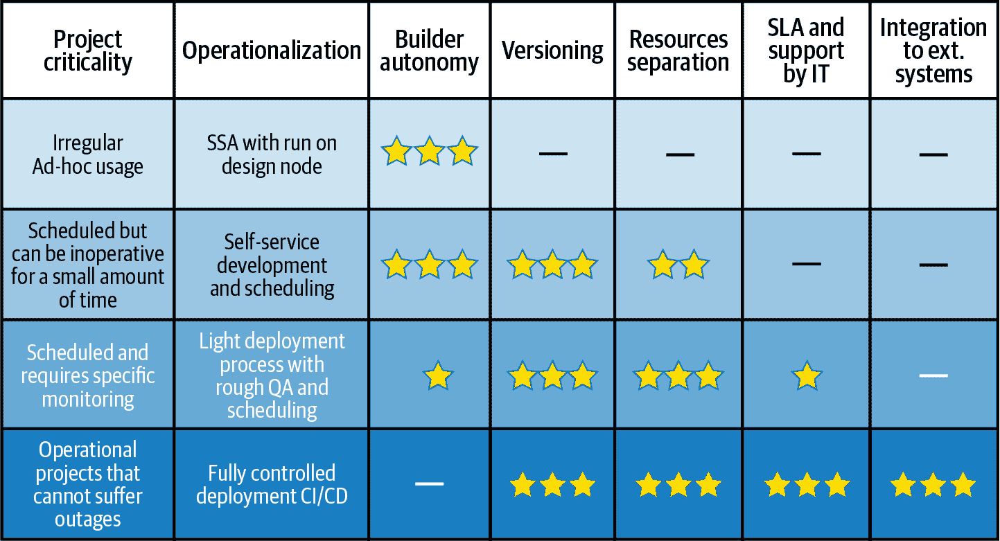
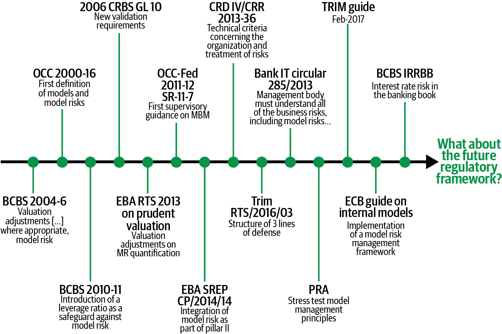
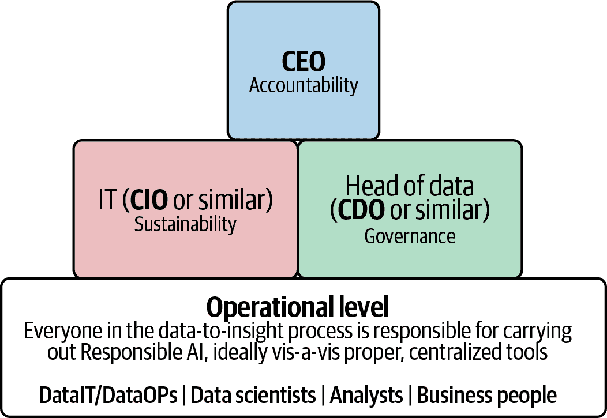
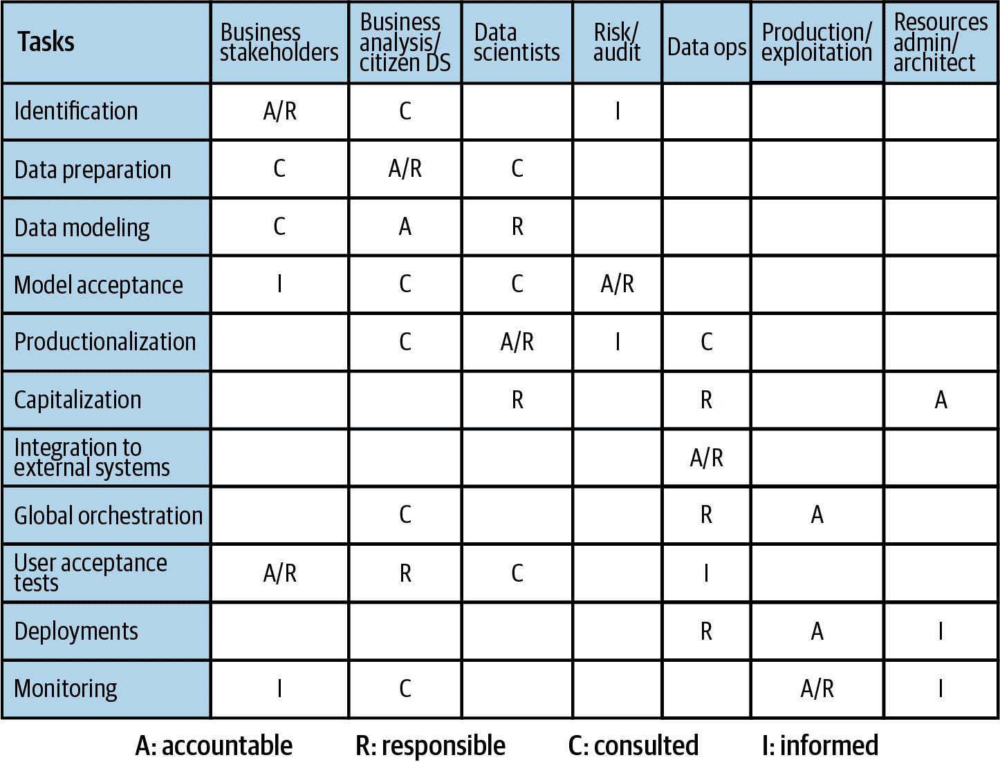

# 第八章：模型治理

马克·特雷维尔

我们探讨了治理作为 第三章 中对企业施加的一组控制的概念。这些目标旨在确保企业履行其对所有利益相关者的责任，从股东和员工到公众和国家政府。这些责任包括财务、法律和道德责任，所有这些都以对公平的渴望为基础。

本章深入探讨了这些主题，从它们的重要性到组织如何将它们作为其 MLOps 策略的一部分进行整合。

# 谁来决定组织需要什么样的治理？

国家法规是社会公平框架的重要组成部分。但是，这些法规需要相当长的时间才能达成一致并实施；它们始终反映了对公平性稍有历史性的理解及其面临的挑战。就像机器学习模型一样，过去并不能总是预见未来发展中的问题。

大多数企业从治理中想要的是保护股东投资，并确保适当的投资回报率，现在和未来都是如此。这意味着企业必须有效、有利可图且可持续地运营。股东需要清楚地看到顾客、员工和监管机构满意，并希望确认已经采取适当的措施来检测和管理可能在未来发生的任何困难。

当然，这些都不是新闻，也不是仅限于 MLOps。ML 的不同之处在于，它是一种新的并且经常不透明的技术，带来许多风险，但却正在迅速嵌入影响我们生活方方面面的决策系统中。机器学习系统通过大量数据创造自己的统计驱动决策过程，这些过程通常极其难以理解，数据被认为代表现实世界。很容易看出会出现哪些问题！

或许对 ML 治理方向影响最大的是公众舆论，它比正式法规演变得快得多。它不遵循任何正式的程序或礼仪。它无需基于事实或理性。公众舆论决定人们购买什么产品，投资到哪里，以及政府制定哪些规则和法规。公众舆论决定什么是公平的，什么不是。

例如，开发转基因作物的农业生物技术公司在上世纪九十年代深切感受到了公众舆论的力量。在关于是否存在健康风险的争论中，欧洲的公众舆论反对基因改造，许多欧洲国家禁止了这些作物。与机器学习的类似之处显而易见：机器学习为所有人提供了好处，但也带来了需要管理的风险，如果公众不信任它，这些好处将无法充分实现。

公众需要被保证机器学习是公平的。什么被认为是“公平”的并未在规则书中定义，也不是固定的；它会根据事件而波动，并且在世界各地不会始终相同。目前，公众对机器学习的看法处于平衡状态。大多数人喜欢得到合理定位的广告，他们喜欢汽车能够读取限速标志，而改进欺诈检测最终也为他们节省了金钱。

但也有一些广为人知的丑闻动摇了公众对这项技术的接受。例如，Facebook 和剑桥分析公司的事件，这两家公司利用机器学习的力量在社交媒体上操纵公众舆论，震惊了世界。这看起来像是带有明确恶意意图的机器学习。同样令人担忧的是完全无意造成的伤害，例如在刑事评估系统和招聘工具中，机器学习的黑匣子判决被证明在种族或性别等标准上存在不可接受和非法的偏见。

如果企业和政府希望获得机器学习的好处，他们必须保护公众对其的信任，并积极应对相关风险。对于企业而言，这意味着需要建立强大的 MLOps 流程治理。他们必须评估风险，确定自己的公平价值观，并实施必要的流程来管理这些风险。其中大部分工作仅仅是关于良好的管理，并且专注于减轻机器学习固有的风险，涉及数据溯源、透明度、偏见、性能管理和可复现性等话题。

# 将治理与风险水平匹配

治理并非免费午餐；它需要投入精力、纪律和时间。

从业务利益相关者的角度来看，治理很可能会减慢新模型的交付速度，这可能会给企业带来成本。对于数据科学家而言，这可能看起来是许多官僚主义，侵蚀了他们完成任务的能力。相比之下，负责管理风险和负责部署的 DevOps 团队会主张，应该强制执行全面的严格治理。

负责 MLOps 的人必须管理不同用户配置文件之间固有的紧张关系，找到在高效完成工作与全面保护各种可能威胁之间的平衡。通过评估每个项目的具体风险，并将治理过程与该风险水平匹配，可以找到这种平衡。在评估风险时，需要考虑几个维度，包括：

+   模型的受众

+   模型寿命及其结果

+   结果的影响

这种评估不仅应确定所应用的治理措施，还应推动完整的 MLOps 开发和部署工具链。

例如，自助式分析（SSA）项目（只面向小范围内部观众，并且通常由业务分析师构建）需要相对轻量级的治理。相反，部署到公众网站并影响人们生活或公司财务决策的模型则需要非常彻底的流程。此流程将考虑业务选择的 KPI 类型、所需可解释性的模型构建算法类型、使用的编码工具、文档和可重复性的水平、自动化测试的水平、硬件平台的弹性以及实施的监控类型。

但业务风险并非总是如此清晰。一个做出具有长期影响决策的 SSA 项目也可能存在高风险，并且可以证明需要更强的治理措施。因此，跨团队需要深思熟虑、定期审查的 MLOps 风险评估策略（参见图 8-1 关于项目重要性和操作化方法的详细说明）。

###### 图 8-1\. 根据项目的重要性选择适当的操作化模型和 MLOps 特性

# 当前推动 MLOps 治理的法规

当今世界范围内针对机器学习和人工智能的具体法规很少。然而，许多现有法规对机器学习治理产生了重大影响。这些法规有两种形式：

+   行业特定的法规。这在金融和制药领域尤为重要。

+   广谱法规，特别是数据隐私方面的处理。

以下几节概述了一些最相关的法规。它们与 MLOps 治理挑战的相关性显著，并且这些法规很好地指示了行业广泛需要建立和维护对机器学习信任的治理措施。

即使对于那些没有具体法规的行业工作人员，以下几个部分可以简要说明，无论行业如何，全球组织未来可能在机器学习控制的具体性水平上面临的问题。

## 美国的药品监管：GxP

[GxP](https://oreil.ly/eg3J2) 是由美国食品药品监督管理局（FDA）制定的一系列质量指南（例如良好临床实践指南，简称 GCP 指南）和法规，旨在确保生物和制药产品的安全。

GxP 指南侧重于：

+   可追溯性，即重新创建药物或医疗设备开发历史的能力。

+   账户责任，即谁在何时为药物开发做出了何种贡献。

+   [数据完整性（DI）](https://oreil.ly/G_wyS)，即开发和测试中使用的数据的可靠性。这基于 ALCOA 原则：可归属性、易读性、时效性、原始性和准确性，考虑因素包括风险识别和缓解策略。

## 金融模型风险管理规定。

在金融中，模型风险是在决定可交易资产的模型证明不准确时产生损失的风险。这些模型（如 Black–Scholes 模型）早在机器学习出现之前就已存在。

模型风险管理（MRM）法规是由于特殊事件（如金融崩溃）的影响经验推动的，如果遭受严重损失可能对公众和更广泛的经济造成损害。自 2007-2008 年金融危机以来，已经引入了大量额外的法规以强制执行良好的 MRM 实践（参见图 8-2）。

[英国审慎监管局（PRA）的规定](https://oreil.ly/tmxVg)，例如，为良好的 MRM 定义了四个原则：

模型定义。

定义模型并在库存中记录这些模型。

风险治理。

建立模型风险治理框架、政策、流程和控制。

生命周期管理。

创建健壮的模型开发、实施和使用流程。

有效挑战。

进行适当的模型验证和独立审查。

###### 图 8-2。模型风险管理（MRM）法规的历史。

## GDPR 和 CCPA 数据隐私法规。

欧盟普通数据保护条例（GDPR）于 2018 年首次实施，为从居住在欧盟的个人收集和处理个人信息设定了指导方针。然而，它是针对互联网时代而制定的，因此实际上适用于任何地方的欧盟访客，无论该网站位于何处。由于很少有网站希望排除欧盟访客，全球各地的网站都被迫满足这些要求，使 GDPR 成为数据保护的事实标准。该法规旨在让人们控制 IT 系统收集的个人数据，包括以下权利：

+   被告知收集或处理的数据。

+   访问收集的数据并了解其处理方式。

+   纠正不准确的数据。

+   被遗忘（即数据被移除）。

+   限制个人数据的处理。

+   获取收集的数据并在其他地方重新使用。

+   反对自动化决策。

加利福尼亚消费者隐私法（CCPA）在受保护对象和内容方面与 GDPR 非常相似，尽管其范围、地域覆盖和财务处罚都更为有限。

# AI 特定法规的新浪潮。

全球范围内，针对 AI 应用（因此也包括所有 ML 应用）的新一波法规和指南正在兴起。欧盟在制定建立可信 AI 框架方面处于领先地位。

在[人工智能白皮书](https://oreil.ly/rhzo5)中，欧盟强调 AI 对各行各业的潜在益处。同样，它指出围绕 AI 滥用的丑闻以及对 AI 潜力进步可能带来危险的警告并没有被忽视。欧盟认为基于其基本价值的监管框架“将使其能够在数据经济及其应用方面成为全球创新领导者。”

欧盟确定了 AI 应用必须遵守的七项关键要求，以被视为可信任：

+   人类代理和监督

+   技术鲁棒性和安全性

+   隐私和数据治理

+   透明度

+   多样性、非歧视和公平性

+   社会和环境福祉

+   问责制

欧盟的方法并非一刀切：它主要影响特定的高风险行业，包括医疗保健、交通运输、能源和部分公共部门。其他行业预计可以选择是否遵守这些规定。

就像 GDPR 一样，欧盟的方法可能会对全球产生影响。许多大型组织可能会选择加入，考虑到公众对 AI 使用的信任对其业务的重要性。即使不选择加入，这一框架也可能建立起一种 AI 治理思维，并影响其处理方式。

表格 8-1 概述了全球 AI 治理倡议的一些状态。尽管各个国家的规定程度有所不同，但都在明显类似的路线上前进，反映了其传统上不同的监管方法。

表格 8-1\. 全球 AI 治理倡议的状态

| 地区和组织 | 阶段 | 焦点 | 即将到来 |
| --- | --- | --- | --- |
| 经合组织 | 指导 |

+   42 个签署国

+   AI 可信任管理的五大原则：包容性增长、以人为本和公平性、透明度和可解释性、鲁棒性以及问责制度

+   国家政策的建议

|   |
| --- |
| 欧盟 | 指导、沟通、方向和监管 |

+   对高风险活动（X 部门影响）具有约束力，对其他人可选择性，有可能标记

+   特别针对模型的公平性、鲁棒性和可审计性，结合政策和控制措施，整合环境和社会影响的强烈伦理考量

|

+   指令将于 2020 年底/2021 年初出台

+   将翻译为国家制度

|

| 新加坡 | 指导 |
| --- | --- |

+   正面、非制裁性的方法，重点放在在组织级别实施 AI 治理的实际步骤上

+   最佳实践中心，在经济论坛层面支持 AI 治理工作

|

+   到 2020 年底/2021 年初实施的法规

|

| 美国 | 指导、沟通和监管 |
| --- | --- |

+   联邦指导方针发布以为行业特定指导方针或法规铺平道路

+   着眼于公众信任和公平性；没有更广泛的道德考虑

|   |
| --- |
| 英国 | 指导 | 仅限高层指导；非约束性且覆盖面广 |   |
| 澳大利亚 | 指导 | 发出详细指南，融合道德和对终端消费者保护的强烈关注 |   |

# 负责任 AI 的出现

随着全球数据科学、机器学习和人工智能的普及，AI 思想家之间形成了一种松散的共识。这种共识的最常见表述是负责任 AI：即开发机器学习系统应对负责、可持续和可管理的理念。简而言之，AI 系统应该按预期运行，随时间可靠，受到良好控制并可审计。

负责任 AI 没有严格的定义或用于界定其术语，但人们对其总体考虑和大部分交付需求有共识（见表格 8-2 的组成部分）。尽管没有单一机构主导这一运动，负责任 AI 已经在集体思维中产生了显著影响，特别是在欧盟可信 AI 监管者中。

表格 8-2\. 负责任 AI 的组成部分，这是 MLOps 中越来越关键的一部分

| 故意性 | 账户管理 |
| --- | --- |

| 必须具备：

+   确保模型设计和行为与其目的一致

+   确保用于 AI 项目的数据来自符合规定且无偏见的来源，同时通过协作方法确保对潜在模型偏见进行多重检查和平衡

+   故意性还包括可解释性，这意味着 AI 系统的结果应该能够被人类解释（理想情况下不仅仅是创建系统的人类）

| 必须具备：

+   集中控制、管理企业 AI 工作的能力以及审计（不允许影子 IT！）

+   综合考虑哪些团队正在使用哪些数据、如何使用以及使用哪些模型

+   信任数据可靠性，按照法规收集数据，并集中理解哪些模型用于哪些业务流程。这与可追溯性密切相关——一旦出现问题，能否轻松找到问题发生在管道的哪个环节？

|

| 以人为中心的方法 |   |
| --- | --- |
| 向人们提供工具和培训，使其能意识到并执行这两个组件 |   |

# 负责任 AI 的关键要素

负责任 AI 关乎数据从业者的责任，而非 AI 本身是否负责：这是一个非常重要的区别。另一个重要区别是，根据 Dataiku 的 Kurt Muemel 所说，“这并不一定是有意的伤害，而是意外的伤害。”

本节介绍了负责任 AI 思维中的五个关键要素——数据、偏见、包容性、规模化模型管理和治理，以及每个要素的 MLOps 考虑。

## 要素 1：数据

对数据的依赖是机器学习和传统软件开发之间的基本区别。使用的数据质量将对模型的准确性产生最大影响。一些现实考虑如下：

+   证据来源至关重要。了解数据的收集方式及其使用过程。

+   把数据从桌面上移出来。数据必须是可管理的、安全的，并且可以追溯的。个人数据必须严格管理。

+   随时间推移数据的质量：一致性、完整性和所有权。

+   垃圾进，垃圾出。偏倚的输入数据很容易且无意中发生。

## 元素 2：偏差

机器学习预测建模是关于建立一个系统来识别和利用现实世界中的趋势。某些类型的汽车，由某些类型的人驾驶，在某些地方更可能对保险公司造成更高的费用。但是，匹配模式是否总是被认为是道德的？这种模式匹配何时是成比例的，何时是不公平的？

确定什么是公平的并不清晰。甚至使用流失模型为更有可能离开的客户提供折扣可能被认为是不公平的，因为冬眠客户会为相同的产品支付更多。法规是开始寻找的地方，但正如已经讨论过的那样，观点不是普遍的，也不是固定的。即使对工作向妇女学校有偏见的招聘系统的开发人员了解到了模型如何适应忽略“女性”等词语，他们发现即使简历中的语气也反映了作者的性别，并[导致对女性的不良偏见](https://oreil.ly/JEIL7)。解决这些偏见对即将建立的机器学习模型有深远的影响（参见“负责任人工智能对建模的影响”以获取详细示例）。

退一步看，这些偏差问题并不新鲜；例如，招聘歧视一直都是一个问题。新的是，由于 IT 革命的推动，用于评估偏差的数据更加丰富。此外，由于机器学习决策的自动化，可以在不经过主观决策者的筛选的情况下改变行为。

关键是偏差不仅仅是统计上的。应该在治理框架中整合偏差检查，以便尽早发现问题，因为这些问题确实有可能使数据科学和机器学习项目偏离轨道。

并非一切都是坏消息：有许多潜在的统计偏差来源（即世界上的实际情况），*可以*由数据科学家解决：

+   偏差是否编码到训练数据中？原材料是否存在偏差？数据准备、抽样或拆分是否引入了偏差？

+   问题是否正确地框定了？

+   -   所有子群体是否都有正确的目标？注意许多变量可能高度相关。

+   -   反馈循环数据是否因 UI 中选择顺序等因素而存在偏见？

-   防止偏见引发的问题非常复杂，目前大部分焦点在于在其造成伤害之前检测偏见。机器学习可解释性是偏见检测的主要支柱，通过一套技术工具分析模型，带来对机器学习模型的理解，包括：

+   -   预测理解：为什么模型做出了特定的预测？

+   -   子群体分析：子群体中是否存在偏见？

+   -   依赖理解：个体特征做出了什么贡献？

-   在开发过程中利用尽可能广泛的人类专业知识来应对偏见是一种非常不同但互补的方法。这是责任人工智能中包容性理念的一个方面。

## -   **元素 3：包容性**

**人在循环中**（HITL）方法旨在将人类智能的优势与机器智能的优势结合起来。机器擅长从大量数据集中做出智能决策，而人类在信息较少时做出决策更为优秀。人类判断尤其有效，可用于道德和有害相关的判断。

-   该概念可以应用于模型在生产中的使用方式，同样重要的是模型构建的方式。例如，通过签署流程来正式化 MLOps 中的人类责任可能很简单，但效果非常显著。

**包容性原则**将人工智能与人类协作的理念推进到更深的层次：尽可能将多样化的人类专业知识引入机器学习生命周期，可以减少严重盲点和遗漏的风险。建造机器学习的群体越不包容，风险就越大。

-   业务分析师、主题专家、数据科学家、数据工程师、风险经理和技术架构师的观点都不同。所有这些观点共同为管理模型开发和部署带来更大的清晰度，远胜于依赖任何单一用户档案，并有效促进这些用户档案的协作是降低风险并提高任何组织中 MLOps 表现的关键因素。参见第二章，以了解不同档案协作改善 MLOps 性能的明确示例。

-   完全的包容性甚至可以通过焦点群体测试将消费者引入到过程中。包容性的目标是将适当的人类专业知识引入到过程中，不论其来源。将机器学习交给数据科学家并不是管理风险的答案。

## -   **元素 4：规模化模型管理**

当在生产中仅有少数模型时，管理与机器学习相关的风险可以很大程度上手动化。但随着部署量的增加，挑战迅速增加。以下是在规模化机器学习管理时需要考虑的一些关键因素：

+   可扩展的模型生命周期需要在很大程度上自动化和简化。

+   错误，例如数据集的一个子集中的错误，将迅速广泛地传播出去。

+   现有的软件工程技术可以帮助规模化机器学习。

+   决策必须能够解释、可审计和可追溯。

+   可复现性是理解出了什么问题、谁或什么负责以及谁应确保纠正的关键。

+   模型性能会随时间而降低：监控、漂移管理、重新训练和重建必须纳入流程。

+   技术正在迅速发展；需要一种整合新技术的方法。

## 元素 5：治理

负责任的 AI 将强大的治理视为实现公平性和可信度的关键。这种方法建立在传统治理技术的基础上：

+   在流程开始时确定意图

+   正式引入人类参与

+   明确确定责任人（图 8-3）

+   整合定义和构建流程的目标

+   建立和传达流程和规则

+   定义可测量的指标并监控偏差

+   将多个检查项集成到与总体目标对齐的 MLOps 流程中。

+   通过教育赋能人们

+   教导构建者以及决策者如何预防伤害

因此，治理既是 MLOps 倡议的基础，也是其粘合剂。然而，重要的是要认识到，它超越了传统数据治理的边界。

###### 图 8-3. 组织不同层级对负责任 AI 过程不同部分的负责人的表示

# MLOps 治理模板

在探讨通过法规措施和负责任 AI 运动应对 MLOps 治理的关键主题后，现在是时候制定如何实施稳健的 MLOps 治理框架的地图了。

在企业中不存在一刀切的解决方案，企业内不同的用例需要不同层次的管理，但所概述的逐步方法可以应用于任何组织，以指导实施过程。

这个过程有八个步骤：

1.  理解和分类分析用例。

1.  建立伦理立场。

1.  确定责任。

1.  确定治理政策。

1.  将政策整合到 MLOps 流程中。

1.  选择集中治理管理的工具。

1.  参与并教育。

1.  监控和优化。

本节将详细介绍每个步骤，包括简单的定义以及实施步骤的具体方法。

## 第一步：理解和分类分析用例

此步骤涉及定义分析使用情况的不同类别及随后每个类别的治理需求。

考虑以下问题的答案，用于代表性的分析使用情况的横截面。识别不同使用情况的关键区别特征，并对这些特征进行分类。在合适的情况下合并类别。通常，每个使用情况都需要与多个类别关联，以完整描述它。

+   每种使用情况受哪些法规约束，以及其影响是什么？行业特定法规，区域性法规，个人身份信息保护？

+   谁消费模型的结果？公众？内部的众多用户之一？

+   部署模型的可用性要求是什么？24/7 实时评分，定期批处理评分，自助运行（自助分析）？

+   任何错误和缺陷的影响是什么？法律、财务、个人、公众信任？

+   发布的节奏和紧急性如何？

+   模型的寿命和其决策影响的寿命是多少？

+   模型质量衰退的可能速率是多少？

+   对解释性和透明性有何需求？

## 第二步：确立伦理立场

我们确定公平和伦理考虑是有效治理的重要动因，企业在其伦理立场上有选择的权利，并且这影响公众的认知和信任。企业采取的立场是在实施成本和公众认知之间的权衡。负责任的立场即使在长期回报可能为正面的情况下，也很少是零短期财务成本。

任何 MLOps 治理框架都需要反映公司的伦理立场。虽然立场通常影响模型的行为和方式，但 MLOps 治理流程需要确保部署的模型符合选择的伦理立场。这种立场很可能广泛影响治理流程，包括选择和验证新模型以及意外伤害的可接受概率。

考虑以下伦理问题：

+   社会福祉的哪些方面至关重要？例如，平等、隐私、人权与尊严、就业、民主、偏见？

+   是否应考虑对人类心理的潜在影响？例如，人与人或人与 AI 的关系，欺骗，操纵，剥削

+   是否需要对财务影响的立场？例如，市场操纵

+   决策制定应该有多透明？

+   企业希望对基于 AI 的错误承担何种责任？

## 第三步：确定责任

确定负责监督 MLOps 治理的人员群体及其角色。

+   全面动员整个组织，跨部门，从管理层的顶层到底层。

+   彼得·德鲁克著名的一句话“文化吞噬战略的早餐”强调了广泛参与和共享信念的力量。

+   避免创建全新的治理结构。看看已有的结构，并尝试将 MLOps 治理纳入其中。

+   获得高级管理层对治理过程的赞助。

+   以责任的不同层次来思考：

    +   战略：明确愿景

    +   战术：实施和执行愿景

    +   运营：日常执行

+   考虑为完整的 MLOps 流程建立 RACI 矩阵（参见 图 8-4）。RACI 代表*负责、负责、咨询、知情*，突出了整个 MLOps 流程中不同利益相关者的角色。很可能您在此阶段创建的任何矩阵都需要在流程的后续阶段进行完善。

###### 图 8-4\. MLOps 典型 RACI 矩阵

## 第四步：确定治理政策

现在已经确定了治理的范围和目标，并且吸引了负责的治理领导的参与，是时候考虑 MLOps 流程的核心政策了。这不是一项小任务，不太可能在一次迭代中完成。专注于建立政策的广泛领域，并接受经验将有助于进一步完善细节。

考虑从第一步开始的各项计划分类。团队或组织在每种情况下需要哪些治理措施？

在关注风险或法规合规性较少的计划中，可能适合采用更轻量级、更廉价的措施。例如，“假如”计算以确定不同类型的飞行餐食量并没有太大影响——毕竟，即使在引入机器学习之前，食物的混合也从未合适过。即使是这样一个看似微不足道的用例，可能也存在伦理影响，因为餐食选择可能与宗教或性别相关，这在许多国家都是受保护的属性。另一方面，计算飞机燃料加注量的影响则具有更大的风险。

治理考虑可以广泛分为 表 8-3 中的各个标题下。针对每个类别，都有一系列要考虑的措施。

表 8-3\. MLOps 治理考虑

| 治理考虑 | 示例措施 |
| --- | --- |
| 可复现性和可追溯性 | 完整的虚拟机和数据快照，以便精确和快速地重新实例化模型， *或* 能够重新创建环境并使用数据样本重新训练， *或* 仅记录部署模型的指标？ |
| 审计与文档 | 开发过程中所有更改的完整日志，包括运行的实验和选择原因 *或* 仅部署模型的自动化文档 *或* 完全没有文档 |
| 人工参与确认 | 每次环境移动（开发、QA、预生产、生产）的多重确认 |
| 预生产验证 | 通过手工编码模型并比较结果 *或* 在类似生产环境中重新创建完整自动化测试管道，包括广泛的单元测试和端到端测试 *或* 对数据库、软件版本和命名标准进行自动检查 |
| 透明性和可解释性 | 使用手工编码的决策树以达到最大可解释性 *或* 使用回归算法的可解释性工具如 Shapely 值 *或* 接受如神经网络这样的不透明算法 |
| 偏见和伤害测试 | 使用多种工具和攻击向量进行“红队”对抗手动测试 *或* 对特定子人群进行自动偏见检查 |
| 生产部署模式 | 将容器化部署到弹性可扩展的高可用性多节点配置中，并在部署前进行自动化的压力/负载测试 *或* 单个生产服务器 |
| 生产监控 | 实时错误警报，动态多臂赌博模型平衡，自动化夜间重新训练，模型评估和重新部署 *或* 每周输入漂移监控和手动重新训练 *或* 基本基础设施警报，无监控，无基于反馈的重新训练 |
| 数据质量和合规性 | 包括匿名化的 PII 考虑 *和* 对列级别的血统进行记录和审查，以了解数据的来源、质量和适当性 *和* 自动化数据质量检查以检测异常 |

最终确定的治理政策应包括：

+   确定任何分析倡议分类的流程。这可以作为一个检查表或风险评估应用来实施。

+   倡议分类与治理考虑之间的矩阵，每个单元格标识所需的措施。

## 第五步：将政策整合到 MLOps 流程中

一旦确定了不同倡议类别的治理政策，需要将实施这些政策的措施纳入 MLOps 流程，并指定负责执行这些措施的责任人。

尽管大多数企业都有现有的 MLOps 流程，但很可能这些流程并没有明确定义，而是根据个体需求演变而来。现在是重新审视、增强和记录流程的时候了。只有清晰地沟通并获得每个利益相关者组的认可，治理流程才能成功采纳。

通过采访负责人了解现有流程中的所有步骤。在没有现有正式流程的情况下，这通常比听起来更难，因为流程步骤通常没有明确定义，所有权也不明确。

将政策驱动的治理措施映射到流程理解中，可以快速识别流程中的问题。一个企业内可能存在各种不同风格的项目和治理需求，例如：

+   一次性自助分析

+   内部消费模型

+   公共网站中嵌入的模型

+   部署到物联网设备的模型

在这些情况下，某些流程之间的差异可能如此之大，最好考虑几个并行流程。最终，每个用例的每个治理措施都应与一个流程步骤和一个最终负责的团队相关联，如此所示：

| 流程步骤 | 示例活动和治理考虑事项 |
| --- | --- |
| 业务范围界定 | 记录目标，定义关键绩效指标，并记录签字：用于内部治理考虑 |
| 构思 | 数据发现：数据质量和监管合规性约束算法选择：受可解释性要求影响 |
| 开发 | 数据准备：考虑个人身份信息合规性、法律区域范围分离，避免输入偏差模型开发：考虑模型可复现性和可审计性模型测试和验证：偏见和伤害测试，可解释性 |
| 预生产 | 使用生产数据验证性能/偏差生产准备测试：验证可扩展性 |
| 部署 | 部署策略：由操作级别驱动的部署验证测试在生产中使用阴影挑战者或 A/B 测试技术进行验证 |
| 监控和反馈 | 性能指标和警报预测日志分析以检测输入漂移并进行警报 |

## 第六步：选择集中治理管理工具

MLOps 治理流程影响整个 ML 生命周期以及组织中的许多团队。每个步骤都需要执行特定顺序的操作和检查。模型开发和治理活动执行的可追溯性是一个复杂的挑战。

大多数组织仍然将流程管理看作是“纸质表单”的思维方式，即填写、流转、签署和归档表单。表单可能是文本文档，通过电子邮件流转，并以电子形式归档，但纸质的限制仍然存在。难以追踪进展，关联文物，同时审查多个项目，提示行动，并提醒团队履行责任。事件的完整记录通常分布在多个系统中，并由各个团队拥有，从而使得有效概述分析项目变得几乎不可能。

尽管团队始终会有特定于其角色的工具，但如果从一个系统管理和跟踪整体流程，那么 MLOps 治理将更加有效。这个系统应该：

+   集中定义每类分析用例的治理流程流程

+   启用对完整治理流程的跟踪和执行

+   提供一个单一的参考点，用于发现分析项目

+   促进团队之间的协作，特别是工作转移之间的协作

+   与用于项目执行的现有工具集成

当前的工作流程、项目管理和 MLOps 工具只能部分支持这些目标。新的 ML 治理工具类别正在兴起，直接更全面地支持这一需求。这些新工具专注于 ML 治理的具体挑战，包括：

+   查看所有模型状态的单一视图（也称为模型注册表）。

+   配备签署机制的流程门，以便轻松追溯决策历史。

+   能够跟踪模型的所有版本。

+   能够链接到工件存储、指标快照和文档。

+   能够为每类分析用例专门定制流程。

+   能够集成来自生产系统的健康监控，并跟踪模型在原始业务 KPIs 上的表现。

## 第七步：参与和教育

没有参与监督和执行治理流程的团队的参与和培训计划，其部分采纳的可能性很小。必须传达 MLOps 治理对业务的重要性，以及每个团队贡献的必要性。在此基础上建立理解，每个个人都需要学习他们必须何时以及如何做。这项工作将需要大量文档编制、培训，尤其是时间。

首先，向业务通信 MLOps 治理的广泛愿景。强调现状的危险，概述一个流程，并详细说明其如何适应各种用例范围。

直接与每个涉及的团队合作，并与他们直接建立培训计划。不要害怕利用他们的经验来不仅塑造培训，还塑造他们治理责任的详细实施。结果将更强的认同感和更有效的治理。

## 第八步：监控和优化

新实施的治理是否有效？是否实施了规定的步骤，并是否达到了目标？如果情况不佳应采取哪些措施？如何衡量今天的现实与业务需求的差距？

衡量成功需要指标和检查。需要有人负责监控，并找出解决问题的方法。治理流程及其实施方式将根据经验教训和不断变化的要求（包括本章前文讨论的不断发展的监管要求）进行定期改进。

过程成功的一个重要因素将是负责过程中各个措施的个人的勤奋程度，激励他们至关重要。

监控治理流程始于对关键绩效指标和目标的清晰理解——治理的关键绩效指标。这些指标旨在衡量流程是否得以执行以及是否实现了目标。监控和审计可能会耗费时间，因此尽可能自动化指标，并鼓励各个团队负责监控与其职责领域相关的指标。

让人们执行那些看似对做工作的人没有具体好处的任务是很难的。解决这个问题的一种流行策略是引入游戏化。这不是要让一切都像电子游戏一样，而是为人们执行那些主要由其他人受益的任务引入激励措施。

尝试通过简单的方式将治理流程引入游戏化：广泛发布 KPI 结果是最简单的起点。仅仅能够看到目标得到实现本身就是一种满足感和动力的来源。无论是团队级别还是个人级别的排行榜，都可以增加一些建设性的竞争元素。例如，那些工作始终能够一次通过合规检查或者按时完成任务的人，应该能感觉到他们的努力是可见的。

然而，过度的竞争可能会造成混乱和缺乏动力。必须保持平衡，最好的方法是逐步增加游戏化元素。从最少竞争导向开始，逐步添加新元素，评估其有效性后再添加下一个。

监控治理环境的变化至关重要。这可能涉及法规，也可能涉及公众意见。负责战略愿景的人必须继续监控，并确保有评估潜在变化的流程。

最后，如果不采取措施解决问题，对流程的所有监控都是徒劳的。建立一个关于协商变更并实施变更的流程。这可能会导致重新审视政策、流程、工具、责任、教育和监控！必须进行迭代和改进，但效率与效果之间的平衡难以找到；许多教训只能通过艰难的方式学到。建立一种文化，让人们把迭代和改进视为成功流程的衡量标准，而不是失败的流程。

# 总结思考

不可能将 MLOps 与其治理分开。要成功管理模型生命周期、减轻风险并在规模上提供价值，没有治理是不可能的。治理影响一切，从企业如何合理利用 ML 到可用的数据和算法，再到运营化、监控和再培训的风格。

大规模 MLOps 处于初期阶段。很少有企业在进行，甚至更少有企业做得很好。尽管治理是提高 MLOps 效果的关键，但今天直接解决这一挑战的工具很少，只有零散的建议。

ML 的公众信任面临风险。即使是欧盟这样行动缓慢的组织也意识到了这一点。如果失去了信任，那么从 ML 中获得的许多好处也将丧失。尽管正在准备额外的立法，但即使没有这些，企业也需要担心由不慎造成的有害模型可能对其公众形象造成的潜在损害。

当计划扩展 MLOps 时，请从治理开始，并利用它来推动流程。不要等到最后再加上它。深思熟虑政策；考虑使用工具来提供集中视图；在整个组织中进行参与。这需要时间和迭代，但最终企业将能够回顾并为认真对待其责任而感到自豪。
