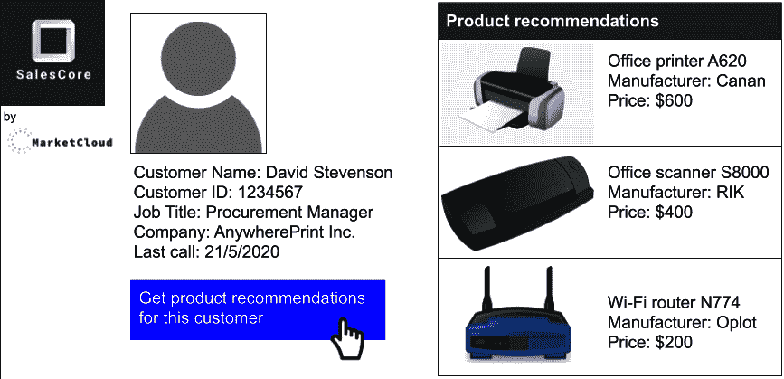
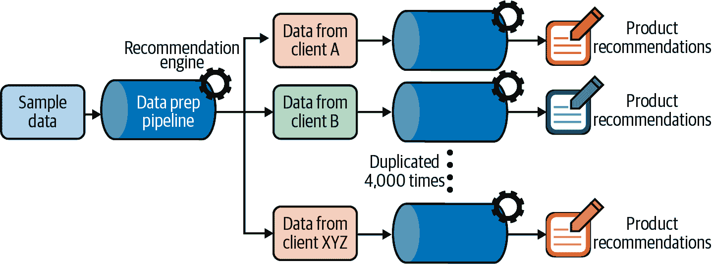

# 第十章：MLOps 实践：营销推荐引擎

Makoto Miyazaki

推荐引擎在过去 20 年里变得非常流行，从亚马逊的第一本书推荐到今天在数字商店、广告和音乐视频流媒体中的普遍应用。我们都已经习惯了它们。然而，多年来，这些推荐引擎背后的技术已经发展和演变。

本章涵盖了一个使用案例，说明了在快节奏和快速变化的机器学习模型生命周期中，MLOps 策略的适应和需求。

# 推荐引擎的崛起

历史上，营销推荐是由人工构建的。基于定性和定量营销研究，营销大亨们会制定静态定义印象（即广告展示视图）的规则，发送给具有特定特征的顾客。这种技术催生了[营销数据挖掘的都市传说](https://oreil.ly/HDPpE)，即一家杂货连锁店发现，周四和周六购买尿布的男性更有可能购买啤酒，因此将这两种商品摆放在一起将增加啤酒的销量。

总体而言，手动创建的推荐引擎呈现了许多瓶颈，导致大量资金浪费：由于规则创建过程是手动的，很难基于许多不同的顾客特征制定规则；很难设置实验来测试多种不同的印象；当顾客行为发生变化时，更新规则也很困难。

## 机器学习的角色

机器学习的兴起为推荐引擎带来了新的范式，允许消除基于人类洞察力的规则。一种称为*协同过滤*的新类算法主导了这一领域。这种算法能够分析数以百万计的顾客和成千上万种产品的购买数据，进行推荐，而无需任何先前的营销知识。通过有效地识别像当前顾客购买过的顾客，营销人员可以依赖于优于传统方法的自动化策略，无论是在成本还是效率上。

由于策略构建的自动化过程，可以定期更新它们，并使用 A/B 测试或影子评分方案进行比较（包括在所有可能性中选择印象的方式）。请注意，这些算法可以与更经典的业务规则结合使用，出于各种原因——例如，避免过滤泡泡，在特定地理区域内不销售产品，或防止使用某些统计上显著但不道德的关联（比如向戒酒者推荐酒精制品），等等。

## 推送还是拉动？

在实施推荐引擎时，重要的是要记住其结构将取决于推送或拉取推荐。推送通道最易处理；例如，可以包括发送电子邮件或进行外呼。

推荐引擎可以定期以批处理模式运行（通常是每天一次到每月一次），并且可以轻松地将客户数据集分成几部分，以在健全的实验设计中进行分析。该过程的规律性允许定期审查和优化策略。

拉取通道通常更有效，因为它们在客户需要时提供信息，例如在线搜索或打电话给客服。可以利用会话中的具体信息（例如用户搜索了什么）来精确地定制推荐。例如，音乐流媒体平台为播放列表提供了拉取通道推荐。

推荐可以预先计算，就像本章的深入示例中所说明的那样，也可以实时生成。在后一种情况下，必须设置特殊的架构来动态计算推荐。

在拉取上下文中比较策略更具挑战性。首先，在给定渠道上打进电话的客户可能与普通客户不同。在简单情况下，可以随机选择每个推荐所使用的策略，但也可能需要在给定客户的特定期间内一致使用某种策略。这通常导致使用每种策略生成的推荐比例不平衡，这使得决定哪种策略最好的统计处理更复杂。然而，一旦建立了良好的框架，这允许非常快速的改进周期，因为可以实时测试许多策略。

# 数据准备

推荐引擎通常可以访问的客户数据包括以下内容：

+   关于客户的结构信息（例如年龄、性别、地点）

+   关于历史活动的信息（例如，过去的浏览、购买、搜索）

+   当前上下文（例如当前搜索、浏览的产品）

无论使用何种技术，所有客户信息都必须聚合为特征向量（固定大小的列表）。例如，可以从历史活动中提取以下特征：

+   在最近一周或一个月内的购买金额

+   在过去一段时间内的浏览次数

+   在过去一个月内支出或浏览量的增加

+   先前看到的印象和客户的响应

除了客户数据外，推荐的上下文还可以考虑。例如，对于季节性产品如地面游泳池，可以考虑到夏季的天数，或者到每月发薪日的天数，因为一些客户会因现金流问题延迟购买。

一旦客户和上下文数据格式化完成，定义一组可能的推荐内容是非常重要的，而且有很多选择要做。同一产品可能以不同的方式呈现，可以用不同的方式进行传播。

必须铭记“不推荐任何内容”选项的重要性。事实上，我们大多数人都有这样的个人经历，不是所有的推荐都有积极的影响。有时，不显示任何内容可能比其他选择更好。还要考虑到，某些客户可能没有资格看到某些推荐内容，例如取决于其地理来源。

# 设计和管理实验

为了利用推荐引擎的持续改进潜力，有必要在一个健全的框架内尝试不同的策略。在设计推荐引擎的预测模型时，数据科学家可能会专注于一种简单的策略，如预测给定客户点击给定推荐的概率。

与尝试收集关于客户是否购买产品及是否将此次购买归因于某个推荐的更精确方法相比，这可能看起来是一个合理的妥协。然而，从商业角度来看，这并不足够，因为可能会发生像自相残杀这样的现象（即通过向客户展示低毛利产品，可能会阻止其购买高毛利产品）。因此，即使预测准确且导致销售量增加，总体收入可能会减少。

另一方面，直接推广组织的利益而不是客户的利益，长期来看也可能带来不利后果。应谨慎选择用于评估特定战略是否带来更好结果的最重要 KPI，以及评估的时间段。选择推荐后两周内的收入作为主要 KPI 是常见做法。

为了尽可能接近实验设置，也称为 A/B 测试，必须仔细选择对照组和实验组。理想情况下，在实验开始前通过随机分割客户群体来定义这些组。如果可能，客户最近不应参与其他实验，以免其历史数据受到其影响的污染。然而，在许多新客户涌入的情况下，这可能不可行。在这种情况下，分组分配可以动态决定。组的大小以及实验的持续时间取决于预期的 KPI 差异的大小：预期效果越大，组大小越小，实验持续时间越短。

实验也可以分两步进行：首先，在第一步中，可以选择两组相等但有限的规模。如果实验结果积极，可以从新策略上开始部署 10%的比例，这一比例可以逐步提高，如果结果符合预期的话。

# 模型训练和部署

为了更好地说明针对这种用例的 MLOps 过程，以下几节重点介绍一个假想公司部署自动化流水线来训练和部署推荐引擎的具体示例。该公司是一家全球软件公司（我们称之为 MarketCloud），总部位于硅谷。

MarketCloud 的产品之一是一个名为 SalesCore 的软件即服务（SaaS）平台。SalesCore 是一款面向企业的 B2B 产品，允许用户（企业）通过跟踪交易、清理繁琐的行政任务，并为每个客户创建定制产品报价来简单地推动销售（见图 10-1）。

有时，MarketCloud 的客户在与客户通话时使用基于云的 SalesCore，通过查看与客户的过去互动以及由 SalesCore 建议的产品报价和折扣，调整其销售策略。

MarketCloud 是一家年收入约 2 亿美元、员工数以千计的中型公司。从酿酒公司的销售人员到电信实体的人员，MarketCloud 的客户代表了各种类型的企业。

###### 图 10-1\. SalesCore 平台的示意图，本节示例的理论公司的基础

MarketCloud 希望能够自动向 SalesCore 的销售人员显示产品建议，以帮助他们向客户销售产品。建议将基于客户的信息以及他们与销售人员的过去互动记录进行，因此每个客户的建议将是定制的。换句话说，SalesCore 基于推荐引擎，在拉（入站电话）或推（出站电话）的情境中使用。销售人员可以在与客户通话时将建议产品纳入其销售策略中。

为了实现这一想法，MarketCloud 需要构建一个推荐引擎并将其嵌入到 SalesCore 平台中，从模型训练和部署的角度来看，这提出了几个挑战。我们将在本节中介绍这些挑战，而在下一节中，我们将展示 MLOps 策略，使公司能够处理每一个挑战。

## 可扩展性和可定制性

MarketCloud 的商业模式（为客户公司销售软件，帮助它们销售自己的产品）呈现了一个有趣的情况。每家客户公司都有自己的数据集，主要是关于其产品和客户，而且不希望与其他公司共享这些数据。

如果 MarketCloud 有大约四千个客户在使用 SalesCore，这意味着与为所有客户创建一个通用的推荐系统相比，它需要创建四千个不同的系统。MarketCloud 需要想出一种方法，以尽可能高效的方式建立四千个推荐系统，因为无法一一手工制作那么多系统。

## 监控和重新训练策略

四千个推荐引擎中的每一个都将根据相应客户的客户数据进行训练。因此，它们中的每一个都将是一个不同的模型，产生不同的性能结果，并且几乎不可能手动监控所有四千个。例如，饮料行业客户 A 的推荐引擎可能会持续给出良好的产品建议，而电信行业客户 B 的引擎则很少提供良好的建议。MarketCloud 需要想出一种方法，自动化监控和随后的模型重新训练策略，以防性能下降。

## 实时评分

在许多情况下，MarketCloud 的客户在电话沟通时使用 SalesCore。销售谈判在通话期间每一分钟都在发展，销售人员需要在与客户互动过程中调整策略，因此推荐引擎必须能够响应实时请求。

例如，想象一下你作为销售人员与客户通话，以销售电信设备为例。客户告诉您他的办公室的情况，办公室现有的基础设施，比如光纤、WiFi 网络类型等等。在 SalesCore 中输入这些信息后，您希望平台能即时为您推荐客户可能购买的产品。平台的响应需要是实时的，而不是在通话结束后 10 分钟后或第二天。

## 可以打开和关闭推荐功能

负责任的 AI 原则承认保留人类参与的重要性。这可以通过人类在命令设计中实现，¹即应该有可能*不*使用 AI。此外，如果用户不能覆盖 AI 建议，采用可能会很低。一些客户重视使用他们自己的直觉来推荐产品给他们的客户。因此，MarketCloud 希望为其客户提供完全控制权，可以随时打开和关闭推荐引擎，以便客户在需要时使用推荐。

# 管道结构和部署策略

为了高效构建四千个推荐引擎，MarketCloud 决定创建一个数据流水线原型，并将其复制四千次。这个原型流水线包括必要的数据预处理步骤和一个单一的推荐引擎，建立在示例数据集上。所有四千个流水线中使用的推荐引擎算法是相同的，但它们将根据每个客户的特定数据进行训练（见 图 10-2）。

###### 图 10-2\. MarketCloud 推荐引擎项目的数据流水线结构图像

这样一来，MarketCloud 可以高效地启动四千个推荐系统。用户仍然保留一定的定制空间，因为引擎是使用他们自己的数据训练的，每个算法将使用不同的参数——即适应每个客户和产品信息。

能够将单一流水线扩展为四千个流水线的关键在于数据集的通用模式。如果客户 A 的数据集有 100 列，而客户 B 只有 50 列，或者客户 A 的“购买商品数量”列是整数，而客户 B 的同一列是字符串，它们需要经过不同的预处理流水线。

尽管每个客户具有不同的客户和产品数据，但在这些数据被注册到 SalesCore 时，每列获得相同的列数和相同的数据类型。这简化了事务，因为 MarketCloud 只需复制一条流水线四千次。

嵌入在四千个流水线中的每个推荐系统将具有不同的 API 终点。表面上看，当用户点击“显示产品推荐”按钮时，SalesCore 显示建议产品列表。但实际上，通过点击按钮，用户是触发了与特定客户的排名产品列表相关联的特定 API 终点。

# 监控与反馈

维护四千个推荐系统并非易事，虽然在此之前已经考虑了许多 MLOps 问题，但这可能是最复杂的部分。每个系统的性能需要根据需要进行监控和更新。为了在大规模上实施这一监控策略，MarketCloud 可以自动化重新训练和更新模型的情景。

## 重新训练模型

客户获取新客户，一些客户流失，每隔一段时间就会向其目录添加新产品或删除产品；底线是客户和产品数据不断变化，推荐系统必须反映最新数据。这是它们保持推荐质量的唯一方式，更重要的是，避免出现推荐过时且不再支持的 WiFi 路由器等情况。

为了反映最新的数据，团队可以编写一个方案自动更新数据库，使用最新的客户和产品数据，每天午夜重新训练模型。这种自动化方案然后可以在所有四千个数据管道中实施。

重新训练的频率可以根据使用情况而有所不同。在这种情况下，由于高度自动化，每晚重新训练是可能的。在其他情境中，重新训练可能会受到各种信号的触发（例如新信息的显著量或客户行为的漂移，无论是非周期性的还是季节性的）。

此外，必须考虑推荐与其效果评估的时间间隔。如果仅在几个月后才知道影响，每天重新训练显然是不够的。事实上，如果行为变化如此迅速，每天重新训练是必要的，那么在训练数据中最新数据几个月后使用模型做推荐时，模型很可能已经完全过时。

## 更新模型

更新模型也是规模化自动化策略的关键特性之一。在这种情况下，对于四千条管道中的每一条，重新训练的模型必须与现有模型进行比较。可以使用诸如 RMSE（均方根误差）之类的指标比较它们的性能，只有当重新训练的模型的性能优于先前的模型时，重新训练的模型才会被部署到 SalesCore。

## 晚间运行，白天休眠

尽管模型每天重新训练，用户并不直接与模型互动。使用更新后的模型，平台实际上在夜间完成为所有客户计算产品排名列表。在第二天，当用户点击“显示产品推荐”按钮时，平台只需查看客户 ID，并返回特定客户的产品排名列表。

对用户来说，推荐引擎看起来是实时运行的。然而实际上，一切都是在夜间准备好的，白天引擎处于休眠状态。这样可以实现即时推荐，没有任何停机时间。

## 手动控制模型的选项

尽管模型的监控、重新训练和更新是完全自动化的，MarketCloud 仍然为其客户留有关闭和打开模型的空间。更确切地说，MarketCloud 允许用户从三个选项中选择与模型互动的方式：

+   打开以基于最新数据集获取推荐

+   冻结以停止使用新数据进行重新训练，但继续使用相同的模型

+   关闭以完全停止使用 SalesCore 的推荐功能

机器学习算法试图将实际知识转化为有意义的算法，以自动化处理任务。然而，让用户依赖他们的领域知识仍然是良好的实践，因为他们被认为能够更好地识别、表达和展示日常业务过程中的问题。

第二个选项很重要，因为它允许用户保持当前推荐的质量，而无需推荐引擎使用更新的数据。当前模型是否被重新训练取决于基于诸如 RMSE 之类的度量标准的数学评估。然而，如果用户觉得 SalesCore 上的产品推荐已经有效促进销售，他们可以选择不冒险改变推荐质量。

## 自动控制模型的选项

对于那些不想手动处理模型的人，平台也可以提出 A/B 测试，以便在完全切换之前测试新版本的影响。多臂赌博算法（一种允许最大化用户面对多个老虎机的收入的算法，每个老虎机的赢取概率和平均返还的钱的比例都不同）用于此目的。

假设有多个模型版本可用。目标是使用最有效的一个，但要做到这一点，算法显然必须首先学习哪个是最有效的。因此，它平衡这两个目标：有时它尝试可能不是最有效的算法来学习它们是否有效（探索），有时它使用可能是最有效的版本来最大化收入（利用）。此外，它会忘记过去的信息，因为算法知道今天最有效的可能明天就不是最有效的了。

最先进的选项是为不同的 KPI（点击、购买、预期收入等）训练不同的模型。然后，受集成模型启发的方法将允许解决模型之间的冲突。

## 性能监控

当销售人员建议客户购买 SalesCore 推荐的产品时，记录客户与推荐产品的互动以及客户是否购买了这些产品。然后可以使用这些记录来跟踪推荐系统的性能，将这些记录覆盖客户和产品数据集，以在重新训练模型时提供最新的信息。

由于这种地面真实记录过程，可以向用户展示显示模型性能的仪表板，包括来自 A/B 测试的性能比较。由于地面真实很快就可以获得，数据漂移监控是次要的。模型的一个版本每晚训练一次，但由于冻结机制，用户可以根据定量信息选择活跃版本。在这些性能指标难以捕捉决策背后完整背景的高影响决策中，保持人类参与是惯例。

在 A/B 测试的情况下，重要的是一次只对一组客户进行一个实验；无法简单地加总组合策略的影响。考虑到这些因素，可以建立一个坚实的基线来进行反事实分析，并推导出与新策略相关的增加收入和/或减少流失。

除此之外，MarketCloud 还可以通过检查多少客户冻结或关闭推荐系统来监控算法的宏观性能。如果许多客户关闭了推荐系统，这表明他们对推荐质量不满意的强烈指示。

# 总结思考

这个用例在某种意义上很特别，因为 MarketCloud 建立了一个销售平台，许多其他公司用来销售产品，其中数据的所有权归每家公司所有，不能在公司之间共享。这带来了一个具有挑战性的情况，即 MarketCloud 必须为每个用户创建不同的推荐系统，而不是汇集所有数据创建一个通用推荐引擎。

MarketCloud 可以通过创建一个单一的管道来克服这个障碍，将来自许多不同公司的数据输入其中。通过让数据经过自动化推荐引擎训练场景，MarketCloud 创建了许多针对不同数据集训练的推荐引擎。良好的 MLOps 流程使公司能够在规模上做到这一点。

值得注意的是，尽管这个用例是虚构的，但它基于现实。类似项目的真实团队花了大约三个月的时间完成。团队利用数据科学和机器学习平台编排复制单一管道到四千个副本，并自动化流程，将相应数据集输入到每个管道并训练模型。必要时，他们在推荐质量和可扩展性之间接受了权衡，以高效地推出产品。如果团队精心为这四千个管道中的每一个定制了推荐引擎，例如为每个客户选择最佳算法，推荐引擎将会质量更高，但他们将永远无法在如此短的时间内用如此小的团队完成这个项目。

¹ 人类控制设计的解释，请参见[Karen Yeung，“责任与人工智能”（欧洲理事会研究，DGI(2019)05），第 64 页，脚注 229](https://oreil.ly/p5hJR)。
