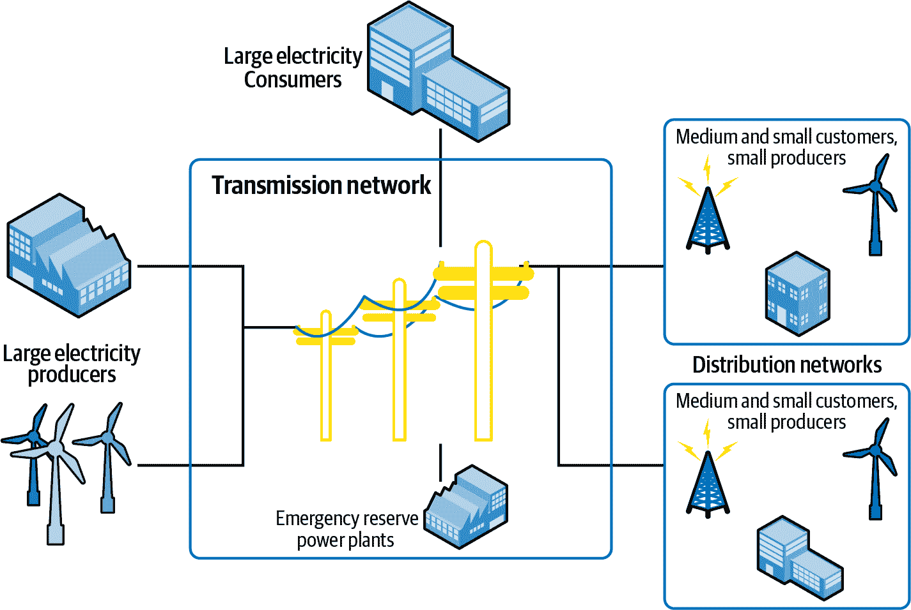

# 第十一章：实践中的 MLOps：消费预测

Nicolas Omont

预测在不同时间和地理尺度上对电网运行至关重要。它们允许模拟系统可能的未来状态，并确保其可以安全运行。本章将介绍消费预测的机器学习模型生命周期和 MLOps 使用案例，包括业务考虑因素、数据收集和实施决策。尽管此特定章节专注于电力网格，但消费预测的考虑因素和特殊情况可以推广到其他使用消费预测的工业案例。

# 电力系统

大电力系统是电网的支柱。也称为输电网络，它们构成了保持灯火通明的系统核心。这些系统主要由线路和变压器组成，通过分布网络间接连接到大多数生产者和消费者，后者负责最后几公里的传输。正如在图 11-1 中所示，只有最大的生产者和消费者直接连接到大系统。

###### 图 11-1\. 一个示例的大电力系统，只有最大的生产者和消费者直接连接

传输距离越长、能量体积越大，使用的电压越高：在低端，几十千伏用于几十兆瓦在几十公里上的传输；在高端，数百万伏用于数千兆瓦在数千公里上的传输。（一条容量为一兆瓦的线路可以为欧洲约一千名居民提供电力。）传输系统的运行一直需要大量的通信和计算，因为其特性如下：

无能量储存

网络存储的能量微不足道——在电网中不到一秒的消耗量，而在交流发电机和电动机中最多可达 30 秒。相比之下，天然气网络在其管道中存储了数小时的消耗量。因此，必须迅速采取行动来平衡生产和消费，避免停电。

弱流量控制

在电信网络上，拥塞通过丢包或不建立呼叫来处理。在电网中不存在类似的机制，这意味着网格元素上的电力流量可能高于其运行极限。根据技术和严重程度，几秒钟到几小时的超载后必须采取行动。尽管存在流量控制技术，但在流量控制和即时平衡之间存在权衡：电力必须找到从发电到消费的路径。

由于这两个属性，电网操作员必须始终预测突发情况：如果此电网元素故障，剩余元素的过载是否仍然可接受？预期是在几个时间尺度上进行的，从接下来的五分钟到接下来的五十年。需要采取的行动取决于时间跨度。例如：

+   少于五分钟：无法进行人工操作。自动操作应该已经定义完善。

+   从五分钟到几小时之间：生产时间表和电网拓扑的调整（开断路器和其他流控技术的应用）。

+   几天前：维护时间表的调整。

+   几个季节前：维护时间表的调整，与生产者或消费者签订合同，以保证电力容量或限制电力产生或消耗。

+   从 5 到 50 年之间：投资电网元素。线路和变压器的标准寿命可达数十年；实际上，预计某些电网元素将超过一百年。

另一个问题是在不同地理尺度上的预期。尽管某些事故只对电网的一小部分产生影响，但某些事故可能会对整个大陆产生影响，并可能需要多个国家协调行动以减轻其影响。因此，运行电网需要：

1.  在时间紧迫的情况下，收集广域的数据。

1.  处理数据以便预测并相应行动。

# 数据采集

收集过去的数据是制作预测的第一步。数据主要来自两个独立的来源：SCADA（监控与数据采集）系统和计量系统。根据预测用例，可能会使用其中之一。

SCADA 系统实时收集数据，为操作员提供系统的最新视图。它还允许向网络设备发送命令，例如打开和关闭断路器。系统的最出色表现是大多数控制室中常见的综合显示屏，如图 11-2 所示。

###### 图 11-2。SCADA 系统通常每 10 秒或更短时间刷新数千次有关电网流动、消耗和发电的测量数据。

有些测量是有意冗余的，比如功率损耗的测量。如果在线路的每一端测量功率流，则它们之间的差等于该线路上的损耗。这些损耗可以通过物理估计来处理，以便在一个测量缺失的情况下处理，检测异常或改进估计的精度。

使用冗余以生成网络状态的过程称为状态估计，并且每隔几分钟运行一次。当操作限制条件不满足时，SCADA 系统会发出警报。但是，如果网格元素中的任何一个失效，SCADA 无法发出警报。

对由状态估计产生的一致状态进行网络元素损失仿真（N-1 仿真）是定期进行的，而 SCADA 数据的值迅速消退；因此，在历史化时，它不会被整合；通常不输入缺失值，通常也不纠正异常。状态估计被各种过程使用，因此通常会在几个月到几年的时间内被历史化。

用于计费的计量系统不需要像 SCADA 系统那样具有反应性，但应精确。它侧重于发电和消费，而不是流动。它不是监视瞬时功率，而是记录在几分钟到一小时之间的一段时间内抽取或注入的能量。

它收集的信息之前需延迟一天或更长时间才能获取。较新的系统使信息在几分钟内可用。然而，当存在缺失测量或异常时通常需要整合和验证，以便最终数据通常在几个工作日内仍然可用。这些数据有很好的历史记录。

# 问题定义：机器学习，还是不是机器学习？

并非所有的使用案例都适合机器学习。有些情况可以通过其他方式更轻松、更便宜地解决。用于这类使用案例的预测技术在这三种情况下不同，如表 11-1 所示。

表 11-1\. 案例使用的预测技术

| 使用案例 | 预测技术 |
| --- | --- |
| 预测不确定性来自操作员无法改变的系统的一部分。 | 从实际上来说，改变天气是不可能的。因此，风能和光伏（PV）发电以及供暖和空调可以安全地被视为外生变量。这使它们成为直接进行机器学习预测的良好候选。这些预测可以利用气象预测或气候场景，具体取决于时间跨度。气象预测通常仅提前几天，尽管一些模型现在可以预测未来几个月的趋势。 |
| 预测不确定性来自操作员可以在某种程度上影响的系统的一部分。 | 例如，严格来说，不应该预测消费，而是需求。消费与需求的区别在于，消费在操作员手中，可以选择关闭消费者不满足需求。出于同样的原因，应预测光伏和风能生产潜力，而不是实际生产。 |
| 预测的不确定性来自系统的一部分，其他行动者可以控制并预测。 | 例如，对于可调度的电力单元，操作员可以将其打开或关闭，最好要求操作员提供时间表。如果不可能，复制时间表的方式可能更好，例如，如果电价高于电厂燃料成本，操作员可以启动电厂。在这种情况下，预测可能依赖于诸如基于代理模型的建模技术。大型工厂可能根据其操作生产计划有消耗计划。配电网拓扑结构也可能需要提前计划，因为维护操作需要提前规划。在所有这些情况下，通常最好要求提供时间表，而不是使用机器学习来预测。 |

# 空间和时间分辨率

由于大数定律，当消费在空间或时间上聚合时，预测的不确定性会减少。尽管预测个体家庭每小时的消耗很难，因为人们不是机器，但对几百万人口的人群来说却相当容易，对这样的人群每月消耗的预测也相对容易。

因此，预测系统通常是分层的，具有几个层次的预测，这些预测通过约束条件连接在一起。也就是说，区域预测应该总结到全国范围内的预测，小时预测应该总结到每日预测。

让我们举一个引人注目的例子来说明这一点。电力牵引列车对电网运营商来说具有令人担忧的消耗模式，因为它们移动，典型的列车线路每 10 到 50 公里由不同的变电站供电。因此，操作员每隔大约 10 分钟就会看到几兆瓦的消耗在不同的变电站之间切换。这造成了几个问题：

+   在线路层面上预测相对较容易，因为列车总是在某处消耗，并且列车通常在固定的时间行驶。因此，机器学习方法可能会有效。

+   在给定变电站长时间内所撤出的能量的预测也相对较简单，因为列车将通过线路的相应部分。

+   但是由于操作员希望知道列车在行驶时是否会造成过载，因此需要一套一致的预测：

    +   列车应该一次只在一个位置吸取电力。

    +   每个变电站应该在某个时间点看到消耗的急剧增加，因此需要细粒度的时间分辨率。

因此，解决方案取决于预测的目标：

+   日常基础上，将列车消耗分配到所有变电站的平均解决方案是不可接受的，因为可能会错过潜在的过载情况。将列车消耗分配到所有变电站的最坏情况解决方案可能更可接受，尽管它会预期到虚假过载，因为总体消耗将太大。

+   然而，为了安排喂养该地区的一条线路的维护，消费的确切位置可能不会产生影响，只要不重复计数。

在设计预测系统时，将不得不做出权衡，因为完美系统不太可能存在。如果系统有很大的余量，则预计几乎没有或没有过载，因此预测系统可以粗糙。但是，如果电网接近其极限运行，则必须小心制定系统。

# 实施

数据一旦由 SCADA 系统或计量系统收集，就必须进行历史化。除了存储原始数据外，还需要进行一些处理：

+   时间聚合，例如在五分钟内：保留平均值或高分位数值。平均值代表该时段内消耗的能量，高分位数有助于评估是否发生约束。

+   分解：当只测量到取出量时，需要分别估计生产和消费。通常，在去除分布式发电（风能、光伏等）的最佳估计后，消费量是剩余的部分。机器学习可以用来进行这些估计。

+   空间聚合：由于系统平衡，可以通过计算本地生产与与邻近地区的交换之差来计算区域的消费量。这在历史上非常有用，因为生产易于监控，因为只有少量非常大的发电单元和少量与邻国的线路。如今，随着分布式发电的普及，这变得更加复杂。

+   缺失值插补：可能会出现测量值缺失的情况。在 SCADA 系统中，存在规则用于实时用老数据或者典型值替换缺失值。在计量系统中，插补是一个重要的过程，因为它会直接反映在客户的账单上。

数据然后存储在不同的数据库中。用于短期关键过程的数据存储在高可用系统中，冗余性允许从数据中心丢失中快速恢复。用于长期过程（开票、报告、ML 模型训练）的数据存储在普通的 IT 数据库中。总体而言，按照今天的标准，受监控的电网元素数量将在 1,000 到 100,000 之间波动。这意味着它们产生了合理量的数据。扩展性也不是问题，因为发达国家的大型电网已不再增长。

# 建模

一旦数据准备完成，数据科学家通常可以访问几百个不同电网提取点的生产和消费时间序列。他们必须开发方法来预测其中一些在不同的时间范围内。他们通常专注于风能、光伏发电以及间歇性水力发电的生产潜力和需求。尽管风能和光伏主要依赖气象因素，但需求主要受经济活动驱动，但部分也依赖于气象条件（例如供暖和制冷）。

根据不同的视角，建模可能看起来非常不同：

+   短期：在未来几天内，最后已知的数值对于进行预测非常重要。此外，出于同样的原因，气象预报是可用的。因此，方法将利用这些信息。在这种情况下，确定性预测是合理的。

+   中期：在几天到几年之间，气象是未知的，但气候是已知的。基于过去年度趋势的统计外推是有意义的，除非发生经济危机。因此，可以制定场景以获得关于未来消费的统计指标（平均值、置信区间、分位数等）。

+   长期：投资决策需要对未来几十年的预测。在这个视角上，对当前趋势的统计外推不足以应对社会经济和气候变化，尤其是全球变暖。因此，统计方法必须与基于使用的自底向上方法和关于未来的多样化专家制定的场景相结合。

机器学习和 MLOps 主要涉及短期和中期预测。在这种情况下，中期模型更容易开始：在几年的数据基础上，目标是根据：

+   日历，具有日常、周常和年度周期的叠加。银行假日和学校假期也会产生重大影响，此外还有夏令时。

+   气象变量（温度、风、阳光）。由于建筑物具有非常大的热惯性，可能需要过去至少两天到三周的温度数据。

尽管可以使用任何类型的机器学习算法，但预测曲线的平滑性很重要，因为预测不是单独使用的，而是作为每日、每周或每年的场景。许多算法在其度量标准中不考虑平滑性，因为它们依赖于假设数据是独立同分布的，而在我们的情况下，这是不正确的，因为给定日的消费通常与前一日和前一周的消费相关联。

广义可加模型（GAM）通常是一个很好的起点：它们基于样条，因此保证了平滑性。事实上，消费预测是它们开发的用例之一。结合气候场景，机器学习模型可以生成年度消费场景。

短期预测更为复杂。最简单的方法是从最近的历史数据中减去中期预测，然后使用标准时间序列技术（如 ARIMA（自回归积分移动平均）或指数平滑）处理残差。这允许生成几天的预测。一个基于多年数据训练的集成短期模型可能比这种简单方法有潜在优势。

例如，中期模型是基于实现的气象数据训练的，而不是基于气象预测。因此，它过于重视气象预测，即使它们可能是错误的。基于气象预测训练的短期模型将解决这个问题。然而，虽然新算法（如长短期记忆（LSTM）神经网络）很有前途，但很难找到一种方法，以一致的方式同时预测几个时间范围内的任何时间点。

当分辨率达到使随机性过大而无法进行有意义预测时，最好是在时间序列或空间上进行聚合，然后使用非机器学习的启发式方法来分割聚合的预测：

+   在空间聚合情况下，基于过去观察的共享密钥

+   在临时聚合情况下，基于过去观察的平均配置文件

由于网络在不断发展，新的注入和提取可能会出现，而没有历史数据可用，并且消费模式可能会出现断裂，因此过去的数据不再相关。预测方法必须考虑这些边缘情况。断裂可以使用异常检测方法来发现。一旦识别到断裂，可以使用简化模型，直到有足够的历史数据为止。

再次，神经网络可能成为一个吸引人的替代方案，承诺只需为所有消费训练一个模型，而不是使用标准方法为每个消费训练一个模型。事实上，只有一个模型，即使消费的历史数据较少，也可以进行预测，前提是其模式看起来类似于现有模式。

# 部署

现在，这些模型很可能是由数据科学家在 R、Python 或 MATLAB 脚本中进行原型设计的。原型能够准备数据，在一个数据集上训练模型，并在另一个数据集上评分。其操作化可能会遵循几条路径：

+   原型完全重写。这种方式成本高，不够灵活，但在需要嵌入运营技术（OT）系统时可能是必要的。

+   只有数据准备和评分被重新编写，这允许根据不同的时间表进行培训。如果培训每年进行一次或更频繁，这是有道理的，因为定期进行模型审查以确保其良好运行，并且具备维护所需的技能是一个良好的实践。

+   数据科学和机器学习平台可用于将原型操作化。这些平台灵活且允许将原型转移到保证安全性和可扩展性的生产环境中。大多数消费预测模型将定期以批处理模式运行。对于更具体的用例，这些平台能够将训练好的模型导出为 JAR 文件、SQL、PMML、PFA 和 ONNX，以便能够灵活地集成到任何类型的应用程序中。

# 监控

本节主要讨论短期预测。事实上，中期和长期预测通常受漂移影响，因为过去看起来从未像未来，所以在使用之前几乎总是重新训练。对于短期预测，除了 IT 监控以在预测未能按时产生时引发警报，并对可能导致错过截止日期的事件发出警告外，模型本身也应该受到监控。

第一种监控类型是漂移监控。对于电力消费，漂移监控与模型部署在一起是至关重要的。异常检测和断裂检测允许团队确保可以使用训练好的模型。如果不能使用，则应使用基于浅层历史数据或多个消费预测的规范分解的备用模型。这种第一层将在线检测到显著的漂移。

尽管数据科学家会尝试设计适应消费水平（如 ARIMA）的模型，但检测到某些消费水平比培训期间低或高可能很有用。这可能是慢慢发生的，因此在线未能检测到。例如，如果每天计算第二天的预测，那么离线分析预测，例如每月一次，可以检测到这些慢漂移。在这些情况下，如果没有额外的基准数据可用，将这些消费切换到备用模型是有意义的。

最后，在操作之后，可以通过各种指标如平均绝对百分比误差（MAPE）评估预测性能。如果在显著时间段内（例如一个月）检测到性能下降，可以考虑重新训练相应的模型，因为有新数据可用，重新训练的模型可能会提高性能。

这要求设计和生产环境与 CI/CD 流程（在第六章详细讨论过）紧密集成。如果能够每年手动处理一次新模型的部署，那么每个月进行一次则通常成本过高。通过先进的数据科学和机器学习平台，还可以在将其用于预测之前，对新模型进行几天的影子评分。

# 总结思考

在本章中，我们看到如何使数据发挥作用，以协助运行输电电网。各种机器学习和非机器学习技术可用于为从分钟到数十年的时间尺度上的数千次消费提供预测。

由于 MLOps 的作用，设计、部署和监控流程已在多个行业间标准化，并开发了支持此流程的数据科学和机器学习平台。消费预测系统的设计者可以利用这些标准流程和平台，从成本、质量或时间价值的角度改善这些系统的效率。

回顾全局视角，很明显，不同行业在定义问题、建模、推向生产等方面存在各种各样的机器学习用例，每个用例都有其独特的复杂性，正如本书所覆盖的一切。但无论是哪个行业或用例，MLOps 流程始终是一个纽带，使数据团队（甚至整个组织）能够扩展其机器学习工作。
