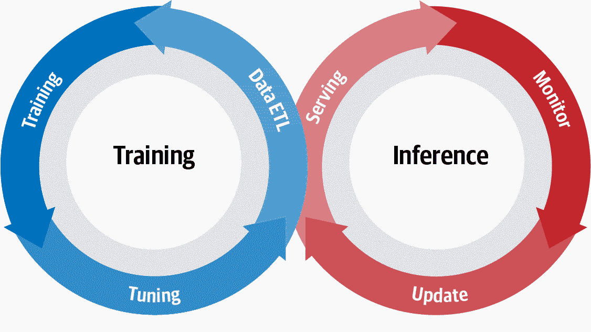
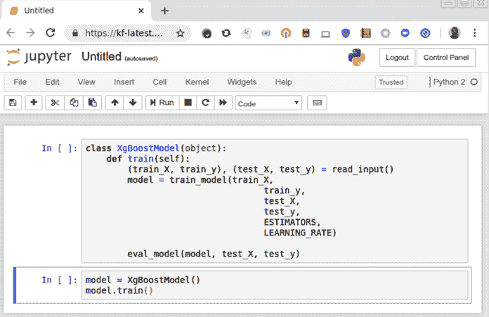
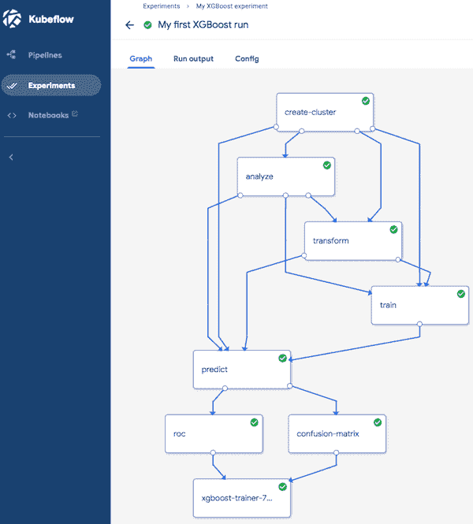

# 第一章：Kubeflow：是什么以及谁会用它

如果您是试图将模型投入生产的数据科学家，或者是试图使模型可扩展和可靠的数据工程师，Kubeflow 提供了帮助的工具。Kubeflow 解决了如何将机器学习从研究转向生产的问题。尽管有常见的误解，Kubeflow 不仅仅是 Kubernetes 和 TensorFlow，您可以用它来处理各种机器学习任务。我们希望 Kubeflow 是适合您的正确工具，只要您的组织在使用 Kubernetes。“Kubeflow 的替代方案”介绍了一些您可能希望探索的选项。

本章旨在帮助您决定 Kubeflow 是否适合您的用例。我们将介绍您可以从 Kubeflow 中期待的好处，一些相关的成本，以及一些替代方案。在本章结束后，我们将深入探讨如何设置 Kubeflow 并构建端到端的解决方案，以帮助您熟悉基础知识。

# 模型开发生命周期

机器学习或模型开发基本上遵循路径：数据 → 信息 → 知识 → 洞察力。从数据中生成洞察力的这一路径可以用图 1-1 来形象描述。

*模型开发生命周期*（MDLC）是一个常用术语，用于描述训练和推断之间的流程。图 1-1 是这种连续交互的可视化表示，当触发模型更新时，整个周期重新开始。

###### 图 1-1\. 模型开发生命周期

# Kubeflow 的定位在哪里？

Kubeflow 是一套云原生工具，涵盖了 MDLC 的所有阶段（数据探索、特征准备、模型训练/调整、模型服务、模型测试和模型版本控制）。Kubeflow 还具有允许这些传统上独立工具无缝协作的工具。其工具的一个重要部分是管道系统，允许用户构建集成的端到端管道，连接其 MDLC 的所有组件。

Kubeflow 适用于既是数据科学家又是数据工程师，希望构建生产级机器学习实现的人士。Kubeflow 可以在您的开发环境中本地运行，也可以在生产集群上运行。通常在本地开发并在管道准备就绪后迁移管道。Kubeflow 提供了一个统一的系统，利用 Kubernetes 进行容器化和可扩展性，以实现管道的可移植性和可重复性。

# 为什么要容器化？

容器提供的隔离使得机器学习阶段具有可移植性和可重现性。容器化应用程序与您的机器其他部分隔离，并包含所有的需求（从操作系统开始）。¹ 容器化意味着不再需要包含“在我的机器上可行”或“哦，是的，我们忘记了一个，你需要这个额外的包”的对话。

容器是由可组合的层构建的，允许你使用另一个容器作为基础。例如，如果你想使用一个新的自然语言处理（NLP）库，你可以将其添加到现有容器之上，而不必每次从头开始。这种可组合性允许你重复使用一个通用的基础；例如，我们使用的 R 和 Python 容器都共享一个基础 Debian 容器。

关于使用容器的一个普遍担忧是开销问题。容器的开销取决于你的实现方式，但 IBM 的一篇论文² 发现容器的开销非常低，并且通常比虚拟化更快。在 Kubeflow 中，安装了一些可能不会使用的运算符会增加一些额外开销。在生产集群上这种开销可以忽略不计，但在笔记本电脑上可能会有所感觉。

###### 提示

具有 Python 经验的数据科学家可以将容器视为一个功能强大的虚拟环境。除了虚拟环境中常见的功能外，容器还包括操作系统、软件包等一切。

# 为什么选择 Kubernetes？

[Kubernetes](https://kubernetes.io) 是一个用于自动化部署、扩展和管理容器化应用程序的开源系统。它允许我们的流水线在保持可移植性的同时实现可扩展性，从而避免被锁定在特定的云提供商中。³ 除了能够从单一机器切换到分布式集群外，你的机器学习流水线的不同阶段可以请求不同数量或类型的资源。例如，你的数据准备步骤可能更适合在多台机器上运行，而你的模型训练可能更适合在 GPU 或张量处理单元（TPU）上计算。在云环境中，这种灵活性尤为重要，你可以在需要时使用昂贵的资源来降低成本。

当然，你可以在 Kubernetes 上构建自己的容器化机器学习流水线，而不使用 Kubeflow；然而，Kubeflow 的目标是标准化这一过程，使其变得更加简单高效。⁴ Kubeflow 提供了一个通用接口，覆盖了你在机器学习实现中可能使用的工具。它还使得配置你的实现以使用像 TPU 这样的硬件加速器变得更加容易，而无需修改代码。

# Kubeflow 的设计和核心组件

在机器学习领域，存在着多样化的库、工具集和框架选择。Kubeflow 不寻求重复发明轮子或提供“一刀切”的解决方案——相反，它允许机器学习从业者根据特定需求组合和定制自己的堆栈。它旨在简化规模化构建和部署机器学习系统的过程。这使得数据科学家可以将精力集中在模型开发上，而不是基础设施上。

Kubeflow 致力于通过三个特性来简化机器学习的问题：可组合性、可移植性和可扩展性。

可组合性

Kubeflow 的核心组件来自于数据科学工具，这些工具对于机器学习从业者已经非常熟悉。它们可以独立使用以促进机器学习的特定阶段，或者组合在一起形成端到端的流水线。

可移植性

通过基于容器的设计，并利用 Kubernetes 及其云原生架构，Kubeflow 不要求您锚定到任何特定的开发环境。您可以在笔记本电脑上进行实验和原型设计，并轻松部署到生产环境。

可扩展性

通过使用 Kubernetes，Kubeflow 可以根据集群的需求动态扩展，通过更改底层容器和机器的数量和大小。⁵

这些功能对于 MDLC 的不同部分至关重要。随着数据集的增长，可扩展性变得越来越重要。可移植性对于避免供应商锁定至关重要。可组合性使您可以自由地混合和匹配最适合工作的工具。

让我们快速浏览一下 Kubeflow 的一些组件及其如何支持这些功能。

## 使用笔记本进行数据探索

MDLC 始终从数据探索开始——绘图、分割和操作数据，以理解可能存在的见解。一个强大的工具提供了这些数据探索工具和环境，即 Jupyter。Jupyter 是一个开源的 Web 应用程序，允许用户创建和共享数据、代码片段和实验。由于其简单性和可移植性，Jupyter 在机器学习从业者中很受欢迎。

在 Kubeflow 中，您可以启动与集群及其其他组件直接交互的 Jupyter 实例，如图 1-2 所示。例如，您可以在笔记本电脑上编写 TensorFlow 分布式训练代码片段，并仅需点击几下即可启动训练集群。

###### 图 1-2\. 在 Kubeflow 中运行的 Jupyter 笔记本

## 数据/特征准备

机器学习算法需要良好的数据才能有效，通常需要特殊工具来有效地提取、转换和加载数据。通常情况下，人们会对输入数据进行过滤、归一化和准备，以从结构化嘈杂的数据中提取深刻的特征。Kubeflow 支持几种不同的工具来完成这些任务：

+   Apache Spark（最流行的大数据工具之一）

+   TensorFlow Transform（与 TensorFlow Serving 集成，用于更轻松的推断）

这些独特的数据准备组件可以处理各种格式和数据大小，并设计为与您的数据探索环境兼容。⁶

###### 注意

在 Kubeflow 管道中支持 Apache Beam 和 Apache Flink 是一个正在积极开发的领域。

## 训练

一旦准备好您的特征，您就可以构建和训练您的模型了。Kubeflow 支持多种分布式训练框架。截至撰写本文时，Kubeflow 支持：

+   [TensorFlow](https://www.tensorflow.org)

+   [PyTorch](https://pytorch.org)

+   [Apache MXNet](https://mxnet.apache.org)

+   [XGBoost](https://github.com/dmlc/xgboost)

+   [Chainer](https://chainer.org)

+   [Caffe2](https://caffe2.ai)

+   [消息传递接口 (MPI)](https://oreil.ly/0zln4)

在第七章中，我们将详细讨论 Kubeflow 如何训练 TensorFlow 模型，而第九章将探索其他选项。

## 超参数调整

如何优化您的模型架构和训练？在机器学习中，超参数是控制训练过程的变量。例如，模型的学习率应该是多少？神经网络中应该有多少隐藏层和神经元？这些参数不是训练数据的一部分，但它们对训练模型的性能有重大影响。

使用 Kubeflow，用户可以从一个他们不确定的训练模型开始，定义超参数搜索空间，Kubeflow 将处理其余的事情——使用不同的超参数启动训练作业，收集指标，并将结果保存到模型数据库中，以便比较它们的性能。

## 模型验证

在将模型投入生产之前，了解其可能的性能非常重要。用于超参数调整的同一工具可以执行模型验证的交叉验证。当您更新现有模型时，像 A/B 测试和多臂赌博机可以用于模型推断，以在线验证您的模型。

## 推断/预测

训练完模型后，下一步是在集群中部署模型以处理预测请求。Kubeflow 可以让数据科学家轻松将机器学习模型部署到生产环境中，并进行规模化部署。目前，Kubeflow 提供了一个多框架组件用于模型服务（KFServing），除了 TensorFlow Serving 和 Seldon Core 等现有解决方案。

在 Kubeflow 上提供多种类型的模型相对比较简单。在大多数情况下，无需自行构建或定制容器——只需将 Kubeflow 指向存储模型的位置，服务器就可以准备好服务请求。

一旦模型提供服务，就需要监视其性能，并可能进行更新。通过 Kubeflow 的云原生设计，可以实现这种监控和更新，并且将在第八章进一步扩展。

## 管道

现在我们已完成 MDLC 的所有方面，希望能够实现这些实验的可重复使用性和治理。为此，Kubeflow 将 MDLC 视为机器学习管道，并将其实现为一个图形，其中每个节点是工作流程中的一个阶段，如图 1-3 所示。Kubeflow Pipelines 是一个允许用户轻松组合可重复使用工作流程的组件。其功能包括：

+   多步骤工作流程的编排引擎

+   一个 SDK 用于与管道组件交互

+   一个用户界面，允许用户可视化和跟踪实验，并与合作者分享结果

###### 图 1-3. 一个 Kubeflow 管道

## 组件概览

正如您所见，Kubeflow 内置了 MDLC 的所有部分的组件：数据准备、特征准备、模型训练、数据探索、超参数调整和模型推断，以及用于协调所有事务的管道。但您不仅限于作为 Kubeflow 一部分提供的组件。您可以在这些组件的基础上构建，甚至替换它们。对于偶尔替换组件来说，这可能没问题，但如果您发现自己想要替换 Kubeflow 的许多部分，您可能需要探索一些可用的替代方案。

# Kubeflow 的替代方案

在研究社区内，存在许多提供与 Kubeflow 功能迥然不同的替代方案。最近的研究集中在模型开发和训练方面，基础设施、理论和系统方面取得了大幅进展。

另一方面，预测和模型服务接收到的关注相对较少。因此，数据科学从业者通常会将一系列关键系统组件混合在一起，这些组件被集成以支持跨多种工作负载的服务和推断，并持续演进的框架。

针对持续可用性和水平可扩展性的需求，像 Kubeflow 和其他各种解决方案正在行业中获得广泛认可，作为强大的架构抽象工具和令人信服的研究范围。

## Clipper（RiseLabs）

一个有趣的替代 Kubeflow 的选择是 Clipper，一个由 RiseLabs 开发的通用低延迟预测服务系统。为了简化部署、优化和推断，Clipper 采用了分层架构系统。通过各种优化和模块化设计，Clipper 实现了与 TensorFlow Serving 相媲美的低延迟和高吞吐量预测，适用于三种不同推断成本的 TensorFlow 模型。

Clipper 分为两个抽象层，分别命名为 *模型选择* 和 *模型抽象* 层。模型选择层非常复杂，使用自适应在线模型选择策略和各种集成技术。由于模型在应用程序生命周期内持续学习反馈，模型选择层可以在无需直接与策略层交互的情况下自我校准失败的模型。

Clipper 的模块化架构和与 Kubeflow 类似的容器化方法，使得可以跨框架共享缓存和批处理机制，同时获得可扩展性、并发性和灵活性增加新的模型框架的好处。

从理论上升级到功能端到端系统，Clipper 在科学界获得了认可，并且其架构设计的各个部分已被最近引入的机器学习系统采纳。尽管如此，我们还没有看到它是否会在工业上被大规模采用。

## MLflow（Databricks）

MLflow 是由 Databricks 开发的开源机器学习开发平台。MLflow 的架构利用了与 Clipper 相同的架构范式，包括其与框架无关的特性，同时专注于其称为 Tracking、Projects 和 Models 的三个主要组件。

MLflow Tracking 作为一个 API，配合一个 UI，用于记录参数、代码版本、指标和输出文件。在机器学习中，跟踪参数、指标和工件非常重要，这一点非常强大。

MLflow Projects 提供了一个标准格式，用于打包可重复使用的数据科学代码，由一个 YAML 文件定义，可以利用 Anaconda 进行源代码控制和依赖管理。项目格式使得共享可重复生成的数据科学代码变得容易，因为对于机器学习从业者来说，可重复性非常重要。

MLflow Models 是打包多种格式的机器学习模型的约定。每个 MLflow Model 保存为一个包含任意文件和一个 MLmodel 描述文件的目录。MLflow 还提供模型注册表，显示部署模型和其创建元数据之间的衍生关系。

像 Kubeflow 一样，MLflow 仍在积极开发中，并拥有一个活跃的社区。

## 其他

由于机器学习开发中存在的挑战，许多组织已经开始建立内部平台来管理其机器学习生命周期。例如：Bloomberg、Facebook、Google、Uber 和 IBM 分别构建了数据科学平台、FBLearner Flow、TensorFlow Extended、Michelangelo 和 Watson Studio，以管理数据准备、模型训练和部署。⁷

机器学习基础设施格局不断演变和成熟，我们对开源项目如 Kubeflow 如何为机器学习开发带来亟需的简化和抽象感到兴奋。

# 我们的案例研究介绍

机器学习可以使用许多不同类型的数据，您使用的方法和工具可能会有所不同。为了展示 Kubeflow 的能力，我们选择了具有非常不同数据和最佳实践的案例研究。在可能的情况下，我们将使用这些案例研究的数据来探索 Kubeflow 及其某些组件。

## 修改过的国家标准技术研究所

在机器学习中，修改过的国家标准技术研究所（MNIST）通常指用于分类的手写数字数据集。手写数字的相对较小的数据大小，以及其作为示例的常见用途，使我们可以探索各种工具。在某些方面，MNIST 已成为机器学习的标准“hello world”示例之一。我们将 MNIST 作为第一个例子，以展示 Kubeflow 的端到端过程。

## 邮件列表数据

知道如何提出好问题是一种艺术。您是否曾在邮件列表上发布求助信息，却无人回应？什么是不同类型的问题？我们将查看一些公共 Apache 软件基金会的邮件列表数据，并尝试创建一个预测消息是否会被回复的模型。通过选择我们想要查看的项目和时间段来缩放这个示例，我们可以使用多种工具来解决它。

## 产品推荐

推荐系统是机器学习中最常见和易于理解的应用之一，有许多例子，从亚马逊的产品推荐到 Netflix 的电影建议。大多数推荐实现都基于协同过滤——一种假设，即如果 A 和 B 在一组问题上有相同的观点，那么 A 更有可能在其他问题上与 B 分享相同的观点，而不是随机选择的第三人。这种方法建立在一个成熟的算法上，有相当多的实现，包括 TensorFlow/Keras 实现。⁸

基于评分模型的问题之一是它们不能轻松地为具有非标度目标值的数据进行标准化，例如购买或频率数据。这篇[优秀的 Medium 文章](https://oreil.ly/LncEo)展示了如何将这类数据转换为可用于协同过滤的评分矩阵。我们的例子利用了[Data Driven Investor 的数据和代码](https://oreil.ly/LncEo)，以及[Piyushdharkar 的 GitHub](https://oreil.ly/p3TB_)上描述的代码。我们将使用这个示例来探讨如何在 Jupyter 中构建初始模型，并继续构建生产管道。

## CT 扫描

在我们编写本书时，全世界正在经历 COVID-19 大流行。AI 研究人员被要求应用方法和技术帮助医疗提供者理解这种疾病。一些研究显示，CT 扫描比传统的 RT-PCR 检测更有效进行早期检测。然而，诊断性 CT 扫描使用低剂量的辐射，因此“噪音”较多，也就是说，当使用更多辐射时，CT 扫描更加清晰。

一篇[新的论文提出](https://oreil.ly/OXrFs)了一种开源解决方案，用于使用完全来自开源项目的现成方法去噪 CT 扫描（而不是专利的 FDA 批准解决方案）。我们实现这种方法来说明如何从学术文章走向实际解决方案，展示 Kubeflow 在创建可重现和可共享研究方面的价值，并为任何希望为抗击 COVID-19 贡献力量的读者提供起点。

# 结论

我们非常高兴您决定使用本书开始您的 Kubeflow 冒险之旅。本介绍应该让您对 Kubeflow 及其功能有所了解。然而，像所有的冒险一样，可能会有时候您的指南不足以带您通行。幸运的是，有一个社区资源收集，您可以与其他走同一条路的人进行交流。我们鼓励您加入 [Kubeflow Slack 工作区](http://kubeflow.slack.com)，这是一个比较活跃的讨论区域之一。还有一个 [Kubeflow 讨论邮件列表](https://oreil.ly/Ca6R3)。同时也有一个 [Kubeflow 项目页面](https://www.kubeflow.org)。

###### 提示

如果您希望快速了解 Kubeflow 的端到端操作，可以参考一些[Google codelabs](https://oreil.ly/YRfkm)。

在第二章，我们将安装 Kubeflow 并使用它来训练和部署一个相对简单的机器学习模型，以便让您了解基础知识。

¹ 更多关于容器的信息，请参阅[这个 Google 云资源](https://oreil.ly/wqetc)。在涉及 GPU 或 TPU 的情况下，隔离细节变得更加复杂。

² W. Felter 等人在 2015 年 IEEE 国际系统与软件性能分析研讨会（ISPASS）上发表了《虚拟机和 Linux 容器的更新性能比较》，详见 doi: 10.1109/ISPASS.2015.7095802。

³ Kubernetes 通过提供容器编排层来实现这一点。关于 Kubernetes 的更多信息，请查看[其文档](https://oreil.ly/h2ami)。

⁴ Spotify 能够将实验速率提高了约 7 倍；可以参考这篇[Spotify Engineering 的博客文章](https://oreil.ly/EoxeS)。

⁵ 像 Minikube 这样的本地集群仅限于一台机器，但大多数云集群可以根据需要动态更改机器的种类和数量。

⁶ 虽然还需要一些设置工作来使其运行，我们会在第五章中详细介绍。

⁷ 如果你想了解更多这些工具，可以参考[Ian Hellstrom 2020 年的博客文章](https://oreil.ly/doROU)和[Austin Kodra 2019 年的文章](https://oreil.ly/bbI3_)，都是很好的概述。

⁸ 例如，可以查看[Piyushdharkar 的 GitHub](https://oreil.ly/LFxR9)。
