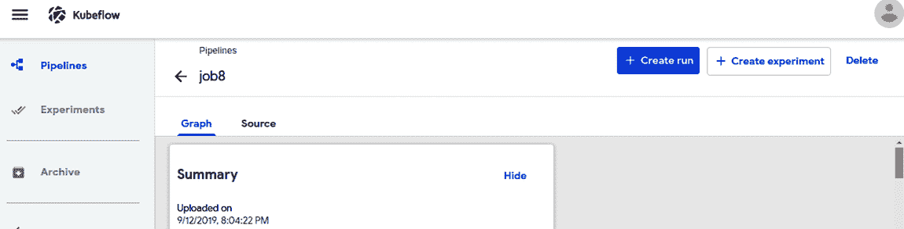

# 第二章：你好，Kubeflow

欢迎来到激动人心的 Kubeflow 世界的第一步！

首先，我们将在您的机器上或云服务商上设置 Kubeflow。然后，我们将深入一个全面的例子。这个例子的目标是尽快训练模型并开始提供服务。在第一部分的某些部分，可能会让人觉得我们只是让您机械地输入命令。虽然我们希望您跟着操作，但我们强烈建议您在完成本书后重新阅读本章，反思您输入的命令，并考虑在阅读过程中您的理解有多大提升。

我们将为在本地机器上设置和测试我们的示例提供说明，并提供在真实集群上执行相同操作的说明链接。虽然我们会指向驱动所有这些的配置文件和 OCI 容器，但它们不是本章的重点；它们将在后续章节中详细讨论。本章的重点是一个您可以在家里跟随的端到端示例。

在未来的章节中，我们将深入探讨我们所做一切的“为什么”。

现在，只需享受这段旅程。

# 使用 Kubeflow 进行设置

Kubeflow 建立在 Kubernetes 之上的伟大之处之一是可以在本地进行初始开发和探索，随后转向更强大和分布式的工具。您的同一流水线可以在本地开发，然后迁移到集群中去。

###### 提示

虽然您可以在本地开始使用 Kubeflow，但并非必须如此。您也可以选择在云提供商或本地 Kubernetes 集群上进行初始工作。

使用 Google 云平台(GCP)上的点击部署应用程序是开始使用 Kubeflow 的较快方法之一。如果您急于开始，请查看[此 Kubeflow 文档页面](https://oreil.ly/GBbsc)。

## 安装 Kubeflow 及其依赖项

在接近 Kubeflow 的最大需求——访问 Kubernetes 集群之前，让我们先设置好工具。Kubeflow 相当自包含，但确实需要`kubectl`。其余依赖项位于容器内，因此您无需担心安装它们。

###### 提示

无论您使用本地还是远程的 Kubernetes 集群，将开发工具安装在本地将简化您的生活。

无论你使用的是哪种集群，你都需要安装 Kubeflow 的核心依赖项 `kubectl`，用于与 Kubernetes 进行通信。`kubectl` 被广泛打包，不同的安装选项在 [Kubernetes 文档](https://oreil.ly/tUpe0) 中有详细介绍。如果你想使用软件包管理器安装 `kubectl`，Ubuntu 用户可以使用 snap（参见 示例 2-1），Mac 用户可以使用 Homebrew（参见 示例 2-2）；其他安装选项也在 [Kubernetes 文档](https://oreil.ly/vQPYQ) 中有涵盖。`kubectl` 也可以作为一个本地二进制文件从这个 [Kubernetes 文档页面](https://oreil.ly/iT5Pv) 安装。

##### 示例 2-1\. 使用 snap 安装 kubectl

```
sudo snap install kubectl --classic
```

##### 示例 2-2\. 使用 Homebrew 安装 kubectl

```
brew install kubernetes-cli
```

一旦你安装了最低限度的依赖项，你现在可以从 [这个 GitHub 仓库](https://oreil.ly/WTHLZ) 安装 Kubeflow，就像在 示例 2-3 中描述的那样。

##### 示例 2-3\. 安装 Kubeflow

```
PLATFORM=$(uname) # Either Linux or Darwin
export PLATFORM
mkdir -p ~/bin
#Configuration
export KUBEFLOW_TAG=1.0.1
# ^ You can also point this to a different version if you want to try
KUBEFLOW_BASE="https://api.github.com/repos/kubeflow/kfctl/releases"
# Or just go to https://github.com/kubeflow/kfctl/releases
KFCTL_URL=$(curl -s ${KUBEFLOW_BASE} |\
	      grep http |\
	      grep "${KUBEFLOW_TAG}" |\
	      grep -i "${PLATFORM}" |\
	      cut -d : -f 2,3 |\
	      tr -d '\" ' )
wget "${KFCTL_URL}"
KFCTL_FILE=${KFCTL_URL##*/}
tar -xvf "${KFCTL_FILE}"
mv ./kfctl ~/bin/
rm "${KFCTL_FILE}"
# It's recommended that you add the scripts directory to your path
export PATH=$PATH:~/bin
```

现在你应该已经在你的机器上安装了 Kubeflow。为了确保它已安装成功，请运行 `kfctl version` 并检查其返回的版本是否符合预期。现在让我们介绍一些可选的工具，可以帮助你简化未来使用 Kubeflow 的过程。

## 设置本地 Kubernetes

能够在本地和生产环境中运行相同的软件是 Kubeflow 的一个巨大优势之一。为了支持这一点，你需要安装一个本地版本的 Kubernetes。虽然有几种选择，但我们发现 Minikube 是最简单的。Minikube 是一个本地版本的 Kubernetes，允许你在本地计算机上模拟一个集群。另外两个常见的本地 Kubeflow 版本选择是 `microk8s`，支持多种 Linux 平台，以及使用 Vagrant 启动 VM 的 `MiniKF`，用于在 Kubernetes 上运行 Kubeflow。

###### 提示

严格来说，不是必须安装本地 Kubernetes 集群，但许多数据科学家和开发人员发现拥有一个本地集群进行测试非常有帮助。

### Minikube

Minikube 是一个可以运行 Kubeflow 的本地 Kubernetes 版本。Minikube 的安装指南可以在 [主 Kubernetes 文档页面](https://oreil.ly/lNeon) 和 [Kubeflow 专用页面](https://oreil.ly/B17Wp) 找到。

Minikube 自动设置中最常见的失败是缺少虚拟化程序或 Docker。无论你使用的是哪种操作系统，你都可以使用 [VirtualBox](https://oreil.ly/h1uoS)；不过，其他选项如 Linux 上的 KVM2、Windows 上的 Hyper-V，以及 macOS 上的 HyperKit 也同样适用。

###### 提示

在启动 Minikube 时，请确保为其分配足够的内存和磁盘空间，例如，`minikube start --cpus 16 --memory 12g --disk-size 15g`。注意：你并不需要 16 个 CPU 核心来运行它；这只是 Minikube 将使用的虚拟 CPU 数量。

## 设置你的 Kubeflow 开发环境

Kubeflow 的流水线系统是用 Python 构建的，本地安装 SDK 可以让您更快地构建流水线。然而，如果您无法在本地安装软件，仍可以使用 Kubeflow 的 Jupyter 环境来构建您的流水线。

### 设置 Pipeline SDK

要开始设置 Pipeline SDK，您需要安装[Python](https://oreil.ly/IbfY2)。许多人发现为其不同项目创建隔离的虚拟环境非常有用；请参阅示例 2-4 了解如何操作。

##### 示例 2-4\. 创建虚拟环境

```
virtualenv kfvenv --python python3
source kfvenv/bin/activate
```

现在您可以使用 pip 命令安装 Kubeflow Pipelines 包及其要求，如示例 2-5 所示。

##### 示例 2-5\. 安装 Kubeflow Pipeline SDK

```
URL=https://storage.googleapis.com/ml-pipeline/release/latest/kfp.tar.gz
pip install "${URL}" --upgrade
```

如果您使用虚拟环境，您需要在每次使用 Pipeline SDK 时激活它。

除了 SDK 外，Kubeflow 还提供了许多组件。检出标准组件的固定版本，例如示例 2-6，可以创建更可靠的流水线。

##### 示例 2-6\. 克隆 Kubeflow Pipelines 存储库

```
  git clone --single-branch --branch 0.3.0 https://github.com/kubeflow/pipelines.git
```

### 设置 Docker

[Docker](https://www.docker.com)是最低要求的重要组成部分，允许您定制和添加库和其他功能到您自己的自定义容器中。我们将在第三章详细介绍 Docker。在 Linux 中，您可以通过标准软件包管理器或在 macOS 上使用 Homebrew 来安装 Docker。

除了安装 Docker 外，您还需要一个存储容器映像的地方，称为容器注册表。容器注册表将被您的 Kubeflow 集群访问。Docker 背后的公司提供[Docker Hub](https://hub.docker.com)，RedHat 提供[Quay](https://quay.io)，这是一个云中立的平台，您可以使用。或者，您还可以使用您的云提供商的容器注册表。¹ 云供应商特定的容器注册表通常提供更高的图像存储安全性，并可以自动配置您的 Kubernetes 集群以获取这些图像所需的权限。在我们的示例中，我们假设您通过环境变量`$CONTAINER_REGISTRY`设置了您的容器注册表。

###### 提示

如果您使用的注册表不在 Google Cloud Platform 上，您需要按照[Kaniko 配置指南](https://oreil.ly/88Ep-)配置 Kubeflow Pipelines 容器构建器，以便访问您的注册表。

确保你的 Docker 安装已正确配置，你可以编写一行命令 `Dc` 并将其推送到你的注册表中。对于 `Dockerfile`，我们将使用 `FROM` 命令来指示我们基于 Kubeflow 的 TensorFlow 笔记本容器镜像构建，就像在 示例 2-7 中展示的一样（我们将在 第九章 中详细讨论这个）。当你推送一个容器时，需要指定 `tag`，它确定了镜像名称、版本以及存储位置，就像在 示例 2-8 中展示的一样。

##### 示例 2-7\. 指定新容器是基于 Kubeflow 的容器

```
FROM gcr.io/kubeflow-images-public/tensorflow-2.1.0-notebook-cpu:1.0.0
```

##### 示例 2-8\. 构建新容器并推送到注册表以供使用

```
IMAGE="${CONTAINER_REGISTRY}/kubeflow/test:v1"
docker build  -t "${IMAGE}" -f Dockerfile .
docker push "${IMAGE}"
```

有了这个设置，你现在可以开始定制 Kubeflow 中的容器和组件以满足你的需求。我们将在 第九章 中深入讨论如何从头开始构建容器。随着我们在未来章节的深入，我们将使用这种模式在需要时添加工具。

### 编辑 YAML

虽然 Kubeflow 在很大程度上抽象了 Kubernetes 的细节，但在查看或修改配置时仍然有用。大部分 Kubernetes 配置都以 YAML 形式表示，因此设置工具以便轻松查看和编辑 YAML 将是有益的。大多数集成开发环境（IDE）都提供了某种用于编辑 YAML 的工具，但你可能需要单独安装这些工具。

###### 提示

对于 IntelliJ，有一个 [YAML 插件](https://oreil.ly/Awmeq)。对于 emacs，有许多可用于 YAML 编辑的模式，包括 [yaml-mode](https://oreil.ly/lWZE5)（可以从 [Milkypostman’s Emacs Lisp Package Archive (MELPA)](https://melpa.org) 安装）。Atom 作为一个包括语法高亮的插件 [YAML](https://oreil.ly/z47Sa)。如果你使用不同的 IDE，在探索可用的插件之前，不要因为更好的 YAML 编辑而抛弃它。无论使用何种 IDE，你也可以使用 [YAMLlint 网站](http://www.yamllint.com) 来检查你的 YAML 文件。

## 创建我们的第一个 Kubeflow 项目

首先，我们需要创建一个 Kubeflow 项目来工作。要创建 Kubeflow 部署，我们使用 `kfctl` 程序。² 在使用 Kubeflow 时，你需要指定一个配置文件清单，配置构建内容以及构建方式，不同的云服务提供商有不同的清单文件。

我们将从使用基本配置的示例项目开始，就像在 示例 2-9 中展示的那样。在这个项目中，我们将为我们的 MNIST 示例构建一个简单的端到端流水线。我们选择这个示例，因为它是机器学习中的标准“Hello World”。

##### 示例 2-9\. 创建第一个示例项目

```
# Pick the correct config file for your platform from
# https://github.com/kubeflow/manifests/tree/[version]/kfdef
# You can download and edit the configuration at this point if you need to.
# For generic Kubernetes with Istio:
MANIFEST_BRANCH=${MANIFEST_BRANCH:-v1.0-branch}
export MANIFEST_BRANCH
MANIFEST_VERSION=${MANIFEST_VERSION:-v1.0.1}
export MANIFEST_VERSION

KF_PROJECT_NAME=${KF_PROJECT_NAME:-hello-kf-${PLATFORM}}
export KF_PROJECT_NAME
mkdir "${KF_PROJECT_NAME}"
pushd "${KF_PROJECT_NAME}"

manifest_root=https://raw.githubusercontent.com/kubeflow/manifests/
# On most environments this will create a "vanilla" Kubeflow install using Istio.
FILE_NAME=kfctl_k8s_istio.${MANIFEST_VERSION}.yaml
KFDEF=${manifest_root}${MANIFEST_BRANCH}/kfdef/${FILE_NAME}
kfctl apply -f $KFDEF -V
echo $?

popd
```

示例 2-9 假设你正在使用一个现有的 Kubernetes 集群（如本地 Minikube）。当你运行 `kfctl apply` 时，你将看到很多状态消息，甚至可能会看到一些错误消息。只要它最后输出 0，你可以安全地忽略大多数错误，因为它们会自动重试。

###### 警告

这个部署过程可能需要*30 分钟*。

如果您决定直接使用云服务提供商，请参阅[Kubeflow 安装指南](https://oreil.ly/EMRVV)了解如何开始。

###### 警告

在 Kubeflow 完全部署之前，Kubeflow 用户界面可能会出现，并在这时访问可能意味着您没有正确的命名空间。为确保 Kubeflow 准备就绪，请运行 `kubectl get pods --all-namespaces -w` 并等待所有的 pod 变为 RUNNING 或 COMPLETED。如果您看到 pod 被抢占，请确保您启动了足够的 RAM 和磁盘空间的集群。如果您无法在本地启动足够大的集群，请考虑使用云服务提供商。（Ilan 和 Holden 目前正在撰写有关此主题的博客文章。）

# 训练和部署模型

在传统的机器学习文本中，训练阶段通常受到最多关注，只有一些简单的部署示例，而对模型管理的处理非常少。本书假设您是一名了解如何选择正确模型/算法或与了解此领域的人合作的数据科学家。我们比传统的机器学习文本更注重部署和模型管理。

## 训练和监控进度

接下来的步骤是使用 Kubeflow Pipeline 训练模型。我们将使用一个预先创建的训练容器³来下载训练数据并训练模型。对于示例 2-10，我们在 `train_pipeline.py` 中有一个预先构建的工作流，在[本书 GitHub 示例存储库的 ch2 文件夹中](https://oreil.ly/Kubeflow_for_ML)训练一个 `RandomForestClassifier`。

##### 示例 2-10\. 创建训练工作流示例

```
dsl-compile --py train_pipeline.py --output job.yaml
```

如果在这里遇到问题，您应该查看[Kubeflow 故障排除指南](https://oreil.ly/nvNnC)。

Kubeflow 用户界面，如图 2-1 所示，可以通过几种不同的方式访问。对于本地部署，快速端口转发是最简单的开始方式：只需运行 `kubectl port-forward svc/istio-ingressgateway -n istio-system 7777:80` 然后访问 `localhost:7777`。如果您在 GCP 上部署了 Kubeflow，您应该访问 `https://<deployment_name>.endpoints.<project_name>.cloud.goog`。否则，您可以通过运行 `kubectl get ingress -n istio-system` 来获取网关服务的地址。


###### 图 2-1\. Kubeflow Web 用户界面

点击流水线，或者在根 URL 中添加 `_/pipeline/`，您应该能够看到流水线 Web 用户界面，就像图 2-2 所示。


###### 图 2-2\. 流水线 Web 用户界面

从这里，我们可以上传我们的流水线。一旦上传了流水线，我们可以使用同样的 Web 用户界面来创建流水线的运行。点击上传的流水线后，您将能够创建一个运行，如图 2-3 所示。



###### 图 2-3\. 流水线详细页面

## 测试查询

最后，让我们查询我们的模型并监控结果。 "理智检查"是一个简单的测试，用于确保我们的模型做出的预测在理论上是合理的。例如 - 我们试图猜测写的是什么数字。如果我们的模型返回像`77`，`橙色果味饮料`或`错误`这样的答案，那都不会通过理智检查。我们希望看到的是 0 到 9 之间的数字。在投入生产之前对模型进行理智检查总是一个明智的选择。

Web UI 和模型服务通过相同的 Istio 网关公开。因此，该模型将在*http://<WEBUI_URL>/seldon<mnist-classifier/api<v0.1/predictions*处可用。如果您使用 Google IAP，您可能会发现 iap_curl 项目有助于发出请求。

有一个 Python[脚本可用](https://oreil.ly/Kubeflow_for_MLch02)，用于从 MNIST 数据集中提取图像，将其转换为向量，显示图像，并将其发送到模型。将图像转换为向量通常是预测转换的一部分；我们将在第八章中介绍更多内容。例子 2-11 是一个相当清晰的 Python 示例，演示了如何查询模型。该模型返回了 10 个数字和提交的向量表示特定数字的概率的 JSON。具体来说，我们需要一张手写数字的图像，我们可以将其转换为一系列值。

##### 例 2-11\. 模型查询示例

```
import requests
import numpy as np

from tensorflow.examples.tutorials.mnist import input_data
from matplotlib import pyplot as plt

def download_mnist():
    return input_data.read_data_sets("MNIST_data/", one_hot=True)

def gen_image(arr):
    two_d = (np.reshape(arr, (28, 28)) * 255).astype(np.uint8)
    plt.imshow(two_d, cmap=plt.cm.gray_r, interpolation='nearest')
    return plt
mnist = download_mnist()
batch_xs, batch_ys = mnist.train.next_batch(1)
chosen = 0
gen_image(batch_xs[chosen]).show()
data = batch_xs[chosen].reshape((1, 784))
features = ["X" + str(i + 1) for i in range(0, 784)]
request = {"data": {"names": features, "ndarray": data.tolist()}}
deploymentName = "mnist-classifier"
uri = "http://" + AMBASSADOR_API_IP + "/seldon/" + \
    deploymentName + "/api/v0.1/predictions"

response = requests.post(uri, json=request)
```

例如，查看图 2-4 中手写的*3*。


###### 图 2-4\. 手写 *3*

这将返回以下内容：

```
{'data': {'names': ['class:0',
		    'class:1',
		    'class:2',
		    'class:3',
		    'class:4',
		    'class:5',
		    'class:6',
		    'class:7',
		    'class:8',
		    'class:9'],
	  'ndarray':[[0.03333333333333333,
		      0.26666666666666666,
		      0.03333333333333333,
		      0.13333333333333333, ## It was actually this
		      0.1,
		      0.06666666666666667,
		      0.1,
		      0.26666666666666666,
		      0.0,
		      0.0]]},
 'meta': {'puid': 'tb02ff58vcinl82jmkkoe80u4r', 'routing': {}, 'tags': {}}}
```

我们可以看到，即使我们写的是一个相当清晰的 *3*，但模型最佳猜测是 *1*和 *7*。也就是说，`RandomForestClassifier`对手写识别来说是一个糟糕的模型 - 所以这并不是一个令人惊讶的结果。我们之所以使用`RandomForestClassifier`有两个原因：首先，为了在第八章中说明模型的可解释性，其次，让您尝试一个更合理的模型并比较性能。

###### 注意

尽管我们在此处部署了端到端示例，但您应该始终在真实生产之前进行验证。

# 超越本地部署

你们中的一些人一直在本地 Kubernetes 部署上尝试这个。Kubeflow 的一大优势是能够利用 Kubernetes 进行扩展。Kubernetes 可以在单台计算机或许多计算机上运行，并且一些环境可以根据需要动态添加更多资源。尽管 Kubernetes 是一个行业标准，但根据您的提供商不同，Kubeflow 的设置步骤可能会有所不同。[Kubeflow 入门指南](https://oreil.ly/eq6rC)提供了 GCP、AWS、Azure、IBM Cloud 和 OpenShift 的安装说明。一旦 Kubeflow 安装在您的 Kubernetes 集群上，您可以再次尝试相同的示例，看看相同的代码如何运行，或者相信我们并转向更有趣的问题。

###### 提示

在云提供商上部署时，Kubeflow 可以创建不仅仅是 Kubernetes 资源，也应该删除的其他资源。例如，在 Google 上，您可以通过访问部署管理器来删除辅助服务。

# 结论

在本章中，您第一次真正体验了 Kubeflow。您现在已经正确配置了开发环境，并且拥有了一个可以在本书其余部分中使用的 Kubeflow 部署。我们介绍了一个简单的端到端示例，使用标准的 MNIST 数据集，让您看到了 Kubeflow 不同核心组件的实际运行情况。我们介绍了流水线，它将所有 Kubeflow 组件联系在一起，并且您使用它来训练模型。在第三章中，我们将探索 Kubeflow 的设计并设置一些可选组件。理解设计将帮助您选择合适的组件。

¹ 只需搜索“cloudname”加上容器注册表名称以获取文档。

² 不要将其与传统的`kfctl.sh`脚本混淆。

³ 该容器来源于[此 GitHub 仓库](https://oreil.ly/f-bO3)。
