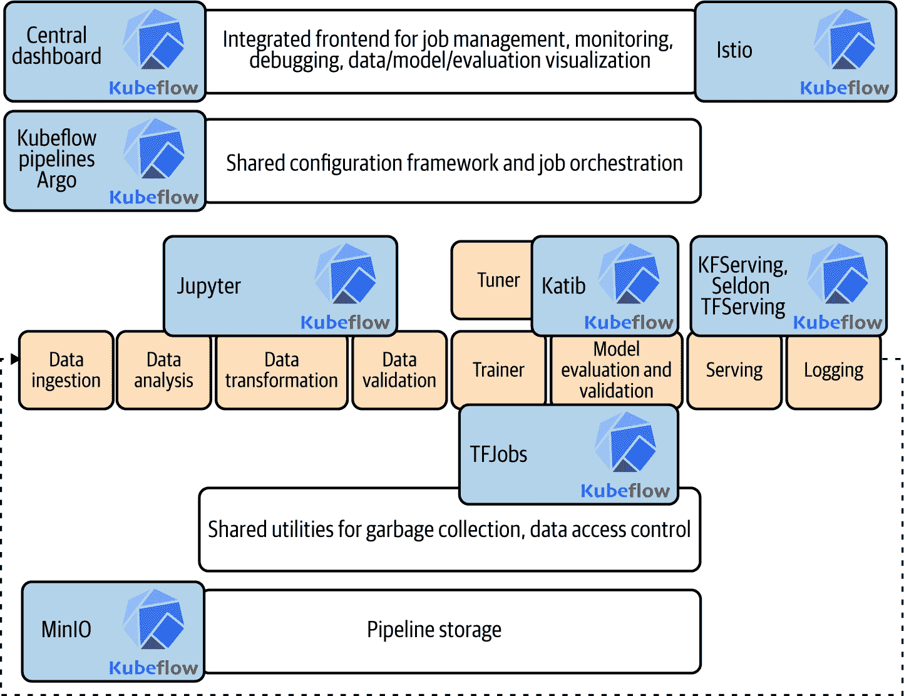
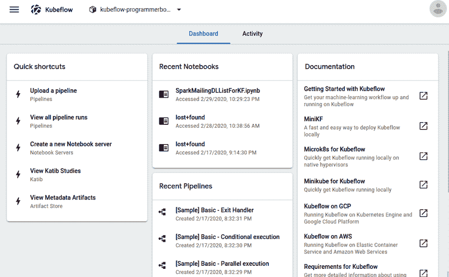
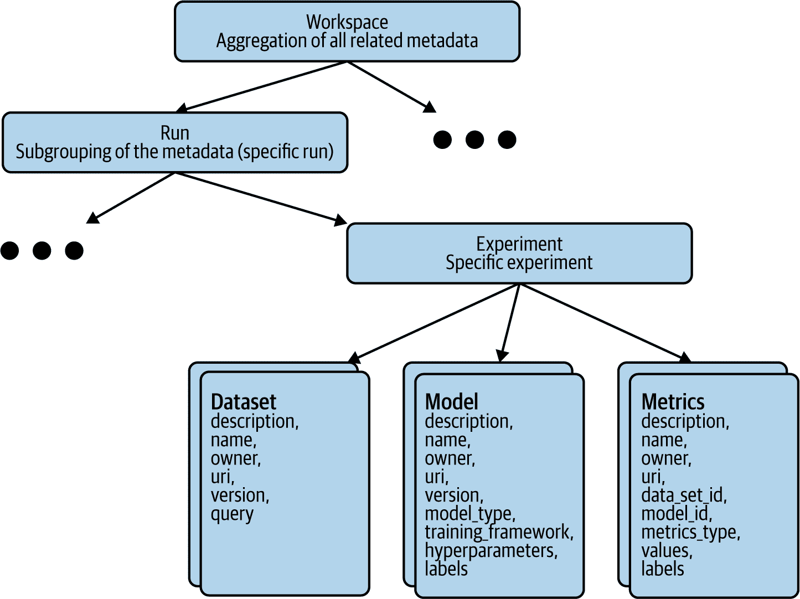
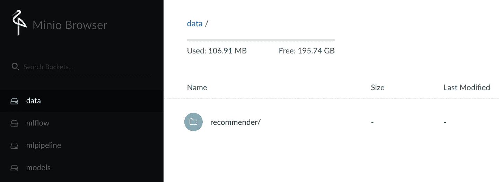
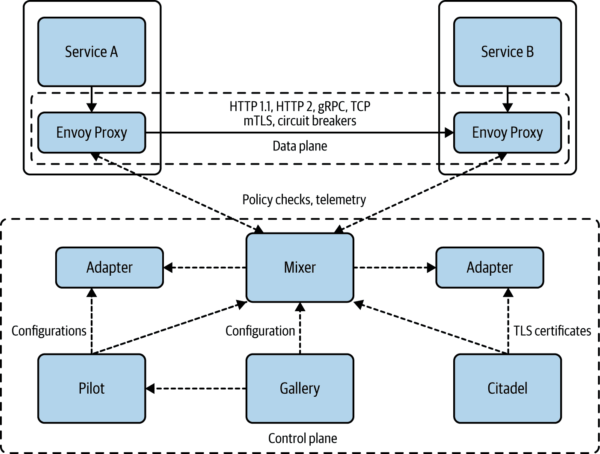
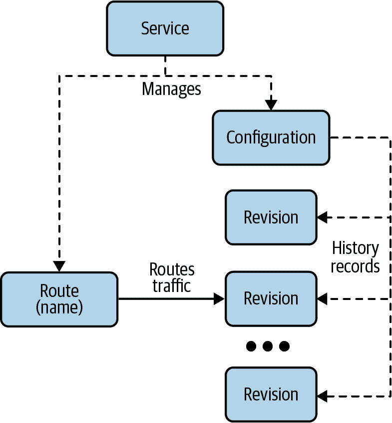

# 第三章：Kubeflow 设计：进阶内容

您已经通过了两章。做得好。到目前为止，您已经决定学习 Kubeflow 并完成了一个简单的示例。现在，我们希望退后一步，详细查看每个组件。图 3-1 显示了主要的 Kubeflow 组件及其在整体架构中的角色。



###### 图 3-1\. Kubeflow 架构

Essentially, we’ll look at the core elements that make up our example deployment as well as the supporting pieces. In the chapters that follow, we will dig into each of these sections in greater depth.

话虽如此，让我们开始吧。

# 环顾中央仪表板

您与 Kubeflow 的主要交互界面是中央仪表板（参见 图 3-2），它允许您访问大多数 Kubeflow 组件。根据您的 Kubernetes 提供程序，您的入口可能需要多达半小时才能变得可用。



###### 图 3-2\. 中央仪表板

###### Note

虽然它应该是自动的，但如果您没有为您的工作创建命名空间，请按照[Kubeflow 的“手动配置文件创建”说明](https://oreil.ly/_6iC5)操作。

从中央仪表板的主页，您可以访问 Kubeflow 的流水线、笔记本、Katib（超参数调优）和 artifact 存储。接下来我们将介绍这些组件的设计及其使用方法。

## Notebooks (JupyterHub)

大多数项目的第一步是某种形式的原型设计和实验。Kubeflow 用于此目的的工具是[JupyterHub](https://jupyter.org/hub)——一个多用户中心，可以生成、管理和代理多个单用户[Jupyter 笔记本](https://oreil.ly/C4dtQ)实例。Jupyter 笔记本支持整个计算过程：开发、文档编写、代码执行以及结果通信。

要访问 JupyterHub，请转到主 Kubeflow 页面并单击笔记本按钮。在笔记本页面上，您可以连接到现有服务器或创建一个新服务器。

要创建一个新服务器，您需要指定服务器名称和命名空间，选择一个镜像（从 CPU 优化、GPU 优化或您可以创建的自定义镜像中选择），并指定资源需求——CPU/内存、工作空间、数据卷、自定义配置等等。一旦服务器创建完成，您可以连接到它并开始创建和编辑笔记本。

为了允许数据科学家在不离开笔记本环境的情况下进行集群操作，Kubeflow 在提供的笔记本镜像中添加了[kubectl](https://oreil.ly/i-PFC)，这使开发人员可以使用笔记本创建和管理 Kubernetes 资源。Jupyter 笔记本 pod 运行在特殊的服务账户 `default-editor` 下，该账户在命名空间范围内对以下 Kubernetes 资源有权限：

+   Pods

+   Deployments

+   Services

+   Jobs

+   TFJobs

+   PyTorchJobs

你可以将此帐户绑定到自定义角色，以限制/扩展笔记本服务器的权限。这允许笔记本开发人员在不离开笔记本环境的情况下执行所有（由角色允许的）Kubernetes 命令。例如，可以通过在 Jupyter 笔记本中直接运行以下命令来创建一个新的 Kubernetes 资源：

```
!kubectl create -f myspec.yaml
```

你的 `yaml` 文件的内容将决定创建的资源。如果你不习惯创建 Kubernetes 资源，不用担心——Kubeflow 的管道包含工具，可以为你创建它们。

为了进一步增强 Jupyter 的功能，Kubeflow 还在笔记本中提供了对管道和元数据管理的支持（稍后在 “元数据” 中描述）。Jupyter 笔记本还可以直接启动分布式训练作业。

## 训练操作符

JupyterHub 是进行数据初步实验和原型化 ML 作业的好工具。但是，当转向在生产环境中进行训练时，Kubeflow 提供了多个训练组件来自动执行机器学习算法，包括：

+   [Chainer 训练](https://oreil.ly/AjfwS)

+   [MPI 训练](https://oreil.ly/SK19W)

+   [Apache MXNet 训练](https://oreil.ly/FvDdQ)

+   [PyTorch 训练](https://oreil.ly/0z4j6)

+   [TensorFlow 训练](https://oreil.ly/YMGKx)

在 Kubeflow 中，分布式训练作业由应用程序特定的控制器管理，称为操作符。这些操作符扩展了 Kubernetes API 来创建、管理和操作资源的状态。例如，要运行一个分布式 TensorFlow 训练作业，用户只需提供描述期望状态的规范（工作节点数和参数服务器等），TensorFlow 操作符组件将处理其余并管理训练作业的生命周期。

这些操作符允许重要部署概念如可伸缩性、可观察性和故障转移的自动化。它们还可以被管道用来链式执行系统其他组件的执行。

## Kubeflow 管道

除了提供实施特定功能的专用参数外，Kubeflow 还拥有 [Pipelines](https://oreil.ly/QZjNV)，允许你编排机器学习应用的执行。这一实现基于 [Argo Workflows](https://oreil.ly/6PsLK)，一个面向 Kubernetes 的开源容器本地工作流引擎。Kubeflow 安装所有 Argo 组件。

在高层次上，管道的执行包含以下 [组件](https://oreil.ly/QZjNV)：

Python SDK

你可以使用 Kubeflow 管道的 [领域特定语言](https://oreil.ly/c2DRj)（DSL）创建组件或指定管道。

DSL 编译器

[DSL 编译器](https://oreil.ly/5o2Yw) 将你的管道的 Python 代码转换为静态配置（YAML）。

Pipeline 服务

Pipeline 服务从静态配置创建管道运行。

Kubernetes 资源

流水线服务调用 Kubernetes API 服务器来创建必要的 Kubernetes [自定义资源定义](https://oreil.ly/5wPjy)（CRD）来运行流水线。

编排控制器

一组编排控制器执行完成由 Kubernetes 资源（CRD）指定的流水线执行所需的容器。这些容器在虚拟机上的 Kubernetes Pod 中执行。一个示例控制器是 [Argo Workflow](https://oreil.ly/leX50) 控制器，它编排任务驱动的工作流程。

工件存储

Kubernetes Pod 存储两种类型的数据：

元数据

实验、作业、运行、单一标量指标（通常用于排序和过滤目的的汇总指标），等等。Kubeflow Pipelines 将元数据存储在 MySQL 数据库中。

工件

流水线包、视图、如时间序列等大规模指标（通常用于调查单个运行的性能和调试），等等。Kubeflow Pipelines 将工件存储在类似于 [MinIO 服务器](https://docs.minio.io)、[Google Cloud Storage (GCS)](https://oreil.ly/k1bQz) 或 [Amazon S3](https://aws.amazon.com/s3) 的工件存储中。

Kubeflow Pipelines 允许您使您的机器学习作业可重复，并处理新数据。它提供了一个直观的 Python DSL 来编写流水线。然后将您的流水线编译为现有的 Kubernetes 工作流引擎（目前是 Argo Workflows）。Kubeflow 的流水线组件使得使用和协调构建端到端机器学习项目所需的不同工具变得简单。此外，Kubeflow 可以跟踪数据和元数据，改进我们理解作业的方式。例如，在 第五章 中，我们使用这些工件来理解模式。流水线可以暴露出底层机器学习算法的参数，使得 Kubeflow 能够执行调整。

## 超参数调整

为您的训练模型找到合适的超参数集合可能是一项具有挑战性的任务。传统的方法如网格搜索可能耗时且相当乏味。大多数现有的超参数系统与一个机器学习框架绑定，并且在搜索参数空间时只有几个选项。

Kubeflow 提供了一个组件（称为 Katib），允许用户在 Kubernetes 集群上轻松执行超参数优化。Katib 受到 [Google Vizier](https://oreil.ly/UInbP) 的启发，这是一个黑盒优化框架。它利用高级搜索算法如贝叶斯优化来找到最优的超参数配置。

Katib 支持 [超参数调整](https://oreil.ly/O5mC9)，可以与包括 TensorFlow、MXNet 和 PyTorch 在内的任何深度学习框架一起运行。

如同 Google Vizier，Katib 基于四个主要概念：

实验

在可行空间上进行的单次优化运行。每个实验包含描述可行空间的配置，以及一组试验。假设客观函数*f(x)*在实验过程中不会改变。

试验

一组参数值，*x*，将导致*f(x)*的单次评估。一个试验可以“完成”，这意味着它已经被评估并且客观值*f(x)*已经被分配，否则它是“挂起”的。一个试验对应一个作业。

作业

负责评估挂起试验并计算其客观值的过程。

建议

构建参数集的算法。目前，Katib 支持以下探索算法：

+   随机

+   网格

+   [Hyperband](https://oreil.ly/LlCKw)

+   [贝叶斯优化](https://oreil.ly/Pa83u)

利用这些核心概念，您可以提高模型的性能。由于 Katib 不限于一种机器学习库，因此您可以在几乎不进行修改的情况下探索新的算法和工具。

## 模型推断

Kubeflow 使得在生产环境中大规模部署机器学习模型变得容易。它提供了多种模型服务选项，包括[TFServing](https://oreil.ly/Hp2sb)、[Seldon serving](https://oreil.ly/sWc71)、[PyTorch serving](https://oreil.ly/bLJxg)和[TensorRT](https://oreil.ly/fuv-7)。它还提供了一个总体实现，[KFServing](https://oreil.ly/qEvqq)，它通用化了模型推断的自动扩展、网络、健康检查和服务器配置等问题。

整体实现基于利用[Istio](https://istio.io)（稍后详述）和[Knative serving](https://knative.dev)——基于 Kubernetes 的无服务器容器。正如在[Knative 文档](https://oreil.ly/h6O1E)中定义的那样，Knative serving 项目提供中间件原语，使以下功能成为可能：

+   无服务器容器的快速部署

+   自动扩展至零和缩减

+   Istio 组件的路由和网络编程

由于模型服务本质上是尖锐的，快速的扩展和缩减至零至关重要。Knative serving 简化了对连续模型更新的支持，通过自动将请求路由到较新的模型部署中。这需要将未使用的模型缩减至零（最小化资源利用），同时保持可供回滚使用。由于 Knative 是云原生的，它从其基础设施堆栈中受益，并因此提供了所有存在于 Kubernetes 中的监控功能，例如日志记录、跟踪和监控。KFServing 还利用[Knative 事件](https://oreil.ly/fpLrH)提供可选支持可插拔事件源。

类似于 Seldon，每个 KFServing 部署都是一个编排者，将以下组件连接在一起：

预处理器

负责将输入数据转换为模型服务所需的内容/格式的可选组件

预测器

负责实际模型服务的必需组件

后处理器

负责将模型服务结果转换/丰富为输出所需内容/格式的可选组件

其他组件可以增强整体模型服务的实现，但不属于主要执行流水线。例如异常检测和模型可解释性工具可以在此环境中运行，而不会减慢整体系统速度。

尽管这些独立组件和技术已存在很长时间，但将它们集成到 Kubeflow 的服务系统中可以减少将新模型投入生产中的复杂性。

除了直接支持 ML 操作的组件外，Kubeflow 还提供几个支持组件。

## 元数据

Kubeflow 的一个重要组件是元数据管理，提供捕获和跟踪模型创建信息的能力。许多组织每天构建数百个模型，但很难管理所有与模型相关的信息。ML Metadata 是记录和检索与 ML 开发人员和数据科学家工作流相关的元数据的基础设施和库。可以在元数据组件中注册的信息包括：

+   用于模型创建的数据来源

+   组件/流水线步骤生成的工件

+   这些组件/步骤的执行

+   流水线和相关的谱系信息

ML Metadata 跟踪 ML 工作流中所有组件和步骤的输入和输出及其谱系。这些数据支持表 3-1 中列出的几个重要功能，并显示在图 3-3 中。

表 3-1\. ML Metadata 操作示例

| 操作 | 示例 |
| --- | --- |
| 列出特定类型的所有工件。 | 所有已经训练的模型。 |
| 比较相同类型的两个工件。 | 比较两个实验的结果。 |
| 显示所有相关执行及其输入和输出工件的 DAG。 | 可视化实验的工作流以进行调试和发现。 |
| 显示工件的创建方式。 | 查看用于模型的数据；执行数据保留计划。 |
| 标识所有使用特定工件创建的工件。 | 用有问题数据标记从特定数据集训练的所有模型。 |
| 确定执行是否已在相同输入上运行过。 | 确定组件/步骤是否已完成相同工作，以便可以重用先前的输出。 |
| 记录和查询工作流运行的上下文。 | 跟踪工作流运行的所有者和变更；按实验分组谱系；按项目管理工件。 |



###### 图 3-3\. 元数据图

## 组件摘要

Kubeflow 的魔力在于使所有这些传统上不同的组件协同工作。虽然 Kubeflow 当然不是唯一一个将机器学习领域不同部分集成在一起的系统，但它在支持各种组件方面的灵活性是独一无二的。除此之外，由于它在标准 Kubernetes 上运行，您可以根据需要添加自己的组件。大部分工具集成的魔力发生在 Kubeflow 的管道内部，但一些支持组件对于让这些工具相互交互非常重要。

# 支持组件

虽然这些组件并未明确暴露在 Kubeflow 之外，但它们在整个 Kubeflow 生态系统中扮演着重要角色。让我们简要讨论每一个。我们也鼓励您自行研究它们。

## MinIO

流水线架构的基础是共享存储。今天的常见做法是将数据存储在外部存储中。不同的云提供商有不同的解决方案，如 Amazon S3、Azure 数据存储、Google Cloud Storage 等。这种多样化的解决方案使得从一个云提供商迁移到另一个云提供商变得复杂。为了最小化这种依赖性，Kubeflow 附带了 MinIO，一个专为大规模私有云基础设施设计的高性能分布式对象存储服务器。MinIO 不仅适用于私有云，还可以作为公共 API 的一致性网关。

MinIO 可以以多种不同的配置部署。在 Kubeflow 中的默认配置是单容器模式，当 MinIO 在一个容器中使用 Kubernetes 内置的持久存储时。分布式 MinIO 允许将多个卷汇集到一个单一的对象存储服务中。¹它还可以承受多个节点故障，并确保完全的数据保护（故障数取决于您的复制配置）。MinIO 网关在 Azure Blob 存储、Google Cloud 存储、Gluster 或 NAS 存储上提供了 S3 API。网关选项最灵活，允许您创建无缩放限制的云独立实现。

虽然 Kubeflow 的默认 MinIO 设置可以使用，但您可能希望进一步配置它。Kubeflow 安装了 MinIO 服务器和 UI。您可以访问 MinIO UI 并探索存储的内容，如图 3-4 中所示，通过端口转发（如示例 3-1）或暴露入口。您可以使用 Kubeflow 的默认 minio/minio123 用户登录。

##### 示例 3-1\. 设置端口转发

```
kubectl port-forward -n kubeflow svc/minio-service 9000:9000 &
```



###### 图 3-4\. MinIO 仪表板

此外，您还可以安装[MinIO CLI (mc)](https://oreil.ly/_AAEv)来使用工作站上的命令访问 MinIO 安装。对于 macOS，使用 Homebrew，如示例 3-2 中所示。对于 Linux Ubuntu，使用 snap，如示例 3-3 中所示。

##### 示例 3-2\. 在 Mac 上安装 MinIO

```
brew install minio/stable/minio
```

##### 示例 3-3\. 在 Linux 上安装 MinIO

```
pushd ~/bin
wget https://dl.min.io/client/mc/release/linux-amd64/mc
chmod a+x mc
```

你需要配置 MinIO 以与正确的端点进行通信，如示例 3-4 所示。

##### 示例 3-4\. 配置 MinIO 客户端与 Kubeflow 的 MinIO 对话

```
mc config host add minio http://localhost:9000 minio minio123
```

一旦你配置了命令行，你可以像示例 3-5 那样创建新的存储桶，或者改变你的设置。

##### 示例 3-5\. 使用 MinIO 创建一个存储桶

```
mc mb minio/kf-book-examples
```

MinIO 提供本地和与 S3 兼容的 API。由于我们的大多数软件可以与 S3 对话，所以与 S3 兼容的 API 是最重要的。

###### 警告

使用构建在 Hadoop 之上的系统（主要是基于 Java 的）需要 Hadoop 2.8 或更高版本。

Kubeflow 安装将 MinIO 凭据硬编码为 minio/minio123，你可以直接在你的应用程序中使用，但通常最好使用密钥，特别是如果你可能会切换到常规的 S3。Kubernetes 密钥为你提供了一种在集群上存储凭据的方式，与你的应用程序分开。² 要为 MinIO 或 S3 设置一个密钥，可以创建一个类似于 示例 3-6 的密钥文件。在 Kubernetes 中，ID 和密钥的密钥值必须进行 base64 编码。要编码一个值，请运行命令 `echo -n *xxx* | base64`。

##### 示例 3-6\. MinIO 的示例密钥

```
apiVersion: v1
kind: Secret
metadata:
  name: minioaccess
  namespace: mynamespace
data:
  AWS_ACCESS_KEY_ID: xxxxxxxxxx
  AWS_SECRET_ACCESS_KEY: xxxxxxxxxxxxxxxxxxxxx
```

将这个 YAML 文件保存为 *minioaccess.yaml*，并使用命令 `kubectl apply -f minioaccess.yaml` 部署这个密钥。现在我们理解了管道阶段之间的数据通信，让我们努力理解组件之间的网络通信。

## Istio

Kubeflow 的另一个支持组件是[Istio](https://istio.io)，一个服务网格，提供诸如服务发现、负载均衡、故障恢复、指标、监控、速率限制、访问控制和端到端认证等重要功能。Istio 作为一个服务网格，透明地层叠在 Kubernetes 集群之上。它可以集成到任何日志平台、遥测或策略系统，并推广一种统一的方式来保护、连接和监控微服务。Istio 的实现将每个服务实例与一个旁路网络代理（sidecar）共存。所有来自单个服务实例的网络流量（HTTP、REST、gRPC 等）都通过其本地旁路代理流向适当的目标。因此，服务实例并不知晓整个网络，它只知道其本地代理。实际上，分布式系统网络已经被从服务程序员的视角中抽象出来。

Istio 的实现在逻辑上分为数据平面和控制平面。数据平面由一组智能代理组成。这些代理中介和控制所有 pod 之间的网络通信。控制平面管理和配置代理以路由流量。

Istio 的主要组件包括：

[Envoy](https://oreil.ly/7i49v)

Istio 数据平面基于 Envoy 代理，提供故障处理（例如健康检查和有界重试）、动态服务发现和负载均衡等功能。Envoy 具有许多内置功能，包括：

+   动态服务发现

+   负载均衡

+   TLS 终止

+   HTTP/2 和 gRPC 代理

+   断路器

+   健康检查

+   阶段性的推出，通过基于百分比的流量分割

+   故障注入

+   丰富的度量指标

[Mixer](https://oreil.ly/NV5xk)

Mixer 强制执行跨服务网格的访问控制和使用策略，并从 Envoy 代理和其他服务收集遥测数据。代理提取请求级属性，并将其发送到 Mixer 进行评估。

[Pilot](https://oreil.ly/lIAq_)

Pilot 为 Envoy Sidecar 提供服务发现和流量管理功能，如智能路由（例如 A/B 测试、金丝雀发布）和可靠性（超时、重试、断路器等）。通过将控制流量行为的高级路由规则转换为 Envoy 特定的配置，并在运行时传播给 Sidecar，Pilot 抽象了特定于平台的服务发现机制，并将它们合成为符合 Envoy 数据平面 API 的标准格式。

[Galley](https://oreil.ly/gZdIY)

Galley 是 Istio 的配置验证、接收、处理和分发组件。它负责保护 Istio 其他组件免受从底层平台获取用户配置的详细信息。

[Citadel](https://oreil.ly/sLh70)

Citadel 通过提供身份和凭据管理来实现强大的服务到服务和端用户认证。它允许在服务网格中升级未加密的流量。使用 Citadel，运营商可以基于服务标识而不是相对不稳定的第 3 层或第 4 层网络标识符来执行策略。

Istio 的整体架构如图 3-5 所示。



###### 图 3-5. Istio 架构

Kubeflow 使用 Istio 提供代理给 Kubeflow UI，并适当且安全地路由请求。Kubeflow 的 KFServing 利用 Knative，需要像 Istio 这样的服务网格。

## Knative

Kubeflow 另一个不为人知的支持组件是 Knative。我们将从描述最重要的部分开始：Knative Serving。建立在 Kubernetes 和 Istio 上，[Knative Serving](https://oreil.ly/fcndQ) 支持部署和提供无服务器应用程序服务。Knative Serving 项目提供的中间件原语使以下功能成为可能：

+   快速部署无服务器容器

+   自动缩放到零和向上缩放

+   Istio 组件的路由和网络编程

+   部署代码和配置的时序快照

Knative Serving 实现为一组 Kubernetes CRD。这些对象用于定义和控制无服务器工作负载的行为：

[Service](https://oreil.ly/EbQRg)

`service.serving.knative.dev` 资源整体管理工作负载。它编排其他对象的创建和执行，以确保应用程序在每次服务更新时都有配置、路由和新的修订版本。服务可以定义为始终将流量路由到最新的修订版或指定的修订版。

[路由](https://oreil.ly/FH50y)

`route.serving.knative.dev` 资源将网络端点映射到一个或多个修订版本。这允许多种流量管理方法，包括分数流量和命名路由。

[配置](https://oreil.ly/cNsj3)

`configuration.serving.knative.dev` 资源维护部署的期望状态。它在代码和配置之间提供清晰的分离，并遵循 Twelve-Factor App 方法论。修改配置会创建一个新的修订版本。

[修订版](https://oreil.ly/jxpW1)

`revision.serving.knative.dev` 资源是每次对工作负载进行的代码和配置修改的时间点快照。修订版是不可变对象，可以保留尽可能长的时间。Knative Serving 修订版可以根据传入的流量自动扩展和缩减。

Knative 的整体架构在图 3-6 中有所体现。



###### 图 3-6\. Knative 架构

## Apache Spark

在 Kubeflow 中更显著的支持组件是 Apache Spark。从 Kubeflow 1.0 开始，Kubeflow 提供了用于运行 Spark 作业的内置 Spark 运算符。除了 Spark 运算符外，Kubeflow 还提供了用于使用 Google 的 Dataproc 和 Amazon 的 Elastic Map Reduce（EMR）两种托管云服务运行 Spark 的集成。这些组件和运算符专注于生产使用，不适合用于探索。对于探索，您可以在 Jupyter 笔记本中使用 Spark。

Apache Spark 允许您处理更大的数据集并解决无法放在单个计算机上的问题。虽然 Spark 有自己的机器学习库，但更常见的是作为数据或特征准备的机器学习流水线的一部分使用。我们在第五章中更详细地讨论了 Spark。

## Kubeflow 多用户隔离

Kubeflow 的最新版本引入了多用户隔离，允许在不同团队和用户之间共享同一资源池。多用户隔离为用户提供了一种可靠的方法来隔离和保护自己的资源，避免意外查看或更改彼此的资源。这种隔离的关键概念包括：

管理员

管理员是创建和维护 Kubeflow 集群的人员。此人有权授予他人访问权限。

用户

用户是具有对集群中某些资源集的访问权限的人。用户需要管理员授予访问权限。

档案

档案是用户拥有的所有 Kubernetes 命名空间和资源的分组。

从版本 1.0 开始，Kubeflow 的 Jupyter 笔记本服务是第一个完全与多用户隔离集成的应用程序。笔记本及其创建由管理员或配置文件所有者设置的配置文件访问策略控制。笔记本创建的资源（例如训练作业和部署）也将继承相同的访问权限。默认情况下，Kubeflow 在首次登录时为经过身份验证的用户提供自动配置文件创建，这会创建一个新的命名空间。或者，用户的配置文件可以通过[手动方式](https://oreil.ly/6aklV)创建。这意味着每个用户都可以在其自己的命名空间中独立工作，并使用其自己的 Jupyter 服务器和笔记本。要与他人共享对您的服务器/笔记本的访问权限，请转到管理贡献者页面并添加您的合作者的电子邮件。

# 结论

现在您已了解 Kubeflow 的不同组件及其如何相互配合。Kubeflow 的中央仪表板为您提供访问其 Web 组件的权限。您已经看到 JupyterHub 如何促进模型开发的探索阶段。我们涵盖了 Kubeflow 的不同内置训练操作符。我们重新审视了 Kubeflow 流水线，讨论了它如何将所有 Kubeflow 的其他组件联系在一起。我们介绍了 Katib，Kubeflow 的用于管道的超参数调整工具。我们讨论了使用 Kubeflow 提供的不同模型服务选项（包括 KF Serving 和 Seldon）。我们讨论了 Kubeflow 的跟踪机器学习元数据和工件的系统。然后我们总结了一些支持 Kubeflow 其余部分的组件，例如 Knative 和 Istio。通过了解 Kubeflow 的不同部分以及总体设计，您现在应该能够开始看到如何将您的机器学习任务和工作流转化为 Kubeflow。

接下来的几章将帮助您深入了解这些组件以及如何将它们应用到您的使用案例中。

¹ 这可以在多台服务器上运行，同时暴露一个一致的端点。

² 将凭证存储在应用程序内部可能导致安全漏洞。

³ 为了使用户能够登录，他们应被授予最小的权限范围，允许他们连接到 Kubernetes 集群。例如，对于 GCP 用户，他们可以被授予 IAM 角色：Kubernetes Engine Cluster Viewer 和 IAP-secured Web App User。
