# 第四章：Kubeflow Pipelines

在上一章中，我们介绍了[Kubeflow Pipelines](https://oreil.ly/387tH)，这是 Kubeflow 中用于编排机器学习应用程序的组件。编排是必要的，因为典型的机器学习实现使用一系列工具来准备数据，训练模型，评估性能和部署。通过在代码中形式化步骤及其顺序，流水线允许用户正式捕捉所有数据处理步骤，确保其可重现性和可审计性，以及训练和部署步骤。

我们将从查看 Pipelines UI 开始本章，并展示如何开始使用 Python 编写简单的流水线。我们将探讨如何在各个阶段之间传输数据，然后继续探讨如何利用现有应用作为流水线的一部分。我们还将查看底层工作流引擎——Argo Workflows，这是 Kubeflow 用来运行流水线的标准 Kubernetes 流水线工具。理解 Argo Workflows 的基础知识可以帮助您更深入地了解 Kubeflow Pipelines，并有助于调试。接下来，我们将展示 Kubeflow Pipelines 在 Argo 上的增强功能。

我们将展示如何在 Kubeflow Pipelines 中实现条件执行以及如何按计划运行流水线执行，来完成 Kubeflow Pipelines 的总结。流水线的任务特定组件将在各自的章节中进行详细介绍。

# 开始使用流水线

Kubeflow Pipelines 平台包括：

+   有一个用于管理和跟踪流水线及其执行的 UI。

+   用于调度流水线执行的引擎

+   用 Python 定义、构建和部署流水线的 SDK

+   笔记本支持使用 SDK 和流水线执行

熟悉流水线的最简单方法是查看预装的示例。

## 探索预打包的示例流水线

为帮助用户理解流水线，Kubeflow 预装了一些示例流水线。您可以在 Pipeline Web UI 中找到这些预打包流水线，如图 4-1 中所示。请注意，在撰写时，只有从基本到条件执行的流水线是通用的，而其余流水线仅在 Google Kubernetes Engine（GKE）上运行。如果您尝试在非 GKE 环境中运行它们，它们将失败。

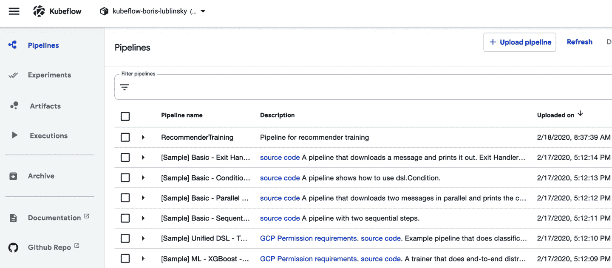

###### 图 4-1\. Kubeflow pipelines UI: 预打包的流水线

单击特定流水线将显示其执行图或源代码，如在图 4-2 中所示。

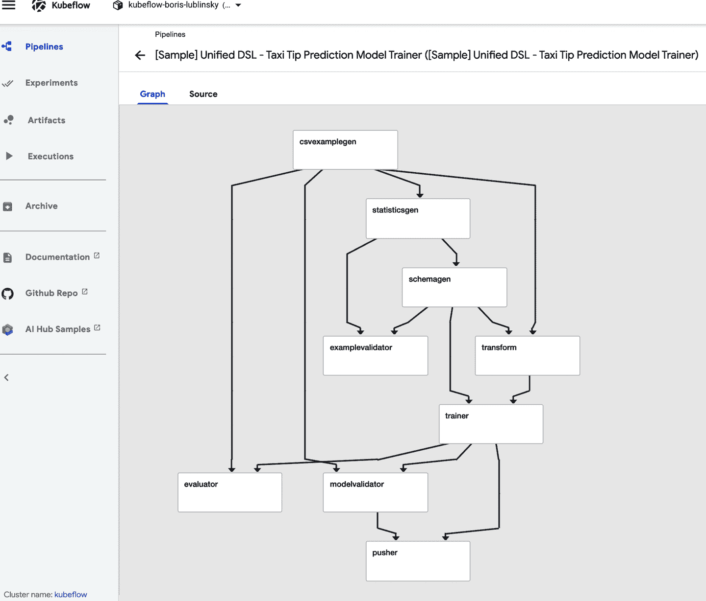

###### 图 4-2\. Kubeflow pipelines UI: 流水线图视图

单击源代码选项卡将显示流水线的编译代码，这是一个 Argo YAML 文件（详细内容请参见“Argo: Pipelines 的基础”）。

您可以在此领域进行实验，运行流水线以更好地了解其执行和流水线 UI 的功能。

要调用特定流水线，只需点击它；这将显示如图 4-3 中所示的流水线视图。

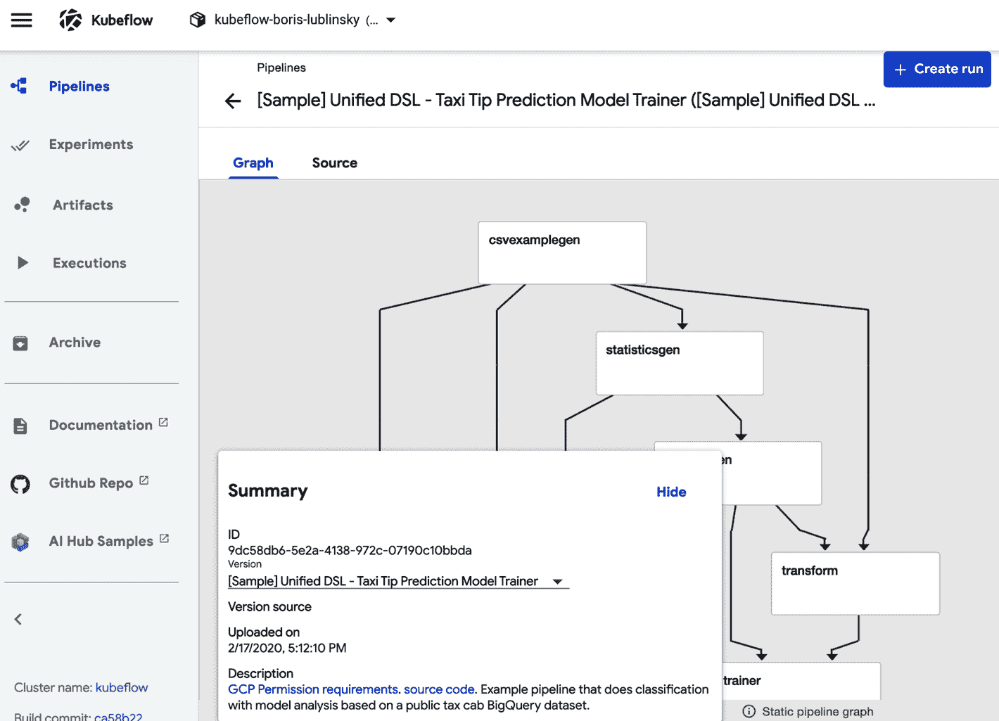

###### 图 4-3\. Kubeflow 流水线 UI：流水线视图

要运行流水线，请单击“创建运行”按钮，然后按照屏幕上的说明操作。

###### 提示

运行流水线时，必须选择一个实验。这里的实验只是流水线执行（运行）的便利分组。您始终可以使用 Kubeflow 安装创建的“默认”实验。此外，选择“一次性”作为运行类型以执行一次流水线。我们将在“定期运行流水线”中讨论定期执行。

## 使用 Python 构建简单流水线

我们已经看到如何执行预编译的 Kubeflow 流水线，现在让我们来研究如何编写我们自己的新流水线。Kubeflow 流水线存储为 YAML 文件，由名为 Argo 的程序执行（参见“Argo: the Foundation of Pipelines”）。幸运的是，Kubeflow 提供了一个 Python [领域特定语言（DSL）](https://oreil.ly/7LdzK) 用于编写流水线。DSL 是对在 ML 工作流中执行的操作的 Python 表示，并专门针对 ML 工作负载构建。DSL 还允许使用一些简单的 Python 函数作为流水线阶段，而无需显式构建容器。

###### 提示

本书第四章的示例可以在[此书的 GitHub 仓库的笔记本中找到](https://oreil.ly/Kubeflow_for_ML_ch04)。

流水线本质上是容器执行的图形。除了指定容器应按顺序运行外，它还允许用户将参数传递给整个流水线和参与容器之间。

对于每个容器（使用 Python SDK 时），我们必须：

+   创建容器——可以是简单的 Python 函数，也可以是任何 Docker 容器（在第 9 章中了解更多）。

+   创建引用该容器以及要传递给容器的命令行参数、数据挂载和变量的操作。

+   顺序化操作，定义哪些操作可以并行进行，哪些必须在继续进行下一步之前完成。¹

+   将此在 Python 中定义的流水线编译成 Kubeflow Pipelines 可以消费的 YAML 文件。

流水线是 Kubeflow 的一个关键功能，你将在整本书中多次看到它们。在本章中，我们将展示一些最简单的示例，以说明流水线的基本原理。这不会感觉像“机器学习”，这是有设计意图的。

对于我们的第一个 Kubeflow 操作，我们将使用一种称为*轻量级 Python 函数*的技术。然而，我们不应该让*轻量级*这个词愚弄我们。在轻量级 Python 函数中，我们定义一个 Python 函数，然后让 Kubeflow 负责将该函数打包到一个容器中并创建一个操作。

为了简单起见，让我们声明最简单的函数作为回显。这是一个接受单个输入（整数）并返回该输入的函数。

让我们从导入 `kfp` 并定义我们的函数开始：

```
import kfp
def simple_echo(i: int) -> int:
    return i
```

###### 警告

注意我们使用 `snake_case`，而不是 `camelCase` 作为我们的函数名称。在撰写本文时，存在一个错误（特性？），即使用驼峰命名（例如：将我们的函数命名为 `simpleEcho`）会导致错误。

接下来，我们想要将我们的函数 `simple_echo` 包装到一个 Kubeflow 流水线操作中。有一个很好的方法可以做到这一点：`kfp.components.func_to_container_op`。此方法返回一个工厂函数，具有强类型签名：

```
simpleStronglyTypedFunction =
  kfp.components.func_to_container_op(deadSimpleIntEchoFn)
```

当我们在下一步创建流水线时，工厂函数将构造一个 ContainerOp，该操作将在容器中运行原始函数（echo_fn）：

```
foo = simpleStronglyTypedFunction(1)
type(foo)
Out[5]: kfp.dsl._container_op.ContainerOp
```

###### 提示

如果您的代码可以通过 GPU 加速，那么很容易将一个阶段标记为使用 GPU 资源；只需将 `.set_gpu_limit(NUM_GPUS)` 添加到您的 `ContainerOp` 中。

现在让我们将 ContainerOp(s)（只有一个）按顺序排列到一个流水线中。这个流水线将接受一个参数（我们将要回显的数字）。此流水线还带有一些与其关联的元数据。虽然回显数字可能是参数使用的一个微不足道的例子，但在实际用例中，您将包括稍后可能想要调整的变量，如机器学习算法的超参数。

最后，我们将我们的流水线编译成一个压缩的 YAML 文件，然后我们可以将其上传到 Pipelines UI。

```
@kfp.dsl.pipeline(
  name='Simple Echo',
  description='This is an echo pipeline. It echoes numbers.'
)
def echo_pipeline(param_1: kfp.dsl.PipelineParam):
  my_step = simpleStronglyTypedFunction(i= param_1)

kfp.compiler.Compiler().compile(echo_pipeline,
  'echo-pipeline.zip')
```

###### 提示

还可以直接从笔记本运行流水线，我们将在下一个示例中这样做。

只有一个组件的流水线并不是非常有趣。对于我们的下一个示例，我们将自定义轻量级 Python 函数的容器。我们将创建一个新的流水线，安装和导入额外的 Python 库，从指定的基础镜像构建，并在容器之间传递输出。

我们将创建一个流水线，将一个数字除以另一个数字，然后再加上第三个数字。首先让我们创建我们简单的 `add` 函数，如 示例 4-1 中所示。

##### 示例 4-1\. 一个简单的 Python 函数

```
def add(a: float, b: float) -> float:
   '''Calculates sum of two arguments'''
   return a + b

add_op = comp.func_to_container_op(add)
```

接下来，让我们创建一个稍微复杂一些的函数。此外，让我们让这个函数需要从一个非标准的 Python 库 `numpy` 进行导入。这必须在函数内完成。这是因为从笔记本进行的全局导入不会打包到我们创建的容器中。当然，确保我们的容器安装了我们导入的库也是很重要的。

为此，我们将传递我们想要用作基础镜像的特定容器到 `.func_to_container(`，就像 示例 4-2 中一样。

##### 示例 4-2\. 一个稍复杂的 Python 函数

```
from typing import NamedTuple
def my_divmod(dividend: float, divisor:float) -> \
       NamedTuple('MyDivmodOutput', [('quotient', float), ('remainder', float)]):
    '''Divides two numbers and calculate  the quotient and remainder'''
    #Imports inside a component function:
    import numpy as np 

    #This function demonstrates how to use nested functions inside a
    # component function:
    def divmod_helper(dividend, divisor): 
	return np.divmod(dividend, divisor)

    (quotient, remainder) = divmod_helper(dividend, divisor)

    from collections import namedtuple
    divmod_output = namedtuple('MyDivmodOutput', ['quotient', 'remainder'])
    return divmod_output(quotient, remainder)

divmod_op = comp.func_to_container_op(
                my_divmod, base_image='tensorflow/tensorflow:1.14.0-py3') 
```


在函数内部导入库。


轻量级 Python 函数内部的嵌套函数也是可以的。


调用特定的基础容器。

现在我们将构建一个流水线。示例 4-3 中的流水线使用之前定义的函数 `my_divmod` 和 `add` 作为阶段。

##### 示例 4-3\. 一个简单的流水线

```
@dsl.pipeline(
   name='Calculation pipeline',
   description='A toy pipeline that performs arithmetic calculations.'
)
def calc_pipeline(
   a='a',
   b='7',
   c='17',
):
    #Passing pipeline parameter and a constant value as operation arguments
    add_task = add_op(a, 4) #Returns a dsl.ContainerOp class instance.

    #Passing a task output reference as operation arguments
    #For an operation with a single return value, the output
    # reference can be accessed using `task.output`
    # or `task.outputs['output_name']` syntax
    divmod_task = divmod_op(add_task.output, b) 

    #For an operation with multiple return values, the output references
    # can be accessed using `task.outputs['output_name']` syntax
    result_task = add_op(divmod_task.outputs['quotient'], c) 
```


传递在容器之间传递的值。操作顺序可从此推断。

最后，我们使用客户端提交流水线进行执行，返回执行和实验的链接。实验将执行组合在一起。如果您更喜欢，也可以使用 `kfp.compiler.Compiler().compile` 并上传 zip 文件，就像在第一个示例中一样：

```
client = kfp.Client()
#Specify pipeline argument values
# arguments = {'a': '7', 'b': '8'} #whatever makes sense for new version
#Submit a pipeline run
client.create_run_from_pipeline_func(calc_pipeline, arguments=arguments)
```

跟随 `create_run_from_pipeline_func` 返回的链接，我们可以进入执行的 Web UI，显示流水线本身和中间结果，如 图 4-4 中所示。

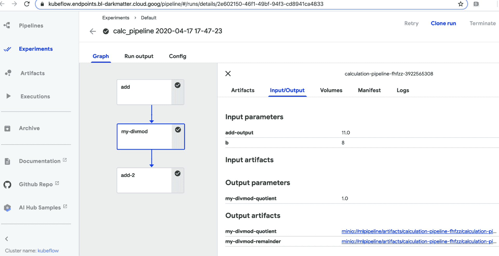

###### 图 4-4\. 流水线执行

正如我们所见，*轻量级* 在 *轻量级 Python 函数* 中指的是我们流程中这些步骤的易于完成，而不是函数本身的功能强大。我们可以使用自定义导入、基础镜像，并学习如何在容器之间传递小结果。

在接下来的部分，我们将展示如何通过为容器挂载卷来传递更大的数据文件。

## 在步骤之间存储数据

在前面的示例中，容器之间传递的数据很小，是原始类型（如数值、字符串、列表和数组）。然而，在实际中，我们很可能传递更大的数据（例如，整个数据集）。在 Kubeflow 中，有两种主要的方法可以做到这一点——Kubernetes 集群内的持久卷和云存储选项（如 S3），尽管每种方法都有其固有的问题。

持久卷抽象了存储层。根据供应商不同，持久卷的配置可能较慢，并且具有 IO 限制。请检查供应商是否支持读写多种存储类，以允许多个 Pod 访问存储，这对于某些类型的并行性是必需的。存储类可以是以下之一。²

ReadWriteOnce

卷可以被单个节点以读写方式挂载。

ReadOnlyMany

卷可以被多个节点以只读方式挂载。

ReadWriteMany

卷可以被多个节点以读写方式挂载。

您的系统/集群管理员可能能够添加读写多支持。³ 另外，许多云服务提供商包括他们专有的读写多实现，例如在 GKE 上查看 [动态配置](https://oreil.ly/je18X)，但请确保询问是否存在单节点瓶颈。

Kubeflow Pipelines 的 `VolumeOp` 允许您创建自动管理的持久卷，如 Example 4-4 所示。要将卷添加到操作中，只需调用 `add_pvolumes`，并传递一个挂载点到卷的字典，例如 `download_data_op(year).add_pvolumes({"/data_processing": dvop.volume})`。

##### Example 4-4\. 邮件列表数据准备

```
dvop = dsl.VolumeOp(name="create_pvc",
                    resource_name="my-pvc-2",
                    size="5Gi",
                    modes=dsl.VOLUME_MODE_RWO)
```

尽管在 Kubeflow 示例中不太常见，但在某些情况下，使用对象存储解决方案可能更合适。MinIO 通过作为现有对象存储引擎的网关或独立运行，提供云原生对象存储。⁴ 我们在 第三章 中介绍了如何配置 MinIO。

Kubeflow 的内置 `file_output` 机制可以在流水线步骤之间自动传输指定的本地文件到 MinIO。要使用 `file_output`，请在容器中将文件写入本地，并在 `ContainerOp` 中指定参数，如 Example 4-5 所示。

##### Example 4-5\. 文件输出示例

```
    fetch = kfp.dsl.ContainerOp(name='download',
                                image='busybox',
                                command=['sh', '-c'],
                                arguments=[
                                    'sleep 1;'
                                    'mkdir -p /tmp/data;'
                                    'wget ' + data_url +
                                    ' -O /tmp/data/results.csv'
                                ],
                                file_outputs={'downloaded': '/tmp/data'})
    # This expects a directory of inputs not just a single file
```

如果您不想使用 MinIO，您也可以直接使用您提供商的对象存储，但这可能会影响一些可移植性。

挂载数据到本地是任何机器学习流水线中的基本任务。我们在此简要概述了多种方法，并提供了每种方法的示例。

# Kubeflow Pipelines 组件介绍

Kubeflow Pipelines 基于 [Argo Workflows](https://oreil.ly/S2GuQ)，这是一个针对 Kubernetes 的开源、容器本地的工作流引擎。在本节中，我们将描述 Argo 的工作原理、其功能，以及 Kubeflow Pipeline 如何补充 Argo 以便数据科学家更容易使用。

## Argo：流水线的基础

Kubeflow 安装了所有 Argo 组件。虽然在您的计算机上安装 Argo 不是使用 Kubeflow Pipelines 的必要条件，但使用 Argo 命令行工具可以更轻松地理解和调试您的流水线。

###### Tip

默认情况下，Kubeflow 配置 Argo 使用 Docker 执行器。如果您的平台不支持 Docker API，则需要将执行器切换为兼容的执行器。这可以通过在 Argo *params* 文件中更改 `containerRuntimeExecutor` 值来完成。有关权衡的详细信息，请参见 附录 A。本书中的大多数示例使用 Docker 执行器，但可以调整为其他执行器。

在 macOS 上，您可以使用 Homebrew 安装 Argo，如 Example 4-6 所示。⁵

##### Example 4-6\. 安装 Argo

```
#!/bin/bash
# Download the binary
curl -sLO https://github.com/argoproj/argo/releases/download/v2.8.1/argo-linux-amd64

# Make binary executable
chmod +x argo-linux-amd64

# Move binary to path
mv ./argo-linux-amd64 ~/bin/argo
```

You can verify your Argo installation by running the Argo examples with the command-line tool in the Kubeflow namespace: follow [these Argo instructions](https://oreil.ly/QFxv2). When you run the Argo examples the pipelines are visible with the `argo` command, as in Example 4-7.

##### Example 4-7\. Listing Argo executions

```
$ argo list -n kubeflow
NAME                STATUS      AGE   DURATION
loops-maps-4mxp5    Succeeded   30m   12s
hello-world-wsxbr   Succeeded   39m   15s
```

Since pipelines are implemented with Argo, you can use the same technique to check on them as well. You can also get information about specific workflow execution, as shown in Example 4-8.

##### Example 4-8\. Getting Argo execution details

```
$ argo get hello-world-wsxbr -n kubeflow  
Name:                hello-world-wsxbr
Namespace:           kubeflow
ServiceAccount:      default
Status:              Succeeded
Created:             Tue Feb 12 10:05:04 -0600 (2 minutes ago)
Started:             Tue Feb 12 10:05:04 -0600 (2 minutes ago)
Finished:            Tue Feb 12 10:05:23 -0600 (1 minute ago)
Duration:            19 seconds

STEP                  PODNAME            DURATION  MESSAGE
 ✔ hello-world-wsxbr  hello-world-wsxbr  18s
```


`hello-world-wsxbr` is the name that we got using `argo list -n kubeflow` above. In your case the name will be different.

We can also view the execution logs by using the command in Example 4-9.

##### Example 4-9\. Getting the log of Argo execution

```
$ argo logs hello-world-wsxbr -n kubeflow
```

This produces the result shown in Example 4-10.

##### Example 4-10\. Argo execution log

```
< hello world >
 -------------
    \
     \
      \
		    ##        .
	      ## ## ##       ==
	   ## ## ## ##      ===
       /""""""""""""""""___/ ===
  ~~~ {~~ ~~~~ ~~~ ~~~~ ~~ ~ /  ===- ~~~
       \______ o          __/
	\    \        __/
	  \____\______/
```

You can also delete a specific workflow; see Example 4-11.

##### Example 4-11\. Deleting Argo execution

```
$ argo delete hello-world-wsxbr -n kubeflow
```

Alternatively, you can get pipeline execution information using the Argo UI, as seen in Figure 4-5.

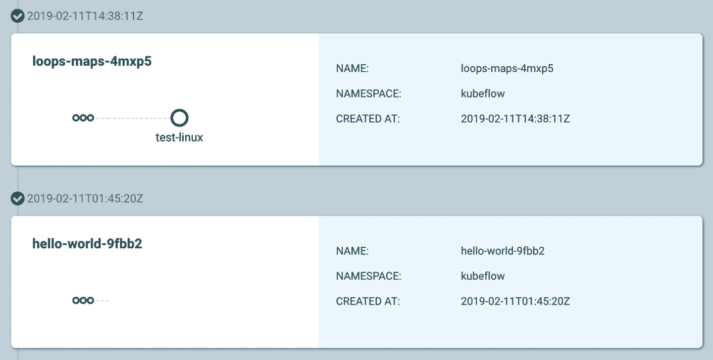

###### Figure 4-5\. Argo UI for pipeline execution

You can also look at the details of the flow execution graph by clicking a specific workflow, as seen in Figure 4-6.

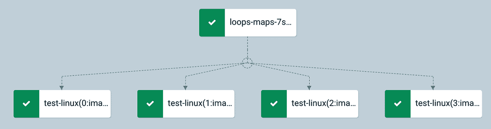

###### Figure 4-6\. Argo UI execution graph

For any Kubeflow pipeline you run, you can also view that pipeline in the Argo CLI/UI. Note that because ML pipelines are using the Argo CRD, you can also see the result of the pipeline execution in the Argo UI (as in Figure 4-7).

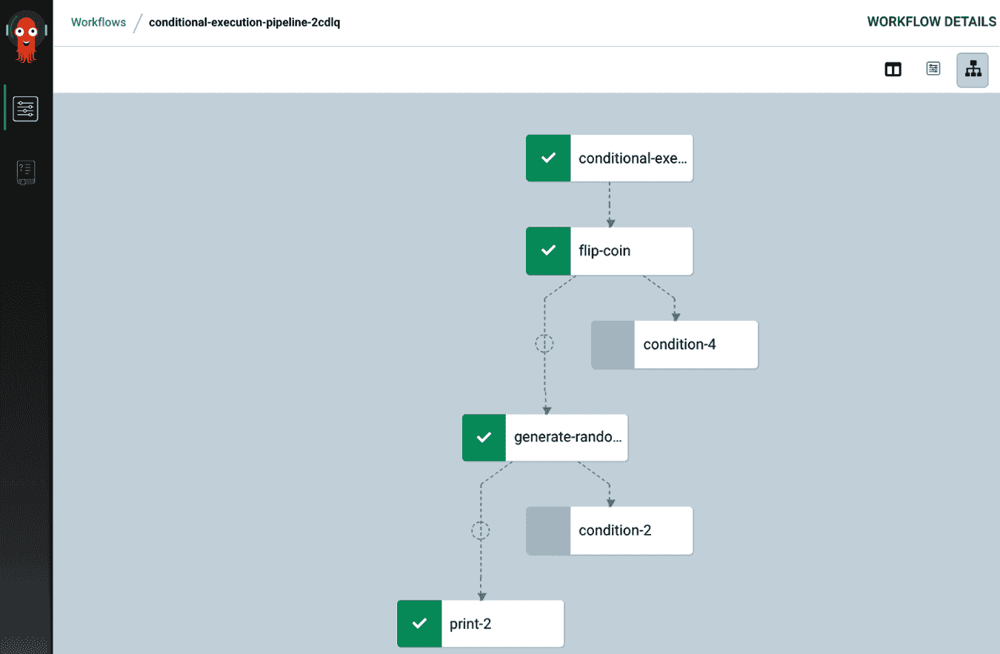

###### Figure 4-7\. Viewing Kubeflow pipelines in Argo UI

###### Tip

Currently, the Kubeflow community is actively looking at alternative foundational technologies for running Kubeflow pipelines, one of which is [Tekton](https://tekton.dev). The paper by A. Singh et al., [“Kubeflow Pipelines with Tekton”](https://oreil.ly/rrg-V), gives “initial design, specifications, and code for enabling Kubeflow Pipelines to run on top of Tekton.” The basic idea here is to create an intermediate format that can be produced by pipelines and then executed using Argo, Tekton, or other runtimes. The initial code for this implementation is found in [this Kubeflow GitHub repo](https://oreil.ly/nes4r).

## What Kubeflow Pipelines Adds to Argo Workflow

Argo 是工作流执行的基础；然而，直接使用它需要您做一些笨拙的事情。首先，您必须在 YAML 中定义工作流，这可能很困难。其次，您必须将您的代码容器化，这可能很繁琐。KF Pipelines 的主要优势在于，您可以使用 Python API 定义/创建管道，这自动化了工作流定义的大部分 YAML 样板，并且非常适合数据科学家/Python 开发人员。Kubeflow Pipelines 还添加了用于机器学习特定组件的构建块的钩子。这些 API 不仅生成 YAML，还可以简化容器创建和资源使用。除了 API 外，Kubeflow 还添加了一个定期调度程序和用于配置和执行的 UI。

## 使用现有镜像构建管道

直接从 Python 构建管道阶段提供了一个简单的入口点。尽管如此，这限制了我们的实现仅限于 Python。Kubeflow Pipelines 的另一个特性是能够编排执行多语言实现，利用预构建的 Docker 镜像（见 第 9 章）。

除了之前的导入外，我们还希望导入 Kubernetes 客户端，这使我们可以直接从 Python 代码中使用 Kubernetes 函数（见 示例 4-12）。

##### 示例 4-12\. 导出 Kubernetes 客户端

```
from kubernetes import client as k8s_client
```

再次，我们创建一个客户端和实验来运行我们的管道。正如前面提到的，实验将管道运行分组。您只能创建给定实验一次，因此 示例 4-13 展示了如何创建新实验或使用现有实验。

##### 示例 4-13\. 获取管道实验

```
client = kfp.Client()
exp = client.get_experiment(experiment_name ='mdupdate')
```

现在我们创建我们的管道（见 示例 4-14）。所使用的镜像需要是可访问的，并且我们正在指定完整名称，以便解析。由于这些容器是预构建的，我们需要为我们的管道配置它们。

我们正在使用的预构建容器通过 `MINIO_*` 环境变量配置其存储。因此，我们通过调用 `add_env_variable` 来配置它们以使用我们的本地 MinIO 安装。

除了在各阶段之间传递参数时自动生成的依赖关系外，您还可以使用 `after` 指定某个阶段需要前一个阶段。当存在外部副作用（例如更新数据库）时，这是非常有用的。

##### 示例 4-14\. 示例推荐管道

```
@dsl.pipeline(
  name='Recommender model update',
  description='Demonstrate usage of pipelines for multi-step model update'
)
def recommender_pipeline():
    # Load new data
  data = dsl.ContainerOp(
      name='updatedata',
      image='lightbend/recommender-data-update-publisher:0.2') \
    .add_env_variable(k8s_client.V1EnvVar(name='MINIO_URL',
        value='http://minio-service.kubeflow.svc.cluster.local:9000')) \
    .add_env_variable(k8s_client.V1EnvVar(name='MINIO_KEY', value='minio')) \
    .add_env_variable(k8s_client.V1EnvVar(name='MINIO_SECRET', value='minio123'))
    # Train the model
  train = dsl.ContainerOp(
      name='trainmodel',
      image='lightbend/ml-tf-recommender:0.2') \
    .add_env_variable(k8s_client.V1EnvVar(name='MINIO_URL',
            value='minio-service.kubeflow.svc.cluster.local:9000')) \
    .add_env_variable(k8s_client.V1EnvVar(name='MINIO_KEY', value='minio')) \
    .add_env_variable(k8s_client.V1EnvVar(name='MINIO_SECRET', value='minio123'))
  train.after(data)
    # Publish new model
  publish = dsl.ContainerOp(
      name='publishmodel',
      image='lightbend/recommender-model-publisher:0.2') \
    .add_env_variable(k8s_client.V1EnvVar(name='MINIO_URL',
            value='http://minio-service.kubeflow.svc.cluster.local:9000')) \
    .add_env_variable(k8s_client.V1EnvVar(name='MINIO_KEY', value='minio')) \
    .add_env_variable(k8s_client.V1EnvVar(name='MINIO_SECRET', value='minio123')) \
    .add_env_variable(k8s_client.V1EnvVar(name='KAFKA_BROKERS',
            value='cloudflow-kafka-brokers.cloudflow.svc.cluster.local:9092')) \
    .add_env_variable(k8s_client.V1EnvVar(name='DEFAULT_RECOMMENDER_URL',
            value='http://recommendermodelserver.kubeflow.svc.cluster.local:8501')) \
    .add_env_variable(k8s_client.V1EnvVar(name='ALTERNATIVE_RECOMMENDER_URL',
            value='http://recommendermodelserver1.kubeflow.svc.cluster.local:8501'))
  publish.after(train)
```

由于管道定义本质上是代码，您可以通过使用循环设置 MinIO 参数来使其更加紧凑，而不是在每个阶段都这样做。

与之前一样，我们需要编译管道，可以使用 `compiler.Compiler().compile` 明确编译，也可以使用 `create_run_from_pipeline_func` 隐式编译。现在，继续运行管道（如 图 4-8）。

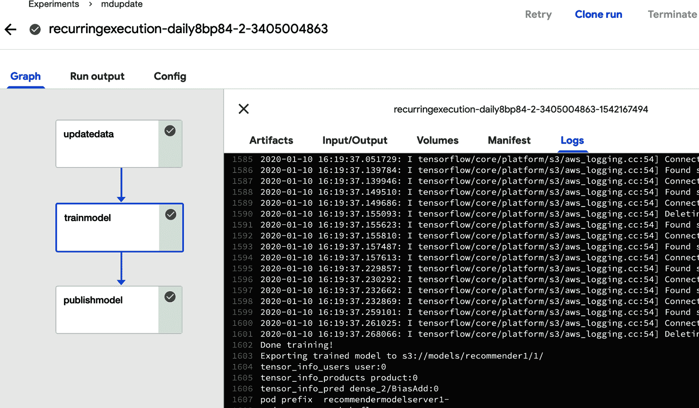

###### 图 4-8\. 推荐管道执行示例

## Kubeflow 管道组件

除了我们刚讨论过的容器操作外，Kubeflow Pipelines 还公开了使用组件的其他操作。组件公开了不同的 Kubernetes 资源或外部操作（如 `dataproc`）。Kubeflow 组件允许开发人员打包机器学习工具，同时抽象掉容器或 CRD 的具体细节。

我们已经相对直接地使用了 Kubeflow 的构建模块，并且使用了 `func_to_container` 组件。⁶ 一些组件，如 `func_to_container`，以普通的 Python 代码形式提供，并且可以像普通的库一样导入。其他组件使用 Kubeflow 的 `component.yaml` 系统来指定，并需要加载。在我们看来，使用 Kubeflow 组件的最佳方式是下载仓库的特定标签，允许我们使用 `load_component_from_file`，如示例 4-15 所示。

##### 示例 4-15\. 管道发布

```
wget https://github.com/kubeflow/pipelines/archive/0.2.5.tar.gz
tar -xvf 0.2.5.tar.gz
```

###### 警告

有一个 `load_component` 函数，它接受组件的名称并尝试解析它。我们不建议使用此函数，因为它默认搜索路径包括从 Github 获取 pipelines 库的主分支，这是不稳定的。

在下一章中，我们深入探讨数据准备组件；然而，让我们快速看一个文件获取组件的例子。在本章的推荐器示例中，我们使用了一个特殊的预构建容器来获取我们的数据，因为它不在持久卷中。相反，我们可以使用 Kubeflow GCS 组件 `google-cloud/storage/download/` 来下载我们的数据。假设您已经像 示例 4-15 中所示下载了管道发布，您可以使用 `load_component_from_file` 如同 示例 4-16 中所示加载组件。

##### 示例 4-16\. 加载 GCS 下载组件

```
gcs_download_component = kfp.components.load_component_from_file(
    "pipelines-0.2.5/components/google-cloud/storage/download/component.yaml")
```

当加载组件时，它会返回一个函数，调用该函数将生成一个管道阶段。大多数组件接受参数以配置它们的行为。通过在加载的组件上调用 `help` 或查看 *component.yaml*，您可以获取组件选项的列表。GCS 下载组件要求我们使用 `gcs_path` 配置下载内容，如 示例 4-17 所示。

##### 示例 4-17\. 从相对路径和网络链接加载管道存储组件

```
    dl_op = gcs_download_component(
        gcs_path=
        "gs://ml-pipeline-playground/tensorflow-tfx-repo/tfx/components/testdata/external/csv"
    )  # Your path goes here
```

在 第五章 中，我们深入探讨了更常见的 Kubeflow 管道数据和特征准备组件。

# 管道的高级主题

到目前为止，我们展示的所有示例都是纯顺序执行的。还有一些情况下，我们需要能够检查条件并相应地更改管道的行为。

## 管道阶段的条件执行

Kubeflow Pipelines 允许通过 `dsl.Condition` 进行条件执行。让我们看一个非常简单的示例，在这个示例中，根据变量的值执行不同的计算。

一个简单的笔记本实现了这个例子。它从示例 4-18 中必需的导入开始。

##### 示例 4-18\. 导入所需组件

```
import kfp
from kfp import dsl
from kfp.components import func_to_container_op, InputPath, OutputPath
```

一旦导入完成，我们可以实现几个简单的函数，如示例 4-19 所示。

##### 示例 4-19\. 函数实现

```
@func_to_container_op
def get_random_int_op(minimum: int, maximum: int) -> int:
    """Generate a random number between minimum and maximum (inclusive)."""
    import random
    result = random.randint(minimum, maximum)
    print(result)
    return result

@func_to_container_op
def process_small_op(data: int):
    """Process small numbers."""
    print("Processing small result", data)
    return

@func_to_container_op
def process_medium_op(data: int):
    """Process medium numbers."""
    print("Processing medium result", data)
    return

@func_to_container_op
def process_large_op(data: int):
    """Process large numbers."""
    print("Processing large result", data)
    return
```

我们直接使用 Python 实现所有函数（与前面的示例相同）。第一个函数生成一个介于 0 和 100 之间的整数，接下来的三个函数构成了实际处理的简单框架。管道的实现如示例 4-20 中所示。

##### 示例 4-20\. 管道实现

```
@dsl.pipeline(
    name='Conditional execution pipeline',
    description='Shows how to use dsl.Condition().'
)
def conditional_pipeline():
    number = get_random_int_op(0, 100).output 
    with dsl.Condition(number < 10): 
	process_small_op(number)
    with dsl.Condition(number > 10 and number < 50): 
	process_medium_op(number)
    with dsl.Condition(number > 50): 
	process_large_op(number)

kfp.Client().create_run_from_pipeline_func(conditional_pipeline, arguments={}) 
```


根据这里我们得到的数字…


我们将继续进行其中一个操作。


注意这里我们正在指定空参数——必需参数。

最后，执行图表，如图 4-9 所示。

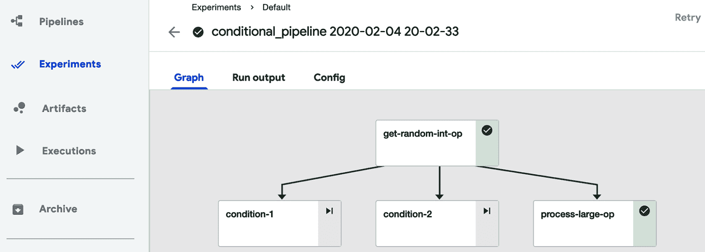

###### 图 4-9\. 执行条件管道示例

从这个图表中，我们可以看到管道确实分成了三个分支，并且在此运行中选择了处理大操作。为了验证这一点，我们查看执行日志，如图 4-10 所示。

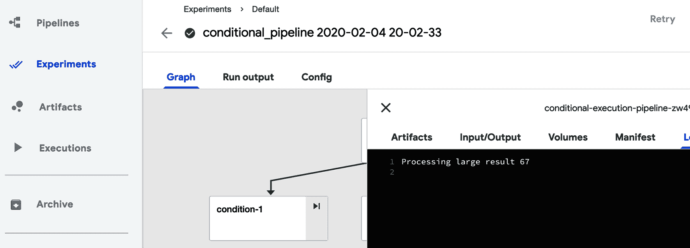

###### 图 4-10\. 查看条件管道日志

在这里我们可以看到生成的数字是 67。这个数字大于 50，这意味着应执行*process_large_op*分支。⁷

## 在计划上运行管道

我们手动运行了我们的管道。这对于测试很好，但通常不足以满足生产环境的需求。幸运的是，您可以按计划运行管道，如[thisKubeflow documentation page](https://oreil.ly/8v3fb)所述。首先，您需要上传管道定义并指定描述。完成后，您可以通过创建一个运行并选择“重复”运行类型来创建定期运行，并按照屏幕上的说明操作，如图 4-11 所示。

在此图中，我们正在设置每天运行一次的管道。

###### 警告

创建定期运行时，我们正在指定管道运行的频率，而不是运行时间。在当前实现中，执行时间是在创建运行时定义的。一旦创建，它会立即执行，然后按照定义的频率执行。例如，如果每天上午 10 点创建一个每天运行，它将每天上午 10 点执行。

设置管道的定期执行是一个重要的功能，允许您完全自动化管道的执行。

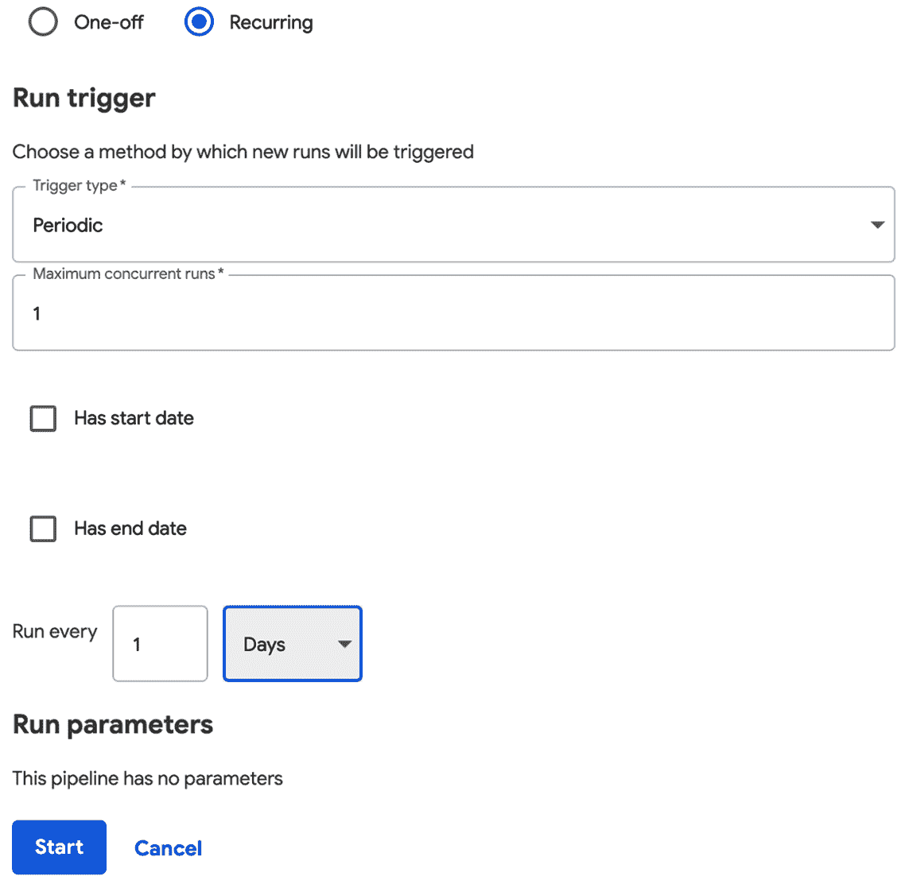

###### 图 4-11\. 设置管道的周期性执行

# 结论

您现在应该掌握了如何构建、调度和运行一些简单管道的基础知识。您还学习了管道工具在调试时的使用。我们展示了如何将现有软件集成到管道中，如何在管道内实现条件执行，以及如何按计划运行管道。

在我们的下一章中，我们将看看如何使用管道进行数据准备，并提供一些示例。

¹ 当将一个管道阶段的结果作为其他管道的输入时，通常可以自动推断出这一点。您还可以手动指定额外的依赖关系。

² Kubernetes 持久卷可以提供不同的 [访问模式](https://oreil.ly/KbGrQ)。

³ 通用的读写多实现是 [NFS 服务器](https://oreil.ly/QXEBX)。

⁴ 如果需要确保解决方案在多个云提供商之间具有可移植性，则可以使用云原生访问存储。

⁵ 如果需要在另一个操作系统上安装 Argo Workflow，请参考 [这些 Argo 指令](https://oreil.ly/s9CZM)。

⁶ 许多标准组件都在 [这个 Kubeflow GitHub 仓库](https://oreil.ly/0WX6k) 中。

⁷ 在 [这个 GitHub 网站](https://oreil.ly/WBwD1) 上可以找到更复杂的条件处理示例（包括嵌套条件）。
