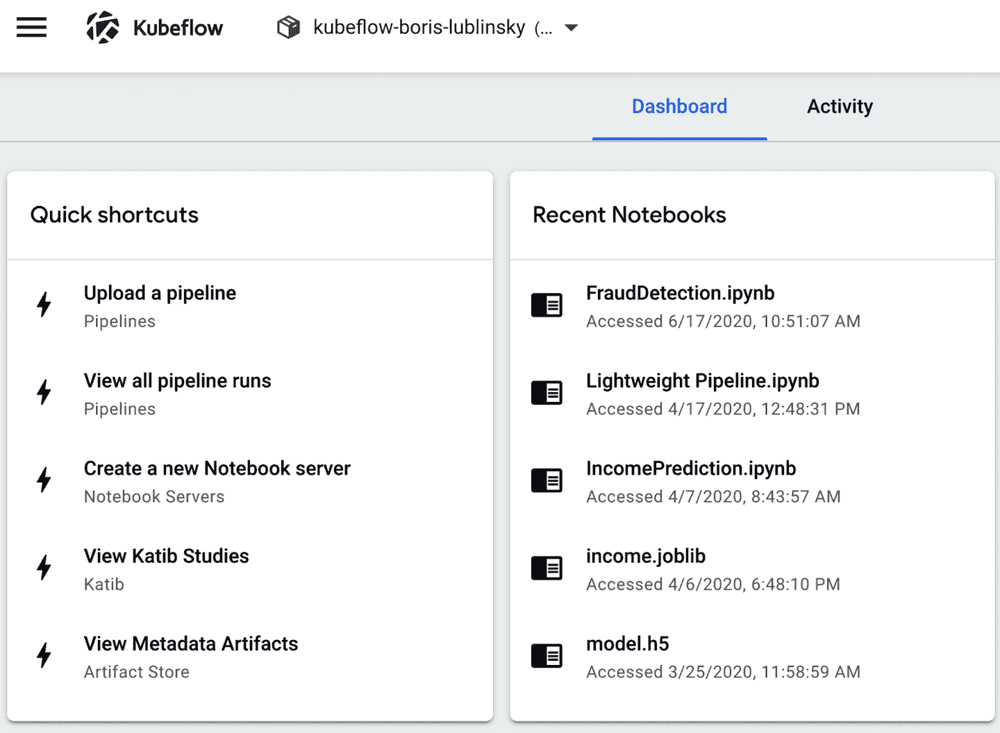
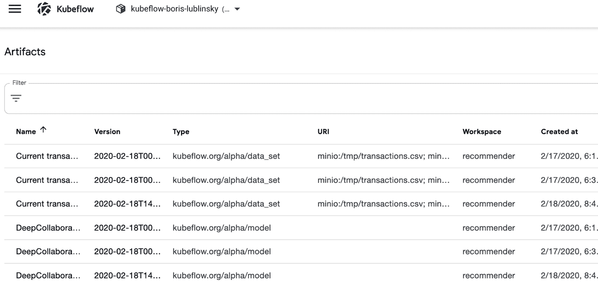
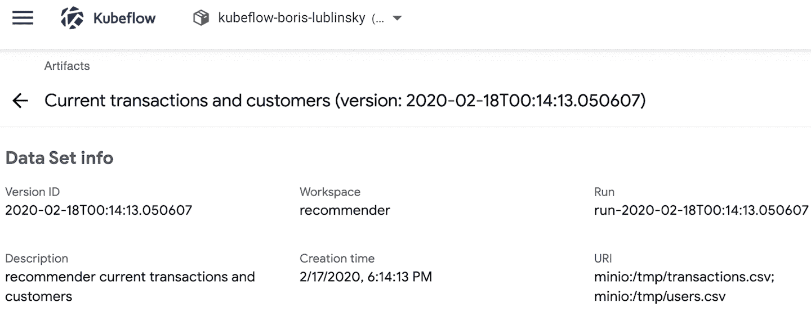
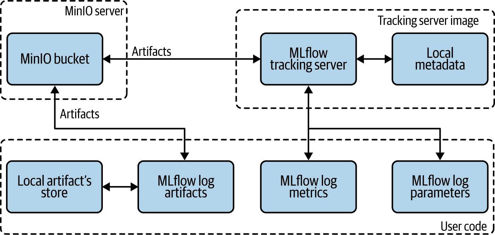
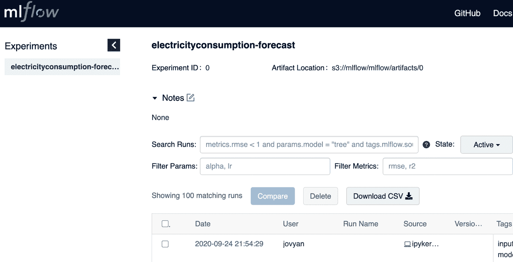
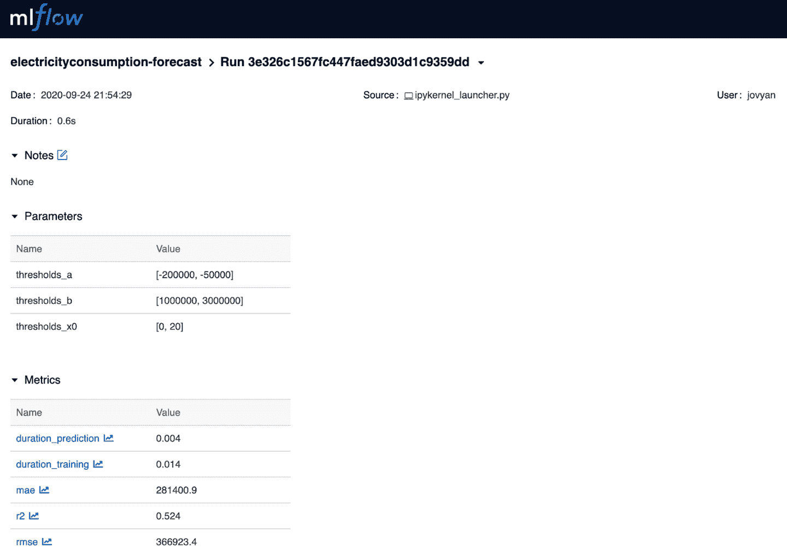
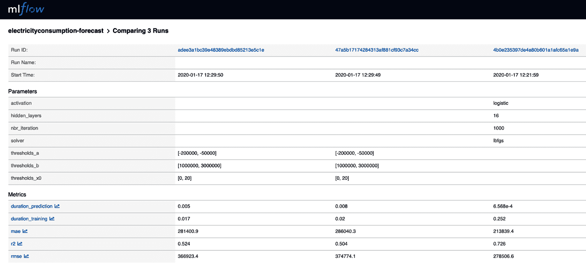
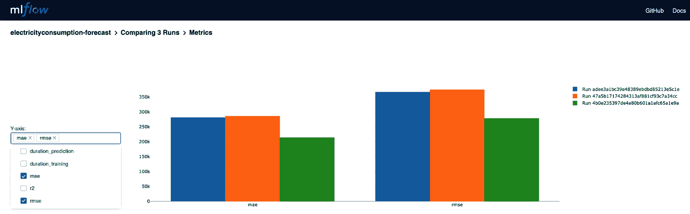

# 第六章：物件和元数据存储

机器学习通常涉及处理大量原始和中间（转换后）数据，其最终目标是创建和部署模型。为了理解我们的模型，必须能够探索用于其创建和转换的数据集（数据谱系）。收集这些数据集及其应用的转换称为我们模型的*元数据*。¹

在机器学习中，模型元数据对于*可重现性*至关重要；² 可重现性对于可靠的生产部署至关重要。捕捉元数据使我们能够在重新运行作业或实验时理解变化。理解变化对于迭代开发和改进我们的模型是必要的。它还为模型比较提供了坚实的基础。正如 Pete Warden 在这篇[文章](https://oreil.ly/dQZjL)中定义的那样：

> 要复现结果，需要准确记录代码、训练数据和整个平台。

对于其他常见的 ML 操作，如模型比较、可重现模型创建等，也需要相同的信息。

有许多不同的选项可以用来跟踪模型的元数据。Kubeflow 内置了一个称为[Kubeflow ML Metadata](https://oreil.ly/0rVN1)的工具用于此目的。该工具的目标是帮助 Kubeflow 用户通过跟踪和管理工作流程产生的元数据来理解和管理其 ML 工作流。我们可以集成到我们的 Kubeflow 管道中的另一个跟踪元数据的工具是 MLflow Tracking。它提供 API 和 UI，用于在运行机器学习代码时记录参数、代码版本、指标和输出文件，并在稍后可视化结果。

在本章中，我们将讨论 Kubeflow 的 ML Metadata 项目的能力，并展示其如何使用。我们还将考虑此实现的一些缺点，并探索使用其他第三方软件的可能性：[MLflow](https://mlflow.org)⁴。

# Kubeflow ML Metadata

[Kubeflow ML Metadata](https://oreil.ly/7WOp1) 是一个用于记录和检索与模型创建相关的元数据的库。在当前实现中，Kubeflow Metadata 仅提供 Python API。要使用其他语言，您需要实现特定于语言的 Python 插件才能使用该库。为了理解其工作原理，我们将从一个简单的人工示例开始，展示 Kubeflow Metadata 的基本功能，使用一个非常简单的笔记本（基于这个[demo](https://oreil.ly/Sm3ML)）⁵。

Kubeflow Metadata 的实现从所需的导入开始，如示例 6-1 所示。

##### 示例 6-1。所需导入

```
from kfmd import metadata
import pandas
from datetime import datetime
```

在 Kubeflow Metadata 中，所有信息都按照工作空间、运行和执行进行组织。您需要定义一个工作空间，以便 Kubeflow 可以跟踪和组织记录。示例 6-2 中的代码展示了如何实现这一点。

##### 示例 6-2\. 定义工作空间

```
ws1 = metadata.Workspace(
    # Connect to metadata-service in namespace kubeflow.
    backend_url_prefix="metadata-service.kubeflow.svc.cluster.local:8080",
    name="ws1",
    description="a workspace for testing",
    labels={"n1": "v1"})
r = metadata.Run(
    workspace=ws1,
    name="run-" + datetime.utcnow().isoformat("T") ,
    description="a run in ws_1",
)
exec = metadata.Execution(
    name = "execution" + datetime.utcnow().isoformat("T") ,
    workspace=ws1,
    run=r,
    description="execution example",
)
```

###### 提示

可以在同一或不同的应用程序中多次定义工作空间、运行和执行。如果它们不存在，将被创建；如果它们已存在，则将被使用。

Kubeflow 不会自动跟踪应用程序使用的数据集。它们必须在代码中显式注册。按照经典的 MNIST 示例，元数据中数据集的注册应实现如示例 6-3 所示。

##### 示例 6-3\. 元数据示例

```
data_set = exec.log_input(
        metadata.DataSet(
            description="an example data",
            name="mytable-dump",
            owner="owner@my-company.org",
            uri="file://path/to/dataset",
            version="v1.0.0",
            query="SELECT * FROM mytable"))
```

除了数据外，Kubeflow Metadata 还允许您存储有关模型及其指标的信息。其实现代码显示在示例 6-4 中。

##### 示例 6-4\. 另一个元数据示例

```
model = exec.log_output(
    metadata.Model(
            name="MNIST",
            description="model to recognize handwritten digits",
            owner="someone@kubeflow.org",
            uri="gcs://my-bucket/mnist",
            model_type="neural network",
            training_framework={
                "name": "tensorflow",
                "version": "v1.0"
            },
            hyperparameters={
                "learning_rate": 0.5,
                "layers": [10, 3, 1],
                "early_stop": True
            },
            version="v0.0.1",
            labels={"mylabel": "l1"}))
metrics = exec.log_output(
    metadata.Metrics(
            name="MNIST-evaluation",
            description="validating the MNIST model to recognize handwritten digits",
            owner="someone@kubeflow.org",
            uri="gcs://my-bucket/mnist-eval.csv",
            data_set_id=data_set.id,
            model_id=model.id,
            metrics_type=metadata.Metrics.VALIDATION,
            values={"accuracy": 0.95},
            labels={"mylabel": "l1"}))
```

这些代码片段将实现用于存储模型创建元数据的所有主要步骤：

1.  定义工作空间、运行和执行。

1.  存储有关用于模型创建的数据资产的信息。

1.  存储有关创建的模型的信息，包括其版本、类型、训练框架及用于创建的超参数。

1.  存储有关模型评估指标的信息。

在实际实现中，这些代码片段应用于实际代码中，用于捕获用于数据准备、机器学习等的元数据。参见第七章以了解在哪里以及如何捕获此类信息的示例。

收集元数据仅在有方法查看它时才有用。Kubeflow Metadata 提供两种查看方式——通过编程方式和使用元数据 UI。

## 编程查询

可以通过编程查询以下功能。

首先，我们列出工作空间中的所有模型，如示例 6-5 所示。

##### 示例 6-5\. 列出所有模型

```
pandas.DataFrame.from_dict(ws1.list(metadata.Model.ARTIFACT_TYPE_NAME))
```

在我们的代码中，我们只创建了一个单一模型，这是此查询结果的返回（参见表 6-1）。

表 6-1\. 模型列表

|   | id | workspace | run | create_time | description | model_type |
| --- | --- | --- | --- | --- | --- | --- |
| 0 | 2 | ws1 | run-2020-01-10T22:13:20.959882 | 2020-01-10T22:13:26.324443Z | 用于识别手写数字的模型 | 神经网络 |
| name | owner | version | uri | training_framework |
| --- | --- | --- | --- | --- |
| MNIST | someone@kubeflow.org | v0.0.1 | gcs://my-bucket/mnist | {*name*: *tensorflow*, *version*: *v1.0*} |

接下来，我们获取基本谱系（参见示例 6-6）。在我们的情况下，我们创建了一个单一模型，因此返回的谱系将仅包含此模型的 ID。

##### 示例 6-6\. 基本谱系

```
print("model id is " + model.id) 
```


返回`model id is 2`。

然后我们找到产生该模型的执行。在我们的示例应用程序中，我们创建了一个单独的执行。这个执行的 ID 作为这个查询的结果返回，如 示例 6-7 所示。

##### Example 6-7\. 找到执行

```
output_events = ws1.client.list_events2(model.id).events
execution_id = output_events[0].execution_id
print(execution_id) 
```


返回 `1`.

最后，在 示例 6-8 中说明，我们找到与该执行相关的所有事件。

##### Example 6-8\. 获取所有相关事件

```
all_events = ws1.client.list_events(execution_id).events
assert len(all_events) == 3
print("\nAll events related to this model:")
pandas.DataFrame.from_dict([e.to_dict() for e in all_events])
```

在我们的情况下，我们使用了单个输入来创建模型和指标。因此，这个查询的结果如 表格 6-2 所示。

Table 6-2\. 以表格形式显示的查询结果

|  | artifact_id | execution_id | path | type | milliseconds_since_epoch |
| --- | --- | --- | --- | --- | --- |
| 0 | 1 | 1 | None | INPUT | 1578694406318 |
| 1 | 2 | 1 | None | OUTPUT | 1578694406338 |
| 2 | 3 | 1 | None | OUTPUT | 1578694406358 |

## Kubeflow Metadata UI

除了提供用于编写分析元数据的 API 外，Kubeflow Metadata 工具还提供一个 UI，允许您在不编写代码的情况下查看元数据。通过主 Kubeflow UI 访问元数据 UI，如 图 6-1 所示。



###### Figure 6-1\. 访问 Metadata UI

一旦您点击艺术品存储，您应该看到可用艺术品（已记录的元数据事件）的列表，如 图 6-2 所示。



###### Figure 6-2\. 艺术品存储 UI 中的艺术品列表

从这个视图中，我们可以点击单个艺术品并查看其详细信息，如 图 6-3 所示。



###### Figure 6-3\. 艺术品视图

Kubeflow Metadata 提供了一些基本功能来存储和查看机器学习元数据；然而，其功能非常有限，特别是在查看和操作存储的元数据方面。MLflow 提供了一个更强大的机器学习元数据管理实现。虽然 MLflow 不是 Kubeflow 分发的一部分，但很容易将其部署在 Kubeflow 旁边，并从基于 Kubeflow 的应用程序中使用，正如下一节所述。

# 使用 MLflow 的元数据工具与 Kubeflow

MLflow 是一个开源平台，用于管理端到端的机器学习生命周期。它包括三个主要功能：

[MLflow 追踪](https://oreil.ly/appTI)

跟踪实验以记录和比较参数和结果

[MLflow 项目](https://oreil.ly/YmBmS)

将 ML 代码打包成可重用、可再现的形式，以便与其他数据科学家共享或转移到生产环境

[MLflow 模型](https://oreil.ly/WN0nm)

管理和部署来自各种 ML 库的模型到各种模型服务和推理平台

对于我们的 Kubeflow 元数据讨论目的，我们只讨论 MLflow 跟踪组件的部署和使用 —— 用于记录参数、代码版本、指标和输出文件的 API 和 UI，以及在运行机器学习代码并可视化结果时使用。MLflow 跟踪允许您使用 [Python](https://oreil.ly/BfpRU)、[REST](https://oreil.ly/pGC0j)、[R](https://oreil.ly/5xKAK) 和 [Java](https://oreil.ly/AUUXL) API 记录和查询实验，这显著扩展了 API 的覆盖范围，允许您存储和访问来自不同 ML 组件的元数据。

MLflow 跟踪围绕运行的概念组织，这些运行是某些数据科学代码的执行。每次运行记录以下信息：

代码版本

用于运行的 Git 提交哈希，如果是从 MLflow 项目运行的话

开始和结束时间

运行的开始和结束时间

源

启动运行的文件名称，或者如果是从 MLflow 项目运行的话，项目名称和入口点

参数

您选择的键-值输入参数。键和值都是字符串。

指标

键-值指标，其中值是数值。每个指标可以在运行过程中更新（例如，跟踪模型损失函数如何收敛），而 MLflow 记录并允许您可视化指标的完整历史记录。

工件

任何格式的输出文件。在这里，您可以记录图像（例如 PNG 文件）、模型（例如，一个序列化的 Scikit-learn 模型）和数据文件（例如，一个 Parquet 文件）作为工件。

大多数 [MLflow 示例](https://oreil.ly/oik7f) 使用本地 MLflow 安装，这对我们的目的不合适。对于我们的实施，我们需要基于集群的安装，允许我们从不同的 Docker 实例写入元数据并集中查看它们。遵循项目 [MLflow Tracking Server based on Docker and AWS S3](https://oreil.ly/5DdRC) 中概述的方法，展示了这种 MLflow 跟踪组件部署的整体架构，如 图 6-4 所示。



###### 图 6-4\. MLflow 组件部署的整体架构

此架构的主要组件包括：

+   已经作为 Kubeflow 安装的一部分的 MinIO 服务器

+   MLflow 跟踪服务器 — MLflow UI 组件 — 需要添加到 Kubeflow 安装中以支持 MLflow 使用的额外组件

+   用户代码，如笔记本、Python、R 或 Java 应用程序

## 创建和部署 MLflow 跟踪服务器

MLflow 跟踪服务器允许您将 MLflow 运行记录到本地文件、到与 SQLAlchemy 兼容的数据库，或者远程到跟踪服务器。在我们的实施中，我们使用的是远程服务器。

MLflow 跟踪服务器有两个存储组件：后端存储和 artifact 存储。后端存储用于存储实验和运行元数据以及运行的参数、指标和标签。MLflow 支持两种类型的后端存储：文件存储和数据库支持的存储。为了简单起见，我们将使用文件存储。在我们的部署中，这个文件存储是 Docker 镜像的一部分，这意味着在服务器重启的情况下，这些数据会丢失。如果您需要长期存储，可以使用外部文件系统，如 NFS 服务器，或者数据库。Artifact 存储是一个适合大数据的位置（例如 S3 桶或共享的 NFS 文件系统），客户端在这里记录他们的 artifact 输出（例如模型）。为了使我们的部署与云无关，我们决定使用 MinIO（Kubeflow 的一部分）作为 artifact 存储。基于这些决策，用于构建 MLflow 跟踪服务器的 Docker 文件看起来像是 示例 6-9（与 [此 GitHub 仓库](https://oreil.ly/VOe9f) 中的实现类似）。

##### 示例 6-9\. MLflow 跟踪服务器

```
FROM python:3.7

RUN pip3 install --upgrade pip && \
   pip3 install mlflow --upgrade && \
   pip3 install awscli --upgrade  && \
   pip3 install boto3 --upgrade

ENV PORT 5000
ENV AWS_BUCKET bucket
ENV AWS_ACCESS_KEY_ID aws_id
ENV AWS_SECRET_ACCESS_KEY aws_key
ENV FILE_DIR /tmp/mlflow

RUN mkdir -p /opt/mlflow
COPY run.sh /opt/mlflow
RUN chmod -R 777 /opt/mlflow/

ENTRYPOINT ["/opt/mlflow/run.sh"]
```

在这里，我们首先加载 MLflow 代码（使用 pip），设置环境变量，然后复制并运行启动脚本。这里使用的启动脚本看起来像是 示例 6-10。⁶

##### 示例 6-10\. MLflow 启动脚本

```
#!/bin/sh
mkdir -p $FILE_DIR

mlflow server \
   --backend-store-uri file://$FILE_DIR \
   --default-artifact-root s3://$AWS_BUCKET/mlflow/artifacts \
   --host 0.0.0.0 \
   --port $PORT
```

此脚本设置一个环境，然后验证所有必需的环境变量是否已设置。一旦验证成功，将启动一个 MLflow 服务器。一旦 Docker 创建完成，可以使用 示例 6-11 中的 Helm 命令（Helm 图表位于 [本书的 GitHub 仓库](https://oreil.ly/Kubeflow_for_ML_ch06_mlflowchart)）来安装服务器。

##### 示例 6-11\. 使用 Helm 安装 MLflow 服务器

```
helm install <location of the Helm chart>
```

这个 Helm 图表安装了三个主要组件，实现了 MLflow 跟踪服务器：

[部署](https://oreil.ly/GYQwv)

部署 MLflow 服务器本身（单个副本）。这里的重要参数包括环境，包括 MinIO 端点、凭据和用于存储 artifact 的桶。

[服务](https://oreil.ly/RZq4U)

创建一个暴露 MLflow 部署的 Kubernetes 服务

[虚拟服务](https://oreil.ly/-myuN)

通过 Kubeflow 使用的 Istio 入口网关向用户公开 MLflow 服务

一旦服务器部署完成，我们可以访问 UI，但此时它会显示没有可用的实验。现在让我们看看如何使用这个服务器来捕获元数据。⁷

## 记录运行数据

作为记录数据的示例，让我们看一下一些简单的代码。⁸ 我们将从安装所需的包开始，如示例 6-11 和 6-12 所示。

##### 示例 6-12\. 安装所需内容

```
!pip install pandas --upgrade --user
!pip install mlflow --upgrade --user 
!pip install joblib --upgrade --user
!pip install numpy --upgrade --user
!pip install scipy --upgrade --user
!pip install scikit-learn --upgrade --user
!pip install boto3 --upgrade --user 
```


这里 `mlflow` 和 `boto3` 是用于元数据记录的包，而其余的则用于机器学习本身。

一旦安装了这些包，我们可以像 示例 6-13 中所示定义所需的导入。

##### 示例 6-13\. 导入所需库

```
import time
import json
import os
from joblib import Parallel, delayed

import pandas as pd
import numpy as np
import scipy

from sklearn.model_selection import train_test_split, KFold
from sklearn.metrics import mean_squared_error, mean_absolute_error
from sklearn.metrics import r2_score, explained_variance_score
from sklearn.exceptions import ConvergenceWarning

import mlflow
import mlflow.sklearn
from mlflow.tracking import MlflowClient

from warnings import simplefilter
simplefilter(action='ignore', category = FutureWarning)
simplefilter(action='ignore', category = ConvergenceWarning)
```

这里再次，`os` 和最后三个导入项是用于 MLflow 日志记录的必需，而其余的则用于机器学习。现在我们需要定义环境变量（参见 示例 6-14），以便正确访问用于存储工件的 MinIO 服务器。

##### 示例 6-14\. 设置环境变量

```
os.environ['MLFLOW_S3_ENDPOINT_URL'] = \
     'http://minio-service.kubeflow.svc.cluster.local:9000'
os.environ['AWS_ACCESS_KEY_ID'] = 'minio'
os.environ['AWS_SECRET_ACCESS_KEY'] = 'minio123'
```

请注意，除了跟踪服务器本身之外，`MLFLOW_S3_ENDPOINT_URL` 不仅在跟踪服务器定义中定义，而且在实际捕获元数据的代码中也有定义。这是因为，正如我们之前提到的，用户代码直接写入到工件存储中，绕过服务器。

这里我们跳过了大部分代码（完整代码可以在 [本书的 GitHub 仓库](https://oreil.ly/Kubeflow_for_ML_ch06_MLflow) 中找到），仅集中在与 MLflow 日志记录相关的部分。下一步（参见 示例 6-15）是连接到跟踪服务器并创建实验。

##### 示例 6-15\. 创建实验

```
remote_server_uri = "http://mlflowserver.kubeflow.svc.cluster.local:5000"
mlflow.set_tracking_uri(remote_server_uri)
experiment_name = "electricityconsumption-forecast"
mlflow.set_experiment(experiment_name)
```

一旦连接到服务器并创建（选择）实验，我们就可以开始记录数据。例如，让我们看一下存储 [KNN 回归器](https://oreil.ly/g5yH3) 信息的代码，在 示例 6-16 中。

##### 示例 6-16\. 样本 KNN 模型

```
def train_knnmodel(parameters, inputs, tags, log = False):
    with mlflow.start_run(nested = True):

……………………………………………….
        # Build the model
        tic = time.time()
        model = KNeighborsRegressor(parameters["nbr_neighbors"],
                                weights = parameters["weight_method"])
        model.fit(array_inputs_train, array_output_train)
        duration_training = time.time() - tic

        # Make the prediction
        tic1 = time.time()
        prediction = model.predict(array_inputs_test)
        duration_prediction = time.time() - tic1

        # Evaluate the model prediction
        metrics = evaluation_model(array_output_test, prediction)

        # Log in mlflow (parameter)
        mlflow.log_params(parameters)

        # Log in mlflow (metrics)
        metrics["duration_training"] = duration_training
        metrics["duration_prediction"] = duration_prediction
        mlflow.log_metrics(metrics)

        # Log in mlflow (model)
        mlflow.sklearn.log_model(model, f"model")

        # Save model
        #mlflow.sklearn.save_model(model,
                         f"mlruns/1/{uri}/artifacts/model/sklearnmodel")

        # Tag the model
        mlflow.set_tags(tags)
```

在此代码片段中，我们可以看到有关模型创建和预测测试统计数据的不同类型数据是如何记录的。这里的信息与 Kubeflow Metadata 捕获的信息非常相似，包括输入、模型和指标。

最后，类似于 Kubeflow Metadata，MLflow 允许您以编程方式访问此元数据。MLflow 提供的主要 API 包括您在 示例 6-17 中看到的内容。

##### 示例 6-17\. 获取给定实验的运行

```
df_runs = mlflow.search_runs(experiment_ids="0") 
print("Number of runs done : ", len(df_runs))

df_runs.sort_values(["metrics.rmse"], ascending = True, inplace = True) 
df_runs.head()
```


获取给定实验的运行


根据特定参数对运行进行排序

MLflow 将根据均方根误差（rmse）对运行进行排序，并显示最佳运行。

要了解程序化运行查询的额外功能，请参阅 [MLflow 文档](https://oreil.ly/Jistd)。

通过运行程序化查询的所有功能来评估运行元数据的最强大方法是通过 MLflow UI，我们将在下一步中介绍它。

## 使用 MLflow UI

MLflow 中的跟踪 UI 允许您可视化、搜索和比较运行，并下载运行工件或元数据以在其他工具中进行分析。由于 MLflow 不是 Kubeflow 的一部分，因此 Kubeflow UI 不提供其访问权限。根据提供的虚拟服务，MLflow UI 可通过 *<Kubeflow Istio ingress gateway URL>/mlflow* 访问。

图 6-5 显示了运行描述的结果。可以使用搜索框来过滤结果。例如，如果我们只想看到 KNN 模型的结果，则可以使用搜索条件 `tags.model="knn"`。还可以使用更复杂的过滤器，如 `tags.model="knn"` 和 `metrics.duration_prediction < 0.002`，这将返回预测持续时间小于 0.002 秒的 KNN 模型的结果。



###### 图 6-5\. MLflow 主页

点击单独运行，我们可以查看其详细信息，如 图 6-6 所示。



###### 图 6-6\. 单独运行的视图

或者，我们可以通过选择多个运行并点击比较按钮来比较它们，如 图 6-7 所示。



###### 图 6-7\. 运行比较视图

我们还可以查看多个运行的指标比较，如 图 6-8 所示。⁹



###### 图 6-8\. 运行指标比较视图

# 结论

本章节展示了 Kubeflow 部署中 Kubeflow Metadata 组件支持存储和查看 ML 元数据的方式。我们还讨论了这种实现的缺点，包括仅支持 Python 和界面弱等问题。最后，我们介绍了如何通过补充 Kubeflow 与类似功能的组件，如 MLflow，来增强其额外功能。

在 第七章 中，我们探讨了使用 Kubeflow 与 TensorFlow 进行模型训练和服务化的内容。

¹ 欲了解有关机器学习元数据的背景信息和要捕获内容的概述，请参阅 Luigi Patruno 撰写的这篇[博客文章](https://oreil.ly/3zA6K)。

² 欲了解更多，请参阅 Jennifer Villa 和 Yoav Zimmerman 撰写的这篇[博客文章](https://oreil.ly/H1B81)。

³ 请注意，Kubeflow ML Metadata 与 [ML Metadata](https://oreil.ly/ALXsm)（TFX 的一部分）是不同的。

⁴ MLflow 最初由 Databricks 开发，并且目前是 [Linux 基金会](https://oreil.ly/Fscza) 的一部分。

⁵ 本笔记本的完整代码位于[本书的 GitHub 仓库](https://oreil.ly/Kubeflow_for_ML_ch06)。

⁶ 这是一个简化的实现。要获取完整的实现，请查阅[本书的 GitHub 仓库](https://oreil.ly/Kubeflow_for_ML_ch06_MLflow)。

⁷ 在这里，我们展示了使用 Python API 的用法。要了解更多 API（如 R、Java、REST），请参阅[MLflow 文档](https://oreil.ly/QaeM1)。

⁸ 这里的代码改编自 Jean-Michel Daignan 的[这篇文章](https://oreil.ly/nVB_s)。

⁹ 也请查看[MLflow 文档](https://oreil.ly/w9u7n)，了解更多的 UI 功能。
