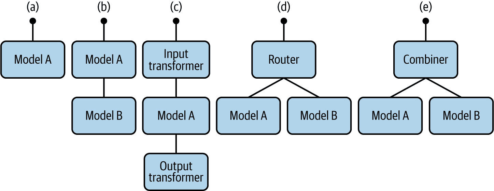

# 第八章：模型推断

###### 注意

我们要感谢 Clive Cox 和 Alejandro Saucedo 来自[Seldon](https://www.seldon.io)对本章的巨大贡献。

机器学习中大部分关注点都集中在算法开发上。然而，模型并不是为了创建而创建的，它们被创建出来是为了投入生产。通常情况下，当人们谈论将模型“投入生产”时，他们指的是执行推断。如第一章所介绍的并在图 1-1 中有所说明，一个完整的推断解决方案旨在提供服务、监控和更新功能。

模型服务

将训练好的模型置于可以处理预测请求的服务后面

模型监控

监控模型服务器性能异常以及底层模型的准确性

模型更新

完全管理模型的版本控制，并简化版本之间的推广和回滚

本章将探讨每个核心组件，并定义其功能的期望。在确定具体期望之后，我们将列出理想推断解决方案需满足的要求清单。最后，我们将讨论 Kubeflow 支持的推断方案及如何使用它们满足您的推断需求。

# 模型服务

模型推断的第一步是模型服务，即将您的模型托管在一个可以与之交互的服务后面。模型服务有两种基本方法：*嵌入式*，其中模型直接部署到应用程序中，以及*模型作为服务*（MaaS），其中一个专用于模型服务的独立服务可从企业中的任何应用程序中使用。表 8-1 提供了这些方法的比较。

表 8-1 比较嵌入式和 MaaS

| 服务类型 | 优点 | 缺点 |
| --- | --- | --- |
| 嵌入式 |

+   提供最大性能

+   提供最简单的基础设施

+   无需计划异常用户行为

|

+   必须在每个使用它的应用中部署模型

+   当模型类型变化时需要应用更新

+   所有部署策略，例如蓝绿部署，必须明确实施

|

| 模型作为服务（MaaS） |
| --- |

+   简化与其他技术和组织流程的集成

+   在多个流处理应用中重复使用模型部署

+   允许在低功率设备（例如手机）上进行模型服务，无法运行复杂模型

+   允许为来自多个客户端的请求进行小批量处理

+   更容易提供内置功能，包括模型更新、可解释性、漂移检测等

+   允许高级模型部署策略，如集成和多臂赌博机，需要与应用程序解耦

+   允许应用和模型服务器之间的分别扩展，或在不同设备（如 CPU 和 GPU）上运行它们

|

+   额外的网络跳跃会降低性能。

+   与模型服务器紧密的时间耦合可能会影响整体服务级别协议。

|

Kubeflow 只支持 MaaS 方法。因此，我们将不讨论本书中的模型嵌入。¹

实施 MaaS 的两种主要方法：*模型即代码* 和 *模型即数据*。模型即代码直接在服务实现中使用模型代码。模型即数据则使用中间模型格式（如 [PMML](https://oreil.ly/ljhYw)、[PFA](https://oreil.ly/SsM9C)、[ONNX](https://onnx.ai) 或 [TensorFlow 的原生格式](https://oreil.ly/KtkQS)）驱动的通用实现。这两种方法在 Kubeflow 的不同模型服务器实现中使用。确定要使用哪种实现时，我们建议使用模型即数据，因为它允许在服务实例之间标准化模型交换，从而提供系统间的可移植性和通用模型服务解决方案的实现。

大多数常见的服务实现，如 TFServing、ONNX Runtime、Triton 和 TorchServe，使用模型即数据方法，并利用中间模型格式。其中一些实现仅支持一个框架，而其他实现则支持多个框架。不幸的是，每种解决方案都使用不同的模型格式并暴露独特的专有服务 API。这些接口无法满足所有人的需求。这些 API 接口的复杂性和分歧导致了用户体验的差异化，以及在不同模型框架之间切换时增加了摩擦力。

有一些强大的行业领导者试图统一模型服务器的开源社区，减少在切换模型框架时的摩擦力。Seldon 正在通过 Seldon Core 探索图推理；Bloomberg 和 IBM 正在使用类似 Knative 的解决方案进行无服务器模型服务的研究；而 Google 则正在进一步加固其用于 TensorFlow 模型的服务实现。

在 “Kubeflow 中的模型推理” 中，我们将讨论 Kubeflow 提供的服务解决方案以及将这些解决方案统一到单一接口的工作。

## 模型服务要求

模型服务需要你理解和管理开发运维（DevOps），以及处理模型的分析、实验和治理。这个范围广泛、复杂，并且在数据科学家中普遍存在。我们现在将开始明确你可能希望从服务解决方案中获得的期望。

首先，您需要框架的灵活性。像 Kubeflow 这样的解决方案允许您的训练与具体实现无关（即 TensorFlow 对比 PyTorch）。如果您编写了一个图像分类推断服务，那么底层模型是使用 PyTorch、Scikit-learn 还是 TensorFlow 训练的都不重要，服务接口应共享，以保持用户的 API 一致性。

其次，您希望能够利用与算法需求匹配的硬件优化器。有时完全拟合和调整的神经网络非常深，这意味着即使在评估阶段，您也会从像 GPU 或 TPU 这样的硬件优化器中受益，以推断模型。

第三，您的模型服务器应无缝与推断图中的其他组件交互。推断图可以包括特征转换器、预测器、解释器和漂移检测器，我们稍后会详细介绍。

第四，您还应该有选择在生产中扩展您的服务实例的选项，无论基础硬件如何，即推断的成本、延迟。这尤为重要且困难，因为 GPU 的自动缩放依赖于多种因素，包括 GPU/CPU 利用率指标、工作周期等，而确定用于自动缩放的指标并不明显。此外，推断图中每个组件的扩展应分别进行，因为它们的算法需求不同。

第五，您希望服务实例公开表现状态传输（REST）请求或通用远程过程调用（gRPC）。如果您有流式输入，可能希望支持像 Kafka 这样的流式接口。

# 模型监控

一旦您部署了模型，就必须监视生产中的模型服务器。当我们谈论模型服务器的监控时，不仅仅是指模型服务的洞察力，还包括适用于任何基于 Kubernetes 的应用程序的一般监控，包括内存、CPU、网络等。我们将在“监控您的模型”中更详细地探讨模型监控和模型洞察。

## 模型准确性、漂移和可解释性

在生成模型服务洞察时，监控的最常见的 ML 属性是模型准确性、模型漂移和可解释性。*模型准确性* 是指您训练数据的验证准确性。但随着实时数据分布开始偏离原始训练数据，这往往会导致*模型漂移*。换句话说，当发送到模型的数据的特征分布开始与训练模型时使用的数据显著不同时，模型会表现不佳。ML 洞察系统实施有效的技术来分析和检测可能发生在您的输入数据中的变化——*概念漂移*，这对于运行在生产系统中的模型至关重要。

另一种越来越受关注的模型洞察形式是**模型可解释性**，即解释为什么会产生某个特定结果的能力。更确切地说，它回答以下问题：

+   模型在数据中认为哪些特征最重要？

+   对于模型的任何单个预测，数据中的每个特征如何影响该特定预测？

+   特征之间的交互对模型预测有何最大影响？

除了模型洞察之外，应用程序监控传统上与网络可观察性或遥测相关，包括日志聚合和服务网格相关的指标收集。这些工具在从活动服务实例中捕获数据方面非常有用。该基础设施暴露了足够的可查询信息，用于故障排除和警报，以防在可达性、利用率或延迟方面出现问题。

## 模型监控要求

监控模型准确性和模型漂移是困难的。幸运的是，这是一个非常活跃的研究领域，有各种开源解决方案。² 您的推断解决方案应使您能够插入提供所需功能的解决方案。现在，我们将看看您可能希望从您的模型监控组件中得到的内容。

首先，您希望您的推断服务能够在微服务架构中提供 ML 洞察，并能够简化漂移检测和模型解释解决方案的实验。

其次，您希望启用服务的监控、日志记录和跟踪。它还应支持像 Prometheus、Kibana 和 Zipkin 这样的解决方案，但也能无缝地支持它们的替代方案。

# 模型更新

如果您希望更新模型并发布新版本或回滚到以前的版本，您将希望部署和运行此更新版本。然而，当前部署与新部署之间的关系可以用多种方式定义。当您的推断系统引入多个版本的模型服务实例时，您可以使用影子模型或竞争模型：

影子模型

在考虑在生产中替换模型时，这些是有用的。您可以在当前模型旁边部署新模型，并发送相同的生产流量以收集关于影子模型表现的数据，然后再提升它。

竞争模型

这些是稍微复杂的场景，您正在尝试在生产环境中使用多个模型版本，通过诸如 A/B 测试之类的工具来找出哪一个更好。

让我们讨论三种主要的部署策略：

[蓝绿部署](https://oreil.ly/pXHA4)

通过仅有一个生产流量的活动环境，可以减少与版本发布相关的停机时间和风险。

[金丝雀部署](https://oreil.ly/BOEQi)

这些通过允许在版本之间进行基于百分比的流量切换，实现了逐步发布。

固定部署

这些允许您将实验流量暴露给新版本，同时将生产流量保持在当前版本。

金丝雀和固定与蓝绿相比增加了基础设施和路由规则的复杂性，以确保流量被重定向到正确的模型。有了这种启用，您可以开始收集数据，以便在何时开始移动流量时做出统计显著的决策。流量移动的一种统计方法是 A/B 测试。评估多个竞争模型的另一种流行方法是[multi-armed bandits](https://oreil.ly/eDEsU)，其中需要您为每个模型定义一个分数或奖励，并根据它们各自的分数推广模型。

## 模型更新要求

模型升级必须简单，因此您用于升级的部署策略应易于配置和更改（即从固定到金丝雀）。您的推断解决方案还应在其设计中提供更复杂的图推断。我们将详细阐述您从推断解决方案中所需的内容：

首先，部署策略的切换——即从固定到金丝雀——应该是微不足道的。您可以通过抽象服务平面来实现抽象化的流量级别路由，该路由将在“无服务器和服务平面”中定义。

第二，应在升级之前测试和验证版本更改，并记录相应的升级。

第三，底层堆栈应使您能够配置常见于图推断文献中的更复杂的部署策略。

# 推断需求摘要

满足模型服务、监控和更新的要求后，您现在拥有一个完整的推断解决方案，完成了模型开发生命周期（MDLC）的故事。这使您可以将模型从实验室直接推广到生产，并且甚至可以处理此模型的更新，以便调整或修改其结构。现在我们将讨论 Kubeflow 提供的推断解决方案。

###### 提示

有些机器学习实践者认为，持续学习（CL）对于他们的生产机器学习系统至关重要。CL 是模型不断从流数据中学习的能力。实质上，随着新数据的进入，模型将自主学习和适应生产环境。有些人甚至称之为 AutoML。通过一个完整的 MDLC 解决方案，该解决方案能够实现管道和金丝雀部署，您可以利用 Kubeflow 中可用的工具来设计这样的系统。

# Kubeflow 中的模型推断

在推断中进行模型服务、监控和更新可能非常棘手，因为您需要一种管理所有这些期望的解决方案，以便为首次用户提供抽象，并为高级用户提供可定制性。

Kubeflow 为模型推断解决方案提供多种 [选项](https://oreil.ly/GXjL4)。在本节中，我们将描述其中一些，包括 TensorFlow Serving、Seldon Core 和 KFServing。表 8-2 提供了这些解决方案的快速比较。

表 8-2\. 比较不同的模型推断方法

| 解决方案 | 方法 |
| --- | --- |
| TensorFlow Serving |

+   仅支持单一模型类型（TensorFlow）

+   对监控指标（Prometheus）提供部分支持。

+   通过模型版本标签支持版本 2.3 的金丝雀发布

+   最简单的基础设施依赖

|

| Seldon Core |
| --- |

+   针对流行库（如 TensorFlow、H2O、XGBoost、MXNet 等）优化的 Docker 容器。

+   将 Python 文件或 Java JAR 转换为完整的微服务的语言包装器

+   支持由模型、转换器、合并器和路由器组成的推断流水线

+   对监控指标和可审计请求日志的支持

+   支持高级部署技术 —— 金丝雀发布、蓝绿部署等。

+   支持高级 ML 洞察：解释器、异常检测器和对抗攻击检测器。

+   更复杂的基础设施依赖

|

| KFServing |
| --- |

+   将 Seldon Core 添加无服务器（Knative）和标准化推断体验，同时为其他模型服务器提供可扩展性。

+   最复杂的基础设施依赖

|

# TensorFlow Serving

最受欢迎的服务实现之一是 [TensorFlow Serving](https://oreil.ly/AV0jU)（TFServing），这是基于 [TensorFlow 导出格式](https://oreil.ly/WOV9j) 的模型服务实现。TFServing 实现了一个灵活高效的 ML 模型服务系统，专为生产环境设计。TFServing 的架构如 图 8-1 所示。


###### 图 8-1\. TFServing 架构

TFServing 使用导出的 TensorFlow 模型作为输入，并支持使用 HTTP 或 gRPC 运行预测。TFServing 可以配置为使用以下之一：

+   单一（最新）版本的模型

+   多个具体版本的模型。

TensorFlow 可以在本地³和 Kubernetes 中⁴使用。Kubeflow 中的典型 TFServing 实现包括以下组件：

+   运行所需副本数的 Kubernetes 部署。

+   提供访问部署的 Kubernetes 服务。

+   通过 Istio 虚拟服务，通过 Istio 入口网关公开服务

+   一个 Istio `DestinationRule`，定义路由到服务的流量策略（这些规则可以指定负载均衡、连接池大小和异常检测设置，以便检测和清除负载均衡池中的不健康主机。）

我们将通过扩展我们的推荐示例来演示这些组件[的实现方式](https://oreil.ly/copcG)。为了简化您的初始推断服务，您的示例 TFServing 实例将被限定为一个部署和一个允许 HTTP 访问的服务。该示例的 Helm 图表可以在[本书的 GitHub 存储库](https://oreil.ly/Kubeflow_for_ML_ch08_Helm) 中找到。

该图表定义了一个 Kubernetes 部署和服务。部署使用了“标准”TFServing Docker 镜像，并在其配置规范中指向了一个在 `S3` 源位置的序列化模型。这个 `S3` 存储桶由本地 MinIO 实例管理。该服务在 Kubernetes 集群内部公开了这个部署。

可以使用以下命令部署该图表（假设您正在运行 Helm 3）：

```
helm install <chart_location>
```

现在您已经部署了图表，需要一种与推断解决方案进行接口交互的方式。一种方法是将您的服务进行[端口转发](https://oreil.ly/jWjfV)，以便流量可以重定向到本地主机进行测试。您可以使用示例 8-1 进行服务的端口转发。

##### 示例 8-1\. TFServing 服务的端口转发

```
kubectl port-forward service/recommendermodelserver 8501:8501
```

结果流量将被重新路由到 `localhost:8051`。

现在您已准备好与 TFServing 推断解决方案交互。首先，您应该通过请求来自您的服务的模型部署信息来验证部署：

```
curl http://localhost:8501/v1/models/recommender/versions/1
```

预期输出显示在示例 8-2 中。

##### 示例 8-2\. TFServing 推荐模型版本状态

```
{
 "model_version_status": [
  {
   "version": "1",
   "state": "AVAILABLE",
   "status": {
    "error_code": "OK",
    "error_message": ""
   }
  }
 ]
}
```

您还可以通过发出以下 curl 命令获取模型的元数据，包括其签名定义：

```
curl http://localhost:8501/v1/models/recommender/versions/1/metadata
```

现在您的模型可用，并且具有正确的签名定义，您可以使用示例 8-3 中看到的命令预测服务。

##### 示例 8-3\. 向您的 TFServing 推荐服务发送请求

```
curl -X POST http://localhost:8501/v1/models/recommender/versions/1:predict\
-d '{"signature_name":"serving_default","inputs":\
{"products": [[1],[2]],"users" : [[25], [3]]}}'
```

执行示例 8-3 的结果显示在示例 8-4 中。

##### 示例 8-4\. 您的 TFServing 推荐服务的输出

```
{
    "outputs": {
        "model-version": [
            "1"
        ],
        "recommendations": [
            [
                0.140973762
            ],
            [
                0.0441606939
            ]
        ]
    }
}
```

您的 TensorFlow 模型现在位于一个实时推断解决方案之后。TFServing 使得部署新的 TensorFlow 算法和实验变得轻松，同时保持相同的服务器架构和 API。但旅程并未结束。首先，这些部署说明创建了一个服务，但未启用集群外的访问。⁵ 现在我们将进一步探讨这个特定解决方案对您的推断需求的所有能力。

## 回顾

如果您希望使用最低的基础设施要求部署 TensorFlow 模型，TFServing 是您的解决方案。但是，在考虑您的推断需求时，这也有其局限性。

### 模型服务

由于 TFServing 仅对 TensorFlow 提供生产级支持，因此并不具备您从框架无关推断服务中期望的灵活性。但它支持 REST、gRPC、GPU 加速、小批量处理以及适用于边缘设备的“精简”版本。尽管如此，无论底层硬件如何，这种支持都不涵盖流式输入或内置自动扩展功能。⁶ 此外，以一流方式支持扩展推断图——超越公平指标——以包含更高级 ML 洞察并不得到支持。尽管为 TensorFlow 模型提供基本的服务和模型分析功能，但这种推断解决方案并未满足您更高级的服务需求。

### 模型监控

TFServing 通过其与 Prometheus 的集成支持传统监控。这公开了系统信息（如 CPU、内存和网络）以及 TFServing 特定的指标；不幸的是，有关文档极为匮乏（请参阅最佳来源，位于[TensorFlow 网站](https://oreil.ly/czq_V)）。此外，它与像 Kibana 这样的数据可视化工具或像 Jaeger 这样的分布式跟踪库的一流集成并不存在。因此，TFServing 未提供您期望的托管网络可观察性能力。

关于包括模型漂移和可解释性在内的高级模型服务洞察，某些内容在[TensorFlow 2.0 中可用](https://oreil.ly/_yunS)。此外，对专有服务解决方案的供应商锁定使得模型洞察组件的可插拔性变得复杂。由于 TFServing 的部署策略使用 Kubeflow 的基础设施堆栈，它采用了微服务方法。这使得 TFServing 部署可以轻松地与辅助 ML 组件耦合。

### 模型更新

TFServing 在使能够金丝雀、固定和甚至回滚部署策略方面相当先进。⁷ 然而，这些策略仅限于对现有模型版本的手动标记，并不包括对在飞行中模型版本的支持。因此，版本推广并不具有安全推出的保证。最后，这些策略嵌入在服务器中，不支持其他可能存在于 TFServing 之外的部署策略的可扩展性。

### 总结

TFServing 为 TensorFlow 模型提供了极其高效和复杂的即插即用集成，但在启用更高级功能（如框架可扩展性、高级遥测和可插入式部署策略）方面存在不足。鉴于这些要求尚未得到满足，我们现在将看看 Seldon Core 如何填补这些空白。

# Seldon Core

Seldon Core 不仅仅可以在端点后面提供单个模型，还可以将数据科学家的机器学习代码或工件转换为微服务，从而组成复杂的运行时推断图。如在图 8-2 中可视化的推断图可以由以下组件组成：

模型

为一个或多个 ML 模型运行推断可执行文件

路由器

将请求路由到子图，例如启用 A/B 测试或多臂赌博机

组合器

合并来自子图的响应，例如模型集成

转换器

转换请求或响应，即转换特征请求


###### 图 8-2\. Seldon 推断图示例

要理解 Seldon 如何实现这一点，我们将探讨其核心组件和功能集：

预打包模型服务器

优化的 Docker 容器，适用于流行库如 TensorFlow、XGBoost、H2O 等，可以加载和提供模型工件/二进制文件

语言包装器

工具可以使用一组 CLI 实现更多定制的机器学习模型包装，允许数据科学家将 Python 文件或 Java JAR 文件转换为成熟的微服务

标准化 API

可以是 REST 或 gRPC 的开箱即用的 API

开箱即用的可观察性

监控指标和可审计的请求日志

高级机器学习洞察

将复杂的 ML 概念（如解释器、异常检测器和对抗攻击检测器）抽象为基础组件，可以在需要时进行扩展。

使用所有这些组件，我们将详细介绍如何使用 Seldon 设计推断图。

## 设计 Seldon 推断图

首先，您需要决定推断图包含哪些组件。它只是一个模型服务器，还是会向模型服务器添加一组转换器、解释器或异常检测器？幸运的是，根据需要添加或移除组件非常容易，所以我们将从一个简单的模型服务器开始。

其次，您需要将处理步骤容器化。您可以使用*模型作为数据*或*模型作为代码*构建推断图中的每个步骤。对于模型作为数据，您可以使用预打包模型服务器加载您的模型工件/二进制文件，并避免在模型更改时每次构建 Docker 容器。对于模型作为代码，您将根据自定义实现构建自己的预打包模型服务器。您的实现通过语言包装器实现，通过暴露高级接口到模型逻辑来容器化您的代码。这可以用于更复杂的情况，甚至是可能需要定制的特定操作系统或外部系统依赖的用例。

接下来，您需要测试您的实现。您可以在本地运行您的实现，利用 Seldon 工具验证其正确性。本地开发得益于 Kubernetes 的可移植性和 Seldon 与 Kubeflow 基础设施堆栈的兼容性。

接下来，您可以启用 Seldon Core 扩展。一些扩展包括：Jaeger 跟踪集成、ELK 请求日志集成、Seldon Core 分析集成或 Istio/Ambassador 入口集成等⁸。

启用扩展后，您可以将本地图部署推广为针对活动 Kubernetes 集群托管。

最后，您可以将推断图连接到持续集成/持续交付（CI/CD）流水线中。Seldon 组件允许您无缝集成到 CI/CD 工作流程中，从而可以使用您喜欢的 CI 工具将模型源连接到 Seldon Core。

现在您已经确定了一个相当强大的推断图，我们将在设置好 Seldon 在您的 Kubeflow 集群之后，通过一些示例进行演示。

### 设置 Seldon Core

Seldon Core 1.0 预先打包了 Kubeflow，因此它应该已经对您可用。Seldon Core 安装将创建一个 Kubernetes 操作员，该操作员将监视描述推断图的 SeldonDeployment 资源。但是，您可以按照安装说明安装自定义版本的 Seldon Core，如 示例 8-5 所示。

##### 示例 8-5\. 自定义 Seldon Core 版本的 Helm 安装

```
helm install seldon-core-operator \
    --repo https://storage.googleapis.com/seldon-charts  \
    --namespace default \
    --set istio.gateway=istio-system/seldon-gateway \
    --set istio.enabled=true
```

您必须确保用于提供模型的命名空间具有 Istio 网关和 InferenceServing 命名空间标签。示例标签应用如下：

```
kubectl label namespace kubeflow serving.kubeflow.org/inferenceservice=enabled
```

在 示例 8-6 中显示了一个 Istio 网关示例。

##### 示例 8-6\. Seldon Core Istio 网关

```
kind: Gateway
metadata:
  name: seldon-gateway
  namespace: istio-system
spec:
  selector:
    istio: ingressgateway
  servers:
  - hosts:
    - '*'
    port:
      name: http
      number: 80
      protocol: HTTP
```

您应该将 示例 8-6 保存到文件中，并使用 `kubectl` 应用它。

### 打包您的模型

如前所述，要使用 Seldon Core 运行模型，您可以使用预打包的模型服务器⁹ 或语言包装器¹⁰ 打包它。

### 创建一个 SeldonDeployment

打包您的模型后，需要定义一个推断图，将一组模型组件连接成一个单一的推断系统。模型组件可以是以下两种选项之一，详见 “打包您的模型”。

一些示例图在 图 8-3 中展示。



###### 图 8-3\. Seldon 图示例

以下列表详细说明了示例推断图 (a) 到 (e)，如图 8-3 图 所示：

+   (a) 单个模型

+   (b) 两个模型按顺序排列。第一个模型的输出将被馈送到第二个模型的输入。

+   (c) 具有输入和输出转换器的模型：先调用输入转换器，然后通过模型和响应进行输出转换

+   (d) 一个路由器，将决定是将数据发送到模型 A 还是模型 B

+   (e) 一个组合器，将模型 A 和 B 的响应合并为单个响应¹¹

此外，SeldonDeployment 可以为每个组件指定方法。当您的 SeldonDeployment 部署时，Seldon Core 将添加一个服务协调器来管理请求和响应流通过您的图。

一个示例 SeldonDeployment，用于推理图（a）在 Figure 8-3 中，出现在 Example 8-7 中，作为预打包模型服务器的示例。

##### 示例 8-7\. 简单的 Seldon Core 预打包模型服务器

```
apiVersion: machinelearning.seldon.io/v1
kind: SeldonDeployment
metadata:
 name: seldon-model
spec:
 name: test-deployment
 predictors:
 - componentSpecs:
   graph:
     name: classifier
     type: SKLEARN_SERVER
     modelUri: gs://seldon-models/sklearn/income/model
     children: []
   name: example
   replicas: 1
```

在示例中，您可以看到 SeldonDeployment 拥有一个 `predictors` 列表，每个描述一个推理图。每个预测器都有一些核心字段：

componentSpecs

一个 Kubernetes PodSpecs 列表，每个将用于 Kubernetes 部署。

推理图

包含推理图表示，其中包含每个组件的名称、类型以及它遵循的协议。每个名称必须与 componentSpecs 部分的一个容器名称匹配，除非它是预打包模型服务器（参见后续示例）。

名称

预测器的名称。

副本

每个预测器部署中要创建的副本数量。

类型

它是预打包模型服务器还是自定义语言包装器模型的详细信息。

modelUri

存储模型二进制文件或权重的 URL，这对于相应的预打包模型服务器很重要。

另一个示例是 SeldonDeployment，用于示例 Example 8-8，在本例中使用了自定义语言包装器模型。

##### 示例 8-8\. 简单的 Seldon Core 自定义语言包装器

```
apiVersion: machinelearning.seldon.io/v1
kind: SeldonDeployment
metadata:
 name: seldon-model
spec:
 name: test-deployment
 predictors:
 - componentSpecs:
   - spec:
       containers:
       - image: seldonio/mock_classifier_rest:1.3
         name: classifier
   graph:
     children: []
     endpoint:
       type: REST
     name: classifier
     type: MODEL
   name: example
   replicas: 1
```

在这个示例中，您有一小组新的章节：

容器

这是您的 Kubernetes 容器定义，在这里您可以提供有关容器详细信息的覆盖，以及您的 Docker 镜像和标签。

端点

在这种情况下，您可以指定模型端点是 REST 还是 gRPC。

您的推理图定义现已完成。我们现在将讨论如何在集群上单独或联合地测试您的组件。

## 测试您的模型

为了测试您的组件，您必须使用某些请求输入与每个接口。您可以直接使用 `curl`、`grpcurl` 或类似的实用程序发送请求，也可以使用 Python 的 `SeldonClient` SDK。

在部署之前，有几种测试模型的选项。

直接使用 Python 客户端运行您的模型

这允许在集群外进行简单的本地测试。

将模型作为 Docker 容器运行

这可以用于所有语言包装器，但不适用于预打包推理服务器，以测试您的图像是否具有所需的依赖项并表现如您所期望的那样。

在 Kubernetes 开发客户端（如 [KIND](https://oreil.ly/U-5XT)）中运行您的 `SeldonDeployment` 示例。

这可用于任何模型，并且是确保您的模型将按预期运行的最终测试的一部分。

### Python 客户端用于 Python 语言封装模型

您可以在名为 *MyModel.py* 的文件中定义您的 Python 模型，如 示例 8-9 所示。

##### 示例 8-9\. Seldon Core Python 模型类

```
class MyModel:
    def __init__(self):
      pass
    def predict(*args, **kwargs):
      return ["hello, "world"]
```

您可以通过运行由 [Python 模块](https://oreil.ly/RH1Dg) 提供的 `microservice` CLI 来测试您的模型。一旦安装了 Python 的 `seldon-core` 模块，您就可以使用以下命令运行模型：

```
> seldon-core-microservice MyModel REST --service-type MODEL
...
2020-03-23 16:59:17,366 - werkzeug:_log:122
- INFO: * Running on http://0.0.0.0:5000/
(Press CTRL+C to quit)
```

现在您的模型微服务正在运行，您可以使用 curl 发送请求，如 示例 8-10 所示。

##### 示例 8-10\. 向您的 Seldon Core 自定义微服务发送请求

```
> curl -X POST \
> 	-H 'Content-Type: application/json' \
> 	-d '{"data": { "ndarray": [[1,2,3,4]]}}' \
>     	http://localhost:5000/api/v1.0/predictions
{"data":{"names":[],"ndarray":["hello","world"]},"meta":{}}
```

您可以看到模型的输出是通过 API 返回的。¹²

### 使用 Docker 进行本地测试

如果您使用其他包装器构建语言模型，您可以通过本地 Docker 客户端运行构建的容器。一个用于从源代码构建 Docker 容器的好工具是 [S2I](https://oreil.ly/Kgx_Q)。为此，您只需使用 示例 8-11 中的命令运行 Docker 客户端。

##### 示例 8-11\. 在本地 Docker 客户端中公开 Seldon Core 微服务

```
docker run --rm --name mymodel -p 5000:5000 mymodel:0.1
```

运行该模型并在端口 5000 上导出它，现在您可以使用 curl 发送请求，如 示例 8-12 所示。

##### 示例 8-12\. 向本地 Seldon Core 微服务发送请求

```
> curl -X POST \
> 	-H 'Content-Type: application/json' \
> 	-d '{"data": { "ndarray": [[1,2,3,4]]}}' \
>     	http://localhost:5000/api/v1.0/predictions

{"data":{"names":[],"ndarray":["hello","world"]},"meta":{}}
```

使用这个环境，您可以快速原型设计并有效地测试，然后在实时集群中提供您的模型。

## 提供请求

Seldon Core 支持两个入口网关，Istio 和 Ambassador。由于 Kubeflow 的安装使用 Istio，我们将重点介绍 Seldon Core 如何与 `Istio Ingress Gateway` 配合工作。我们假设 Istio 网关位于 `*<istioGateway>*`，在命名空间 `*<namespace>*` 中具有 SeldonDeployment 名称 `*<deploymentName>*`。这意味着将在以下 REST 端点公开：

```
http://<istioGateway>/seldon/<namespace>/<deploymentName>/api/v1.0/predictions.
```

将在 `*<istioGateway>*` 公开一个 gRPC 端点，并且您应该在请求中发送头部元数据：

+   键 `seldon` 和值 `*<deploymentName>*`。

+   键 `namespace` 和值 `*<namespace>*`。

这些请求的载荷将是一个 SeldonMessage。¹³

例如，一个简单的 `ndarray` 表示的 SeldonMessage，如 示例 8-13 所示。

##### 示例 8-13\. SeldonMessage 包含一个 ndarray

```
{
   "data": {
   "ndarray":[[1.0, 2.0, 5.0]]
   }
}
```

负载还可以包括简单的张量、TFTensors，以及二进制、字符串或 JSON 数据。一个包含 JSON 数据的示例请求如 示例 8-14 所示。

##### 示例 8-14\. SeldonMessage 包含 JSON 数据

```
{
   "jsonData": {
     "field1": "some text",
     "field2": 3
   }
}
```

现在您的推理图已经定义、测试并运行，您将希望从中获取预测，并且可能还想在生产环境中监控它，以确保它按预期运行。

## 监控您的模型

在 Seldon Core 的设计中，部署机器学习模型的方式与部署传统应用程序的方式并无二致。一旦部署完成，监控和治理也是一样的处理方式。通过在 Grafana 中暴露 Prometheus 指标提供传统应用程序监控指标，如请求延迟、负载和状态码分布。¹⁴

然而，作为数据科学家，我们更感兴趣的是模型的表现如何——来自实时数据和模型训练数据的关系，以及特定预测背后的原因。

为了解决这些问题，Seldon Core 提供了额外的开源项目 [Alibi:Explain](https://oreil.ly/tXxQr) 和 [Alibi:Detect](https://oreil.ly/iowRX)，这两个项目专注于高级机器学习洞察。这两个项目分别实现了模型可解释性、异常检测、数据漂移和对抗攻击检测的核心算法。现在，我们将通过其集成 Alibi:Explain 和 Alibi:Detect 的示例来详细介绍 Seldon Core 如何实现模型可解释性和漂移检测。

### 模型可解释性

模型可解释性算法旨在回答：“为什么我的模型在这个实例上做出这个预测？”答案可以有多种形式，例如对模型预测贡献最重要的特征或导致不同预测所需的特征最小变化。

可解释性算法还因其对底层模型的访问程度而有所不同。在光谱的一端是“黑盒”算法，它们只能访问模型预测端点，而不能访问其他内容。相比之下，“白盒”算法具有对内部模型架构的全面访问权限，并允许进行更深入的洞察（例如取梯度）。然而，在生产场景中，“黑盒”案例更为突出，因此我们将在此处重点讨论这一点。

在讨论示例之前，我们将描述黑盒解释算法的集成模式。这些算法通常通过生成许多与待解释实例相似的实例，并向模型发送批处理和顺序请求来描绘出模型在原始实例周围做出决策的过程。因此，在计算解释时，解释器组件将与底层模型进行通信。Figure 8-4 展示了该模式的实现方式。一个配置为 SeldonDeployment 的模型与一个解释器组件并排存在，解释器组件有其自己的端点。当内部调用解释器端点时，解释器将与模型通信以生成解释。


###### Figure 8-4\. Seldon 解释器组件

###### 警告

在图 8-4 中，解释器直接与生产模型通信。然而，在更现实的情况下，底层模型将是一个单独但相同的部署（即在分段），以确保对解释器的调用不会降低生产推断系统的性能。

为了说明这些技术，我们将展示几个示例。

### 情感预测模型

我们的第一个例子是一个训练有关[康奈尔大学主办的电影评论数据](https://oreil.ly/qOe2_)的情感预测模型。您可以像在示例 8-15 中使用 SeldonDeployment 同样配置一个相关的解释器来启动这个模型。

##### 示例 8-15\. 带有锚解释器的 SeldonDeployment

```
apiVersion: machinelearning.seldon.io/v1
kind: SeldonDeployment
metadata:
  name: movie
spec:
  name: movie
  annotations:
    seldon.io/rest-timeout: "10000"
  predictors:
  - graph:
      children: []
      implementation: SKLEARN_SERVER
      modelUri: gs://seldon-models/sklearn/moviesentiment
      name: classifier
    explainer:
      type: AnchorText
    name: default
    replicas: 1
```

一旦部署，可以像在示例 8-16 中一样通过 Istio 入口查询该模型。然后，您可以将简单的评论“这部电影有很棒的演员”发送给模型。

##### 示例 8-16\. 向您的 Seldon Core 电影情感模型发送预测请求

```
curl -d '{"data": {"ndarray":["This film has great actors"]}}' \
   -X POST http://<istio-ingress>/seldon/seldon/movie/api/v1.0/predictions \
   -H "Content-Type: application/json"
```

在示例 8-16 中对预测请求的响应在示例 8-17 中可见。

##### 示例 8-17\. 来自您的 Seldon Core 电影情感模型的预测响应

```
{
  "data": {
    "names": ["t:0","t:1"],
    "ndarray": [[0.21266916924914636,0.7873308307508536]]
  },
  "meta": {}
}
```

该模型是一个分类器，并且以 78%的准确率预测这是一个正面评价，这是正确的。现在，您可以尝试解释请求，就像在示例 8-18 中所见。

##### 示例 8-18\. 向您的 Seldon Core 电影情感模型发送解释请求

```
curl -d '{"data": {"ndarray":["This movie has great actors"]}}' \
   -X POST http://<istio-ingress>/seldon/seldon/movie/explainer/api/v1.0/explain \
   -H "Content-Type: application/json"
```

在示例 8-18 中解释请求的响应在示例 8-19 中可见（截断示例部分）。

##### 示例 8-19\. 来自您的 Seldon Core 电影情感模型的解释响应

```
{
  "names": [
    "great"
  ],
  "precision": 1,
  "coverage": 0.5007,
  ...
  "instance": "This movie has great actors",
  "prediction": 1
  },
  "meta": {
    "name": "AnchorText"
  }
}
```

该示例的关键要素在于解释器已经确定了词语*great*作为模型预测积极情感的原因，并建议如果句子包含词语*great*，这种情况将在这个模型中始终发生（由精度值反映）。

### 美国人口普查收入预测模型示例

这是第二个例子，训练于[1996 年美国人口普查数据](https://oreil.ly/kcmRm)，预测一个人是否有高收入或低收入。¹⁵ 对于这个例子，您还需要有一个 Alibi 解释器对输入数据集进行采样并识别分类特征，以使解释器能够提供更直观的结果。有关配置 Alibi 解释器的详细信息可以在[Alibi 文档](https://oreil.ly/4i10y)中找到，以及对以下数据科学示例的深入审查。

SeldonDeployment 资源在示例 8-20 中定义。

##### 示例 8-20\. 用于收入预测的 SeldonDeployment

```
apiVersion: machinelearning.seldon.io/v1
kind: SeldonDeployment
metadata:
  name: income
spec:
  name: income
  annotations:
    seldon.io/rest-timeout: "100000"
  predictors:
  - graph:
      children: []
      implementation: SKLEARN_SERVER
      modelUri: gs://seldon-models/sklearn/income/model
      name: classifier
    explainer:
      type: AnchorTabular
      modelUri: gs://seldon-models/sklearn/income/explainer
    name: default
    replicas: 1
```

部署后，您可以使用 curl 请求来请求预测，见示例 8-21。

##### Example 8-21\. 发送预测请求到您的 Seldon Core 收入预测模型

```
curl -d '{"data": {"ndarray":[[39, 7, 1, 1, 1, 1, 4, 1, 2174, 0, 40, 9]]}}' \
   -X POST http://<istio-ingress>/seldon/seldon/income/api/v1.0/predictions \
   -H "Content-Type: application/json"
```

对示例 8-21 中的预测请求的响应见于示例 8-22。

##### Example 8-22\. 来自您的 Seldon Core 收入预测模型的预测响应

```
{
    "data": {
      "names":["t:0","t:1"],
      "ndarray":[[1.0,0.0]]
     },
     "meta":{}
 }
```

该模型预测此人的收入较低。您现在可以通过示例 8-23 请求该预测的解释。

##### Example 8-23\. 发送解释请求到您的 Seldon Core 收入预测模型

```
curl -d '{"data": {"ndarray":[[39, 7, 1, 1, 1, 1, 4, 1, 2174, 0, 40, 9]]}}' \
   -X POST http://<istio-ingress>/seldon/seldon/income/explainer/api/v1.0/explain \
   -H "Content-Type: application/json"
```

对示例 8-23 中的解释请求的响应见于示例 8-24，我们已经缩短了不显示所有返回示例。

##### Example 8-24\. 来自您的 Seldon Core 收入预测模型的解释响应

```
{
  "names": [
    "Marital Status = Never-Married",
    "Occupation = Admin",
    "Relationship = Not-in-family"
  ],
  "precision": 0.9766081871345029,
  "coverage": 0.022,
  ...
}
```

关键要点是，如果输入特征为`"婚姻状况 = 从未结过婚"`、`"职业 = 管理员"`和`"关系 = 非家庭关系"`，该模型将在 97%的时间内预测低收入分类。因此，这些是影响模型的输入关键特征。

### 异常值和漂移检测

机器学习模型在训练数据分布之外通常无法很好地外推，这会影响模型漂移。为了信任并可靠地应用模型预测，您必须通过不同类型的检测器监控传入请求的分布。异常检测器旨在标记不符合原始训练分布的单个实例。对抗检测器试图识别并纠正精心设计的攻击，以欺骗模型。漂移检测器检查传入请求的分布何时与参考分布（例如训练数据的分布）偏离。

如果发生数据漂移，模型性能可能会下降，应该重新训练。在现实应用中使用之前，应验证我们看到的任何检测器标记的实例的机器学习模型预测。检测器通常在实例甚至特征级别返回异常分数。如果分数超过预定义的阈值，则标记该实例。

异常值和漂移检测通常是异步进行实际预测请求的。在 Seldon Core 中，您可以激活有效负载日志记录，并将请求发送到外部服务，该服务将在主要请求/响应流程之外进行异常值和漂移检测。在图 8-5 中展示了一个示例架构，其中 Seldon Core 的有效负载记录器将请求传递给处理它们的组件，这些组件以异步方式处理和警报。处理和警报的组件通过 Knative Eventing 进行管理，Knative Eventing 在“Knative Eventing”中有描述。此处使用 Knative Eventing 是为了提供后绑定事件源和事件消费者，实现异步处理。结果可以传递给警报系统。


###### 图 8-5\. 使用 Seldon Core 和 Knative 进行数据科学模型监控

###### 注意

以下是一些利用图 8-5 架构进行异常值和漂移检测的示例：

+   一个[CIFAR10 的异常检测示例](https://oreil.ly/p-Lfw)

+   [CIFAR10 的漂移检测示例](https://oreil.ly/z8jRG)

## 回顾

在构建推理图并希望同时实现模型服务、监视和更新保证时，选择 Seldon Core 作为推理解决方案是一个稳固的选择。它在填补 TFServing 的大多数空白同时，允许数据科学家根据其用例变得更复杂而有机地扩展其推理图。此外，它还允许许多超出本概述范围的功能，如`Canaries`、`Shadows`和强大的多阶段推理管道。¹⁶

然而，我们将看看它如何满足您的推理要求。

### 模型服务

Seldon Core 显然提供了扩展推理图和支持高级机器学习洞察力的功能。其架构也足够灵活，可以利用其托管外的其他高级机器学习洞察力。并且 Seldon Core 非常灵活，提供了预期的服务灵活性，因为它与框架无关。它支持 REST 和 gRPC，并且支持 GPU 加速。它还可以使用 Knative Eventing 接口流式输入。然而，由于 SeldonDeployment 作为裸 Kubernetes 部署运行，它不提供我们期望的硬件无关自动缩放功能。

### 模型监控

Seldon Core 似乎满足了您所有的模型监控需求。Seldon Core 的部署策略还使用 Kubeflow 的基础设施堆栈，因此它采用了微服务方法。这在 Seldon Core 将解释器和检测器表示为灵活推理图中的单独微服务时尤为明显。Seldon Core 通过支持 Prometheus 和[Zipkin](https://oreil.ly/stSIe)使监控成为一流，启用了监控、日志记录和跟踪。

### 模型更新

Seldon Core 在支持包括金丝雀发布、固定版本和甚至多臂老虎机在内的多种部署策略方面非常先进。然而，与 TFServing 类似，版本或版本管理并没有以一流的方式管理。这意味着版本推广没有安全的发布保证。最后，正如您可以通过 Figure 8-3 中提供的图推断选项看到的那样，Seldon Core 在增长推断图以支持更复杂的部署策略方面提供了完全的灵活性。

### 总结

Seldon Core 通过提供可扩展性和复杂推理图支持的即插即用功能来填补空白。但是，它在 GPU 的自动扩展、零缩放能力以及安全模型更新的版本管理方面存在不足，这些功能对于无服务器应用程序是常见的。我们现在将探讨 KFServing 如何通过增加一些最近的 Kubernetes 增强功能（由 Knative 提供），为 TFServing、Seldon Core 以及许多其他服务解决方案实现无服务器工作流程，来填补这一空白。

# KFServing

如同在 TFServing 和 Seldon Core 中所见，ML 模型的生产级服务并不是任何一个研究团队或公司的独特问题。不幸的是，这意味着每个内部解决方案将使用不同的模型格式，并公开独特的专有服务 API。TFServing 和 Seldon Core 面临的另一个问题是缺乏像版本管理和更复杂的自动缩放形式等无服务器基元。这些缺陷也存在于大多数推理服务中。为了统一模型服务器的开源社区，同时填补每个模型服务器存在的空白，Seldon、Google、Bloomberg 和 IBM 参与开源社区的协作开发 KFServing。

KFServing 是一个无服务器推断解决方案，为常见的 ML 框架（如 TensorFlow、XGBoost、Scikit-learn、PyTorch 和 ONNX）提供高性能、高抽象度的接口。通过将 Knative 置于 Kubeflow 的云原生堆栈之上，KFServing 封装了自动扩展、网络、健康检查和服务器配置的复杂性，并引入了 GPU 自动扩展、零缩放以及金丝雀发布等前沿的服务功能到 ML 预测服务中。这使得 ML 工程师能够专注于关键的数据科学相关工具，如预测服务、转换器、可解释性和漂移检测器。

## 无服务器和服务平面

KFServing 的设计主要借鉴了无服务器 Web 开发。无服务器允许您构建和运行应用程序和服务，而无需规划、扩展或管理任何服务器。这些服务器配置通常称为服务平面或控制平面。

自然而然，无服务器抽象带来了部署简易性和流动性，因为基础设施管理有限。然而，无服务器架构严重依赖基于事件的触发器来扩展其副本，关于这点我们将在“逃生舱口”中讨论。这使你可以专注于你的应用程序代码。

KFServing 的主要宗旨之一是将无服务器应用程序开发扩展到模型服务领域。这对数据科学家尤为有利，因为你希望专注于你正在开发的 ML 模型及其产生的输入和输出层。

## 数据平面

KFServing 定义了 *数据平面*，它将所有标准模型服务组件连接在一起，并使用 Knative 为服务平面提供无服务器抽象。数据平面是一个协议，用于指导如何从一个接口转发数据包和请求，同时提供服务发现、健康检查、路由、负载均衡、认证/授权等功能。KFServing 的数据平面架构包括一个组件的静态图，类似于 Seldon Core 的 InferenceGraph，用于协调对单个模型的请求。高级功能如集成、A/B 测试和多臂老虎机连接这些服务，再次从 Seldon Core 的部署可扩展性中获得灵感。

为了理解数据平面的静态图，让我们回顾一下图 8-6 中使用的一些术语。


###### 图 8-6\. KFServing 数据平面

端点

KFServing 实例分为两个端点：*默认* 和 *金丝雀*。这些端点允许用户使用 `pinned` 和 `canary` 的滚动策略安全地进行更改。金丝雀部署完全是可选的，使用户可以简单地针对默认端点使用蓝绿部署策略。

组件

每个端点都有多个组件：*预测器*、*解释器* 和 *转换器*。

唯一必需的组件是预测器，它是系统的核心。随着 KFServing 的发展，它可以无缝地增加支持的组件数量，以支持诸如 Seldon Core 的异常检测等用例。如果你愿意，甚至可以引入自己的组件，并利用 Knative 抽象的强大功能将它们连接在一起。

预测器

预测器是 KFServing 实例的工作核心。它只是一个模型和一个模型服务器，可以在网络端点上使用。

解释器

解释器允许可选的替代数据平面，除了预测外还提供模型解释。用户可以定义自己的解释容器，KFServing 将配置相关环境变量，如预测端点。对于常见用例，KFServing 提供了像 Seldon Core 的 Alibi:Explain 这样的开箱即用解释器，我们之前已经了解过。

转换器

变换器允许用户在预测和解释工作流之前定义预处理和后处理步骤。与解释器类似，它配置了相关的环境变量。

数据平面的最后部分是 KFServing 使用的预测协议¹⁷。KFServing 定义了一组必须由符合推理/预测服务实现的 HTTP/REST 和 gRPC API。值得注意的是，KFServing 标准化了这个预测工作流程，详细描述见 表 8-3，跨所有模型框架都适用。

表 8-3\. KFServing V1 数据平面

| API | Verb | 路径 | 负载 |
| --- | --- | --- | --- |
| 可用性 | GET |

`/v1/models/<model_name>`

|

```
{
  Response:{"name":<model_name>,"ready": true/false}
}
```

|

| 预测 | POST |
| --- | --- |

`/v1/models/<model_name>:predict`

|

```
{
  Request:{"instances": []},
  Response:{"predictions": []}
}
```

|

| 解释 | POST |
| --- | --- |

`/v1/models/<model_name>:explain`

|

```
{
  Request:{"instances": []},
  Response:{"predictions": [],"explanations": []}
}
```

|

## 示例演示

数据平面定义完成后，我们将通过一个示例演示如何与由 KFServing 提供的模型进行接口交互。

### 配置 KFServing

KFServing 提供了 InferenceService，这是一个无服务器推理资源，通过提供用于在任意框架上提供 ML 模型服务的 Kubernetes CRD 来描述您的静态图。KFServing 预装于 Kubeflow 中，因此应该已经可用。KFServing 的安装¹⁸ 将在 `kubeflow` 命名空间中创建一个 Kubernetes 操作器，该操作器将监视 `InferenceService` 资源。

###### 警告

因为 Kubeflow 的 Kubernetes 最低要求为`1.14`，不支持对象选择器，Kubeflow 安装时默认启用了 `ENABLE_WEBHOOK_NAMESPACE_SELECTOR`。如果您使用 Kubeflow 的仪表板或配置控制器创建用户命名空间，标签会自动添加以便 KFServing 部署模型。如果您手动创建命名空间，您需要运行以下命令：

```
kubectl label namespace \
my-namespace serving.kubeflow.org/inferenceservice=enabled
```

以允许 KFServing 在命名空间 `my-namespace` 中部署 `InferenceService`，例如。

要检查 KFServing 控制器是否正确安装，请运行以下命令：

```
kubectl get pods -n kubeflow | grep kfserving
```

您可以通过查看处于 `Running` 状态的 Pod 来确认控制器是否正在运行。您还可以在 [这个 Kubeflow GitHub 站点](https://oreil.ly/YG_ut) 找到详细的故障排除指南。

### 简单性和可扩展性

KFServing 的设计旨在对初学者简单易用，同时对有经验的数据科学家可定制化。这得益于 KFServing 所设计的接口。

现在我们将查看三个 `InferenceService` 的示例。

示例 8-25 适用于 `sklearn`。

##### 示例 8-25\. 简单的 sklearn KFServing 推理服务

```
apiVersion: "serving.kubeflow.org/v1alpha2"
kind: "InferenceService"
metadata:
  name: "sklearn-iris"
spec:
  default:
    predictor:
      sklearn:
        storageUri: "gs://kfserving-samples/models/sklearn/iris"
```

示例 8-26 适用于 `tensorflow`。

##### 示例 8-26\. 简单的 TensorFlow KFServing 推理服务

```
apiVersion: "serving.kubeflow.org/v1alpha2"
kind: "InferenceService"
metadata:
  name: "flowers-sample"
spec:
  default:
    predictor:
      tensorflow:
        storageUri: "gs://kfserving-samples/models/tensorflow/flowers"
```

示例 8-27 适用于 `pytorch`。

##### 示例 8-27\. 简单的 PyTorch KFServing 推理服务

```
apiVersion: "serving.kubeflow.org/v1alpha2"
kind: "InferenceService"
metadata:
  name: "pytorch-cifar10"
spec:
  default:
    predictor:
      pytorch:
        storageUri: "gs://kfserving-samples/models/pytorch/cifar10/"
        modelClassName: "Net"
```

这些示例每个都将为您提供一个服务实例，具有 HTTP 端点，可以使用请求的框架服务器类型提供模型。在这些示例中，`storageUri`指向序列化的资产。接口在不同模型之间基本保持一致。区别在于框架规范，如`tensorflow`和`pytorch`。这些框架规范足够普遍，它们共享像`storageUri`和 Kubernetes 资源请求这样的信息，但也可以通过启用特定于框架的信息（如 PyTorch 的`ModelClassName`）进行扩展。

显然，这个接口足够简单，可以很容易地开始使用，但在向更复杂的部署配置和策略迈进时，它的可扩展性如何？示例 8-28 展示了 KFServing 提供的一些功能特性。

##### Example 8-28\. Sophisticated Canary KFServing InferenceService

```
apiVersion: "serving.kubeflow.org/v1alpha2"
kind: "InferenceService"
metadata:
  name: "my-model"
spec:
  default:
    predictor:
      # 90% of traffic is sent to this model
      tensorflow:
        storageUri: "gs://kfserving-samples/models/tensorflow/flowers"
        serviceAccount: default
        minReplicas: 2
        maxReplicas: 10
        resources:
          requests:
            cpu: 1
            gpu: 1
            memory: 8Gi
  canaryTrafficPercent: 10
  canary:
    predictor:
      # 10% of traffic is sent to this model
      tensorflow:
        storageUri: "gs://kfserving-samples/models/tensorflow/flowers-2"
        serviceAccount: default
        minReplicas: 1
        maxReplicas: 5
        resources:
          requests:
            cpu: 1
            gpu: 1
            memory: 8Gi
```

第一个扩展是`ServiceAccount`，用于身份验证，采用托管标识的形式。如果您希望对`S3`进行身份验证，因为您的`S3`不应该是公共的，您需要将身份附加到您的`InferenceService`，以便验证您作为用户的身份。KFServing 允许您通过容器上挂载的身份信息，并通过`ServiceAccount`以托管方式连接凭据。例如，假设您尝试访问可能存储在`Minio`上的模型。您将使用您的`Minio`身份信息事先创建一个密钥，然后将其附加到服务帐户。如果您还记得，我们在 MinIO 中创建了一个密钥在“MinIO”，所以我们只需要包含像示例 8-29 中的 KFServing 相关注释即可。

##### Example 8-29\. KFServing-annotated MinIO secret

```
apiVersion: v1
data:
 awsAccessKeyID: xxxx
 awsSecretAccessKey: xxxxxxxxx
kind: Secret
metadata:
 annotations:
   serving.kubeflow.org/s3-endpoint: minio-service.kubeflow.svc.cluster.local:9000
   serving.kubeflow.org/s3-verifyssl: "0"
   serving.kubeflow.org/s3-usehttps: "0"
   serving.kubeflow.org/s3-region: us-east-1
 name: minioaccess
 namespace: my-namespace
```

并将其附加到服务帐户，就像在示例 8-30 中看到的那样。

##### Example 8-30\. Service Account with attached MinIO secret

```
apiVersion: v1
kind: ServiceAccount
metadata:
  name: default
  namespace: my-namespace
secrets:
- name: default-token-rand6
- name: minioaccess
```

第二个要注意的扩展是最小和最大副本数。您可以使用这些来控制配额，以便满足需求，既不会丢弃请求，也不会过度分配。

第三个扩展是资源请求，它们具有预设的默认值，几乎总是需要根据您的模型进行定制。正如您所见，此接口支持使用硬件加速器，如 GPU。

最后一个扩展展示了 KFServing 用于启用金丝雀部署的机制。这种部署策略假定您只想专注于双向流量分割，而不是*n*路流量分割。为了定制您的部署策略，请执行以下操作：

+   如果您只使用默认设置，就像在您的初始模板中一样，您将获得一个带有 Kubernetes 部署资源的标准`blue-green`部署。

+   如果您包含一个金丝雀版本，其中 `canaryTrafficPercent == 0`，您将获得一个固定部署，其中您有一个可寻址的 `default` 和 `canary` 终端。如果您希望将实验流量发送到新的终端，同时保持生产流量指向旧的终端，这将非常有用。

+   如果您包含金丝雀，其中 `canaryTrafficPercent > 0`，您将获得一个金丝雀部署，可以透明地逐步增加到金丝雀部署的流量。在前面的示例中，您正在尝试 `flowers-2`，并且随着您逐渐增加这个 `canaryTrafficPercentage`，您可以确信您的新模型不会破坏当前用户。¹⁹ 最终，您将到达 `100`，从而翻转金丝雀和默认值，然后您应该删除旧版本。

现在我们了解了一些 KFServing 提供的强大抽象功能，让我们使用 KFServing 来托管您的产品推荐示例。

### 推荐示例

我们现在将您的产品推荐示例从 “使用 TensorFlow 构建推荐系统” 放在一个 `InferenceService` 后面。

###### 警告

因为 `kubeflow` 命名空间是一个系统命名空间，您无法在 `kubeflow` 命名空间中创建 `InferenceService`。因此，您必须在另一个命名空间中部署您的 `InferenceService`。

首先，您将使用以下 11 行 YAML 定义您的 `InferenceService`，如 示例 8-31 所示。

##### 示例 8-31\. KFServing 推荐器 InferenceService

```
apiVersion: "serving.kubeflow.org/v1alpha2"
kind: "InferenceService"
metadata:
 name: "recommender"
 namespace: my-namespace
spec:
 default:
   predictor:
     tensorflow:
       serviceAccount: default
       storageUri: "s3://models/recommender"
```

运行 `kubectl apply` 并等待直到您的 `InferenceService` 处于 `Ready` 状态后，您应该看到：

```
$ kubectl get inferenceservices -n my-namespace
NAME        URL                                                               READY DEFAULT
recommender http://recommender.my-namespace.example.com/v1/models/recommender True  100
```

您可以像在 示例 8-32 中那样 curl 您的 `InferenceService`。

##### 示例 8-32\. 向您的 KFServing 推荐器 InferenceService 发送预测请求

```
kubectl port-forward --namespace istio-system \
 $(kubectl get pod --namespace istio-system \
 --selector="app=istio-ingressgateway" \
 --output jsonpath='{.items[0].metadata.name}') \
 8080:80

curl -v -H "Host: recommender.my-namespace.example.com" \
http://localhost:8080/v1/models/recommender:predict -d \
'{"signature_name":"serving_default",
 "inputs": {"products": [[1],[2]],"users" : [[25], [3]]}}'
```

###### 警告

如果您的 `curl` 返回 `404 Not Found` 错误，则这是 Kubeflow `1.0.x` 中存在的已知 Istio 网关问题。我们建议您使用 Kubeflow `1.1` 或更高版本。此问题的可能解决方法在此 [GitHub 问题](https://oreil.ly/oyTi-) 中描述。

作为 `curl` 的替代方法，您还可以使用 KFServing 的 `PythonSDK` 在 Python 中发送请求。²⁰ 除了 HTTP 终端外，这个简单的接口还提供了与 Kubeflow 堆栈和 Knative 一起提供的所有无服务器功能，其中包括：

+   缩放到零

+   GPU 自动缩放

+   修订管理（安全发布）

+   优化的容器

+   网络策略和身份验证

+   追踪

+   指标

因此，只需几行 YAML，KFServing 就提供了生产 ML 功能，同时允许数据科学家将其部署扩展到未来。但是，KFServing 如何以这种抽象的方式实现这些功能呢？

现在我们将看看 KFServing 的基础设施堆栈，了解它如何推广无服务器，其层如何进一步定制，以及存在的其他功能。

## 揭开底层基础设施

通过解剖其基础设施堆栈，您可以看到 KFServing 如何在实现无服务器 ML 的同时，还能教育您如何调试推理解决方案。KFServing 以云原生方式构建，就像 Kubeflow 一样。它受益于其下每一层的特性。如图 8-7 所示，KFServing 建立在与 Kubeflow 相同的堆栈上，但是它是少数几个强烈利用 `Istio` 和 `Knative` 功能的 Kubeflow 解决方案之一。

我们现在将详细讨论每个组件的角色，比我们在前几章节中所做的更详细，看看 KFServing 利用了这些层次的哪些部分。


###### 图 8-7\. KFServing 基础设施堆栈

### 逐层分析

运行计算集群的硬件是所有上层堆栈的基本构建块。您的集群可以运行各种硬件设备，包括 CPU、GPU 或甚至 TPU。上层层次的责任是简化硬件类型的切换，并尽可能地抽象复杂性。

Kubernetes 是关键层，位于计算集群之上，管理、编排和部署各种资源，成功地将底层硬件抽象化。我们将重点关注的主要资源是部署、水平 Pod 自动缩放器（HPA）和入口。由于 Kubernetes 抽象了底层硬件，使得您可以在堆栈的上层使用 GPU 等硬件优化器。

在本书中，一直提到 Istio，但我们将讨论几个特别与 KFServing 相关的功能。Istio 是一个开源服务网格，可透明地层叠在 Kubernetes 集群之上。它集成到任何日志平台、遥测系统或策略系统中，并促进了一种统一的方式来安全地连接和监视微服务。但服务网格是什么呢？传统上，每个服务实例与一个旁路网络代理共同部署。所有来自单个服务实例的网络流量（`HTTP`、`REST`、`gRPC` 等）都通过其本地旁路代理流向适当的目标。因此，服务实例不知道整个网络，只知道其本地代理。实际上，分布式系统网络已从服务程序员的视角抽象出来。主要上，Istio 扩展了 Kubernetes 资源，如入口，以提供服务网格基础设施，例如：

+   认证/访问控制

+   入口和出口策略管理

+   分布式跟踪

+   通过多集群入口和路由进行联合管理

+   智能流量管理

这些工具对于需要管理、安全和监控的生产推理应用程序至关重要。

KFServing 基础架构堆栈的最后一个组件是 Knative，它利用 Istio 提供的抽象。KFServing 项目主要借鉴了 Knative Serving 和 Eventing，后者将在“Knative Eventing”中进一步扩展。正如我们在“Knative”中描述的那样，Knative Serving 建立在 Kubernetes 和 Istio 之上，以支持部署和提供无服务器应用程序。通过构建在 Kubernetes 资源（如部署和 HPA）和 Istio 资源（如虚拟服务）之上，Knative Serving 提供了支持。

+   一个抽象的服务网格

+   CPU/GPU 自动缩放（每秒查询（QPS）或基于度量）

+   安全发布的修订管理和金丝雀/固定部署策略

这些服务对希望将精力和精力限制在模型开发上，并在托管方式下处理扩展和版本控制的数据科学家非常有吸引力。

### 逃生舱

KFServing 的可扩展性功能可以逃离其堆栈的底层。通过将逃生舱口内置到`InferenceService` CRD 中，数据科学家可以进一步调整其生产推理服务，以便在 Istio 层面进行安全性和在 Knative 层面进行性能优化。

现在我们将通过一个示例来演示如何利用这些应急通道，通过调整你的推理服务的自动缩放。

要了解如何使用这个应急通道，您需要了解 Knative 如何启用自动缩放。在 Knative Serving Pods 中有一个名为队列代理的代理，负责执行请求队列参数（并发限制），并向自动缩放器报告并发客户端指标。自动缩放器反过来通过增加和减少 Pod 来对这些指标做出反应。每秒钟，队列代理发布该时间段内观察到的并发请求数。KFServing 默认将目标并发（每个 Pod 的平均正在处理的请求数）设置为一。如果我们将服务负载与五个并发请求，自动缩放器将尝试扩展到五个 Pod。您可以通过添加示例注释`autoscaling.knative.dev/target`来自定义目标并发。

让我们再次看看您的推理服务，来自示例 8-31。

```
apiVersion: "serving.kubeflow.org/v1alpha2"
kind: "InferenceService"
metadata:
 name: "recommender"
 namespace: my-namespace
spec:
 default:
   predictor:
     tensorflow:
       serviceAccount: default
       storageUri: "s3://models/recommender"
```

如果您通过每 30 秒发送的流量测试此服务，并保持 5 个正在处理的请求，您将看到自动缩放器将您的推理服务扩展到 5 个 Pod。²¹

###### 注意

由于最初生成 Pod 并下载模型，再准备提供服务，将会产生冷启动时间成本。如果图像未缓存在调度 Pod 的节点上，冷启动可能需要更长时间（拉取服务图像）。

通过应用注释`autoscaling.knative.dev/target`，如在示例 8-33 中所见，目标并发将设置为五。

##### 示例 8-33\. 通过注解在 KFServing 推理服务中设置自定义目标并发量

```
apiVersion: "serving.kubeflow.org/v1alpha2"
kind: "InferenceService"
metadata:
 name: "recommender"
 namespace: my-namespace
 annotations:
   autoscaling.knative.dev/target: "5"
spec:
 default:
   predictor:
     tensorflow:
       serviceAccount: default
       storageUri: "s3://models/recommender"
```

如果你用五个并发请求加载服务，你会发现，你只需要一个 pod 来作为你的推理服务。

### 调试推理服务

通过完全抽象的接口，InferenceService 在最小化暴露底层复杂性的同时，启用了许多功能。为了正确调试你的推理服务，让我们看一下请求击中你的推理服务时的请求流程。

当请求击中你的推理服务时的请求流程，如图 8-8 所示，如下：

1.  当流量是外部时，通过 Istio 入口网关到达；当流量是内部时，通过 Istio 集群本地网关到达。

1.  KFServing 创建了一个 Istio VirtualService 来指定其所有组件的顶层路由规则。因此，流量会从网关路由到那个顶层 VirtualService。

1.  Knative 创建了一个 Istio 虚拟服务来配置网关，将用户流量路由到期望的修订版。打开目标规则后，你会看到目标是最新就绪的 Knative 修订版的 Kubernetes 服务。

1.  一旦修订版的 pod 准备就绪，Kubernetes 服务将请求发送到队列代理。

    +   如果队列代理处理的请求超过其处理能力，基于 KFServing 容器的并发性，那么自动扩展器将创建更多的 pod 来处理额外的请求。

1.  最后，队列代理将流量发送到 KFServing 控制器。


###### 图 8-8\. KFServing 请求流程

这在哪里派上用场？比如说你创建了你的推理服务，但是`Ready`状态是`false`：

```
kubectl get inferenceservice -n my-namespace recommender
NAME          URL   READY   DEFAULT TRAFFIC   CANARY TRAFFIC   AGE
recommender         False                                      3s
```

你可以逐步查看在请求流程中创建的资源，并查看它们各自的状态对象，以理解阻碍的原因。²²

### 调试性能

如果你部署了你的推理服务但性能不符合你的期望，KFServing 提供了各种仪表板和工具来帮助调查这些问题。使用 Knative，KFServing 在其[“调试性能问题”指南](https://oreil.ly/R5ASm)中拥有许多资源。你也可以参考[这个 Knative 指南](https://oreil.ly/MSiNX)来访问 Prometheus 和 Grafana。最后，你可以使用请求跟踪，也被称为分布式跟踪，查看 KFServing 请求流程的每个步骤花费了多少时间，详见图 8-8。你可以使用[这个 Knative 指南](https://oreil.ly/STu7g)来访问请求跟踪。

### Knative Eventing

通过将 Knative 整合到其堆栈中，KFServing 通过 Knative Serving 启用了无服务器模式，并通过 Knative Eventing 使用事件源和事件消费者。²³ 我们将看一下 Knative Eventing 的工作原理，以及如何通过事件源扩展您的推理服务。

Knative Eventing 强制执行事件源和事件消费者的 Lambda 风格架构，遵循以下设计原则：

+   Knative Eventing 服务松散耦合。

+   事件生产者和事件消费者是独立的。任何生产者或源都可以在有活跃事件消费者监听之前生成事件。任何事件消费者都可以在有创建这些事件的生产者之前对事件表达兴趣。

+   其他服务可以连接到任何事件系统，包括：

    +   创建新的应用程序而不修改事件生成器或事件消费者。

    +   选择并针对其生产者的特定子集事件。

Knative Eventing 提供两种事件交付方式：直接从源到单个服务的直接交付，以及通过通道和订阅从源到多个端点的扇出交付。

在安装 Knative Eventing 时，提供了多种即插即用的源²⁴，其中之一是 KafkaSource²⁵。如果你查看示例 8-34，你将看到如何使用 KafkaSource 发送事件，通过 Kafka 接收到你的推荐器示例。

##### 示例 8-34\. KafkaSource 发送事件到 KFServing 推荐器推理服务

```
apiVersion: sources.knative.dev/v1alpha1
kind: KafkaSource
metadata:
  name: kafka-source
spec:
  consumerGroup: knative-group
  # Broker URL. Replace this with the URLs for your Kafka cluster, which
  # is in the format of my-cluster-kafka-bootstrap.my-kafka-namespace:9092.
  bootstrapServers: my-cluster-kafka-bootstrap.my-kafka-namespace:9092.
  topics: recommender
  sink:
    ref:
      apiVersion: serving.kubeflow.org/v1alpha2
      kind: InferenceService
      name: recommender
```

正如你所看到的这个规范的简单性，设置好你的 Kafka 资源后，将 Kafka 链接到你的 InferenceService 就像是 13 行 YAML 那样简单。你可以在[这个 Kubeflow GitHub 网址](https://oreil.ly/_8oSZ)找到一个更高级的端到端示例，其中包括 MinIO 和 Kafka。

### 其他功能

KFServing 包含一系列功能，不断进行改进。你可以在[此 GitHub 网址](https://oreil.ly/nJTCV)找到其功能的详细列表。

### API 文档

要了解更多有关 API 的信息，请参考[KFServing Kubernetes APIs 的参考资料](https://oreil.ly/iCBAD)和 KFServing Python [KFServing Python APIs 的参考资料](https://oreil.ly/klfBR)。

## 回顾

在 Seldon Core 的图推理之上构建无服务器应用，KFServing 提供了一个完整的推理解决方案，充分填补了 TFServing 和 Seldon Core 的所有空白。KFServing 通过将模型服务器作为 Knative 组件运行，致力于统一整个模型服务器社区。通过其所有的功能和承诺，我们将看看 KFServing 如何满足所有你的推理需求。

### 模型服务

KFServing 使得图推理和先进的机器学习洞察力成为头等大事，同时定义了一个数据平面，极易扩展以插入式组件。这种灵活性使得数据科学家能够专注于机器学习洞察力，而无需为如何将其包含在图中而苦恼。

KFServing 不仅多才多艺，为多种框架提供了灵活的服务，而且还通过规范化数据平面来减少在不同框架之间切换模型服务器的复杂性。它通过将请求批处理、日志记录和管道化等常用功能移动到 Sidecar 中，从而简化了模型服务器，并实现了关注点的分离，没有这些功能的模型服务可以立即从部署到 KFServing 中受益。它还支持`REST`、`gRPC`和 GPU 加速，并且可以使用 Knative Eventing 与流输入进行接口连接。最后，得益于 Knative Serving，KFServing 提供了 GPU 自动缩放，这是您从硬件无关自动缩放中所期望的。

### 模型监控

通过借鉴 Seldon Core 及其基础设施堆栈，KFServing 满足了您的模型监控需求。KFServing 以一流的方式利用了 Seldon Core 的复杂模型解释器和漂移检测器，同时也为开发人员提供了定义其自己的监控组件的高度灵活而强大的数据平面。

此外，通过在基础设施堆栈中使用 Istio 和 Knative 的所有网络功能，KFServing 提供了可扩展的网络监控和支持 Prometheus、Grafana、Kibana、Zipkin 和 Jaeger 等的遥测。这些都满足了您监控 Kubernetes 指标（内存/CPU 容器限制）和服务器指标（每秒查询和分布式跟踪）的需求。

### 模型更新

KFServing 对 Knative 的使用在提供复杂的模型更新功能方面是策略性的。因此，KFServing 满足了关于部署策略和版本发布的所有要求。

通过利用 Istio 的虚拟服务和抽象的 CRD 的简易性，KFServing 简化了部署策略的切换。只需改变几行 YAML，便可以轻松实现从蓝绿→固定→金丝雀的流程。此外，借助其底层堆栈的多样化和不断扩展的功能，KFServing 很容易扩展以支持更复杂的部署策略，如多臂赌博机。²⁶

通过使用 Knative Serving，KFServing 采用了使 Kubernetes 部署不可变的修订管理。这确保了在将流量切换到新的修订版之前，通过对新修订版的 Pod 进行健康检查来实现安全的部署。修订版可以实现：

+   自动化和安全的部署

+   对先前创建的所有修订版本进行簿记

+   回滚到已知的良好配置

这充分满足了您在开发、飞行和生产中对模型版本的要求。

### 总结

KFServing 已经开发了一个复杂的推理解决方案，将其复杂性抽象为日常用户的第一天使用，同时也使强大的用户能够利用其多样的功能集。构建云原生，KFServing 无缝地坐落在 Kubeflow 之上，并通过其推理解决方案完成了 MDLC。

# 结论

在本章中，我们调查了可以在 Kubeflow 中使用的各种推理解决方案。

根据您希望优先考虑的推理需求以及您希望您的基础架构堆栈有多深，描述的每个解决方案都具有独特的优势。在详细审查了每个提供的内容之后，重新考虑表 8-2 可能是值得的，看看哪种推理解决方案适合您的用例：

+   TFServing 为 TensorFlow 模型提供了极其高效和复杂的即插即用集成。

+   Seldon Core 提供了复杂推理图和模型洞察力的可扩展性和复杂的即插即用支持。

+   KFServing 提供了一个更简单且具有无服务器能力的部署定义。

然而，技术和开发在所有这些项目之间是共享的，并展望未来，Seldon Core 将甚至支持新的 KFServing 数据平面，目标是提供易于互操作和转换。KFServing 可期待的其他令人兴奋的功能包括多模型服务、渐进式部署以及更先进的图推理技术，如管道和多臂赌博机。

现在您已经完成了 MDLC 故事的最后一步，我们将看看如何在下一章中进一步定制 Kubeflow 以实现更高级的功能。

¹ 如果您有兴趣了解模型嵌入更多信息，建议阅读[*服务机器学习模型*](https://learning.oreilly.com/library/view/serving-machine-learning/9781492024095) by Boris Lublinsky（O'Reilly）。

² 一些参考文献包括：[“大声失败：检测数据集漂移的方法的实证研究”](https://oreil.ly/mJP-U)，[“使用黑盒预测器检测和校正标签偏移”](https://oreil.ly/R5AuT)，[“核二样本检验”](https://oreil.ly/P3ujL)，以及[“生产中模型的监控和可解释性”](https://oreil.ly/J0COf)。

³ 有关在本地使用 TFServing 的详细信息，请参阅[TensorFlow 文档](https://oreil.ly/NnBSc)。

⁴ 有关在 Kubernetes 上使用 TFServing 的详细信息，请参阅[TensorFlow 文档](https://oreil.ly/Ac_Pr)。

⁵ 如果您正在使用 Istio 作为服务网格，请按照这些[说明](https://oreil.ly/Dg6Vp)添加[虚拟服务](https://oreil.ly/mu28a)。

⁶ 您当然可以通过更改部署实例的数量来手动扩展它。

⁷ 有关更多信息，请参阅 TFServing 的部署策略[配置](https://oreil.ly/ezM2g)。

⁸ 有关与[Prometheus](https://oreil.ly/_8xgR)、[ELK](https://oreil.ly/DV5_b)和[Jaeger](https://oreil.ly/7CIeM)集成的 Seldon 文档，请参阅此处。

⁹ 目前支持的预打包服务器包括 MLflow 服务器、SKLearn 服务器、TensorFlow 服务和 XGBoost 服务器。

¹⁰ 目前支持 Python 的语言服务器。Java、R、NodeJS 和 Go 正在孵化中。

¹¹ 因为 Seldon 将计算结构实现为树形结构，所以合并器以反向顺序执行，以合并所有子节点的输出。

¹² 您还可以使用 Python 客户端发送请求。

¹³ 可以将 SeldonMessage 定义为[OpenAPI 规范](https://oreil.ly/lGoRK)和[协议缓冲定义](https://oreil.ly/J-E70)。

¹⁴ 有关如何启用此功能的详细信息，请参阅此[Seldon 文档页面](https://oreil.ly/myFaS)。

¹⁵ 有关此模型及其构建方式的更多信息，请参阅“使用 Scikit-Learn 训练模型”。

¹⁶ 有关更多详细信息，请参阅[Seldon Core 文档](https://oreil.ly/4dPsn)。

¹⁷ KFServing 不断发展，其协议也在不断演进。您可以在此[Kubeflow GitHub 网站](https://oreil.ly/-duCU)上预览 V2 协议。数据平面协议的第二个版本解决了 V1 数据平面协议中发现的几个问题，包括性能和跨大量模型框架和服务器的普适性。

¹⁸ KFServing 还支持独立安装，无需 Kubeflow。实际上，大多数 KFServing 的生产用户都将其作为独立安装运行。

¹⁹ 您仍然可以通过在请求中传递 Host-Header 来针对特定版本进行预测。有关部署的更多信息，请参阅此 GitHub 仓库。

²⁰ 您可以通过运行`pip install kfserving`来安装 SDK。您可以在此 GitHub 网站上获取 KFServing SDK 文档和示例，用于创建、发布、推广和删除`InferenceService`。

²¹ 您可以在此 Kubeflow GitHub 网站上进一步探索负载测试。两个优秀的负载测试框架是[Hey](https://oreil.ly/S0o6t)和[Vegeta](https://oreil.ly/8hnd1)。

²² 可在[Kubeflow GitHub 网站](https://oreil.ly/QWKsS)找到详细的调试指南。

²³ 想了解更多关于 Knative Eventing 的信息，请查看[文档](https://oreil.ly/LUmNH)。

²⁴ Knative 列出了[事件源的非详尽列表](https://oreil.ly/uf1bA)。

²⁵ 想了解更多关于 KafkaSource 的信息，请查看[文档](https://oreil.ly/nhKGY)。

²⁶ 查看如何使用 ML Graph 构建 ML 组件复杂图形的示例，访问[Seldon GitHub 网站](https://oreil.ly/Ui-Xm)。
