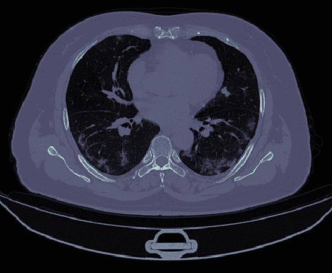

# 第九章：使用多个工具的案例研究

在本章中，我们将讨论如果您需要使用“其他”工具来处理特定的数据科学流水线时应该怎么做。Python 拥有丰富的工具来处理各种数据格式。RStats 拥有大量高级数学函数的仓库。Scala 是大数据处理引擎（如 Apache Spark 和 Apache Flink）的默认语言。在任何一种语言中都存在成本高昂且难以复制的旧程序。

Kubeflow 的一个非常重要的好处是用户不再需要选择哪种语言最适合他们的整个流水线，而是可以针对每个作业使用最佳语言（只要语言和代码可以容器化）。

我们将通过一个全面的例子演示这些概念，即去噪 CT 扫描。低剂量 CT 扫描允许临床医生通过传递辐射剂量的一小部分来使用扫描作为诊断工具——然而，这些扫描通常受到白噪声增加的影响。CT 扫描以 DICOM 格式呈现，并且我们将使用一个包含名为`pydicom`的专用库的容器来加载和处理数据为一个`numpy`矩阵。

存在多种去噪 CT 扫描方法；然而，它们通常侧重于数学理论，而非实际实现。我们将介绍一种开源方法，该方法使用*奇异值分解*（SVD）将图像分解为组件，其中“最不重要”的部分通常是噪声。我们使用 Apache Spark 和 Apache Mahout 库进行奇异值分解。最后，我们再次使用 Python 对 CT 扫描进行去噪并可视化结果。

# **去噪 CT 扫描示例**

计算机断层扫描（CT 扫描）被用于广泛的医疗目的。这些扫描通过从多个角度获取 X 射线，并形成图像“切片”，然后可以堆叠以创建人体内部的三维图像。在美国，健康专家建议一个人在一生中接受的辐射不超过 100 毫西弗（mSv），相当于约 25 次胸部 CT 扫描（每次约 7 毫西弗）。

在二十世纪末和二十一世纪初，对所谓的“低剂量” CT 扫描进行了大量研究。低剂量胸部 CT 扫描仅释放 1 至 2 毫西弗（mSv）的辐射，但代价是图像更加嘈杂，这可能会增加阅读难度。这些扫描是习惯性吸烟者筛查肺癌的常用工具。

这种低剂量 CT 扫描的成本是生成图像质量较低或更嘈杂。在 2000 年代，对去噪这些低剂量 CT 扫描进行了大量研究。大多数论文仅呈现方法和结果（无代码）。此外，FDA 限制了可用于去噪 CT 扫描的方法，这导致几乎所有解决方案都是专有且昂贵的。去噪旨在通过去除这些低剂量 CT 扫描中经常存在的白噪声来提高图像质量。

在撰写本书时，被广为人知的新型冠状病毒 COVID-19 已经升级为全球大流行。已经证明，胸部 CT 扫描比逆转录聚合酶链式反应（RT-PCR）检测更具敏感性，尤其是在感染的早期阶段。

随着多个 CT 扫描库的上线，并请求 AI 研究人员协助抗击大流行病，我们致力于基于现成的开源组件添加一种去噪 CT 扫描的方法。我们将使用 Python、Apache Spark、Apache Mahout（一个专门用于分布式线性代数的 Spark 库）和 Kubeflow。

我们不会深入讨论这里正在做的数学内容，但我们强烈建议您参考这篇论文。¹

在这个例子中，我们将专注于使用 Kubeflow 执行此技术的“如何”，并鼓励读者在管道的末尾添加自己的步骤，然后可以自由地与其他研究人员分享。

## 使用 Python 进行数据准备

CT 扫描图像通常以 DICOM 格式存储。在这种格式中，图像的每个“切片”都存储在自己的文件中，同时包含一些关于图像的元数据，例如像素之间的间距和切片之间的间距。我们希望读取所有这些文件并创建一个像素值的 3D 张量。然后，我们希望将该张量“展平”为一个二维矩阵，以便进行奇异值分解。

有几个地方可以获取 DICOM 文件集。在本文中，我们从 [*https://coronacases.org*](https://coronacases.org) 获取了一些（尽管下载 DICOM 可能有点棘手）。您可以在其他地方找到 DICOM 文件，例如来自医生的 CT 扫描光盘、以及其他在线地点。² 重要的是，我们需要一个包含单个 CT 扫描所有 DICOM 文件的目录。我们假设在目录 `/data/dicom` 中存在 *某些* DICOM 文件集组成的单个 CT 扫描。

如果你已经准备好了正确的依赖项，将 DICOM 图像转换为张量实际上非常简单。我们将使用 `pydicom`，这是一个与 DICOM 图像工作的良好支持的 Python 接口。不幸的是，`pydicom` Docker 镜像不包括 Grassroots DICOM（GDCM），后者是将 DICOM 转换为像素数组所必需的。我们解决这个问题的方法是使用 `pydicom` Docker 容器作为基础镜像，然后构建一个兼容的 GDCM 版本。我们得到的镜像我们命名为 `rawkintrevo/covid-prep-dicom`。有了 `pydicom` 和 GDCM，将 DICOM 图像转换为张量就很容易；我们将使用一个轻量级 Python 函数来完成剩余的工作（参见 示例 9-1）。

##### 示例 9-1\. 轻量级 Python 函数将 DICOM 转换为张量

```
def dicom_to_matrix(input_dir: str, output_file: str) -> output_type:
    import pydicom 
    import numpy as np

    def dicom_to_tensor(path): 
        dicoms = [pydicom.dcmread(f"{path}/{f}") for f in listdir(path)]
        slices = [d for d in dicoms if hasattr(d, "SliceLocation")]
        slices = sorted(slices, key=lambda s: s.SliceLocation)

        img_shape = list(slices[0].pixel_array.shape)
        img_shape.append(len(slices))
        img3d = np.zeros(img_shape)

        for i, s in enumerate(slices):
            img2d = s.pixel_array
            img3d[:, :, i] = img2d

        return {"img3d": img3d, "img_shape": img_shape}

    m = dicom_to_tensor(f"{input_dir}")
    np.savetxt(output_file, m['img3d'].reshape((-1,m['img_shape'][2])), delimiter=",") 
    return None

dicom_to_matrix_op = comp.func_to_container_op(
        dicom_to_matrix,
        base_image='rawkintrevo/covid-prep-dicom:0.8.0.0')
```


我们的导入必须在函数内进行（而不是全局的）。


此函数读取“切片”列表，它们本身是 2D 图像，并将它们堆叠成 3D 张量。


我们使用`numpy`将 3D 张量重塑为 2D 矩阵。

接下来，让我们考虑使用 Apache Spark 和 Apache Mahout 对我们的 CT 扫描进行去噪处理。

## 使用 Apache Spark 进行 DS-SVD

分布式随机奇异值分解（DS-SVD）背后的数学远远超出了本书的范围；然而，我们建议您在*Apache Mahout: Beyond MapReduce*中，或者在[Apache Mahout 网站](https://oreil.ly/T3VUE)或前述论文中进一步了解。

我们希望将 CT 扫描分解为一组特征，然后丢弃最不重要的特征，因为这些可能是噪音。因此，让我们使用 Apache Spark 和 Apache Mahout 来分解 CT 扫描。

Apache Mahout 的一个显著特性是其“R-Like”领域特定语言，它使得用 Scala 编写的数学代码易于阅读。在示例 9-2 中，我们将数据加载到 Spark RDD 中，将 RDD 包装在 Mahout 分布式行矩阵（DRM）中，并对矩阵执行 DS-SVD，从而得到三个矩阵，然后我们将它们保存。

##### 示例 9-2\. 使用 Spark 和 Mahout 分解 CT 扫描

```
val pathToMatrix = "gs://covid-dicoms/s.csv" 

val voxelRDD:DrmRdd[Int]  = sc.textFile(pathToMatrix)
  .map(s => dvec( s.split(",")
  .map(f => f.toDouble)))
  .zipWithIndex
  .map(o => (o._2.toInt, o._1))

val voxelDRM = drmWrap(voxelRDD) 

// k, p, q should all be cli parameters // k is rank of the output, e.g., the number of eigenfaces we want out. // p is oversampling parameter, // and q is the number of additional power iterations // Read https://mahout.apache.org/users/dim-reduction/ssvd.html val k = args(0).toInt
val p = args(1).toInt
val q = args(2).toInt

val(drmU, drmV, s) = dssvd(voxelDRM.t, k, p, q) 

val V = drmV.checkpoint().rdd.saveAsTextFile("gs://covid-dicoms/drmV")
val U = drmU.t.checkpoint().rdd.saveAsTextFile("gs://covid-dicoms/drmU")

sc.parallelize(s.toArray,1).saveAsTextFile("gs://covid-dicoms/s") 
```


加载数据。


将 RDD 包装在 DRM 中。


执行 DS-SVD。


保存输出。

所以只需几行 Scala 代码，我们就能执行一个基于外存的奇异值分解。

## 可视化

在 R 和 Python 中有许多用于可视化的优秀库，我们希望使用其中之一来可视化我们的去噪 DICOM。我们还希望将最终的图像保存到比持久卷容器（PVC）更持久的位置，以便稍后查看我们的图像。

管道的这个阶段将有三个步骤：

1.  下载由 DS-SVD 生成的 DRM。

1.  将矩阵重新组合成 DICOM，通过将矩阵*s*的一些对角线值设为零来去噪。

1.  视觉化以图形方式呈现去噪 DICOM 的切片。

###### 注意

可视化可以轻松在 R 或 Python 中完成。我们将在 Python 中进行，但使用 R 中的`oro.dicom`包。我们选择 Python 是因为 Google 正式支持用 Python API 与 Cloud Storage 进行交互。

### 下载 DRM

回想一下，DRM 实际上只是 RDD 的包装器。在云存储桶中，它将被表示为一个“部分”矩阵的目录。为了下载这些文件，我们使用了示例 9-3 中展示的辅助函数。

##### 示例 9-3\. 下载 GCS 目录的辅助函数

```
def download_folder(bucket_name = 'your-bucket-name',
                    bucket_dir = 'your-bucket-directory/',
                    dl_dir= "local-dir/"):
    storage_client = storage.Client()
    bucket = storage_client.get_bucket(bucket_name)
    blobs = bucket.list_blobs(prefix=bucket_dir)  # Get list of files
    for blob in blobs:
        filename = blob.name.replace('/', '_')
        blob.download_to_filename(dl_dir + filename)  # Download
```

在撰写本文时，Mahout 与 Python 的集成很少（这段代码没有 PySpark 的等效代码）。

此外，没有用于将 Mahout DRMs 读入 Python NumPy 数组的辅助函数，因此我们必须编写另一个辅助函数来帮助我们完成（在示例 9-4 中显示）。

##### 示例 9-4\. 辅助函数，用于将 Mahout DRMs 读入 NumPy 矩阵

```
def read_mahout_drm(path):
    data = {}
    counter = 0
    parts = [p for p in os.listdir(path) if "part"] 
    for p in parts:
        with open(f"{path}/{p}", 'r') as f:
            lines = f.read().split("\n")
            for l in lines[:-1]:
                counter +=1
                t = literal_eval(l)
                arr = np.array([t[1][i] for i in range(len(t[1].keys()))])
                data[t[0]] = arr
    print(f"read {counter} lines from {path}")
    return data
```


请记住，大多数 Mahout DRMs 将在文件的“部分”中，因此我们必须迭代这些部分来重构矩阵。

### 重新构建矩阵以生成去噪图像

在奇异值分解中，奇异值的对角矩阵通常用σ表示。然而，在我们的代码中，我们使用字母`s`。按照惯例，这些值通常从最重要到最不重要排序，并且幸运的是，Mahout 实现遵循了这一惯例。为了去噪图像，我们只需将对角线的最后几个值设为零。这个想法是，最不重要的基础向量可能代表我们希望消除的噪声（参见示例 9-5）。

##### 示例 9-5\. 用于写入多个图像的循环

```
percs = [0.001, 0.01, 0.05, 0.1, 0.3]

for p in range(len(percs)):
    perc = percs[p]
    diags = [diags_orig[i]
             if i < round(len(diags) - (len(diags) * perc))
             else 0
             for i in range(len(diags))] 
    recon = drmU_p5 @ np.diag(diags) @ drmV_p5.transpose() 
    composite_img = recon.transpose().reshape((512,512,301)) 
    a1 = plt.subplot(1,1,1)
    plt.imshow(composite_img[:, :, 150], cmap=plt.cm.bone) 
    plt.title(f"{perc*100}% denoised.  (k={len(diags)}, oversample=15, power_iters=2)")
    a1.set_aspect(1.0)
    plt.axis('off')
    fname = f"{100-(perc*100)}%-denoised-img.png"
    plt.savefig(f"/tmp/{fname}")
    upload_blob(bucket_name, f"/tmp/{fname}", f"/output/{fname}") 
```


将最后`p`%的奇异值设为零。


`@` 是“矩阵乘法”操作符。


我们假设我们的原始图像是 512 x 512 x 301 个切片，这可能对您的情况正确或不正确。


取第 150 个切片。


我们将在下一节讨论此函数。

现在在我们的存储桶中，我们将在`/output/`文件夹中有几张图像，命名为去噪的百分比。

我们的输出是 DICOM 一个切片的图像。相反，我们可以输出几个完整的 DICOM 文件（每个去噪级别一个），然后可以在 DICOM 查看器中查看，尽管完整的示例有点复杂，超出了本文的范围。如果您对此输出感兴趣，我们建议阅读[`pydicom`的文档](https://oreil.ly/_1-sT)。

## CT 扫描去噪管道

要创建我们的管道，我们将首先为我们的 Spark 作业创建一个清单，该清单将指定要使用的图像，要使用的密钥以挂载哪些存储桶，以及各种其他信息。然后，我们将使用我们之前步骤中的容器和我们定义的清单创建一个管道，该管道将输出 DICOM 图像的一个切片的 PNG 格式，去除不同程度的噪音。

### Spark 操作清单

Spark 从 GCS 读取/写入文件，因为它与 ReadWriteOnce（RWO）PVC 存在问题。我们需要从 GCS 下载输出，然后上传。

Apache Spark 操作员不喜欢从 ReadWriteOnce PVC 读取。如果您的 Kubernetes 使用这些操作员，并且无法请求 ReadWriteMany（例如在 GCP 上的情况），那么您将需要使用其他存储来存储将要分解的原始矩阵。

到目前为止，我们的大部分容器都使用了 `ContainerOp`。由于 Spark 作业实际上可能包含多个容器，我们将使用一个更通用的`ResourceOp`。定义 `ResourceOp` 给了我们更多的力量和控制，但这也以 Python API 不那么美观为代价。要定义一个 `ResourceOp`，我们必须定义一个清单（参见 示例 9-6），并将其传递给 `ResourceOp` 的创建（请参阅下一节）。

##### 示例 9-6\. Spark 操作清单

```
container_manifest = {
    "apiVersion": "sparkoperator.k8s.io/v1beta2",
    "kind": "SparkApplication",
    "metadata": {
        "name": "spark-app", 
        "namespace": "kubeflow"
    },
    "spec": {
        "type": "Scala",
        "mode": "cluster",
        "image": "docker.io/rawkintrevo/covid-basis-vectors:0.2.0",
        "imagePullPolicy": "Always",
        "hadoopConf": { 
            "fs.gs.project.id": "kubeflow-hacky-hacky",
            "fs.gs.system.bucket": "covid-dicoms",
            "fs.gs.impl" : "com.google.cloud.hadoop.fs.gcs.GoogleHadoopFileSystem",
            "google.cloud.auth.service.account.enable": "true",
            "google.cloud.auth.service.account.json.keyfile": "/mnt/secrets/user-gcp-sa.json",
        },
        "mainClass": "org.rawkintrevo.covid.App",
        "mainApplicationFile": "local:///covid-0.1-jar-with-dependencies.jar",
        # See the Dockerfile
        "arguments": ["245", "15", "1"],
        "sparkVersion": "2.4.5",
        "restartPolicy": {
            "type": "Never"
        },
        "driver": {
            "cores": 1,
            "secrets":  ![2
                {"name": "user-gcp-sa",
                 "path": "/mnt/secrets",
                 "secretType": "GCPServiceAccount"
                 }
            ],

            "coreLimit": "1200m",
            "memory": "512m",
            "labels": {
                "version": "2.4.5",
            },
            "serviceAccount": "spark-operatoroperator-sa", # also try spark-operatoroperator-sa
        },
        "executor": {
            "cores": 1,
            "secrets":  ![2
                {"name": "user-gcp-sa",
                 "path": "/mnt/secrets",
                 "secretType": "GCPServiceAccount"
                 }
            ],
            "instances": 4, 
            "memory": "4084m"
        },
        "labels": {
            "version": "2.4.5"
        },

    }
}
```


应用程序的名称：您可以使用`kubectl logs spark-app-driver`在控制台上查看进度。


不同的云提供商在这里使用略有不同的配置。


我们在一个非常大的矩阵上进行分解，如果有余力，可能需要提供更多资源。

###### 注意

因为我们正在访问 GCP，所以我们需要基于`gcr.io/spark-operator/spark:v2.4.5-gcs-prometheus`这个镜像，它包含了用于访问 GCP 的额外的 JAR 包（否则我们将使用`gcr.io/spark-operator/spark:v2.4.5`）。

尽管这是为 GCP 调整的，但在配置上进行非常少量的更改，特别是在密钥周围，这很容易转移到 AWS 或 Azure。

如果您熟悉 Kubernetes，您可能已经习惯于将清单表示为 YAML 文件。在这里，我们创建了一个包含 Python 字典的清单。接下来，我们将在我们的流水线定义中使用这个字典来创建一个`ResourceOp`。

### 流水线

最后，我们拥有了所有必要的组件。我们将创建一个将它们串联在一起的流水线，以便为我们创建一个可重复操作。

回顾一下，示例 9-7 进行以下操作：

+   从 GCP 下载 CT 扫描到本地 PVC。

+   将 CT 扫描（DICOM 文件）转换为矩阵（*s.csv*）。

+   Spark 作业进行分布式随机奇异值分解，并将输出写入 GCP。

+   将分解的矩阵重新组合，其中一些奇异值被设为零，从而去噪图像。

##### 示例 9-7\. CT 扫描去噪流水线

```
from kfp.gcp import use_gcp_secret
@kfp.dsl.pipeline(
    name="Covid DICOM Pipe v2",
    description="Visualize Denoised CT Scans"
)
def covid_dicom_pipeline():
    vop = kfp.dsl.VolumeOp(
        name="requisition-PVC",
        resource_name="datapvc",
        size="20Gi", #10 Gi blows up...
        modes=kfp.dsl.VOLUME_MODE_RWO
    )
    step1 = kfp.dsl.ContainerOp( 
        name="download-dicom",
        image="rawkintrevo/download-dicom:0.0.0.4",
        command=["/run.sh"],
        pvolumes={"/data": vop.volume}
    )
    step2 = kfp.dsl.ContainerOp( 
        name="convert-dicoms-to-vectors",
        image="rawkintrevo/covid-prep-dicom:0.9.5",
        arguments=[
            '--bucket_name', "covid-dicoms",
        ],
        command=["python", "/program.py"],
        pvolumes={"/mnt/data": step1.pvolume}
    ).apply(kfp.gcp.use_gcp_secret(secret_name='user-gcp-sa')) 
    rop = kfp.dsl.ResourceOp( 
        name="calculate-basis-vectors",
        k8s_resource=container_manifest,
        action="create",
        success_condition="status.applicationState.state == COMPLETED"
    ).after(step2)
    pyviz = kfp.dsl.ContainerOp( 
        name="visualize-slice-of-dicom",
        image="rawkintrevo/visualize-dicom-output:0.0.11",
        command=["python", "/program.py"],
        arguments=[
            '--bucket_name', "covid-dicoms",
        ],
    ).apply(kfp.gcp.use_gcp_secret(secret_name='user-gcp-sa')).after(rop)

kfp.compiler.Compiler().compile(covid_dicom_pipeline,"dicom-pipeline-2.zip")
client = kfp.Client()

my_experiment = client.create_experiment(name='my-experiments')
my_run = client.run_pipeline(my_experiment.id, 'my-run1', 'dicom-pipeline-2.zip')
```


此容器未进行讨论，但其简单地从 GCP 存储桶下载图像到我们的本地 PVC。


在此，我们将 DICOM 转换为矩阵并上传到指定的 GCP 存储桶。


这是计算奇异值分解的 Spark 作业。


这就是 DICOM 图像重建的地方。


对于 GCP 我们 `use_gcp_secret`，但是 Azure 和 AWS 也有类似的功能。

为了说明，图 9-1 到 9-3 是 DICOM 图像在不同去噪水平上的切片。由于我们不是放射学专家，我们不会试图指出质量变化或最佳选择，除了指出在 10% 去噪时我们可能做得太过头了，在 30% 时毫无疑问是如此。



###### 图 9-1\. 原始 DICOM 切片


###### 图 9-2\. 1% 去噪 DICOM 切片（左）；5% 去噪 DICOM 切片（右）


###### 图 9-3\. 10% 去噪 DICOM 切片（左）；.5% 去噪 DICOM 切片（右）

再次看到，尽管此流水线现在是为 GCP 硬编码的，但只需更新几行代码即可将其更改为与 AWS 或 Azure 兼容；具体来说，是如何将秘密挂载到容器中的。这样做的一个重要优势是我们能够安全地将密码与代码解耦。

# 分享流水线

Kubeflow 的另一个重要优势是实验的可重现性。尽管在学术界经常被强调，但在商业环境中，可重现性也是一个重要的概念。通过容器化流水线步骤，我们可以消除隐藏的依赖项，使程序不再只能在一个设备上运行，或者换句话说，可重现性可以防止您开发一个只能在某人的机器上运行的算法。

我们在这里呈现的流水线应该可以在任何 Kubeflow 部署上运行。³ 这也允许快速迭代。任何读者都可以将此流水线用作基础，例如可以创建一个最终步骤，在此步骤中对去噪图像和原始图像执行一些深度学习，以比较去噪的效果。

# 结论

现在我们已经看到如何通过利用包含大部分甚至所有所需依赖项的容器来创建非常易于维护的流水线。这不仅消除了必须维护具有所有这些依赖项的系统的技术债务，还使得程序更易于转移，并且我们的研究更易于转移和重现。

存在着一个庞大且令人兴奋的 Docker 容器星系，很可能您已经在现有容器中 Dockerize 了一些步骤。能够利用这些容器作为 Kubeflow 流水线步骤的一部分，无疑是 Kubeflow 的最大优势之一。

¹ 完整的论文可以在 [这里](https://oreil.ly/OXrFs) 找到。

² [北美放射学会](https://oreil.ly/VI-V0) 希望尽快发布 COVID-19 CT 扫描的存储库。

³ 针对不使用 GCE 部署的微调。
