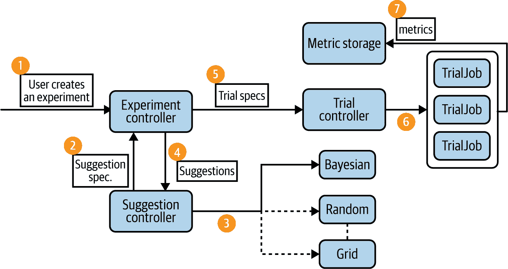
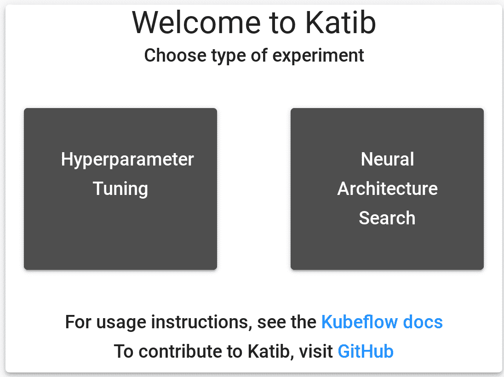
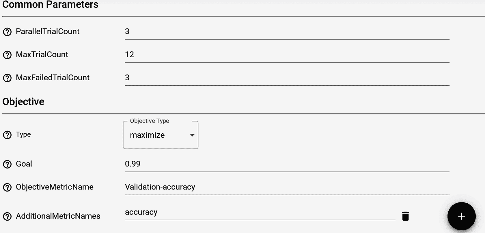
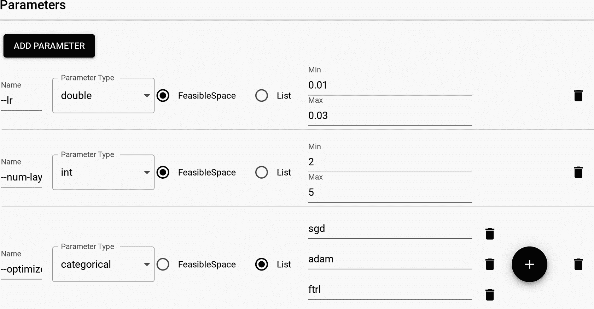
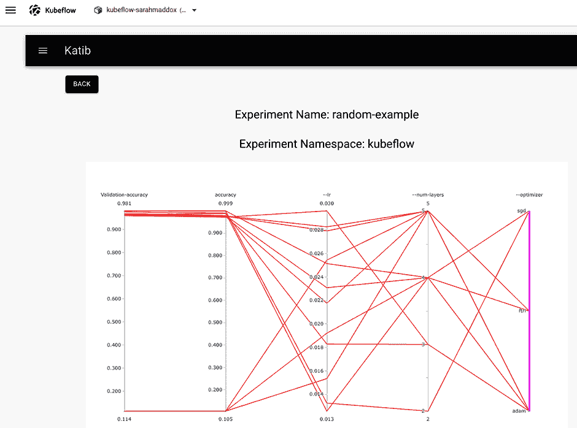
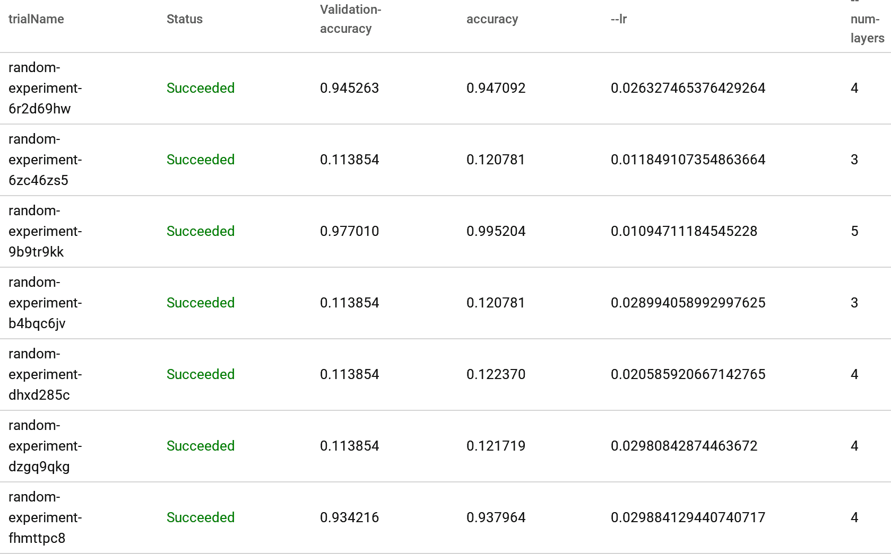
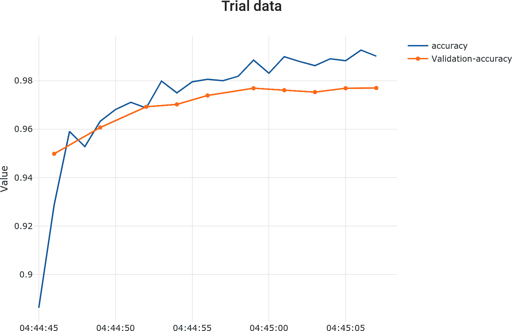

# 第十章：超参数调整和自动化机器学习

在前几章中，我们已经看到 Kubeflow 如何帮助完成机器学习的各个阶段。但是，了解每个阶段该做什么——无论是特征准备、训练还是部署模型——都需要一定的专业知识和实验。根据[“无免费午餐”定理](https://oreil.ly/H_IHi)，没有单一的模型适用于每个机器学习问题，因此每个模型必须经过精心构建。如果每个阶段需要大量人工输入，那么完全构建一个性能优异的模型可能会非常耗时和昂贵。

自然地，人们可能会想：是否可能自动化机器学习过程的部分或整体？我们是否可以减少数据科学家的工作量，同时保持高质量的模型？

在机器学习中，解决这些问题的总称是*自动化机器学习*（AutoML）。这是一个不断发展的研究领域，并已在实际应用中找到其位置。AutoML 试图通过减少在机器学习的更加耗时和迭代的阶段中的手动交互的需求，简化机器学习过程，无论是对专家还是非专家。

在本章中，我们将看到 Kubeflow 如何用于自动化超参数搜索和神经架构搜索，这是 AutoML 的两个重要子领域。

# 自动机器学习（AutoML）概述

AutoML 指的是自动化机器学习过程中的各种流程和工具。在高层次上，AutoML 涉及解决以下一个或多个问题的算法和方法：

数据预处理

机器学习需要数据，原始数据可以来自不同来源且格式各异。为了使原始数据有用，通常需要人类专家逐行查看数据，规范化数值，删除错误或损坏的数据，并确保数据一致性。

特征工程

使用过少的输入变量（或“特征”）训练模型可能导致模型不准确。然而，使用过多的特征也可能会导致问题；学习过程会变慢且消耗资源，可能会出现过拟合问题。找到合适的特征集可能是构建机器学习模型中最耗时的部分。自动特征工程可以加速特征提取、选择和转换的过程。

模型选择

一旦您拥有了所有的训练数据，就需要为您的数据集选择合适的训练模型。理想的模型应尽可能简单，同时又能提供良好的预测精度。

超参数调整

大多数学习模型有一些与模型外部相关的参数，例如学习率、批大小和神经网络中的层数。我们称这些参数为*超参数*，以区别于由学习过程调整的模型参数。超参数调整是自动化搜索这些参数的过程，以提高模型的准确性。

神经架构搜索。

与超参数调整相关的一个领域是*神经架构搜索*（NAS）。NAS 不是选择每个超参数值的固定范围，而是进一步实现自动化，生成一个整个神经网络，优于手工设计的架构。NAS 的常见方法包括强化学习和进化算法。

本章重点讨论后两个问题——超参数调整和神经架构搜索。由于它们相关，可以使用类似的方法来解决。

# 使用 Kubeflow Katib 进行超参数调整。

在第七章中提到，我们需要设置几个超参数。在机器学习中，超参数是在训练过程开始之前设置的参数（与从训练过程中学习的模型参数相对）。超参数的示例包括学习率、决策树数量、神经网络中的层数等。

超参数优化的概念非常简单：选择导致最佳模型性能的一组超参数值。超参数调整框架就是做这件事的工具。通常，这样的工具的用户会定义几件事情：

+   超参数及其有效值范围的列表（称为*搜索空间*）。

+   用于衡量模型性能的度量标准。

+   用于搜索过程的方法论。

Kubeflow 打包了[Katib](https://oreil.ly/BW4TM)，一个用于超参数调整的通用框架。在类似的开源工具中，Katib 有几个显著的特点：

它是 Kubernetes 原生的。

这意味着 Katib 实验可以在 Kubernetes 运行的任何地方移植。

它具有多框架支持。

Katib 支持许多流行的学习框架，并提供 TensorFlow 和 PyTorch 分布式训练的一流支持。

它是与语言无关的。

训练代码可以用任何语言编写，只要它构建为 Docker 镜像。

###### 注意。

*Katib* 这个名字在阿拉伯语中意为“秘书”或“书记”，是对启发其最初版本的 Vizier 框架的致敬（“vizier” 在阿拉伯语中是大臣或高级官员的意思）。

在本章中，我们将看看 Katib 如何简化超参数优化。

# Katib 概念。

让我们从定义几个对 Katib 工作流程至关重要的术语开始（如图 10-1 所示）：

实验。

一个实验是一个端到端的过程，它涉及一个问题（例如，调整手写识别训练模型）、一个目标指标（最大化预测准确率）和一个搜索空间（超参数的范围），并生成最终的最优超参数值集合。

建议

建议是我们试图解决的问题的一个可能解决方案。因为我们试图找到导致最佳模型性能的超参数值组合，一个建议将是指定搜索空间中的一组超参数值。

试验

试验是实验的一次迭代。每个试验接受一个建议，并执行一个生成评估指标的工作进程（通过 Docker 打包）。Katib 的控制器然后基于先前的指标计算出下一个建议，并生成新的试验。



###### 图 10-1\. Katib [系统工作流程](https://oreil.ly/BW4TM)

###### 注意

在 Katib 中，实验、建议和试验都是自定义资源。这意味着它们存储在 Kubernetes 中，并且可以使用标准 Kubernetes API 进行操作。

超参数调优的另一个重要方面是如何找到下一组参数。截至本文撰写时，Katib 支持以下搜索算法：

网格搜索

也称为参数扫描，网格搜索是最简单的方法——穷举指定搜索空间中的所有可能参数值。虽然资源密集型，但网格搜索具有高并行性的优势，因为任务是完全独立的。

随机搜索

与网格搜索类似，随机搜索中的任务是完全独立的。随机搜索尝试通过随机选择生成参数值，而不是枚举每个可能的值。当需要调整的超参数很多（但只有少数对模型性能有显著影响时），随机搜索可以大大优于网格搜索。当离散参数的数量很高时，使得网格搜索不可行时，随机搜索也很有用。

贝叶斯优化

这是一种使用概率和统计来寻找更好参数的强大方法。贝叶斯优化构建了一个针对目标函数的概率模型，找到在模型上表现良好的参数值，然后根据试验运行期间收集的指标迭代更新模型。直观地说，贝叶斯优化通过做出明智的猜测来改进模型。这种优化方法依赖于先前的迭代来找到新的参数，并且可以并行化。虽然试验并非像网格搜索或随机搜索那样独立，但贝叶斯优化能够通过较少的总试验次数找到结果。

超带

这是一种相对新的方法，它随机选择配置值。 但与传统的随机搜索不同，Hyperband 仅对每个试验进行少量迭代的评估。 然后，它采用表现最佳的配置，并更长时间地运行它们，重复此过程直到达到所需的结果。 由于它与随机搜索的相似性，任务可以高度并行化。

其他实验性算法

这些包括使用[Goptuna](https://oreil.ly/PDGOg)优化框架实现的 Parzen 估计树（TPE）和协方差矩阵适应进化策略（CMA-ES）。

Katib 中拼图的最后一部分是指标收集器。 这是在每次试验后收集和解析评估指标并将它们推送到持久数据库中的过程。 Katib 通过一个 sidecar 容器实现指标收集，该容器与 pod 中的主容器并行运行。

总的来说，Katib 的设计使其具有高度可扩展性、可移植性和可扩展性。 由于它是 Kubeflow 平台的一部分，Katib 本身原生支持与 Kubeflow 的许多其他训练组件集成，如 TFJob 和 PyTorch 运算符。 Katib 还是第一个支持多租户的超参数调整框架，使其非常适合云托管环境。

# 安装 Katib

默认情况下安装了 Katib。 要将 Katib 安装为独立服务，您可以使用 Kubeflow GitHub 存储库中的以下脚本：

```
git clone https://github.com/kubeflow/katib
bash ./katib/scripts/v1beta1/deploy.sh
```

如果您的 Kubernetes 集群不支持动态卷配置，您还将创建一个持久卷：

```
pv_path=https://raw.githubusercontent.com/kubeflow/katib/master/manifests\
/v1beta1/pv/pv.yaml
kubectl apply -f pv_path
```

安装完 Katib 组件后，您可以导航到 Katib 仪表板以验证其运行状态。 如果您通过 Kubeflow 安装了 Katib 并且有一个端点，只需导航到 Kubeflow 仪表板并在菜单中选择“Katib”。 否则，您可以设置端口转发以测试部署：

```
kubectl port-forward svc/katib-ui -n kubeflow 8080:80
```

然后导航到：

```
http://localhost:8080/katib/
```

# 运行您的第一个 Katib 实验

现在，Katib 已在您的集群中运行起来了，让我们看看如何运行一个实际的实验。 在本节中，我们将使用 Katib 来调整一个简单的 MNist 模型。 您可以在[Katib 的 GitHub 页面](https://oreil.ly/tdSM_)上找到源代码和所有配置文件。

## 准备您的训练代码

第一步是准备您的训练代码。 由于 Katib 运行试验评估的训练作业，每个训练作业都需要打包为 Docker 容器。 Katib 是语言无关的，因此您如何编写训练代码并不重要。 但是，为了与 Katib 兼容，训练代码必须满足一些要求：

+   超参数必须公开为命令行参数。 例如：

```
python mnist.py --batch_size=100 --learning_rate=0.1
```

+   指标必须以与指标收集器一致的格式公开。 Katib 目前通过标准输出、文件、TensorFlow 事件或自定义支持指标收集。 最简单的选项是使用标准指标收集器，这意味着评估指标必须以以下格式写入 stdout：

```
metrics_name=metrics_value
```

我们将使用的示例训练模型代码可以在 [此 GitHub 网站](https://oreil.ly/USb-Y) 找到。

准备好训练代码后，将其简单打包为 Docker 镜像即可使用。

## 配置实验

一旦你准备好训练容器，下一步就是为你的实验编写规范。Katib 使用 Kubernetes 自定义资源来表示实验。可以从 [这个 GitHub 页面](https://oreil.ly/nwbbJ) 下载 示例 10-1。

##### 示例 10-1\. 示例实验规范

```
apiVersion: "kubeflow.org/v1beta1"
kind: Experiment
metadata:
  namespace: kubeflow
  labels:
    controller-tools.k8s.io: "1.0"
  name: random-example
spec:
  objective:               
    type: maximize
    goal: 0.99
    objectiveMetricName: Validation-accuracy
    additionalMetricNames:
      - Train-accuracy
  algorithm:               
    algorithmName: random
  parallelTrialCount: 3    
  maxTrialCount: 12
  maxFailedTrialCount: 3
  parameters:              
    - name: --lr
      parameterType: double
      feasibleSpace:
        min: "0.01"
        max: "0.03"
    - name: --num-layers
      parameterType: int
      feasibleSpace:
        min: "2"
        max: "5"
    - name: --optimizer
      parameterType: categorical
      feasibleSpace:
        list:
        - sgd
        - adam
        - ftrl
  trialTemplate:           
    goTemplate:
        rawTemplate: |-
          apiVersion: batch/v1
          kind: Job
          metadata:
            name: {{.Trial}}
            namespace: {{.NameSpace}}
          spec:
            template:
              spec:
                containers:
                - name: {{.Trial}}
                  image: docker.io/kubeflowkatib/mxnet-mnist
                  command:
                  - "python3"
                  - "/opt/mxnet-mnist/mnist.py"
                  - "--batch-size=64"
                  {{- with .HyperParameters}}
                  {{- range .}}
                  - "{{.Name}}={{.Value}}"
                  {{- end}}
                  {{- end}}
                restartPolicy: Never
```

这是相当多的内容需要跟进。让我们仔细查看 `spec` 部分的每个部分：


*目标。* 这里是你配置如何衡量训练模型性能以及实验目标的地方。在这个实验中，我们试图最大化验证准确率指标。如果达到 0.99（99% 准确率）的目标，我们会停止实验。`additionalMetricsNames` 表示从每个试验中收集的指标，但不用于评估试验。


*算法。* 在这个实验中，我们使用随机搜索；有些算法可能需要额外的配置。


*预算配置。* 这里是我们配置实验预算的地方。在这个实验中，我们将并行运行 3 个试验，总共运行 12 个试验。如果有三个试验失败，我们也会停止实验。这最后一部分也被称为 *错误预算* —— 在维护生产级系统正常运行时间方面是一个重要的概念。


*参数。* 这里我们定义想要调整的参数以及每个参数的搜索空间。例如，`学习率` 参数在训练代码中以 `--lr` 暴露，是一个双精度浮点数，搜索空间在 0.01 到 0.03 之间。


*试验模板。* 实验规范的最后部分是配置每个试验的模板。对于本例子，唯一重要的部分是：

```
    image: docker.io/kubeflowkatib/mxnet-mnist
    command:
      - "python3"
      - "/opt/mxnet-mnist/mnist.py"
      - "--batch-size=64"
```

这应该指向您在前一步中构建的 Docker 镜像，其命令行入口点用于运行代码。

## 运行实验

一切配置完成后，应用资源以启动实验：

```
kubectl apply -f random-example.yaml
```

您可以通过运行以下命令来检查实验的状态：

```
kubectl -n kubeflow describe experiment random-example
```

在输出中，你应该看到类似 示例 10-2 的内容。

##### 示例 10-2\. 示例实验输出

```
Name:         random-example
Namespace:    kubeflow
Labels:       controller-tools.k8s.io=1.0
Annotations:  <none>
API Version:  kubeflow.org/v1beta1
Kind:         Experiment
Metadata:
  Creation Timestamp:  2019-12-22T22:53:25Z
  Finalizers:
    update-prometheus-metrics
  Generation:        2
  Resource Version:  720692
  Self Link:         /apis/kubeflow.org/v1beta1/namespaces/kubeflow/experiments/random-example
  UID:               dc6bc15a-250d-11ea-8cae-42010a80010f
Spec:
  Algorithm:
    Algorithm Name:        random
    Algorithm Settings:    <nil>
  Max Failed Trial Count:  3
  Max Trial Count:         12
  Metrics Collector Spec:
    Collector:
      Kind:  StdOut
  Objective:
    Additional Metric Names:
      accuracy
    Goal:                   0.99
    Objective Metric Name:  Validation-accuracy
    Type:                   maximize
  Parallel Trial Count:     3
  Parameters:
    Feasible Space:
      Max:           0.03
      Min:           0.01
    Name:            --lr
    Parameter Type:  double
    Feasible Space:
      Max:           5
      Min:           2
    Name:            --num-layers
    Parameter Type:  int
    Feasible Space:
      List:
        sgd
        adam
        ftrl
    Name:            --optimizer
    Parameter Type:  categorical
  Trial Template:
    Go Template:
      Raw Template:  apiVersion: batch/v1
kind: Job
metadata:
  name: {{.Trial}}
  namespace: {{.NameSpace}}
spec:
  template:
    spec:
      containers:
      - name: {{.Trial}}
        image: docker.io/kubeflowkatib/mxnet-mnist-example
        command:
        - "python"
        - "/mxnet/example/image-classification/train_mnist.py"
        - "--batch-size=64"
        {{- with .HyperParameters}}
        {{- range .}}
        - "{{.Name}}={{.Value}}"
        {{- end}}
        {{- end}}
      restartPolicy: Never
Status:                                       
  Conditions:
    Last Transition Time:  2019-12-22T22:53:25Z
    Last Update Time:      2019-12-22T22:53:25Z
    Message:               Experiment is created
    Reason:                ExperimentCreated
    Status:                True
    Type:                  Created
    Last Transition Time:  2019-12-22T22:55:10Z
    Last Update Time:      2019-12-22T22:55:10Z
    Message:               Experiment is running
    Reason:                ExperimentRunning
    Status:                True
    Type:                  Running
  Current Optimal Trial:                      
    Observation:
      Metrics:
        Name:   Validation-accuracy
        Value:  0.981091
    Parameter Assignments:
      Name:          --lr
      Value:         0.025139701133432946
      Name:          --num-layers
      Value:         4
      Name:          --optimizer
      Value:         sgd
  Start Time:        2019-12-22T22:53:25Z
  Trials:            12                       
  Trials Running:    2
  Trials Succeeded:  10
Events:              <none>
```

输出中的一些有趣部分包括：


*状态.* 在这里，您可以看到实验的当前状态及其先前的状态。


*当前最佳试验.* 这是目前为止的“最佳”试验，即通过我们预定义的度量确定的表现最佳的试验。您还可以查看该试验的参数和指标。


*Trials Succeeded/Running/Failed.* 在本节中，您可以查看实验的进展情况。

## Katib 用户界面

或者，您可以使用 Katib 的用户界面（UI）提交和监视您的实验。如果您有 Kubeflow 部署，可以通过在导航面板中单击“Katib”，然后在主页面中单击“超参数调整”来访问 Katib UI，如 图 10-2 所示。



###### 图 10-2\. Katib UI 主页面

让我们提交我们的随机搜索实验（参见 图 10-3）。您可以简单地在此处粘贴一个 YAML，或者通过 UI 生成一个 YAML。要执行此操作，请单击“参数”选项卡。



###### 图 10-3\. 配置新实验，第一部分

您应该看到一个面板，类似于 图 10-4。在此页面上输入必要的配置参数；定义运行预算和验证指标。



###### 图 10-4\. 配置新实验，第二部分

然后，滚动页面并通过配置搜索空间和试验模板完成其余的实验。对于后者，您可以保持默认模板不变。完成后，单击“部署”。

现在实验正在运行中，您可以监视其状态，并查看进度的可视图表（参见 图 10-5）。通过在 Katib 仪表板中导航到下拉菜单，然后选择“UI”，然后选择“监视”，可以查看正在运行和已完成的实验。



###### 图 10-5\. 用于实验的 Katib UI

在此图表下方，您将看到每个试验的详细分析（如 图 10-6 所示），每个试验的超参数值以及最终的度量值。这对比较某些超参数对模型性能的影响非常有用。



###### 图 10-6\. 实验的 Katib 指标

由于我们还在实时收集验证指标，因此实际上可以为每个试验绘制图表。单击一行以查看模型如何在给定的超参数值下随时间表现（如 图 10-7 所示）。



###### 图 10-7\. 每次试验的度量指标

# 调整分布式训练工作

在第七章中，我们看到了使用 Kubeflow 来编排分布式训练的示例。如果我们想要使用 Katib 来调整分布式训练工作的参数，该怎么办？

好消息是，Katib 原生支持与 TensorFlow 和 PyTorch 分布式训练的集成。TensorFlow 的 MNIST 示例可以在这个[Katib GitHub 页面](https://oreil.ly/I3q4x)找到。这个示例使用了我们在第七章中看到的相同的 MNIST 分布式训练示例，并直接集成到 Katib 框架中。在示例 10-3 中，我们将启动一个实验来调整分布式 TensorFlow 作业的超参数（学习率和批次大小）。

##### 示例 10-3\. 分布式训练示例

```
apiVersion: "kubeflow.org/v1beta1"
kind: Experiment
metadata:
  namespace: kubeflow
  name: tfjob-example
spec:
  parallelTrialCount: 3             
  maxTrialCount: 12
  maxFailedTrialCount: 3
  objective:                        
    type: maximize
    goal: 0.99
    objectiveMetricName: accuracy_1
  algorithm:
    algorithmName: random
  metricsCollectorSpec:             
    source:
      fileSystemPath:
        path: /train
        kind: Directory
    collector:
      kind: TensorFlowEvent
  parameters:                       
    - name: learning_rate
      parameterType: double
      feasibleSpace:
        min: "0.01"
        max: "0.05"
    - name: batch_size
      parameterType: int
      feasibleSpace:
        min: "100"
        max: "200"
  trialTemplate:
    trialParameters:
      - name: learningRate
        description: Learning rate for the training model
        reference: learning_rate
      - name: batchSize
        description: Batch Size
        reference: batch_size
    trialSpec:
      apiVersion: "kubeflow.org/v1"
      kind: TFJob
      spec:
        tfReplicaSpecs:             
          Worker:
            replicas: 2
            restartPolicy: OnFailure
            template:
              spec:
                containers:
                  - name: tensorflow
                    image: gcr.io/kubeflow-ci/tf-mnist-with-summaries:1.0
                    imagePullPolicy: Always
                    command:
                      - "python"
                      - "/var/tf_mnist/mnist_with_summaries.py"
                      - "--log_dir=/train/metrics"
                      - "--learning_rate=${trialParameters.learningRate}"
                      - "--batch_size=${trialParameters.batchSize}"
```


总试验和并行试验计数与之前的实验类似。在这种情况下，它们指的是要运行的总分布式训练作业数和并行数。


目标规范也类似——在这种情况下，我们希望最大化`accuracy`度量。


度量收集器规范看起来略有不同。这是因为这是一个 TensorFlow 作业，我们可以直接使用 TensorFlow 输出的 TFEvents。通过使用内置的`TensorFlowEvent`收集器类型，Katib 可以自动解析 TensorFlow 事件并填充度量数据库。


参数配置完全相同——在这种情况下，我们调整模型的学习率和批次大小。


如果你读过第七章，那么试验模板应该很熟悉——这是我们之前运行过的相同分布式训练示例规范。这里的重要区别在于，我们已经将`learning_rate`和`batch_size`的输入参数化了。

所以现在你已经学会了如何使用 Katib 来调整超参数。但请注意，你仍然需要自己选择模型。我们能进一步减少人工工作量吗？关于 AutoML 的其他子领域呢？在接下来的部分中，我们将看看 Katib 如何支持整个人工神经网络的生成。

# 神经架构搜索

神经结构搜索（NAS）是自动化机器学习中不断发展的一个子领域。与超参数调整不同，后者选择了模型，我们的目标是通过调整少量旋钮来优化其性能；而 NAS 则试图生成网络架构本身。最近的研究表明，NAS 在图像分类、目标检测和语义分割等任务上可以胜过手工设计的神经网络。¹

大多数 NAS 方法可以归类为 *生成* 方法或 *变异* 方法。在 *生成* 方法中，算法会在每次迭代中提出一个或多个候选架构。这些提议的架构随后会在下一次迭代中进行评估和优化。在 *变异* 方法中，首先提出一个过度复杂的架构，随后的迭代会尝试修剪模型。

Katib 目前支持两种 NAS 实现方法：*可微结构搜索（DARTS）*² 和 *高效神经结构搜索（ENAS）*³。DARTS 通过将搜索空间从离散变为连续来实现 NAS 的可扩展性，并利用梯度下降优化架构。ENAS 则采用不同的方法，观察到大多数 NAS 算法在训练每个子模型时会出现瓶颈。ENAS 强制每个子模型共享参数，从而提高整体效率。

Katib 中 NAS 的一般工作流程与超参数搜索类似，额外增加了构建模型架构的步骤。Katib 的一个内部模块，称为 *模型管理器*，负责接收拓扑配置和变异参数，并构建新模型。然后，Katib 使用相同的试验和指标概念来评估模型的性能。

例如，可以查看使用 DARTS 进行 NAS 实验的规范，在 示例 10-4 中。

##### 示例 10-4\. 示例 NAS 实验规范

```
apiVersion: "kubeflow.org/v1beta1"
kind: Experiment
metadata:
  namespace: kubeflow
  name: darts-example-gpu
spec:
  parallelTrialCount: 1
  maxTrialCount: 1
  maxFailedTrialCount: 1
  objective:
    type: maximize
    objectiveMetricName: Best-Genotype
  metricsCollectorSpec:
    collector:
      kind: StdOut
    source:
      filter:
        metricsFormat:
          - "([\\w-]+)=(Genotype.*)"
  algorithm:
    algorithmName: darts
    algorithmSettings:
      - name: num_epochs
        value: "3"
  nasConfig:                     
    graphConfig:
      numLayers: 3
    operations:
      - operationType: separable_convolution
        parameters:
          - name: filter_size
            parameterType: categorical
            feasibleSpace:
              list:
                - "3"
      - operationType: dilated_convolution
        parameters:
          - name: filter_size
            parameterType: categorical
            feasibleSpace:
              list:
                - "3"
                - "5"
      - operationType: avg_pooling
        parameters:
          - name: filter_size
            parameterType: categorical
            feasibleSpace:
              list:
                - "3"
      - operationType: max_pooling
        parameters:
          - name: filter_size
            parameterType: categorical
            feasibleSpace:
              list:
                - "3"
      - operationType: skip_connection
  trialTemplate:
    trialParameters:
      - name: algorithmSettings
        description: Algorithm settings of DARTS Experiment
        reference: algorithm-settings
      - name: searchSpace
        description: Search Space of DARTS Experiment
        reference: search-space
      - name: numberLayers
        description: Number of Neural Network layers
        reference: num-layers
    trialSpec:
      apiVersion: batch/v1
      kind: Job
      spec:
        template:
          spec:
            containers:
              - name: training-container
                image: docker.io/kubeflowkatib/darts-cnn-cifar10
                imagePullPolicy: Always
                command:
                  - python3
                  - run_trial.py
                  - --algorithm-settings="${trialParameters.algorithmSettings}"
                  - --search-space="${trialParameters.searchSpace}"
                  - --num-layers="${trialParameters.numberLayers}"
                resources:
                  limits:
                    nvidia.com/gpu: 1
            restartPolicy: Never
```


NAS 实验的一般结构与超参数搜索实验类似。规范的大部分内容应该非常熟悉；最重要的区别是添加了 `nasConfig`。这里可以配置想要创建的神经网络的规范，如层数、每层的输入和输出以及操作类型。

# Katib 相比其他框架的优势

有许多类似的开源系统用于超参数搜索，其中包括 [NNI](https://oreil.ly/lDwpN)、[Optuna](https://oreil.ly/gAHgZ)、[Ray Tune](https://oreil.ly/CnNFZ) 和 [Hyperopt](https://oreil.ly/jlfoP)。此外，Katib 的原始设计灵感来源于 [Google Vizier](https://oreil.ly/q1xiz)。虽然这些框架在配置并行超参数扫描时具有许多与 Katib 类似的功能，例如使用多种算法，但 Katib 的几个特性使其独特：

设计旨在同时服务用户和管理员

大多数调整框架旨在为*用户*——进行调整实验的数据科学家提供服务。Katib 也被设计为使*系统管理员*的生活更轻松，他负责维护基础设施、分配计算资源和监控系统健康状态。

云原生设计

其他框架（例如 Ray Tune）可能支持与 Kubernetes 的集成，但通常需要额外的设置集群的工作。相比之下，Katib 是第一个完全基于 Kubernetes 设计的超参数搜索框架；其每一个资源都可以通过 Kubernetes API 进行访问和操作。

可扩展和可移植

由于 Katib 使用 Kubernetes 作为其编排引擎，因此很容易扩展实验。您可以在笔记本电脑上运行相同的实验进行原型设计，并在生产集群上部署作业，只需对规格进行最少的更改。相比之下，其他框架则需要根据硬件可用性进行额外的安装和配置工作。

可扩展的

Katib 提供了灵活和可插拔的接口，用于其搜索算法和存储系统。大多数其他框架都带有预设的算法列表，并且具有硬编码的指标收集机制。在 Katib 中，用户可以轻松实现自定义搜索算法，并将其集成到框架中。

本地支持

Katib 原生支持高级功能，如分布式训练和神经架构搜索。

# 结论

在本章中，我们快速概述了 AutoML，并学习了如何通过自动化超参数搜索等技术加速机器学习模型的开发。通过自动化的超参数调整技术，您可以在保持高模型质量的同时扩展模型的开发。

我们随后使用了 Katib——来自 Kubeflow 平台的 Kubernetes 原生调整服务——来配置和执行超参数搜索实验。我们还展示了如何使用 Katib 的仪表板提交、跟踪和可视化您的实验。

我们还探讨了 Katib 如何处理神经架构搜索（NAS）。Katib 目前支持 NAS 的两种方法——DARTS 和 ENAS，并将继续进行更多开发。

希望这些内容能为您提供一些关于如何利用 Katib 来减少机器学习工作流中工作量的见解。Katib 仍然是一个不断发展的项目，您可以在[Katib GitHub 页面](https://oreil.ly/OHFAL)上关注最新的发展动态。

感谢您加入我们一起学习 Kubeflow 的旅程。我们希望 Kubeflow 能够满足您的需求，并帮助您利用机器学习的能力为您的组织带来价值。为了了解最新的 Kubeflow 变化，请加入[Kubeflow Slack 工作空间和邮件列表](https://oreil.ly/4fT2i)。

¹ T. Elsken, J. H. Metzen, F. Hutter, “神经架构搜索：一项调查,” *机器学习研究杂志* 20 (2019), [*https://oreil.ly/eO-CV*](https://oreil.ly/eO-CV), pp. 1-21.

² H. Liu, K. Simonyan, and Y. Tang, “可微架构搜索（DARTS）,” [*https://oreil.ly/JSAIX*](https://oreil.ly/JSAIX).

³ H. Pham 等人，“通过参数共享实现高效的神经架构搜索”，[*https://oreil.ly/SQPxn*](https://oreil.ly/SQPxn)。
