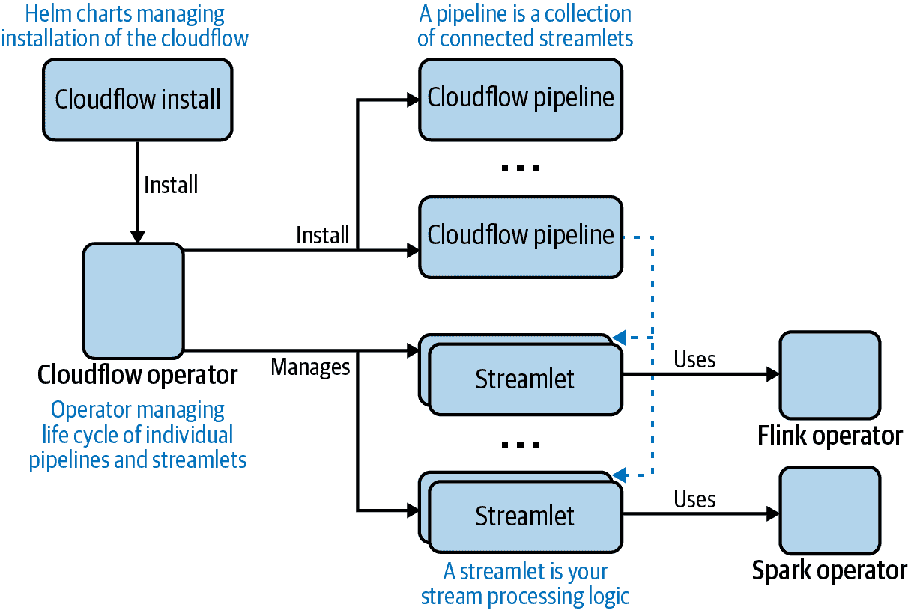
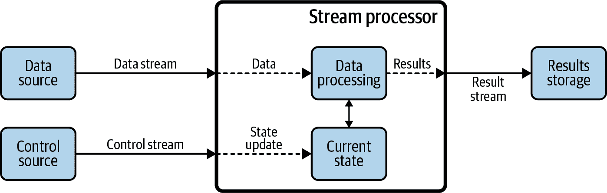
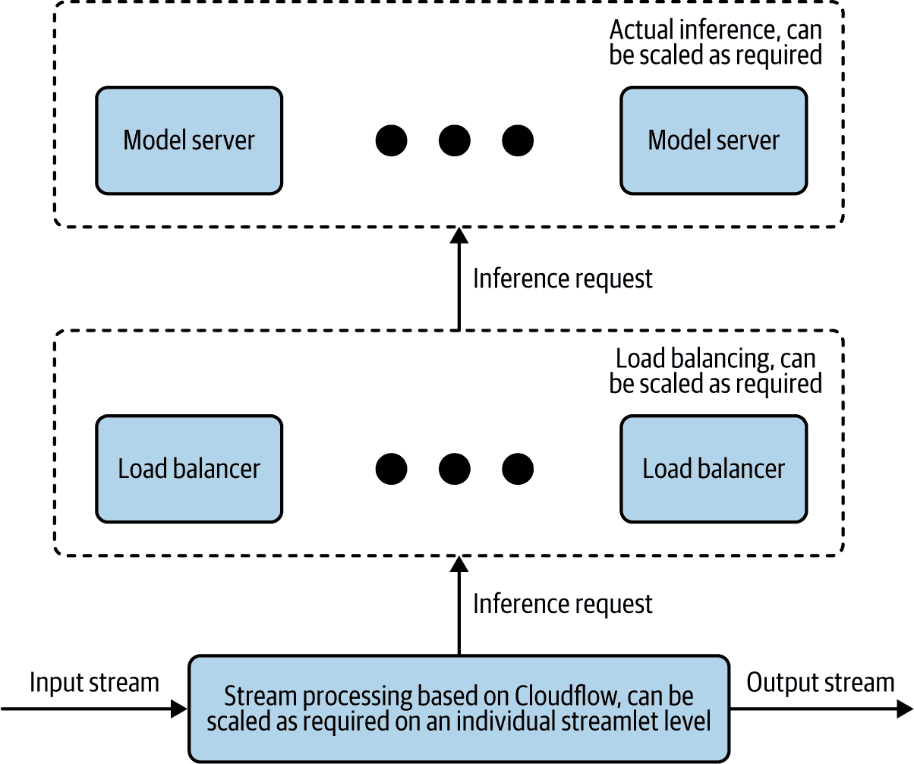

# 附录 C. 在应用程序中使用模型服务

在第八章中，您学习了 Kubeflow 提供的暴露模型服务器的不同方法。正如那里所描述的，Kubeflow 提供多种部署训练模型和提供运行模型推断的 REST 和 gRPC 接口的方式。然而，它在为自定义应用程序使用这些模型提供支持方面还不足。在这里，我们将介绍一些利用 Kubeflow 暴露的模型服务器构建应用程序的方法。

在涉及利用模型推断的应用程序时，它们可以大致分为两类：实时和批处理应用程序。在实时/流式应用程序模型中，推断是直接在生成或接收的数据上进行的。在这种情况下，通常一次只有一个请求可用，并且可以在其到达时用于推理。在批处理场景中，所有数据都是一开始就可用的，并且可以顺序或并行用于推理。我们将从流式使用案例开始，然后看看可能的批处理实现。

# 利用模型服务构建流应用程序

如今大多数流应用程序利用[Apache Kafka](https://kafka.apache.org)作为系统的数据骨干。实现流应用程序本身的两种可能选项是：使用流处理引擎和使用流处理库。

## 流处理引擎和库

如《定义流处理引擎执行语义》一文所定义的¹，现代流处理引擎基于将计算组织成块并利用集群架构。²将计算分成块可以实现执行并行性，其中不同块在同一台机器的不同线程上运行，或者在不同的机器上运行。它还通过将执行块从失败的机器移动到健康机器来实现故障转移。此外，现代引擎支持的检查点进一步提高了基于集群的执行的可靠性。

反之，流处理库是带有特定领域语言的库，提供一组构造来简化构建流应用程序。这些库通常不支持分发和/或集群——这通常留给开发者来实现。

由于这些选项听起来相似，它们通常可以互换使用。实际上，正如 Jay Kreps 在他的博客中[概述的](https://oreil.ly/hzK4d)，流处理引擎和流处理库是两种构建流应用程序的非常不同的方法，选择其中之一是权衡功能和简易性。如前所述，流处理引擎提供更多功能，但需要开发人员遵循它们的编程模型和部署要求。他们通常也需要更陡峭的学习曲线来掌握其功能。另一方面，流处理库通常更易于使用，提供更多灵活性，但需要特定的部署、扩展性和负载平衡实现。

当今最流行的[流处理引擎](https://oreil.ly/h7bKa)包括以下内容：

+   [Apache Spark](https://spark.apache.org)

+   [Apache Flink](https://flink.apache.org)

+   [Apache Beam](https://beam.apache.org)

最受欢迎的流处理库有：

+   [Apache Kafka streams](https://oreil.ly/phyB-)

+   [Akka streams](https://oreil.ly/-qlfT)

所有这些都可以作为构建流应用程序的平台，包括模型服务。³

数据艺术家（现在是 Vervetica）和 Confluent 团队联合完成的流处理引擎（Flink）和流处理库（Kafka streams）的[比较](https://oreil.ly/LehcG)也强调了流处理引擎和库之间的另一个区别：企业所有权。流处理引擎通常由企业范围的单元集中拥有和管理，而流处理库通常由个别开发团队监管，这通常使其采纳变得更加简单。流处理引擎非常适合需要这些引擎提供的开箱即用功能的应用程序，包括跨集群的并行扩展性和高吞吐量，事件时间语义，检查点功能，内置支持监控和管理，以及流和批处理混合处理。使用引擎的缺点是您受制于它们提供的编程和部署模型。

相反，流处理库提供的编程模型允许开发人员按照符合其精确需求的方式构建应用程序或微服务，并将它们部署为简单的独立的 Java 应用程序。但在这种情况下，他们需要自己实施扩展性、高可用性和监控解决方案（基于 Kafka 的实现通过利用 Kafka 支持其中的一些解决方案）。

## 介绍 Cloudflow

实际上，大多数流应用程序实现需要使用多个引擎和库来构建单个应用程序，这会导致额外的集成和维护复杂性。通过使用像[Cloudflow](https://cloudflow.io)这样的开源项目，可以显著减轻这些问题，它允许您快速开发、编排和操作基于 Kubernetes 的分布式流应用程序。Cloudflow 支持将流应用程序构建为一组小型、可组合的组件，这些组件通过基于模式的契约与 Kafka 连接并相互连接。这种方法可以显著提高重用性，并允许您极大地加速流应用程序的开发。在撰写本文时，此类组件可以使用 Akka Streams 实现；Flink 和 Spark 流支持 Kafka Streams 正在即将到来。Cloudflow 的整体架构在图 C-1 中展示。

###### 图 C-1\. Cloudflow 架构

Cloudflow 的核心是 Cloudflow 操作员，负责部署/撤销、管理和扩展管道和单个 streamlet。操作员还利用现有的[Flink](https://oreil.ly/pg2JL)和[Spark](https://oreil.ly/J2umN)操作员来管理 Flink 和 Spark streamlet。提供的一组 Helm 图表支持操作员和支持组件的简单安装。

构建流式应用程序时的一个常见挑战是在进入生产之前将所有组件连接在一起并进行端到端测试。Cloudflow 通过允许您验证组件之间的连接并在开发期间本地运行应用程序来解决此问题，以避免部署时的意外。

在 Cloudflow 中，一切都是在应用程序的上下文中完成的，该应用程序代表一个由数据流通过 Kafka 连接的自包含分布式系统（图形）的数据处理服务。

Cloudflow 支持：

开发

通过生成大量样板代码，使开发人员可以专注于业务逻辑。

构建

它提供了从业务逻辑到可部署 Docker 镜像的所有工具。

部署

它提供了 Kubernetes 工具，可以通过单个命令部署您的分布式应用程序。

操作

它为您的分布式流式应用程序提供了获取洞察力、可观察性和生命周期管理的所有工具。Cloudflow 直接支持的另一个重要操作关注点是能够扩展流的各个组件。

当使用 Cloudflow 实现流式应用程序时，模型服务器调用通常由基于[动态控制流](https://oreil.ly/Wijie)模式的单独 streamlet⁴实现。

在 图 C-2 中，一个实现包含一个状态，状态是指在使用模型服务进行推断时模型服务服务器的 URL。⁵ 在这种情况下的实际数据处理是通过调用模型服务器来获取推断结果。此调用可以使用 REST 或 gRPC（或模型服务器支持的任何其他接口）进行。

###### 图 C-2\. 动态控制的流模式

这个状态可以通过额外的 Kafka 主题进行更新，允许在不重新部署应用程序的情况下切换 URL（例如模型服务器部署移动的情况）。这个状态被数据处理器用于处理传入的数据。

可以向应用程序引入额外的流片段（具有相同的架构），以获取模型服务的见解，例如解释和漂移检测（详见“模型监控”）。

# 构建利用模型服务的批处理应用程序

典型的批处理应用程序通过读取包含所有样本的数据集来实现，然后处理它们，为每一个调用模型服务器。最简单的批处理应用程序实现是顺序执行，逐个处理数据元素。虽然这样的实现能够工作，但由于处理每个元素的网络开销，性能并不理想。

加速处理的一种流行方法是使用批处理。例如，TFServing 支持 [两种批处理方法](https://oreil.ly/v7LFl)：服务器端批处理和客户端批处理。

TFServing 默认支持服务器端批处理。⁶ 要启用批处理，设置 `--enable_batching` 和 `--batching_parameters_file` 标志。为了在延迟和吞吐量之间取得最佳平衡，请选择适当的批处理参数。⁷ 可以在 [这个 TFServing GitHub 仓库](https://oreil.ly/TecPs) 中找到一些关于 CPU 和 GPU 使用的参数值建议。

达到服务器端完整批处理后，推断请求在内部合并为一个大请求（张量），并在合并请求上运行一个 Tensorflow 会话。您需要使用异步客户端请求来填充服务器端批处理。在单个会话上运行一批请求是真正利用 CPU/GPU 并行性的地方。

客户端批处理只是在客户端将多个输入分组到一起以进行单个请求。

虽然批处理可以显著提高批量推断的性能，但通常不足以达到性能目标。另一种提高性能的流行方法是多线程。⁸ 此方法背后的想法是部署多个模型服务器实例，将数据处理分成多个线程，并允许每个线程为其负责的部分数据进行推断。

通过流处理实现多线程的一种方法是通过流处理实现批处理。这可以通过实现软件组件⁹读取源数据并将每个记录写入 Kafka 进行处理来实现。这种方法有效地将批处理转换为流处理，以允许通过如图 C-3 所示的架构实现更好的可伸缩性。

###### 图 C-3\. 使用流处理进行批量服务实现

这个部署包括三个层次：

+   基于 Cloudflow 的流处理，为每个流元素调用模型服务。此解决方案的每个流单元可以适当地扩展，以提供所需的吞吐量。

+   一个执行实际模型推断的模型服务器。通过更改模型服务器的数量，可以独立扩展此层次。

+   负载均衡器，例如 Istio 或 Ambassador，为推断 REST/gRPC 请求提供负载均衡。

因为此架构中的每一层都可以独立扩展，因此这样的架构可以为流和批处理用例提供相当可伸缩的模型服务解决方案。

¹ L. Affetti 等人，“定义流处理引擎的执行语义”，*大数据杂志* 4 (2017)，[*https://oreil.ly/TcI39*](https://oreil.ly/TcI39)。

² 与 MapReduce 架构进行比较。

³ 有关实现细节，请参阅报告《*机器学习模型服务*》(Serving Machine Learning Models)，以及[Kai Waehner 在 GitHub 上的项目](https://oreil.ly/8vtK3)。

⁴ 一些关于 TFServing 集成的实现示例可以在[这个 GitHub 仓库](https://oreil.ly/7cJ4O)中找到，而对于 Seldon 集成，则在[这个 GitHub 仓库](https://oreil.ly/6SqfJ)中找到。

⁵ 在使用嵌入模型的情况下，状态本身就是一个模型。

⁶ 详细信息请参阅[此 TFServing 文档](https://oreil.ly/iXsah)。

⁷ 有关可用参数的完整定义，请参阅[此 TFServing GitHub 仓库](https://oreil.ly/FoHx6)。

⁸ 与[MapReduce](https://oreil.ly/OHV3Q)编程模型进行比较。

⁹ 在基于 Cloudflow 的实现中，Streamlet。
