# 第一章：数据如何在机器学习中驱动决策制定

本章探讨了数据在企业中的角色及其对业务决策制定的影响。您还将了解机器学习（ML）工作流程的组成部分。您可能已经看过许多书籍、文章、视频和博客，它们在讨论 ML 工作流程时通常从数据收集开始。但是，在收集数据之前，您需要了解要收集什么类型的数据。这种 *数据理解* 只能通过了解您需要解决的问题或需要做出的决定来实现。

业务案例/问题定义和数据理解可以用来制定无代码或低代码的机器学习策略。无代码或低代码的机器学习项目战略方法具有几个优点/好处。正如介绍中所提到的，无代码自动 ML 方法使具有其专业领域知识但没有编码经验的任何人能够快速开发 ML 模型，而无需编写一行代码。这是开发 ML 应用程序的一种快速高效的方式。低代码方法使那些具有一些编码或深度编码经验的人能够快速开发 ML 应用程序，因为基本代码是自动生成的——并且可以添加任何额外的自定义代码。但是，任何 ML 项目都必须从定义目标、使用案例或问题开始。

# 目标或使用情况是什么？

企业、教育机构、政府机构和从业者面临许多反映 ML 实际应用的决策问题。例如：

+   如何增加我们的糖尿病网络应用程序中患者的参与度？

+   如何增加我们课程调查中学生反馈数量？

+   如何提高我们在发现针对公司网络的网络攻击速度上的效率？

+   我们是否可以减少进入我们电子邮件服务器的垃圾邮件数量？

+   如何减少我们制造生产线停机时间？

+   如何增加我们的客户保留率？

+   如何减少我们的客户流失（客户流失）率？

在这些示例中，必须检查许多数据源，以确定什么样的机器学习解决方案最适合解决问题或帮助决策制定。让我们以减少客户流失或损失率的使用案例为例——使用一个非常简单的例子。 *流失预测* 是识别最有可能离开您的服务或产品的客户。这个问题属于监督学习桶中的一个分类问题，有两个类别： “流失-是” 类和 “流失-否” 类。

从数据源的角度来看，您可能需要检查客户档案信息（姓名、地址、年龄、职位、就业声明）、购买信息（购买和账单历史记录）、互动信息（客户与您的产品进行互动的体验[数字化和实体]）、您的客户服务团队或您的数字支持服务。客户信息的流行数据来源包括客户关系管理系统、系统电子商务分析服务和客户反馈。实质上，客户“接触”的一切作为数据点应该被跟踪和捕捉为数据源。

您必须做出的决策的性质直接与您需要收集的数据紧密相关，这些数据需要制定为问题陈述。假设您负责一家生产雨伞的公司的市场营销工作，*业务目标*是增加销量。如果您降低现有雨伞的销售价格，您能预测将销售多少把雨伞吗？图 1-1 展示了考虑此选项的数据元素。

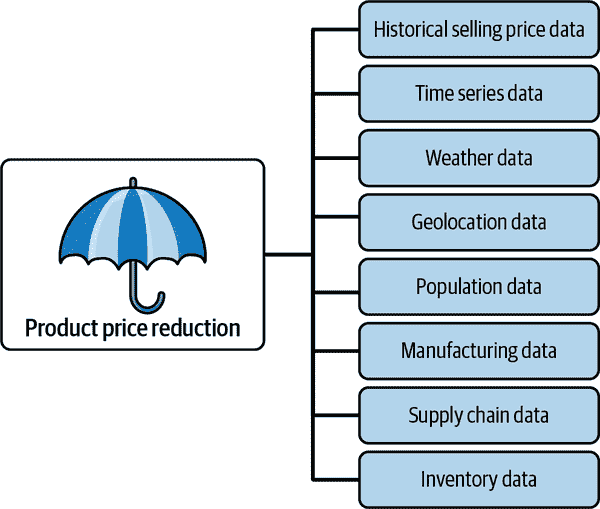

###### 图 1-1\. 影响价格降低策略以增加销量的数据元素。

如您在这个数据驱动的业务插图中所见，您的业务目标（增加销量）呈现出新的维度。您现在意识到，要理解产品价格降低，除了销售价格外，还需要包括其他数据维度。您需要了解特定地区的雨季情况、人口密度，以及您的库存是否足以满足通过降价增加销量的需求。您还需要查看历史数据与实时捕获的数据之间的差异。历史数据通常称为*批处理*，而实时数据捕获通常称为*流式处理*。随着这些额外的维度，业务目标突然变成了一个非常复杂的问题，因为可能需要这些附加列。对于任何组织来说，可能会存在数十个离散的数据源，每个数据源都需要特定的技能来理解它们之间的关系。图 1-2 展示了这一挑战的插图。

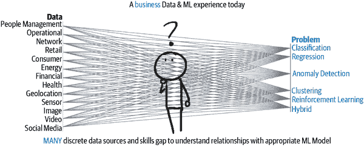

###### 图 1-2\. 今天的典型业务数据和机器学习经验。

那么这里的用例是什么？这取决于情况。您需要进行业务决策过程，这是通过提出问题、收集数据和评估备选方案来进行选择的过程。一旦确定用例或业务目标，您可以使用相同的数据训练机器以了解客户模式、发现趋势，并使用 AutoML 或低代码 AI 预测结果。图 1-3 显示我们的雨伞示例作为业务用例，然后导致数据源确定、ML 框架，最终进行预测。

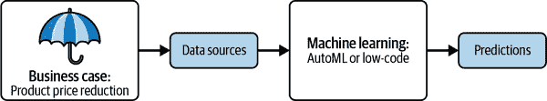

###### 图 1-3\. 使用 ML 框架进行预测的业务案例。

# 企业 ML 工作流程

决策过程帮助您识别问题或用例，而 ML 工作流帮助您实施解决方案。本节介绍了一个典型的 ML 工作流程。在我们持续讨论的雨伞示例中，您可以使用数据训练一个 ML 模型，使用提供无代码解决方案的 AutoML 服务来运行无监督 ML 聚类。从那里，您可以检查*数据点的聚类*以查看推导出的模式。或者，您可以决定仅仅专注于历史数据，以便基于一定数量的数据输入特征预测特定目标。您的企业 ML 工作流程将是什么样子呢？毫不奇怪，它是数据驱动的，并且在过程中需要决策。

ML 工作流程可以显示为一系列步骤，并且这些步骤可以组合成阶段。图 1-4 显示了 10 个步骤，我们稍后会简要讨论每个步骤。后续章节将提供每个步骤的更详细的示例。

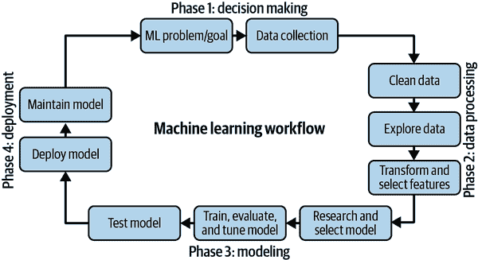

###### 图 1-4\. 十步 ML 工作流程。

## 确定业务目标或问题陈述

ML 工作流程始于定义具有明确边界的特定问题或问题。在此阶段，您试图定义范围和可行性。正确的问题将引导您确定需要的数据以及必须准备数据的潜在方法。值得注意的是，在分析数据时可能出现的任何问题都可以归类为表 1-1 中显示的五种 ML 类别之一。让我们继续使用我们的雨伞示例。

表 1-1\. 分析数据的类别

| 算法/模型 | 问题或疑问 |
| --- | --- |
| 回归问题 | 本月/本季度预计销售多少把雨伞？ |
| 分类问题 | 他们购买了直杆雨伞（A）还是可折叠雨伞（B）？ |
| 聚类问题 | 每月或每个地区销售了多少直杆雨伞？ |
| 异常检测问题 | Mojave 沙漠地区的雨伞销量是否高于俄勒冈州波特兰地区？ |
| 强化学习 | 公司政策是仅向欠款不超过$500 的客户发货。可以训练制造机器人根据此政策提取、包装、装载和发运直杆伞吗？ |

## 数据收集

在 21 世纪初期，公司、大学和研究人员通常依赖本地服务器/硬盘或数据中心来托管其数据库应用程序并存储其数据。依赖本地数据中心或甚至在数据中心租用服务器空间是昂贵的：需要维护服务器基础设施，更新软件，安装安全补丁，更换物理硬件等。在某些情况下，大量数据存储在一组机器中。

如今，为了节省成本，企业和教育机构已经转向云端来托管其数据库应用程序和存储其数据。云存储是云供应商提供的一种服务，用于存储文件，允许您上传不同的文件格式，或配置为自动接收来自不同数据源的文件。由于大多数机器学习模型是使用来自文件的数据进行训练的，将数据存储在云存储*存储桶*中可以实现轻松的数据收集。云存储桶可用于存储结构化和非结构化数据。

另一个存储数据文件以进行数据收集的选择是[*GitHub*](https://github.com)，这是一个设计用于协作编程项目的服务。您可以将数据存储在云中以备将来使用（免费），跟踪更改，并使数据公开可用以进行复制。这个选项有严格的文件大小限制为 100 MB，但有使用 Git Large File Storage (LFS) 的选项，这是一个用于对大文件进行版本控制的 GitHub 开源扩展。Git LFS 会在 Git 中用文本指针替换大文件（如数据集、音频样本、图形和视频），同时将文件内容存储在像[GitHub.com](https://github.com)或[GitHub Enterprise](https://github.com/enterprise)这样的远程服务器上。

数据收集的挑战在大型组织中更加复杂，因为存在许多不同类型的运营管理软件，例如企业资源规划、客户关系管理和生产系统，并且可能在不同的数据库上运行。数据也可能需要实时从外部来源获取，例如交货卡车的物联网传感器设备。因此，组织面临的挑战不仅是收集结构化数据，还包括批处理或实时（流式处理）中的非结构化和半结构化数据格式。图 1-5 显示了为结构化、非结构化和半结构化数据提供数据收集的各种数据元素。

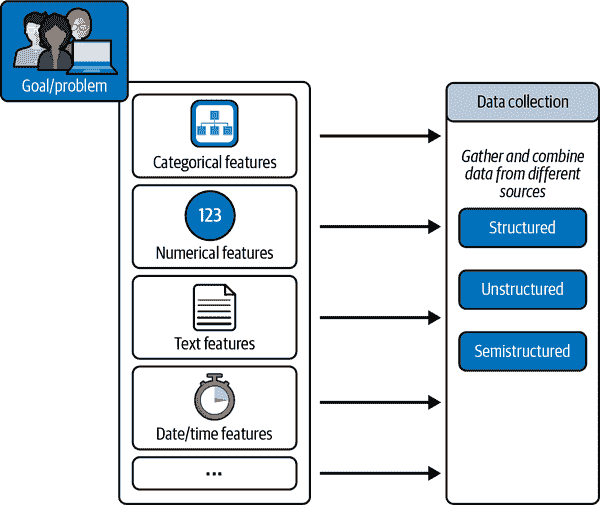

###### 图 1-5\. 目标/问题流向数据收集。

###### 注

可能存在流式结构化数据。结构化与非结构化是数据格式的属性。流式与批处理是延迟的属性。第二章提供了关于数据格式和属性的更多信息。

## 数据预处理

要进行数据清理，您需要处理缺失的数据值、重复项、异常数据、格式问题或由于人为错误导致不一致的数据。这是因为现实世界的数据通常是原始和混乱的，充满了假设。一个假设可能是你的数据具有正态分布，这意味着数据对称分布且没有偏斜，大多数值聚集在中心区域，从中心（均值或平均数）向外值的频率逐渐减少。

假设你的数据首次显示，八月份在加利福尼亚沙漠小镇帕姆斯普林斯售出的雨伞数量增加了。你的数据是否服从正态分布，还是被视为异常值？这是否会偏离对八月份雨伞销售预测结果的影响？当数据不服从正态分布时，需要进行*归一化*，即将所有记录分组到[0,1]或[-1,1]范围内，例如。你通过归一化数据集来更轻松、更快速地训练机器学习模型。归一化在第七章中有详细介绍。

###### 注意

如果存在异常值，这种最小-最大归一化的示例可能会产生不利影响。例如，当缩放到[0,1]时，它基本上将异常值映射为 1，并将所有其他值压缩为 0。处理异常值和异常情况超出了我们书本的范围。

因此，数据预处理可以意味着对数据进行归一化（使数据集中的数值列使用共同的尺度）和*缩放*数据，即转换数据以适应特定范围。幸运的是，Python 中只需几行[简单的代码](https://oreil.ly/50v98)就可以进行归一化和标准化。图 1-6 显示了归一化和标准化前后的实际数据。

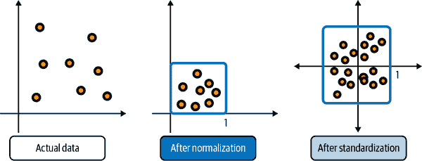

###### 图 1-6\. 实际数据、归一化和标准化数据的三张图片。

###### 注意

从单一来源收集数据可能是一个相对简单的过程。但是，如果你要将几个数据源聚合到一个文件中，请确保数据格式匹配，并验证关于时间序列数据的任何假设（或者你的机器学习模型所需的时间戳和日期范围）。一个常见的假设是数据是静止的——即统计属性（均值、方差等）随时间不变。

## 数据分析

探索性数据分析（EDA）是用于探索和分析数据结构的过程。在这一步骤中，您正在寻找趋势、模式、特征相关性以及诸如一个变量（特征）如何与另一个变量相关的信息。根据您尝试解决的问题类型，您必须选择相关的特征数据用于您的 ML 模型。这一步骤的结果是一个输入变量的特征列表，可以潜在地用于 ML。我们在第六章中介绍的实际操作的 EDA 可以找到。

图 1-7 和 1-8 是使用 Python 数据可视化库 Seaborn 绘制的 EDA 过程的结果（详见第六章中的数据集详情）。图 1-7 展示了 *x* 和 *y* 之间的*反向*关系。图 1-8 展示了 *热图*（或相关矩阵），并说明在温度较低时产生更多能量。

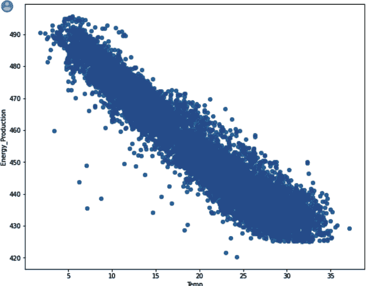

###### 图 1-7\. Seaborn `regplot` 显示在温度较低时产生更多能量。

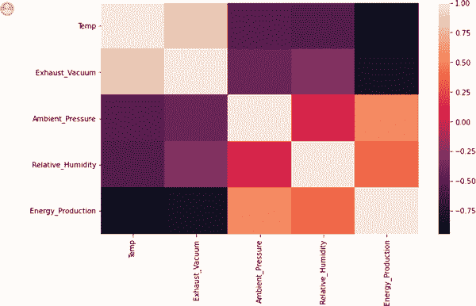

###### 图 1-8\. Seaborn 相关矩阵（热图）显示 `Temp` 和 `Energy_Production` 之间的强烈反向关系，-0.75。

## 数据转换和特征选择

在数据清理和分析之后，您会得到一个特征列表，用于解决 ML 问题。但是，其他特征可能也是相关的吗？这就是 *特征工程* 发挥作用的地方，您可以在原始数据集中创建新的特征。例如，如果您的数据集分别包含月份、日期和年份的字段/列，您可以将所有三个组合为“月-日-年”时间特征。特征工程是特征选择之前的最后一步。

实际上，特征选择分两个阶段进行：在 EDA 之后和数据转换之后。例如，在完成 EDA 后，您应该有一个潜在的特征列表，可以用来创建新的特征，例如，结合时间和星期几以获取一天中的小时。在进行特征工程之后，您将从中选择最终的特征列表。图 1-9 显示了在工作流程中进行数据转换和特征选择的位置。

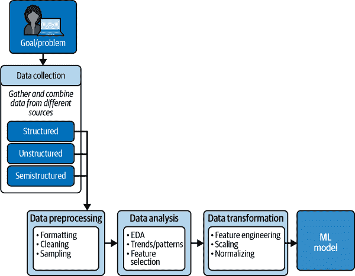

###### 图 1-9\. 在 ML 工作流程中数据转换和特征选择的位置。

## 研究模型选择或使用 AutoML（无代码解决方案）

在这一步中，您可以研究最适合您问题类型的模型，或者您可以使用 AutoML，这是一种基于您上传的数据集选择适当模型、训练、测试和生成评估指标的无代码解决方案。实质上，如果您使用 AutoML，模型选择、模型训练、模型调优和生成评估指标的繁重工作都为您完成。第三章介绍了 AutoML，而第四章开始实际使用 AutoML。请注意，使用低代码解决方案，您需要知道选择哪种模型。

虽然 AutoML 可能覆盖了您 80%的 ML 问题，但您可能希望构建一个更定制化的解决方案。在这种情况下，了解 ML 算法可以解决的问题类型是有帮助的。选择算法完全取决于问题本身（如前所述）。在表 1-2 中，“描述”列被添加以进一步描述 ML 模型的问题类型。

表 1-2. 描述模型类型

| 问题或疑问 | 问题 | 描述 |
| --- | --- | --- |
| 多少或多少把雨伞？ | 回归问题 | 回归算法用于处理连续和数值输出的问题。通常用于处理像“多少”或“多少”的问题。 |
| 他们购买了直杆雨伞（A）还是折叠雨伞（B）？ | 分类问题 | 输出只能是一组固定的输出类别之一，如是/否或真/假，称为分类问题。根据输出类别的数量，问题可以是二元分类问题或多元分类问题。 |
| 公司政策是仅向欠款$500 或更少的客户发货。我们的制造机器人可以根据这一政策被训练来提取、包装、装载和发运直杆雨伞到我们的客户吗？ | 强化学习 | 当根据学习经验做出决策时，使用强化算法。机器代理通过与不断变化的环境进行交互的试错学习行为。这提供了一种使用奖励和惩罚的概念来编程代理的方法，而无需指定任务如何完成。游戏程序和温度控制程序是使用强化学习的一些流行示例。 |

## 模型训练、评估和调优

在将 ML 模型部署到生产环境之前，必须对其进行训练、评估和测试。训练 ML 模型是一个过程，其中存储的数据实例被输入到 ML 模型（算法）中。由于每个存储的数据实例都有特定的特征（回想我们对不同类型、价格、销售地区等的雨伞示例），因此可以使用数百个变量检测这些数据实例的模式，算法因此能够从训练数据中学习如何基于数据进行一般化预测。

每个 ML 模型不仅需要进行训练，还需要进行评估。因此，需要保留一部分数据样本，称为*验证数据集*。验证集用于衡量模型对未见或新数据的一般化程度。训练错误用于确定模型对数据的拟合程度，因为这是模型训练的内容。

应选择或定义模型评估指标，以使其与问题或业务目标保持一致。模型调优应该通过评估指标来改善模型性能。例如，在 12 月销售的雨伞预测中，准确性如何？这些预测是否可以用于未来的预测工作？请注意，令人满意的性能应该由业务需求确定，并应在开始任何 ML 参与之前达成共识。

###### 注意

验证集也用于确定模型是否过拟合。第八章讨论了过拟合问题。

## 模型测试

在没有测试模型之前，无法知道你的雨伞预测应用程序是否可以推广到未来的预测工作。一旦训练数据集用于将模型拟合到数据上，验证数据集用于提高模型准确性，你就需要在模型从未见过的数据上测试模型。测试数据用于评估模型性能。

例如，假设你想构建一个可以根据雨伞图像识别颜色或图案的应用程序。你通过向模型提供每个都标记有特定颜色或图案的雨伞图像来训练模型。你在移动应用程序中使用该模型来识别任何雨伞的颜色或图案。测试就是要看模型在区分雨伞颜色和图案方面表现如何。

图 1-10 显示了训练、验证和测试数据集之间的关系。

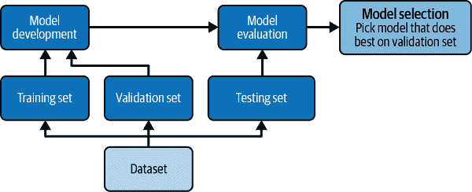

###### 图 1-10. 模型部署和模型评估中训练、验证和测试数据集之间的关系。

图 1-11 展示了训练、验证和测试数据集在五个步骤中的关系。为简单起见，没有显示回到第 5 步数据集的箭头，因为一旦将模型部署为应用程序并开始收集数据，新数据进入*管道*可能会*偏离*原始模型的结果。（在这一点上，您进入了机器学习运营的迷人领域，即 MLOps，这超出了本书的范围。）

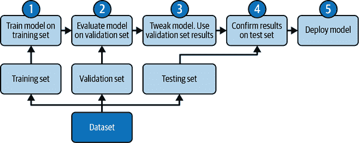

###### 图 1-11\. 机器学习工作流程的五个步骤。

## 模型部署（服务）

一旦机器学习模型经过训练、评估和测试，就会部署到实时生产环境中以供使用。请注意，当模型达到生产环境时，它很可能具有 Web 应用程序前端（使用浏览器），通过*应用程序编程接口*（API）与生产系统通信。数据可以实时捕获并流式传输（摄取）到 MLOps 管道中。或者数据可以批量捕获并存储以供后续摄入管道使用。或者两者兼而有之。

## 维护模型

当模型的预测与原始业务目标或用例指标不一致时，模型可能会变得*陈旧*。当世界变化或业务需求变化时，可能会发生陈旧现象。这些变化会影响模型。在部署后，您需要监控您的模型，以确保它继续按预期表现。模型和数据漂移是您应该预期并通过定期使用 MLOps 进行重新训练来减轻的现象。让我们来看一个数据*漂移*的例子，这意味着您训练的数据和现在从 Web 应用程序接收到的数据发生了变化。

在我们的综合示例中，曾经经历过大雨的地区现在正经历干旱条件。同样地，曾经经历干旱条件的地区现在正经历大雨。与天气和气候以及需要雨伞和伞类型相关的任何预测都将受到影响。在这种情况下，您需要使用新数据重新训练和测试新模型。

# 总结

企业、教育机构、政府机构和从业者面临许多决策，这些决策反映了机器学习的实际示例，从增加客户参与到减少客户流失。数据——其收集、分析和使用——驱动了用于机器学习的决策制定，以确定提供解决实际问题的最佳机器学习战略方法。

虽然决策过程帮助您确定问题或用例，但是机器学习工作流程帮助您实施解决方案。企业机器学习工作流程是数据驱动的，需要在流程中做出决策。机器学习工作流程可以显示为一系列 10 步，并且这些步骤可以组合成四个阶段：

1.  决策制定

1.  数据处理

1.  建模

1.  部署

每个机器学习工作流的阶段都可以使用 AutoML 或低代码 AI 来实现。AutoML 为您完成所有繁重的工作。AutoML 将训练模型、调整模型、测试模型，并向您展示评估指标。您的角色仅仅是评估这些指标，确定它们是否符合您的业务目标或解决您的问题。AutoML 推荐用于快速实验和原型开发。它也被用于生产环境中。低代码方法使得那些具有一定编程或深度编程经验的人可以使用自动生成的代码，在机器学习工作流的任何阶段进行进一步定制。

在本章中，您学习了数据收集和分析作为机器学习工作流的一部分。第二章 概述了本书使用的数据集，数据来源、数据文件类型，以及批处理、流处理、结构化、半结构化和非结构化数据之间的区别。您还可以通过基本的 Python 代码进行实践，帮助您进行探索性数据分析（EDA），解决数据质量问题。
