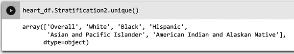

# 第二章：数据是第一步

本章概述了本书中使用的用例和数据集，并提供了关于在哪里找到数据源进行进一步研究和实践的信息。您还将了解数据类型以及批处理和流处理数据之间的区别。您将通过使用谷歌免费基于浏览器的开源 Jupyter Notebook 进行数据预处理的实际操作。本章最后部分讲述了使用 GitHub 为本书中使用的选定项目创建数据存储库的方法。

# 本书用例和数据集概述

希望您能从我们的书中学习机器学习，而不是从数学或算法优先的角度，而是从基于项目的方法。我们选择的用例旨在使用不同部门的实际、真实世界的数据来教授您机器学习。有医疗保健、零售、能源、电信和金融等各种部门的用例。客户流失的用例可以应用于任何部门。如果您具有一些数据预处理经验，每个用例项目都可以独立存在，因此请随时跳到您需要学习以提升技能的内容。表 2-1 显示了每个部分、其用例、部门以及是否为无代码或低代码。

表 2-1\. 按行业部门和编码类型列出的用例列表

| 部分 | 用例 | 部门 | 类型 |
| --- | --- | --- | --- |
| 1 | 产品定价 | 零售 | 不适用 |
| 2 | 心脏病 | 医疗保健 | 低代码数据预处理 |
| 3 | 市场营销活动 | 能源 | 无代码（AutoML） |
| 4 | 广告媒体渠道销售 | 保险 | 无代码（AutoML） |
| 5 | 欺诈检测 | 金融 | 无代码（AutoML） |
| 6 | 发电厂生产预测 | 能源 | 低代码（BigQuery ML） |
| 7 | 客户流失预测 | 电信 | 低代码（scikit-learn 和 Keras） |
| 8 | 提升自定义模型性能 | 汽车 | 自定义代码（scikit-learn、Keras、BigQuery ML） |

## 1\. 零售：产品定价

本节以一个旨在说明数据在决策中的角色的用例开始。在这个用例中，您负责一家生产雨伞的公司的市场营销工作，*业务目标*是增加销量。如果降低现有雨伞的销售价格，您能预测将会销售多少把雨伞吗？图 2-1 展示了可能影响价格降低策略以增加销售的数据元素。


###### 图 2-1\. 影响价格降低策略以增加销售的数据元素。

## 2\. 医疗保健：心脏病宣传

在这里，你是一名医疗保健顾问，提供了美国 35 岁以上人群心脏病死亡率的数据。目标是分析心脏病死亡率数据，并建议在心脏病预防活动中可能的用例。例如，一个可能的用例是跟踪心脏病死亡率随时间的趋势，或者开发和验证预测心脏病死亡率的模型。这些数据集有脏数据。一些字段有缺失值。一个字段缺失。在解决这些问题时，你学会了将数据导入 Python Jupyter Notebook，分析数据，并修复脏数据元素。图 2-2 展示了对你的分析有贡献的数据要素。


###### 图 2-2\. 心脏病死亡率用例的数据要素。

## 3\. 能源：公用事业活动

在这里，你是一名为公用事业公司工作的业务分析师。你的任务是开发一个针对高电能消费社区的营销和宣传计划。数据已经预处理过。你没有 ML 背景或任何编程知识。你决定使用 AutoML 作为你的 ML 框架。图 2-3 展示了对你的模型有贡献的数据要素。


###### 图 2-3\. 对公用事业能源活动有贡献的数据要素。

## 4\. 保险：广告媒体渠道销售预测

在这一部分中，你将与一个负责为保险公司制定媒体战略的团队合作。团队希望开发一个基于各种媒体渠道广告支出预测销售的 ML 模型。你的任务是进行探索性数据分析，并建立和训练模型。你没有 ML 背景或任何编程知识。你决定使用 AutoML 作为你的 ML 框架。图 2-4 展示了对你的模型有贡献的数据要素。


###### 图 2-4\. 影响媒体渠道销售预测的数据要素。

## 5\. 金融：欺诈检测

在这个项目中，您的目标是构建一个模型，预测金融交易是否是欺诈性或合法的。您的新公司是一家移动支付服务，为数十万用户提供服务。欺诈交易相对较少，并且通常会被其他保护措施捕捉到。然而，不幸的事实是，一些欺诈交易会逃过检查，对您的用户造成负面影响。本节中的数据集包含已模拟以复制用户行为和欺诈交易的交易数据。您没有机器学习背景或任何编程知识。您选择使用自动机器学习（AutoML）作为您的机器学习框架。图 2-5 显示了贡献到您模型的数据元素。


###### 图 2-5\. 贡献到欺诈检测模型的数据元素。

## 6\. 能源：电力生产预测

在这个项目中，您的目标将是预测一个联合循环发电厂（CCPP）在接近厂区的天气条件下的净每小时电能输出。本节中的数据集包含从 2006 年到 2011 年的六年期间（当发电厂设定为全负荷运行时）收集的数据点。数据按小时聚合，尽管数据集中没有提供记录天气条件和能量生产的确切小时。从实际角度来看，这意味着您将无法将数据视为序列或时间序列数据，其中您使用先前记录的信息来预测未来记录。您从与数据库一起使用结构化查询语言（SQL）中获得了一些知识。您选择使用 Google 的 BigQuery 机器学习作为您的机器学习框架。图 2-6 显示了贡献到您模型的数据元素。


###### 图 2-6\. 贡献到电力能量输出模型的数据元素。

## 7\. 电信业务：客户流失预测

您在这个项目中的目标是预测电信公司的客户流失。*客户流失* 定义为客户的*流失率*，或者换句话说，选择停止使用服务的客户比率。电信公司通常以月租费或年度合同销售其产品，因此在此处的*流失* 将表示客户在接下来的一个月内取消其订阅或合同。数据集包含数值变量和分类变量，其中变量取自离散可能性集。您具备一些 Python 知识，并认为 AutoML 非常强大，但希望学习允许您对模型有更多控制的低代码解决方案。您选择使用 scikit-learn 和 Keras 作为 ML 框架。图 2-7 显示了贡献到您模型的数据元素。


###### 图 2-7\. 贡献到客户流失模型的数据元素。

## 8\. 汽车：改进定制模型性能

在这个项目中（作为机器学习团队的新成员），您的目标是改进训练用于预测二手车拍卖价格的机器学习模型的性能。初始模型是一个使用 scikit-learn 进行线性回归的模型，并且并不完全符合您的业务目标。您最终将探索使用 scikit-learn、Keras 和 BigQuery ML 中的工具来提高模型性能。用于训练线性回归模型的训练、验证和测试数据集已作为 CSV 文件提供给您。这些数据集已经经过清洗（缺失和不正确的值已经得到适当修复），并且提供了用于构建 scikit-learn 线性回归模型的代码。图 2-8 显示了贡献到您模型的数据元素。


###### 图 2-8\. 贡献到汽车定价模型的数据元素。

# 数据和文件类型

数据确实是第一步，所以让我们来了解一些围绕数据的基本术语和概念。如果您已经熟悉定量数据和定性数据之间的区别；结构化、半结构化和非结构化数据之间的区别；以及批处理和流处理数据之间的区别，则跳到“GitHub 和 Google Colab 概述”，在那里您可以开始在 GitHub 中创建 Jupyter 笔记本。

## 定量和定性数据

在数据分析中，你将处理两种类型的数据：定量数据和定性数据。如果可以计数或测量，并给出一个数值，那么它就是定量数据。定量数据可以告诉你多少，多少钱，或者多频繁——例如，有多少人访问网站查看产品目录？公司本财年收入多少？制造伞把的机器多频繁损坏？

与定量数据不同，定性数据无法测量或计数，几乎可以包括任何非数字数据。它是描述性的，用语言而不是数字表达。在机器学习中，为什么这种区别很重要？如果你有定性数据，那么你需要预处理它，使其*变成*定量数据——因为你不能将定性数据输入机器学习模型。你将在后续章节学习如何处理一些定性数据。

## 结构化、非结构化和半结构化数据

数据可以分为三大类：结构化数据、非结构化数据和半结构化数据。

*结构化*数据是已格式化并转换为明确定义的数据模型的信息。数据模型是一种组织和结构化数据的方式，使其易于理解和操作。数据模型应用广泛，包括数据库、软件应用程序和数据仓库。结构化数据组织有序。表 2-2 显示了在第四章的广告媒体频道销售预测用例中使用的模式和数据类型。请注意，这里有列名和列类型。有四列数字（定量）数据，供 AutoML 模型使用。

表 2-2。广告数据集的模式和字段值信息，来自第四章

| 列名 | 列类型 | 关于字段值的注释 |
| --- | --- | --- |
| 数字 | 数字 | 数字 |
| 报纸 | 数字 | 广告预算 |
| 无线电 | 数字 | 广告预算 |
| 电视 | 数字 | 广告预算 |

这里有一些结构化数据的例子：

+   客户记录

+   产品库存

+   财务数据

+   交易日志

+   网站分析数据

+   日志文件

*非结构化*数据是没有结构化或表格化或特定格式的数据。以下是一些非结构化数据的例子：

+   社交媒体帖子

+   聊天记录（文本）

+   视频

+   照片

+   网页

+   音频文件

*半结构化*数据是介于结构化和非结构化数据之间的一种类型的结构化数据。它没有表格化的数据模型，但可以包含数据集中记录和字段的标签和语义标记。半结构化数据实质上是结构化和非结构化数据的组合。视频可能包含与日期或位置相关的元标签，但内部信息没有结构。

这里是一些半结构化数据的例子：

+   CSV，XML，JSON 文件

+   HTML

+   电子邮件（电子邮件被视为半结构化数据，因为它们有一定的结构，但不如结构化数据那么多。电子邮件通常包含标题，正文和附件。标题包含有关发件人，收件人和消息日期的信息。消息正文包含消息的文本。）

图 2-9 比较了非结构化、半结构化和结构化数据。


###### 图 2-9\. 非结构化、半结构化和结构化数据示例。

## 数据文件类型

刚刚您了解了不同类型的数据，提到了几种文件类型。有许多不同类型的数据文件格式，每种都有其特定的用途。表 2-3 展示了一些最常见的数据文件类型。

表 2-3\. 常见数据文件类型

| 常见数据文件类型 | 常见文件扩展名 |
| --- | --- |
| 文本文件是包含纯文本的文件。它们通常用于存储文档，如信件，报告和代码。 | 一些常见的文本文件扩展名包括 .txt，.csv，.tsv，.log 和 .json。 |
| 电子表格文件是以表格格式存储数据的文件。它们通常用于存储财务数据，销售数据和其他表格数据。 | 一些常见的电子表格文件扩展名包括 .xls，.xlsx 和 .csv。 |
| 图像文件是包含图像的文件。它们通常用于存储照片，图形和其他视觉内容。 | 一些常见的图像文件扩展名包括 .jpg，.png 和 .gif。 |
| 音频文件是包含音频录音的文件。它们通常用于存储音乐，播客和其他音频内容。 | 一些常见的音频文件扩展名包括 .mp3，.wav 和 .ogg。 |
| 视频文件是包含视频录制的文件。它们通常用于存储电影，电视节目和其他视频内容。 | 一些常见的视频文件扩展名包括 .mp4，.avi 和 .mov。 |
| 网页文件是包含网页的文件。它们通常用于存储 HTML 代码，CSS 代码和 JavaScript 代码。 | 一些常见的网页文件扩展名包括 .html，.htm 和 .php。 |

## 数据的处理方式

数据处理有两种主要模式：批处理和实时处理。批处理是一种数据处理模式，其中数据在一段时间内收集，然后在稍后处理。这是处理大型数据集的常见模式，因为批量处理数据比实时处理效率更高。实时处理是一种数据处理模式，数据在收集后立即处理。这是一种常见的数据处理模式，适用于需要快速处理数据的应用，如欺诈检测或股票交易。

数据处理的频率也可能不同。连续处理是一种数据处理模式，数据在收集时连续处理。这是处理数据需要实时处理的应用程序常见模式。周期性处理是一种数据处理模式，数据在规则间隔内处理。这是处理数据不需要实时性的应用程序常见模式，如财务报告。

数据处理的模式和频率取决于应用程序的具体需求。例如，需要处理大数据集的应用程序可能会使用批处理，而需要实时处理数据的应用程序可能会使用实时处理。表 2-4 总结了数据处理的不同模式和频率。

表 2-4\. 不同数据处理模式和频率的总结

| 模式 | 频率 | 描述 |
| --- | --- | --- |
| 批处理 | 间歇性 | 数据在一段时间内收集，然后在稍后处理。 |
| 实时处理 | 持续 | 数据在收集后立即处理。 |
| 周期性处理 | 间歇性 | 数据定期处理。 |

批处理数据和流数据是两种不同类型的数据，它们被不同方式处理。

+   *批处理* 数据是一种在一段时间内收集，然后在稍后处理的数据。

+   *流数据* 是一种在接收时立即处理的数据。

批处理数据要求在处理、存储、分析并喂入机器学习模型之前收集数据成批处理。

数据流是持续不断地流入，可以立即处理、存储、分析和实时操作。流数据可以来自多种不同格式的分布式源头。简而言之，流数据是连续生成并且实时的数据。这种类型的数据可以用来训练能够实时进行预测的机器学习模型。例如，流数据模型可以用于检测欺诈或预测客户流失。

# GitHub 和 Google 的 Colab 概述

本节讲述如何设置 Jupyter Notebook 和 GitHub 项目仓库。GitHub 仓库可以存放你的数据集和低代码项目笔记本，比如本书提到的 Jupyter 笔记本。

## 使用 GitHub 创建数据仓库来管理你的项目

GitHub 是一个代码仓库，你可以免费存储你的 Jupyter 笔记本和实验原始数据。让我们开始吧！

### 1\. 注册一个新的 GitHub 账户

GitHub 提供个人账户和组织账户。创建个人账户时，它作为你在 *[GitHub.com](http://github.com)* 上的身份。创建个人账户时，必须为账户选择一个计费计划。

### 2\. 设置你的项目 GitHub 仓库

要设置您的第一个 GitHub 存储库，请查看书中第二章“使用 GitHub 创建项目数据存储库”页面的完整步骤，位于[GitHub 存储库](https://oreil.ly/supp-lcai)。您还可以参考[GitHub 文档](https://oreil.ly/1iJ-w)了解如何创建存储库。

为您的存储库键入一个简短且易记的名称；例如，低代码书籍项目。描述是可选的，但在此练习中，请输入**低代码 AI 书籍项目**。选择存储库可见性——在这种情况下，默认为 Public，这意味着任何人都可以在互联网上看到此存储库。图 2-10 展示了您的设置应该是什么样子。


###### 图 2-10\. 创建新存储库页面。

让 GitHub 创建一个 *README.md* 文件。这是您可以为项目撰写长描述的地方。保留其他默认设置：`.gitignore` 允许您选择不要跟踪的文件，许可证告诉其他人可以做什么以及不能做什么。最后，GitHub 提醒您正在创建一个公共存储库，该存储库位于您的个人帐户中。完成后，单击“创建存储库”。图 2-11 展示了页面的样子。


###### 图 2-11\. 初始化存储库设置。

单击“创建存储库”后，将显示存储库页面，如图 2-12 所示。


###### 图 2-12\. 您的 GitHub 存储库页面。

###### 注意

在下一节中，您将在 Google 的 Colaboratory 中创建一个 Jupyter Notebook。您将从 Colab 中保存笔记本文件到 GitHub，这将在 *Main* 分支下创建一个文件。在 GitHub 中创建文件是改进项目协作的好方法。它提供了许多功能，可以帮助团队更有效地协同工作：

版本控制

GitHub 跟踪文件的更改。这意味着所有有权访问文件的人都可以看到已经进行的更改，并且可以在必要时返回到以前的版本。

拉取请求

拉取请求允许协作者提出对文件的更改。这使每个人都有机会审查更改，然后将其合并到主分支中。

问题

可以使用问题来跟踪错误或功能请求。这样每个人都可以合作解决问题并添加新功能。

评论

可以向文件添加评论以提供反馈或提问。这种方式可以更加协作地处理代码。

## 使用 Google 的 Colaboratory 进行低代码 AI 项目

多年前，如果你想学习 Python，你必须下载 Python 解释器并在计算机上安装。对于初学者来说，这可能是一项艰巨的任务，因为它需要了解如何安装软件和配置计算机。如今，有许多学习 Python 的方法，而无需在计算机上安装任何东西。你可以使用在线集成开发环境（IDE），它允许你在网页浏览器中编写和运行 Python 代码。你还可以使用基于云的 Python 环境，提供 Python 解释器和你开始所需的所有库的访问权限。

这些在线和基于云的资源使得无论你的经验或技术水平如何，学习 Python 都比以往更容易。以下是使用在线和基于云的资源学习 Python 的一些好处：

无需安装

你可以立即开始学习 Python，无需下载或安装任何软件。

可从任何地方访问

只要有互联网连接，你就可以在任何地方使用在线和基于云的资源学习 Python。

费用低廉

在线和基于云的资源通常是免费的或价格非常实惠的。

易于使用

即使对于初学者，在线和基于云的资源也设计得易于使用。

使用 Google 的 Colaboratory 构建你的低代码 Python Jupyter Notebook，或者简称 Colab。Colab 是一个托管的 Jupyter Notebook 服务，无需设置即可使用，同时提供访问计算资源，包括图形处理单元（GPU）。Colab 在你的 Web 浏览器中运行，允许你编写和执行 Python 代码。Colab 笔记本存储在 Google Drive 中，并可以像分享 Google 文档或表格一样分享。

Google Colaboratory 免费使用，无需注册任何帐户或支付订阅费用。你可以与他人分享你的笔记本并共同完成项目。

### 1\. 创建 Colaboratory Python Jupyter 笔记本

前往[Colab](https://colab.research.google.com)创建一个新的 Python Jupyter 笔记本。图 2-13 显示了主屏幕。


###### 图 2-13\. Google Colab 主页。

在标题栏中为笔记本命名，如图 2-14（A）所示，并展开显示目录（B）。然后点击+ Code 按钮（C）添加一个用于存放代码的单元格。+ Text 按钮允许你添加文本，如文档。


###### 图 2-14\. 标题笔记本和添加新单元格代码。

### 2\. 使用 Pandas 导入库和数据集

添加了代码单元格后，你需要导入所需的任何库。在这个简单的例子中，你只需在单元格中输入**`import pandas as pd`**并点击箭头运行，如图 2-15 所示。


###### 图 2-15\. 导入 Pandas 的代码。

Pandas 库用于数据分析。通常，当你导入一个库时，你希望能够在不每次都写出 *Pandas* 的情况下使用它。因此，*pd* 是 Pandas 的一个缩写名称（或别名）。这种别名通常按照惯例用于缩短模块和子模块的名称。

数据集来自 *[data.gov](http://data.gov)* 网站。它名为 [“美国成年人心脏病死亡数据”](https://oreil.ly/yq1hY)（参见 图 2-16）。


###### 图 2-16\. 美国成年人心脏病死亡数据按地区。

滚动页面直到到达 图 2-17 所示的部分。现在，有两种方法可以将文件导入到你的 Jupyter Notebook 中。你可以将文件下载到你的桌面，然后导入它，或者你可以使用 URL。让我们使用 URL 方法。点击 图 2-17 中显示的逗号分隔值文件，该文件将带你到 URL 下载链接，如 图 2-18 所示。


###### 图 2-17\. 下载和资源页面。


###### 图 2-18\. 逗号分隔值文件 URL 链接。

从网站上复制 图 2-18 中显示的 URL。然后，转到你的 Google Colab 笔记本，并在新的单元格（A）中输入 图 2-19 中显示的代码。通过点击箭头（B）运行单元格。


###### 图 2-19\. 读取 URL 到 Pandas DataFrame 的代码。

你已经编写了导入数据集到 Pandas DataFrame 的代码。Pandas DataFrame 是一个用于以表格格式存储数据的二维数据结构。它类似于电子表格。

现在，添加代码显示 DataFrame 的前五行（或 *head*）。添加一个新的单元格，输入 **`heart_df.head()`** 并运行单元格。代码和输出如 图 2-20 所示。


###### 图 2-20\. DataFrame 的前五行。为了便于阅读，某些列已被移除。

添加一个新的代码单元格。输入 **`heart_df.info()`** 并运行单元格以查看 DataFrame 的信息。`.info()` 方法为你提供了数据集的信息。信息包括列数、列标签、列数据类型、内存使用情况、范围索引以及每列（非空值）的单元格数。 图 2-21 显示了输出。具体数值可能因数据下载时期而异。


###### 图 2-21\. DataFrame 信息输出。

根据 `.info()` 输出显示，你有 15 列字符串对象（即定性数据）和 4 列数值列（即定量数据）。将 `int64` 视为没有小数的数字（例如，25），将 `float64` 视为有小数的数字（例如，25.5）。

### 3\. 数据验证

作为最佳实践，验证从 URL 导入的任何数据——特别是如果你有一个 CSV 文件格式可以进行比较。如果数据集页面列出了有关数据的更多元数据，例如列数和列名，你可能可以避免后续步骤。但遗憾的是，这是与数据工作的本质！

现在，返回 *[data.gov](http://data.gov)* 页面并下载 CSV 文件到你的计算机。你将验证所下载的文件与从 URL 导入的文件是否匹配。

你可以通过将下载的文件上传到你的 Colab 笔记本，然后将该文件读入 Pandas DataFrame 中来完成此操作。通过选择 章节 2 笔记本中显示的文件夹来展开目录，你的屏幕应该显示如 图 2-22（A）所示。然后，要上传文件，请选择向上箭头文件夹（B）。


###### 图 2-22\. 将文件上传到你的 Colab 笔记本。

当你上传文件时，你会看到如 图 2-23 所示的警告消息。该警告基本上指出，如果运行时终止（例如关闭 Colab），则不会保存你上传的任何文件。请注意，运行时为程序提供其运行所需的环境。


###### 图 2-23\. 警告消息指出任何上传的文件都不会被永久保存。

上传后刷新你的笔记本浏览器选项卡并展开以查看目录。你的屏幕应该显示如 图 2-24 所示。


###### 图 2-24\. 显示已上传文件的目录。

注意文件名有多长——右键单击文件并将其重命名为 *heart.csv*。你的屏幕应该显示如 图 2-25 所示。


###### 图 2-25\. 选择“重命名文件”选项。

在重命名文件后，你的屏幕应该显示如 图 2-26 所示。


###### 图 2-26\. 文件重命名为 heart.csv。

所以，你已经将文件重命名为 *heart.csv*。现在你需要复制文件路径，如 图 2-27 所示。为什么？因为你将需要将该路径作为 Pandas `read.csv` 方法的参数输入。右键单击 *heart.csv* 文件以获取路径。


###### 图 2-27\. 复制文件路径。

添加一个代码单元，并输入以下代码。确保在*/content/heart.csv*两个单引号之间粘贴文件路径。运行单元并查看输出：

```
heart_df = pd.read_csv('/content/heart.csv', error_bad_lines=False,
    engine="python")
heart_df.head()
```

在一个新的单元格中输入**`heart_df.info()`**。运行单元以查看 DataFrame 信息。将 Figures 2-21 和 2-28 的总列数进行比较。Figure 2-21 有 19 列，而 Figure 2-28 有 20 列。这意味着通过上传文件，添加了一个年份列。`Year` 数据类型不是数值类型——它包含数字，但这些数字是用来排序和排列的，并非用于计算。Figure 2-28 表明，这是我们机器学习用例的第一个脏数据案例。


###### Figure 2-28\. 年份列显示为 `int64`。

在新的单元格中输入**`heart_df.isnull().sum()`**，如 Figure 2-29 所示。运行该单元格。是否有任何空值？*空值* 是指表示值不存在的值。这是你的第二个脏数据案例！你的三列存在空值。在后续章节中，你将学习如何处理缺失值。由于目前你还没有使用案例，你可能会想知道你是否真的需要所有这些特征。请注意，特征是用于训练模型的输入数据。然后模型使用这些特征进行预测。在后续章节中，你将学习特征选择。


###### Figure 2-29\. `IsNull` 输出显示了三列中空值的数量。

你的数据质量问题是什么？

缺失值

大多数算法不接受缺失值。因此，当我们在数据集中看到缺失值时，可能倾向于只是“删除所有具有缺失值的行”。然而，你可以用不同的方式处理缺失值，如下文所述。

###### 注意

在 ML 数据集中处理缺失值有两种主要方法：删除或插补。

*删除* 涉及从数据集中删除具有缺失值的行或列。可以通过删除所有具有缺失值的行、删除所有具有缺失值的列或删除具有一定缺失值阈值的行或列来完成此操作。

*插补* 涉及用估计值填充缺失值。有许多不同的插补技术，包括 (1) 均值插补，用该变量观察值的均值替换缺失值；(2) 中位数插补，用该变量观察值的中位数替换缺失值；(3) 众数插补，用该变量的最频繁值替换缺失值；以及 (4) 回归插补，使用回归模型根据其他变量的观察值预测缺失值。

虽然 Pandas 会用 *NaN (不是一个数字)* 填补空白处，我们应该以某种方式处理它们。书中稍后将详细介绍。

数据类型不正确

`Year` 显示为 `int64` 数据类型，应为字符串对象——您需要将其处理为定性分类特征。

分类列

有相当多的字符串对象特征——这些特征不是数值型的。您不能将此类值馈送到 ML 模型中。这些特征需要进行 *one-hot 编码*。您将在后续章节中看到这一点。

### 4\. 一些探索性数据分析

在结束本节之前，让我们看看探索数据的一些简单方法。想看到特征 `Stratification2` 中的所有唯一值吗？请在新的单元格中输入 **`heart_df.Stratification2.unique()`**，如 图 2-30 所示。运行该单元格。



###### 图 2-30\. 显示列 `Stratification2` 的唯一值的代码。

让我们使用 Seaborn 的小提琴图来可视化这个特征。Seaborn 是一个用于制作统计图形的 Python 库。您可以在同一个单元格中编写所有内容，如 图 2-31 所示。此代码使用 `Data_Value` 特征作为 *x* 轴，`Stratification2` 作为 *y* 轴。请注意，`Data_Value` 特征是每个地区和组中心脏病的计数，如 图 2-32 所示。


###### 图 2-31\. `Stratification2` 列的小提琴图。

“长尾”表明该特定特征的数据中存在更多的异常值。小提琴图主体的大形状显示了按种族分布的心脏病病例数量。


###### 图 2-32\. 心脏病计数分布图。

###### 注意

Seaborn 的小提琴图是可视化单变量数据分布的一种好方法。

用于可视化数值数据分布。与只能显示摘要统计信息的箱线图不同，小提琴图描绘了每个变量的摘要统计信息和密度。

在后续章节中，您将进行更多的数据分析，并学习数据预处理。现在，将您的笔记本保存到 GitHub。在 Colab 菜单中，点击“文件” > “在 GitHub 中保存副本”，如图 2-33 所示。


###### 图 2-33\. 如何在 GitHub 中保存笔记本文件副本。

图 2-34 显示了设置。从“存储库”下拉菜单中选择要将笔记本保存到的存储库。在“分支”下选择“笔记本”（您之前创建了这个）。保持默认的“包括指向 Colaboratory 的链接”。这将在 GitHub 上显示一个链接，允许您直接从 GitHub 打开您的笔记本。


###### 图 2-34\. Colab 的 GitHub 导出窗口。

在 Colab 将笔记本复制到 GitHub 后，它会直接带您到 GitHub，如图 2-35 所示。


###### 图 2-35\. 笔记本已复制到 GitHub。

刷新存储库中的屏幕。您应该会看到您的 Colab Jupyter 笔记本，如图 2-36 所示。


###### 图 2-36\. Colab Jupyter 笔记本的副本在 GitHub 中。

# 概要

本章概述了书中使用的用例和数据集。您了解了数据类型以及结构化、半结构化和非结构化数据以及批处理和流处理数据之间的区别。您通过一个免费的基于浏览器的 Python Jupyter 笔记本和 GitHub 进行了实际操作。您发现脏数据很棘手，可能会影响 ML 模型中的数据类型和数据摄取。

在下一章中，您将了解 ML 框架，并开始使用 AutoML。您将获得一个预处理过的数据集，您只需将数据集上传到 AutoML 框架中，就能够构建和训练预测模型，而无需编写一行代码。
