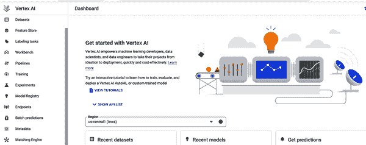

# 第三章：机器学习库和框架

本章介绍了[机器学习（ML）框架](https://oreil.ly/IJbCu)，简化了 ML 模型的开发。通常情况下，您需要理解数学、统计学和 ML 的基本工作原理，才能构建和训练 ML 管道。这些框架通过自动化许多耗时的 ML 工作流任务（如特征选择、算法选择、代码编写、管道开发、性能调整和模型部署），帮助您。

# 无代码 AutoML

假设您是一家公用事业公司的业务分析师。您有一个项目，需要帮助公司开发针对高电能消耗社区的市场营销和推广计划。数据以逗号分隔值（*CSV*）文件格式提供。

尽管您没有编程背景或任何编程知识，但团队负责人要求您承担此项目，因为您对 ML 及其在组织中应用表现出兴趣。虽然您没有编程经验，但您做了一些研究，并得出了一些观察结果：

+   对于像您这样的非编程人员，有自动化的*无代码*ML 框架，具有图形用户界面（GUI），您可以使用它们来构建和训练 ML 模型，而无需编写一行代码。

+   对于轻度编程者来说，有*低代码*的 ML 框架，可以通过编写少量代码来构建和训练 ML 模型。

+   对于经验丰富的编程人员，有 ML 库，允许灵活控制编写 ML 工作流的每个阶段。

基于您的公用事业市场推广项目和用例的数据，您确定您的目标是基于多个变量预测总千瓦时（kWh）：邮政编码、月份、年份和客户类别（住宅、商业、工业和农业）。

假设您需要快速获得基准预测。这是 AutoML 的一个很好的用例。基于 GUI 的 AutoML 框架是最易于使用的。图 3-1 显示了您可以用于业务用例的典型 AutoML 无代码工作流的高级概述。此示例使用的是 Google 的 Vertex AI，这是一个帮助您构建、部署和扩展 ML 模型的 ML 平台。总体而言，Google AutoML、Microsoft Azure AutoML 和 AWS SageMaker AutoML 都是强大的 AutoML 解决方案，可以帮助您在不编写任何代码的情况下构建和部署 ML 模型。对于您来说，最佳解决方案将取决于您的具体需求和要求。


###### 图 3-1\. 典型的 Vertex AI AutoML 无代码工作流。

由于文件格式是 CSV，您选择 Tabular 选项卡。考虑到总千瓦时是输出并且是您想要预测的数值，您注意到这是一个回归任务，并且由于具有多个变量的列名（或*标签*），这是一个*监督* ML 问题。没有标签的数据需要无监督 ML 任务，例如聚类。图 3-2 显示选择了回归/分类作为目标。

###### 注意

Vertex AI 允许您为表格数据创建以下模型类型：

二元分类模型

这些模型预测二元结果（两个类别中的一个）。用于是或否问题。

多类别分类模型

这些模型预测来自三个或更多离散类的一个类。用于分类。

回归模型

这些模型预测连续值。用于预测销售额。

预测模型

这些模型预测一系列值。用于预测每日需求。


###### 图 3-2\. 回归/分类选择。

一些框架在数据加载后会生成统计信息。其他框架通过自动检测和清理缺失值、异常值和重复行列来帮助减少手动清理数据的需求。请注意，您可以采取一些额外步骤，例如在加载后检查缺失值并查看数据统计。图 3-3 显示数据集上传选项。


###### 图 3-3\. 数据源选项。

图 3-4 显示使用谷歌 Vertex AI 框架生成的能源公用数据集的统计信息。没有缺失值，并显示每列的不同值数量。例如，有 145 个邮政编码。由于邮政编码是一个数字，转换列显示为“数字”。然而，邮政编码是一个分类特征，因为每个邮政编码都不同，可以被归为自己的“类别”。将 `ZipCode` 从数字转换为分类很容易，只需选择下拉菜单自定义转换。


###### 图 3-4\. 谷歌 Vertex AI 生成的统计数据。

图 3-5 显示 `ZipCode` 现在作为分类特征。还请注意最右侧列，您可以选择或取消选择要包含在训练中的特征。


###### 图 3-5\. `ZipCode` 显示为分类特征。

AutoML 显示每个特征的数据概况。图 3-6 显示邮政编码 92694 作为最常见的特征，表明更多客户居住在该邮政编码区域。您可以利用这些信息进行营销活动。


###### 图 3-6\. 显示邮政编码作为最常见特征。

在第 3 步中，您通过选择几个训练参数来训练新模型。Vertex AI 的“训练新模型”窗口允许您选择训练方法、模型详细信息、训练选项以及计算和定价。请注意，“训练方法”参数中显示了数据集和目标（回归）作为输入。AutoML 默认选中。图 3-7 显示了“训练新模型”窗口。


###### 图 3-7\. “训练新模型”窗口，选择了计算和定价。

输入完所有参数后，您可以开始训练作业。图 3-8 显示准备提交训练作业。


###### 图 3-8\. 提交训练作业进行训练。

###### 注意

训练时间可能长达数小时，具体取决于数据大小和所选择的模型目标类型。图像和视频数据类型的处理时间可能比 CSV 文件等结构化数据类型长得多。训练样本数量也会影响训练时间。由于 AutoML 的性质及其工作方式，AutoML 训练也非常耗时。

训练模型后呈现模型训练结果。现在，您可以在进行下一步（可能包括更多实验或将模型部署为网页）之前向团队展示您的初步发现，用户可以选择客户类别和邮政编码，然后显示预测的总 kWh。

图 3-9 显示训练结果。在接下来的章节中，将详细讨论图 3-9 中呈现的指标的完整 AutoML 项目示例。


###### 图 3-9\. 模型训练结果。

模型特征归因告诉您每个特征对模型训练的影响程度。图 3-10 显示归因值以百分比表示；百分比越高，相关性越强，即该特征对模型训练的影响越大。模型特征归因使用采样的 Shapley 方法（请参阅[GitHub 上的术语表](https://oreil.ly/tVCwP)）。


###### 图 3-10\. 归因值以百分比表示。

图 3-11 显示模型元数据。您可以查看有关模型的各种信息，包括其 ID、创建日期、训练时间、使用的数据集、目标列、数据拆分百分比分配以及在此案例中使用的模型评估指标——均方根误差（RMSE）。单击“模型”或“试验”可获取有关 AutoML 使用的模型信息。


###### 图 3-11\. 模型元数据。

# AutoML 的工作原理

实施 ML 工作流程是耗时的。正如您从前面的市场营销案例中看到的那样，AutoML 简化了为您构建 ML 模型的过程——您不需要为任何任务编写一行代码。图 3-12 显示了公用事业营销推广项目的工作流程。阶段 2、3 和 4 无需编码。


###### 图 3-12\. 公用事业营销推广项目的工作流程。

要更好地理解 AutoML 的工作原理，请注意您无需做的事情！

首先，您无需设置环境来运行 Python Jupyter Notebook。无需安装任何软件库。事实上，无需安装任何东西。

一旦您将 CSV 数据文件上传到 Vertex AI，该文件将存储在云中。如果您正在使用 Python 和 Pandas，则无需编写任何代码来加载数据集，甚至不需要将数据集拆分为训练、验证和测试文件。

尽管数据干净，但有两个分类特征：邮政编码和客户类别。如果您对这两个特征进行了编码，您将需要对每个特征进行“独热编码”。*独热编码*是将分类数据变量转换为数值的过程。以下是用于邮政编码特征的独热编码示例代码：

```
from sklearn.preprocessing import OneHotEncoder
one_hot = OneHotEncoder()
encoded = one_hot.fit_transform(df[[`zipcode`]])
df[one_hot.categories[0]] = encoded.toarray()
```

独热编码是特征*转换*或工程化的一个示例。您还可以轻松选择目标（输出）并/或取消选择特征，或*删除*它们。您无需编写类似以下显示的代码，其中列“id”正在从 Pandas DataFrame 中删除：

```
import pandas as pd
df = pd.read_csv(`/path/file.tsv`, header=0, delimiter=`\t`)
print df.drop(`id`, 1)
```

数据集中的更多特征会导致更复杂的非线性关系。神经网络非常适合处理非线性关系。您可能对这些都一无所知，因此让我们进一步分解一下。

正如前面所述，这是一个预测问题，因为您希望根据平均千瓦时数、客户类别、月份、年份和邮政编码预测未来总千瓦时数。再深入理论，这种类型的用例因其多个输入特征而被认为是复杂的——它具有多个变量且为*多变量*。这些复杂关系被认为是*非线性*的，因为您不能简单地画一条“直线”，使其成为已知的总千瓦时数与其他多个变量之间的“最佳拟合”。

这个数据集非常适合神经网络。*神经网络*在没有先前的机器学习知识的情况下难以构建。尽管神经网络是下一章的话题，让我们快速看一下一幅图像，以确定您不需要考虑的内容。图 3-13 展示了具有输入层、隐藏层和输出层的典型神经网络。


###### 图 3-13。四层神经网络。

在 Python 中编写神经网络的代码看起来像这样：

```
# Create the 'Network' class and define its arguments:
# Set the number of neurons/nodes for each layer
# and initialize the weight matrices:
class Network:

    def __init__(self, 
                 no_of_in_nodes, 
                 no_of_out_nodes, 
                 no_of_hidden_nodes,
                 learning_rate):
        self.no_of_in_nodes = no_of_in_nodes
        self.no_of_out_nodes = no_of_out_nodes
        self.no_of_hidden_nodes = no_of_hidden_nodes
        self.learning_rate = learning_rate 
        self.create_weight_matrices()

    def create_weight_matrices(self):
        """ A method to initialize the weight matrices of the neural network"""
        rad = 1 / np.sqrt(self.no_of_in_nodes) 
        X = truncated_normal(mean=0, sd=1, low=-rad, upp=rad)
        self.weights_in_hidden = X.rvs((self.no_of_hidden_nodes, 
                                       self.no_of_in_nodes))
        rad = 1 / np.sqrt(self.no_of_hidden_nodes)
        X = truncated_normal(mean=0, sd=1, low=-rad, upp=rad)
        self.weights_hidden_out = X.rvs((self.no_of_out_nodes, 
                                        self.no_of_hidden_nodes))

    def train(self, input_vector, target_vector):
        pass # More work is needed to train the network

    def run(self, input_vector):
        """
 running the network with an input vector 'input_vector'. 
 'input_vector' can be tuple, list or ndarray
 """
        # Turn the input vector into a column vector:
        input_vector = np.array(input_vector, ndmin=2).T

        # activation_function() implements the expit function,
        # which is an implementation of the sigmoid function:
        input_hidden = activation_function(
            self.weights_in_hidden @ input_vector)
        output_vector = activation_function(
            self.weights_hidden_out @ input_hidden)
        return output_vector
```

使用 Keras，编码变得更加简单。编写神经网络的代码看起来像这样：

```
# Import python libraries required in this example:
from keras.layers import Dense, Activation
from keras.models import Sequential
import numpy as np

# Use numpy arrays to store inputs (x) and outputs (y):
x = np.array([[0, 0], [0, 1], [1, 0], [1, 1]])
y = np.array([[0], [1], [1], [0]]) 

# Define the network model and its arguments. 
# Set the number of neurons/nodes for each layer:
model = Sequential()
model.add(Dense(2, input_shape=(2,)))
model.add(Activation('relu'))
model.add(Dense(1))
model.add(Activation('relu')) 

# Compile the model and calculate its accuracy:
model.compile(
    loss='mean_squared_error', optimizer='rmse', metrics=['accuracy']
) 

# Print a summary of the Keras model:
model.summary()
```

当您建立训练作业时，只需选择一个数据集，然后选择几个训练参数。不需要以下任何内容：

不需要了解使用什么样的回归算法

有许多种回归分析技术，每种方法的使用取决于多种因素。这些因素包括目标变量的类型、回归线的形状和自变量的数量。

不需要了解“经典机器学习”与神经网络的区别

不需要理解常用的神经网络构建模块，如层、神经元（节点）、目标、激活函数或优化器（参见[GitHub 上的术语表](https://oreil.ly/tVCwP)）。

不需要了解训练过程或任何模型优化策略

在训练过程中，AutoML 专注于优化模型权重和架构。选择适当的架构由 AutoML 完成。

不需要了解或指定计算资源

当您选择“一个节点”时，AutoML 选择了合适的机器类型。

###### 注意

参见[GitHub 上的术语表](https://oreil.ly/tVCwP)了解回归算法类型的定义，如线性回归、逻辑回归、岭回归、拉索回归、多项式回归和贝叶斯线性回归。

# 机器学习即服务

AutoML 是云提供商提供的机器学习即服务（MLaaS）平台的一部分。排名前三的云提供商是 Google、Amazon 和 Microsoft。如果您对云架构和服务不熟悉，图 3-14 展示了典型的云“平台金字塔”。

占据金字塔底部的是 IaaS（基础设施即服务）。将此层视为硬件和存储层，客户使用云提供商的服务器处理实际的计算和存储服务，用于存储数据集文件、模型、容器等。中间层是 PaaS（平台即服务）。将此层视为提供平台（如 Linux 或 Windows 操作系统），客户使用该平台运行其自己的软件。顶层是 SaaS（软件即服务）。AutoML 是最佳示例 — 您不需要配置服务器或编写代码，只需打开浏览器即可使用它。


###### 图 3-14\. 典型云“平台金字塔”。

Google、Amazon 和 Microsoft 提供支持整个 ML 工作流程的服务，包括 ML 学习算法的训练和调整、数据可视化、数据预处理，以及[深度学习](https://oreil.ly/nD_w4)。它们还为使用 scikit-learn、Keras、TensorFlow 和 PyTorch 等框架提供托管的 Jupyter Notebooks。表 3-1 展示了 MLaaS 的益处。

表 3-1\. MLaaS 益处

| 数据提取和探索 |
| --- |

+   使用 Jupyter Notebook 或在某些情况下使用云提供商自己的数据可视化工具提取和清理数据集。

+   对模型应用数据转换和特征工程，并将数据分割为训练、验证和测试集。

+   使用 GUI 工具或 Jupyter Notebook 探索和可视化数据。

|

| 模型训练 |
| --- |

+   用于表格、图像、文本和视频数据的 AutoML。自动特征化和算法选择。

+   共享笔记本、计算资源、数据和环境。

+   使用 PyTorch、TensorFlow 或 scikit-learn 等开源平台进行定制训练。

+   优化超参数。

+   通过运行不同的模型版本和技术进行实验，并比较结果。

|

| 分布式训练 | 提供多节点分布式训练。 |
| --- | --- |
| 模型评估和迭代 | 提供评估指标，使您可以对数据进行调整并迭代您的模型。 |
| 模型可解释性 | 理解每个特征如何影响模型预测（特征归因）。 |
| 模型服务 | 部署您的模型到生产环境并进行预测。 |
| 模型监控 | 监控部署模型的性能，检测训练与服务之间的偏差和预测漂移，并在预测数据与训练基线偏离过大时发送警报。 |

AutoML 是企业和组织希望利用 ML 提升运营效率的有价值工具。通过自动化构建 ML 模型中许多耗时复杂的任务，AutoML 能帮助企业和组织更快地启动和运行模型。以下是一些当前业务中如何使用 AutoML 的具体示例：

电信

电信公司正在使用 AutoML 来改善客户流失预测、欺诈检测和网络优化。

制造业

制造业公司正在使用 AutoML 来提高产品质量、优化生产流程并预测设备故障。

零售

零售商正在使用 AutoML 来个性化客户体验，推荐产品并优化库存水平。

医疗保健

医疗保健公司正在使用 AutoML 来诊断疾病、预测患者结果并个性化治疗计划。

这些只是今天业务中如何使用 AutoML 的几个例子。随着 AutoML 技术的不断成熟，未来预计会看到更多创新的 AutoML 应用。表 3-2 展示了 AutoML 的益处。

表 3-2\. AutoML 的益处

| 提高准确性 | AutoML 可以帮助企业建立更准确的 ML 模型。这是因为 AutoML 可以尝试比人类数据科学家更广泛的算法和超参数。 |
| --- | --- |
| 普及 ML | AutoML 使非专家更容易接触 ML。这是因为 AutoML 提供了一个简单、用户友好的界面来构建和部署 ML 模型。 |
| 缩短上市时间 | AutoML 可以帮助企业更快地启动和运行其 ML 模型。这是因为 AutoML 自动化了构建 ML 模型中许多耗时的任务，如数据清洗、特征工程和模型训练。 |
| 降低风险 | AutoML 可以帮助企业降低构建偏见或不准确的 ML 模型的风险。这是因为 AutoML 自动化了模型验证和测试中的许多步骤。 |

图 3-15 展示了谷歌的 Vertex AI 解决方案，图 3-16 展示了微软的 Azure ML Studio 解决方案，以及 图 3-17 展示了 Amazon SageMaker 的 AutoML 解决方案。



###### 图 3-15\. 谷歌的 Vertex AI 界面。


###### 图 3-16\. 微软的 Azure ML Studio 界面。


###### 图 3-17\. Amazon SageMaker 的 AutoML 界面。

# 低代码 ML 框架

低代码 AutoML 需要安装和配置库，以及一些 Python 或结构化查询语言（SQL）的知识。*低代码* 在此处的定义如下：

+   提供在现有 ML 框架之上的“抽象层”的 ML 框架。

+   允许您使用 SQL 运行 ML 模型的数据库，或者允许您运行包含 ML 代码的 Python 代码的数据库。

表 3-3 展示了一些例子。

表 3-3\. ML 框架示例

| 云提供商（SQL） | 开源 |
| --- | --- |
| 谷歌 | BigQuery | AutoKeras |
| Amazon | Aurora, Redshift | Auto-sklearn |
| Microsoft | Azure SQL Server | Auto-PyTorch |

## SQL ML 框架

数据分析师和数据科学家通常使用 SQL 进行数据分析。他们可以利用现有的 SQL 技能和专业知识，并将其应用于 ML 项目，而无需具备任何 ML 编程背景。如果他们懂 SQL 但无法编写 Python、Java 或 R 代码，他们可以在 SQL-ML 框架内工作。这就是为什么 SQL-ML 框架被认为是低代码的原因。几乎不需要大量的 SQL 编码。

使用数据库/数据仓库进行 SQL-ML 的好处：

大数据集的模型构建

当您可以在数据“居住”的地方构建 ML 模型时，ML SQL 代码会“接近数据”，从而减少延迟（数据传输时间）。这对于使用深度学习的大型数据集尤为重要，其中训练需要通过数据的一部分进行迭代，以用于训练、验证和测试。

与现有 ML 系统的后端集成

与云服务提供商的后端 ML 框架集成（例如 Google 的 Vertex AI、Amazon 的 SageMaker 和 Microsoft 的 Azure）。

常见的模型构建语句

所有使用 `CREATE MODEL` SQL 命令，并指定训练数据作为表格或 `SELECT` 语句。然后在数据仓库中编译和导入训练模型，并准备一个 SQL 推理函数，可以立即在 SQL 查询中使用。

使用案例

典型用例包括欺诈检测、产品推荐和广告定位，由于低延迟和实时需求。

###### 注意

*数据库* 是数据或信息的集合。术语 *数据库* 通常用于引用数据库本身以及数据库管理系统（DBMS）。*数据仓库* 存储来自各种来源的大量当前和历史数据。

### Google 的 BigQuery ML

[Google 的 BigQuery](https://oreil.ly/mQYE0) 是一个数据仓库。它可以通过其 ML 工具提供决策指导和预测分析。您可以在 BigQuery 中创建和训练模型，无需导出数据。与 Vertex AI 一样，BigQuery ML 不需要环境和依赖设置。BigQuery ML 是基于浏览器的和无服务器的，意味着您无需服务器即可运行它。如果您的数据已驻留在 BigQuery 的数据仓库中，则可以将该数据用于您的 ML 项目。

### Amazon Aurora ML 和 Redshift ML

[Amazon Aurora](https://oreil.ly/2-Ngq) 是为云构建的关系数据库管理系统（RDBMS），完全兼容 MySQL 和 PostgreSQL。Amazon Aurora ML 可以通过 SQL 为应用程序添加基于 ML 的预测。当运行 ML 查询时，Aurora 调用 Amazon SageMaker 使用各种 ML 算法。

[Redshift ML](https://oreil.ly/hR0Lx) 是一个数据仓库。您可以使用 SQL 语句在 Redshift 数据上创建和训练 Amazon SageMaker ML 模型，然后使用这些模型进行预测。Redshift ML 将模型作为 SQL 函数提供在 Redshift 数据仓库中使用。

## 开源 ML 库

*开源* AutoML 指的是诸如 [AutoKeras](https://autokeras.com), [Auto-sklearn](https://oreil.ly/HtCyl) 和 [Auto-PyTorch](https://oreil.ly/xoipb) 等开源框架，这些框架在现有开源库之上增加了额外的抽象层。通常，您需要使用 Jupyter 笔记本来编码以下内容：

1.  安装 AutoML 包。

1.  导入包。

1.  加载数据集。

1.  拆分数据。

1.  拟合模型。

1.  预测。

1.  评估。

1.  导出模型。

在第四步之后，每个开源框架都有自己的方法来执行模型拟合、预测和评估。图 3-18 展示了前四个步骤。


###### 图 3-18\. 使用开源库的前四个步骤。

### AutoKeras

AutoKeras 是基于 Keras 的开源 AutoML 框架，旨在允许非专家快速构建神经网络，并且代码量最小。使用 AutoKeras 时，您只需指定训练数据，AutoKeras 将独立进行数据预处理。例如，如果数据包含分类变量，它将根据是分类任务还是回归任务将其转换为独热编码；如果输入数据包含文本，AutoKeras 将其转换为嵌入。

### Auto-Sklearn

Auto-sklearn 是基于 scikit-learn ML 库的开源 Python 包。Auto-sklearn 自动搜索新 ML 数据集的正确学习算法，并优化其超参数。该框架仅支持基于 sklearn 的模型。Auto-sklearn 由弗莱堡大学和汉诺威大学的实验室开发。

### Auto-PyTorch

除了 Auto-sklearn，Freiburg-Hannover AutoML 小组还开发了基于 PyTorch 的 AutoML，专注于深度学习。Auto-PyTorch 被认为在快速原型设计方面表现出色。它还支持分布式训练。

# 总结

业务分析师、数据分析师、公民数据科学家、数据科学家、软件开发人员和 ML 工程师都可以使用 AutoML 框架来简化开发过程。

首先，您加载包含目标变量和用于预测的输入特征数据的数据集。加载数据后，会为每个数据列生成数据概要。要提交训练作业，只需选择几个参数。AutoML 然后尝试多个模型并执行模型优化。结果被呈现出来，同时还有特征归因。

云供应商提供 MLaaS，加速和自动化日常 ML 工作流，提供将模型集成到应用程序或服务中的工具，以及将模型部署到生产环境的工具。

低代码 AutoML 需要安装和配置库，并且需要一些 SQL 或 Python 的知识。开源 AutoML 指的是诸如 AutoKeras、Auto-sklearn 和 Auto-PyTorch 等开源框架，它们在现有的开源库之上提供了额外的抽象层。

在 第四章 中，您将建立一个 AutoML 模型来预测广告媒体渠道的销售情况。首先，您会使用 Pandas 探索数据。然后，您将学习如何使用 AutoML 构建、训练和部署机器学习模型以预测销售额。
