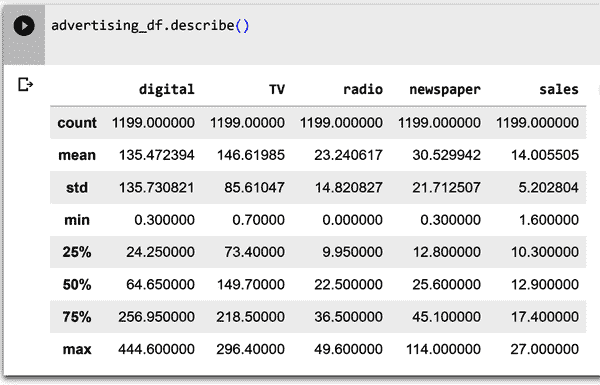

# 第四章：使用 AutoML 预测广告媒体渠道销售

在本章中，您将建立一个 AutoML 模型来预测广告媒体渠道的销售情况。首先，您将使用 Pandas 探索您的数据。然后，您将学习如何使用 AutoML 构建、训练和部署一个 ML 模型来预测销售。您将通过性能指标全面了解您模型的表现，并回答常见的业务问题。在此过程中，您将学习到用于预测用例的常见技术——回归分析。

# 业务用例：媒体渠道销售预测

企业使用广告媒体渠道来推广其产品、服务或品牌。营销人员和媒体策划人员创建可能在数字、电视、广播或报纸上运行的营销活动。在这种情况下，您作为一个中型太阳能公司市场部门的媒体策划人员工作。您的公司有一个适度的媒体预算，需要评估哪些渠道提供了最大的利益，成本最低。这是一个支出优化问题。

您被要求制定一个营销计划，以增加明年的产品销售量。为了实现这一目标，您需要了解媒体渠道产品广告预算对整体销售额的影响。广告数据集捕捉了在数字、电视、广播和报纸媒体渠道上的广告费用与销售收入之间的关系。

通常情况下，这种要求会交给数据科学家或数据分析师。但是，尽管您没有任何编程经验，市场团队负责人却要求您使用 AutoML 构建销售预测模型，这是团队首次尝试的事情。目标是建立一个机器学习模型，根据在每个媒体渠道上的花费来预测销售量。

业务问题包括：

+   模型能否根据每个媒体渠道的投入预测未来的销售量？

+   广告预算和销售之间是否存在关系？

+   哪个媒体渠道对销售贡献最大？

+   该模型能否用于预测基于媒体渠道拟议预算的未来销售？

+   模型能够准确预测未来销售吗？

该用例是一个简单的回归问题，仅包含五个变量，您可以用来回答前面的五个问题。

## 项目工作流程

图 4-1 显示了典型 AutoML 无代码工作流程的高级概述，来自第 3 章。该工作流程适用于您的用例。


###### 图 4-1\. 业务案例的 AutoML 工作流程。

现在您了解了业务用例和目标，可以继续进行数据提取和分析。请注意，此工作流程不包括数据预处理步骤。在后续章节中，您将获得大量数据预处理的实践经验。数据提取和分析后，您将上传数据集到 AutoML 平台。数字、电视、报纸和广播数据的广告预算将输入模型。然后，您将评估 AutoML 的结果，并部署模型进行预测。完成本章的实践后，您将能够为您的团队创建战略营销计划。

## 项目数据集

数据集由历史营销渠道数据组成，可用于洞察支出分配并预测销售。本章使用的数据集，[广告 _2023 数据集](https://oreil.ly/JI6eL)，基于[*An Introduction to Statistical Learning with Applications in R*](https://www.statlearning.com)一书（Springer, 2021）中的数据，作者为 Daniela Witten、Gareth M. James、Trevor Hastie 和 Robert Tibshirani。该广告数据集记录了特定产品广告预算（以千美元计）在电视、广播和报纸媒体上产生的销售收入（以千单位计）。

对于本书，数据集已更新以包括数字变量，并修改以显示数字预算对销售的影响。市场数量已从 200 增加到 1,200 个。因此，数据包括 1,200 个不同市场的广告预算（数字、电视、广播和报纸）以及总销售额。完成本章练习后，鼓励您查看如何处理此数据集的其他示例以增进您的知识。

数据最初以 CSV 文件的形式提供，因此您需要花些时间将数据加载到 Pandas 中才能进行探索。数据集仅包含数值变量。

数据集有五列。表 4-1 提供了这些列的列名、数据类型以及关于这些列可能值的一些信息。

表 4-1\. 广告数据集的模式和字段值信息

| 列名 | 列类型 | 字段值的注释 |
| --- | --- | --- |
| 数字 | 数字 | 在数字广告上的支出金额 |
| 报纸 | 数字 | 在报纸广告上的支出金额 |
| 广播 | 数字 | 在广播广告上的支出金额 |
| 电视 | 数字 | 在电视广告上的支出金额 |
| 销售额 | 数字 | 总媒体渠道销售额 |

# 使用 Pandas、Matplotlib 和 Seaborn 探索数据集

在开始使用 AutoML 之前，您需要遵循前几章讨论的工作流程，以了解和准备 ML 所需的数据。本节向您展示如何使用 Pandas 将数据加载到 Google Colab 笔记本中，Pandas 是一种广泛用于数据科学和数据分析的开源 Python 包。一旦数据加载到 DataFrame 中，您将探索数据。幸运的是，数据已经过清理—数据集中没有缺失值或奇怪的字符。您的探索性数据分析是为了验证数据的清洁性，并探索变量之间的关系，以帮助您回答团队提出的问题。正如前几章所述，大部分 ML 工作是用于理解和准备训练数据—而不是训练模型—因为您依赖于 AutoML 来构建模型。

本节中的所有代码，包括一些额外的示例，都包含在名为[low-code-ai repository on GitHub](https://oreil.ly/supp-lcai)的 Jupyter 笔记本 Chapter4_Media_Channel_Sales_Notebook 中。

## 在 Google Colab Notebook 中将数据加载到 Pandas DataFrame 中

首先，转到[*https://colab.research.google.com*](https://colab.research.google.com)，打开一个新笔记本，按照第二章中讨论的过程操作。您可以通过单击图 4-2 中显示的名称并用新名称替换当前名称，例如*Advertising_Model.ipynb*，对笔记本进行重命名。


###### 图 4-2\. 将 Google Colab 笔记本重命名为更有意义的名称。

现在将以下代码输入到第一个代码块中，以导入分析和可视化广告数据集所需的包：

```
import pandas as pd
import numpy as np
import matplotlib.pyplot as plt
from scipy import stats
import seaborn as sns
%matplotlib inline
```

当您首次探索 Colab 笔记本的使用时，在第二章中就看到了这些包的一些示例。

现在执行包含导入语句的单元格以导入这些包。要执行此操作，请单击单元格左侧的“运行单元格”按钮。您也可以按 Shift + Enter 运行单元格。

现在您可以导入您的数据了。使用 Pandas，您可以直接从互联网上的位置将 CSV 文件导入 DataFrame，而无需先下载文件。要做到这一点，请从解决方案笔记本中复制代码或在新单元格中输入以下代码并执行该单元格：

```
url="https://github.com/maabel0712/low-code-ai/blob/main/advertising_2023.csv?raw=true"

advertising_df=pd.read_csv(url, index_col=0)
```

一般来说，查看 DataFrame 的前几行是个好主意。使用`advertising_df.head()`来探索 DataFrame 的前几行。head Pandas 方法让我们看到我们数据的前五行。通过这样做，您可以快速查看特征、一些可能的值以及它们是否是数值。

一个示例是在图 4-3 中显示的几列。


###### 图 4-3\. 使用`head()`方法打印出来的 DataFrame `advertising_df` 的前五行的几列。

## 探索广告数据集

现在数据已经加载到 DataFrame `advertising_df` 中，你可以开始探索和理解它。当前的目标是了解数据中可能存在的问题，以便在继续之前解决这些问题。

### 描述性分析：检查数据

首先使用标准的 Python 方法检查数据。要检查 DataFrame 的数据类型，请在一个新的单元格中键入 **`advertising_df.info()`** 并执行该单元格。信息包括列数、列标签、列数据类型、内存使用情况、索引范围以及每列的单元格数（非空值）。

图 4-4 展示了`info()`方法的输出示例。


###### 图 4-4\. 使用`info()`方法获取数据集信息。

注意，有了数据类型的信息，你可以检查确保 Pandas 推断的类型与预期的表 4-1 相匹配。

图 4-5 显示了`describe()`方法的输出，该方法计算并显示数据集的汇总统计信息。`describe`函数显示了数据集的数值变量的信息。你可以看到每个变量的均值、最大值、最小值以及它们的标准差。在一个新的单元格中键入 **`advertising_df.describe()`** 并执行该单元格。



###### 图 4-5\. 广告数据集所有列的汇总统计信息。

图 4-6 展示了`.isnull()`方法的输出。在一个新的单元格中键入 **`advertising_df.isnull().sum()`** 并执行该单元格。输出显示了 DataFrame 中所有列的关联零值。如果存在空值，则会显示每列的空值数量。


###### 图 4-6\. 使用`isnull()`方法确定空值。

### 探索数据

探索性数据分析（EDA）是任何 ML 项目的第一步。在构建任何 ML 模型之前，你需要先探索数据。目标是查看原始数据、探索数据并从中获取相关的见解。通过这样做，你还可以改进模型，因为你将能够发现任何可能影响性能的“脏数据”问题，如缺失值、列中的奇怪字符等。

#### 热力图（相关性）

*热图*是一种以视觉方式表示数据的方法。数据值在图中表示为颜色。热图的目标是提供信息的彩色视觉摘要。热图显示了变量（特征）之间的关系（相关性）。*相关性*是一个统计量，显示两个或多个变量如何一起移动的程度。在图 4-7](#correlation_matrix_for_advertising_medi)中显示了一个相关性方法的输出，该方法在网格上绘制相关性值。在新单元格中键入以下代码并执行该单元格：

```
plt.figure(figsize=(10,5))
sns.heatmap(advertising_df.corr(),annot=True,vmin=0,vmax=1,cmap='viridis')
```


###### 图 4-7\. 广告媒体渠道的相关矩阵。

相关矩阵的结果可以在多种方式中使用，包括：

识别变量之间的关系

两个变量之间的相关系数可以告诉您它们之间的关系强度。相关系数为 0 意味着没有关系，而相关系数为 1 意味着存在完美的正关系。相关系数为–1 意味着存在完美的负关系。*请注意，销售和电视之间的关系最为显著（0.78），其次是销售和广播（0.58）*。这些信息可用于制定有针对性的营销活动，以提高销售。

选择模型中包含的变量

在构建预测模型时，您需要选择最有可能预测结果的变量。例如，是否应将报纸（与销售的相关性为 0.23）作为模型中的特征包含以预测销售？

检测多重共线性

当回归模型中两个或更多预测变量高度相关时，就会发生多重共线性。例如，如果电视和广播的相关性很高（意味着两者的值>0.7，而不是 0.056，如图 4-7](#correlation_matrix_for_advertising_medi)所示），则表明存在多重共线性。由于很难从数值上区分具有强共线关系的预测变量，因此回归算法更难确定其中一个对销售的影响程度或权重。

###### 警告

作为警告，由于样本大小或数据集中的异常值，相关矩阵的结果可能会发生变化。

#### 散点图

散点图用于确定两个数值变量之间的关系。它们可以帮助您看出两个变量之间是否存在直接关系（例如正线性关系或负线性关系）。此外，它们还可以帮助您检测数据是否存在异常值。图 4-8 显示了数字特征和销售目标的散点图。在新单元格中键入以下代码并执行该单元格：

```
advertising_df.plot(kind='scatter', x=['digital'], y='sales')
```


###### 图 4-8\. 数字和销售的散点图。

你想探索每个变量与预测变量 `sales` 的散点图。你可以单独绘制每个特征的散点图（如之前所做的那样），或者将它们绘制在同一张图中以展示所有关系。将以下所有代码键入新的单元格并执行单元格（图 4-9 显示输出）：

```
plt.figure(figsize=(18, 18))

for i, col in enumerate(advertising_df.columns[0:13]): 
    plt.subplot(5, 3, i+1) # each row three figure
    x = advertising_df[col] #x-axis
    y = advertising_df['sales'] #y-axis
    plt.plot(x, y, 'o')

    # Create regression line
    plt.plot(np.unique(x), np.poly1d(np.polyfit(x, y, 1)) (np.unique(x)),   
        color='red')
    plt.xlabel(col) # x-label
    plt.ylabel('sales') # y-label
```


###### 图 4-9\. 所有特征和销售目标的散点图。

请注意，电视和销售之间存在强烈的线性关系——似乎显示出电视预算增加时，对销售量有正面影响。报纸和销售之间似乎没有强烈的关系。回顾该关系的相关系数为 0.23。这与电视和销售之间的关系（0.78）非常不同。

#### 直方图分布图

可视化分布的常见方法是直方图。*直方图*是一种柱形图，其中代表目标变量的轴被划分为一组离散的箱子，每个箱子内观察到的数量用相应柱的高度表示。

将此代码键入新的单元格并运行单元格：

```
sns.displot(advertising_df, x="sales")
```

图 4-10 显示了销售列的数据值。该图看起来略呈左偏态钟形曲线。最常见的销售额为$11,000 美元。


###### 图 4-10\. 稍微向左偏斜的销售直方图。

其他特征呢？它们是向左偏斜还是向右偏斜，还是像钟形曲线一样“正态分布”？你可以为每个单独的特征键入前面的代码，或者使用以下代码查看所有特征的汇总。将以下代码键入新的单元格并执行单元格（图 4-11 显示输出）：

```
lis = ['digital', 'newspaper', 'radio','TV']
plt.subplots(figsize=(15, 8))
index = 1
for i in lis:
    plt.subplot(2, 2, index)
    sns.distplot(advertising_df[i])
    index += 1
```

正如你在图 4-10 中看到的那样，销售基本上呈正态分布。然而，在图 4-11 中，数字似乎向左偏斜，而电视、广播和报纸则不是正态分布的。在将这些特征标准化为正态分布之前，将它们输入到你的 ML 模型中会产生更好的结果。

###### 注意

*然而，你的角色并不是数据科学家*。不必担心理解这些概念。讨论每个特征所需的每个转换超出了本章节的范围。请参阅第 7 章，在数据集上执行转换操作。


###### 图 4-11\. 数字、电视、广播和报纸的分布图。

### 导出广告数据集

在检查和探索数据集之后，现在是时候导出文件，以便将其上传到您的 AutoML 框架中。将以下代码输入到一个新的单元格中并执行该单元格。第一行导入操作系统，使您可以创建一个名为 *data* 的目录（第二和第三行）：

```
import os
if not os.path.isdir("/content/data"): 
    os.makedirs("/content/data")
```

在创建完目录后，将以下代码输入到一个新的单元格中并执行该单元格。第一行代码创建了广告数据框架的 CSV 文件格式，并将其放置在您在上一步中创建的 *content/data* 目录中：

```
advertising_df.to_csv('/content/data/advertising.csv', 
    encoding='utf-8', index=False)
```

图 4-12 显示了名为 *data* 的新创建目录及其文件 *advertising.csv*。


###### 图 4-12\. 新创建的 data 目录中的 advertising.csv 文件。

作为最佳实践，请验证您能够看到新导出文件的内容位于新创建的目录中。在一个新的单元格中键入 **`!head /content/data/advertising.csv`** 并执行该单元格。检查输出是否与 图 4-13 中显示的内容相同。


###### 图 4-13\. 广告.csv 文件的输出。

现在您已经验证文件已正确导出，可以将其下载到您的计算机上。

在新创建的 *data* 目录中右键单击 *advertising.csv* 文件，并选择如 图 4-14 所示的下载。该文件将下载到您的桌面。您现在可以将该文件上传以供 AutoML 使用。


###### 图 4-14\. 在数据目录中验证 advertising.csv 文件。

在接下来的部分中，您将基于刚刚导出的训练数据文件构建一个无代码模型。

# 使用 AutoML 训练线性回归模型

本书的 AutoML 项目将使用 Google 的 Vertex AI 实施，这是作者们最熟悉的基于 GUI 的 AutoML 和自定义训练框架。请注意，三大主要云供应商（Google、Microsoft 和 AWS）都提供 AutoML 教程。可以在它们的文档中找到这三家主要云供应商的指南。许多云供应商提供试用期，免费探索其产品。

鉴于 Google 提供了有关 AutoML 的逐步教程，某些入门步骤被排除在外。

图 4-15 展示了用于您业务用例的 AutoML 无代码工作流的高级概述。


###### 图 4-15\. 自动化机器学习（AutoML）无代码工作流适用于您的用例。

## 无代码使用 Vertex AI

图 4-16 显示了 Vertex AI 仪表板。要创建 AutoML 模型，请点击“启用所有推荐的 API”按钮开启 Vertex AI API。从左侧导航菜单中，从“仪表板”中滚动到“数据集”并选择。


###### 图 4-16\. Vertex AI 仪表板显示“启用所有推荐的 API”按钮。

## 在 Vertex AI 中创建托管数据集

Vertex AI 根据数据类型和您希望通过模型实现的目标提供不同的 AutoML 模型。创建数据集时，您选择一个初始目标，但创建数据集后，您可以使用它来训练具有不同目标的模型。保持默认区域（us-central1），如 图 4-17 所示。

在页面顶部选择“创建”按钮，然后为数据集输入名称。例如，您可以将数据集命名为 *advertising_automl*。


###### 图 4-17\. Vertex AI 允许您创建数据集的数据集导航。

## 选择模型目标

图 4-18 显示选中了回归/分类作为表格选项卡下的模型目标。如果您想要预测目标列（销售）的值，这是合适的选择。


###### 图 4-18\. 用于模型目标的回归/分类选择。

您选择了回归/分类作为您的目标。让我们介绍一些基本概念，以帮助您处理未来的使用案例。*回归* 是一种监督式机器学习过程。它与分类相似，但与预测分类标签（例如从您的电子邮件收件箱分类垃圾邮件）不同，您尝试预测一个连续值。*线性* 回归定义了目标变量（*y*）与一组预测特征（*x*）之间的关系。如果您需要预测一个数值，那么请使用回归。在您的使用案例中，线性回归使用数据集中提供的一些独立变量（数字、电视、广播和报纸）来预测一个实际值（销售）。

本质上，线性回归假设与每个特征的线性关系。预测值是线上的数据点，真实值则在散点图中。目标是找到最佳拟合线，以便在输入新数据时，模型可以预测新数据点相对于线的位置。“评估”拟合效果如何好，包括评估标准——这在 “评估模型性能” 中有所涵盖。

图 4-19 显示了基于您的数据集的“最佳拟合”线，其中模型尝试将线拟合到您的数据点（即深色散点）。


###### 图 4-19\. 真实值和预测值及最佳拟合线。

在进行回归/分类选择后，向下滚动并点击“创建”按钮。现在您可以向数据集添加数据了。Vertex AI 管理的数据集适用于各种数据类型，包括表格、图像、文本和视频数据。

图 4-20 展示了数据源上传选项——从计算机上传 CSV，从云存储选择 CSV 文件，或从 BigQuery（Google 的数据仓库）选择表或视图。


###### 图 4-20\. 数据集文件的数据源上传选项。

要上传您的广告数据集，请选择“从计算机上传 CSV 文件”。找到本地计算机上的文件并加载它。

向下滚动页面并查看“选择云存储路径”部分，要求您将文件存储在云存储桶中。为什么需要将文件存储在云存储桶中？有两个原因：（1）当训练大规模 ML 模型时，您可能需要存储数千兆字节甚至数百个千兆字节的数据；（2）云存储桶可扩展、可靠且安全。

图 4-21 显示 *Advertising_automl.csv* 文件已上传，并创建了一个云存储桶以存储上传的文件。要查看创建存储桶及整个操作的逐步过程，请参阅名为 *Chapter 4 AutoML Sales Prediction* 的 PDF 文件，位于 [repository](https://oreil.ly/supp-lcai) 中。


###### 图 4-21\. 数据源选项，用于加载 CSV 文件并将其存储在云存储桶中。

一些框架在数据加载后会生成统计信息。其他框架则通过自动检测和清理缺失值、异常值和重复行列来帮助减少手动数据清理的需求。请注意，您可以采用一些额外步骤，例如在加载后检查缺失值和查看数据统计。

图 4-22 展示了生成统计窗口的输出。请注意，这里没有缺失值，并显示了每列的不同值数量。


###### 图 4-22\. 生成统计窗口的输出。

AutoML 会为每个特征展示数据概要。要分析特征，请点击特征的名称。页面将显示该特征的特征分布直方图。

图 4-23 显示了销售的数据概况。请注意，均值为 14.014，这与您在探索数据集时键入`advertis⁠ing_​df.describe()`代码获得的数字值非常接近。


###### Figure 4-23\. 销售特征概况。

## 构建训练模型

图 4-24 显示模型现已准备好训练。在“培训作业和模型”部分选择“训练新模型”。选择其他而非管道上的 AutoML。AutoML on Pipelines 是一种功能，允许您指定要构建的 ML 模型类型和其他参数。这超出了本书的范围。


###### Figure 4-24\. 现在模型已准备好训练。

“训练新模型”窗口显示。有四个步骤：

1.  选择培训方法

1.  配置模型详细信息

1.  确定训练选项

1.  选择计算和定价

在第一步中，在目标下拉菜单中选择回归。在“模型培训方法”下选择 AutoML（如图 4-25 所示）。点击继续。


###### Figure 4-25\. 在第一步中配置培训方法。

在第二步中，在“模型详细信息”下，为您的模型命名并给出描述。在“目标列”下拉菜单中选择销售（如图 4-26 所示）。点击继续。


###### Figure 4-26\. 在第二步中添加模型详细信息。

在第三步中，审查培训选项。请注意，任何数据转换（或数据处理）如标准化都将自动处理（如图 4-27 所示）。点击继续。


###### Figure 4-27\. 在第三步中添加培训选项。

在第四步中，您将看到[“计算和定价”](https://oreil.ly/x8C3f)（如图 4-28 所示）。训练模型所需的时间取决于训练数据的大小和复杂性。一个*节点小时*是云中一个节点（如虚拟机）的使用时间，分布在所有节点上。在预算字段中输入**`3`**，以获取最大节点小时数—这仅是一个估计值。您只需支付使用的计算小时数；如果训练由于用户未启动的取消以外的任何原因而失败，则不会计费。如果取消操作，您将支付培训时间费用。


###### Figure 4-28\. 在第四步中选择计算和定价。

在“计算和定价”下还有“提前停止”。启用此选项表示，当 AutoML 确定无法再改进模型时，训练将结束。如果禁用提前停止，则 AutoML 将训练模型直到耗尽预算小时数。

输入所有参数后，您可以启动训练作业。单击开始训练。

在模型训练完成后，模型将注册到模型注册表中（如图 4-29 所示）。


###### 图 4-29\. Advertising_automl 模型显示在模型注册中。

###### 注意

如前所述，培训可能需要数小时，具体取决于您的数据大小和选择的模型目标类型。图像和视频数据类型的处理时间可能比 CSV 文件等结构化数据类型长得多。培训样本的数量也会影响培训时间。

此外，AutoML 非常耗时。AutoML 算法需要训练各种模型，而这一训练过程可能计算量很大。这是因为 AutoML 算法通常尝试大量不同的模型和超参数，并且每个模型都需要在整个数据集上进行训练。然后，AutoML 算法需要从训练好的模型集中选择最佳模型，而这一选择过程也可能非常耗时。这是因为 AutoML 算法通常需要评估每个模型在保留数据集上的性能，而这一评估过程可能计算量很大。

## 评估模型性能

图 4-30 显示了模型训练结果。


###### 图 4-30\. 使用五个评估指标的模型训练结果。

当从业者权衡不同线性回归评估指标的重要性时，有几个因素需要考虑：

模型的目的

模型的目的将决定哪些评估指标最重要。例如，如果模型用于进行预测，那么从业者可能希望关注诸如均方误差（MSE）或根均方误差（RMSE）等指标。然而，如果模型用于理解变量之间的关系，那么从业者可能希望关注 R 平方或调整后的 R 平方等指标。

数据的特征

数据的特征也会影响不同评估指标的重要性。例如，如果数据存在噪声（例如包含不需要的信息或错误），那么从业者可能希望关注对噪声鲁棒的指标，如平均绝对误差（MAE）。然而，如果数据没有噪声，那么从业者可能能够关注更加敏感于模型变化的指标，如 MSE。

从业者的偏好

最终，实践者的偏好也会影响确定不同评估指标的重要性。一些实践者可能更喜欢易于理解的指标，而其他人可能更喜欢更准确的指标。没有对与错的答案，实践者应选择对他们最重要的指标。

这里是常见的线性回归评估指标：

R 平方

R 平方是衡量模型与数据拟合程度的指标。它是观察值和预测值之间的皮尔逊相关系数的平方。它通过将平方残差（预测值与实际值之间的差异）除以总平方和来计算。较高的 R 平方值表示拟合效果更好。R 平方范围从 0 到 1，较高的值表示模型质量更高。你的 R² 应该在约 0.997 左右。

调整后的 R 平方

调整后的 R 平方是 R 平方的修改版本，考虑了模型中独立变量的数量。它通过将平方残差之和除以总平方和减去自由度来计算。较高的调整后 R 平方值表示拟合效果更好，但对独立变量的数量不太敏感，与 R 平方相比。

均方误差 (MSE)

MSE 是预测值与实际值之间平均平方误差的度量。较低的 MSE 值表示拟合效果更好。图 4-31 显示了表格和图表中可视化的损失。


###### 图 4-31\. RMSE 真实值和预测值的损失公式。

均方根误差 (RMSE)

RMSE 是 MSE 的平方根。它是 MSE 的更易解释版本。较低的 RMSE 值表示拟合效果更好和模型质量更高，其中 0 表示模型没有误差。解释 RMSE 取决于系列值的范围。你的 RMSE 应该在约 0.345 左右。

均方根对数误差 (RMSLE)

解释 RMSLE 取决于系列值的范围。RMSLE 对异常值的响应较小，比 RMSE 更加严厉地惩罚低估。你的 RMSLE 应该在约 0.026 左右。

平均绝对误差 (MAE)

MAE 是预测值与实际值之间平均绝对误差的度量。较低的 MAE 值表示拟合效果更好。你的 MAE 应该在约 0.304 左右。

平均绝对百分比误差 (MAPE)

MAPE 范围从 0% 到 100%，较低的值表示模型质量更高。MAPE 是绝对百分比误差的平均值。你的 MAPE 应该在约 2.28 左右。

## 模型特征重要性（归因）

模型特征重要性告诉您每个特征对模型训练的影响程度。图 4-32 显示的归因值以百分比表示；百分比越高，相关性越强—即该特征对模型训练的影响越大。特征归因允许您看到哪些特征对于图 4-32 中显示的模型训练结果贡献最大。


###### 图 4-32\. 广告数据集特征重要性结果。

如果您将鼠标悬停在图 4-32 中显示的报纸特征上，您会发现其对模型训练的贡献率为 0.2%。这支持您在之前完成的探索数据分析阶段中发现的结论—即销售额与报纸广告支出之间的关系最弱。这些结果意味着广播、数字和电视广告对销售额的贡献最大，而报纸广告对销售额影响较小。

## 从您的模型获取预测。

部署模型时，您需要对其进行测试。您可以部署到您的环境中测试您的模型，而无需构建一个需要部署到云中的应用程序。训练完机器学习模型后，您需要部署该模型，以便其他人可以用它进行推理。在机器学习中，推理是使用训练好的模型对新数据进行预测的过程。

有四个步骤，但对于本章节，您只需要前两步。在这个练习中，不需要配置模型监控或模型目标。模型监控会额外收费以记录日志，而模型目标要求您根据训练的模型类型和使用的应用程序选择各种模型目标。以下是四个步骤：

1.  定义您的端点。

1.  配置模型设置。

1.  配置模型监控。

1.  配置模型目标。

###### 注意

什么是端点和部署？在机器学习中，*端点* 是为在线预测公开模型的服务。*部署* 是使模型作为端点可用的过程。端点是提供接口供客户端发送请求（输入数据）并接收训练后模型的推理（评分）输出的 HTTPS 路径。端点通常用于实时预测。例如，您可以使用端点预测客户点击广告的可能性或贷款违约风险。

部署通常用于将模型提供给更广泛的受众。例如，您可以将模型部署到生产环境中，以便客户或员工使用。

图 4-33 显示了部署和测试页面。要部署您的模型，请转到模型注册表，选择部署和测试，然后选择您的模型。


###### 图 4-33. 将您的模型部署到端点页面。

在第 1 步中，您定义您的端点。您选择一个区域，并确定如何访问您的端点。

在第 2 步中，您添加模型并添加交通分流。在 Vertex AI 中，*traffic split*是一种将流量分配给部署到同一端点的多个模型的方法。这可以用于各种目的，例如：

A/B 测试

交通分流可用于 A/B 测试不同的模型，以查看哪个性能更好。

金丝雀部署

交通分流可用于先向少数用户部署新模型，然后再向更大的受众部署。这可以帮助在新模型影响太多用户之前捕获任何问题。

推出

交通分流可用于逐步向用户推出新模型。这可以帮助减轻新模型可能带来的任何问题的影响。

在第 3 步中，您选择如何将计算资源提供给您的模型的预测（如图 4-34 所示）。对于此练习，使用最少数量的计算节点（虚拟机服务器）。在“机器类型”下，选择标准。


###### 图 4-34. 选择计算资源来训练模型。

注意：“机器类型”在几个方面有所不同：（1）每个节点的虚拟中央处理单元（vCPU）数量，（2）每个节点的内存量，以及（3）[定价](https://oreil.ly/x8C3f)。

在选择预测模型的计算资源时需要考虑几个因素：

模型的大小和复杂性

模型越大越复杂，就需要更多的计算资源。（这更适用于定制编码的神经网络。）

将要进行的预测数量

如果您预计要进行大量预测，您需要选择一个能够处理负载的计算资源。

延迟要求

如果您需要实时或非常低延迟地进行预测，您需要选择一个可以提供必要性能的计算资源。注意：机器学习中的低延迟指的是 ML 模型在接收到新数据点后进行预测所需的时间。

成本

计算资源的价格可能有所不同，因此您需要选择一个符合预算的资源。

一旦您考虑了这些因素，您可以开始缩小选择范围。以下是可以用来提供预测模型的几个计算资源示例：

CPU

中央处理单元（CPU）是最常见的计算资源类型，适合那些不太大或复杂的模型。

GPU

图形处理单元（GPU）比 CPU 更强大，可用于加速大型复杂模型的训练和推理。

TPU

张量处理单元（TPUs）是专门为机器学习工作负载设计的硬件加速器。它们是最强大的选项，可以用于训练和服务最苛刻的模型。

作为“模型设置”下的第二步，有一个日志设置。如果启用端点日志记录，将会产生费用。因此，请在此练习中不要启用它。

接下来是可解释性选项，不会产生费用。选中“为此模型启用特征归因”。

步骤 3 是“模型监控”。请不要为这个项目启用它（如图 图 4-35 所示）。


###### 图 4-35\. “模型监控”配置窗口。

现在所有配置都已完成，部署按钮应该已突出显示。点击部署将您的模型部署到端点（如图 图 4-36 所示）。


###### 图 4-36\. 部署到端点。

在端点创建并将模型部署到端点后，您应该会收到有关端点部署状态的电子邮件。如果部署成功，您就可以开始进行预测。有四个步骤：

1.  转到模型注册表。

1.  选择您的模型。

1.  选择模型的版本。

1.  向下滚动直到看到“测试您的模型”页面。

图 4-37 显示了“测试您的模型”页面。请注意，此页面可能是一个应用程序或网页，看起来像这样——您和您的团队输入媒体渠道值并预测销售量。

点击预测按钮。


###### 图 4-37\. 在线预测的测试页面。

点击预测按钮后，您将得到一个关于您的标签（销售）的预测，如 图 4-38 所示。


###### 图 4-38\. 基于初始值的销售量预测。

回归模型返回一个预测值。图 4-38 显示了一个销售预测结果值为 14.63，这非常接近销售直方图中的均值（在图 4-10 和 4-23 中显示）。预测区间提供了一个值范围，模型有 95% 的置信度包含实际结果。因此，由于销售预测结果为 14.63，而预测区间是从 13.58 到 15.53 的范围，您可以有 95% 的把握认为任何预测结果都会落在这个范围内。

现在，让我们回答这些业务问题。

目标是构建一个机器学习模型，根据在各种媒体渠道上的支出来预测销售量。

模型能预测基于每个媒体渠道的支出会产生多少销售量吗？

是的。由于 Vertex AI 允许您为每个媒体渠道输入值，因此您现在可以根据预测结果做出未来预算分配的决策。例如，您公司的战略媒体计划现在可以根据预测结果增加数字渠道的预算。

广告支出与销售之间是否存在关系？

是的。数字、电视和广播的广告支出与销售之间存在正线性关系。报纸支出与销售之间关系较弱。

媒体渠道对销售贡献最大的是哪个？

电视对销售的贡献大于其他媒体渠道。如何？您在 EDA 部分构建的散点图以及模型训练后查看的 Vertex AI 特征归因条形图显示了电视对销售的贡献。

模型能够准确预测未来销售吗？

当将媒体渠道值输入“预测”窗口以预测销售量时，回归模型将返回一个预测值。预测结果显示了销售预测值和预测区间。预测区间可以用来对未来观察做出决策，因此您可以确信，未来任何销售预测结果都将在该范围内。

###### 警告

完成本章后，请不要忘记*取消部署*模型。即使未使用，部署的模型也会产生成本，以便随时提供快速预测。要取消部署模型，请转到 Vertex AI Endpoints，点击端点名称，然后点击“更多操作”三个点的菜单，最后点击“从端点取消部署模型”。

# 总结

在本章中，您构建了一个 AutoML 模型来预测广告媒体渠道的销售情况。您使用 Pandas 探索了数据，创建了热力图、散点图和直方图。在导出数据文件后，您将其上传到 Google 的 Vertex AI 框架中。然后，您学习了如何使用 Google Cloud 的 AutoML 构建、训练和部署 ML 模型来预测销售。您通过性能指标全面了解了模型的性能，并回答了常见的业务问题。您使用模型进行了在线预测和一些预算预测。现在您已经准备好向您的团队展示了！
