# 第五章：使用 AutoML 检测欺诈交易

在本章中，您将构建一个 Vertex AI AutoML 模型来预测金融交易是否存在欺诈行为。在创建 Vertex AI 上的托管数据集之前，您将在 Google Colab 笔记本环境中清理和探索数据集，就像您在第三章中所做的那样。一旦创建了托管数据集，您将使用 AutoML 创建一个分类模型来预测交易是否存在欺诈行为。在本章中，还将讨论一般的分类模型以及通常用于评估它们的相应指标。

本章的整体工作流程与您在第四章中解决预测广告媒体渠道销售问题时非常相似。因此，在本章的许多地方，您将看到更简明的细节，对话内容可能会非常相似。如果您在这些部分遇到困难，请参考第四章获取更多详细信息。

# 业务用例：金融交易欺诈检测

如前所述，本章中您的任务是构建一个模型，以预测金融交易是否存在欺诈或合法。您的新公司是一家为数十万用户提供移动支付服务的公司。欺诈交易相对较少，并且通常会被其他保护机制捕捉到。然而，不幸的是，一些此类交易却会溜过漏网，对您的用户造成负面影响。您的公司可以事后纠正这些问题，但存在客户因不得不报告这些交易而流失的风险。目标是通过利用机器学习（ML）构建定制模型来改进您公司正在使用的欺诈检测软件。

一个复杂的因素是相应的数据集将极度不平衡。绝大多数交易将是合法交易，因此简单地预测所有交易为合法交易将同样准确且无用。您需要利用其他指标来更好地理解模型的性能。

这项任务通常可能会被交给数据科学家来创建某种高级模型（例如自编码器），但您已被委托快速组建一个用于原型化欺诈检测系统其他部分的基准模型。这似乎是一个无望的任务，但请记住，在以前的项目中，您已能够快速使用 AutoML 创建这样一个用于预测媒体渠道销售的原型。因此，您应该对自己能够应对这一挑战感到自信！

## 项目工作流程

本章中的项目工作流程，如图 5-1，与上一章类似。因此，为避免重复，流程的某些细节将被省略，但如有需要，请随时参考前一章。

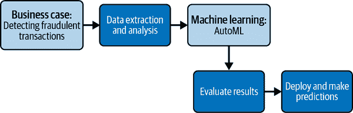

###### 图 5-1\. 欺诈检测项目的整体工作流程。

现在您了解了业务用例和目标，可以像以前的项目一样进行数据提取和分析。完成数据提取和分析后，您将上传数据集到 AutoML 平台。各种特征（即将介绍）将被输入模型中。您将评估 AutoML 的结果，然后部署模型进行预测。完成这些活动后，您将为工程团队准备好基准模型，以便开始开发更好的欺诈检测管道。也许这个模型实际上会投入生产。

## 项目数据集

该项目数据集包含模拟的交易数据，以复制用户行为和欺诈交易。这是使用[PaySim](https://oreil.ly/VtIDP)完成的。PaySim 是一组研究人员开发的开源工具，当时他们正在研究大数据分析的可伸缩资源有效系统。¹

由于金融交易数据可能会暴露用户信息，所以您的公司决定使用这些模拟数据。贵公司的数据分析师已确认，分享的数据集在分布上与贵公司应用程序中看到的实际数据非常相似，因此您可以继续假设该数据代表了贵公司在预测时要利用的真实世界数据。

数据集已作为 CSV 文件存储在 Google Cloud Storage 中（可在*https://oreil.ly/n1y1X*下载）。在您的数据集版本中，共有 10 列。表 5-1 提供了这些列的列名、数据类型以及有关这些列可能值的一些信息。

表 5-1\. 客户流失数据集的模式和字段值信息

| 列名 | 列类型 | 关于字段值的备注 |
| --- | --- | --- |
| `step` | Integer | 自生成模拟数据以来的小时数 |
| `type` | String | 交易类型 |
| `amount` | Float | 交易金额 |
| `nameOrig` | String | 发起交易的客户的匿名化姓名 |
| `oldbalanceOrg` | Float | 发起方交易前的初始余额 |
| `newbalanceOrig` | Float | 发起方交易后的新余额 |
| `nameDest` | String | 目标账户所有者的匿名化姓名 |
| `oldbalanceDest` | Float | 目标账户交易前的初始余额 |
| `newbalanceDest` | 浮点数 | 交易后目标账户的新余额 |
| `isFraud` | 整数 | 如果交易是欺诈，则为 1，否则为 0 |

# 使用 Pandas、Matplotlib 和 Seaborn 探索数据集

此节中的所有代码，包括一些额外的示例，都包含在 [GitHub 上的 low-code-ai 仓库](https://oreil.ly/supp-lcai) 的 Jupyter 笔记本中。你将从头开始创建这个笔记本，但 GitHub 上的笔记本非常适合在独立工作或遇到困难时使用。

就像在 第四章 中那样，你将在 Jupyter Notebook 环境中加载 CSV 文件并使用 Pandas、Matplotlib 和 Seaborn 分析和探索数据，以更好地理解你的特征。你将利用这个过程中获得的信息来选择最佳的特征集用于你的 AutoML 模型。

## 在 Google Colab 笔记本中将数据加载到 Pandas DataFrame

首先，前往 [*https://colab.research.google.com*](https://colab.research.google.com)，打开一个新的笔记本，按照第二章和第四章中讨论的过程进行操作创建 Google Colab 笔记本。你可以通过点击名称并替换当前名称为一个更有意义的名称，比如 *Fraud_Detection_Model.ipynb*，对此笔记本进行重命名。

接下来，在第一个代码块中输入以下代码以导入分析和可视化金融交易数据集所需的包，并执行该单元格：

```
import matplotlib.pyplot as plt
import numpy as np
import pandas as pd
import seaborn as sns

%matplotlib inline
```

现在导入了所需的包，下一步是将数据加载到 Pandas DataFrame 中：

```
url = ('https://storage.googleapis.com/' +
'low-code-ai-book/financial_transactions.csv')

transaction_df = pd.read_csv(url)
```

现在你的数据已经加载到 DataFrame 中了。在继续之前，查看几行数据总是一个好主意。要查看前几行数据，请将以下代码添加到新单元格中并执行该单元格：

```
transaction_df.head()
```

现在看看 DataFrame 中的前五行数据。这将帮助你了解不同列的样子。你注意到数据有什么特点？表格 5-2 和 5-3 显示了此行代码的输出。

表格 5-2\. `transaction_df.head()` 语句输出的前六列

| `step` | `type` | `amount` | `nameOrig` | `oldbalanceOrg` | `newbalanceOrig` |
| --- | --- | --- | --- | --- | --- |
| `1` | `PAYMENT` | `9839.64` | `C1231006815` | `170136.0` | `160296.36` |
| `1` | `PAYMENT` | `1864.28` | `C1666544295` | `21249.0` | `19384.72` |
| `1` | `TRANSFER` | `181.00` | `C1305486145` | `181.0` | `0.00` |
| `1` | `CASH_OUT` | `181.00` | `C84003671` | `181.0` | `0.00` |
| `1` | `PAYMENT` | `11668.14` | `C2048537720` | `41554.0` | `29855.86` |

表格 5-3\. `transaction_df.head()` 语句输出的后五列

| `nameDest` | `oldbalanceDest` | `newbalanceDest` | `isFraud` | `isFlaggedFraud` |
| --- | --- | --- | --- | --- |
| `M1979787155` | `0.0` | `0.0` | `0` | `0` |
| `M204428225` | `0.0` | `0.0` | `0` | `0` |
| `C553264065` | `0.0` | `0.0` | `1` | `0` |
| `C38997010` | `21182.0` | `0.0` | `1` | `0` |
| `M1230701703` | `0.0` | `0.0` | `0` | `0` |

到目前为止，注意`step`列在您正在查看的所有行中的值为`1`。这可能有很多原因。例如，所有行可能具有相同的值，数据可能按`step`分组，或者仅仅是一个巧合，因为我们只看了五行。在这种情况下，实际上数据是按`step`按升序排序的，尽管从仅五行数据中完全不清楚。

您可能还注意到`type`列与`oldbalanceDest`和`newbalanceDest`列的模式。在这些行中，每当出现`PAYMENT`或`TRANSFER`交易类型时，`oldbalanceDest`和`newbalanceDest`列都为零。这可能是一个巧合，但您应该在稍后的数据集中探索这一点。

在 DataFrame 的最后一列中，您应该注意到一些奇怪的事情。有一列`isFlaggedFraud`，这在原始模式中是看不到的。这可能有很多原因，但这也是基本数据探索可以派上用场的另一个原因。如果在实践中遇到这种情况，您可能需要重新联系共享数据的人员或团队，以验证该列是否应该存在，以及它代表什么。

在这种情况下，您了解到这是一个列，它显示了上一个模型预测的输出，指示交易是否合法或欺诈。为什么这会成为您的模型不应使用的不良特征？因为在预测时可能没有`isFlaggedFraud`。理想情况下，这是来自一个您将废弃的模型，一旦部署了一个新的更好的模型。然而，这一发现仍然很有用。您可以使用以前的模型作为基准进行比较，确保您的新模型显示出改进。

## 探索数据集

正如您在第四章中所看到的，AutoML 将在训练模型之前做大量工作来描述您的特征并执行特征工程，但重要的是您仍然要花时间了解用于训练模型的数据。机器学习对数据质量非常敏感。如果您的数据存在问题，它们在使用 AutoML 过程中不会神奇地消失。

### 描述性分析

首先，在您的 DataFrame 上使用`.info()`方法，快速了解您正在处理的数据量和列的数据类型。将以下代码添加到一个单元格中并执行以执行此操作：

```
transaction_df.info()
```

您应该看到有 6,362,620 行交易数据和您预期的 11 列。数据类型都符合预期的类型（`object` 类型对应于 Pandas DataFrame 中的字符串数据类型）。

正如以往一样，在 Pandas 中快速查看数据集的描述统计信息的最简单方法是使用`.describe()`方法。在您的笔记本中创建一个新单元格，添加以下代码，并执行该单元格以查看描述统计信息（如图 5-2 所示）：

```
transaction_df.describe()
```

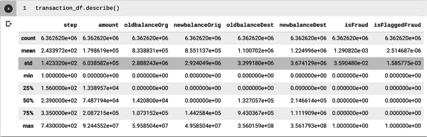

###### 图 5-2\. `transaction_df.describe()`的渲染输出。

看起来每行的计数显示没有空值。`step`字段在 1 到 743 之间变化相对均匀。`amount`、`oldbalanceOrg`、`newbalanceOrig`、`oldbalanceDest` 和 `newbalanceDest` 在一个较大范围内变化，但这在金融交易中是可以预期的。

`isFraud`列展示了数据集的一个有趣特征。一个字段只有值 0 和 1 的均值对应于值等于 1 的比例。在这种情况下，大约有 0.129% 的交易确实是欺诈交易，或者大约每 800 笔交易中就有一笔是欺诈交易。这代表了一个相当不平衡的数据集，在尝试构建分类模型时可能会导致问题。您将在后续部分探索这些问题和可能的解决方案，但现在继续探索数据。

`isFlaggedFraud`列中被标记为欺诈交易的行数大约是实际欺诈交易数量的两倍。这是一件坏事吗？未必。您希望能够捕捉到欺诈交易，如果在进一步考虑后将一些额外标记的交易识别为合法交易，那么这就是为了捕捉欺诈交易而付出的小代价。然而，如果标记了太多额外的交易，那么您将浪费大量时间和资源来探索合法交易。这些都是您在近期评估模型时需要考虑的因素。

尽管如此，您的描述性分析中还缺少一些列。请注意，您仅对数值特征（整数和浮点数类型的列）进行了统计，但缺少了`type`、`nameOrig`和`nameDest`列的数据。如果数值和分类特征混合，`describe()`方法只会返回数值特征的统计信息。要查看分类特征的描述统计信息，请将范围限制为这些列。要执行此操作，请将以下代码添加到新单元格，并执行该单元格：

```
cols = ['type', 'nameOrig', 'nameDest']
transaction_df[cols].describe()
```

你正在定义一个列的列表，你希望查看描述性统计信息，并使用符号`transaction_df[cols]`，仅考虑`.describe()`方法中的这些列（图 5-3）。

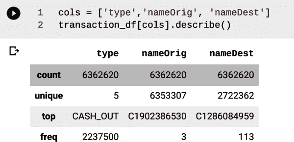

###### 图 5-3\. 分类列的`describe()`方法的代码和输出。

再次看到，通过将`count`与 DataFrame 中的行数进行比较，可以看到每行这些列都有一个值。预期地，`type`列有五个唯一值，但请注意`nameOrig`列几乎与交易的一对一关系。特别地，`nameOrig`列有 6,353,307 个值，而总交易数为 6,362,620。这不是一个好的迹象，用于构建良好模型的特征。为什么呢？因为如果有一个特征可以识别一行或几乎识别一行，那么你的模型可能只看这个值而不会学习更复杂的特征关系。对于`nameDest`列来说，这似乎不是那么大的问题，但考虑到唯一值的数量很大，仍然存在风险。

###### 提示

AutoML 将为您执行特征工程和选择，但如果您可以提供一个更好的特征集开始，您仍然会看到更好的性能。例如，您可以重新创建`nameOrig`和`nameDest`特征作为布尔值列，其中如果该值重复超过一次，则该值为`True`，否则为`False`。这是正确的方法吗？也许是。要验证这一点，您应该与领域专家联系，并尝试不同的特征转换，看看哪种方法最有效。在处理接下来的章节时，您将更多地了解整体特征工程。

### 探索性分析

在可视化数据的某些特征之前，值得探索前一个模型的表现如何。一个简单的方法是创建一个新列，称为`isCorrect`，如果`isFraud`和`isFlaggedFraud`相同，则为 1，否则为 0。要计算这个新列并计算旧模型正确预测欺诈交易的次数，请在新单元格中执行以下代码：

```
transaction_df['isCorrect'] = (
    transaction_df['isFraud'] == transaction_df['isFlaggedFraud']
)
transaction_df['isCorrect'].sum()
```

你应该看到`6354423`的结果，但这实际上意味着什么呢？在 Python 中，布尔数据类型有两个可能的值：`True`和`False`。当你使用`sum`函数时，它将`True`值视为 1，`False`值视为 0。因此，你看到的结果是从语句`transaction_df['isFraud'] == transaction_df['isFlaggedFraud']`中`True`值的数量。当这些列具有相同值时返回`True`，否则返回`False`。回想一下总共有`6362620`行数据，这意味着 99.87%的交易被正确标记。

所以，旧模型是一个真正好的模型，对吧？大多数交易都不是欺诈交易，而这些是您最担心的交易。但请考虑另一个相关的问题：它正确预测了多少笔欺诈交易？您可以通过询问`isFraud`列的值为`1`并且`isCorrect`列也为`1`来找出答案。在新单元格中执行以下代码以查看结果：

```
(transaction_df['isFraud']*transaction_df['isCorrect']).sum()
```

为什么这行代码告诉您成功标记的欺诈交易数量？如果交易是欺诈的，`isFraud`列的值只有 1，而且如果预测是正确的，则`isCorrect`列为`True`（在算术中视为`1`）。因此，将这些列的值相乘只有在两列的值都为 1 时才会得到 1，否则乘积将为 0。将 1 的数量相加即可得到正确标记的欺诈交易总数。

16 个正确标记的欺诈交易。通过使用代码`transaction_df['isFraud'].sum()`，您可以看到总共有 8,213 笔欺诈交易。这意味着只有 0.19%的欺诈交易被成功标记。当我们询问一个略有不同、可能更相关的问题时，这个模型表现非常糟糕。这是一个被称为*召回率*的指标的例子。在选择模型目标并在本章后面考虑评估指标时，您将探讨如何解释 AutoML 中可用的不同指标。

您可以通过创建条形图来可视化数据的另一种方式，以了解每个值的欺诈交易百分比。例如，对于`type`特征，有五个值。要创建这样的条形图，请在新单元格中使用以下代码来创建可视化效果：

```
transaction_df.groupby('type')['isFraud'].mean().plot.bar()
```

这行代码根据`type`的值对行进行分组，并取`isFraud`列的平均值。请记住，由于`isFraud`的值为 1 或 0，这相当于值为 1 的百分比。然后，使用`plot.bar()`方法将结果绘制成条形图，如图 5-4 所示。

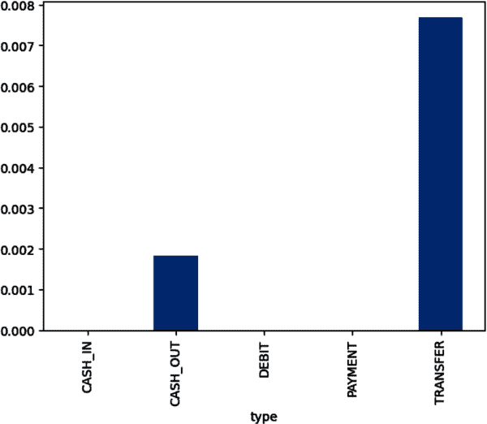

###### 图 5-4\. 欺诈交易百分比的条形图与交易类型。

您应该立即注意到一些有趣的事情。您的数据集中只有两种交易类型有欺诈交易：`CASH_OUT`和`TRANSFER`。您可以使用以下代码确认这一点：

```
transaction_df.groupby('type')['isFraud'].value_counts()
```

输出每个值组合出现的次数。您应该看到的输出将类似于表 5-4。

表 5-4\. `value_counts()`函数的输出

| `type` | `isFraud` |   |
| --- | --- | --- |
| `CASH_IN` | `0` | `1399284` |
| `CASH_OUT` | `0` | `2233384` |
|   | `1` | `4116` |
| `DEBIT` | `0` | `41432` |
| `PAYMENT` | `0` | `2151495` |
| `TRANSFER` | `0` | `528812` |
|   | `1` | `4097` |

在这种情况下，您可以确认欺诈交易仅出现在提到的交易类型中。这意味着——只要这个数据集真正代表了贵公司看到的交易——这可能是一个非常有用的特征。然而，如果新类型的欺诈交易开始出现，您的模型几乎肯定会错过它们，因为它从未见过这样的例子。

###### 注

随着时间的推移监控欺诈交易的交易类型，并根据需要重新训练模型将是非常重要的。关于模型监控和持续训练的讨论超出了本书的范围，但这绝对是一个值得关注的概念。

另一种可视化具有分类标签数据的有用方法是将数值特征分桶，并查看每个桶中欺诈行为与合法行为的百分比。*桶化*，或称为*离散化*，是将数值变量分割成值范围或“桶”的过程，并将每个元素分配到一个桶中。您在第四章中创建直方图时也做过这样的操作。您可以用这种方法来探索交易金额以及原始账户和目标账户的新旧余额特征。

例如，假设您想可视化`amount`特征不同范围的百分比：

```
transaction_df['amountBkts'] = pd.qcut(transaction_df['amount'], 10)
transaction_df.groupby('amountBkts')['isFraud'].mean().plot.bar()
```

在查看输出之前，先花点时间解析代码的第一行。您正在为 DataFrame 创建一个名为`amountBkts`的新列，该列将包含桶信息。`pd.qcut()`函数基于分位数分配桶。您正在将`amount`列分成 10 个桶。第一个桶包含从 0 到 10 分位数的数据，第二个包含从 10 到 20 分位数的数据，依此类推（参见图 5-5）。

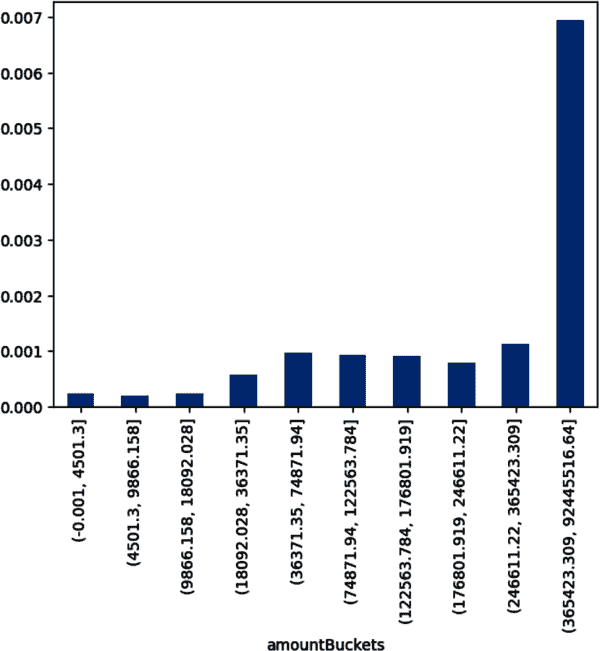

###### 图 5-5\. 交易金额列的欺诈交易百分比与十分位数范围。

您可以在这里看到一个普遍的趋势，这暗示了您可能直觉上考虑过的一些内容。交易金额越大，交易很可能是欺诈的可能性就越大。特别是，您会看到在金额超过 90 分位数的交易中，欺诈交易率增加了七倍。

要查看`oldbalanceOrg`列的同样可视化效果，请将以下代码添加到一个新的单元格并执行该单元格：

```
transaction_df['oldbalanceOrgBkts'] = pd.qcut(transaction_df['oldbalanceOrg'],
                                              10, duplicates='drop')
transaction_df.groupby('oldbalanceOrgBkts')['isFraud'].mean().plot.bar()
```

`pd.qcut()`函数中有一个新的参数`duplicates='drop'`。该参数用于将重复的桶合并为一个单独的桶。在这种情况下，`oldbalanceOrg`列的第 30 百分位数为 0，因此前三个桶将相同。这些桶被合并到第 30 到 40 百分位的桶中。

如你在图 5-6 中所见，`oldbalanceOrg`和`isFraud`之间显然存在某种关系。总体趋势是，发起账户的旧余额越高，欺诈的可能性也越高，但仅限于某个点。这种欺诈可能性在数值处于第 90 到 100 百分位区间时会降低。

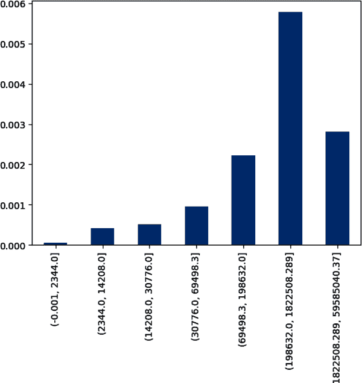

###### 图 5-6\. 旧发起余额列的欺诈交易百分比与十分位范围。

作为一个练习，以类似的方式探索其他数值特征与标签之间的关系。这些示例的代码可在 GitHub 笔记本中找到，并且对应的可视化可以在图 5-7、5-8 和 5-9 中找到。

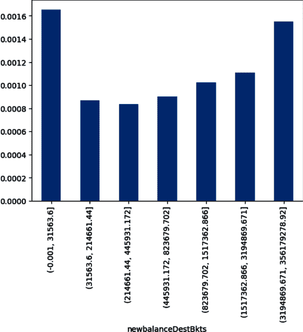

###### 图 5-7\. 新目标余额列的欺诈交易百分比与十分位范围。

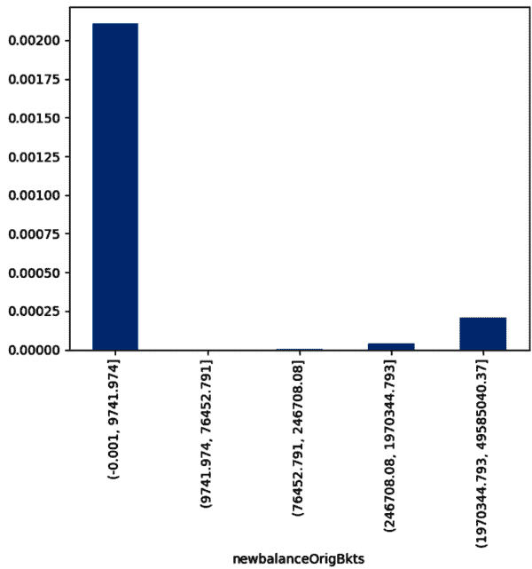

###### 图 5-8\. 新起源余额列的欺诈交易百分比与十分位范围。

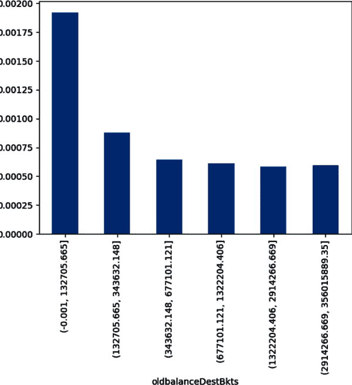

###### 图 5-9\. 旧目标余额列的欺诈交易百分比与十分位范围。

探索交易的其他方法有很多。例如，你知道历史上只有两种类型的交易是欺诈性的。你可以为其中一种类型，比如`CASH_OUT`，创建一个散点图，其中你将`newbalanceDest`与`oldbalanceDest`进行绘制，然后根据它们是否欺诈性着色。使用以下代码创建此可视化：

```
cashout_df = transaction_df.query("type == 'CASH_OUT' & newbalanceDest < 1e8")
cashout_df.plot.scatter(x='oldbalanceDest',
                        y='newbalanceDest',
                        c='isFraud',
                        colormap='YlOrRd',
                        alpha=0.1)
```

第一行应用了两个过滤器。第一个过滤器提取了 `type` 为 `CASH_OUT` 且 `newbalanceDest` 小于 `1e8` 或 100,000,000 的所有交易。第二行是关于构建散点图的。我们设置了 `x` 和 `y` 轴列，用于着色点的列 (`isFraud`)，以及一个颜色映射 `YlOrRd`，使点更易于分辨。这种特定的颜色映射将 `isFraud=1` 分配为较深的颜色（红色），将 `isFraud=0` 分配为较浅的颜色（黄色）。有关其他颜色映射，请参阅[Matplotlib 文档](https://oreil.ly/oDW76)。最后，由于要绘制许多点，我们设置 `alpha=0.1` 以在点上添加少量透明度。这使得可视化更易于解析（见图 5-10）。

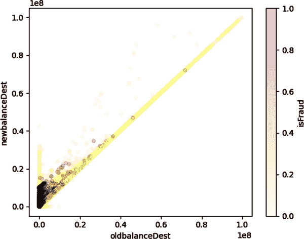

###### 图 5-10\. 以 `CASH_OUT` 交易类型为基础，绘制 `newbalanceDest` 相对于 `oldbalanceDest` 的图，根据 `isFraud` 的值进行着色。

看起来有一些区域的点比黄色更接近红色，或者存在更多的欺诈交易而非合法交易。这表明这两列之间存在某种交叉相关性。这种关系可以通过一些不同的方式捕捉，如*特征交叉*，AutoML 将在特征选择和工程过程中使用它。特征交叉是通过连接两个或更多预先存在的分类特征来创建合成特征的过程。在处理自定义代码模型时，您将在第 8 章手动执行此过程。

作为练习，继续使用本章和前一章介绍的工具直观地探索数据集。看看是否能发现一些意想不到的新见解。

## 导出数据集

在探索数据集之后，您可以将其导出为 Vertex AI AutoML 最终可用的形式。您将在这里看到如何执行此操作的提醒，但请注意，数据已经存储在 Google Cloud Storage 中的 CSV 文件和存储在 BigQuery 表中，因此在下一节中，您无需加载导出的数据集。如果您有兴趣了解如何将数据加载到 BigQuery 中，这将是您在项目中完成的步骤之一，详见第 6 章。

要将 Pandas DataFrame 中的数据导出到 CSV 文件，您可以使用以下代码：

```
transaction_df.to_csv('transactions.csv', encoding='utf-8', index=False)
```

每次在将 CSV 文件写入后，检查其内容都是一个好习惯，可以使用 `!head` 命令执行此操作：

```
!head transactions.csv
```

要下载文件，请按照第四章中的过程进行操作。此外，Google Colab 在 `google.colab` 包中还有一个功能可以为您下载文件。要使用此功能，请从 `google.colab` 包中导入该函数，并将文件下载到您的本地机器：

```
from google.colab import files
files.download('transactions.csv')
```

###### 警告

虽然通过编程方式下载文件是 Google Colab 的一项非常方便的功能，但这也是为什么非常重要要仔细查看您运行的任何笔记本，并确保您理解在笔记本中运行的代码。您不希望将可能具有恶意性质的意外文件下载到您的计算机上，避免这种情况的最简单方法是仔细阅读执行的代码。

# 分类模型和度量

在开始训练模型之前，让我们先了解一下分类模型是什么，以及如何正确评估它们。更多数学细节将在第七章中找到，但是只要对分类模型有基本的理解，您就可以理解结果并检测模型的问题行为。

*分类模型* 是一种返回分类输出的模型，比如 *猫、狗、鱼* 或 *欺诈* 。在分类模型中，您事先知道要区分的类别。这些类别也可以是数字；例如，评级或使用数值标签替代分类标签的问题。在本章中，您的问题是 `0` 和 `1`，分别代表 *合法* 和 *欺诈* 交易。

在实践中，分类模型并不直接返回预测的类别，而是返回所有可能类别的概率。通常情况下，预测的类别只是最可能的类别。在二元分类的情况下，可能不是这样。例如，假设只有当模型输出显示交易是 *欺诈* 的概率至少为 50%时，才将其分类为 *欺诈* 。这样可能会漏掉一些欺诈案例。另一方面，如果将 *阈值* 设置得太低，例如 5%，则可能会将太多的交易标记为欺诈，从而浪费大量资源进一步探索这些交易。正如您所想象的，确定阈值的确切位置既是建模问题也是业务问题。

为了确定阈值的设置位置，您可以利用不同的评估指标根据业务需求做出决策。准确率是一种简单易懂的分类模型常用指标。然而，正如您已经看到的，单独使用准确率作为主要评估指标存在危险。毕竟，原始模型的准确率很高，超过 99%，但几乎没有捕捉到任何欺诈交易。准确率仍然是一个重要的指标，但它并不能总是提供完整的画面。

当存在类别不平衡时，即一个类别比其他类别常见得多时，往往会出现这类问题。在这里，只有 0.129%的交易是欺诈的。欺诈与合法的比例接近 1:800。这种情况意味着某些问题很容易被像准确率这样的指标掩盖。在诸如欺诈检测之类的场景中，*阳性* 类别非常罕见，单靠准确率很快就变得不可靠。

您可以结合准确率、召回率和精确率来更清楚地了解模型的性能。*召回率* 可以视为真阳性率。在这个欺诈交易的例子中，召回率表示模型成功预测的欺诈交易的百分比。*精确率* 可以视为模型在预测阳性案例时正确的概率。在欺诈交易问题中，精确率表示被预测为欺诈交易的交易中确实是欺诈的百分比。如果您的目标是主动标记欺诈交易进行审核，那么召回率将是一个非常重要的指标。您可能愿意在提高召回率的同时牺牲一些准确率或精确率。当然，这仍然是您需要权衡的事情，因为审核大量交易会有资源成本。

通常，召回率和精确率是基于混淆矩阵计算的。*混淆矩阵* 将预测结果按预测类别和实际类别分解为表格。如 表 5-5 所示。

表 5-5\. 一般问题的混淆矩阵

|   | 预测阳性 | 预测阴性 |
| --- | --- | --- |
| 实际阳性 | 真阳性 (TP) | 假阴性 (FN) |
| 实际阴性 | 假阳性 (FP) | 真阴性 (TN) |

召回率被定义为 <math><mfrac><mrow><mi>T</mi><mi>P</mi></mrow> <mrow><mo>(</mo><mi>F</mi><mi>N</mi><mo>+</mo><mi>T</mi><mi>P</mi><mo>)</mo></mrow></mfrac></math> ，即被预测为正的实际正例的百分比。精确度被定义为 <math><mfrac><mrow><mi>T</mi><mi>P</mi></mrow> <mrow><mo>(</mo><mi>F</mi><mi>P</mi><mo>+</mo><mi>T</mi><mi>P</mi><mo>)</mo></mrow></mfrac></math> ，即被预测为正的实际正例的百分比。正如你所预期的那样，在实践中，精确度和召回率之间存在一种平衡。对于正类别的阈值较低（例如*欺诈交易*），会导致更多的假阳性和更少的假阴性，因此精确度较低而召回率较高。另一方面，对于正类别的阈值较高会导致更多的假阴性和更少的假阳性，因此精确度较高而召回率较低。

###### 提示

哪个更重要：精确度还是召回率？很多时候，这个问题的答案取决于业务决策。你的优先事项是什么？例如，如果你的公司希望尽可能捕获欺诈交易，但也愿意检查一些合法交易，那么你可能会倾向于将召回率作为你的评估指标。

如何确保你在精确度和召回率之间找到了正确的平衡？一个度量标准被称为*F1 分数*，它是精确度和召回率的*调和平均数*。一般来说，调和平均数通常被认为是比率的“最佳平均数”。对于两个数字，可以很容易地写下来。假设 <math><mi>P</mi></math> 是精确度，<math><mi>R</mi></math> 是召回率。那么 F1 分数可以用以下公式计算：

<math><mrow><mtext>F1 分数</mtext> <mo>=</mo> <mfrac><mrow><mn>2</mn><mo>(</mo><mi>P</mi><mo>×</mo><mi>R</mi><mo>)</mo></mrow> <mrow><mi>P</mi><mo>+</mo><mi>R</mi></mrow></mfrac></mrow></math>

F1 分数倾向于更偏向于精确度和召回率中较小的那个。因此，这可以是一个很好的度量标准，以确保你不会为了优化一个而牺牲另一个。

精确度和召回率在很大程度上取决于设定的阈值，但也取决于底层模型。在你的度量标准（包括准确度）如此依赖于阈值时，如何决定底层模型？有些度量标准仅依赖于底层模型，例如接收器操作特性曲线下面积（ROC AUC）和精确率-召回率曲线下面积（PR AUC）。这两个度量标准都在 0 到 1 之间变化。你的度量标准越接近 1，模型就越好。对这些度量标准的深入讨论超出了本章的范围，但直观理解对实践很有帮助。

ROC 曲线绘制了召回率（或真正例率）与假正例率之间的关系，假正例率定义为被错误分类为正例的负例百分比。该曲线上的不同点对应于不同的阈值，因此整体曲线涵盖了所有可能的阈值。曲线下面积，即 ROC AUC，可以看作是模型（独立于阈值）在给出一个正例确实是正例的更高概率时的机会，与一个负例相比。这对于分类问题是一个非常有用的度量标准，但在数据集不平衡或误判一个负例的成本比误判一个正例的成本更高的情况下，通常不那么实用。在这里，可以合理地认为您所处的情况正是如此，即错过一个欺诈交易的成本可能比查看一个合法交易更高。

另一个度量标准是 PR 曲线。其概念与 ROC 曲线相同，但这里是将精确率与召回率相对比。在不平衡数据集的情况下，PR 曲线往往是一个更强的度量标准。为什么呢？好吧，精确率和召回率都集中在正类上，如果将正类设置为较稀少的类别，那么你的度量标准就是基于成功预测该类别而不是整个数据集。

在接下来的部分中，当评估您在 AutoML 中训练的模型时，您将看到 ROC 曲线和 PR 曲线的示例。

# 使用 AutoML 训练分类模型

现在您已经探索了数据，可以使用 AutoML 训练模型了。类似于第四章，您将在 Vertex AI 上创建一个受管数据集，然后探索数据集统计信息。然后您将训练模型并检查模型性能。由于分类度量标准可能对您来说较新，您将花一些时间研究这些内容，然后再深入了解特征重要性并使用模型进行预测。

这些步骤中的许多细节在第四章中详细介绍了回归问题。因此，本章节中的某些主题将以较简略的方式处理，并建议您回顾第四章以获取更多详细信息。

## 创建受管数据集并选择模型目标

前往[*console.cloud.google.com*](https://console.cloud.google.com)，然后进入 Vertex AI（可以使用侧边菜单或搜索栏）。从那里，选择数据集，然后在数据集页面点击创建按钮。用`fraud_detection`替换自动生成的名称。类似于第四章的项目，首先需要选择数据类型和目标。由于您处理的是表格数据并希望解决分类问题，您应该选择 Tabular，然后选择“回归/分类”，如图 5-11 所示。


###### 图 5-11\. 您的新`fraud_detection`数据集所需的选项。

点击创建按钮，您将进入下一页，在此页面中，您可以指定源数据。这里您有两个选择：Google Cloud Storage 中的 CSV 文件，这是您在笔记本探索中使用的文件，或者事先为您准备好的 BigQuery 表中的表格。存储在 BigQuery 中的数据将附带额外的架构信息，例如每个列的数据类型，这是 CSV 文件中不包含的，因此您将使用这种方法。

在“选择数据源”下，点击“选择 BigQuery 中的表或视图”的单选按钮，然后输入以下 BigQuery 路径，点击继续按钮：

```
ma-low-code-ai.low_code_ai.financial_transactions
```

数据加载和预处理大约需要 15-20 分钟。AutoML 会执行大量额外的预处理工作，以分析和准备数据以进行即将进行的训练作业。之后，您将可以在 Vertex AI 数据集 UI 中探索数据。

## 探索数据集统计信息

一旦数据加载并准备就绪，您可以开始分析数据集。点击生成统计信息按钮。生成统计信息可能需要几分钟时间。生成完成后，您可以点击各个列并查看统计信息。根据之前的分析，不应该有任何意外，但在继续之前值得再看一眼。例如，如果点击`type`列，您将看到图 5-12 中显示的统计信息。您将看到没有缺失值；有五个不同的值，这些值的出现次数的详细分解。新的部分应该是漂亮的可视化图表，可以快速地视觉解析每个值在总数中的占比。

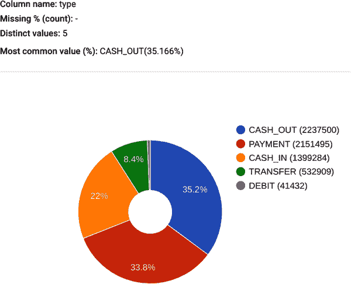

###### 图 5-12\. 由 Vertex AI 生成的`type`列的列统计。

在进入下一节之前，请逐列检查确保所有内容与您之前分析的预期一致。特别关注数据类型和统计信息，并确保没有任何意外情况。这次您不会发现任何意外，但养成这种习惯是很好的，确保在使用 AutoML 进行任何训练之前进行充分的检查是最佳实践。

## 训练模型

要训练您的模型，请点击“训练新模型”按钮，并选择“其他”选项（如图 5-13 所示）。确保选择分类作为目标，并选择 AutoML 作为模型训练方法，然后点击“继续”按钮。

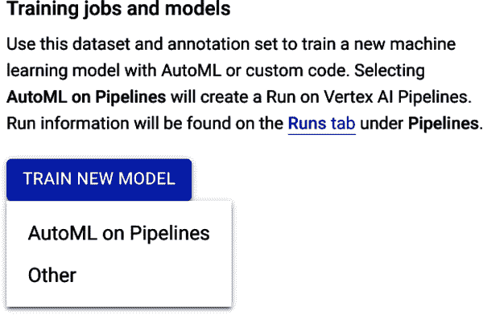

###### 图 5-13\. 在 Vertex AI AutoML 中训练新模型的选项。

接下来，在“模型详细信息”页面上，选择“训练新模型”，将模型名称设为`fraud_detection`。同时，选择`isFraud`作为目标列。您的输入应该与图 5-14 中显示的相同。点击“继续”按钮进入下一页。

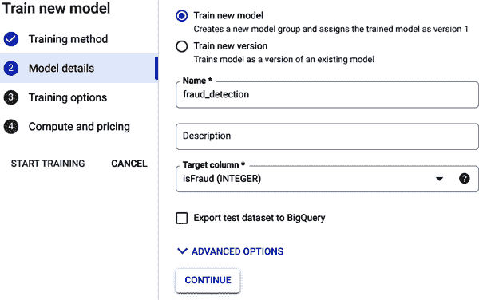

###### 图 5-14\. 模型名称和目标列选定后的模型详细信息页面。

在“训练选项”页面上，选择要用于训练的特征，并确保这些特征被正确地视为分类或数值。在屏幕右侧，点击`isFlaggedFraud`、`nameDest`和`nameOrig`特征旁边的减号。这将从训练过程中删除这些特征。确保`step`特征也被视为分类特征。这一点非常重要，因为它代表一个时间段而不是数值。特别是，`step`为 10 不应被认为比`step`为 5 对模型具有两倍影响力。参见图 5-15 查看在点击“继续”按钮之前您的页面应该是什么样子。

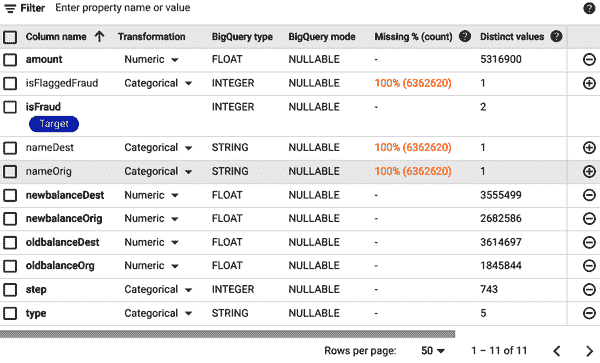

###### 图 5-15\. 选定选项后的训练选项页面。

在最终的“计算和定价”页面上，您将设置训练预算。请注意，定价是按每小时训练时间计算的。有关最新定价，请参阅[Vertex AI 文档](https://oreil.ly/x8C3f)。考虑到这一点，将预算设定为一小时。确保选择了早停功能，因为它会在不再看到改进时终止模型训练过程。如果您设置了较高的预算但最终并不需要那么多时间，这将非常有用。完成后，点击“开始训练”。

模型训练完成后，您将收到一封电子邮件通知，并且该模型将注册到模型注册表中。

## 评估模型性能

一旦你的模型完成训练过程，你就可以查看评估指标了。通过侧边菜单或搜索栏导航到 Vertex AI 模型注册表。点击你的模型 `fraud_detection`，然后点击你想查看的相应版本。如果你在跟随本章，那将是版本 `1`。

由于你最关心尝试预测欺诈交易，点击图中突出显示的 1 类（在图 5-16 中）来查看你的模型在由 AutoML 分离的测试数据集上的表现。请注意，由于模型训练过程中的随机性，你的模型评估指标可能与本章中显示的有所不同。

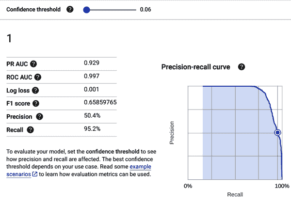

###### 图 5-16\. `fraud_detection` 模型的模型评估指标。

注意置信阈值的滑块。你可以移动它来查看它对精确度和召回率的影响。例如，假设你的公司愿意有多达 50% 的标记交易是合法的，以便尽可能多地捕捉欺诈，同时仍然有资源检查标记的交易。对于图 5-16 所代表的模型，对应于 50% 精确度的阈值为 0.06。也就是说，如果模型预测欺诈的概率超过 6%，你会希望将其标记为欺诈并进行检查。请注意，这种情况下的召回率为 95.2% — 换句话说，在这种情况下，预期有 20 笔欺诈交易中只会漏掉 1 笔。

最佳置信阈值将取决于你的业务需求和目标，因此在这里没有单一正确答案。

## 模型特征重要性

如果你在 UI 侧边栏点击“所有标签”，然后滚动到页面底部，你可以看到模型的特征重要性。从第四章回顾，特征重要性衡量了特征对模型预测的影响。请注意，与评估指标一样，你在模型中看到的确切重要性可能与本章显示的重要性有所不同。

这个模型的特征重要性显示在图 5-17 中。`oldbalanceOrg` 和 `newbalanceOrig` 特征是最重要的特征，而 `amount` 和 `type` 分别排在第三和第四位。回想一下，在笔记本环境中探索数据时，这些特征似乎在特征值与欺诈交易百分比之间有最清晰的模式。总的来说，检查这些特征是很重要的，以确保你的模型学到的内容没有什么异常之处。模型可能会注意到你可能没有注意到的模式，这并不罕见，但如果你的模型似乎学到了一些荒谬的东西，这应该是一个警告信号。例如，如果一个预测出租车费用的模型学到了乘车距离是最不重要的特征，在某些情况下，这可能是一个需要更仔细探索数据的原因。特征重要性对于利益相关者来说非常有用，以了解模型如何进行预测；对于数据科学家和机器学习工程师来说，它们在调试模型时理解意外或荒谬预测的方式也非常有帮助。

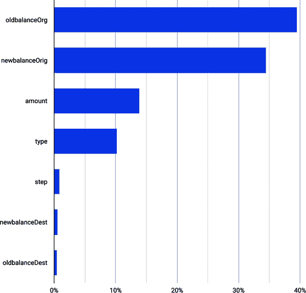

###### 图 5-17\. `fraud_detection` 模型的特征重要性。

## 从您的模型获取预测结果

现在，您已经看到了模型的评估指标，可以准备部署模型进行预测了。如果在部署模型的过程中遇到困难，请参考 第 4 章，因为本章的过程与该章相同。

完成以下步骤来部署您的模型，将所有未提及的选项保留为默认值：

1.  在“定义您的端点”页面上，将端点命名为 `fraud_endpoint`。

1.  在“模型设置”页面上，选择 `n1-standard-2, 2vCPUs, 7.5GiB memory` 作为机器类型。使用较小的机器类型将降低部署模型的成本，并满足本示例中的需求。

1.  在“模型设置”页面上，在可解释性选项下，选中“为该模型启用特征归因”复选框。

1.  在“模型监控”页面上，禁用模型监控，因为在这里你不需要它。

完成这些步骤后，点击部署。模型将需要几分钟来部署。一旦模型完成部署，您可以在页面底部测试模型。

使用以下值来测试您的模型，注意，再次强调，您的确切结果将与 图 5-18 中显示的模型有所不同：

| `step` | `14` |
| --- | --- |
| `type` | `CASH_OUT` |
| `amount` | `1000000` |
| `oldbalanceOrg` | `1000000` |
| `newbalanceOrig` | `0` |
| `oldbalanceDest` | `0` |
| `newbalanceDest` | `0` |

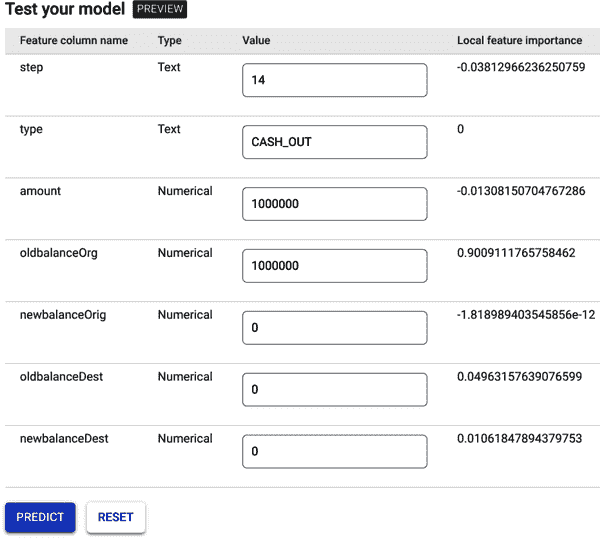

###### 图 5-18\. 使用预测和本地特征重要性进行模型测试。

一旦完成，点击“预测”按钮。要查看您模型预测的欺诈交易的概率，将“选择的标签”改为 1。

对于图 5-18 中所示的模型，“置信度分数”是预测概率。在这种情况下，它给出了交易欺诈的可能性为 91%。基于之前关于评估指标和阈值的讨论，该交易将被标记为欺诈。您还可以看到局部特征重要性。最高的特征重要性值对应于`oldbalanceOrg`特征。在这种情况下，存在一个精确余额为 100 万美元的账户的`CASH_OUT`交易。根据您的模型，这笔交易有很高的欺诈可能性。

作为练习，探索不同特征值的组合，并查看预测的概率和相应的特征归因。

###### 警告

完成本章后，不要忘记*取消部署*您的模型。已部署的模型即使未被使用也会产生费用，以便随时返回快速预测。取消部署模型时，请转到 Vertex AI 端点，点击端点名称为`fraud_endpoint`，点击“更多操作”三点菜单（如图 5-19 所示），最后点击“从端点中取消部署模型”。

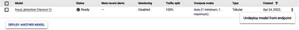

###### 图 5-19\. “取消模型部署到端点”的选项位置。

# 总结

在过去的两章中，您已经使用 AutoML 训练了回归模型和分类模型！在这一章中，您在 Google Colab 环境中探索了您的数据，然后将数据上传到 Vertex AI 的受管理数据集，然后使用 AutoML 训练分类模型。原始模型的召回率明显低于新模型的召回率，这意味着这个新模型最终将更好地标记交易并保护您的客户账户。

然而，这只是您的机器学习之旅的开始。在许多情况下，您将希望能够更多地控制模型训练过程。实际上，这意味着向更低代码和自定义代码解决方案迈进。下一章将介绍如何使用 BigQuery 中的 SQL 探索数据，并使用 BigQuery ML 在 SQL 中训练 ML 模型。

¹更多详情请见“PaySim: A Financial Mobile Money Simulator for Fraud Detection” by E. A. Lopez-Rojas, A. Elmir, and S. Axelsson (in The 28th European Modeling and Simulation Symposium-EMSS, Larnaca, Cyprus, 2016)。
