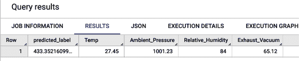

# 第六章：使用 BigQuery ML 训练线性回归模型

在本章中，您将学习如何从头开始构建线性回归模型和神经网络模型，以预测电厂的生产。您将使用 SQL 进行数据分析，使用 Jupyter Notebook 进行数据探索，并使用 BigQuery Machine Learning（BigQuery ML）来训练 ML 模型。在此过程中，您将学习准备 ML 所需的新技术，以及如何将这些知识应用于改善模型性能。

# 业务用例：电厂生产

在这个项目中，您的目标将是根据电厂附近的天气条件预测联合循环发电厂（CCPP）的净每小时电能输出。

CCPP 由燃气轮机、汽轮机和热回收蒸汽发生器组成。电力是由燃气轮机和汽轮机生成的，它们在一个循环中结合，并且从一个涡轮机传递到另一个涡轮机。虽然真空是从汽轮机收集的，但其他三个环境变量（温度、环境压力和相对湿度）影响燃气轮机的性能。

本节中的数据集包含从 CCPP 收集的数据点，时间跨度为六年（2006 年至 2011 年），当时发电厂设置为全负荷运行。尽管数据按小时聚合，但未提供记录天气条件和能源生产的确切时间。从实际的角度来看，这意味着您将无法将数据视为序列或时间序列数据，即您无法使用先前记录的信息来预测未来的记录。

该数据最初以 CSV 文件的形式提供，¹因此，在您能够探索它并最终用它创建 ML 模型之前，您需要花一些时间将数据加载到 BigQuery 中。正如您马上会看到的，我们的数据集中有五列，如表 6-1 所示，以及 9,590 行。

表 6-1。数据集中的五列：目标变量“能量生产”以粗体显示

| 列名 | 最小值 | 最大值 |
| --- | --- | --- |
| 温度 | 1.81°C | 37.11°C |
| 环境压力 | 992.89 毫巴 | 1,033.30 毫巴 |
| 相对湿度 | 25.56% | 100.16% |
| 排气真空 | 25.36 厘米汞柱 | 81.56 厘米汞柱 |
| **能量生产** | 420.26 MW | 495.76 MW |

这些期望的数值范围已经被电厂工程师充分记录，并且通过技术报告与您分享过（比如通过技术报告）。在探索数据时，这将非常有帮助，以确保没有空值或魔数等问题，正如第四章中所讨论的那样。

# 使用 SQL 在 BigQuery 中清洗数据集

正如之前讨论的那样，在开始构建机器学习模型的处理过程之前，了解数据集的重要性至关重要。请记住，您训练的任何机器学习模型的质量将严重依赖于用于训练模型的数据集质量。如果数据集中充满错误数据或缺失值，那么机器学习模型将无法学习到正确的见解。

在本节中，您将使用 SQL 作为工具，并选择 BigQuery 作为平台。本章中的所有 SQL 代码也可以在 [low-code-ai 代码库](https://oreil.ly/supp-lcai) 中找到。BigQuery 是 Google Cloud 的无服务器数据仓库解决方案。在这里，“无服务器”意味着您可以快速将数据加载到 BigQuery，并在不需要配置任何服务器的情况下开始 SQL 数据分析。如果您对 SQL 不熟悉，那么 Google 在 Coursera 上提供的 [“准备探索数据”课程](https://oreil.ly/zWLKA) 是一个很好的免费起点。Alan Beaulieu 的 [*学习 SQL*](https://learning.oreilly.com/library/view/learning-sql-3rd/9781492057604/)（第三版，O’Reilly，2020）是希望深入使用 SQL 的人的良好资源。

如果您还没有使用 BigQuery，它有一个免费层，可以覆盖本章中线性回归的活动。每个月通过 SQL 查询处理的前 1 TB 数据和每月的 10 GB 存储是免费的。此外，用于创建某些类型的机器学习模型（例如线性回归）的前 10 GB 数据处理也是免费的。如果您有兴趣在存储在 BigQuery 中的数据上进行机器学习，则可以使用 BigQuery ML。BigQuery ML 使用 Vertex AI 中的资源来训练神经网络模型。如果您希望按照本节的指导在 BigQuery ML 中训练神经网络模型，则会针对免费试用或计费账户产生费用。

## 加载数据集到 BigQuery

CCPP 数据集尚未在 BigQuery 中可用。您需要做的第一件事是将数据加载到 BigQuery 中。为了您的方便，我们已将数据放入了公共 Google Cloud Storage 存储桶中（在 *https://oreil.ly/zY85-* 下载）。

要将数据加载到 BigQuery 中，首先打开 Google Cloud 控制台，并返回 BigQuery SQL 工作空间。在 UI 的左侧，选择您的项目名称，然后单击项目名称右侧的“查看操作”按钮（三个垂直点）。选择如 图 6-1 所示的“创建数据集”选项。


###### 图 6-1\. BigQuery 控制台中的“创建数据集”按钮。

确保在“项目 ID”下选择你的项目。对于“数据集 ID”，请在框中键入**`data_driven_ml`**。选择数据位置为美国。我们选择这个选项是因为要加载到 BigQuery 的数据存储在一个美国云存储桶中。现在点击“创建数据集”。按照 图 6-2 中显示的字段输入数据。


###### 图 6-2\. 在 BigQuery 控制台中创建新数据集。

数据集创建后，你可以使用“查看操作”按钮（如 图 6-3 所示）创建 BigQuery 表。选择数据集，点击“查看操作”，然后选择“创建表”。


###### 图 6-3\. “查看操作”和“创建表”按钮。

你需要指定数据加载的位置、文件格式以及要创建的表的名称。这些选择在 表 6-2 中有总结。

表 6-2\. 创建表选项总结

| 字段 | 值 |
| --- | --- |
| 从哪里创建表 | Google Cloud Storage |
| 从 GCS 存储桶选择文件或使用 URI 模式 | low-code-ai-book/ccpp.csv |
| 文件格式 | CSV |
| 表 | ccpp_raw |
| 模式 | 自动检测 |

图 6-4 显示已填写所有必填值的“创建表”窗口。在你的情况下，CSV 文件具有标题，并且所有值都是浮点数，因此你可以让 BigQuery 根据此信息检测模式。


###### 图 6-4\. 填写了指定值的“创建表”窗口。

保留“表类型”、“表分区”和“聚类”的默认值。点击“创建表”按钮开始加载作业并创建原始数据的表。

###### 注意

表分区是一种将较大的表拆分为“较小的表”或*分区*的方法，可以通过筛选器分别访问。未在查询中引用的任何分区都不会被读取，从而降低查询成本并提高性能。同样，BigQuery 中的聚集表是使用聚集列定义的用户定义列排序顺序的表。聚集表通过将数据按排序顺序存储在同一物理位置中来提高查询性能和降低查询成本。

表创建后，你可以通过选择表并选择“模式”选项卡来查看表的模式。你也可以通过选择“预览”选项卡预览表中的数据。 图 6-5 和 图 6-6 显示了这些步骤在 BigQuery 控制台中的展示效果。


###### 图 6-5\. 新创建的 `ccpp_raw` 表的模式。


###### 图 6-6\. `ccpp_raw`表的预览。

## 使用 SQL 在 BigQuery 中探索数据

现在数据已加载到 BigQuery 中，是时候开始探索数据了。首先检查是否有空值的最简单方法是使用 BigQuery 中的`IF`函数。`IF`语句，`IF(expr, true_result, else_result)`，接受三个参数。`expr`语句返回一个布尔值，确定是返回`true_result`还是`else_result`。正如您可能期望的那样，如果`expr`返回`TRUE`，则返回`true_result`，否则返回`else_result`。

### 使用空值函数检查空值

如果您想要查看`Temp`列是否有空值，您可以使用以下语句：`IF(Temp IS NULL, 1, 0)`。如果`Temp`为`NULL`，则返回 1，如果`Temp`不为`NULL`，则返回 0。运行以下查询，将其中的`your-project-id`替换为您的 Google Cloud 项目 ID，并查看结果：

```
SELECT 
  IF(Temp IS NULL, 1, 0) AS is_temp_null
FROM
  `your-project-id.data_driven_ml.ccpp_raw`
```

如果您浏览结果，您会在超过 9,000 个值的列中找到两个 1。这种方法可行，但效率不高，对吧（图 6-7）？相反，让我们利用`true_result`和`else_result`选择分别为 1 和 0 的事实。


###### 图 6-7\. 在超过 9,000 个值的列中查找两个 1 的结果效率低下。

使用`SUM()`函数而不是浏览列表，可以轻松计算空值的数量。运行以下查询，在其中将`your-project-id`替换为您的 Google Cloud 项目 ID，以计算每列的空值数量：

```
SELECT
  SUM(IF(Temp IS NULL, 1, 0)) AS no_temp_nulls,
  SUM(IF(Exhaust_Vacuum IS NULL, 1, 0)) AS no_ev_nulls,
  SUM(IF(Ambient_Pressure IS NULL, 1, 0)) AS no_ap_nulls,
  SUM(IF(Relative_Humidity IS NULL, 1, 0)) AS no_rh_nulls,
  SUM(IF(Energy_Production IS NULL, 1, 0)) AS no_ep_nulls
FROM
  `your-project-id.data_driven_ml.ccpp_raw`
```

运行此查询后，您应该会看到除了`Ambient_Pressure`列外，所有列都有空值。将您的结果与图 6-8 中的结果进行比较。


###### 图 6-8\. 查询计算空值的结果。除了`Ambient_Pressure`列外，所有列都有空值。

那些包含空值的行应该如何处理？最简单的方法是简单地省略这些行。另一个选项，在第七章中探讨，是遵循插补策略。*插补*是将缺失数据替换为替代值的过程，通常以这样的方式进行，使得替代值在特定的上下文中是现实的。在这种情况下，您可能不是 CCPP 的专家。最坏的情况下，包含空值的行将占数据的大约 0.1%。因此，简单地省略这些行是一个非常合理的策略。

在什么情况下您希望填补而不是丢弃数据？如果您的数据集很小，或者缺失值的行在数据集中占据了重要的百分比，那么丢弃这些行可能会严重影响您的模型性能。另一个删除数据的更微妙问题涉及到*偏差*。统计偏差是指您的数据分布与实际数据分布之间的系统性差异。如果空值出现在特定示例的子集中（例如，市场数据集中的某些人口统计学信息），那么删除具有缺失值的行将导致模型无法学习重要信息。

### 使用 Min 和 Max 函数确定可接受的数据范围

接下来，请确保所有值都在预期范围内。最快速地完成此操作的方法是使用`MIN`和`MAX`函数。与`SUM`函数一样，`MIN`和`MAX`是聚合函数的示例。*聚合*函数是指接受列或列的子集，并返回单个值的函数。`MIN`和`MAX`函数分别返回其应用于的列的最小值和最大值。请继续通过以下 SQL 查询将这些函数应用于`Temp`列，再次用您的 Google Cloud 项目 ID 替换`your-project-id`：

```
SELECT
  MIN(Temp) as min_temp,
  MAX(Temp) as max_temp
FROM
  `your-project-id.data_driven_ml.ccpp_raw`
```

你应该看到最低温度为 1.81°C，最高温度为 37.11°C（参见图 6-9）。好消息是，这一数值范围与先前指定的温度数值范围相符。继续使用相同的逻辑检查其他列的范围。如果这次你遇到困难，可以尝试自己编写查询，但是查询已包含在图像下方。


###### 图 6-9\. 计算数据集中温度的最小值和最大值的上一个查询结果。

```
SELECT 
  MIN(Temp) as min_temp,
  MAX(Temp) as max_temp,
  MIN(Exhaust_Vacuum) as min_ev,
  MAX(Exhaust_Vacuum) as max_ev,
  MIN(Ambient_Pressure) as min_ap,
  MAX(Ambient_Pressure) as max_ap,
  MIN(Relative_Humidity) as min_rh,
  MAX(Relative_Humidity) as max_rh,
  MIN(Energy_Production) as min_ep,
  MAX(Energy_Production) as max_ep
FROM
  `your-project-id.data_driven_ml.ccpp_raw`
```

###### 注意

您可以在 BigQuery 中以 JavaScript 对象表示法或 JSON 格式显示结果。JSON 是一种与编程语言无关的数据格式，用于许多不同的 Web 应用程序和产品，包括 BigQuery，用于交换信息。JSON 格式的优点是它易于阅读，并以文本格式存储，因此易于处理。例如在图 6-10 中展示了一个示例。


###### 图 6-10\. 在 JSON 格式中显示的`ccpp_raw`表中所有列的最小和最大值。请注意异常值。

如果仔细查看，您会发现几个可疑的值。最小环境压力是 0.0，最小能量产生是-1.0。基于传达的数值范围，以及可能的常识，我们知道这两个值都是不合理的。很可能，-1.0 值是一个魔数的例子。*魔数*是用来表示与标准含义不同的独特值。由于-1.0 不作为能量产生值而存在，这很可能是一个魔数，用于表示缺失的数据。同样，最小环境压力为 0.0 很可能是一个默认值的例子。*默认值*通常在应用程序中存在，用于在未报告值时记录一个值。这用于避免一些与`NULL`值相关的问题。

了解技术报告中预期值的范围后，确保避免这些不切实际的值的最简单方法是基于预期范围进行过滤。请注意，这也将消除您之前检测到的`NULL`值，因为这些值也不在这些范围内。

### 使用 BigQuery 中的 DDL 语句保存查询结果

在编写用于过滤`NULL`和其他不需要的值的查询之前，重要的是要考虑如何存储该查询结果以供训练 ML 模型使用。这可以通过在 BigQuery 中执行 DDL 语句来完成。DDL 代表*数据定义语言*，是用于在数据集中创建和修改对象（如表）的语法。您将使用`CREATE TABLE`语句来创建一个新表。在 BigQuery 中，`CREATE TABLE`语句的基本语法如下：

```
CREATE TABLE
  table_name
AS  
  query_statement
```

此查询将创建一个名为`table_name`的新表，并将`query_statement`的结果保存为此表。请注意，使用此语句时，如果表已经存在，将不会被覆盖。如果您希望这样做，可以将`CREATE TABLE`替换为`CREATE OR REPLACE TABLE`。

现在，您已经知道如何使用`CREATE TABLE`语句保存查询结果，可以编写查询来清理原始发电厂数据，并将数据保存到一个新表中，比如`ccpp_cleaned`，以便训练 ML 模型。

查询很简单，但如果用不等式来写，可能会相当冗长。然而，操作符`BETWEEN`可以简化查询。要使用`BETWEEN`，您需要按以下方式指定最小和最大值：

```
Field_name BETWEEN min_value AND max_value
```

如果您正在检查的值在`min_value`和`max_value`之间的范围内，则语句将返回`TRUE`；否则，语句将返回`FALSE`。例如，在这里，您正在查找`Energy_Production`值在 420.26 到 495.76 之间的范围。前面讨论的-1.0 值不在此范围内，因此将被过滤掉。特别是，我们希望仅保留与技术报告中共享的范围匹配的值。

如前所述，尝试自己编写查询并在 BigQuery 中运行它，但如果需要帮助，这里是：

```
CREATE TABLE
  `data_driven_ml.ccpp_cleaned`
AS
  SELECT 
    *
  FROM 
    `your-project-id.data_driven_ml.ccpp_raw`
  WHERE
    Temp BETWEEN 1.81 AND 37.11 AND
    Ambient_Pressure BETWEEN 992.89 AND 1033.30 AND
    Relative_Humidity BETWEEN 25.56 AND 100.16 AND
    Exhaust_Vacuum BETWEEN 25.36 AND 81.56 AND
    Energy_Production BETWEEN 420.26 AND 495.76
```

执行查询后，可以通过在 BigQuery UI 左侧面板中选择项目名称，然后点击数据集名称 (`data_driven_ml`)，最后选择表 `ccpp_cleaned` 来查看我们创建的新表的元数据。在打开与表对应的选项卡后，点击“详细信息”选项卡查看表的元数据（见 图 6-11）。


###### 图 6-11\. 新创建的 `ccpp_cleaned` 表的元数据。比较此表中的行数与 `ccpp_raw` 表中的行数，以查看删除了多少行。

新创建的 `ccpp_cleaned` 表有 9,576 行。如果按照相同过程处理原始 `ccpp_raw` 表，可以看到它有 9,590 行。这意味着我们从数据集中过滤掉了 14 行，约占所有数据的 0.15%。由于清理导致的数据损失很少！然而，一些不正确的值，特别是如果它们导致极端离群值，可能会严重影响模型性能。因此，经过这个过程是件好事。

###### 注：

在上述示例中，你事先知道想要保存查询结果，并使用 DDL 语句立即创建表。如果在运行查询后才决定保存结果怎么办？难道需要重新运行查询只是为了将结果保存到表中吗？

幸运的是，答案是否定的。在执行查询后，你可以转到 Web 控制台上的“保存结果”，选择 BigQuery 表，然后填写数据集和表名称，以创建这些结果所需的表。

当你事后意识到应该保存结果时，你会陷入困境吗？在 BigQuery 中执行查询时，结果会存储在临时表中。此表将在查询完成后保留 24 小时。要访问临时表，转到控制台底部的个人历史选项卡，点击与要检索结果的查询对应的作业，然后点击“临时表”。此表可以像其他表一样查询，并且可以保存结果如前所述。

# 线性回归模型

现在数据已经清理好了，你准备好开始训练模型了吗？还不完全。在早期章节中，你依赖像 AutoML 这样的工具在幕后处理了许多特征选择过程。现在在 BigQuery ML 中由你来选择更深入的特征选择和工程化过程，但现在你将专注于为这个问题选择模型类型以及选择特征的标准。

在进一步进行之前，请退后一步，更深入地思考手头的问题。目标是根据温度、环境压力、相对湿度和排气真空压力预测 CCPP 的能源产量，如图 6-12 所示。


###### 图 6-12\. 目标是基于温度、环境压力、相对湿度和排气真空压力预测能源产量。

这是一个*回归*问题的示例，因为目标是预测一个实数：以兆瓦（MW）为单位的发电厂能源产量。尽管 BigQuery ML 支持许多不同的模型类型，通常最好的起点是最简单的一个，即线性回归模型，您寻求找到最佳拟合线。

在第四章中，您看到了线性回归的简化示例。在本章中，讨论将更深入，以便更好地理解模型的工作原理（见图 6-13）。这样，当您在本章后面的训练 ML 模型时，您将能够更明智地选择要使用的特征。


###### 图 6-13\. 线性回归的简单示例。点对应于具有 x 值作为特征和 y 值作为标签的示例。虚线表示最佳拟合线。

假设您有一些数值特征<math><mrow><msub><mi>x</mi> <mn>1</mn></msub> <mo>,</mo> <mo>.</mo> <mo>.</mo> <mo>.</mo> <mo>,</mo> <msub><mi>x</mi> <mi>n</mi></msub></mrow></math>，并且您想基于特征值预测一些实数<math><mi>y</mi></math>。通常，<math><mover accent="true"><mi>x</mi> <mo>→</mo></mover></math>被用作缩写符号来表示特征列表<math><mrow><msub><mi>x</mi> <mn>1</mn></msub> <mo>,</mo> <mo>.</mo> <mo>.</mo> <mo>.</mo> <mo>,</mo> <msub><mi>x</mi> <mi>n</mi></msub></mrow></math>。*线性回归*模型是以下形式的函数：

<math><mrow><mi>f</mi> <mrow><mo>(</mo> <mover accent="true"><mi>x</mi> <mo>→</mo></mover> <mo>)</mo></mrow> <mo>=</mo> <msub><mi>w</mi> <mn>0</mn></msub> <mo>+</mo> <msub><mi>w</mi> <mn>1</mn></msub> <mo>×</mo> <msub><mi>x</mi> <mn>1</mn></msub> <mo>+</mo> <mo>.</mo> <mo>.</mo> <mo>.</mo> <mo>+</mo> <msub><mi>w</mi> <mi>n</mi></msub> <mo>×</mo> <msub><mi>x</mi> <mi>n</mi></msub></mrow></math>

-   其中<math><mrow><msub><mi>w</mi> <mn>0</mn></msub> <mo>,</mo> <msub><mi>w</mi> <mn>1</mn></msub> <mo>,</mo> <mo>.</mo> <mo>.</mo> <mo>.</mo> <mo>,</mo> <msub><mi>w</mi> <mi>n</mi></msub></mrow></math>也是实数，称为*权重*；<math><msub><mi>w</mi> <mn>0</mn></msub></math>通常称为模型的*偏置*。当然，你可以选择任意随机的权重并得到一个函数，但这样的模型有多好呢？

-   请回忆你在第四章中使用了*均方根误差*（RMSE）来评估你的回归模型，你可以在这里做同样的事情。在继续之前，请回忆 RMSE 的定义。假设你的数据集<math><mi>D</mi></math>有<math><mi>N</mi></math>个示例<math><mrow><mo>(</mo> <msup><mover accent="true"><mi>x</mi> <mo>→</mo></mover> <mrow><mo>(</mo><mi>i</mi><mo>)</mo></mrow></msup> <mo>,</mo> <msup><mi>y</mi> <mrow><mo>(</mo><mi>i</mi><mo>)</mo></mrow></msup> <mo>)</mo></mrow></math>，即对于特征值<math><msup><mover accent="true"><mi>x</mi> <mo>→</mo></mover> <mrow><mo>(</mo><mi>i</mi><mo>)</mo></mrow></msup></math>，相应的标签是<math><msup><mi>y</mi> <mrow><mo>(</mo><mi>i</mi><mo>)</mo></mrow></msup></math>。上标<math><msup><mrow><mo>(</mo><mi>i</mi><mo>)</mo></mrow></msup></math>表示我们正在查看你的数据集中的第<math><mi>i</mi></math>个示例。

-   给定一个模型<math><mrow><mi>f</mi> <mo>(</mo> <mover accent="true"><mi>x</mi> <mo>→</mo></mover> <mo>)</mo></mrow></math>，模型的 RMSE 表达式是：

<math><mrow><mi>L</mi> <mrow><mo>(</mo> <mi>f</mi> <mo>,</mo> <mi>D</mi> <mo>)</mo></mrow> <mo>=</mo> <mfrac><mn>1</mn> <mi>N</mi></mfrac> <msqrt><mrow><msub><mo>∑</mo> <mi>i</mi></msub> <msup><mrow><mo>(</mo><mi>f</mi><mrow><mo>(</mo><msup><mover accent="true"><mi>x</mi> <mo>→</mo></mover> <mrow><mo>(</mo><mi>i</mi><mo>)</mo></mrow></msup> <mo>)</mo></mrow><mo>-</mo><msup><mi>y</mi> <mrow><mo>(</mo><mi>i</mi><mo>)</mo></mrow></msup> <mo>)</mo></mrow> <mn>2</mn></msup></mrow></msqrt></mrow></math>

-   这里求和是在数据集<math><mi>D</mi></math>中的所有示例上进行的。包含参数<math><mi>D</mi></math>在此作为提醒，RMSE 取决于用于计算它的数据集，就像我们评估的模型一样。

-   如果你只是选择一些权重<math><mrow><msub><mi>w</mi> <mn>0</mn></msub> <mo>,</mo> <mo>.</mo> <mo>.</mo> <mo>.</mo> <mo>,</mo> <msub><mi>w</mi> <mi>n</mi></msub></mrow></math>，那么你如何知道你拥有给出最佳模型的权重？换句话说，你希望使*损失函数*，RMSE<math><mrow><mi>L</mi> <mo>(</mo> <mi>f</mi> <mo>,</mo> <mi>D</mi> <mo>)</mo></mrow></math>尽可能小。

###### -   注

记住，损失函数的目标是衡量你的算法在数据集上表现如何。换句话说，损失函数是评估你的[算法](https://oreil.ly/CJqzM)模型数据集的一种方法。如果你的预测完全不准确，损失函数会输出一个较高的数字。如果预测相当不错，它会输出一个较低的数字。

查看第四章以了解损失函数的可视化解释。

有两种常用方法来确定线性回归模型的适当权重。第一种被称为*正规方程*。使用数据集和相应的标签，解正规方程可以给出最佳模型权重的精确分析解。许多分析包和产品（包括 BigQuery）在其工具包中包含此方法。

如果总有一种好方法可以找到最佳权重，为什么不总是使用呢？好吧，原因有几个。首先是*计算复杂度*，即计算所需的工作量。从技术上讲，我们说解决正规方程的计算复杂度略低于<math><mrow><mi>O</mi> <mo>(</mo> <msup><mi>n</mi> <mn>3</mn></msup> <mo>)</mo></mrow></math>。这究竟意味着什么？假设数据集从 1,000 个例子增加到 10,000 个例子，即增加十倍。解决正规方程所需的工作量将大约增加一个因子<math><mrow><msup><mn>10</mn> <mn>3</mn></msup> <mo>=</mo> <mn>1</mn> <mo>,</mo> <mn>000</mn></mrow></math>！可以看出，随着数据集变得越来越大，这个问题会迅速失控。

另一个更加数学上微妙的原因是计算可能涉及非常大的数值。由于计算机处理算术的方式（浮点运算），这些大数值可能在解决正常方程时造成问题。这种情况的技术术语是*病态条件*。

无论情况如何，如果你有大量示例或在解决正规方程时遇到问题，你可以采用称为*梯度下降*的第二种方法。我们这里不详细介绍，但需要知道大多数（如果不是所有）ML 框架都提供梯度下降及其变体，用于训练模型。要了解更多关于梯度下降基础知识，请参阅 Google 的[“机器学习入门课程”](https://oreil.ly/oSW8e)中的相应章节。

###### 注意

如果你有一些矩阵工作背景，那么一旦符号设置好，正规方程并不难描述。这里没有涵盖推导过程，但这是微积分和线性代数教材中的常见主题。有关使用微积分技术推导的例子，请参阅[此博客文章](https://oreil.ly/uX9tp)。

## 特征选择和相关性

现在确定了使用的模型类型（线性回归），是时候选择要使用的特征了。请记住，在您准备的 BigQuery 数据集中有四列可能用于预测能源生产：`Temp`、`Ambient_Pressure`、`Relative_Humidity`和`Exhaust_Vacuum`。那么，如何决定使用哪些特征呢？

通常情况下，在选择特征时有三个基本准则可以遵循：

+   特征应与问题目标相关。

+   特征应在预测时已知。

+   特征应是数值的，或者可以转换为数值。

这些绝不是唯一需要考虑的因素，您将在本章和后续章节中看到更多考虑因素，但它们是一个很好的起点。第三个条件由于线性回归模型的性质以及实践中使用的大多数其他模型类型而显得重要。当一切都说完了，机器学习模型是一个数学函数，它以数值特征作为输入并输出一些实数，然后根据模型目标进行解释。因此，从计算的角度来看，具有数值特征或能够将所选特征转换为数值特征是至关重要的。

###### 警告

数值值特征如果没有有意义的数量级，需要与具有有意义数量级的特征进行区别对待。考虑一个记录汽车颜色的特征作为数字的例子，比如 0 代表红色，1 代表蓝色，2 代表银色等。说银色是蓝色的两倍是没有意义的。在后面的章节中，您将看到一些技术，如独热编码，来正确地将这类特征编码为具有有意义数量级的数值特征。

您的特征与问题目标相关吗？这在一般情况下可能是一个棘手的问题。您必须具备一定的领域知识才能适当地回答这个问题，即使如此，答案在某些情况下也可能相当微妙。有几种不同的方法可以解决这个问题：

+   您可以利用自己或其他专家的领域专业知识。

+   您可以使用统计方法如相关性来理解特征与目标之间的关系。

至于第一种方法，为了简单起见，假设在报告中，领域专家确认这些特征确实与目标相关。这可能不是令人满意的答案，但作为机器学习从业者，你必须依靠真正了解领域的人来指导你找出可能的特征。然而，这并不应阻止你尝试研究你的模型所解决的问题领域！随着你在一个领域中处理更多问题，你会更多地了解该领域，并且能够真正直观地理解该领域的关键概念。这种直觉是将人类洞察力带入你的模型的另一种方式。这不仅是一个有用的工具，而且通常是构建解决问题的强大模型所必需的组成部分。

现在来看第二种方法。是的，你知道所有特征都应与模型目标相关，但如何理解这种关系呢？在构建模型时，理解这个“如何”非常重要，因为它能帮助你如何利用和转换你的特征。这个过程通常被称为*特征工程*，它往往是提升模型性能的最强大工具之一，超越了数据的质量和数量。

对于线性模型，你可以使用的一个简单工具称为*Pearson 相关系数*。给定两个（数值）变量*X*和*Y*，Pearson 相关系数*Corr(X, Y)*是一个介于–1 和 1 之间的数字，用于衡量两个变量之间线性关系的紧密程度。特别地，如果系数恰好为 1，则*X*和*Y*具有完全线性关系。也就是说，*Y = m × X + b*，其中*m*和*b*是正数。如果系数恰好为–1，则*m*为负数。那么系数在–1 到 1 之间的情况又如何呢？系数的绝对值越接近于 0，变量之间的线性关系就越远。有多种方法可用于确定特征之间的相关性。一些示例散点图及其对应的相关系数如图 6-14 所示。


###### 图 6-14\. 示例散点图及其对应的 Pearson 相关系数；图片来源于[Wikipedia](https://oreil.ly/Demk9)（CC0 许可）。

第一种方法是计算每对变量之间的相关系数。例如，要在 BigQuery 中计算`Temp`列和`Exhaust_Vacuum`列之间的相关系数，可以使用如下查询中的`CORR`函数：

```
SELECT
  CORR(Temp, Exhaust_Vacuum)
FROM
  `your-project-id.data_driven_ml.ccpp_cleaned`
```

你会发现`Temp`和`Exhaust_Vacuum`之间的相关系数约为 0.844。你应该如何解释这个结果？这意味着这两个特征之间存在中等到强（正）的线性关系。从物理角度来看，这是有道理的，因为在温度增加时，压力也会增加（假设其他变量保持不变）。

你可以更高效一些，同时使一列与多列相关，但编写查询仍然需要时间。例如：

```
SELECT 
  CORR(Temp, Ambient_Pressure) AS corr_t_ap,
  CORR(Temp, Relative_Humidity) AS corr_t_rh,
  CORR(Temp, Exhaust_Vacuum) AS corr_t_ev
FROM 
  `your-project-id.data_driven_ml.ccpp_cleaned`
```

对于列数较少的情况，这不是一个不合理的方法。在这里，我们有 5 列，包括我们的标签，因此总共需要计算 10 个相关系数。然而，随着列数的增加，这个数字增长得非常快。当然，你可以进一步创建更高级的自动化查询，计算所有相关系数，但这超出了本书的范围。

## Google Colaboratory

另一种方法是利用 Google Colaboratory，或简称 Google Colab，创建、绘制和可视化相关矩阵。在后续章节中，当介绍 Python 中的 ML 包时，你将使用 Colaboratory 作为运行 Python 代码的简便方法，而无需事先设置环境。现在，你将看到如何将 BigQuery 的查询结果带到 Google Colab 中，使用一些基本的 Python 进行探索性数据分析（EDA）。

从 BigQuery 加载你想要的数据的最简单方法是使用 Google Colab 中的内置连接器。BigQuery 具有创建模板笔记本的功能，以将查询结果加载到笔记本环境中。现在，你将逐步了解设置这种环境的步骤。

首先，你需要运行查询，以便将其结果加载到笔记本环境中。在这种情况下，编写并运行一个将返回整个清理数据集的查询。与之前一样，这是查询的内容，如果需要一点帮助： 

```
SELECT 
  *
FROM
  `your-project-id.data_driven_ml.ccpp_cleaned`
```

接下来，在刚刚运行的查询的同一个窗口中，选择在控制台中探索数据（在查询编辑器下方），然后选择使用 Python 笔记本进行探索，如图 6-15 所示。


###### 图 6-15\. 用于探索查询结果的 Explore with Python 笔记本选项。

当你选择使用 Python 笔记本进行探索时，在 Google Colab 中创建一个模板笔记本，可以让你通过样板 Python 进行可视化探索或创建描述性统计。要创建可视化图形，你只需将两个`import`语句添加到第一个单元格（设置）：

```
import matplotlib.pyplot as plt 
import seaborn as sns
```

在这两行之后，第一个单元格应如下所示：

```
# @title Setup
from google.colab import auth
from google.cloud import bigquery
from google.colab import data_table
import matplotlib.pyplot as plt 
import seaborn as sns

project = 'your-project-id' 
location = 'US'
client = bigquery.Client(project=project, location=location)
data_table.enable_dataframe_formatter()
auth.authenticate_user()
```

现在您已准备好运行笔记本中当前存在的所有单元格。要执行此操作，请点击单元格，然后点击单元格左侧的“运行单元格”按钮。您还可以按 Ctrl+Enter（或者如果您使用的是 macOS X，则按 Cmd+Enter）来执行单元格。逐个浏览单元格并按顺序运行单元格非常重要，不要跳过单元格以确保一切正常运行。

最后一个单元格预先编码以显示描述性统计数据，例如`results.describe()`。请注意，`results`是图 6-16 中显示的数据框的名称。


###### 图 6-16\. 一个生成笔记本单元格的示例，用于检索结果和前五行结果。出于可读性考虑，仅显示了前三列。

现在您可以轻松创建*相关矩阵*——即每对特征的不同相关系数的数组。

要创建此矩阵，请点击笔记本上方的+ Code 按钮创建一个新单元格，并输入代码 **`results.corr().round(2)`**。`round`方法用于将相关性四舍五入到小数点后两位，以提高可读性。如前所述运行单元格，并将结果与图 6-17 中的结果进行比较。


###### 图 6-17\. 新代码单元格计算相关矩阵及相应结果。

相关矩阵易于阅读。要查找两个特征之间的相关性——比如`Temp`和`Ambient_Pressure`——请转到`Temp`列和`Ambient_Pressure`行（或者反之），以找到该值。在本例中，该值为–0.508（四舍五入到千分之一）。这意味着这两个特征之间存在适度的负相关性，即降低温度将增加环境压力，反之亦然。

您还可以使用热图来可视化这个矩阵。为此，请在一个新单元格中输入以下代码，并像以前一样运行该单元格。请注意，您前面在笔记本的第一个单元格中添加的两个`import`语句是运行这些代码行所必需的。结果显示在图 6-18 中：

```
plt.figure(figsize=(10,6))  
sns.heatmap(results.corr());
```


###### 图 6-18\. 特征的相关性热图。较深的颜色对应较大的负相关性，较浅的颜色对应较大的正相关性。

在继续之前，请对您所拥有的数据进行以下知识检查：

+   哪些特征与`Energy_Production`有强相关性？为什么？

+   哪些特征与`Energy_Production`之间的相关性较弱？为什么？

+   哪些特征与`Energy_Production`之间有中度相关性？为什么？

###### 警告

*共线性*或*多重共线性*是指回归模型中两个或多个预测变量之间存在中度或高度相关的情况，例如，意味着预测变量彼此相关，这使得更难以确定每个相关变量所起的作用。这意味着，在数学上，标准误差会增加。当预测变量之间存在高度相关时，就会出现多重共线性，这会导致回归系数的估计不可靠和不稳定。多重共线性可能会限制可以得出的研究结论，特别是在使用线性回归等线性模型时。

## 绘制特征与标签的关系图

通过执行探索性数据分析（EDA）来可视化特征与标签之间的关系，也是理解哪些特征对模型最有用的一种方法。您可以继续在之前使用的同一个 Google Colab 笔记本中可视化您的数据。

首先，通过将以下代码添加到新单元格并运行该单元格来可视化`Temp`特征和标签`Energy_​Pro⁠duction`之间的关系。将结果与图 6-19 中的可视化进行比较：

```
ax = sns.regplot(
    x='Temp', y='Energy_Production',
    fit_reg=False, ci=None, truncate=True, data=results)
ax.figure.set_size_inches(10,8)
```


###### 图 6-19\. 一个散点图，显示`Temp`和`Energy_Production`之间的关系。该关系看起来是一个负线性关系。

现在可视化`Ambient_Pressure`特征和标签`Energy_Production`之间的关系。首先尝试自己编写代码，但如果需要帮助，以下是解决方案。将结果与图 6-20 中的可视化进行比较：

```
ax = sns.regplot(
    x='Ambient_Pressure', y='Energy_Production',
    fit_reg=False, ci=None, truncate=True, data=results)
ax.figure.set_size_inches(10,8)
```


###### 图 6-20\. 一个散点图，显示`Ambient_Pressure`和`Energy_Production`之间的关系。该关系似乎是模糊正相关，但对于`Temp`特征来说不太明显。

最后，对`Relative_Humidity`和`Exhaust_Vacuum`特征重复此过程。与之前一样，解决方案代码随后可视化，您应将结果与图 6-21 和图 6-22 中的可视化进行比较：

```
ax = sns.regplot(
    x='Relative_Humidity', y='Energy_Production',
    fit_reg=False, ci=None, truncate=True, data=results)
ax.figure.set_size_inches(10,8)
```


###### 图 6-21\. 显示`Relative_Humidity`和`Energy_Production`之间关系的散点图。从这个可视化图中看，它们之间似乎呈现出微弱的正相关，但并不十分清晰。

```
ax = sns.regplot(
    x='Vacuum_Pressure', y='Energy_Production',
    fit_reg=False, ci=None, truncate=True, data=results)
ax.figure.set_size_inches(10,8)
```


###### 图 6-22\. 显示`Vacuum_Pressure`和`Energy_Production`之间关系的散点图。从这个可视化图中看，它们之间似乎呈现出负线性关系。

总结一下，看起来`Temp`和`Energy_Production`之间存在强烈的“反向”关系——温度越低，能量输出越高。如果你参考图 6-17 中的先前相关矩阵，`Temp`和`Energy_Production`的相关性为 –0.948\. 这与图 6-19 中观察到的负线性关系相符。

请记住，你的目标是根据温度、环境压力、相对湿度和排气真空压力来预测能量产出。你是否应该舍弃那些相关性较弱的特征？这将使你从多变量模型转变为单变量模型。实质上，你将只有一个特征 (`Temp`) 来预测标签 (`Energy_Production`)。这样的模型是否具有泛化能力？是否有额外的数据可以收集，以确定特征对能量生产的重要性？这些是在面对这种情况时需要自问的问题。请利用第 1 章的业务决策模型来帮助你。

## BigQuery ML 中的 CREATE MODEL 语句

在本节中，你将使用 BigQuery ML 创建一个线性回归模型，该模型使用电厂数据集中的所有特征。如你所见，现在你已经准备好数据，这个过程非常简单。

### 使用 CREATE MODEL 语句

返回 BigQuery 控制台。在 BigQuery Editor 窗口中输入以下 SQL 语句以创建线性回归模型：

```
CREATE OR REPLACE MODEL data_driven_ml.energy_production OPTIONS
  (model_type='linear_reg',
   input_label_cols=['Energy_Production']) AS
SELECT
  Temp,
  Ambient_Pressure,
  Relative_Humidity,
  Exhaust_Vacuum,
  Energy_Production
FROM
  `your-project-id.data_driven_ml.ccpp_cleaned`
```

在执行查询之前，请注意一些符号的表示法。`CREATE OR REPLACE MODEL` 语句将在 `data_driven_ml` 数据集中创建一个新的 ML 模型，名为 `energy_production`。BigQuery 中的 ML 模型是数据集中的对象，类似于表。`CREATE OR REPLACE MODEL` 语句指定了两个选项。第一个选项 `model_type` 指定模型类型（这里使用 `linear_reg` 进行线性回归）。第二个选项 `input_label_cols` 是你指定作为标签的列。在这个案例中，即 `Energy_Production` 列。

现在运行查询以训练模型。这只需要几分钟的时间。在进行下一步之前，请等待模型训练完成。

### 查看训练模型的评估指标

您可以在控制台中看到模型评估指标。创建模型表后，选择“评估”选项卡以查看评估指标。这些评估指标的示例在图 6-23 中展示。请注意，您看到的指标可能与图中稍有不同。


###### 图 6-23\. 预测能源产量的线性回归模型的评估指标。

`ML.EVALUATE` 函数还提供评估指标。运行以下 SQL 查询以返回模型的评估指标：

```
SELECT
  *
FROM
  ML.EVALUATE(MODEL data_driven_ml.energy_production)
```

以 JSON 格式显示的输出在图 6-24 中。


###### 图 6-24\. `ML.EVALUATE` 命令的输出。`explained_variance` 输出是控制台中未包含的唯一输出。

从控制台和 `ML.EVALUATE` 函数输出可以看出，除了一个额外的输出之外，它们是相同的。`ML.EVALUATE` 函数还通过 `explained_variance` 列提供了一种被称为“解释方差” 的度量。解释方差可以被看作是对这个问题的回答：“我们的模型在其输出中捕捉了标签中多少方差？” 我们这里不会深入讨论确切细节，但如果平均标签值和平均预测值相同，那么我们期望解释方差和 R² 得分相同。这被称为*无偏估计器*，线性回归就是这样一个例子。

为什么这些分数在这里不同？因为您没有在我们的训练数据集上评估模型！在评估数据集上，只要评估数据集和训练数据集在统计上相似，您就只期望这些指标彼此接近。BigQuery ML 在训练模型时会自动将数据集分成训练和评估数据集，但有一些选项可以更好地控制数据如何分割，详见第七章。

### 使用 `ML.PREDICT` 函数提供预测

现在您已经训练了您的模型并探索了评估指标，接下来是什么？ML 的终极目标是为您的用例提供预测，而不仅仅是训练最好的模型。一旦您在 BigQuery ML 中拥有性能满意的模型，使用 `ML.PREDICT` 函数非常简单地为该模型提供预测。请注意，`ML.PREDICT` 仅适用于 BigQuery 可用于处理的数据的预测。

假设您想要了解在平均气温为 27.45°C、环境压力为 1,001.23 毫巴、相对湿度为 84%、排气真空压力为 65.12 厘米汞柱的一个小时内的发电量。您可以运行以下查询来计算此预测：

```
SELECT
  *
FROM
  ML.PREDICT(MODEL `your-project-id.data_driven_ml.energy_production`,
    (
    SELECT
      27.45 AS Temp,
      1001.23 AS Ambient_Pressure,
      84 AS Relative_Humidity,
      65.12 AS Exhaust_Vacuum) )
```

注意，第二个`SELECT`语句包括了预测能量产量的特征值。使用`AS`关键字为列命名是一种最佳实践，以确保将值适当地传递给模型。请注意，如果包含了不对应特征的额外列，则它们将简单地传递到结果中。这在您想将预测标签作为结果表中的一列时非常有用，但又希望包含未用于模型的列时尤为如此。

与图 6-25 中的结果进行比较，但请注意，您模型预测的标签可能会略有不同。列`predicted_label`包含了预测的能量产量。



###### 图 6-25\. `ML.PREDICT`函数的结果。给定特征值的预测能量产量为 433.35 兆瓦。

您在此处所做的方法非常适合单个预测，但如果您想要预测一个特征值表呢？您可以使用`ML.PREDICT`函数来在表格上进行预测，效果同样出色。您可以用一个表格替换前面示例中的第二个`SELECT`语句，以指定表格作为结果而不是单个行。例如：

```
SELECT
  *
FROM
  ML.PREDICT(MODEL `your-project-id.data_driven_ml.energy_production`,
    (
    SELECT
      Temp,
      Ambient_Pressure,
      Relative_Humidity,
      Exhaust_Vacuum
    FROM
      `your-project-id.some_dataset.some_table`) )
```

这种形式的查询将 BigQuery 转变为一个批量预测的绝佳工具，这正是您需要一次性对大量实例进行预测的地方。

# 引入可解释人工智能

在过去的十年中，随着深度学习和更复杂的模型的增长，*可解释人工智能*（或简称为 XAI）已成为一个快速发展的研究领域。XAI 的目标是用人类可理解的术语描述模型的行为。这种理解可以用在许多不同的方式上：提高模型的性能，理解模型存在的问题，确保模型避免特定偏见以符合或保持伦理原因，以及许多其他用例。本节内容在 BigQuery ML 的工作环境中进行了快速介绍。

当讨论 XAI 时，通常会讨论局部或全局解释。局部解释聚焦于单个实例或可能是一小组实例。您可以将此目标看作是“为什么我的模型对于这个具体示例给出了这个预测？”全局解释则查看模型在某个数据集上的整体行为。例如，要回答“哪些特征往往对该模型的预测贡献最大？”这个问题，您可以使用全局解释。

如何计算这些解释？大多数方法都是 *post hoc* 使用的，即在模型训练后。这些方法可以针对特定的模型类型，也可以对使用的模型不可知。一般来说，后续方法使用一个特定的数据集（例如，评估数据集），并利用模型在此数据集上的行为和扰动来提供解释。

一些模型本质上是可解释的，比如线性回归模型。在这种情况下，可以直接从模型本身推导出解释，而无需使用单独的数据集。然而，存在一种权衡。一般来说，复杂模型的本质解释性较低。例如，大多数图像和语言模型中使用的深度神经网络等更复杂的模型类型，无法从模型定义中解释，必须依赖后续方法。

本章及其后续章节中将看到一些这些方法的应用，但是要深入了解这些概念，[*Explainable AI for Practitioners*](https://learning.oreilly.com/library/view/explainable-ai-for/9781098119126/) 由 Michael Munn 和 David Pitman（O’Reilly，2022）是一个很好的资源。

## BigQuery ML 中的可解释 AI

虽然 `ML.EVALUATE` 函数提供评估指标，但 BigQuery 还提供了一个功能，用于解释模型及其产生的预测。BigQuery 中的全局和局部解释使用 Google Cloud 的可解释 AI 服务。BigQuery 中的可解释 AI 提供“特征归因”，显示对整体模型和特定预测最重要的输入特征。要计算全局解释，您需要修改 `CREATE MODEL` 查询并添加一个额外选项以启用全局可解释性：

```
enable_global_explanation = TRUE
```

全局解释返回特征对模型的整体影响，通常通过对整个数据集的特征归因进行聚合获得。较高的绝对值表明特征对模型预测的影响更大。

可以在不启用全局解释的情况下计算局部解释。接下来的内容中将展示两者的例子。

### 修改 CREATE MODEL 语句

将原始 `CREATE OR REPLACE MODEL` 查询复制到新的查询窗口中。按照以下方式修改查询，添加语句 `enable_global_explain=TRUE`：

```
CREATE OR REPLACE MODEL data_driven_ml.energy_production: OPTIONS
  (model_type='linear_reg',
   input_label_cols=['Energy_Production'],
   enable_global_explain=TRUE) AS
SELECT
  Temp,
  Ambient_Pressure,
  Relative_Humidity,
  Exhaust_Vacuum,
  Energy_Production
FROM
  `your-project-id.data_driven_ml.ccpp_cleaned`
```

运行修改后的查询以训练启用全局解释的新版本模型。这只需几分钟时间。在模型训练完成之前，请等待再进行下一步操作。

### 使用 ML.GLOBAL_EXPLAIN 函数

要查看解释，您可以创建一个基本的“`SELECT * FROM`”SQL 语句。 这里的不同之处在于`FROM`语句。 与`FROM`语句引用项目 ID、数据集和表不同，`FROM`语句被修改如下代码所示。 `ML.GLOBAL_EXPLAIN`函数调用模型本身（在本例中为“`energy_production`”）以检索结果。 在 BigQuery 控制台中运行以下查询来探索这个问题：

```
SELECT 
  *
FROM
  ML.GLOBAL_EXPLAIN(MODEL `data_driven_ml.energy_production`)
```

图 6-26 包含查询结果，并显示了您模型整体中重要性评分最高的特征。 基于先前使用相关性分析功能的特征分析，您预计`Temp`特征将具有最大的归因分数，这在这里得到了确认。


###### 图 6-26。 `ML.GLOBAL_EXPLAIN`返回通过对评估数据集中每行收到的平均绝对归因进行取得的全局特征归因。

### 使用`ML.EXPLAIN_PREDICT`函数计算局部解释

回想一下我们之前的例子：您想知道温度平均为 27.45°C 时的功率产生情况，环境压力为 1,001.23 毫巴，相对湿度为 84%，排气真空压力为 65.12 厘米汞。 您使用`ML_PREDICT`函数预测在这一小时内能量产生将为 433.35 兆瓦。 您预期温度将基于模型的全局特征归因对您的模型产生最大影响。 然而，一般的全局解释会对整个数据集进行聚合——那么特别的例子呢？

您可以使用`ML.EXPLAIN_PREDICT`方法替换`ML.PREDICT`方法，以返回具有*局部*特征归因的预测。 运行以下查询以获取前三个特征的特征归因。 请注意，您的确切输出可能与图 6-27 中显示的输出不同：

```
SELECT
  *
FROM
  ML.EXPLAIN_PREDICT(
    MODEL `your-project-id.data_driven_ml.energy_production`,
    (
    SELECT
      Temp,
      Ambient_Pressure,
      Relative_Humidity,
      Exhaust_Vacuum
    FROM
      `your-project-id.data_driven_ml.ccpp_cleaned`),
    STRUCT(3 AS top_k_features) )
```


###### 图 6-27。 `ML.EXPLAIN_PREDICT`函数的输出。 在这种情况下，温度对于这个例子的输出有最大的（按大小）贡献。

输出中有一些新的语法和新列需要解释。`ML.EXPLAIN_PREDICT` 的附加参数 `STRUCT(3 AS top_k_features)` 限制了特征归因的输出为前三个特征。`top_k_features` 选项是进行此操作的选项，`ML.EXPLAIN_PREDICT` 期望将此信息作为 `STRUCT` 传递。在 SQL 中，可以将 `STRUCT` 理解为具有特定名称和可能不同类型的值（或列）列表。

现在来讲讲新的列。`top_feature_attributions` 本身就是一个 `STRUCT`，包含两个字段，`feature` 和 `attribution`。字段 `feature` 给出了相应的特征名称，而 `attribution` 给出了此实例的归因值。另外还有一个新列：`baseline_prediction_value`。这个值为了获取局部特征归因，提供了一个用于将您的实例与之进行比较的基线。在线性回归模型中，这个基线是数据集中标签值（能量产量）的平均值。

那么如何解释归因值呢？请注意，预测标签小于基线预测，并且所有归因值均为负值。温度值平均从基线值减少约 18.52 MW，相对湿度约为平均减少 2.16 MW，环境压力约为平均减少 0.31 MW。本例中未包括排气真空压力，因为它不在前三位，但其对该示例的贡献甚至比环境压力更小。因此，您可以看到，对于此示例，与基线能量生产的大部分偏差是由温度引起的，其他特征的贡献较小。

另一种选择是利用 Jupyter Notebooks 中的可解释性库，如 Google Colab notebooks。LIME 和 SHAP 是两个流行的 Python 库，广泛用于许多不同的用例。本书不涉及详细讨论；我们推荐这篇[博客文章](https://oreil.ly/YdZ5x)和其他已经提到的可解释 AI 参考资料，以进行更深入的讨论和明确的示例。

###### 注意

在上一段中，“平均”这个词组在初次阅读时可能显得有些奇怪。BigQuery ML 使用 Shapley 值来计算线性模型的归因。Shapley 值是从联合博弈理论中借来的工具，它计算不同联合体（您感兴趣的特征值及某些基线特征值的不同组合）中特征值的平均贡献。尽管有更技术性的定义（例如，参见 Christoph Molnar 的《可解释机器学习：使黑盒模型可解释的指南》[自出版，2022]），对于线性模型，这些可以简单地计算为对应于该特征的权重和该特征值本身的局部解释。

## 练习

在 “特征选择和相关性” 中，你开始更好地理解特征选择过程及其一些技术用于特征选择。然而，在前一节中，你使用了所有可能的特征来训练你的模型。读者的一些练习：

1.  使用一部分特征来训练新模型。利用你对相关性和共线性的了解来选择你的特征。

1.  评估这些新模型。哪些特征集表现最好？

1.  使用讨论过的可解释性函数来探索哪些特征在全局和局部对模型性能贡献最大。有什么意外之处吗？

# BigQuery ML 中的神经网络

现在你已经使用 BigQuery ML 训练了线性回归模型，是时候看看另一种流行的 ML 模型类型：神经网络了。由于额外的计算资源、新的模型架构以及它们在转移学习中应用知识的灵活性，神经网络在过去十年变得非常流行。本节提供了神经网络的快速介绍，然后展示如何在 BigQuery ML 中构建这样一个模型。

## 神经网络简要概述

和线性回归模型一样，神经网络也是数学函数，接受数值特征值作为输入，并输出标签的预测值。神经网络可以用于回归和分类问题，但本节重点是回归模型。

为了描述神经网络，让我们重新以视觉术语描述线性回归。回想一下，为了预测能源产量的问题，有四个特征：温度、环境压力、相对湿度和排气真空压力。为了简单起见，将它们标记为 <math><mrow><msub><mi>x</mi> <mn>1</mn></msub> <mo>,</mo> <msub><mi>x</mi> <mn>2</mn></msub> <mo>,</mo> <msub><mi>x</mi> <mn>3</mn></msub></mrow></math> 和 <math><msub><mi>x</mi> <mn>4</mn></msub></math> 。使用这四个特征的线性回归模型将具有以下形式：

<math><mrow><mi>f</mi> <mrow><mo>(</mo> <mover accent="true"><mi>x</mi> <mo>→</mo></mover> <mo>)</mo></mrow> <mo>=</mo> <mi>y</mi> <mo>=</mo> <msub><mi>w</mi> <mn>0</mn></msub> <mo>+</mo> <msub><mi>w</mi> <mn>1</mn></msub> <msub><mi>x</mi> <mn>1</mn></msub> <mo>+</mo> <msub><mi>w</mi> <mn>2</mn></msub> <msub><mi>x</mi> <mn>2</mn></msub> <mo>+</mo> <msub><mi>w</mi> <mn>3</mn></msub> <msub><mi>x</mi> <mn>3</mn></msub> <mo>+</mo> <msub><mi>w</mi> <mn>4</mn></msub> <msub><mi>x</mi> <mn>4</mn></msub> <mo>.</mo></mrow></math>

要将其可视化为网络，请绘制如图 6-28 的图。为每个特征和输出<math><mi>y</mi></math>绘制一个顶点。从特征顶点到输出顶点画箭头，并用权重<math><mrow><msub><mi>w</mi> <mn>1</mn></msub> <mo>,</mo> <msub><mi>w</mi> <mn>2</mn></msub> <mo>,</mo> <msub><mi>w</mi> <mn>3</mn></msub></mrow></math>和<math><msub><mi>w</mi> <mn>4</mn></msub></math>标记这些边。通常在此表示中不绘制偏置<math><msub><mi>w</mi> <mn>0</mn></msub></math>。


###### 图 6-28\. 线性回归模型的可视化表示。

现在，您已经将线性回归模型可视化为神经网络了！在撰写任何一般神经网络公式之前，我们将从一个不是线性回归模型的视觉表示开始。假设现在您想要将原始特征组合成新的隐藏特征<math><msub><mi>z</mi> <mn>1</mn></msub></math>和<math><msub><mi>z</mi> <mn>2</mn></msub></math>，其中每个特征都是原始特征的线性组合，或者您可以将其视为特征的加权和。从技术上讲，它是以下形式的表达式

<math><mrow><msub><mi>z</mi> <mn>1</mn></msub> <mo>=</mo> <msub><mi>c</mi> <mn>0</mn></msub> <mo>+</mo> <msub><mi>c</mi> <mn>1</mn></msub> <msub><mi>x</mi> <mn>1</mn></msub> <mo>+</mo> <msub><mi>c</mi> <mn>2</mn></msub> <msub><mi>x</mi> <mn>2</mn></msub> <mo>+</mo> <msub><mi>c</mi> <mn>3</mn></msub> <msub><mi>x</mi> <mn>3</mn></msub> <mo>+</mo> <msub><mi>c</mi> <mn>4</mn></msub> <msub><mi>x</mi> <mn>4</mn></msub></mrow></math>

其中<math><msub><mi>c</mi> <mi>i</mi></msub></math>是一些实数。隐藏特征<math><msub><mi>z</mi> <mn>2</mn></msub></math>将具有类似的定义，但常数不同（例如，使用<math><msub><mi>d</mi> <mi>i</mi></msub></math>而不是<math><msub><mi>c</mi> <mi>i</mi></msub></math>）。严格来说，<math><msub><mi>c</mi> <mn>0</mn></msub></math>项使其略微不同于特征本身的线性组合，但如果将 1 包括为恒定特征，则技术定义与此处的使用是一致的。

我们将这些隐藏特征一起称为*隐藏层*。它们是*隐藏*的，因为您在模型的输入或输出中看不到它们，但它们在计算从输入到输出的过程中起到作用。您可以以与之前相同的方式绘制视觉表示，但现在特征顶点连接到新的隐藏特征<math><msub><mi>z</mi> <mn>1</mn></msub></math>和<math><msub><mi>z</mi> <mn>2</mn></msub></math>，而隐藏特征连接到输出<math><mi>y</mi></math>，如图 6-29 中所示。


###### 图 6-29\. 一个具有一个隐藏层的神经网络的视觉表示。

这是具有一个隐藏层的神经网络的示例。然而，你如何确定这些隐藏特征应该是什么呢？也就是说，你如何找到各个 <math><msub><mi>c</mi> <mi>i</mi></msub></math> 和 <math><msub><mi>d</mi> <mi>i</mi></msub></math> 的最佳值？神经网络没有正常方程，但你可以像以前一样使用梯度下降！不同于尝试不同的组合，你可以将 <math><msub><mi>c</mi> <mi>i</mi></msub></math> 和 <math><msub><mi>d</mi> <mi>i</mi></msub></math> 看作是你线性回归模型中的其他权重，通过训练模型来找到最佳权重。

## 激活函数与非线性

然而，神经网络的拼图还缺少一部分。要看清楚这一点，考虑一个简单的数学问题。假设 <math><mrow><mi>f</mi> <mo>(</mo> <mi>x</mi> <mo>)</mo> <mo>=</mo> <mn>3</mn> <mo>+</mo> <mn>2</mn> <mi>x</mi></mrow></math> 和 <math><mrow><mi>g</mi> <mo>(</mo> <mi>x</mi> <mo>)</mo> <mo>=</mo> <mn>1</mn> <mo>+</mo> <mn>5</mn> <mi>x</mi></mrow></math> 。那么 <math><mrow><mi>g</mi> <mo>(</mo> <mi>f</mi> <mo>(</mo> <mi>x</mi> <mo>)</mo> <mo>)</mo></mrow></math> 是多少？要计算一个复合函数，将内部函数的输出（这里是 <math><mrow><mi>f</mi> <mo>(</mo> <mi>x</mi> <mo>)</mo></mrow></math> ）代入第二个函数：

<math><mrow><mi>g</mi> <mo>(</mo> <mi>f</mi> <mo>(</mo> <mi>x</mi> <mo>)</mo> <mo>)</mo> <mo>=</mo> <mi>g</mi> <mo>(</mo> <mn>3</mn> <mo>+</mo> <mn>2</mn> <mi>x</mi> <mo>)</mo> <mo>=</mo> <mn>1</mn> <mo>+</mo> <mn>5</mn> <mo>(</mo> <mn>3</mn> <mo>+</mo> <mn>2</mn> <mi>x</mi> <mo>)</mo> <mo>=</mo> <mn>16</mn> <mo>+</mo> <mn>10</mn> <mi>x</mi></mrow></math>

这项练习的目的是什么？请注意，<math><mrow><mi>f</mi> <mo>(</mo> <mi>x</mi> <mo>)</mo></mrow></math> 和 <math><mrow><mi>g</mi> <mo>(</mo> <mi>x</mi> <mo>)</mo></mrow></math> 是形式为 <math><mrow><mi>m</mi> <mi>x</mi> <mo>+</mo> <mi>b</mi></mrow></math> 的线性函数，其中 <math><mi>m</mi></math> 和 <math><mi>b</mi></math> 是一些常数。最终答案 <math><mrow><mi>g</mi> <mo>(</mo> <mi>f</mi> <mo>(</mo> <mi>x</mi> <mo>)</mo> <mo>)</mo></mrow></math> 也是同样形式的线性函数（只是 <math><mi>m</mi></math> 和 <math><mi>b</mi></math> 不同）。这并非巧合！一般来说，线性函数的复合仍然是线性的。

这与神经网络有何关联？隐藏特征<math><msub><mi>z</mi> <mn>1</mn></msub></math>和<math><msub><mi>z</mi> <mn>2</mn></msub></math>是<math><mrow><msub><mi>x</mi> <mn>1</mn></msub> <mo>,</mo> <msub><mi>x</mi> <mn>2</mn></msub> <mo>,</mo> <msub><mi>x</mi> <mn>3</mn></msub></mrow></math>和<math><msub><mi>x</mi> <mn>4</mn></msub></math>的线性函数；<math><mi>y</mi></math>是<math><msub><mi>z</mi> <mn>1</mn></msub></math>和<math><msub><mi>z</mi> <mn>2</mn></msub></math>的线性函数。您可以将神经网络视为两个线性函数的组合。第一个函数将<math><mrow><mo>(</mo> <msub><mi>x</mi> <mn>1</mn></msub> <mo>,</mo> <msub><mi>x</mi> <mn>2</mn></msub> <mo>,</mo> <msub><mi>x</mi> <mn>3</mn></msub> <mo>,</mo> <msub><mi>x</mi> <mn>4</mn></msub> <mo>)</mo></mrow></math>映射到<math><mrow><mo>(</mo> <msub><mi>z</mi> <mn>1</mn></msub> <mo>,</mo> <msub><mi>z</mi> <mn>2</mn></msub> <mo>)</mo></mrow></math>，第二个函数将<math><mrow><mo>(</mo> <msub><mi>z</mi> <mn>1</mn></msub> <mo>,</mo> <msub><mi>z</mi> <mn>2</mn></msub> <mo>)</mo></mrow></math>映射到<math><mi>y</mi></math>。由于两个函数都是线性的，所以组合也是线性的。我们刚刚找到了一个更复杂的方法，将<math><mi>y</mi></math>写成<math><mrow><msub><mi>x</mi> <mn>1</mn></msub> <mo>,</mo> <msub><mi>x</mi> <mn>2</mn></msub> <mo>,</mo> <msub><mi>x</mi> <mn>3</mn></msub></mrow></math>和<math><msub><mi>x</mi> <mn>4</mn></msub></math>的线性函数！

那么   所以，神经网络中带有隐藏层的网络毫无意义吗？完全不是，但你需要再添加一些东西才能使它们变得有趣：非线性激活函数。*激活函数*是应用于隐藏层特征的函数，在将这些值传递到下一层之前使用。这样做是为了使从一层到下一层的函数不再是线性的，从而使模型能够学习更有趣的行为。用于神经网络（也是最简单的）的最常见激活函数是*修正线性单元*函数，简称 ReLU。ReLU 是一个非常简单的函数，如果输入值为正数则返回该值，否则返回 0（参见图 6-30）。


###### 激活函数通常应用于隐藏层，但不适用于回归问题的输出本身。现在你对神经网络有了一个定义，不仅仅是线性回归模型。具有 ReLU 激活的结果函数仍然是分段线性的，但它们不是线性的事实意味着你可以建模更复杂的函数。你可以看到这些激活函数如何被添加的视觉表示在图 6-31 中。

激活函数通常应用于隐藏层，但不应用于 th> 的线性函数！


###### 图 6-31\. 具有一个隐藏层和激活函数 ReLU 的神经网络的视觉表示。盒子代表 ReLU 被应用于隐藏特征值之前，用于计算最终输出。

总体而言，您可以构建任意数量的隐藏层神经网络。例如，如果您有两个隐藏层，您可以概念化地认为神经网络执行以下操作。训练后，模型将学习两个不同隐藏层的隐藏特征。您可以将第一个隐藏层的特征看作是从原始输入特征学习到的，将第二个隐藏层的隐藏特征看作是从第一个隐藏层的隐藏特征学习到的。当然，通过查看模型的输入和输出无法直接看到这一点，但这确实对应于神经网络如何从一层到另一层逐步构建概念，并最终将其应用于计算最终输出。请参见图 6-32 以查看这样一个神经网络的视觉示例。


###### 图 6-32\. 一个具有两个隐藏层的神经网络的视觉表示。在这个例子中，激活函数 ReLU 没有被可视化。

###### 小贴士

更多的隐藏层会导致更强大的模型，但需要优化更多的权重，因此需要更多的数据和时间来训练。较小的神经网络（较少的隐藏层）更容易训练，但可能无法像较大的神经网络那样学习复杂的关系。

## 在 BigQuery ML 中训练深度神经网络

现在您对神经网络有了一些了解，是时候在 BigQuery ML 中训练一个神经网络了。训练深度神经网络将使您能够学习输入变量和标签（功率产生）之间的关键非线性关系。幸运的是，尽管概念有些复杂，但用于此操作的 SQL 语法与以前一样简单，只是有些细微差别。在 BigQuery 控制台中编写并运行以下查询：

```
CREATE OR REPLACE MODEL data_driven_ml.energy_production_nn
  OPTIONS 
    (model_type='dnn_regressor',
     hidden_units=[32,16,8],
     input_label_cols=['Energy_Production']) AS
SELECT
  Temp,
  Ambient_Pressure,
  Relative_Humidity,
  Exhaust_Vacuum,
  Energy_Production
FROM
  `your-project-id.data_driven_ml.ccpp_cleaned`
```

由于模型更加复杂，并且 BigQuery 正在将数据导出到 Vertex AI 以使用 Vertex AI 训练神经网络，因此这个模型的训练时间会更长。

在模型训练过程中，有一些 SQL 语句需要进行一些小的更改。首先是模型类型。`dnn_regressor` 是用于深度神经网络回归模型的模型类型。这里的 *deep* 指的是神经网络可能具有任意数量的隐藏层，也就是说，它可以有很多层深度。另一个新参数是 `hidden_units`。*隐藏单元* 或 *神经元* 是以前称为 *隐藏特征* 的更技术化和常用的术语。`hidden_units` 选项期望一个整数数组，在这种情况下，数组 `[32,16,8]` 被给定。这意味着神经网络有三个隐藏层：第一个隐藏层有 32 个神经元，第二个有 16 个神经元，第三个有 8 个神经元。要绘制其可视化表示会有点繁琐，但希望您可以通过类比以前的图表来理解其可能的样子。

一旦您的模型训练完成，就像您为线性模型所做的那样，转到模型和评估选项卡，并查看您模型的评估指标。您的指标可能与您在 图 6-33 中看到的不同。


###### 图 6-33\. 经过训练的神经网络评估指标。

新的神经网络模型在均方误差（以及 RMSE，因为 RMSE 是均方误差的平方根）方面略逊于线性回归模型。这是一个*过拟合*的例子（如 图 6-34 所示）。过拟合的模型可以更准确地预测训练集中数据的标签（如所示），但这是以错过数据整体二次趋势为代价的。模型也可能出现欠拟合。也就是说，模型过于简单，无法学习数据的趋势。图 6-34 展示了一个使用线性模型的例子，因此模型无法学习数据中的二次趋势。


###### 图 6-34\. 数据集的欠拟合和过拟合模型。

###### 提示

在训练机器学习模型时，您应该比较训练数据集和评估数据集的性能，以确保模型没有过拟合。您可以通过改变模型架构、使用早停或各种其他正则化技术来解决这个问题。*正则化* 是指用来抑制模型过拟合的一系列技术。第八章 更详细地讨论了一些这些技术，适用于不同的框架，包括 BigQuery ML。

自然而然地，您可能在路上遇到了一个重要问题。您如何知道您有最佳的隐藏层和神经元数？您可以尝试一些不同的列表来为 `hidden_units` 选项，并查看哪个表现最佳，但理论上有无限多种可能性。隐藏层的数量，每层的神经元数以及使用的激活函数都是所谓的超参数。超参数与参数（如权重）不同，它们在模型训练之前设置。超参数定义了模型架构、训练过程等，而参数则在训练过程中被优化，以尝试找到由这些超参数定义的最佳模型。第八章 探讨了在 BigQuery ML、Vertex AI 和其他流行的 ML 框架中寻找最佳超参数的不同方法。

## 练习

在 “特征选择和相关性” 中，您看到了特征选择过程，并学习了一些用于特征选择的技术。但是，在前一节中，您使用了所有可能的特征来训练您的模型。以下是一些可以尝试的练习：

1.  使用更大的神经网络训练另一个模型。你可以为每一层添加额外的神经元，或者添加额外的层。这对模型性能有何影响？

1.  使用较小的神经网络训练另一个模型。您可以为每一层删除神经元或删除层。这对模型性能有何影响？

1.  使用讨论过的可解释性函数来探索哪些特征在全局和局部上对模型性能贡献最大。是否有什么意外之处？

# 深入探讨：使用云 Shell 查看您的云存储文件

[云 Shell](https://cloud.google.com/shell) 是 Google Cloud 上的免费服务，提供对预安装有 Google Cloud CLI（命令行界面）的小型虚拟机的终端访问。这允许您使用命令行与 Google Cloud 资源进行交互。我们无法在本书中覆盖其所有功能，但您将看到一个简单的示例，演示如何在不下载文件的情况下打印存储在 Google Cloud Storage 中文本文件的前几行。

要访问云 Shell，请在 Google Cloud 控制台 UI 的右上角单击激活云 Shell 按钮（在 图 6-35 中显示）。虚拟机的配置可能需要一些时间。


###### 图 6-35\. 激活云 Shell 按钮。

每次打开 Cloud Shell（参见图 6-36），底层的虚拟机都是不同的，但持久磁盘是不变的。这是什么意思？这意味着你在 Cloud Shell 中的数据将始终可用，但你安装的任何东西在重新打开 Cloud Shell 时都需要重新安装。由于你将在这里使用 Google Cloud CLI，这不会成为问题。


###### 图 6-36\. Cloud Shell 终端。

首先，请确保你的项目在 Cloud Shell 中是活动状态。如果是活动状态，你应该看到类似于 “`your-login@cloudshell:~ (your-project-id)$`” 的终端提示符。如果你在提示符的第二部分看不到项目 ID，你需要设置一下。幸运的是，使用 Google Cloud CLI 非常容易做到这一点。键入以下命令（用你的项目 ID 替换 `your-project-id`）并按 Enter/Return 键：

```
gcloud config set project your-project-id
```

现在，你应该在终端提示符的第二部分看到你的项目 ID。你也可以通过运行以下命令来检查项目 ID 是否设置成功：

```
gcloud config list project
```

现在，你已经使用你的项目 ID 激活了 CLI，可以一起查看 CSV 文件的前几行。通过运行以下命令来实现：

```
gcloud storage cat -r 0-250 gs://low-code-ai-book/ccpp.csv
```

不同于之前的命令，这个命令的目的可能不太明显。`gcloud storage` 是与 Google Cloud Storage 交互的命令系列，你正在执行 `cat` 命令。这个命令是 *concatenate* 的缩写，用于从 Google Cloud Storage 中读取文件并将其写入标准终端输出。命令的下一部分 `-r 0-250` 指定你不想读取整个文件，而只是前 250 个字节。对于这个 CSV 文件，这将让你快速查看前几行，以了解你看到的内容。最后，你有 Google Cloud Storage 中文件的统一资源标识符（URI）：`gs://low-code-ai-book/ccpp.csv`

这个命令的输出如下：

```
Temp,Exhaust_Vacuum,Ambient_Pressure,Relative_Humidity,Energy_Production
14.96,41.76,1024.07,73.17,463.26
25.18,62.96,1020.04,59.08,444.37
5.11,39.4,1012.16,92.14,488.56
20.86,57.32,1010.24,76.64,446.48
10.82,37.5,1009.23,96.62,473.9
26.27,59.44
```

最后一行没有完成，但没关系！这里的目标只是简单了解你看到的东西的概念。请注意，这个 CSV 文件有五列：`Temp, Exhaust_Vacuum`, `Ambient_Pressure`, `Relative_Humidity`, 和 `Energy_Production`。这些与预期的列相对应。至少在前几行，这些数据看起来都没问题，但当然，这个文件里可能会有比现在展示的更多的数据。你怎么能弄清楚呢？有一个很好的终端命令，`wc`，可以计算文件中的行数：

```
gcloud storage cat gs://low-code-ai-book/ccpp.csv | wc -l
```

命令的第一部分很熟悉：你正在连接来自 Google Cloud Storage 的 CSV 文件。你没有指定要读取多少字节，所以将会读取整个文件。但命令的最后一部分是新内容。这个命令实际上是使用管道运算符`|`将两个不同的命令链在一起。*管道*运算符将第一个命令的输出“管道”到第二个命令，作为其输入使用。在本例中，第二个命令是`wc -l`命令。这个命令使用`wc`（“word count”）来计算 CSV 文件中的行数、单词数和字符数。选项`-l`用于仅打印出行数。在本例中，你会看到 CSV 文件有 9,590 行。

# 概要

在本章中，您使用 SQL 和 Python 分析了发电厂生产数据。利用您在分析中学到的内容，您构建了线性回归和深度神经网络回归模型，以使用 BigQuery ML 预测发电厂生产。在此过程中，您探索了关于可解释性以及神经网络背后某些数学概念的新概念。

到目前为止，本书的重点一直放在无代码和低代码解决方案上，但可能会有需要更灵活解决方案的情况。在下一章中，您将介绍如何使用 Python 中的 scikit-learn 和 Keras 进行自定义代码解决方案。这两个库非常易于上手，是开始探索使用 Python 进行机器学习的绝佳选择。

¹ 这个[数据集](https://oreil.ly/_EvWy)是使用来自加州大学尔湾分校机器学习库的联合循环发电厂数据集创建的。为了更好地展示本章的概念，做了一些小的修改。
