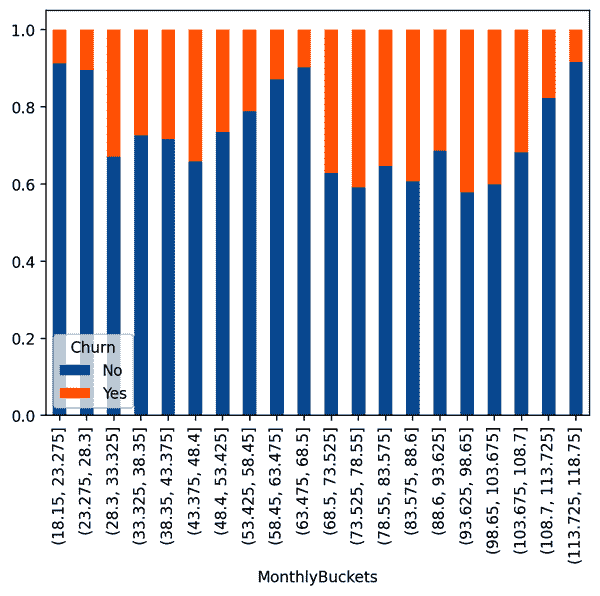
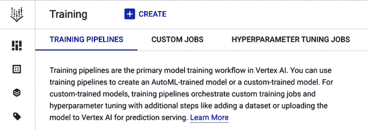
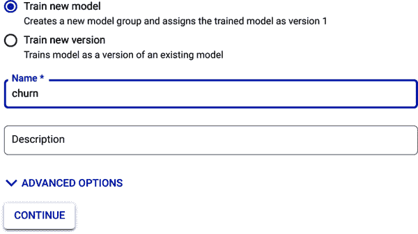

# 第七章：在 Python 中训练自定义 ML 模型

在本章中，你将学习如何使用两个流行的 Python 机器学习库，scikit-learn 和 Keras，构建分类模型来预测客户流失。首先，你将使用 Pandas 探索和清理你的数据。然后，你将学习如何使用 scikit-learn 对分类特征进行独热编码以进行训练，训练逻辑回归模型，使用评估指标了解模型性能，并改善模型性能。你将学习如何使用 Keras 执行相同的步骤，使用已准备好的数据构建神经网络分类模型。在此过程中，你将进一步了解分类模型的性能指标以及如何更好地理解混淆矩阵来评估你的分类模型。

此章节使用的数据集，[IBM 电信客户流失数据集](https://oreil.ly/Rz3r2)，是一个学习如何建模客户流失的流行数据集。在完成本章练习后，你应该有兴趣查看其他使用该数据集的示例，以增加你的知识。

# 业务用例：客户流失预测

你在此项目中的目标是预测电信公司的客户流失。客户流失被定义为客户的离职率，或者说选择停止使用服务的客户比率。电信公司通常以每月费率或年度合同销售其产品，因此这里的“流失”表示客户在下个月取消其订阅或合同。

初始数据以 CSV 文件的形式提供，因此你需要花一些时间将数据加载到 Pandas 中，然后才能探索它，并最终使用它来创建不同框架下的 ML 模型。数据集包含数值变量和分类变量，其中变量从一组离散可能值中取值。

数据集中有 21 列。表 7-1 提供了这些列的列名、数据类型以及关于这些列可能值的一些信息。

表 7-1\. 客户流失数据集的模式和字段值信息

| 列名 | 列类型 | 关于字段值的注释 |
| --- | --- | --- |
| `customerID` | String | 每个客户的唯一值 |
| `gender` | String | “男性”或“女性” |
| `SeniorCitizen` | Integer | 如果客户是老年人则为 1，否则为 0 |
| `Partner` | String | 记录客户是否在家庭中有伴侣（配偶或同居伴侣） |
| `Dependents` | String | 记录客户家庭中是否有受抚养人 |
| `tenure` | Integer | 客户使用电信服务的月数 |
| `PhoneService` | String | 记录客户是否支付电话服务费用 |
| `MultipleLines` | String | 如果客户支付电话服务，他们是否支付多条电话线？ |
| `InternetService` | String | 客户是否付费获得何种类型的互联网服务？ |
| `OnlineSecurity` | String | 客户是否付费获得在线安全服务？ |
| `OnlineBackup` | String | 客户是否付费获得在线备份服务？ |
| `DeviceProtection` | String | 客户是否购买设备保护？ |
| `TechSupport` | String | 客户是否付费获得在线技术支持？ |
| `StreamingTV` | String | 客户是否付费观看流媒体电视？ |
| `StreamingMovies` | String | 客户是否付费观看流媒体电影？ |
| `Contract` | String | 客户是否签有合同或者按月支付？ |
| `PaperlessBilling` | String | 客户是否使用无纸化账单？ |
| `PaymentMethod` | String | 客户使用何种付款方式？ |
| `MonthlyCharges` | Float | 客户服务的月费用 |
| `TotalCharges` | Float | 客户在其生命周期内支付的总金额 |
| `Churn` | String | 客户是否在接下来的一个月内离开电信服务？ |

你会发现许多功能可以合并或省略以训练你的 ML 模型。然而，许多功能需要清洗和进一步转换，以准备训练过程。

# 在无代码、低代码或定制代码 ML 解决方案之间进行选择

在探索如何使用诸如 scikit-learn、Keras 或本书中讨论的其他选项之前，讨论何时应该使用定制培训工具是值得的，这在 第 3 章中已经讨论过：

无代码解决方案

在两种特定情况下尤其出色。首先是当您需要构建一个 ML 模型，但没有任何 ML 的专业知识时。本书的目标是为您提供更多关于如何在 ML 数据周围做出正确决策的见解，但无代码解决方案通常存在以简化决策并减少与更复杂解决方案的工作需要。另一个无代码解决方案突出的地方是模型的快速原型设计。因为无代码解决方案（如 AutoML 解决方案）管理诸如特征工程和超参数调整等步骤，这可以是训练快速基准模型的简便方法。不仅如此，正如第四章和第五章所示，通过 Vertex AI AutoML 部署这些模型也非常简单。在许多情况下，这些无代码解决方案可以立即用于生产环境。在实践中，定制解决方案在足够时间和精力的情况下可能会优于无代码解决方案，但模型性能的增量收益通常会被将无代码解决方案投入生产所节省的时间所抵消。

低代码解决方案

当你确实需要一些定制化，并且正在处理符合所使用工具约束条件的数据时，这些方案非常适合。例如，如果你正在处理结构化数据，并且希望解决的问题类型得到了 BigQuery ML 的支持，那么 BigQuery ML 可能是一个很好的选择。在这些情况下，低代码解决方案的优势在于，构建模型所需的时间更少，可以花更多时间对数据进行实验和调整模型。在许多低代码解决方案中，模型可以直接在产品内部进行生产化，或通过模型导出和使用 Vertex AI 等其他工具进行。

自定义代码解决方案

这些无疑是最灵活的，经常被数据科学家和其他人工智能从业者所利用，他们喜欢构建自己定制的模型。使用像 TensorFlow、XGBoost、PyTorch 和 scikit-learn 这样的 ML 框架，你可以使用任何类型的数据构建模型，并选择你想要的目标。从某种意义上说，灵活性和部署选项几乎没有限制。如果需要自定义转换，可以进行构建。如果需要将模型作为 Web 应用的一部分进行部署，也可以实现。在拥有正确的数据、专业知识和足够时间的情况下，可以通过定制代码解决方案实现最佳结果。然而，其中一个权衡是需要花时间学习这些不同工具和技术。

你应该偏向哪一个？对于每种可能的用例，没有单一正确的答案。考虑你有多少时间来训练、调整和部署模型。还要考虑数据集和问题目标。无代码或低代码解决方案是否支持你的用例？如果不支持，那么自定义代码解决方案可能是唯一的选择。最后，考虑你自己的专业知识。如果你非常擅长 SQL 但对 Python 还不熟悉，那么像 BigQuery ML 这样如果支持你试图解决的问题，可能是最好的选择。

本书不旨在让你成为使用各种不同自定义代码 ML 框架的专家。然而，本书确实采用了这样一种方法，认为接触这些工具和一些基础知识可以为解决问题和与数据科学家以及 ML 工程师合作走得更远。如果你对 Python 不熟悉，那么 Bill Lubanovic 的[*Introducing Python*](https://www.oreilly.com/library/view/introducing-python-2nd/9781492051374)（O'Reilly，2019）是一个很好的入门资源。此外，如果你想深入学习本章介绍的 ML 框架，Aurélien Géron 的[*Hands-On Machine Learning with Scikit-Learn, Keras, and TensorFlow*](https://www.oreilly.com/library/view/hands-on-machine-learning/9781492032632)（第二版，O'Reilly，2022）是一个被实际数据科学家和 ML 工程师引用的精彩资源。

# 使用 Pandas、Matplotlib 和 Seaborn 探索数据集

在学习 scikit-learn 和 Keras 之前，您应该遵循之前章节讨论过的围绕理解和准备 ML 数据的工作流程。尽管您在之前章节中简要使用过 Google Colab 从 BigQuery 加载数据到 DataFrame 并进行了一些基本的可视化，但在 Jupyter Notebook 环境中还没有完全通过数据准备和模型训练过程。

本节重新介绍如何使用 Pandas 将数据加载到 Google Colab 笔记本中。将数据加载到 DataFrame 后，您将探索、清理和转换数据，然后创建用于训练 ML 模型的数据集。正如您在之前章节中看到的那样，大部分工作不是用来训练模型，而是用来理解和准备训练数据。

本节中的所有代码，包括一些额外的示例，都包含在 GitHub 上的[低代码 AI 仓库](https://oreil.ly/supp-lcai)的 Jupyter 笔记本中。

## 在 Google Colab 笔记本中加载数据到 Pandas DataFrame

首先，访问[*https://colab.research.google.com*](https://colab.research.google.com)，并打开一个新的笔记本，按照第二章中讨论的流程进行操作。您可以通过点击名称如图 7-1 所示，并替换当前名称为新名称，例如*Customer_Churn_Model.ipynb*来将此笔记本重命名为更有意义的名称。


###### 图 7-1\. 将 Google Colab 笔记本重命名为更有意义的名称。

现在，在第一个代码块中键入以下代码以导入分析和可视化客户流失数据集所需的包：

```
import matplotlib.pyplot as plt
import numpy as np
import pandas as pd
import seaborn as sns
import sklearn
import tensorflow as tf
```

在第二章中首次探索使用 Colab 笔记本时，您已经见过其中一些包，但在这里有些包对您可能是新的。`import sklearn` 导入了 scikit-learn，这是一个流行的 ML 框架。Scikit-learn 首次发布于 2007 年，构建在 NumPy 和 SciPy 等其他 Python 库之上。它旨在成为一个易于使用的框架，用于构建包括线性模型、基于树的模型和支持向量机在内的 ML 模型。接下来的一行，`import tensorflow as tf`，导入了 TensorFlow。TensorFlow 是一个高性能的数值计算库，设计初衷是用于训练和部署深度神经网络。TensorFlow 包括 Keras，一个旨在简化深度神经网络开发和相应数据转换的库。您将在本章后面使用 Keras 来训练神经网络模型。

现在执行包含`import`语句的单元格以导入这些包。要做到这一点，点击单元格左侧显示的运行单元格按钮，如图 7-2 所示，或者按 Shift + Enter 来运行单元格。


###### 图 7-2\. 在此处顶部左侧看到“运行单元”按钮。

您可以通过检查包的版本来快速验证 `import` 语句是否成功执行。每个包都包含一个特殊的属性 `__version__`，它返回包的版本。在一个新的单元格中输入以下代码，并执行该单元格以检查 scikit-learn 和 TensorFlow 包的版本：

```
print("scikit-learn version:", sklearn.__version__)
print("TensorFlow version:", tf.__version__)
```

您应该看到如 图 7-3 所示的版本已打印出来。请注意，您的确切版本号将取决于您执行此操作的时间。


###### 图 7-3\. 打印 scikit-learn 和 TensorFlow 的版本，确保它们已正确导入。

现在您已准备好导入数据了。回想一下，数据集以 CSV 格式存储，因此您需要下载该数据，将其上传到笔记本中，然后导入到 Pandas DataFrame 中，对吗？实际上，情况并非如此。Pandas 的一个非常好的功能是，您可以直接从互联网上的位置将 CSV 文件导入到 DataFrame 中，而无需先下载文件。要做到这一点，输入以下代码到一个新的单元格，并执行该单元格：

```
file_loc = 'https://storage.googleapis.com/low-code-ai-book/churn_dataset.csv'
df_raw = pd.read_csv(file_loc)
```

一般来说，查看 DataFrame 的前几行是一个好主意。使用 `df_raw.head()` 来探索 DataFrame 的前几行。您可以快速滚动数据的列，并一目了然地看到它们似乎与预期相符。表 7-2 显示了前五行的部分列示例。查看前几行是一个很好的快速第一步，但当然，这个数据集不仅仅是几行，可能会隐藏一些看不见的问题。

表 7-2\. 使用 `head()` 方法打印的 DataFrame `df_raw` 的前五行的部分列

| `流媒体电视` | `流媒体电影` | `合同` | `无纸化账单` | `支付方式` | `月费` | `总费用` | `流失` |
| --- | --- | --- | --- | --- | --- | --- | --- |
| `No` | `No` | `按月付费` | `Yes` | `电子支票` | `29.85` | `29.85` | `No` |
| `No` | `No` | `一年` | `No` | `邮寄支票` | `56.95` | `1889.5` | `No` |
| `No` | `No` | `按月` | `Yes` | `邮寄支票` | `53.85` | `108.15` | `Yes` |
| `No` | `No` | `一年` | `No` | `银行转账（自动）` | `42.30` | `1840.75` | `No` |
| `No` | `No` | `按月付费` | `Yes` | `电子支票` | `70.70` | `151.65` | `Yes` |

## 理解和清理客户流失数据集

现在，数据已加载到 DataFrame `df_raw`中，您可以开始探索和理解数据。即时目标是了解数据可能存在的问题，以便在继续之前解决这些问题。但是，在转换数据时，您还应该关注 DataFrame 列的整体分布和其他属性，这在后续操作中将非常重要。

### 检查和转换数据类型

首先，您将检查 Pandas 推断的数据类型是否与 Table 7-1 中预期的相符。为什么这很有用？这可以是检查误输入数据的简便方法，这种问题通常来自数据本身。例如，如果整数列中存在字符串值，Pandas 会将该列导入为字符串列，因为整数可以转换为字符串，但反之通常不行。要检查 DataFrame 的数据类型，请在新单元格中键入**`df_raw.dtypes`**并执行该单元格。

注意，在`dtypes`后面没有括号。这是因为`dtypes`不是函数，而是 Pandas DataFrame `df_raw`的属性。除了`TotalCharges`列之外，Pandas DataFrame 中导入的任何不是浮点数或整数的内容都被视为`object`类型是正常行为。如果您仔细查看输出，几乎每一列都与预期类型匹配，但`TotalCharges`列除外。您可以在 Table 7-3 中查看最后几列的输出，并确认在您的笔记本环境中是否看到相同的情况。

Table 7-3. `df_raw` DataFrame 的最后六列的数据类型（请注意，`TotalCharges`列不是预期的`float64`类型）

| `Contract` | `object` |
| --- | --- |
| `PaperlessBilling` | `object` |
| `PaymentMethod` | `object` |
| `MonthlyCharges` | `float64` |
| `TotalCharges` | `object` |
| `Churn` | `object` |

`TotalCharges`列与预期有所不同，这是一个不错的迹象。在继续之前，您应该探索该列并理解发生了什么。请记住，您可以使用语法`df['ColumnName']`来处理 Pandas DataFrame 的单个列，其中`df`是 DataFrame 名称，`ColumnName`是列名。

首先，使用`describe()`方法获取`TotalCharges`列的一些高级统计信息。尝试在查看提供的代码之前完成这一步，但如果需要，这里是代码：

```
df_raw['TotalCharges'].describe()
```

您的输出应与 Figure 7-4 中的输出相同。由于`TotalCharges`被视为分类变量（在这种情况下为字符串），因此您只会看到元素的计数、唯一值的数量、频率最高的顶级值以及该值出现的次数。


###### 图 7-4\. `TotalCharges`列的汇总统计信息。注意，最频繁的值是一个只包含一个空格的字符串。

在这种情况下，您几乎可以立即看到问题所在。顶部的值要么为空，要么是空字符串，并且出现了 11 次。这很可能是为什么 Pandas 将`TotalCharges`视为意外数据类型，并导致您发现数据的问题。

当数据缺失时，您可以问：“应该有什么？”为了尝试理解这一点，查看 DataFrame 中对应的数据行，看看缺失的行是否有某种模式。为此，您将创建一个*掩码*并将其应用于 DataFrame。该掩码将是一个简单的语句，根据输入值返回`true`或`false`。在本例中，您的掩码将采用`mask=(df.raw['TotalCharges']==' ')`的形式。`==`运算符用于检查`TotalCharges`列的值是否等于只包含一个空格的字符串。如果值是只包含一个空格的字符串，则运算符返回`true`；否则返回`false`。将以下代码输入到新的单元格中并执行该单元格：

```
mask = (df_raw['TotalCharges']==' ')
df_raw[mask].head()
```

该单元格的输出显示在表 7-4 中。现在探索此单元格的结果。您是否注意到任何可能解释为何这些客户的`TotalCharges`列为空的情况？查看`tenure`列，注意这些客户的值都为 0。

表 7-4\. 数据框`df_raw`的前几列和行，其中`TotalCharges`列的值为`' '`

| `customerID` | `gender` | `SeniorCitizen` | `Partner` | `Dependents` | `tenure` | `PhoneService` |
| --- | --- | --- | --- | --- | --- | --- |
| `4472-LVYGI` | `女` | `0` | `是` | `是` | `0` | `否` |
| `3115-CZMZD` | `男` | `0` | `否` | `是` | `0` | `是` |
| `5709-LVOEQ` | `女` | `0` | `是` | `是` | `0` | `是` |
| `4367-NUYAO` | `男` | `0` | `是` | `是` | `0` | `是` |
| `1371-DWPAZ` | `女` | `0` | `是` | `是` | `0` | `否` |

如果`tenure`为 0，则这对电信公司的新客户来说是他们的第一个月，他们还没有被收费。这就解释了为什么这些客户的`TotalCharges`没有值。现在通过使用另一个掩码来验证这个假设，检查`tenure`等于 0 的行。尝试自己编写此单元格的代码，但如果需要帮助，可以查看下面的解决方案：

```
mask = (df_raw['tenure']==0)
df_raw[mask][['tenure','TotalCharges']]
```

请注意，在上述代码中，你指定了一个列名列表 `['tenure','Total​Char⁠ges']`。由于你仅仅关注 `tenure` 和 `TotalCharges` 之间的关系，这将使结果更易于解析。所有 `TotalCharges` 等于 `' '` 的 11 行数据，在 `tenure` 列中的值均为 0。因此，实际上，这个关系是符合预期的。现在你知道这些奇怪的字符串值对应于零 `TotalCharges`，并且可以将这些字符串值替换为浮点数 `0.0`。最简单的方法是使用 `df.replace()` 方法。这个函数的语法可能需要一点时间来解析，所以首先在一个新的单元格中输入以下代码，并执行该单元格来查看结果：

```
df_1 = df_raw.replace({'TotalCharges': {' ': 0.0}})
mask = (df_raw['tenure']==0)
df_1[mask][['tenure','TotalCharges']]
```

你的结果应该与 Table 7-5 中的结果相同。现在你可以看到，以前 `TotalCharges` 的字符串值现在已经被替换为浮点数值 `0.0`。

Table 7-5\. `TotalCharges` 列已被替换为值 `0.0`，对应所有 `tenure` 值为 `0` 的行

|   | `tenure` | `TotalCharges` |
| --- | --- | --- |
| `488` | `0` | `0.0` |
| `753` | `0` | `0.0` |
| `936` | `0` | `0.0` |
| `1082` | `0` | `0.0` |
| `1340` | `0` | `0.0` |
| `3331` | `0` | `0.0` |
| `3826` | `0` | `0.0` |
| `4380` | `0` | `0.0` |
| `5218` | `0` | `0.0` |
| `6670` | `0` | `0.0` |
| `6754` | `0` | `0.0` |

将这些结果牢记心中，更容易理解第一行代码中使用的语法，即 `df_raw.replace({'TotalCharges': {' ': 0.0}})`。该方法采用了一种称为字典的 Python 数据结构。*字典* 是无序的键值对列表，其中每对的第一个元素是值的名称，第二个元素是值本身。在这种情况下，第一个元素是 `TotalCharges`，即你想要替换值的列名。第二个元素本身也是一个字典，`{' ':0.0}`。这对中的第一个元素是你想要替换的值，第二个元素是你想要插入的新值。

在你探索 `TotalCharges` 列和其他数值列的汇总统计数据之前，请确保 Pandas 知道 `TotalCharges` 是一个 `float` 值的列。要做到这一点，请在一个新的单元格中输入以下代码，并执行该单元格：

```
df_2 = df_1.astype({'TotalCharges':'float64'})
df_2.dtypes
```

请注意，`astype()` 方法使用了与 `replace()` 方法类似的参数。输入是一个字典，其中每对的第一个元素是要更改其数据类型的列，第二个参数（这里是 `float64`）是该列的新数据类型。你从单元格的输出应该类似于 Table 7-6 中显示的结果。

Table 7-6\. 新 DataFrame `df_2` 中最后四列的数据类型，以竖排展示（本图中省略了其余列）

| `PaymentMethod` | `object` |
| --- | --- |
| `MonthlyCharges` | `float64` |
| `TotalCharges` | `float64` |
| `Churn` | `object` |

### 探索汇总统计信息

现在您已经解决了遇到的数据类型问题，请查看数值列的汇总统计信息。您之前在 第二章 中看到如何执行此操作，因此请尝试在不查看代码的情况下完成，尽管代码如下以备您需要帮助，并且结果在 表 7-7 中：

```
df_2.describe()
```

表 7-7。客户流失数据集中数值列的汇总统计信息

|   | `老年人` | `任期` | `每月费用` | `总费用` |
| --- | --- | --- | --- | --- |
| **`count`** | `7043` | `7043` | `7043` | `7043` |
| **`mean`** | `0.162147` | `32.371149` | `64.761692` | `2279.734304` |
| **`std`** | `0.368612` | `24.559481` | `30.090047` | `2266.79447` |
| **`min`** | `0` | `0` | `18.25` | `0` |
| **`25%`** | `0` | `9` | `35.5` | `398.55` |
| **`50%`** | `0` | `29` | `70.35` | `1394.55` |
| **`75%`** | `0` | `55` | `89.85` | `3786.6` |
| **`max`** | `1` | `72` | `118.75` | `8684.8` |

一眼看去，在 表 7-7 的结果中，除了可能是 `老年人` 外，没有异常值或其他不正常情况。回想一下，`老年人` 的值要么是 0 要么是 1。`SeniorCitizen` 列的平均值（均值）为 0.162…，则代表了老年顾客的百分比。尽管该特征可能更适合被视为分类变量，但它是二进制的 0 或 1，这意味着像均值这样的汇总统计信息仍然可以提供有用的信息。

谈到分类特征，你如何探索这些特征的汇总统计信息？`describe()` 方法默认只显示数值特征。您可以通过使用可选关键字参数 `include='object'` 来包含分类特征的统计信息。这指定您希望仅包括 `object` 类型的列，这是 Pandas 中所有非数值列的默认数据类型。在 `describe()` 方法中包括此可选参数，并执行单元格。如果您需要帮助，这里包含了代码：

```
df_2.describe(include='object')
```

您现在将看到分类特征的统计信息。这些汇总统计信息更简单，因为您正在处理离散值而不是数值。您可以看到具有非空值的行数或计数，唯一值的数量，最常见的值（或在并列情况下的其中之一），以及该值的频率。

例如，考虑 `customerID` 列。该列的唯一值数量与行数相同。解释这些信息的另一种方式是，该列中的每个值都是唯一的。您还可以通过查看顶部值出现的频率来进一步验证这一点。

探索摘要统计信息并查看其他注意事项。以下是一些观察结果的集合，这些将对未来的工作有所帮助，但并不完全涵盖这些结果中可用信息的列表：

+   `gender` 和 `Partner` 列在两个不同值之间相当平衡。

+   绝大多数客户拥有电话服务，但几乎一半的客户没有多条线路。

+   许多列有三种不同的可能值。尽管您已了解到顶级类别的信息，但目前还不清楚不同值的分布情况。

+   我们数据集的标签 `Churn` 的平衡性有些不足，约为 `No` 和 `Yes` 值的 5:2 比率。

+   所有列，包括数字列，都有 7,043 个元素。可能存在其他类似于您发现的 `TotalCharges` 的缺失值，但没有任何空值。

### 探索分类列的组合

正如您在第六章中所见，查看不同特征之间的交互通常有助于了解哪些特征最重要以及它们之间的相互作用。然而，在该项目中，您的大多数特征是分类的而不是数值的。在这种情况下，通过查看跨多列的不同特征值组合的分布来探索理解特征交互的方法。

首先查看 `PhoneService` 和 `MultipleLines` 列。常识告诉我们，如果客户没有电话服务，他们就不能拥有多条电话线。通过使用 `value_counts()` 方法，您可以在数据集中确认这一点。`value_counts()` 方法接受一个数据框中的列列表作为参数，并返回唯一值组合的计数。在新单元格中输入以下代码并执行以返回跨 `PhoneService` 和 `MultipleLines` 列的唯一值组合：

```
df_2.value_counts(['PhoneService','MultipleLines'])
```

您的结果应与以下结果相同。请注意，`MultipleLines` 有三种不同的值，`No`、`Yes` 和 `No phone service`。毫不奇怪，当 `PhoneService` 特征的值为 `No` 时，`No phone service` 只出现一次。这意味着 `MultipleLines` 特征包含了 `PhoneService` 特征的所有信息。`PhoneService` 是多余的，您将稍后从训练数据集中删除此特征。

```
PhoneService MultipleLines 
Yes          No               3390 
             Yes              2971 
No           No phone service 682
```

数据集中的其他特征是否以类似的方式“相关”？毫不奇怪，确实如此。作为练习，在新单元格中编写代码来探索 `InternetService`、`OnlineSecurity`、`OnlineBackup`、`StreamingTV` 和 `StreamingMovies` 之间的关系。

再次出现一些特征值之间的冗余，但在这种情况下并不那么明显。当`InternetService`的值为`No`时，所有其他列的值都为`No internet service`。然而，存在两种不同的互联网类型，即`Fiber optic`和`DSL`，在这些情况下图片不那么清晰，不清楚是否存在冗余。虽然您在这里没有包括这些列，但`DeviceProtection`和`TechSupport`列与`InternetService`具有相同的关系。您应该自己探索这一点。在转换特征时，您将考虑如何考虑这些信息。

###### 注意

除了查看特定值组合的计数之外，还存在用于理解分类特征不同值之间关联的技术。其中两个例子是卡方检验和*Cramer's V 系数*。*卡方检验*检查因变量和独立分类变量之间的独立性，而*Cramer's V 系数*确定了该关系的强度，类似于数值变量的 Pearson 相关系数。有关更多细节，您可以参考几乎任何统计书籍，比如 Sarah Boslaugh 的[*Statistics in a Nutshell*](https://www.oreilly.com/library/view/statistics-in-a/9781449361129/)（O’Reilly, 2012）。

您还应探索分类特征与标签`Churn`之间的关系。例如，考虑`Contract`特征。此特征有三个可能的值：`Month-to-month`、`One year`和`Two year`。您对此特征与`Churn`的关系有何直觉？您可以合理地期望较长的合同期限会降低流失率，至少如果客户不是处于合同期末的话。您可以像之前一样使用`value_counts()`方法来查看这种关系，但通常更容易通过视觉理解关系而不是查看数值表格。要可视化这一点，请将以下代码写入一个新的单元格并执行该单元格：

```
(df_2.groupby('Contract')['Churn'].value_counts(normalize=True)
  .unstack('Churn')
  .plot.bar(stacked=True))
```

这实际上是一行非常长的代码要进行解析。括号在开头和结尾告诉 Python 将其视为一行代码而不是三行独立的代码。首先使用 `groupby()` 函数按不同的 `Contract` 值分组。你想要查看 `Churn` 的关系，所以选择 `Churn` 列，然后应用 `value_counts` 函数。注意附加的 `normalize=True` 参数，它将每对值的计数替换为百分比而不是数字。这样做的好处是，你可以看到在每个 `Contract` 值中，多少客户流失相比于没有流失的客户，而不是比较不均匀组中的计数。在使用内置的 Pandas 绘图功能之前，使用 `unstack()` 函数将表格格式化为更易读的格式。在这种情况下，图 7-5 使用堆叠条形图快速比较不同 `Contract` 值。

你可以看到按月付合同的客户流失率比按年付或两年付合同的要高。从可视化中可以看出，超过 40% 的按月付合同客户取消了他们的服务，而按年付约为 15%，按两年付则不到 5%。这意味着合同类型几乎肯定会成为未来的一个有用特征。


###### 图 7-5\. 基于合同类型，显示离开电信公司客户比例的可视化。

作为练习，对你的其他分类特征进行类似的分析。注意哪些特征在不同值之间有不同的流失百分比，哪些则相对更为相似。这将有助于稍后选择特征。

当在 Python 中多次执行类似的代码块时，创建一个函数来执行可能更有效。例如，你可以通过以下代码创建一个函数来生成上面的分布图：

```
def plot_cat_feature_dist(feature_name):
  (df_2.groupby(feature_name)['Churn'].value_counts(normalize=True)
    .unstack('Churn')
    .plot.bar(stacked=True))
```

`def` 是 Python 中定义函数的关键字，函数名为 `plot_cat_feature_dist`，而 `feature_name` 则是输入变量。这样，`plot_cat_feature_dist('Contract')` 将生成与 图 7-5 相同的图表。你随后可以对所有的分类变量使用此函数。

在探索分类特征时，你应该注意到以下一些观察结果：

+   针对老年人与非老年人，流失率大约是两倍。

+   `gender`、`StreamingTV` 和 `StreamingMovies` 特征的值似乎对流失率没有影响。

+   家庭规模越大，流失率越低。换句话说，家庭中有伴侣或者依赖者会降低流失率。

+   对于拥有电话线的用户来说，拥有多条电话线会增加流失率。

+   `InternetService`特征会影响流失率。光纤互联网服务的流失率远高于 DSL。没有互联网服务的用户流失率最低。

+   互联网附加服务（如`OnlineSecurity`和`DeviceProtection`）会降低流失率。

+   `PaperlessBilling`会增加流失率。`PaymentMethod`的大多数值相同，除了`Electronic Check`，其流失率远高于其他方式。

你有没有注意到其他什么？记得做好这些观察以备后用。

### 探索数值和分类列之间的交互作用。

在最终思考如何转换特征之前，你还应该探索数值特征与标签之间的关系。记住`SeniorCitizen`实际上是一个分类列，因为两个值表示两个离散类别。剩下的数值列是`tenure`、`MonthlyCharges`和`TotalCharges`。如果客户每个月支付相同金额，这些列将有一个简单的关系。也就是说，`tenure × MonthlyCharges = TotalCharges`。在`tenure`为 0 的情况下，你显式地看到了这一点。

这是多么频繁的情况呢？直觉上，也许是从经验中得知，月费用通常随时间变化。这可能是由于促销价格的结束，也可能是由于例如改变你支付的服务等原因。你可以使用 Pandas 函数来验证这种直觉。将以下代码写入新的单元格并执行该单元格以查看比较`tenure × MonthlyCharges`和`TotalCharges`的新列的摘要统计信息：

```
df_2['AvgMonthlyCharge'] = df_2['TotalCharges']/df_2['tenure']
df_2['DiffCharges'] = df_2['MonthlyCharges']-df_2['AvgMonthlyCharge']
df_2['DiffCharges'].describe()
```

请注意，在你的 DataFrame `df_2`中创建了两个新列。`AvgMonthlyCharge`列记录客户在使用期间的平均月费用，`DiffCharges`列记录平均月费用与当前月费用之间的差异。结果如下所示：

```
count 7032.000000 
mean  -0.001215 
std   2.616165 
min   -18.900000 
25%   -1.160179 
50%   0.000000 
75%   1.147775 
max   19.125000 
Name: DiffCharges, dtype: float64
```

从这些摘要统计中，你应该注意几点：首先，注意到计数比总行数少了 11 行。为什么呢？回想一下，你有 11 行的`tenure`值为零。在 Pandas 中，如果除以零，该值记录为`NaN`而不是抛出错误。另外，注意到分布似乎相当对称。平均值几乎为零，中位数为 0，最小值和最大值几乎互为相反数。

删除`NaN`值的一种方法是使用`replace()`方法替换未定义的值。在新的单元格中使用以下代码执行此任务：

```
df_2['AvgMonthlyCharge'] = (df_2['TotalCharges'].div(df_2['tenure'])
                                                    .replace(np.nan,0))
df_2['DiffCharges'] = df_2['MonthlyCharges']-df_2['AvgMonthlyCharge']
df_2['DiffCharges'].describe()
```

将空值替换为零值的选择是填充策略的一个示例。*填充* 的过程是用在问题处理上合理的替代值来替换未知值。因为你希望查看月费和平均月费之间的差异，说“没有差异”是一个合理的方法，以避免必须丢弃可能有用的数据。如果不进行填充，你将丢失所有`tenure`为零的行，因此你的模型将无法准确预测这些情况。对于足够大的数据集，如果缺失数据并不集中在一个单一组中，则通常会采取删除数据的策略。这是第 6 章中采取的方法。

`DiffCharges`的值如何与`Churn`列相关联？你用于理解分类列之间关系的方法在这里不太适用，因为`DiffCharges`是数值型的。但是你可以将`DiffCharges`的值分桶化，并使用之前使用的方法。*分桶* 的思想是将数值列分成称为*桶*的值范围。在 Pandas 中，你可以使用`cut()`函数为数值列定义桶。你可以提供要使用的桶的数量，或指定一个切分点列表。要对`DiffCharges`列进行分桶并探索其对`Churn`的影响，请将以下代码键入到新的单元格中并执行该单元格：

```
df_2['DiffBuckets'] = pd.cut(df_2['DiffCharges'], bins=5)
plot_cat_feature_dist('DiffBuckets')
```

结果图（见图 7-6）显示，`MonthlyCharges`与`AvgMonthlyCharge`之间的差异（无论是正还是负）越大，相应数值范围内的流失率就越高。作为练习，尝试不同数量的箱体，并观察你能注意到的模式。


###### 图 7-6. `DiffCharges`列每个桶的流失率。

每个桶的流失率并不会呈现出一个漂亮的线性趋势。也就是说，流失率在桶离中心越远时先下降，然后再上升。在这种情况下，将桶成员视为一个分类变量对机器学习而言可能比保持其作为数值特征更有优势。

你还可以探索数值特征而不进行任何操作。例如，我们可以使用以下代码探索`MonthlyCharges`和`Churn`之间的关系。关系可在图 7-7 中可视化：

```
df_2['MonthlyBuckets'] = pd.cut(df_2['MonthlyCharges'], bins=3)
plot_cat_feature_dist('MonthlyBuckets')
```


###### 图 7-7\. 对于 `MonthlyCharges` 每个桶的客户流失率。随着每月费用的增加，流失率也在增加，85.25 到 118.75 之间的费用具有最高的流失率。

在 图 7-7 中，您可以看到随着 `MonthlyCharges` 值的增加，流失率倾向于增加。这意味着 `MonthlyCharges` 列对预测流失将是有用的。

###### 警告

找到要用于数值列的正确桶数量可能有些棘手。桶太少可能会错过重要的模式，但桶太多可能会导致模式变得非常嘈杂甚至误导性。图 7-8 展示了一个例子，即当桶数过多时，会导致噪声模式，难以获取见解。同时注意，每个桶的值范围相当小，因此每个桶中捕获的客户数量较少。



###### 图 7-8\. 对于 `MonthlyCharges` 每个桶的客户流失率，桶太多。模式在噪声中丢失，难以从这种可视化中理解关系。

作为一个练习，自行分析 `tenure` 和 `TotalCharges` 列。您应该会看到随着 `tenure` 和 `TotalCharges` 的增加，流失率减少。由于较长的任期应该会导致在任期内支付的费用增加，所以这两列与流失之间有类似的关系是合理的。使用之前章节的代码，检查这两个特征之间的相关性，确保它们确实高度相关，相关系数约为 0.82。

## 使用 Pandas 和 Scikit-Learn 转换特征

到此为止，您已经探索了数据集中不同的列，它们之间的相互作用，特别是它们与标签的交互作用。现在，您将准备好这些数据以供自定义模型使用。首先，您将选择用于训练机器学习模型的列。之后，您将转换这些特征，使其更适合训练。请记住，您的特征必须是具有有意义的大小的数值。在选择此项目的特征时，您将考虑到这一点。

### 特征选择

前一节探索了客户流失数据集中不同特征与客户流失列`Churn`之间的交互作用。您发现一些特征要么不具有预测性——即不同的值不影响流失率——要么与其他特征冗余。您应该复制您的 DataFrame `df_2`，然后移除您不打算用于训练模型的列。为什么要复制？如果从`df_2`中移除列，那么您可能需要重新查看创建该 DataFrame 的代码，以便再次访问该数据。虽然没有明确说明，但这就是为什么 DataFrame `df_2`被创建而不是修改原始 DataFrame `df_raw`的原因。通过在 DataFrame 的副本中删除列，您可以保留原始数据以便在需要时再次访问。

在前一节中，您发现`gender`、`StreamingTV`和`StreamingMovies`列对`Churn`标签没有预测性。此外，您还发现`PhoneLine`特征是冗余的，并包含在`MultipleLines`特征中，因此您也希望将其移除，以避免与共线性相关的问题。在第六章中，您了解到当预测变量之间存在高相关性时会发生共线性，导致回归系数的估计不可靠和不稳定。在使用复杂模型类型以上时，这些问题会被放大。对抗这些问题的一种方法是只使用一组共线性列中的一列。

在 Pandas DataFrame 中删除列的最简单方法是使用`drop()`函数。将以下代码输入到新单元格中并执行，以创建 Pandas DataFrame 的副本并丢弃您不再需要的列：

```
df_3 = df_2.copy()
df_3 = df_3.drop(columns=['gender','StreamingTV',
                          'StreamingMovies','PhoneService'])
df_3.columns
```

要检查哪些列保留，包含了`df_3.columns`这一行。具体输出会因您之前的探索而异，但例如，您可能看到如下输出：

```
Index(['customerID', 'SeniorCitizen', 'Partner', 'Dependents',   
       'tenure', 'MultipleLines', 'InternetService', 'OnlineSecurity', 
       'OnlineBackup','DeviceProtection', 'TechSupport', 'Contract',
       'PaperlessBilling', 'PaymentMethod', 'MonthlyCharges', 
       'TotalCharges', 'Churn', 'AvgMonthlyCharge', 'DiffCharges',    
       'DiffBuckets', 'MonthlyBuckets', 'TenureBuckets, 
       'TotalBuckets'], dtype='object')
```

对于这里显示的 DataFrame 列，已添加了`AvgMonthlyCharge`、`DiffCharges`、`DiffBuckets`、`MonthlyBuckets`、`TotalBuckets`和`TenureBuckets`。您发现`DiffBuckets`特征将是一个有用的特征，并且`tenure`特征与`TotalCharges`特征高度相关。为了避免共线性问题，删除`TotalCharges`特征以及除了`DiffBuckets`之外的所有其他添加的特征。执行此操作所需的代码可能与下面的代码不同，具体取决于您执行的探索：

```
df_3 =df_3.drop(columns=['TotalCharges','AvgMonthlyCharge', 
                         'DiffCharges','MonthlyBuckets',
                         'TenureBuckets', 'TotalBuckets'])
```

最后，`customerID` 列怎么样？此列过于精细化，对预测模型没有任何用处。为什么呢？请记住，`customerID` 列唯一标识每一行。您会冒险使模型学习将此特征的值与 `Churn` 的值直接关联，特别是在接下来的转换之后。这对于您的训练数据集很好，但一旦您的模型第一次看到 `customerID` 的新值，它将无法以有意义的方式使用该值。因此，在训练模型时最好删除此列。作为练习，编写代码将 `customerID` 列删除到一个新的单元格，并执行该单元格以删除该列。这里是解决方案代码，但请尽量完成此任务而不查看它：

```
df_3 = df_3.drop(columns=['customerID'])
df_3.dtypes
```

最后，您将得到 15 个特征列和 1 个标签列 `Churn`。最后一行 `df_3.dtypes` 的输出在此提供作为参考：

```
SeniorCitizen          int64
Partner               object
Dependents            object
tenure                 int64
MultipleLines         object
InternetService       object
OnlineSecurity        object
OnlineBackup          object
DeviceProtection      object
TechSupport           object
Contract              object
PaperlessBilling      object
PaymentMethod         object
MonthlyCharges       float64
Churn                 object
DiffBuckets         category
```

`DiffBuckets` 是一个 `category` 列，而不是一个 `object` 列。这是因为桶化过程包括附加信息，即表示桶的间隔。

### 使用 scikit-learn 对分类特征进行编码

在开始训练过程之前，您需要将分类特征编码为数值特征。`SeniorCitizen` 就是一个很好的例子。不再使用 `Yes` 和 `No` 值，而是分别编码为 1 或 0。实质上，这就是您将来将要为您的特征执行的操作，使用 scikit-learn。

首先，请注意，许多分类特征都是二进制特征。`Partner`、`Dependents`、`OnlineSecurity`、`OnlineBackup`、`DeviceProtection`、`TechSupport` 和 `PaperlessBilling` 都是二进制特征。请注意，对于 `OnlineSecurity`、`OnlineBackup`、`DeviceProtection` 和 `TechSupport`，这并不严格适用，但 `No internet service` 的值已经由 `InternetService` 捕获。在编码您的特征之前，请使用以下代码将不同列中所有 `No internet service` 值替换为 `No`：

```
df_prep = df_3.replace('No internet service', 'No')
df_prep[['OnlineSecurity', 'OnlineBackup',
         'DeviceProtection', 'TechSupport']].nunique()
```

`nunique()` 方法计算每列的唯一值数量。您应该看到此单元格的输出中，`OnlineSecurity`、`OnlineBackup`、`DeviceProtection` 和 `TechSupport` 列有两个唯一值，分别对应 `No` 和 `Yes`。您将保留此 DataFrame `df_prep`，以便稍后进行任何额外的特征工程。

现在，您已经准备好执行独热编码了。*独热编码*是将具有独立值的分类特征转换为数字表示的过程。这个表示是一个整数列表，每个可能的特征值对应一个整数。例如，`InternetService` 特征有三个可能的值：`No`、`DSL` 和 `Fiber Optic`。这些值的独热编码分别是 `[1,0,0]`、`[0,1,0]` 和 `[0,0,1]`。另一种思考方式是，我们为每个特征值创建了一个新的特征列。也就是说，第一列询问，“`InternetService` 的值是否等于 `No`？”如果是，值为 1，否则为 0。其他两列分别对应相同的问题，但针对 `DSL` 和 `Fiber Optic` 的值。通过这种独热编码的思路，通常像 `Partner` 这样只有两个值 `No` 和 `Yes` 的特征将被编码为 0 和 1，而不是 `[1,0]` 和 `[0,1]`。

Scikit-learn 包含一个预处理库，专门为您的特征和标签提供转换器。要将分类特征转换为独热编码特征，您将使用 scikit-learn 中的 `OneHotEncoder` 类。以下代码展示了如何在这个示例中使用 `OneHotEncoder` 对分类列进行独热编码：

```
from sklearn.preprocessing import OneHotEncoder 

numeric_columns = ['SeniorCitizen', 'tenure', 'MonthlyCharges']
categorical_columns = ['Partner', 'Dependents', 'MultipleLines',                     
                       'InternetService','OnlineSecurity',
                       'OnlineBackup','DeviceProtection',
                       'TechSupport','Contract','PaperlessBilling',
                       'PaymentMethod','DiffBuckets']

X_num = df_prep[numeric_columns]
X_cat = df_prep[categorical_columns]

ohe = OneHotEncoder(drop='if_binary')
X_cat_trans = ohe.fit_transform(X_cat)
```

在继续之前理解这段代码值得一提。首先，通过 `from sklearn.preprocessing import OneHotEncoder` 从 scikit-learn 中导入 `OneHotEncoder` 类。接下来，将列分为数值和分类列。由于 `SeniorCitizen` 已经被编码，您可以简单地将其包含在数值列中。在此之后，代码的下两行将 DataFrame 拆分为两个单独的 DataFrame：`X_num` 用于数值特征，`X_cat` 用于分类特征。

最后，您可以开始使用 scikit-learn 的`OneHotEncoder`。首先，通过以下代码创建一个独热编码器：`ohe = OneHotEncoder(drop='if_binary')`。参数`drop='if_binary'`将会把二元特征值替换为 0 或 1，而不是返回完整的独热编码。

最后一行是实际进行转换的地方。`fit_transform` 函数执行两个不同的操作。`fit_transform` 中的 *fit* 部分指的是 `OneHotEncoder` 学习不同特征的不同值及其独热编码值的分配。这很重要，因为有时您可能需要反向过程，回到原始值。例如，在进行预测后，您想知道客户使用的支付方式。您可以使用 `OneHotEncoder` 的 `inverse_transform()` 方法将编码后的数字输入转换回原始输入。例如，考虑在不同单元格中运行以下两行代码：

```
X_cat_trans.toarray()[0]
ohe.inverse_transform(X_cat_trans.toarray())[0]
```

第一行返回以下输出：

```
[1., 0., 0., 1., 0., 1., 0., 0., 0., 1., 0., 0., 1., 0., 0., 1., 0., 0., 1.,
0., 0., 0., 1., 0., 0., 0.]
```

第二行返回以下输出：

```
Partner                          Yes
Dependents                        No
MultipleLines       No phone service
InternetService                  DSL
OnlineSecurity                    No
OnlineBackup                     Yes
DeviceProtection                  No
TechSupport                       No
Contract              Month-to-month
PaperlessBilling                 Yes
PaymentMethod       Electronic check
DiffBuckets           (-3.69, 3.915]
```

一旦`OneHotEncoder`已经适合数据，您可以使用`transform()`和`inverse_transform()`在原始值和编码值之间来回切换。

最后，您需要将数值特征和编码的分类特征组合回一个单一对象中。一次热编码的分类特征返回为 NumPy 数组，因此您需要将 Pandas DataFrame 转换为 NumPy 数组，并将数组连接成一个单一数组。此外，您还需要为标签`Churn`创建一个 NumPy 数组。为此，请在新的单元格中执行以下代码：

```
X = np.concatenate((X_num.values,X_cat_trans.toarray()), axis=1)
y = df_prep['Churn'].values
```

NumPy 中的`concatenate()`函数接受两个数组并返回一个单一的数组。`X_num`是一个 Pandas DataFrame，但是 Pandas DataFrame 的实际值存储为 NumPy 数组。您可以通过查看 DataFrame 的`values`属性来访问这个数组。`X_cat_trans`是一种特殊类型的 NumPy 数组，称为稀疏数组。*稀疏*数组，即大多数条目为 0，可能很好，因为有许多聪明的优化可以用来更有效地存储它们。但是，您需要实际的相应数组。您可以使用`toarray()`方法来访问它。最后，您希望“水平”连接 DataFrame，即将列并排组合在一起，因此您需要指定额外的参数`axis=1`。类似地，`axis=0`对应于“垂直”堆叠数组，即将一行列表附加到另一个上。

### 泛化和数据分割

在准备好数据集之后，您终于可以开始训练模型了，对吗？不完全是。您需要进行训练-测试数据分割，以确保能够正确评估您的模型。

Scikit-learn 提供了一个很好的辅助函数来完成这个任务，称为`train_test_split`，在`model_selection`模块中。尽管在 scikit-learn 和其他自定义训练框架中，分割数据集用于训练和评估是你自己需要管理的事情，但大多数（如果不是全部）框架都提供了工具来简化这一过程。

要将数据集分割为训练集和测试集，请在新的单元格中执行以下代码：

```
from sklearn.model_selection import train_test_split

X_train, X_test, y_train, y_test = train_test_split(X,y,test_size=0.20,
                                                    random_state=113)

X_train.shape
```

第一行从 scikit-learn 的`model_selection`库导入`train_test_split`函数。第二行是分割发生的地方。`train_test_split`接受您要分割的数组列表（这里是您的`X`和`y`）和`test_size`以指定训练数据集的大小作为百分比。您还可以提供一个`random_state`，以便执行此代码的任何其他人得到相同的训练和测试数据集行。最后，您可以通过`X_train.shape`看到训练数据集的最终大小。这是一个形状为`(5634, 29)`的数组。也就是说，经过一次热编码后，训练数据集中有 5,634 个示例和 29 个特征。这意味着测试数据集有 1,409 个示例。

# 使用 Scikit-Learn 构建逻辑回归模型

准备好训练和测试数据集后，你就可以开始训练你的机器学习模型了。本节介绍了你将要训练的模型类型——逻辑回归，以及如何在 scikit-learn 中开始训练模型。接下来，你将学习不同的方法来评估和改进你的分类模型。最后，你将了解 scikit-learn 中的*pipelines*，这是一种将你在数据集上执行的不同转换和你想要使用的训练算法整合在一起的方式。

## 逻辑回归

逻辑回归模型的目标是预测属于两个离散类别中的一个的成员资格。为了简单起见，将这两个类别分别表示为<math><mrow><mi>y</mi> <mo>=</mo> <mn>1</mn></mrow></math>和<math><mrow><mi>y</mi> <mo>=</mo> <mn>0</mn></mrow></math>。你经常会把其中一个类别视为“正”类，另一个类别视为“负”类。像线性回归一样，输入是一组数值，但输出是给定特征列表<math><mover accent="true"><mi>x</mi> <mo>→</mo></mover></math>时正类的预测概率。<math><mrow><mi>P</mi> <mo>(</mo> <mi>y</mi> <mo>=</mo> <mn>1</mn> <mo>|</mo> <mover accent="true"><mi>x</mi> <mo>→</mo></mover> <mo>)</mo></mrow></math>。在<math><mrow><mi>y</mi> <mo>=</mo> <mn>1</mn></mrow></math>的情况下，你希望这个概率尽可能接近 1，而在<math><mrow><mi>y</mi> <mo>=</mo> <mn>0</mn></mrow></math>的情况下，你希望这个概率尽可能接近 0。

如何计算这个概率？回想一下，对于线性回归，你使用了模型<math><mrow><mi>f</mi> <mrow><mo>(</mo> <mi>x</mi> <mo>)</mo></mrow> <mo>=</mo> <msub><mi>w</mi> <mn>0</mn></msub> <mo>+</mo> <msub><mi>w</mi> <mn>1</mn></msub> <msub><mi>x</mi> <mn>1</mn></msub> <mo>+</mo> <mo>.</mo> <mo>.</mo> <mo>.</mo> <mo>+</mo> <msub><mi>w</mi> <mi>n</mi></msub> <msub><mi>x</mi> <mi>n</mi></msub></mrow></math>，其中<math><mrow><msub><mi>w</mi> <mn>0</mn></msub> <mo>,</mo> <mo>.</mo> <mo>.</mo> <mo>.</mo> <mo>,</mo> <msub><mi>w</mi> <mi>n</mi></msub></mrow></math>是一些权重。对于逻辑回归，方程式类似：

<math><mrow><mi>g</mi> <mrow><mo>(</mo> <mover accent="true"><mi>x</mi> <mo>→</mo></mover> <mo>)</mo></mrow> <mo>=</mo> <mfrac><mn>1</mn> <mrow><mn>1</mn><mo>+</mo><mo form="prefix">exp</mo><mo>(</mo><mo>-</mo><mi>f</mi><mrow><mo>(</mo><mover accent="true"><mi>x</mi> <mo>→</mo></mover><mo>)</mo></mrow><mo>)</mo></mrow></mfrac></mrow></math>

乍一看，这个公式可能看起来很可怕，但值得解析。<math><mrow><mi>g</mi> <mo>(</mo> <mi>x</mi> <mo>)</mo></mrow></math>是两个函数的组合：所谓的*logit<math><mrow><mi>f</mi> <mo>(</mo> <mi>x</mi> <mo>)</mo></mrow></math>*和*sigmoid（或 logistic）函数*：

<math><mrow><mi>σ</mi> <mrow><mo>(</mo> <mi>t</mi> <mo>)</mo></mrow> <mo>=</mo> <mfrac><mn>1</mn> <mrow><mn>1</mn><mo>+</mo><mo form="prefix">exp</mo><mo>(</mo><mo>-</mo><mi>t</mi><mo>)</mo></mrow></mfrac></mrow></math>

Sigmoid 函数（及其变体）出现在许多不同的领域中，包括生态学、化学、经济学、统计学，当然还有机器学习。Sigmoid 函数具有一些很好的特性，使其在分类模型中非常有吸引力。首先，其值范围在 0 到 1 之间，可以将输出解释为概率。在技术术语中，这是累积分布函数的一个例子，因为值随着独立变量的增加而始终增加。其次，函数的*导数*（在任意给定时刻的变化率）易于计算。这对于梯度下降至关重要，使得训练这样的模型成为一个非常合理的过程。逻辑函数的图形可以在图 7-9 中看到。


###### 图 7-9\. 逻辑函数的图形。注意其值范围在 0 到 1 之间。

在训练线性回归模型时，请记住，您使用的目标是最小化均方误差。对于逻辑回归，您使用的是一种称为交叉熵的不同损失函数。*交叉熵*损失函数的定义如下：

<math><mrow><mi>L</mi> <mrow><mo>(</mo> <mi>g</mi> <mo>,</mo> <mi>D</mi> <mo>)</mo></mrow> <mo>=</mo> <mo>-</mo> <mfrac><mn>1</mn> <mi>N</mi></mfrac> <mo>∑</mo> <mrow><mo>(</mo> <mo form="prefix">log</mo> <mrow><mo>(</mo> <mi>g</mi> <mrow><mo>(</mo> <mover accent="true"><mi>x</mi> <mo>→</mo></mover> <mo>)</mo></mrow> <mo>)</mo></mrow> <mi>y</mi> <mo>+</mo> <mo form="prefix">log</mo> <mrow><mo>(</mo> <mn>1</mn> <mo>-</mo> <mi>g</mi> <mrow><mo>(</mo> <mover accent="true"><mi>x</mi> <mo>→</mo></mover> <mo>)</mo></mrow> <mo>)</mo></mrow> <mrow><mo>(</mo> <mn>1</mn> <mo>-</mo> <mi>y</mi> <mo>)</mo></mrow> <mo>)</mo></mrow></mrow></math>

这里，总和是在数据集 <math><mi>D</mi></math> 中的所有示例上。参数 <math><mi>D</mi></math> 在这里被包含，提醒交叉熵取决于用于计算的数据集，就像评估的模型一样。无论是 <math><mi>y</mi></math> 还是 <math><mrow><mn>1</mn> <mo>-</mo> <mi>y</mi></mrow></math> 都将为零，因此每个示例的总和中只有一个项是非零的。相应的术语 <math><mrow><mo form="prefix">log</mo> <mo>(</mo> <mi>g</mi> <mrow><mo>(</mo> <mover accent="true"><mi>x</mi> <mo>→</mo></mover> <mo>)</mo></mrow> <mo>)</mo></mrow></math> 或 <math><mrow><mo form="prefix">log</mo> <mo>(</mo> <mn>1</mn> <mo>-</mo> <mi>g</mi> <mrow><mo>(</mo> <mover accent="true"><mi>x</mi> <mo>→</mo></mover> <mo>)</mo></mrow> <mo>)</mo></mrow></math> 将会对损失函数作出贡献。如果模型对最终的正确答案有 100%的信心，那么这个项将为零。如果不是，则随着信心的减少，对损失函数的贡献值会呈指数增长。

这里有一个具体的例子：假设 <math><mrow><mi>g</mi> <mo>(</mo> <mover accent="true"><mi>x</mi> <mo>→</mo></mover> <mo>)</mo></mrow></math> = 0.6，而 <math><mrow><mi>y</mi> <mo>=</mo> <mn>1</mn></mrow></math> 。换句话说，模型给出标签为 1 的概率为 60%。这如何影响损失函数？对于这个单项来说，唯一的贡献来自于 <math><mrow><mo form="prefix">log</mo> <mo>(</mo> <mi>g</mi> <mrow><mo>(</mo> <mover accent="true"><mi>x</mi> <mo>→</mo></mover> <mo>)</mo></mrow> <mo>)</mo></mrow></math> 。log(0.6) 大约等于 –0.222。在损失函数的计算中，由于前面的负号，符号最终被反转。然而，如果 <math><mrow><mi>g</mi> <mo>(</mo> <mover accent="true"><mi>x</mi> <mo>→</mo></mover> <mo>)</mo></mrow></math> = 0.4，则 log(0.4) 大约等于 –0.398。在这种情况下，预测概率 <math><mrow><mi>g</mi> <mo>(</mo> <mover accent="true"><mi>x</mi> <mo>→</mo></mover> <mo>)</mo></mrow></math> 离 1 越远，对损失函数的贡献就越大。

###### 注意

交叉熵最初是信息论领域的一个概念。粗略地说，交叉熵测量了在假设一个概率分布时表示事件所需的信息量，但实际的概率分布是不同的。在逻辑回归的情况下，假设的概率分布来自模型的输出，而实际的分布由我们的标签给出。

## 在 Scikit-Learn 中训练和评估模型

你已经准备好了数据，并确定了一种模型类型——逻辑回归，你希望用它来预测客户流失。现在你已经准备好使用 scikit-learn 来训练你的第一个模型了。在 scikit-learn 中，创建和训练模型的过程非常简单。首先，你创建你想要训练的模型类型的模型，然后你训练这个模型。要构建和训练一个逻辑回归模型，将以下代码键入一个新单元格并执行该单元格：

```
from sklearn.linear_model import LogisticRegression

cls = LogisticRegression()

cls.fit(X_train, y_train)
```

执行完这个单元格后，你可能会看到以下或类似的消息：

```
/usr/local/lib/python3.10/dist-packages/sklearn/linear_model/_logistic.py:814:
ConvergenceWarning: lbfgs failed to converge (status=1):
STOP: TOTAL NO. of ITERATIONS REACHED LIMIT.

Increase the number of iterations (max_iter) or scale the data as shown in:
    https://scikit-learn.org/stable/modules/preprocessing.html
Please also refer to the documentation for alternative solver options:
    https://scikit-learn.org/stable/modules/linear_model.html#logistic-regression
  n_iter_i = _check_optimize_result(
LogisticRegression()
```

发生了什么问题？默认情况下，scikit-learn 将执行梯度下降来尝试找到模型的最佳权重，用于一定数量的迭代。在这个上下文中，*迭代*意味着在整个数据集上计算梯度下降。一旦我们的损失函数——交叉熵——在迭代之间的改善变得非常小（默认情况下，<math><msup><mn>10</mn> <mrow><mo>-</mo><mn>4</mn></mrow></msup></math>），训练过程就会终止。在你的情况下，你的模型从未达到这个阈值。在实践中，这意味着模型仍有改进的空间，可以通过更长时间的训练来实现。

然而，造成这种问题的原因是什么呢？有几个不同的原因，但其中一个最基本的问题之一与特征范围有关。如果特征值的范围差异很大，梯度下降往往需要更多的迭代才能收敛到最佳解决方案。

一种思考这个问题的方式是考虑一个滚球的类比。首先，假设你有一个完全圆形的碗，意味着顶部是一个完美的圆圈。如果你把一个球放在碗的边缘并给它一个小推动，它会立即滚到碗底的最低点。那么如果碗更像是椭圆或椭圆形呢？如果你给球一个推动，它可能不会直接朝向中心滚动，而是沿途来回振荡。本质上，这正是梯度下降的工作原理。*曲率*，也就是“碗”距离完全平坦的程度，影响了梯度下降的行为。当曲率是常数时——例如，当碗是完全圆形时——我们就有了之前讨论过的良好行为。然而，当曲率不是常数时，例如特征值具有不同的比例时，我们就会面临之前讨论过的摇摆行为。

如何解决这个问题？一个方法是简单地增加模型的迭代次数。在 scikit-learn 中，你可以通过提供可选的 `max_iter` 参数来轻松实现这一点。对于较小的数据集，这是一个不错的方法，但一旦开始处理更大的数据集，这种方法就不再可行。更好的方法是将特征重新缩放到标准范围内，例如 0 到 1 之间。在 scikit-learn 中，你可以使用 `MinMaxScaler()` 转换器来完成这一点。在新的代码单元格中输入以下代码并执行，以重新缩放你的训练数据集，然后训练一个新的逻辑回归模型：

```
from sklearn.preprocessing import MinMaxScaler

scaler = MinMaxScaler()
X_train_scaled = scaler.fit_transform(X_train)

cls = LogisticRegression()

cls.fit(X_train_scaled, y_train)
```

这次你的模型应该成功收敛了。与其让模型花费更多计算时间来收敛，你可以简单地重新缩放数据，从而使训练过程更高效。这是训练机器学习模型的一般最佳实践，并不仅限于使用 scikit-learn 或训练逻辑回归模型时。

模型训练完成后，下一步是评估模型。在 scikit-learn 中，你可以使用训练好的模型的 `score` 方法来评估测试数据集的表现。`score` 方法的输出是模型在测试数据集上的平均准确率，表示为小数。执行新的代码单元格并使用 `cls.score(X_test, y_test)` 来计算模型在测试数据集上的准确率。

你的模型准确率可能大约在 48%左右，尽管具体数值可能会因随机状态而略有不同。这似乎不是一个好模型，因为你可能通过随机抛硬币得到略微更好的结果。但你可能已经注意到这里的问题。在训练模型之前，你将训练特征缩放到 0 到 1 之间。但是你没有对测试数据集执行相同的转换。由于模型在评估时预期的值范围与实际呈现的值范围不同，模型表现不佳。这是 *训练-服务偏差* 的典型例子。

你希望对测试数据集执行与训练数据集相同的缩放。你之前使用了 `fit_transform()` 方法，以便 `MinMaxScaler()` 学习每个特征的最小值和最大值，并根据此范围将值缩放到 0 到 1 之间。你不希望重新拟合转换器，但可以使用相同的转换器来对测试数据集进行转换，以便进行评估。通过以下代码完成这一步，然后比较性能差异：

```
X_test_scaled = scaler.transform(X_test)

cls.score(X_test_scaled, y_test)
```

您的模型的准确率现在应该在 80%左右。这比您在未对评估数据集进行缩放时获得的准确率要高得多。从这个例子中要得出的重要结论是，您必须在训练和评估时执行相同的转换，以确保获得准确的结果。在预测时也是如此。重要的是要记录您对数据进行的转换，并利用像 scikit-learn 中的管道这样的工具，以确保这些转换被一致地应用。

## 分类评估指标

准确率是用于分类模型的一种简单易懂的指标。然而，仅使用准确率作为指标可能存在一些问题。您的模型准确率约为 80%，但只预测没有客户流失的模型准确率约为 73.5%。80%比 73.5%要好，但预测没有流失的模型将比预测可能有更高商业价值的其他模型具有显著较低的商业价值。如果您的目标是预测客户流失并尝试防止客户离开，那么“无流失”模型永远不会提供任何有价值的见解，实际上没有价值。

正如您在第五章中学到的，您可以结合准确率、召回率和精确率等指标，更清晰地了解您模型的性能。简而言之，*召回率*可以被视为真正例率。在这个客户流失的例子中，召回率表示模型正确预测了取消账户的客户所占的百分比。*精确率*可以被视为模型的正预测能力。在客户流失问题中，精确率表示模型预测的取消账户中实际上确实取消账户的百分比。如果您的目标是积极联系可能取消账户的客户，那么召回率将是一个非常重要的指标。您可能愿意牺牲一点准确性或精确率来提高召回率。当然，这仍然是需要平衡的，因为联系未计划取消账户的客户也是需要资源成本的。

以预测没有客户流失的模型为例。该模型的召回率为 0，因为未能正确识别取消账户的任何客户。然而，您预期训练过的模型的召回率会更高。

记住，混淆矩阵根据预测类别和实际类别将预测分解成表格。对此的提醒显示在表格 7-8 中。

表格 7-8\. 一般问题的混淆矩阵

|   | 预测正例 | 预测负例 |
| --- | --- | --- |
| 实际正例 | 真正例（TP） | 假负例（FN） |
| 实际负样本 | 假阳性（FP） | 真负样本（TN） |

您训练的模型的混淆矩阵很容易使用 Scikit-Learn 进行计算。为此，您可以使用`sklearn.metrics`库中的`confusion_matrix`函数。在新的单元格中键入以下代码并执行，以计算您模型的混淆矩阵：

```
from sklearn.metrics import confusion_matrix

y_pred = cls.predict(X_test_scaled)

confusion_matrix(y_test, y_pred, labels=['Yes','No'])
```

`confusion_matrix`在此处使用了三个参数。第一个参数是来自您的测试数据集`y_test`的实际标签。第二个是您模型的预测标签。要计算这些预测，您可以使用您的模型的`predict`方法，传入转换后的测试输入`X_test_scaled`。最后一个参数是可选的，但很有用。`labels`参数期望一个标签值列表，这里是`'Yes'`和`'No'`。这确定了混淆矩阵中标签的顺序。您的混淆矩阵应该类似于以下内容：

```
array([[187, 185],
       [ 98, 939]])
```

这是什么意思？在您的测试数据集中，有 187 + 185 = 372 名顾客取消了他们的服务，而 98 + 939 = 1,037 名顾客保留了他们的服务。您的模型正确预测了 187 名顾客会取消（真正例），但错过了 185 名取消的顾客（假阴性）。您的模型还正确预测了 939 名顾客会保留他们的服务（真负例），但预测 98 名实际保留服务的顾客会取消（假阳性）。

由此，您可以通过两种不同的方式计算精确度和召回率。您可以通过定义使用混淆矩阵中的信息来计算它们，或者您可以利用 Scikit-Learn 中的`precision_score`和`recall_score`函数。使用以下代码来按照第二种方法计算您模型的精确度和召回率：

```
from sklearn.metrics import precision_score, recall_score

print("Precision:", precision_score(y_test, y_pred,
                                    labels=['Yes','No'], pos_label='Yes'))

print("Recall:", recall_score(y_test, y_pred,
                              labels=['Yes','No'], pos_label='Yes'))
```

在探索结果之前，请注意该代码的几点。前三个参数与`confusion_matrix`函数中的相同。请注意，如果您不使用索引标签（如 0 和 1），则`precision_score`和`recall_score`需要`labels`参数。您还包括了一个额外的参数`pos_label`，它定义了“正类”。由于召回率和精确度是与“正类”相关的度量，因此您需要定义哪个类应被视为正类。您的结果应该类似于以下内容：

```
Precision:0.656140350877193
Recall:0.5026881720430108
```

换句话说，你的模型预测将要取消账户的顾客中，实际取消的顾客有 65.6%。另一方面，你的模型只捕获了实际取消的顾客中的 50.3%。你的模型仍有改进的空间，但显然比不能检测到任何客户流失的模型带来更多的业务价值。

## 在 Scikit-Learn 中使用训练模型提供预测

在前一节中，你看到了如何使用`predict`方法提供预测，以便使用不同的度量评估模型。在这个过程中你自然会遇到一个问题，即训练与服务之间的偏差，即在你的情况下，预测时的数据尚未转换，导致结果不准确。训练与服务之间的偏差可能以不同的方式出现。

另一个常见问题是用于预测的传入数据格式可能与训练使用的数据不同。在这种情况下，你的训练数据是 CSV 格式，但是预测的传入数据可能是 JSON 格式，这是 Web 应用中常用的数据交换格式。

当考虑如何在模型中提供预测时，重要的是回顾你所做的所有转换。将这些转换整合到一个单独的函数中，并在预测时与你的模型一起使用，会非常方便。

这里是你转换数据所采取的步骤：

1.  清洗数据，确保`TotalCharges`为浮点数。

1.  创建一个新的`DiffBuckets`特征。

1.  删除`CustomerID`、`gender`、`StreamingTV`、`StreamingMovies`、`PhoneService`和其他中间列。

1.  对分类特征进行独热编码。

1.  将数值特征缩放到 0 到 1 的范围内。

在提供预测时，你需要执行相同的步骤。现在，你将所有预处理代码汇总到一个单独的函数中，以便轻松地将其应用于新进入的数据。假设你想预测某个特定客户在月底是否会取消他们的账户。数据以 JSON 格式提供给你：

```
{"customerID": "7520-HQWJU", "gender": "Female", "SeniorCitizen": 0, 
"Partner": "Yes", "Dependents": "Yes", "tenure": 66, "PhoneService": "Yes",
"MultipleLines": "Yes", "InternetService": "DSL", "OnlineSecurity": "Yes",
"OnlineBackup": "Yes", "DeviceProtection": "Yes", "TechSupport": "No",
"StreamingTV": "No", "StreamingMovies": "No", "Contract": "Month-to-month",
"PaperlessBilling": "Yes", "PaymentMethod": "Bank transfer (automatic)",
"MonthlyCharges": 67.45, "TotalCharges": "4508.65"}
```

你需要解析这些数据，执行之前列出的转换，并使用你训练好的模型提供预测。为了解析数据，你可以使用 Python 中内置的*json*包。该包有一个有用的函数，`json.loads()`，可以将 JSON 数据加载到 Python 字典中。从那里，你可以轻松地转换数据。输入以下代码，或者从[solution notebook](https://oreil.ly/_XAAH)中复制粘贴代码，并执行该单元格：

```
import json

example = json.loads("""{"customerID": "7090-HPOJU", "gender": "Female",
"SeniorCitizen": 0, "Partner": "Yes", "Dependents": "Yes", "tenure": 66,
"PhoneService": "Yes", "MultipleLines": "Yes", "InternetService": "DSL",
"OnlineSecurity": "Yes", "OnlineBackup": "Yes", "DeviceProtection": "Yes",
"TechSupport": "No", "StreamingTV": "No", "StreamingMovies": "No",
"Contract": "Month-to-month", "PaperlessBilling": "Yes", 
"PaymentMethod": "Bank transfer (automatic)", "MonthlyCharges": 67.45,
"TotalCharges": "4508.65"}""")

ex_df = pd.DataFrame([example])
ex_df['TotalCharges'] = ex_df['TotalCharges'].astype('float64')
ex_df = ex_df.drop(columns=['customerID','gender',
                            'StreamingTV','StreamingMovies',
                            'PhoneService'])

ex_df['AvgMonthlyCharge'] = ex_df['TotalCharges']/ex_df['tenure']
ex_df['DiffCharges'] = ex_df['MonthlyCharges']-ex_df['AvgMonthlyCharge']
ex_df['DiffBuckets'] = pd.cut(ex_df['DiffCharges'], 
                           bins=[-18.938,-11.295,-3.69,3.915,11.52,19.125])
ex_df.pop('DiffCharges')

numeric_columns = ['SeniorCitizen', 'tenure', 'MonthlyCharges']
categorical_columns = ['Partner', 'Dependents', 'MultipleLines',
                       'InternetService','OnlineSecurity','OnlineBackup',
                       'DeviceProtection','TechSupport','Contract',
                       'PaperlessBilling','PaymentMethod','DiffBuckets']

X_num = df_prep[numeric_columns]
X_cat = df_prep[categorical_columns]

X_cat_trans = ohe.transform(X_cat)

X = np.concatenate((X_num.values,X_cat_trans.toarray()), axis=1)
X_scaled = scaler.transform(X)

cls.predict(X)
```

乍一看，这可能看起来是很多代码，但几乎所有这些内容你之前都已经处理过。第一部分可能是与以往最不同的部分。在那里，你使用`json.loads()`将 JSON 数据加载为字典。由于许多转换是在 Pandas DataFrame 中执行的，因此将传入数据加载到 Pandas DataFrame 中是方便的。之后，确保`TotalCharges`的类型为`float64`，并且删除你的模型不需要的列。接下来，你创建`DiffBuckets`特征。注意，对于`pd.cut()`函数，你指定的是分箱的端点而不是箱子的数量。切割点是依赖于数据的，你希望确保使用与训练时相同的桶。最后，在提供预测之前，你将分离出分类列以执行独热编码和最小-最大缩放。

在这种情况下，你会看到这位客户预计不会取消她的账户。如果你想让这段代码更容易运行，你可以创建一个函数来执行这段代码。以下是一个示例：

```
def custom_predict_routine(example):
    # Insert the code from above, indented once
return cls.predict(X)
```

###### 警告

在训练时，应仅使用诸如`OneHotEncoder`和`MinMaxScaler`的转换器的`fit_transform`方法。在预测时，应改用`transform`方法，以确保以与训练时相同的方式转换特征。

当你需要在与模型训练不同的环境中提供预测时，你需要不仅传输模型文件，还有任何预处理代码和转换器。你可以使用像*joblib*这样的包来存储对象，比如你训练好的模型`cls`。*joblib*中的`dump`方法可以序列化 Python 对象并将其保存到磁盘，之后可以使用`load`方法重新加载对象。例如：

```
import joblib

joblib.dump(cls, 'filename.joblib')

cls = joblib.load('filename.joblib')
```

这不仅可以用于模型，还可以用于正在使用的转换器和其他对象。

## Scikit-Learn 中的管道：简介

本节深入讨论了 scikit-learn 中管道的更高级主题。在第一次阅读时，可以将本节视为可选内容，并在需要时返回以学习如何管理 scikit-learn 中的转换器。

当将各种不同的转换合并成一个函数时，你可能觉得这个过程有点乏味。然而，这是一个非常重要的步骤，以确保你能够避免训练-服务偏差。Scikit-learn 包含一种称为`Pipeline`的结构来简化这个过程。在 scikit-learn 中，`Pipeline`包含一个对象序列，其中所有对象都是转换器（如`OneHotEncoder`），除了最后一个对象，它是一个模型（如`LinearRegression`）。

然而，您的一些处理代码涉及并非直接涉及 scikit-learn 变压器的 Pandas 操作。如何将这些包含到 scikit-learn 管道中？您可以在这些情况下使用 scikit-learn 的 `FunctionTransformer()`。`FunctionTransformer()` 接受一个 Python 函数作为参数来定义变压器。当您在该变压器上调用 `fit_transform()` 或 `transform()` 时，它简单地将包含的函数应用于输入并返回该函数的输出。这是将 NumPy 或 Pandas 处理逻辑包含到 scikit-learn 管道中的好方法。

在您的情况下，管道会是什么样子？实质上，您执行了以下步骤：

1.  将数据加载到 Pandas DataFrame 中

1.  使用 Pandas 函数清理和准备数据

1.  将要分别转换的分类和数值列进行拆分

1.  对分类特征进行了一次独热编码并重新组合了特征

1.  在训练模型之前对数据集进行了最小-最大缩放。

这里的步骤稍微重新组织，以使过渡到 scikit-learn `Pipeline` 更加无缝。第一步（加载 DataFrame）在这里不会改变。对于第二和第三步，您将使用 `FunctionTransformer()`。对于第四步，您将需要两个变压器：您之前熟悉的 `OneHotEncoder()` 和一个新的变压器，`ColumnTransformer()`。`ColumnTransformer()` 允许您在不同的列上应用不同的转换。这正是您的使用案例所需要的。`OneHotEncoder()` 将应用于分类列，而 `MinMaxScaler()` 将应用于数值列。

首先，将 Pandas 预处理逻辑合并为一个单独的函数：

```
def transform_fn(df):

	df = df.replace({'TotalCharges': {' ': 0.0}})
	df = df.astype({'TotalCharges':'float64'})

	df['AvgMonthlyCharge']= df['TotalCharges'].div(df['tenure'],
                                                   	   fill_values=0.0)

	df['DiffCharges'] = df['MonthlyCharges']-df['AvgMonthlyCharge']

	df['DiffBuckets'] = pd.cut(df['DiffCharges'], bins=5)

	df = df.drop(columns=['AvgMonthlyCharge', 'gender','StreamingTV',
                              'StreamingMovies','PhoneService',                     
                              'customerID', 'DiffCharges'])
	return df
```

接下来，包括指定数值和分类列的代码：

```
numeric_columns = ['SeniorCitizen', 'tenure', 'MonthlyCharges']
categorical_columns = ['Partner', 'Dependents', 'MultipleLines',
                      'InternetService','OnlineSecurity',
                      'OnlineBackup', 'DeviceProtection',     
                      'TechSupport','Contract',
                      'PaperlessBilling','PaymentMethod',
                      'DiffBuckets']
```

现在定义在管道中要使用的变压器和模型：

```
from sklearn.compose import ColumnTransformer
from sklearn.preprocessing import FunctionTransformer   

fn_transformer = FunctionTransformer(transform_fn)
col_transformer = ColumnTransformer(
  [('ohe', OneHotEncoder(drop='if_binary'), categorical_columns),
  ('sca', MinMaxScaler(), numeric_columns)])
model = LogisticRegression()
```

关于上述代码的一些说明。`FunctionTransformer` 和 `ColumnTransformer` 的 `import` 语句显示在前两行。`FunctionTransformer` 接受一个参数：包含转换逻辑的 Python 函数。由于您想要*包含*函数而不是*调用*函数，因此传入 `transform_fn` 而不是 `transform_fn(df)`。在 Python 中，函数是对象，因此我们可以将它们用作其他函数的输入，就像这里所看到的那样。

现在，要定义 `Pipeline`，请使用以下代码：

```
from sklearn.pipeline import Pipeline

pipe = Pipeline([('preproc', fn_transformer),
                 ('col_trans', col_transformer),
                 ('model', model)])
```

`Pipeline` 接受一个有序对的列表。每对的第一个元素是对象的名称（转换器或模型），第二个元素是转换器或模型本身。最终的 `Pipeline` 是打包所有代码的好方法，但除了更干净的代码之外，还有其他优势吗？

`Pipeline` 的 `fit` 方法会对所有的转换器调用 `fit_transform`，然后对模型调用 `fit` 方法。`predict` 方法会在调用模型的 `predict` 之前按顺序应用每个转换器的 `transform` 方法。本质上，你可以将 `Pipeline` 视为一个内置了所有转换的模型。

使用 `Pipeline` 的最终优势是可移植性。在运行 `fit` 方法后，可以使用 *pickle* 或 *joblib* 库导出 `Pipeline`。这个导出的 `Pipeline` 不仅包含训练模型的信息，还包含适合的转换器。这是将转换和模型一起传输到其他位置以保持预测一致性的好方法。

作为练习，完成重写模型代码以使用 `Pipeline`，使用 `fit` 方法训练模型，然后评估模型以计算其准确率、精确度和召回率。

# 使用 Keras 构建神经网络

你能够使用 scikit-learn 构建逻辑回归模型，并使用自定义代码训练你的第一个 ML 模型。在本节中，你将使用 Keras 构建另一种类型的模型，Keras 是一个易于构建自定义神经网络的框架，作为更大的 TensorFlow 软件开发工具包（SDK）的一部分。

请记住，神经网络由多个层组成，每一层有若干个神经元，并且每个神经元有对应的激活函数。在回归模型中，通常 ReLU 函数用作隐藏层的激活函数，最终输出层则不使用激活函数。对于分类模型，思想非常相似，但你需要将最终输出转换为正类的概率。在逻辑回归中，你使用 sigmoid 函数来实现这一点，在神经网络中的分类中它也将发挥同样的作用。

## Keras 简介

TensorFlow 于 2015 年底推出，作为一个免费开源的 SDK 用于开发机器学习模型。*TensorFlow* 这个名字指的是张量和计算图的概念。*张量* 简单地说就是一个带有一定数量维度的数组，其中维度的数量称为张量的*秩*。例如，你可以将一行文本看作是单词或字符串的秩为 1 的张量。一整页文本则是一个秩为 2 的张量，因为它是一组行的数组。一本书可以是一个秩为 3 的张量，类推。张量在科学计算中是常见的数据结构，在许多不同的上下文中被使用。*计算图* 是 TensorFlow 为 CPU（或 GPU/TPU）构建的执行所需计算的一组指令。基于图的计算方法的优势包括可以在幕后应用的优化技术以及轻松地将计算分配到多个设备上的能力。

尽管 TensorFlow 具有所有这些优势，由于其采用的方法，最初版本的 TensorFlow 被认为难以学习。随着时间的推移，向 TensorFlow 添加了新的库和功能，使其更易于使用，对于那些新手来说更加友好。2019 年，TensorFlow 2.0 发布，引入了 Keras 作为构建、训练和提供人工神经网络预测的高级接口选择。Keras 最初开发为创建神经网络的 Python 接口，用于 Theano，一个定义、优化和高效评估涉及多维数组的数学表达式的 Python 库。Keras 扩展以支持 TensorFlow，并且在 TensorFlow 2.0 中，Keras 现在正式成为 TensorFlow 框架的一部分。Keras 易于使用，你可以仅用几行代码创建一个神经网络。

## 使用 Keras 训练神经网络分类器

由于数据已经使用 scikit-learn 和 Pandas 准备好了，你可以快速开始训练一个新的机器学习模型。你将使用 Dataset API 创建 TensorFlow 数据集用于训练和测试数据集，然后定义你的神经网络模型，最后训练和评估你的神经网络。你将能够重新调整你之前为 scikit-learn 模型编写的自定义函数，以为你的 Keras 模型提供预测服务。

在开始这个过程之前，需要进行一些额外的预处理。使用 scikit-learn 中的 `LogisticRegression` 模型，你可以构建一个二分类模型来预测 `Yes` 和 `No` 两个类别。在 Keras 中，你必须使用数值标签 `1` 和 `0` 而不是之前使用的字符串标签。幸运的是，scikit-learn 包含一个 `LabelEncoder` 转换器来执行这个任务。使用以下代码将你的标签 `Yes` 和 `No` 编码为 `1` 和 `0`：

```
from sklearn.preprocessing import LabelEncoder

le = LabelEncoder()
y_train_enc = le.fit_transform(y_train)
y_test_enc = le.transform(y_test)

le.inverse_transform([1])
```

在输出中，你会看到`Yes`被视为正类，或者`1`。请注意，你也可以通过在集合`[“No”,”Yes”]`上拟合转换器，然后简单地转换`y_train`和`y_test`来确保标签的顺序。

现在，标签已经正确编码，接下来创建 TensorFlow 数据集。`tf.data.Dataset` API 允许你创建数据摄入流水线，以便在训练模型时流入数据。由于数据是以一批次一次流入的，可以将数据分布在多台机器上。这使得你可以在多台不同的机器上对可能是大规模数据集的大型模型进行训练。在你的情况下，数据集确实适合内存，但是使用此 API 可以更轻松地改变规模，而无需改变你的训练代码。Dataset API 使用起来很简单，并且在使用 TensorFlow 和 Keras 时被认为是最佳实践。

使用`tf.data.Dataset` API 的常见模式是首先从输入数据创建源数据集。在这里，源将是你从 Pandas DataFrames 创建的 NumPy 数组。之后，你可以执行任何想要的转换，使用`map()`或`filter()`等功能。在本例中，这些转换已经完成。`tf.data.Dataset` API 将处理将数据批次发送到训练循环中，并保持训练过程无缝运行。

由于你已经在使用 NumPy 数组，你将使用`from_tensor_slices`方法创建你的`Dataset`。此方法接受一个 NumPy 数组，并将该“切片”视为训练数据集中的一个示例。例如，`X_train`是一个秩为 2 的数组或矩阵。`from_tensor_slices`将该矩阵的每一行视为一个单独的示例。此外，你还可以传入一对数组，Keras 将第一个数组视为示例，第二个数组视为标签，这正是你在这种情况下想要的。要创建你的`Dataset`对象，请使用以下代码：

```
import tensorflow as tf
import tensorflow.keras as keras

train_dataset=(tf.data.Dataset.from_tensor_slices((X_train_scaled, y_train_enc))
			      .batch(128))

test_dataset=(tf.data.Dataset.from_tensor_slices((X_test_scaled, y_test_enc))
			     .batch(1))
```

代码中唯一需要解释的部分可能是`batch()`方法。回想一下，`Dataset`对象会将数据批次从你的数据集发送到训练循环中。`batch()`方法定义了这些批次的大小。确切的批次大小取决于你的数据集和模型类型，并且通常需要进行一些调整以达到最佳效果。作为一个经验法则，你的模型或示例大小越大，批次大小就应该越小。然而，批次大小越小，训练过程可能会*更加嘈杂*。换句话说，梯度下降将不会直接朝着最优权重集合的路径前进，因此可能需要更多的计算时间来收敛到最优模型。批次大小是定义模型和模型训练过程的一个典型超参数。

现在数据已准备好进行训练，您应该创建您的模型。回想一下，在 BigQuery ML 中，您指定了一个整数列表。列表中的元素数量是隐藏单元的数量，每个整数的值是该隐藏层中的神经元数。您将在 Keras 中使用相同的信息，但格式稍有不同。`keras.Sequential` API 允许您提供您模型中要包含的层的列表，然后根据该信息构建模型。前一章中讨论的层是 Keras 称之为 `Dense` 层的层。`Dense` 层是指所有前一层的神经元连接到下一层的每个神经元，形成了您在 第六章 中看到的加权总和。以下是 `Dense` 层的一个示例：

```
keras.layers.Dense(
            units=64, input_shape=(28,), activation="relu", 
            name="input_layer"
        )
```

这个示例中显示了四个参数。第一个是 `units` 的数量。这只是该层中的神经元数目。第二个参数是 `input_shape`。如果您正在定义模型的第一层，则需要指定传入样本的形状。如果这不是模型的第一层，则可以省略此参数，因为 Keras 将从前一层接收到这些信息。请记住，在进行独热编码之后，有 28 个不同的特征。您可以通过查看 `X_train.shape` 的输出来再次确认。`X_train` 的形状是 (5634, 28)。共有 5,634 个样本，每个样本有 28 个特征值。`(28,)` 这种表示法可能看起来有些奇怪，但这是 Python 表示单一元素列表的方式。如果传入的样本具有更高的维度（例如，图像数据），则 `input_shape` 将是包含多个元素的列表。第三个参数是 `activation`，用于定义激活函数。对于二元分类模型，最终层将需要 `1` 个输出和 `sigmoid` 作为激活函数。对于隐藏层，最常用的激活函数是 ReLU（或修正线性单元）函数，正如在 第六章 中讨论的那样。最后，您可以使用 `name` 参数为层分配自定义名称。

使用以下代码在 Keras 中定义您的神经网络。此代码将创建一个包含分别为 64、32 和 16 个神经元的三个隐藏层的神经网络：

```
model = keras.Sequential(
    [
        keras.layers.Dense(
            units=64, input_shape=(28,), activation="relu", 
            name="input_layer"
        ),
        keras.layers.Dense(units=32, activation="relu", 
                           name="hidden_1"),
        keras.layers.Dense(units=16, activation="relu", 
                           name="hidden_2"),
        keras.layers.Dense(units=1, activation="sigmoid", 
                           name="output"),
    ]
)
```

现在模型已经定义，需要进行编译。这个过程将模型转换为 TensorFlow 操作，并配置模型进行训练。幸运的是，Keras 只需您提供少量输入即可处理所有这些。

使用以下代码编译您的模型：

```
loss_fn = keras.losses.BinaryCrossentropy()
metrics = [tf.keras.metrics.BinaryAccuracy(),
           tf.keras.metrics.Precision(),
           tf.keras.metrics.Recall()]

model.compile(optimizer="adam", loss=loss_fn, metrics=metrics)
```

`keras.losses.BinaryCrossentropy()` 是 Keras 实现的本章早期讨论过的交叉熵损失函数。您还包括了三个指标来评估模型的性能。`BinaryAccuracy()`、`Precision()` 和 `Recall()` 分别是 Keras 实现的用于您在 scikit-learn 中创建的模型的准确率、精确度和召回率指标。在使用 `compile()` 方法编译模型时，您需要包括损失函数、想要使用的任何指标以及优化器。对优化器的深入讨论超出了本书的范围，但 Adam 优化器被认为是训练神经网络模型的良好默认选择。简而言之，Adam 对原始梯度下降算法进行了一些改进，以解决使用梯度下降时可能遇到的一些问题。关于优化器的更深入讨论，请参阅《*Scikit-Learn、Keras 和 TensorFlow 实战*》（O'Reilly, 2022）作者 Aurélien Géron 的书籍 [*Hands-On Machine Learning with Scikit-Learn, Keras, and TensorFlow*](https://www.oreilly.com/library/view/hands-on-machine-learning/9781492032632/)。

现在模型已经定义并编译完成，下一步是训练模型。在 Keras 中，您使用 `fit()` 方法来训练一个已编译的模型。您需要指定用于训练和评估的数据集，并且需要指定希望训练模型的时长。以下代码展示了一个示例：

```
history = model.fit(
    x=train_dataset,
    epochs=20,
    validation_data=test_dataset
)
```

参数 `x` 对应于训练数据集。如果您不使用 `tf.data.Dataset`，则必须在参数 `y` 中单独指定标签，但是您的 `train_dataset` 包含特征和标签。`validation_data` 类似于第一个参数 `x`，只是专门用于评估数据集。这个参数是可选的，但是监视训练和评估指标并行演变往往是个好主意。最后，中间参数 `epochs` 是训练过程将持续的时间测量。在机器学习术语中，一个 *epoch* 是整个数据集的一次完整遍历，用于训练。请记住，您的数据集正在以 128 的批次发送到训练循环，并且您的训练数据集有 5,634 个示例。经过 44 个批次（或通常称为 *步骤*），您将完成整个数据集的一次遍历，然后下一个 epoch 将再次开始，因为 Keras 会再次遍历数据集。

模型应该训练多长时间呢？在实践中没有一个明确的经验法则。然而，有几个迹象可以依据。首先，如果模型从一个时期到另一个时期不再改善，那就表明训练过程已经收敛。第二个迹象是，模型开始在评估数据集上表现更差。这表明模型已经开始过拟合，您希望停止训练它，即使在训练数据集上的性能继续改善。

`fit()`方法还有一个可选的回调参数。*回调*是在训练的各个阶段执行操作的函数，例如每个周期保存模型的检查点，或者在评估数据集上模型性能停滞或变差时停止训练。后一种例子称为*早期停止*。使用以下代码来训练您的模型，使用`keras.callbacks.EarlyStopping()`回调函数在需要时实施早期停止：

```
early_stopping = keras.callbacks.EarlyStopping(patience=5,
					       restore_best_weights=True)

history = model.fit(
    x=train_dataset,
    epochs=100,
    validation_data=test_dataset,
    callbacks = [early_stopping]
)
```

`keras.callbacks.EarlyStopping()`方法的参数`patience`表示在停止训练过程之前，您希望等待五个周期的停滞或性能恶化。由于训练过程中存在随机性的多个地方，可能会产生噪声。您不希望由于噪声而过早终止训练，因此`patience`参数在防止这种情况下非常有用。然而，以防在等待期间模型性能变差，将`restore_best_weights`参数设置为`True`将使模型恢复到终止训练之前的最佳性能。如果您还没有运行上述代码来训练您的模型，请执行此操作。在 Colab 中完成训练可能需要几分钟。

在训练模型时，您将看到每个训练周期的指标。前几个指标特定于训练数据集，后半部分与测试数据集相关。您还可以使用`model.evaluate(x=test_dataset)`方法来评估模型。这可以用于测试数据集或其他数据集，具体取决于您如何拆分数据集进行训练和评估。从`model.evaluate()`中输出的结果应该类似于以下内容：

```
12/12 [==============================] - 0s 6ms/step - loss: 0.4390 
- binary_accuracy: 0.7928 - precision: 0.6418 - recall: 0.4866
```

好消息，您已经使用 Keras 训练了一个成功的 ML 模型。不幸的是，在这种情况下，神经网络模型的准确性、精确度和召回率略低。这意味着什么？这并不意味着神经网络模型自动更差，但这意味着可能需要进一步调整和特征工程来提高该模型的性能。

# 在 Vertex AI 上构建自定义 ML 模型

您已经成功构建、训练和评估了多个 ML 模型。您使用 scikit-learn 训练了一个逻辑回归模型，并使用 Keras 训练了一个神经网络分类器。在这种情况下，您使用的数据集相对较小，但实际上您可能希望在大型数据集上训练自定义代码模型。在第五章中，您看到了如何使用 Vertex AI AutoML 训练分类模型。在本节中，您将简要介绍如何使用 Vertex AI 训练自定义代码模型。本节向您介绍 Python 中更复杂的主题，例如创建包。在这里，您不会深入了解细节，但足以让您开始。

Vertex AI 允许你在选择的机器集群中的容器化环境中训练你的模型。粗略地说，你可以把*容器*看作是一个计算机，其中硬件和操作系统被抽象化，开发人员可以专注于他们想要运行的软件。当使用标准 ML 框架时，可以使用预构建的容器。scikit-learn、TensorFlow、XGBoost 和 PyTorch 都提供预构建的容器。要在 Cloud Console 中使用 Vertex AI 训练服务，执行以下步骤：

1.  确保你的数据集已经在 Google Cloud Storage、BigQuery 或 Vertex AI 托管的数据集中可用。

1.  将 Python 代码收集到一个单独的脚本中。

1.  更新你的代码以将结果保存在 Google Cloud Storage 存储桶中。

1.  创建一个源代码分发。

幸运的是，第一步已经完成。数据集已经在公共 Google Cloud Storage 存储桶中可用。接下来的步骤是将 Python 代码收集到一个单独的脚本中。这段代码包括用于加载数据到 Pandas DataFrame、准备训练数据、构建和训练 ML 模型的所有代码，并且你还需要添加代码来确保模型被保存到 Vertex AI 资源之外的地方。

###### 警告

Vertex AI 为训练作业分配资源，仅在作业运行期间使用这些资源，然后将其销毁。这意味着你需要确保将不想丢失的任何内容保存在本地，但也意味着你只使用你需要的资源。

在继续之前，你需要创建一个目录来保存你将为 Python 包创建的文件。在 Colab 中，可以在新单元格中运行以下代码来执行此操作：

```
!mkdir trainer
```

代码前面的感叹号告诉 Colab 将其作为 Linux 终端命令运行。`mkdir`命令创建一个新目录，你将这个新目录命名为*trainer*。

本章的 Python 代码已经合并到一个单文件中，并且可以在[low-code-ai GitHub 仓库](https://oreil.ly/supp-lcai)中找到。你也应该尝试自己构建这个文件。你可以在笔记本中使用特殊的单元格魔法`%%writefile`来完成这个操作。`%%writefile`单元格魔法告诉 Colab 将单元格的内容写入指定的文件，而不是执行单元格中的代码。单元格的格式如下：

```
%%writefile trainer/trainer.py

*`<``Your` `Python` `code` `to` `be` `written` `to` `trainer``.``py``>`*
```

在继续阅读之前，你应该将笔记本中的代码合并到一个单元格中，然后使用`%%writefile`单元格魔法将其写入`trainer/trainer.py`，或者你可以复制上面链接中的解决方案。请注意，你不需要包括用于可视化或检查输出的代码。如果你将 Python 代码自己合并到单个文件中，可以使用这个解决方案来检查你的工作。

查看解决方案时，您将首先注意到所有的`import`语句都已移到脚本顶部。尽管如果导入在使用之前就已经完成，这被认为是 Python 的最佳实践，它也不会成为问题。在文件末尾，添加了`print`语句以打印出模型的各种不同指标。如果不打印结果，它们将会丢失。使用`print`语句将允许您在训练日志中稍后找到这些指标。

最后，在 Python 脚本的最后一行，您将看到使用`joblib.dump()`将模型写入 Google Cloud 存储的用法。请注意，此处 Cloud Storage 的引用不同：`'gcs/<YOUR-BUCKET-NAME>/sklearn_model/'`。Google Cloud 存储桶通过 Cloud Storage FUSE 挂载，并被有效地视为文件系统。您需要包括您在第四章中创建的或创建新的云存储桶的名称。

现在脚本已经写入到`trainer\trainer.py`，下一步是创建包中的其他文件。一个简单的方法是使用`%%writefile`单元格魔法。为了让 Python 将一个文件夹识别为一个包，它需要在*trainer*目录中有一个*__init__.py*文件。该文件包含包的任何初始化代码，如果不需要这样的代码，它也可以是一个空文件。您还需要的另一个文件是*setup.py*文件。*setup.py*文件的目标是确保在执行训练作业的机器上正确安装该包，并且它是 Python 包的标准部分。尽管如此，当使用 Vertex AI 上的 scikit-learn 训练的标准预构建容器时，大部分流程都是直截了当的，并且主要涉及样板代码。要在*trainer*目录中创建*__init__.py*文件，请在新单元格中运行以下代码：

```
%%writefile trainer/__init__.py
#No initialization needed
```

行`#No initialization needed`是 Python 中注释的一个示例。`#`符号表示 Python 不应解析该行，但是这仅供人类可读性。由于您的包不需要初始化，Python 将简单地将此*__init__.py*文件视为一个空文件。要创建您的*setup.py*文件，请在新单元格中运行以下代码：

```
%%writefile setup.py
"""Using `setuptools` to create a source distribution."""

from setuptools import find_packages, setup

setup(
    name="churn_sklearn",
    version="0.1",
    packages=find_packages(),
    include_package_data=True,
    install_requires=['gcsfs'],
    description="Training package for customer churn.",
)
```

这里的代码大部分是样板代码。在`setup`函数中，您定义了包名称、版本号、作为分发的一部分应安装的包以及包的描述。`find_packages()`函数会自动检测您目录中的包。`install_requires=['gcsfs']`参数确保安装*gcsfs*包以便使用 Cloud Storage FUSE。

所有文件都就位了，现在您可以通过在新单元格中执行以下代码来创建您的包：

```
!python ./setup.py sdist --formats=gztar
```

执行 Python 脚本`./setup.py`的命令，并使用`sdist`选项。这将创建一个带有压缩格式`tar.gz`的 Python 源代码分发。您的文件，以及相关文件夹扩展后，应如 Figure 7-10 所示。


###### Figure 7-10 创建您的训练包的源代码分布后的文件结构。

现在过程中的困难部分已经完成。现在，您应该将软件包移动到 Google Cloud 存储的位置，以供在 Vertex AI 上使用。这样做的最简单方法是授权 Colab 访问您的 Google Cloud 帐户，然后使用`gcloud storage`工具。要授权 Colab 访问您的 Google Cloud 资源，请在新单元格中运行以下代码，并按照提示操作：

```
import sys
if "google.colab" in sys.modules:
    from google.colab import auth
    auth.authenticate_user()
```

在按照提示操作后，您可以将文件移动到您选择的云存储桶中。在新单元格中运行以下代码，将`your-project-id`替换为您的项目 ID，将`your-bucket-name`替换为您的存储桶名称：

```
!gcloud config set project your-project-name
!gcloud storage cp ./dist/churn_sklearn-0.1.tar.gz gs://your-bucket-name/
```

现在一切就绪，您可以开始训练您的模型。您将通过 Cloud 控制台提交您的培训作业。打开一个新的浏览器窗口或选项卡，然后转到[*console.cloud.google.com*](http://console.cloud.google.com)。然后，在左侧菜单中选择 Vertex AI，然后选择培训。如果您找不到培训选项，请参见图 7-11。


###### Figure 7-11 中 Vertex AI 中培训选项的位置。

选择培训选项后，单击创建以开始创建新的培训作业（参见图 7-12）。在开始培训过程之前，您需要设置几个选项。不同页面上的输入如图 7-13 至图 7-16 所示，并且这些输入如表 7-9 所示。未在此处提到的任何选项都应保留为默认值。一旦在每个页面上输入了所有选项，请继续，直到“开始培训”按钮可用为止。



###### Figure 7-12 中 Vertex AI 训练控制台中“创建”按钮的位置。


###### Figure 7-13 中您的培训作业的“培训详情”页面上的输入。



###### Figure 7-14 中您的培训作业的“模型详情”页面上的输入。


###### 图 7-15\. “训练容器”页面上的输入。确保用您正在使用的存储桶替换这个存储桶。


###### 图 7-16\. 计算和定价页面上的输入。确保选择与您的存储桶接近的位置。

表 7-9\. Vertex AI 训练作业的输入

| 训练方法页面 |
| --- |
| 数据集 | 无托管数据集 |
| 模型训练方法 | 自定义训练（高级） |
| 模型详细信息页面 |
| 单选按钮 | 训练新模型 |
| 模型名称 | churn |
| “训练容器”页面 |
| 单选按钮 | 预构建容器 |
| 模型框架 | scikit-learn |
| 模型框架版本 | 0.23 |
| 包位置 | gs://your-bucket-name/trainer-0.1.tar.gz |
| Python 模块 | trainer.trainer |
| 计算和定价页面 |
| 区域 | 选择与您的存储桶位置接近的区域 |
| 机器类型 | n1-standard-4 |

Vertex AI 创建的训练流水线运行大约需要三分钟。完成后，您可以通过返回 Vertex AI 链接并选择“训练”来查看日志。在该页面上，点击“自定义作业”，然后点击“churn-custom-job”（见 图 7-17）。进入自定义作业页面后，您将看到一个信息表格。在表格底部，点击“查看日志”链接。如果向下滚动，您将看到训练作业日志中的指标打印输出。日志中显示的指标示例如 图 7-18 所示。


###### 图 7-17\. 完成的自定义作业`churn-custom-job`在“自定义作业”页面上。


###### 图 7-18\. 自定义训练作业的指标。

您已成功在 Vertex AI 上使用 scikit-learn 训练了一个模型。当然，考虑到设置所需的时间和处理的数据量，这个过程可能会感觉有些繁琐。对于处理较小数据集，本地工作或在 Colab 笔记本中工作是一个合理的方法。但随着数据集变得越来越大，利用更大资源池的优势变得更有利。在 Vertex AI 中，当处理不断增长的数据集时，同样的基本流程也适用。现在，您的模型存储为一个 *.joblib* 文件，并准备好在需要时加载以进行服务预测。

作为练习，使用 Keras 模型重复这个过程。几个提示：

+   确保使用 TensorFlow 的预构建容器。您可以通过在 Colab 笔记本中运行命令 `tf.__version__` 来检查使用的版本。

+   TensorFlow 预构建镜像包含 *sklearn* 包，因此您可以轻松重用您的预处理代码。

+   TensorFlow 模型不再使用 `joblib.dump()` 来保存模型，而是包含一个内置方法 `save()`。使用 `model.save()` 将您的模型存储在 Google Cloud Storage 中。

最后，对于那些完成了 scikit-learn 中管道（pipelines）可选部分的人，请将模型代码的 `Pipeline` 版本打包并提交到 Vertex AI 训练中进行训练。

如需更多资源，请参阅官方 [Vertex AI Custom Training](https://oreil.ly/A127h) 文档。

# 总结

在本章中，您学习了如何构建自定义代码模型，以预测电信公司的客户流失。您探索了 scikit-learn 和 TensorFlow 中两种最流行的 ML 框架，并在每种框架中构建了简单的分类模型。然后，您学习了如何使用 Google Cloud 上的 Vertex AI 训练服务来训练您的模型。本章涵盖的所有主题仅仅是冰山一角，希望作为进一步深入了解机器学习的基础。在下一章中，您将看到如何通过诸如 BigQuery ML 中的超参数调整和在 Vertex AI 中使用自定义代码等技术来改进您的模型。
