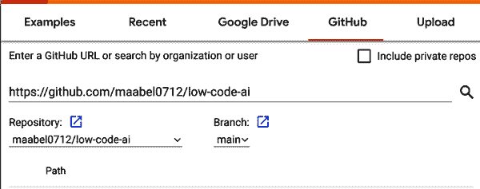
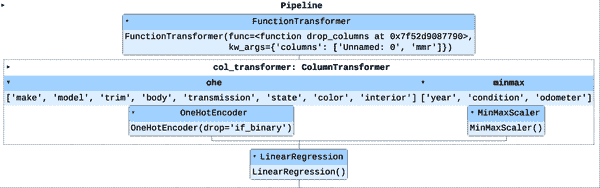
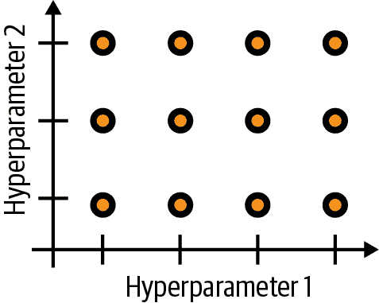
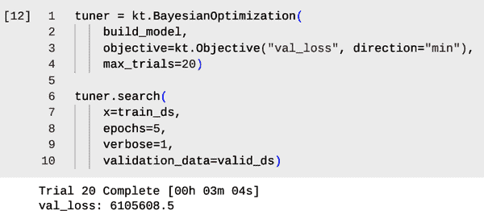
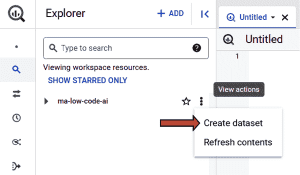

# 第八章：改进自定义模型性能

在第六章和第七章中，您学习了如何准备数据，并使用 SQL、BigQuery ML 和 Python 构建自定义模型。在本章中，您将重温这些工具，关注额外的特征工程和超参数调整。与之前的章节不同，您将从准备好的数据和已训练的模型开始，并努力进一步改进。如果您在探索先前构建的模型的代码或 BigQuery 的用户界面时感到困惑，请重新查看第六章和第七章中的讨论内容。

# 业务使用案例：二手车拍卖价格

本项目的目标是改进一个用于预测二手车拍卖价格的机器学习模型的性能。初始模型是一个在 scikit-learn 中构建的线性回归模型，但并没有完全达到您的业务目标。最终，您将探索使用 scikit-learn、Keras 和 BigQuery ML 中的工具，通过特征工程和超参数调整来提高模型的性能。

用于训练线性回归模型的数据集已经作为 CSV 文件提供给您。这些数据集已经进行了清理（已适当修复了缺失和不正确的值），并且提供了用于构建 scikit-learn 线性回归模型的代码。您的队友训练了线性回归模型，并与您分享了一些关于模型性能以及他们初步尝试使用 Keras 训练 ML 模型的笔记。您的同事还分享了用于训练和评估模型的数据分割。他们创建了一个独立的测试数据集，尚未使用，您将可以用它来验证最终模型的性能。您的任务将是探索使用特征工程来改进模型的特征集，并利用超参数调整来确保使用最佳模型架构。您将学习如何在 scikit-learn、Keras 和 BigQuery ML 中执行这些任务。

在批发汽车销售行业中，批发价格的一个主要指标是[Manheim 市场报告（MMR）](https://www.manheim.com)。 MMR 定价计算基于过去 13 个月的 1000 万多次销售交易。 在您的数据集中，您可以访问数据最初提取时共享的汽车销售定价计算。 但是，您不确定将来是否还能访问此信息。 因此，您被要求在探索中避免使用此功能。 与您共享的业务目标是在不使用 MMR 功能的情况下，使销售价格的 RMSE 达到 2000 美元或更低。 您将首先使用同事提供的笔记本加载数据并复制他们执行的模型训练。

数据集中有 13 列。 表 8-1 给出了列名、数据类型以及这些列可能值的一些信息。

表 8-1\. 汽车销售数据集的模式和字段值信息

| 列名 | 列类型 | 关于字段值的注释 |
| --- | --- | --- |
| `year` | Integer | 车辆制造年份 |
| `make` | String | 车辆品牌 |
| `model` | String | 车辆品牌的具体版本或变种 |
| `trim` | String | 车辆型号的具体版本或变种 |
| `body` | String | 车辆的车身风格（例如轿车） |
| `transmission` | String | 自动或手动变速器 |
| `state` | String | 车辆将要出售的州 |
| `condition` | Float | 车辆评级的条件，从 0 到 5 |
| `odometer` | Integer | 销售时的里程表读数 |
| `color` | String | 车辆颜色 |
| `interior` | String | 内饰颜色 |
| `mmr` | Float | Manheim 市场报告的定价 |
| `sellingprice` | Float | 车辆的实际销售价格（标签） |

# 在 Scikit-Learn 中改进模型

在本节中，您将努力改进您的同事与您分享的 scikit-learn 中的线性回归模型。 您将首先快速探索数据、预处理管道和 scikit-learn 中的模型本身。 然后，您将仔细探索特征，看看如何使用新的和熟悉的特征工程技术来提高模型性能。 最后，您将利用超参数调整来确保您在为您的特定问题优化地创建新特征。

## 加载带有现有模型的笔记本

首先，前往[*https://colab.research.google.com*](https://colab.research.google.com)。您将直接从[low-code-ai repository](https://oreil.ly/supp-lcai)加载笔记本，而不是创建一个新的笔记本。点击 GitHub 按钮，并在提示“输入 GitHub URL 或按组织或用户搜索”下输入 low-code-ai GitHub repo 的 URL，[*https://github.com/maabel0712/low-code-ai*](https://github.com/maabel0712/low-code-ai)，如图 8-1 所示。



###### 图 8-1\. 在 Google Colab 中连接到 GitHub 直接打开笔记本。

按 Enter（或点击放大镜图标）在 repo 中搜索笔记本。向下滚动直到看到`chapter_8/sklearn_model.ipynb`，然后点击最右侧的“在新标签页中打开笔记本”按钮。这将在新的浏览器标签页中打开`sklearn_model.ipynb`笔记本。

加载车辆拍卖销售数据的代码，准备训练数据，训练 ML 模型以及评估 ML 模型的步骤已经包含在笔记本中。在本章中，您不会像在第七章中那样详细地讨论这些代码，但在开始模型改进过程之前，您将花一些时间审查这些代码。

## 加载数据集和训练-验证-测试数据拆分

首先执行单元格以加载训练、验证和测试数据集到相应的 DataFrames 中：

```
!wget -q https://storage.googleapis.com/low-code-ai-book/car_prices_train.csv
!wget -q https://storage.googleapis.com/low-code-ai-book/car_prices_valid.csv
!wget -q https://storage.googleapis.com/low-code-ai-book/car_prices_test.csv

import pandas as pd
train_df = pd.read_csv('./car_prices_train.csv')
valid_df = pd.read_csv('./car_prices_valid.csv')
test_df = pd.read_csv('./car_prices_test.csv')
```

这些代码在之前的章节中应该大部分都很熟悉，但`wget` bash 命令可能对您来说是新的。`wget`简单地将给定 URL 处的文件下载到本地文件目录中。`-q`标志抑制了`wget`命令的日志输出。在将数据加载到 DataFrames 时，请注意文件位置以`./`开头。`.`是“当前工作目录”的简写，这也是`wget`命令将下载您指定的三个文件的位置。

在将数据集加载到各自的 DataFrames 中之后，通过对每个 DataFrame 使用`head()`方法快速确认数据是否符合预期。`train_df.head()`方法输出的前几列如下所示：

```
   Unnamed: 0  year        make       model         trim       body  
0           0  2012    Infiniti     G Sedan  G37 Journey    g sedan   
1           1  2012   Chevrolet       Cruze           LS      Sedan   
2           2  2005        Jeep    Wrangler            X        SUV   
3           3  2011         Kia     Sorento           SX        SUV   
4           4  2002  Volkswagen  New Beetle          GLS  Hatchback
```

在您的 DataFrame `train_df` 中，第一列是索引，但第二列`Unnamed:0`是从哪里来的？这列是 CSV 文件中未命名的列，您加载以创建 DataFrames 时没有提到它，最有可能是前一个 DataFrame 中因误操作而保留的索引，并不是重要特征。在下一节中，您将看到您的同事在数据预处理中删除了这一列。

###### 注意

请注意，您也可以像在第七章中所做的那样，使用 Pandas 直接从 Google Cloud Storage 中的文件位置读取。使用`wget`命令的优点是您现在拥有数据的本地副本。哪种方法更有利取决于您的工作流程以及如何操作数据。

在继续之前，请回忆一下在前几章中，您使用了两个数据集，一个训练数据集和一个测试数据集，用于训练后评估模型。现在有三个数据集：一个训练数据集，一个验证（或评估）数据集和一个测试数据集。为什么会有三个数据集呢？训练数据集当然用于训练模型，验证数据集用于评估模型。在这个项目中，您将比较许多不同的模型。您将使用训练数据集来训练每个模型，然后使用验证数据集来评估模型。"最终模型"将是在验证数据集上表现最佳的模型。然而，您选择的最终模型可能会偏向于验证数据集，因为您明确选择了在验证数据集上表现最佳的模型。

测试数据集的作用是有一个最终独立的数据集来验证最终模型的性能。如果最终模型在测试数据集上的表现与验证数据相似，那么该模型就可以使用。如果模型在测试数据集上的性能显著较差，那么在将模型用于工作负载之前，您就知道存在问题。

帮助避免这种情况的一种方法是确保您的训练、验证和测试数据集具有类似的数据分布。作为一个练习，使用`describe(include='all')`方法来探索数据集，看看这三个数据集是否具有相似的分布，直到一些离群值为止。

## 探索 Scikit-Learn 线性回归模型

现在转到笔记本中的下一个单元格。此单元格包含准备数据、训练 ML 模型和评估模型的代码，所有这些都使用 scikit-learn 完成。在本节中不会仔细讲解所有代码，因为在第七章中已经介绍了 scikit-learn 流水线的概念。然而，在路上会讨论一个快速概述和一些额外的注释。首先考虑导入语句之后的数据处理部分代码：

```
y_train = train_df['sellingprice']
X_train = train_df.drop('sellingprice', axis=1)

def drop_columns(df, columns):
    return df.drop(columns, axis=1)

preproc_cols = FunctionTransformer(drop_columns,
    kw_args={"columns":['Unnamed: 0', 'mmr']})

numeric_columns = ['year', 'condition', 'odometer']
categorical_columns = ['make', 'model', 'trim', 'body',
                       'transmission', 'state', 'color', 'interior']

col_transformer = ColumnTransformer(
  [
    ('ohe', OneHotEncoder(drop='if_binary',   
                          handle_unknown='infrequent_if_exist'),
                          categorical_columns),
    ('minmax', MinMaxScaler(), numeric_columns)
  ]
)
```

首先，您将 DataFrame 分割为标签列（`sellingprice`）和其余特征列作为单独的 DataFrame。然后，您在训练、验证和测试数据集中删除`Unnamed: 0`和`mmr`列。这是通过定义一个`drop_columns`函数并使用`FunctionTransformer`应用该函数来完成的。请注意，在定义`FunctionTransformer`时有一个新的参数。`kw_args`参数接受超出第一个参数的选择函数参数的值。对于`preproc_cols`，第一个参数是我们希望从中删除列的 DataFrame，这将在管道中提供。第二个参数是我们希望删除的列的列表，这将作为字典键`columns`的相应值传递。

`Unnamed: 0`列可能看起来有些奇怪，但正如之前讨论的那样，这很可能是使用 Pandas DataFrame 方法`sample()`对数据进行洗牌时保留原始索引作为新列的结果。在您问题的背景下，这列与目标没有关系，因此被丢弃。`mmr`列与目标`sellingprice`高度相关，但由于您已被指示避免使用该特征，因此也被丢弃。

否则，前述代码的其余部分将会很熟悉“Scikit-Learn 中的管道：介绍”在第七章。您将列分为数值列和分类列（分别为`numeric_columns`和`categorical_columns`），然后使用`ColumnTransformer()`对不同的列集应用不同的转换。对于分类列，将使用`OneHotEncoder()`，对于数值列将使用`MinMaxScaler()`。

现在考虑在定义模型和管道的单元格中的其余代码：

```
model = LinearRegression()

pipeline = Pipeline(steps=[('preproc_cols' , preproc_cols),
                           ('col_transformer', col_transformer),
                           ('model', model)])

pipeline.fit(X_train, y_train)
```

这里使用的模型是线性回归模型。同时，您还使用了一个`Pipeline`对象来定义预处理和模型作为一系列步骤。首先，将会对 DataFrame 应用`preproc_cols FunctionTransformer()`，然后使用`col_transformer ColumnTransformer()`根据列的类型应用适当的转换。最后，在调用`pipeline.fit`时，线性回归模型将作为管道的最后一部分进行训练。最后一行同时拟合转换器并训练模型。在预测时，拟合的转换器将作为管道的一部分存储。训练模型后，您将看到管道的图形表示，如图 8-2 所示。如果希望，您可以展开查看更多细节，并确认这些细节与代码的预期一致。



###### 图 8-2\. scikit-learn `Pipeline`用于训练模型的图形表示。

现在模型已经在您的笔记本环境中训练好了，您可以评估模型。回想一下，当使用 scikit-learn 管道时，您可以像对待任何模型对象一样使用`score()`方法。您还可以导入其他指标，如 RMSE 和 MAE。在下一个单元格中运行以下代码查看模型的评估指标：

```
import math
from sklearn.metrics import mean_squared_error, mean_absolute_error

y_valid = valid_df['sellingprice']
X_valid = valid_df.drop('sellingprice', axis=1)

print('R2:', pipeline.score(X_valid, y_valid))
print('RMSE:',math.sqrt(mean_squared_error(y_valid, pipeline.predict(X_valid))))
print('MAE:', mean_absolute_error(y_valid, pipeline.predict(X_valid)))
```

您将看到 R²分数约为 0.876。这意味着您的特征大致描述了标签变量的 87.6%的变异性。您还将看到 RMSE 约为 3,384.60，MAE 约为 2,044.26。回想一下，您的业务目标是使 RMSE 低于$2,000。根据同事的传达，模型未能达到这些需求，但现在您已经准备好改进模型了。

###### 注意

通常情况下，在团队合作时，您希望在比较结果时避免任何从分割和训练过程中产生的随机性。否则，您可能会被在不同环境中训练的不同模型结果误导。在这种情况下，实际的数据拆分已与您共享，而不是代码。这通常是可取的，因为通常会使用随机洗牌和拆分。您可以设置随机种子以使拆分确定性，或保存相应的训练、验证和测试数据集，就像这里做的那样。此外，在初始化和训练模型时也要考虑这一点。

## 特征工程和改进预处理流水线

通常情况下，选择得当并精心创建的特征，即使使用简单的模型架构，也可能导致非常强大的结果。仅仅是让模型变得更复杂并不总是正确的方法。更复杂的模型将需要更多的数据来成功训练模型，并且需要更多的计算资源来训练和最终调整超参数。甚至寻找简单的修复方法，例如查找异常值并删除无关的特征，也可能导致显著的模型改进。

### 寻找简单的改进

您的同事对原始数据集进行了仔细分析，并向您传达了他们已删除所有空值和与标签呈一对一关系的列（例如 VIN）。现在是探索数据集以查看是否还有其他可以改进的地方的好时机。如果您尚未这样做，请在笔记本环境中的新单元格中运行命令`train_df.describe()`。预期输出的示例在表 8-2 中显示。

表 8-2\. `train_df.describe()`的部分输出

|   | `year` | `condition` | `odometer` | `mmr` | `sellingprice` |
| --- | --- | --- | --- | --- | --- |
| `count` | `385000.000000` | `385000.000000` | `385000.000000` | `385000.000000` | `385000.000000` |
| **`mean`** | `2010.120177` | `3.339402` | `67732.957974` | `13695.356558` | `13544.324018` |
| **`std`** | `3.879672` | `1.117698` | `52521.619238` | `9525.243974` | `9599.953488` |
| **`min`** | `1990.000000` | `-1.000000` | `1.000000` | `25.000000` | `1.000000` |
| **`25%`** | `2008.000000` | `2.700000` | `28494.000000` | `7200.000000` | `7000.000000` |
| **`50%`** | `2012.000000` | `3.600000` | `52122.000000` | `12200.000000` | `12100.000000` |
| **`75%`** | `2013.000000` | `4.200000` | `98188.000000` | `18150.000000` | `18000.000000` |
| **`max`** | `2015.000000` | `5.000000` | `999999.000000` | `182000.000000` | `183000.000000` |

请记住，在预处理管道中删除 `Unnamed: 0` 和 `mmr` 列，所以在分析中无需担心这些列。乍一看 `year` 列中似乎没有什么异常；汽车的年份在 1990 年到 2015 年之间，数据分布偏向更新的车辆。但是 `condition` 列似乎有些奇怪。在 `condition` 列中有一个最小值为 `-1.0`。这很可能意味着你的同事在处理时遗漏了一个魔数。在分析数据集中的多列时，有时会错过像这样简单的问题。这正是为什么额外的一双眼睛总是有价值的原因。

由于 `condition` 是一个浮点数，我们不能简单地将 `-1.0` 视为一个单独的值进行处理。你有几个选择。如果你认为销售价格与 `condition` 值有线性关系，那么你可以创建一个新特征 `condition_recorded`，作为二进制 `0` 或 `1` 值，并将 `-1.0` 的实例替换为 `0.0`，这样这些值就会与普通的 `condition` 值不同。然而，正如你可能在其他评分系统中经历过的那样，评分的效果通常并非线性的。解决这个问题的简单方法是对值进行分桶，然后对应的桶进行独热编码。这样，没有评分的情况将与其他评分的情况（例如 2 到 3 之间）完全不同，你可以调整桶的数量以找到最适合你的模型性能的设置。

要采用第二种方法，在笔记本中创建一个新的单元格，并添加以下代码，但暂时不要运行代码：

```
import pandas as pd

from sklearn.preprocessing import (OneHotEncoder, MinMaxScaler,
                                   FunctionTransformer, 
                                   KBinsDiscretizer)
from sklearn.compose import ColumnTransformer
from sklearn.linear_model import LinearRegression
from sklearn.pipeline import Pipeline

y_train = train_df['sellingprice']
X_train = train_df.drop('sellingprice', axis=1)

def preproc_cols(df, drop_cols):
    return df.drop(drop_cols, axis=1)

drop_cols = FunctionTransformer(preproc_cols, 
				kw_args={"drop_cols":['Unnamed: 0', 'mmr']})
ohe = OneHotEncoder(drop='if_binary', handle_unknown='infrequent_if_exist')
minmax = MinMaxScaler()
bucket_cond = KBinsDiscretizer(n_bins=10, encode='onehot', strategy='uniform')
```

这段代码与之前分享的大部分相同，但请注意几处更改。`KBinsDiscretizer` 转换器已经添加；这个转换器是 scikit-learn 中用于数据分桶的工具。请注意，现在转换器是在单独的行上定义而不是像以前在 `ColumnTransformer` 中。这样做增加了可读性，同时也增强了*模块化*，即在继续改进模型时更容易分割代码。

在这些行的最后定义了`KBinsDiscretizer`。`n_bins`参数设置为`10`，表示 10 个不同的桶，`encode`参数告诉转换器执行独热编码，而`strategy`参数`uniform`告诉转换器均匀地分割这些桶。这样，`-1.0`将会独立于其他范围在其自己的桶中。完成使用以下代码定义管道，并运行单元格以训练您的新模型：

```
numeric_columns = ['year', 'odometer']
categorical_columns = ['make', 'model', 'trim', 'body',
                       'transmission', 'state', 'color', 'interior']

col_transformer = ColumnTransformer(
  [('ohe', ohe, categorical_columns),
   ('minmax', minmax, numeric_columns),
   ('bucket_cond', bucket_cond, ['condition'])])

pipeline = Pipeline(steps=[('drop_cols' , drop_cols),
                           ('col_transformer', col_transformer),
                           ('model', model)])

pipeline.fit(X_train, y_train)
```

您可以通过在新的单元格中执行之前使用的代码来评估新模型：

```
print('R2:', pipeline.score(X_valid, y_valid))
print('RMSE:',math.sqrt(mean_squared_error(y_valid, pipeline.predict(X_valid))))
print('MAE:', mean_absolute_error(y_valid, pipeline.predict(X_valid)))
```

这一变更确实导致了模型性能的轻微提升。RMSE 从约 3,384.60 降至 3,313.63。尽管在这种情况下提升不大，但在许多情况下，捕捉到这样的问题可以大幅提升模型性能。

在评估模型时，您可能注意到了结果中的警告消息：

```
UserWarning: Found unknown categories in columns [2, 3] during transform.
These unknown categories will be encoded as all zeros
```

这个警告实际上是什么意思？这里的第 2 列和第 3 列对应于`trim`和`body`。这个警告意味着在验证数据集中，这些列对应的值在训练数据集中不存在。检查数据集之间的偏差，例如训练和验证数据集中出现不同值的情况，是理解数据准备训练的重要步骤。然而，在训练和评估模型时可能会出现意外问题，因此了解需要注意的事项是非常有用的。

使用以下代码，您可以快速检查`trim`列中出现的仅一次的值有多少个：

```
(train_df.trim.value_counts()==1).sum()
```

您将看到在训练数据集中有 124 个在`trim`列中是唯一的值。同样，在验证数据集中，您可以看到有 273 个唯一值。看起来您的同事可能已经意识到了这一点，并在他们的`OneHotEncoder`定义中加以解决。他们包括了`han⁠dle_​unknown='infre⁠quent_​if_exist'`参数和值。`handle_unknown`定义了在预测时出现未知值时遵循的行为，而`'infrequent_if_exist'`值将未知特征分配给一个少见的类别（如果存在）。要创建一个“少见”类别，您可以设置`min_frequency`参数。这也是可以调整的内容。

将`min_frequency`设置得太高将导致许多类别对模型输出的贡献相同，降低特征的有用性。另一方面，如果`min_frequency`设置得太低，则可能会出现许多仅出现一次的特征或者您已经看到的在数据集之间难以获得正确分布的特征值的问题。

将`min_frequency`设置为 1，然后重新运行训练代码，看看性能是否有所不同。你会发现，这一次性能只有微小的变化。实质上，你说你将所有在训练集中出现少于 1 次（或 0 次）的类别视为相同。也许增加`min_frequency`是有道理的，这样你就可以将所有不频繁的变量视为同一类别，即“不频繁”类别。在进行超参数调优时，你将稍后探索这一点。

### 特征交叉

仔细考虑一下`model`和`trim`特征。通常情况下，你会将这些特征一起考虑，而不是分开考虑，对吧？当你说“我买了一辆本田 CR-V”时，这并不能完全描述这辆车。车上可能有多种不同的*trim*或包装。例如，对于 2023 年的本田 CR-V，有三种 trim 型号：“LX”，“EX”和“EX-L”。同样的名字也可能会用于不同的车型。例如，2023 年的本田 Pilot 也有“LX”和“EX-L”这两种 trim。因此，`trim`变量的值也不能完全描述整个情况。你需要这两个特征的值才能识别出车辆。

然而，在你的模型中，你将`model`和`trim`视为完全独立的变量。回想一下，使用一位有效编码时，你为每个特征值创建一个二进制特征，并且线性回归模型将为每个这些二进制特征分配一个权重。因为你使用了一位有效编码，所以`trim`值为 LX 将有其自己的权重，与`model`变量的值无关。也就是说，“LX”这个`trim`特征值在`model`是“Pilot”还是“CR-V”时都会被同等对待。考虑到某些制造商往往比其他制造商更昂贵，因此仍然有必要单独考虑`make`特征。

如何捕捉两个特征值作为一对？一种方法是使用所谓的*特征交叉*。特征交叉是通过连接两个或更多特征形成的合成特征。直观地说，你考虑的是同时考虑两个变量的值，而不是分开考虑。

这对分类特征如何工作？回想一下，与一位有效编码对应的特征值是二进制的 0 或 1。在这种情况下，特征交叉的想法是，交叉特征值将在对应值的特征对存在时为 1，否则为 0。例如，以“CR-V LX”作为`model`和`trim`。在一位有效编码下，“CR-V”特征的值将为 1，而“LX”特征的值也将为 1。因此，`model`和`trim`的特征交叉“CR-V LX”的值将为 1。然而，“Pilot LX”的特征交叉值将为 0，因为在这个例子中，“Pilot”特征的值为 0。

这似乎是一个创建和使用的简单特征，当您在第四章和第五章中使用 AutoML 时，它会在找到最适合您数据集的模型的过程中为您创建这些特征（以及更多）。然而，即使在简单的线性回归模型中，特征交叉也可以是极其强大的特征。您能想到其他可以受益于特征交叉的特征对吗？

要看到其效果，请首先将`preproc_cols`函数的代码替换为以下内容：

```
def preproc_cols(df, drop_cols):

    df['model_trim'] = df['model'] + df['trim']
    df['model_trim'] = df['model_trim'].str.lower()

    df['color_interior'] = df['color'] + df['interior']
    df['color_interior'] = df['color_interior'].str.lower()

    return df.drop(drop_cols, axis=1)
```

考虑此函数的前两行。您正在 DataFrame 中创建一个新列`model_trim`。这个新列是通过连接`model`列和`trim`列的值形成的。因此，`model_trim`列的值将取决于车型和车辆修剪。第二行将相应的字符串转换为全部小写。这是一个很好的做法，可以确保大小写的随机差异不会导致不同的特征值。`color`和`interior`是另一个很好的例子，它们之间的关系可以通过特征交叉很好地表示，因此第三行和第四行实现了相同的思想。

最后，您需要确保新的特征交叉列正如其他分类变量一样进行了独热编码；为此，请更新列表`categorical_columns`以包含新的特征名称。您的最终列表应如下所示：

```
categorical_columns = ['make', 'model', 'trim', 'model_trim', 'body',
                       'transmission', 'state', 'color', 'interior', 
                       'color_interior']
```

现在执行具有上述更改的模型代码，并重新评估模型的性能。如果您遇到困难，完整的代码在解决方案笔记本中可供查看。您应该能够看到 RMSE 现在约为 3,122.14。通过添加特征交叉，您能够将 RMSE 降低约 2％，并更接近您的最终目标。

作为练习，在进入下一节之前，探索其他可以进行桶装并与其他特征进行交叉的特征。作为目标，在进入下一节之前，看看能否将您模型的 RMSE 降到 3,000 以下。

## 超参数调优

在前一节中，您为模型添加了新的有用功能，以降低 RMSE。也许您还没有完全达到$2,000 RMSE 的目标，但您已经取得了良好的进展。接下来您将探索的下一个过程被称为*超参数调优*。请记住，*超参数*是在训练过程中不更新的变量，但定义了模型架构（如神经网络中隐藏层的数量或每个隐藏层的神经元数）、特征工程的方式（如多少个桶）以及训练过程的执行方式（如学习率或批量大小）。当您对`condition`特征进行桶装时，您选择了一些桶的数量。但是您如何知道最佳的桶数量是多少呢？超参数调优的过程旨在帮助您回答这些问题。

### 超参数调优策略

通常用于超参数调优的三种主要策略是：网格搜索、随机搜索和贝叶斯搜索。对于这三种方法，第一步是相同的。首先，您选择要调整的超参数的候选值范围。您可以根据要调整的超参数选择一个值范围或一个离散的值集合。例如，如果要调整优化器的学习率，您可以设置一个如<math><mrow><mo>[</mo> <mn>0</mn> <mo>,</mo> <mn>1</mn> <mo>]</mo></mrow></math>的范围作为候选范围。在您的情况下，您对`condition`特征进行了分桶处理，并将桶数设置为 6。这实际上是一个任意选择，并且可能存在更好的选择。例如，您可以将候选范围设置在 5 到 15 之间。

如果您选择的桶数太少，则在模型中处理大范围的条件值时将其视为相同。例如，使用两个桶，所有在`3.0`和`5.0`之间的条件值都可能位于同一个桶中。另一方面，如果您的桶数过多，则会有过拟合的风险，因为每个桶中的样本数可能会被模型记住。综上所述，5 到 15 似乎是一个合理的候选范围。

一旦您为希望调整的超参数设置了候选范围，下一步就是选择调整方法。*网格搜索*方法非常简单，即“尝试一切，找出最有效的方法”。例如，假设您要调整两个超参数。第一个有 4 个候选值，第二个有 3 个候选值，因此有 12 种超参数组合要检查。这在图 8-3 中有可视化表示。



###### 图 8-3\. 网格搜索方法的可视化表示，其中调整了两个超参数。

要选择最佳的超参数集，您需要使用训练数据集为每组超参数训练一个模型，并使用验证数据集评估模型。在这种情况下，您确信已经找到了最佳的超参数（在候选范围内），因为您尝试了每一个可能的值。

现在网格搜索方法的缺点应该显而易见了。如果您想调整几个超参数，每个超参数的候选值范围都很小，那么可以接受的模型数量就不多。然而，如果您想调整大量超参数，并且每个超参数都有大量候选值，那么这很快就会变得不可行。例如，如果您有四个超参数要调整，每个超参数有 10 个候选值，那么就有 10,000 个候选模型需要训练。

经常使用两种备选方法。*随机搜索*方法是一种部分搜索策略，随机选择预设数量的候选模型。这些模型将被训练和比较。这种方法的优点是您可以控制在搜索候选模型集合时花费多少时间和精力，但缺点是您可能因为在随机选择过程中不幸而错过了搜索空间中的最佳模型。

第三种方法是*贝叶斯搜索*或*优化*，这是一种更智能的部分搜索方法。该方法的详细细节超出了本书的范围，但核心思想相当简单。首先随机训练少量候选模型作为起始点。根据这些初始模型的评估指标，贝叶斯优化算法选择搜索空间中的下一组候选模型。这些候选模型是基于之前模型的评估指标，预计具有最佳的评估指标。这个过程将在预先设定的步骤中继续进行。下一组候选模型将基于先前候选模型的性能选择。虽然在搜索空间耗尽方面与随机搜索相同的劣势，但好处是这种搜索比随机搜索更“智能”。

### 在 scikit-learn 中的超参数调优

在 scikit-learn 中，网格搜索和随机搜索策略都很容易实现。在本节的其余部分中，您将实现网格搜索策略的一种变体，以找到模型的更好超参数集。首先，添加一对新的转换器来分桶`odometer`和`year`列，并移除数值列的列表，因为这些现在将被分桶为分类列。还要在`ColumnTransformer`中包含新的`KBinsDiscretizer`转换器。为方便起见，这里包括相应的代码：

```
bucket_cond = KBinsDiscretizer(n_bins=10, encode='onehot', 
    strategy='uniform')
bucket_odo = KBinsDiscretizer(n_bins=10, encode='onehot', 
    strategy='quantile')
bucket_year = KBinsDiscretizer(n_bins=10, encode='onehot', 
    strategy='uniform')

categorical_columns = ['make', 'model', 'trim', 'model_trim', 'body',
                       'transmission', 'state', 'color', 'interior', 
                       'color_interior']

col_transformer = ColumnTransformer(
  [('ohe', ohe, categorical_columns),
   ('minmax', minmax, numeric_columns),
   ('bucket_cond', bucket_cond, ['condition']),
   ('bucket_odo', bucket_odo, ['odometer']),
   ('bucket_year', bucket_year, ['year'])]
   )
```

您将调整以下四个超参数：odometer、condition 和 year 列的桶数，以及`OneHotEncoder`转换器的最小频率，以便不将某些特征编码为`infrequent`。在 scikit-learn 中，您需要将候选范围定义为值的字典。因为您正在使用`pipeline`进行模型和转换，所以语法可能乍看起来有点奇怪。此案例的代码如下：

```
grid_params = {'col_transformer__bucket_cond__n_bins': range(8,13),
               'col_transformer__bucket_odo__n_bins': range(8,13),
               'col_transformer__bucket_year__n_bins': range(8,13),
               'col_transformer__ohe__min_frequency': range(1,6)
              }
```

字典中有形如 `'hyperparameter_name' : candidate_range` 的成对数据。超参数范围乍看起来可能有些奇怪，但解析起来并不困难。例如，第一个超参数的名称是 `col_transformer__bucket_cond__n_bins`。这对应于 `col_transformer` 的一部分 `bucket_cond` 转换器的 `n_bins` 值。相应的候选范围是 `bucket_cond` 的 `n_bins` 参数的可能取值列表。`range(8,13)` 是列表 `[8,9,10,11,12]` 的一种便捷写法。注意，列表中不包括第二个端点 `13`。对于 `min_frequency` 超参数，候选范围是 `range(1,6)`。

现在候选范围已经定义好，你需要定义策略，然后训练相应的模型——在本例中，有 625 个候选模型，使用你定义的不同超参数选择。这不是一个过多的模型训练数量，但可能需要至少一个小时或更长时间来完全训练它们。Scikit-learn 提供了一种名为*减半网格搜索*的网格搜索策略的变体。

要执行减半网格搜索，首先对所有候选模型进行训练，但仅使用少量的训练数据。根据这些模型的评估结果，保留候选模型池中的一部分。名称暗示你保留一半，但如果愿意，你可以更积极地减少模型数量。在从候选池中移除模型之后，然后使用更多的训练数据来训练剩余的候选模型。重复整个过程，直到选择出最佳候选模型。

完全有可能，表现良好的模型在部分数据上表现良好，但在整个数据集上表现不佳，并且可能在后续的过程中被淘汰。此外，一个在小数据子集上表现不佳的模型可能在整个训练数据集上表现非常好。在你看到模型利用更多数据改善之前，该候选模型可能已被丢弃。一般来说，除了网格搜索之外的任何方法在这些方面都有一定风险，但是减半网格搜索倾向于比随机搜索更有效地找到最佳候选模型。

在 scikit-learn 中实现减半网格搜索只需几行代码：

```
from sklearn.experimental import enable_halving_search_cv
from sklearn.model_selection import HalvingGridSearchCV

grid_search = HalvingGridSearchCV(pipeline, grid_params,
                                  cv=3, verbose=1,               
                                  scoring='neg_root_mean_squared_error')
```

在撰写本文时，halving grid search 策略在 scikit-learn 中是实验性的，因此必须通过第一行启用它。第二行导入`HalvingGridSearchCV`类以执行 halving grid search。第三行是我们创建将执行 halving grid search 的对象的地方。第一个参数是您希望使用的模型或流水线，第二个参数是您之前定义的`grid_params`字典。关键字参数`cv`指的是一种称为交叉验证的重采样方法。简而言之，`cv`对应于每个候选模型使用训练数据集的不同拆分来进行试验的数量。较高的`cv`值将导致更精确的评估指标，但处理时间更长。`verbose`参数接受从`0`到`3`的整数。数字越高，在调整过程中输出的信息越多。最后，您必须设置您在调整过程中尝试优化的度量标准。由于我们试图优化 RMSE，因此我们使用`neg_root_mean_squared_error`得分。

###### 注意

您可能会想知道为什么我们在`scoring`参数中使用负的均方根误差。在统计建模中，得分函数应在模型改进时增加。另一方面，损失函数应在模型改进时减少。scikit-learn 中的超参数调整方法设置为使用得分函数。幸运的是，我们可以通过取负的 RMSE 来得到一个得分函数。

现在您已经准备好进行超参数调整。在定义`grid_search`对象之后添加以下代码，并执行代码单元以执行超参数调整以找到最佳候选模型：

```
grid_search.fit(X_train, y_train)
print(grid_search.best_params_)
```

添加的第二行将打印最佳候选模型的超参数。在 Google Colab 中，超参数调整过程将需要 35-40 分钟。您应该看到类似以下的结果，尽管确切的输出可能会根据采样过程中的随机性而有所不同：

```
{'col_transformer__bucket_cond__n_bins': 11,
 'col_transformer__bucket_odo__n_bins': 12,
 'col_transformer__bucket_year__n_bins': 11,
 'col_transformer__ohe__min_frequency': 1}
```

您可以在我们的验证数据集上检查最佳模型的性能，以便与早期模型的性能进行比较。在新单元格中执行以下代码以输出来自网格搜索最佳模型的评估指标（RMSE）：

```
# Load validation dataset in case it is not currently loaded
y_valid = valid_df['sellingprice']
X_valid = valid_df.drop('sellingprice', axis=1)

print('RMSE:', math.sqrt(mean_squared_error(y_valid, 
					    grid_search.predict(X_valid))))
```

请注意，当您在`grid_search`方法上调用`predict()`方法时，它会调用网格搜索中最佳模型的`predict()`方法。最佳模型的 RMSE 为 2,915.02。与起始值超过 3,300 的 RMSE 相比，这是通过特征工程和超参数调整显著的改进。作为练习，继续尝试实验，看看是否可以找到新的特征并调整任何新出现的超参数，以查看是否可以进一步改进模型。

最后，一旦您认为已经得到了最佳模型，您应该在测试数据集上评估模型。然而，在本章中，您仍将探索使用 Keras 的新模型架构，因此暂时不要执行这一步骤。

# Keras 中的模型改进

本节探讨了在 Keras 中为您的汽车拍卖销售价格问题使用不同的神经网络模型架构。您不会回顾之前的特征选择和工程对话，但将介绍 Keras 预处理层作为您在 scikit-learn 中使用的转换器的类比。重新创建 scikit-learn 管道的特征工程部分后，您将学习如何使用 Keras Tuner 包和前一节讨论的贝叶斯优化方法进行超参数调整。

## Keras 中的预处理层介绍

Keras 预处理层允许您将数据预处理功能轻松地构建到模型函数中，就像您在 scikit-learn 中创建管道一样。在第七章和前一节中，您看到将预处理逻辑包含到模型本身中是多么方便。尽管在前一节中您没有导出模型，但您可以像在第七章中使用*joblib*库一样轻松导出整个训练过程中的管道。

请回顾您在前一节中对数据集执行的转换。您进行了分类特征的独热编码，对数值特征进行了分桶，并创建了特征交叉。在开始在 Keras 中构建模型之前，了解您将使用的预处理层是很重要的。

`Discretization` 层在 Keras 中用于像 scikit-learn 中的 `KBinsDiscretizer` 转换器一样对数值特征进行分桶。您可以提供桶的端点或使用 `adapt()` 方法，让 Keras 基于数据和指定的桶数量选择端点。使用 `adapt()` 方法时，您必须指定希望使用的数据集。此数据集中的值范围将用于选择桶的边界。通常情况下，您应该使用训练数据集或其代表性样本进行 `adapt()` 方法。

###### 注意

`adapt()` 方法的结果是一个边界点列表，对应于您选择的桶的数量。最左边的边界点实际上是一个桶的右端点，而最右边的边界点实际上是另一个桶的左端点。

例如，如果将桶的数量设置为四个并收到边界点 `[0.0, 1.0, 2.0]`，那么实际的桶是 `(-inf, 0.0)`、`[0.0, 1.0)`、`[1.0, 2.0)` 和 `[2.0, +inf)`。换句话说，所有小于 0 的值将属于第一个桶，所有大于 2.0 的值将属于最后一个桶。

另一个与 scikit-learn 中正在进行的转换对应的预处理层是`StringLookup`层。`StringLookup`层用于对具有字符串值的分类列进行编码。您可以以不同的方式编码值，但是您将在模型中使用独热编码。另一个选项是将列编码为整数，然后在后续层中执行独热编码或其他可能的转换。

最后，在预处理 scikit-learn 中特征时，还执行了特征交叉。在 scikit-learn 中，这是一个相对手动的过程：您将每个特征的值对应的字符串串联起来，然后对串联的值进行独热编码。在 Keras 中，有一个处理特征交叉的预处理层，称为`HashedCrossing`层。`HashedCrossing`层接受两个分类特征，并为您创建特征交叉。

还有许多有用的预处理层可以探索。有关更多层的详细信息，请参阅 TensorFlow 文档中的[“使用预处理层”](https://oreil.ly/K6TLx)指南。

## 创建模型的数据集和预处理层

现在，您将重新创建在 scikit-learn 中创建的预处理管道，以便可以在 Keras 中探索新的模型架构。

返回至[*https://colab.research.google.com*](https://colab.research.google.com)。打开一个新笔记本并命名笔记本为*keras_model.ipynb*。您将在接下来的几个部分中向此笔记本添加代码，但如果遇到困难，*chapter8*目录中也有一个名为[*keras_model.ipynb*](https://oreil.ly/AVf5n)的解决方案笔记本。

首先，像以前在 scikit-learn 中一样，将训练和验证数据集导入到 DataFrames 中。还将数据集拆分为特征的 DataFrame 和标签的系列。如果需要帮助，这里是解决方案代码：

```
import pandas as pd

!wget -q https://storage.googleapis.com/low-code-ai-book/car_prices_train.csv
!wget -q https://storage.googleapis.com/low-code-ai-book/car_prices_valid.csv
!wget -q https://storage.googleapis.com/low-code-ai-book/car_prices_test.csv

train_df = pd.read_csv('./car_prices_train.csv')
y_train = train_df['sellingprice']
X_train = train_df.drop('sellingprice', axis=1)

valid_df = pd.read_csv('./car_prices_valid.csv')
y_valid = valid_df['sellingprice']
X_valid = valid_df.drop('sellingprice', axis=1)
```

您需要在 Keras 中准备输入特征。当在不同特征上使用不同的预处理层时，无法像您在第七章中使用的 Sequential API 一样在 Keras 中构建神经网络。替代 API 是 Functional API，使用起来非常类似，只是语法略有不同。要使用 Functional API，您需要首先为每个输入特征创建一个`Input`。首先，将以下代码复制到笔记本中的新单元格中，并执行该单元格：

```
import tensorflow as tf
from tensorflow.keras.layers import (StringLookup, HashedCrossing,
				     Discretization, Concatenate)

cat_cols = ['make', 'model', 'trim', 'body', 'transmission', 'state',      
            'color', 'interior']
num_cols = ['odometer', 'year', 'condition']

inputs = {}

for col in cat_cols:
  inputs[col] = tf.keras.Input(shape=(1,), name=col, 
                               dtype = tf.string)

for col in num_cols:
  inputs[col] = tf.keras.Input(shape=(1,), name=col, dtype = tf.int64)
```

在继续之前，请花点时间解析这段代码。首先，导入你稍后将利用的预处理层。然后，像在 scikit-learn 中那样，将列列表分为数值列和分类列（分别为 `num_cols` 和 `cat_cols`）。然后，创建一个空字典用于 `Input` 层。接着，为每个特征创建一个 `Input`。`for col in cat_cols` 语句意味着以下代码将针对 `cat_cols` 列表中的每一列执行。`tf.keras.Input` 是 `Input` 层的完整名称。第一个参数 `shape` 表明，对于每个示例，每个特征将只是一个单一值。你将每个 `Input` 的名称设置为 `cat_cols` 中对应的列名。最后，设置数据类型 (`dtype`) 为 `tf.string`，这是 TensorFlow 中字符串数据类型的实现。对于 `num_cols` 列，概念相同，只是数据类型设置为 `tf.int64`，即 TensorFlow 中 64 位整数的实现。

现在 `Input` 层已创建完成，你可以开始创建预处理层。首先，使用以下代码对每个分类列进行 one-hot 编码：

```
preproc_layers = {}
for col in cat_cols:
  layer = StringLookup(output_mode='one_hot')
  layer.adapt(X_train[col])
  preproc_layers[col] = layer(inputs[col])
```

首先，创建一个空字典来保存预处理中将使用的层。然后，为每个分类列创建一个 `StringLookup` 层，并将 `output_mode` 设置为 `'one_hot'`，以便进行 one-hot 编码输出。然后，使用训练数据集中相应列上的 `adapt()` 方法来学习 one-hot 编码的词汇表。请注意，如果在模型中转换数据时出现未知值，将分配一个未知值 `'[UNK]'`。可以设置未知值处理的行为。最后，在训练和预测时为列指定输入，并将其存储在字典 `preproc_layers` 中。有关更多详细信息，请参考 [StringLookup 文档](https://oreil.ly/cGDlm)。

接下来是用于分桶数值列的 `Discretization` 层。使用以下代码创建 `Discretization` 预处理层：

```
for col in num_cols:
  layer = Discretization(num_bins=10,  
                         output_mode='one_hot')  
  layer.adapt(X_train[col])
  preproc_layers[col] = layer(inputs[col])
```

这里的想法与之前类似，对于每个数值列，你创建一个 `Discretization` 层。每个层（暂时）将数据分为 10 个桶，然后进行桶成员的 one-hot 编码。最后，使用 `adapt()` 方法将桶化适应于各个列。

你的 scikit-learn 模型执行的最后一种特征工程类型是特征交叉。现在，使用以下代码重新创建这些特征，使用 `HashedCrossing` 层：

```
model_trim=tf.keras.layers.HashedCrossing(num_bins=1000, output_mode='one_hot')(
	(inputs['model'], inputs['trim']))
color_int=tf.keras.layers.HashedCrossing(num_bins=400, output_mode='one_hot')(
	(inputs['color'], inputs['interior']))

preproc_layers['model_trim'] = model_trim
preproc_layers['color_int'] = color_int
```

请注意，`HashedCrossing`列与我们在 scikit-learn 中执行特征交叉略有不同。*哈希*函数是一种特殊类型的函数，它接受字符串输入并返回一个整数。输出是确定性的，即当输入相同的字符串时，始终会得到相同的输出整数，但输出以一种几乎不可能预测的方式分布。`HashedCrossing`列接收哈希函数的输出，并使用它选择一个桶来放置相应的元素。对于`model_trim`层，有 1,000 个桶，对于`color_interior`层，有 400 个桶。

这些数字从何而来？嗯，我们的数据集中可能有超过一百万种不同的模型和修剪组合。同样，颜色和内饰值可能有大约 300 种组合。由于值的分布是有效随机的，可能会有多个值最终落入同一个桶中。过度估计桶的数量有助于降低这种情况发生的可能性。不过，存在一个权衡：每个桶对应于模型中的一个特征，并且这取决于第一个隐藏层中有多少神经元的多个权重。这种权衡是我们选择在`model_trim`特征中使用 1,000 个桶而不是包括一百万个桶的原因。这种权衡也使得桶的数量成为超参数调优的一个很好的选择。

## 建立神经网络模型

现在您已经创建了预处理层，是时候将所有内容组合在一起了。首先要做的是将所有预处理层连接成一个单独的层，以输入到神经网络中。使用以下代码执行此任务：

```
prepared_layer = Concatenate()(preproc_layers.values())
prepared_layer = tf.reshape(prepared_layer, [-1,3903])
```

这段代码非常直观：您创建一个`Concatenate`层，然后给它一个输入层列表。由于您已经在字典中创建了所有预处理层，因此只需提取字典的值即可。`prepared_layer`是一个长度为`3903`的张量，考虑了所有可能的特征值，用于独热编码和桶化特征。第二行将`prepared_layer`重塑为二阶张量，这是 Functional API 中下一层所期望的。

将所有输入作为一个单独的层后，构建模型的其余过程与第七章中基本相同。在 Keras 的 Functional API 中有一点点不同，但在看过代码之后很容易解释：

```
hid_1 = tf.keras.layers.Dense(16, activation='relu')(prepared_layer)
hid_2 = tf.keras.layers.Dense(16, activation='relu')(hid_1)
output = tf.keras.layers.Dense(1)(hid_2)

model = tf.keras.Model(inputs=inputs, outputs=output)
```

第一行创建了一个新的层`hid_1`，它是一个具有 16 个神经元和 ReLU 激活的密集层。在 Functional API 中，您必须为每个层指定一个输入，就像为函数一样。在本例中，这将是之前的`prepared_layer`。接下来，您定义第二层`hid_2`，具有与第一隐藏层相同的参数，但以`hid_1`作为输入层。最后，您将输出层定义为一个具有单个输出神经元且没有激活函数的密集层。请记住，对于回归模型，您的输出应该是一个单一的预测值。

现在您需要创建`Model`对象。您可以使用`tf.keras.Model`来做到这一点，并指定模型的输入（之前定义的`inputs`）和模型的输出（`output`层）。从这里开始，过程与第七章中的过程基本相同，有一些细微的差别。使用以下代码来编译和训练模型：

```
model.compile(optimizer='adam', loss='mse')

train_ds = tf.data.Dataset.from_tensor_slices(
    (dict(X_train), y_train)).batch(100)
valid_ds = tf.data.Dataset.from_tensor_slices(
    (dict(X_valid), y_valid)).batch(1000)

history = model.fit(
    x=train_ds,
    epochs=25,
    verbose=1,
    validation_data=valid_ds
)
```

首先，您需要编译模型，将优化器设置为 Adam 优化器，损失函数设置为均方误差（MSE）。接下来，您从相应的 DataFrames 创建用于训练和验证的`tf.Datasets`。将批量大小设置为`100`用于训练和`1000`用于验证。要训练模型，您像以前一样使用`fit()`方法。

您的模型性能可能会因初始化和训练神经网络时涉及的随机性而有所不同，但在训练完成后，您应该看到约$10,719,103 的 MSE，这相当于$3,274 的 RMSE。性能与在 scikit-learn 中进行超参数调整之前的模型性能类似。请注意，由于神经网络初始化的随机性可能会导致您的 MSE 有所不同。神经网络架构的选择是任意的，因此可能仍有改进的空间。

## 在 Keras 中进行超参数调整

现在您在 Keras 中有一个可工作的模型，是时候开始改进它了。在构建 Keras 模型时，您可以使用 Keras Tuner 包轻松进行超参数调整。

Google Colab 默认不包含 Keras Tuner 包，但安装起来很容易。`pip`（递归缩写，意为 Pip Installs Packages）是 Python 的包管理工具，用于安装和管理包。`pip install`命令允许您从 Python Package Index 或 PyPI 下载和安装包。在新的单元格中运行以下命令以安装 Keras Tuner 包：

```
!pip install -q keras-tuner
```

`pip`是一个命令行工具，因此您像以前一样使用`!`行魔术将该行作为 bash 命令运行。`-q`标志抑制了安装过程中大部分输出，以避免在笔记本环境中产生混乱。现在 Keras Tuner 已安装完成，您可以开始修改模型代码以准备进行超参数调整。

使用 Keras Tuner 时，需要创建一个函数（称为`build_model`），该函数以超参数作为输入，并返回已编译的模型。对于每个候选模型，此函数将使用不同的超参数执行，以创建用于训练的模型。正如您之前注意到的，对所有预处理层执行`adapt()`方法需要几分钟的时间，因此理想情况下，您将将此代码放在`build_model`函数之外。使用以下代码为 Keras Tuner 创建`build_model`函数：

```
import keras_tuner as kt
from functools import partial

def _build_model_fn(hp, prepared_layer):

  units_1 = hp.Int('units_1', min_value=8, max_value=64, step=4)
  units_2 = hp.Int('units_2', min_value=4, max_value=64, step=4)
  units_3 = hp.Int('units_3', min_value=4, max_value=32, step=2)

  hid_1 = tf.keras.layers.Dense(units_1,     
                                activation='relu')(prepared_layer)
  hid_2 = tf.keras.layers.Dense(units_2, activation='relu')(hid_1)
  hid_3 = tf.keras.layers.Dense(units_3, activation='relu')(hid_2)
  output = tf.keras.layers.Dense(1, activation='linear')(hid_3)

  model = tf.keras.Model(inputs=inputs, outputs=output)

  model.compile(optimizer='adam', loss='mse')

  return model

build_model = partial(_build_model_fn, prepared_layer=prepared_layer)
```

首先导入`keras_tuner`包和`partial`函数，两者稍后将被使用。接下来，您定义了一个“中间”函数：`_build_model_fn`。函数名称开头的下划线是 Python 的约定，表示这是一个不应直接使用的函数。请注意，此函数有两个参数，`hp`和`prepared_layer`。`hp`参数将由 Keras Tuner 提供，`prepared_layer`参数将对应您之前创建的同名层。

`units_1 = hp.Int('units_1', min_value=8, max_value=64, step=4)`这一行展示了如何使用 Keras Tuner 定义超参数的示例。`hp.Int`定义了一个整数值超参数。您还可以定义浮点数超参数（`hp.Float`）、布尔型超参数（`hp.Boolean`）或从可能值列表中选择（`hp.Choice`）。有关更多详细信息，请参阅[Keras Tuner 文档](https://oreil.ly/ZnCKe)。

对于整数超参数，您设置最小值、最大值和步长。因此，在本例中，可能的值为 8、12、16、20、...、64。在前面的代码中，您创建了三个超参数：`units_1`、`units_2`和`units_3`。接下来，为模型定义三个隐藏层。请注意，对于每个隐藏层，神经元的数量被替换为之前定义的`hp.Int`对象。否则，该过程与您用于构建和编译模型的代码类似。`_build_model_fn`函数将编译后的模型作为输出返回。

`build_model`函数只需接受`hp`作为参数，以供 Keras Tuner 使用。这就是`partial`函数的作用所在。`partial`函数允许您从旧函数创建新函数，但某些固定参数已经插入到原始函数中。`partial(_build_model_fn, prepared_layer=prepared_layer)`接受`_build_model_fn`函数，并创建一个新函数，其中您的`prepared_layer`层始终插入到相应的参数中。

现在已经创建了`build_model`函数，接下来创建调整器，用于管理超参数调优过程。使用以下代码创建`tuner`对象，并执行超参数搜索：

```
tuner = kt.BayesianOptimization(
    build_model,
    objective=kt.Objective("val_loss", direction="min"),
    max_trials=20)

tuner.search(
    x=train_ds,
    epochs=5,
    verbose=1,
    validation_data=valid_ds)
```

`tuner`是 Keras Tuner 中使用贝叶斯优化来优化超参数的一个示例`Tuner`。您可以创建一个`Objective`来定义调整过程的目标。在本例中，您希望最小化验证数据集的损失（MSE），因此将`val_loss`设置为目标，并将`direction`设置为`min`以指定您希望最小化`val_loss`。您还设置了最大试验或候选模型的数量。

要执行调整过程，您可以在`tuner`上使用`search()`方法。您需要指定训练数据集、训练候选模型的周期数、详细程度（从 0 到 3 的程度）和验证数据集。请注意，这里的周期数相对较少，因为您正在训练许多模型。通常情况下，您可以在仅进行几个周期的训练后就了解哪些模型将表现更好，而不必将它们训练至收敛。您的输出和结果应与图 8-4 中的类似。



###### 图 8-4\. 使用 Keras Tuner 进行超参数调整过程的输出示例。

由于过程中的某些随机性，你的确切结果会有所不同，但可能最佳模型的`val_loss`约为$6,000,000，对应 RMSE 为$2,470。这比之前的模型结果有所改进，甚至仅经过五次周期后也是如此。现在，你应该继续训练这个最佳候选模型，看看是否能获得更好的结果。为此，你需要能够检索最佳超参数。在新单元格中执行以下代码以找到最佳候选模型的超参数：

```
best_hps=tuner.get_best_hyperparameters(num_trials=1)[0]
print('units_1:', best_hps.get('units_1'))
print('units_2:', best_hps.get('units_2'))
print('units_3:', best_hps.get('units_3'))
```

由于过程中的随机性，每次找到的最佳超参数可能会有所不同。在本章讨论的运行中，`units_1`、`units_2`和`units_3`的最佳值分别为 52、64 和 32。

为了简化操作，Keras Tuner 包括了`tuner.hypermodel.build()`方法，我们可以在其中提供最佳超参数，它将这些值传递给`build_model`方法以重新创建我们的最佳候选模型。使用以下代码来实现这一点，创建一个早期停止的回调，并训练最佳模型直到`val_loss`不再改善：

```
best_model = tuner.hypermodel.build(best_hps)

early_stopping = tf.keras.callbacks.EarlyStopping(monitor='val_loss',
					  	  patience=5)

history = best_model.fit(
    x=train_ds,
    epochs=1000,
    verbose=1,
    callbacks = [early_stopping],
    validation_data=valid_ds
)
```

训练模型后，验证 RMSE 进一步降低，降至 2000 以下。最终你得到了一个符合初衷的模型！作为练习，实现其他超参数的超参数调整，例如`HashedCrossing`层的箱数。

然而，我们选择的模型基于验证数据集的性能，所以我们可能只是简单地选择了一个偏向于该数据集的模型。这就是测试数据集的用武之地。测试数据集在模型训练过程中从未被使用过，因此它是我们最接近“野外”数据或您的模型在生产中可能看到的数据。

由于我们已经选择了最终的模型，我们可以使用测试数据集作为性能的最终验证。为此，请使用以下代码：

```
test_df = pd.read_csv('./car_prices_test.csv')
y_test = test_df['sellingprice']
X_test = test_df.drop('sellingprice', axis=1)
test_ds = tf.data.Dataset.from_tensor_slices(
                         (dict(X_test), y_test)).batch(1000)

best_model.evaluate(test_ds)
```

您的模型在测试数据集上表现如何？如果表现相似，那么您的模型表现良好，准备好进行部署。否则，您可能需要重新组合数据集，进行新的训练-验证-测试数据集拆分，并从头开始整个过程。在这个过程中，请确保您的训练、验证和测试数据集具有相似的示例分布。实际上，不同数据集之间的不同分布是在测试数据集评估时看到性能大幅下降的非常常见原因。

如果您需要继续改进模型的性能，重新开始可能会令人沮丧，但一旦测试数据集的独立性被使用来做出决策所破坏，这是最佳的方法。

# BigQuery ML 中的超参数调优

在这一节中，您将重新访问在 BigQuery ML 中创建的 scikit-learn 和 Keras 模型。您将把之前使用的汽车拍卖价格数据集加载到 BigQuery 中，探索 BigQuery ML 中的特征工程，并训练一个神经网络模型。最后，您将学习如何在 BigQuery ML 中进行超参数调优。

在本章中，我们不会再对 BigQuery 和 BigQuery ML 的概念进行全面审查，请参考第六章了解本章中执行的某些任务的详细信息。

## 加载和转换汽车拍卖数据

首先，转到[Google Cloud 控制台](http://console.cloud.google.com)，然后导航到 BigQuery（可以使用侧边菜单或搜索栏）。在项目 ID 的右侧的“资源管理器”中，单击“查看操作”按钮，该按钮由项目 ID 右侧的三个垂直点表示。然后单击“创建数据集”。UI 中这些项目的位置提示如图 8-5 所示。



###### 图 8-5. BigQuery UI 中查看操作按钮和“创建数据集”操作的位置。

在美国地区创建一个名为 `car_sales_prices` 的新数据集。创建数据集后，您可以使用数据集旁边的“查看操作”按钮创建一个 BigQuery 表。选择数据集，单击“查看操作”，然后选择“创建表格”。根据 表 8-3 中的信息创建三个表，每个表对应一个数据集。请注意，您需要将“从 GCS 存储桶中选择文件或使用 URI 模式”和“表格”字段中的 `*<dataset>*` 部分替换为 `train`、`valid` 和 `test`，以适应三个不同的数据集。

表 8-3\. 要创建的三个表的选项

| 字段 | 值 |
| --- | --- |
| 从中创建表格 | Google Cloud Storage |
| 从 GCS 存储桶中选择文件或使用 URI 模式 | low-code-ai-book/car_prices_*<dataset>*.csv |
| 文件格式 | CSV |
| 表格 | car_prices_*<dataset>* |
| 模式 | 自动检测 |

在开始构建模型之前，您需要复制在 scikit-learn 和 Keras 中执行的转换操作。首先，回想一下，您对分类列执行了独热编码。请记住，在 BigQuery ML 中，所有字符串值列都会自动进行独热编码，因此对于这些列，您无需进行任何操作。

那么您如何处理桶化的数值列呢？BigQuery ML 提供了两个用于桶化数值特征的函数。首先是 `ML.BUCKETIZE` 函数，它接受两个参数。第一个参数是您希望进行桶化的列，第二个参数是您提供的桶端点的列表。请注意，您需要事先知道希望使用的桶。

还有 `ML.QUANTILE_BUCKETIZE` 函数。该函数同样需要两个参数。第一个参数再次是您希望进行分桶的列，但第二个列现在是您希望将数据分成的桶的数量。 `ML.QUANTILE_BUCKETIZE` 将根据您指定的桶数将数据分成基于分位数的桶。例如，如果您指定四个桶，那么第一个四分位数（数据的 25%）将被放入第一个桶中，第二四分位数将被放入第二个桶中，依此类推。这些函数的实际输出将采用 `bin_n` 的形式，用于放入第 `n` 个桶的数据，然后 BigQuery ML 将像对待任何其他字符串列一样对此列进行独热编码。

您执行的最终转换是特征交叉。在 BigQuery ML 中实现特征交叉的函数是 `ML.FEATURE_CROSS`。该函数接受一个特征列的 `STRUCT` 并返回这些列的特征交叉。如果您只提供一对列，那么它将返回这两列的特征交叉。如果您提供三列，则将收到三个特征交叉，分别对应每对可能的列。

`ML.FEATURE_CROSS` 的语法起初可能看起来有些奇怪：

```
ML.FEATURE_CROSS(STRUCT(column1,column2))
```

创建`STRUCT`关键字用于创建`STRUCT`，这是可能包含不同类型列的有序列。如果没有这个关键字，您将从这行代码中收到错误信息。

现在，您可以预处理您的数据。在 BigQuery 控制台中编写并执行以下 SQL 查询，执行所需的转换：

```
SELECT
  * EXCEPT (int64_field_0, mmr, odometer, year, condition),
  ML.QUANTILE_BUCKETIZE(odometer, 10) OVER() AS odo_bucket,
  ML.QUANTILE_BUCKETIZE(year, 10) OVER() AS year_bucket,
  ML.QUANTILE_BUCKETIZE(condition, 10) OVER() AS cond_bucket,
  ML.FEATURE_CROSS(STRUCT(make,model)) AS make_model,
  ML.FEATURE_CROSS(STRUCT(color,interior)) AS color_interior
FROM
  `car_sales_prices.car_prices_train`
LIMIT 10
```

`SELECT * EXCEPT(...)`语句返回表中除了列出的列之外的所有列。这里的`int64_field_0`是之前的`Unnamed: 0`列的名称。您还想删除`mmr`列，因为您将不会将其用于训练。最后，您之前没有使用`odometer`、`year`和`condition`的数值，因为您已经对这些特征进行了桶化，所以在结果中不会返回这些特征。

接下来，您使用`ML.QUANTILE_BUCKETIZE`和 10 个桶对`odometer`、`year`和`condition`列进行桶化。最后的`OVER()`子句允许您将数据分割成不同的集合（基于`OVER`语句内部），然后进行分位数桶化。在这里，您只是进行分位数桶化，没有额外的分割。

最后，您可以使用`ML.FEATURE_CROSS`实现特征交叉。对于本例，您有`LIMIT 10`语句，因此可以查看数据的前几行。显示的结果示例可参见表 8-4。

表 8-4\. ML.QUANTILE_BUCKETIZE 和 ML.FEATURE_CROSS 转换的预处理查询输出

| `odo_bucket` | `year_bucket` | `cond_bucket` | `make_model` | `color_interior` |
| --- | --- | --- | --- | --- |
| `bin_10` | `bin_1` | `bin_1` | `Nissan_300ZX` | `red_red` |
| `bin_7` | `bin_1` | `bin_1` | `Chevrolet_Corvette` | `red_—` |
| `bin_10` | `bin_1` | `bin_2` | `Lexus_LS 400` | `silver_silver` |
| `bin_10` | `bin_1` | `bin_4` | `Jeep_Cherokee` | `white_gray` |
| `bin_9` | `bin_1` | `bin_2` | `Mazda_MX-5 Miata` | `red_blue` |
| `bin_10` | `bin_1` | `bin_2` | `Honda_Accord` | `blue_—` |

注意，对于桶化的列，输出是预期的`bin_n`形式。此外，特征交叉列的输出形式为`value1_value2`。这些串联值将由 BigQuery ML 进行独热编码，与您在本章早些时候在 scikit-learn 中所做的非常相似。

## 训练线性回归模型并使用 TRANSFORM 子句

现在，您可以使用前面编写的查询来训练线性回归模型，以预处理数据。请注意，如果您使用该查询转换数据，保存结果，然后使用新表训练模型，一切都能正常工作。然而，在预测时，您必须执行相同的转换。当您不知道独热编码的确切方式或者桶化的分桶端点时，这变得非常棘手。

BigQuery ML 提供了`TRANSFORM`子句，使您能够将这些转换集成到模型中。`CREATE MODEL`语句的整体结构如下：

```
CREATE OR REPLACE MODEL `dataset.model_name`
TRANSFORM (<transformation_sql>)
OPTIONS (<model_options>)
AS SELECT …
```

`<transformation_sql>`是前面查询的`SELECT`部分，其中指定了要使用的列及其上的转换。编写并执行以下 SQL 语句，使用`TRANSFORM`子句训练线性回归模型：

```
CREATE OR REPLACE MODEL
  `car_sales_prices.linear_car_model` 
  TRANSFORM (
    * EXCEPT (int64_field_0, mmr, odometer, year, condition),
    ML.QUANTILE_BUCKETIZE(odometer, 10) OVER() AS odo_bucket,
    ML.QUANTILE_BUCKETIZE(year, 10) OVER() AS year_bucket,
    ML.QUANTILE_BUCKETIZE(condition, 10) OVER() AS cond_bucket,
    ML.FEATURE_CROSS(STRUCT(make,model)) AS make_model,
    ML.FEATURE_CROSS(STRUCT(color,interior)) AS color_interior)
  OPTIONS (
    model_type='linear_reg',
    input_label_cols=['sellingprice'],
    data_split_method='NO_SPLIT') AS
SELECT
  *
FROM
  `car_sales_prices.car_prices_train`;
```

这个查询应该在大部分情况下都与您之前在第六章中所做的类似，只有一些变化。首先，包含了`TRANSFORM`子句以将转换逻辑构建到模型中，以便在推理时引用。当调用`ML.PREDICT`来提供预测时，`TRANSFORM`子句将在输入表上执行，然后传递给模型进行预测。这意味着像桶端点这样的事物现在将被包含在模型本身中。在 scikit-learn 和 Keras 中，您使用管道和预处理层来管理此过程。

你可能注意到的另一件事是，出现了一个新选项。`data_split_method`选项决定了数据在训练和验证中的拆分方式。由于你已经有了一个单独的验证数据集，所以采用`NO_SPLIT`选项来使用整个训练数据集进行训练。你可以使用以下 SQL 语句对已训练的模型进行验证：

```
SELECT SQRT(mean_squared_error)
FROM ML.EVALUATE(MODEL `car_sales_prices.linear_car_model`,
    (SELECT * FROM `car_sales_prices.car_prices_valid`))
```

由于您之前使用过 RMSE 进行评估，因此在这里为保持一致性，您将再次使用它。这里的 RMSE 可能会相当高，可能超过 $8,000\. 您可以通过运行以下查询来检查训练集的 RMSE：

```
SELECT SQRT(mean_squared_error)
FROM ML.EVALUATE(MODEL `car_sales_prices.linear_car_model`,
    (SELECT * FROM `car_sales_prices.car_prices_train`))
```

训练数据集上的 RMSE 将接近于 $3,000，并且与您之前的 scikit-learn 模型预期一致。这是过拟合的一个典型例子，但是它是从哪里来的呢？特征交叉涉及大量可能的值，因此导致模型的特征数量非常多。您可以通过运行以下查询计算来自特征交叉的特征数量：

```
SELECT
    COUNT(ML.FEATURE_CROSS(STRUCT(color,interior))) +
    COUNT(ML.FEATURE_CROSS(STRUCT(make,model)))
FROM
    `car_sales_prices.car_prices_train`
```

您将看到特征交叉中存在 770,000 个不同的特征值。与示例数相比，这么多的特征数量很容易导致过拟合。在接下来的部分，您将了解到正则化技术如何处理大量特征的过拟合问题。

最后，您可以像在第六章中之前一样使用模型进行预测：

```
SELECT *
FROM ML.PREDICT(MODEL `car_sales_prices.linear_car_model`,
    (SELECT * FROM `car_sales_prices.car_prices_valid`))
```

您可以通过简单更改选项来训练深度神经网络回归模型，如下所示的 SQL 语句所示：

```
CREATE OR REPLACE MODEL
  `car_sales_prices.dnn_car_model` 
  TRANSFORM (
    * EXCEPT (int64_field_0, mmr, odometer, year, condition),
    ML.QUANTILE_BUCKETIZE(odometer, 10) OVER() AS odo_bucket,
    ML.QUANTILE_BUCKETIZE(year, 10) OVER() AS year_bucket,
    ML.QUANTILE_BUCKETIZE(condition, 10) OVER() AS cond_bucket,
    ML.FEATURE_CROSS(STRUCT(make,model)) AS make_model,
    ML.FEATURE_CROSS(STRUCT(color,interior)) AS color_interior)
  OPTIONS (
    model_type='dnn_regressor',
    hidden_units=[64, 32, 16],
    input_label_cols=['sellingprice'],
    data_split_method='NO_SPLIT') AS
SELECT
  *
FROM
  `car_sales_prices.car_prices_train`;
```

## 在 BigQuery ML 中配置超参数调优作业

编写训练模型的代码后，只需进行少量修改即可开始超参数调整。首先，您需要包含一个新的选项 `num_trials`。此选项设置在超参数调整过程中将训练的不同模型数量。您还可以选择为 `num_parallel_trials` 选项设置一个值。这将允许您同时并行运行多个试验。用于训练所有模型的总资源数量将保持不变，但能够同时运行多个模型将总体花费的时间缩短。然而，使用 BigQuery ML 和 Vertex AI 中实现的贝叶斯优化时存在权衡。您运行的并行试验越多，直到达到最大试验次数为止，贝叶斯优化学习的迭代次数就越少。

在设置了 `num_trials` 选项之后，下一步是设置超参数。在 BigQuery ML 中，只能调整某些超参数。对于深度神经网络（DNN）模型，您可以调整 `batch_size`、`dropout`、`hidden_units`、`learn_rate`、`optimizer`、`l1_reg`、`l2_reg` 和 `activation_fn`。在这里，您将专注于 `dropout`、`l1_reg` 和 `hidden_units`，但您可以作为练习探索其他超参数。

### 正则化

您在之前的示例中熟悉了 `hidden_units`。但 `dropout` 和 `l1_reg` 呢？*Dropout* 是一种正则化技术。通常，正则化技术用于减少模型过拟合的风险。*过拟合* 是指模型在训练数据集上的表现远远优于评估数据集。这通常发生因为模型“记住”了数据集，开始错过在其他数据集上表现良好所需的一般模式。减少过拟合风险的主要方式之一是降低模型的复杂性。

L1 和 L2 正则化通常是机器学习实践者首先学习的正则化技术。假设您有损失函数 <math><mrow><mi>L</mi> <mo>(</mo> <mi>x</mi> <mo>,</mo> <mi>D</mi> <mo>)</mo></mrow></math>。回想一下，训练过程的目标是最小化这个损失函数。L1/L2 正则化的想法是在损失函数中添加一个额外的项，以强制学习算法在最小化原始损失函数和新的“惩罚项”之间取得平衡。让 <math><msub><mi>W</mi> <mn>2</mn></msub></math> 表示模型中所有权重的平方和。对于 L2 正则化，新的损失函数如下所示：

<math><mrow><msub><mi>L</mi> <mrow><mi>r</mi><mi>e</mi><mi>g</mi></mrow></msub> <mrow><mo>(</mo> <mi>x</mi> <mo>,</mo> <mi>D</mi> <mo>)</mo></mrow> <mo>=</mo> <mi>L</mi> <mrow><mo>(</mo> <mi>x</mi> <mo>,</mo> <mi>D</mi> <mo>)</mo></mrow> <mo>+</mo> <mi>λ</mi> <mo>*</mo> <msub><mi>W</mi> <mn>2</mn></msub> <mo>.</mo></mrow></math>

大致的思路是，为了使模型变得更复杂，权重值需要变得更大，以对结果产生更大的影响。这个新的损失函数平衡了原始损失函数和模型复杂性（由<math><msub><mi>W</mi> <mn>2</mn></msub></math>度量）之间的关系。<math><mi>λ</mi></math>被称为*正则化率*，它控制原始损失函数与模型复杂性之间的权衡程度。<math><mi>λ</mi></math>的值越高，在训练过程中惩罚模型的复杂性就越严重。类似于 L1 正则化，L2 正则化中的<math><msub><mi>W</mi> <mn>2</mn></msub></math>被所有权重的绝对值之和<math><msub><mi>W</mi> <mn>1</mn></msub></math>所取代。这些正则化类型可以结合在一起，称为弹性网络正则化。弹性网络正则化的相应损失函数如下：

<math><mrow><msub><mi>L</mi> <mrow><mi>e</mi><mi>n</mi></mrow></msub> <mrow><mo>(</mo> <mi>x</mi> <mo>,</mo> <mi>D</mi> <mo>)</mo></mrow> <mo>=</mo> <mi>L</mi> <mrow><mo>(</mo> <mi>x</mi> <mo>,</mo> <mi>D</mi> <mo>)</mo></mrow> <mo>+</mo> <msub><mi>λ</mi> <mn>1</mn></msub> <mo>×</mo> <msub><mi>W</mi> <mn>1</mn></msub> <mo>+</mo> <msub><mi>λ</mi> <mn>2</mn></msub> <mo>×</mo> <msub><mi>W</mi> <mn>2</mn></msub></mrow></math>

注意，<math><msub><mi>λ</mi> <mn>1</mn></msub></math>和<math><msub><mi>λ</mi> <mn>2</mn></msub></math>是分别控制 L1 和 L2 正则化影响的不同常数。

你现在知道了 L1 和 L2 正则化的定义，但它们对模型的实际影响是什么？这方面的数学超出了本书的范围，虽然并不太复杂，但最终的效果很容易描述。L2 正则化倾向于将权重推向较小的值。L1 正则化倾向于将对模型性能不重要的权重推向零。当你有大量稀疏特征时，这可能非常有价值。例如，当你创建具有大量值的两个特征的特征交叉时。这正是你在 BigQuery ML 中训练的线性回归模型中遇到的情况。通常，在使用特征交叉时，包括 L1 正则化通常是个好主意。正则化参数控制训练过程中权重值推动的侵略性。

Dropout 是一种不同类型的正则化，因为它是在模型本身在训练过程中应用的，而不是在损失函数上。在神经网络中使用 dropout 的想法是，每批数据中有一定百分比的神经元被“关闭”。这里所说的“关闭”是指在特定数据批次中，隐藏层中某些神经元的加权总和被设置为零。使用 dropout 这样的技术的目标是在训练时阻碍模型的复杂性。这样可以避免模型变得过于复杂，同时仍然让模型更多地学习数据。然而，在预测时，不会使用 dropout，这样可以充分利用模型的能力。

###### 注意

在过去的十年中，研究人员发现，在预测时使用**dropout**同样是有益的¹。这可以用作表示模型不确定性的一种方式，适用于分类和回归任务，并使模型的预测变得非确定性。

### 在**CREATE MODEL**语句中使用超参数调优。

现在你对正则化有了一些了解，是时候在 BigQuery ML 中设置超参数调优了。首先考虑以下 SQL 语句：

```
CREATE OR REPLACE MODEL
  `car_sales_prices.dnn_hp_car_model` 
  TRANSFORM (
    * EXCEPT (int64_field_0, mmr, odometer, year, condition),
    ML.QUANTILE_BUCKETIZE(odometer, 10) OVER() AS odo_bucket,
    ML.QUANTILE_BUCKETIZE(year, 10) OVER() AS year_bucket,
    ML.QUANTILE_BUCKETIZE(condition, 10) OVER() AS cond_bucket,
    ML.FEATURE_CROSS(STRUCT(make,model)) AS make_model,
    ML.FEATURE_CROSS(STRUCT(color,interior)) AS color_interior)
  OPTIONS (
    model_type='dnn_regressor',
    optimizer='adagrad',
    hidden_units=hparam_candidates([STRUCT([64,32,16]), 
                                    STRUCT([32,16]),
                                    STRUCT([32])]),
    l1_reg=hparam_range(0,1),
    dropout=hparam_range(0,0.8),
    input_label_cols=['sellingprice'],
    num_trials = 10,
    hparam_tuning_objectives=['mean_squared_error']) 
AS SELECT
  *
FROM
  `car_sales_prices.car_prices_train`;
```

创建超参数调优作业的语句与之前使用的非常相似，但为了进行超参数调优，有一些关键区别。首先，请注意`hidden_units`选项。不再仅仅是一个隐藏层单元的列表，而是有了`hparam_candidates`函数。此函数接受一个包含相应超参数调优值的结构体列表，并在调优过程中将它们传递给模型。在这里，你让模型在三种可能性之间决定最佳架构。第一种是具有 64 个神经元的神经网络，第二层有 32 个神经元，第三层有 16 个神经元。第二个选项有两个隐藏层，分别有 32 个和 16 个神经元。最后一个选项只有一个隐藏层，有 32 个神经元。此外，你正在使用`hparam_range`来搜索最佳的`l1_reg`和`dropout`值。`hparam_range`用于在浮点值范围内查找最佳值。例如，在这里，`dropout`的范围在 0 到 0.8 之间，表示在训练时影响隐藏层神经元的百分比。

最后，在开始训练之前，有几个需要设置的新选项。首先是`num_trials`，前面提到过，以及`hparam_​tun⁠ing_objectives`。你希望优化 RMSE，所以将`hparam_​tun⁠ing_objectives`设置为`mean_squared_error`。如果还没有开始，现在可以开始调优过程。这个调优过程大约需要一个小时来完成。

###### 注意

在超参数调优作业的查询中，您必须使用 `optimizer='adagrad'` 选项指定正在使用的优化器。默认优化器 `adam` 不支持 L1 正则化。有关更多详细信息，请参阅 BigQuery ML 文档中关于 [创建 DNN 模型](https://oreil.ly/6hZQN) 的内容。

一旦训练过程完成，您可以通过执行以下查询来探索试验结果和选择的超参数：

```
SELECT
  *
FROM
  ML.TRIAL_INFO(MODEL `car_sales_prices.dnn_hp_car_model`)
ORDER BY
  hparam_tuning_evaluation_metrics.mean_squared_error ASC
```

你的输出示例如 表 8-5 所示。

表 8-5\. 五个最佳试验的试验信息查询结果—注意所选的超参数和试验指标（您的输出中的确切值将与此处显示的不同；一些列名为了可读性而被压缩）

| `trial_id` | `l1_reg` | `hidden_units` | `dropout` | `mean_squared_error` |
| --- | --- | --- | --- | --- |
| 10 | 1.0 | 64 | 0.0 | 194784591.6 |
| 32 |
| 16 |
| 8 | 0.00031591034078693391 | 64 | 0.0 | 213445602.34905455 |
| 32 |
| 16 |
| 9 | 1.0 | 64 | 0.25599690406708309 | 218611976.60226983 |
| 32 |
| 16 |

如果您选择 `car_sales_prices.dnn_hp_car_model` 作为模型，使用 `ML.PREDICT`，BigQuery 将默认使用最佳试验：

```
SELECT *
FROM ML.PREDICT(MODEL `car_sales_prices.dnn_hp_car_model`,
    (SELECT * FROM `car_sales_prices.car_prices_valid`))
```

# 大型模型超参数调整选项

本章讨论的框架和技术非常适合数据集和模型不太大的情况。然而，在本地机器或 Colab 笔记本上使用 scikit-learn 和 Keras 处理非常大的数据集和模型可能需要很长时间，甚至可能由于内存和处理约束而无法完成。训练和调整大型模型是一门艺术，并且有公共云提供商提供的工具可以使这一过程变得更加容易。本书不会对这些产品进行深入介绍，因为从自定义代码开发的角度来看，这些产品通常更为复杂，但只是列出了一些选项和参考资料，供有兴趣的人参考。

## Vertex AI 训练和调优

在 第 7 章 中，您看到了如何将一个 Python 模块打包为训练 scikit-learn 模型，并提交给 Vertex AI 训练。在本章中，用于超参数调优的 scikit-learn 或 Keras 代码也可以做同样的处理。

Vertex AI 还提供作为 Vertex AI 训练一部分的超参数调整服务。这使用 `cloudml-hypertune` Python 从不同的试验向 Vertex AI 报告指标，可以在不同的集群中使用 Vertex AI 训练执行。与 Keras 调优器类似，Vertex AI 使用贝叶斯优化来找到您模型的最佳超参数。

有关如何使用此服务的更多详细信息，请参阅[Vertex AI 文档](https://oreil.ly/qcLDL)。

## 使用 Amazon SageMaker 自动模型调整

Amazon SageMaker 包括一个自动模型调整服务（[SageMaker AMT](https://oreil.ly/boB_A)），用于进行超参数调整。你可以使用 SageMaker AMT 配合内置算法、自定义算法或 SageMaker 预构建的 ML 框架容器，如 scikit-learn、TensorFlow 和 PyTorch。

欲了解更多详情，请参阅 [SageMaker AMT 文档](https://oreil.ly/boB_A)。

## Azure 机器学习

Azure 机器学习包括超参数调整作为 Python 客户端库和命令行界面的一部分。与前述选项类似，你可以提供自己选择框架中编写的自定义模型，将模型的超参数作为函数创建模型的参数，指定超参数搜索空间，并指定一个作业配置来提交在 Azure 机器学习上运行超参数扫描作业。更多信息，请参阅 [Azure 机器学习文档](https://oreil.ly/vrKRr)。

# 摘要

在本章中，你接手了同事构建的自定义代码模型，并通过特征工程和超参数调整进行了改进。你利用了 scikit-learn 中的新转换器，并进行了网格搜索以调整原始的线性回归模型。你学会了如何在 Keras 中使用预处理层进行相同的特征工程，并使用 Keras Tuner 对 Keras 中的神经网络模型进行超参数调整。最后，你还学会了如何在 BigQuery ML 中使用 SQL 执行这些相同的任务。

本章和前一章关于自定义代码模型的内容，希望能为你展示构建 ML 模型的可能性。无代码和低代码解决方案至少是一个很好的起点，而且很可能可以帮助你达到目标，而无需编写自定义代码。但是，你并不需要成为数据科学家来探索自定义代码，也不必编写成百上千行的代码。

在接下来的最后一章中，你将了解如果想要更深入地学习 ML，可以采取的一些下一步措施。在本书中，你已经建立了一个非常强大的工具包，但是这个领域正在不断发展，很多新工具和发展已经不仅仅是研究人员的专利。

¹ 例如，参见 Y. Gal 和 Z. Ghahramani, “Dropout as a Bayesian Approximation: Representing Model Uncertainty in Deep Learning”（第 33 届国际机器学习会议论文集，2016 年）。
