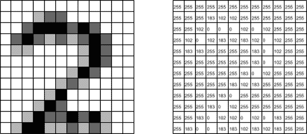
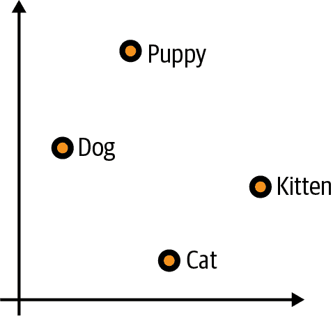
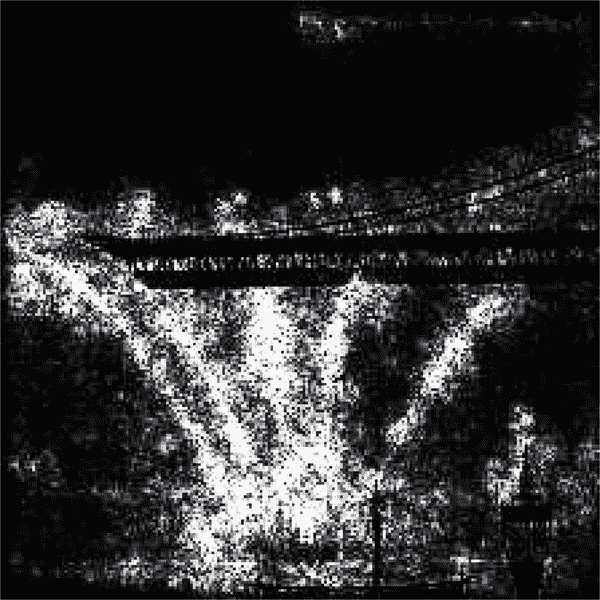
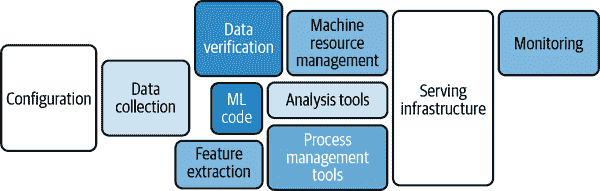

# 第九章：AI 旅程中的下一步

在本书的学习过程中，您已经了解了如何通过企业 ML 工作流程驱动业务决策的数据，如何通过理解数据来构建 ML 模型，并了解了用于构建 ML 模型的工具。您已经学会了如何使用 AutoML 训练回归和分类模型，如何在 BigQuery ML 中使用 SQL 创建自定义低代码模型，如何使用 scikit-learn 和 TensorFlow 框架创建自定义代码模型，以及如何通过进一步的特征工程和超参数调整提高自定义模型的性能。希望您觉得这段旅程同样启发和愉快。对于许多人来说，这应该足以让您能够将 ML 融入到解决问题的流程中去。

对于其他人来说，这只是进入机器学习和人工智能更长旅程的开始。本章探讨了接下来的方向。您将了解数据科学和 ML 运维（或 MLOps）中的其他重要主题。还会指引您去很多超越本书的知识资源。

# 深入探讨数据科学

*数据科学*或*数据科学家*并没有普遍认可的定义。这样的定义的一个合理近似可能是，*数据科学*是利用来自其他学科的各种工具从数据集中提取洞见的学科。这些各种工具来自于数学、统计学、计算机科学，以及根据手头问题的不同情况，可能还涉及其他领域。

本书中您所使用的所有数据集都是*结构化*数据集——具有明确定义模式的数据集。大多数业务问题涉及结构化数据，并且您已经掌握了探索结构化数据的精湛技能。然而，随着 ML 学科的成熟，*非结构化*数据集变得越来越重要。回顾第二章，非结构化数据包括图像、视频、声音文件和文本。在过去十年中，大量研究已经涉及 ML 在非结构化数据方面的各个方面。

最近变得越来越重要的一种 AI 类型是*生成式 AI*，指的是能够生成各种类型数据，如图像、视频等的模型。最近，生成式 AI 已成为一个非常流行和快速增长的领域，例如图像生成模型如[Midjourney](http://www.midjourney.com)和[Craiyon](http://craiyon.com)，以及聊天机器人（上下文文本生成）如[ChatGPT](https://openai.com/blog/chatgpt)和[Bard](http://bard.google.com)。此外，生成式 AI 的能力已经被纳入许多商业产品中，如[Bing](https://www.bing.com)（ChatGPT）、[Google Search](http://google.com)（[Search Generative Experience](https://oreil.ly/szZB7)）和[Amazon CodeWhisperer](https://aws.amazon.com/codewhisperer)。

模型变得越复杂，理解起来就越困难。例如，在您学习第六章中的线性回归时，您会发现模型的权重清楚地显示了各个特征的重要性。即使是只有一个隐藏层的神经网络，模型的权重与使用的特征的重要性之间也不再有简单的描述连接。在处理非结构化数据和生成模型问题时，使用非常大的模型会变得更加困难。

本节将更深入地探讨各种资源，并提供额外的资源，以便您选择探索这些主题。

## 处理非结构化数据

非结构化数据被定义为没有模式的数据。一些经典的例子如图像和文本。请记住，ML 模型最终是将数值输入并具有数值输出的数学函数，然后您进行解释。如何将图像或句子解释为数值输入？

### 处理图像数据

对于图像，情况比您预期的要简单。每个图像都表示为像素值数组。例如，考虑图 9-1 中手写数字的像素化图像。左侧的图像是手写数字 2 的低分辨率版本。该图像由一个 12×12 的像素块网格组成。这种灰度图像的*像素值*范围在 0 到 255 之间。0 代表黑色，255 代表白色，中间的值代表不同的灰度值。在第二幅图像中，您可以看到图像的实际像素值作为数组。

###### 图 9-1\. 手写数字 2 的低分辨率灰度图像及其相应的像素值。

对于彩色图像，思路非常相似。彩色图像由三个*通道*组成：红色、绿色和蓝色。对于每个像素，每个通道的值介于 0 和 255 之间。这些通道的值通常被称为*RGB 值*。例如，白色由`[255,255,255]`表示，黄色由`[255,255,0]`表示。有很多简单的工具，比如在[RapidTables](https://oreil.ly/gby4M)上的工具，可以让您探索不同的颜色并查看它们的 RGB 值。

现在您理解了图像可以作为数值值的二维（黑白图像）或三维数组（彩色图像），您现在可能对如何在 ML 中使用这些值有所了解。这些是您图像模型的数值输入。

图像分类的“hello world”示例是使用所谓的 MNIST（修改过的国家标准与技术研究所）数据集进行手写数字识别的问题。这是一个包含 60,000 个训练图像和 10,000 个测试图像的数据集，这些图像在 10 个手写数字（0 到 9）之间很好地平衡。这些图像是 28×28 的灰度图像。你可以在图 9-2 中看到其中一个示例图像。

###### 图 9-2\. MNIST 数据集中手写数字 7 的示例。

将每个图像分类为相应的数字是多类别分类问题的一个示例。我们在本书的示例中没有探讨超过两个类别，但大致思路是相似的。模型将预测每个数字的概率，最可能的数字将被视为预测标签。你可以像在第七章中使用线性分类和神经网络分类器一样使用它们，但也有其他附加工具，如卷积层，在处理图像数据时非常有用。这些额外的工具超出了本书的范围，但以下是一些想要进一步学习的有用资源：

+   [Kaggle 竞赛和教程，用于处理 MNIST 数据集](https://oreil.ly/Vvp1d)

+   [Google 的 ML 崩溃课程，关于图像分类](https://oreil.ly/_ea_0)

### 处理文本数据

在你的 ML 模型中可能会遇到的另一种常见的非结构化数据类型是文本数据。例如，如果你想要使用评论中的文本数据来理解为什么你的客户给出了某些积极或消极的评分，你需要有一种方法将文本数据转化为数值数据。

执行此任务的最简单方法是像在前面的问题中对分类数据使用的一样使用独热编码。例如，你可以有词汇表`['red', 'blue', 'green']`。如果有单词`'blue'`，则相应的值将是`[0,1,0]`。

然而，这很快就会变得棘手。如果每个不同的单词都有一个不同的对应值，那么你可能会得到一个非常高维的特征。某些单词在训练集中可能很少出现，甚至根本不出现，因此模型可能会难以学习这些单词的含义。

一个策略是使用*n-grams*而不是单个单词。 n-grams 是*n*个连续单词的序列。例如，在句子*The cow jumped over the moon*中，2-grams（或*bigrams*）是`['The cow', 'cow jumped', 'jumped over', 'over the', 'the moon']`。对于垃圾邮件检测，3-grams 和 4-grams 往往比单个单词更有用。直观地，我们可以在一个明确的例子中看到这一点。垃圾邮件可能包含像“你赢得了彩票，现在变得富有！”这样的句子作为正文的一部分。1-grams 和 2-grams 将查看句子的片段，这些片段对于捕获上下文来说太细粒度了，除了`"now rich!"`之外，这可能会提示人或模型该邮件是垃圾邮件。例如，`"won"`，`"the"`和`"lottery"`缺少单独需要确认该邮件是垃圾邮件的上下文。另一方面，3-gram `"won the lottery"`对于大多数警惕寻找垃圾邮件的人来说会立即引起警觉。

另一个策略是使用词嵌入。*词嵌入*是单词在某些维度上的表示，旨在捕捉其含义和与其他单词的关系。例如，单词*king*可以表示为`[0.5, 0.7]`。理想情况下，词嵌入将会将相似的单词放置在彼此附近。例如，如 Figue 9-3 所示，*dog*和*puppy*的嵌入将彼此靠近，*cat*和*kitten*也将如此。

###### 图 9-3\. “dog”、“puppy”、“cat”和“kitten”的示例二维词嵌入。

还要注意，“dog”和“puppy”以及“cat”和“kitten”之间的距离和方向非常相似。使用词嵌入，您会期望在任何动物及其幼崽之间（比如“sheep”和“lamb”）之间有类似的关系。

词嵌入本身就是模型，并且通常在特定问题的上下文中进行训练。更一般地，存在不同的预处理模型和工具，用于将单词和句子片段转换为数值输入。BERT（双向编码器转换器表示）预处理是将文本输入转换为模型输入的一种流行方式。

要了解更多关于在 ML 模型中处理文本的信息，请参考以下几个有用的资源：

+   [Keras/TensorFlow 中的词嵌入](https://oreil.ly/WQesS)

+   [使用 BERT 在 TensorFlow 中预处理数据](https://oreil.ly/Sqn-7)

+   [在 scikit-learn 中处理文本数据](https://oreil.ly/4EgWi)

+   [Yelp 评论数据集](https://oreil.ly/-NlFC)：一个用于处理文本数据以预测评论分数的优秀数据集。

## 生成式 AI

我们在本书中讨论的分类模型是判别模型。*判别*模型的目标是预测实例属于哪个类别。例如，预测交易是欺诈还是合法。生成模型在某种程度上是相反的问题。该模型从标签生成实例。例如，给定标签“一只弹奏班卓琴的猫”，将生成一张弹奏班卓琴的猫的图像。

有免费工具，比如[craiyon.com](http://craiyon.com)，可以用来玩弄这些模型。其中一个示例显示在图 9-4 中。

###### 图 9-4\. 使用提示“一只弹奏班卓琴的猫”生成的图像。该图像使用[craiyon.com](http://craiyon.com)生成。

生成人工智能近来因其在聊天机器人中的应用成为了讨论的主要话题。ChatGPT 和 Bard 就是生成人工智能应用于聊天机器人的两个例子。这些产品的核心是大型语言模型，或称为 LLMs。术语*LLM*有点模糊，但指的是在大规模数据集上训练的参数极为庞大的语言模型。例如，ChatGPT 的原始模型 GPT-3.5 就有超过 1750 亿个参数，并拥有超过五百万亿个标记。

关于生成人工智能在社会中的角色以及我们作为社会应如何与其互动，有很多有趣的讨论。关于负责任使用生成人工智能的伦理深入讨论超出了本书的范围和目的，但这些是未来重要的讨论。

如果您对深入了解生成人工智能感兴趣，[Coursera 上的 ChatGPT 101](https://oreil.ly/KrRFm)是一个探索这种新技术使用和影响的好资源。

## 可解释人工智能（Explainable AI）

第四章和第五章介绍了用于您的模型的特征归因，而第六章介绍了*可解释人工智能*或 XAI，通常用于结构化数据。许多 XAI 技术也适用于非结构化数据，如图像和文本数据。

XAI 技术可以分为内在和事后技术。*内在*技术利用模型的结构来解释预测。某些类型的模型，如线性模型和决策树，本质上是可解释的。对于线性模型，本书的第六章和第七章详细探讨了这一点，权重给出了特征的相对重要性。

*事后*技术，另一方面，使用模型的预测来理解其行为。这些技术是在模型训练完成后应用的，通常它们是在评估数据集的一部分上进行训练的。事后技术可以分为两大类：局部和全局技术。*局部*技术专注于单个实例，并试图解释为什么对于该特定实例做出了特定的预测。*全局*技术专注于模型在整个数据集上的行为。一般来说，局部技术可以通过对数据集中的局部技术的结果进行聚合来转化为全局技术。

局部和全局技术都可以进一步分为与模型无关和与模型相关的技术。*与模型无关*的技术倾向于改变数据并理解它如何改变正在进行的预测。一个很好的例子是您在第 4 和第五章节中看到的特征归因，当使用 AutoML 时。这些特征归因是如何计算的？它们是使用称为*排列特征重要性*或 PFI 的技术计算的。PFI 的计算方式如下：首先计算您想要使用的数据集的模型损失。接下来，在原地排列数据的第一列时再次计算损失。也就是说，您在保持其他列不变的情况下排列第一列（参见表 9-1）。原始数据集的损失与第一列数据集排列后的损失之间的差异给出了第一个特征重要性的“分数”。

表格 9-1\. 在原地对一列进行排列；在此示例中，列 A 是被排列的列

| 列 A | 列 B | 列 C |
| --- | --- | --- |
| 1 | 4 | 7 |
| 2 | 5 | 8 |
| 3 | 6 | 9 |
| 列 A | 列 B | 列 C |
| --- | --- | --- |
| 3 | 4 | 7 |
| 1 | 5 | 8 |
| 2 | 6 | 9 |

重复此过程以处理每一列。一列的 PFI 是从此过程中得到的归一化分数。*归一化*在这里意味着重新缩放分数，使所有归一化分数相加为一。PFI 在实践中易于解释和计算，但它确实依赖于一些由于排列而引起的随机性。通常情况下，在使用 PFI 时，您将对一列进行多次不同排列并对其进行平均以尝试减少随机性的影响。

另一种技术是*模型特定*的技术。例如，*方向特征重要性/贡献*专门针对基于树的模型，如决策树、随机森林和梯度提升树。另一方面，神经网络的一种流行技术是综合梯度技术。*综合梯度*利用神经网络是可微模型的事实。*可微性*是一种重要的数学性质，在使用梯度下降算法最小化损失函数时也被利用。确切的数学内容超出了本书的范围，但其思想非常直观。

以图像分类模型为例。假设你已经训练了一个模型来基于其主题对图像进行分类。你的模型接收到一张火船的图片，并正确预测这张图片是火船。但是为什么它会做出这个预测呢？粗略地说，综合梯度方法观察当你改变特征并累积每个特征的变化时预测如何改变。对于图像模型来说，这些特征就是单个像素值。对于综合梯度来说，你定义一个起始点或*基线*。在图像模型中，基线通常是完全黑色的图像，尽管在特定情况下可以使用其他基线图像（如完全白色的图像或随机噪声）。你从纯黑图像的火船标签的预测概率开始，然后按比例增加像素直到得到原始图像。对于每一步，你计算像素值变化对火船预测概率的影响。这可以通过计算*梯度*来完成，梯度是理解输出随多个输入变化率的数学工具。最后，你累积（或*积分*）每个像素的这些变化率。具有最高累积变化率的像素对应于预测中最重要的像素。在图 9-5 和图 9-6 中，你可以看到这些插值图像及使用综合梯度确定的像素重要性。

###### 图 9-5\. 左侧是基线图像，右侧是火船的原始图像。中间图像是两者之间的插值。

###### 图 9-6\. 消防船图像；由综合梯度标识的最重要像素更亮。请注意，综合梯度突出了从船上的水流作为解释，说明为什么这是一幅消防船的图片。

要了解更多关于 XAI 的信息，[*可解释机器学习：使黑匣子模型可解释的指南*](https://oreil.ly/4CyIF) 由 Christoph Molnar 提供了一个很好的资源。

# ML 运营

在第七章中，您训练了一个 ML 模型来预测客户流失，并能够在笔记本环境中提供预测。然而，这只是将 ML 模型投入生产过程中的一步。正如您所看到的，需要做一些工作来确保数据准备就绪。但是这并未考虑到需要进行培训和服务模型的基础计算基础设施，管理和优化正在使用的资源消耗，考虑如何使您的模型对消费者可用，以及如何随时间监控该模型。图 9-7 显示了与生产化 ML 模型相关的代码相比的相对努力程度。

###### 图 9-7\. 使 ML 模型可用的隐藏复杂性。

ML 运营，或 MLOps，是管理模型本身之外的所有不同任务的学科。这包括管理基础设施，决定模型的部署和访问方式，以及在适当时监控和更新模型。

MLOps 通常是 ML 工程师、数据工程师和数据科学家的责任来管理。但是，即使你不在这些角色之一，了解在生产中使用 ML 模型的各种关注点也非常有价值。作为构建模型的人，你可以分享关于所使用的工具和数据源、需要进行的数据预处理以及模型在预测时期望的特征的良好笔记。像在模型本身中包含预处理逻辑这样的做法，使用像 scikit-learn 中的 transformers 或 Keras 中的预处理层，可以使工程师在模型投入生产时更容易地部署训练和预测流水线。在大多数公司，不会有一个人做所有事情，因此良好的沟通至关重要。

要了解更多关于 MLOps 相关主题的详细信息，请参阅以下资源：

+   [MLOps 简介](https://oreil.ly/E1K_3)

+   [MLOps：机器学习中的持续交付和自动化管道](https://oreil.ly/X6jv0)

+   [*设计机器学习系统*](https://www.oreilly.com/library/view/designing-machine-learning/9781098107956) 由 Chip Huyen（O’Reilly，2022）撰写

# 持续培训和评估

在第五章中，您使用 AutoML 训练了一个模型，用于将交易分类为欺诈或合法。您的模型在提供的数据集上表现良好，但在使用几个月后的生产过程中，您公司的支持团队表示他们收到了更多关于事后客户报告的欺诈交易。尽管如此，您的模型并没有标记出许多这类欺诈交易。发生了什么？

随着时间的推移，不同类型的*漂移*可能会发生，并影响您模型的性能。例如，可能会出现新类型的欺诈交易，这些交易在您原始的训练数据集中并不存在。您的模型可能不会发现这一点。这将是*数据漂移*的一个例子，即基础数据分布的变化。

另一种漂移类型被称为*概念漂移*。概念漂移是指特征与标签之间的关系随时间变化的情况。零售需求预测中有一个很好的例子。购物趋势随时间改变，同一产品在不同时间销售情况不同，这取决于当前的趋势。产品本身没有变化，但产品与销售之间的关系发生了变化。

*持续训练*是根据某些标准自动重新训练模型的过程。最常见的标准通常是时间或模型性能。例如，您可能希望每周重新训练模型，或者当某个特定比例的欺诈交易被错过并由客户报告时重新训练模型。对于大多数在生产中使用的模型来说，这是一个非常常见和重要的实践。

*持续评估*通常是决定何时重新训练模型的重要组成部分，也是监控模型性能的重要部分。当模型在新数据上预测结果时，会对新数据进行标记。通常这些标签由领域专家确定。然后模型根据这些数据与新标签进行评估。如果模型的性能随时间减弱，那么可能表明发生了某种漂移，可能是时候重新训练模型了。

如果您是本书预期读者的一部分，那么您在思考这些问题时可能会与其他人合作。然而，即使这不是您的责任，了解其他人正在使用的工具和问题也是很重要的。这可以让您在自己的方法上做出更明智的决策，使他人的工作更轻松，并让您成为更好的合作者。

# 总结

你在阅读这本书的过程中已经经历了一段很不错的机器学习之旅！希望现在你能够自如地思考如何将自己的问题转化为机器学习项目，并且已经准备好开始使用本书中介绍的工具构建模型了。从这里起，你可以利用不同的资源，探索多种方向，并且应该感到自信去追寻你感兴趣的领域。机器学习和人工智能是一个快速增长的领域，在过去十年里需求呈指数级增长，今后几年很可能会继续增长。
