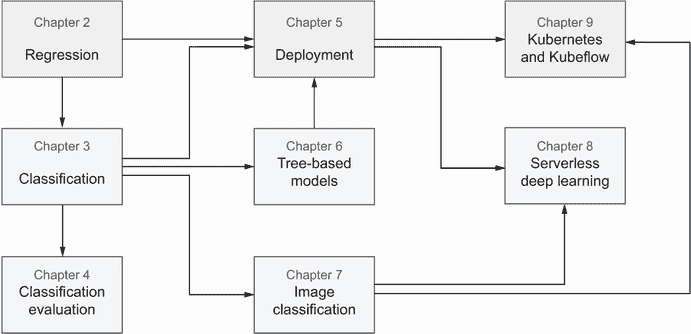

# 前言

## 前言

我认识 Alexey 已经超过六年了。我们几乎在柏林一家科技公司同一个数据科学团队工作：Alexey 在我离开几个月后开始工作。尽管如此，我们还是通过 Kaggle 这个数据科学竞赛平台和一位共同的朋友相识。我们在一个关于自然语言处理的 Kaggle 竞赛中同一个团队参赛，这是一个有趣的项目，需要仔细使用预训练的词嵌入并巧妙地混合它们。与此同时，Alexey 正在写一本书，并邀请我担任技术审稿人。这本书是关于 Java 和数据科学的，在阅读过程中，我特别印象深刻的是 Alexey 如何精心策划和编排有趣的例子。这很快导致了新的合作：我们共同撰写了一本基于项目的书籍，关于 TensorFlow，我们从事了从强化学习到推荐系统等不同项目，旨在为读者提供灵感和示例。

在与 Alexey 合作的过程中，我发现他像许多从软件工程转向数据科学的人一样，更喜欢通过实践和编码来学习。

因此，当我听说他已经开始另一个基于项目的书籍时，我并不感到特别惊讶。被邀请对 Alexey 的工作提供反馈，我从早期就开始阅读这本书，发现阅读过程非常吸引人。这本书是一本实用的机器学习入门书籍，重点在于动手实践。它面向与 Alexey 有相同背景的人——对数据科学感兴趣的开发商，他们需要快速建立起与数据和数据问题相关的有用和可重用经验。

作为数据科学和人工智能领域超过十本书的作者，我知道关于这个主题已经有大量的书籍和课程。然而，这本书却相当不同。在《机器学习训练营》（Machine Learning Bookcamp）中，你不会找到其他书籍提供的那些似曾相识的数据问题。它没有那种教条、重复的主题流程，就像地图上已经标记好的路线，总是把你带到你已经知道和看过的地点。

书中的每一部分都围绕着实际和几乎贴近现实世界的例子展开。你将学习如何预测汽车的价格，判断客户是否会流失，以及评估不偿还贷款的风险。之后，你将把服装照片分类为 T 恤、连衣裙、裤子和其他类别。这个项目特别有趣，因为 Alexey 亲自整理了这个数据集，你可以用自己衣柜里的衣服来丰富它。

当然，通过阅读这本书，你被期望将机器学习应用于解决常见问题，并且你将使用最简单、最有效的方法来实现最佳结果。前几章从考察基本算法，如线性回归和逻辑回归开始。然后读者逐渐过渡到梯度提升和神经网络。然而，本书的强项在于，在通过实践教授机器学习的同时，它也为你准备进入现实世界。你将处理不平衡的类别和长尾分布，并发现如何处理脏数据。你将评估你的模型，并使用 AWS Lambda 和 Kubernetes 进行部署。这只是你通过阅读本书学习到的新技术的冰山一角。

以工程师的思维模式思考，你可以这样说，这本书的编排方式是为了让你获得涵盖成为优秀数据科学家 80%核心知识的 20%知识。更重要的是，我还要补充一点，你将在 Alexey 的指导下阅读和实践，这是他通过自己的工作和 Kaggle 经验提炼出来的。基于这些前提，我祝愿你在本书的篇章和项目中有一个愉快的旅程。我相信这将帮助你找到接近数据科学及其问题、工具和解决方案的最佳方式。

——卢卡·马萨罗恩

## 前言

我开始我的职业生涯作为 Java 开发者。大约在 2012-2013 年，我对数据科学和机器学习产生了兴趣。首先，我观看了在线课程，然后我报名参加了研究生课程，用两年的时间学习商业智能和数据科学的各个方面。最终，我在 2015 年毕业，并开始作为数据科学家工作。

在工作中，我的同事向我介绍了 Kaggle——一个数据科学竞赛的平台。我想，“凭借我从课程和硕士学位中获得的所有技能，我能够轻松赢得任何竞赛。”但当我尝试参加竞赛时，我惨败。我在 Kaggle 上所拥有的所有理论知识都毫无用处。我的模型糟糕透顶，最终我在排行榜上垫底。

在接下来的九个月里，我参加了数据科学竞赛。我没有做得特别出色，但这是我真正学习机器学习的时候。

我意识到，对我来说，最好的学习方式是通过做项目。当我专注于问题，当我实施某些东西，当我进行实验时，我才能真正学到东西。但如果我专注于课程和理论，我会花费太多时间在那些在实践中不重要且无用的学习上。

我并不孤单。在讲述这个故事时，我多次听到“我也是！”的声音。这就是为什么《机器学习书营》的重点是通过做项目来学习。我相信软件工程师——与我背景相同的人——通过实践学习得最好。

我们从汽车价格预测项目开始这本书，学习线性回归。然后，我们确定客户是否想要停止使用我们公司的服务。为此，我们学习逻辑回归。为了学习决策树，我们评估银行的客户以确定他们是否能够偿还贷款。最后，我们使用深度学习来将衣服图片分类到不同的类别，如 T 恤、裤子、鞋子、外套等等。

书中的每个项目都以问题描述开始。然后我们使用不同的工具和框架来解决这个问题。通过专注于问题，我们只覆盖了解决这个问题所必需的部分。当然，也有理论内容，但我尽量将其保持在最小化，并专注于实践部分。

然而，有时我不得不在某些章节中包含公式。在关于机器学习的书中避免公式是不可能的。我知道公式对一些人来说很可怕。我也经历过。这就是为什么我用代码解释了所有的公式。当你看到公式时，不要让它吓到你。先尝试理解代码，然后再回到公式，看看代码是如何转化为公式的。这样，公式就不会再让你感到害怕了！

你在这本书中找不到所有可能的主题。我专注于最基本的东西——当你开始使用机器学习时，你一定会用到的 100%确定的事情。还有一些其他重要的主题我没有涉及：时间序列分析、聚类、自然语言处理。阅读这本书后，你将拥有足够的背景知识来自学这些主题。

本书中有三章专注于模型部署。这些是非常重要的一章——可能是最重要的一章。能够部署模型是成功项目和失败项目之间的区别。即使是最优秀的模型，如果其他人无法使用它，也是无用的。这就是为什么值得花时间学习如何使其对他人可访问。这也是为什么我在书中很早就涵盖了这一点，就在我们学习逻辑回归之后。

最后一章是关于使用 Kubernetes 部署模型。这不是一个简单的章节，但如今 Kubernetes 是最常用的容器管理系统。你可能会需要与之合作，这就是为什么它被包含在书中。

最后，本书的每一章都包括练习。你可能想跳过它们，但我不建议这样做。如果你只是跟随这本书，你会学到很多新东西。但如果你不将这些知识应用于实践，你很快就会忘记大部分。练习帮助你将这些新技能应用于实践——你将更好地记住你所学的。

享受你在书中的旅程，随时欢迎与我联系！

——阿列克谢·格里戈廖夫

## 致谢

在这本书上投入大量业余时间。我花费了无数个夜晚和失眠的夜晚来工作。这就是为什么，首先，我最想感谢我的妻子，感谢她的耐心和支持。

接下来，我想感谢我的编辑 Susan Ethridge，感谢她的耐心。本书的第一个早期访问版本于 2020 年 1 月发布。在那之后不久，我们周围的世界变得疯狂，每个人都被困在家中。对我来说，在书中工作极具挑战性。我不知道我错过了多少个截止日期（很多！），但 Susan 没有催促我，而是让我按照自己的节奏工作。

在 Susan 之后，第一个必须阅读所有章节的人是 Michael Lund。我想感谢 Michael 提供的无价反馈以及他在我的草稿上留下的所有评论。一位审稿人写道：“本书对细节的关注令人赞叹，”这主要是因为 Michael 的贡献。

在封锁期间找到继续撰写本书的动力是困难的。有时，我甚至感觉不到任何能量。但审稿人和 MEAP 读者的反馈非常鼓舞人心。这帮助我在重重困难中完成了本书。因此，我想感谢你们所有人审阅草稿，提供反馈——最重要的是——感谢你们的善意话语以及支持！

我特别想感谢几位与我分享反馈的读者：Martin Tschendel，Agnieszka Kamin´ska 和 Alexey Shvets。此外，我还想感谢在 LiveBook 评论部分或 DataTalks.Club Slack 群组的 #ml-bookcamp 频道留下反馈的每个人。

在第七章中，我使用了一个用于图像分类项目的服装数据集。这个数据集是专门为这本书创建和整理的。我想感谢所有贡献了他们服装图片的人，尤其是 Kenes Shangerey 和 Tagias，他们贡献了整个数据集的 60%。

在上一章中，我介绍了使用 Kubernetes 和 Kubeflow 进行模型部署。Kubeflow 是一种相对较新的技术，其中一些内容尚未得到充分的文档记录。这就是为什么我想感谢我的同事 Theofilos Papapanagiotou 和 Antonio Bernardino，他们帮助我处理了 Kubeflow 相关的事宜。

没有 Manning 市场营销部门的帮助，*《机器学习书营》* 无法触及大多数读者。我特别想感谢 Lana Klasic 和 Radmila Ercegovac，他们帮助安排了推广本书的活动，并运行社交媒体活动以吸引更多读者。我还想感谢我的项目编辑 Deirdre Hiam；我的审稿编辑 Adriana Sabo；我的校对员 Pamela Hunt；以及我的校对 Melody Dolab。

致所有审稿人：Adam Gladstone, Amaresh Rajasekharan, Andrew Courter, Ben McNamara, Billy O'Callaghan, Chad Davis, Christopher Kottmyer, Clark Dorman, Dan Sheikh, George Thomas, Gustavo Filipe Ramos Gomes, Joseph Perenia, Krishna Chaitanya Anipindi, Ksenia Legostay, Lurdu Matha Reddy Kunireddy, Mike Cuddy, Monica Guimaraes, Naga Pavan Kumar T, Nathan Delboux, Nour Taweel, Oliver Korten, Paul Silisteanu, Rami Madian, Sebastian Mohan, Shawn Lam, Vishwesh Ravi Shrimali, William Pompei，你们的建议帮助使这本书变得更好。

最后但同样重要的是，我想感谢 Luca Massaron，他激励我写书。我永远不可能像你，Luca，那样成为一个多产的作家，但感谢你成为我的一大动力！

## 关于这本书

### 应该阅读这本书的人

本书是为那些能够编程并能快速掌握 Python 基础知识的人所写。你不需要有任何机器学习的前期经验。

理想读者是希望开始使用机器学习的软件工程师。然而，一个需要为学习和副项目编写代码的积极大学生也能成功。

此外，那些已经从事机器学习工作但想了解更多的人也会发现这本书很有用。许多已经作为数据科学家和数据分析师工作的人表示，这本书对他们有帮助，特别是关于部署的章节。

### 本书如何组织：路线图

本书包含九章，我们在整本书中探讨了四个不同的项目。

+   在第一章中，我们介绍了主题——我们讨论了传统软件工程与机器学习之间的区别。我们涵盖了组织机器学习项目的整个过程，从理解业务需求的初始步骤到最后一步部署模型。我们更详细地介绍了建模步骤，并讨论了我们应该如何评估我们的模型并选择最佳模型。为了说明本章的概念，我们使用了垃圾邮件检测问题。

+   在第二章中，我们开始了我们的第一个项目——预测汽车的价格。我们学习如何使用线性回归来完成这个任务。我们首先准备了一个数据集并进行了一些数据清洗。接下来，我们进行了一些数据探索性分析，以更好地理解数据。然后，我们使用 NumPy 自己实现了一个线性回归模型，以了解机器学习模型在底层是如何工作的。最后，我们讨论了正则化和评估模型质量等主题。

+   在第三章，我们处理客户流失检测问题。我们在一家电信公司工作，并希望确定哪些客户可能会很快停止使用我们的服务。这是一个分类问题，我们使用逻辑回归来解决。我们首先进行特征重要性分析，以了解哪些因素对这个问题最重要。然后我们讨论了一热编码作为处理分类变量（如性别、合同类型等）的方法。最后，我们使用 Scikit-learn 训练了一个逻辑回归模型，以了解哪些客户将很快流失。

+   在第四章，我们评估了在第三章开发的模型的表现。我们涵盖了最重要的分类评估指标：准确率、精确率和召回率。我们讨论了混淆矩阵，然后深入 ROC 分析和计算 AUC。我们以讨论 K 折交叉验证来结束这一章。

+   在第五章，我们将客户流失预测模型部署为一个网络服务。这是过程中的一个重要步骤，因为我们如果不使我们的模型可用，它对任何人都没有用处。我们首先使用 Flask，这是一个用于创建网络服务的 Python 框架。然后我们涵盖了 Pipenv 和 Docker 用于依赖管理，并以在 AWS 上部署我们的服务结束。

+   在第六章，我们开始了一个关于风险评估的项目。我们想要了解银行客户是否会遇到偿还贷款的问题。为此，我们学习了决策树的工作原理，并使用 Scikit-learn 训练了一个简单的模型。然后我们转向更复杂的基于树的模型，如随机森林和梯度提升。

+   在第七章，我们构建了一个图像分类项目。我们将训练一个模型，用于将衣物图像分类到 10 个类别，如 T 恤、连衣裙、裤子等。我们使用 TensorFlow 和 Keras 来训练我们的模型，并涵盖了诸如迁移学习等内容，以便能够使用相对较小的数据集训练模型。

+   在第八章，我们部署了在第七章训练的衣物分类模型，并使用 TensorFlow Lite 和 AWS Lambda 进行部署。

+   在第九章，我们部署了衣物分类模型，但在第一部分我们使用了 Kubernetes 和 TensorFlow Serving，在第二部分使用了 Kubeflow 和 Kubeflow Serving。

为了帮助您开始阅读本书以及 Python 及其相关库，我们准备了五个附录章节：

+   附录 A 解释了如何设置本书的环境。我们展示了如何使用 Anaconda 安装 Python，如何运行 Jupyter Notebook，如何安装 Docker，以及如何创建 AWS 账户。

+   附录 B 涵盖了 Python 的基础知识。

+   附录 C 涵盖了 NumPy 的基础知识，并简要介绍了我们进行机器学习所需的最重要线性代数概念：矩阵乘法和矩阵求逆。

+   附录 D 涵盖了 Pandas。

+   附录 E 解释了如何在 AWS SageMaker 上获得带有 GPU 的 Jupyter Notebook。

这些附录是可选的，但它们很有帮助，尤其是如果您之前没有使用过 Python 或 AWS。

您不必从头到尾阅读这本书。为了帮助您导航，您可以使用这张地图：

第二章和第三章是最重要的章节。所有其他章节都依赖于它们。阅读完它们后，您可以跳到第五章来部署模型，第六章来了解基于树的模型，或第七章来学习图像分类。关于评估指标的第四章依赖于第三章：我们评估第三章中关于客户流失预测模型的质量。在第八章和第九章中，我们将部署图像分类模型，因此在继续到第八章或第九章之前，阅读第七章会有所帮助。

每章都包含练习。做这些练习很重要——这将大大帮助您记住材料。

### 关于代码

本书包含许多源代码示例，无论是编号列表还是与普通文本并列。在两种情况下，源代码都以 `fixed-width` `字体` 如此格式化，以将其与普通文本区分开来。有时代码也会被 `**in** **bold**` 突出显示，以强调与章节中先前步骤相比已更改的代码，例如当新功能添加到现有代码行时。

在许多情况下，原始源代码已经被重新格式化；我们添加了换行并重新调整了缩进，以适应书籍中可用的页面空间。在极少数情况下，即使这样也不够，列表中还包括了行续接标记（➥）。此外，当代码在文本中描述时，源代码中的注释通常也会从列表中移除。许多列表旁边都有代码注释，突出显示重要概念。

本书代码可在 GitHub 上找到，网址为 [`github.com/alexeygrigorev/mlbookcamp-code`](https://github.com/alexeygrigorev/mlbookcamp-code)。此存储库还包含许多对您机器学习之旅有帮助的有用链接。

### liveBook 讨论论坛

购买 Machine Learning Bookcamp 包括免费访问由 Manning Publications 运营的私人网络论坛，您可以在论坛中就本书发表评论、提出技术问题，并从作者和其他用户那里获得帮助。要访问论坛，请访问 [`livebook.manning.com/book/machine-learning-bookcamp/welcome/v-11`](https://livebook.manning.com/book/machine-learning-bookcamp/welcome/v-11)。您还可以在 [`livebook.manning.com/#!/discussion`](https://livebook.manning.com/#!/discussion) 上了解更多关于 Manning 的论坛和行为准则。

Manning 对我们读者的承诺是提供一个场所，在那里读者之间以及读者与作者之间可以进行有意义的对话。这不是对作者参与特定数量活动的承诺，作者对论坛的贡献仍然是自愿的（且未付费）。我们建议你尝试向作者提出一些挑战性的问题，以免他的兴趣转移！只要本书仍在印刷，论坛和先前讨论的存档将可通过出版社的网站访问。

### 其他在线资源

+   该书的网站：[`mlbookcamp.com/`](https://mlbookcamp.com/)。它包含基于本书的有用文章和课程。

+   数据爱好者社区：[`datatalks.club`](https://datatalks.club)。你可以在那里提出关于数据或机器学习的任何问题。

+   此外，还有一个用于讨论与书籍相关问题的频道：#ml-bookcamp。

## 关于作者

亚历克谢·格里戈廖夫与他的妻子和儿子住在柏林。他是一位经验丰富的软件工程师，专注于机器学习。他在 OLX 集团担任首席数据科学家，帮助他的同事将机器学习应用于生产。

工作之余，亚历克谢运营着 DataTalks.Club，这是一个喜欢数据科学和机器学习的人们的社区。他是两本其他书籍的作者：《精通数据科学中的 Java》和《TensorFlow 深度学习项目》。

## 关于封面插图

《机器学习 Bookcamp》封面上的插图标题为“布拉班特夫人”，或来自布拉班特的女人。这幅插图取自雅克·格拉塞·德·圣索沃尔（1757–1810）的作品集，名为《不同国家的服饰》，于 1797 年在法国出版。每一幅插图都是手工精心绘制和着色的。格拉塞·德·圣索沃尔收藏中的丰富多样性生动地提醒我们，200 年前世界的城镇和地区在文化上是如何截然不同的。他们彼此孤立，说着不同的方言和语言。在街道或乡村，仅凭他们的服饰就能轻易识别他们居住的地方以及他们的职业或社会地位。

自那时以来，我们的着装方式已经改变，而当时区域间的多样性已经逐渐消失。现在很难区分不同大陆、不同城镇、地区或国家的人们。也许我们用更丰富多彩的个人生活——当然，是更丰富多彩、节奏更快的技术生活——来换取了文化多样性。

在难以区分一本计算机书与另一本计算机书的时代，Manning 通过基于两百年前丰富多样的区域生活，并由格拉塞·德·圣索沃尔的图画使之重生的封面设计，庆祝了计算机行业的创新精神和主动性。
