# 1 机器学习简介

本章涵盖

+   理解机器学习及其解决的问题

+   组织成功的机器学习项目

+   训练和选择机器学习模型

+   执行模型验证

在本章中，我们介绍机器学习，并描述它在哪些情况下最有帮助。我们展示了机器学习项目与传统软件工程（基于规则的解决方案）的不同之处，并通过使用垃圾邮件检测系统作为例子来说明这些差异。

要使用机器学习解决现实生活中的问题，我们需要一种组织机器学习项目的方法。在本章中，我们讨论 CRISP-DM：一个实施成功机器学习项目的逐步方法论。

最后，我们更详细地研究 CRISP-DM 的一个步骤——建模步骤。在这个步骤中，我们训练不同的模型，并选择解决我们问题的最佳模型。

## 1.1 机器学习

机器学习是应用数学和计算机科学的一部分。它使用来自概率、统计和优化理论等数学学科的工具体现数据中的模式。

机器学习背后的主要思想是从例子中学习：我们准备一个包含例子的数据集，机器学习系统“学习”这个数据集。换句话说，我们给系统输入和期望的输出，系统试图自动找出如何进行转换，而不需要询问人类。

例如，我们可以收集一个包含汽车描述和价格的数据集。然后，我们提供一个机器学习模型并使用这个数据集“教授”它，通过展示汽车及其价格。这个过程被称为*训练*或有时称为*拟合*（图 1.1）。

图 1.1 机器学习算法接收输入数据（汽车的描述）和期望输出（汽车的价格）。基于这些数据，它产生一个模型。

当训练完成后，我们可以通过要求它预测我们尚未知的汽车价格来使用模型（图 1.2）。

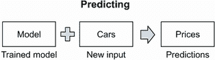

图 1.2 当训练完成后，我们得到一个可以应用于新的输入数据（无价格的车）以产生输出（价格预测）的模型。

我们需要的只是机器学习的一个数据集，其中对于每个输入项（一辆车），我们都有期望的输出（价格）。

这个过程与传统软件工程截然不同。没有机器学习，分析师和开发者会查看他们拥有的数据，并尝试手动寻找模式。之后，他们会提出一些逻辑：将输入数据转换为所需输出的规则集。然后，他们使用 Java 或 Python 等编程语言明确地编码这些规则，结果就是软件。因此，与机器学习相比，人类做了所有困难的工作（图 1.3）。

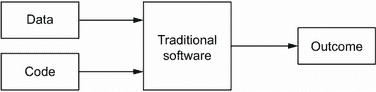

图 1.3 在传统软件中，模式是手动发现的，然后使用编程语言进行编码。人类完成所有工作。

总结来说，传统软件系统与基于机器学习系统的区别如图 1.4 所示。在机器学习中，我们向系统提供输入和输出数据，结果是模型（代码），它可以将输入转换为输出。困难的工作由机器完成；我们只需要监督训练过程，确保模型是好的（图 1.4B）。相比之下，在传统系统中，我们首先自己发现数据中的模式，然后编写代码将数据转换为期望的结果，使用手动发现的模式（图 1.4A）。

| 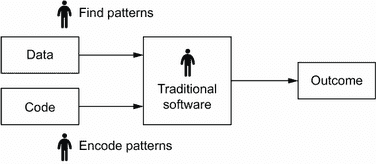 | (A) 在传统软件中，我们手动发现模式并使用编程语言进行编码。 |
| --- | --- |
| 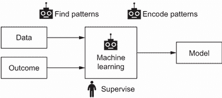 | (B) 机器学习系统通过学习示例自动发现模式。训练后，它产生一个“知道”这些模式的模型，但我们仍然需要监督它以确保模型是正确的。 |

图 1.4 传统软件系统与机器学习系统的区别。在传统软件工程中，我们完成所有工作，而在机器学习中，我们将模式发现委托给机器。

### 1.1.1 机器学习与基于规则的系统

为了说明这两种方法之间的区别，并展示为什么机器学习是有帮助的，让我们考虑一个具体的案例。在本节中，我们讨论一个垃圾邮件检测系统来展示这种区别。

假设我们正在运行一个电子邮件服务，用户开始抱怨收到带有广告的不请自来的电子邮件。为了解决这个问题，我们希望创建一个系统，将不受欢迎的邮件标记为垃圾邮件，并将它们转发到垃圾邮件文件夹。

解决问题的明显方法是亲自查看这些电子邮件，看看它们是否有任何模式。例如，我们可以检查发件人和内容。

如果我们发现垃圾邮件中确实存在模式，我们就写下发现的模式，并制定以下两个简单的规则来捕捉这些邮件：

+   如果发件人是 promotions@online.com，则标记为“垃圾邮件”

+   如果标题包含“现在购买 50%折扣”且发件人域名为“online.com”，则标记为“垃圾邮件”

+   否则，标记为“好邮件”

我们用 Python 编写这些规则并创建了一个垃圾邮件检测服务，我们成功地将它部署。一开始，系统运行良好，能够捕捉到所有垃圾邮件，但过了一段时间，新的垃圾邮件开始悄悄溜过。我们现有的规则已经无法成功地将这些邮件标记为垃圾邮件。

为了解决这个问题，我们分析了新消息的内容，并发现其中大部分包含单词*deposit*。因此，我们添加了一条新规则：

+   如果发件人是“promotions@online.com”，则标记为“垃圾邮件”

+   如果标题包含“现在购买 50%折扣”且发件人域名为“online.com”，则标记为“垃圾邮件”

+   如果邮件正文包含单词“deposit”，则标记为“垃圾邮件”

+   否则，"good email"

在发现这个规则后，我们将修复部署到我们的 Python 服务中，并开始捕获更多的垃圾邮件，使我们的邮件系统的用户感到高兴。

然而，过了一段时间后，用户又开始抱怨：有些人出于好意使用“deposit”这个词，但我们的系统未能识别这一点，将消息标记为垃圾邮件。为了解决这个问题，我们查看好消息并试图了解它们与垃圾邮件消息的不同之处。过了一会儿，我们发现了一些模式并再次修改了规则：

+   如果发件人是“promotions@online.com”，则是垃圾邮件

+   如果标题包含“buy now 50% off”且发件人域名为“online.com”，则是垃圾邮件

+   如果正文包含“deposit”，则

    +   如果发件人域名为“test.com”，则是垃圾邮件

    +   如果描述长度大于等于 100 个单词，则是垃圾邮件

+   否则，"good email"

在这个例子中，我们手动查看输入数据并尝试从中提取模式。分析的结果，我们得到了一组规则，将输入数据（电子邮件）转换为两种可能的结果之一：垃圾邮件或非垃圾邮件。

现在想象一下，我们重复这个过程几百次。结果，我们最终得到的是难以维护和理解的代码。在某个时候，它变得不可能在不破坏现有逻辑的情况下将新模式包含到代码中。因此，从长远来看，维护和调整现有规则以使垃圾邮件检测系统仍然表现良好并最小化垃圾邮件投诉变得相当困难。

这正是机器学习可以提供帮助的情况。在机器学习中，我们通常不尝试手动提取这些模式。相反，我们通过向系统提供一个标记为垃圾邮件或非垃圾邮件的电子邮件数据集，并描述每个对象（电子邮件）的一组特征（特征），将这项任务委托给统计方法。基于这些信息，系统试图在没有任何人工帮助的情况下在数据中找到模式。最终，它学会了如何结合特征，使得垃圾邮件被标记为垃圾邮件，而好邮件则不被标记。

使用机器学习，维护手工规则集的问题就消失了。当出现新的模式时——例如，有新的垃圾邮件类型——我们不是手动调整现有的规则集，而是简单地向机器学习算法提供新的数据。结果，算法从新的数据中提取了新的重要模式，而不会损害旧的模式——前提是这些旧模式在新的数据中仍然重要且存在。

让我们看看如何使用机器学习来解决垃圾邮件分类问题。为此，我们首先需要用一组特征来表示每封电子邮件。一开始，我们可能选择从以下特征开始：

+   标题长度大于 10？是/否

+   正文长度大于 10？是/否

+   发件人“promotions@online.com”？是/否

+   发件人“hpYOSKmL@test.com”？是/否

+   发件人域名“test.com”？是/否

+   描述中包含“存款”？是/否

在这个特定的情况下，我们使用一组六个特征来描述所有电子邮件。巧合的是，这些特征是从先前的规则中推导出来的。

使用这个特征集，我们可以将任何电子邮件编码为特征向量：一个包含特定电子邮件所有特征值的数字序列。

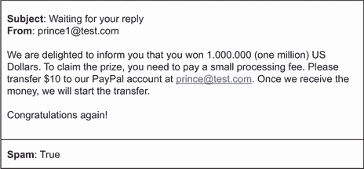

图 1.5 用户标记为垃圾邮件的电子邮件

现在想象一下，我们有一个用户标记为垃圾邮件的电子邮件（图 1.5）。我们可以将这个电子邮件表示为向量[1, 1, 0, 0, 1, 1]，并且对于六个特征中的每一个，我们将其编码为 1（真）或 0（假）（图 1.6）。因为我们的用户将这条消息标记为垃圾邮件，所以目标变量是 1（真）。

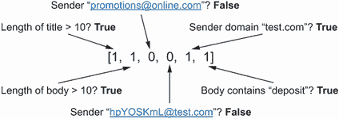

图 1.6 垃圾邮件的六维特征向量。六个特征中的每一个都由一个数字表示。在这种情况下，如果特征为真，我们使用 1，如果特征为假，我们使用 0（图 1.6）。

这样，我们可以为我们数据库中的所有电子邮件创建特征向量，并为每个电子邮件贴上标签。这些向量将成为模型的输入。然后模型将这些数字组合起来，使得垃圾邮件的预测接近 1（垃圾邮件），而对于普通消息则是 0（非垃圾邮件）（图 1.7）。

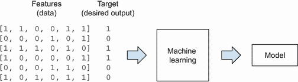

图 1.7 机器学习算法的输入由多个特征向量和每个向量的目标变量组成。

因此，我们有一个比一组硬编码的规则更灵活的工具。如果将来有什么变化，我们不需要手动重新访问所有规则并尝试重新组织它们。相反，我们只使用最新的数据，并用新的模型替换旧的模型。

这个例子只是机器学习使我们的生活变得更简单的一种方式。机器学习的其他应用包括

+   建议汽车的价格。

+   预测客户是否会停止使用公司的服务。

+   根据查询的相关性对文档进行排序。

+   向用户展示他们更有可能点击的广告，而不是无关的内容。

+   对维基百科上的有害和不正确的编辑进行分类。这样的系统可以帮助维基百科的版主在验证建议的编辑时优先考虑他们的工作。

+   推荐客户可能购买的商品。

+   对不同类别的图像进行分类。

机器学习的应用不仅限于这些例子。我们可以使用任何可以表示为（输入数据，期望输出）的东西来训练机器学习模型。

### 1.1.2 当机器学习不起作用时

虽然机器学习很有帮助并能解决许多问题，但在某些情况下实际上并不需要。

对于一些简单的任务，规则和启发式方法通常效果很好，因此最好从它们开始，然后考虑使用机器学习。在我们的垃圾邮件示例中，我们首先创建了一组规则，但随着维护这个集合变得困难，我们转向了机器学习。然而，我们使用了一些规则作为特征，并将它们简单地输入到模型中。

在某些情况下，使用机器学习根本不可能。要使用机器学习，我们需要有数据。如果没有数据，机器学习是不可能的。

### 1.1.3 监督机器学习

我们刚才看到的电子邮件分类问题是一个监督学习的例子：我们向模型提供特征和目标变量，然后它找出如何使用这些特征来达到目标。这种学习被称为 *监督*，因为我们通过展示示例来监督或教导模型，就像我们通过展示不同物体的图片并告诉他们这些物体的名称来教导孩子一样。

更正式一点，我们可以用数学方式表达一个监督机器学习模型：

其中

+   *g* 是我们想要通过机器学习学习的函数。

+   *X* 是特征矩阵，其中行是特征向量。

+   *y* 是目标变量：一个向量。

机器学习的目标是学习这个函数 *g*，使得当它得到矩阵 *X* 时，输出接近向量 *y*。换句话说，函数 *g* 必须能够接收 *X* 并产生 *y*。学习 *g* 的过程通常被称为 *训练* 或 *拟合*。我们将 *g* “拟合”到数据集 *X*，使其产生 *y*（图 1.8）。

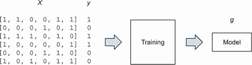

图 1.8 当我们训练一个模型时，算法接收一个矩阵 *X*，其中特征向量是行，期望的输出是向量 *y*，包含我们想要预测的所有值。训练的结果是 *g*，即模型。训练后，*g* 应该在应用于 *X* 时产生 *y*——简而言之，*g*(*X*) **≈** *y*。

监督学习问题有多种类型，类型取决于目标变量 *y*。主要类型包括

+   回归：目标变量 *y* 是数值型，例如汽车价格或明天的温度。我们在第二章中介绍了回归模型。

+   分类：目标变量 *y* 是分类的，例如垃圾邮件、非垃圾邮件或汽车品牌。我们可以进一步将分类分为两个子类别：（1）*二元分类*，只有两种可能的结果，例如垃圾邮件或非垃圾邮件，和（2）*多类分类*，有超过两种可能的结果，例如汽车品牌（丰田、福特、大众等）。分类，尤其是二元分类，是机器学习最常见应用。我们在本书的多个章节中介绍了它，从第三章开始。在第三章中，我们将构建一个预测客户是否会流失——停止使用我们公司服务的模型。

+   排序：目标变量 *y* 是组内元素的排序，例如搜索结果页面中页面的顺序。排序问题通常出现在搜索和推荐等领域，但这本书的范围之外，我们不会详细讨论。

每个监督学习问题都可以用不同的算法来解决。有许多类型的模型可供选择。这些模型定义了函数 *g* 如何从 *X* 中学习预测 *y*。这些模型包括

+   第二章中介绍了用于解决回归问题的线性回归

+   第三章中介绍了用于解决分类问题的逻辑回归

+   第六章中介绍了用于解决回归和分类问题的基于树的模型

+   第七章中介绍了用于解决回归和分类问题的神经网络

深度学习和神经网络最近受到了很多关注，这主要归功于计算机视觉方法的突破。这些网络在解决图像分类等任务方面比早期方法做得更好。*深度学习*是机器学习的一个子领域，其中函数 *g* 是具有许多层的神经网络。我们将在第七章中了解更多关于神经网络和深度学习的内容，在那里我们将训练一个用于图像分类的深度学习模型。

## 1.2 机器学习过程

创建一个机器学习系统不仅仅是选择一个模型、训练它并将其应用于新数据。这个过程中的模型训练部分只是其中的一个小步骤。

还涉及许多其他步骤，例如确定机器学习可以解决的问题，以及使用模型的预测来影响最终用户。更重要的是，这个过程是迭代的。当我们训练一个模型并将其应用于新的数据集时，我们通常会识别出模型表现不佳的情况。我们使用这些情况重新训练模型，以便新版本能更好地处理这些情况。

某些技术和框架帮助我们以某种方式组织机器学习项目，使其不会失控。其中一个这样的框架是 CRISP-DM，代表*跨行业数据挖掘标准流程*。它是在很久以前发明的，1996 年，尽管如此，它仍然适用于今天的问题。

根据 CRISP-DM（图 1.9），机器学习过程有六个步骤：

1.  业务理解

1.  数据理解

1.  数据准备

1.  建模

1.  评估

1.  部署

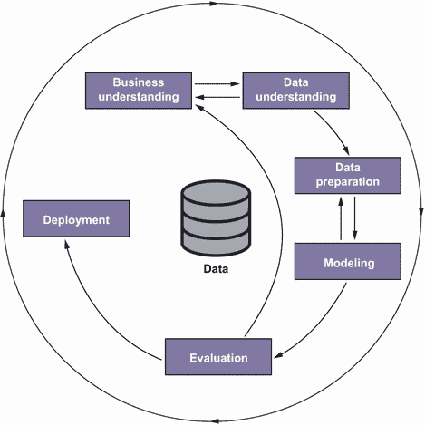

图 1.9 CRISP-DM 过程。一个机器学习项目从理解问题开始，然后进入数据准备、模型训练和评估结果。最后，模型进入部署阶段。这个过程是迭代的，在每一步中，都有可能回到前一步。

每个阶段都涵盖典型的任务：

+   在业务理解步骤中，我们试图确定问题，了解我们如何解决问题，并决定机器学习是否是解决该问题的有用工具。

+   在数据理解步骤中，我们分析可用的数据集，并决定我们是否需要收集更多数据。

+   在数据准备步骤中，我们将数据转换成表格形式，以便将其用作机器学习模型的输入。

+   当数据准备就绪后，我们进入建模步骤，在这个步骤中我们训练一个模型。

+   在确定最佳模型之后，接下来是评估步骤，我们评估模型是否解决了原始的业务问题，并衡量其在解决问题上的成功程度。

+   最后，在部署步骤中，我们将模型部署到生产环境中。

### 1.2.1 业务理解

让我们以电子邮件服务提供商的垃圾邮件检测为例。我们看到的垃圾邮件消息比以往任何时候都多，而我们当前的系统无法轻松处理。这个问题在业务理解步骤中得到解决：我们分析问题以及现有的解决方案，并试图确定是否将机器学习添加到该系统中将帮助我们停止垃圾邮件。我们还定义了目标和如何衡量它。目标可能是“减少报告的垃圾邮件数量”或“减少客户支持每天收到的关于垃圾邮件的投诉数量”，例如。在这一步骤中，我们可能还会决定机器学习不会有所帮助，并提出一个更简单的方法来解决问题。

### 1.2.2 数据理解

下一步是数据理解。在这里，我们试图确定我们可以用来解决问题的数据来源。例如，如果我们的网站有一个“举报垃圾邮件”按钮，我们可以获取用户标记为垃圾邮件的收件邮件生成数据。然后我们查看数据并分析它，以决定它是否足够好，可以解决我们的问题。

然而，由于各种原因，这些数据可能不足以解决广泛的问题。一个原因可能是数据集太小，我们无法学习任何有用的模式。另一个原因可能是数据太嘈杂。用户可能没有正确使用按钮，因此它对训练机器学习模型将毫无用处，或者数据收集过程可能出了问题，只收集了我们想要的数据的一小部分。

如果我们得出结论，我们目前拥有的数据不足，我们需要找到一种方法来获取更好的数据，无论是从外部来源获取还是改进我们内部收集数据的方式。此外，我们在这个步骤中做出的发现可能会影响我们在业务理解步骤中设定的目标，因此我们可能需要回到那个步骤并根据我们的发现调整目标。

当我们有可靠的数据来源时，我们进入数据准备步骤。

### 1.2.3 数据准备

在这一步，我们清理数据，将其转换成可以用于机器学习模型输入的形式。对于垃圾邮件示例，我们将数据集转换成一系列特征，我们稍后将其输入到模型中。

数据准备完成后，我们进入建模步骤。

### 1.2.4 建模

在这一步，我们决定使用哪种机器学习模型以及如何确保我们从中获得最佳效果。例如，我们可能会决定尝试逻辑回归和深度神经网络来解决垃圾邮件问题。

我们需要知道如何衡量模型的表现，以便选择最佳模型。对于垃圾邮件模型，我们可以查看模型预测垃圾邮件消息的效果，并选择表现最好的那个。为此，设置一个合适的验证框架非常重要，这就是为什么我们在下一节中会详细讨论它。

在这一步，我们很可能需要回到并调整我们准备数据的方式。也许我们提出了一个很好的特征，因此我们回到数据准备步骤编写一些代码来计算这个特征。当代码完成后，我们再次训练模型以检查这个特征是否良好。我们可能会添加一个“主题长度”的特征，重新训练模型，并检查这种变化是否提高了模型的表现，例如。

在我们选择了最佳模型之后，我们进入评估步骤。

### 1.2.5 评估

在这一步，我们检查模型是否达到了预期。在业务理解步骤中设定目标时，我们也定义了确定目标是否实现的方式。通常，我们通过查看一个重要的业务指标并确保模型将指标推向正确的方向来做到这一点。在垃圾邮件检测的情况下，这个指标可能是点击“报告垃圾邮件”按钮的人数，或者客户支持收到的关于我们正在解决的问题的投诉数量。在两种情况下，我们都希望使用模型来减少这些数量。

现在，这一步与下一步紧密相连：部署。

### 1.2.6 部署

评估模型的最佳方式是通过实战测试：将模型推出给一部分用户，然后检查我们的业务指标是否对这些用户有所变化。如果我们希望我们的模型减少报告的垃圾邮件数量，例如，我们预计与所有其他用户相比，这个群体会有更少的报告。

模型部署后，我们利用所有在各个步骤中学到的知识，回到第一步来反思我们取得了什么成果（或没有取得什么成果）。我们可能会意识到我们的初始目标是不正确的，而我们真正想要做的是*不是*减少报告的数量，而是通过减少垃圾邮件的数量来增加客户参与度。因此，我们一直回到业务理解步骤来重新定义我们的目标。然后，当我们再次评估模型时，我们使用不同的业务指标来衡量其成功。

### 1.2.7 迭代

如我们所见，CRISP-DM 强调了机器学习过程的迭代性质：在最后一步之后，我们总是期望回到第一步，细化原始问题，并根据学习到的信息进行修改。我们永远不会停留在最后一步；相反，我们会重新思考问题，看看在下一轮迭代中我们能做得更好。

人们普遍认为机器学习工程师和数据科学家整天都在训练机器学习模型。实际上，这种想法是不正确的，正如我们在 CRISP-DM 图中（图 1.9）所看到的那样。在建模步骤之前和之后有很多步骤，所有这些步骤对于一个成功的机器学习项目来说都是重要的。

## 1.3 建模与模型验证

正如我们之前所看到的，训练模型（建模步骤）是整个过程中的一个步骤。但这是一个重要的步骤，因为这是我们实际使用机器学习来训练模型的地方。

在我们收集所有必要的数据并确定数据质量良好之后，我们找到一种处理数据的方法，然后继续训练机器学习模型。在我们的垃圾邮件示例中，这发生在我们收到所有垃圾邮件报告、处理电子邮件并准备好矩阵以供模型使用之后。

在这个阶段，我们可能会问自己该使用什么：逻辑回归还是神经网络。如果我们决定选择神经网络，因为我们听说它是最好的模型，我们如何确保它确实比其他任何模型都要好？

在这一步的目标是产生一个模型，使其达到最佳的预测性能。为了做到这一点，我们需要有一种可靠的方法来衡量每个可能的模型候选者的性能，然后选择最好的一个。

一种可能的方法是训练一个模型，让它在一个实时系统上运行，并观察会发生什么。在我们的垃圾邮件示例中，我们决定使用神经网络来检测垃圾邮件，所以我们训练它并将其部署到我们的生产系统中。然后我们观察模型在新消息上的表现，并记录系统错误的案例。

然而，这种方法并不适合我们的情况：我们不可能为每个模型候选者都这样做。更糟糕的是，我们可能会意外地部署一个真的很差的模型，并且只有在它在我们系统的实际用户上运行之后才会发现它的糟糕。

注意：在实时系统上测试模型被称为在线测试，这对于评估模型在真实数据上的质量非常重要。然而，这种方法属于过程的评估和部署步骤，而不是建模步骤。

在部署模型之前选择最佳模型的一个更好的方法是模拟上线场景。我们获取完整的数据集，从中取出部分数据，并在剩余的数据上训练模型。当训练完成后，我们假装保留的数据集是新的、未见过的数据，并使用它来衡量我们模型的性能。这部分数据通常被称为*验证集*，将数据集的一部分保留下来并用于评估性能的过程称为*验证*（见图 1.10）。

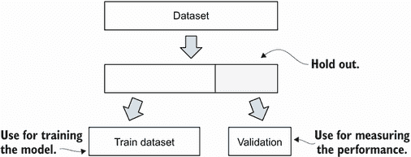

图 1.10 为了评估模型的性能，我们留出一部分数据，仅用于验证目的。

在垃圾邮件数据集中，我们可以取出每第十条消息。这样，我们保留了 10%的数据，仅用于验证模型，而将剩余的 90%用于训练。接下来，我们在训练数据上训练逻辑回归和神经网络。当模型训练完成后，我们将它们应用于验证数据集，并检查哪个模型在预测垃圾邮件方面更准确。

如果在将模型应用于验证后，我们发现逻辑回归在 90%的情况下正确预测垃圾邮件，而神经网络在 93%的情况下正确预测，我们得出结论，神经网络模型比逻辑回归是一个更好的选择（图 1.11）。

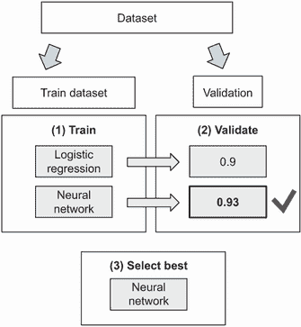

图 1.11 验证过程。我们将数据集分为两部分，在训练部分上训练模型，并在验证部分上评估性能。使用评估结果，我们可以选择最佳模型。

通常，我们不仅仅尝试两种模型，而是有更多。例如，逻辑回归有一个参数 C，根据我们设置的值，结果可能会有很大的不同。同样，神经网络也有许多参数，每个参数都可能对最终模型的预测性能产生重大影响。除此之外，我们还有其他模型，每个模型都有自己的参数集。我们如何选择具有最佳参数的最佳模型？

要做到这一点，我们使用相同的评估方案。我们在训练数据上使用不同的参数训练模型，然后将它们应用于验证数据，并根据最佳的验证结果选择模型及其参数（图 1.12）。

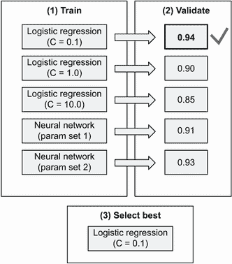

图 1.12 使用验证数据集选择具有最佳参数的最佳模型

然而，这种方法有一个微妙的问题。如果我们反复进行模型评估过程，并使用相同的验证数据集进行评估，我们观察到的验证数据集中的良好数字可能只是偶然出现的。换句话说，“最佳”模型可能只是在这个特定数据集上预测结果时运气好。

注意 在统计学和其他领域，这个问题被称为多重比较问题或多重测试问题。我们在同一数据集上做出预测的次数越多，我们偶然看到良好性能的可能性就越大。

为了防止这个问题，我们使用同样的想法：我们再次保留一部分数据。我们称这部分数据为*测试*数据集。我们很少使用它，仅用于测试我们选定的最佳模型（图 1.13）。

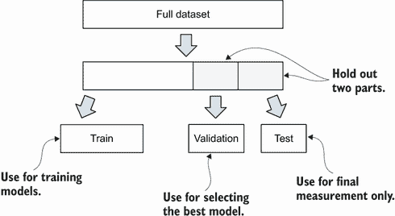

图 1.13 将数据分为训练、测试和验证部分

为了将此应用于垃圾邮件示例，我们首先保留 10%的数据作为测试数据集，然后保留 10%的数据作为验证。我们在验证数据集上尝试多个模型，选择最佳模型，并将其应用于测试数据集。如果我们看到验证和测试之间的性能差异不大，我们确认这个模型确实是最佳模型（图 1.14）。

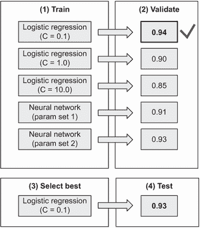

图 1.14 我们使用测试数据集来确认最佳模型在验证集上的性能良好。

重要 设置验证过程是机器学习中最重要的一步。没有它，我们就无法可靠地知道我们刚刚训练的模型是好是坏，甚至是有害的。

选择最佳模型及其最佳参数的过程称为*模型选择*。我们可以如下总结模型选择（图 1.15）：

1.  我们将数据分为训练、验证和测试部分。

1.  我们首先在训练部分对每个模型进行训练，然后对其进行验证。

1.  每次我们训练一个不同的模型时，我们使用验证部分记录评估结果。

1.  最后，我们确定哪个模型是最好的，并在测试数据集上对其进行测试。

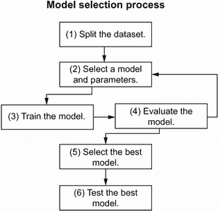

图 1.15 模型选择过程。首先，我们将数据集分割，选择一个模型，并仅在数据的训练部分对其进行训练。然后我们在验证部分评估模型。我们重复这个过程多次，直到找到最佳模型。

使用模型选择过程，并在离线环境中首先验证和测试模型，以确保我们训练的模型是好的。如果模型在离线环境中表现良好，我们可以决定进入下一步，并将模型部署以评估其在真实用户中的性能。

## 摘要

+   与传统基于规则的软件工程系统不同，在这些系统中规则是手动提取和编码的，机器学习系统可以被训练来自动从数据中提取有意义的模式。这给我们带来了更多的灵活性，并使得适应变化变得更加容易。

+   成功实施一个机器学习项目需要有一个结构和一套指导方针。CRISP-DM 是一个组织机器学习项目的框架，它将整个过程分解为六个步骤，从业务理解到部署。该框架突出了机器学习的迭代特性，并帮助我们保持组织有序。

+   建模是机器学习项目中一个重要的步骤：这是我们实际使用机器学习来训练模型的部分。在这一步中，我们创建出能够实现最佳预测性能的模型。

+   模型选择是选择最佳模型以解决问题的一个过程。我们将所有可用数据分为三部分：训练集、验证集和测试集。我们在训练集上训练模型，并使用验证集来选择最佳模型。当最佳模型被选中后，我们使用测试步骤作为最终检查，以确保最佳模型表现良好。这个过程帮助我们创建出既实用又不出意外的有效模型。
