# 2 回归机器学习

本章涵盖

+   使用线性回归模型创建汽车价格预测项目

+   使用 Jupyter 笔记本进行初步的探索性数据分析

+   设置验证框架

+   从头实现线性回归模型

+   为模型执行简单的特征工程

+   使用正则化来控制模型

+   使用模型预测汽车价格

在第一章中，我们讨论了监督机器学习，其中我们通过给他们示例来教机器学习模型如何在数据中识别模式。

假设我们有一个包含汽车描述的数据集，如制造商、型号和年龄，我们希望使用机器学习来预测它们的价格。这些汽车的特征被称为*特征*，价格是*目标* *变量*——我们想要预测的东西。然后模型获取特征并将它们组合起来输出价格。

这是一个监督学习的例子：我们有一些关于某些汽车价格的信息，我们可以用它来预测其他汽车的价格。在第一章中，我们也讨论了不同类型的监督学习：回归和分类。当目标变量是数值时，我们有一个回归问题，而当目标变量是分类变量时，我们有一个分类问题。

在本章中，我们创建一个回归模型，从最简单的一个开始：线性回归。我们亲自实现算法，这足以用几行代码完成。同时，它非常具有说明性，它将教会你如何处理 NumPy 数组并执行基本的矩阵运算，如矩阵乘法和矩阵求逆。我们还遇到了在求逆矩阵时的数值不稳定性问题，并看到正则化如何帮助解决这些问题。

## 2.1 汽车价格预测项目

本章解决的问题是在预测汽车价格。假设我们有一个人们可以买卖二手汽车的网站。当在网站上发布广告时，卖家经常难以提出一个有意义的定价。我们希望帮助我们的用户通过自动价格推荐。我们要求卖家指定汽车的型号、制造商、年份、里程和其他重要特征，然后根据这些信息，我们希望提出最佳价格。

公司的一名产品经理偶然发现了一个包含汽车价格的公开数据集，并要求我们看看它。我们检查了数据，发现它包含了所有重要的特征以及推荐的价格——这正是我们用例所需要的。因此，我们决定使用这个数据集来构建价格推荐算法。

项目的计划如下：

1.  首先，我们下载数据集。

1.  接下来，我们对数据进行初步分析。

1.  之后，我们设置一个验证策略，以确保我们的模型产生正确的预测。

1.  然后我们使用 Python 和 NumPy 实现线性回归模型。

1.  接下来，我们将介绍特征工程，从数据中提取重要特征以改进模型。

1.  最后，我们将了解如何通过正则化使我们的模型稳定，并使用它来预测汽车价格。

### 2.1.1 下载数据集

对于这个项目，我们首先要做的是安装所有必需的库：Python、NumPy、Pandas 和 Jupyter Notebook。最简单的方法是使用一个名为 Anaconda 的 Python 发行版（[`www.anaconda.com`](https://www.anaconda.com/)）。请参阅附录 A 以获取安装指南。

在安装了库之后，我们需要下载数据集。我们有多种方法可以做到这一点。您可以通过 Kaggle 网络界面手动下载，网址为 [`www.kaggle.com/CooperUnion/cardataset`](https://www.kaggle.com/CooperUnion/cardataset)。（您可以在 [`www.kaggle.com/jshih7/car-price-prediction`](https://www.kaggle.com/jshih7/car-price-prediction) 上了解更多关于数据集及其收集方式的信息。）前往该网站，打开它，然后点击下载链接。另一种选择是使用 Kaggle 命令行界面（CLI），这是一个用于通过 Kaggle 访问所有数据集的工具。对于本章，我们将使用第二种方法。我们将在附录 A 中描述如何配置 Kaggle CLI。

注意 Kaggle 是一个面向对机器学习感兴趣的人的在线社区。它最出名的是举办机器学习竞赛，但它也是一个数据共享平台，任何人都可以分享数据集。有超过 16,000 个数据集可供任何人使用。它是项目想法的绝佳来源，并且对于机器学习项目非常有用。

在本章以及整本书中，我们将积极使用 NumPy。我们将随着内容的展开介绍所有必要的 NumPy 操作，但请参阅附录 C 以获取更深入的介绍。

本项目的源代码可在 GitHub 上的书籍仓库中找到，网址为 [`github.com/alexeygrigorev/mlbookcamp-code`](https://github.com/alexeygrigorev/mlbookcamp-code)，在 chapter-02-car-price 章节中。

作为第一步，我们将为这个项目创建一个文件夹。我们可以给它起任何名字，例如 chapter-02-car-price：

```
mkdir chapter-02-car-price
cd chapter-02-car-price
```

然后我们下载数据集：

```
kaggle datasets download -d CooperUnion/cardataset
```

此命令下载 cardataset.zip 文件，这是一个压缩文件。让我们解压缩它：

```
unzip cardataset.zip
```

在里面，有一个文件：data.csv。

当我们有了数据集后，让我们继续下一步：理解它。

## 2.2 探索性数据分析

理解数据是机器学习过程中的重要一步。在我们能够训练任何模型之前，我们需要知道我们有什么样的数据以及它是否有用。我们通过探索性数据分析（EDA）来完成这项工作。

我们查看数据集以学习

+   目标变量的分布

+   这个数据集中的特征

+   这些特征中值的分布

+   数据的质量

+   缺失值的数量

### 2.2.1 探索性数据分析工具箱

这种分析的主要工具是 Jupyter Notebook、Matplotlib 和 Pandas：

+   Jupyter Notebook 是一个用于交互式执行 Python 代码的工具。它允许我们执行一段代码并立即看到结果。此外，我们可以在自由文本中显示图表并添加注释。它还支持其他语言，如 R 或 Julia（因此得名：Jupyter 代表 Julia、Python、R），但我们将仅使用它来执行 Python。

+   Matplotlib 是一个用于绘图的库。它非常强大，允许你创建不同类型的可视化，如折线图、条形图和直方图。

+   Pandas 是一个用于处理表格数据的库。它可以读取来自任何来源的数据，无论是 CSV 文件、JSON 文件还是数据库。

我们还将使用 Seaborn，这是另一个基于 Matplotlib 构建的绘图工具，它使得绘制图表变得更加容易。

让我们通过执行以下命令来启动一个 Jupyter Notebook：

```
jupyter notebook
```

此命令在当前目录中启动 Jupyter Notebook 服务器，并在默认的网页浏览器中打开它（图 2.1）。

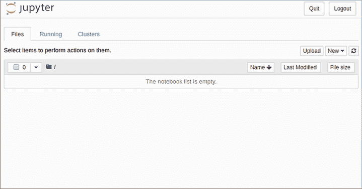

图 2.1 Jupyter Notebook 服务的起始屏幕

如果 Jupyter 在远程服务器上运行，则需要额外的配置。请参阅附录 A 了解设置详情。

现在让我们为这个项目创建一个笔记本。点击“新建”，然后在“笔记本”部分选择 Python 3。我们可以将其命名为 chapter-02-car-price-project—点击当前标题（未命名），并将其替换为新的名称。

首先，我们需要导入这个项目所需的所有库。在第一个单元格中写下以下内容：

```
import numpy as np                     ❶
import pandas as pd                    ❷

from matplotlib import pyplot as plt   ❸
import seaborn as sns                  ❸
%matplotlib inline                     ❹
```

❶ 导入 NumPy：一个用于数值计算的库

❷ 导入 Pandas：一个用于表格数据的库

❸ 导入绘图库：Matplotlib 和 Seaborn

❹ 确保在 Jupyter Notebooks 中正确渲染图表

前两行，❶ 和 ❷，是导入所需库的语句：NumPy 用于数值操作，Pandas 用于表格数据。惯例是使用较短的别名（如 `pd` 在 `import pandas as pd` 中）来导入这些库。这种惯例在 Python 机器学习社区中很常见，每个人都遵循它。

接下来的两行，❸，是导入绘图库的语句。第一个，Matplotlib，是一个用于创建高质量可视化的库。直接使用这个库可能并不总是容易。一些库使使用 Matplotlib 更加简单，而 Seaborn 就是其中之一。

最后，行 ❹ 的 `%matplotlib inline` 告诉 Jupyter Notebook 期望在笔记本中渲染图表，因此当需要时它将能够渲染它们。

按下 Shift+Enter 或点击运行来执行所选单元格的内容。

我们不会深入探讨 Jupyter Notebooks 的细节。请访问官方网站 ([`jupyter.org`](https://jupyter.org/)) 了解更多信息。该网站提供了丰富的文档和示例，可以帮助你掌握它。

### 2.2.2 读取和准备数据

现在，让我们读取我们的数据集。我们可以使用 Pandas 的 `read_csv` 函数来完成此操作。将以下代码放入下一个单元格，并再次按下 Shift+Enter：

```
df = pd.read_csv('data.csv')
```

这行代码读取 CSV 文件并将结果写入名为 `df` 的变量中，`df` 是 *DataFrame* 的简称。现在我们可以检查有多少行。让我们使用 `len` 函数：

```
len(df)
```

该函数打印出 11914，这意味着在这个数据集中几乎有 12,000 辆汽车（图 2.2）。

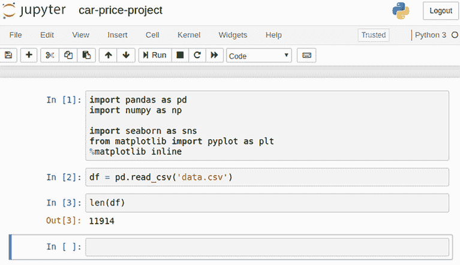

图 2.2 Jupyter Notebooks 是交互式的。我们可以在一个单元中输入一些代码，执行它，并立即看到结果，这对于探索性数据分析来说非常理想。

现在，让我们使用 `df.head()` 来查看 DataFrame 的前五行（图 2.3）。

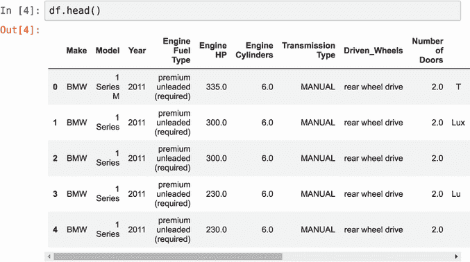

图 2.3 Pandas DataFrame 的 `head()` 函数输出：它显示了数据集的前五行。这个输出使我们能够了解数据的外观。

这让我们对数据的外观有了初步的了解。我们已能看到这个数据集中存在一些不一致性：列名有时有空格，有时有下划线（_）。特征值也是如此：有时它们是大写的，有时是带有空格的短字符串。这很不方便且令人困惑，但我们可以通过规范化来解决这些问题——将所有空格替换为下划线并将所有字母转换为小写：

```
df.columns = df.columns.str.lower().str.replace(' ', '_')        ❶

string_columns = list(df.dtypes[df.dtypes == 'object'].index)    ❷

for col in string_columns:
    df[col] = df[col].str.lower().str.replace(' ', '_')          ❸
```

❶ 将所有列名转换为小写，并将空格替换为下划线

❷ 仅选择具有字符串值的列

❸ 将 DataFrame 中所有字符串列的值转换为小写，并将空格替换为下划线

在 ❶ 和 ❸ 中，我们使用了特殊的 `str` 属性。使用它，我们可以同时对该列的整个字符串值应用字符串操作，而无需编写任何 `for` 循环。我们用它将列名和这些列的内容转换为小写，并将空格替换为下划线。

我们只能使用此属性来处理具有字符串值的列。这正是为什么我们在 ❷ 中首先选择这样的列。

注意：在本章及后续章节中，我们将随着内容的展开介绍相关的 Pandas 操作，但会保持较高的概括性。请参考附录 D 以获得对 Pandas 的更一致和深入的介绍。

在此初步预处理之后，DataFrame 看起来更加统一（图 2.4）。

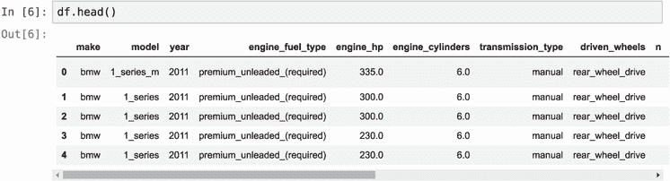

图 2.4 数据预处理的结果。列名和值已规范化：它们都是小写，并且空格被转换为下划线。

如我们所见，这个数据集包含多个列：

+   make：汽车的制造商（宝马、丰田等）

+   model：汽车的型号

+   year：汽车制造的年份

+   engine_fuel_type：发动机所需的燃料类型（柴油、电动等）

+   engine_hp：发动机马力

+   engine_cylinders：发动机的气缸数

+   transmission_type：变速器类型（自动或手动）

+   driven_wheels：前轮驱动、后轮驱动、全轮驱动

+   number_of_doors：汽车的门数

+   market_category：豪华、跨界等

+   vehicle_size：紧凑型、中型或大型

+   vehicle_style：轿车或敞篷车

+   highway_mpg：高速公路上的每加仑英里数（mpg）

+   city_mpg：城市每加仑英里数

+   popularity：汽车在 Twitter 流中提到的次数

+   msrp：制造商建议零售价

对于我们来说，这里最有趣的列是最后一个：MSRP（制造商建议零售价，或简称为汽车价格）。我们将使用这个列来预测汽车的价格。

### 2.2.3 目标变量分析

MSRP 列包含重要信息——它是我们的目标变量，即*y*，这是我们想要学习预测的值。

探索性数据分析的第一步始终是查看*y*的值看起来如何。我们通常通过检查*y*的分布来完成此操作：对*y*的可能值及其发生频率的视觉描述。这种可视化类型称为*直方图*。

我们将使用 Seaborn 来绘制直方图，所以请在 Jupyter Notebook 中输入以下内容：

```
sns.histplot(df.msrp, bins=40)
```

绘制这个图表后，我们立即注意到价格分布有一个非常长的尾巴。左侧有许多低价汽车，但数量迅速下降，并且有一个高价汽车数量非常少的长期尾巴（见图 2.5）。

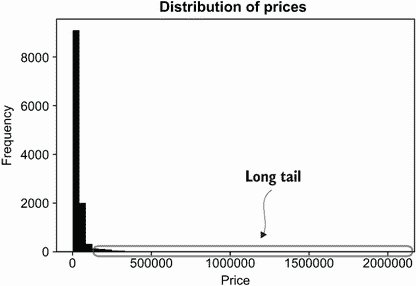

图 2.5 数据集中价格分布。我们看到价格轴低端的许多值，而高端几乎没有。这是一个长尾分布，这是许多低价且少量高价物品的典型情况。

我们可以通过稍微放大并查看低于 10 万美元的值来更仔细地观察（图 2.6）：

```
sns.histplot(df.msrp[df.msrp < 100000])
```

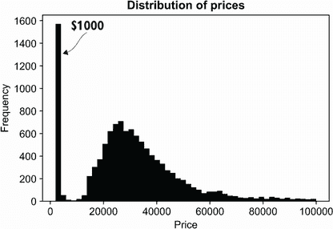

图 2.6 低于 10 万美元的汽车价格分布。仅查看低于 10 万美元的汽车价格，我们可以更好地看到分布的头部。我们也注意到很多价格为 1000 美元的汽车。

长尾使得我们很难看到分布，但它对模型的影响更大：这种分布可以极大地混淆模型，因此它不会很好地学习。解决这个问题的方法之一是取对数转换。如果我们对价格应用对数函数，它将消除不希望的效果（图 2.7）。

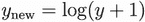

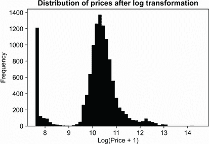

图 2.7 价格的对数。长尾效应被消除，我们可以在一个图中看到整个分布。

在有零值的情况下，+1 部分很重要。零的对数是负无穷大，但一的对数是零。如果我们的值都是非负的，通过加 1，我们确保转换后的值不会低于零。

对于我们的具体情况，零值不是问题——我们所有的价格都从 1000 美元开始——但这是我们遵循的惯例。NumPy 有一个执行这种转换的函数：

```
log_price = np.log1p(df.msrp)
```

要查看转换后的价格分布，我们可以使用相同的`histplot`函数（图 2.7）：

```
sns.histplot(log_price)
```

正如我们所看到的，这种转换去除了长尾，现在分布看起来像钟形曲线。当然，由于低价的大峰值，这个分布不是正态分布，但模型可以更容易地处理它。

备注：一般来说，当目标分布看起来像正态分布（图 2.8）时是很好的。在这种情况下，线性回归等模型表现良好。

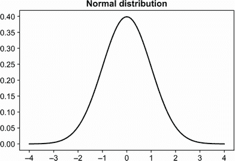

图 2.8 正态分布，也称为高斯分布，遵循钟形曲线，它是对称的，并且在中心有一个峰值。

练习 2.1

分布的头部是一个有很多值的范围。那么，分布的长尾是什么？

a) 大约在 1,000 美元左右的峰值

b) 当许多值非常远离头部分散时的情况——这些值在直方图上视觉上看起来像“尾部”

c) 在一个很短的范围内紧密堆积的许多非常相似的价值

### 2.2.4 检查缺失值

我们稍后会更仔细地查看其他特征，但现在我们应该做的一件事是检查数据中的缺失值。这一步很重要，因为通常机器学习模型无法自动处理缺失值。我们需要知道是否需要对这些值进行特殊处理。

Pandas 有一个方便的函数可以检查缺失值：

```
df.isnull().sum()
```

这个函数显示了

```
make                    0
model                   0
year                    0
engine_fuel_type        3
engine_hp              69
engine_cylinders       30
transmission_type       0
driven_wheels           0
number_of_doors         6
market_category      3742
vehicle_size            0
vehicle_style           0
highway_mpg             0
city_mpg                0
popularity              0
msrp                    0
```

我们首先看到的是，MSRP——我们的目标变量——没有任何缺失值。这个结果是好的，因为否则，这样的记录对我们来说将没有用处：我们总是需要知道观察到的目标值才能用于训练模型。此外，一些列有缺失值，特别是市场类别，其中我们几乎有 4,000 行缺失值。

我们在训练模型时需要处理缺失值，所以我们应该记住这个问题。现在，我们不对这些特征做任何其他操作，继续到下一步：设置验证框架，以便我们可以训练和测试机器学习模型。

### 2.2.5 验证框架

如我们之前所学的，尽早设置验证框架很重要，以确保我们训练的模型是好的，并且可以泛化——也就是说，模型可以应用于新的、未见过的数据。为了做到这一点，我们留出一部分数据，只在一个部分上训练模型。然后我们使用留出的数据集——我们没有用于训练的数据集——来确保模型的预测是有意义的。

这一步骤很重要，因为我们通过使用优化方法来训练模型，这些方法将函数 *g*(*X*) 与数据 *X* 相拟合。有时这些优化方法会捕捉到虚假模式——这些模式在模型看来似乎是真实模式，但实际上是随机波动。例如，如果我们有一个小的训练数据集，其中所有宝马车的价格仅为 10,000 美元，那么模型会认为这是世界上所有宝马车的真实情况。

为了确保这一点，我们使用验证。因为验证数据集没有用于训练模型，优化方法没有看到这些数据。当我们将模型应用于这些数据时，它模拟了将模型应用于我们从未见过的新的数据的情况。如果验证数据集中有价格高于 10,000 美元的宝马车，但我们的模型将预测它们为 10,000 美元，我们将注意到模型在这些示例上的表现不佳。

如我们所知，我们需要将数据集分为三个部分：训练集、验证集和测试集（图 2.9）。

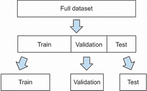

图 2.9 整个数据集分为三部分：训练集、验证集和测试集。

让我们将 DataFrame 分割成以下形式

+   20% 的数据用于验证。

+   20% 用于测试。

+   剩余的 60% 用于训练。

列表 2.1 将数据分为验证集、测试集和训练集

```
n = len(df)                                              ❶

n_val = int(0.2 * n)                                     ❷
n_test = int(0.2 * n)                                    ❷
n_train = n - (n_val + n_test)                           ❷

np.random.seed(2)                                        ❸
idx = np.arange(n)                                       ❹
np.random.shuffle(idx)                                   ❹

df_shuffled = df.iloc[idx]                               ❺

df_train = df_shuffled.iloc[:n_train].copy()             ❻
df_val = df_shuffled.iloc[n_train:n_train+n_val].copy()  ❻
df_test = df_shuffled.iloc[n_train+n_val:].copy()        ❻
```

❶ 获取 DataFrame 中的行数

❷ 计算应该有多少行用于训练、验证和测试

❸ 固定随机种子以确保结果可重复

❹ 创建一个包含从 0 到 (n-1) 的索引的 NumPy 数组，并对其进行打乱

❺ 使用索引数组获取打乱的 DataFrame

❻ 将打乱顺序的 DataFrame 分割为训练集、验证集和测试集

让我们仔细看看这段代码，并澄清一些事情。

在 ❹ 中，我们创建一个数组并将其打乱。让我们看看那里会发生什么。我们可以取一个包含五个元素的较小数组并对其进行打乱：

```
idx = np.arange(5)
print('before shuffle', idx)
np.random.shuffle(idx)
print('after shuffle', idx)
```

如果我们运行它，它将打印出类似的内容

```
before shuffle [0 1 2 3 4]
after shuffle  [2 3 0 4 1]
```

然而，如果我们再次运行它，结果将不同：

```
before shuffle [0 1 2 3 4]
after shuffle  [4 3 0 2 1]
```

为了确保每次运行它时结果都相同，在 ❸ 中我们固定随机种子：

```
np.random.seed(2)
idx = np.arange(5)
print('before shuffle', idx)
np.random.shuffle(idx)
print('after shuffle', idx)
```

函数 `np.random.seed` 接收任何数字，并使用此数字作为 NumPy 随机包内生成所有数据的起始种子。

当我们执行此代码时，它将打印

```
before shuffle [0 1 2 3 4]
after shuffle  [2 4 1 3 0]
```

在这种情况下，结果仍然是随机的，但当我们重新执行时，结果与之前的运行相同：

```
before shuffle [0 1 2 3 4]
after shuffle  [2 4 1 3 0]
```

这有利于可重复性。如果我们希望其他人运行此代码并获得相同的结果，我们需要确保一切固定，即使是代码中的“随机”部分。

注意：这使结果在同一台计算机上可重复。在不同的操作系统和不同的 NumPy 版本下，结果可能不同。

在我们创建一个索引数组 `idx` 之后，我们可以使用它来获取初始 DataFrame 的打乱版本。为此，在 ❺ 中，我们使用 `iloc`，这是一种通过行号访问 DataFrame 的方法：

```
df_shuffled = df.iloc[idx]
```

如果 `idx` 包含打乱的连续数字，此代码将生成一个打乱的 DataFrame（图 2.10）。

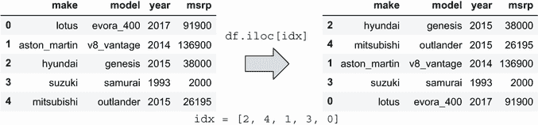

图 2.10 使用 `iloc` 打乱 DataFrame。当与打乱的索引数组一起使用时，它创建一个打乱的 DataFrame。

在这个例子中，我们使用了 `iloc` 和一个索引列表。我们也可以使用冒号运算符（:）来指定范围，这正是我们在 ❻ 中对打乱顺序的 DataFrame 进行拆分以创建训练、验证和测试集时所做的事情：

```
df_train = df_shuffled.iloc[:n_train].copy()
df_val = df_shuffled.iloc[n_train:n_train+n_val].copy()
df_test = df_shuffled.iloc[n_train+n_val:].copy()
```

现在 DataFrame 被分成三部分，我们可以继续。我们的初步分析显示价格分布有一个长尾，为了消除其影响，我们需要应用对数变换。我们可以为每个 DataFrame 单独做这件事：

```
y_train = np.log1p(df_train.msrp.values)
y_val = np.log1p(df_val.msrp.values)
y_test = np.log1p(df_test.msrp.values)
```

为了避免不小心在以后使用目标变量，让我们从数据框中移除它：

```
del df_train['msrp']
del df_val['msrp']
del df_test['msrp']
```

注意：移除目标变量是一个可选步骤。但确保我们在训练模型时不会使用它是很有帮助的：如果那样做了，我们会用价格来预测价格，我们的模型将具有完美的准确性。

当完成验证拆分后，我们可以进行下一步：训练模型。

## 2.3 回归问题的机器学习

在进行初步数据分析后，我们准备训练一个模型。我们正在解决的问题是一个回归问题：目标是预测一个数字——汽车的价格。对于这个项目，我们将使用最简单的回归模型：线性回归。

### 2.3.1 线性回归

为了预测汽车的价格，我们需要使用机器学习模型。为了做到这一点，我们将使用线性回归，我们将自己实现它。通常，我们不手动做这件事；相反，我们让一个框架为我们做这件事。然而，在本章中，我们想表明这些框架中并没有什么魔法：这只是代码。线性回归是一个完美的模型，因为它相对简单，可以用几行 NumPy 代码实现。

首先，让我们了解线性回归是如何工作的。正如我们从第一章所知，一个监督机器学习模型的形式是

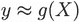

这是一个矩阵形式。*X* 是一个矩阵，其中观测的特征是矩阵的行，而 *y* 是一个包含我们想要预测的值的向量。

这些矩阵和向量可能听起来很复杂，所以让我们退一步，考虑单个观测 *x[i]* 和我们想要预测的值 *y[i]* 发生了什么。这里的索引 *i* 表示这是一个观测编号 *i*，是我们训练数据集中 *m* 个观测中的一个。

然后，对于这个单个观测，前面的公式看起来是这样的

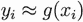

如果我们有 *n* 个特征，我们的向量 *x[i]* 是 *n*-维的，因此它有 *n* 个分量：

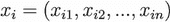

因为它有 *n* 个分量，我们可以将函数 *g* 写成一个具有 *n* 个参数的函数，这与前面的公式相同：

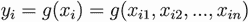

对于我们的案例，我们在训练数据集中有 7,150 辆车。这意味着 *m* = 7,150，而 *i* 可以是 0 到 7,149 之间的任何数字。例如，当 *i =* 10 时，我们有一辆以下这样的车：

```
make                                 rolls-royce
model                     phantom_drophead_coupe
year                                        2015
engine_fuel_type     premium_unleaded_(required)
engine_hp                                    453
engine_cylinders                              12
transmission_type                      automatic
driven_wheels                   rear_wheel_drive
number_of_doors                                2
market_category        exotic,luxury,performance
vehicle_size                               large
vehicle_style                        convertible
highway_mpg                                   19
city_mpg                                      11
popularity                                    86
msrp                                      479775
```

让我们挑选几个数值特征，暂时忽略其他特征。我们可以从马力、城市油耗和受欢迎程度开始：

```
engine_hp         453
city_mpg           11
popularity         86
```

然后，我们将这些特征分别分配给 *x*[i1]，*x*[i2]，和 *x*[i3]。这样，我们得到具有三个分量的特征向量 *x[i]*：

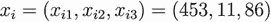

为了更容易理解，我们可以将这种数学符号翻译成 Python。在我们的例子中，函数 *g* 具有以下签名：

```
def g(xi):
    # xi is a list with n elements
    # do something with xi
    # return the result
    pass
```

在这段代码中，变量 `xi` 是我们的向量 *x[i]*。根据实现方式，`xi` 可能是一个包含 *n* 个元素的列表或一个大小为 *n* 的 NumPy 数组。

对于之前描述的汽车，`xi` 是一个包含三个元素的列表：

```
xi = [453, 11, 86]
```

当我们将函数 `g` 应用到向量 `xi` 上时，它会产生 `y_pred` 作为输出，这是 `g` 对 `xi` 的预测：

```
y_pred = g(xi)
```

我们期望这个预测尽可能接近 *y[i]*，即汽车的实际价格。

注意：在本节中，我们将使用 Python 来说明数学公式背后的思想。我们不需要使用这些代码片段来完成项目。另一方面，将此代码放入 Jupyter 中并尝试运行它可能有助于理解这些概念。

函数 *g* 可以有多种形式，机器学习算法的选择定义了它的工作方式。

如果 *g* 是线性回归模型，它具有以下形式：

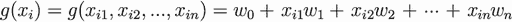

变量 *w*[0]，*w*[1]，*w*[2]，...，*w*[n]* 是模型的参数：

+   *w*[0] 是 *偏置* 项。

+   *w*[1]，*w*[2]，...，*w*[n] 是每个特征 *x*[i1]，*x*[i2]，...，*x*[in] 的 *权重*。

这些参数定义了模型如何组合特征，以便最终预测尽可能好。这些参数背后的含义可能还不清楚，因为我们将在这个部分稍后讨论它们。

为了使公式更短，让我们使用求和符号：

练习 2.2

对于监督学习，我们使用机器学习模型对单个观察值 *y[i]* ≈ *g*(*x[i]*)。在这个项目中，*x[i]* 和 *y[i]* 是什么？

a) *x[i]* 是一个特征向量——一个包含描述对象（汽车）的几个数字的向量——而 *y[i]* 是这辆车的价格的对数。

b) *y[i]* 是一个特征向量——一个包含描述对象（汽车）的几个数字的向量——而 *x[i]* 是这辆车的价格的对数。

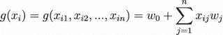

这些权重是我们在训练模型时模型学习的。为了更好地理解模型如何使用这些权重，让我们考虑以下值（表 2.1）。

表 2.1 线性回归模型学习到的权重示例

| w[0] | w[1] | w[2] | w[3] |
| --- | --- | --- | --- |
| 7.17 | 0.01 | 0.04 | 0.002 |

因此，如果我们想将这个模型翻译成 Python，它将看起来像这样：

```
w0 = 7.17
#   [w1    w2    w3   ]
w = [0.01, 0.04, 0.002]
n = 3

def linear_regression(xi):
    result = w0
    for j in range(n):
        result = result + xi[j] * w[j]
    return result
```

我们把所有特征权重放在一个单独的列表`w`中——就像我们之前对`xi`所做的那样。我们现在需要做的就是遍历这些权重并将它们乘以相应的特征值。这不过是将之前的公式直接翻译成 Python。

这很容易看出。再看一下公式：

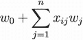

我们的例子有三个特征，所以*n =* 3，我们有

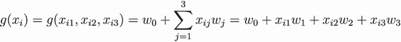

这正是代码中的内容

```
result = w0 + xi[0] * w[0] + xi[1] * w[1] + xi[2] * w[2]
```

除了 Python 中的索引从 0 开始之外，*x*[*i*1]变为`xi[0]`，而*w*[1]是`w[0]`。

现在，让我们看看当我们将模型应用于我们的观察结果*x[i]*并替换权重为它们的值时会发生什么：

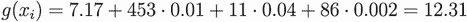

对于这个观察结果，我们得到的预测是 12.31。记住，在预处理过程中，我们对目标变量*y*应用了对数变换。这就是为什么在这个数据上训练的模型也预测了价格的对数。为了撤销变换，我们需要取对数的指数。在我们的情况下，当我们这样做时，预测变为$603,000：

exp(12.31 + 1) = 603,000

偏差项（7.17）是我们对汽车一无所知时预测的值；它作为基准。

我们确实对汽车有一些了解：马力、城市每加仑英里数和流行度。这些特征是*x*[*i*1]，*x*[i2]，和*x*[i3]特征，每个特征都告诉我们关于汽车的一些信息。我们使用这些信息来调整基准。

让我们考虑第一个特征：马力。这个特征的权重是 0.01，这意味着对于每个额外的马力单位，我们通过添加 0.01 来调整基准。因为我们有 453 匹马在引擎中，所以我们向基准添加 4.53：453 匹马 · 0.01 = 4.53。

同样，对于每加仑多行驶一英里，价格会增加 0.04，所以我们加上 0.44：11 MPG · 0.04 = 0.44。

最后，我们考虑流行度。在我们的例子中，Twitter 流中的每一次提及都会导致 0.002 的增加。总的来说，流行度对最终预测的贡献为 0.172。

这正是为什么当我们结合所有内容时得到 12.31 的原因（图 2.11）。

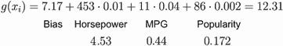

图 2.11 线性回归的预测是基准值 7.17（偏差项）加上我们从特征中获得的信息调整后的结果。马力对最终预测的贡献为 4.53；每加仑英里数，0.44；流行度，0.172。

现在，让我们记住我们实际上处理的是向量，而不是单个数字。我们知道*x[i]*是一个有*n*个分量的向量：


我们也可以将所有权重合并到一个单独的向量*w*中：


实际上，我们在 Python 示例中已经那样做了，当时我们把所有的权重放在一个列表中，这是一个维度为 3 的向量，包含每个单个特征的权重。这就是我们的例子中向量的样子：


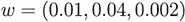

因为现在我们将特征和权重都视为向量 *x[i]* 和 *w*，我们可以用它们之间的点积替换这些向量的元素之和：

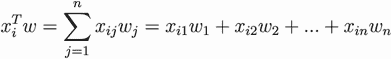

点积是乘以两个向量的方式：我们乘以向量的对应元素，然后将结果相加。有关向量-向量乘法的更多详细信息，请参阅附录 C。

将点积公式的翻译转换为代码是直接的：

```
def dot(xi, w):
    n = len(w)
    result = 0.0
    for j in range(n):
        result = result + xi[j] * w[j]
    return result
```

使用新的符号，我们可以将线性回归的整个方程重新写为

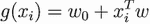

其中

+   *w*[0] 是偏置项。

+   *w* 是 *n*-维权重向量。

现在我们可以使用新的 `dot` 函数，因此 Python 中的线性回归函数变得非常简短：

```
def linear_regression(xi):
    return w0 + dot(xi, w)
```

或者，如果 `xi` 和 `w` 是 NumPy 数组，我们可以使用内置的 `dot` 方法进行乘法：

```
def linear_regression(xi):
    return w0 + xi.dot(w)
```

为了使其更短，我们可以通过在 *w*[1] 前面添加 *w*[0] 来将 *w*[0] 和 *w* 合并成一个 (*n+*1)-维向量：

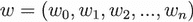

在这里，我们有一个新的权重向量 *w*，它由偏置项 *w*[0] 后跟原始权重向量 *w* 中的权重 *w*[1]，*w*[2]*，... 组成。

在 Python 中，这很容易做到。如果我们已经有一个包含旧权重的列表 `w`，我们只需要做以下操作：

```
w = [w0] + w
```

记住，Python 中的加号运算符用于连接列表，所以 `[1]` `+` `[2,` `3,` `4]` 将创建一个包含四个元素的新列表：`[1,` `2,` `3,` `4]`。在我们的例子中，`w` 已经是一个列表，所以我们创建一个新的 `w`，在开头添加一个额外的元素：`w0`。

因为现在 *w* 成为一个 (*n*+1)-维向量，我们还需要调整特征向量 *x[i]*，以便它们之间的点积仍然有效。我们可以通过添加一个虚拟特征 *x*[i 0]，它始终取值为 1 来轻松完成此操作。然后，我们在 *x*[i 1] 之前将这个新的虚拟特征添加到 *x[i]* 中：

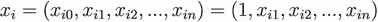

或者，用代码表示：

```
xi = [1] + xi
```

我们创建一个新的列表 `xi`，其第一个元素为 1，后跟旧列表 `xi` 中的所有元素。

通过这些修改，我们可以将模型表示为新的 *x[i]* 和新的 *w* 之间的点积：

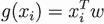

代码的转换很简单：

```
w0 = 7.17
w = [0.01, 0.04, 0.002]
w = [w0] + w

def linear_regression(xi):
    xi = [1] + xi
    return dot(xi, w)
```

这些线性回归公式是等价的，因为新 *x[i]* 的第一个特征是 1，所以当我们乘以 *x[i]* 的第一个分量和 *w* 的第一个分量时，我们得到偏置项，因为 *w*[0] · 1 = *w*[0]。

我们现在可以再次考虑更大的图景，并讨论矩阵形式。有许多观察结果，*x[i]* 是其中之一。因此，我们有了 *m* 个特征向量 *x*[1]，*x*[2]，...，*x[i]*，...，*x*[m]，并且这些向量中的每一个都包含 *n*+1 个特征：

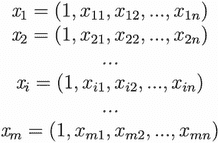

我们可以将这些向量组合成矩阵的行。让我们称这个矩阵为 *X*（见图 2.12）。

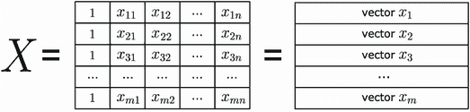

图 2.12 矩阵 *X*，其中观测值 *x*[1]、*x*[2]、...、*x*[m] 是行

让我们看看代码中的样子。我们可以从训练数据集中取几行，例如第一行、第二行和第十行：

```
x1  = [1, 148, 24, 1385]
x2  = [1, 132, 25, 2031]
x10 = [1, 453, 11, 86]
```

现在，让我们将这些行组合成另一个列表：

```
X = [x1, x2, x10]
```

列表 `X` 现在包含三个列表。我们可以将其视为一个 3x4 矩阵——一个有三行四列的矩阵：

```
X = [[1, 148, 24, 1385],
     [1, 132, 25, 2031],
     [1, 453, 11, 86]]
```

这个矩阵的每一列都是一个特征：

1.  第一列是一个虚拟特征，值为“1。”

1.  第二列是引擎马力。

1.  第三列——城市油耗。

1.  最后一个——流行度，或 Twitter 流中提及的数量。

我们已经了解到，为了对一个单个特征向量进行预测，我们需要计算这个特征向量与权重向量之间的点积。现在我们有一个矩阵 `X`，在 Python 中它是一个特征向量的列表。为了对矩阵的所有行进行预测，我们可以简单地遍历 `X` 的所有行并计算点积：

```
predictions = []

for xi in X:
    pred = dot(xi, w)
    predictions.append(pred)
```

在线性代数中，这是矩阵-向量乘法：我们用向量 *w* 乘以矩阵 *X*。线性回归的公式变为

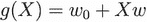

结果是一个数组，包含 *X* 每一行的预测。有关矩阵-向量乘法的更多详细信息，请参阅附录 C。

使用这种矩阵公式，将线性回归应用于预测的代码变得非常简单。将其转换为 NumPy 变得直截了当：

```
predictions = X.dot(w)
```

练习 2.3

当我们将矩阵 *X* 与权重向量 *w* 相乘时，我们得到

a) 包含实际价格的向量 *y*

b) 一个包含价格预测的向量 *y*

c) 一个包含价格预测的单个数字 *y*

### 2.3.2 训练线性回归模型

到目前为止，我们只介绍了如何进行预测。为了能够做到这一点，我们需要知道权重 *w*。我们如何得到它们？

我们从数据中学习权重：我们使用目标变量 *y* 来找到这样的 *w*，它能以最佳方式结合 *X* 的特征。“最佳方式”在线性回归的情况下意味着它最小化了预测 *g*(*X*) 与实际目标 *y* 之间的误差。

我们有多种方法可以实现这一点。我们将使用正则方程，这是实现起来最简单的方法。权重向量 *w* 可以用以下公式计算：

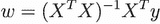

注意：本书不涵盖正则方程的推导过程。我们仅在附录 C 中简要介绍了其工作原理，但为了更深入的了解，你应该查阅机器学习教材。《统计学习基础》，第二版，作者 Hastie、Tibshirani 和 Friedman，是一个很好的起点。

这段数学可能看起来令人害怕或困惑，但它很容易翻译成 NumPy：

+   *X^T* 是 *X* 的转置。在 NumPy 中，它是 `X.T`。

+   *X^T**X* 是矩阵-矩阵乘法，我们可以使用 NumPy 的 `dot` 方法来完成：`X.T.dot(X)`。

+   *X*^(–1) 是 *X* 的逆。我们可以使用 `np.linalg.inv` 函数来计算逆。

因此，上述公式可以直接转换为

```
inv(X.T.dot(X)).dot(X.T).dot(y)
```

请参阅附录 C 了解有关此方程的更多详细信息。

要实现正规方程，我们需要做以下几步：

1.  创建一个函数，该函数接受一个包含特征矩阵 *X* 和一个包含目标向量 *y*。

1.  向矩阵 *X* 添加一个虚拟列（始终设置为 1 的特征）。

1.  训练模型：通过使用正规方程计算权重 *w*。

1.  将这个 *w* 分解为偏置 *w*[0] 和其余权重，并返回它们。

最后一步——将 *w* 分解为偏置项和其余部分——是可选的，主要为了方便；否则，每次我们想要进行预测时，都需要添加一个虚拟列，而不是在训练期间一次性完成。

让我们来实现它。

列表 2.2 使用 NumPy 实现的线性回归

```
def train_linear_regression(X, y):
    # adding the dummy column
    ones = np.ones(X.shape[0])         ❶
    X = np.column_stack([ones, X])     ❷

    # normal equation formula
    XTX = X.T.dot(X)                   ❸
    XTX_inv = np.linalg.inv(XTX)       ❹
    w = XTX_inv.dot(X.T).dot(y)        ❺

    return w[0], w[1:]                 ❻
```

❶ 创建一个只包含一个的数组

❷ 将包含一个的数组作为 X 的第一列添加

❸ 计算 *X^TX*

❹ 计算 *X^TX* 的逆

❺ 计算正规方程的其余部分

❻ 将权重向量分为偏置和其余权重

通过六行代码，我们已经实现了我们的第一个机器学习算法。在❶中，我们创建了一个只包含一个的向量，并将其作为第一列附加到矩阵 *X* 上；这是❷中的虚拟特征。接下来，我们在❸中计算 *X^TX* 并在❹中计算其逆，然后将它们组合起来计算❺中的 *w*。最后，我们在❻中将权重分为偏置 *w*[0] 和其余权重 *w*。

我们用于添加一个包含一个的列的 `column_stack` 函数可能一开始会让人困惑，所以让我们更仔细地看看它：

```
np.column_stack([ones, X])
```

它接受一个 NumPy 数组的列表，在我们的情况下包含 `ones` 和 `X` 并将它们堆叠（图 2.13）。

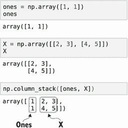

 函数 `column_stack` 接受一个 NumPy 数组的列表并将它们按列堆叠。在我们的情况下，该函数将包含一个的数组作为矩阵的第一列附加。

如果将权重分解为偏置项和其余部分，则用于预测的线性回归公式略有变化：


这仍然很容易翻译成 NumPy：

```
y_pred = w0 + X.dot(w)
```

让我们用它来为我们的项目服务！

## 2.4 预测价格

我们已经涵盖了大量的理论，现在让我们回到我们的项目：预测汽车的价格。我们现在有一个用于训练线性回归模型的函数可供使用，所以让我们用它来构建一个简单的基线解决方案。

### 2.4.1 基线解决方案

然而，要使用它，我们需要有一些数据：一个矩阵 *X* 和一个包含目标变量 *y* 的向量。我们已经准备好了 *y*，但我们还没有 *X*：我们现在有一个数据框，而不是一个矩阵。因此，我们需要从我们的数据集中提取一些特征来创建这个矩阵 *X*。

我们将从一个非常简单的方式来创建特征开始：选择一些数值特征，并从它们中形成矩阵 *X*。在上一个例子中，我们只使用了三个特征。这次，我们包括一些额外的特征，并使用以下列：

+   engine_hp

+   engine_cylinders

+   highway_mpg

+   city_mpg

+   popularity

让我们从数据框中选择特征并将它们写入一个新的变量 `df_num`：

```
base = ['engine_hp', 'engine_cylinders', 'highway_mpg', 'city_mpg',
        'popularity']
df_num = df_train[base]
```

如在探索性数据分析部分所述，数据集有缺失值。我们需要做些事情，因为线性回归模型不能自动处理缺失值。

一个选择是删除包含至少一个缺失值的所有行。然而，这种方法有一些缺点。最重要的是，我们将失去其他列中的信息。即使我们可能不知道一辆车的车门数量，我们仍然知道其他关于这辆车的信息，比如制造商、型号、年龄以及其他我们不希望丢弃的东西。

另一个选择是将缺失值填充为某个其他值。这样，我们不会失去其他列中的信息，并且即使行中有缺失值，仍然可以进行预测。最简单的方法是将缺失值填充为零。我们可以使用 Pandas 的 `fillna` 方法：

```
df_num = df_num.fillna(0)
```

这种方法可能不是处理缺失值的最佳方式，但通常来说，它已经足够好了。如果我们把缺失的特征值设为零，相应的特征就会被简单地忽略。

注意：另一种选择是将缺失值替换为平均值。对于某些变量，例如汽缸数，零值没有太多意义：一辆车不可能没有汽缸。然而，这将使我们的代码更加复杂，并且不会对结果产生重大影响。这就是为什么我们遵循一个更简单的方法，将缺失值替换为零。

很容易看出为什么将一个特征设为零等同于忽略它。让我们回顾一下线性回归的公式。在我们的情况下，我们有五个特征，所以公式是

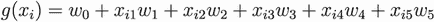

如果第三个特征缺失，并且我们用零填充它，*x*[i 3] 就变成了零：

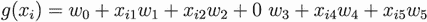

在这个例子中，无论这个特征的权重 *w*[3] 如何，乘积 *x*[i 3]*w*[3] 总是会是零。换句话说，这个特征对最终预测没有任何贡献，我们将只基于没有缺失的特征进行预测：

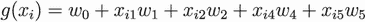

现在我们需要将这个 DataFrame 转换为一个 NumPy 数组。最简单的方法是使用它的 `values` 属性：

```
X_train = df_num.values
```

`X_train` 是一个矩阵——一个二维的 NumPy 数组。它是我们可以将它作为输入传递给 `linear_regresson` 函数的东西。让我们称它为

```
w_0, w = train_linear_regression(X_train, y_train)
```

我们刚刚训练了第一个模型！现在我们可以将其应用于训练数据以查看其预测效果：

```
y_pred = w_0 + X_train.dot(w)
```

为了看到预测有多好，我们可以使用`histplot`——这是 Seaborn 中用于绘制直方图的函数，我们之前已经使用过——来绘制预测值并与实际价格进行比较：

```
sns.histplot(y_pred, label='prediction')
sns.histplot(y_train, label='target')
plt.legend()
```

从图表（图 2.14）中我们可以看到，我们预测的值的分布与实际值看起来相当不同。这个结果可能表明，模型没有足够的能力来捕捉目标变量的分布。这对我们来说不应该是个惊喜：我们使用的模型相当基础，只包括五个非常简单的特征。

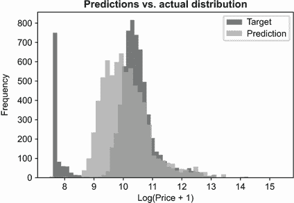

图 2.14 预测值（浅灰色）和实际值（深灰色）的分布。我们看到我们的预测并不很好；它们与实际分布差异很大。

### 2.4.2 RMSE：评估模型质量

观察图表并比较实际目标变量的分布与预测的分布是评估质量的好方法，但我们在每次更改模型中的任何内容时都不能这样做。相反，我们需要使用一个量化模型质量的指标。我们可以使用许多指标来评估回归模型的表现。最常用的一种是*均方根误差*——简称 RMSE。

RMSE 告诉我们我们的模型犯的错误有多大。它是通过以下公式计算的：


让我们尝试理解这里发生了什么。首先，让我们看看总和内部。我们有

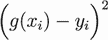

这是我们对观测的预测与该观测的实际目标值之间的差异（图 2.15）。

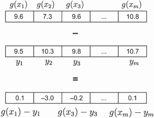

图 2.15 预测值 *g*(*x[i]*) 和实际值 *y[i]* 之间的差异

然后，我们使用差的平方，这给较大的差异赋予了更多的权重。例如，如果我们预测 9.5，而实际值是 9.6，差异是 0.1，所以它的平方是 0.01，相当小。但如果我们预测 7.3，而实际值是 10.3，差异是 3，差的平方是 9（图 2.16）。

这是 RMSE 中的 SE 部分（*平方误差*）。

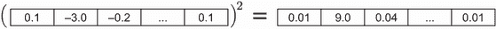

图 2.16 预测值和实际值之间差的平方。对于大的差异，平方相当大。

接下来，我们有一个总和：

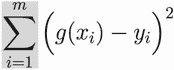

这个求和遍历所有*m*个观测值，并将所有平方误差（图 2.17）组合成一个单一的数字。

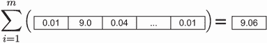

图 2.17 所有平方差之和是一个单一的数字。

如果我们将这个总和除以*m*，我们得到均方误差：


这就是我们的模型在平均意义上的平方误差——RMSE 中的 M 部分（*平均*），或*均方误差*（MSE）。MSE 本身也是一个很好的指标（图 2.18）。


图 2.18 MSE 是通过计算平方误差的平均值来计算的。

最后，我们计算其平方根：

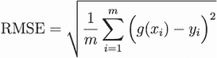

这是 RMSE 中的 R 部分（*根*）（图 2.19）。

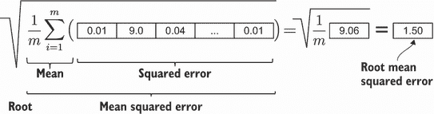

图 2.19 RMSE：我们首先计算均方误差（MSE），然后计算其平方根。

当使用 NumPy 实现 RMSE 时，我们可以利用*向量化*：将相同的操作应用于一个或多个 NumPy 数组中所有元素的过程。使用向量化可以获得多个好处。首先，代码更加简洁：我们不需要编写任何循环来对数组中的每个元素应用相同的操作。其次，向量化操作比简单的 Python 循环要快得多。

考虑以下实现。

列表 2.3 根均方误差的实现

```
def rmse(y, y_pred):
    error = y_pred - y            ❶
    mse = (error ** 2).mean()     ❷
    return np.sqrt(mse)           ❸
```

❶ 计算预测值与目标之间的差异

❷ 计算 MSE：首先计算平方误差，然后计算其平均值

❸ 计算平方根以获得 RMSE

在❶中，我们计算预测向量与目标变量向量之间的逐元素差异。结果是包含差异的新 NumPy 数组`error`。在❷中，我们在一行中执行两个操作：计算`error`数组中每个元素的平方，然后计算结果的平均值，这给我们 MSE。在❸中，我们计算平方根以获得 RMSE。

NumPy 和 Pandas 中的逐元素操作非常方便。我们可以对整个 NumPy 数组（或 Pandas 序列）应用操作，而无需编写循环。

例如，在我们的`rmse`函数的第一行中，我们计算预测值与实际价格之间的差异：

```
error = y_pred - y
```

这里发生的情况是，对于`y_pred`的每个元素，我们减去相应的`y`元素，然后将结果放入新的数组`error`（图 2.20）。

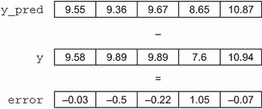

图 2.20 `y_pred`和`y`之间的逐元素差异。结果写入`error`数组。

接下来，我们计算`error`数组中每个元素的平方，然后计算其平均值以获得我们模型的均方误差（图 2.21）。

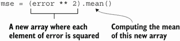

图 2.21 计算 MSE，我们首先计算误差数组中每个元素的平方，然后计算结果的平均值。

要确切了解发生了什么，我们需要知道幂运算符（**）也是逐元素应用的，因此结果是另一个数组，其中原始数组的所有元素都被平方。当我们有这个包含平方元素的新的数组时，我们只需使用`mean()`方法计算其平均值（图 2.22）。

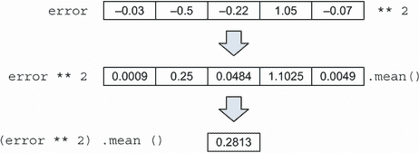

图 2.22 功运算符（**）逐元素应用于误差数组。结果是另一个数组，其中每个元素都是平方的。然后我们计算平方误差数组的平均值以计算 MSE。

最后，我们计算平均值平方根以获得 RMSE：

```
np.sqrt(mse)
```

现在我们可以使用 RMSE 来评估模型的质量：

```
rmse(y_train, y_pred)
```

代码打印出 0.75。这个数字告诉我们，平均而言，模型的预测偏差为 0.75。这个结果本身可能不是非常有用，但我们可以用它来比较这个模型与其他模型。如果一个模型的 RMSE（均方根误差）比另一个模型更好（更低），这表明该模型更好。

### 2.4.3 验证模型

在上一节的例子中，我们在训练集上计算了 RMSE。这个结果是有用的，但它并不反映模型将如何被使用。模型将被用来预测它之前没有见过的汽车价格。为此目的，我们留出了一部分验证数据集。我们故意不使用它进行训练，而是保留它来验证模型。

我们已经将数据分成多个部分：`df_train`、`df_val`和`df_test`。我们还从`df_train`创建了一个矩阵`X_train`，并使用`X_train`和`y_train`来训练模型。现在我们需要执行相同的步骤来获取`X_val`——一个从验证数据集计算出的特征矩阵。然后我们可以将模型应用于`X_val`以获取预测结果，并将其与`y_val`进行比较。

首先，我们创建`X_val`矩阵，遵循与`X_train`相同的步骤：

```
df_num = df_val[base]
df_num = df_num.fillna(0)
X_val = df_num.values
```

我们已经准备好将模型应用于`X_val`以获取预测结果：

```
y_pred = w_0 + X_val.dot(w)
```

`y_pred`数组包含验证数据集的预测结果。现在我们使用`y_pred`并将其与`y_val`中的实际价格进行比较，使用我们之前实现的 RMSE 函数：

```
rmse(y_val, y_pred)
```

这段代码打印的值是 0.76，这是我们用于比较模型的数字。

在之前的代码中，我们已经看到了一些重复：训练和验证测试需要相同的预处理，我们重复编写了相同的代码。因此，将此逻辑移动到单独的函数中并避免代码重复是有意义的。

我们可以称这个函数为`prepare_X`，因为它从一个 DataFrame 创建了一个矩阵`X`。

列表 2.4 将 DataFrame 转换为矩阵的`prepare_X`函数

```
def prepare_X(df):
    df_num = df[base]
    df_num = df_num.fillna(0)
    X = df_num.values
    return X
```

现在，整个训练和评估过程变得更简单，看起来像这样：

```
X_train = prepare_X(df_train)                        ❶
w_0, w = train_linear_regression(X_train, y_train)   ❶

X_val = prepare_X(df_val)                            ❷
y_pred = w_0 + X_val.dot(w)                          ❷
print('validation:', rmse(y_val, y_pred))            ❸
```

❶ 训练模型

❷ 将模型应用于验证数据集

❸ 在验证数据上计算 RMSE

这为我们提供了一种检查任何模型调整是否会导致模型预测质量改进的方法。作为下一步，让我们添加更多特征并检查它是否得到更低的 RMSE 分数。

### 2.4.4 简单特征工程

我们已经有一个具有简单特征的简单基线模型。为了进一步提高我们的模型，我们可以向模型添加更多特征：我们创建其他特征并将它们添加到现有特征中。正如我们已经知道的，这个过程被称为*特征工程*。

由于我们已经设置了验证框架，我们可以轻松地验证添加新特征是否提高了模型的质量。我们的目标是提高在验证数据上计算的 RMSE。

首先，我们从特征“年份”创建一个新的特征，“年龄”。一辆车的年龄在预测其价格时应该非常有帮助：直观地讲，车越新，价格应该越贵。

因为数据集是在 2017 年创建的（我们可以通过检查`df_train.year.max()`来验证），我们可以通过从 2017 年减去汽车制造的年份来计算年龄：

```
df_train['age'] = 2017 - df_train.year
```

这个操作是一个逐元素操作。我们计算 2017 年与年序列中每个元素的差值。结果是包含差值的新 Pandas 序列，我们将它写回 dataframe 作为年龄列。

我们已经知道我们需要将相同的预处理应用两次：训练集和验证集。因为我们不希望多次重复特征提取代码，所以让我们将这个逻辑放入`prepare_X`函数中。

列表 2.5 在`prepare_X`函数中创建年龄特征

```
def prepare_X(df):
    df = df.copy()                ❶
    features = base.copy()        ❷

    df['age'] = 2017 - df.year    ❸
    features.append('age')        ❹

    df_num = df[features]
    df_num = df_num.fillna(0)
    X = df_num.values
    return X
```

❶ 创建输入参数的副本以防止副作用

❷ 创建包含基本特征的基列表的副本

❸ 计算年龄特征

❹ 将年龄添加到我们用于模型的特征名称列表中

这次我们实现函数的方式与之前的版本略有不同。让我们看看这些差异。首先，在❶中，我们创建了一个传入函数的 DataFrame `df`的副本。在代码的后面部分，我们通过添加额外的行来修改`df` ❸。这种行为被称为*副作用*：函数的调用者可能不会期望函数会改变 DataFrame。为了避免不愉快的惊喜，我们改而修改原始 DataFrame 的副本。在❷中，我们出于同样的原因创建了一个包含基本特征的列表的副本。稍后，我们通过添加新特征 ❹ 扩展这个列表，但我们不希望改变原始列表。其余的代码与之前相同。

让我们测试添加“年龄”特征是否会导致任何改进：

```
X_train = prepare_X(df_train)
w_0, w = train_linear_regression(X_train, y_train)

X_val = prepare_X(df_val)
y_pred = w_0 + X_val.dot(w)
print('validation:', rmse(y_val, y_pred))
```

代码打印

```
validation: 0.517
```

验证错误是 0.517，这比基线解决方案中的 0.76 有很好的改进。因此，我们得出结论，添加“年龄”确实有助于进行预测。

我们还可以查看预测值的分布：

```
sns.histplot(y_pred, label='prediction')
sns.histplot(y_val, label='target')
plt.legend()
```

我们看到（图 2.23），预测值的分布比之前更接近目标分布。确实，验证 RMSE 分数证实了这一点。

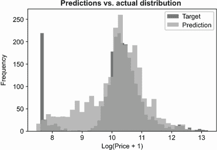

图 2.23 预测值（浅灰色）与实际值（深灰色）的分布。有了新特征，模型比之前更接近原始分布。

### 2.4.5 处理分类变量

我们看到添加“年龄”对模型非常有帮助。让我们继续添加更多特征。我们可以使用的下一个列之一是门数。这个变量看起来是数值的，可以取三个值：2、3 和 4 扇门。尽管直接将变量放入模型很有吸引力，但这实际上并不是一个数值变量：我们不能说增加一扇门，汽车的价格就会增长（或下降）一定的金额。相反，这个变量是分类的。

*分类变量*描述了对象的特征，可以取几个可能的值之一。汽车的品牌是一个分类变量；例如，它可以是丰田、宝马、福特或任何其他品牌。通过其值很容易识别分类变量，这些值通常是字符串而不是数字。然而，情况并不总是这样。例如，门数是分类的：它只能取三个可能的值（2、3 和 4）。

我们可以用多种方式在机器学习模型中使用分类变量。其中一种最简单的方法是将这样的变量通过一组二元特征进行编码，每个不同的值都有一个单独的特征。

在我们的情况下，我们将创建三个二元特征：`num_doors_2`、`num_doors_3`和`num_doors_4`。如果汽车有两扇门，`num_doors_2`将被设置为 1，其余的将被设置为 0。如果汽车有三扇门，`num_doors_3`将获得值 1，对`num_doors_4`也是如此。

这种对分类变量进行编码的方法被称为*独热编码*。我们将在第三章中更深入地了解这种编码分类变量的方法。现在，让我们选择最简单的方式来执行这种编码：遍历可能的值（2、3 和 4），并对每个值进行检查，看观察值的值是否与之匹配。

让我们将这些行添加到`prepare_X`函数中：

```
for v in [2, 3, 4]:                                     ❶
    feature = 'num_doors_%s' % v                        ❷
    value = (df['number_of_doors'] == v).astype(int)    ❸
    df[feature] = value                                 ❹
    features.append(feature)
```

❶ 遍历“门数”变量的可能值

❷ 为特征赋予一个有意义的名称，例如，对于`v=2`使用“num_doors_2”

❸ 创建独热编码特征

❹ 使用❷中的名称将特征添加回数据框

这段代码可能难以理解，所以让我们更仔细地看看这里发生了什么。最困难的一行是❸：

```
(df['number_of_doors'] == v).astype(int)
```

这里发生了两件事。第一件事是括号内的表达式，我们使用了等于（==）运算符。这种操作也是一种元素级操作，就像我们在计算 RMSE 时之前使用的那样。在这种情况下，操作创建了一个新的 Pandas 系列。如果原始系列中的元素等于`v`，则结果中的对应元素为 True；否则，元素为 False。该操作创建了一个 True/False 值的系列。因为`v`有三个值（2、3 和 4），并且我们将此操作应用于`v`的每个值，因此我们创建了三个系列（图 2.24）。

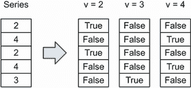

图 2.24 我们使用==运算符从原始系列中创建新的系列：一个用于两扇门，一个用于三扇门，一个用于四扇门。

接下来，我们将布尔序列转换为整数，使得 True 变为 1，False 变为 0，这可以通过 `astype(int)` 方法轻松完成（图 2.25）。现在我们可以将结果用作特征，并将它们放入线性回归中。


图 2.25 使用 `astype(int)` 将具有布尔值的序列转换为整数

车门数量，正如我们讨论的，是一个分类变量，看起来像是数值变量，因为其值是整数（2、3 和 4）。数据集中我们拥有的所有其他分类变量都是字符串。

我们可以使用相同的方法来编码其他分类变量。让我们从 `make` 开始。为了我们的目的，获取和使用最频繁出现的值就足够了。让我们找出五个最频繁出现的值：

```
df['make'].value_counts().head(5)
```

代码打印

```
chevrolet     1123
ford           881
volkswagen     809
toyota         746
dodge          626
```

我们将这些值取出来，并像编码车门数量一样编码 `make`。

接下来，我们创建五个新变量，分别命名为 `is_make_chevrolet`、`is_make_ford`、`is_` `make_volkswagen`、`is_make_toyota` 和 `is_make_dodge`：

```
for v in ['chevrolet', 'ford', 'volkswagen', 'toyota', 'dodge']:
    feature = 'is_make_%s' % v
    df[feature] = (df['make'] == v).astype(int)
    features.append(feature)
```

现在，整个 `prepare_X` 应该看起来像以下这样。

列表 2.6 处理分类变量 `number` `of` `doors` 和 `make`

```
def prepare_X(df):
    df = df.copy()
    features = base.copy()

    df['age'] = 2017 - df.year
    features.append('age')

    for v in [2, 3, 4]:                                                ❶
        feature = 'num_doors_%s' % v
        df[feature] = (df['number_of_doors'] == v).astype(int)
        features.append(feature)

    for v in ['chevrolet', 'ford', 'volkswagen', 'toyota', 'dodge']:   ❷
        feature = 'is_make_%s' % v
        df[feature] = (df['make'] == v).astype(int)
        features.append(feature)
    df_num = df[features]
    df_num = df_num.fillna(0)
    X = df_num.values
    return X
```

❶ 编码车门数量变量

❷ 编码 `make` 变量

让我们检查这段代码是否提高了模型的 RMSE：

```
X_train = prepare_X(df_train)
w_0, w = train_linear_regression(X_train, y_train)

X_val = prepare_X(df_val)
y_pred = w_0 + X_val.dot(w)
print('validation:', rmse(y_val, y_pred))
```

代码打印

```
validation: 0.507
```

之前的值是 0.517，所以我们成功进一步提高了 RMSE 分数。

我们可以使用更多变量：`engine_fuel_type`、`transmission_type`、`driven_` `wheels`、`market_category`、`vehicle_size` 和 `vehicle_style`。让我们对它们做同样的事情。修改后，`prepare_X` 开始看起来更复杂一些。

列表 2.7 在 `prepare_X` 函数中处理更多分类变量

```
def prepare_X(df):
    df = df.copy()
    features = base.copy()

    df['age'] = 2017 - df.year
    features.append('age')

    for v in [2, 3, 4]:
        feature = 'num_doors_%s' % v
        df[feature] = (df['number_of_doors'] == v).astype(int)
        features.append(feature)

    for v in ['chevrolet', 'ford', 'volkswagen', 'toyota', 'dodge']:
        feature = 'is_make_%s' % v
        df[feature] = (df['make'] == v).astype(int)
        features.append(feature)

    for v in ['regular_unleaded', 'premium_unleaded_(required)',
              'premium_unleaded_(recommended)',
              'flex-fuel_(unleaded/e85)']:                       ❶
        feature = 'is_type_%s' % v
        df[feature] = (df['engine_fuel_type'] == v).astype(int)
        features.append(feature)

    for v in ['automatic', 'manual', 'automated_manual']:        ❷
        feature = 'is_transmission_%s' % v
        df[feature] = (df['transmission_type'] == v).astype(int)
        features.append(feature)

    for v in ['front_wheel_drive', 'rear_wheel_drive',
              'all_wheel_drive', 'four_wheel_drive']:            ❸
        feature = 'is_driven_wheels_%s' % v
        df[feature] = (df['driven_wheels'] == v).astype(int)
        features.append(feature)

    for v in ['crossover', 'flex_fuel', 'luxury',
              'luxury,performance', 'hatchback']:                ❹
        feature = 'is_mc_%s' % v
        df[feature] = (df['market_category'] == v).astype(int)
        features.append(feature)

    for v in ['compact', 'midsize', 'large']:                    ❺
        feature = 'is_size_%s' % v
        df[feature] = (df['vehicle_size'] == v).astype(int)
        features.append(feature)

    for v in ['sedan', '4dr_suv', 'coupe', 'convertible',
              '4dr_hatchback']:                                  ❻
        feature = 'is_style_%s' % v
        df[feature] = (df['vehicle_style'] == v).astype(int)
        features.append(feature)
    df_num = df[features]
    df_num = df_num.fillna(0)
    X = df_num.values
    return X
```

❶ 编码类型变量

❷ 编码变速器变量

❸ 编码驱动轮数量

❹ 编码市场类别

❺ 编码大小

❻ 编码风格

让我们测试一下：

```
X_train = prepare_X(df_train)
w_0, w = train_linear_regression(X_train, y_train)

X_val = prepare_X(df_val)
y_pred = w_0 + X_val.dot(w)
print('validation:', rmse(y_val, y_pred))
```

我们看到的结果比之前差得多。我们得到 34.2，这比之前的 0.5 多得多。

注意：你得到的结果可能因 Python 版本、NumPy 版本、NumPy 依赖项的版本、操作系统和其他因素而异。但从 0.5 到显著更大的验证指标跳跃应该总是提醒我们。

新特征不仅没有帮助，反而使分数变得更差。幸运的是，我们有验证来帮助我们发现问题。在下一节中，我们将看到为什么会发生这种情况以及如何处理它。

### 2.4.6 正则化

我们看到添加新特征并不总是有帮助，在我们的例子中，它使事情变得更糟。这种行为的原因是数值不稳定性。回想一下正则方程的公式：


方程中的一个项是 *X^TX* 矩阵的逆：

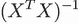

在我们的情况下，问题是矩阵的求逆。有时，当我们向 *X* 添加新列时，我们可能会不小心添加一个由其他列组合而成的列。例如，如果我们已经有了城市中的 MPG 特征，并决定添加城市中的每升公里数，第二个特征与第一个特征相同，但乘以一个常数。

当这种情况发生时，*X^TX* 变得 *不定* 或 *奇异*，这意味着无法找到这个矩阵的逆。如果我们尝试求一个奇异矩阵的逆，NumPy 将通过引发一个 `LinAlgError` 来告诉我们：

```
LinAlgError: Singular matrix
```

我们的代码没有引发任何异常，然而这种情况发生是因为我们通常没有那些完美线性组合其他列的列。真实数据往往很嘈杂，存在测量误差（例如，将 MPG 记录为 1.3 而不是 13），舍入误差（例如，存储 0.0999999 而不是 0.1），以及许多其他错误。从技术上讲，这样的矩阵不是奇异的，所以 NumPy 不会报错。

然而，由于这个原因，权重中的某些值变得极其大——比它们应有的值大得多。

如果我们查看我们的 *w*[0] 和 *w* 的值，我们会看到这确实如此。例如，偏差项 *w*[0] 的值为 5788519290303866.0（这个值可能取决于机器、操作系统和 NumPy 的版本），*w* 的一些分量也有极其大的负值。

在数值线性代数中，这类问题被称为 *数值不稳定性问题*，通常通过正则化技术来解决。正则化的目的是通过强制矩阵可逆来确保其逆的存在。正则化是机器学习中的一个重要概念：它意味着“控制”——控制模型的权重，使它们表现正确，并且不会变得过大，就像我们案例中那样。

正则化的一种方法是在矩阵的每个对角元素上添加一个很小的数。然后我们得到以下线性回归的公式：


备注：正则化线性回归通常被称为 *岭回归*。许多库，包括 Scikit-learn，使用 *ridge* 来指代正则化线性回归，而 *线性回归* 则指未正则化的模型。

让我们看看变化的部分：我们需要求逆的矩阵。它看起来是这样的：


这个公式说明我们需要 *I*——一个 *单位矩阵*，这是一个对角线上的元素为 1，其他地方为 0 的矩阵。我们将这个单位矩阵乘以一个数 *α*。这样，*I* 对角线上的所有 1 都变成了 *α*。然后我们求 *α**I* 和 *X^TX* 的和，这会将 *α* 添加到 *X^TX* 的所有对角元素上。

这个公式可以直接转换为 NumPy 代码：

```
XTX = X_train.T.dot(X_train)
XTX = XTX + 0.01 * np.eye(XTX.shape[0])
```

`np.eye`函数创建一个二维 NumPy 数组，它也是一个单位矩阵。当我们乘以 0.01 时，对角线上的 1 变成了 0.01，因此当我们把这个矩阵加到`XTX`上时，我们只向它的主对角线添加了 0.01（图 2.26）。


(A) NumPy 中的 eye 函数创建一个单位矩阵。


(B) 当我们将单位矩阵乘以一个数时，这个数会出现在结果的主对角线上。


(C) 将乘以 0.01 的单位矩阵加到另一个矩阵上的效果与将该数加到该矩阵的主对角线上的效果相同。

图 2.26 使用单位矩阵向正方形矩阵的主对角线添加 0.01

让我们创建一个新的函数，它使用这个想法并实现带正则化的线性回归。

列表 2.8 带正则化的线性回归

```
def train_linear_regression_reg(X, y, r=0.0):   ❶
    ones = np.ones(X.shape[0])
    X = np.column_stack([ones, X])

    XTX = X.T.dot(X)
    reg = r * np.eye(XTX.shape[0])              ❷
    XTX = XTX + reg                             ❷
    XTX_inv = np.linalg.inv(XTX)
    w = XTX_inv.dot(X.T).dot(y)

    return w[0], w[1:]
```

❶ 通过使用参数 r 来控制正则化的程度

❷ 将 r 加到 XTX 的主对角线上

该函数与线性回归非常相似，但有几行是不同的。首先，有一个额外的参数`r`，它控制正则化的程度——这对应于我们添加到`X^TX`主对角线上的公式中的数*α*。

正则化通过使`w`的分量更小来影响最终解。我们可以看到，添加的正则化越多，权重就越小。

让我们检查不同`r`值下的权重会发生什么：

```
for r in [0, 0.001, 0.01, 0.1, 1, 10]:
    w_0, w = train_linear_regression_reg(X_train, y_train, r=r)
    print('%5s, %.2f, %.2f, %.2f' % (r, w_0, w[13], w[21]))
```

代码打印

```
   0, 5788519290303866.00, -9.26, -5788519290303548.00
0.001, 7.20, -0.10, 1.81
 0.01, 7.18, -0.10, 1.81
  0.1, 7.05, -0.10, 1.78
    1, 6.22, -0.10, 1.56
   10, 4.39, -0.09, 1.08
```

我们从 0 开始，这是一个无正则化解，得到非常大的数字。然后我们尝试 0.001，并将它增加 10 倍：0.01、0.1、1 和 10。我们看到，随着`r`的增长，我们选择的值变得越小。

现在我们检查正则化是否有助于我们的问题，以及添加正则化后我们得到的 RMSE 是多少。让我们用 r=0.001 运行它：

```
X_train = prepare_X(df_train)
w_0, w = train_linear_regression_reg(X_train, y_train, r=0.001)

X_val = prepare_X(df_val)
y_pred = w_0 + X_val.dot(w)
print('validation:', rmse(y_val, y_pred))
```

代码打印

```
Validation: 0.460
```

这个结果比之前的分数有所改进：0.507。

注意：有时，当添加新功能导致性能下降时，简单地移除此功能可能就足以解决问题。拥有验证数据集对于决定是否添加正则化、移除特征或两者都做非常重要：我们使用验证数据上的分数来选择最佳选项。在我们特定的案例中，我们发现添加正则化有帮助：它提高了我们之前的分数。

我们尝试使用`r`=0.001，但也应该尝试其他值。让我们尝试几个不同的值来选择最佳参数`r`：

```
X_train = prepare_X(df_train)
X_val = prepare_X(df_val)

for r in [0.000001, 0.0001, 0.001, 0.01, 0.1, 1, 5, 10]:
    w_0, w = train_linear_regression_reg(X_train, y_train, r=r)
    y_pred = w_0 + X_val.dot(w)
    print('%6s' %r, rmse(y_val, y_pred))
```

我们看到，较小的`r`可以实现最佳性能：

```
 1e-06 0.460225
0.0001 0.460225
 0.001 0.460226
  0.01 0.460239
   0.1 0.460370
     1 0.461829
     5 0.468407
    10 0.475724
```

我们还注意到，对于小于 0.1 的值，性能变化不大，除了第六位数字，我们不应该认为它具有显著性。

让我们将`r`=0.01 的模型作为最终模型。现在我们可以将其与测试数据集进行比较，以验证模型是否有效：

```
X_train = prepare_X(df_train)
w_0, w = train_linear_regression_reg(X_train, y_train, r=0.01)

X_val = prepare_X(df_val)
y_pred = w_0 + X_val.dot(w)
print('validation:', rmse(y_val, y_pred))

X_test = prepare_X(df_test)
y_pred = w_0 + X_test.dot(w)
print('test:', rmse(y_test, y_pred))
```

代码打印

```
validation: 0.460
test: 0.457
```

因为这两个数字非常接近，我们得出结论，该模型可以很好地泛化到新的未见数据。

练习 2.4

正则化是必需的，因为

a) 它可以控制模型的权重，不让它们增长过大。

b) 现实世界的数据是有噪声的。

c) 我们经常遇到数值不稳定性问题。

有多个可能的答案。

### 2.4.7 使用模型

因为我们现在有一个模型，我们可以开始用它来预测汽车的价格。

假设一个用户在我们的网站上发布了以下广告：

```
ad = {
    'city_mpg': 18,
    'driven_wheels': 'all_wheel_drive',
    'engine_cylinders': 6.0,
    'engine_fuel_type': 'regular_unleaded',
    'engine_hp': 268.0,
    'highway_mpg': 25,
    'make': 'toyota',
    'market_category': 'crossover,performance',
    'model': 'venza',
    'number_of_doors': 4.0,
    'popularity': 2031,
    'transmission_type': 'automatic',
    'vehicle_size': 'midsize',
    'vehicle_style': 'wagon',
    'year': 2013
}
```

我们想建议这辆车的价格。为此，我们使用我们的模型：

```
df_test = pd.DataFrame([ad])
X_test = prepare_X(df_test)
```

首先，我们创建一个包含一行的小型数据框。这一行包含我们之前创建的`ad`字典中的所有值。接下来，我们将这个数据框转换为矩阵。

现在我们可以将我们的模型应用于矩阵来预测这辆车的价格：

```
y_pred = w_0 + X_test.dot(w)
```

然而，这个预测不是最终价格；它是价格的对数。为了得到实际价格，我们需要取消对数并应用指数函数：

```
suggestion = np.expm1(y_pred)
suggestion
```

输出是 28,294.13。这辆车的实际价格是 $31,120，所以我们的模型离实际价格不远。

## 2.5 下一步

### 2.5.1 练习

你可以尝试以下方法来提高模型：

+   *编写一个二进制编码的函数。* 在本章中，我们手动实现了类别编码：我们查看前五个值，将它们写入一个列表，然后遍历列表以创建二进制特征。这样做很麻烦，这就是为什么编写一个自动执行此操作的函数是个好主意。这个函数应该有多个参数：数据框、类别变量的名称以及它应该考虑的最频繁值数量。这个函数还应该帮助我们完成之前的练习。

+   *尝试更多的特征工程。* 在实现类别编码时，我们只包括了每个类别变量前五个值。在编码过程中包括更多值可能会提高模型。尝试这样做，并重新评估模型的 RMSE 质量。

### 2.5.2 其他项目

现在你可以做其他一些项目：

+   预测房屋的价格。你可以从 [`www.kaggle.com/dgomonov/new-york-city-airbnb-open-data`](https://www.kaggle.com/dgomonov/new-york-city-airbnb-open-data) 获取纽约市 Airbnb 开放数据集，或者从 [`scikit-learn.org/stable/modules/ generated/sklearn.datasets.fetch_california_housing.html`](https://scikit-learn.org/stable/modules/generated/sklearn.datasets.fetch_california_housing.html) 获取加利福尼亚住房数据集。

+   检查其他数据集，例如 [`archive.ics.uci.edu/ml/datasets.php?task =reg`](https://archive.ics.uci.edu/ml/datasets.php?task=reg)，它们有数值目标值。例如，我们可以使用学生表现数据集（[`archive.ics.uci.edu/ml/datasets/ Student+Performance`](http://archive.ics.uci.edu/ml/datasets/Student+Performance)）中的数据来训练一个模型，以确定学生的表现。

## 摘要

+   进行简单的初步探索性分析非常重要。其中之一是帮助我们找出数据是否有缺失值。当存在缺失值时，无法训练线性回归模型，因此检查我们的数据并在必要时填充缺失值非常重要。

+   作为探索性数据分析的一部分，我们需要检查目标变量的分布。如果目标分布有一个长尾，我们需要应用对数变换。没有它，我们可能会从线性回归模型中得到不准确和误导性的预测。

+   训练/验证/测试数据划分是检查我们模型的最佳方式。它为我们提供了一种可靠地衡量模型性能的方法，并且像数值不稳定性等问题不会被人忽视。

+   线性回归模型基于一个简单的数学公式，理解这个公式是成功应用模型的关键。了解这些细节有助于我们在编码之前了解模型的工作原理。

+   使用 Python 和 NumPy 从头实现线性回归并不困难。这样做有助于我们理解机器学习背后没有魔法：它只是简单的数学转换成代码。

+   RMSE 为我们提供了一种衡量模型在验证集上的预测性能的方法。它让我们确认模型是好的，并帮助我们比较多个模型以找到最佳模型。

+   特征工程是创建新特征的过程。添加新特征对于提高模型性能很重要。在添加新特征时，我们始终需要使用验证集来确保我们的模型确实得到了改进。没有持续的监控，我们可能会得到平庸或非常糟糕的性能。

+   有时，我们会遇到可以通过正则化解决的问题数值不稳定性问题。有一个好的方法来验证模型对于在问题变得太晚之前发现问题至关重要。

+   模型训练和验证后，我们可以用它来做出预测，例如将其应用于价格未知的汽车，以估计它们可能的价值。

在第三章中，我们将学习如何使用机器学习进行分类，使用逻辑回归来预测客户流失。

## 练习答案

+   练习 2.1 B) 值分布远离头部。

+   练习 2.2 A) *x[i]* 是一个特征向量，*y[i]* 是价格的对数。

+   练习 2.3 B) 一个包含价格预测的向量 *y*。

+   练习 2.4 A)，B），C）所有三个答案都是正确的。
