# 3 机器学习用于分类

本章涵盖

+   执行探索性数据分析以识别重要特征

+   将分类变量编码以在机器学习模型中使用

+   使用逻辑回归进行分类

在本章中，我们将使用机器学习来预测客户流失。

*客户流失*是指客户停止使用公司的服务。因此，客户流失预测就是识别那些可能很快取消合同的客户。如果公司能够做到这一点，它就可以通过提供折扣来努力留住用户。

自然地，我们可以使用机器学习来做到这一点：我们可以使用关于流失客户的过去数据，并根据这些数据创建一个模型来识别即将离开的当前客户。这是一个二元分类问题。我们想要预测的目标变量是分类变量，并且只有两种可能的结果：流失或未流失。

在第一章中，我们了解到存在许多监督机器学习模型，我们特别提到了可以用于二元分类的模型，包括逻辑回归、决策树和神经网络。在本章中，我们从最简单的一个开始：逻辑回归。尽管它确实是最简单的，但它仍然非常强大，并且与其他模型相比具有许多优势：它速度快，易于理解，其结果易于解释。它是机器学习中的工作马，也是工业界最广泛使用的模型。

## 3.1 客户流失预测项目

我们为本章准备的项目是电信公司的客户流失预测。我们将使用逻辑回归和 Scikit-learn 来完成这个项目。

想象一下，我们正在一家提供电话和互联网服务的电信公司工作，我们遇到了一个问题：一些客户开始流失。他们不再使用我们的服务，转而去了其他供应商。我们希望阻止这种情况发生，因此我们开发了一个系统来识别这些客户，并给予他们留存的激励。我们希望通过促销信息来吸引他们，并给予他们折扣。我们还希望了解模型为什么认为我们的客户会流失，为此，我们需要能够解释模型的预测结果。

我们收集了一个数据集，其中记录了一些关于我们客户的信息：他们使用了什么类型的服务，他们支付了多少钱，以及他们与我们在一起的时间有多长。我们还知道谁取消了他们的合同并停止使用我们的服务（流失）。我们将使用这些信息作为机器学习模型的目标变量，并使用所有其他可用信息来预测它。

项目的计划如下：

1.  首先，我们下载数据集并进行一些初步准备：重命名列并更改列内的值，以确保整个数据集的一致性。

1.  然后我们将数据分为训练集、验证集和测试集，以便我们可以验证我们的模型。

1.  作为初步数据分析的一部分，我们查看特征重要性以确定哪些特征在我们的数据中很重要。

1.  我们将分类变量转换为数值变量，以便在模型中使用它们。

1.  最后，我们训练一个逻辑回归模型。

在上一章中，我们完全是自己实现的，使用了 Python 和 NumPy。然而，在这个项目中，我们将开始使用 Scikit-learn，这是一个用于机器学习的 Python 库。具体来说，我们将用它来

+   将数据集分为训练集和测试集

+   对分类变量进行编码

+   训练逻辑回归

### 3.1.1 Telco churn 数据集

如前一章所述，我们将使用 Kaggle 数据集进行数据。这次我们将使用来自 [`www.kaggle.com/blastchar/telco-customer-churn`](https://www.kaggle.com/blastchar/telco-customer-churn) 的数据。

根据描述，这个数据集包含以下信息：

+   客户服务：电话；多线；互联网；技术支持和额外服务，如在线安全、备份、设备保护和电视流媒体

+   账户信息：他们作为客户的时间长度、合同类型、支付方式类型

+   费用：客户在过去一个月和总计中被收取的费用

+   人口统计信息：性别、年龄以及他们是否有子女或伴侣

+   演退：是/否，客户在过去一个月内是否离开了公司

首先，我们下载数据集。为了保持整洁，我们首先创建一个文件夹，chapter-03-churn-prediction。然后我们进入那个目录，并使用 Kaggle CLI 下载数据：

```
kaggle datasets download -d blastchar/telco-customer-churn
```

下载后，我们解压缩存档以从那里获取 CSV 文件：

```
unzip telco-customer-churn.zip 
```

我们现在可以开始了。

### 3.1.2 初始数据准备

第一步是创建一个新的 Jupyter 笔记本。如果它没有运行，请启动它：

```
jupyter notebook
```

我们将笔记本章节命名为 chapter-03-churn-project（或我们喜欢的任何其他名称）。

如前所述，我们首先添加常用的导入：

```
import pandas as pd
import numpy as np

import seaborn as sns
from matplotlib import pyplot as plt
%matplotlib inline
```

现在我们可以读取数据集：

```
df = pd.read_csv('WA_Fn-UseC_-Telco-Customer-Churn.csv')
```

我们使用 `read_csv` 函数读取数据，然后将结果写入名为 `df` 的数据框。为了查看它包含多少行，让我们使用 `len` 函数：

```
len(df)
```

它打印出 7043，所以这个数据集有 7,043 行。数据集不大，但应该足以训练一个不错的模型。

接下来，让我们使用 `df.head()` 查看前几行（图 3.1）。默认情况下，它显示数据框的前五行。

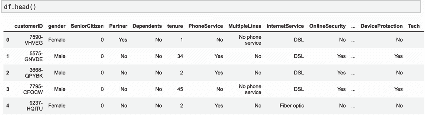

图 3.1 `df.head()` 命令的输出，显示了 telco churn 数据集的前五行

这个数据框有相当多的列，所以它们都不适合在屏幕上显示。相反，我们可以使用 `T` 函数转置数据框，交换列和行，使得列（如 customerID、性别等）变成行。这样我们就可以看到更多的数据（图 3.2）：

```
df.head().T
```

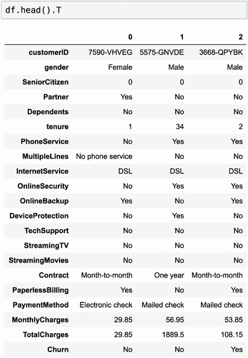

图 3.2 `df.head().T` 命令的输出，显示了电信客户流失数据集的前三行。原始行以列的形式显示：这样，可以查看更多数据，而无需使用滑块。

我们看到数据集有几个列：

+   CustomerID: 客户 ID

+   Gender: 男性/女性

+   SeniorCitizen: 客户是否为老年人（0/1）

+   Partner: 是否与伴侣同住（是/否）

+   Dependents: 是否有受抚养人（是/否）

+   Tenure: 自合同开始以来的月份数

+   PhoneService: 是否有电话服务（是/否）

+   MultipleLines: 是否有多个电话线路（是/否/无电话服务）

+   InternetService: 互联网服务类型（无/光纤/光纤）

+   OnlineSecurity: 如果启用了在线安全（是/否/无互联网）

+   OnlineBackup: 如果启用了在线备份服务（是/否/无互联网）

+   DeviceProtection: 如果启用了设备保护服务（是/否/无互联网）

+   TechSupport: 客户是否有技术支持（是/否/无互联网）

+   StreamingTV: 如果启用了电视流媒体服务（是/否/无互联网）

+   StreamingMovies: 如果启用了电影流媒体服务（是/否/无互联网）

+   Contract: 合同类型（每月/年度/两年）

+   PaperlessBilling: 如果账单是无纸化的（是/否）

+   PaymentMethod: 付款方式（电子支票、邮寄支票、银行转账、信用卡）

+   MonthlyCharges: 每月收费金额（数值）

+   TotalCharges: 总计收费金额（数值）

+   Churn: 如果客户已取消合同（是/否）

对我们来说最有趣的是 Churn。作为我们模型的目标变量，这是我们想要学习预测的内容。它有两个值：如果客户流失则为“是”，如果客户未流失则为“否”。

当读取 CSV 文件时，Pandas 会尝试自动确定每列的正确类型。然而，有时很难正确完成这项任务，推断出的类型并不是我们期望的。这就是为什么检查实际类型是否正确很重要的原因。让我们通过使用`df.dtypes`来查看它们： 

```
df.dtypes
```

我们看到（图 3.3）大多数类型都被正确推断。回想一下，对象表示字符串值，这是我们期望大多数列的内容。然而，我们可能注意到两件事。首先，SeniorCitizen 被检测为 int64，因此它具有整型类型，而不是对象。原因是，与其他列中的 yes 和 no 值不同，这里有的是 1 和 0 值，因此 Pandas 将其解释为整型列。这对我们来说并不是真正的问题，因此我们不需要为此列进行任何额外的预处理。

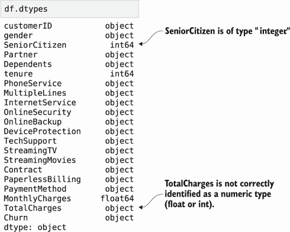

图 3.3 自动推断的数据框所有列的类型。对象表示字符串。TotalCharges 被错误地识别为“对象”，但它应该是“浮点数”。

另一点需要注意的是 TotalCharges 的类型。我们预计此列应该是数值类型：它包含客户被收取的总金额，因此应该是数字，而不是字符串。然而，Pandas 推断其类型为“对象”。原因是，在某些情况下，此列包含一个空格（“ ”）来表示缺失值。当遇到非数值字符时，Pandas 没有其他选择，只能将该列声明为“对象”。

重要提示：注意当你期望一个列是数值类型，但 Pandas 表示它不是的情况：最可能的原因是该列包含用于缺失值的特殊编码，这需要额外的预处理。

我们可以通过使用 Pandas 中的特殊函数 `to_numeric` 将此列强制转换为数值类型：通过将列转换为数字。默认情况下，此函数在遇到非数值数据（如空格）时会引发异常，但我们可以通过指定 `errors='coerce'` 选项来使其跳过这些情况。这样 Pandas 将所有非数值值替换为 `NaN`（不是一个数字）：

```
total_charges = pd.to_numeric(df.TotalCharges, errors='coerce')
```

为了确认数据确实包含非数值字符，我们现在可以使用 `total_charges` 的 `isnull()` 函数来引用 Pandas 无法解析原始字符串的所有行：

```
df[total_charges.isnull()][['customerID', 'TotalCharges']]
```

我们可以看到 TotalCharges 列中确实存在空格（图 3.4）。

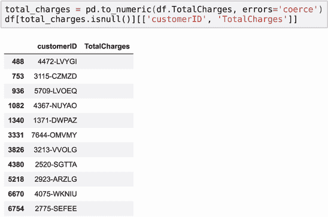

图 3.4 我们可以通过将内容解析为数值来检测列中的非数值数据，并查看解析失败的行。

现在取决于我们决定如何处理这些缺失值。尽管我们可以对它们做很多事情，但我们将做与上一章相同的事情——将缺失值设置为零：

```
df.TotalCharges = pd.to_numeric(df.TotalCharges, errors='coerce')
df.TotalCharges = df.TotalCharges.fillna(0)
```

此外，我们注意到列名不遵循相同的命名约定。其中一些以小写字母开头，而其他一些以大写字母开头，值中也有空格。

让我们通过将所有内容转换为小写并替换空格为下划线来使其统一。这样我们就消除了数据中的所有不一致性。我们使用与上一章完全相同的代码：

```
df.columns = df.columns.str.lower().str.replace(' ', '_')

string_columns = list(df.dtypes[df.dtypes == 'object'].index)

for col in string_columns:
    df[col] = df[col].str.lower().str.replace(' ', '_')
```

接下来，让我们看看我们的目标变量：`churn`。目前，它是分类的，有两个值，“是”和“否”（图 3.5A）。对于二元分类，所有模型通常都期望一个数字：0 代表“否”，1 代表“是”。让我们将其转换为数字：

```
df.churn = (df.churn == 'yes').astype(int)
```

当我们使用 `df.churn` `==` `'yes'` 时，我们创建了一个布尔类型的 Pandas 系列对象。如果原始系列中的位置是“是”，则该系列的位置等于 `True`，否则为 `False`。因为该系列只能取“否”这个值，所以“是”转换为 `True`，“否”转换为 `False`（图 3.5B）。当我们使用 `astype(int)` 函数进行类型转换时，将 `True` 转换为 1，将 `False` 转换为 0（图 3.5C）。这正是我们在上一章实现类别编码时使用的相同思路。

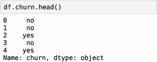

（A）原始的 Churn 列：它是一个只包含“是”和“否”值的 Pandas 系列对象。

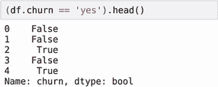

（B）比较运算符的结果：它是一个布尔序列，当原始序列的元素是“yes”时为 `True`，否则为 `False`。

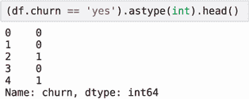

（C）将布尔序列转换为整数的结果：`True` 转换为 1，`False` 转换为 0。

图 3.5 表达式 `(df.churn == 'yes').astype(int)` 的逐个步骤分解

我们已经做了一些预处理，所以让我们留出一部分数据用于测试。在上一章中，我们实现了自己进行这一操作的代码。这对于理解其工作原理是很好的，但通常我们不需要每次都从头开始编写这些代码。相反，我们使用库中的现有实现。在本章中，我们使用 Scikit-learn，它有一个名为 `model_selection` 的模块可以处理数据分割。让我们使用它。

我们需要从 `model_selection` 中导入的函数叫做 `train_test_split`：

```
from sklearn.model_selection import train_test_split
```

导入后，就可以使用了：

```
df_train_full, df_test = train_test_split(df, test_size=0.2, random_state=1)
```

`train_test_split` 函数接受一个数据框 `df` 并创建两个新的数据框：`df_train_full` 和 `df_test`。它是通过打乱原始数据集然后以这种方式分割数据来实现的，即测试集包含 20%的数据，训练集包含剩余的 80%（图 3.6）。在内部，它的实现与我们上一章自己实现的方式相似。

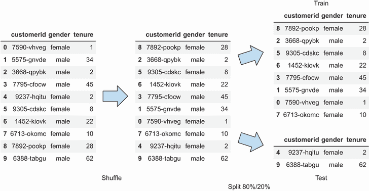

图 3.6 当使用 `train_test_split` 时，原始数据集被打乱，然后分割，使得 80%的数据进入训练集，剩余的 20%进入测试集。

此函数包含几个参数：

1.  我们传递的第一个参数是我们想要分割的数据框：`df`。

1.  第二个参数是 `test_size`，它指定了我们想要留出的测试数据集的大小——在我们的例子中是 20%。

1.  我们传递的第三个参数是 `random_state`。它对于确保每次我们运行此代码时，数据框的分割方式完全相同是必要的。

数据的打乱是通过随机数生成器完成的；固定随机种子对于确保每次我们打乱数据时，行的最终排列都是相同的非常重要。

我们确实看到了打乱带来的副作用：如果我们使用 `head()` 方法查看分割后的数据框，例如，我们会注意到索引似乎是无序的（图 3.7）。

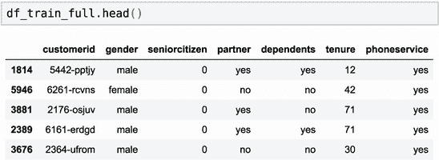

图 3.7 `train_test_split` 的副作用：新数据框中的索引（第一列）被随机打乱，因此不再是连续的数字，如 0、1、2、...，而是看起来是随机的。

在上一章中，我们将数据分为三个部分：训练集、验证集和测试集。然而，`train_test_split` 函数只将数据分为两个部分：训练集和测试集。尽管如此，我们仍然可以将原始数据集分为三个部分；我们只需取出一部分并再次分割（图 3.8）。

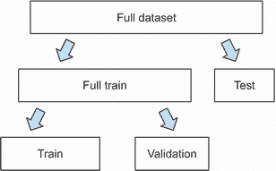

图 3.8 由于`train_test_split`将数据集仅分为两部分，我们需要三部分，因此我们进行了两次分割。首先，我们将整个数据集分为完整的训练集和测试集，然后我们将完整的训练集分为训练集和验证集。

让我们再次将`df_train_full`数据框分割成训练集和验证集：

```
df_train, df_val = train_test_split(df_train_full, test_size=0.33, random_state=11)              ❶

y_train = df_train.churn.values    ❷
y_val = df_val.churn.values        ❷

del df_train['churn']              ❸
del df_val['churn']                ❸
```

❶ 在分割时设置随机种子，以确保每次运行代码时结果都是相同的

❷ 将包含目标变量 churn 的列保存到数据框外部

❸ 从两个数据框中删除 churn 列，以确保我们不会在训练过程中意外使用 churn 变量作为特征

现在数据框已经准备好了，我们可以使用训练数据集进行初步的探索性数据分析。

### 3.1.3 探索性数据分析

在训练模型之前查看数据非常重要。我们了解的数据和问题越多，之后构建的模型就越好。

我们应该始终检查数据集中是否存在任何缺失值，因为许多机器学习模型难以处理缺失数据。我们已经发现了 TotalCharges 列的问题，并用零替换了缺失值。现在让我们看看是否需要执行任何额外的空值处理：

```
df_train_full.isnull().sum()
```

它打印所有零（图 3.9），因此数据集中没有缺失值，不需要做任何额外的事情。

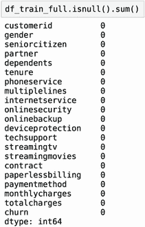

图 3.9 我们不需要处理数据集中的缺失值：所有列中的所有值都是存在的。

我们还应该做的一件事是检查目标变量中值的分布。让我们使用`value_counts()`方法来看看：

```
df_train_full.churn.value_counts()
```

它打印

```
0    4113
1    1521
```

第一列是目标变量的值，第二列是计数。正如我们所见，大多数客户没有流失。

我们知道绝对数字，但让我们也检查所有客户中流失用户的比例。为此，我们需要将流失客户数除以客户总数。我们知道 5,634 中有 1,521 人流失，所以比例是

1521 / 5634 = 0.27

这给出了流失用户的比例，或者客户流失的概率。正如我们在训练数据集中看到的那样，大约 27%的客户停止使用我们的服务，其余的继续作为客户。

流失用户的比例，或流失的概率，有一个特殊的名称：流失率。

计算流失率的另一种方法是`mean()`方法。它比手动计算率更方便：

```
global_mean = df_train_full.churn.mean()
```

使用这种方法，我们也得到了 0.27（图 3.10）。

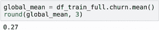

图 3.10 计算训练数据集中的全局流失率

它产生相同结果的原因是我们计算平均值的方式。如果您不记得，该公式的计算方法是

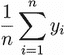

其中 *n* 是数据集中的项目数。

因为 *y[i]* 只能取零和一，当我们把它们全部加起来时，我们得到的是一的数量，或者说是转出的人数。然后我们将其除以总客户数，这与我们之前计算转出率的公式完全相同。

我们的转出数据集是一个所谓的*不平衡*数据集的例子。在我们的数据集中，没有转出的人数是转出人数的三倍，我们说非转出类别主导了转出类别。我们可以清楚地看到：我们的数据中的转出率是 0.27，这是类别不平衡的强烈指标。与*不平衡*相反的是*平衡*的情况，即正负类别在所有观测值中均匀分布。

练习 3.1

布尔数组的平均值是

a) 数组中`False`元素的比例：`False`元素的数量除以数组的长度

b) 数组中`True`元素的比例：`True`元素的数量除以数组的长度

c) 数组的长度

我们数据集中的分类变量和数值变量都很重要，但它们也不同，需要不同的处理。为此，我们希望单独查看它们。

我们将创建两个列表：

+   `分类`，它将包含分类变量的名称

+   `数值`，同样，它将包含数值变量的名称

让我们创建它们：

```
categorical = ['gender', 'seniorcitizen', 'partner', 'dependents',
               'phoneservice', 'multiplelines', 'internetservice',
               'onlinesecurity', 'onlinebackup', 'deviceprotection',
               'techsupport', 'streamingtv', 'streamingmovies',
               'contract', 'paperlessbilling', 'paymentmethod']
numerical = ['tenure', 'monthlycharges', 'totalcharges']
```

首先，我们可以看到每个变量有多少个唯一值。我们已经知道每个列应该只有几个，但让我们验证一下：

```
df_train_full[categorical].nunique()
```

事实上，我们看到大多数列都有两到三个值，而一个（paymentmethod）有四个（图 3.11）。这是好的。我们不需要额外的时间来准备和清理数据；一切都已经准备好了。

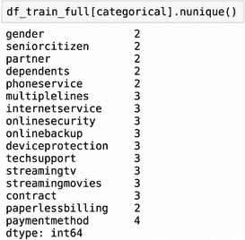

图 3.11 每个分类变量的不同值数量。我们看到所有变量都有非常少的唯一值。

现在我们来到了探索性数据分析的另一个重要部分：了解哪些特征可能对我们的模型很重要。

### 3.1.4 特征重要性

了解其他变量如何影响目标变量，即转出，是理解数据和构建好模型的关键。这个过程被称为*特征重要性分析*，它通常作为探索性数据分析的一部分来进行，以确定哪些变量对模型有用。它还为我们提供了关于数据集的额外见解，并帮助回答像“是什么导致客户转出？”和“转出的人有什么特征？”等问题。

我们有两种不同类型的特征：分类和数值。每种类型都有不同的测量特征重要性的方法，因此我们将分别查看每种。

转出率

让我们从查看分类变量开始。我们可以做的第一件事是查看每个变量的转出率。我们知道分类变量可以取一组值，每个值在数据集中定义一个组。

我们可以查看一个变量的所有不同值。然后，对于每个变量，都有一个客户群体：所有具有该值的客户。对于这样的每个群体，我们可以计算客户流失率，即群体客户流失率。当我们得到这个值时，我们可以将其与全局客户流失率进行比较——即一次性计算所有观察值的客户流失率。

如果两者之间的差异很小，那么在预测客户流失时，这个值并不重要，因为这个客户群体与其他客户并没有真正的区别。另一方面，如果差异很大，那么这个群体内部存在某些因素使其与其他客户群体区分开来。机器学习算法应该能够捕捉到这一点并在预测时使用它。

让我们先检查`gender`变量。这个`gender`变量可以取两个值，女性和男性。有两个客户群体：`gender` `==` `'female'` 的客户群体和 `gender` `==` `'male'` 的客户群体（图 3.12）。为了计算所有女性客户的客户流失率，我们首先只选择对应 `gender` `==` `'female'` 的行，然后计算他们的客户流失率：

```
female_mean = df_train_full[df_train_full.gender == 'female'].churn.mean()
```

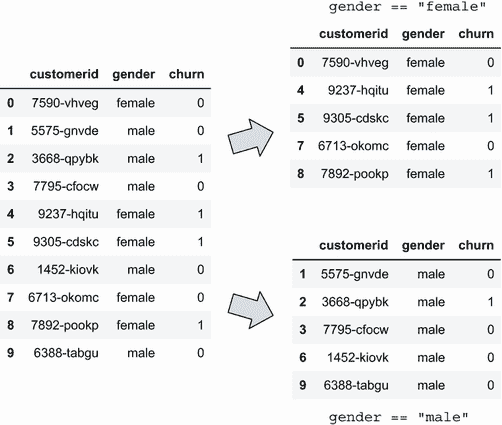

图 3.12 根据性别变量的值将数据框分为两组：一组是`gender` `==` `"female"` 的组，另一组是`gender` `==` `"male"` 的组。

然后我们对所有男性客户做同样的处理：

```
male_mean = df_train_full[df_train_full.gender == 'male'].churn.mean()
```

当我们执行此代码并检查结果时，我们看到女性客户的客户流失率是 27.7%，男性客户的客户流失率是 26.3%，而全局客户流失率是 27%（图 3.13）。女性和男性群体流失率之间的差异相当小，这表明了解客户的性别并不能帮助我们确定他们是否会流失。

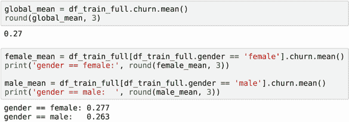

图 3.13 全球客户流失率与男性和女性客户流失率的比较。这些数字非常接近，这意味着在预测客户流失时，`性别`不是一个有用的变量。

现在让我们看看另一个变量：`partner`。它取值为“是”和“否”，因此有两组客户：`partner` `==` `'yes'` 的客户和 `partner` `==` `'no'` 的客户。

我们可以使用之前使用的相同代码来检查分组客户流失率。我们只需要更改过滤条件：

```
partner_yes = df_train_full[df_train_full.partner == 'yes'].churn.mean()
partner_no = df_train_full[df_train_full.partner == 'no'].churn.mean()
```

如我们所见，有伴侣的人的流失率与没有伴侣的人的流失率相当不同：分别是 20%和 33%。这意味着没有伴侣的客户比有伴侣的客户更有可能流失（图 3.14）。

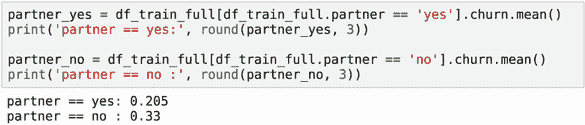

图 3.14 有伴侣的人的客户流失率显著低于没有伴侣的人的客户流失率——分别是 20.5%和 33%——这表明`partner`变量对预测客户流失是有用的。

风险比

除了观察组别比率与全球比率之间的差异之外，观察它们之间的比率也很有趣。在统计学中，不同组别概率之间的比率称为*风险比*，其中*风险*指的是出现效果的风险。在我们的案例中，效果是客户流失，因此是客户流失的风险：

风险 = 组别比率 / 全球比率

例如，对于`性别`等于`女性`的情况，客户流失的风险是 1.02：

风险 = 27.7% / 27% = 1.02

风险是一个介于零和无穷大之间的数值。它有一个很好的解释，告诉你组别元素出现效果（客户流失）的可能性与整个群体相比如何。

如果组别比率与全球比率之间的差异很小，风险值接近 1：这个组别的风险水平与整个人群相同。该组别的客户流失的可能性与其他人一样。换句话说，风险值接近 1 的组别根本不具风险（图 3.15，组 A）。

如果风险值低于 1，那么这个组别的风险较低：这个组别的客户流失率低于全球流失率。例如，值 0.5 意味着这个组别的客户流失的可能性是普通客户的一半（图 3.15，组 B）。

另一方面，如果这个值高于 1，那么这个组别是有风险的：组别中的客户流失率高于整个人群。因此，风险值为 2 意味着该组别的客户流失的可能性是整个人群的两倍（图 3.15，组 C）。

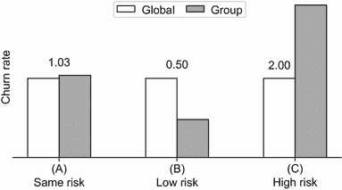

图 3.15 不同组别的客户流失率与全球客户流失率比较。在组别(A)中，比率大致相同，因此客户流失的风险约为 1。在组别(B)中，组别客户流失率低于全球比率，因此风险约为 0.5。最后，在组别(C)中，组别客户流失率高于全球比率，因此风险接近 2。

术语*风险*最初来自对照试验，其中一组患者接受治疗（药物），而另一组则不接受（仅给予安慰剂）。然后我们通过计算每个组别负面结果的发生率，然后计算比率来比较药物的有效性：

风险 = 组别 1 的负面结果发生率 / 组别 2 的负面结果发生率

如果药物证明是有效的，它被认为可以降低出现负面结果的几率，且风险值小于 1。

让我们计算`性别`和`伴侣`的风险。对于`性别`变量，男性和女性的风险值都大约为 1，因为两组的比率与全球比率没有显著差异。不出所料，对于`伴侣`变量则不同；没有伴侣的风险更高（表 3.1）。

表 3.1 `性别`和`伴侣`变量的流失率和风险。女性和男性的流失率与全局流失率没有显著差异，因此他们流失的风险较低：两者的风险值都在 1 左右。另一方面，没有伴侣的人的流失率显著高于平均水平，使他们变得有风险，风险值为 1.22。有伴侣的人流失较少，因此他们的风险仅为 0.75。

| 变量 | 值 | 流失率 | 风险 |
| --- | --- | --- | --- |
| 性别 | 女性 | 27.7% | 1.02 |
|  | 男性 | 26.3% | 0.97 |
| 伴侣 | 是 | 20.5% | 0.75 |
|  | 无 | 33% | 1.22 |

我们只从两个变量中做了这个。现在让我们对所有分类变量做同样的事情。为了做到这一点，我们需要一段代码来检查变量具有的所有值，并为这些值中的每个计算流失率。

如果我们使用 SQL，这将非常简单。对于性别，我们需要做类似这样的事情：

```
SELECT
    gender, AVG(churn),
    AVG(churn) - global_churn,
    AVG(churn) / global_churn
FROM
    data
GROUP BY
    gender
```

这是对 Pandas 的一个粗略翻译：

```
global_mean = df_train_full.churn.mean()

df_group = df_train_full.groupby(by='gender').churn.agg(['mean'])   ❶
df_group['diff'] = df_group['mean'] - global_mean                   ❷
df_group['risk'] = df_group['mean'] / global_mean                   ❸

df_group
```

❶ 计算 AVG(churn)

❷ 计算组流失率与全局流失率之间的差异

❸ 计算客户流失风险

在❶中，我们计算了`AVG(churn)`部分。为此，我们使用`agg`函数来表示我们需要将数据聚合到每个组的一个值中：平均值。在❷中，我们创建了一个名为 diff 的新列，我们将在这里保存组平均值与全局平均值之间的差异。同样，在❸中，我们创建了一个名为 risk 的列，我们在这里计算组平均值与全局平均值之间的比例。

我们可以在图 3.16 中看到结果。

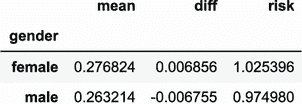

图 3.16 `性别`变量的客户流失率。我们看到，对于两个值，组客户流失率与全局客户流失率之间的差异并不大。

现在我们对所有分类变量做同样的事情。我们可以遍历它们，并对每个变量应用相同的代码：

```
from IPython.display import display 

for col in categorical:                                           ❶
    df_group = df_train_full.groupby(by=col).churn.agg(['mean'])  ❷
    df_group['diff'] = df_group['mean'] - global_mean
    df_group['rate'] = df_group['mean'] / global_mean
    display(df_group)                                             ❸
```

❶ 遍历所有分类变量

❷ 对每个分类变量执行分组操作

❸ 显示结果数据框

这段代码中有两点不同。首先，我们不是手动指定列名，而是遍历所有分类变量。

第二个不同之处更为微妙：我们需要调用`display`函数来在循环中渲染数据框。我们通常显示数据框的方式是将它作为 Jupyter Notebook 单元格中的最后一行，然后执行该单元格。如果我们这样做，数据框将作为单元格的输出显示。这正是我们在本章开头（图 3.1）看到数据框内容的方式。然而，我们无法在循环中这样做。为了仍然能够看到数据框的内容，我们显式地调用`display`函数。

从结果（图 3.17）中我们了解到

+   对于性别，男性和女性之间没有太大差异。两组的平均值大致相同，两组的风险值都接近 1。

+   老年人比非老年人更容易流失：老年人的流失风险为 1.53，非老年人的流失风险为 0.89。

+   有伴侣的人比没有伴侣的人流失率低。风险分别是 0.75 和 1.22。

+   使用电话服务的人不会面临流失风险：风险接近 1，与全球流失率几乎没有差异。不使用电话服务的人流失的可能性更低：风险低于 1，与全球流失率的差异为负。

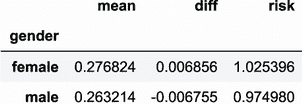

(A) 流失比率和风险：`gender`

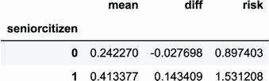

(B) 流失比率和风险：`seniorcitizen`

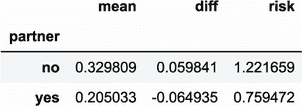

(C) 流失比率和风险：`partner`

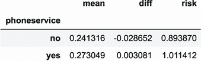

(D) 流失比率和风险：`phoneservice`

图 3.17 四个分类变量的流失率差异和风险：`gender`、`seniorcitizen`、`partner`和`phoneservice`

一些变量有相当显著的区别（图 3.18）：

+   没有技术支持的客户比有技术支持的客户更容易流失。

+   每月签订合同的客户取消合同的情况比其他人多，而两年合同的客户很少流失。

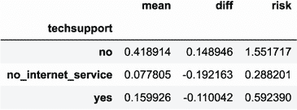

(A) 流失比率和风险：`techsupport`

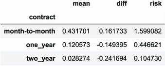

(B) 流失比率和风险：`contract`

图 3.18 `techsupport`和`contract`组流失率与全球流失率之间的差异。没有技术支持和按月签订合同的客户比其他组的客户流失得多，而有技术支持和两年合同的客户是风险很低的客户。

这样，仅通过观察差异和风险，我们就可以识别出最具判别性的特征：有助于检测流失的特征。因此，我们预计这些特征将对我们未来的模型有用。

互信息

我们刚才探讨的差异对我们的分析有用，对于理解数据也很重要，但很难用它们来说明最重要的特征是什么，以及技术支持是否比合同类型更有用。

幸运的是，重要性指标可以帮助我们：我们可以测量一个分类变量与目标变量之间的依赖程度。如果两个变量是相关的，知道一个变量的值会给我们关于另一个变量的某些信息。另一方面，如果一个变量与目标变量完全独立，那么它就没有用，可以从数据集中安全地移除。

在我们的案例中，知道客户有按月签订的合同可能表明这位客户更有可能流失。

与其他类型的合同相比，每月签订合同的客户流失率往往要高得多。这正是我们想要在数据中找到的那种关系。如果没有这样的关系在数据中，机器学习模型将无法工作——它们将无法做出预测。依赖度越高，特征就越有用。

对于分类变量，这样的度量之一是互信息，它告诉我们如果我们知道另一个变量的值，我们将了解多少关于一个变量的信息。这是一个来自信息理论的概念，在机器学习中，我们经常用它来衡量两个变量之间的相互依赖性。

互信息值越高，表示依赖度越高：如果一个分类变量与目标之间的互信息高，那么这个分类变量将非常有助于预测目标。另一方面，如果互信息低，分类变量与目标独立，因此该变量将不会对预测目标有用。

互信息已经在 Scikit-learn 的`metrics`包中的`mutual_info_score`函数中实现，因此我们可以直接使用它：

```
from sklearn.metrics import mutual_info_score

def calculate_mi(series):                                      ❶
    return mutual_info_score(series, df_train_full.churn)      ❷

df_mi = df_train_full[categorical].apply(calculate_mi)         ❸
df_mi = df_mi.sort_values(ascending=False).to_frame(name='MI') ❹
df_mi
```

❶ 创建一个用于计算互信息的独立函数

❷ 使用 Scikit-learn 中的`mutual_info_score`函数

❸ 将❶中的函数应用于数据集的每一列分类变量

❹ 对结果值进行排序

在❸中，我们使用`apply`方法将我们在❶中定义的`calculate_mi`函数应用于`df_train_full`数据框的每一列。因为我们包括了一个额外的步骤，即仅选择分类变量，所以它只应用于它们。我们在❶中定义的函数只接受一个参数：`series`。这是一个来自数据框的列，我们在其上调用了`apply()`方法。在❷中，我们计算序列与目标变量`churn`之间的互信息得分。输出是一个单一数字，因此`apply()`方法的输出是一个 Pandas 序列。最后，我们根据互信息得分对序列的元素进行排序，并将序列转换为数据框。这样，结果在 Jupyter 中显示得很好。

正如我们所见，`contract`、`onlinesecurity`和`techsupport`是最重要的特征之一（图 3.19）。事实上，我们之前已经指出`contract`和`techsupport`非常有信息量。`gender`是重要性最低的特征之一，因此我们不应该期望它对模型有用。

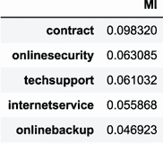

(A) 根据互信息得分，最有用的特征。

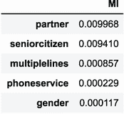

(B) 根据互信息得分，最无用的特征。

图 3.19 分类变量与目标变量之间的互信息。值越高越好。根据它，`contract`是最有用的变量，而`gender`是最无用的。

相关系数

互信息是一种量化两个分类变量之间依赖程度的度量方法，但当其中一个特征是数值时，它不起作用，因此我们不能将其应用于我们拥有的三个数值变量。

然而，我们可以测量二进制目标变量和数值变量之间的依赖性。我们可以假设二进制变量是数值的（只包含数字零和一），然后使用统计学中的经典方法来检查这些变量之间是否存在任何依赖性。

其中一种方法是*相关系数*（有时称为*皮尔逊相关系数*）。它是一个从-1 到 1 的值：

+   正相关意味着当一个变量上升时，另一个变量也倾向于上升。在二进制目标的情况下，当变量的值较高时，我们更经常看到一，而不是零。但当变量的值较低时，零的出现频率高于一。

+   零相关意味着两个变量之间没有关系：它们是完全独立的。

+   负相关发生在当一个变量上升而另一个变量下降时。在二进制情况下，如果值较高，目标变量中零的个数多于一的个数。当值较低时，一的个数多于零的个数。

在 Pandas 中计算相关系数非常容易：

```
df_train_full[numerical].corrwith(df_train_full.churn)
```

我们在图 3.20 中看到了结果：

+   `tenure`与流失率之间的相关系数为-0.35：它有一个负号，这意味着客户待的时间越长，他们流失的频率就越低。对于服务期在两个月或更短的客户，流失率为 60%；对于服务期在 3 到 12 个月之间的客户，流失率为 40%；而对于服务期超过一年的客户，流失率为 17%。因此，服务期的值越高，流失率就越小（图 3.21A）。

+   `monthlycharges`的正相关系数为 0.19，这意味着支付更多的客户倾向于更频繁地离开。只有 8%的每月支付少于 20 美元的客户流失；支付介于 21 美元和 50 美元之间的客户流失频率更高，流失率为 18%；而支付超过 50 美元的人中有 32%流失（图 3.21B）。

+   `totalcharges`存在负相关，这是有道理的：人们在公司待的时间越长，支付的总金额就越多，因此他们离职的可能性就越小。在这种情况下，我们预计会出现与`tenure`相似的图案。对于较小的值，流失率较高；对于较大的值，流失率较低。

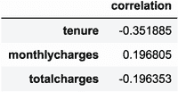

图 3.20 数值变量与流失率的相关性。`tenure`有高度的负相关：随着服务期的增长，流失率下降。`monthlycharges`有正相关：客户支付越多，他们流失的可能性就越大。

在进行初步的探索性数据分析、识别重要特征并对问题有所了解之后，我们准备进行下一步：特征工程和模型训练。

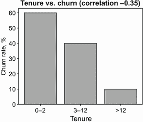

(A) 不同`tenure`值下的客户流失率。相关系数为负，因此趋势是下降的：对于更高的`tenure`值，客户流失率较小。

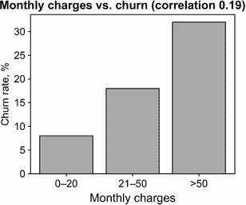

(B) 不同`monthlycharges`值下的客户流失率。相关系数为正，因此趋势是上升的：对于更高的`monthlycharges`值，客户流失率更高。

图 3.21 `tenure`（-0.35 的负相关性）和`monthlycharges`（0.19 的正相关性）的客户流失率

## 3.2 特征工程

我们初步查看数据并确定了可能对模型有用的信息。在这样做之后，我们清楚地理解了其他变量如何影响客户流失——我们的目标。

在我们继续进行训练之前，然而，我们需要执行特征工程步骤：将所有分类变量转换为数值特征。我们将在下一节中这样做，之后我们就可以准备训练逻辑回归模型了。

### 3.2.1 分类变量的独热编码

正如我们在第一章中已经知道的，我们不能直接将分类变量放入机器学习模型中。模型只能处理矩阵中的数字。因此，我们需要将我们的分类数据转换为矩阵形式，或者进行编码。

其中一种编码技术是*独热编码*。我们已经在上一章中看到了这种编码技术，当时我们在创建汽车品牌和其他分类变量的特征时使用了它。在那里，我们只是简要地提到了它，并且以非常简单的方式使用了它。在本章中，我们将花更多的时间来理解和使用它。

如果一个变量`contract`有（月度、年度和两年期）可能的值，我们可以用一个客户拥有年度合同来表示为（0, 1, 0）。在这种情况下，年度值是激活的，或*热*，因此得到 1，而其他值不是激活的，或*冷*，因此它们是 0。

为了更好地理解这一点，让我们考虑一个有两个分类变量的案例，并看看我们如何从它们中创建一个矩阵。这些变量是

+   `gender`，其值为 female 和 male

+   `contract`，其值为月度、年度和两年期

由于`gender`变量只有两个可能的值，我们在结果矩阵中创建两个列。`contract`变量有三个列，因此我们的新矩阵将总共包含五个列：

+   `gender=female`

+   `gender=male`

+   `contract=monthly`

+   `contract=yearly`

+   `contract=two-year`

让我们考虑两个客户（图 3.22）：

+   拥有年度合同的女性客户

+   拥有月度合同的男性客户

对于第一位客户，`gender`变量通过在`gender=female`列中放置 1，在`gender=male`列中放置 0 来进行编码。同样，`contract=yearly`得到 1，而其他合同列（`contract=monthly`和`contract=two-year`）得到 0。

对于第二位客户，`gender=male`和`contract=monthly`得到 1，其余列得到 0（图 3.22）。

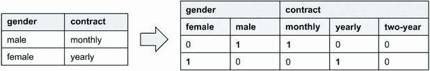

图 3.22 原始数据集带有分类变量在左侧，独热编码表示在右侧。对于第一个客户，性别=male 和合同=monthly 是热列，因此它们得到 1。对于第二个客户，热列是性别=female 和合同=yearly。

我们之前实现的方式简单但相当有限。我们首先查看变量的前五个值，然后对每个值进行循环并手动在数据框中创建一个列。然而，当特征数量增加时，这个过程变得繁琐。

幸运的是，我们不需要手动实现这个功能：我们可以使用 Scikit-learn。在 Scikit-learn 中，我们可以以多种方式执行独热编码，但我们将使用`DictVectorizer`。

如其名所示，`DictVectorizer`接受一个字典并将其*矢量化*——也就是说，它从中创建向量。然后这些向量被组合成一个矩阵的行。这个矩阵被用作机器学习算法的输入（图 3.23）。

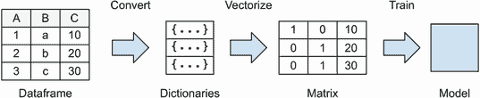

图 3.23 创建模型的过程。首先，我们将数据框转换为字典列表，然后我们将列表矢量化为矩阵，最后我们使用矩阵来训练模型。

要使用这种方法，我们需要将我们的数据框转换为字典列表，这在 Pandas 中使用`to_dict`方法并带有`orient="records"`参数是非常简单的：

```
train_dict = df_train[categorical + numerical].to_dict(orient='records')
```

如果我们查看这个新列表的第一个元素，我们会看到

```
{'gender': 'male',
 'seniorcitizen': 0,
 'partner': 'yes',
 'dependents': 'yes',
 'phoneservice': 'yes',
 'multiplelines': 'no',
 'internetservice': 'no',
 'onlinesecurity': 'no_internet_service',
 'onlinebackup': 'no_internet_service',
 'deviceprotection': 'no_internet_service',
 'techsupport': 'no_internet_service',
 'streamingtv': 'no_internet_service',
 'streamingmovies': 'no_internet_service',
 'contract': 'two_year',
 'paperlessbilling': 'no',
 'paymentmethod': 'mailed_check',
 'tenure': 12,
 'monthlycharges': 19.7,
 'totalcharges': 258.35}
```

数据框中的每一列是这个字典的键，值来自实际的数据框行值。

现在我们可以使用`DictVectorizer`。我们创建它，然后将其拟合到我们之前创建的字典列表：

```
from sklearn.feature_extraction import DictVectorizer

dv = DictVectorizer(sparse=False)
dv.fit(train_dict)
```

在这段代码中，我们创建了一个名为`dv`的`DictVectorizer`实例，并通过调用`fit`方法来“训练”它。`fit`方法查看这些字典的内容，并确定每个变量的可能值以及如何将它们映射到输出矩阵的列中。如果一个特征是分类的，它将应用独热编码方案，但如果一个特征是数值的，它将保持不变。

`DictVectorizer`类可以接受一组参数。我们指定其中一个：`sparse=False`。此参数意味着创建的矩阵将不是稀疏的，而是创建一个简单的 NumPy 数组。如果你不了解稀疏矩阵，不要担心：我们在这个章节中不需要它们。

在我们拟合矢量化器之后，我们可以使用它通过`transform`方法将字典转换为矩阵：

```
X_train = dv.transform(train_dict)
```

这个操作创建了一个有 45 列的矩阵。让我们看看第一行，它对应于我们之前查看的客户：

```
X_train[0]
```

当我们将这段代码放入 Jupyter Notebook 单元格中并执行时，我们得到以下输出：

```
array([   0\. ,    0\. ,    1\. ,    1\. ,    0\. ,    0\. ,    0\. ,    1\. ,
          0\. ,    1\. ,    1\. ,    0\. ,    0\. ,   86.1,    1\. ,    0\. ,
          0\. ,    0\. ,    0\. ,    1\. ,    0\. ,    0\. ,    1\. ,    0\. ,
          1\. ,    0\. ,    1\. ,    1\. ,    0\. ,    0\. ,    0\. ,    0\. ,
          1\. ,    0\. ,    0\. ,    0\. ,    1\. ,    0\. ,    0\. ,    1\. ,
          0\. ,    0\. ,    1\. ,   71\. , 6045.9])
```

如我们所见，大多数元素都是 1 和 0——它们是独热编码的分类变量。然而，并非所有都是 1 和 0。我们看到其中三个是其他数字。这些是我们的数值变量：`monthlycharges`、`tenure`和`totalcharges`。

我们可以通过使用 `get_feature_names` 方法来学习所有这些列的名称：

```
dv.get_feature_names()
```

它打印

```
['contract=month-to-month',
 'contract=one_year',
 'contract=two_year',
 'dependents=no',
 'dependents=yes',
 # some rows omitted
 'tenure',
 'totalcharges']
```

如我们所见，对于每个分类特征，它为每个不同的值创建多个列。对于 `contract`，我们有 `contract=month-to-month`、`contract=one_year` 和 `contract=two_year`，对于 `dependents`，我们有 `dependents=no` 和 `dependents =yes`。像 `tenure` 和 `totalcharges` 这样的特征保持原始名称，因为它们是数值型的；因此，`DictVectorizer` 不对它们进行更改。

现在我们的特征已编码为矩阵，因此我们可以进行下一步：使用模型来预测流失。

练习 3.2

`DictVectorizer` 将如何编码以下字典列表？

```
records = [
    {'total_charges': 10, 'paperless_billing': 'yes'},
    {'total_charges': 30, 'paperless_billing': 'no'},
    {'total_charges': 20, 'paperless_billing': 'no'}
]
```

a)   列：`['total_charges',` `'paperless_billing=yes',` `'paperless_ billing=no']`

值：`[10,` `1,` `0],` `[30,` `0,` `1],` `[20,` `0,` `1]`

b)   列：`['total_charges=10',` `'total_charges=20',` `'total_charges= 30',` `'paperless_billing=yes',` `'paperless_billing=no']`

值：`[1,` `0,` `0,` `1,` `0],` `[0,` `0,` `1,` `0,` `1],` `[0,` `1,` `0,` `0,` `1]`

## 3.3 分类机器学习

我们已经学习了如何使用 Scikit-learn 对分类变量进行独热编码，现在我们可以将它们转换为一组数值特征，并将所有内容组合成一个矩阵。

当我们有一个矩阵时，我们就准备好进行模型训练部分了。在本节中，我们学习如何训练逻辑回归模型并解释其结果。

### 3.3.1 逻辑回归

在本章中，我们使用逻辑回归作为分类模型，现在我们训练它来区分已流失和未流失的用户。

逻辑回归与我们在上一章学习的线性回归有很多相似之处。如果你还记得，线性回归模型是一种可以预测数值的回归模型。它具有以下形式


其中

+   *x[i]* 是对应于第 *i* 个观察的特征向量。

+   *w*[0] 是偏置项。

+   *w* 是包含模型权重的向量。

我们应用这个模型并得到 *g*(*x[i]*)——我们认为 *x[i]* 应该有的值的预测。线性回归被训练来预测目标变量 *y[i]*——观察 *i* 的实际值。在上一章中，这是汽车的价格。

线性回归是一个线性模型。它被称为*线性*是因为它将模型的权重与特征向量*线性组合*，使用点积。线性模型易于实现、训练和使用。由于它们的简单性，它们也很快。

逻辑回归也是一个线性模型，但与线性回归不同，它是一个分类模型，而不是回归模型，尽管名称可能暗示了这一点。它是一个二元分类模型，因此目标变量 *y[i]* 是二元的；它只能取零和一这两个值。*y[i]* 等于 1 的观测通常被称为 *正例*：即我们想要预测的效果存在的例子。同样，*y[i]* 等于 0 的例子被称为 *负例*：即我们想要预测的效果不存在。在我们的项目中，*y[i]* 等于 1 表示客户流失，而 *y[i]* 等于 0 则表示相反：客户留在了我们这里。

逻辑回归的输出是概率——即观察值 *x[i]* 为正的概率，或者说，*y[i]* 等于 1 的概率。在我们的案例中，这是客户 *i* 将会流失的概率。

为了能够将输出作为概率处理，我们需要确保模型的预测值始终在零和一之间。为此，我们使用一个特殊的数学函数，称为 *sigmoid*，逻辑回归模型的完整公式如下：

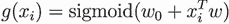

如果我们将其与线性回归公式进行比较，唯一的区别就是这个 sigmoid 函数：在线性回归的情况下，我们只有 *w*[0] *+ x[i]^T**w*。这就是为什么这两个模型都是线性的；它们都是基于点积操作。

sigmoid 函数将任何值映射到 0 到 1 之间的一个数（图 3.24）。它被定义为以下方式：

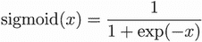

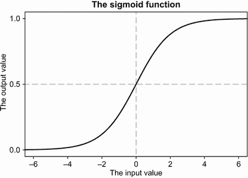

图 3.24 sigmoid 函数输出的值总是在 0 到 1 之间。当输入为 0 时，sigmoid 的结果是 0.5；对于负值，结果小于 0.5，并且当输入值小于-6 时开始接近 0。当输入为正值时，sigmoid 的结果大于 0.5，并且当输入值从 6 开始时接近 1。

我们从第二章知道，如果特征向量 *x[i]* 是 *n*-维的，点积 *x[i]^T**w* 可以展开为一个和，我们可以将 *g*(*x[i]*) 写作：

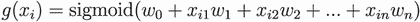

或者，使用求和符号表示，如下：

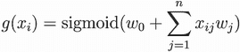

之前，我们将公式翻译成 Python 进行说明。现在我们在这里做同样的操作。

线性回归模型具有以下公式：

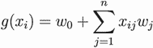

如果你记得上一章的内容，这个公式可以翻译成以下 Python 代码：

```
def linear_regression(xi):
    result = bias
    for j in range(n):
        result = result + xi[j] * w[j]
    return result
```

将逻辑回归公式翻译成 Python 与线性回归的情况几乎相同，只是在最后我们应用 sigmoid 函数：

```
def logistic_regression(xi):
    score = bias
    for j in range(n):
        score = score + xi[j] * w[j]
 prob = sigmoid(score)
    return prob
```

当然，我们还需要定义 sigmoid 函数：

```
import math

def sigmoid(score):
    return 1 / (1 + math.exp(-score))
```

我们使用`score`来表示应用 Sigmoid 函数之前的中间结果。分数可以取任何实数值。*probability*是应用 Sigmoid 函数到分数的结果；这是最终输出，它只能取零和一之间的值。

逻辑回归模型的参数与线性回归相同：

+   *w*[0] 是偏置项。

+   *w =* (*w*[1], *w*[2], ..., *w[n]*) 是权重向量。

为了学习权重，我们需要训练模型，我们将使用 Scikit-learn 来完成这项工作。

练习 3.3

为什么逻辑回归需要使用 Sigmoid 函数？

a) Sigmoid 将输出转换为-6 和 6 之间的值，这更容易处理。

b) Sigmoid 确保输出值在零和一之间，这可以解释为概率。

### 3.3.2 训练逻辑回归

要开始，我们首先导入模型：

```
from sklearn.linear_model import LogisticRegression
```

然后我们通过调用`fit`方法来训练它：

```
model = LogisticRegression(solver='liblinear', random_state=1)
model.fit(X_train, y_train)
```

Scikit-learn 中的`LogisticRegression`类封装了此模型背后的训练逻辑。它是可配置的，我们可以更改相当多的参数。实际上，我们已经指定了其中两个：`solver`和`random_state`。两者都是可复现性的必要条件：

+   `random_state.` 随机数生成器的种子数字。在训练模型时，它会对数据进行打乱；为了确保每次打乱都是相同的，我们固定了种子。

+   `solver`。底层优化库。在当前版本（撰写本文时，v0.20.3），此参数的默认值为`liblinear`，但根据文档（[`scikit-learn.org/stable/modules/generated/sklearn.linear_model.LogisticRegression.html`](https://scikit-learn.org/stable/modules/generated/sklearn.linear_model.LogisticRegression.html)），它将在 v0.22 版本中变为不同的值。为了确保我们可以在后续版本中复现结果，我们也设置了此参数。

模型中其他有用的参数包括`C`，它控制正则化级别。我们将在下一章讨论参数调整时讨论它。指定`C`是可选的；默认情况下，它的值为 1.0。

训练需要几秒钟，完成后，模型就准备好进行预测了。让我们看看模型的性能如何。我们可以将其应用于我们的验证数据，以获得验证数据集中每个客户的流失概率。

为了做到这一点，我们需要将独热编码方案应用于所有分类变量。首先，我们将数据框转换为字典列表，然后将其输入到我们之前拟合的`DictVectorizer`中：

```
val_dict = df_val[categorical + numerical].to_dict(orient='records')  ❶
X_val = dv.transform(val_dict)                                        ❷
```

❶ 我们以与训练期间完全相同的方式进行独热编码。

❷ 我们使用`transform`而不是`fit`和`transform`，这是我们在之前拟合的。

结果，我们得到`X_val`，这是一个包含验证数据集特征的矩阵。现在我们准备好将这个矩阵放入模型中。为了得到概率，我们使用模型的`predict_proba`方法：

```
y_pred = model.predict_proba(X_val)
```

`predict_proba`的结果是一个二维 NumPy 数组，或一个两列矩阵。数组的第一个列包含目标为负（无流失）的概率，第二个列包含目标为正（流失）的概率（图 3.25）。

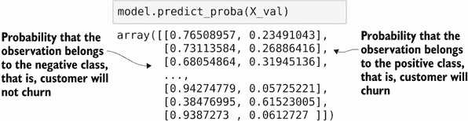

图 3.25 模型的预测：一个两列矩阵。第一列包含目标为零（客户不会流失）的概率。第二列包含相反的概率（目标是 1，客户会流失）。

这些列传达相同的信息。我们知道流失的概率——它是*p*，而不流失的概率总是 1 – *p*，所以我们不需要两个列。

因此，只需要取预测的第二个列。要在 NumPy 中从二维数组中选择一列，我们可以使用切片操作`[:, 1]`：

```
y_pred = model.predict_proba(X_val)[:, 1]
```

这种语法可能让人困惑，所以让我们来分解一下。括号中有两个位置，第一个用于行，第二个用于列。

当我们使用`[:, 1]`时，NumPy 是这样解释的：

+   `:`表示选择所有行。

+   `1`表示只选择索引为 1 的列，因为索引从 0 开始，所以它是第二列。

因此，我们得到一个只包含第二列值的二维 NumPy 数组。

这个输出（概率）通常被称为**软**预测。这些告诉我们流失的概率，是一个介于零和一之间的数字。如何解释这个数字以及如何使用它取决于我们。

记得我们想要如何使用这个模型：我们想要通过识别那些即将取消与公司合同的人，并向他们发送促销信息，提供折扣和其他优惠来保留客户。我们这样做是希望他们在收到优惠后能继续与我们合作。另一方面，我们不希望向所有客户发送促销，因为这会损害我们的财务状况：我们的利润会减少，如果有的话。

要做出是否向客户发送促销信件的实际决定，仅使用概率是不够的。我们需要**硬**预测——`True`（流失，因此发送邮件）或`False`（不流失，因此不发送邮件）的二进制值。

要得到二进制预测，我们取概率并在某个阈值之上进行切割。如果一个客户的概率高于这个阈值，我们预测流失，否则不流失。如果我们选择 0.5 作为这个阈值，进行二进制预测就很简单。我们只需使用“`>=`”运算符：

```
y_pred >= 0.5
```

NumPy 中的比较运算符是逐元素应用的，结果是一个只包含布尔值的新数组：`True`和`False`。在底层，它会对`y_pred`数组的每个元素进行比较。如果元素大于 0.5 或等于 0.5，输出数组中对应的元素就是`True`，否则是`False`（图 3.26）。

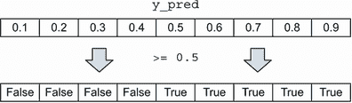

图 3.26 NumPy 中的`>=`操作符是逐元素应用的。对于每个元素，它执行比较操作，结果是一个包含`True`或`False`值的数组，这取决于比较的结果。

让我们将结果写入`churn`数组：

```
churn = y_pred >= 0.5
```

当我们有模型做出的这些硬预测时，我们希望了解它们有多好，因此我们准备进入下一步：评估这些预测的质量。在下一章中，我们将花费更多的时间学习关于二元分类的不同评估技术，但现在，让我们进行一个简单的检查，以确保我们的模型学到了有用的东西。

最简单的事情是取每个预测值并与实际值进行比较。如果我们预测客户会流失，而实际值也是流失，或者我们预测客户不会流失，而实际值也是不会流失，那么我们的模型做出了正确的预测。如果预测值与实际值不匹配，那么它们就不好。如果我们计算预测值与实际值匹配的次数，我们可以用它来衡量我们模型的质量。

这个质量指标被称为*准确率*。使用 NumPy 计算准确率非常简单：

```
(y_val == churn).mean()
```

虽然计算起来很容易，但当你第一次看到这个表达式时，可能很难理解它做了什么。让我们尝试将其分解成单独的步骤。

首先，我们应用`==`操作符来比较两个 NumPy 数组：`y_val`和`churn`。如果你还记得，第一个数组`y_val`只包含数字：零和一。这是我们目标变量：如果客户流失则为 1，否则为 0。第二个数组包含布尔预测值：`True`和`False`。在这种情况下，`True`表示我们预测客户会流失，而`False`表示客户不会流失（图 3.27）。

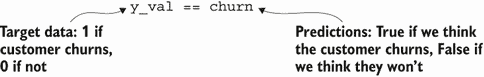

图 3.27 将`==`操作符应用于比较目标数据与我们的预测

尽管这两个数组内部有不同的数据类型（整数和布尔值），但仍然可以比较它们。布尔数组会被转换为整数类型，这样`True`值会被转换为“1”，而`False`值会被转换为“0”。然后 NumPy 就可以执行实际的比较操作（图 3.28）。

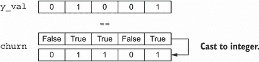

图 3.28 为了比较预测值与目标数据，包含预测值的数组被转换为整数。

与`>=`操作符类似，`==`操作符也是逐元素应用的。然而，在这种情况下，我们有两组数组需要比较，我们比较一个数组中的每个元素与另一个数组中相应的元素。结果是另一个包含`True`或`False`值的布尔数组，这取决于比较的结果（图 3.29）。

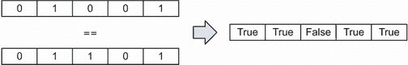

图 3.29 NumPy 中的`==`操作符应用于两个 NumPy 数组，是逐元素应用的。

在我们的情况下，如果`y_pred`中的真实值与我们的 churn 预测匹配，则标签是`True`，如果不匹配，则标签是`False`。换句话说，如果我们的预测是正确的，则为`True`，如果不正确，则为`False`。

最后，我们取比较的结果——布尔数组——并使用`mean()`方法计算其平均值。然而，这个方法应用于数字，而不是布尔值，因此在计算平均值之前，值被转换为整数：`True`值转换为“1”，`False`值转换为“0”（图 3.30）。

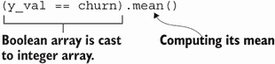

图 3.30 当计算布尔数组的平均值时，NumPy 首先将其转换为整数，然后计算平均值。

最后，正如我们已经知道的，如果我们计算只包含一和零的数组的平均值，结果是数组中一的比例，我们已经在计算流失率时使用了这个比例。因为在这种情况下，“1”（`True`）是一个正确的预测，“0”（`False`）是一个错误的预测，所以得到的结果告诉我们正确预测的百分比。

执行这一行代码后，我们在输出中看到 0.8。这意味着模型预测与实际值匹配了 80%的时间，或者说模型在 80%的情况下做出了正确的预测。这就是我们所说的模型的准确率。

现在我们知道了如何训练模型并评估其准确率，但了解它是如何做出预测的仍然很有用。在下一节中，我们试图查看模型内部，看看我们如何解释它所学习的系数。

### 3.3.3 模型解释

我们知道逻辑回归模型有两个参数，它从数据中学习这些参数：

+   *w*[0]是偏差项。

+   *w = (w*[1], *w*[2], ..., *w[n]**)*是权重向量。

我们可以从`model.intercept_[0]`中获取偏差项。当我们使用所有特征训练模型时，偏差项是-0.12。

其余的权重存储在`model.coef_[0]`中。如果我们查看内部，它只是一个数字数组，单独来看很难理解。

为了了解每个权重与哪个特征相关联，让我们使用`DictVectorizer`的`get_feature_names`方法。在查看它们之前，我们可以将特征名称与系数一起压缩：

```
dict(zip(dv.get_feature_names(), model.coef_[0].round(3)))
```

这会打印

```
{'contract=month-to-month': 0.563,
 'contract=one_year': -0.086,
 'contract=two_year': -0.599,
 'dependents=no': -0.03,
 'dependents=yes': -0.092,
 ... # the rest of the weights is omitted
 'tenure': -0.069,
 'totalcharges': 0.0}
```

为了理解模型的工作原理，让我们考虑当我们应用这个模型时会发生什么。为了建立直觉，让我们训练一个更简单、更小的模型，它只使用三个变量：`contract`、`tenure`和`totalcharges`。

变量`tenure`和`totalcharges`是数值型，所以我们不需要进行任何额外的预处理；我们可以直接使用它们。另一方面，`contract`是一个分类变量，因此为了能够使用它，我们需要应用独热编码。

让我们重新执行训练时相同的步骤，这次使用一组更小的特征集：

```
small_subset = ['contract', 'tenure', 'totalcharges']
train_dict_small = df_train[small_subset].to_dict(orient='records')
dv_small = DictVectorizer(sparse=False)
dv_small.fit(train_dict_small)

X_small_train = dv_small.transform(train_dict_small)
```

为了不与之前的模型混淆，我们在所有名称中添加了`small`。这样，我们可以清楚地知道我们使用的是较小的模型，并且可以避免意外覆盖我们已有的结果。此外，我们还将用它来比较小模型与完整模型的质量。

让我们看看小模型将使用哪些特征。为此，正如之前一样，我们使用`DictVectorizer`的`get_feature_names`方法：

```
dv_small.get_feature_names()
```

它输出了特征名称：

```
['contract=month-to-month',
 'contract=one_year',
 'contract=two_year',
 'tenure',
 'totalcharges']
```

有五个特征。正如预期的那样，我们有`tenure`和`totalcharges`，因为它们是数值型的，所以它们的名称没有改变。

对于`contract`变量，它是分类的，所以`DictVectorizer`应用了 one-hot 编码方案将其转换为数字。`contract`有三个不同的值：按月、一年和两年。因此，one-hot 编码方案创建了三个新的特征：`contract=month-to-month`、`contract=one_year`和`contract= two_years`。

让我们在这一组特征上训练小模型：

```
model_small = LogisticRegression(solver='liblinear', random_state=1)
model_small.fit(X_small_train, y_train)
```

模型几秒钟后准备就绪，我们可以查看它学到的权重。让我们首先检查偏差项：

```
model_small.intercept_[0]
```

它输出-0.638。然后我们可以检查其他权重，使用与之前相同的代码：

```
dict(zip(dv_small.get_feature_names(), model_small.coef_[0].round(3)))
```

这行代码显示了每个特征的权重：

```
{'contract=month-to-month': 0.91,
 'contract=one_year': -0.144,
 'contract=two_year': -1.404,
 'tenure': -0.097,
 'totalcharges': 0.000}
```

让我们把所有这些权重放在一起，并称它们为*w*[1]、*w*[2]、*w*[3]、*w*[4]和*w*[5]（表 3.2）。

表 3.2 逻辑回归模型的权重

| 偏差 | `contract` | `tenure` | `charges` |
| --- | --- | --- | --- |
| month | year | 2-year |
| *w*[0] | *w*[1] | *w*[2] | *w*[3] | *w*[4] | *w*[5] |
| —0.639 | 0.91 | —0.144 | —1.404 | —0.097 | 0.0 |

现在我们来看看这些权重，并尝试理解它们的含义以及我们如何解释它们。

首先，让我们思考一下偏差项及其含义。回想一下，在线性回归的情况下，它是基线预测：在没有了解其他关于观察结果的情况下所做的预测。在汽车价格预测项目中，它将是汽车的平均价格。这不是最终的预测；稍后，这个基线将与其他权重一起进行校正。

在逻辑回归的情况下，情况类似：它是基线预测——或者平均会得到的分数。同样，我们稍后会用其他权重来校正这个分数。然而，对于逻辑回归，解释要复杂一些，因为我们在得到最终输出之前还需要应用 sigmoid 函数。让我们考虑一个例子来帮助我们理解这一点。

在我们的情况下，偏差项的值为-0.639。这个值是负的。如果我们看 sigmoid 函数，我们可以看到对于负值，输出低于 0.5（图 3.31）。对于-0.639， churn 的概率为 34%。这意味着平均而言，客户更有可能继续与我们合作而不是流失。

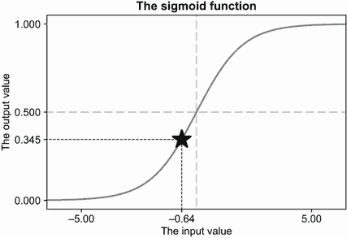

图 3.31 sigmoid 曲线上偏差项-0.639。结果概率小于 0.5，因此平均客户更有可能不会流失。

偏置项前的符号为负的原因是类别不平衡。训练数据中流失用户比未流失用户少得多，这意味着平均流失概率较低，因此这个偏置项的值是有意义的。

接下来的三个权重是合同变量的权重。因为我们使用 one-hot 编码，所以我们有三个`contract`特征和三个权重，每个特征一个：

```
 'contract=month-to-month': 0.91,
 'contract=one_year': -0.144,
 'contract=two_year': -1.404.
```

为了建立我们对如何理解和解释 one-hot 编码权重的直觉，让我们考虑一个签订按月合同的客户。`contract`变量有以下 one-hot 编码表示：第一个位置对应按月值，是热的，因此设置为“1”。其余位置对应 one_year 和 two_years，因此它们是冷的，设置为“0”（图 3.32）。

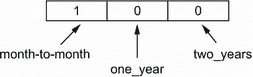

图 3.32 按月合同客户的 one-hot 编码表示

我们还知道与`contract=month-to-month`，`contract=one_year`和`contract=two_years`对应的权重*w*[1]，*w*[2]和*w*[3]（图 3.33）。


图 3.33 contract=month-to-month，contract=one_year 和 contract=two_years 特征的权重

为了进行预测，我们执行特征向量与权重的点积，即每个位置的值的乘积然后求和。乘积的结果是 0.91，结果与图 3.34 中`contract=month-to-month`特征的权重相同。

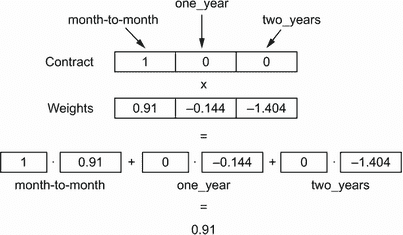

图 3.34 合同变量的 one-hot 编码表示与相应权重的点积。结果是 0.91，这是热特征的权重。

让我们考虑另一个例子：一个签订两年合同的客户。在这种情况下，`contract=two_year`特征是热的，值为“1”，其余的是冷的。当我们用变量的 one-hot 编码表示与权重向量相乘时，我们得到-1.404（图 3.35）。

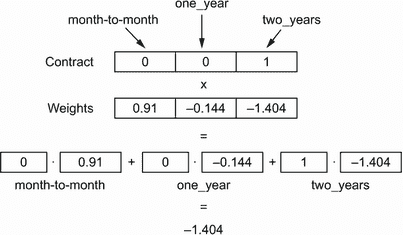

图 3.35 对于签订两年合同的客户，点积的结果是-1.404。

如我们所见，在预测过程中，只考虑了热特征的权重，其余权重在计算分数时并未考虑。这是有道理的：冷特征的值为零，当我们乘以零时，结果仍然是零（图 3.36）。

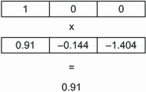 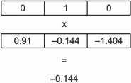 

图 3.36 当我们将变量的 one-hot 编码表示与模型中的权重向量相乘时，结果是热特征的权重。

对于独热编码特征的权重符号的解释遵循与偏置项相同的直觉。如果一个权重是正的，那么相应的特征是流失的指标，反之亦然。如果它是负的，那么它更有可能属于非流失客户。

让我们再次看看`contract`变量的权重。对于`contract=month-to-month`的第一个权重是正的，因此拥有这种合同类型的客户更有可能流失而不是不流失。其他两个特征`contract=one_year`和`contract=two_years`具有负号，因此这类客户更有可能对公司保持忠诚（图 3.37）。


图 3.37 权重的符号很重要。如果是正的，它是一个良好的流失指标；如果是负的，它表示一个忠诚的客户。

权重的幅度也很重要。对于`two_year`，权重是-1.404，其幅度大于`one_year`的权重-0.144。因此，两年合同不是流失的更强指标，比一年合同更强。这证实了我们之前做的特征重要性分析。这个特征集的风险比（流失风险）为每月 1.55，一年为 0.44，两年为 0.10（图 3.38）。


图 3.38 合同特征的权重及其转换为概率。对于`contract=two_year`，权重是-1.404，这表示非常低的流失概率。对于`contract=one_year`，权重是-0.144，因此概率适中。而对于`contract=month-to-month`，权重是 0.910，概率相当高。

现在让我们看看数值特征。我们有两个：`tenure`和`totalcharges`。`tenure`特征的权重是-0.097，带有负号。这意味着相同的事情：这个特征是流失的指标。我们已经从特征重要性分析中知道，客户与我们合作的时间越长，他们流失的可能性就越小。`tenure`与流失之间的相关性是-0.35，这也是一个负数。这个特征的权重证实了这一点：对于客户与我们合作的每一个月，总分数会降低 0.097。

另一个数值特征`totalchanges`的权重为零。因为它为零，无论这个特征的值是多少，模型都不会考虑它，所以这个特征对于做出预测并不是真正重要的。

为了更好地理解它，让我们考虑几个例子。对于第一个例子，让我们想象我们有一个拥有月度合同的用户，与我们合作了一年，支付了 1000 美元（图 3.39）。


图 3.39 模型为拥有月度合同和 12 个月服务期的客户计算的分数

这是我们对这位客户的预测：

+   我们从基线分数开始。它是具有-0.639 值的偏置项。

+   因为这是一个按月签订的合同，我们给这个值加上 0.91，得到 0.271。现在分数变成了正数，这可能意味着客户将要流失。我们知道月度合同是流失的一个强烈指标。

+   接下来，我们考虑`tenure`变量。对于客户在我们这里停留的每个月，我们从目前的分数中减去 0.097。因此，我们得到 0.271 – 12 · 0.097 = –0.893。现在分数再次变为负数，所以流失的可能性降低。

+   现在我们加上客户支付给我们的金额（`totalcharges`）乘以这个特征的权重，但因为它是零，所以我们不做任何事情。结果仍然是–0.893。

+   最终分数是一个负数，所以我们认为这位客户不太可能很快流失。

+   为了看到实际的流失概率，我们计算分数的 sigmoid 值，大约是 0.29。我们可以将这个值视为这位客户将要流失的概率。

如果我们还有另一位客户，他签订了年度合同，与我们合作了 24 个月，花费了 2,000 美元，那么分数是–2.823（图 3.40）。


图 3.40 模型为签订了年度合同且服务了 24 个月的客户计算的分数

在取 sigmoid 之后，–2.823 的分数变为 0.056，所以这位客户的流失概率更低（图 3.41）。


图 3.41 –2.823 和–0.893 的分数分别转换为概率：0.05 和 0.29

### 3.3.4 使用模型

现在我们对逻辑回归有了更好的了解，我们还可以解释我们的模型学到了什么，并理解它是如何进行预测的。

此外，我们还应用了模型到验证集上，计算了每个客户的流失概率，并得出结论，该模型的准确率是 80%。在下一章中，我们将评估这个数字是否令人满意，但现在，让我们尝试使用我们训练的模型。现在我们可以将模型应用于客户进行评分。这相当简单。

首先，我们取一个我们想要评分的客户，并将所有变量值放入一个字典中：

```
customer = {
    'customerid': '8879-zkjof',
    'gender': 'female',
    'seniorcitizen': 0,
    'partner': 'no',
    'dependents': 'no',
    'tenure': 41,
    'phoneservice': 'yes',
    'multiplelines': 'no',
    'internetservice': 'dsl',
    'onlinesecurity': 'yes',
    'onlinebackup': 'no',
    'deviceprotection': 'yes',
    'techsupport': 'yes',
    'streamingtv': 'yes',
    'streamingmovies': 'yes',
    'contract': 'one_year',
    'paperlessbilling': 'yes',
    'paymentmethod': 'bank_transfer_(automatic)',
    'monthlycharges': 79.85,
    'totalcharges': 3320.75,
}
```

注意：当我们为预测准备项目时，它们应该经过与我们为训练模型所进行的相同的预处理步骤。如果我们不按完全相同的方式进行，模型可能无法获得它期望看到的东西，在这种情况下，预测可能会非常不准确。这就是为什么在前面的例子中，在`customer`字典中，字段名称和字符串值都转换为小写，空格被下划线替换。

现在我们可以使用我们的模型来查看这位客户是否会流失。让我们试试。

首先，我们使用`DictVectorizer`将这个字典转换为矩阵：

```
X_test = dv.transform([customer])
```

向量化器的输入是一个包含一个项目的列表：我们只想为一位客户评分。输出是一个包含特征的矩阵，而这个矩阵只包含一行——这位客户的特征：

```
[[   0\.  ,    1\.  ,    0\.  ,    1\.  ,    0\.  ,    0\.  ,    0\.  ,
     1\.  ,    1\.  ,    0\.  ,    1\.  ,    0\.  ,    0\.  ,   79.85,
     1\.  ,    0\.  ,    0\.  ,    1\.  ,    0\.  ,    0\.  ,    0\.  ,
     0\.  ,    1\.  ,    0\.  ,    1\.  ,    1\.  ,    0\.  ,    1\.  ,
     0\.  ,    0\.  ,    0\.  ,    0\.  ,    1\.  ,    0\.  ,    0\.  ,
     0\.  ,    1\.  ,    0\.  ,    0\.  ,    1\.  ,    0\.  ,    0\.  ,
     1\.  ,   41\.  , 3320.75]]
```

我们看到一组独热编码特征（一和零）以及一些数值特征（`monthlycharges`、`tenure`和`totalcharges`）。

现在我们将这个矩阵放入训练好的模型中：

```
model.predict_proba(X_test)
```

输出是一个包含预测的矩阵。对于每个客户，它输出两个数字，即客户继续与公司合作和客户流失的概率。因为只有一个客户，所以我们得到一个只有一行两列的小 NumPy 数组：

```
[[0.93, 0.07]]
```

我们只需要矩阵中的第一个行和第二个列的数字：这位客户流失的概率。要从数组中选择这个数字，我们使用方括号操作符：

```
model.predict_proba(X_test)[0, 1]
```

我们使用这个操作符从数组中选择第二列。然而，这次只有一个行，所以我们可以明确要求 NumPy 返回该行的值。因为 NumPy 中的索引从 0 开始，`[0, 1]`表示第一行，第二列。

当我们执行这一行时，我们看到输出是 0.073，这意味着这位客户流失的概率仅为 7%。这低于 50%，所以我们将不会给这位客户发送促销邮件。

我们可以尝试评分另一位客户：

```
customer = {
    'gender': 'female',
    'seniorcitizen': 1,
    'partner': 'no',
    'dependents': 'no',
    'phoneservice': 'yes',
    'multiplelines': 'yes',
    'internetservice': 'fiber_optic',
    'onlinesecurity': 'no',
    'onlinebackup': 'no',
    'deviceprotection': 'no',
    'techsupport': 'no',
    'streamingtv': 'yes',
    'streamingmovies': 'no',
    'contract': 'month-to-month',
    'paperlessbilling': 'yes',
    'paymentmethod': 'electronic_check',
    'tenure': 1,
    'monthlycharges': 85.7,
    'totalcharges': 85.7
}
```

让我们进行一次预测：

```
X_test = dv.transform([customer])
model.predict_proba(X_test)[0, 1]
```

模型的输出是 83%的流失可能性，因此我们应该给这位客户发送促销邮件，希望留住他们。

到目前为止，我们已经对逻辑回归的工作原理、如何使用 Scikit-learn 进行训练以及如何将其应用于新数据有了直觉。我们还没有涵盖结果的评估；这是我们将在下一章中要做的。

## 3.4 下一步

### 3.4.1 练习

你可以尝试一些事情来更好地学习这个主题：

+   在上一章中，我们亲自实现了许多事情，包括线性回归和数据集拆分。在这一章中，我们学习了如何使用 Scikit-learn 来做这些。尝试使用 Scikit-learn 重新做上一章的项目。要使用线性回归，你需要从`sklearn.linear_model`包中导入`LinearRegression`。要使用正则化回归，你需要从同一个包`sklearn.linear_model`中导入`Ridge`。

+   我们查看特征重要性指标，以获取对数据集的一些洞察，但并没有真正使用这些信息进行其他目的。使用这些信息的一种方法可能是从数据集中移除无用的特征，使模型更简单、更快，并可能更好。尝试从训练数据矩阵中排除两个最无用的特征（`gender`和`phoneservices`），看看验证准确率会发生什么变化。如果我们移除最有用的特征（`contract`）会怎样呢？

### 3.4.2 其他项目

我们可以用多种方式使用分类来解决现实生活中的问题，现在，在学完本章内容后，你应该有足够的知识来应用逻辑回归来解决类似的问题。特别是，我们建议以下方法：

+   分类模型常用于营销目的，它解决的问题之一是*潜在客户评分*。一个*潜在客户*可能转化（成为实际客户）也可能不转化。在这种情况下，转化是我们想要预测的目标。你可以从[`www.kaggle.com/ashydv/ leads-dataset`](https://www.kaggle.com/ashydv/leads-dataset)获取一个数据集并为其构建模型。你可能注意到，潜在客户评分问题与客户流失预测问题类似，但在一种情况下，我们希望新客户与我们签订合同，而在另一种情况下，我们希望客户不要取消合同。

+   分类的一个流行应用是预测违约，即估计客户不偿还贷款的风险。在这种情况下，我们想要预测的变量是违约，它也有两种结果：客户是否成功按时偿还了贷款（良好客户）或者没有（违约）。你可以在网上找到许多用于训练模型的数据库，例如[`archive.ics.uci.edu/ml/datasets/default+of+credit+card+clients`](https://archive.ics.uci.edu/ml/datasets/default+of+credit+card+clients)（或者通过 Kaggle 可用的相同数据：[`www.kaggle.com/pratjain/credit-card-default`](https://www.kaggle.com/pratjain/credit-card-default)）。

## 摘要

+   分类特征的*风险*告诉我们具有该特征的群体是否会具有我们模型中的条件。对于客户流失，值低于 1.0 表示低流失风险，而值高于 1.0 表示高流失风险。它告诉我们哪些特征对于预测目标变量很重要，并帮助我们更好地理解我们正在解决的问题。

+   互信息衡量一个分类变量与目标之间的（不）独立性程度。这是一种确定重要特征的好方法：互信息越高，特征就越重要。

+   相关系数衡量两个数值变量之间的依赖程度，它可以用来确定一个数值特征是否对预测目标变量有用。

+   独热编码为我们提供了一种将分类变量表示为数字的方法。没有它，我们就不可能轻松地在模型中使用这些变量。机器学习模型通常期望所有输入变量都是数值型的，因此如果我们想在建模中使用分类特征，编码方案是至关重要的。

+   我们可以通过使用 Scikit-learn 的`DictVectorizer`来实现独热编码。它自动检测分类变量并对它们应用独热编码方案，同时保留数值变量不变。使用起来非常方便，并且不需要我们进行大量的编码。

+   逻辑回归是一个线性模型，就像线性回归一样。不同之处在于逻辑回归在最后有一个额外的步骤：它应用 sigmoid 函数将分数转换为概率（介于零和一之间的数字）。这使得我们可以将其用于分类。输出是属于正类（在我们的案例中是流失）的概率。

+   数据准备完成后，训练逻辑回归非常简单：我们使用 Scikit-learn 中的`LogisticRegression`类并调用`fit`函数。

+   模型输出的是概率，而不是硬预测。为了二值化输出，我们在某个阈值处截断预测。如果概率大于或等于 0.5，我们预测`True`（流失），否则预测`False`（未流失）。这使得我们可以使用该模型来解决我们的问题：预测流失的客户。

+   逻辑回归模型的权重易于解释和说明，尤其是在使用单热编码方案对分类变量进行编码时。这有助于我们更好地理解模型的行为，并向他人解释它在做什么以及它是如何工作的。

在下一章中，我们将继续进行关于客户流失预测的项目。我们将探讨评估二元分类器的方法，然后利用这些信息来调整模型的表现。

## 练习答案

+   练习 3.1 B) 真实元素的百分比

+   练习 3.2 A) 它将保持数值变量不变，并仅对分类变量进行编码。

+   练习 3.3 B) sigmoid 函数将输出转换为介于零和一之间的值。
