# 4 分类评估指标

本章涵盖

+   准确率作为评估二元分类模型及其局限性的方式

+   使用混淆矩阵确定模型出错的地方

+   从混淆矩阵推导其他指标，如精确率和召回率

+   使用 ROC（接收者操作特征）和 AUC（ROC 曲线下的面积）来进一步了解二元分类模型的表现

+   对模型进行交叉验证以确保其表现最优

+   调整模型参数以实现最佳的预测性能

在本章中，我们继续上一章开始的项目：客户流失预测。我们已经下载了数据集，完成了初步的预处理和探索性数据分析，并训练了预测客户是否会流失的模型。我们还在验证数据集上评估了该模型，并得出结论，其准确率为 80%。

我们一直推迟到现在的疑问是 80%的准确率是否良好，以及它在模型质量方面的实际意义。我们将在本章回答这个问题，并讨论评估二元分类模型的其它方法：混淆矩阵、精确率、召回率、ROC 曲线和 AUC。

本章提供了大量复杂信息，但我们在这里讨论的评估指标对于实际机器学习至关重要。如果你不立即理解不同评估指标的细节，请不要担心：这需要时间和实践。随时可以回到本章，重新审视细节。

## 4.1 评估指标

我们已经为预测流失客户构建了一个二元分类模型。现在我们需要能够确定它的好坏。

为了做到这一点，我们使用了一个*指标*——一个查看模型做出的预测并将其与实际值进行比较的函数。然后，基于比较结果，它计算出模型的好坏。这非常有用：我们可以用它来比较不同的模型，并选择具有最佳指标值的模型。

存在着不同类型的指标。在第二章中，我们使用了 RMSE（均方根误差）来评估回归模型。然而，这个指标只能用于回归模型，不适用于分类。

对于评估分类模型，我们有其他更合适的指标。在本节中，我们将介绍二元分类最常见的评估指标，从我们在第三章中看到的准确率开始。

### 4.1.1 分类准确率

如你所记得的，二元分类模型的准确率是指它做出正确预测的百分比（图 4.1）。

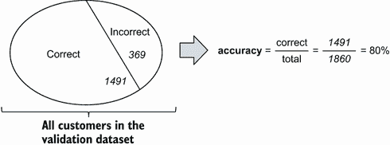

图 4.1 模型的准确率是正确预测的预测比例。

这种准确率是评估分类器的最简单方法：通过计算我们的模型正确的情况数量，我们可以了解很多关于模型行为和质量的信息。

在验证数据集上计算准确率很简单——我们只需计算正确预测的比例：

```
y_pred = model.predict_proba(X_val)[:, 1]   ❶
churn = y_pred >= 0.5                       ❷
(churn == y_val).mean()                     ❸
```

❶ 从模型获取预测值

❷ 进行“硬”预测

❸ 计算准确率

我们首先将模型应用于验证集以获取预测值 ❶。这些预测值是概率，所以我们将其在 ❷ 处截断为 0.5。最后，我们计算在 ❷ 中与实际情况匹配的预测比例。

结果是 0.8016，这意味着我们的模型准确率为 80%。

我们首先应该问自己为什么选择 0.5 作为阈值而不是其他数字。这是一个任意的选择，但实际上检查其他阈值也不难：我们只需遍历所有可能的阈值候选者并计算每个的准确率。然后我们可以选择具有最佳准确率分数的那个。

尽管我们可以轻松实现自己的准确率，但我们也可以使用现有的实现。Scikit-learn 库提供了各种指标，包括准确率以及我们稍后将要使用的许多其他指标。你可以在 metrics 包中找到这些指标。

我们将继续在第三章开始的工作笔记本上工作。让我们打开它，并添加 `import` 语句以从 Scikit-learn 的 metrics 包中导入准确率：

```
from sklearn.metrics import accuracy_score
```

现在，我们可以遍历不同的阈值并检查哪个阈值给出了最佳的准确率：

```
thresholds = np.linspace(0, 1, 11)       ❶

for t in thresholds:                     ❷
    churn = y_pred >= t                  ❸
    acc = accuracy_score(y_val, churn)   ❸
    print('%0.2f %0.3f' % (t, acc))      ❹
```

❶ 创建一个包含不同阈值的数组：0.0、0.1、0.2 等

❷ 遍历每个阈值值

❸ 使用 Scikit-learn 的 accuracy_score 函数计算准确率

❹ 将阈值和准确率值打印到标准输出

在此代码中，我们首先创建一个包含阈值的数组。我们使用 NumPy 的 `linspace` 函数来做到这一点：它接受两个数字（在我们的情况下是 0 和 1）和数组应具有的元素数量（11）。结果，我们得到一个包含数字 0.0、0.1、0.2、...、1.0 的数组。你可以在附录 C 中了解更多关于 `linspace` 和其他 NumPy 函数的信息。

我们将这些数字用作阈值：我们遍历它们，并对每个值计算准确率。最后，我们打印出阈值和准确率分数，以便我们可以决定哪个阈值是最好的。

当我们执行代码时，它将打印以下内容：

```
0.00 0.261
0.10 0.595
0.20 0.690
0.30 0.755
0.40 0.782
0.50 0.802
0.60 0.790
0.70 0.774
0.80 0.742
0.90 0.739
1.00 0.739
```

如我们所见，使用 0.5 的阈值给出了最佳的准确率。通常，0.5 是一个很好的起始阈值，但我们应该尝试其他阈值以确保 0.5 是最佳选择。

为了使其更直观，我们可以使用 Matplotlib 创建一个图表，显示准确率如何根据阈值变化。我们重复之前的过程，但这次不是只打印准确率分数，我们首先将这些值放入一个列表中：

```
thresholds = np.linspace(0, 1, 21)              ❶
accuracies = []                                 ❷
for t in thresholds:
    acc = accuracy_score(y_val, y_pred >= t)    ❸
    accuracies.append(acc)                      ❹
```

❶ 创建不同的阈值值（这次是 21 而不是 11）

❷ 创建一个空列表来存储准确率值

❸ 计算给定阈值下的准确率

❹ 记录此阈值的准确率

然后我们使用 Matplotlib 绘制这些值：

```
plt.plot(thresholds, accuracies)
```

执行这一行后，我们应该看到一个显示阈值与准确率之间关系的图表（图 4.2）。正如我们已经知道的，0.5 的阈值在准确率方面是最好的。

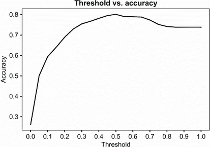

图 4.2 在不同阈值下评估的模型准确率。在将预测切分在 0.5 阈值时，我们达到了最佳准确率：如果预测高于 0.5，我们预测“流失”，否则我们预测“无流失”。

因此，最佳阈值是 0.5，我们可以达到的该模型的最佳准确率是 80%。

在上一章中，我们训练了一个更简单的模型：我们称之为 model_small。它基于仅三个变量：`contract`、`tenure`和`totalcharges`。

让我们也检查一下它的准确率。为此，我们首先在验证数据集上做出预测，然后计算准确率：

```
val_dict_small = df_val[small_subset].to_dict(orient='records')  ❶

X_small_val = dv_small.transform(val_dict_small)                 ❶
y_pred_small = model_small.predict_proba(X_small_val)[:, 1]      ❷

churn_small = y_pred_small >= 0.5                                ❷
accuracy_score(y_val, churn_small)                               ❸
```

❶ 对验证数据进行 one-hot 编码

❷ 使用小型模型预测流失

❸ 计算预测的准确率

当我们运行这段代码时，我们看到小型模型的准确率是 76%。因此，大型模型实际上比小型模型准确 4%。

然而，这仍然没有告诉我们 80%（或 76%）是否是一个好的准确率。

### 4.1.2 虚拟基线

虽然这个数字看起来还不错，但要了解 80%是否真的很好，我们需要将其与某些东西联系起来——例如，一个简单易懂的基线。这样一个基线可以是总是预测相同值的虚拟模型。

在我们的例子中，数据集是不平衡的，我们没有很多流失用户。因此，虚拟模型可以总是预测大多数类——“无流失”。换句话说，这个模型将始终输出 False，无论特征如何。这不是一个特别有用的模型，但我们可以将其用作基线，并与其他两个模型进行比较。

让我们创建这个基线预测：

```
size_val = len(y_val)                     ❶
baseline = np.repeat(False, size_val)     ❷
```

❶ 获取验证集中的客户数量

❷ 创建一个只包含 False 元素的数组

要创建一个包含基线预测的数组，我们首先需要确定验证集中有多少个元素。

接下来，我们创建一个包含虚拟预测的数组——这个数组的所有元素都是 False 值。我们使用 NumPy 的`repeat`函数来完成这个操作：它接受一个元素，并按照我们要求重复它多次。有关`repeat`函数和其他 NumPy 函数的更多详细信息，请参阅附录 C。

现在我们可以使用之前相同的代码来检查这个基线预测的准确率：

```
accuracy_score(baseline, y_val)
```

当我们运行这段代码时，它显示 0.738。这意味着基线模型的准确率大约是 74%（图 4.3）。

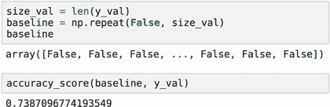

图 4.3 基线是一个总是为所有客户预测相同值的“模型”。这个基线的准确率是 74%。

正如我们所见，小型模型仅比朴素基线好 2%，而大型模型好 6%。如果我们考虑我们为训练这个大型模型所付出的所有努力，6%似乎并不比虚拟基线有显著改进。

流失预测是一个复杂的问题，也许这个改进是很大的。然而，仅从准确率分数来看，这一点并不明显。根据准确率，我们的模型仅略优于一个将所有客户视为非流失且不尝试保留任何客户的虚拟模型。

因此，我们需要其他指标——其他衡量我们模型质量的方法。这些指标基于混淆矩阵，我们将在下一节中介绍的概念。

## 4.2 混淆矩阵

尽管准确率容易理解，但它并不总是最好的指标。事实上，有时它可能会误导。我们已经看到这种情况发生了：我们模型的准确率是 80%，尽管这个数字看起来不错，但它仅比总是输出相同预测“无流失”的虚拟模型的准确率高 6%。

这种情况通常发生在我们有一个类别不平衡（一个类别的实例比另一个类别多）的情况下。我们知道，对于我们的问题，这绝对是一个案例：74%的客户没有流失，而只有 26%的客户流失了。

对于这类情况，我们需要一种不同的方法来衡量我们模型的质量。我们有几种选择，其中大多数都是基于混淆矩阵：一个简洁地表示我们模型预测所有可能结果的表格。

### 4.2.1 混淆矩阵简介

我们知道，对于二元分类模型，我们只能有两种可能的预测：真和假。在我们的情况下，我们可以预测一个客户是否会流失（真）或不会流失（假）。

当我们将模型应用于包含客户的整个验证数据集时，我们将它分为两部分（图 4.4）：

+   模型预测为“流失”的客户

+   模型预测为“无流失”的客户

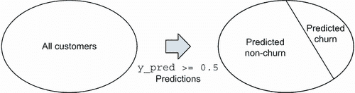

图 4.4 我们的模型将验证数据集中的所有客户分为两组：我们认为会流失的客户和不会流失的客户。

只有两种可能的正确结果：再次，真或假。客户要么实际上流失了（真），要么没有（假）。

这意味着，通过使用真实信息——关于目标变量的信息——我们再次可以将数据集分为两部分（图 4.5）：

+   流失的客户

+   没有流失的客户

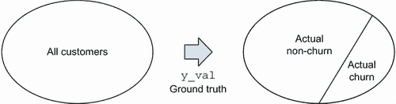

图 4.5 使用真实数据，我们可以将验证数据集分为两组：实际流失的客户和没有流失的客户。

当我们做出预测时，它要么是正确的，要么是错误的：

+   如果我们预测“流失”，客户确实可能会流失，也可能不会。

+   如果我们预测“无流失”，那么客户确实可能没有流失，但也可能流失。

这给我们带来了四种可能的结果（图 4.6）：

+   我们预测为假，答案是假。

+   我们预测为假，但答案是真。

+   我们预测为真，但答案是假。

+   我们预测为真，答案是真。

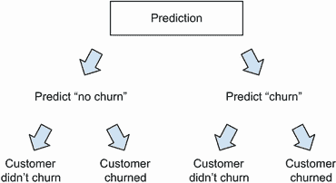

图 4.6 有四种可能的结果：我们预测“churn”，客户要么流失要么没有，我们预测“no churn”，客户再次要么流失要么没有。

这两种情况——第一种和最后一种——是好的：预测与实际值匹配。剩下的两种情况是坏的：我们没有做出正确的预测。

每种这四种情况都有其自己的名称（图 4.7）：

+   真阴性（TN）：我们预测为假（“no churn”），而实际标签也是假（“no churn”）。

+   真阳性（TP）：我们预测为真（“churn”），而实际标签也是真（“churn”）。

+   假阴性（FN）：我们预测为假（“no churn”），但实际上是真（客户流失了）。

+   假阳性（FP）：我们预测为真（“churn”），但实际上是假（客户留在了我们这里）。

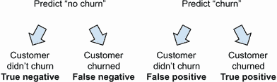

图 4.7 每种可能的四种结果都有其自己的名称：真阴性、假阴性、假阳性和真阳性。

将这些结果以表格形式排列是直观的。我们可以将预测类别（假和真）放在列中，将实际类别（假和真）放在行中（图 4.8）。

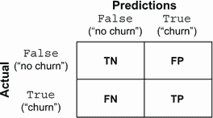

图 4.8 我们可以将结果组织成表格——预测值作为列，实际值作为行。这样，我们将所有预测场景分解为四个不同的组：TN（真阴性）、TP（真阳性）、FN（假阴性）和 FP（假阳性）。

当我们替换每种结果发生的次数时，我们得到我们模型的混淆矩阵（图 4.9）。

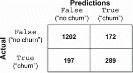

图 4.9 在混淆矩阵中，每个单元格包含每种结果发生的次数。

使用 NumPy 计算混淆矩阵单元格中的值相当简单。接下来，我们将看到如何做到这一点。

### 4.2.2 使用 NumPy 计算混淆矩阵

为了更好地理解我们的混淆矩阵，我们可以直观地展示它对验证数据集的影响（图 4.10）。


图 4.10 当我们将模型应用于验证数据集时，我们得到四种不同的结果（TN、FP、TP 和 FN）。

要计算混淆矩阵，我们需要执行以下步骤：

+   首先，预测将数据集分为两部分：我们预测为真（“churn”）的部分和预测为假（“no churn”）的部分。

+   同时，目标变量将这个数据集分为两个不同的部分：实际流失的客户（`y_val`中的“1”）和没有流失的客户（`y_val`中的“0”）。

+   当我们将这些分割组合起来时，我们得到四组客户，这正好是混淆矩阵中的四种不同结果。

将这些步骤转换为 NumPy 是直接的：

```
t = 0.5                                                      ❶
predict_churn = (y_pred >= t)                                ❶
predict_no_churn = (y_pred < t)                              ❶

actual_churn = (y_val == 1)                                  ❷
actual_no_churn = (y_val == 0)                               ❷

true_positive = (predict_churn & actual_churn).sum()         ❸
false_positive = (predict_churn & actual_no_churn).sum()     ❹

false_negative = (predict_no_churn & actual_churn).sum()     ❺
true_negative = (predict_no_churn & actual_no_churn).sum()   ❻
```

❶ 在阈值 0.5 处进行预测

❷ 获取实际的目标值

❸ 计算真正结果（我们正确预测了流失的情况）

❹ 计算假阳性（我们预测了流失，但客户没有流失的情况）

❺ 计算真阴性（我们正确预测了没有流失的情况）

❻ 计算假阴性（我们预测了没有流失，但客户流失了的情况）

我们从在 0.5 的阈值上进行预测开始。

结果是两个 NumPy 数组：

+   在第一个数组（`predict_churn`）中，如果一个元素为 True，表示模型认为相应的客户将要流失，否则为 False。

+   同样，在第二个数组（`predict_no_churn`）中，True 表示模型认为客户不会流失。

第二个数组`predict_no_churn`是`predict_churn`的完全相反：如果`predict_churn`中的元素为 True，则`predict_no_churn`中的元素为 False，反之亦然（图 4.11）。这是验证数据集第一次分割成两部分——基于预测的分割。

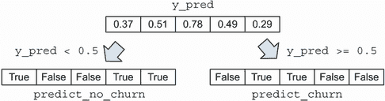

图 4.11 将预测分割成两个布尔 NumPy 数组：`predict_churn`如果概率高于 0.5，`predict_no_churn`如果概率低于 0.5

接下来，我们在❷中记录目标变量的实际值。结果也是两个 NumPy 数组（图 4.12）：

+   如果客户流失了（值为“1”），那么`actual_churn`中的相应元素为 True，否则为 False。

+   对于`actual_no_churn`，情况正好相反：当客户没有流失时为 True。

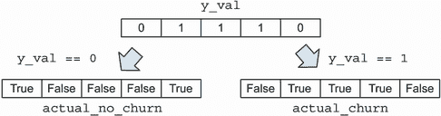

图 4.12 将实际值数组分割成两个布尔 NumPy 数组：`actual_no_churn`如果客户没有流失（`y_val` `==` `0`）和`actual_churn`如果客户流失了（`y_val` `==` `1`）

这就是数据集的第二次分割——基于目标变量的分割。

现在我们将这两个分割合并——或者更准确地说，这四个 NumPy 数组。

要计算在❸中的真正结果数量，我们使用 NumPy 的逻辑“与”运算符（`&`）和`sum`方法：

```
true_positive = (predict_churn & actual_churn).sum()
```

逻辑“与”运算符仅在两个值都为 True 时才返回 True。如果至少有一个是 False 或者两个都是 False，则返回 False。在`true_positive`的情况下，它只有在预测“流失”并且客户实际上流失时才会是 True（图 4.13）。

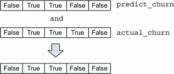

图 4.13 将元素级和运算符（`&`）应用于两个 NumPy 数组`predict_churn`和`actual_churn`；这创建了一个新的数组，其中在两个数组都包含 True 的位置为 True，在其他所有位置为 False。

然后我们使用 NumPy 的`sum`方法，它简单地计算数组中有多少个`True`值。它是通过首先将布尔数组转换为整数，然后求和来做到这一点的（图 4.14）。我们在上一章使用`mean`方法时已经看到了类似的行为。

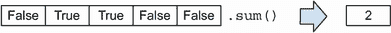

图 4.14 在布尔数组上调用`sum`方法：我们得到数组中为 True 的元素数量。

因此，我们得到了真正正例的数量。其他值在行❹、❺和❻中类似计算。

现在，我们只需要将这些值组合成一个 NumPy 数组：

```
confusion_table = np.array(
 [[true_negative, false_positive],
 [false_negative, true_positive]])
```

当我们打印出来时，我们得到以下数字：

```
[[1202, 172],
 [ 197, 289]]
```

绝对数字可能难以理解，因此我们可以通过将每个值除以项目总数来将它们转换为分数：

```
confusion_table / confusion_table.sum()
```

这将打印出以下数字：

```
[[0.646, 0.092],
[0.105, 0.155]]
```

我们可以将结果总结在一张表中（表 4.1）。我们看到模型在预测负值方面做得相当好：65%的预测是真正的负例。然而，它犯了很多两种类型的错误：错误正例和错误负例的数量大致相等（分别为 9%和 11%）。

表 4.1 在阈值为 0.5 的流失分类器的混淆矩阵。我们看到模型很容易正确预测非流失用户，但更难识别流失用户。

| 包含所有特征的完整模型 |
| --- |
|  | 预测 |
|  | 错误 | 正确 |
| 实际 | 错误 | 1202 (65%) | 172 (9%) |
| 真实 | 错误 | 197 (11%) | 289 (15%) |

这个表格让我们更好地理解了模型的性能——现在我们可以将性能分解为不同的组成部分，并了解模型在哪些地方犯了错误。实际上，我们看到模型的性能并不理想：它在尝试识别将要流失的用户时犯了很多错误。这是仅凭准确率分数无法看到的。

我们可以使用完全相同的代码对小型模型重复相同的流程（表 4.2）。

表 4.2 小型模型的混淆矩阵

| 包含三个特征的小型模型 |
| --- |
|  | 预测 |
|  | 错误 | 正确 |
| 实际 | 错误 | 1189 (63%) | 185 (10%) |
| 真实 | 错误 | 248 (12%) | 238 (13%) |

当我们将小型模型与完整模型进行比较时，我们发现它在正确识别非流失用户方面差了 2%（真正负例从 63%变为 65%），在正确识别流失用户方面也差了 2%（真正正例从 13%变为 15%），这两个差异加起来解释了这两个模型准确率之间的 4%差异（76%对 80%）。

混淆矩阵中的值是许多其他评估指标的基础。例如，我们可以通过将所有正确的预测——真正的负例和真正的正例相加——然后除以表中四个单元格中所有观察值的总数来计算准确率：

准确率 = (真正的负例 + 真正的正例) / (真正的负例 + 真正的正例 + 错误的正例 + 错误的负例)

除了准确率之外，我们还可以根据混淆矩阵中的值计算其他指标。最有用的是精确率和召回率，我们将在下一节中介绍。

练习 4.1

什么是错误正例？

a) 我们预测客户“不会流失”，但他们停止使用我们的服务

b) 我们预测客户会“流失”，但他们没有流失

c) 我们预测客户会“流失”，并且他们确实流失了

### 4.2.3 精确率和召回率

如前所述，在处理像我们这样的不平衡数据集时，准确率可能会误导。在这种情况下，其他指标是有帮助的：精确率和召回率。

精确率和召回率都是从混淆矩阵的值计算得出的。它们两者都有助于我们理解模型在类别不平衡情况下的质量。

让我们从精确率开始。模型的精确率告诉我们有多少正预测是正确的。它是正确预测的正例的比例。在我们的案例中，它是实际流失（TP）的客户数除以我们认为会流失的所有客户数（TP + FP）（图 4.15）：

P = TP / (TP + FP)

对于我们的模型，精确率为 62%：

P = 289 / (289 + 172) = 172 / 461 = 0.62

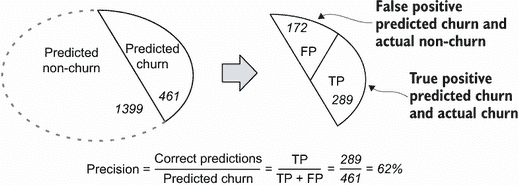

图 4.15 模型的精确率是指所有正预测（TP + FP）中正确预测（TP）的比例。

召回率是指所有正例中正确分类的正例的比例。在我们的案例中，为了计算召回率，我们首先查看所有流失的客户，看看我们正确识别了多少。

计算召回率的公式是

R = TP / (TP + FN)

就像精确率的公式一样，分子是真正的正例数，但分母不同：它是验证数据集中所有正例（`y_val` `==` `1`）的数量（图 4.16）。

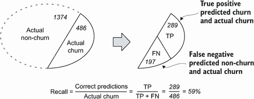

图 4.16 模型的召回率是指所有客户中正确预测为流失（TP）的客户占所有流失客户（TP + FN）的比例。

对于我们的模型，召回率为 59%：

R = 286 / (289 + 197) = 289 / 486 = 0.59

精确率和召回率之间的差异可能一开始看起来很微妙。在两种情况下，我们都关注正确预测的数量，但差异在于分母（图 4.17）：

+   精确率：在预测为流失的客户中，正确预测（TP）的百分比是多少？

+   召回率：在所有流失客户（TP + FN）中，正确预测为流失（TP）的百分比是多少？

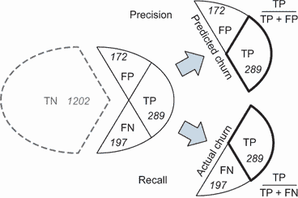

图 4.17 精确率和召回率都关注正确的预测（TP），但分母不同。对于精确率，它是预测为流失的客户数，而对于召回率，它是流失的客户数。

我们还可以看到，精确率和召回率都没有考虑真正的负例（图 4.17）。这正是为什么它们是评估不平衡数据集的良好指标。对于类别不平衡的情况，真正的负例通常比其他所有东西都多——但与此同时，它们通常对我们来说也不是特别有趣。让我们看看原因。

我们项目的目标是识别可能流失的客户。一旦我们做到了这一点，我们就可以向他们发送促销信息，希望他们改变主意。

在进行这项工作时，我们会犯两种类型的错误：

+   我们意外地向那些本不会流失的人发送了消息——这些人就是模型的假阳性。

+   我们有时也未能识别那些实际上会流失的人。我们没有向这些人发送消息——他们是我们的假阴性。

精度和召回率帮助我们量化这些错误。

精度帮助我们了解有多少人错误地收到了促销信息。精度越好，假阳性就越少。62%的精度意味着 62%的触及客户确实会流失（我们的真阳性），而剩余的 38%则不会（假阳性）。

召回率帮助我们了解我们未能找到多少流失客户。召回率越好，假阴性就越少。59%的召回率意味着我们只触及了 59%的所有流失用户（真阳性），而未能识别剩余的 41%（假阴性）。

如我们所见，在这两种情况下，我们实际上并不需要知道真阴性的数量：尽管我们可以正确地将它们识别为未流失，但我们不会对它们做任何事情。

尽管 80%的准确率可能表明模型很棒，但查看其精度和召回率告诉我们，它实际上犯了很多错误。这通常不是决定性的：在机器学习中，模型犯错误是不可避免的，而现在我们至少对我们的流失预测模型性能有了更好的、更现实的了解。

精度和召回率是很有用的指标，但它们仅描述了分类器在某个特定阈值下的性能。通常，有一个能够总结分类器在所有可能阈值选择下性能的指标是有用的。我们将在下一节中查看这些指标。

练习 4.2

什么是精度？

a) 验证数据集中正确识别的流失客户百分比

b) 在我们预测为流失的客户中，实际流失的客户百分比

* * *

练习 4.3

什么是召回率？

a) 在所有流失客户中正确识别的流失客户百分比

b) 在我们预测为流失的客户中，正确分类的客户百分比

## 4.3 ROC 曲线和 AUC 分数

我们之前提到的指标仅适用于二元预测——当我们输出中只有真和假值时。然而，我们确实有方法来评估模型在所有可能的阈值选择下的性能。ROC 曲线就是这些选项之一。

ROC 代表“接收者操作特征”，它最初是为评估二战期间雷达探测器的强度而设计的。它被用来评估探测器如何区分两个信号：是否有飞机在那里。如今，它被用于类似的目的：它显示了模型如何区分两个类别，正类和负类。在我们的案例中，这些类别是“流失”和“未流失”。

我们需要两个指标来绘制 ROC 曲线：TPR 和 FPR，即真阳性率和假阳性率。让我们来看看这些指标。

### 4.3.1 真阳性率和假阳性率

ROC 曲线基于两个量，FPR 和 TPR：

+   假阳性率 (FPR)：所有负例中假阳性的比例

+   真阳性率 (TPR)：所有正例中真阳性的比例

与精确率和召回率一样，这些值基于混淆矩阵。我们可以使用以下公式来计算它们：

FPR = FP / (FP + TN)

TPR = TP / (TP + FN)

FPR 和 TPR 涉及混淆矩阵（图 4.18）的两个独立部分：

+   对于 FPR，我们查看表格的第一行：所有负例中假阳性的比例。

+   对于 TPR，我们查看表格的第二行：所有正例中真阳性的比例。

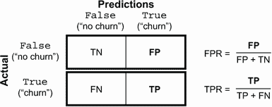

图 4.18 在计算 FPR 时，我们查看混淆矩阵的第一行，而在计算 TPR 时，我们查看第二行。

让我们为我们的模型计算这些值（图 4.19）：

FPR = 172 / 1374 = 12.5%

FPR 是我们预测为流失的用户占未流失用户总数的比例。FPR 的值越小，说明模型越好——它有很少的假阳性：

TPR = 289 / 486 = 59%

TPR 是我们预测为流失的用户占实际流失用户总数的比例。请注意，TPR 与召回率相同，因此 TPR 越高越好。

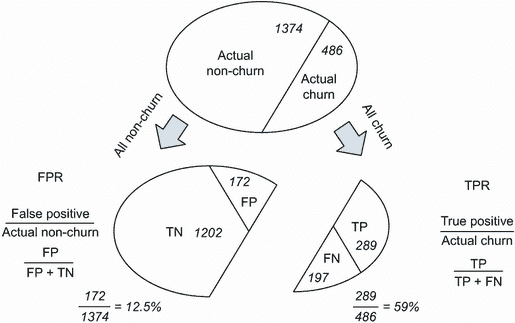

图 4.19 FPR 是所有非流失客户中假阳性的比例：FPR 越小越好。TPR 是所有流失客户中真阳性的比例：TPR 越大越好。

然而，我们仍然只考虑 FPR 和 TPR 指标在单个阈值值上的情况——在我们的例子中，是 0.5。为了能够使用它们来绘制 ROC 曲线，我们需要为许多不同的阈值值计算这些指标。

### 4.3.2 在多个阈值下评估模型

二元分类模型，如逻辑回归，通常输出一个概率——介于零和一之间的分数。为了做出实际预测，我们通过设置某个阈值将输出二值化，以获得仅包含真和假值的分数。

我们可以像本章前面评估准确率时那样，对一系列阈值进行模型评估，而不是评估一个特定的阈值。

为了做到这一点，我们首先遍历不同的阈值值，并计算每个阈值的混淆矩阵值。

列表 4.1 计算不同阈值下的混淆矩阵

```
scores = []                                     ❶

thresholds = np.linspace(0, 1, 101)             ❷

for t in thresholds:                            ❷
    tp = ((y_pred >= t) & (y_val == 1)).sum()   ❸
    fp = ((y_pred >= t) & (y_val == 0)).sum()   ❸
    fn = ((y_pred < t) & (y_val == 1)).sum()    ❸
    tn = ((y_pred < t) & (y_val == 0)).sum()    ❸
    scores.append((t, tp, fp, fn, tn))          ❹
```

❶ 创建一个列表，我们将在这里保存结果

❷ 创建一个包含不同阈值值的数组，并遍历它们

❸ 计算每个阈值下的预测混淆矩阵

❹ 将结果追加到分数列表中

这个想法与我们之前用准确率所做的是类似的，但不同的是，我们记录的不是单个值，而是混淆矩阵的所有四个结果。

处理一个元组列表并不容易，所以让我们将其转换为 Pandas 数据框：

```
df_scores = pd.DataFrame(scores)                             ❶
df_scores.columns = ['threshold', 'tp', 'fp', 'fn', 'tn']    ❷
```

❶ 将列表转换为 Pandas dataframe

❷ 为 dataframe 的列分配名称

这给我们一个包含五个列的 dataframe（图 4.20）。

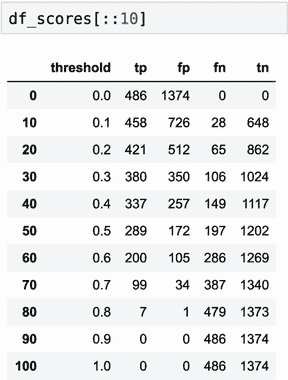

图 4.20 在不同阈值水平下评估的混淆矩阵元素的 dataframe。`[::10]`表达式选择 dataframe 中的每 10 条记录。

现在，我们可以计算 TPR 和 FPR 得分。因为数据现在在 dataframe 中，我们可以一次性计算所有值：

```
df_scores['tpr'] = df_scores.tp / (df_scores.tp + df_scores.fn)
df_scores['fpr'] = df_scores.fp / (df_scores.fp + df_scores.tn)
```

运行此代码后，dataframe 中新增了两列：tpr 和 fpr（图 4.21）。

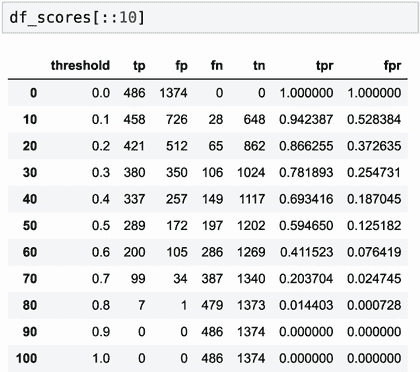

图 4.21 包含混淆矩阵值以及在不同阈值下评估的 TPR 和 FPR 的 dataframe

让我们绘制它们（图 4.22）：

```
plt.plot(df_scores.threshold, df_scores.tpr, label='TPR')
plt.plot(df_scores.threshold, df_scores.fpr, label='FPR')
plt.legend()
```

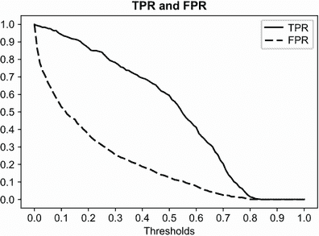

图 4.22 模型在不同阈值下的 TPR 和 FPR

TPR 和 FPR 都从 100%开始——在阈值为 0.0 时，我们预测每个人都“流失”：

+   FPR（假正率）为 100%，因为我们预测中只有假阳性。没有真正的阴性：没有人被预测为非流失。

+   TPR 为 100%，因为我们只有真正的阳性，没有假阴性。

随着阈值的增加，这两个指标都会下降，但下降速度不同。

理想情况下，FPR 应该迅速下降。小的 FPR 表明模型在预测负例（假阳性）时犯的错误很少。

另一方面，TPR 应该缓慢下降，理想情况下始终接近 100%：这意味着模型很好地预测了真正的阳性。

为了更好地理解这些 TPR 和 FPR 的含义，让我们将其与两个基线模型进行比较：一个随机模型和理想模型。我们将从一个随机模型开始。

### 4.3.3 随机基线模型

随机模型输出 0 到 1 之间的随机分数，无论输入如何。它很容易实现——我们只需生成一个包含均匀随机数的数组：

```
np.random.seed(1)                                    ❶
y_rand = np.random.uniform(0, 1, size=len(y_val))    ❷
```

❶ 设置随机种子以确保可重复性

❷ 生成 0 到 1 之间的随机数数组

现在，我们可以简单地假设`y_rand`包含我们“模型”的预测。

让我们计算随机模型的 FPR 和 TPR。为了简化，我们将重用之前编写的代码并将其放入函数中。

列表 4.2 在不同阈值下计算 TPR 和 FPR 的函数

```
def tpr_fpr_dataframe(y_val, y_pred):                                 ❶
    scores = []                                                       ❷

    thresholds = np.linspace(0, 1, 101)                               ❷

    for t in thresholds:                                              ❷
        tp = ((y_pred >= t) & (y_val == 1)).sum()                     ❷
        fp = ((y_pred >= t) & (y_val == 0)).sum()                     ❷
        fn = ((y_pred < t) & (y_val == 1)).sum()                      ❷
        tn = ((y_pred < t) & (y_val == 0)).sum()                      ❷
        scores.append((t, tp, fp, fn, tn))                            ❷
    df_scores = pd.DataFrame(scores)                                  ❸
    df_scores.columns = ['threshold', 'tp', 'fp', 'fn', 'tn']         ❸

    df_scores['tpr'] = df_scores.tp / (df_scores.tp + df_scores.fn)   ❹
    df_scores['fpr'] = df_scores.fp / (df_scores.fp + df_scores.tn)   ❹

    return df_scores                                                  ❺
```

❶ 定义一个函数，该函数接受实际值和预测值

❷ 计算不同阈值下的混淆矩阵

❸ 将混淆矩阵中的数字转换为 dataframe

❹ 使用混淆矩阵中的数字计算 TPR 和 FPR

❺ 返回结果 dataframe

现在，让我们使用此函数来计算随机模型的 TPR 和 FPR：

```
df_rand = tpr_fpr_dataframe(y_val, y_rand)
```

这创建了一个包含不同阈值下 TPR 和 FPR 值的 dataframe（图 4.23）。

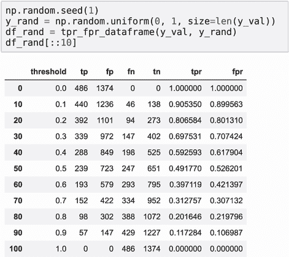

图 4.23 随机模型的 TPR 和 FPR 值

让我们绘制它们：

```
plt.plot(df_rand.threshold, df_rand.tpr, label='TPR')
plt.plot(df_rand.threshold, df_rand.fpr, label='FPR')
plt.legend()
```

我们看到，TPR 和 FPR 曲线几乎沿着直线从 100%下降到 0%，几乎遵循直线（图 4.24）。

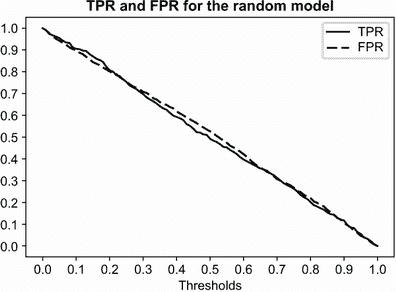

图 4.24 随机分类器的 TPR 和 FPR 以直线从 100% 降至 0%。

在阈值为 0.0 时，我们将所有人视为流失。TPR 和 FPR 都是 100%：

+   FPR 为 100%，因为我们只有假正例：所有非流失客户都被识别为流失。

+   TPR 为 100%，因为我们只有真正的正例：我们可以正确地将所有流失客户分类为流失。

随着阈值的增加，TPR 和 FPR 都会降低。

在阈值为 0.4 时，概率为 40% 的模型预测“非流失”，概率为 60% 的模型预测“流失”。TPR 和 FPR 都是 60%：

+   FPR 为 60%，因为我们错误地将 60% 的非流失客户分类为流失。

+   TPR 为 60%，因为我们正确地将 60% 的流失客户分类为流失。

最后，在 1.0 的阈值下，TPR 和 FPR 都是 0%。在这个阈值下，我们预测所有人都是非流失：

+   FPR 为 0%，因为我们没有假正例：我们可以正确地将所有非流失客户分类为非流失。

+   TPR 为 0%，因为我们没有真正的正例：所有流失客户都被识别为非流失。

现在让我们继续到下一个基线，看看理想模型下的 TPR 和 FPR 看起来如何。

### 4.3.4 理想模型

理想模型总是做出正确的决策。我们将更进一步，考虑理想排名模型。该模型以这种方式输出分数，使得流失客户的分数总是高于非流失客户。换句话说，所有流失的预测概率应该高于非流失的预测概率。

因此，如果我们将模型应用于我们的验证集中的所有客户，然后按预测概率排序，我们首先将得到所有非流失客户，然后是流失客户（图 4.25）。

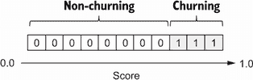

图 4.25 理想模型按顺序排列客户，首先是非流失客户，然后是流失客户。

当然，在现实生活中我们不可能有这样的模型。然而，它仍然很有用：我们可以用它来比较我们的 TPR 和 FPR 与理想模型的 TPR 和 FPR。

让我们生成理想的预测。为了简化，我们生成一个带有假目标变量的数组，这些变量已经排序：首先只包含 0s，然后只包含 1s（图 4.25）。至于“预测”，我们可以使用 `np.linspace` 函数创建一个数组，其中的数字从第一个单元格的 0 增长到最后一个单元格的 1。

让我们来做这件事：

```
num_neg = (y_val == 0).sum()                          ❶
num_pos = (y_val == 1).sum()                          ❶

y_ideal = np.repeat([0, 1], [num_neg, num_pos])       ❷
y_pred_ideal = np.linspace(0, 1, num_neg + num_pos)   ❸

df_ideal = tpr_fpr_dataframe(y_ideal, y_pred_ideal)   ❹
```

❶ 计算数据集中负例和正例的数量

❷ 生成一个数组，首先重复 0s num_neg 次数，然后重复 1s num_pos 次数

❸ 生成“模型”的预测：从第一个单元格的 0 增长到最后一个单元格的 1 的数字

❹ 计算分类器的 TPR 和 FPR 曲线

因此，我们得到一个包含理想模型 TPR 和 FPR 值的数据框（图 4.26）。您可以在附录 C 中了解更多关于 `np.linspace` 和 `np.repeat` 函数的信息。

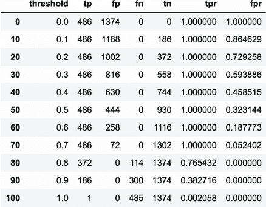

图 4.26 理想模型的 TPR 和 FPR 值

现在我们可以绘制它（图 4.27）：

```
plt.plot(df_ideal.threshold, df_ideal.tpr, label='TPR')
plt.plot(df_ideal.threshold, df_ideal.fpr, label='FPR')
plt.legend()
```

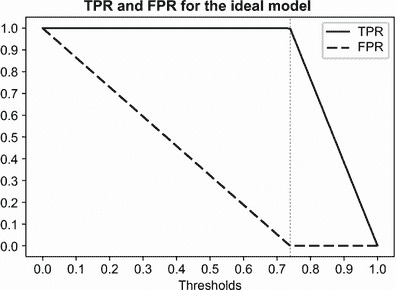

图 4.27 理想模型的 TPR 和 FPR 曲线

从图中，我们可以看到

+   TPR 和 FPR 都从 100%开始，结束于 0%。

+   对于低于 0.74 的阈值，我们总是正确地将所有流失客户分类为流失；这就是为什么 TRP 保持在 100%。另一方面，我们将一些非流失客户错误地分类为流失——这些是我们的假阳性。随着阈值的提高，越来越少地非流失客户被分类为流失，因此 FPR 下降。在 0.6 时，我们错误地将 258 名非流失客户分类为流失（图 4.28，A）。

+   阈值为 0.74 是理想情况：所有流失客户都被分类为流失，所有非流失客户都被分类为非流失；这就是为什么 TPR 是 100%，FPR 是 0%（图 4.28，B）。

+   在 0.74 到 1.0 之间，我们总是正确地将所有非流失客户分类，因此 FPR 保持在 0%。然而，当我们提高阈值时，我们开始错误地将越来越多的流失客户分类为非流失客户，因此 TPR 下降。在 0.8 时，446 名流失客户中有 114 名被错误地分类为非流失客户。只有 372 个预测是正确的，因此 TPR 是 76%（图 4.28，C）。

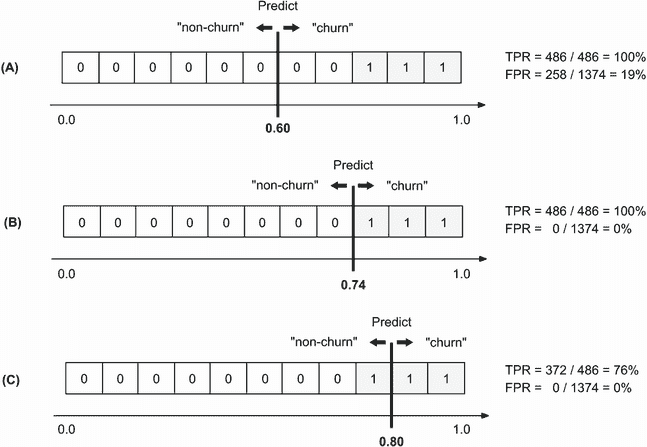

图 4.28 在不同阈值下评估的理想排名模型的 TPR 和 FPR

现在我们已经准备好构建 ROC 曲线。

练习 4.4

理想排名模型做什么？

a) 当应用于验证数据时，它对客户的评分使得对于非流失客户，评分总是低于流失客户。

b) 它将非流失客户的评分高于流失客户。

### 4.3.5 ROC 曲线

要创建 ROC 曲线，我们不是将 FPR 和 TPR 与不同的阈值值进行比较，而是将它们相互比较。为了比较，我们还添加了理想和随机模型到图中：

```
plt.figure(figsize=(5, 5))                             ❶

plt.plot(df_scores.fpr, df_scores.tpr, label='Model')  ❷
plt.plot(df_rand.fpr, df_rand.tpr, label='Random')     ❷
plt.plot(df_ideal.fpr, df_ideal.tpr, label='Ideal')    ❷

plt.legend()
```

❶ 使图表成为正方形

❷ 绘制模型和基线模型的 ROC 曲线

结果，我们得到了一个 ROC 曲线（图 4.29）。当我们绘制它时，我们可以看到随机分类器的 ROC 曲线是从左下角到右上角的近似直线。然而，对于理想模型，曲线首先上升直到达到 100% TPR，然后向右直到达到 100% FPR。


图 4.29 ROC 曲线显示了模型 FPR 和 TPR 之间的关系。

我们的目标模型应该位于这两条曲线之间。我们希望我们的模型尽可能接近理想曲线，尽可能远离随机曲线。

随机模型的 ROC 曲线作为一个良好的视觉基线——当我们将其添加到图中时，它有助于我们判断我们的模型与这个基线有多远——所以总是在图中包含这条线是个好主意。

然而，我们并不真的需要在每次想要有一个 ROC 曲线时都生成一个随机模型：我们知道它看起来像什么，所以我们可以简单地在一个从(0, 0)到(1, 1)的直线上绘制一条直线。

对于理想模型，我们知道它总是上升到(0, 1)，然后向右到(1, 1)。左上角被称为“理想点”：这是理想模型获得 100% TPR 和 0% FPR 的点。我们希望我们的模型尽可能地接近理想点。

有这个信息，我们可以将绘制曲线的代码简化为以下内容：

```
plt.figure(figsize=(5, 5))
plt.plot(df_scores.fpr, df_scores.tpr)
plt.plot([0, 1], [0, 1])
```

这产生了图 4.30 中的结果。

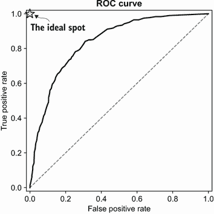

图 4.30 ROC 曲线。基线使得我们更容易看到我们的模型 ROC 曲线与随机模型 ROC 曲线的距离。左上角(0, 1)是“理想点”：我们的模型越接近这一点，越好。

虽然计算许多阈值下的所有 FPR 和 TPR 值是一个很好的练习，但每次我们想要绘制 ROC 曲线时，我们不需要自己来做。我们只需使用 Scikit-learn 的`metrics`包中的`roc_curve`函数即可：

```
from sklearn.metrics import roc_curve

fpr, tpr, thresholds = roc_curve(y_val, y_pred)

plt.figure(figsize=(5, 5))
plt.plot(fpr, tpr)
plt.plot([0, 1], [0, 1])
```

因此，我们得到了与前一个图相同的图（图 4.30）。

现在我们来尝试更深入地理解曲线，并了解它实际上能告诉我们什么。为此，我们将 TPR 和 FPR 值在 ROC 曲线上可视化为它们的阈值（图 4.31）。

在 ROC 图中，我们从(0, 0)点开始——这是左下角的位置。它对应于 0%的 FPR 和 0%的 TPR，这发生在高阈值如 1.0 时，此时没有客户得分高于该值。对于这些情况，我们只是简单地预测“无流失”给所有人。这就是为什么我们的 TPR 是 0%：我们从未正确预测到流失客户。另一方面，FPR 是 0%，因为这个虚拟模型可以正确预测所有非流失客户为非流失，因此没有假阳性。

随着曲线上升，我们考虑在更小阈值下评估的 FPR 和 TPR 值。在 0.7 时，FPR 变化很小，从 0%变为 2%，但 TPR 从 0%增加到 20%（图 4.31，B 和 C）。

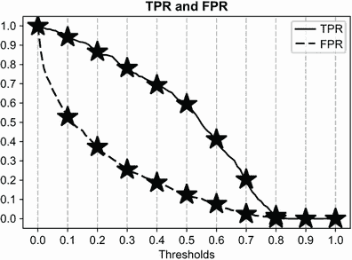

(A) 不同阈值下的 TPR 和 FPR


(B) 模型在不同阈值下的 FPR 和 TPR 值

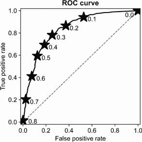

(C) 选择阈值下的 FPR 和 TPR 值

图 4.31 将不同阈值下的 TPR 和 FPR 图（A 和 B）转换为 ROC 曲线（C）。在 ROC 图中，我们从左下角的高阈值值开始，此时大多数客户被预测为非流失，并逐渐过渡到右上角，此时大多数客户被预测为流失。

随着我们沿着线走，我们不断降低阈值，并在更小的值上评估模型，预测越来越多的客户为流失。在某个点上，我们覆盖了大部分的正面（流失客户）。例如，在 0.2 的阈值下，我们预测大多数用户为流失，这意味着许多这些预测是假阳性。FPR 随后开始比 TPR 增长得更快；在 0.2 的阈值下，它已经接近 40%。

最终，我们达到 0.0 阈值，预测每个人都将流失，从而达到 ROC 图的最右上角。

当我们从高阈值值开始时，所有模型都是相同的：任何在高阈值值下的模型都会退化到始终预测 False 的恒定“模型”。随着我们降低阈值，我们开始预测一些客户会流失。模型越好，正确分类为流失的客户就越多，从而产生更好的 TPR。同样，好的模型 FPR 较小，因为它们有更少的误报。

因此，一个好的模型的 ROC 曲线首先尽可能地上升，然后才开始向右转。另一方面，表现差的模型从一开始就具有更高的 FPR（假正率）和更低的 TPR（真正率），因此它们的曲线倾向于更早地向右移动（图 4.32）。

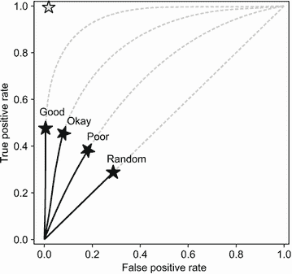

图 4.32 良好模型的 ROC 曲线在转向右之前尽可能地上升。另一方面，表现差的模型一开始就倾向于有更多的误报，因此它们倾向于更早地向右移动。

我们可以用这个方法来比较多个模型：我们只需将它们绘制在同一张图上，并查看哪个更接近（0, 1）的理想点。例如，让我们看一下大模型和小模型的 ROC 曲线，并将它们绘制在同一张图上：

```
fpr_large, tpr_large, _ = roc_curve(y_val, y_pred)
fpr_small, tpr_small, _ = roc_curve(y_val, y_pred_small)

plt.figure(figsize=(5, 5))

plt.plot(fpr_large, tpr_large, color='black', label='Large')
plt.plot(fpr_small, tpr_small, color='black', label='Small')
plt.plot([0, 1], [0, 1])
plt.legend()
```

这样我们可以在同一张图上得到两个 ROC 曲线（图 4.33）。我们可以看到大模型比小模型好：它在所有阈值下都更接近理想点。

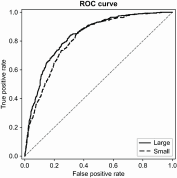

图 4.33 在同一张图上绘制多个 ROC 曲线有助于我们直观地识别哪个模型表现更好。

ROC 曲线本身非常有用，但我们还有一个基于它的另一个指标：AUC，即 ROC 曲线下的面积。

### 4.3.6 ROC 曲线下的面积（AUC）

当我们使用 ROC 曲线来评估我们的模型时，希望它们尽可能地接近理想位置，并且尽可能地远离随机基线。

我们可以通过测量 ROC 曲线下的面积来量化这种“接近度”。我们可以使用这个指标——简称为 AUROC，或通常简单地称为 AUC——作为评估二元分类模型性能的指标。

理想模型形成一个 1x1 的正方形，因此其 ROC 曲线下的面积是 1，或 100%。随机模型只占一半，因此其 AUC 是 0.5，或 50%。我们两个模型的 AUC——大模型和小模型——将在 50%的随机基线和 100%的理想曲线之间。

重要：AUC（曲线下面积）为 0.9 表明模型表现相当好；0.8 是可接受的，0.7 表现不佳，而 0.6 则表示表现相当差。

要计算我们模型的 AUC，我们可以使用来自 Scikit-learn 的`metrics`包中的`auc`函数：

```
from sklearn.metrics import auc
auc(df_scores.fpr, df_scores.tpr)
```

对于大模型，结果是 0.84；对于小模型，结果是 0.81（图 4.34）。客户流失预测是一个复杂的问题，因此 AUC 为 80%已经相当不错。

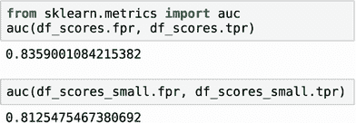

图 4.34 我们模型的 AUC：大模型为 84%，小模型为 81%

如果我们只需要 AUC，我们不需要先计算 ROC 曲线。我们可以走捷径，使用 Scikit-learn 的`roc_auc_score`函数，它负责一切并直接返回我们模型的 AUC：

```
from sklearn.metrics import roc_auc_score
roc_auc_score(y_val, y_pred)
```

我们得到的结果与之前的大致相同（图 4.35）。

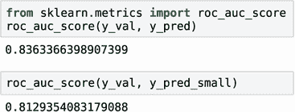

图 4.35 使用 Scikit-learn 的`roc_auc_score`函数计算 AUC。

注意：`roc_auc_score`的值可能与我们自己计算 TPR 和 FPR 的数据框中的 AUC 值略有不同：Scikit-learn 内部使用更精确的方法来创建 ROC 曲线。

ROC 曲线和 AUC 得分告诉我们模型如何将正例和负例分开。更重要的是，AUC 有一个很好的概率解释：它告诉我们随机选择的正例得分高于随机选择的负例得分的概率是多少。

假设我们随机选择一个已知已经流失的客户和一个没有流失的客户，然后对这些客户应用模型并查看每个客户的得分。我们希望模型对流失客户的评分高于非流失客户。AUC 告诉我们这种情况发生的概率：这是随机选择的流失客户得分高于随机选择的非流失客户得分的概率。

我们可以验证这一点。如果我们进行 10,000 次这样的实验，然后统计正例得分高于负例得分的情况有多少次，那么这个比例应该大致对应于 AUC：

```
neg = y_pred[y_val == 0]                                           ❶
pos = y_pred[y_val == 1]                                           ❷

np.random.seed(1)                                                  ❸
neg_choice = np.random.randint(low=0, high=len(neg), size=10000)   ❹
pos_choice = np.random.randint(low=0, high=len(pos), size=10000)   ❺
(pos[pos_choice] > neg[neg_choice]).mean()                         ❻
```

❶ 选择所有非流失客户的得分

❷ 选择所有流失客户的得分

❸ 将种子值固定以确保结果可重复

❹ 随机选择 10,000 个负例得分（非流失客户）

❺ 随机选择 10,000 个正例得分（流失客户）

❻ 对于每个正例，检查其得分是否高于相应的负例

这会输出 0.8356，这确实非常接近我们分类器的 AUC 值。

这种对 AUC 的解释使我们能够对模型的质量有更深入的了解。理想的模型将所有客户按顺序排列，首先是未流失客户，然后是流失客户。在这种情况下，AUC 总是 1.0：随机选择的流失客户得分总是高于非流失客户。另一方面，随机模型只是重新排列客户，因此流失客户的得分只有 50%的机会高于非流失客户。

因此，AUC 不仅为我们提供了一种评估所有可能阈值下模型的方法，而且还描述了模型分离两个类别的好坏：在我们的例子中，是流失和非流失。如果分离得好，那么我们可以按顺序排列客户，使得大多数流失用户排在前面。这样的模型将有一个好的 AUC 得分。

注意：你应该记住这个解释：它为那些没有机器学习背景的人提供了一个简单的方式来解释 AUC 的含义，比如经理和其他决策者。

这使得 AUC 成为大多数情况下的默认分类指标，并且当我们寻找模型的最佳参数集时，它通常是使用的指标。

寻找最佳参数的过程称为“参数调整”，在下一节中我们将看到如何进行这一过程。

## 4.4 参数调整

在上一章中，我们使用了一个简单的保留验证方案来测试我们的模型。在这个方案中，我们取出部分数据并仅保留它用于验证目的。这种做法很好，但并不总是能给出完整的画面。它告诉我们模型在这些特定的数据点上表现如何。然而，这并不一定意味着模型在其他数据点上会有相同的表现。那么，我们如何检查模型是否确实以一致和可预测的方式工作呢？

### 4.4.1 K 折交叉验证

有可能使用所有可用数据来评估模型的质量并获得更可靠的验证结果。我们可以简单地多次进行验证。

首先，我们将整个数据集分成若干部分（比如说，三部分）。然后我们在其中两部分上训练一个模型，在剩下的那部分上进行验证。我们重复这个过程三次，最后得到三个不同的分数。这正是 K 折交叉验证（图 4.36）背后的理念。

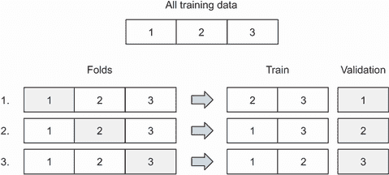

图 4.36 K 折交叉验证（K=3）。我们将整个数据集分成三个相等的部分，或者称为折。然后，对于每一折，我们将它作为验证数据集，并使用剩下的 K-1 折作为训练数据。在训练模型后，我们在验证折上评估它，最后我们得到 k 个指标值。

在我们实现它之前，我们需要使训练过程更简单，这样就可以轻松地多次运行这个过程。为此，我们将所有训练代码放入一个`train`函数中，该函数首先将数据转换为 one-hot 编码表示，然后训练模型。

列表 4.3 训练模型

```
def train(df, y):
    cat = df[categorical + numerical].to_dict(orient='records')  ❶

    dv = DictVectorizer(sparse=False)                            ❶
    dv.fit(cat)                                                  ❶

    X = dv.transform(cat)                                        ❶

    model = LogisticRegression(solver='liblinear')               ❷
    model.fit(X, y)                                              ❷

    return dv, model
```

❶ 应用 one-hot 编码

❷ 训练模型

同样，我们也把预测逻辑放入一个`predict`函数中。这个函数接受一个包含客户的数据框，我们之前“训练”过的向量器——用于进行 one-hot 编码——以及模型。然后我们应用向量器到数据框上，得到一个矩阵，最后将模型应用到矩阵上以得到预测。

列表 4.4 将模型应用于新数据

```
def predict(df, dv, model):
    cat = df[categorical + numerical].to_dict(orient='records')   ❶

    X = dv.transform(cat)                                         ❶
    y_pred = model.predict_proba(X)[:, 1]                         ❷

    return y_pred
```

❶ 应用与训练相同的 one-hot 编码方案

❷ 使用模型进行预测

现在我们可以使用这些函数来实现 K 折交叉验证。

我们不需要自己实现交叉验证：在 Scikit-learn 中有一个用于此目的的类。它被称为`KFold`，位于`model_selection`包中。

列表 4.5 K 折交叉验证

```
from sklearn.model_selection import KFold                  ❶

kfold = KFold(n_splits=10, shuffle=True, random_state=1)   ❷

aucs = []                                                  ❸

for train_idx, val_idx in kfold.split(df_train_full):      ❹
    df_train = df_train_full.iloc[train_idx]               ❺
    df_val = df_train_full.iloc[val_idx]                   ❺

    y_train = df_train.churn.values                        ❺
    y_val = df_val.churn.values                            ❺
    dv, model = train(df_train, y_train)                   ❻
    y_pred = predict(df_val, dv, model)                    ❻

    auc = roc_auc_score(y_val, y_pred)                     ❼
    aucs.append(auc)                                       ❽
```

❶ 导入 KFold 类

❷ 使用它将数据分割成 10 部分

❸ 创建一个用于存储结果的列表

❹ 对数据的 10 个不同分割进行迭代

❺ 将数据分割成训练集和验证集

❻ 训练模型并进行预测

❼ 使用 AUC 评估训练模型在验证数据上的质量

❽ 将 AUC 保存到结果列表中

注意，当在 `KFold` 类中定义分割时（❷），我们设置了三个参数：

+   `n_splits` `=` `10`：这是 K，它指定了分割的数量。

+   `shuffle` `=` `True`：我们要求它在分割数据之前先打乱数据。

+   `random_state` `=` `1`：因为在这个过程中有随机化（打乱数据），我们希望结果是可以重现的，因此我们固定随机数生成器的种子。

在这里，我们使用了 K 折交叉验证，K = 10。因此，当我们运行它时，最后我们得到 10 个不同的数字——10 个 AUC 分数，这些分数是在 10 个不同的验证折叠上评估的：

```
0.849, 0.841, 0.859, 0.833, 0.824, 0.841, 0.844, 0.822, 0.845, 0.861
```

它不再是单个数字，我们可以将其视为模型 AUC 分数的分布。我们可以从这个分布中获得一些统计数据，例如均值和标准差：

```
print('auc = %0.3f ± %0.3f' % (np.mean(aucs), np.std(aucs))) 
```

这会打印“0.842 ± 0.012”。

现在，我们不仅知道了平均性能，而且还有关于该性能波动性的一个概念，或者它可能偏离平均值的程度。

一个好的模型应该在不同的折叠中相当稳定：这样我们才能确保当模型上线时不会出现很多意外。标准差告诉我们这一点：它越小，模型就越稳定。

现在，我们可以使用 K 折交叉验证来进行参数调整：选择最佳参数。

### 4.4.2 寻找最佳参数

我们学习了如何使用 K 折交叉验证来评估我们模型的性能。我们之前训练的模型使用的是参数 `C` 的默认值，该参数控制正则化的数量。

让我们选择我们的交叉验证过程来选择最佳参数 `C`。为此，我们首先调整 `train` 函数以接受一个额外的参数。

列表 4.6 用于训练具有参数 C 的模型的函数，以控制正则化

```
def train(df, y, C):                                             ❶
    cat = df[categorical + numerical].to_dict(orient='records')
    dv = DictVectorizer(sparse=False)
    dv.fit(cat)

    X = dv.transform(cat)

    model = LogisticRegression(solver='liblinear', C=C)          ❷
    model.fit(X, y)

    return dv, model
```

❶ 在训练函数中添加一个额外的参数

❷ 在训练期间使用此参数

现在，让我们找到最佳的参数 `C`。这个想法很简单：

+   遍历不同的 `C` 值。

+   对于每个 `C`，运行交叉验证，并记录所有折叠的平均 AUC 以及标准差。

列表 4.7 调整模型：使用交叉验证选择最佳参数 C

```
nfolds = 5
kfold = KFold(n_splits=nfolds, shuffle=True, random_state=1)

for C in [0.001, 0.01, 0.1, 0.5, 1, 10]:
    aucs = []

    for train_idx, val_idx in kfold.split(df_train_full):
        df_train = df_train_full.iloc[train_idx]
        df_val = df_train_full.iloc[val_idx]

        y_train = df_train.churn.values
        y_val = df_val.churn.values

        dv, model = train(df_train, y_train, C=C)
        y_pred = predict(df_val, dv, model)

        auc = roc_auc_score(y_val, y_pred)
        aucs.append(auc)

    print('C=%s, auc = %0.3f ± %0.3f' % (C, np.mean(aucs), np.std(aucs)))
```

当我们运行它时，它会打印

```
C=0.001, auc = 0.825 ± 0.013
C=0.01, auc = 0.839 ± 0.009
C=0.1, auc = 0.841 ± 0.008
C=0.5, auc = 0.841 ± 0.007
C=1, auc = 0.841 ± 0.007
C=10, auc = 0.841 ± 0.007
```

我们看到，当 `C` = 0.1 后，平均 AUC 保持不变，不再增长。

然而，当`C` = 0.5 时，标准差比`C` = 0.1 时小，因此我们应该使用那个。我们更喜欢`C` = 0.5 而不是`C` = 1 和`C` = 10 的原因很简单：当`C`参数较小时，模型更正则化。这个模型的权重更受限制，所以一般来说，它们更小。模型中的小权重给我们额外的保证，即当我们使用真实数据时，模型会表现良好。因此，我们选择`C` = 0.5。

现在我们需要做最后一步：在完整的训练和验证数据集上训练模型，并将其应用于测试数据集以验证它确实工作得很好。

让我们使用我们的`train`和`predict`函数来做这件事：

```
y_train = df_train_full.churn.values
y_test = df_test.churn.values

dv, model = train(df_train_full, y_train, C=0.5)   ❶
y_pred = predict(df_test, dv, model)               ❷

auc = roc_auc_score(y_test, y_pred)                ❸
print('auc = %.3f' % auc)                          ❸
```

❶ 在完整训练数据集上训练模型

❷ 将其应用于测试数据集

❸ 在测试数据上评估预测

当我们执行代码时，我们看到模型在保留的测试集上的性能（AUC）为 0.858。

这比我们在验证集上得到的分数略高，但这不是问题；这可能是偶然发生的。重要的是，分数与验证分数没有显著差异。

现在，我们可以使用这个模型对真实客户进行评分，并考虑我们的防止客户流失的市场营销活动。在下一章中，我们将看到如何在生产环境中部署这个模型。

## 4.5 下一步

### 4.5.1 练习

尝试以下练习以进一步探索模型评估和模型选择的话题：

+   在本章中，我们绘制了不同阈值值下的 TPR 和 FPR，这帮助我们理解了这些指标的含义，以及当我们选择不同的阈值时，模型性能如何变化。对于精度和召回率进行类似的练习是有帮助的，所以尝试重复这个实验，这次使用精度和召回率而不是 TPR 和 FPR。

+   当绘制不同阈值值下的精度和召回率时，我们可以看到精度和召回率之间存在冲突：当一个上升时，另一个下降，反之亦然。这被称为“精度-召回率权衡”：我们无法选择一个使精度和召回率都好的阈值。然而，我们确实有选择阈值的策略，尽管精度和召回率是冲突的。其中之一是绘制精度和召回率曲线，并查看它们的交点，然后使用这个阈值对预测进行二值化。尝试实现这个想法。

+   另一个解决精度-召回率权衡问题的方法是 F1 分数——一个将精度和召回率结合成一个值的分数。然后，为了选择最佳阈值，我们可以简单地选择最大化 F1 分数的那个。计算 F1 分数的公式是 F1 = 2 · P · R / (P + R)，其中 P 是精度，R 是召回率。实施这个想法，并根据 F1 指标选择最佳阈值。

+   我们已经看到，精确度和召回率是比准确率更好的分类模型评估指标，因为它们不依赖于假阳性，而在不平衡数据集中假阳性的数量可能很高。然而，我们后来发现，AUC 实际上确实使用了 FPR 中的假阳性。对于非常不平衡的情况（例如，1,000 个负例对 1 个正例），AUC 也可能成为问题。在这种情况下，另一个指标表现得更好：精确度-召回率曲线下的面积，或称 AU PR。精确度-召回率曲线类似于 ROC 曲线，但不是绘制 FPR 与 TPR 的对比，而是我们在 x 轴上绘制召回率，在 y 轴上绘制精确率。就像 ROC 曲线一样，我们也可以计算 PR 曲线下的面积，并将其用作评估不同模型的指标。尝试绘制我们模型的 PR 曲线，计算 AU PR 分数，并将它们与随机模型以及理想模型的分数进行比较。

+   我们介绍了 K 折交叉验证，并使用它来了解测试数据集上 AUC 分数的分布可能是什么样子。当 K = 10 时，我们得到 10 个观察值，在某些情况下可能不够。然而，这个想法可以扩展到重复的 K 折交叉验证步骤。这个过程很简单：我们多次重复 K 折交叉验证过程，每次迭代通过选择不同的随机种子来以不同的方式对数据集进行洗牌。实现重复交叉验证，并进行 10 折交叉验证 10 次，以查看分数的分布情况。

### 4.5.2 其他项目

你也可以继续学习前一章中的其他自学项目：线索评分项目和违约预测项目。尝试以下操作：

+   计算本章中涵盖的所有指标：混淆矩阵、精确度和召回率，以及 AUC。还尝试计算练习中的分数：F1 分数以及 AU PR（精确度-召回率曲线下的面积）。

+   使用 K 折交叉验证来选择模型的最佳参数`C`。

## 摘要

+   指标是用于评估机器学习模型性能的单个数字。一旦我们选择了一个指标，我们就可以用它来比较多个机器学习模型，并选择最佳模型。

+   准确率是最简单的二元分类指标：它告诉我们验证集中正确分类的观察值的百分比。它易于理解和计算，但当数据集不平衡时可能会产生误导。

+   当一个二元分类模型做出预测时，我们只有四种可能的结果：真正例和真负例（正确答案）以及假阳性和假阴性（错误答案）。混淆矩阵以视觉方式排列这些结果，使其易于理解。它为我们提供了许多其他二元分类指标的基础。

+   精确度是我们预测为真的观测值中正确答案的比例。如果我们使用流失模型发送促销信息，精确度告诉我们收到信息的所有客户中真正打算流失的客户百分比。精确度越高，我们错误地将非流失用户分类为流失的用户就越少。

+   召回率是所有正观测值中正确答案的比例。它告诉我们我们正确识别为流失的流失客户百分比。召回率越高，我们未能识别的流失客户就越少。

+   ROC 曲线同时分析所有阈值下的二分类模型。ROC 曲线下的面积（AUC）告诉我们模型将正观测值与负观测值区分得有多好。由于其可解释性和广泛适用性，AUC 已成为评估二分类模型的默认指标。

+   K 折交叉验证为我们提供了一种使用所有训练数据进行模型验证的方法：我们将数据分成 K 个折叠，依次使用每个折叠作为验证集，其余的 K-1 个折叠用于训练。结果，我们得到的不是单个数字，而是 K 个值，每个折叠一个。我们可以使用这些数字来了解模型平均性能，以及估计它在不同折叠之间的波动性。

+   K 折交叉验证是调整参数和选择最佳模型的最佳方法：它为我们提供了跨多个折叠的指标可靠估计。

在下一章中，我们将探讨将我们的模型部署到生产环境中的方法。

## 练习题答案

+   练习 4.1 B) 我们预测会“流失”的客户，但他们并没有流失。

+   练习 4.2 B) 我们预测为流失的客户中实际流失的客户百分比。

+   练习 4.3 A) 在所有流失客户中正确识别的流失客户百分比。

+   练习 4.4 A) 理想排名模型总是给流失客户比非流失客户更高的分数。
