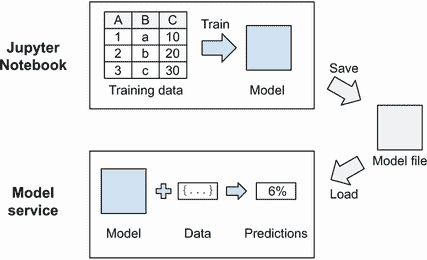
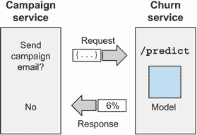
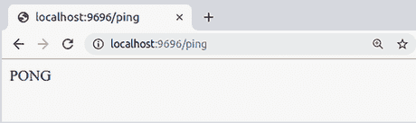
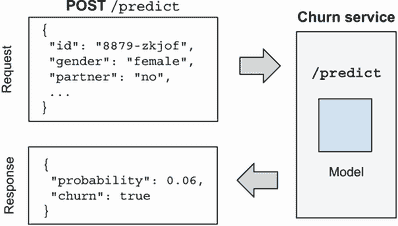
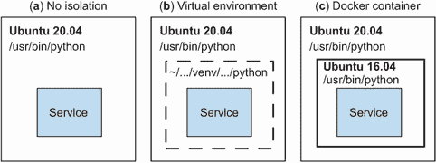
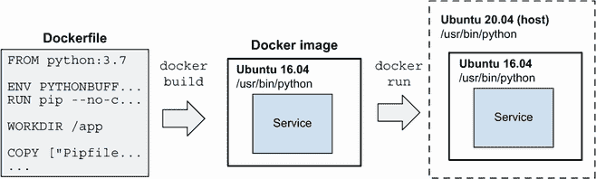
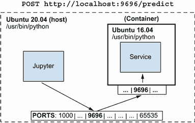
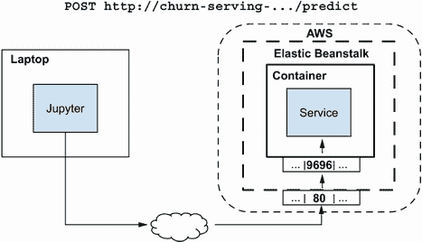
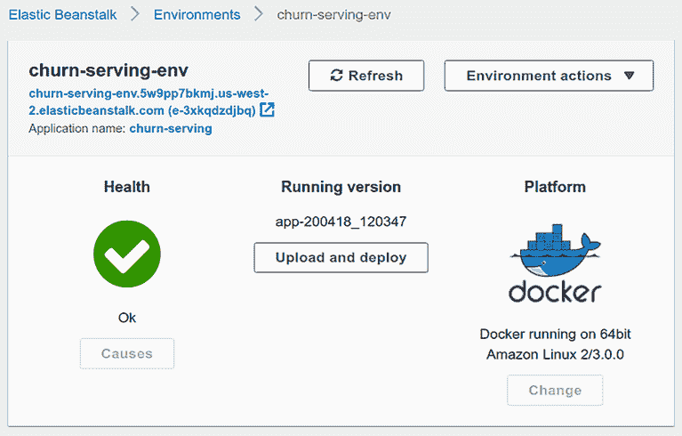

# 5 部署机器学习模型

本章涵盖

+   使用 Pickle 保存模型

+   使用 Flask 提供模型服务

+   使用 Pipenv 管理依赖项

+   使用 Docker 使服务自包含

+   使用 AWS Elastic Beanstalk 将其部署到云端

随着我们继续使用机器学习技术，我们将继续使用我们已经开始的项目：流失预测。在第三章中，我们使用 Scikit-learn 构建了一个用于识别流失客户的模型。之后，在第四章中，我们使用交叉验证选择了最佳参数 `C` 来评估该模型的质量。

我们已经有一个存在于我们的 Jupyter Notebook 中的模型。现在我们需要将这个模型投入生产，以便其他服务可以使用模型根据我们模型的结果做出决策。

在本章中，我们介绍 *模型部署*：将模型投入使用的流程。特别是，我们看看如何将模型打包到网络服务中，以便其他服务可以使用它。我们还看看如何将网络服务部署到生产就绪环境。

## 5.1 流失预测模型

为了开始部署，我们使用之前训练的模型。首先，在本节中，我们回顾如何使用该模型进行预测，然后我们看看如何使用 Pickle 保存它。

### 5.1.1 使用模型

为了简化操作，我们可以继续使用我们在第三章和第四章中使用的相同的 Jupyter Notebook。

让我们使用这个模型来计算以下客户的流失概率：

```
customer = {
    'customerid': '8879-zkjof',
    'gender': 'female',
    'seniorcitizen': 0,
    'partner': 'no',
    'dependents': 'no',
    'tenure': 41,
    'phoneservice': 'yes',
    'multiplelines': 'no',
    'internetservice': 'dsl',
    'onlinesecurity': 'yes',
    'onlinebackup': 'no',
    'deviceprotection': 'yes',
    'techsupport': 'yes',
    'streamingtv': 'yes',
    'streamingmovies': 'yes',
    'contract': 'one_year',
    'paperlessbilling': 'yes',
    'paymentmethod': 'bank_transfer_(automatic)',
    'monthlycharges': 79.85,
    'totalcharges': 3320.75,
}
```

为了预测这位客户是否会流失，我们可以使用上一章中编写的 `predict` 函数：

```
df = pd.DataFrame([customer])
y_pred = predict(df, dv, model)
y_pred[0]
```

此函数需要一个数据框，因此我们首先创建一个包含一行——我们的客户的数据框。然后，我们将它放入 `predict` 函数中。结果是包含单个元素的 NumPy 数组——这位客户的预测流失概率：

```
0.059605
```

这意味着这位客户有 6% 的流失概率。

现在让我们看看之前编写的 `predict` 函数，该函数用于将模型应用于验证集中的客户：

```
def predict(df, dv, model):
    cat = df[categorical + numerical].to_dict(orient='rows')
    X = dv.transform(cat)
    y_pred = model.predict_proba(X)[:, 1]
    return y_pred
```

对于单个客户使用它似乎效率低下且不必要：我们仅从单个客户创建一个数据框，然后在 `predict` 中将其转换回字典。

为了避免进行这种不必要的转换，我们可以为仅预测单个客户的流失概率创建一个单独的函数。让我们称这个函数为 `predict_single`：

```
def predict_single(customer, dv, model):    ❶
    X = dv.transform([customer])            ❷
    y_pred = model.predict_proba(X)[:, 1]   ❸
    return y_pred[0]                        ❹
```

❶ 不是传递一个数据框，而是传递单个客户

❷ 向量化客户：创建矩阵 X

❸ 将模型应用于此矩阵

❹ 由于我们只有一个客户，我们只需要结果的第一元素。

使用它变得简单——我们只需用我们的客户（一个字典）调用它：

```
predict_single(customer, dv, model)
```

结果相同：这位客户有 6% 的流失概率。

我们在第三章开始的 Jupyter Notebook 中训练了我们的模型。这个模型就在那里，一旦我们停止 Jupyter Notebook，训练好的模型就会消失。这意味着现在我们只能在笔记本中使用它，其他地方都不能使用。接下来，我们将看到如何解决这个问题。

### 5.1.2 使用 Pickle 保存和加载模型

要在笔记本之外使用它，我们需要保存它，然后稍后，另一个进程可以加载并使用它（图 5.1）。



图 5.1 我们在一个 Jupyter Notebook 中训练模型。要使用它，我们首先需要保存它，然后在不同的进程中加载它。

Pickle 是一个序列化/反序列化模块，它已经内置到 Python 中：使用它，我们可以将任意 Python 对象（除少数例外）保存到文件中。一旦我们有了文件，我们就可以在不同的进程中从那里加载模型。

注意：“Pickle”也可以用作动词：在 Python 中 *pickle* 一个对象意味着使用 Pickle 模块保存它。

保存模型

要保存模型，我们首先导入 Pickle 模块，然后使用 `dump` 函数：

```
import pickle

with open('churn-model.bin', 'wb') as f_out:     ❶
    pickle.dump(model, f_out)                    ❷
```

❶ 指定我们想要保存的文件

❷ 使用 Pickle 将模型保存到文件

要保存模型，我们使用 `open` 函数，它接受两个参数：

+   我们想要打开的文件名。对我们来说，它是 churn-model.bin。

+   我们打开文件的模式。对我们来说，它是 `wb`，这意味着我们想要写入文件（`w`），文件是二进制（`b`）而不是文本——Pickle 使用二进制格式写入文件。

`open` 函数返回 `f_out`——我们可以用来写入文件的文件描述符。

接下来，我们使用 Pickle 的 `dump` 函数。它也接受两个参数：

+   我们想要保存的对象。对我们来说，它是 `model`。

+   指向输出文件的文件描述符，对我们来说它是 `f_out`。

最后，我们在代码中使用 `with` 构造。当我们使用 `open` 打开文件时，我们需要在完成写入后关闭它。使用 `with` 会自动完成。如果没有使用 `with`，我们的代码将看起来像这样：

```
f_out = open('churn-model.bin', 'wb')
pickle.dump(model, f_out)
f_out.close()
```

然而，在我们的情况下，仅仅保存模型是不够的：我们还有一个与模型一起“训练”的 `DictVectorizer`。我们需要保存这两个。

在序列化时将这两个都放在一个元组中是最简单的方法：

```
with open('churn-model.bin', 'wb') as f_out: 
    pickle.dump((dv, model), f_out)             ❶
```

❶ 我们保存的对象是一个包含两个元素的元组。

加载模型

要加载模型，我们使用 Pickle 的 `load` 函数。我们可以在同一个 Jupyter Notebook 中测试它：

```
with open('churn-model.bin', 'rb') as f_in:    ❶
    dv, model = pickle.load(f_in)              ❷
```

❶ 以读取模式打开文件

❷ 加载元组并解包它

我们再次使用 `open` 函数，但这次使用不同的模式：`rb`，这意味着我们以读取模式打开它（`r`），文件是二进制（`b`）。

警告：指定模式时要小心。意外指定错误模式可能会导致数据丢失：如果你用 `w` 模式而不是 `r` 模式打开现有文件，它将覆盖内容。

因为我们保存了一个元组，所以在加载时我们解包它，因此我们同时得到向量化器和模型。

警告：从互联网上解包对象是不安全的：它可以在您的机器上执行任意代码。仅用于您信任的事物以及您自己保存的事物。

让我们创建一个简单的 Python 脚本，该脚本加载模型并将其应用于客户。

我们将把这个文件命名为 churn_serving.py。（在本书的 GitHub 仓库中，这个文件被命名为 churn_serving_simple.py。）它包含

+   我们之前编写的`predict_single`函数

+   加载模型的代码

+   将模型应用于客户的代码

您可以参考附录 B 来了解如何创建 Python 脚本。

首先，我们从导入开始。对于这个脚本，我们需要导入 Pickle 和 NumPy：

```
import pickle
import numpy as np
```

接下来，让我们将`predict_single`函数放在那里：

```
def predict_single(customer, dv, model):
    X = dv.transform([customer])
    y_pred = model.predict_proba(X)[:, 1]
    return y_pred[0]
```

现在，我们可以加载我们的模型：

```
with open('churn-model.bin', 'rb') as f_in:
    dv, model = pickle.load(f_in)
```

并应用它：

```
customer = {
    'customerid': '8879-zkjof',
    'gender': 'female',
    'seniorcitizen': 0,
    'partner': 'no',
    'dependents': 'no',
    'tenure': 41,
    'phoneservice': 'yes',
    'multiplelines': 'no',
    'internetservice': 'dsl',
    'onlinesecurity': 'yes',
    'onlinebackup': 'no',
    'deviceprotection': 'yes',
    'techsupport': 'yes',
    'streamingtv': 'yes',
    'streamingmovies': 'yes',
    'contract': 'one_year',
    'paperlessbilling': 'yes',
    'paymentmethod': 'bank_transfer_(automatic)',
    'monthlycharges': 79.85,
    'totalcharges': 3320.75,
}

prediction = predict_single(customer, dv, model)
```

最后，让我们显示结果：

```
print('prediction: %.3f' % prediction)

if prediction >= 0.5:
    print('verdict: Churn')
else:
    print('verdict: Not churn')
```

保存文件后，我们可以使用 Python 运行此脚本：

```
python churn_serving.py
```

我们应该立即看到结果：

```
prediction: 0.059
verdict: Not churn
```

这样，我们就可以加载模型并将其应用于脚本中指定的客户。

当然，我们不会手动将客户信息放入脚本中。在下一节中，我们将介绍一个更实用的方法：将模型放入网络服务中。

## 5.2 模型提供

我们已经知道如何在不同的进程中加载一个训练好的模型。现在我们需要**提供**这个模型——使其可供他人使用。

在实践中，这通常意味着模型被部署为一个网络服务，这样其他服务就可以与之通信，请求预测，并使用结果来做出自己的决策。

在本节中，我们将展示如何使用 Flask 在 Python 中实现它——一个用于创建网络服务的 Python 框架。首先，我们来看看为什么我们需要使用网络服务。

### 5.2.1 网络服务

我们已经知道如何使用模型进行预测，但到目前为止，我们只是将客户的特征作为 Python 字典硬编码。让我们尝试想象我们的模型在实际中是如何被使用的。

假设我们有一个运行营销活动的服务。对于每个客户，它需要确定流失的概率，如果足够高，它将发送带有折扣的促销电子邮件。当然，这个服务需要使用我们的模型来决定是否应该发送电子邮件。

实现这一目标的一种可能方式是修改活动服务的代码：加载模型，并在服务中评分客户。这种方法很好，但活动服务需要是 Python 编写的，我们需要完全控制其代码。

不幸的是，这种情况并不总是如此：它可能用某种其他语言编写，或者可能由不同的团队负责这个项目，这意味着我们不会拥有所需的控制权。

解决这个问题的典型方案是将模型放入一个网络服务中——一个只负责评分客户的小型服务（一个*微服务*）。

因此，我们需要创建一个流失服务——一个在 Python 中提供流失模型的网络服务。给定客户的特征，它将返回该客户流失的概率。对于每个客户，营销服务将向流失服务请求流失概率，如果流失概率足够高，那么我们将发送促销电子邮件（图 5.2）。



图 5.2 流失服务负责提供流失预测模型，使其他服务能够使用它。

这给我们带来了另一个优势：关注点的分离。如果模型是由数据科学家创建的，那么他们可以负责服务并维护它，而其他团队则负责营销服务。

在 Python 中创建网络服务最受欢迎的框架之一是 Flask，我们将在下一节中介绍。

### 5.2.2 Flask

在 Python 中实现网络服务最简单的方法是使用 Flask。它相当轻量级，启动时需要很少的代码，并且隐藏了处理 HTTP 请求和响应的大部分复杂性。

在我们将模型放入网络服务之前，让我们先了解使用 Flask 的基础知识。为此，我们将创建一个简单的函数并将其作为网络服务提供。在了解基础知识之后，我们将处理模型。

假设我们有一个简单的 Python 函数，名为 `ping`：

```
def ping():
    return 'PONG'
```

它没有做太多：当被调用时，它只是简单地响应 PONG。让我们使用 Flask 将这个函数转换成网络服务。

Anaconda 预装了 Flask，但如果您使用不同的 Python 发行版，您需要安装它：

```
pip install flask
```

我们将把这个代码放入一个 Python 文件中，并将其命名为 flask_test.py。

要使用 Flask，我们首先需要导入它：

```
from flask import Flask
```

现在我们创建一个 Flask 应用程序——这是注册需要在网络服务中公开的函数的中心对象。我们将我们的应用程序命名为 test：

```
app = Flask('test')
```

接下来，我们需要指定如何通过分配地址或 Flask 术语中的“路由”来访问函数。在我们的例子中，我们想使用 `/ping` 地址：

```
@app.route('/ping', methods=['GET'])      ❶
def ping():
    return 'PONG'
```

❶ 注册了 /ping 路由，并将其分配给 ping 函数

这段代码使用了装饰器——这是一种高级的 Python 功能，我们在这本书中不会详细讲解。我们不需要详细了解它是如何工作的；只需知道，通过在函数定义上方放置 `@app.route`，我们将网络服务的 `/ping` 地址分配给 `ping` 函数。

要运行它，我们只需要最后一部分：

```
if __name__ == '__main__':
    app.run(debug=True, host='0.0.0.0', port=9696)
```

`app` 的 `run` 方法启动服务。我们指定了三个参数：

+   `debug=True`。当代码有更改时，会自动重新启动我们的应用程序。

+   `host='0.0.0.0'`。使网络服务公开；否则，当它在远程机器（例如 AWS）上托管时，将无法访问它。

+   `port=9696`。我们用来访问应用程序的端口。

我们现在可以开始我们的服务了。让我们来做这件事：

```
python flask_test.py
```

当我们运行它时，我们应该看到以下内容：

```
 * Serving Flask app "test" (lazy loading)
 * Environment: production
   WARNING: This is a development server. Do not use it in a production deployment.
   Use a production WSGI server instead.
 * Debug mode: on
 * Running on http://0.0.0.0:9696/ (Press CTRL+C to quit)
 * Restarting with stat
 * Debugger is active!
 * Debugger PIN: 162-129-136
```

这意味着我们的 Flask 应用程序现在正在运行，并准备好接收请求。为了测试它，我们可以使用我们的浏览器：打开它，在地址栏中输入 localhost:9696/ping。如果您在远程服务器上运行它，应将 localhost 替换为服务器的地址。（对于 AWS EC2，请使用公共 DNS 主机名。确保在您的 EC2 实例的安全组中打开了端口 9696：转到安全组，并添加一个自定义 TCP 规则，端口为 9696，源为 0.0.0.0/0。）浏览器应响应 PONG（图 5.3）。



图 5.3 检查我们的应用程序是否工作的最简单方法是使用 Web 浏览器。

Flask 记录它接收到的所有请求，因此我们应该看到一条指示在 `/ping` 路由上有一个 GET 请求的行：

```
127.0.0.1 - - [02/Apr/2020 21:59:09] "GET /ping HTTP/1.1" 200 -
```

如我们所见，Flask 非常简单：用不到 10 行代码，我们就创建了一个 Web 服务。

接下来，我们将看到如何调整我们的流失预测脚本，并将其转换为 Web 服务。

### 5.2.3 使用 Flask 提供流失模型

我们已经学习了一些 Flask 的知识，所以现在我们可以回到我们的脚本，将其转换为 Flask 应用程序。

要对客户进行评分，我们的模型需要获取特征，这意味着我们需要一种方法将一些数据从一项服务（营销服务）传输到另一项服务（流失服务）。

作为数据交换格式，Web 服务通常使用 JSON（JavaScript 对象表示法）。它与我们在 Python 中定义字典的方式类似：

```
{
    "customerid": "8879-zkjof",
    "gender": "female",
    "seniorcitizen": 0,
    "partner": "no",
    "dependents": "no",
    ...
}
```

要发送数据，我们使用 POST 请求，而不是 GET：POST 请求可以在请求中包含数据，而 GET 请求则不能。

因此，为了让营销服务能够从流失服务获取预测，我们需要创建一个接受 POST 请求的 `/predict` 路由。流失服务将解析有关客户的 JSON 数据并以 JSON 格式响应（图 5.4）。



图 5.4 要获取预测，我们将有关客户的 JSON 数据 POST 到 `/predict` 路由，并得到响应中的流失概率。

现在我们知道我们想要做什么，所以让我们开始修改 churn_serving.py 文件。

首先，我们在文件顶部添加一些额外的导入：

```
from flask import Flask, request, jsonify
```

尽管之前我们只导入了 `Flask`，但现在我们需要导入两个更多的事物：

+   `request`：获取 POST 请求的内容

+   `jsonsify`：以 JSON 格式响应

接下来，创建 Flask 应用程序。让我们称它为 churn：

```
app = Flask('churn')
```

现在我们需要创建一个函数，

+   获取请求中的客户数据

+   调用 `predict_simple` 对客户进行评分

+   以 JSON 格式响应流失概率

我们将称此函数为 `predict` 并将其分配给 `/predict` 路由：

```
@app.route('/predict', methods=['POST'])              ❶
def predict():
    customer = request.get_json()                     ❷

    prediction = predict_single(customer, dv, model)  ❸
    churn = prediction >= 0.5                         ❹

    result = {                                        ❹
        'churn_probability': float(prediction),       ❹
        'churn': bool(churn),                         ❹
    }                                                 ❹

    return jsonify(result)                            ❺
```

❶ 将 /predict 路由分配给 predict 函数

❷ 获取请求内容的 JSON 格式

❸ 对客户进行评分

❹ 准备响应

❺ 将响应转换为 JSON

要将路由分配给函数，我们使用 `@app.route` 装饰器，同时告诉 Flask 只期望 POST 请求。

`predict` 函数的核心内容与我们之前在脚本中做的类似：它接受一个客户，将其传递给 `predict_single`，并对结果进行一些处理。

最后，让我们添加运行 Flask 应用的最后两行：

```
if __name__ == '__main__':
    app.run(debug=True, host='0.0.0.0', port=9696)
```

我们已经准备好运行它：

```
python churn_serving.py
```

运行后，我们应该看到一条消息，说明应用已启动并正在等待传入的请求：

```
 * Serving Flask app "churn" (lazy loading)
 * Environment: production
   WARNING: This is a development server. Do not use it in a production deployment.
   Use a production WSGI server instead.
 * Debug mode: on
 * Running on http://0.0.0.0:9696/ (Press CTRL+C to quit)
 * Restarting with stat
 * Debugger is active!
```

测试这段代码比之前要困难一些：这次，我们需要使用 POST 请求，并在请求体中包含我们想要评分的客户。

在 Python 中使用 requests 库来做这件事是最简单的方式。它也预安装在 Anaconda 中，但如果使用不同的发行版，可以使用`pip`安装它：

```
pip install requests
```

我们可以打开之前使用的同一个 Jupyter Notebook，并从那里测试网络服务。

首先，导入 requests：

```
import requests
```

现在，向我们的服务发送一个 POST 请求

```
url = 'http://localhost:9696/predict'            ❶
response = requests.post(url, json=customer)     ❷
result = response.json()                         ❸
```

❶ 服务所在的服务器地址

❷ 在 POST 请求中发送客户（作为 JSON）

❸ 将响应解析为 JSON

`results` 变量包含来自流失服务的响应：

```
{'churn': False, 'churn_probability': 0.05960590758316391}
```

这是我们之前在终端中看到的信息，但现在我们是从一个网络服务中获取的响应。

注意：一些工具，如 Postman ([`www.postman.com/`](https://www.postman.com/))，使测试网络服务变得更容易。本书中不涵盖 Postman，但你可以自由尝试。

如果营销服务使用 Python，这正是它与流失服务通信并决定谁应该收到促销邮件的方式。

只用几行代码，我们就创建了一个在笔记本电脑上运行的实用网络服务。在下一节中，我们将看到如何管理服务中的依赖项并为其部署做准备。

## 5.3 管理依赖

对于本地开发，Anaconda 是一个完美的工具：它几乎包含了我们可能需要的所有库。然而，这也存在一个缺点：解包后占用 4GB 的空间，这太大了。对于生产环境，我们更倾向于只安装我们实际需要的库。

此外，不同的服务有不同的要求。通常，这些要求是冲突的，因此我们无法使用同一个环境同时运行多个服务。

在本节中，我们将看到如何以隔离的方式管理我们应用程序的依赖项，这样就不会干扰其他服务。我们将介绍两个工具来完成这项工作：用于管理 Python 库的 Pipenv，以及用于管理操作系统和系统库等系统依赖项的 Docker。

### 5.3.1 Pipenv

为了提供流失模型，我们只需要几个库：NumPy、Scikit-learn 和 Flask。因此，我们不需要带上包含所有库的整个 Anaconda 发行版，我们可以安装一个全新的 Python 安装，并使用`pip`安装我们需要的库：

```
pip install numpy scikit-learn flask
```

在做之前，让我们思考一下当我们使用`pip`安装库时会发生什么：

+   我们运行`pip install library`来安装一个名为 Library 的 Python 包（假设它存在）。

+   Pip 前往 PyPI.org（Python 包索引——一个包含 Python 包的仓库），获取并安装这个库的最新版本。比如说，它是版本 1.0.0。

安装后，我们使用这个特定的版本开发和测试我们的服务。一切工作得很好。后来，我们的同事想帮助我们进行项目，所以他们也在他们的机器上运行 `pip install` 来设置一切——但这次，最新版本变成了 1.3.1。

如果我们运气不好，版本 1.0.0 和 1.3.1 可能不兼容，这意味着我们为版本 1.0.0 编写的代码将无法在版本 1.3.1 中工作。

在使用 `pip` 安装库时指定确切的版本可以解决这个问题：

```
pip install library==1.0.0
```

不幸的是，可能还会出现另一个问题：如果我们的某些同事已经安装了版本 1.3.1，并且他们已经使用它为其他服务，那么在这种情况下，他们不能回到使用版本 1.0.0：这可能导致他们的代码停止工作。

我们可以通过为每个项目创建一个 *虚拟环境* 来解决这些问题——一个仅包含特定项目所需库的独立 Python 发行版。

Pipenv 是一个使管理虚拟环境更简单的工具。我们可以使用 pip 来安装它：

```
pip install pipenv
```

之后，我们使用 `pipenv` 而不是 `pip` 来安装依赖项：

```
pipenv install numpy scikit-learn flask
```

当运行它时，我们会看到首先配置虚拟环境，然后安装库：

```
Running virtualenv with interpreter .../bin/python3
✔ Successfully created virtual environment!
Virtualenv location: ...
Creating a Pipfile for this project...
Installing numpy...
Adding numpy to Pipfile's [packages]...
✔ Installation Succeeded
Installing scikit-learn...
Adding scikit-learn to Pipfile's [packages]...
✔ Installation Succeeded
Installing flask...
Adding flask to Pipfile's [packages]...
✔ Installation Succeeded
Pipfile.lock not found, creating...
Locking [dev-packages] dependencies...
Locking [packages] dependencies...
⠙ Locking...
```

安装完成后，它创建了两个文件：Pipenv 和 Pipenv.lock。

Pipenv 文件看起来相当简单：

```
[[source]]
name = "pypi"
url = "https://pypi.org/simple"
verify_ssl = true

[dev-packages]

[packages]
numpy = "*"
scikit-learn = "*"
flask = "*"

[requires]
python_version = "3.7"
```

我们可以看到这个文件包含了一个库列表以及我们使用的 Python 版本。

另一个文件——Pipenv.lock——包含了项目中使用的库的具体版本。由于文件太大，无法在此全部显示，但让我们看看文件中的一个条目：

```
"flask": {
    "hashes": [
        "sha256:4efa1ae2d7c9865af48986de8aeb8504...",
        "sha256:8a4fdd8936eba2512e9c85df320a37e6..."
    ],
    "index": "pypi",
    "version": "==1.1.2"
}
```

如我们所见，它记录了安装期间使用的库的确切版本。为了确保库不会更改，它还保存了散列——可以用来验证未来我们下载的库的确切版本的校验和。这样，我们将依赖项“锁定”到特定版本。通过这样做，我们确保未来我们不会遇到同一库的两个不兼容版本。

如果有人需要为我们项目工作，他们只需运行 `install` 命令：

```
pipenv install
```

此步骤将首先创建一个虚拟环境，然后从 Pipenv.lock 中安装所有必需的库。

重要：锁定库的版本对于未来的可重复性很重要，并有助于我们避免代码不兼容带来的不愉快惊喜。

安装完所有库后，我们需要激活虚拟环境——这样，我们的应用程序将使用库的正确版本。我们通过运行 `shell` 命令来完成：

```
pipenv shell
```

它告诉我们它正在虚拟环境中运行：

```
Launching subshell in virtual environment...
```

现在，我们可以运行我们的脚本以提供服务：

```
python churn_serving.py
```

或者，我们不必首先明确进入虚拟环境然后运行脚本，我们可以用一条命令完成这两个步骤：

```
pipenv run python churn_serving.py
```

Pipenv 中的`run`命令简单地运行虚拟环境中的指定程序。

无论我们以何种方式运行它，我们都应该看到与之前完全相同的输出：

```
 * Serving Flask app "churn" (lazy loading)
 * Environment: production
   WARNING: This is a development server. Do not use it in a production deployment.
   Use a production WSGI server instead.
 * Debug mode: on
 * Running on http://0.0.0.0:9696/ (Press CTRL+C to quit)
```

当我们用 requests 进行测试时，我们会看到相同的输出：

```
{'churn': False, 'churn_probability': 0.05960590758316391}
```

你很可能会在控制台注意到以下警告：

```
 * Environment: production
   WARNING: This is a development server. Do not use it in a production deployment.
   Use a production WSGI server instead.
```

内置的 Flask 网络服务器确实仅适用于开发：它非常容易用于测试我们的应用程序，但在负载下不会可靠地工作。我们应该使用合适的 WSGI 服务器，正如警告所建议的。

WSGI 代表*Web 服务器网关接口*，这是一个描述 Python 应用程序应该如何处理 HTTP 请求的规范。WSGI 的细节对于本书的目的并不重要，所以我们不会详细讨论。

我们将通过安装生产 WSGI 服务器来处理这个警告。Python 有多种可能的选择，我们将使用 Gunicorn。

注意 Gunicorn 在 Windows 上不工作：它依赖于 Linux 和 Unix（包括 MacOS）特有的功能。一个在 Windows 上也能工作的良好替代品是 Waitress。稍后，我们将使用 Docker，这将解决这个问题——它在容器内运行 Linux。

让我们用 Pipenv 安装它：

```
pipenv install gunicorn
```

此命令安装库，并通过将其添加到 Pipenv 和 Pipenv.lock 文件中，将其作为项目依赖项包含在内。

让我们用 Gunicorn 运行我们的应用程序：

```
pipenv run gunicorn --bind 0.0.0.0:9696 churn_serving:app
```

如果一切顺利，我们应该在终端看到以下信息：

```
[2020-04-13 22:58:44 +0200] [15705] [INFO] Starting gunicorn 20.0.4
[2020-04-13 22:58:44 +0200] [15705] [INFO] Listening at: http://0.0.0.0:9696 (15705)
[2020-04-13 22:58:44 +0200] [15705] [INFO] Using worker: sync
[2020-04-13 22:58:44 +0200] [16541] [INFO] Booting worker with pid: 16541
```

与 Flask 内置的网络服务器不同，Gunicorn 适用于生产，因此当我们开始使用它时，在负载下不会出现任何问题。

如果我们用之前相同的代码进行测试，我们会看到相同的答案：

```
{'churn': False, 'churn_probability': 0.05960590758316391}
```

Pipenv 是一个管理依赖项的出色工具：它将所需的库隔离到单独的环境中，从而帮助我们避免不同版本的同一包之间的冲突。

在下一节中，我们将探讨 Docker，它允许我们进一步隔离我们的应用程序并确保它在任何地方都能顺利运行。

### 5.3.2 Docker

我们已经学会了如何使用 Pipenv 管理 Python 依赖。然而，一些依赖项存在于 Python 之外。最重要的是，这些依赖项包括操作系统（OS）以及系统库。

例如，我们可能会使用 Ubuntu 16.04 版本来开发我们的服务，但如果我们的某些同事使用 Ubuntu 20.04 版本，他们在尝试在自己的笔记本电脑上执行服务时可能会遇到麻烦。

Docker 通过将操作系统和系统库打包到*Docker 容器*中解决了“在我的机器上它工作”的问题——这是一个在任何安装了 Docker 的地方都能工作的自包含环境（图 5.5）。



图 5.5 在没有隔离（a）的情况下，服务使用系统 Python 运行。在虚拟环境（b）中，我们将服务的依赖项隔离在环境中。在 Docker 容器（c）中，我们将服务的整个环境隔离，包括操作系统和系统库。

一旦服务被打包成 Docker 容器，我们就可以在 *主机机器* 上运行它——我们的笔记本电脑（无论操作系统如何）或任何公共云提供商。

让我们看看如何将其用于我们的项目。我们假设您已经安装了 Docker。请参阅附录 A 了解如何安装 Docker 的详细信息。

首先，我们需要创建一个 *Docker 镜像*——这是我们的服务的描述，包括所有设置和依赖项。Docker 将稍后使用该镜像来创建容器。为此，我们需要一个 Dockerfile——一个包含如何创建镜像的指令的文件（图 5.6）。



图 5.6 我们使用 Dockerfile 中的指令构建一个镜像。然后我们可以在主机机器上运行这个镜像。

让我们创建一个名为 Dockerfile 的文件，并包含以下内容（注意，文件不应包含注释）：

```
FROM python:3.7.5-slim                                                 ❶

ENV PYTHONUNBUFFERED=TRUE                                              ❷

RUN pip --no-cache-dir install pipenv                                  ❸

WORKDIR /app                                                           ❹

COPY ["Pipfile", "Pipfile.lock", "./"]                                 ❺

RUN pipenv install --deploy --system && \                              ❻
    rm -rf /root/.cache                                                ❻

COPY ["*.py", "churn-model.bin", "./"]                                 ❼

EXPOSE 9696                                                            ❽

ENTRYPOINT ["gunicorn", "--bind", "0.0.0.0:9696", "churn_serving:app"] ❾
```

❶ 指定基础镜像

❷ 设置特殊的 Python 设置以便能够看到日志

❸ 安装 Pipenv

❹ 将工作目录设置为 /app

❺ 复制 Pipenv 文件

❻ 从 Pipenv 文件中安装依赖项

❼ 复制我们的代码以及模型

❽ 打开我们的 Web 服务使用的端口

❾ 指定服务应该如何启动

这需要解包大量信息，尤其是如果你以前从未见过 Dockerfile。让我们逐行分析。

首先，我们指定基本 Docker 镜像：

```
FROM python:3.7.5-slim 
```

我们使用这个镜像作为起点，并在其之上构建自己的镜像。通常，基础镜像已经包含了操作系统和系统库，如 Python 本身，因此我们只需要安装我们项目的依赖项。在我们的例子中，我们使用 `python:3.7.5-slim`，它基于 Debian 10.2，包含 Python 版本 3.7.5 和 `pip`。您可以在 Docker Hub 上了解更多关于 Python 基础镜像的信息（[`hub.docker.com/_/python`](https://hub.docker.com/_/python)）——共享 Docker 镜像的服务。

所有 Dockerfile 都应该以 `FROM` 语句开始。

接下来，我们将 `PYTHONUNBUFFERED` 环境变量设置为 `TRUE`：

```
ENV PYTHONUNBUFFERED=TRUE
```

如果没有这个设置，我们在 Docker 内运行 Python 脚本时将无法看到日志。

然后，我们使用 `pip` 安装 Pipenv：

```
RUN pip --no-cache-dir install pipenv
```

Docker 中的 `RUN` 指令简单地运行一个 shell 命令。默认情况下，`pip` 将库保存到缓存中，以便稍后可以更快地安装。我们不需要在 Docker 容器中这样做，因此我们使用 `--no-cache-dir` 设置。

然后，我们指定工作目录：

```
WORKDIR /app 
```

这大致相当于 Linux 中的 `cd` 命令（更改目录），因此之后我们将运行的所有内容都将执行在 /app 文件夹中。

然后，我们将 Pipenv 文件复制到当前工作目录（即，/app）：

```
COPY ["Pipfile", "Pipfile.lock", "./"]
```

我们使用这些文件通过 Pipenv 安装依赖项：

```
RUN pipenv install --deploy --system && \
    rm -rf /root/.cache
```

之前，我们只是简单地使用`pipenv install`来做这件事。在这里，我们包括了两个额外的参数：`--deploy`和`--system`。在 Docker 内部，我们不需要创建虚拟环境——我们的 Docker 容器已经与系统其他部分隔离。设置这些参数允许我们跳过创建虚拟环境，并使用系统 Python 来安装所有依赖项。

安装完库后，我们清理缓存以确保我们的 Docker 镜像不会变得太大。

然后，我们复制我们的项目文件以及 pickle 模型：

```
COPY ["*.py", "churn-model.bin", "./"] 
```

接下来，我们指定应用程序将使用的端口。在我们的例子中，它是 9696：

```
EXPOSE 9696 
```

最后，我们告诉 Docker 我们的应用程序应该如何启动：

```
ENTRYPOINT ["gunicorn", "--bind", "0.0.0.0:9696", "churn_serving:app"]
```

这是我们之前在本地运行 Gunicorn 时使用的相同命令。

让我们构建图像。我们通过在 Docker 中运行`build`命令来完成：

```
docker build -t churn-prediction .
```

`-t`标志让我们设置图像的标签名称，最后一个参数——点号——指定了包含 Dockerfile 的目录。在我们的例子中，这意味着我们使用当前目录。

当我们运行它时，Docker 首先下载基础镜像：

```
Sending build context to Docker daemon  51.71kB
Step 1/11 : FROM python:3.7.5-slim
3.7.5-slim: Pulling from library/python
000eee12ec04: Downloading  24.84MB/27.09MB
ddc2d83f8229: Download complete
735b0bee82a3: Downloading  19.56MB/28.02MB
8c69dcedfc84: Download complete
495e1cccc7f9: Download complete 
```

然后它逐行执行 Dockerfile 中的每一行：

```
Step 2/9 : ENV PYTHONUNBUFFERED=TRUE
 ---> Running in d263b412618b
Removing intermediate container d263b412618b
 ---> 7987e3cf611f
Step 3/9 : RUN pip --no-cache-dir install pipenv
 ---> Running in e8e9d329ed07
Collecting pipenv
 ... 
```

最后，Docker 告诉我们它已成功构建了一个图像，并将其标记为 churn-prediction:latest：

```
Successfully built d9c50e4619a1
Successfully tagged churn-prediction:latest
```

我们已经准备好使用这个图像来启动一个 Docker 容器。使用`run`命令来执行：

```
docker run -it -p 9696:9696 churn-prediction:latest
```

我们在这里指定了一些参数：

+   `-it`标志告诉 Docker 我们从终端运行它，并且我们需要看到结果。

+   `-p`参数指定端口映射。`9696:9696`意味着将容器上的端口 9696 映射到主机机器上的端口 9696。

+   最后，我们需要图像名称和标签，在我们的例子中是`churn-prediction :latest`。

现在我们的服务正在 Docker 容器内运行，我们可以通过端口 9696（图 5.7）连接到它。这是我们之前用于应用程序的相同端口。



图 5.7 主机机器上的 9696 端口映射到容器的 9696 端口，因此当我们向`localhost:9696`发送请求时，它由 Docker 中的我们的服务处理。

让我们使用相同的代码进行测试。当我们运行它时，我们会看到相同的响应：

```
{'churn': False, 'churn_probability': 0.05960590758316391}
```

Docker 使得以可重复的方式运行服务变得容易。使用 Docker，容器内的环境始终保持不变。这意味着如果我们能在笔记本电脑上运行我们的服务，它将可以在任何其他地方工作。

我们已经在笔记本电脑上测试了我们的应用程序，所以现在让我们看看如何在公共云上运行它并将其部署到 AWS。

## 5.4 部署

我们不在笔记本电脑上运行生产服务；我们需要专门的服务器来运行这些服务。

在本节中，我们将介绍一个可能的选项：亚马逊网络服务，或简称 AWS。我们选择 AWS 是因为它的流行——我们与亚马逊或 AWS 没有关联。

其他流行的公共云包括 Google Cloud、Microsoft Azure 和 Digital Ocean。本书不涵盖它们，但你应该能够在网上找到类似的说明并将模型部署到你喜欢的云服务提供商。

这个部分是可选的，所以你可以安全地跳过它。要遵循本节中的说明，你需要有一个 AWS 账户并配置 AWS 命令行工具（CLI）。请参阅附录 A 以了解如何设置它。

### 5.4.1 AWS Elastic Beanstalk

AWS 提供了许多服务，我们有很多可能的部署 Web 服务的方式。例如，你可以租用一个 EC2 机器（AWS 中的服务器）并手动在其上设置服务，使用 AWS Lambda 的“无服务器”方法，或者使用一系列其他服务。

在本节中，我们将使用 AWS Elastic Beanstalk，这是将模型部署到 AWS 的最简单方法之一。此外，我们的服务足够简单，因此我们可以在免费层限制内使用。换句话说，我们可以在第一年免费使用它。

Elastic Beanstalk 自动处理我们在生产环境中通常需要处理的大量事情，包括

+   将我们的服务部署到 EC2 实例

+   扩展规模：在高峰时段添加更多实例以处理负载

+   缩小规模：在负载消失时移除这些实例

+   如果服务因任何原因崩溃，重新启动服务

+   在实例之间平衡负载

我们还需要一个特殊的实用工具——Elastic Beanstalk 命令行界面（CLI）——来使用 Elastic Beanstalk。CLI 是用 Python 编写的，因此我们可以像安装任何其他 Python 工具一样使用`pip`来安装它。

然而，因为我们使用 Pipenv，我们可以将其添加为开发依赖项。这样，我们只为我们的项目安装它，而不是系统范围内。

```
pipenv install awsebcli --dev
```

注意，开发依赖项是我们用于开发应用程序的工具和库。通常，我们只需要在本地使用它们，不需要将它们包含在实际部署到生产环境的包中。

安装 Elastic Beanstalk 后，我们可以进入我们项目的虚拟环境：

```
pipenv shell
```

现在 CLI 应该可用。让我们检查一下：

```
eb --version
```

它应该打印版本：

```
EB CLI 3.18.0 (Python 3.7.7)
```

接下来，我们运行初始化命令：

```
eb init -p docker churn-serving
```

注意，我们使用 `-p` `docker`：这样，我们指定这是一个基于 Docker 的项目。

如果一切正常，它会在 `.elasticbeanstalk` 文件夹中创建一些文件，包括一个 config.yml 文件。

现在，我们可以通过使用 `local` `run` 命令在本地测试我们的应用程序：

```
eb local run --port 9696
```

这应该与上一节中的 Docker 以相同的方式工作：它首先构建一个镜像，然后运行容器。

为了测试它，我们可以使用之前相同的代码并得到相同的答案：

```
{'churn': False, 'churn_probability': 0.05960590758316391}
```

在本地验证它运行良好后，我们就准备好将其部署到 AWS 了。我们可以用一条命令来完成：

```
eb create churn-serving-env
```

这个简单的命令负责设置我们需要的所有内容，从 EC2 实例到自动扩展规则：

```
Creating application version archive "app-200418_120347".
Uploading churn-serving/app-200418_120347.zip to S3\. This may take a while.
Upload Complete.
Environment details for: churn-serving-env
  Application name: churn-serving
  Region: us-west-2
  Deployed Version: app-200418_120347
  Environment ID: e-3xkqdzdjbq
  Platform: arn:aws:elasticbeanstalk:us-west-2::platform/Docker running on 64bit Amazon Linux 2/3.0.0
  Tier: WebServer-Standard-1.0
  CNAME: UNKNOWN
  Updated: 2020-04-18 10:03:52.276000+00:00
Printing Status:
2020-04-18 10:03:51    INFO    createEnvironment is starting.
 -- Events -- (safe to Ctrl+C)
```

创建所有内容需要几分钟。我们可以监控这个过程，并在终端中查看它在做什么。

当它准备就绪时，我们应该看到以下信息：

```
2020-04-18 10:06:53    INFO    Application available at churn-serving-env.5w9pp7bkmj.us-west-2.elasticbeanstalk.com.
2020-04-18 10:06:53    INFO    Successfully launched environment: churn-serving-env    
```

日志中的 URL（churn-serving-env.5w9pp7bkmj.us-west-2.elasticbeanstalk.com）很重要：这是我们访问应用程序的方式。现在我们可以使用此 URL 进行预测（图 5.8）。



图 5.8 我们的服务已部署在 AWS Elastic Beanstalk 的容器内。要访问它，我们使用其公共 URL。

让我们测试一下：

```
host = 'churn-serving-env.5w9pp7bkmj.us-west-2.elasticbeanstalk.com'
url = 'http://%s/predict' % host
response = requests.post(url, json=customer)
result = response.json()
result
```

如前所述，我们应该看到相同的响应：

```
{'churn': False, 'churn_probability': 0.05960590758316393}
```

那就结束了！我们有一个正在运行的服务。

警告：这是一个玩具示例，我们创建的服务对世界上任何人都可访问。如果您在组织内部进行操作，应尽可能限制访问权限。将此示例扩展为安全版本并不困难，但这超出了本书的范围。在您的工作中实施之前，请咨询公司的安全部门。

我们可以使用 CLI 从终端做所有事情，但也可以从 AWS 控制台管理它。为此，我们在那里找到 Elastic Beanstalk，并选择我们刚刚创建的环境（图 5.9）。



图 5.9 我们可以在 AWS 控制台中管理 Elastic Beanstalk 环境。

要关闭它，请使用 AWS 控制台中的环境操作菜单选择“终止部署”。

警告：尽管 Elastic Beanstalk 允许免费层使用，但我们始终应该小心，一旦不再需要，就立即将其关闭。

或者，我们可以使用 CLI 来执行：

```
eb terminate churn-serving-env
```

几分钟后，部署将从 AWS 中移除，URL 将不再可访问。

AWS Elastic Beanstalk 是一个用于开始提供机器学习模型的出色工具。更高级的实现方式涉及容器编排系统，如 AWS ECS 或 Kubernetes，或者使用 AWS Lambda 的“无服务器”。我们将在第八章和第九章中介绍深度学习模型的部署时回到这个话题。

## 5.5 下一步

我们已经了解了 Pipenv 和 Docker，并将我们的模型部署到了 AWS Elastic Beanstalk。尝试以下其他事情来扩展您自己的技能。

### 5.5.1 练习

尝试以下练习，以进一步探索模型部署的主题：

+   如果您不使用 AWS，请尝试在其他云服务提供商上重复第 5.4 节中的步骤。例如，您可以尝试 Google Cloud、Microsoft Azure、Heroku 或 Digital Ocean。

+   Flask 并非在 Python 中创建 Web 服务的唯一方式。您可以尝试其他框架，如 FastAPI ([`fastapi.tiangolo.com/`](https://fastapi.tiangolo.com/))、Bottle ([`github.com/bottlepy/bottle`](https://github.com/bottlepy/bottle)) 或 Falcon ([`github.com/falconry/falcon`](https://github.com/falconry/falcon))。

### 5.5.2 其他项目

您可以继续之前章节中的其他项目，并将它们作为 Web 服务提供。例如：

+   第二章中创建的汽车价格预测模型。

+   第三章中的自学项目：评分项目和使用默认预测项目。

## 摘要

+   Pickle 是一个内置在 Python 中的序列化/反序列化库。我们可以用它来保存我们在 Jupyter Notebook 中训练的模型，并在 Python 脚本中加载它。

+   将模型提供给他人的最简单方式是将它封装成一个 Flask 网络服务。

+   Pipenv 是一个通过创建虚拟环境来管理 Python 依赖项的工具，因此一个 Python 项目的依赖项不会干扰另一个 Python 项目的依赖项。

+   Docker 通过将 Python 依赖项、系统依赖项以及操作本身打包到一个 Docker 容器中，使得服务可以完全与其他服务隔离。

+   AWS Elastic Beanstalk 是一种简单的方式来部署一个网络服务。它负责管理 EC2 实例，根据需要调整服务的大小，并在出现故障时重启服务。

在下一章中，我们继续学习分类，但使用的是不同类型的模型——决策树。
